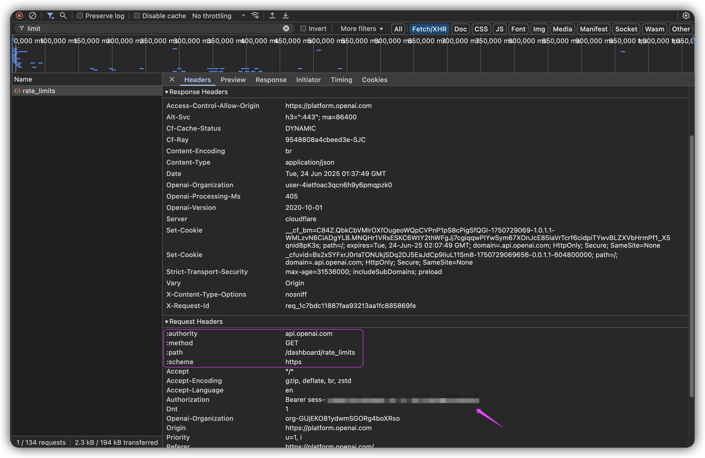

<!-- START doctoc generated TOC please keep comment here to allow auto update -->
<!-- DON'T EDIT THIS SECTION, INSTEAD RE-RUN doctoc TO UPDATE -->

- [chat tool](#chat-tool)
- [chatgpt](#chatgpt)
  - [model](#model)
  - [API](#api)
    - [get authorization key](#get-authorization-key)
    - [model](#model-1)
    - [model_limits](#model_limits)
    - [rate_limits](#rate_limits)
  - [Administration API](#administration-api)
    - [admin key](#admin-key)
    - [organization id](#organization-id)
    - [group id](#group-id)
  - [using chatgpt to generate git commits](#using-chatgpt-to-generate-git-commits)
  - [using chatgpt to review git diff](#using-chatgpt-to-review-git-diff)
- [RAG](#rag)
- [tips](#tips)
  - [chatgpt](#chatgpt-1)

<!-- END doctoc generated TOC please keep comment here to allow auto update -->

> [!NOTE|label:references:]
> - [Introduction to Generative AI](https://blog.bytebytego.com/i/149084835/introduction-to-generative-ai)

# chat tool

> [!NOTE|label:references:]
> - [如何在 Chatbox 中接入 SiliconCloud - 超简单完整教程](https://bennhuang.com/posts/chatbox-siliconcloud-integration-guide/)


# chatgpt

## model

> [!NOTE|label:references:]
> - [token limits](https://platform.openai.com/settings/organization/limits)


| MODEL NAME        | MAX CONTEXT |
|-------------------|-------------|
| gpt-3.5-turbo-16k | 16,384      |
| gpt-4-32k         | 32,768      |
| gpt-4-turbo       | 128,000     |


<table><thead>
  <tr>
    <th style="text-align: center;">MODEL</th>
    <th style="text-align: center;">TOKEN LIMITS</th>
    <th style="text-align: center;">REQUEST AND OTHER LIMITS</th>
    <th style="text-align: center;">BATCH QUEUE LIMITS</th>
  </tr></thead>
<tbody>
  <tr>
    <td>gpt-3.5-turbo</td>
    <td>200,000 TPM</td>
    <td>500 RPM<br>10,000 RPD</td>
    <td>2,000,000 TPD</td>
  </tr>
  <tr>
    <td>gpt-3.5-turbo-0125</td>
    <td>200,000 TPM</td>
    <td>500 RPM<br>10,000 RPD</td>
    <td>2,000,000 TPD</td>
  </tr>
  <tr>
    <td>gpt-3.5-turbo-1106</td>
    <td>200,000 TPM</td>
    <td>500 RPM<br>10,000 RPD</td>
    <td>2,000,000 TPD</td>
  </tr>
  <tr>
    <td>gpt-3.5-turbo-16k</td>
    <td>200,000 TPM</td>
    <td>500 RPM<br>10,000 RPD</td>
    <td>2,000,000 TPD</td>
  </tr>
  <tr>
    <td>gpt-3.5-turbo-instruct</td>
    <td>90,000 TPM</td>
    <td>3,500 RPM</td>
    <td>200,000 TPD</td>
  </tr>
  <tr>
    <td>gpt-3.5-turbo-instruct-0914</td>
    <td>90,000 TPM</td>
    <td>3,500 RPM</td>
    <td>200,000 TPD</td>
  </tr>
  <tr>
    <td>gpt-4</td>
    <td>10,000 TPM</td>
    <td>500 RPM<br>10,000 RPD</td>
    <td>100,000 TPD</td>
  </tr>
  <tr>
    <td>gpt-4-0613</td>
    <td>10,000 TPM</td>
    <td>500 RPM<br>10,000 RPD</td>
    <td>100,000 TPD</td>
  </tr>
  <tr>
    <td>gpt-4-turbo<br>↪︎ gpt-4-turbo-2024-04-09<br>↪︎ gpt-4-turbo-preview<br>↪︎ gpt-4-0125-preview<br>↪︎ gpt-4-1106-preview</td>
    <td>30,000 TPM</td>
    <td>500 RPM</td>
    <td>90,000 TPD</td>
  </tr>
  <tr>
    <td>gpt-4.1<br>↪︎ gpt-4.1-2025-04-14</td>
    <td>30,000 TPM</td>
    <td>500 RPM</td>
    <td>900,000 TPD</td>
  </tr>
  <tr>
    <td>gpt-4.1 (long context)</td>
    <td>200,000 TPM</td>
    <td>100 RPM</td>
    <td>2,000,000 TPD</td>
  </tr>
  <tr>
    <td>gpt-4.1-mini<br>↪︎ gpt-4.1-mini-2025-04-14</td>
    <td>200,000 TPM</td>
    <td>500 RPM</td>
    <td>2,000,000 TPD</td>
  </tr>
  <tr>
    <td>gpt-4.1-mini (long context)</td>
    <td>400,000 TPM</td>
    <td>200 RPM</td>
    <td>4,000,000 TPD</td>
  </tr>
  <tr>
    <td>gpt-4.1-nano<br>↪︎ gpt-4.1-nano-2025-04-14</td>
    <td>200,000 TPM</td>
    <td>500 RPM</td>
    <td>2,000,000 TPD</td>
  </tr>
  <tr>
    <td>gpt-4.1-nano (long context)</td>
    <td>400,000 TPM</td>
    <td>200 RPM</td>
    <td>4,000,000 TPD</td>
  </tr>
  <tr>
    <td>gpt-4.5-preview<br>↪︎ gpt-4.5-preview-2025-02-27</td>
    <td>125,000 TPM</td>
    <td>1,000 RPM</td>
    <td>50,000 TPD</td>
  </tr>
  <tr>
    <td>gpt-4o<br>↪︎ gpt-4o-2024-05-13<br>↪︎ gpt-4o-2024-08-06<br>↪︎ gpt-4o-2024-11-20<br>↪︎ gpt-4o-audio-preview<br>↪︎ gpt-4o-audio-preview-2024-10-01<br>↪︎ gpt-4o-audio-preview-2024-12-17</td>
    <td>30,000 TPM</td>
    <td>500 RPM</td>
    <td>90,000 TPD</td>
  </tr>
  <tr>
    <td>gpt-4o-mini<br>↪︎ gpt-4o-mini-2024-07-18<br>↪︎ gpt-4o-mini-audio-preview<br>↪︎ gpt-4o-mini-audio-preview-2024-12-17</td>
    <td>200,000 TPM</td>
    <td>500 RPM<br>10,000 RPD</td>
    <td>2,000,000 TPD</td>
  </tr>
</tbody></table>


## API

> [!NOTE|label:references:]
> - [Data controls in the OpenAI platform](https://platform.openai.com/docs/guides/your-data)
> - [Models](https://platform.openai.com/docs/api-reference/models)
> - [Error codes](https://platform.openai.com/docs/guides/error-codes)

- api type

  > [!TIP|label:curl commands:]
  >> ```bash
  >> $ curl -s '${scheme}://${authority}${path}' \
  >>        -H 'Authorization: Bearer ${Authorization}' \
  >>        -H 'User-Agent: Mozilla/5.0 (Windows NT 10.0; Win64; x64)' \
  >>        -H 'Origin: https://platform.openai.com' \
  >>        -H 'Referer: https://platform.openai.com/settings/organization/limits' \
  >>        -H 'Accept: application/json' \
  >>        -H 'Content-Type: application/json'
  >> ```

| TYPE                  | EXAMPLE                                     | PUBLICLY DOCUMENTED | STABLE        | RECOMMENDED FOR AUTOMATION        |
| --------------------- | ------------------------------------------- | ------------------- | ------------- | --------------------------------- |
| **Public API**        | `/v1/chat/completions`                      | ✅ Yes              | ✅ Stable     | ✅ Yes                            |
| **Private API**       | `/dashboard/rate_limits`                    | ❌ No               | ⚠️ May change | ⚠️ For personal/internal use only |
| **Internal API**      | `/api/internal/user/settings`               | ❌ No               | ❌ Unstable   | ❌ Not recommended                |
| **Browser-bound API** | Requires session + Origin + Referer headers | ❌ No               | ⚠️ Risky      | ❌ Manual use only                |


### get authorization key

1. visit `https://platform.openai.com/settings/organization/limits`
2. <kbd>⌥</kbd> + <kbd>⌘</kbd> + <kbd>i</kbd> to open the devtools
3. open the tab `Network` → `Fetch/XHR`, and search with keyword `limit`
4. check the item one by one, untile find the one with `Authorization: Bearer sess-****************************************` header in the `Request Headers`
5. double confirm the *Response* tab has the model limits data



as long as found the correct item, check the *Request Headers* tab, it will be ( example ):

| KEY             | VALUE                    |
|:----------------|--------------------------|
| `:authority`    | `api.openai.com`         |
| `:path`         | `/dashboard/rate_limits` |
| `:method`       | `GET`                    |
| `:scheme`       | `https`                  |
| `Authorization` | `Bearer sess-xxxxxx`     |

> [!TIP|label:other APIs]
>
> | AUTHORITY        | Endpoint                                                                    | SCHEME  | METHOD |
> |------------------|-----------------------------------------------------------------------------|---------|--------|
> | `api.openai.com` | `/dashboard/billing/subscription`                                           | `https` | `GET`  |
> | `api.openai.com` | `/dashboard/rate_limits`                                                    | `https` | `GET`  |
> | `api.openai.com` | `/dashboard/user/api_keys`                                                  | `https` | `GET`  |
> | `api.openai.com` | `/dashboard/feature_flags`                                                  | `https` | `GET`  |
> | `api.openai.com` | `/v1/dashboard/organizations/<ORGANIZATION_ID>/projects/<PROJECT_ID>/users` | `https` | `GET`  |
>
> - curl API call example:
>> ```bash
>> $ curl -s '${scheme}://${authority}${path}' \
>>        -H 'Authorization: Bearer ${Authorization}' \
>>        -H 'User-Agent: Mozilla/5.0 (Windows NT 10.0; Win64; x64)' \
>>        -H 'Origin: https://platform.openai.com' \
>>        -H 'Referer: https://platform.openai.com/settings/organization/limits' \
>>        -H 'Accept: application/json' \
>>        -H 'Content-Type: application/json'
>>
>> # i.e.:
>> $ curl -s 'https://api.openai.com/dashboard/rate_limits' \
>>        -H 'Authorization: Bearer sess-xxxxxx' \
>>        -H 'User-Agent: Mozilla/5.0 (Windows NT 10.0; Win64; x64)' \
>>        -H 'Origin: https://platform.openai.com' \
>>        -H 'Referer: https://platform.openai.com/settings/organization/limits' \
>>        -H 'Accept: application/json' \
>>        -H 'Content-Type: application/json'
>> ```


### [model](https://platform.openai.com/docs/api-reference/models)
```bash
$ curl -s https://api.openai.com/v1/models \
       -H "Authorization: Bearer $OPENAI_API_KEY"

# or show in table format
$ curl -s https://api.openai.com/v1/models \
       -H "Authorization: Bearer $OPENAI_API_KEY" |
  jq -r '["CREATED AT", "MODEL ID"],
         (.data | sort_by(.created) | reverse[] | [(.created | strftime("%Y-%m-%d %H:%M:%S")), .id])
         | @tsv' |
  column -t -s$'\t'
CREATED AT           MODEL ID
2025-06-02 23:54:58  gpt-4o-audio-preview-2025-06-03
2025-06-02 23:43:58  gpt-4o-realtime-preview-2025-06-03
2025-05-08 03:00:57  codex-mini-latest
2025-04-24 17:50:30  gpt-image-1
...
```

### model_limits
```bash
$ curl -s https://api.openai.com/v1/fine_tuning/model_limits \
       -H "Authorization: Bearer ${OPENAI_API_KEY}"

# with table format
$ curl -s https://api.openai.com/v1/fine_tuning/model_limits \
       -H "Authorization: Bearer $OPENAI_API_KEY" |
  jq -r '["ID", "PENDING JOBS", "MAX PENDING JOBS", "JOBS", "MAX JOBS/DAY"],
         (.data[] | [.id, .curr_pending_jobs, .max_pending_jobs, .jobs_so_far_today, .max_jobs_per_day])
         | @tsv' |
  column -t -s$'\t'
ID                       PENDING JOBS  MAX PENDING JOBS  JOBS  MAX JOBS/DAY
gpt-3.5-turbo-0125       0             3                 0     48
gpt-3.5-turbo-1106       0             3                 0     48
gpt-4.1-2025-04-14       0             3                 0     8
gpt-4.1-mini-2025-04-14  0             6                 0     24
gpt-4.1-nano-2025-04-14  0             6                 0     24
gpt-4o-2024-08-06        0             3                 0     8
gpt-4o-mini-2024-07-18   0             5                 0     24
o4-mini-2025-04-16       0             2                 0     4

# or
$ (
    echo "model | curr pending | max pending | today jobs | max daily jobs" | tr '[:lower:]' '[:upper:]';
    curl -s https://api.openai.com/v1/fine_tuning/model_limits -H "Authorization: Bearer ${OPENAI_API_KEY}" |
      jq -r '.data[] | [.id, .curr_pending_jobs, .max_pending_jobs, .jobs_so_far_today, .max_jobs_per_day] | @tsv' |
      while IFS=$'\t' read -r model curr max today maxday; do
        echo "${model} | ${curr} | ${max} | ${today} | ${maxday}";
      done
  ) | column -t -s '|'
```

### rate_limits

> [!TIP|label:references:]
> - [rate limits in headers](https://platform.openai.com/docs/guides/rate-limits#rate-limits-in-headers)
>
> | ABBREVIATION   | DESCRIPTION          |
> |----------------|----------------------|
> | `RPM`          | Requests Per Minute  |
> | `TPM`          | Tokens Per Minute    |
> | `IPM`          | Images Per Minute    |
> | `MB/min`       | Megabytes Per Minute |
> | `BATCH_TOKENS` | Batch Tokens Per Day |
> | `RPD`          | Requests Per Day     |
> | `TPD`          | Tokens Per Day       |
>

```bash
$ curl -s https://api.openai.com/dashboard/rate_limits \
       -H 'Authorization: Bearer sess-s**************************************P' \
       -H 'User-Agent: Mozilla/5.0 (Windows NT 10.0; Win64; x64)' \
       -H 'Accept: application/json' \
       -H 'Content-Type: application/json' |
  jq -r 'to_entries |
         (["MODEL", "RPM", "TPM", "IMAGES/MIN", "AUDIO_MB/MIN", "RPD", "BATCH_TOKENS"]),
         (.[] | [
           .key,
           (.value.max_requests_per_1_minute        // "-" | if . == "-" then . else (. | tostring + " RPM") end),
           (.value.max_tokens_per_1_minute          // "-" | if . == "-" then . else (. | tostring + " TPM") end),
           (.value.max_images_per_1_minute          // "-" | if . == "-" then . else (. | tostring + " IPM") end),
           (.value.max_audio_megabytes_per_1_minute // "-" | if . == "-" then . else (. | tostring + " MB/min") end),
           (.value.max_requests_per_1_day           // "-" | if . == "-" then . else (. | tostring + " req/day") end),
           (.value.batch_1_day_max_input_tokens     // "-" | if . == "-" then . else (. | tostring + " tokens") end)
         ]) | @tsv' |
  column -t -s $'\t'
```

## [Administration API](https://platform.openai.com/docs/api-reference/administration)

### admin key

> [!TIP|label:OPENAI_ADMIN_KEY:]
> - [openai admin key](https://platform.openai.com/settings/organization/admin-keys)
> - [Admin API Keys](https://platform.openai.com/docs/api-reference/admin-api-keys)
> - [List all organization and project API keys](https://platform.openai.com/docs/api-reference/admin-api-keys/list)

```bash
# get user id, can be used for `-H "OpenAI-User: user-xxxxxxxxxxxxxxxx"`
$ curl -s https://api.openai.com/v1/organization/users \
       -H "Authorization: Bearer $OPENAI_ADMIN_KEY" \
       -H "Content-Type: application/json"

# get details of admin key
$ curl -s https://api.openai.com/v1/organization/admin_api_keys \
       -H "Authorization: Bearer ${OPENAI_ADMIN_KEY}" \
       -H "Content-Type: application/json"
```

### organization id
```bash
# get organization id, can be used for `-H "OpenAI-Organization: org-xxxxxxxxxxxxxxxx"`
$ curl -s https://api.openai.com/v1/organizations \
       -H "Authorization: Bearer sess-s**************************************P" \
       -H "Content-Type: application/json" |
  jq -r '.data[].id'
org-G**********************o

# or with ADMIN_KEY
$ curl -s https://api.openai.com/v1/organizations \
       -H "Authorization: Bearer ${OPENAI_ADMIN_KEY}" \
       -H "Content-Type: application/json" |
  jq -r '.data[].id'
org-GUjEKO81ydwmSGORg4boXRso
```

### group id

> [!TIP|label:group id:]
> - to get group id, can be used for `-H "OpenAI-Group: group-xxxxxxxxxxxxxxxx"`

```bash
# or show in table format
$ curl -s https://api.openai.com/v1/organization/projects \
       -H "Authorization: Bearer ${OPENAI_ADMIN_KEY}" \
       -H "Content-Type: application/json" |
  jq -r '["NAME", "GROUP ID"], (.data[] | [.name, .id]) | @tsv' |
  column -t -s$'\t'
NAME             GROUP ID
Default project  proj_f**********************4
marslo           proj_E**********************m

# or via organization API
$ curl -s https://api.openai.com/v1/organizations \
       -H "Authorization: Bearer ${OPENAI_ADMIN_KEY}" \
       -H "Content-Type: application/json" |
  jq -r '["NAME", "GROUP ID"], (.data[].projects.data[] | [.title, .id]) | @tsv' |
  column -t -s$'\t'
NAME             GROUP ID
Default project  proj_f**********************4
marslo           proj_E**********************m

$ curl -s https://api.openai.com/v1/organization/projects \
       -H "Authorization: Bearer ${OPENAI_ADMIN_KEY}" \
       -H "Content-Type: application/json" |
  jq -r '.data[] | select(.name == "marslo") | .id'

# or show name and id
$ curl -s https://api.openai.com/v1/organization/projects \
       -H "Authorization: Bearer ${OPENAI_ADMIN_KEY}" \
       -H "Content-Type: application/json" |
  jq -r '.data[] | "\(.name)|\(.id)"' | column -t -s'|'

```

## using chatgpt to generate git commits

<!--sec data-title="chatgpt.commit.sh" data-id="section0" data-show=true data-collapse=true ces-->
```bash
#!/usr/bin/env bash

set -euo pipefail

model="${COMMITX_MODEL:-gpt-4-1106-preview}"
temperature="${COMMITX_TEMPERATURE:-0.3}"
OPENAI_API_KEY="${OPENAI_API_KEY:? OPENAI_API_KEY not set}"
diff=$(git --no-pager diff --color=never)
prompt="Generate a Git commit message in the Conventional Commits format, with the following structure:

<type>(<scope1,scope2,...>): short summary

- detail 1
- detail 2
- ...

Use multiple scopes if the diff includes changes in multiple areas.
Use markdown-style bullet points for details.
Do not include explanations or code.
Base it on the following diff:

$diff"

declare payload
payload=$(jq -n \
  --arg model "$model" \
  --arg temp "$temperature" \
  --arg prompt "$prompt" \
  '{
    model: $model,
    temperature: ($temp | tonumber),
    messages: [
      { role: "system", content: "You are an assistant that writes Git commit messages." },
      { role: "user", content: $prompt }
    ]
  }')


curl -s https://api.openai.com/v1/chat/completions \
  -H "Authorization: Bearer $OPENAI_API_KEY" \
  -H "Content-Type: application/json" \
  -d "$payload" |
jq -r '.choices[0].message.content'

# vim:tabstop=2:softtabstop=2:shiftwidth=2:expandtab:filetype=sh
```
<!--endsec-->

## using chatgpt to review git diff
<!--sec data-title="chatgpt.review.sh" data-id="section1" data-show=true data-collapse=true ces-->
```bash
#!/usr/bin/env bash

set -euo pipefail

MODEL="${COMMITX_MODEL:-gpt-4-turbo}"
TEMPERATURE="${COMMITX_TEMPERATURE:-0.3}"
OPENAI_API_KEY="${OPENAI_API_KEY:? OPENAI_API_KEY not set}"
diff=$(git --no-pager diff --color=never)
prompt="You are a Principal Software Architect reviewing a Git diff.

You may not have the full code context, but please still provide a professional code review.

Focus on:
- What the changes are doing
- Code quality, style, naming, structure
- Potential bugs or anti-patterns
- Suggestions for improvement

Use markdown. Be helpful, concise, and insightful.

--- START DIFF ---
${diff}
--- END DIFF ---"

curl -s https://api.openai.com/v1/chat/completions \
  -H "Authorization: Bearer $OPENAI_API_KEY" \
  -H "Content-Type: application/json" \
  -d "$(jq -n \
    --arg model "$MODEL" \
    --arg temp "$TEMPERATURE" \
    --arg prompt "$prompt" \
    ' {
      model: $model,
      temperature: ($temp | tonumber),
      messages: [
        { role: "system", content: "You are a senior engineer performing code review." },
        { role: "user", content: $prompt }
      ]
    }')" |
jq -r '.choices[0].message.content'

# vim:tabstop=2:softtabstop=2:shiftwidth=2:expandtab:filetype=sh
```
<!--endsec-->

# RAG

> [!TIP]
> - [RAG - Retrieval-Augmented Generation](https://aws.amazon.com/what-is/retrieval-augmented-generation/)


# tips
## chatgpt

<!--sec data-title="create package todownload" data-id="section2" data-show=true data-collapse=true ces-->
[see details](https://chatgpt.com/c/67f07846-04f8-8010-bce9-27150bfb1382)

```bash
import os
from pathlib import Path

# Define script contents
table_script = """#!/usr/bin/env bash

# print_table.sh — CLI 表格打印工具，支持列对齐和彩色输出

_strip_ansi() {
  sed 's/\\x1B\\[[0-9;]*[mK]//g'
}

_str_length() {
  echo -e "$1" | _strip_ansi | awk '{ print length }'
}

repeat_char() {
  printf "%*s" "$2" '' | tr ' ' "$1"
}

print_table() {
  local -n _headers=$1
  local -n _rows=$2
  local -n _aligns=$3

  local cols=${#_headers[@]}
  local -a widths

  # 计算每列最大宽度
  for ((i = 0; i < cols; i++)); do
    widths[i]=$(_str_length "${_headers[i]}")
  done

  for row in "${_rows[@]}"; do
    IFS='|' read -r -a fields <<<"$row"
    for ((i = 0; i < cols; i++)); do
      len=$(_str_length "${fields[i]}")
      ((len > widths[i])) && widths[i]=$len
    done
  done

  # 打印分割线
  _print_line() {
    for ((i = 0; i < cols; i++)); do
      printf "+-%s" "$(repeat_char '-' "${widths[i]}")"
    done
    echo "+"
  }

  # 打印一行
  _print_row() {
    local -a fields=("$@")
    for ((i = 0; i < cols; i++)); do
      local raw="${fields[i]}"
      local clean=$(_str_length "$raw")
      local pad=${widths[i]}
      case "${_aligns[i]}" in
        right)
          printf "| %*s " "$pad" "$raw"
          ;;
        center)
          local left=$(( (pad - clean) / 2 ))
          local right=$(( pad - clean - left ))
          printf "| %*s%s%*s " "$left" "" "$raw" "$right" ""
          ;;
        *)
          printf "| %-*s " "$pad" "$raw"
          ;;
      esac
    done
    echo "|"
  }

  # 打印整张表格
  _print_line
  _print_row "${_headers[@]}"
  _print_line
  for row in "${_rows[@]}"; do
    IFS='|' read -r -a fields <<<"$row"
    _print_row "${fields[@]}"
  done
  _print_line
}
"""

# Define output path
output_path = Path("/mnt/data/cli-ui/print_table.sh")
output_path.parent.mkdir(parents=True, exist_ok=True)

# Save script to file
with open(output_path, "w") as f:
    f.write(table_script)

output_path.name
```
<!--endsec-->
