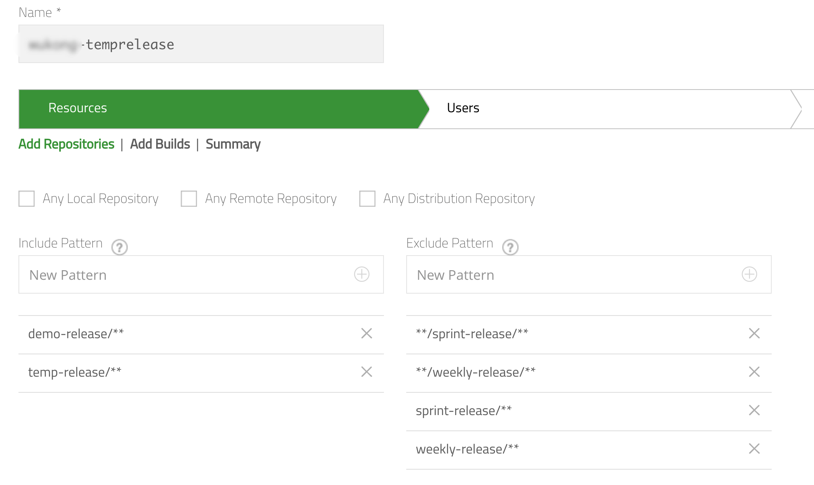

<!-- START doctoc generated TOC please keep comment here to allow auto update -->
<!-- DON'T EDIT THIS SECTION, INSTEAD RE-RUN doctoc TO UPDATE -->
**Table of Contents**  *generated with [DocToc](https://github.com/thlorenz/doctoc)*

- [reference](#reference)
  - [integration with pipeline](#integration-with-pipeline)
  - [aql](#aql)
  - [Artifactory SSL Certification](#artifactory-ssl-certification)
- [configuration](#configuration)

<!-- END doctoc generated TOC please keep comment here to allow auto update -->



> reference:
> - [How to enable verbose log on JVM Garbage Collection](https://jfrog.com/knowledge-base/how-to-enable-verbose-log-on-jvm-garbage-collection/)
>   - JAVA_OPTIONS:
>     `-verbose:gc -XX:+PrintGCDetails -XX:+PrintGCTimeStamps -Xloggc:/path/to/file/gc.log`



## reference
### integration with pipeline
> - [Scripted Pipeline Syntax](https://www.jfrog.com/confluence/display/JFROG/Scripted+Pipeline+Syntax#ScriptedPipelineSyntax-PromotingBuildsinArtifactory)
> - [Jenkins Pipeline Examples](https://github.com/jfrog/project-examples/tree/master/jenkins-examples/pipeline-examples)

### aql
#### [Jenkins Artifactory Plugin AQL download latest artifact matching pattern](https://stackoverflow.com/a/40351260/2940319)

<!--sec data-title="example" data-id="section2" data-show=true data-collapse=true ces-->
  ```powershell
  $pair = "$($art_user):$($art_pass)"
  Write-Verbose "Attempting to convert Artifactory credentials to a base64 string for automation"
  $encodedCreds = [System.Convert]::ToBase64String([System.Text.Encoding]::ASCII.GetBytes($pair))
  $basicAuthValue = "Basic $encodedCreds"
  $headers = @{
      Authorization = $basicAuthValue
  }

  Write-Host "Attempting to perform a AQL search."
  $aql_search = $art_base_url + "/api/search/aql"
  Write-Host "Building aql query with the following parameters, groupID: $group_id, artifactID: $artifact_id, version: $version, classifier: $classifier and repos: $art_generic_repokey."
  $aql_query = 'items.find({"repo":"' + $art_generic_repokey + '","$or":[{"$and":[{"path":{"$match":"' + $group_id + '/' + $artifact_id + '/' + $version + '"},"name":{"$match":"' + $artifact_id + '*' + $classifier + '*.' + $extension + '"}}]}]}).sort({"$desc":["modified"]}).limit(1)'
  Write-Host "Built the following aql query: '$aql_query' ."
  $aql_content = Invoke-RestMethod -Uri $aql_search -Headers $headers -Method Post -Body $aql_query -ContentType 'text/plain'
  Write-Host "Attempting to submit the aql query to the following artifactory server: $art_base_url."
  $aql_results = ($aql_content).results
  Write-Host "Attempting to parse query results and build the artifact download uri."
  $aql_repo,$aql_path,$aql_name = ($aql_results).repo,($aql_results).path,($aql_results).name
  $artifactDownloadUri = $art_base_url + '/' + $aql_repo + '/' + $aql_path + '/' + $aql_name
  Write-Host "Found the following uri: $artifactDownloadUri !!"

  if ($artifactMimeType  -eq 'application/zip' -or $extension -eq 'zip') {
      Write-Verbose "Attempting to save the artifact to $download_dir/$art_dist_name.zip"
      Invoke-RestMethod -Uri $artifactDownloadUri -Headers $headers -OutFile "$download_dir/$art_dist_name.zip"
  }
  ```
<!--endsec-->

### Artifactory SSL Certification
> - [ARTIFACTORY: How to Resolve an “unable to find valid certification path to requested target” Error](https://jfrog.com/knowledge-base/how-to-resolve-unable-to-find-valid-certification-path-to-requested-target-error/)
> - [Using TLS Certificates as a Client](https://www.jfrog.com/confluence/display/JFROG/Using+TLS+Certificates+as+a+Client)
> - [Working with Certificates and SSL](https://docs.oracle.com/cd/E19830-01/819-4712/ablqw/index.html)
> - [ibook : ssl/keystore](../cheatsheet/ssl/keystore.html)

#### get remote cert
```bash
$ openssl s_client -showcerts -connect <domain.com>:<port>

#i.e.
$ echo -n |
       openssl s_client -connect <domain.com>:<port> -debug |
       sed -ne '/-BEGIN CERTIFICATE-/,/-END CERTIFICATE-/p' > <domain>.crt
# or
$ keytool -printcert \
          -rfc \
          -sslserver <domain.com>:<port> > <domain>.crt
# or
# https://www.howtouselinux.com/post/openssl-command-to-generate-view-check-certificate
$ echo -n |
       openssl s_client \
              [-servername <domain.com>] \
              -connect <domain.com>:<port> 2>/dev/null |
       openssl x509
```


if `issue (i:)` is the same as `subject (s:)`. Therefore, this is the root certificat.
i.e. :


```bash
$ openssl s_client -connect cdn.redhat.com:443 -showcerts < /dev/null
Certificate chain
 0 s:C = US, ST = North Carolina, O = "Red Hat, Inc.", OU = Red Hat Network, CN = cdn.redhat.com
   i:C = US, ST = North Carolina, O = "Red Hat, Inc.", OU = Red Hat Network, CN = Red Hat Entitlement Operations Authority, emailAddress = ca-support@redhat.com
-----BEGIN CERTIFICATE-----
...
-----END CERTIFICATE-----
 1 s:C = US, ST = North Carolina, O = "Red Hat, Inc.", OU = Red Hat Network, CN = Red Hat Entitlement Operations Authority, emailAddress = ca-support@redhat.com
   i:C = US, ST = North Carolina, L = Raleigh, O = "Red Hat, Inc.", OU = Red Hat Network, CN = Entitlement Master CA, emailAddress = ca-support@redhat.com
-----BEGIN CERTIFICATE-----
...
-----END CERTIFICATE-----
 2 s:C = US, ST = North Carolina, L = Raleigh, O = "Red Hat, Inc.", OU = Red Hat Network, CN = Entitlement Master CA, emailAddress = ca-support@redhat.com
   i:C = US, ST = North Carolina, L = Raleigh, O = "Red Hat, Inc.", OU = Red Hat Network, CN = Entitlement Master CA, emailAddress = ca-support@redhat.com
-----BEGIN CERTIFICATE-----
...
-----END CERTIFICATE-----
```

#### import to truststore
```bash
$ sudo keytool -importcert \
               -keystore /usr/local/java/jdk1.8.0_60/jre/lib/security/cacerts \
               -storepass changeit \
               -file <domain>.crt \
               -alias "<domain>-crt"
```

## configuration
### allow partial folder in particular repo


### [access token](https://jfrog.com/help/r/jfrog-platform-administration-documentation/access-tokens)
#### [generating expirable tokens](https://jfrog.com/help/r/jfrog-platform-administration-documentation/generating-expirable-tokens)
- from version 7.21.1, this can be specified by setting the `token.max-expiry` parameter in the `$JFROG_HOME/artifactory/var/etc/artifactory/access.config.yml` file ( prior to version 7.21.1, the parameter to set was `artifactory.access.token.non.admin.max.expires.in` ).
- if the `token.max-expiry` is equal to 0 (which is the default), there is no limitation to the token expiry. However, if the maximum expiry is greater than 0, the user cannot create a non-expirable token.
- the `token.max-expiry` parameter must be set to a value higher than the `token.default-expiry` parameter value.
