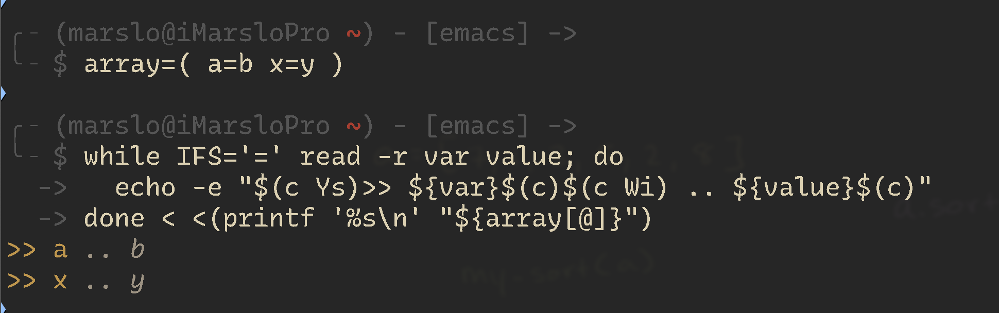

<!-- START doctoc generated TOC please keep comment here to allow auto update -->
<!-- DON'T EDIT THIS SECTION, INSTEAD RE-RUN doctoc TO UPDATE -->

- [fancy bash](#fancy-bash)
- [alias](#alias)
  - [`bash -<parameter>`](#bash--parameter)
- [array](#array)
  - [sort array](#sort-array)
- [shell expansions](#shell-expansions)
  - [IFS](#ifs)
  - [word splitting](#word-splitting)
  - [filename expansion](#filename-expansion)
- [quoting](#quoting)
- [ternary arithmetic](#ternary-arithmetic)
- [brace expansion](#brace-expansion)
  - [segmented continuous](#segmented-continuous)
  - [scp multipule folder/file to target server](#scp-multipule-folderfile-to-target-server)
  - [all about {curly braces} in bash](#all-about-curly-braces-in-bash)
  - [fast copy or moving or something (detials -> brace expansion)](#fast-copy-or-moving-or-something-detials---brace-expansion)
  - [multiple directories creation](#multiple-directories-creation)
  - [copy single file to multipule folders](#copy-single-file-to-multipule-folders)
- [pipe and stdin](#pipe-and-stdin)
  - [trim and assign](#trim-and-assign)
  - [read stdin from pipe](#read-stdin-from-pipe)
  - [`read -r var` ( for `command | trim` )](#read--r-var--for-command--trim-)
- [event designators](#event-designators)
  - [word designators](#word-designators)
- [tilde expansion](#tilde-expansion)
- [special parameters](#special-parameters)

<!-- END doctoc generated TOC please keep comment here to allow auto update -->

> [!NOTE]
> references:
> - [Bash scripting cheatsheet](https://devhints.io/bash)

## fancy bash

> [!NOTE]
> - [ohmybash/oh-my-bash](https://github.com/ohmybash/oh-my-bash)
> - [Bash-it/bash-it](https://github.com/Bash-it/bash-it?tab=readme-ov-file)
> - [akinomyoga/ble.sh](https://github.com/akinomyoga/ble.sh)

## [alias](https://askubuntu.com/a/871435)
```bash
$ echo ${BASH_ALIASES[ls]}
ls --color=always
```

### [`bash -<parameter>`](https://unix.stackexchange.com/a/38363/29178)
- get bash login log ( for rc script debug )
  ```bash
  $ bash -l -v
  ```

- run with only one startup file ( for sharing accounts )
  ```bash
  $ bash -i --rcfile="$HOME/.marslo/.imarslo"
  ```

## array

> [!NOTE|label:references:]
> - [Introduction to Bash Array](https://www.baeldung.com/linux/bash-array)
> - [Bash For Loop Array: Iterate Through Array Values](https://www.cyberciti.biz/faq/bash-for-loop-array/)
>   ```bash
>   $ declare -A foo=(
>                      ["one"]="apple"
>                      ["two"]="orange"
>                      ["three"]="banana"
>                    )
>
>   # show keys
>   $ echo ${!foo[@]}
>   two three one
>
>   # show values
>   $ echo ${foo[@]}
>   orange banana apple
>   ```

### sort array

> [!NOTE|label:references:]
> - sample array:
>   ```bash
>   declare -A authors
>   declare -i i=0
>   for ((r = 0; r <= 255; r+=40)); do
>     authors[$i]+="$r";
>     (( i++ ));
>   done
>
>   # output
>   $ for k in "${!authors[@]}"; do echo "$k  -  ${authors["$k"]}"; done
>   6  -  240
>   5  -  200
>   4  -  160
>   3  -  120
>   2  -  80
>   1  -  40
>   0  -  0
>   ```

- sort array by key

  > [!TIP]
  > !! highly recommend !!

  ```bash
  $ for key in $(echo ${!authors[@]} | tr ' ' '\n' | sort -n); do
    echo $key - ${authors[$key]};
  done
  0 - 0
  1 - 40
  2 - 80
  3 - 120
  4 - 160
  5 - 200
  6 - 240
  ```

- [or]()
  ```bash
  $ printf "%s\n" "${!authors[@]}" | sort -n | while read -r key; do
    echo $key - ${authors[$key]};
  done
  0 - 0
  1 - 40
  2 - 80
  3 - 120
  4 - 160
  5 - 200
  6 - 240
  ```

- [or sort after for loop](https://stackoverflow.com/a/8217375/2940319)
  ```bash
  $ for k in "${!authors[@]}"; do
    echo "$k  -  ${authors["$k"]}";
  done | sort -n
  0  -  0
  1  -  40
  2  -  80
  3  -  120
  4  -  160
  5  -  200
  6  -  240
  ```

- [or using IFS to sort key before loop](https://stackoverflow.com/questions/8217049/bash-associative-array-sorting-by-value#comment130445438_12681596)
  ```bash
  authors_indexes=( ${!authors[@]} )
  oIFS="$IFS" IFS=$'\n' authors_sorted=( $( printf '%s\n' "${!authors[@]}" | sort ) ) IFS="$oIFS"

  for k in "${!authors_sorted[@]}"; do
    echo "$k  -  ${authors["$k"]}"
  done

  # result
  0  -  0
  1  -  40
  2  -  80
  3  -  120
  4  -  160
  5  -  200
  6  -  240
  ```


## [shell expansions](https://www.gnu.org/software/bash/manual/html_node/shell-expansions.html#shell-expansions)


> references:
> - [Bash Reference Manual](https://www.gnu.org/software/bash/manual/html_node/index.html#SEC_Contents)
> - [Bash Reference Manual ZH](https://yiyibooks.cn/Phiix/bash_reference_manual/bash%E5%8F%82%E8%80%83%E6%96%87%E6%A1%A3.html)
>   - [Brace Expansion](https://www.gnu.org/software/bash/manual/html_node/Brace-Expansion.html)
>   - [Tilde Expansion](https://www.gnu.org/software/bash/manual/html_node/Tilde-Expansion.html)
>   - [Shell Parameter Expansion](https://www.gnu.org/software/bash/manual/html_node/Shell-Parameter-Expansion.html)
>   - [Command Substitution](https://www.gnu.org/software/bash/manual/html_node/Command-Substitution.html)
>   - [Arithmetic Expansion](https://www.gnu.org/software/bash/manual/html_node/Arithmetic-Expansion.html)
>   - [Process Substitution](https://www.gnu.org/software/bash/manual/html_node/Process-Substitution.html)
>   - [Word Splitting](https://www.gnu.org/software/bash/manual/html_node/Word-Splitting.html)
>   - [Filename Expansion](https://www.gnu.org/software/bash/manual/html_node/Filename-Expansion.html)
>     - [Pattern Matching](https://www.gnu.org/software/bash/manual/html_node/Pattern-Matching.html)
>   - [Quote Removal](https://www.gnu.org/software/bash/manual/html_node/Quote-Removal.html)
> - [Parameter expansion](https://wiki.bash-hackers.org/syntax/pe#substring_removal)
>
> - and:
>   - [The Set Builtin](https://www.gnu.org/software/bash/manual/html_node/The-Set-Builtin.html)
>   - [The Shopt Builtin](https://www.gnu.org/software/bash/manual/html_node/The-Shopt-Builtin.html)
>
> - and
>   - [Bash Guide for Beginners](https://tldp.org/LDP/Bash-Beginners-Guide/html/index.html)
>     - [Chapter 3. The Bash environment](https://tldp.org/LDP/Bash-Beginners-Guide/html/sect_03_02.html)


|            NAME           | EXAMPLE                                     |
|:-------------------------:|---------------------------------------------|
|      Brace Expansion      | `echo a{d,c,b}e`                            |
|      Tilde Expansion      | `~`                                         |
| Shell Parameter Expansion | `string=01234567890abc; echo ${string:7:2}` |
|    Command Substitution   | `$(command)` or <code>`command`</code>      |
|    Arithmetic Expansion   | `$(( expression ))`                         |
|    Process Substitution   | `<(list)` or `>(list)`                      |
|       Word Splitting      | `$IFS`                                      |
|     Filename Expansion    | `*`, `?` , `[..]`,...                       |

### IFS

> [!NOTE]
> - [bash read command splits line into words using space as delimiter even though space is not in IFS](https://stackoverflow.com/a/25836343/2940319)
> - [Bash/KSH: Define Delimiter (IFS) While Using read Command](https://www.cyberciti.biz/faq/unix-linux-bash-while-read-function-define-ifs-delimiter/)

```bash
# default IFS
$ echo "${IFS@Q}"
$' \t\n'

$ echo "$IFS" | od -tcx1
0000000      \t  \n  \n
         20  09  0a  0a
0000004

$ echo -n "$IFS" | od -tcx1
0000000      \t  \n
         20  09  0a
0000003

# i.e.:
$ read a b c <<< "foo bar baz"; echo $a - $b - $c
foo - bar - baz
```

- or
  ```bash
  $ cat -c -etv <<<"$IFS"
   ^I$
  $

  $ printf "%s" "$IFS" | od -to1 -vtc
  0000000 040 011 012
               \t  \n
  0000003
  ```

- example
  ```bash
  $ IFS=' ' read -p 'Enter your first and last name : ' first last; echo ">> hello $first $last"
  Enter your first and last name : marslo jiao
  >> hello marslo jiao

  # read from array
  $ foo=( x=y a=b )
  $ while IFS='=' read -r var value; do echo "$var >> $value"; done < <(printf '%s\n' "${foo[@]}")
  x >> y
  a >> b
  ```

  

### [word splitting](https://www.gnu.org/software/bash/manual/html_node/Word-Splitting.html)

```bash
# due to 7 fields are spitted via `:` in /etc/passwd
IFS=':' read f1 f2 f3 f4 f5 f6 f7 < /etc/passwd
```

### [filename expansion](https://www.gnu.org/software/bash/manual/html_node/Filename-Expansion.html)
> Bash scans each word for the characters `'*'`, `'?'`, and `'['`, unless the `-f` (`set -f`) option has been set

| CONDITION                             | RESULT                                                                                               |
|---------------------------------------|------------------------------------------------------------------------------------------------------|
| match found && `nullglob` disabled    | the word is regarded as a pattern                                                                    |
| no match found && `nullglob` disabled | the word is left unchanged                                                                           |
| no match found && `nullglob` set      | the word is removed                                                                                  |
| no match found && `failglob` set      | show error msg and cmd won't be exectued                                                             |
| `nocaseglob` enabled                  | patten match case insensitive                                                                        |
| `set -o noglob` or `set -f`           | `*` will not be expanded                                                                             |
| `shopt -s dotglob`                    | `*` will including all `.*`. see [zip package with dot-file](../good.html#zip-package-with-dot-file) |


## [quoting](https://www.gnu.org/software/bash/manual/html_node/quoting.html#quoting)
> - [Difference between single and double quotes in Bash](https://stackoverflow.com/a/42082956/2940319)
> - [ANSI-C quoting with $'' - GNU Bash Manual](https://www.gnu.org/software/bash/manual/html_node/ANSI_002dC-Quoting.html)
> - [Locale translation with $"" - GNU Bash Manual](https://www.gnu.org/software/bash/manual/html_node/Locale-Translation.html#Locale-Translation)
> - [A three-point formula for quotes](https://stackoverflow.com/a/42104627/6862601)


sample:
```bash
a=apple      # a simple variable
arr=(apple)  # an indexed array with a single element
```


| #    | Expression                 | Result                  | Comments                                                                                           |
| :--: | :------------------------: | ----------------------- | ---------------------------------------------------------------------------------                  |
| 1    | `"$a"`                     | `apple`                 | variables are expanded inside `""`                                                                 |
| 2    | `'$a'`                     | `$a`                    | variables are not expanded inside `''`                                                             |
| 3    | `"'$a'"`                   | `'apple'`               | `''` has no special meaning inside `""`                                                            |
| 4    | `'"$a"'`                   | `"$a"`                  | `""` is treated literally inside `''`                                                              |
| 5    | `'\''`                     | invalid                 | can not escape a `'` within `''`; use `"'"` or `$'\''` (ANSI-C quoting)                            |
| 6    | `"red$arocks"`             | `red`                   | `$arocks` does not expand `$a`; use `${a}rocks` to preserve `$a`                                   |
| 7    | `"redapple$"`              | `redapple$`             | `$` followed by no variable name evaluates to `$`                                                  |
| 8    | `'\"'`                     | `\"`                    | `\` has no special meaning inside `''`                                                             |
| 9    | `"\'"`                     | `\'`                    | `\'` is interpreted inside `""` but has no significance for '                                      |
| 10   | `"\""`                     | `"`                     | `\"` is interpreted inside `""`                                                                    |
| 11   | `"*"`                      | `*`                     | glob does not work inside `""` or `''`                                                             |
| 12   | `"\t\n"`                   | `\t\n`                  | `\t` and `\n` have no special meaning inside `""` or `''`; use ANSI-C quoting                      |
| 13   | <code>"`echo hi`"</code>   | `hi`                    | <code>``</code> and `$()` are evaluated inside `""` (backquotes are retained in actual output)     |
| 14   | <code>'`echo hi`'</code>   | <code>echo` hi</code>   | <code>``</code> and `$()` are not evaluated inside `''` (backquotes are retained in actual output) |
| 15   | `'${arr[0]}'`              | `${arr[0]}`             | array access not possible inside `''`                                                              |
| 16   | `"${arr[0]}"`              | `apple`                 | array access works inside `""`                                                                     |
| 17   | `$'$a\''`                  | `$a'`                   | single quotes can be escaped inside ANSI-C quoting                                                 |
| 18   | `"$'\t'"`                  | `$'\t'`                 | ANSI-C quoting is not interpreted inside `""`                                                      |
| 19   | `'!cmd'`                   | `!cmd`                  | history expansion character `'!'` is ignored inside `''`                                           |
| 20   | `"!cmd"`                   | `cmd` args              | expands to the most recent command matching `"cmd"`                                                |
| 21   | `$'!cmd'`                  | `!cmd`                  | history expansion character `'!'` is ignored inside ANSI-C quotes                                  |

## ternary arithmetic

> [!NOTE]
> - [Shell Scripting Ternary operator to get string result](https://stackoverflow.com/q/48041845/2940319)

- string
  ```bash
  $ [[ '.' = '.' ]] && path='.' || path='--'
  $ echo $path
  .

  $ [[ '.' = '-' ]] && path='.' || path='--'
  $ echo $path
  --
  ```
- mathematical operation
  ```bash
  $ (( 3 == 3 ? (var=1) : (var=0) ))
  $ echo $var
  1

  $ (( 3 == 1 ? (var=1) : (var=0) ))
  $ echo $var
  0
  ```

## [brace expansion](https://www.gnu.org/software/bash/manual/html_node/brace-expansion.html)
### [segmented continuous](https://stackoverflow.com/a/44429171/2940319)
```bash
# exclude 7 from 1-10
$ echo test-{{1..6},{8..10}}
test-1 test-2 test-3 test-4 test-5 test-6 test-8 test-9 test-10
```

### scp multipule folder/file to target server
```bash
$ scp -r $(echo dir{1..10}) user@target.server:/target/server/path/
```

### [all about {curly braces} in bash](https://www.linux.com/tutorials/all-about-curly-braces-bash/)
```bash
$ echo 00{1..9} 0{10..99} 100
001 002 003 004 005 006 007 008 009 010 011 012 013 014 015 016 017 018 019 020 021 022 023 024 025 026 027 028 029 030 031 032 033 034 035 036 037 038 039 040 041 042 043 044 045 046 047 048 049 050 051 052 053 054 055 056 057 058 059 060 061 062 063 064 065 066 067 068 069 070 071 072 073 074 075 076 077 078 079 080 081 082 083 084 085 086 087 088 089 090 091 092 093 094 095 096 097 098 099 100

$ dec2bin=({0..1}{0..1}{0..1}{0..1}{0..1}{0..1}{0..1}{0..1})
$ echo ${dec2bin[1]}
00000001
$ echo ${dec2bin[0]}
00000000
$ echo ${dec2bin[255]}
11111111

$ month=("Jan" "Feb" "Mar" "Apr" "May" "Jun" "Jul" "Aug" "Sep" "Oct" "Nov" "Dec")
$ echo ${month[5]}
Jun

$ echo {10..0..2}
10 8 6 4 2 0
$ echo {1..100..3}
1 4 7 10 13 16 19 22 25 28 31 34 37 40 43 46 49 52 55 58 61 64 67 70 73 76 79 82 85 88 91 94 97 100
```

### fast copy or moving or something ([detials](http://www.manpager.com/linux/man1/bash.1.html) -> brace expansion)
- example 1:
  ```bash
  $ ls | grep foo
  $ touch foo{1,2,3}
  $ ls | grep foo
  foo1
  foo2
  foo3
  ```
- example 2
  ```bash
  $ ls | grep foo
  $ touch foo-{a..d}
  $ ls | grep foo
  foo-a
  foo-b
  foo-c
  foo-d
  ```

- example 3
  ```bash
  $ ls foo-*
  foo-a  foo-b  foo-c  foo-d
  $ mv foo-{a,}
  $ ls foo-*
  foo-a  foo-b  foo-c  foo-d
  ```

- example 4
  ```bash
  $ mkdir -p test/{a,b,c,d}
  $ tree test/
  test/
  ├── a
  ├── b
  ├── c
  └── d

  4 directories, 0 files
  ```

### multiple directories creation
```bash
$ mkdir sa{1..50}
$ mkdir -p sa{1..50}/sax{1..50}
$ mkdir {a-z}12345
$ mkdir {1,2,3}
$ mkdir test{01..10}
$ mkdir -p `date '+%y%m%d'`/{1,2,3}
$ mkdir -p $USER/{1,2,3}
```

### copy single file to multipule folders
```bash
$ echo dir1 dir2 dir3 | xargs -n 1 cp file1

# or
$ echo dir{1..10} | xargs -n 1 cp file1
```

## pipe and stdin

### [trim and assign](https://stackoverflow.com/a/10527046/2940319)
-  to multiple variables
  ```bash
  $ IFS=' ,' read -r x y z <<< "255, 100, 147"
  $ echo "x - $x; y - $y; z - $z"
  x - 255; y - 100; z - 147
  ```

- to array
  ```bash
  $ IFS=' ,' read -r -a arr <<< "255, 100, 147"
  $ echo "0 - ${arr[0]}; 1 - ${arr[1]}; 2 - ${arr[2]}"
  0 - 255; 1 - 100; 2 - 147
  ```

- every single char to array including spaces

  > [!TIP]
  > - tricky of sed
  >   ```bash
  >   $ echo "255, 100, 147" | sed $'s/./&\v/g'
  >   2
  >    5
  >     5
  >      ,
  >
  >        1
  >         0
  >          0
  >           ,
  >
  >             1
  >              4
  >               7
  >   ```

  ```bash
  $ IFS=$'\v' read -ra arr <<<"$(echo "255, 100, 147" | sed $'s/./&\v/g')"
  $ for k in "${!arr[@]}"; do echo "$k -- ${arr[$k]}"; done
  0 -- 2
  1 -- 5
  2 -- 5
  3 -- ,
  4 --
  5 -- 1
  6 -- 0
  7 -- 0
  8 -- ,
  9 --
  10 -- 1
  11 -- 4
  12 -- 7

  # or using printf
  $ for k in "${!arr[@]}"; do printf "%02s - %s;\n" "$k" "${arr[$k]}"; done
  00 - 2;
  01 - 5;
  02 - 5;
  03 - ,;
  04 -  ;
  05 - 1;
  06 - 0;
  07 - 0;
  08 - ,;
  09 -  ;
  10 - 1;
  11 - 4;
  12 - 7;
  ```

### read stdin from pipe


> references:
> - [How to read mutliline input from stdin into variable and how to print one out in shell(sh,bash)?](https://stackoverflow.com/q/212965/2940319)
>   - [`read`](https://stackoverflow.com/a/69184102/2940319)
>   - [`/dev/stdin`](https://stackoverflow.com/a/47343371/2940319)
>   - [`cat`](https://stackoverflow.com/a/212987/2940319)
>   - [`tee`](https://stackoverflow.com/a/22064369/2940319)
> - [In a bash function, how do I get stdin into a variable](https://stackoverflow.com/a/65065987/2940319)
> - [TIL: Reading stdin to a BASH variable](https://dev.to/jeremyckahn/til-reading-stdin-to-a-bash-variable-1kln)
> - [Pipe Output to Bash Function](https://www.baeldung.com/linux/pipe-output-to-function)
> - [Guide to Stream Redirections in Linux](https://www.baeldung.com/linux/stream-redirections)
> - [Bash: Assign output of pipe to a variable](https://unix.stackexchange.com/q/338000/29178)
> - [read](https://ss64.com/bash/read.html)
> - [How To Use The Bash read Command](https://phoenixnap.com/kb/bash-read)
> - [$IFS](https://bash.cyberciti.biz/guide/$IFS)
>   ```bash
>   IFS Effect On The Values of "$@" And "$*":
>   $@ and $* are special command line arguments shell variables.
>   The $@ holds list of all arguments passed to the script.
>   The $* holds list of all arguments passed to the script.
>   ```


> [!TIP]
> ```bash
> # with IFS
> $ echo '   hello  world   ' | { IFS='' read msg; echo "${msg}"; } | tr ' ' '.'
> ...hello..world...
> $ echo '   hello  world   ' | { IFS='' read msg; echo "${msg}" | sed -e 's/^[[:blank:]]*//;s/[[:blank:]]*$//'; } | tr ' ' '.'
> hello..world
>
> # without IFS
> $ echo '   hello  world   ' | { read msg; echo "${msg}"; } | tr ' ' '.'
> hello..world
> ```

### `read -r var` ( for `command | trim` )
- script as command line
  ```bash
  $ cat trim.sh
  #!/usr/bin/env bash

  trim() {
    echo "$@" | sed -e 's/^[[:blank:]]*//;s/[[:blank:]]*$//'
  }

  IFS='' read -r myvar
  trim "${myvar}"
  ```

  - result
    ```bash
    $ IFS=''
    $ s='   aa  bb   '
    $ echo "${s}" | tr ' ' '.'                                              # ...aa..bb...
    $ echo "${s}" | ./trim.sh | tr ' ' '.'                                  # aa..bb
    $ echo " a | b | c " | awk -F'|' '{print $2}' | tr ' ' '.'              # .b.
    $ echo " a | b | c " | awk -F'|' '{print $2}' | ./trim.sh | tr ' ' '.'  # b
    ```

- running inside the script
  ```bash
  $ cat example.sh
  #!/usr/bin/env bash

  trim() {
    IFS='' read -r str
    echo "${str}" | sed -e 's/^[[:blank:]]*//;s/[[:blank:]]*$//'
  }

  s='   aa  bb   '
  echo "${s}" | tr ' ' '.'
  echo "${s}" | trim | tr ' ' '.'
  ```
  - result
    ```bash
    $ ./example.sh
    ...aa..bb...
    aa..bb
    ```

- [another trim solution for leading and trailing spaces](https://stackoverflow.com/a/3352015/2940319)
  ```bash
  trim() {
    local var="$*"
    var="${var#"${var%%[![:space:]]*}"}"        # remove leading whitespace characters
    var="${var%"${var##*[![:space:]]}"}"        # remove trailing whitespace characters
    printf '%s' "$var"
  }
  ```

## [event designators](https://www.gnu.org/software/bash/manual/html_node/event-designators.html)

|        option       | expression                                                                                               |
|:-------------------:|----------------------------------------------------------------------------------------------------------|
|         `!`         | start a history substitution                                                                             |
|         `!n`        | refer to command line n                                                                                  |
|        `!-n`        | refer to the command n lines back                                                                        |
|         `!!`        | refer to the previous command                                                                            |
|      `!string`      | refer to the most recent command preceding the current position in the history list starting with string |
|    `!?string[?]`    | refer to the most recent command preceding the current position in the history list containing string.   |
| `^string1^string2^` | `!!:s^string1^string2^` <br> quick substitution. repeat the last command, replacing string1 with string2 |
|         `!#`        | the entire command line typed so far                                                                     |

### [word designators](https://www.gnu.org/software/bash/manual/html_node/word-designators.html)

|     option     | expression                                                                             |
|:--------------:|----------------------------------------------------------------------------------------|
|      `!!`      | designates the preceding command                                                       |
| `!!:$` or `!$` | designates the last argument of the preceding command                                  |
|     `!fi:2`    | designates the second argument of the most recent command starting with the letters fi |



**`$_` VS. `!$`**

> reference:
> - [Understand the meaning of `$_`](https://unix.stackexchange.com/a/280557/29178)

-`$_`
  - [bash variables](https://www.gnu.org/software/bash/manual/html_node/Bash-Variables.html)
  - if the invoking application doesn't pass a _ environment variable, the invoked bash shell will initialise $_ to the argv[0] it receives itself which could be bash
  - i.e.
    ```bash
    $ env | grep '^_='
    _=/usr/local/opt/coreutils/libexec/gnubin/env

    # or
    $ env bash -c 'echo "$_"'
    /usr/local/opt/coreutils/libexec/gnubin/env
    ```
- `!$`
  - [Word Designators](https://www.gnu.org/software/bash/manual/html_node/Word-Designators.html)
  - equal to `!!:$`


## [tilde expansion](https://www.gnu.org/software/bash/manual/html_node/Tilde-Expansion.html)

| CHARACTER | DEFINITION | EXAMPLE              |
| --------- | ---------- | -------------------- |
| `~`       | `$HOME`    | `~/foo`: `$HOME/foo` |
| `~+`      | `$PWD`     | `~+/foo`: `$PWD/foo` |
| `~N`      | `dirs +N`  | -                    |
| `~+N`     | `dirs +N`  | -                    |
| `~-N`     | `dirs -N`  | -                    |

```bash
# prepare
$ mkdir -p a/b/c/d
$ cd a && pushd .
$ cd b && pushd .
$ cd c && pushd .
$ cd d && pushd .

# result
$ dirs -v
 0  ~/a/b/c/d
 1  ~/a/b/c/d
 2  ~/a/b/c
 3  ~/a/b
 4  ~/a

$ echo $(dirs -1)
~/a/b
$ echo $(dirs -2)
~/a/b/c
$ echo $(dirs -3)
~/a/b/c/d
```

## [special parameters](https://tldp.org/LDP/Bash-Beginners-Guide/html/sect_03_02.html)

| CHARACTER | DEFINITION                                                                                                                                                                                                                                                                                                                                                                                                                                     |
|:---------:|------------------------------------------------------------------------------------------------------------------------------------------------------------------------------------------------------------------------------------------------------------------------------------------------------------------------------------------------------------------------------------------------------------------------------------------------|
|    `$*`   | expands to the positional parameters, starting from one. when the expansion occurs within double quotes, it expands to a single word with the value of each parameter separated by the first character of the ifs special variable.                                                                                                                                                                                                            |
|    `$@`   | expands to the positional parameters, starting from one. when the expansion occurs within double quotes, each parameter expands to a separate word.                                                                                                                                                                                                                                                                                            |
|    `$#`   | expands to the number of positional parameters in decimal.                                                                                                                                                                                                                                                                                                                                                                                     |
|    `$?`   | expands to the exit status of the most recently executed foreground pipeline.                                                                                                                                                                                                                                                                                                                                                                  |
|    `$-`   | a hyphen expands to the current option flags as specified upon invocation, by the set built-in command, or those set by the shell itself (such as the -i).                                                                                                                                                                                                                                                                                     |
|    `$$`   | expands to the process id of the shell.                                                                                                                                                                                                                                                                                                                                                                                                        |
|    `$!`   | expands to the process id of the most recently executed background (asynchronous) command.                                                                                                                                                                                                                                                                                                                                                     |
|    `$0`   | expands to the name of the shell or shell script.                                                                                                                                                                                                                                                                                                                                                                                              |
|    `$_`   | the underscore variable is set at shell startup and contains the absolute file name of the shell or script being executed as passed in the argument list. <br>subsequently, it expands to the last argument to the previous command, after expansion. it is also set to the full pathname of each command executed and placed in the environment exported to that command. when checking mail, this parameter holds the name of the mail file. |


**`$*` vs. `$@`**:
- The implementation of `"$*"` has always been a problem and realistically should have been replaced with the behavior of `"$@"`.
- In almost every case where coders use `"$*"`, they mean `"$@"`.
- `"$*"` Can cause bugs and even security holes in your software.

