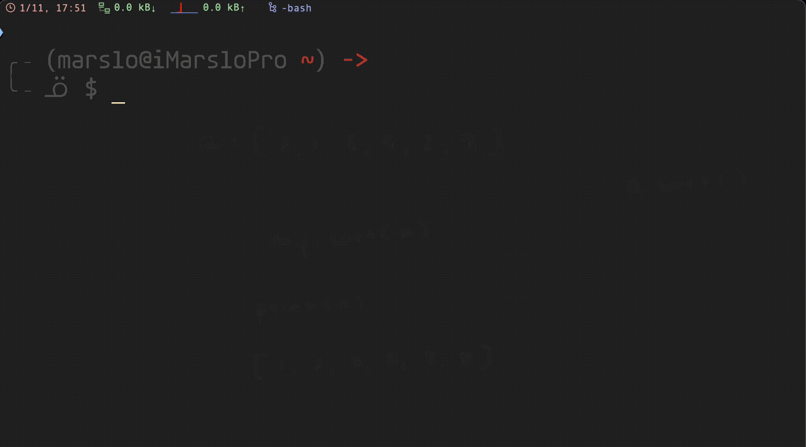
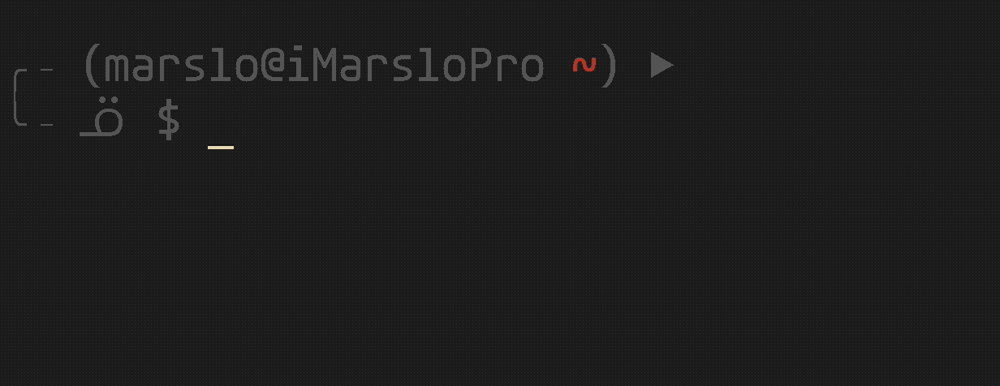
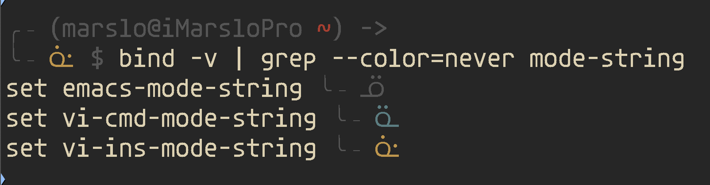

<!-- START doctoc generated TOC please keep comment here to allow auto update -->
<!-- DON'T EDIT THIS SECTION, INSTEAD RE-RUN doctoc TO UPDATE -->

- [eval](#eval)
- [set](#set)
  - [show current status](#show-current-status)
  - [option name](#option-name)
- [shopt](#shopt)
  - [options](#options)
  - [examples](#examples)
- [readline && bind](#readline--bind)
  - [vi mode](#vi-mode)
  - [hybrid mode](#hybrid-mode)
  - [show-mode-in-prompt](#show-mode-in-prompt)
  - [show options](#show-options)
  - [key bindings](#key-bindings)
  - [list all names](#list-all-names)
  - [`inputrc`](#inputrc)
  - [unbind](#unbind)
  - [tips](#tips)

<!-- END doctoc generated TOC please keep comment here to allow auto update -->


> [!TIP|label:references:]
> - [3.5.3 Shell Parameter Expansion](https://www.gnu.org/software/bash/manual/html_node/Shell-Parameter-Expansion.html)
>   - [How can I use variable variables (indirect variables, pointers, references) or associative arrays?](http://mywiki.wooledge.org/BashFAQ/006)
>   - [risk](https://stackoverflow.com/a/55331060/2940319)
>   - [Eval command and security issues](http://mywiki.wooledge.org/BashFAQ/048)

## eval


**eval** — **construct command by concatenating arguments**

**reference**:
> - [Bash eval command](https://linuxhint.com/bash_eval_command/)
> - [functions / eval (source, CPAN)](https://perldoc.perl.org/functions/eval)
> - [What is the “eval” command in bash?](https://unix.stackexchange.com/a/23117/29178)


- example
  - without `eval`:
    ```bash
    $ foo='ls | less'
    $ $foo
    ls: cannot access '|': No such file or directory
    ls: cannot access 'less': No such file or directory
    ```
  - with `eval`:
    ```bash
    $ foo='ls | less'
    $ eval $foo
    Applications
    Library
    System
    Users
    ...
    ```

- example
  ```bash
  $ x=10
  $ y=x
  $ foo='$'$x
  $ echo $foo
  $x

  # with eval
  $ eval foo='$'$x         # with eval
  $ echo $foo
  10

  # or
  $ foo=\$$x
  $ eval echo $foo          # with eval
  10
  $ echo $foo
  $x
  ```

## [set](https://www.gnu.org/software/bash/manual/html_node/The-Set-Builtin.html)

> [!NOTE]
> **reference**:
> - [Writing Robust Bash Shell Scripts](https://www.davidpashley.com/articles/writing-robust-shell-scripts/)
> - [用内置的set和shopt命令来设置bash的选项](https://blog.csdn.net/tonyyong90/article/details/105606638)
> - [Bash history reuse and bang commands](https://softpanorama.org/Scripting/Shellorama/Bash_as_command_interpreter/bash_command_history_reuse.shtml)
> - [History Expansion](https://www.gnu.org/software/bash/manual/html_node/History-Interaction.html) | [Event Designators](https://www.gnu.org/software/bash/manual/html_node/Event-Designators.html#Event-Designators)
>   - `!!`: to repeat last commands
>   - `set +H` or `set +o histexpand` to disable
>   - `set -H` or `set -o histexpand` to enable
>   - more via `$ man bash | less -Ip 'Event Designators'`
>
> - **set**
>   ```
>   set [--abefhkmnptuvxBCEHPT] [-o option-name] [argument …]
>   set [+abefhkmnptuvxBCEHPT] [+o option-name] [argument …]
>   ```
>
> - example
>   ```bash
>   $ set | grep -e SHELLOPTS -e BASHOPTS
>   BASHOPTS=cdspell:checkwinsize:cmdhist:complete_fullquote:expand_aliases:extglob:extquote:force_fignore:globasciiranges:histappend:interactive_comments:login_shell:progcomp:promptvars:sourcepath
>   SHELLOPTS=braceexpand:emacs:hashall:histexpand:history:interactive-comments:monitor
>   ```
> - [Use Bash Strict Mode (Unless You Love Debugging)](http://redsymbol.net/articles/unofficial-bash-strict-mode/)


|      OPTION      | EXPLANATION                                                                                                  |
|:----------------:|--------------------------------------------------------------------------------------------------------------|
|       `-a`       | `-o allexport`                                                                                               |
|       `-b`       | cause the status of terminated background jobs to be reported immediately                                    |
|       `-e`       | `-o errexit`<br>Exit immediately if a pipeline returns a non-zero status                                     |
|       `-f`       | Disable filename expansion (globbing)                                                                        |
|       `-h`       | `-o hashall`                                                                                                 |
|       `-k`       | `-o keyword`                                                                                                 |
|       `-m`       | `-o monitor`                                                                                                 |
|       `-n`       | `-o noexec`                                                                                                  |
| `-o option-name` | see [option name](#option-name)                                                                              |
|       `-p`       | `-o privileged`<br> the `$BASH_ENV` and `$ENV` files are not processed                                       |
|       `-t`       | `-o onecmd`                                                                                                  |
|       `-u`       | `-o unset`<br>treat unset variables and parameters other than the special parameters '@' or '*' as an error  |
|       `-v`       | verbose. <br> print shell input lines as they are read                                                       |
|       `-x`       | `-o xtrace`<br>[debug] print commands and their arguments as they are executed                               |
|       `-B`       | `-o braceexpand`<br> shell will perform brace expansion                                                      |
|       `-c`       | `-o noclobber`<br>prevent output redirection using '>', '>&', and '<>' from overwriting existing files.      |
|       `-E`       | `-o errtrace`                                                                                                |
|       `-H`       | `-o histexpand`                                                                                              |
|       `-P`       | do not resolve symbolic links                                                                                |
|       `-T`       | `-o functrace`<br>any trap on `DEBUG` and `RETURN` are inherited by shell functions                          |
|       `--`       | if no arguments follow this option, then the positional parameters are unset                                 |
|        `-`       | signal the end of options, cause all remaining arguments to be assigned to the positional parameters         |


### show current status
- show on/off
  ```bash
  $ set -o
  ```

  <!--sec data-title="set -o details" data-id="section0" data-show=true data-collapse=true ces-->
  ```bash
  $ set -o
  allexport       off
  braceexpand     on
  emacs           on
  errexit         off
  errtrace        off
  functrace       off
  hashall         on
  histexpand      on
  history         on
  ignoreeof       off
  interactive-comments  on
  keyword         off
  monitor         on
  noclobber       off
  noexec          off
  noglob          off
  nolog           off
  notify          off
  nounset         off
  onecmd          off
  physical        off
  pipefail        off
  posix           off
  privileged      off
  verbose         off
  vi              off
  xtrace          off
  ```
  <!--endsec-->

- show +o/-o
  ```bash
  $ set +o
  ```

  <!--sec data-title="set +o details" data-id="section1" data-show=true data-collapse=true ces-->
  ```bash
  $ set +o
  set +o allexport
  set -o braceexpand
  set -o emacs
  set +o errexit
  set +o errtrace
  set +o functrace
  set -o hashall
  set -o histexpand
  set -o history
  set +o ignoreeof
  set -o interactive-comments
  set +o keyword
  set -o monitor
  set +o noclobber
  set +o noexec
  set +o noglob
  set +o nolog
  set +o notify
  set +o nounset
  set +o onecmd
  set +o physical
  set +o pipefail
  set +o posix
  set +o privileged
  set +o verbose
  set +o vi
  set +o xtrace
  ```
  <!--endsec-->


### option name

|     option    | expression                                                                                                                                                                                                         |
|:-------------:|--------------------------------------------------------------------------------------------------------------------------------------------------------------------------------------------------------------------|
|  `allexport`  | Same as `-a`.                                                                                                                                                                                                      |
| `braceexpand` | Same as `-B`.                                                                                                                                                                                                      |
|    `emacs`    | Use an emacs-style line editing interface.<br> This also affects the editing interface used for read `-e`.                                                                                                         |
|   `errexit`   | Same as `-e`.                                                                                                                                                                                                      |
|   `errtrace`  | Same as `-E`.                                                                                                                                                                                                      |
|  `functrace`  | Same as `-T`.                                                                                                                                                                                                      |
|   `hashall`   | Same as `-h`.                                                                                                                                                                                                      |
|  `histexpand` | Same as `-H`.                                                                                                                                                                                                      |
|   `history`   | Enable command history, as described in Bash History Facilities. This option is on by default in interactive shells.                                                                                               |
|  `ignoreeof`  | An interactive shell will not exit upon reading EOF.                                                                                                                                                               |
|   `keyword`   | Same as `-k`.                                                                                                                                                                                                      |
|   `monitor`   | Same as `-m`.                                                                                                                                                                                                      |
|  `noclobber`  | Same as `-C`.                                                                                                                                                                                                      |
|    `noexec`   | Same as `-n`.                                                                                                                                                                                                      |
|    `noglob`   | Same as `-f`.                                                                                                                                                                                                      |
|    `nolog`    | Currently ignored.                                                                                                                                                                                                 |
|    `notify`   | Same as `-b`.                                                                                                                                                                                                      |
|   `nounset`   | Same as `-u`.                                                                                                                                                                                                      |
|    `onecmd`   | Same as `-t`.                                                                                                                                                                                                      |
|   `physical`  | Same as `-P`.                                                                                                                                                                                                      |
|   `pipefail`  | If set, the return value of a pipeline is the value of the last (rightmost) command to exit with a non-zero status, or zero if all commands in the pipeline exit successfully. This option is disabled by default. |
|    `posix`    | Change the behavior of Bash where the default operation differs from the POSIX standard to match the standard (see Bash POSIX Mode). This is intended to make Bash behave as a strict superset of that standard.   |
|  `privileged` | Same as `-p`.                                                                                                                                                                                                      |
|   `verbose`   | Same as `-v`.                                                                                                                                                                                                      |
|      `vi`     | Use a vi-style line editing interface. This also affects the editing interface used for read `-e`.                                                                                                                 |
|    `xtrace`   | Same as `-x`.                                                                                                                                                                                                      |

## [shopt](https://www.gnu.org/software/bash/manual/html_node/the-shopt-builtin.html)


> **[set VS. shopt](https://unix.stackexchange.com/a/490474/29178)**
> - `set` originates from the bourne shell (sh) and is part of the POSIX standard;
> - `shopt` is bourne-again shell (bash) specific
>   ```bash
>   $ set | grep -e SHELLOPTS -e BASHOPTS
>   # for shopt
>   BASHOPTS=cdspell:checkwinsize:cmdhist:complete_fullquote:expand_aliases:extglob:extquote:force_fignore:globasciiranges:histappend:interactive_comments:login_shell:progcomp:promptvars:sourcepath
>   # for set
>   SHELLOPTS=braceexpand:emacs:hashall:histexpand:history:interactive-comments:monitor
>
>   $ set -o |  column -t | grep -v off
>   braceexpand           on
>   emacs                 on
>   hashall               on
>   histexpand            on
>   history               on
>   interactive-comments  on
>   monitor               on
>
>   $ shopt | column -t | grep -v off
>   cdspell                  on
>   checkwinsize             on
>   cmdhist                  on
>   complete_fullquote       on
>   expand_aliases           on
>   extglob                  on
>   extquote                 on
>   force_fignore            on
>   globasciiranges          on
>   histappend               on
>   interactive_comments     on
>   login_shell              on
>   progcomp                 on
>   promptvars               on
>   sourcepath               on
>   ```


> [!TIP|label:tips:]
> - [iMarslo : filename expansion](./bash.html#filename-expansion)
> check the shopt on/off ( `set +o` )
> - off
>   ```bash
>   $ shopt -u extglob
>   $ shopt extglob
>   extglob         off
>   $ echo $?
>   1
>   ```
> - on
>   ```bash
>   $ shopt -s extglob
>   $ shopt extglob
>   extglob         on
>   $ echo $?
>   0
>   ```
>
> check without output via `-q`
> - on
>   ```bash
>   $ shopt -q extglob; echo $?
>   0
>   ```
> - off
>   ```bash
>   $ shopt -q failglob; echo $?
>   1
>   ```


> shopt
> ```bash
> shopt [-pqsu] [-o] [optname …]
> ```


| option | expression               |
|:------:|--------------------------|
|  `-s`  | enable  ( [s]et )        |
|  `-u`  | disable ( [u]nset )      |
|  `-q`  | suppresses normal output |
|  `-o`  | `set -o`                 |

### options

- `assoc_expand_once`
- `autocd`
- `cdable_vars`
- `cdspell`
- `checkhash`
- `checkjobs`
- `checkwinsize`
- `cmdhist`
- `compat31`
- `compat32`
- `compat40`
- `compat41`
- `compat42`
- `compat43`
- `compat44`
- `complete_fullquote`
- `direxpand`
- `dirspell`
- `dotglob`
  - `-s`: `*` will including all `.*`
- `execfail`
- `expand_aliases`
- `extdebug`
- `extglob`
- `extquote`
- `failglob`
  - `-s`: show error msg and cmd not been exectued
- `force_fignore`
- `globasciiranges`
- `globstar`
- `gnu_errfmt`
- `histappend`
- `histreedit`
- `histverify`
- `hostcomplete`
- `huponexit`
- `inherit_errexit`
- `interactive_comments`
- `lastpipe`
- `lithist`
- `localvar_inherit`
- `localvar_unset`
- `login_shell`
- `mailwarn`
- `no_empty_cmd_completion`
- `nocaseglob`
- `nocasematch`
- `nullglob`
- `progcomp`
- `progcomp_alias`
- `promptvars`
- `restricted_shell`
- `shift_verbose`
- `sourcepath`
- `xpg_echo`

### examples
- show all status
  ```bash
  $ shopt | column -t
  # or
  $ shopt -p
  ```

  <!--sec data-title="shopt | column -t" data-id="section2" data-show=true data-collapse=true ces-->
  ```bash
  $ shopt | column -t
  autocd                   off
  assoc_expand_once        off
  cdable_vars              off
  cdspell                  on
  checkhash                off
  checkjobs                off
  checkwinsize             on
  cmdhist                  on
  compat31                 off
  compat32                 off
  compat40                 off
  compat41                 off
  compat42                 off
  compat43                 off
  compat44                 off
  complete_fullquote       on
  direxpand                off
  dirspell                 off
  dotglob                  off
  execfail                 off
  expand_aliases           on
  extdebug                 off
  extglob                  on
  extquote                 on
  failglob                 off
  force_fignore            on
  globasciiranges          on
  globskipdots             on
  globstar                 off
  gnu_errfmt               off
  histappend               on
  histreedit               off
  histverify               off
  hostcomplete             off
  huponexit                off
  inherit_errexit          off
  interactive_comments     on
  lastpipe                 off
  lithist                  off
  localvar_inherit         off
  localvar_unset           off
  login_shell              on
  mailwarn                 off
  no_empty_cmd_completion  off
  nocaseglob               off
  nocasematch              off
  noexpand_translation     off
  nullglob                 off
  patsub_replacement       on
  progcomp                 on
  progcomp_alias           off
  promptvars               on
  restricted_shell         off
  shift_verbose            off
  sourcepath               on
  varredir_close           off
  xpg_echo                 off
  ```
  <!--endsec-->

  <!--sec data-title="shopt | column -t" data-id="section3" data-show=true data-collapse=true ces-->
  ```bash
  $ shopt -p
  shopt -u autocd
  shopt -u assoc_expand_once
  shopt -u cdable_vars
  shopt -s cdspell
  shopt -u checkhash
  shopt -u checkjobs
  shopt -s checkwinsize
  shopt -s cmdhist
  shopt -u compat31
  shopt -u compat32
  shopt -u compat40
  shopt -u compat41
  shopt -u compat42
  shopt -u compat43
  shopt -u compat44
  shopt -s complete_fullquote
  shopt -u direxpand
  shopt -u dirspell
  shopt -u dotglob
  shopt -u execfail
  shopt -s expand_aliases
  shopt -u extdebug
  shopt -s extglob
  shopt -s extquote
  shopt -u failglob
  shopt -s force_fignore
  shopt -s globasciiranges
  shopt -u globstar
  shopt -u gnu_errfmt
  shopt -s histappend
  shopt -u histreedit
  shopt -u histverify
  shopt -u hostcomplete
  shopt -u huponexit
  shopt -u inherit_errexit
  shopt -s interactive_comments
  shopt -u lastpipe
  shopt -u lithist
  shopt -u localvar_inherit
  shopt -u localvar_unset
  shopt -s login_shell
  shopt -u mailwarn
  shopt -u no_empty_cmd_completion
  shopt -u nocaseglob
  shopt -u nocasematch
  shopt -u nullglob
  shopt -s progcomp
  shopt -u progcomp_alias
  shopt -s promptvars
  shopt -u restricted_shell
  shopt -u shift_verbose
  shopt -s sourcepath
  shopt -u xpg_echo
  ```
  <!--endsec-->

- show single option
  ```bash
  # shopt -s sourcepath
  $ shopt -q sourcepath; echo $?
  0

  # shopt -u xpg_echo
  $ shopt -q xpg_echo; echo $?
  1
  ```

## [readline](https://www.gnu.org/software/bash/manual/html_node/Command-Line-Editing.html) && [bind](https://www.gnu.org/software/bash/manual/html_node/Bash-Builtins.html#index-bind)

> [!NOTE|label:references:]
> - [GNU Readline Library](https://tiswww.case.edu/php/chet/readline/rluserman.html)
> - [Readline Interaction](https://www.gnu.org/software/bash/manual/html_node/Readline-Interaction.html)
>   - [Readline Bare Essentials](https://www.gnu.org/software/bash/manual/html_node/Readline-Bare-Essentials.html)
>   - [Readline Movement Commands](https://www.gnu.org/software/bash/manual/html_node/Readline-Movement-Commands.html)
>   - [Readline Killing Commands](https://www.gnu.org/software/bash/manual/html_node/Readline-Killing-Commands.html)
> - [Readline Init File](https://www.gnu.org/software/bash/manual/html_node/Readline-Init-File.html)
>   - [Sample Init File](https://www.gnu.org/software/bash/manual/html_node/Sample-Init-File.html)
> - [* hybrid readline](https://unix.stackexchange.com/a/409866/29178)
> - [mrzool/dotfiles/readline/.inputrc](https://github.com/mrzool/dotfiles/blob/master/readline/.inputrc)
> - pdf
>   - [Readline VI Editing Mode Cheat Sheet Default Keyboard Shortcuts for Bash](https://catonmat.net/ftp/bash-vi-editing-mode-cheat-sheet.pdf)
>   - [Readline Emacs Editing Mode Cheat Sheet Default Keyboard Shortcuts for Bash](https://catonmat.net/ftp/readline-emacs-editing-mode-cheat-sheet.pdf)
> <br>
> - [readline init file syntax](https://www.gnu.org/software/bash/manual/html_node/Readline-Init-File-Syntax.html)
>
> | KEY    | EXPLAIN                         |
> |:------:|---------------------------------|
> | `\C-`  | control prefix                  |
> | `\M-`  | meta prefix                     |
> | `\e`   | an escape character             |
> | `\\`   | backslash                       |
> | `\"`   | ", a double quotation mark      |
> | `\'`   | ', a single quote or apostrophe |
> | `\a`   | alert (bell)                    |
> | `\b`   | backspace                       |
> | `\d`   | delete                          |
> | `\f`   | form feed                       |
> | `\n`   | newline                         |
> | `\r`   | carriage return                 |
> | `\t`   | horizontal tab                  |
> | `\v`   | vertical tab                    |
> | `\nnn` | octal value                     |
> | `\xHH` | hexadecimal value               |
>
> - more samples
>   - `"\e[11~"` : `ESC [ 1 1 ~’` : "Function Key 1"
>   - keyname
>     ```bash
>     Control-u: universal-argument
>     Meta-Rubout: backward-kill-word
>     Control-o: "> output"
>     ```
>   - keyseq
>     ```bash
>     "\C-u": universal-argument
>     "\C-x\C-r": re-read-init-file
>     "\e[11~": "Function Key 1"
>     ```
> - [* useful keystrokes](https://www.usenix.org.uk/content/bash.html#input)
>
> | EMACS COMBINATION |   VI   | RESULT                                                      |
> |:-----------------:|:------:|-------------------------------------------------------------|
> |      `alt-.`      |    -   | last arg from previous command                              |
> |      `alt-d`      | `^[dw` | delete the next word on the line                            |
> |  `alt-backspace`  | `^[db` | delete backwards one word                                   |
> |      `ctrl-w`     | `^[dT` | delete backwards a whole word until white space/punctuation |
> |      `ctrl-k`     |  `^[D` | delete from the cursor to the end of the line               |
> |      `ctrl-u`     | `^[d^` | delete from the cursor to the start of the line             |
> |      `alt-f`      |  `^[E` | move to the end of the word                                 |
> |      `alt-b`      |  `^[w` | move to the start of the word                               |
> |      `ctrl-e`     |  `^[$` | move to the very end of the line                            |
> |      `ctrl-a`     |  `^[^` | move to the very start of the line                          |

### vi mode

> [!NOTE]
> - [GNU Library: 1.5 Readline vi Mode](https://tiswww.case.edu/php/chet/readline/rluserman.html#Readline-vi-Mode)
> - [Use vi shortcuts in terminal](https://vim.fandom.com/wiki/Use_vi_shortcuts_in_terminal)
> - [Toggling Vi mode?](https://www.reddit.com/r/bash/comments/i1vuz4/comment/g00yn85/?utm_source=share&utm_medium=web2x&context=3)
> - [readline: difference between vi, vi-move, vi-command, vi-insert keymaps](https://superuser.com/a/286788/112396)
> - [How can I make zsh's vi mode behave more like bash's vi mode?](https://superuser.com/a/533685/112396)
> - [map jj to Esc in inputrc (readline)](https://stackoverflow.com/a/7979417/2940319)
> - [What are the unique keymaps?](https://unix.stackexchange.com/a/303480/29178)
>   ```bash
>   Acceptable keymap names are emacs, emacs-standard, emacs-meta, emacs-ctlx,
>   vi, vi-move, vi-command, and vi-insert.
>   vi is equivalent to vi-command; emacs is equivalent to emacs-standard.
>   ```

```bash
$ cat .inputrc
set editing-mode vi
set keymap vi

# or
$ set -o vi
```

### hybrid mode

> [!TIP|label:references:]
> - [How can I setup a hybrid readline with emacs insert mode and vi command mode?](https://unix.stackexchange.com/a/409866/29178)
> - [* vi-mode input](https://www.usenix.org.uk/content/bash.html#input)
> - [What are readline's modes, keymaps and their default bindings?](https://unix.stackexchange.com/a/303480/29178)

<!--sec data-title="~/.inputrc for hybrid mode" data-id="section8" data-show=true data-collapse=true ces-->
```bash
set show-mode-in-prompt on
set emacs-mode-string   ╰╶ ᓆ
set vi-ins-mode-string  ╰╶ ᓎ
set vi-cmd-mode-string  ╰╶ ᓏ
set emacs-mode-string   \1\e[38;5;240;1m\2╰╶ ᓆ \1\e[0m\2
set vi-ins-mode-string  \1\e[38;5;240;1m\2╰╶ \1\e[33;1m\2ᓎ \1\e[0m\2
set vi-cmd-mode-string  \1\e[38;5;240;1m\2╰╶ \1\e[34;1m\2ᓏ \1\e[0m\2

# allow iso-latin1 characters to be inserted
set convert-meta                   off
# don't strip characters to 7 bits when reading
set input-meta                     on
set completion-ignore-case         on
set show-all-if-ambiguous          on
set show-all-if-unmodified         on
set mark-symlinked-directories     on
set print-completions-horizontally on
# https://github.com/scop/bash-completion
set visible-stats                  on
set enable-bracketed-paste         off
# https://groups.google.com/g/iterm2-discuss/c/K6YazwKUvjQ/m/7eqeT-AvBgAJ

# TAB: menu-complete
# set colored-completion-prefix on
set colored-stats                  on
set skip-completed-text            on
# ask if more than 100 candidates
# set completion-query-items       100

set keymap emacs
"\ee": vi-editing-mode

set keymap vi-command
"\ee": emacs-editing-mode
"dw": kill-word
"dd": kill-whole-line
"db": backward-kill-word
"D":kill-line
# key bindings to get out of vi-editing-mode
"v"  : ''
"\C-_": undo
"\C-a": beginning-of-line
"\C-b": backward-char
"\C-d": delete-char
"\C-e": end-of-line
"\C-f": forward-char
"\C-g": abort
"\C-k": kill-line
"\C-l": clear-screen
"\C-p": previous-history
"\C-n": next-history
"\C-w": unix-word-rubout
"\C-q": quoted-insert
"\C-x\C-r": re-read-init-file
"\e#": insert-comment
"\e.": insert-last-argument
"\e.": yank-last-arg

set keymap vi-insert
"\ee": emacs-editing-mode
"\C-_": undo
"\C-a": beginning-of-line
"\C-b": backward-char
"\C-d": delete-char
"\C-e": end-of-line
"\C-f": forward-char
"\C-g": abort
"\C-k": kill-line
"\C-l": clear-screen
"\C-p": previous-history
"\C-n": next-history
"\C-w": unix-word-rubout
"\C-q": quoted-insert
"\C-x\C-r": re-read-init-file
"\e#": insert-comment
"\e.": insert-last-argument
"\e.": yank-last-arg
```
<!--endsec-->

### [show-mode-in-prompt](https://github.com/calid/bash)

> [!NOTE|label:notes:]
> This is a patched version of bash `4.3.48` that adds support for custom prompt mode indicators. <br>
> It also adds support for a `\m` prompt escape to specify where in the prompt the indicator should occur.
> <br>
> - [* calid/bash: Bash with Configurable Mode Strings](https://github.com/calid/bash)
> - [Different bash prompt for different vi editing mode?](https://stackoverflow.com/q/1039713/2940319)
> - [96f66efe6fccbd914d3c92a45405af9a7cf25704](http://git.savannah.gnu.org/cgit/bash.git/tree/NEWS?h=96f66efe6fccbd914d3c92a45405af9a7cf25704#n108)
> - [`show-mode-in-prompt`](https://www.gnu.org/software/bash/manual/bash.html#index-show_002dmode_002din_002dprompt)
> - [`vi-cmd-mode-string`](https://www.gnu.org/software/bash/manual/bash.html#index-vi_002dcmd_002dmode_002dstring)
> - [`vi-ins-mode-string`](https://www.gnu.org/software/bash/manual/bash.html#index-vi_002dins_002dmode_002dstring)
> - [ArchLinux: Readline](https://wiki.archlinux.org/title/readline#Mode_indicator_in_prompt)
> - [Spacemacs style colored cursor](https://stackoverflow.com/a/65145878/2940319)
> <br>
> - [set the mode string and cursor to indicate the vim mode ( for the number after `\e[` )](https://stackoverflow.com/a/60179103/2940319)
>
> | NUMBER | CURSOR SHAPE             |
> |:------:|--------------------------|
> |   `0`  | blinking block           |
> |   `1`  | blinking block (default) |
> |   `2`  | steady block             |
> |   `3`  | blinking underline       |
> |   `4`  | steady underline         |
> |   `5`  | blinking bar (xterm)     |
> |   `6`  | steady bar (xterm)       |




- [change cursor shape](https://stackoverflow.com/a/65145878/2940319)

  > [!NOTE|label:references:]
  > - [Xterm Control Sequences](https://www.xfree86.org/current/ctlseqs.html)

  ```bash
  set emacs-mode-string   \1\e[4 q\e]12;red\a\2
  set vi-ins-mode-string  \1\e[5 q\e]12;green\a\2
  set vi-cmd-mode-string  \1\e[4 q\e]12;orange\a\2

  # or
  set  emacs-mode-string "\1\e[3 q\2"
  set vi-ins-mode-string "\1\e[5 q\2"
  set vi-cmd-mode-string "\1\e[4 q\2"
  ```

  

#### PS1

> [!NOTE|label:see also:]
> - [prompts](../../linux/basic.html#prompts)

```bash
PS1='\n\[\033[1m\]\[\033[38;5;240m\]╭╶ (\u@\h\[\033[1m\] '
PS1+='\[\033[0;31m\]\w\[\033[1m\]\[\033[38;5;240m\]) '
PS1+='$(__git_ps1 "- (\[\033[32;2m\]%s\[\033[0m\]\[\033[38;5;240m\]) ")\[\033[1m\]'
PS1+='\[\033[38;5;240m\]`if [ $? = 0 ]; then echo \[\033[38\;5\;240m\]\-\>; else echo \[\033[0\;31m\]\-\>; fi`\[\033[1m\]'
PS1+='\n\[\033[38;5;240m\] $ \[\033[1m\]\[\033[0m\]'
export PS1
```

#### inputrc
```bash
set show-mode-in-prompt on
#                                 string settings       cursor shape
#                        +------------------------------++--------+
#                           color begin         color end
#                          +------------+         +---+
set emacs-mode-string   "\1\e[38;5;240;1m\2╰╶ ᓆ \1\e[0m\2\1\e[3 q\2"
#                                      string settings              cursor shape
#                        +------------------------------------------++--------+
#                           color begin       color begin   color end
#                          +------------+       +------+      +---+
set vi-ins-mode-string  "\1\e[38;5;240;1m\2╰╶ \1\e[33;1m\2ᓎ \1\e[0m\2\1\e[5 q\2"
set vi-cmd-mode-string  "\1\e[38;5;240;1m\2╰╶ \1\e[34;1m\2ᓏ \1\e[0m\2\1\e[4 q\2"

set keymap emacs
"\ee": vi-editing-mode

set keymap vi-command
"\ee": emacs-editing-mode

set keymap vi-insert
"\ee": vi-movement-mode
```



- [example](https://stackoverflow.com/a/55978495/2940319)
  ```bash
  $ export PS1=" ┌錄 \[\e[32m\]\u\[\e[m\]\[\e[32m\]@\[\e[m\]\[\e[32m\]\h\[\e[m\] \w \\$ \n "
  $ bind 'set show-mode-in-prompt on'
  $ bind 'set vi-ins-mode-string " └──錄 (ins):"'
  $ bind 'set vi-cmd-mode-string " └──錄 (cmd):"'
  ```

- [example](https://stackoverflow.com/a/60179103/2940319)
  ```bash
  #################### VIM ####################
  # FOR MORE INFORMATION CHECK:
  # https://wiki.archlinux.org/index.php/Readline

  # TURN ON VIM (E.G. FOR READLINE)
  set editing-mode vi

  # SHOW THE VIM MODE IN THE PROMPT (COMMAND OR INSERT)
  set show-mode-in-prompt on

  # SET THE MODE STRING AND CURSOR TO INDICATE THE VIM MODE
  #   FOR THE NUMBER AFTER `\e[`:
  #     0: blinking block
  #     1: blinking block (default)
  #     2: steady block
  #     3: blinking underline
  #     4: steady underline
  #     5: blinking bar (xterm)
  #     6: steady bar (xterm)
  set vi-ins-mode-string (ins)\1\e[5 q\2
  set vi-cmd-mode-string (cmd)\1\e[1 q\2
  ```

- [example](https://stackoverflow.com/a/65145878/2940319)
  ```bash
  $ cat ~/.inputrc
  set editing-mode vi
  set vi-ins-mode-string \1\e[5 q\e]12;green\a\2
  set vi-cmd-mode-string \1\e[1 q\e]12;orange\a\2
  set show-mode-in-prompt on
  ```

- [example](https://github.com/camspiers/dotfiles/blob/master/files/.inputrc)
  ```bash
  # Set the default readline mode as vi
  set editing-mode vi

  # Show the vi mode indicators
  set show-mode-in-prompt on

  # The following is a little hard to understand
  # a full example omiting the wrapping \1 and \2
  #
  # \e[     (open sequence: ESC CSI)
  # 48;5;   (specifies 256 bg)
  # 2       (bg color)
  # m       (end)
  # 1;      (bold)
  # 38;5;   (specifies 256 fg)
  # 0       (fg color)
  # m       (end)
  # COMMAND (some text to display)
  # \e[     (open sequence)
  # 0       (reset)
  # m       (end)
  # \e[     (open sequence)
  # 0       (cursor type)
  # q       (end)

  # Configures the cmd mode display
  set vi-cmd-mode-string "\1\e[48;5;2m\2\1\e[1;38;5;0m\2 N \1\e[0m\2 \1\e[0 q\2"

  # Configures the ins mode display
  set vi-ins-mode-string "\1\e[48;5;4m\2\1\e[1;38;5;0m\2 I \1\e[0m\2 \1\e[6 q\2"
  ```

### show options
```bash
# display readline variable names and values can be used as input or in a Readline initialization file
$ bind -v

# list current readline variable names and values
$ bind -v
set bind-tty-special-chars on
set blink-matching-paren off
set byte-oriented off
set colored-completion-prefix off
set colored-stats on
set completion-ignore-case on
set completion-map-case off
set convert-meta off
set disable-completion off
set echo-control-characters on
set enable-active-region off
set enable-bracketed-paste off
set enable-keypad off
set enable-meta-key on
set expand-tilde off
set history-preserve-point off
set horizontal-scroll-mode off
set input-meta on
set mark-directories on
set mark-modified-lines off
set mark-symlinked-directories on
set match-hidden-files on
set menu-complete-display-prefix off
set meta-flag on
set output-meta on
set page-completions on
set prefer-visible-bell on
set print-completions-horizontally on
set revert-all-at-newline off
set show-all-if-ambiguous on
set show-all-if-unmodified on
set show-mode-in-prompt on
set skip-completed-text on
set visible-stats on
set bell-style audible
set comment-begin #
set completion-display-width -1
set completion-prefix-display-length 0
set completion-query-items 100
set editing-mode emacs
set emacs-mode-string ╰╶ ᓆ
set history-size 5000
set keymap emacs
set keyseq-timeout 500
set vi-cmd-mode-string ╰╶ ᓏ
set vi-ins-mode-string ╰╶ ᓎ
```

#### options
- `active-region-start-color`
- `active-region-end-color`
- `bell-style`
- `bind-tty-special-chars`
- `blink-matching-paren`
- `colored-completion-prefix`
- `colored-stats`
- `comment-begin`
- `completion-display-width`
- `completion-ignore-case`
- `completion-map-case`
- `completion-prefix-display-length`
- `completion-query-items`
- `convert-meta`
- `disable-completion`
- `echo-control-characters`
- `editing-mode`
- `emacs-mode-string`
- `enable-active-region`
- `enable-bracketed-paste`
- `enable-keypad`
- `enable-meta-key`
- `expand-tilde`
- `history-preserve-point`
- `history-size`
- `horizontal-scroll-mode`
- `input-meta`
- `isearch-terminators`
- `keymap`
- `keyseq-timeout`
- `mark-directories`
- `mark-modified-lines`
- `mark-symlinked-directories`
- `match-hidden-files`
- `menu-complete-display-prefix`
- `output-meta`
- `page-completions`
- `print-completions-horizontally`
- `revert-all-at-newline`
- `show-all-if-ambiguous`
- `show-all-if-unmodified`
- `show-mode-in-prompt`
- `skip-completed-text`
- `vi-cmd-mode-string`
- `vi-ins-mode-string`
- `visible-stats`

### key bindings

```bash
# display readline function names and bindings can be used as input or in a readline initialization file
$ bind -p

# list current readline function names and bindings
$ bind -P

## query
$ bind -p
...
"\e&": tilde-expand
# vi-tilde-expand (not bound)
....

$ bind -q tilde-expand
tilde-expand can be invoked via "\e&".
```


### list all names
```bash
$ bind -l
```

### `inputrc`

<!--sec data-title="~/.inputrc" data-id="section4" data-show=true data-collapse=true ces-->
```bash
# https://www.gnu.org/software/bash/manual/bash.html#index-show_002dmode_002din_002dprompt
set show-mode-in-prompt on
# SET THE MODE STRING AND CURSOR TO INDICATE THE VIM MODE
#   FOR THE NUMBER AFTER `\e[`:
#     0: blinking block
#     1: blinking block (default)
#     2: steady block
#     3: blinking underline
#     4: steady underline
#     5: blinking bar (xterm)
#     6: steady bar (xterm)
set emacs-mode-string  ╰╶ ᓆ
set vi-ins-mode-string ╰╶ ᓎ
set vi-cmd-mode-string ╰╶ ᓏ
set emacs-mode-string  \1\e[38;5;240;1m\2╰╶ ᓆ \1\e[0m\2
set vi-ins-mode-string \1\e[38;5;240;1m\2╰╶ \1\e[33;1m\2ᓎ \1\e[0m\2
set vi-cmd-mode-string \1\e[38;5;240;1m\2╰╶ \1\e[34;1m\2ᓏ \1\e[0m\2

# allow iso-latin1 characters to be inserted
set convert-meta off
# don't strip characters to 7 bits when reading
set input-meta on
set completion-ignore-case on
set show-all-if-ambiguous on
set show-all-if-unmodified on
set mark-symlinked-directories on
set print-completions-horizontally on
# https://github.com/scop/bash-completion
set visible-stats on
# https://groups.google.com/g/iterm2-discuss/c/K6YazwKUvjQ/m/7eqeT-AvBgAJ
set enable-bracketed-paste off

# TAB: menu-complete
# set colored-completion-prefix on
set colored-stats on
set skip-completed-text on
# ask if more than 100 candidates
# set completion-query-items 100

set keymap emacs
"\ee": vi-editing-mode

set keymap vi-command
"\ee": emacs-editing-mode
"dw": kill-word
"dd": kill-whole-line
"db": backward-kill-word
"D":kill-line
"v"  : ''
"\C-_": undo
"\C-a": beginning-of-line
"\C-b": backward-char
"\C-d": delete-char
"\C-e": end-of-line
"\C-f": forward-char
"\C-g": abort
"\C-k": kill-line
"\C-l": clear-screen
"\C-p": previous-history
"\C-n": next-history
"\C-w": unix-word-rubout
"\C-q": quoted-insert
"\C-x\C-r": re-read-init-file
"\e#": insert-comment
"\e.": insert-last-argument
"\e.": yank-last-arg

# key bindings to get out of vi-editing-mode
set keymap vi-insert
"\ee": emacs-editing-mode
"\C-_": undo
"\C-a": beginning-of-line
"\C-b": backward-char
"\C-d": delete-char
"\C-e": end-of-line
"\C-f": forward-char
"\C-g": abort
"\C-k": kill-line
"\C-l": clear-screen
"\C-p": previous-history
"\C-n": next-history
"\C-w": unix-word-rubout
"\C-q": quoted-insert
"\C-x\C-r": re-read-init-file
"\e#": insert-comment
"\e.": insert-last-argument
"\e.": yank-last-arg
```
<!--endsec-->

<!--sec data-title="~/.inputrc.if-endif" data-id="section5" data-show=true data-collapse=true ces-->
```bash
# https://www.gnu.org/software/bash/manual/bash.html#index-show_002dmode_002din_002dprompt
set show-mode-in-prompt on
# SET THE MODE STRING AND CURSOR TO INDICATE THE VIM MODE
#   FOR THE NUMBER AFTER `\e[`:
#     0: blinking block
#     1: blinking block (default)
#     2: steady block
#     3: blinking underline
#     4: steady underline
#     5: blinking bar (xterm)
#     6: steady bar (xterm)

set emacs-mode-string  ╰╶ ᓆ
set vi-ins-mode-string ╰╶ ᓎ
set vi-cmd-mode-string ╰╶ ᓏ
set emacs-mode-string  \1\e[38;5;240;1m\2╰╶ ᓆ \1\e[0m\2
set vi-ins-mode-string \1\e[38;5;240;1m\2╰╶ \1\e[33;1m\2ᓎ \1\e[0m\2
set vi-cmd-mode-string \1\e[38;5;240;1m\2╰╶ \1\e[34;1m\2ᓏ \1\e[0m\2

####################
# \e : Meta        #
# \C : Control     #
####################

# allow iso-latin1 characters to be inserted
set convert-meta off
# don't strip characters to 7 bits when reading
set input-meta on
set completion-ignore-case on
set show-all-if-ambiguous on
set show-all-if-unmodified on
set mark-symlinked-directories on
set print-completions-horizontally on
# https://github.com/scop/bash-completion
set visible-stats on
# https://groups.google.com/g/iterm2-discuss/c/K6YazwKUvjQ/m/7eqeT-AvBgAJ
set enable-bracketed-paste off

# TAB: menu-complete
# set colored-completion-prefix on
set colored-stats on
set skip-completed-text on
# ask if more than 100 candidates
# set completion-query-items 100

set keymap emacs
"\ee": vi-editing-mode

set keymap vi-command
"\ee": emacs-editing-mode

# key bindings to get out of vi-editing-mode
set keymap vi-insert
"\ee": vi-movement-mode

##### emacs #####
$if mode=emacs
"\ee": vi-editing-mode                       # `Esc-e`:vi-insert. https://unix.stackexchange.com/a/409866/29178
# "\e\e": vi-movement-mode
"\e~": complete-username
"\e_": yank-last-arg
"\e?": possible-completions
Meta-Control-h: backward-kill-word
$endif

##### vi #####
$if mode=vi
"\ee": emacs-editing-mode
$endif

##### command mode #####
$if mode=vi-command
"\ee": emacs-editing-mode

v: ""
Control-a: beginning-of-line
Control-b: backward-char
Control-d: delete-char
Control-e: end-of-line
Control-f: forward-char
Control-k: kill-line
Control-n: next-history
Control-p: previous-history
$endif

##### insert mode #####
$if mode=vi-insert
"\ee": emacs-editing-mode

"\C-k": kill-line
"\C-u": unix-line-discard
"\C-p": previous-history
"\C-n": next-history
"\C-a": beginning-of-line
"\C-e": end-of-line
"\C-f": forward-char
"\C-b": backward-char
"\C-l": clear-screen
"\C-d": delete-char
"\C-h": backward-delete-char
"\C-w": unix-word-rubout

"\et": transpose-words
"\ef": forward-word
"\eb": backward-word
"\ed": kill-word
"\e.":yank-last-arg
"\e_": yank-last-arg
"\C-_": undo
$endif

$if Bash
# edit the path
"\C-xp": "PATH=${PATH}\e\C-e\C-a\ef\C-f"
# Quote the current or previous word
"\C-xq": "\eb\"\ef\""
$endif
```
<!--endsec-->

<!--sec data-title="~/.inputrc.old" data-id="section6" data-show=true data-collapse=true ces-->
```bash
$ cat ~/.inputrc
set convert-meta off                          # allow iso-latin1 characters to be inserted
set input-meta on                             # don't strip characters to 7 bits when reading
set completion-ignore-case on
set show-all-if-ambiguous on
set show-all-if-unmodified on
set mark-symlinked-directories on
set print-completions-horizontally on
set enable-bracketed-paste off                # https://groups.google.com/g/iterm2-discuss/c/K6YazwKUvjQ/m/7eqeT-AvBgAJ
# set show-mode-in-prompt on
# TAB: menu-complete
# set colored-completion-prefix on
# set colored-stats on
set skip-completed-text on

# set completion-query-items 100              # ask if more than 100 candidates

# https://unix.stackexchange.com/a/409866/29178
set keymap emacs
$if mode=emacs
"\ee": vi-editing-mode
$endif

set keymap vi-insert
$if mode=vi-insert
"\e": vi-movement-mode
# "jk": vi-movement-mode
# "kj": vi-movement-mode
$endif

# set editing-mode vi

# command mode
set keymap vi-command
$if mode=vi-command
"\ee": emacs-editing-mode

v: ""
Control-a: beginning-of-line
Control-b: backward-char
Control-d: delete-char
Control-e: end-of-line
Control-f: forward-char
Control-k: kill-line
Control-n: next-history
Control-p: previous-history
$endif

# insert mode
set keymap vi-insert

$if mode=vi-insert
"\C-k": kill-line
"\C-u": unix-line-discard
"\C-p": previous-history
"\C-n": next-history
"\C-a": beginning-of-line
"\C-e": end-of-line
"\C-f": forward-char
"\C-b": backward-char
"\C-l": clear-screen
"\C-d": delete-char
"\C-h": backward-delete-char
"\C-w": unix-word-rubout

"\et": transpose-words
"\ef": forward-word
"\eb": backward-word
"\ed": kill-word
"\e.":yank-last-arg
"\e_": yank-last-arg
"\C-_": undo
$endif
```
<!--endsec-->

<!--sec data-title="/etc/inputrc" data-id="section7" data-show=true data-collapse=true ces-->
```bash
$ cat /etc/inputrc
# do not bell on tab-completion
#set bell-style none

set meta-flag on
set input-meta on
set convert-meta off
set output-meta on

# Completed names which are symbolic links to
# directories have a slash appended.
set mark-symlinked-directories on

$if mode=emacs

# for linux console and RH/Debian xterm
"\e[1~": beginning-of-line
"\e[4~": end-of-line
# commented out keymappings for pgup/pgdown to reach begin/end of history
#"\e[5~": beginning-of-history
#"\e[6~": end-of-history
"\e[5~": history-search-backward
"\e[6~": history-search-forward
"\e[3~": delete-char
"\e[2~": quoted-insert
"\e[5C": forward-word
"\e[5D": backward-word
"\e[1;5C": forward-word
"\e[1;5D": backward-word

# for rxvt
"\e[8~": end-of-line
"\eOc": forward-word
"\eOd": backward-word

# for non RH/Debian xterm, can't hurt for RH/DEbian xterm
"\eOH": beginning-of-line
"\eOF": end-of-line

# for freebsd console
"\e[H": beginning-of-line
"\e[F": end-of-line
$endif
```
<!--endsec-->

### unbind

> [!NOTE]
> - [How can I unbind and remap C-w in Bash?](https://stackoverflow.com/a/10980808/2940319)

```bash
# .bashrc
stty werase undef

# .inputrc
bind '"\C-w":kill-region'
```

### tips
- [How to move the cursor word by word in the OS X Terminal](https://stackoverflow.com/a/81309/2940319)
  ```bash
  $ bind -q backward-word
  backward-word can be invoked via "\M-b".

  $ bind -q forward-word
  forward-word can be invoked via "\M-f".
  ```

- [`re-read-init-file`](https://www.gnu.org/software/bash/manual/html_node/Miscellaneous-Commands.html)
  ```bash
  $ bind -q re-read-init-file
  re-read-init-file can be invoked via "\C-x\C-r".
  ```

- `glob-list-expansions`
  ```bash
  $ bind -q glob-list-expansions
  glob-list-expansions can be invoked via "\C-xg"
  ```

- [`insert-comment`](https://www.gnu.org/software/bash/manual/html_node/Miscellaneous-Commands.html)
  ```bash
  $ bind -q insert-comment
  insert-comment can be invoked via "\e#".
  ```

- [`insert-last-argument`](https://www.gnu.org/software/bash/manual/html_node/Miscellaneous-Commands.html)
  ```bash
  $ bind -q insert-last-argument
  insert-last-argument can be invoked via "\e.", "\e_".
  ```

- `upcase-word` && `downcase-word` && `capitalize-word`
  ```bash
  $ bind -q upcase-word
  upcase-word can be invoked via "\eu".

  $ bind -q downcase-word
  downcase-word can be invoked via "\el"

  $ bind -q capitalize-word
  capitalize-word can be invoked via "\ec".
  ```

- [block cursor](https://stackoverflow.com/a/42107711/2940319)
  ```bash
  set editing-mode vi
  set show-mode-in-prompt on
  set vi-ins-mode-string \1\e[6 q\2
  set vi-cmd-mode-string \1\e[2 q\2

  # optionally:
  # switch to block cursor before executing a command
  set keymap vi-insert
  RETURN: "\e\n"
  ```

- [`undo`](https://www.gnu.org/software/bash/manual/html_node/Miscellaneous-Commands.html)
  ```bash
  $ bind -q undo
  undo can be invoked via "\C-x\C-u", "\C-_".
  ```

- [`hell-expand-line`](https://unix.stackexchange.com/a/675859/29178)
  ```bash
  $ bind -q shell-expand-line
  shell-expand-line can be invoked via "\M-\C-e".
  ```

- [display-shell-version](https://www.gnu.org/software/bash/manual/html_node/Miscellaneous-Commands.html#Miscellaneous-Commands)
  ```bash
  $ bind -q display-shell-version
  display-shell-version can be invoked via "\C-x\C-v".
  ```
