<!-- START doctoc generated TOC please keep comment here to allow auto update -->
<!-- DON'T EDIT THIS SECTION, INSTEAD RE-RUN doctoc TO UPDATE -->

- [tools and basic grammar](#tools-and-basic-grammar)
  - [from rgb](#from-rgb)
  - [from rgba](#from-rgba)
  - [from 256 colors](#from-256-colors)
  - [from hex](#from-hex)
- [ansi colors](#ansi-colors)
  - [xterm color code](#xterm-color-code)
  - [RGB colors](#rgb-colors)
  - [tools](#tools)
  - [256 color table](#256-color-table)
- [color names](#color-names)
  - [xterm 256 colors chart](#xterm-256-colors-chart)
  - [256 colors cheat sheet](#256-colors-cheat-sheet)
- [man page colors](#man-page-colors)
  - [settings](#settings)
  - [using vim as man pager](#using-vim-as-man-pager)
  - [ansicolor issues in man page](#ansicolor-issues-in-man-page)
- [others](#others)
  - [grep colors](#grep-colors)
  - [generate color randomly](#generate-color-randomly)
  - [decolorize](#decolorize)

<!-- END doctoc generated TOC please keep comment here to allow auto update -->


> reference:
> - [* 256 Colors Cheat Sheet](https://www.ditig.com/256-colors-cheat-sheet)
> - [* XTerm Color Cheat Sheet](https://www.tweaking4all.com/software/linux-software/xterm-color-cheat-sheet/)
> - [* colors.sh](https://buildpy.readthedocs.io/en/latest/modules/core.html)
> - [ThomasDickey/old-xterm](https://github.com/ThomasDickey/old-xterm/tree/master/vttests)
> - [scripts/color-chart](https://github.com/adam8157/scripts/blob/master/color-chart)
> - [* Bash tips: Colors and formatting (ANSI/VT100 Control sequences)](https://misc.flogisoft.com/bash/tip_colors_and_formatting)
> - [Bash Colors](https://www.shellhacks.com/bash-colors/)


> [!TIP]
> - [* iMarslo : git config colors](../devops/git/config.md)
> - foreground colors
>   ```
>   ┏━━━━━┳━━━━━━━━━━━━━━━━━━━━━━━━━┳━━━━━━━━━━━━━━━━━━━━━━━━━┳━━━━━━━━━━━━━━━━━━━━━━━┓
>   ┃ ### ┃ GNOME TERMINAL          ┃ XTERM                   ┃ NON-GUI TTY           ┃
>   ┡━━━━━╇━━━━━━━━━━━━━━━━━━━━━━━━━╇━━━━━━━━━━━━━━━━━━━━━━━━━╇━━━━━━━━━━━━━━━━━━━━━━━┩
>   │  39 │ «reset this color»      │ «reset this color»      │ «reset this color»    │
>   ├─────┼─────────────────────────┼─────────────────────────┼───────────────────────┤
>   │  30 │ very dark grey          │ black                   │ black                 │
>   │  31 │ dull red                │ red                     │ light red             │
>   │  32 │ dull green              │ light green             │ light green           │
>   │  33 │ dull yellow             │ yellow                  │ yellow                │
>   │  34 │ greyish blue            │ dark blue               │ sky blue              │
>   │  35 │ dull purple             │ purple                  │ purple                │
>   │  36 │ teal                    │ cyan                    │ cyan                  │
>   │  37 │ light grey              │ light grey              │ light grey            │
>   ├─────┼─────────────────────────┼─────────────────────────┼───────────────────────┤
>   │  90 │ dark grey               │ dull grey               │ dull grey             │
>   │  91 │ red                     │ bright red              │ bright red            │
>   │  92 │ lime green              │ bright green            │ bright green          │
>   │  93 │ yellow                  │ bright yellow           │ pure yellow           │
>   │  94 │ light greyish blue      │ dull blue               │ deep blue             │
>   │  95 │ light purple            │ magenta                 │ magenta               │
>   │  96 │ cyan                    │ bright cyan             │ bright cyan           │
>   │  97 │ off white               │ white                   │ white                 │
>   ├─────┴──────┬──────────────────┴─────────────────────────┴───────────────────────┤
>   │ 38;2;ʀ;ɢ;ʙ │ replace ʀ, ɢ, and ʙ with RGB values from 0 to 255                  │
>   │            │   for closest supported color (non-GUI TTY has only 16 colors!)    │
>   │ 38;5;ɴ     │ replace ɴ with value from 256-color chart below                    │
>   │            │   for closest supported color (non-GUI TTY has only 16 colors!)    │
>   └────────────┴────────────────────────────────────────────────────────────────────┘
>   ```
>
> - background colors
>  ```
>  ┏━━━━━┳━━━━━━━━━━━━━━━━━━━━━━━━━┳━━━━━━━━━━━━━━━━━━━━━━━━━┳━━━━━━━━━━━━━━━━━━━━━━━┓
>  ┃ ### ┃ GNOME TERMINAL          ┃ XTERM                   ┃ NON-GUI TTY           ┃
>  ┡━━━━━╇━━━━━━━━━━━━━━━━━━━━━━━━━╇━━━━━━━━━━━━━━━━━━━━━━━━━╇━━━━━━━━━━━━━━━━━━━━━━━┩
>  │  49 │ «reset this color»      │ «reset this color»      │ «reset this color»    │
>  ├─────┼─────────────────────────┼─────────────────────────┼───────────────────────┤
>  │  40 │ very dark grey          │ black                   │ black                 │
>  │  41 │ dull red                │ red                     │ light red             │
>  │  42 │ dull green              │ light green             │ light green           │
>  │  43 │ dull yellow             │ yellow                  │ yellow                │
>  │  44 │ greyish blue            │ dark blue               │ sky blue              │
>  │  45 │ dull purple             │ purple                  │ purple                │
>  │  46 │ teal                    │ cyan                    │ cyan                  │
>  │  47 │ light grey              │ light grey              │ light grey            │
>  ├─────┼─────────────────────────┼─────────────────────────┼╶╴╶╴╶╴╶╴╶╴╶╴╶╴╶╴╶╴╶╴╶╴╶┤
>  │ 100 │ dark grey               │ dull grey               │ black                 │
>  │ 101 │ red                     │ bright red              │ light red             │
>  │ 102 │ lime green              │ bright green            │ light green           │
>  │ 103 │ yellow                  │ bright yellow           │ yellow                │
>  │ 104 │ light greyish blue      │ dull blue               │ sky blue              │
>  │ 105 │ light purple            │ magenta                 │ purple                │
>  │ 106 │ cyan                    │ bright cyan             │ cyan                  │
>  │ 107 │ off white               │ white                   │ light grey            │
>  ├─────┴──────┬──────────────────┴─────────────────────────┴───────────────────────┤
>  │ 48;2;ʀ;ɢ;ʙ │ replace ʀ, ɢ, and ʙ with RGB values from 0 to 255                  │
>  │            │   for closest supported color (non-GUI TTY has only 8 colors!)     │
>  │ 48;5;ɴ     │ replace ɴ with value from 256-color chart below                    │
>  │            │   for closest supported color (non-GUI TTY has only 8 colors!)     │
>  └────────────┴────────────────────────────────────────────────────────────────────┘
>  ```
>
> - text styling
>   ```
>   ┏━━━━━┳━━━━━━━━━━━━━━━━━━━━━━━━━┳━━━━━━━━━━━━━━━━━━━━━━━━━┳━━━━━━━━━━━━━━━━━━━━━━━┓
>   ┃ ### ┃ GNOME TERMINAL          ┃ XTERM                   ┃ NON-GUI TTY           ┃
>   ┡━━━━━╇━━━━━━━━━━━━━━━━━━━━━━━━━╇━━━━━━━━━━━━━━━━━━━━━━━━━╇━━━━━━━━━━━━━━━━━━━━━━━┩
>   │     │ «reset style+colors»    │ «reset style+colors»    │ «reset style+colors»  │
>   │   0 │ «reset style+colors»    │ «reset style+colors»    │ «reset style+colors»  │
>   ├─────┼─────────────────────────┼─────────────────────────┼───────────────────────┤
>   │   1 │ +bold, +brighter color  │ +bold, +brighter color  │ +brighter color,      │
>   │     │                         │                         │   -forced grey        │
>   │   2 │ +fainter color          │ +fainter color          │ +forced grey          │
>   │   3 │ +italic                 │ +italic                 │ +forced green         │
>   │     │                         │                         │   ● overrides 2 and 4 │
>   │   4 │ +underline              │ +underline              │ +forced cyan          │
>   │     │                         │                         │   ● overrides 2       │
>   │   5 │ «no effect»             │ +blink                  │ «no effect»           │
>   │   7 │ +invert colors          │ +invert colors          │ +invert colors        │
>   │   8 │ +invisible              │ +invisible              │ «no effect»           │
>   │     │                         │   ● underline appears   │                       │
>   │   9 │ +strikethrough          │ +strikethrough          │ «no effect»           │
>   ├─────┼─────────────────────────┤                         ├───────────────────────┤
>   │  21 │ -bold, -brighter color, │ +double underline       │ -brighter color,      │
>   │     │   -fainter color        ├─────────────────────────┤   -forced grey        │
>   │  22 │ -bold, -brighter color, │ -bold, -brighter color, │ -brighter color,      │
>   │     │   -fainter color        │   -fainter color        │   -forced grey        │
>   │  23 │ -italic                 │ -italic                 │ -forced green         │
>   │  24 │ -underline              │ -underline,             │ -forced cyan          │
>   │     │                         │   -double underline     │                       │
>   │  25 │ «no effect»             │ -blink                  │ «no effect»           │
>   │  27 │ -invert colors          │ -invert colors          │ -invert colors        │
>   │  28 │ -invisible              │ -invisible              │ «no effect»           │
>   │  29 │ -strikethrough          │ -strikethrough          │ «no effect»           │
>   └─────┴─────────────────────────┴─────────────────────────┴───────────────────────┘
>   ```
>
> - [Font Effects](https://stackoverflow.com/a/33206814/2940319)
>   ```
>   ┏━━━━━━━━━┳━━━━━━━━━━━━━━━━━━━━━━━━━━━━━━┳━━━━━━━━━━━━━━━━━━━━━━━━━━━━━━━━━━━━━━━━━━━━━━━━━━━━━━━━━━━━━━━━━━━━━━━━┓
>   ┃   Code  ┃            Effect            ┃                            Note                                        ┃
>   ┡━━━━━━━━━╇━━━━━━━━━━━━━━━━━━━━━━━━━━━━━━╇━━━━━━━━━━━━━━━━━━━━━━━━━━━━━━━━━━━━━━━━━━━━━━━━━━━━━━━━━━━━━━━━━━━━━━━━┩
>   │    0    │ Reset / Normal               │ all attributes off                                                     │
>   │    1    │ Bold or increased intensity  │                                                                        │
>   │    2    │ Faint (decreased intensity)  │ Not widely supported.                                                  │
>   │    3    │ Italic                       │ Not widely supported. Sometimes treated as inverse.                    │
>   │    4    │ Underline                    │                                                                        │
>   │    5    │ Slow Blink                   │ less than 150 per minute                                               │
>   │    6    │ Rapid Blink                  │ MS-DOS ANSI.SYS; 150+ per minute; not widely supported                 │
>   │    7    │ [[reverse video]]            │ swap foreground and background colors                                  │
>   │    8    │ Conceal                      │ Not widely supported.                                                  │
>   │    9    │ Crossed-out                  │ Characters legible, but marked for deletion. Not widely supported.     │
>   │    10   │ Primary(default) font        │                                                                        │
>   │  11–19  │ Alternate font               │ Select alternate font n-10                                             │
>   │    20   │ Fraktur                      │ hardly ever supported                                                  │
>   │    21   │ Bold off or Double Underline │ Bold off not widely supported; double underline hardly ever supported. │
>   │    22   │ Normal color or intensity    │ Neither bold nor faint                                                 │
>   │    23   │ Not italic, not Fraktur      │                                                                        │
>   │    24   │ Underline off                │ Not singly or doubly underlined                                        │
>   │    25   │ Blink off                    │                                                                        │
>   │    27   │ Inverse off                  │                                                                        │
>   │    28   │ Reveal                       │ conceal off                                                            │
>   │    29   │ Not crossed out              │                                                                        │
>   │  30–37  │ Set foreground color         │ See color table below                                                  │
>   │    38   │ Set foreground color         │ Next arguments are 5;<n> or 2;<r>;<g>;<b>, see below                   │
>   │    39   │ Default foreground color     │ implementation defined (according to standard)                         │
>   │  40–47  │ Set background color         │ See color table below                                                  │
>   │    48   │ Set background color         │ Next arguments are 5;<n> or 2;<r>;<g>;<b>, see below                   │
>   │    49   │ Default background color     │ implementation defined (according to standard)                         │
>   │    51   │ Framed                       │                                                                        │
>   │    52   │ Encircled                    │                                                                        │
>   │    53   │ Overlined                    │                                                                        │
>   │    54   │ Not framed or encircled      │                                                                        │
>   │    55   │ Not overlined                │                                                                        │
>   │    60   │ ideogram underline           │ hardly ever supported                                                  │
>   │    61   │ ideogram double underline    │ hardly ever supported                                                  │
>   │    62   │ ideogram overline            │ hardly ever supported                                                  │
>   │    63   │ ideogram double overline     │ hardly ever supported                                                  │
>   │    64   │ ideogram stress marking      │ hardly ever supported                                                  │
>   │    65   │ ideogram attributes off      │ reset the effects of all of 60-64                                      │
>   │  90–97  │ Set bright foreground color  │ aixterm (not in standard)                                              │
>   │ 100–107 │ Set bright background color  │                                                                        │
>   └─────────┴──────────────────────────────┴────────────────────────────────────────────────────────────────────────┘
>   ```
>
> - quick show colors:
>   ```bash
>   $ for i in {0..255}; do echo -e "\033[38;5;${i}m $i \033[0m"; done
>   ```

## tools and basic grammar

> [!NOTE|label:references:]
> - [termstandard/colors](https://github.com/termstandard/colors)
> - [ANSI escape code](https://en.wikipedia.org/wiki/ANSI_escape_code)
> - [* iMarslo: icolor.sh](https://github.com/marslo/dotfiles/blob/main/.marslo/bin/icolor.sh)
> - [* iMarslo: marslo/color-utils.sh](https://gist.github.com/marslo/8e4e1988de79957deb12f0eecec588ec)
> - [* fromhex() & tohex()](https://unix.stackexchange.com/a/269085/29178)

- escape sequence

|       | BASH    | HEX       | OCTAL     | NOTE                         |
|-------|---------|-----------|-----------|------------------------------|
| start | `\e`    | `\x1b`    | `\033`    |                              |
| start | `\E`    | `\x1B`    | -         | x cannot be capital          |
| end   | `\e[0m` | `\x1b[0m` | `\033[0m` |                              |
| end   | `\e[m`  | `\x1b[m`  | `\033[m`  | 0 is appended if you omit it |

- [normal & bright](https://stackoverflow.com/questions/5947742/how-to-change-the-output-color-of-echo-in-linux/28938235#comment57867742_5947802)
  ```bash
  $ for (( i = 30; i < 38; i++ )); do
    echo -e "\033[0;"$i"m Normal: (0;$i); \033[1;"$i"m Light: (1;$i)";
  done
  ```

  [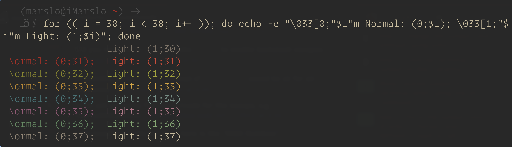](../screenshot/colors/ansi/color-normal-bright.png)

### from rgb

> [!NOTE|label:references:]
> - [rgbToAnsi256(r, g, b)](https://stackoverflow.com/a/26665998/2940319)

- rgb to hex
  ```bash
  # @author : Anthony Bourdain | https://stackoverflow.com/a/55073732/2940319
  # @usage  :
  # - `rgbtohex 17 0 26` ==> 1001A
  # - `rgbtohex -h 17 0 26` ==> #1001A
  function rgbtohex () {
    addleadingzero () { awk '{if(length($0)<2){printf "0";} print $0;}';}
    if [[ ${1} == "-h" ]]; then
      r=${2}; g=${3}; b=${4};h='#';
    else
      r=${1}; g=${2}; b=${3};h='';
    fi
    r=$(echo "obase=16; ${r}" | bc | addleadingzero)
    g=$(echo "obase=16; ${g}" | bc | addleadingzero)
    b=$(echo "obase=16; ${b}" | bc | addleadingzero)
    echo "${h}${r}${g}${b}"
  }
  ```

- rgb to 256colors
  ```bash
  # @author : Anthony Bourdain | https://stackoverflow.com/a/55073732/2940319
  # @usage  :
  # - `rgbto256 0 95, 135` ==> 22
  function rgbto256 () {
    echo "define trunc(x){auto os;os=scale;scale=0;x/=1;scale=os;return x;};" \
      "16 + 36 * trunc(${1}/51) + 6 * trunc(${2}/51) +" \
      " trunc(${3}/51)" | bc
    # XTerm Color Number = 16 + 36 * R + 6 * G + B | 0 <= R,G,B <= 5
  }
  ```

- [rgb to hsv](https://stackoverflow.com/a/70905494/2940319)

### from rgba

> [!NOTE|label:references:]
> - [Convert RGBA color to RGB](https://stackoverflow.com/q/2049230/2940319)
> - [Convert RGBA to RGB taking background into consideration [duplicate]](https://stackoverflow.com/a/11615135/2940319)
> - [How to convert RGBA to Hex color code using javascript](https://stackoverflow.com/a/49974627/2940319)
> - [Convert RGB to RGBA over white](https://stackoverflow.com/q/6672374/2940319)
> - [Convert RGBA to RGB in Python](https://stackoverflow.com/a/58748986/2940319)
> - [Alpha compositing](https://en.wikipedia.org/wiki/Alpha_compositing)
> - tools
>   - [Converter for rgba/hsla-colors into hexadecimal-value](https://tdekoning.github.io/rgba-converter/)

- to rgb

  > [!NOTE|label:references:]
  > ```
  > alpha     = 1 - RGBA.alpha;
  > RGB.red   = Math.round((RGBA.alpha * (RGBA.red / 255) + (alpha * (bg.red / 255))) * 255);
  > RGB.green = Math.round((RGBA.alpha * (RGBA.green / 255) + (alpha * (bg.green / 255))) * 255);
  > RGB.blue  = Math.round((RGBA.alpha * (RGBA.blue / 255) + (alpha * (bg.blue / 255))) * 255);
  > ```

### from 256 colors
- [xColorTable](https://github.com/marslo/dotfiles/blob/main/.marslo/bin/icolor.sh#L114) | [original](https://stackoverflow.com/a/55073732/2940319)
  ```bash
  $ xColorTable 30 45 100
  30  = rgb(0, 135, 135)   => #008787
  45  = rgb(0, 215, 255)   => #00D7FF
  100 = rgb(135, 135, 0)   => #878700
  ```

  [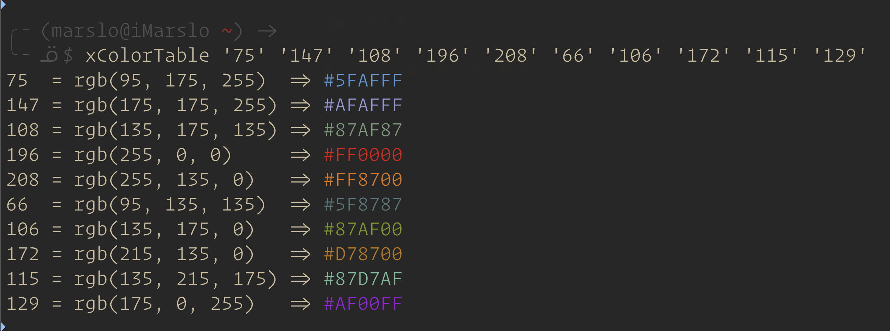](../screenshot/colors/ansi/xColorTable.png)

- 256color to hex
  ```bash
  tohex(){
    dec=$(($1%256))   ### input must be a number in range 0-255.
    if [ "$dec" -lt "16" ]; then
      bas=$(( dec%16 ))
      mul=128
      [ "$bas" -eq "7" ] && mul=192
      [ "$bas" -eq "8" ] && bas=7
      [ "$bas" -gt "8" ] && mul=255
      a="$((  (bas&1)    *mul ))"
      b="$(( ((bas&2)>>1)*mul ))"
      c="$(( ((bas&4)>>2)*mul ))"
      printf 'dec= %3s basic= #%02x%02x%02x\n' "$dec" "$a" "$b" "$c"
    elif [ "$dec" -gt 15 ] && [ "$dec" -lt 232 ]; then
      b=$(( (dec-16)%6  )); b=$(( b==0?0: b*40 + 55 ))
      g=$(( (dec-16)/6%6)); g=$(( g==0?0: g*40 + 55 ))
      r=$(( (dec-16)/36 )); r=$(( r==0?0: r*40 + 55 ))
      printf 'dec= %3s color= #%02x%02x%02x\n' "$dec" "$r" "$g" "$b"
    else
      gray=$(( (dec-232)*10+8 ))
      printf 'dec= %3s  gray= #%02x%02x%02x\n' "$dec" "$gray" "$gray" "$gray"
    fi
  }

  for i in $(seq 0 255); do
      tohex ${i}
  done
  ```

### from hex
- [hex to 256colors](https://unix.stackexchange.com/a/269085/29178)
  ```bash
  fromhex(){
    hex=${1#"#"}
    r=$(printf '0x%0.2s' "$hex")
    g=$(printf '0x%0.2s' ${hex#??})
    b=$(printf '0x%0.2s' ${hex#????})
    printf '%03d' "$(( (r<75?0:(r-35)/40)*6*6 +
                       (g<75?0:(g-35)/40)*6   +
                       (b<75?0:(b-35)/40)     + 16 ))"
  }

  # verify
  $ xColorTable 30
  30  = rgb(0, 135, 135)   => #008787

  $ fromhex 008787
  030
  $ fromhex 008766
  029
  $ fromhex 008788
  030
  ```

- hex to rgb
  ```bash
  # @author : Anthony Bourdain | https://stackoverflow.com/a/55073732/2940319
  # @usage  :
  # - `hexttorgb "11001A" ==> 17 0 26
  # - `hexttorgb "#11001A" ==> 17 0 26
  function hextorgb () {
    hexinput=$(echo "${1}" | tr '[:lower:]' '[:upper:]')           # uppercase-ing
    hexinput=$(echo "${hexinput}" | tr -d '#')                     # remove Hash if needed
    a=$(echo "${hexinput}" | cut -c-2)
    b=$(echo "${hexinput}" | cut -c3-4)
    c=$(echo "${hexinput}" | cut -c5-6)
    r=$(echo "ibase=16; ${a}" | bc)
    g=$(echo "ibase=16; ${b}" | bc)
    b=$(echo "ibase=16; ${c}" | bc)
    echo "${r} ${g} ${b}"
  }
  ```

## ansi colors

> [!NOTE|label:references:]
> - [How to have multiple colors in a Windows batch file?](https://stackoverflow.com/a/69924820/2940319)
> - [How to get the RGB values of a 256-color palette terminal color](https://stackoverflow.com/q/69138165/2940319)
> - [kenny-kvibe/ansi_colors.sh](https://gist.github.com/kenny-kvibe/d000f9e933da5e99d782b4cc7776ec3e)
> - [* iMarslo: icolor.sh](https://github.com/marslo/dotfiles/blob/main/.marslo/bin/icolor.sh)

### xterm color code
- echo
  ```bash
  #                 0 - 255
  #                    v
  $ echo -e "\033[38;5;3mhello world\033[0m"

  # for all
  $ for i in {0..255}; do echo -e "\033[38;5;${i}m $i \033[0m"; done
  ```

- printf
  ```bash
  #         ╭─ \b      Write a <backspace> character.
  #         ╷            0 - 255
  #         v               v
  $ printf "%-10b" "\e[38;5;3m**text**\e[0m"

  # or ignore `%b`
  $ printf "\e[38;5;3m**text**\e[0m"
  ```

- `tput`

  > [!NOTE|label:references::]
  > - [* iMarslo: linux/nutshell](../linux/nutshell.md#tput)
  > - [* 256 colors](https://robotmoon.com/256-colors/)
  > - [Colours and Cursor Movement With tput](https://tldp.org/HOWTO/Bash-Prompt-HOWTO/x405.html)
  > - [tput: Portable Terminal Control](https://www.gnu.org/software/termutils/manual/termutils-2.0/html_node/tput_1.html)
  > - use cases:
  >   - [* iMarslo: fman()](../devops/awesomeShell.md#man-page)
  >   - [* iMarslo: PS1](../linux/basic.md#colors)

  ```bash
  #          0 - 255                       reset
  #            v                             v
  $ tput setaf 30; echo "hello world"; tput sgr0
  # or
  $ echo -e "$(tput setaf 30)hello world$(tput sgr0)"

  # more
  $ tput setaf 30 | command cat -A
  ^[[38;5;30m
  ```

  - [background color](https://robotmoon.com/256-colors/)
    ```bash
    $ echo $(tput setab 214)256 $(tput setab 202)colors
    ```

  - [to show color table](https://unix.stackexchange.com/a/438357/29178)
    ```bash
    $ for c in {0..255}; do tput setaf $c; tput setaf $c | command cat -v; echo =$c; done
    ```

  - [show current terminal support](https://unix.stackexchange.com/a/521120/29178)
    ```bash
    $ tput colors
    256
    ```

### RGB colors

> [!NOTE|label:references:]
> - [* iMarslo : git » config » colors](../devops/git/config.md#colors)
> - [* iMarslo: math » number conversion » to decimal](../cheatsheet/math.md#to-decimal)

- echo
  ```bash
  # #689d6a
  #                       ╭─ R(decimal)         : 104 : `$ echo -n "obase=10;ibase=16; 68" | bc`
  #                       ╷   ╭─ G(decimal)     : 157 : `$ echo -n "obase=10;ibase=16; 9D" | bc`
  #                       ╷   ╷   ╭─ B(decimal) : 106 : `$ echo -n "obase=10;ibase=16; 6A" | bc`
  #                      --- --- ---
  $ echo -e '\x1b[3;38;2;104;157;106m hello world \x1b[m'
  #               -      --- --- ---
  #               ╵      68  9D  6A
  #               ╰─ SGR (Select Graphic Rendition) parameters ( https://en.wikipedia.org/wiki/ANSI_escape_code ):
  #                      0 reset/normal ; 1 bold      ; 2 dim/faint ;
  #                      3 italic       ; 4 underline ; 5 blink     ;
  #                      7 reverse      ; 8 hidden

  # or
  $ echo $(git config --get-color "" "#689d6a italic") color test $(git config --get-color "" reset) | command cat -A
  ^[[3;38;2;104;157;106m color test ^[[m$
  #         --- --- ---
  #         68  9D  6A   : hex
  #         104 157 106  : decimal
  ```

- printf
  ```bash
  $ hextorgb '#6A5ACD'
  106 90 205

  #                        6A  5A CD
  #                        --- -- ---
  $ printf "%b" '\x1b[38;2;106;90;205m-hello world-\x1b[0m'

  # omit %b
  $ printf '\x1b[38;2;106;90;205m-hello world-\x1b[0m'
  ```

- for PS1

  > [!NOTE|label:references:]
  > - [Using ANSI Color Codes to Colorize Your Bash Prompt on Linux](https://web.archive.org/web/20131009193526/http://bitmote.com/index.php?post/2012/11/19/Using-ANSI-Color-Codes-to-Colorize-Your-Bash-Prompt-on-Linux)

  ```bash
  # additioanl \[ and \] for PS1 only
  #  ^                     ^
  #  --                    --
  R='\[\e[38;2;255;100;100m\]'
  G='\[\e[38;2;100;255;100m\]'
  B='\[\e[38;2;100;100;255m\]'
  W='\[\e[0m\]'
  PS1="[$R\u$W@$B\h$W:$G\w$W]\$ "
  ```

- [RGB for both foreground and background](https://stackoverflow.com/a/33206814/2940319)
  ```bash
  # 38;2;R;G;B
  # 48;2;R;G;B
  $ echo -e "\033[38;2;255;100;100mhello world\033[0m"
  $ echo -e "\033[48;2;255;100;100mhello world\033[0m"

  #                 38;2;R;G;B     48;2;R;G;B
  #               v------------v v-------------v
  $ echo -e "\033[38;2;155;106;0;48;2;255;100;100mhello world\033[0m"

  # https://web.archive.org/web/20131009193526/http://bitmote.com/index.php?post/2012/11/19/Using-ANSI-Color-Codes-to-Colorize-Your-Bash-Prompt-on-Linux
  $ echo -e "testing \033[38;5;196;48;5;21mCOLOR1\033[38;5;208;48;5;159mCOLOR2\033[m"
  ```

### tools

- [fidian/ansi](https://github.com/fidian/ansi/blob/master/ansi)
  ```bash
  # install
  $ [[ ! -f /opt/ansi ]] && curl -sL git.io/ansi -o /opt/ansi
  $ chmod +x /opt/ansi
  $ ln -sf /opt/ansi /usr/local/bin/ansi

  # usage
  $ ansi --color-table
  $ ansi --color-codes
  ```

  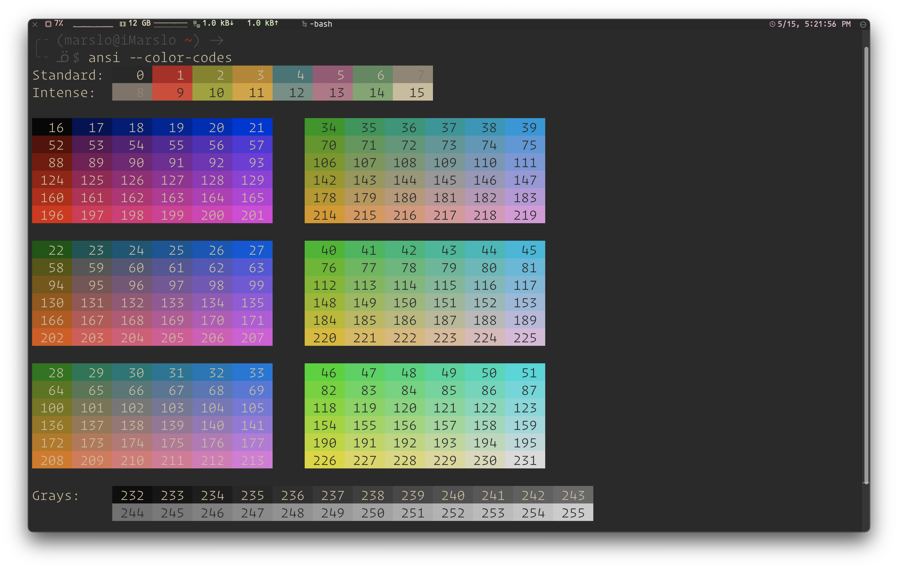

- [bash-colors `c()`](https://github.com/ppo/bash-colors)
  ```bash
  # install
  $ curl -o /opt/bash-colors.sh -fsSL https://github.com/ppo/bash-colors/blob/master/bash-colors.sh
  $ echo "[[ -f \"/opt/bash-colors.sh\" ]] && source \"/opt/bash-colors.sh\" >> ~/.bashrc"

  # or using source code directly
  # shellcheck disable=SC2015,SC2059
  c() { [ $# == 0 ] && printf "\e[0m" || printf "$1" | sed 's/\(.\)/\1;/g;s/\([SDIUFNHT]\)/2\1/g;s/\([KRGYBMCW]\)/3\1/g;s/\([krgybmcw]\)/4\1/g;y/SDIUFNHTsdiufnhtKRGYBMCWkrgybmcw/12345789123457890123456701234567/;s/^\(.*\);$/\\e[\1m/g'; }
  # shellcheck disable=SC2086
  cecho() { echo -e "$(c $1)${2}\e[0m"; }

  # sample
  $ echo -e "$(c Gs)bold green$(c) and $(c i)Italic$(c) and normal"
  ```

  [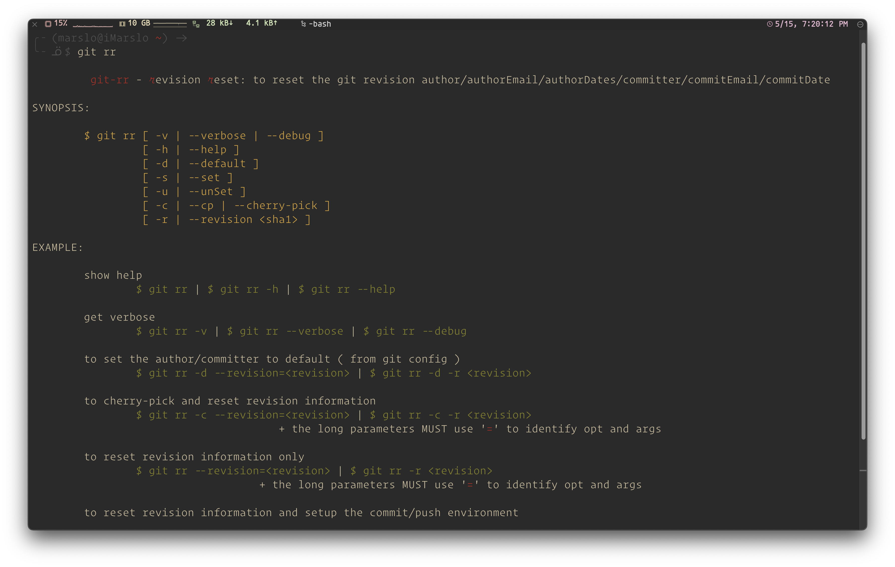](../screenshot/colors/ansi/bash-colors-c.png)

- [`say()`](https://stackoverflow.com/a/46331700/2940319)
  ```bash
 say() {
   echo "$@" | sed \
         -e "s/\(\(@\(red\|green\|yellow\|blue\|magenta\|cyan\|white\|reset\|b\|u\)\)\+\)[[]\{2\}\(.*\)[]]\{2\}/\1\4@reset/g" \
         -e "s/@red/$(tput setaf 1)/g" \
         -e "s/@green/$(tput setaf 2)/g" \
         -e "s/@yellow/$(tput setaf 3)/g" \
         -e "s/@blue/$(tput setaf 4)/g" \
         -e "s/@magenta/$(tput setaf 5)/g" \
         -e "s/@cyan/$(tput setaf 6)/g" \
         -e "s/@white/$(tput setaf 7)/g" \
         -e "s/@reset/$(tput sgr0)/g" \
         -e "s/@b/$(tput bold)/g" \
         -e "s/@u/$(tput sgr 0 1)/g"
  }

  # example
  $ say @b@green[[Success]]
  $ say @b@yellowWARNING @red..message..
  ```

  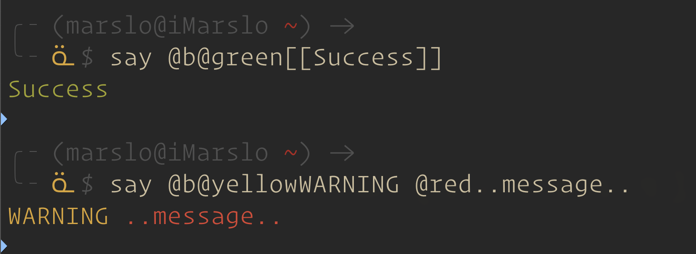

- [RGBcolor](https://unix.stackexchange.com/a/124409/29178)
  ```bash
  function RGBcolor {
    echo "16 + $1 * 36 + $2 * 6 + $3" | bc
  }

  fg=$(RGBcolor 1 0 2)  # Violet
  bg=$(RGBcolor 5 3 0)  # Bright orange.

  echo -e "\\033[1;38;5;$fg;48;5;${bg}mviolet on tangerine\\033[0m"
  ```

- [terminal-colors](https://pypi.org/project/terminal-colors/) | [eikenb/terminal-colors](https://github.com/eikenb/terminal-colors)
  ```bash
  $ python3 -m pip install terminal-colors

  # usage
  $ terminal-colors -l
  $ terminal-colors -n
  $ terminal-colors -n -p
  ```

  [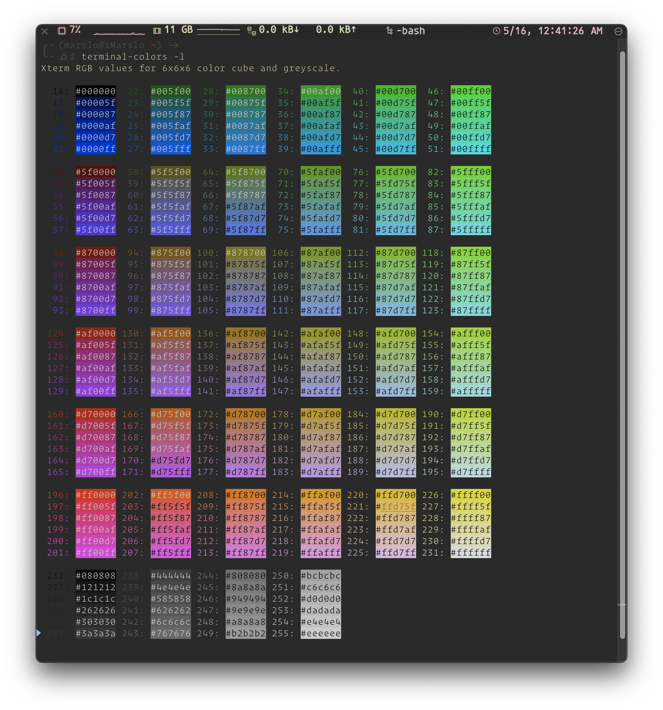](../screenshot/colors/ansi/terminal-colors-l.png)

  [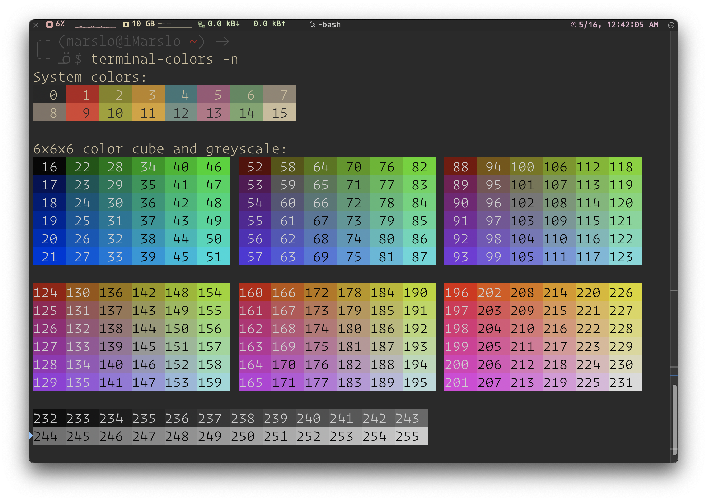](../screenshot/colors/ansi/terminal-colors-n.png)

- [colored](https://pypi.org/project/colored/)
  ```bash
  # install
  $ python3 -m pip install colored

  # usage
  $ colored --help
  $ colored --color-codes
  ```

- [topic: ansi-colors](https://github.com/topics/ansi-colors)
  - [trapd00r/colorcoke](https://github.com/trapd00r/colorcoke)
  - [shakibamoshiri/bline](https://github.com/shakibamoshiri/bline)

### 256 color table

> [!NOTE|label:references:]
> - [xterm 256color chart.svg](https://commons.wikimedia.org/wiki/File:Xterm_256color_chart.svg)
> - [color grid](http://www.quut.com/berlin/ht/cgrid.html)

- 256 colors
  ```bash
  function 256colors() {
    local bar='█'                                          # ctrl+v -> u2588 ( full block )
    if uname -r | grep -q "microsoft"; then bar='▌'; fi    # ctrl+v -> u258c ( left half block )
    for i in {0..255}; do
      echo -e "\e[38;05;${i}m${bar}${i}";
    done | column -c 180 -s ' ';
    echo -e "\e[m"
  }
  ```

  [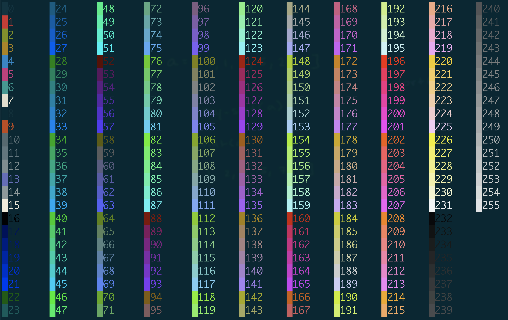](../screenshot/colors/ansi/ansicolor-256-0.png)

  ```bash
  #!/bin/bash

  # This program is free software. It comes without any warranty, to
  # the extent permitted by applicable law. You can redistribute it
  # and/or modify it under the terms of the Do What The Fuck You Want
  # To Public License, Version 2, as published by Sam Hocevar. See
  # http://sam.zoy.org/wtfpl/COPYING for more details.

  for fgbg in 38 48 ; do # Foreground / Background
      for color in {0..255} ; do # Colors
          # Display the color
          printf "\e[${fgbg};5;%sm  %3s  \e[0m" $color $color
          # Display 6 colors per lines
          if [ $((($color + 1) % 6)) == 4 ] ; then
              echo # New line
          fi
      done
      echo # New line
  done
  exit 0
  ```

  [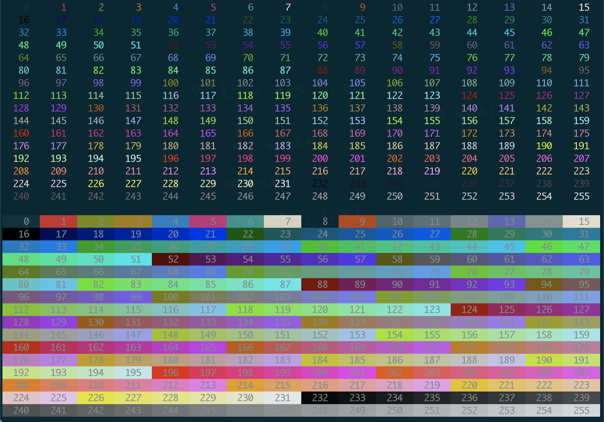](../screenshot/colors/ansi/ansicolor-256-1.png)

- [colors and formatting](https://github.com/stevetarver/shell-scripts/blob/master/ux/color_formatting_display.sh)

  
  > reference:
  > - [256-colors.sh](https://misc.flogisoft.com/bash/tip_colors_and_formatting#colors2)
  

  ```bash
  #!/bin/sh

  # From: https://misc.flogisoft.com/bash/tip_colors_and_formatting#colors2
  # Modified by steve.tarver@gmail.com to work in Alpine Linux ash

  # This program is free software. It comes without any warranty, to
  # the extent permitted by applicable law. You can redistribute it
  # and/or modify it under the terms of the Do What The Fuck You Want
  # To Public License, Version 2, as published by Sam Hocevar. See
  # http://sam.zoy.org/wtfpl/COPYING for more details.

  for clbg in {40..47} {100..107} 49 ; do   # background
    for clfg in {30..37} {90..97} 39 ; do   # foreground
      for attr in 0 1 2 3 4 5 7 ; do        # formatting
        #Print the result
        echo -en "\e[${attr};${clbg};${clfg}m ^[${attr};${clbg};${clfg}m \e[0m"
      done
      echo                                  # newline
    done
  done
  exit 0
  ```

  [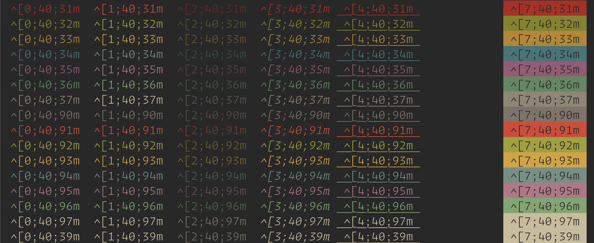](../screenshot/colors/ansi/color-formatting-1.png)

  ```bash
  for attr in 0 1 2 3 4 5 6 7; do
    echo "------------------------------------------------"
    printf "ESC[%s;Foreground;Background - \n" $attr
    for fore in 30 31 32 33 34 35 36 37; do
        for back in 40 41 42 43 44 45 46 47; do
            printf '\033[%s;%s;%sm %02s;%02s\033[0m' $attr $fore $back $fore $back
        done
    printf '\n'
    done
    printf '\033[0m'
  done
  ```

  [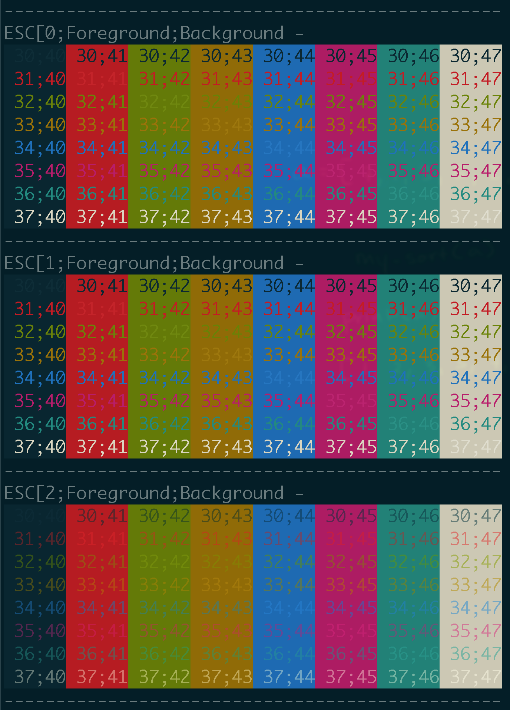](../screenshot/colors/ansi/color-formatting-2.png)

- [showColors](https://stackoverflow.com/a/69648792/2940319)
  ```bash
  # @author : https://stackoverflow.com/a/69648792/2940319
  # @usage  :
  #   - `showcolors fg` : default
  #   - `showcolors bg`
  # @alternative: `ansi --color-codes`
  function showcolors() {
    local row col blockrow blockcol red green blue
    local showcolor=_showcolor_${1:-fg}
    local white="\033[1;37m"
    local reset="\033[0m"

    echo -e "set foreground color: \\\\033[38;5;${white}NNN${reset}m"
    echo -e "set background color: \\\\033[48;5;${white}NNN${reset}m"
    echo -e "reset color & style:  \\\\033[0m"
    echo

    echo 16 standard color codes:
    for row in {0..1}; do
      for col in {0..7}; do
        $showcolor $(( row*8 + col )) "${row}"
      done
      echo
    done
    echo

    echo 6·6·6 RGB color codes:
    for blockrow in {0..2}; do
      for red in {0..5}; do
        for blockcol in {0..1}; do
          green=$(( blockrow*2 + blockcol ))
          for blue in {0..5}; do
            $showcolor $(( red*36 + green*6 + blue + 16 )) $green
          done
          echo -n "  "
        done
        echo
      done
      echo
    done

    echo 24 grayscale color codes:
    for row in {0..1}; do
      for col in {0..11}; do
        $showcolor $(( row*12 + col + 232 )) "${row}"
      done
      echo
    done
    echo
  }

  function _showcolor_fg() {
    # shellcheck disable=SC2155
    local code=$( printf %03d "$1" )
    echo -ne "\033[38;5;${code}m"
    echo -nE " $code "
    echo -ne "\033[0m"
  }

  function _showcolor_bg() {
    if (( $2 % 2 == 0 )); then
      echo -ne "\033[1;37m"
    else
      echo -ne "\033[0;30m"
    fi
    # shellcheck disable=SC2155
    local code=$( printf %03d "$1" )
    echo -ne "\033[48;5;${code}m"
    echo -nE " $code "
    echo -ne "\033[0m"
  }
  ```

  [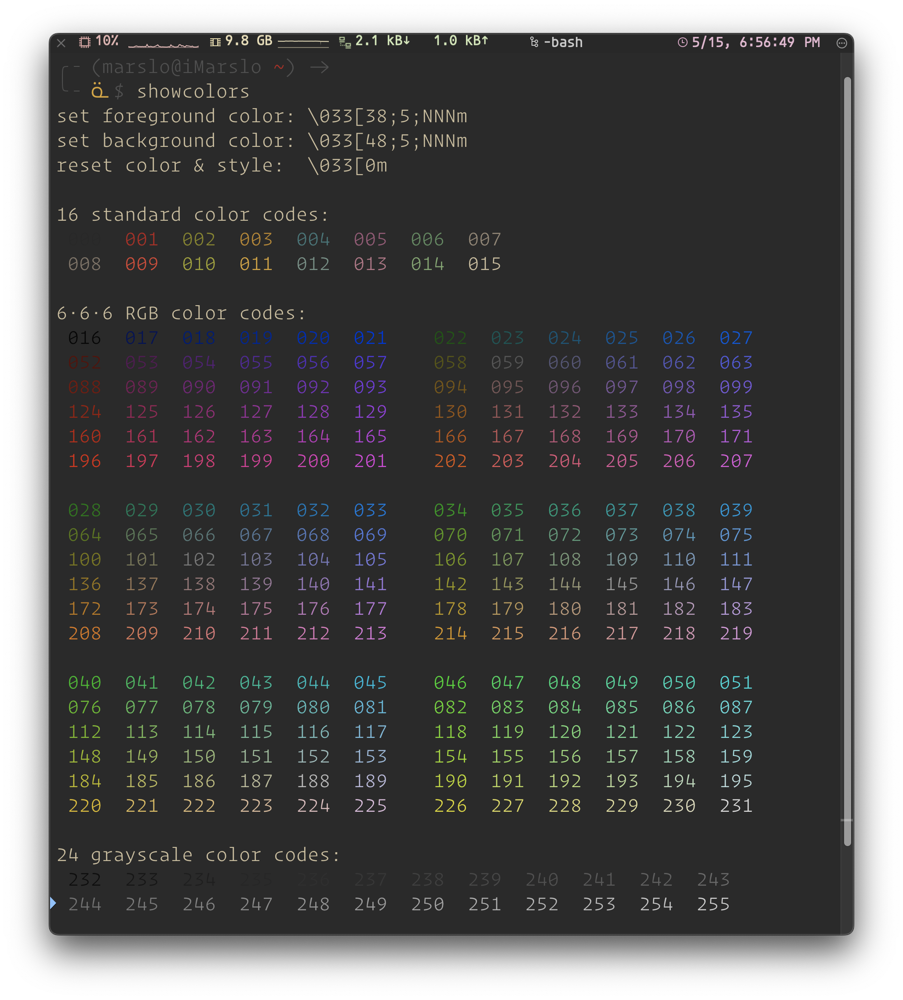](../screenshot/colors/ansi/showcolors.png)

- [colorgrid](https://unix.stackexchange.com/a/285956/29178)
  ```bash
  function colorgrid() {
      iter=16
      while [ $iter -lt 52 ]
      do
          second=$[$iter+36]
          third=$[$second+36]
          four=$[$third+36]
          five=$[$four+36]
          six=$[$five+36]
          seven=$[$six+36]
          if [ $seven -gt 250 ];then seven=$[$seven-251]; fi

          echo -en "\033[38;5;$(echo $iter)m█ "
          printf "%03d" $iter
          echo -en "   \033[38;5;$(echo $second)m█ "
          printf "%03d" $second
          echo -en "   \033[38;5;$(echo $third)m█ "
          printf "%03d" $third
          echo -en "   \033[38;5;$(echo $four)m█ "
          printf "%03d" $four
          echo -en "   \033[38;5;$(echo $five)m█ "
          printf "%03d" $five
          echo -en "   \033[38;5;$(echo $six)m█ "
          printf "%03d" $six
          echo -en "   \033[38;5;$(echo $seven)m█ "
          printf "%03d" $seven

          iter=$[$iter+1]
          printf '\r\n'
      done
  }
  ```

- solarized color
  ```bash
  #!/bin/bash

  # solarized ansicolors (exporting for grins)
  export base03='\033[0;30;40m'
  export base02='\033[1;30;40m'
  export base01='\033[0;32;40m'
  export base00='\033[0;33;40m'
  export base0='\033[0;34;40m'
  export base1='\033[0;36;40m'
  export base2='\033[0;37;40m'
  export base3='\033[1;37;40m'
  export yellow='\033[1;33;40m'
  export orange='\033[0;31;40m'
  export red='\033[1;31;40m'
  export magenta='\033[1;35;40m'
  export violet='\033[0;35;40m'
  export blue='\033[1;34;40m'
  export cyan='\033[1;36;40m'
  export green='\033[1;32;40m'
  export reset='\033[0m'

  colors () {
    echo -e "base03  ${base03}Test$reset"
    echo -e "base02  ${base02}Test$reset"
    echo -e "base01  ${base01}Test$reset"
    echo -e "base00  ${base00}Test$reset"
    echo -e "base0   ${base0}Test$reset"
    echo -e "base1   ${base1}Test$reset"
    echo -e "base2   ${base2}Test$reset"
    echo -e "base3   ${base3}Test$reset"
    echo -e "yellow  ${yellow}Test$reset"
    echo -e "orange  ${orange}Test$reset"
    echo -e "red     ${red}Test$reset"
    echo -e "magenta ${magenta}Test$reset"
    echo -e "violet  ${violet}Test$reset"
    echo -e "blue    ${blue}Test$reset"
    echo -e "cyan    ${cyan}Test$reset"
    echo -e "green   ${green}Test$reset"
  }
  colors
  ```

  

## color names

> [!TIP|label:references:]
> - [Web colors](https://www.wikiwand.com/en/Web_colors)
> - [The 256 color table and its partitioning](https://stackoverflow.com/a/27165165/2940319)

- blue

  [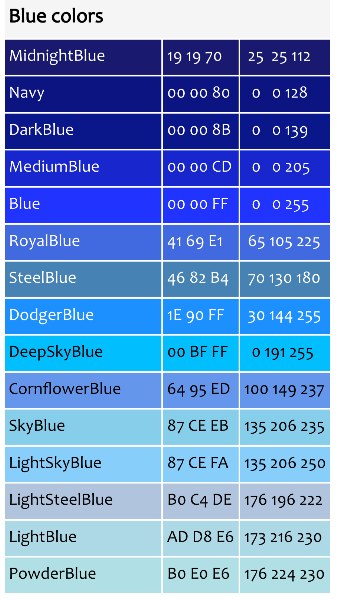](../screenshot/colors/blue.png)

- brown

  [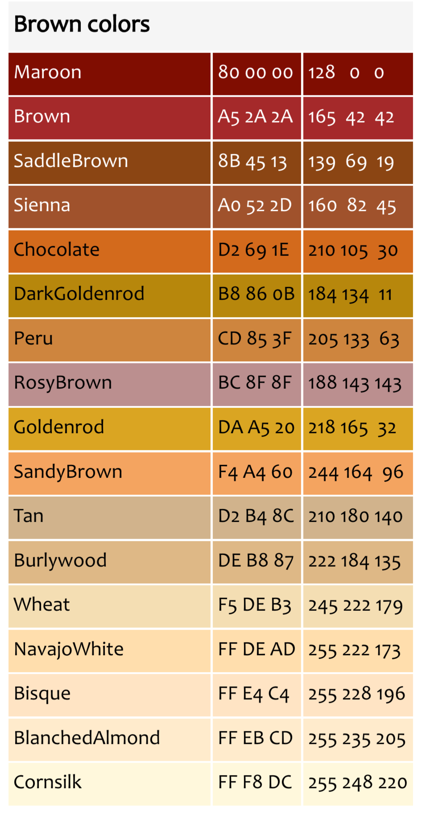](../screenshot/colors/brown.png)

- cyan

  [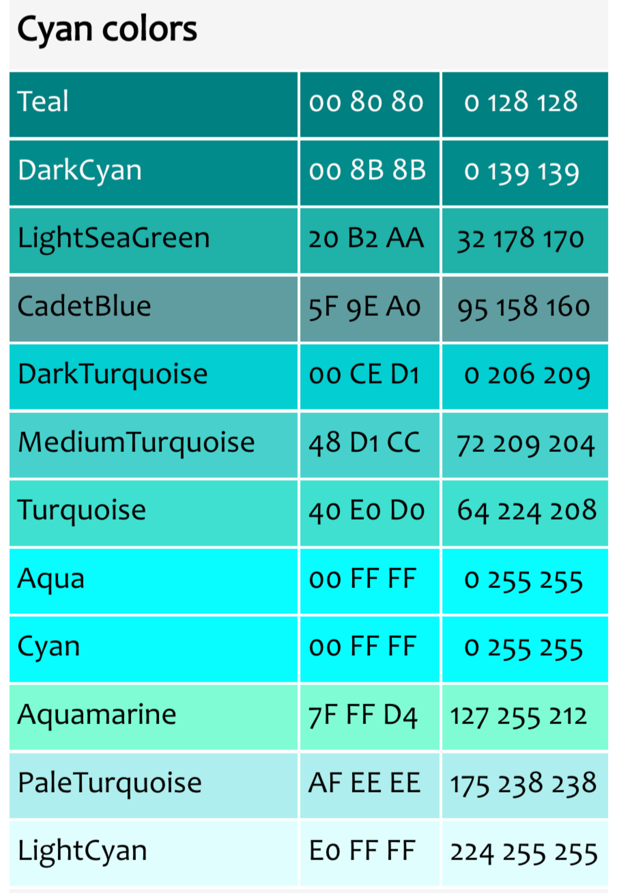](../screenshot/colors/cyan.png)

- gray.black

  [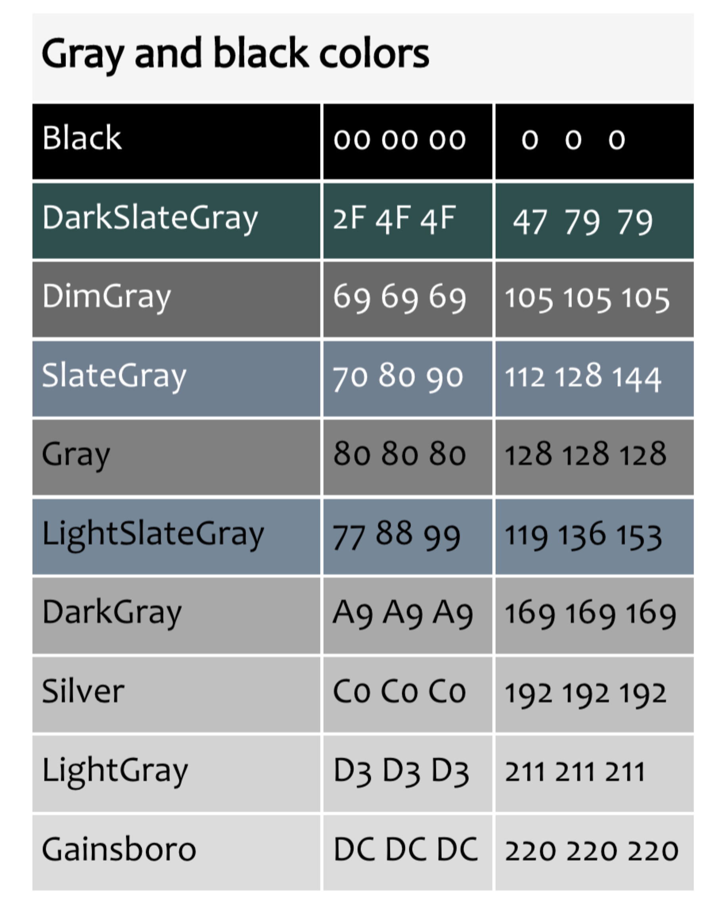](../screenshot/colors/gray.black.png)

- green

  [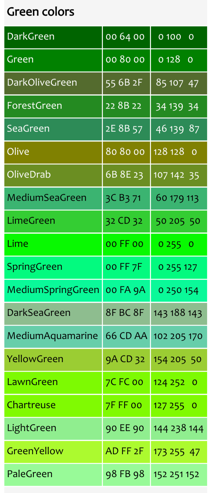](../screenshot/colors/green.png)

- orange

  [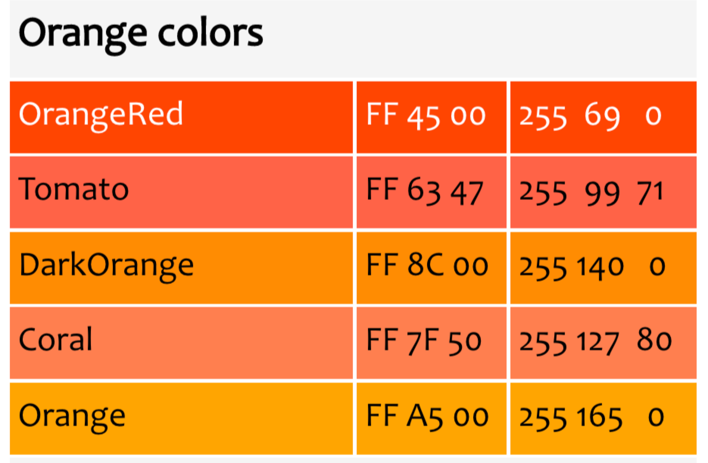](../screenshot/colors/orange.png)

- pink

  [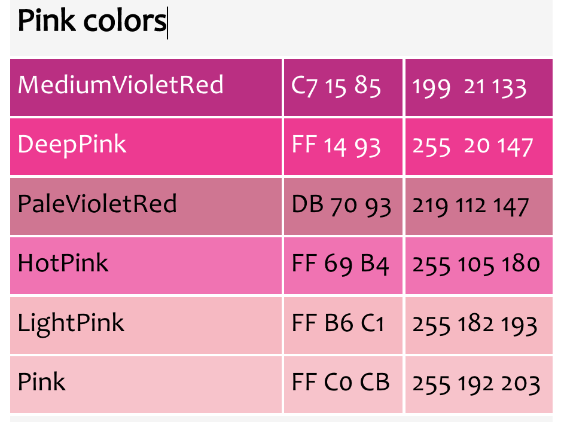](../screenshot/colors/pink.png)

- purple.magenta

  [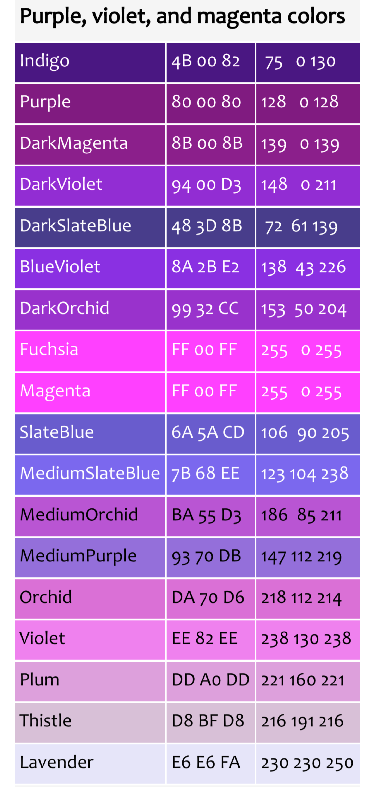](../screenshot/colors/purple.magenta.png)

- red

  [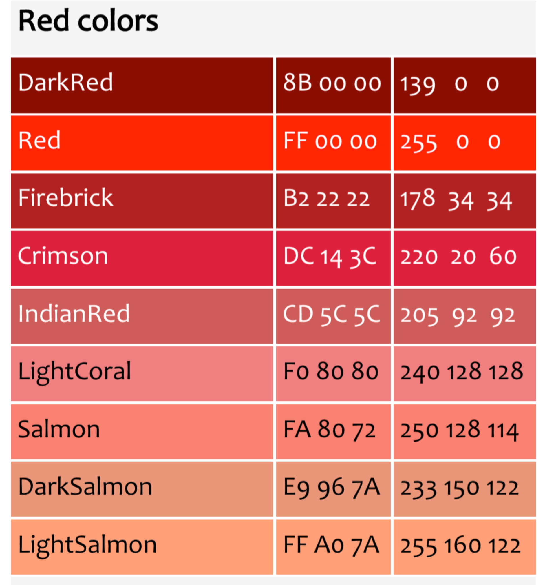](../screenshot/colors/red.png)

- white

  [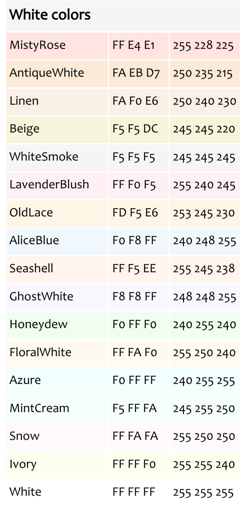](../screenshot/colors/white.png)

- yellow

  [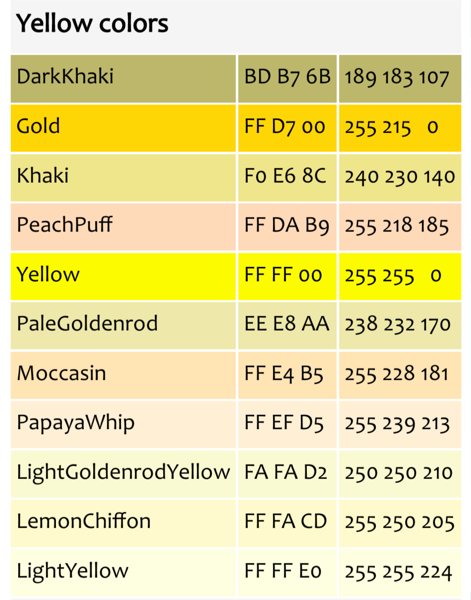](../screenshot/colors/yellow.png)

### xterm 256 colors chart

> [!NOTE|label:references:]
> - [* Color names](https://proplot.readthedocs.io/en/stable/colors.html)
> - [* Web colors](https://www.wikiwand.com/en/Web_colors)

<a title="Jasonm23, CC0, via Wikimedia Commons" href="https://upload.wikimedia.org/wikipedia/commons/1/15/Xterm_256color_chart.svg">
  
</a>


<a title="Color names" href="https://proplot.readthedocs.io/en/stable/_images/colors_2_0.svg">
  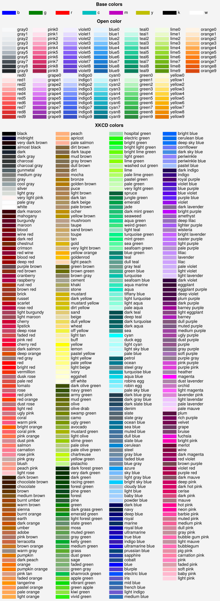
</a>

[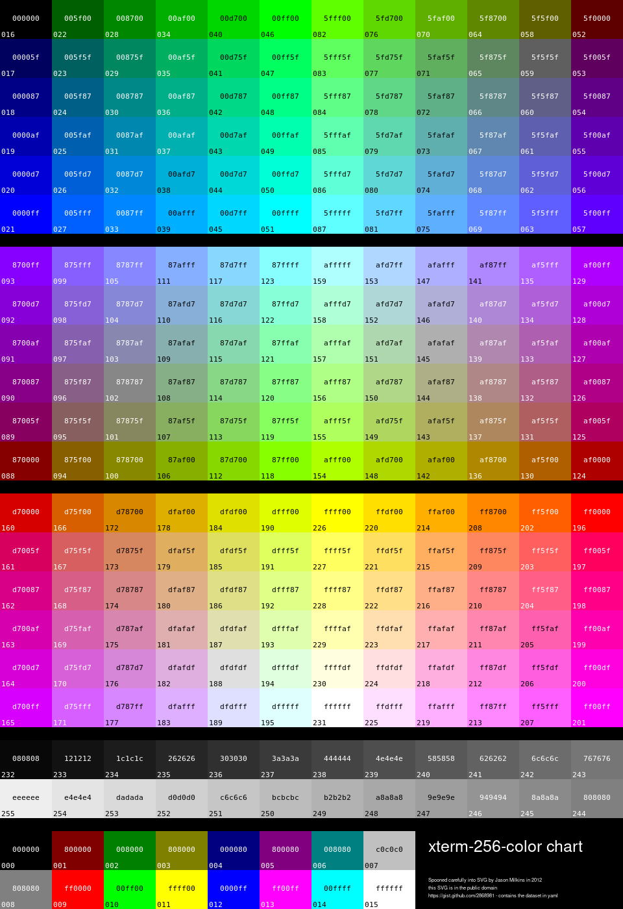](../screenshot/colors/Xterm_256color_chart.svg.png)

### 256 colors cheat sheet

| XTERM NUMBER |                XTERM NAME                |    HEX    | RGB              | HSL               | ANSI COLOR CODE |
|:------------:|:----------------------------------------:|:---------:|------------------|-------------------|:---------------:|
|       0      |          black<br>Black (SYSTEM)         | `#000000` | rgb(0,0,0)       | hsl(0,0%,0%)      |   `\e[38;5;0m`  |
|       1      |          red<br>Maroon (SYSTEM)          | `#800000` | rgb(128,0,0)     | hsl(0,100%,25%)   |   `\e[38;5;1m`  |
|       2      |          green<br>Green (SYSTEM)         | `#008000` | rgb(0,128,0)     | hsl(120,100%,25%) |   `\e[38;5;2m`  |
|       3      |         yellow<br>Olive (SYSTEM)         | `#808000` | rgb(128,128,0)   | hsl(60,100%,25%)  |   `\e[38;5;3m`  |
|       4      |           blue<br>Navy (SYSTEM)          | `#000080` | rgb(0,0,128)     | hsl(240,100%,25%) |   `\e[38;5;4m`  |
|       5      |        magenta<br>Purple (SYSTEM)        | `#800080` | rgb(128,0,128)   | hsl(300,100%,25%) |   `\e[38;5;5m`  |
|       6      |           cyan<br>Teal (SYSTEM)          | `#008080` | rgb(0,128,128)   | hsl(180,100%,25%) |   `\e[38;5;6m`  |
|       7      |       light_gray<br>Silver (SYSTEM)      | `#c0c0c0` | rgb(192,192,192) | hsl(0,0%,75%)     |   `\e[38;5;7m`  |
|       8      |        dark_gray<br>Grey (SYSTEM)        | `#808080` | rgb(128,128,128) | hsl(0,0%,50%)     |   `\e[38;5;8m`  |
|       9      |         light_red<br>Red (SYSTEM)        | `#ff0000` | rgb(255,0,0)     | hsl(0,100%,50%)   |   `\e[38;5;9m`  |
|      10      |       light_green<br>Lime (SYSTEM)       | `#00ff00` | rgb(0,255,0)     | hsl(120,100%,50%) |  `\e[38;5;10m`  |
|      11      |      light_yellow<br>Yellow (SYSTEM)     | `#ffff00` | rgb(255,255,0)   | hsl(60,100%,50%)  |  `\e[38;5;11m`  |
|      12      |        light_blue<br>Blue (SYSTEM)       | `#0000ff` | rgb(0,0,255)     | hsl(240,100%,50%) |  `\e[38;5;12m`  |
|      13      |     light_magenta<br>Fuchsia (SYSTEM)    | `#ff00ff` | rgb(255,0,255)   | hsl(300,100%,50%) |  `\e[38;5;13m`  |
|      14      |        light_cyan<br>Aqua (SYSTEM)       | `#00ffff` | rgb(0,255,255)   | hsl(180,100%,50%) |  `\e[38;5;14m`  |
|      15      |          white<br>White (SYSTEM)         | `#ffffff` | rgb(255,255,255) | hsl(0,0%,100%)    |  `\e[38;5;15m`  |
|      16      |              grey_0<br>Grey0             | `#000000` | rgb(0,0,0)       | hsl(0,0%,0%)      |  `\e[38;5;16m`  |
|      17      |           navy_blue<br>NavyBlue          | `#00005f` | rgb(0,0,95)      | hsl(240,100%,18%) |  `\e[38;5;17m`  |
|      18      |           dark_blue<br>DarkBlue          | `#000087` | rgb(0,0,135)     | hsl(240,100%,26%) |  `\e[38;5;18m`  |
|      19      |             blue_3a<br>Blue3             | `#0000af` | rgb(0,0,175)     | hsl(240,100%,34%) |  `\e[38;5;19m`  |
|      20      |             blue_3b<br>Blue3             | `#0000d7` | rgb(0,0,215)     | hsl(240,100%,42%) |  `\e[38;5;20m`  |
|      21      |              blue_1<br>Blue1             | `#0000ff` | rgb(0,0,255)     | hsl(240,100%,50%) |  `\e[38;5;21m`  |
|      22      |          dark_green<br>DarkGreen         | `#005f00` | rgb(0,95,0)      | hsl(120,100%,18%) |  `\e[38;5;22m`  |
|      23      |     deep_sky_blue_4a<br>DeepSkyBlue4     | `#005f5f` | rgb(0,95,95)     | hsl(180,100%,18%) |  `\e[38;5;23m`  |
|      24      |     deep_sky_blue_4b<br>DeepSkyBlue4     | `#005f87` | rgb(0,95,135)    | hsl(97,100%,26%)  |  `\e[38;5;24m`  |
|      25      |     deep_sky_blue_4c<br>DeepSkyBlue4     | `#005faf` | rgb(0,95,175)    | hsl(07,100%,34%)  |  `\e[38;5;25m`  |
|      26      |       dodger_blue_3<br>DodgerBlue3       | `#005fd7` | rgb(0,95,215)    | hsl(13,100%,42%)  |  `\e[38;5;26m`  |
|      27      |       dodger_blue_2<br>DodgerBlue2       | `#005fff` | rgb(0,95,255)    | hsl(17,100%,50%)  |  `\e[38;5;27m`  |
|      28      |             green_4<br>Green4            | `#008700` | rgb(0,135,0)     | hsl(120,100%,26%) |  `\e[38;5;28m`  |
|      29      |      spring_green_4<br>SpringGreen4      | `#00875f` | rgb(0,135,95)    | hsl(62,100%,26%)  |  `\e[38;5;29m`  |
|      30      |         turquoise_4<br>Turquoise4        | `#008787` | rgb(0,135,135)   | hsl(180,100%,26%) |  `\e[38;5;30m`  |
|      31      |     deep_sky_blue_3a<br>DeepSkyBlue3     | `#0087af` | rgb(0,135,175)   | hsl(93,100%,34%)  |  `\e[38;5;31m`  |
|      32      |     deep_sky_blue_3b<br>DeepSkyBlue3     | `#0087d7` | rgb(0,135,215)   | hsl(02,100%,42%)  |  `\e[38;5;32m`  |
|      33      |       dodger_blue_1<br>DodgerBlue1       | `#0087ff` | rgb(0,135,255)   | hsl(08,100%,50%)  |  `\e[38;5;33m`  |
|      34      |            green_3a<br>Green3            | `#00af00` | rgb(0,175,0)     | hsl(120,100%,34%) |  `\e[38;5;34m`  |
|      35      |      spring_green_3a<br>SpringGreen3     | `#00af5f` | rgb(0,175,95)    | hsl(52,100%,34%)  |  `\e[38;5;35m`  |
|      36      |           dark_cyan<br>DarkCyan          | `#00af87` | rgb(0,175,135)   | hsl(66,100%,34%)  |  `\e[38;5;36m`  |
|      37      |     light_sea_green<br>LightSeaGreen     | `#00afaf` | rgb(0,175,175)   | hsl(180,100%,34%) |  `\e[38;5;37m`  |
|      38      |      deep_sky_blue_2<br>DeepSkyBlue2     | `#00afd7` | rgb(0,175,215)   | hsl(91,100%,42%)  |  `\e[38;5;38m`  |
|      39      |      deep_sky_blue_1<br>DeepSkyBlue1     | `#00afff` | rgb(0,175,255)   | hsl(98,100%,50%)  |  `\e[38;5;39m`  |
|      40      |            green_3b<br>Green3            | `#00d700` | rgb(0,215,0)     | hsl(120,100%,42%) |  `\e[38;5;40m`  |
|      41      |      spring_green_3b<br>SpringGreen3     | `#00d75f` | rgb(0,215,95)    | hsl(46,100%,42%)  |  `\e[38;5;41m`  |
|      42      |      spring_green_2a<br>SpringGreen2     | `#00d787` | rgb(0,215,135)   | hsl(57,100%,42%)  |  `\e[38;5;42m`  |
|      43      |              cyan_3<br>Cyan3             | `#00d7af` | rgb(0,215,175)   | hsl(68,100%,42%)  |  `\e[38;5;43m`  |
|      44      |      dark_turquoise<br>DarkTurquoise     | `#00d7d7` | rgb(0,215,215)   | hsl(180,100%,42%) |  `\e[38;5;44m`  |
|      45      |         turquoise_2<br>Turquoise2        | `#00d7ff` | rgb(0,215,255)   | hsl(89,100%,50%)  |  `\e[38;5;45m`  |
|      46      |             green_1<br>Green1            | `#00ff00` | rgb(0,255,0)     | hsl(120,100%,50%) |  `\e[38;5;46m`  |
|      47      |      spring_green_2b<br>SpringGreen2     | `#00ff5f` | rgb(0,255,95)    | hsl(42,100%,50%)  |  `\e[38;5;47m`  |
|      48      |      spring_green_1<br>SpringGreen1      | `#00ff87` | rgb(0,255,135)   | hsl(51,100%,50%)  |  `\e[38;5;48m`  |
|      49      | medium_spring_green<br>MediumSpringGreen | `#00ffaf` | rgb(0,255,175)   | hsl(61,100%,50%)  |  `\e[38;5;49m`  |
|      50      |              cyan_2<br>Cyan2             | `#00ffd7` | rgb(0,255,215)   | hsl(70,100%,50%)  |  `\e[38;5;50m`  |
|      51      |              cyan_1<br>Cyan1             | `#00ffff` | rgb(0,255,255)   | hsl(180,100%,50%) |  `\e[38;5;51m`  |
|      52      |           dark_red_1<br>DarkRed          | `#5f0000` | rgb(95,0,0)      | hsl(0,100%,18%)   |  `\e[38;5;52m`  |
|      53      |         deep_pink_4a<br>DeepPink4        | `#5f005f` | rgb(95,0,95)     | hsl(300,100%,18%) |  `\e[38;5;53m`  |
|      54      |           purple_4a<br>Purple4           | `#5f0087` | rgb(95,0,135)    | hsl(82,100%,26%)  |  `\e[38;5;54m`  |
|      55      |           purple_4b<br>Purple4           | `#5f00af` | rgb(95,0,175)    | hsl(72,100%,34%)  |  `\e[38;5;55m`  |
|      56      |            purple_3<br>Purple3           | `#5f00d7` | rgb(95,0,215)    | hsl(66,100%,42%)  |  `\e[38;5;56m`  |
|      57      |         blue_violet<br>BlueViolet        | `#5f00ff` | rgb(95,0,255)    | hsl(62,100%,50%)  |  `\e[38;5;57m`  |
|      58      |           orange_4a<br>Orange4           | `#5f5f00` | rgb(95,95,0)     | hsl(60,100%,18%)  |  `\e[38;5;58m`  |
|      59      |             grey_37<br>Grey37            | `#5f5f5f` | rgb(95,95,95)    | hsl(0,0%,37%)     |  `\e[38;5;59m`  |
|      60      |     medium_purple_4<br>MediumPurple4     | `#5f5f87` | rgb(95,95,135)   | hsl(240,17%,45%)  |  `\e[38;5;60m`  |
|      61      |        slate_blue_3a<br>SlateBlue3       | `#5f5faf` | rgb(95,95,175)   | hsl(240,33%,52%)  |  `\e[38;5;61m`  |
|      62      |        slate_blue_3b<br>SlateBlue3       | `#5f5fd7` | rgb(95,95,215)   | hsl(240,60%,60%)  |  `\e[38;5;62m`  |
|      63      |        royal_blue_1<br>RoyalBlue1        | `#5f5fff` | rgb(95,95,255)   | hsl(240,100%,68%) |  `\e[38;5;63m`  |
|      64      |        chartreuse_4<br>Chartreuse4       | `#5f8700` | rgb(95,135,0)    | hsl(7,100%,26%)   |  `\e[38;5;64m`  |
|      65      |    dark_sea_green_4a<br>DarkSeaGreen4    | `#5f875f` | rgb(95,135,95)   | hsl(120,17%,45%)  |  `\e[38;5;65m`  |
|      66      |    pale_turquoise_4<br>PaleTurquoise4    | `#5f8787` | rgb(95,135,135)  | hsl(180,17%,45%)  |  `\e[38;5;66m`  |
|      67      |          steel_blue<br>SteelBlue         | `#5f87af` | rgb(95,135,175)  | hsl(210,33%,52%)  |  `\e[38;5;67m`  |
|      68      |        steel_blue_3<br>SteelBlue3        | `#5f87d7` | rgb(95,135,215)  | hsl(220,60%,60%)  |  `\e[38;5;68m`  |
|      69      |     cornflower_blue<br>CornflowerBlue    | `#5f87ff` | rgb(95,135,255)  | hsl(225,100%,68%) |  `\e[38;5;69m`  |
|      70      |       chartreuse_3a<br>Chartreuse3       | `#5faf00` | rgb(95,175,0)    | hsl(7,100%,34%)   |  `\e[38;5;70m`  |
|      71      |    dark_sea_green_4b<br>DarkSeaGreen4    | `#5faf5f` | rgb(95,175,95)   | hsl(120,33%,52%)  |  `\e[38;5;71m`  |
|      72      |         cadet_blue_2<br>CadetBlue        | `#5faf87` | rgb(95,175,135)  | hsl(150,33%,52%)  |  `\e[38;5;72m`  |
|      73      |         cadet_blue_1<br>CadetBlue        | `#5fafaf` | rgb(95,175,175)  | hsl(180,33%,52%)  |  `\e[38;5;73m`  |
|      74      |          sky_blue_3<br>SkyBlue3          | `#5fafd7` | rgb(95,175,215)  | hsl(200,60%,60%)  |  `\e[38;5;74m`  |
|      75      |        steel_blue_1a<br>SteelBlue1       | `#5fafff` | rgb(95,175,255)  | hsl(210,100%,68%) |  `\e[38;5;75m`  |
|      76      |       chartreuse_3b<br>Chartreuse3       | `#5fd700` | rgb(95,215,0)    | hsl(3,100%,42%)   |  `\e[38;5;76m`  |
|      77      |        pale_green_3a<br>PaleGreen3       | `#5fd75f` | rgb(95,215,95)   | hsl(120,60%,60%)  |  `\e[38;5;77m`  |
|      78      |         sea_green_3<br>SeaGreen3         | `#5fd787` | rgb(95,215,135)  | hsl(140,60%,60%)  |  `\e[38;5;78m`  |
|      79      |        aquamarine_3<br>Aquamarine3       | `#5fd7af` | rgb(95,215,175)  | hsl(160,60%,60%)  |  `\e[38;5;79m`  |
|      80      |    medium_turquoise<br>MediumTurquoise   | `#5fd7d7` | rgb(95,215,215)  | hsl(180,60%,60%)  |  `\e[38;5;80m`  |
|      81      |        steel_blue_1b<br>SteelBlue1       | `#5fd7ff` | rgb(95,215,255)  | hsl(195,100%,68%) |  `\e[38;5;81m`  |
|      82      |       chartreuse_2a<br>Chartreuse2       | `#5fff00` | rgb(95,255,0)    | hsl(7,100%,50%)   |  `\e[38;5;82m`  |
|      83      |         sea_green_2<br>SeaGreen2         | `#5fff5f` | rgb(95,255,95)   | hsl(120,100%,68%) |  `\e[38;5;83m`  |
|      84      |         sea_green_1a<br>SeaGreen1        | `#5fff87` | rgb(95,255,135)  | hsl(135,100%,68%) |  `\e[38;5;84m`  |
|      85      |         sea_green_1b<br>SeaGreen1        | `#5fffaf` | rgb(95,255,175)  | hsl(150,100%,68%) |  `\e[38;5;85m`  |
|      86      |       aquamarine_1a<br>Aquamarine1       | `#5fffd7` | rgb(95,255,215)  | hsl(165,100%,68%) |  `\e[38;5;86m`  |
|      87      |    dark_slate_gray_2<br>DarkSlateGray2   | `#5fffff` | rgb(95,255,255)  | hsl(180,100%,68%) |  `\e[38;5;87m`  |
|      88      |           dark_red_2<br>DarkRed          | `#870000` | rgb(135,0,0)     | hsl(0,100%,26%)   |  `\e[38;5;88m`  |
|      89      |         deep_pink_4b<br>DeepPink4        | `#87005f` | rgb(135,0,95)    | hsl(17,100%,26%)  |  `\e[38;5;89m`  |
|      90      |       dark_magenta_1<br>DarkMagenta      | `#870087` | rgb(135,0,135)   | hsl(300,100%,26%) |  `\e[38;5;90m`  |
|      91      |       dark_magenta_2<br>DarkMagenta      | `#8700af` | rgb(135,0,175)   | hsl(86,100%,34%)  |  `\e[38;5;91m`  |
|      92      |       dark_violet_1a<br>DarkViolet       | `#8700d7` | rgb(135,0,215)   | hsl(77,100%,42%)  |  `\e[38;5;92m`  |
|      93      |            purple_1a<br>Purple           | `#8700ff` | rgb(135,0,255)   | hsl(71,100%,50%)  |  `\e[38;5;93m`  |
|      94      |           orange_4b<br>Orange4           | `#875f00` | rgb(135,95,0)    | hsl(2,100%,26%)   |  `\e[38;5;94m`  |
|      95      |        light_pink_4<br>LightPink4        | `#875f5f` | rgb(135,95,95)   | hsl(0,17%,45%)    |  `\e[38;5;95m`  |
|      96      |              plum_4<br>Plum4             | `#875f87` | rgb(135,95,135)  | hsl(300,17%,45%)  |  `\e[38;5;96m`  |
|      97      |     medium_purple_3a<br>MediumPurple3    | `#875faf` | rgb(135,95,175)  | hsl(270,33%,52%)  |  `\e[38;5;97m`  |
|      98      |     medium_purple_3b<br>MediumPurple3    | `#875fd7` | rgb(135,95,215)  | hsl(260,60%,60%)  |  `\e[38;5;98m`  |
|      99      |        slate_blue_1<br>SlateBlue1        | `#875fff` | rgb(135,95,255)  | hsl(255,100%,68%) |  `\e[38;5;99m`  |
|      100     |           yellow_4a<br>Yellow4           | `#878700` | rgb(135,135,0)   | hsl(60,100%,26%)  |  `\e[38;5;100m` |
|      101     |             wheat_4<br>Wheat4            | `#87875f` | rgb(135,135,95)  | hsl(60,17%,45%)   |  `\e[38;5;101m` |
|      102     |             grey_53<br>Grey53            | `#878787` | rgb(135,135,135) | hsl(0,0%,52%)     |  `\e[38;5;102m` |
|      103     |    light_slate_grey<br>LightSlateGrey    | `#8787af` | rgb(135,135,175) | hsl(240,20%,60%)  |  `\e[38;5;103m` |
|      104     |       medium_purple<br>MediumPurple      | `#8787d7` | rgb(135,135,215) | hsl(240,50%,68%)  |  `\e[38;5;104m` |
|      105     |    light_slate_blue<br>LightSlateBlue    | `#8787ff` | rgb(135,135,255) | hsl(240,100%,76%) |  `\e[38;5;105m` |
|      106     |           yellow_4b<br>Yellow4           | `#87af00` | rgb(135,175,0)   | hsl(3,100%,34%)   |  `\e[38;5;106m` |
|      107     |  dark_olive_green_3a<br>DarkOliveGreen3  | `#87af5f` | rgb(135,175,95)  | hsl(90,33%,52%)   |  `\e[38;5;107m` |
|      108     |      dark_green_sea<br>DarkSeaGreen      | `#87af87` | rgb(135,175,135) | hsl(120,20%,60%)  |  `\e[38;5;108m` |
|      109     |    light_sky_blue_3a<br>LightSkyBlue3    | `#87afaf` | rgb(135,175,175) | hsl(180,20%,60%)  |  `\e[38;5;109m` |
|      110     |    light_sky_blue_3b<br>LightSkyBlue3    | `#87afd7` | rgb(135,175,215) | hsl(210,50%,68%)  |  `\e[38;5;110m` |
|      111     |          sky_blue_2<br>SkyBlue2          | `#87afff` | rgb(135,175,255) | hsl(220,100%,76%) |  `\e[38;5;111m` |
|      112     |       chartreuse_2b<br>Chartreuse2       | `#87d700` | rgb(135,215,0)   | hsl(2,100%,42%)   |  `\e[38;5;112m` |
|      113     |  dark_olive_green_3b<br>DarkOliveGreen3  | `#87d75f` | rgb(135,215,95)  | hsl(100,60%,60%)  |  `\e[38;5;113m` |
|      114     |        pale_green_3b<br>PaleGreen3       | `#87d787` | rgb(135,215,135) | hsl(120,50%,68%)  |  `\e[38;5;114m` |
|      115     |    dark_sea_green_3a<br>DarkSeaGreen3    | `#87d7af` | rgb(135,215,175) | hsl(150,50%,68%)  |  `\e[38;5;115m` |
|      116     |    dark_slate_gray_3<br>DarkSlateGray3   | `#87d7d7` | rgb(135,215,215) | hsl(180,50%,68%)  |  `\e[38;5;116m` |
|      117     |          sky_blue_1<br>SkyBlue1          | `#87d7ff` | rgb(135,215,255) | hsl(200,100%,76%) |  `\e[38;5;117m` |
|      118     |        chartreuse_1<br>Chartreuse1       | `#87ff00` | rgb(135,255,0)   | hsl(8,100%,50%)   |  `\e[38;5;118m` |
|      119     |        light_green_2<br>LightGreen       | `#87ff5f` | rgb(135,255,95)  | hsl(105,100%,68%) |  `\e[38;5;119m` |
|      120     |        light_green_3<br>LightGreen       | `#87ff87` | rgb(135,255,135) | hsl(120,100%,76%) |  `\e[38;5;120m` |
|      121     |        pale_green_1a<br>PaleGreen1       | `#87ffaf` | rgb(135,255,175) | hsl(140,100%,76%) |  `\e[38;5;121m` |
|      122     |       aquamarine_1b<br>Aquamarine1       | `#87ffd7` | rgb(135,255,215) | hsl(160,100%,76%) |  `\e[38;5;122m` |
|      123     |    dark_slate_gray_1<br>DarkSlateGray1   | `#87ffff` | rgb(135,255,255) | hsl(180,100%,76%) |  `\e[38;5;123m` |
|      124     |              red_3a<br>Red3              | `#af0000` | rgb(175,0,0)     | hsl(0,100%,34%)   |  `\e[38;5;124m` |
|      125     |         deep_pink_4c<br>DeepPink4        | `#af005f` | rgb(175,0,95)    | hsl(27,100%,34%)  |  `\e[38;5;125m` |
|      126     |   medium_violet_red<br>MediumVioletRed   | `#af0087` | rgb(175,0,135)   | hsl(13,100%,34%)  |  `\e[38;5;126m` |
|      127     |          magenta_3a<br>Magenta3          | `#af00af` | rgb(175,0,175)   | hsl(300,100%,34%) |  `\e[38;5;127m` |
|      128     |       dark_violet_1b<br>DarkViolet       | `#af00d7` | rgb(175,0,215)   | hsl(88,100%,42%)  |  `\e[38;5;128m` |
|      129     |            purple_1b<br>Purple           | `#af00ff` | rgb(175,0,255)   | hsl(81,100%,50%)  |  `\e[38;5;129m` |
|      130     |       dark_orange_3a<br>DarkOrange3      | `#af5f00` | rgb(175,95,0)    | hsl(2,100%,34%)   |  `\e[38;5;130m` |
|      131     |        indian_red_1a<br>IndianRed        | `#af5f5f` | rgb(175,95,95)   | hsl(0,33%,52%)    |  `\e[38;5;131m` |
|      132     |          hot_pink_3a<br>HotPink3         | `#af5f87` | rgb(175,95,135)  | hsl(330,33%,52%)  |  `\e[38;5;132m` |
|      133     |     medium_orchid_3<br>MediumOrchid3     | `#af5faf` | rgb(175,95,175)  | hsl(300,33%,52%)  |  `\e[38;5;133m` |
|      134     |       medium_orchid<br>MediumOrchid      | `#af5fd7` | rgb(175,95,215)  | hsl(280,60%,60%)  |  `\e[38;5;134m` |
|      135     |     medium_purple_2a<br>MediumPurple2    | `#af5fff` | rgb(175,95,255)  | hsl(270,100%,68%) |  `\e[38;5;135m` |
|      136     |      dark_goldenrod<br>DarkGoldenrod     | `#af8700` | rgb(175,135,0)   | hsl(6,100%,34%)   |  `\e[38;5;136m` |
|      137     |      light_salmon_3a<br>LightSalmon3     | `#af875f` | rgb(175,135,95)  | hsl(30,33%,52%)   |  `\e[38;5;137m` |
|      138     |          rosy_brown<br>RosyBrown         | `#af8787` | rgb(175,135,135) | hsl(0,20%,60%)    |  `\e[38;5;138m` |
|      139     |             grey_63<br>Grey63            | `#af87af` | rgb(175,135,175) | hsl(300,20%,60%)  |  `\e[38;5;139m` |
|      140     |     medium_purple_2b<br>MediumPurple2    | `#af87d7` | rgb(175,135,215) | hsl(270,50%,68%)  |  `\e[38;5;140m` |
|      141     |     medium_purple_1<br>MediumPurple1     | `#af87ff` | rgb(175,135,255) | hsl(260,100%,76%) |  `\e[38;5;141m` |
|      142     |             gold_3a<br>Gold3             | `#afaf00` | rgb(175,175,0)   | hsl(60,100%,34%)  |  `\e[38;5;142m` |
|      143     |          dark_khaki<br>DarkKhaki         | `#afaf5f` | rgb(175,175,95)  | hsl(60,33%,52%)   |  `\e[38;5;143m` |
|      144     |      navajo_white_3<br>NavajoWhite3      | `#afaf87` | rgb(175,175,135) | hsl(60,20%,60%)   |  `\e[38;5;144m` |
|      145     |             grey_69<br>Grey69            | `#afafaf` | rgb(175,175,175) | hsl(0,0%,68%)     |  `\e[38;5;145m` |
|      146     |   light_steel_blue_3<br>LightSteelBlue3  | `#afafd7` | rgb(175,175,215) | hsl(240,33%,76%)  |  `\e[38;5;146m` |
|      147     |    light_steel_blue<br>LightSteelBlue    | `#afafff` | rgb(175,175,255) | hsl(240,100%,84%) |  `\e[38;5;147m` |
|      148     |           yellow_3a<br>Yellow3           | `#afd700` | rgb(175,215,0)   | hsl(1,100%,42%)   |  `\e[38;5;148m` |
|      149     |   dark_olive_green_3<br>DarkOliveGreen3  | `#afd75f` | rgb(175,215,95)  | hsl(80,60%,60%)   |  `\e[38;5;149m` |
|      150     |    dark_sea_green_3b<br>DarkSeaGreen3    | `#afd787` | rgb(175,215,135) | hsl(90,50%,68%)   |  `\e[38;5;150m` |
|      151     |     dark_sea_green_2<br>DarkSeaGreen2    | `#afd7af` | rgb(175,215,175) | hsl(120,33%,76%)  |  `\e[38;5;151m` |
|      152     |        light_cyan_3<br>LightCyan3        | `#afd7d7` | rgb(175,215,215) | hsl(180,33%,76%)  |  `\e[38;5;152m` |
|      153     |     light_sky_blue_1<br>LightSkyBlue1    | `#afd7ff` | rgb(175,215,255) | hsl(210,100%,84%) |  `\e[38;5;153m` |
|      154     |        green_yellow<br>GreenYellow       | `#afff00` | rgb(175,255,0)   | hsl(8,100%,50%)   |  `\e[38;5;154m` |
|      155     |   dark_olive_green_2<br>DarkOliveGreen2  | `#afff5f` | rgb(175,255,95)  | hsl(90,100%,68%)  |  `\e[38;5;155m` |
|      156     |        pale_green_1b<br>PaleGreen1       | `#afff87` | rgb(175,255,135) | hsl(100,100%,76%) |  `\e[38;5;156m` |
|      157     |    dark_sea_green_5b<br>DarkSeaGreen2    | `#afffaf` | rgb(175,255,175) | hsl(120,100%,84%) |  `\e[38;5;157m` |
|      158     |    dark_sea_green_5a<br>DarkSeaGreen1    | `#afffd7` | rgb(175,255,215) | hsl(150,100%,84%) |  `\e[38;5;158m` |
|      159     |    pale_turquoise_1<br>PaleTurquoise1    | `#afffff` | rgb(175,255,255) | hsl(180,100%,84%) |  `\e[38;5;159m` |
|      160     |              red_3b<br>Red3              | `#d70000` | rgb(215,0,0)     | hsl(0,100%,42%)   |  `\e[38;5;160m` |
|      161     |         deep_pink_3a<br>DeepPink3        | `#d7005f` | rgb(215,0,95)    | hsl(33,100%,42%)  |  `\e[38;5;161m` |
|      162     |         deep_pink_3b<br>DeepPink3        | `#d70087` | rgb(215,0,135)   | hsl(22,100%,42%)  |  `\e[38;5;162m` |
|      163     |          magenta_3b<br>Magenta3          | `#d700af` | rgb(215,0,175)   | hsl(11,100%,42%)  |  `\e[38;5;163m` |
|      164     |          magenta_3c<br>Magenta3          | `#d700d7` | rgb(215,0,215)   | hsl(300,100%,42%) |  `\e[38;5;164m` |
|      165     |          magenta_2a<br>Magenta2          | `#d700ff` | rgb(215,0,255)   | hsl(90,100%,50%)  |  `\e[38;5;165m` |
|      166     |       dark_orange_3b<br>DarkOrange3      | `#d75f00` | rgb(215,95,0)    | hsl(6,100%,42%)   |  `\e[38;5;166m` |
|      167     |        indian_red_1b<br>IndianRed        | `#d75f5f` | rgb(215,95,95)   | hsl(0,60%,60%)    |  `\e[38;5;167m` |
|      168     |          hot_pink_3b<br>HotPink3         | `#d75f87` | rgb(215,95,135)  | hsl(340,60%,60%)  |  `\e[38;5;168m` |
|      169     |          hot_pink_2<br>HotPink2          | `#d75faf` | rgb(215,95,175)  | hsl(320,60%,60%)  |  `\e[38;5;169m` |
|      170     |             orchid<br>Orchid             | `#d75fd7` | rgb(215,95,215)  | hsl(300,60%,60%)  |  `\e[38;5;170m` |
|      171     |     medium_orchid_1a<br>MediumOrchid1    | `#d75fff` | rgb(215,95,255)  | hsl(285,100%,68%) |  `\e[38;5;171m` |
|      172     |            orange_3<br>Orange3           | `#d78700` | rgb(215,135,0)   | hsl(7,100%,42%)   |  `\e[38;5;172m` |
|      173     |      light_salmon_3b<br>LightSalmon3     | `#d7875f` | rgb(215,135,95)  | hsl(20,60%,60%)   |  `\e[38;5;173m` |
|      174     |        light_pink_3<br>LightPink3        | `#d78787` | rgb(215,135,135) | hsl(0,50%,68%)    |  `\e[38;5;174m` |
|      175     |              pink_3<br>Pink3             | `#d787af` | rgb(215,135,175) | hsl(330,50%,68%)  |  `\e[38;5;175m` |
|      176     |              plum_3<br>Plum3             | `#d787d7` | rgb(215,135,215) | hsl(300,50%,68%)  |  `\e[38;5;176m` |
|      177     |             violet<br>Violet             | `#d787ff` | rgb(215,135,255) | hsl(280,100%,76%) |  `\e[38;5;177m` |
|      178     |             gold_3b<br>Gold3             | `#d7af00` | rgb(215,175,0)   | hsl(8,100%,42%)   |  `\e[38;5;178m` |
|      179     |   light_goldenrod_3<br>LightGoldenrod3   | `#d7af5f` | rgb(215,175,95)  | hsl(40,60%,60%)   |  `\e[38;5;179m` |
|      180     |                tan<br>Tan                | `#d7af87` | rgb(215,175,135) | hsl(30,50%,68%)   |  `\e[38;5;180m` |
|      181     |        misty_rose_3<br>MistyRose3        | `#d7afaf` | rgb(215,175,175) | hsl(0,33%,76%)    |  `\e[38;5;181m` |
|      182     |           thistle_3<br>Thistle3          | `#d7afd7` | rgb(215,175,215) | hsl(300,33%,76%)  |  `\e[38;5;182m` |
|      183     |              plum_2<br>Plum2             | `#d7afff` | rgb(215,175,255) | hsl(270,100%,84%) |  `\e[38;5;183m` |
|      184     |           yellow_3b<br>Yellow3           | `#d7d700` | rgb(215,215,0)   | hsl(60,100%,42%)  |  `\e[38;5;184m` |
|      185     |             khaki_3<br>Khaki3            | `#d7d75f` | rgb(215,215,95)  | hsl(60,60%,60%)   |  `\e[38;5;185m` |
|      186     |   light_goldenrod_2a<br>LightGoldenrod2  | `#d7d787` | rgb(215,215,135) | hsl(60,50%,68%)   |  `\e[38;5;186m` |
|      187     |      light_yellow_3<br>LightYellow3      | `#d7d7af` | rgb(215,215,175) | hsl(60,33%,76%)   |  `\e[38;5;187m` |
|      188     |             grey_84<br>Grey84            | `#d7d7d7` | rgb(215,215,215) | hsl(0,0%,84%)     |  `\e[38;5;188m` |
|      189     |   light_steel_blue_1<br>LightSteelBlue1  | `#d7d7ff` | rgb(215,215,255) | hsl(240,100%,92%) |  `\e[38;5;189m` |
|      190     |            yellow_2<br>Yellow2           | `#d7ff00` | rgb(215,255,0)   | hsl(9,100%,50%)   |  `\e[38;5;190m` |
|      191     |  dark_olive_green_1a<br>DarkOliveGreen1  | `#d7ff5f` | rgb(215,255,95)  | hsl(75,100%,68%)  |  `\e[38;5;191m` |
|      192     |  dark_olive_green_1b<br>DarkOliveGreen1  | `#d7ff87` | rgb(215,255,135) | hsl(80,100%,76%)  |  `\e[38;5;192m` |
|      193     |     dark_sea_green_1<br>DarkSeaGreen1    | `#d7ffaf` | rgb(215,255,175) | hsl(90,100%,84%)  |  `\e[38;5;193m` |
|      194     |          honeydew_2<br>Honeydew2         | `#d7ffd7` | rgb(215,255,215) | hsl(120,100%,92%) |  `\e[38;5;194m` |
|      195     |        light_cyan_1<br>LightCyan1        | `#d7ffff` | rgb(215,255,255) | hsl(180,100%,92%) |  `\e[38;5;195m` |
|      196     |               red_1<br>Red1              | `#ff0000` | rgb(255,0,0)     | hsl(0,100%,50%)   |  `\e[38;5;196m` |
|      197     |         deep_pink_2<br>DeepPink2         | `#ff005f` | rgb(255,0,95)    | hsl(37,100%,50%)  |  `\e[38;5;197m` |
|      198     |         deep_pink_1a<br>DeepPink1        | `#ff0087` | rgb(255,0,135)   | hsl(28,100%,50%)  |  `\e[38;5;198m` |
|      199     |         deep_pink_1b<br>DeepPink1        | `#ff00af` | rgb(255,0,175)   | hsl(18,100%,50%)  |  `\e[38;5;199m` |
|      200     |          magenta_2b<br>Magenta2          | `#ff00d7` | rgb(255,0,215)   | hsl(09,100%,50%)  |  `\e[38;5;200m` |
|      201     |           magenta_1<br>Magenta1          | `#ff00ff` | rgb(255,0,255)   | hsl(300,100%,50%) |  `\e[38;5;201m` |
|      202     |        orange_red_1<br>OrangeRed1        | `#ff5f00` | rgb(255,95,0)    | hsl(2,100%,50%)   |  `\e[38;5;202m` |
|      203     |        indian_red_1c<br>IndianRed1       | `#ff5f5f` | rgb(255,95,95)   | hsl(0,100%,68%)   |  `\e[38;5;203m` |
|      204     |        indian_red_1d<br>IndianRed1       | `#ff5f87` | rgb(255,95,135)  | hsl(345,100%,68%) |  `\e[38;5;204m` |
|      205     |          hot_pink_1a<br>HotPink          | `#ff5faf` | rgb(255,95,175)  | hsl(330,100%,68%) |  `\e[38;5;205m` |
|      206     |          hot_pink_1b<br>HotPink          | `#ff5fd7` | rgb(255,95,215)  | hsl(315,100%,68%) |  `\e[38;5;206m` |
|      207     |     medium_orchid_1b<br>MediumOrchid1    | `#ff5fff` | rgb(255,95,255)  | hsl(300,100%,68%) |  `\e[38;5;207m` |
|      208     |         dark_orange<br>DarkOrange        | `#ff8700` | rgb(255,135,0)   | hsl(1,100%,50%)   |  `\e[38;5;208m` |
|      209     |            salmon_1<br>Salmon1           | `#ff875f` | rgb(255,135,95)  | hsl(15,100%,68%)  |  `\e[38;5;209m` |
|      210     |         light_coral<br>LightCoral        | `#ff8787` | rgb(255,135,135) | hsl(0,100%,76%)   |  `\e[38;5;210m` |
|      211     |    pale_violet_red_1<br>PaleVioletRed1   | `#ff87af` | rgb(255,135,175) | hsl(340,100%,76%) |  `\e[38;5;211m` |
|      212     |            orchid_2<br>Orchid2           | `#ff87d7` | rgb(255,135,215) | hsl(320,100%,76%) |  `\e[38;5;212m` |
|      213     |            orchid_1<br>Orchid1           | `#ff87ff` | rgb(255,135,255) | hsl(300,100%,76%) |  `\e[38;5;213m` |
|      214     |            orange_1<br>Orange1           | `#ffaf00` | rgb(255,175,0)   | hsl(1,100%,50%)   |  `\e[38;5;214m` |
|      215     |         sandy_brown<br>SandyBrown        | `#ffaf5f` | rgb(255,175,95)  | hsl(30,100%,68%)  |  `\e[38;5;215m` |
|      216     |      light_salmon_1<br>LightSalmon1      | `#ffaf87` | rgb(255,175,135) | hsl(20,100%,76%)  |  `\e[38;5;216m` |
|      217     |        light_pink_1<br>LightPink1        | `#ffafaf` | rgb(255,175,175) | hsl(0,100%,84%)   |  `\e[38;5;217m` |
|      218     |              pink_1<br>Pink1             | `#ffafd7` | rgb(255,175,215) | hsl(330,100%,84%) |  `\e[38;5;218m` |
|      219     |              plum_1<br>Plum1             | `#ffafff` | rgb(255,175,255) | hsl(300,100%,84%) |  `\e[38;5;219m` |
|      220     |              gold_1<br>Gold1             | `#ffd700` | rgb(255,215,0)   | hsl(0,100%,50%)   |  `\e[38;5;220m` |
|      221     |   light_goldenrod_2b<br>LightGoldenrod2  | `#ffd75f` | rgb(255,215,95)  | hsl(45,100%,68%)  |  `\e[38;5;221m` |
|      222     |   light_goldenrod_2c<br>LightGoldenrod2  | `#ffd787` | rgb(255,215,135) | hsl(40,100%,76%)  |  `\e[38;5;222m` |
|      223     |      navajo_white_1<br>NavajoWhite1      | `#ffd7af` | rgb(255,215,175) | hsl(30,100%,84%)  |  `\e[38;5;223m` |
|      224     |         misty_rose1<br>MistyRose1        | `#ffd7d7` | rgb(255,215,215) | hsl(0,100%,92%)   |  `\e[38;5;224m` |
|      225     |           thistle_1<br>Thistle1          | `#ffd7ff` | rgb(255,215,255) | hsl(300,100%,92%) |  `\e[38;5;225m` |
|      226     |            yellow_1<br>Yellow1           | `#ffff00` | rgb(255,255,0)   | hsl(60,100%,50%)  |  `\e[38;5;226m` |
|      227     |   light_goldenrod_1<br>LightGoldenrod1   | `#ffff5f` | rgb(255,255,95)  | hsl(60,100%,68%)  |  `\e[38;5;227m` |
|      228     |             khaki_1<br>Khaki1            | `#ffff87` | rgb(255,255,135) | hsl(60,100%,76%)  |  `\e[38;5;228m` |
|      229     |             wheat_1<br>Wheat1            | `#ffffaf` | rgb(255,255,175) | hsl(60,100%,84%)  |  `\e[38;5;229m` |
|      230     |          cornsilk_1<br>Cornsilk1         | `#ffffd7` | rgb(255,255,215) | hsl(60,100%,92%)  |  `\e[38;5;230m` |
|      231     |            grey_100<br>Grey100           | `#ffffff` | rgb(255,255,255) | hsl(0,0%,100%)    |  `\e[38;5;231m` |
|      232     |              grey_3<br>Grey3             | `#080808` | rgb(8,8,8)       | hsl(0,0%,3%)      |  `\e[38;5;232m` |
|      233     |              grey_7<br>Grey7             | `#121212` | rgb(18,18,18)    | hsl(0,0%,7%)      |  `\e[38;5;233m` |
|      234     |             grey_11<br>Grey11            | `#1c1c1c` | rgb(28,28,28)    | hsl(0,0%,10%)     |  `\e[38;5;234m` |
|      235     |             grey_15<br>Grey15            | `#262626` | rgb(38,38,38)    | hsl(0,0%,14%)     |  `\e[38;5;235m` |
|      236     |             grey_19<br>Grey19            | `#303030` | rgb(48,48,48)    | hsl(0,0%,18%)     |  `\e[38;5;236m` |
|      237     |             grey_23<br>Grey23            | `#3a3a3a` | rgb(58,58,58)    | hsl(0,0%,22%)     |  `\e[38;5;237m` |
|      238     |             grey_27<br>Grey27            | `#444444` | rgb(68,68,68)    | hsl(0,0%,26%)     |  `\e[38;5;238m` |
|      239     |             grey_30<br>Grey30            | `#4e4e4e` | rgb(78,78,78)    | hsl(0,0%,30%)     |  `\e[38;5;239m` |
|      240     |             grey_35<br>Grey35            | `#585858` | rgb(88,88,88)    | hsl(0,0%,34%)     |  `\e[38;5;240m` |
|      241     |             grey_39<br>Grey39            | `#626262` | rgb(98,98,98)    | hsl(0,0%,37%)     |  `\e[38;5;241m` |
|      242     |             grey_42<br>Grey42            | `#6c6c6c` | rgb(108,108,108) | hsl(0,0%,40%)     |  `\e[38;5;242m` |
|      243     |             grey_46<br>Grey46            | `#767676` | rgb(118,118,118) | hsl(0,0%,46%)     |  `\e[38;5;243m` |
|      244     |             grey_50<br>Grey50            | `#808080` | rgb(128,128,128) | hsl(0,0%,50%)     |  `\e[38;5;244m` |
|      245     |             grey_54<br>Grey54            | `#8a8a8a` | rgb(138,138,138) | hsl(0,0%,54%)     |  `\e[38;5;245m` |
|      246     |             grey_58<br>Grey58            | `#949494` | rgb(148,148,148) | hsl(0,0%,58%)     |  `\e[38;5;246m` |
|      247     |             grey_62<br>Grey62            | `#9e9e9e` | rgb(158,158,158) | hsl(0,0%,61%)     |  `\e[38;5;247m` |
|      248     |             grey_66<br>Grey66            | `#a8a8a8` | rgb(168,168,168) | hsl(0,0%,65%)     |  `\e[38;5;248m` |
|      249     |             grey_70<br>Grey70            | `#b2b2b2` | rgb(178,178,178) | hsl(0,0%,69%)     |  `\e[38;5;249m` |
|      250     |             grey_74<br>Grey74            | `#bcbcbc` | rgb(188,188,188) | hsl(0,0%,73%)     |  `\e[38;5;250m` |
|      251     |             grey_78<br>Grey78            | `#c6c6c6` | rgb(198,198,198) | hsl(0,0%,77%)     |  `\e[38;5;251m` |
|      252     |             grey_82<br>Grey82            | `#d0d0d0` | rgb(208,208,208) | hsl(0,0%,81%)     |  `\e[38;5;252m` |
|      253     |             grey_85<br>Grey85            | `#dadada` | rgb(218,218,218) | hsl(0,0%,85%)     |  `\e[38;5;253m` |
|      254     |             grey_89<br>Grey89            | `#e4e4e4` | rgb(228,228,228) | hsl(0,0%,89%)     |  `\e[38;5;254m` |
|      255     |             grey_93<br>Grey93            | `#eeeeee` | rgb(238,238,238) | hsl(0,0%,93%)     |  `\e[38;5;255m` |


## man page colors


> references:
> - [Bug 666587 - Some man pages include partial escape codes in output when piped or redirected](https://bugzilla.redhat.com/show_bug.cgi?id=666587)
> - [Bug 81003 - xman displays terminal control sequences](https://bugzilla.redhat.com/show_bug.cgi?id=81003)
> - [How to install man pages on CentOS Linux 6/7/8](https://www.cyberciti.biz/faq/how-to-install-man-pages-on-a-centos-linux-6-7/)
> - [Using Color with less](https://www.howtogeek.com/683134/how-to-display-man-pages-in-color-on-linux/)
> - [Colors in Man Pages](https://unix.stackexchange.com/a/147)
> - [How to View Colored Man Pages in Linux?](https://www.geeksforgeeks.org/how-to-view-colored-man-pages-in-linux/)
> - [Documentation on LESS_TERMCAP_* variables?](https://unix.stackexchange.com/a/108840)


### settings
- printf
  ```bash
  # The color of man page
  export LESS_TERMCAP_mb=$(printf "\\e[1;31m")         # begin blinding
  export LESS_TERMCAP_md=$(printf "\\e[1;31m")         # begin bold
  export LESS_TERMCAP_me=$(printf "\\e[0m")            # end mode
  export LESS_TERMCAP_se=$(printf "\\e[0m")            # end stadout-mode
  export LESS_TERMCAP_so=$(printf "\\e[1;44;33m")      # begin stadout-mode - info box
  export LESS_TERMCAP_so=$(printf "\\e[1;33m")      # begin stadout-mode - info box
  export LESS_TERMCAP_ue=$(printf "\\e[0m")            # end underline
  export LESS_TERMCAP_us=$(printf "\\e[1;32m")         # begin underline
  export GROFF_NO_SGR=1         # For Konsole and Gnome-terminal
  export LESS='-eirMXR'
  export SYSTEMD_LESS=FRXMK
  export MANPAGER='less -s -M +Gg'
  ```

- tput
  ```bash
  export LESS_TERMCAP_mb=$(tput bold; tput setaf 2) # green
  export LESS_TERMCAP_md=$(tput bold; tput setaf 6) # cyan
  export LESS_TERMCAP_me=$(tput sgr0)
  export LESS_TERMCAP_so=$(tput bold; tput setaf 3; tput setab 4) # yellow on blue
  export LESS_TERMCAP_se=$(tput rmso; tput sgr0)
  export LESS_TERMCAP_us=$(tput smul; tput bold; tput setaf 7) # white
  export LESS_TERMCAP_ue=$(tput rmul; tput sgr0)
  export LESS_TERMCAP_mr=$(tput rev)
  export LESS_TERMCAP_mh=$(tput dim)
  export LESS_TERMCAP_ZN=$(tput ssubm)
  export LESS_TERMCAP_ZV=$(tput rsubm)
  export LESS_TERMCAP_ZO=$(tput ssupm)
  export LESS_TERMCAP_ZW=$(tput rsupm)
  export GROFF_NO_SGR=1         # For Konsole and Gnome-terminal
```

- $'\e'
  ```bash
  export LESS_TERMCAP_mb=$'\e[01;31m'       # begin blinking
  export LESS_TERMCAP_md=$'\e[01;37m'       # begin bold
  export LESS_TERMCAP_me=$'\e[0m'           # end all mode like so, us, mb, md, mr
  export LESS_TERMCAP_se=$'\e[0m'           # end standout-mode
  export LESS_TERMCAP_so=$'\e[45;93m'       # start standout mode
  export LESS_TERMCAP_ue=$'\e[0m'           # end underline
  export LESS_TERMCAP_us=$'\e[4;93m'        # start underlining
  ```

### using vim as man pager

> [!TIP]
> - [Using vim as a man-page viewer under Unix](https://vim.fandom.com/wiki/Using_vim_as_a_man-page_viewer_under_Unix)

```bash
export PAGER="/bin/sh -c \"unset PAGER;col -b -x | \
    vim -R -c 'set ft=man nomod nolist' -c 'map q :q<CR>' \
    -c 'map <SPACE> <C-D>' -c 'map b <C-U>' \
    -c 'nmap K :Man <C-R>=expand(\\\"<cword>\\\")<CR><CR>' -\""
```

### ansicolor issues in man page
- error
  ```bash
  1mNAME0m       <-- BAD
         man - an interface to the on-line reference manuals

  1mSYNOPSIS0m   <-- BAD
         1mman  22m[1m-C  4m22mfile24m]  [1m-d22m]  [1m-D22m]  <-- BAD
  ```

- solution
  ```bash
  $ yum install man-pages man-db man

  # or
  $ sudo yum update man-pages man-db man
  ```

## others

> [!TIP]
> - [The 5 Best Color Picker Apps for Mac](https://www.makeuseof.com/tag/color-picker-apps-mac/)

### grep colors

> [!NOTE|label:grep_colors]
> - [Modifying the color of grep](https://askubuntu.com/a/1042242/92979)

```bash
$ export GREP_COLORS="ms=01;31;49:mc=01;31:sl=0;36:cx=:fn=35:ln=32:bn=32:se=36"
$ echo $GREP_COLORS
ms=01;31;49:mc=01;31:sl=0;36:cx=:fn=35:ln=32:bn=32:se=36
```

### [generate color randomly](https://stackoverflow.com/q/40277918/2940319)
```bash
$ echo "#$(openssl rand -hex 3)"
# or
$ hexdump -n 3 -v -e '"#" 3/1 "%02X" "\n"' /dev/urandom

# sample
$ echo -e "$(trueHexPrint $(echo "#$(openssl rand -hex 3)"))aaa\x1b[0m"
```

### decolorize

> [!NOTE|label:decolorize]
> - [Removing colors from output](https://stackoverflow.com/a/18000433/2940319)

```bash
$ command | sed -r "s/\x1B\[(([0-9]+)(;[0-9]+)*)?[mGKHfJ]//g"
# or
$ command | sed -r "s/\x1B\[[0-9;]*[JKmsu]//g"

# alias
alias decolorize='sed -r "s/\x1B\[(([0-9]+)(;[0-9]+)*)?[mGKHfJ]//g"'
```

[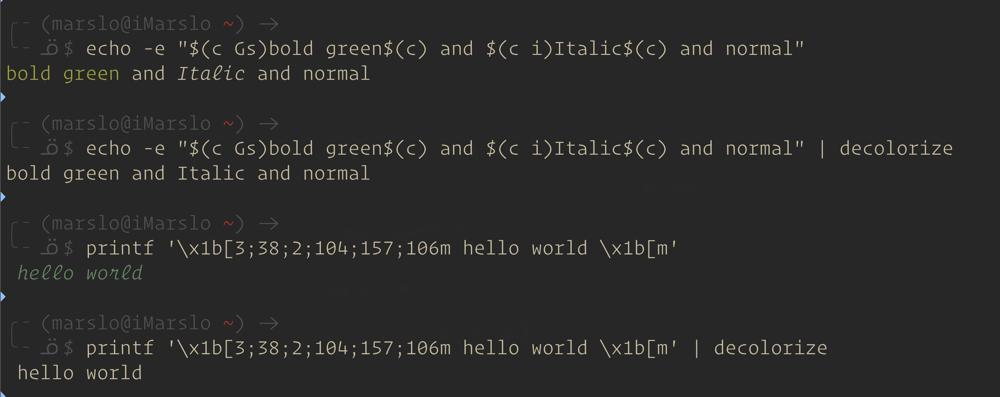](../screenshot/colors/ansi/decolorize.png)
