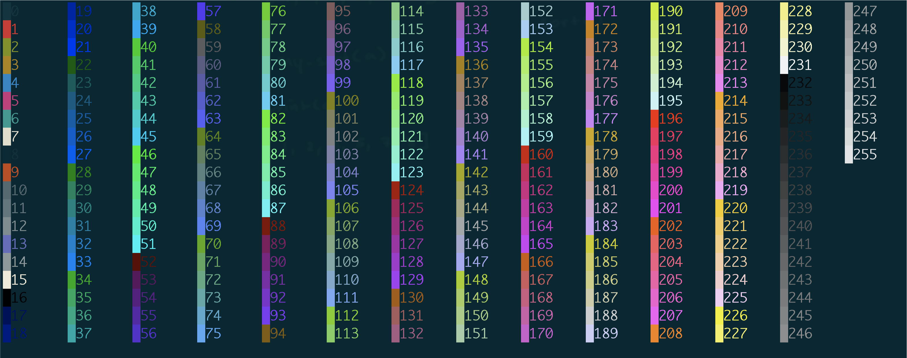
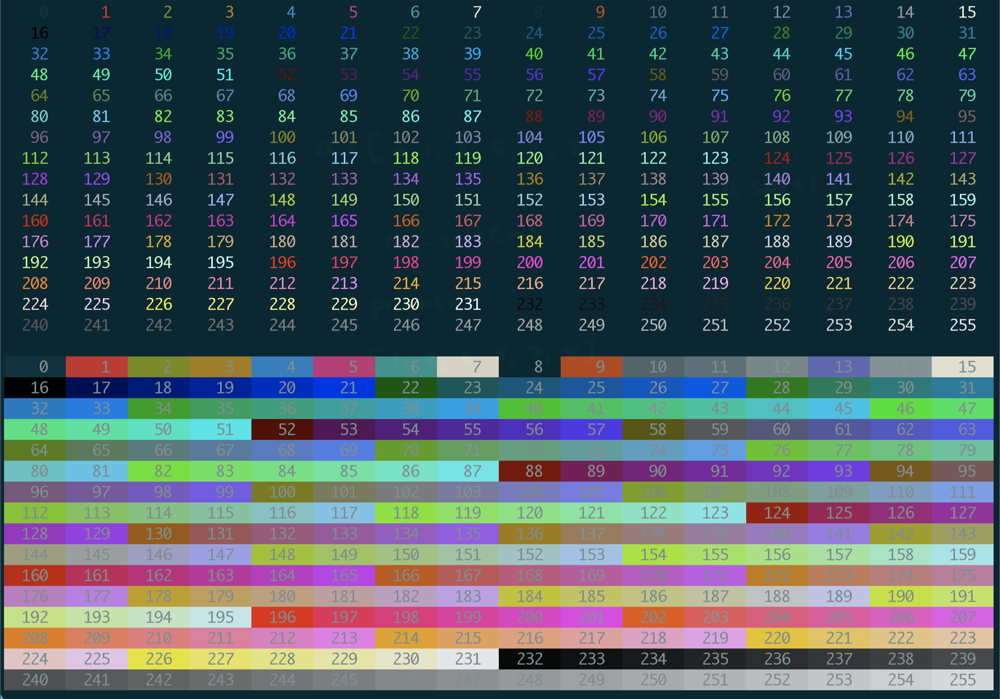
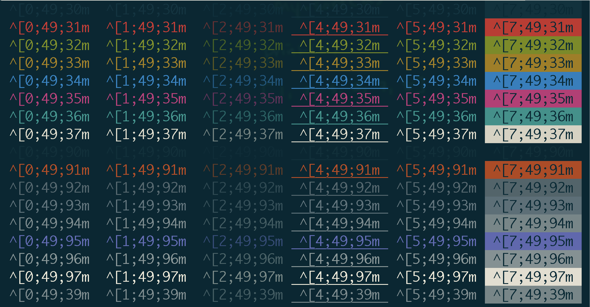
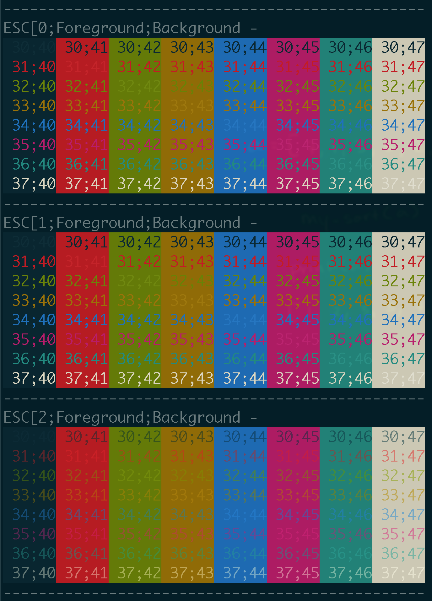
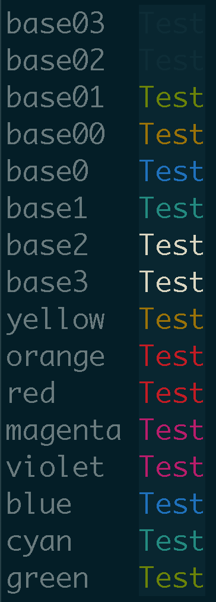

<!-- START doctoc generated TOC please keep comment here to allow auto update -->
<!-- DON'T EDIT THIS SECTION, INSTEAD RE-RUN doctoc TO UPDATE -->
**Table of Contents**  *generated with [DocToc](https://github.com/thlorenz/doctoc)*

- [scripts](#scripts)
  - [bash](#bash)
- [prompt](#prompt)
  - [256 foreground and background colors - full chart](#256-foreground-and-background-colors---full-chart)

<!-- END doctoc generated TOC please keep comment here to allow auto update -->


> reference:
> - [Bash tips: Colors and formatting (ANSI/VT100 Control sequences)](https://misc.flogisoft.com/bash/tip_colors_and_formatting)
> - [Bash Colors](https://www.shellhacks.com/bash-colors/)
> - [color grid](http://www.quut.com/berlin/ht/cgrid.html)
> - [What color codes can I use in my PS1 prompt?](https://unix.stackexchange.com/a/124409/29178)
> - [Colours and Cursor Movement With tput](https://tldp.org/HOWTO/Bash-Prompt-HOWTO/x405.html)
> - [The 5 Best Color Picker Apps for Mac](https://www.makeuseof.com/tag/color-picker-apps-mac/)
> - [256 Colors Cheat Sheet](https://www.ditig.com/256-colors-cheat-sheet)
> - [xterm 256color chart.svg](https://commons.wikimedia.org/wiki/File:Xterm_256color_chart.svg)


## scripts
### bash
- 256 colors
  ```bash
  function 256color() {
    for i in {0..255}; do
      echo -e "\e[38;05;${i}m█${i}";
    done | column -c 180 -s ' '; echo -e "\e[m"
  }
  ```
  

  ```bash
  #!/bin/bash

  # This program is free software. It comes without any warranty, to
  # the extent permitted by applicable law. You can redistribute it
  # and/or modify it under the terms of the Do What The Fuck You Want
  # To Public License, Version 2, as published by Sam Hocevar. See
  # http://sam.zoy.org/wtfpl/COPYING for more details.

  for fgbg in 38 48 ; do # Foreground / Background
      for color in {0..255} ; do # Colors
          # Display the color
          printf "\e[${fgbg};5;%sm  %3s  \e[0m" $color $color
          # Display 6 colors per lines
          if [ $((($color + 1) % 6)) == 4 ] ; then
              echo # New line
          fi
      done
      echo # New line
  done
  exit 0
  ```
  

- colors and formatting
  ```bash
  #!/bin/bash

  # This program is free software. It comes without any warranty, to
  # the extent permitted by applicable law. You can redistribute it
  # and/or modify it under the terms of the Do What The Fuck You Want
  # To Public License, Version 2, as published by Sam Hocevar. See
  # http://sam.zoy.org/wtfpl/COPYING for more details.

  #Background
  for clbg in {40..47} {100..107} 49 ; do
    #Foreground
    for clfg in {30..37} {90..97} 39 ; do
      #Formatting
      for attr in 0 1 2 4 5 7 ; do
        #Print the result
        echo -en "\e[${attr};${clbg};${clfg}m ^[${attr};${clbg};${clfg}m \e[0m"
      done
      echo #Newline
    done
  done
  exit 0
  ```
  

  ```bash
  for attr in 0 1 2 3 4 5 6 7; do
    echo "------------------------------------------------"
    printf "ESC[%s;Foreground;Background - \n" $attr
    for fore in 30 31 32 33 34 35 36 37; do
        for back in 40 41 42 43 44 45 46 47; do
            printf '\033[%s;%s;%sm %02s;%02s\033[0m' $attr $fore $back $fore $back
        done
    printf '\n'
    done
    printf '\033[0m'
  done
  ```
  

- solarized color
  ```bash
  #!/bin/bash

  # solarized ansicolors (exporting for grins)
  export base03='\033[0;30;40m'
  export base02='\033[1;30;40m'
  export base01='\033[0;32;40m'
  export base00='\033[0;33;40m'
  export base0='\033[0;34;40m'
  export base1='\033[0;36;40m'
  export base2='\033[0;37;40m'
  export base3='\033[1;37;40m'
  export yellow='\033[1;33;40m'
  export orange='\033[0;31;40m'
  export red='\033[1;31;40m'
  export magenta='\033[1;35;40m'
  export violet='\033[0;35;40m'
  export blue='\033[1;34;40m'
  export cyan='\033[1;36;40m'
  export green='\033[1;32;40m'
  export reset='\033[0m'

  colors () {
    echo -e "base03  ${base03}Test$reset"
    echo -e "base02  ${base02}Test$reset"
    echo -e "base01  ${base01}Test$reset"
    echo -e "base00  ${base00}Test$reset"
    echo -e "base0   ${base0}Test$reset"
    echo -e "base1   ${base1}Test$reset"
    echo -e "base2   ${base2}Test$reset"
    echo -e "base3   ${base3}Test$reset"
    echo -e "yellow  ${yellow}Test$reset"
    echo -e "orange  ${orange}Test$reset"
    echo -e "red     ${red}Test$reset"
    echo -e "magenta ${magenta}Test$reset"
    echo -e "violet  ${violet}Test$reset"
    echo -e "blue    ${blue}Test$reset"
    echo -e "cyan    ${cyan}Test$reset"
    echo -e "green   ${green}Test$reset"
  }
  colors
  ```
  

## prompt
> reference:
> - [Bash/Prompt customization](https://wiki.archlinux.org/index.php/Bash/Prompt_customization)
> - [Colors using tput](https://wiki.bash-hackers.org/scripting/terminalcodes#colors_using_tput)

```bash
PS1="\[$(tput setaf 0)\]my prompt\[$(tput sgr0)\]> "
PS1="\[$(tput setaf 1)\]my prompt\[$(tput sgr0)\]> "
PS1="\[$(tput setaf 2)\]my prompt\[$(tput sgr0)\]> "
PS1="\[$(tput setaf 3)\]my prompt\[$(tput sgr0)\]> "
PS1="\[$(tput setaf 4)\]my prompt\[$(tput sgr0)\]> "
PS1="\[$(tput setaf 5)\]my prompt\[$(tput sgr0)\]> "
PS1="\[$(tput setaf 6)\]my prompt\[$(tput sgr0)\]> "
PS1="\[$(tput setaf 7)\]my prompt\[$(tput sgr0)\]> "
PS1="\[$(tput setaf 8)\]my prompt\[$(tput sgr0)\]> "
PS1="\[$(tput setaf 9)\]my prompt\[$(tput sgr0)\]> "
PS1="\[$(tput setaf 10)\]my prompt\[$(tput sgr0)\]> "
PS1="\[$(tput setaf 11)\]my prompt\[$(tput sgr0)\]> "
PS1="\[$(tput setaf 12)\]my prompt\[$(tput sgr0)\]> "
PS1="\[$(tput setaf 13)\]my prompt\[$(tput sgr0)\]> "
PS1="\[$(tput setaf 14)\]my prompt\[$(tput sgr0)\]> "
PS1="\[$(tput setaf 15)\]my prompt\[$(tput sgr0)\]> "
PS1="\[$(tput setaf 16)\]my prompt\[$(tput sgr0)\]> "
PS1="\[$(tput setaf 17)\]my prompt\[$(tput sgr0)\]> "
PS1="\[$(tput setaf 18)\]my prompt\[$(tput sgr0)\]> "
```


- or
  ```bash
  $ DEFAULT="\[$(tput setaf 3)\]"         # or '\[\033[1;38;5;3m\]'     or '\[\e[1;33m\]'
  $ ifDEFAULT='\[\e[1\;33m\]'             # or '\[\033[1\;38\;5\;3m\]'
  $ ifRED='\[\e[1\;31m\]'                 # or '\[\033[1\;38\;5\;1m\]'
  $ PS1="${DEFAULT}my prompt${RESET} \$( if [ \$? != 0 ]; then echo -e ${ifRED}\\$; else echo -e ${ifDEFAULT}\\$; fi) ${RESET}"
  ```
  

- right prompt
  ```
  rightprompt()
  {
    printf "%*s" $COLUMNS "right prompt"
  }
  PS1='\[$(tput sc; rightprompt; tput rc)\]left prompt > '
  ```
  


### [256 foreground and background colors - full chart](https://pypi.org/project/colored/)


<a title="Jasonm23, CC0, via Wikimedia Commons" href="https://commons.wikimedia.org/wiki/File:Xterm_256color_chart.svg">
  
</a>

| Code | Description         |
|:----:|---------------------|
|   0  | black               |
|   1  | red                 |
|   2  | green               |
|   3  | yellow              |
|   4  | blue                |
|   5  | magenta             |
|   6  | cyan                |
|   7  | light_gray          |
|   8  | dark_gray           |
|   9  | light_red           |
|  10  | light_green         |
|  11  | light_yellow        |
|  12  | light_blue          |
|  13  | light_magenta       |
|  14  | light_cyan          |
|  15  | white               |
|  16  | grey_0              |
|  17  | navy_blue           |
|  18  | dark_blue           |
|  19  | blue_3a             |
|  20  | blue_3b             |
|  21  | blue_1              |
|  22  | dark_green          |
|  23  | deep_sky_blue_4a    |
|  24  | deep_sky_blue_4b    |
|  25  | deep_sky_blue_4c    |
|  26  | dodger_blue_3       |
|  27  | dodger_blue_2       |
|  28  | green_4             |
|  29  | spring_green_4      |
|  30  | turquoise_4         |
|  31  | deep_sky_blue_3a    |
|  32  | deep_sky_blue_3b    |
|  33  | dodger_blue_1       |
|  34  | green_3a            |
|  35  | spring_green_3a     |
|  36  | dark_cyan           |
|  37  | light_sea_green     |
|  38  | deep_sky_blue_2     |
|  39  | deep_sky_blue_1     |
|  40  | green_3b            |
|  41  | spring_green_3b     |
|  42  | spring_green_2a     |
|  43  | cyan_3              |
|  44  | dark_turquoise      |
|  45  | turquoise_2         |
|  46  | green_1             |
|  47  | spring_green_2b     |
|  48  | spring_green_1      |
|  49  | medium_spring_green |
|  50  | cyan_2              |
|  51  | cyan_1              |
|  52  | dark_red_1          |
|  53  | deep_pink_4a        |
|  54  | purple_4a           |
|  55  | purple_4b           |
|  56  | purple_3            |
|  57  | blue_violet         |
|  58  | orange_4a           |
|  59  | grey_37             |
|  60  | medium_purple_4     |
|  61  | slate_blue_3a       |
|  62  | slate_blue_3b       |
|  63  | royal_blue_1        |
|  64  | chartreuse_4        |
|  65  | dark_sea_green_4a   |
|  66  | pale_turquoise_4    |
|  67  | steel_blue          |
|  68  | steel_blue_3        |
|  69  | cornflower_blue     |
|  70  | chartreuse_3a       |
|  71  | dark_sea_green_4b   |
|  72  | cadet_blue_2        |
|  73  | cadet_blue_1        |
|  74  | sky_blue_3          |
|  75  | steel_blue_1a       |
|  76  | chartreuse_3b       |
|  77  | pale_green_3a       |
|  78  | sea_green_3         |
|  79  | aquamarine_3        |
|  80  | medium_turquoise    |
|  81  | steel_blue_1b       |
|  82  | chartreuse_2a       |
|  83  | sea_green_2         |
|  84  | sea_green_1a        |
|  85  | sea_green_1b        |
|  86  | aquamarine_1a       |
|  87  | dark_slate_gray_2   |
|  88  | dark_red_2          |
|  89  | deep_pink_4b        |
|  90  | dark_magenta_1      |
|  91  | dark_magenta_2      |
|  92  | dark_violet_1a      |
|  93  | purple_1a           |
|  94  | orange_4b           |
|  95  | light_pink_4        |
|  96  | plum_4              |
|  97  | medium_purple_3a    |
|  98  | medium_purple_3b    |
|  99  | slate_blue_1        |
|  100 | yellow_4a           |
|  101 | wheat_4             |
|  102 | grey_53             |
|  103 | light_slate_grey    |
|  104 | medium_purple       |
|  105 | light_slate_blue    |
|  106 | yellow_4b           |
|  107 | dark_olive_green_3a |
|  108 | dark_green_sea      |
|  109 | light_sky_blue_3a   |
|  110 | light_sky_blue_3b   |
|  111 | sky_blue_2          |
|  112 | chartreuse_2b       |
|  113 | dark_olive_green_3b |
|  114 | pale_green_3b       |
|  115 | dark_sea_green_3a   |
|  116 | dark_slate_gray_3   |
|  117 | sky_blue_1          |
|  118 | chartreuse_1        |
|  119 | light_green_2       |
|  120 | light_green_3       |
|  121 | pale_green_1a       |
|  122 | aquamarine_1b       |
|  123 | dark_slate_gray_1   |
|  124 | red_3a              |
|  125 | deep_pink_4c        |
|  126 | medium_violet_red   |
|  127 | magenta_3a          |
|  128 | dark_violet_1b      |
|  129 | purple_1b           |
|  130 | dark_orange_3a      |
|  131 | indian_red_1a       |
|  132 | hot_pink_3a         |
|  133 | medium_orchid_3     |
|  134 | medium_orchid       |
|  135 | medium_purple_2a    |
|  136 | dark_goldenrod      |
|  137 | light_salmon_3a     |
|  138 | rosy_brown          |
|  139 | grey_63             |
|  140 | medium_purple_2b    |
|  141 | medium_purple_1     |
|  142 | gold_3a             |
|  143 | dark_khaki          |
|  144 | navajo_white_3      |
|  145 | grey_69             |
|  146 | light_steel_blue_3  |
|  147 | light_steel_blue    |
|  148 | yellow_3a           |
|  149 | dark_olive_green_3  |
|  150 | dark_sea_green_3b   |
|  151 | dark_sea_green_2    |
|  152 | light_cyan_3        |
|  153 | light_sky_blue_1    |
|  154 | green_yellow        |
|  155 | dark_olive_green_2  |
|  156 | pale_green_1b       |
|  157 | dark_sea_green_5b   |
|  158 | dark_sea_green_5a   |
|  159 | pale_turquoise_1    |
|  160 | red_3b              |
|  161 | deep_pink_3a        |
|  162 | deep_pink_3b        |
|  163 | magenta_3b          |
|  164 | magenta_3c          |
|  165 | magenta_2a          |
|  166 | dark_orange_3b      |
|  167 | indian_red_1b       |
|  168 | hot_pink_3b         |
|  169 | hot_pink_2          |
|  170 | orchid              |
|  171 | medium_orchid_1a    |
|  172 | orange_3            |
|  173 | light_salmon_3b     |
|  174 | light_pink_3        |
|  175 | pink_3              |
|  176 | plum_3              |
|  177 | violet              |
|  178 | gold_3b             |
|  179 | light_goldenrod_3   |
|  180 | tan                 |
|  181 | misty_rose_3        |
|  182 | thistle_3           |
|  183 | plum_2              |
|  184 | yellow_3b           |
|  185 | khaki_3             |
|  186 | light_goldenrod_2a  |
|  187 | light_yellow_3      |
|  188 | grey_84             |
|  189 | light_steel_blue_1  |
|  190 | yellow_2            |
|  191 | dark_olive_green_1a |
|  192 | dark_olive_green_1b |
|  193 | dark_sea_green_1    |
|  194 | honeydew_2          |
|  195 | light_cyan_1        |
|  196 | red_1               |
|  197 | deep_pink_2         |
|  198 | deep_pink_1a        |
|  199 | deep_pink_1b        |
|  200 | magenta_2b          |
|  201 | magenta_1           |
|  202 | orange_red_1        |
|  203 | indian_red_1c       |
|  204 | indian_red_1d       |
|  205 | hot_pink_1a         |
|  206 | hot_pink_1b         |
|  207 | medium_orchid_1b    |
|  208 | dark_orange         |
|  209 | salmon_1            |
|  210 | light_coral         |
|  211 | pale_violet_red_1   |
|  212 | orchid_2            |
|  213 | orchid_1            |
|  214 | orange_1            |
|  215 | sandy_brown         |
|  216 | light_salmon_1      |
|  217 | light_pink_1        |
|  218 | pink_1              |
|  219 | plum_1              |
|  220 | gold_1              |
|  221 | light_goldenrod_2b  |
|  222 | light_goldenrod_2c  |
|  223 | navajo_white_1      |
|  224 | misty_rose1         |
|  225 | thistle_1           |
|  226 | yellow_1            |
|  227 | light_goldenrod_1   |
|  228 | khaki_1             |
|  229 | wheat_1             |
|  230 | cornsilk_1          |
|  231 | grey_100            |
|  232 | grey_3              |
|  233 | grey_7              |
|  234 | grey_11             |
|  235 | grey_15             |
|  236 | grey_19             |
|  237 | grey_23             |
|  238 | grey_27             |
|  239 | grey_30             |
|  240 | grey_35             |
|  241 | grey_39             |
|  242 | grey_42             |
|  243 | grey_46             |
|  244 | grey_50             |
|  245 | grey_54             |
|  246 | grey_58             |
|  247 | grey_62             |
|  248 | grey_66             |
|  249 | grey_70             |
|  250 | grey_74             |
|  251 | grey_78             |
|  252 | grey_82             |
|  253 | grey_85             |
|  254 | grey_89             |
|  255 | grey_93             |
|  256 | default             |
