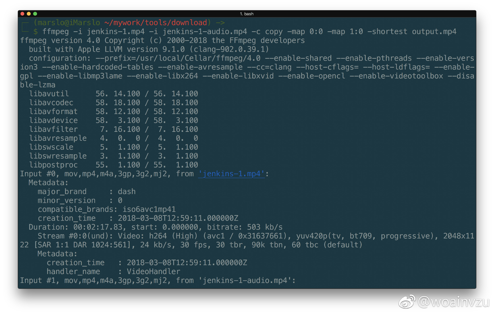
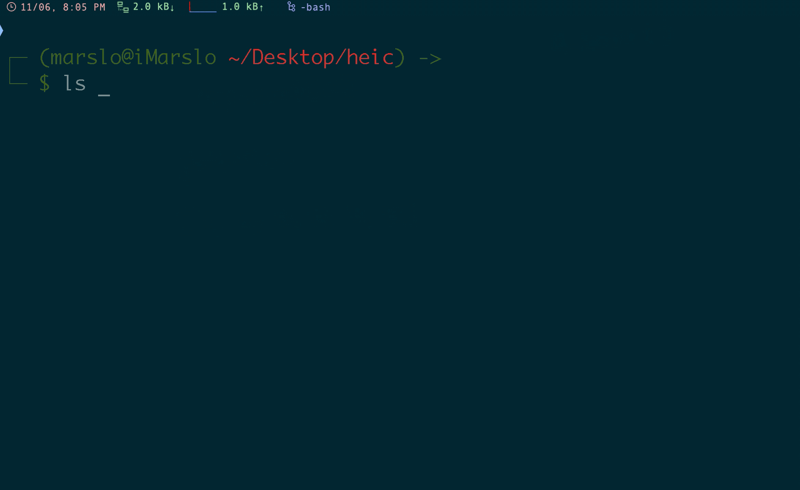

<!-- START doctoc generated TOC please keep comment here to allow auto update -->
<!-- DON'T EDIT THIS SECTION, INSTEAD RE-RUN doctoc TO UPDATE -->

- [highly recommanded](#highly-recommanded)
- [video](#video)
  - [get audio from video](#get-audio-from-video)
  - [convert flv to mp4](#convert-flv-to-mp4)
  - [convert png to mp4](#convert-png-to-mp4)
  - [scale the media](#scale-the-media)
  - [combine video and audio](#combine-video-and-audio)
  - [compression mov](#compression-mov)
  - [convert mov to mp4](#convert-mov-to-mp4)
  - [convert video to gif](#convert-video-to-gif)
  - [convert pngs into gif](#convert-pngs-into-gif)
- [image](#image)
  - [convert webp to png](#convert-webp-to-png)
  - [identity an image](#identity-an-image)
  - [convert svg to png](#convert-svg-to-png)
  - [convert HEIC/HEIF to PNG](#convert-heicheif-to-png)

<!-- END doctoc generated TOC please keep comment here to allow auto update -->

## highly recommanded
[cmd.to](https://cmd.to/fm)

## video
### get audio from video
```bash
$ ffmpeg -i source.mpg -f s16le -acodec pcm_s16le audio.raw
```

### convert flv to mp4
```bash
$ ffmpeg -i name.flv -qscale 0 name.mp4
```

### [convert png to mp4](https://www.everythingcli.org/convert-pdf-to-mp4/)


> options:
> - `pic-%02d.png`: Read all images from the current folder with the prefix pic-, a following number of 2 digits (%02d) and an ending of .png
> - `-r 1/5` : Displays each image for 5 seconds
> - `r 30` : Output framerate of 30 fps.
> - `-c:v libx264` : Output video codec: h264
> - `pix_fmt yuv420p` : YUV pixel format


```bash
$ ffmpeg -r 1/5 -i pic-%02d.png -c:v libx264 -r 30 -pix_fmt yuv420p out.mp4
```

### [scale the media](https://www.everythingcli.org/convert-pdf-to-mp4/)
```bash
$ ffmpeg -i out.mp4 -vf scale=-1:720 out_720p.mp4
```

#### convert to 5 mins (300 sec)
```bash
$ ffmpeg -i name.mp4 -ss 0 -t 300 name-5m.mp4
```

#### sequence convert (every 5 mins ~> 300 secs)
- first 5 mins (0 ~> 300)
  ```bash
  $ ffmpeg -i name.mp4 -ss 0 -t 300 name-5m-1.mp4
  ```
- second 5 mins (300*1 ~> 300)
  ```bash
  $ ffmpeg -i name.mp4 -ss 300 -t 300 name-5m-2.mp4
  ```
- third 5 mins (300*2 ~> 300)
  ```bash
  $ ffmpeg -i name.mp4 -ss 600 -t 300 name-5m-3.mp4
  ```

#### [convert pdf to png](https://www.everythingcli.org/convert-pdf-to-mp4/)

- `-density 400` : Set the horizontal resolution of the image


```bash
$ convert -density 400 input.pdf pic.png
```

### combine video and audio
```bash
$ ffmpeg -i <origin-video> -i <origin-audio> -c copy -map 0:0 -map 1:0 -shortest <new-video>
```



### compression mov

> [!NOTE|label:references:]
> - [Reduce MOV file size](https://superuser.com/a/525284/112396)

```bash
$ ffmpeg -i coc-groovy-lsp.org.mov -c:v libx264 -c:a copy -crf 20 coc-groovy-lsp.mov
$ ls -altrh | grep coc-groovy-lsp
-rw-r--r--   1 marslo staff  37M Jan 15 18:39 coc-groovy-lsp.org.mov
-rw-r--r--   1 marslo staff  10M Jan 15 19:02 coc-groovy-lsp.mov

$ ffmpeg -i coc-groovy-lsp-minirc.org.mov -c:v libx264 -c:a copy -crf 20 coc-groovy-lsp-minirc.mov
$ ls -altrh | grep coc-groovy-lsp-minirc
-rw-r--r--   1 marslo staff  14M Jan 15 19:16 coc-groovy-lsp-minirc.org.mov
-rw-r--r--   1 marslo staff 4.1M Jan 15 19:20 coc-groovy-lsp-minirc.mov
```

### convert mov to mp4

> [!NOTE|label:reference:]
> - [convert .mov video to .mp4 with ffmpeg](https://superuser.com/a/1155189/112396)

```bash
# handbrakecli
$ handbrakecli -i {in-video}.mov -e x264 -E facc -o {out-video}.mp4

# ffmpeg
$ ffmpeg -i {in-video}.mov -vcodec h264 -acodec aac {out-video}.mp4
# or
$ ffmpeg -i input.mov -c copy -movflags +faststart output.mp4
```

### convert video to gif

> [!NOTE|label:references:]
> - [How do I convert a video to GIF using ffmpeg, with reasonable quality?](https://superuser.com/a/556031/112396)
>   - options:
>     - `-ss 30`: skip first 30 seconds
>     - `-t 3`: create a 3 second output
>     - `fps=10`: [fps](https://ffmpeg.org/ffmpeg-filters.html#fps) filter sets the frame rate
>     - `scale=320:-1`: resize the output to 320 pixels wide and automatically determine the height, the [lanczos scaling algorithm](https://ffmpeg.org/ffmpeg-scaler.html) is used in this example.
>       - `scale=0:-1`: do not resize
>     - `split[s0][s1]`: [split](https://ffmpeg.org/ffmpeg-filters.html#split) filter will allow everything to be done in one command and avoids having to create a temporary PNG file of the palette
>     - `[s0]palettegen[p];[s1][p]paletteuse`: [palettegen](https://ffmpeg.org/ffmpeg-filters.html#palettegen) and [paletteuse](https://ffmpeg.org/ffmpeg-filters.html#paletteuse) filters will generate and use a custom palette generated from your input
>   - ffmpeg options:
>     - `-vf "fps=10,scale=320:-1:flags=lanczos"` a [filtergraph](https://ffmpeg.org/ffmpeg-filters.html#Filtergraph-description) using the [fps](https://ffmpeg.org/ffmpeg-filters.html#fps) and [scale](https://ffmpeg.org/ffmpeg-filters.html#scale) filters.
>     - `-c:v pam`: chooses the pam image encoder
>     - `-f image2pipe`: chooses the image2pipe muxer
>   - convert options:
>     - `-delay`: set frame rate with a combination of the [fps](https://ffmpeg.org/ffmpeg-filters.html#fps) filter in ffmpeg
>     - `-loop 0`: makes infinite loop
>     - `-layers optimize`: enable the general purpose GIF optimizer
>   - to set rgb
>     `-vf scale=320:-1,format=rgb8,format=rgb24`
> - [ImageMagick Examples -- Animation Optimization](https://www.imagemagick.org/Usage/anim_opt/)
> - [thevangelist/FFMPEG-gif-script-for-bash](https://github.com/thevangelist/FFMPEG-gif-script-for-bash)

```bash
# with specific size
$ ffmpeg -ss 30 -t 3 -i input.mp4 \
         -vf "fps=10,scale=320:-1:flags=lanczos,split[s0][s1];[s0]palettegen[p];[s1][p]paletteuse" \
         -loop 0 output.gif

# or
$ ffmpeg -i input.mp4 -vf "fps=10,scale=320:-1:flags=lanczos" -c:v pam \
         -f image2pipe - | \
         convert -delay 10 - -loop 0 -layers optimize output.gif

# with original size
$ ffmpeg -ss 30 -t 3 -i coc-groovy-minirc.org.mov \
         -vf "fps=35" \
         -loop 0 output.gif

# using ImageMagick
$ convert in.mp4 out.gif
```

- [function](https://superuser.com/a/1154859/112396)
  ```bash
  #### video2gif.sh
  # Convert video to gif file.
  # Usage: video2gif video_file (scale) (fps)
  video2gif() {
    ffmpeg -y -i "${1}" -vf fps=${3:-10},scale=${2:-320}:-1:flags=lanczos,palettegen "${1}.png"
    ffmpeg -i "${1}" -i "${1}.png" -filter_complex "fps=${3:-10},scale=${2:-320}:-1:flags=lanczos[x];[x][1:v]paletteuse" "${1}".gif
    rm "${1}.png"
  }

  REM video2gif.bat
  @echo off
  set arg1=%1
  set arg2=%arg1:~0,-4%
  ffmpeg -y -i %arg1% -vf fps=10,scale=-1:-1:flags=lanczos,palettegen %TEMP%\palette.png
  ffmpeg -i %arg1% -i %TEMP%\palette.png -filter_complex "fps=10,scale=-1:-1:flags=lanczos[x];[x][1:v]paletteuse" %arg2%.gif
  del /f %TEMP%\palette.png

  # usage
  $ video2gif input.flv
  $ video2gif input.flv 320 10
  ```

- [another simple solution](https://superuser.com/a/1268429/112396)
  ```bash
  src="input.flv"
  dest="output.gif"
  palette="/tmp/palette.png"

  ffmpeg -i $src -vf palettegen -y $palette
  ffmpeg -i $src -i $palette -lavfi paletteuse -y $dest
  ```

### convert pngs into gif
```bash
$ convert -delay 5 -loop 0 -dither None -colors 80 "frames/ffout*.png" -fuzz "40%" -layers OptimizeFrame  "output.gif"
```

## image
### [convert webp to png](http://tutorialshares.com/converting-webp-images-with-the-command-line/)
```bash
$ ffmpeg -i file.webp out.png
```
- for multiple images
  ```bash
  $ for x in ls *.webp; do
      ffmpeg -i "$x" "${x%.webp}.jpg"
    done
  ```


### identity an image
```bash
$ identify arms009.jpg | grep -o "[[:digit:]]*x[[:digit:]]*" | tail -1
1024x768
```

### convert svg to png


> references:
> - [Command-line application for converting SVG to PNG on Mac OS X](https://superuser.com/a/142082/112396)
> - ["Bake" an SVG image into a PNG at a given resolution? [closed]](https://superuser.com/a/516112/112396)
> - [Converting large SVG to PNG file](https://superuser.com/a/569235/112396)


- qlmanage
  ```bash
  $ qlmanage -t -s 1000 -o . k-1.svg
  ```

- convert
  ```bash
  $ convert -resize 128x128 input.svg output.png

  # or
  $ convert -density 500 -resize 128x128 input.svg output.png
  $ convert -density 1200 -resize 10000x10000 your.svg your.png
  $ convert -background none -size 1024x1024 infile.svg outfile.png
  ```

### convert HEIC/HEIF to PNG



```bash
$ brew install imagemagick --with-libheif

# for single convert
$ magick convert [-monitor] <name>.HEIC <new-name>.png

# for batch convert
$ magick mogrify [-monitor] -format png *.HEIC.
```
