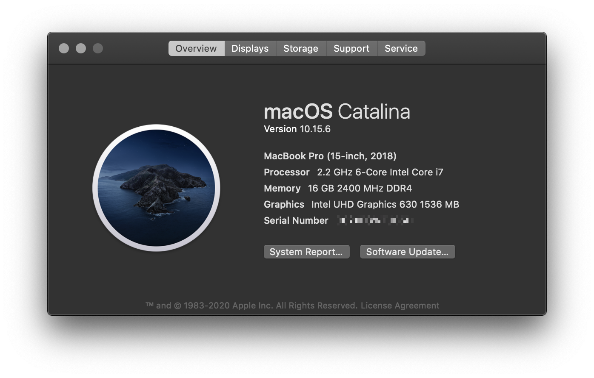
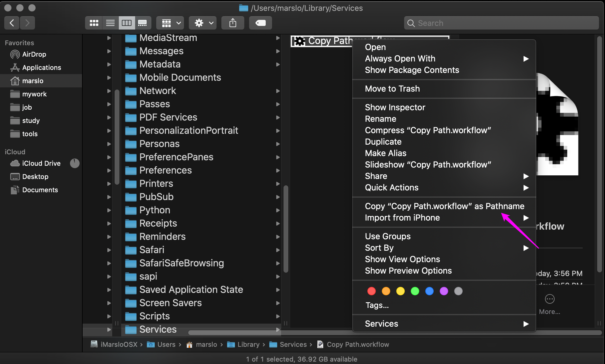
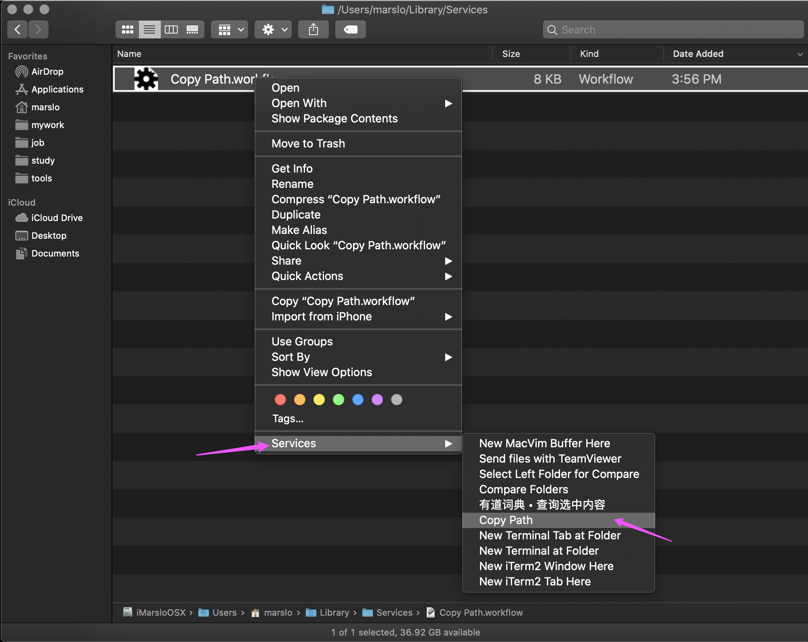
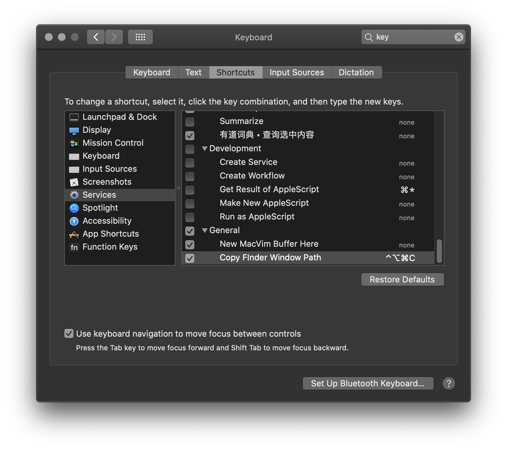
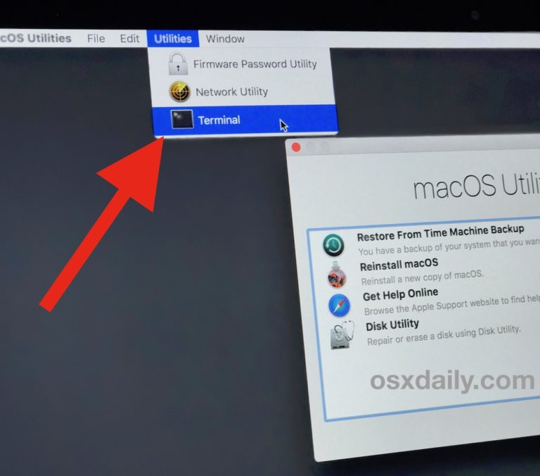

<!-- START doctoc generated TOC please keep comment here to allow auto update -->
<!-- DON'T EDIT THIS SECTION, INSTEAD RE-RUN doctoc TO UPDATE -->
**Table of Contents**  *generated with [DocToc](https://github.com/thlorenz/doctoc)*

  - [system information](#system-information)
    - [Get OSX Info](#get-osx-info)
    - [Reboot if system freezed](#reboot-if-system-freezed)
    - [Setup HostName and LocalHostname](#setup-hostname-and-localhostname)
    - [Setup Bash as default SHELL](#setup-bash-as-default-shell)
    - [Disable Guest User](#disable-guest-user)
    - [Go to Hidden path in Finder](#go-to-hidden-path-in-finder)
    - [ReIndex Spotilght](#reindex-spotilght)
    - [copy STDOUT into clipboard](#copy-stdout-into-clipboard)
    - [Copy path from finder](#copy-path-from-finder)
  - [System Integrity Protection](#system-integrity-protection)
    - [turn off the Rootless System Integrity Protection](#turn-off-the-rootless-system-integrity-protection)
    - [Remove file lock (uchg) flag](#remove-file-lock-uchg-flag)
  - [change Mac default settings](#change-mac-default-settings)
    - [Enable Key Repeat](#enable-key-repeat)
    - [Disable the .DS_Store file](#disable-the-ds_store-file)
    - [Enable the Hidden file](#enable-the-hidden-file)
    - [Reset iTerm Profile](#reset-iterm-profile)
    - [Dock performance setup](#dock-performance-setup)
    - [Safari Font Size](#safari-font-size)
    - [Disable Spotlight](#disable-spotlight)
    - [Disable Notification Center](#disable-notification-center)
    - [Disable the download apps security](#disable-the-download-apps-security)
    - [Disable the dashboard](#disable-the-dashboard)
  - [development environment](#development-environment)
    - [Setup JAVA_HOME](#setup-java_home)
    - [xCode](#xcode)
  - [Homebrew](#homebrew)
    - [Homebrew Installation](#homebrew-installation)
    - [Homebrew Caskroom Installation](#homebrew-caskroom-installation)
    - [Package Installation](#package-installation)
    - [check formula config files](#check-formula-config-files)
  - [system settings](#system-settings)
  - [accessory](#accessory)
    - [iTerm2](#iterm2)
    - [BackgroundMusic](#backgroundmusic)
    - [Mac CLI](#mac-cli)
  - [System tools](#system-tools)
    - [Show System Info](#show-system-info)
    - [Show memeory](#show-memeory)
    - [Others](#others)
  - [Q&A](#qa)
    - [x86_64 liblzma.dylib in nokogiri](#x86_64-liblzmadylib-in-nokogiri)
- [Reference](#reference)

<!-- END doctoc generated TOC please keep comment here to allow auto update -->


## system information
### Get OSX Info
```bash
$ sw_vers
ProductName:	Mac OS X
ProductVersion:	10.15.6
BuildVersion:	19G73

$ /usr/sbin/system_profiler SPHardwareDataType
Hardware:

    Hardware Overview:

      Model Name: MacBook Pro
      Model Identifier: MacBookPro15,1
      Processor Name: 6-Core Intel Core i7
      Processor Speed: 2.2 GHz
      Number of Processors: 1
      Total Number of Cores: 6
      L2 Cache (per Core): 256 KB
      L3 Cache: 9 MB
      Hyper-Threading Technology: Enabled
      Memory: 16 GB
      Boot ROM Version: 1037.147.1.0.0 (iBridge: 17.16.16065.0.0,0)
      Serial Number (system): C02XFGWEJG5H
      Hardware UUID: 4EA008BF-9B36-5F1D-9151-AD4F64808AAB
      Activation Lock Status: Enabled
```



#### get CPU information
```bash
$ sysctl -n machdep.cpu.brand_string
Intel(R) Core(TM) i7-8750H CPU @ 2.20GHz

# or

$ sysctl machdep.cpu
machdep.cpu.max_basic: 22
machdep.cpu.max_ext: 2147483656
machdep.cpu.vendor: GenuineIntel
machdep.cpu.brand_string: Intel(R) Core(TM) i7-8750H CPU @ 2.20GHz
machdep.cpu.family: 6
...
```

#### get more details
```bash
$ sysctl -a
```

### Reboot if system freezed
```bash
$ sudo systemsetup -setrestartfreeze on
```

### Setup HostName and LocalHostname
```bash
$ sudo scutil --set HostName [HOSTNAME]
$ sudo scutil --set LocalHostName [HOSTNAME]
$ sudo scutil --set ComputerName [HOSTNAME]             # Optional
$ dscacheutil -flushcache                               # Flush the DNS Cache
$ sudo shutdown -r now
```

### Setup Bash as default SHELL
```bash
$ chsh -s /bin/bash
# OR
$ chsh -s `which bash`
```

### Disable Guest User
```bash
$ dscl . delete /Users/Guest
$ sudo defaults write /Library/Preferences/com.apple.AppleFileServer guestAccess -bool NO
$ sudo defaults write /Library/Preferences/SystemConfiguration/com.apple.smb.server AllowGuestAccess -bool NO
```

### Go to Hidden path in Finder

<kbd>Command</kbd>+<kbd>Shift</kbd>+<kbd>G</kbd>

### ReIndex Spotilght
```bash
$ sudo mdutil -i on /
$ sudo mdutil -E /
$ sudo mdutil -E /Volumes/marslo/
```

### copy STDOUT into clipboard


- `pbcopy` for macOS
- `xclip` for Linux


```bash
$ <cmd> | pbcopy
```

- example
  ```bash
  $ cat file | pbcopy
  $ pwd | pbcopy
  ```

### Copy path from finder
- [*right-click*(<kbd>control</kbd> + left-click) -> <kbd>option</kbd>](https://osxdaily.com/2013/06/19/copy-file-folder-path-mac-os-x/)



- Automator -> Quick Action




- [Automator -> Apple Script](https://apple.stackexchange.com/a/47234/254265)

  ```bash
  on run {input, parameters}

    try
      tell application "Finder" to set the clipboard to POSIX path of (target of window 1 as alias)
    on error
      beep
    end try

    return input
  end run
  ```





## [System Integrity Protection](https://derflounder.wordpress.com/2015/10/01/system-integrity-protection-adding-another-layer-to-apples-security-model/)
```bash
$ csrutil disable
Successfully disabled System Integrity Protection. Please restart the machine for the changes to take effect.
$ csrutil clear
Successfully cleared System Integrity Proteciton. Please restart the machine for the changes to take effect.
$ sudo chflags restricted /usr/local
```

### turn off the Rootless System Integrity Protection
```bash
$ csrutil status
System Integrity Protection status: enabled.

$ sudo csrutil disable
csrutil: failed to modify system integrity configuration. This tool needs to be executed from the Recovery OS
```

- Reboot System, and press [<kbd>command</kbd>+<kbd>R</kbd>](https://support.apple.com/en-us/HT201314)
- Go to Utilities -> Terminal



- Disable the rootless protection
  ```bash
  -bash-3.2# csrutil status
  System Integrity Protection status: enabled
  -bash-3.2# csrutil disable
  Successfully disabled System Integrity Protection. Please restart the machine for the changes to take effect.
  ```


### [Remove file lock (uchg) flag](https://discussions.apple.com/thread/959001)
```bash
$ chflags -R nouchg *
# OR
$ chflags -R nouchg <PATH of folder>
```

details:
  ```bash
  $ find /usr -flags +sunlnk -print
  /usr/libexec/cups
  find: /usr/sbin/authserver: Permission denied
  /usr/local
  /usr/share/man
  /usr/share/snmp

  $ /bin/ls -lO /usr
  total 0
  drwxr-xr-x  976 root  wheel  restricted 31232 Oct 28 19:17 bin/
  drwxr-xr-x  292 root  wheel  restricted  9344 Oct 28 10:04 lib/
  drwxr-xr-x  234 root  wheel  restricted  7488 Oct 28 19:17 libexec/
  drwxr-xr-x   16 root  wheel  sunlnk       512 Oct 28 19:26 local/
  drwxr-xr-x  246 root  wheel  restricted  7872 Oct 28 09:55 sbin/
  drwxr-xr-x   46 root  wheel  restricted  1472 Oct 28 09:55 share/
  drwxr-xr-x    5 root  wheel  restricted   160 Oct  3 13:48 standalone/

  $ csrutil status
  System Integrity Protection status: enabled.

  $ sudo csrutil disable
  csrutil: failed to modify system integrity configuration. This tool needs to be executed from the Recovery OS

  $ cat /System/Library/Sandbox/rootless.conf

  $ /bin/ls -lO /Applications | grep firefox
  22:drwxr-xr-x   3 marslo  staff  -           96 Dec  7 03:14 Firefox.app
  $ sudo chflags restricted Firefox.app
  $ /bin/ls -lO /Applications | grep firefox
  drwxr-xr-x   3 marslo  staff  restricted  96 Dec  7 03:14 Firefox.app
  ```


## change Mac default settings

### Enable Key Repeat
```bash
$ defaults write -g ApplePressAndHoldEnabled -bool false
```

- Restore to Default
  ```bash
  $ defaults delete -g ApplePressAndHoldEnabled
  ```

### Disable the .DS_Store file
```bash
$ defaults write com.apple.desktopservices DSDontWriteNetworkStores true
```

- Enable the .DS_Store
  ```bash
  $ defaults write com.apple.desktopservices DSDontWriteNetworkStores false
  ```

### Enable the Hidden file
```bash
$ defaults write com.apple.finder AppleShowAllFiles TRUE; killall Finder
# OR
$ defaults write com.apple.finder AppleShowAllFiles YES
```

### Reset iTerm Profile
```bash
$ cd ~/Library/Preferences/com.googlecode.iterm2.plist
$ defaults delete com.googlecode.iterm2
```

### [Dock performance setup](https://sspai.com/post/33493)
- Minize Windows Using "suck" mode
  ```bash
  $ defaults write com.apple.dock mineffect suck; Killall Dock
  ```
  - Restore to Default:
    ```bash
    System Preferences -> Dock -> Minized Windows Using
    ```

- Highlight icon
  ```bash
  $ defaults write com.apple.dock mouse-over-hilite-stack -bool TRUE;killall Dock
  ```

  - Restore to Default:
    ```bash
    $ defaults delete com.apple.dock mouse-over-hilite-stack;killall Dock
    ```

- Remove none-opened apps
  ```bash
  $ defaults write com.apple.dock static-only -boolean true; killall Dock
  ```

  - Restore to Default:
    ```bash
    $ defaults delete com.apple.dock static-only; killall Dock
    ```

- Hidden icon
  ```bash
  $ defaults write com.apple.dock showhidden -bool true; Killall Dock
  ```
  - Restore to Default
    ```bash
    $ defaults delete com.apple.Dock showhidden; Killall Dock
    ```

### [Safari Font Size](https://discussions.apple.com/thread/7674863?start=0&tstart=0)
```bash
$ defaults write com.apple.Safari com.apple.Safari.ContentPageGroupIdentifier.WebKit2MinimumFontSize -int 14
```

### Disable Spotlight
```bash
$ sudo launchctl unload -w /System/Library/LaunchDaemons/com.apple.metadata.mds.plist
```

- Reenable Spotlight
  ```bash
  $ sudo launchctl load -w /System/Library/LaunchDaemons/com.apple.metadata.mds.plist
  ```

### Disable Notification Center
```bash
$ launchctl unload -w /System/Library/LaunchAgents/com.apple.notificationcenterui.plist
$ killall NotificationCenter
```

- Reenable Notifaction Center
  ```bash
  $ launchctl load -w /System/Library/LaunchAgents/com.apple.notificationcenterui.plist
  ```

### Disable the download apps security
```bash
$ defaults write com.apple.LaunchServices LSQuarantine -bool NO
```

- Reenable the download apps security
  ```bash
  $ defaults write com.apple.LaunchServices LSQuarantine -bool YES
  ```

### Disable the dashboard
```bash
$ defaults write com.apple.dashboard mcx-disabled -boolean YES && killall Dock
```

- re-enable the dashboard
  ```bash
  $ defaults write com.apple.dashboard mcx-disabled -boolean NO && killall Dock
  ```

## development environment
### [Setup JAVA_HOME](https://docs.oracle.com/javase/9/install/installation-jdk-and-jre-macos.htm#JSJIG-GUID-C5F0BF25-3487-4F33-9275-7000C8E1C58C)
```bash
$ /usr/libexec/java_home -v 1.8.0.162 -exec javac -versioin
```

### xCode
#### xCode installation
- Install from App Store
- Offline Package
  - [xCode 9.0.1](https://download.developer.apple.com/Developer_Tools/Xcode_9.0.1/Xcode_9.0.1.xip)
  - [Command_Line_Tools_macOS_10.13_for_Xcode_9.0.1](https://download.developer.apple.com/Developer_Tools/Command_Line_Tools_macOS_10.13_for_Xcode_9.0.1/Command_Line_Tools_macOS_10.13_for_Xcode_9.0.1.dmg)
  - [All Packages](https://developer.apple.com/download/more/)
- [more details](../../devops/osx.md#xcode)

#### xCode Setup
```bash
$ sudo xcodebuild -license [accept]
```

#### xCode CommandLine Tools
- Verify installed or not
  ```bash
  $ xcode-select -p
  ```

- xCode CommandLine tools Installation
  ```bash
  $ xcode-select --install
  xcode-select: note: install requested for command line developer tools
  ```

#### xcode Components Installation
```bash
$ for pkg in /Applications/Xcode.app/Contents/Resources/Packages/*.pkg; do
>   sudo installer -pkg "$pkg" -target /;
> done
```

example:
  ```bash
  ┌─ (marslo@marslo  ~) ->
  └─ $ ls -altrh /Applications/Xcode.app/Contents/Resources/Packages/
  total 180512
  -rw-r--r--   1 root  wheel    87K Mar 10  2017 MobileDeviceDevelopment.pkg
  -rw-r--r--   1 root  wheel   5.4M Sep 30 05:28 XcodeSystemResources.pkg
  -rw-r--r--   1 root  wheel    11K Sep 30 05:28 XcodeExtensionSupport.pkg
  -rw-r--r--   1 root  wheel    83M Sep 30 05:28 MobileDevice.pkg
  drwxr-xr-x   6 root  wheel   204B Oct 11 05:23 ./
  drwxr-xr-x  87 root  wheel   2.9K Oct 11 05:55 ../

  ┌─ (marslo@marslo  ~) ->
  └─ $ for pkg in /Applications/Xcode.app/Contents/Resources/Packages/*.pkg; do
   -> sudo installer -pkg "$pkg" -target /;
   -> done
  installer: Package name is MobileDevice
  installer: Upgrading at base path /
  installer: The upgrade was successful.
  installer: Package name is MobileDeviceDevelopment
  installer: Installing at base path /
  installer: The install was successful.
  installer: Package name is XcodeExtensionSupport
  installer: Installing at base path /
  installer: The install was successful.
  installer: Package name is XcodeSystemResources
  installer: Installing at base path /
  installer: The install was successful.
  ```

#### Enable Developer Mode
```bash
$ DevToolsSecurity -enable
```

#### show SDK path
```bash
$ xcrun --show-sdk-path
/Library/Developer/CommandLineTools/SDKs/MacOSX.sdk
```

## Homebrew
### Homebrew Installation
```bash
$ /usr/bin/ruby -e "$(curl -fsSL https://raw.githubusercontent.com/Homebrew/install/master/install)"
```

### Homebrew Caskroom Installation
```bash
$ brew tap caskroom/versions

$ brew cask outdated
$ brew tap buo/cask-upgrade
$ brew update
$ brew cu --all
```

- home brew cask upgrade
  ```bash
  $ brew cu -a -y -f
  ==> Options
  Include auto-update (-a): true
  Include latest (-f): true
  ==> Updating Homebrew
  Already up-to-date.
  ==> Finding outdated apps
         Cask           Current                                         Latest                                          A/U    Result
   1/10  alfred         3.5.1_883                                       3.5.1_883                                        Y   [   OK   ]
   2/10  android-sdk    3859397,26.0.2                                  3859397,26.0.2                                       [   OK   ]
   3/10  dash           4.1.1                                           4.1.1                                            Y   [   OK   ]
   4/10  etcher         1.2.1                                           1.2.1                                                [   OK   ]
   5/10  firefox        57.0.2                                          57.0.2                                           Y   [   OK   ]
   6/10  imageoptim     1.7.3                                           1.7.3                                            Y   [   OK   ]
   7/10  iterm2-beta    3.1.5.beta.1                                    3.1.5.beta.2                                     Y   [ FORCED ]
   8/10  java8          1.8.0_152-b16,aa0333dd3019491ca4f6ddbe78cdb6d0  1.8.0_152-b16,aa0333dd3019491ca4f6ddbe78cdb6d0       [   OK   ]
   9/10  little-snitch  4.0.4                                           4.0.4                                            Y   [   OK   ]
  10/10  mounty         latest                                          latest                                               [   OK   ]
  ==> Found outdated apps
       Cask         Current       Latest        A/U    Result
  1/1  iterm2-beta  3.1.5.beta.1  3.1.5.beta.2   Y   [ FORCED ]

  ==> Upgrading iterm2-beta to 3.1.5.beta.2
  ==> Satisfying dependencies
  ==> Downloading https://iterm2.com/downloads/beta/iTerm2-3_1_5_beta_2.zip
  ######################################################################## 100.0%
  ==> Verifying checksum for Cask iterm2-beta
  ==> Installing Cask iterm2-beta
  Warning: It seems there is already an App at '/Applications/iTerm.app'; overwriting.
  ==> Removing App '/Applications/iTerm.app'.
  ==> Moving App 'iTerm.app' to '/Applications/iTerm.app'.
  🍺  iterm2-beta was successfully installed!
  ```

  - [or](https://stackoverflow.com/a/31994862/2940319)
  ```bash
  $ brew upgrade --cask --greedy
  ```

### Package Installation
> more on [mytools/osx/belloMyOSX](https://github.com/marslo/mytools/blob/master/osx/belloMyOSX.sh#L429)
> ```bash
> systemlist="imagemagick coreutils bash proctools pstree vnstat ncdu ipcalc htop ack lsof"
> regularlist="wget tmux corkscrew tig ifstat binutils diffutils gawk gnutls gzip less file-formula stow telnet iproute2mac ctags jshon colordiff tree vifm p7zip git mas htop watch jfrog-cli-go youtube-dl etcd mas figlet screenfetch glances bash-completion@2 dos2unix nmap rename renameutils pipenv inetutils hadolint"
> regularheadlist="shellcheck bats jq gradle-completion git-flow"
> gnulist="gnu-sed gnu-tar gnu-which grep ed findutils gnu-indent"
> ```

```bash
# utils
$ brew install imagemagick coreutils moreutils bash proctools pstree vnstat ncdu ipcalc htop ack lsof
$ brew install wget tmux corkscrew telnet figlet
$ brew install gnu-sed --with-default-names
$ brew install stow iproute2mac pandoc
$ brew install macvim

$ brew install wdiff --with-gettext
$ brew install less --with-pcre
```

- deprecated (macvim)
  ```bash
  $ brew install macvim --with-override-system-vim --HEAD
  # OR
  $ brew tap macvim-dev/macvim
  $ brew install --HEAD macvim-dev/macvim/macvim

  $ brew linkapps macvim
  # OR
  $ brew linkapps
  # OR
  $ HOME_APPS = File.expand_path("/Applications")
  # OR (Using none-link Info.plist and PkgInfo in *.app/Contents/)
  $ mkdir -p /Applications/gVim.app/Contents
  $ ln -sf /usr/local/Cellar/macvim/HEAD-a5e0355/gVim.app/Contents/* /Applications/gVim.app/Contents/
  $ mv /Applications/gVim.app/Contents/Info.plist{,.link}
  $ mv /Applications/gVim.app/Contents/PkgInfo{,.link}
  $ cp /Applications/gVim.app/Contents/Info.plist{.link,}
  $ cp /Applications/gVim.app/Contents/PkgInfo{.link,}
  ```

- `brew upgrade` ignore specific formulas
> [Ignore formula on brew upgrade](https://stackoverflow.com/a/48995512/2940319)

```bash
$ brew pin macvim
$ brew list --pinned
macvim

$ brew upgrade
Updating Homebrew...
Error: Not upgrading 1 pinned package:
macvim HEAD-caf7642_1
==> Upgrading 6 outdated packages:
ghostscript 9.53.2 -> 9.53.3
groovy 3.0.5 -> 3.0.6
node 14.12.0 -> 14.13.1
unbound 1.11.0 -> 1.12.0
nmap 7.80_1 -> 7.90
imagemagick 7.0.10-31 -> 7.0.10-34
...
```
  - unpin
  ```bash
  $ brew unpin macvim
  $ brew list --pinned
  ```

#### Spotlight Error
```bash
$ xattr -dr com.apple.quarantine MacVim.app
$ osascript -e 'tell application "Finder" to make alias file to POSIX file "/usr/local/opt/macvim/MacVim.app" at POSIX file "/Applications"'
```

- Warning
  ```bash
  $ brew linkapps macvim
  Warning: `brew linkapps` has been deprecated and will eventually be removed!

  Unfortunately `brew linkapps` cannot behave nicely with e.g. Spotlight using
  either aliases or symlinks and Homebrew formulae do not build "proper" `.app`
  bundles that can be relocated. Instead, please consider using `brew cask` and
  migrate formulae using `.app`s to casks.
  Linking: /usr/local/opt/macvim/MacVim.app
  Linked 1 app to /Applications
  ```

- macvim build install from sourcode
  ```bash
  $ brew install --HEAD macvim-dev/macvim/macvim
  ==> Installing macvim from macvim-dev/macvim
  ==> Installing dependencies for macvim-dev/macvim/macvim: python3, lua
  ==> Installing macvim-dev/macvim/macvim dependency: python3
  ==> Downloading https://homebrew.bintray.com/bottles/python3-3.6.3.high_sierra.bottle.tar.gz
  ==> Pouring python3-3.6.3.high_sierra.bottle.tar.gz
  You can try again using `brew postinstall python3`
  ==> Caveats
  Pip, setuptools, and wheel have been installed. To update them
    pip3 install --upgrade pip setuptools wheel

  You can install Python packages with
    pip3 install <package>

  They will install into the site-package directory
    /usr/local/lib/python3.6/site-packages

  See: https://docs.brew.sh/Homebrew-and-Python.html
  ==> Summary
  🍺  /usr/local/Cellar/python3/3.6.3: 3,009 files, 48MB
  ==> Installing macvim-dev/macvim/macvim dependency: lua
  ==> Downloading https://homebrew.bintray.com/bottles/lua-5.3.4_2.high_sierra.bottle.tar.gz
  ==> Pouring lua-5.3.4_2.high_sierra.bottle.tar.gz
  ==> Caveats
  Please be aware due to the way Luarocks is designed any binaries installed
  via Luarocks-5.3 AND 5.1 will overwrite each other in /usr/local/bin.

  This is, for now, unavoidable. If this is troublesome for you, you can build
  rocks with the `--tree=` command to a special, non-conflicting location and
  then add that to your `$PATH`.
  ==> Summary
  🍺  /usr/local/Cellar/lua/5.3.4_2: 147 files, 752.9KB
  ==> Installing macvim-dev/macvim/macvim --HEAD
  ==> Cloning https://github.com/macvim-dev/macvim.git
  Updating /Users/marslo/Library/Caches/Homebrew/macvim--git
  ==> Checking out branch master
  ==> ./configure --prefix=/usr/local/Cellar/macvim/HEAD-4bf1de8 --with-features=huge --enable-multibyte --enable-terminal --enable-netbeans --with-tlib=ncurses --enable-cscope --enable-termtruecolor --enable-perlinterp=dynamic --enable-pythoninterp=dynamic --enable-python3interp=dynamic --enable-rubyinterp=dynamic --enable-luainterp=dynamic --with-lua-prefix=/usr/local
  ==> make
  ==> PATH=/usr/local/Cellar/gettext/0.19.8.1/bin:$PATH MSGFMT=/usr/local/Cellar/gettext/0.19.8.1/bin/msgfmt INSTALL_DATA=install FILEMOD=644 LOCALEDIR=../../src/MacVim/build/Release/MacVim.app/Contents/Resources/vim/runtime/lang make -C src/po install
  🍺  /usr/local/Cellar/macvim/HEAD-4bf1de8: 2,183 files, 39.7MB, built in 1 minute 13 seconds
  ```

### check formula config files
```bash
$ brew -v edit macvim
Editing /usr/local/Homebrew/Library/Taps/homebrew/homebrew-core/Formula/macvim.rb
vim /usr/local/Homebrew/Library/Taps/homebrew/homebrew-core/Formula/macvim.rb
...
    system "./configure", "--with-features=huge",
                          "--enable-multibyte",
                          "--enable-perlinterp",
                          "--enable-rubyinterp",
                          "--enable-tclinterp",
                          "--enable-terminal",
                          "--with-tlib=ncurses",
                          "--with-compiledby=Homebrew",
                          "--with-local-dir=#{HOMEBREW_PREFIX}",
                          "--enable-cscope",
                          "--enable-luainterp",
                          "--with-lua-prefix=#{Formula["lua"].opt_prefix}",
                          "--enable-luainterp",
                          "--enable-python3interp",
                          "--disable-sparkle"
...
```
- manual install formula
> [How to prevent homebrew from upgrading a package?](https://stackoverflow.com/a/48343355/2940319)

  ```bash
  $ brew -v edit macvim
  $ brew -v fetch --deps macvim
  $ brew -v install --build-from-source macvim
  $ brew pin macvim
  ```

## system settings

#### [GNU Coreutils](http://en.wikipedia.org/wiki/GNU_Core_Utilities)
```bash
$ brew install coreutils
```
- GNU Command Line Tools
  ```bash
  $ cat /etc/bashrc
  export PATH="$(brew --prefix coreutils)/libexec/gnubin:/usr/local/bin:$PATH"
  ```

#### bash
```bash
$ brew install bash

$ which -a bash
/usr/local/bin/bash
/bin/bash

$ /usr/local/bin/bash --version
GNU bash, version 4.4.12(1)-release (x86_64-apple-darwin17.0.0)
Copyright (C) 2016 Free Software Foundation, Inc.
License GPLv3+: GNU GPL version 3 or later <http://gnu.org/licenses/gpl.html>

This is free software; you are free to change and redistribute it.
There is NO WARRANTY, to the extent permitted by law.

$ /bin/bash --version
GNU bash, version 3.2.57(1)-release (x86_64-apple-darwin17)
Copyright (C) 2007 Free Software Foundation, Inc.
```

#### development tools
```bash
$ brew install binutils diffutils gawk ctags jshon colordiff tree p7zip gnutls gzip watch
$ brew install jq --devel --HEAD
$ brew install cmake --with-completion --HEAD
$ brew install ed --with-default-names
$ brew install findutils --with-default-names
$ brew install gnu-tar --with-default-names
$ brew install gnu-which --with-default-names
$ brew install grep --with-default-names
$ brew install gnu-indent --with-default-names
$ brew install file-formula
```

#### applications(brew, cask and [mas](https://github.com/mas-cli/mas))
```bash
$ brew tap homebrew/dupes           # Optional
$ brew tap macvim-dev/macvim

$ brew install vim --override-system-vi
$ brew install macvim --with-override-system-vim --HEAD
# OR
$ brew install --HEAD macvim-dev/macvim/macvim

$ brew install jfrog-cli-go         # JFrog CLI OR $ CURL -FL HTTPS://XRAY.JFROG.IO | SH
$ brew install mas                  # app tools like appstore

$ brew install youtube-dl

$ brew cask install firefox
$ brew cask install google-chrome   # OR $ brew cask install google-chrome-dev
$ brew cask install moom            # instead of mas install 419330170
$ brew cask install dash
$ brew cask install little-snitch
$ brew cask install vlc

$ mas install 1256503523            # System Indicators
$ mas install 836500024             # WeChat
$ mas install 1233593954            # MailMaster
$ mas install 467939042             # Growl
$ mas install 497799835             # Xcode
$ mas install 736473980             # Paint
$ mas install 520993579             # pwSafe
$ mas install 944848654             # NeteaseMusic
$ mas install 419330170             # Moom

$ mas list
1256503523 System Indicators (1.0.6)
836500024 WeChat (2.3.5)
1233593954 MailMaster (2.2.2)
467939042 Growl (2.1.3)
497799835 Xcode (9.2)
736473980 Paint 2 (5.6.5)
520993579 pwSafe (4.11)
944848654 NeteaseMusic (1.5.7)
419330170 Moom (3.2.10)
```

#### Alternative list
```bash
$ find /Applications/*.app/Contents/_MASReceipt/receipt -maxdepth 4 -print | sed 's#.app/Contents/_MASReceipt/receipt#.app#g; s#/Applications/##'
Alfred.app
Growl.app
MailMaster.app
Moom.app
NeteaseMusic.app
Paint S.app
System Indicators.app
WeChat.app
Xcode.app
pwSafe.app
```

## accessory
### iTerm2
- Install Shell Integration
  ```bash
  $ curl -L https://iterm2.com/shell_integration/install_shell_integration_and_utilities.sh | bash
  ```
- [more settings](../../tools/iterm2.md)

### [BackgroundMusic](https://github.com/kyleneideck/BackgroundMusic)
```bash
$ (set -eo pipefail; URL='https://github.com/kyleneideck/BackgroundMusic/archive/master.tar.gz'; \
    cd $(mktemp -d); echo Downloading $URL to $(pwd); curl -qfL# $URL | gzcat - | tar x && \
    /bin/bash BackgroundMusic-master/build_and_install.sh -w && rm -rf BackgroundMusic-master)
```

- logs
  ```bash
  $ (set -eo pipefail; URL='https://github.com/kyleneideck/BackgroundMusic/archive/master.tar.gz'; \
   ->     cd $(mktemp -d); echo Downloading $URL to $(pwd); curl -qfL# $URL | gzcat - | tar x && \
   ->     /bin/bash BackgroundMusic-master/build_and_install.sh -w && rm -rf BackgroundMusic-master)
  Downloading https://github.com/kyleneideck/BackgroundMusic/archive/master.tar.gz to /var/folders/dm/dblpttpn3c5cdvg_g2rthhvh0000gn/T/tmp.mixzjjg1
  ######################################################################## 100.0%
  About to install Background Music. Please pause all audio, if you can.

  This script will install:
   - /Applications/Background Music.app
   - /Library/Audio/Plug-Ins/HAL/Background Music Device.driver
   - /Library/Application Support/Background Music/BGMXPCHelper.xpc
   - /Library/LaunchDaemons/com.bearisdriving.BGM.XPCHelper.plist

  Continue (y/N)? y
  Password:

  [1/3] Installing the virtual audio device Background Music Device.driver to /Library/Audio/Plug-Ins/HAL
  [2/3] Installing BGMXPCHelper.xpc to /Library/Application Support/Background Music
  [3/3] Installing Background Music.app to /Applications
  Restarting coreaudiod to load the virtual audio device.
  Launching Background Music.
  Done.
  ```

### [Mac CLI](https://github.com/guarinogabriel/Mac-CLI)
```bash
$ sh -c "$(curl -fsSL https://raw.githubusercontent.com/marslo/mac-cli/master/mac-cli/tools/install)"
```

example:
  ```bash
  $ mac bluetooth:status
  Bluetooth: ON

  $ mac speedtest
  Testing internet connection speed...


       4.2 Mbps ↓
  ```

## System tools
### Show System Info
```bash
$ glances
```

### Show memeory
```bash
$ top -o MEM
```

#### iStat
```bash
 $ istats
--- CPU Stats ---
CPU temp:               53.19°C     ▁▂▃▅▆▇

--- Fan Stats ---
Total fans in system:   2
Fan 0 speed:            2157 RPM    ▁▂▃▅▆▇
Fan 1 speed:            1995 RPM    ▁▂▃▅▆▇

--- Battery Stats ---
Battery health:         unknown
Cycle count:            34          ▁▂▃▅▆▇  3.4%
Max cycles:             1000
Current charge:         6093 mAh    ▁▂▃▅▆▇  100%
Maximum charge:         6237 mAh    ▁▂▃▅▆▇  85.0%
Design capacity:        7336 mAh
Battery temp:           36.5°C

For more stats run `istats extra` and follow the instructions.
```

### Others
#### [markdown-toc](https://github.com/jonschlinkert/markdown-toc)
```bash
$ npm i -g --save markdown-toc --verbose
```

#### [doctoc](https://github.com/thlorenz/doctoc)
```bash
$ npm install -g doctoc
```

- usage
  ```bash
  $ doctoc --gitlab my_osx.md
  $ doctoc --github --maxlevel 3 */*.md
  ```

#### [gitbook](https://www.npmjs.com/package/gitbook)
```bash
$ npm install gitbook-cli -g
```

- usage
  ```bash
  $ gitbook init
  $ gitbook serve
  $ gitbook build
  ```

#### [gitbook-summary](https://www.npmjs.com/package/gitbook-summary)
```bash
$ npm install -g gitbook-summary
```

- usage:
  ```bash
  $ book sm -d -t 'life is hard, make it easier'
  ```

#### [reveal.js](https://github.com/hakimel/reveal.js)
```bash
$ git clone git@github.com:hakimel/reveal.js.git
$ cd reveal.js
$ npm i -g
```

- usage
  ```bash
  $ npm start -- --port=8081 (http://localhost:8081)
  ```

#### [gnomon](https://www.npmjs.com/package/gnomon)
```bash
$ npm i -g gnomon
```

- usage
  ```bash
  $ ping  127.0.0.1 | gnomon
     0.0066s   PING 127.0.0.1 (127.0.0.1): 56 data bytes
     0.8694s   18:13:43.219648 64 bytes from 127.0.0.1: icmp_seq=0 ttl=64 time=0.048 ms
     0.9999s   18:13:44.221333 64 bytes from 127.0.0.1: icmp_seq=1 ttl=64 time=0.116 ms
     1.0004s   18:13:45.221475 64 bytes from 127.0.0.1: icmp_seq=2 ttl=64 time=0.088 ms
     1.0047s   18:13:46.222231 64 bytes from 127.0.0.1: icmp_seq=3 ttl=64 time=0.059 ms
     1.0001s   18:13:47.226847 64 bytes from 127.0.0.1: icmp_seq=4 ttl=64 time=0.101 ms
     1.0049s   18:13:48.227248 64 bytes from 127.0.0.1: icmp_seq=5 ttl=64 time=0.100 ms
     1.0049s   18:13:49.232354 64 bytes from 127.0.0.1: icmp_seq=6 ttl=64 time=0.093 ms
     0.5038s   18:13:50.237433 64 bytes from 127.0.0.1: icmp_seq=7 ttl=64 time=0.091 ms
  ```

#### [iStats](https://github.com/Chris911/iStats)
```bash
$ sudo gem install iStats -n /usr/local/bin
```

- usage
  ```bash
  $ istats  all
  --- CPU Stats ---
  CPU temp:               57.19°C     ▁▂▃▅▆▇

  --- Fan Stats ---
  Total fans in system:   2
  Fan 0 speed:            2146 RPM    ▁▂▃▅▆▇
  Fan 1 speed:            1985 RPM    ▁▂▃▅▆▇

  --- Battery Stats ---
  Battery health:         unknown
  Cycle count:            34          ▁▂▃▅▆▇  3.4%
  Max cycles:             1000
  Current charge:         6073 mAh    ▁▂▃▅▆▇  100%
  Maximum charge:         6236 mAh    ▁▂▃▅▆▇  85.0%
  Design capacity:        7336 mAh
  Battery temp:           35.8°C

  For more stats run `istats extra` and follow the instructions.
  ```

## Q&A
### [x86_64 liblzma.dylib in nokogiri](http://www.nokogiri.org/tutorials/installing_nokogiri.html)
- Solution 1:
  ```bash
  $ brew unlink xz
  $ gem install nokogiri # or gem install cupertino
  $ brew link xz
  ```

- Solutioin 2 (using system libraies):
  ```bash
  $ brew install libxml2
  $ gem install nokogiri -- --use-system-libraries --with-xml2-include=$(brew --prefix libxml2)/include/libxml2
  ```

  or
  ```bash
  $ bundle config build.nokogiri --use-system-libraries --with-xml2-include=$(brew --prefix libxml2)/include/libxml2
  $ bundle install
  ```

  or
  ```bash
  $ brew link --force libxml2
  $ gem install nokogiri -v '1.7.0.1'  -- --use-system-libraries --with-xml2-include=/usr/include/libxml2 --with-xml2-lib=/usr/lib
  ```

# Reference
- [osx chflags man page](https://ss64.com/osx/chflags.html)
- [Show Hidden Files in Mac OS X](http://osxdaily.com/2009/02/25/show-hidden-files-in-os-x/)
- [Mac Keyboard Shortcuts](https://www.danrodney.com/mac/)
- [How to reinstall macOS](https://support.apple.com/en-us/HT204904)
- [How to Find the Wi-Fi Password of your Current Network](https://www.labnol.org/software/find-wi-fi-network-password/28949/)
- [How to Find Wi-Fi Network Passwords from Command Line on Mac](http://osxdaily.com/2015/07/24/find-wi-fi-network-router-password-command-line-mac/)
- [5 Stupid Terminal Tricks to Keep You Entertained](http://osxdaily.com/2012/10/05/stupid-terminal-tricks/)
- [Install Nokogiri](http://www.nokogiri.org/tutorials/installing_nokogiri.html)
- [OSX实用命令](http://blog.topspeedsnail.com/archives/84)
- [Locking files and folders to prevent changes ](http://hints.macworld.com/article.php?story=20031017061722471)
