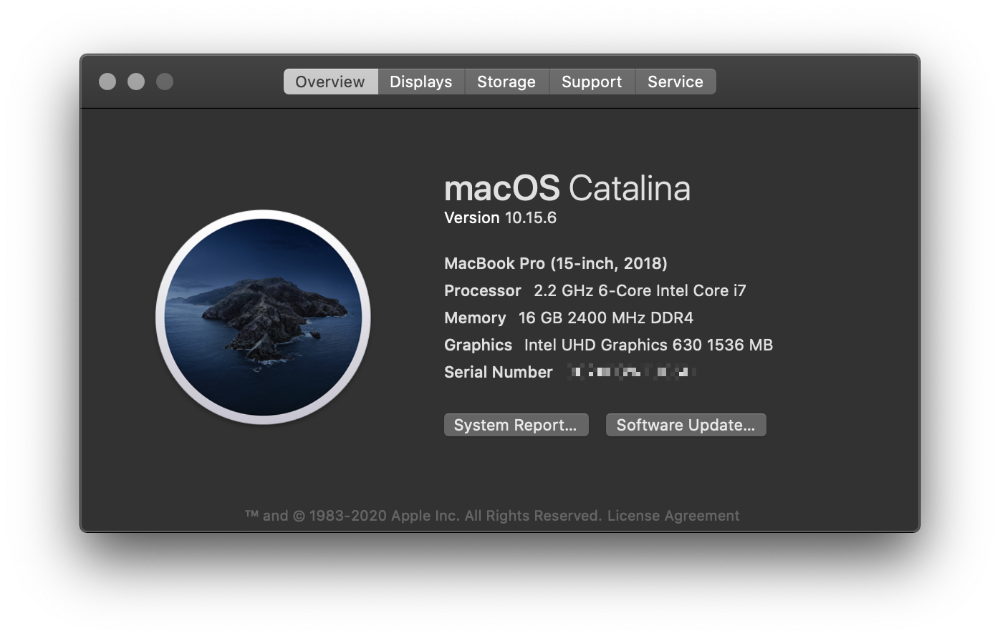

<!-- START doctoc generated TOC please keep comment here to allow auto update -->
<!-- DON'T EDIT THIS SECTION, INSTEAD RE-RUN doctoc TO UPDATE -->

- [system information](#system-information)
  - [get osx info](#get-osx-info)
  - [reboot if system freezes](#reboot-if-system-freezes)
  - [setup hostname and localhostname](#setup-hostname-and-localhostname)
  - [setup bash as default SHELL](#setup-bash-as-default-shell)
  - [disable guest user](#disable-guest-user)
  - [go to hidden path in finder](#go-to-hidden-path-in-finder)
  - [reindex spotlight](#reindex-spotlight)
  - [copy STDOUT into clipboard](#copy-stdout-into-clipboard)
  - [Copy path from finder](#copy-path-from-finder)
- [System Integrity Protection](#system-integrity-protection)
- [change Mac default settings](#change-mac-default-settings)
- [development environment](#development-environment)
  - [setup JAVA_HOME](#setup-java_home)
  - [xCode](#xcode)
- [Homebrew](#homebrew)
- [system settings](#system-settings)
- [accessory](#accessory)
- [q&a](#qa)
  - [x86_64 liblzma.dylib in nokogiri](#x86_64-liblzmadylib-in-nokogiri)
- [tips](#tips)
  - [system tool upgrade](#system-tool-upgrade)

<!-- END doctoc generated TOC please keep comment here to allow auto update -->


> [!TIP|label:reference]
> - [osx chflags man page](https://ss64.com/osx/chflags.html)
> - [Show Hidden Files in Mac OS X](http://osxdaily.com/2009/02/25/show-hidden-files-in-os-x/)
> - [Mac Keyboard Shortcuts](https://www.danrodney.com/mac/)
> - [How to reinstall macOS](https://support.apple.com/en-us/HT204904)
> - [How to Find the Wi-Fi Password of your Current Network](https://www.labnol.org/software/find-wi-fi-network-password/28949/)
> - [How to Find Wi-Fi Network Passwords from Command Line on Mac](http://osxdaily.com/2015/07/24/find-wi-fi-network-router-password-command-line-mac/)
> - [5 Stupid Terminal Tricks to Keep You Entertained](http://osxdaily.com/2012/10/05/stupid-terminal-tricks/)
> - [Install Nokogiri](http://www.nokogiri.org/tutorials/installing_nokogiri.html)
> - [OSX实用命令](http://blog.topspeedsnail.com/archives/84)
> - [Locking files and folders to prevent changes ](http://hints.macworld.com/article.php?story=20031017061722471)

## system information

> [!NOTE|label:references:]
> - [* iMarslo: osx system](../osx/system.md)
> - [`system_profiler -usage`](https://gist.github.com/dive/3070807)
> - [tips and tricks](https://gist.github.com/dive/3070807)

### get osx info
```bash
$ sw_vers
ProductName:  Mac OS X
ProductVersion: 10.15.6
BuildVersion: 19G73

# or
$ sw_vers --productName
macOS
$ sw_vers --productVersion
14.4.1

$ /usr/sbin/system_profiler SPHardwareDataType
Hardware:

    Hardware Overview:

      Model Name: MacBook Pro
      Model Identifier: MacBookPro15,1
      Processor Name: 6-Core Intel Core i7
      Processor Speed: 2.2 GHz
      Number of Processors: 1
      Total Number of Cores: 6
      L2 Cache (per Core): 256 KB
      L3 Cache: 9 MB
      Hyper-Threading Technology: Enabled
      Memory: 16 GB
      Boot ROM Version: 1037.147.1.0.0 (iBridge: 17.16.16065.0.0,0)
      Serial Number (system): C02XFGWEJG5H
      Hardware UUID: 4EA008BF-9B36-5F1D-9151-AD4F64808AAB
      Activation Lock Status: Enabled
```



#### get CPU information
```bash
$ sysctl -n machdep.cpu.brand_string
Intel(R) Core(TM) i7-8750H CPU @ 2.20GHz

# or
$ sysctl machdep.cpu
machdep.cpu.max_basic: 22
machdep.cpu.max_ext: 2147483656
machdep.cpu.vendor: GenuineIntel
machdep.cpu.brand_string: Intel(R) Core(TM) i7-8750H CPU @ 2.20GHz
machdep.cpu.family: 6
...
```

#### get more details
```bash
$ sysctl -a
```

### reboot if system freezes
```bash
$ sudo systemsetup -setrestartfreeze on
```

### setup hostname and localhostname
```bash
$ sudo scutil --set HostName [HOSTNAME]
$ sudo scutil --set LocalHostName [HOSTNAME]
$ sudo scutil --set ComputerName [HOSTNAME]             # Optional
$ dscacheutil -flushcache                               # Flush the DNS Cache
$ sudo shutdown -r now
```

### setup bash as default SHELL
```bash
$ chsh -s /bin/bash
# OR
$ chsh -s `which bash`
```

### disable guest user
```bash
$ dscl . delete /Users/Guest
$ sudo defaults write /Library/Preferences/com.apple.AppleFileServer guestAccess -bool NO
$ sudo defaults write /Library/Preferences/SystemConfiguration/com.apple.smb.server AllowGuestAccess -bool NO
```

### go to hidden path in finder

<kbd>Command</kbd>+<kbd>Shift</kbd>+<kbd>G</kbd>

### reindex spotlight
```bash
$ sudo mdutil -i on /
$ sudo mdutil -E /
$ sudo mdutil -E /Volumes/marslo/
```

- [or](https://www.macrumors.com/how-to/rebuild-spotlight-search-index-on-mac/)
  ```bash
  $ sudo mdutil -i off /
  $ sudo rm -rf /.Spotlight-V100
  $ sudo rm -rf /.Spotlight-V200
  $ sudo mdutil -i on /
  $ sudo mdutil -E /
  $ sudo mdutil -E /Volumes/marslo/
  ```

### copy STDOUT into clipboard
> refer to: [osx/tricky](../osx/tricky.html#copy-stdout-into-clipboard)

### Copy path from finder
> refer to: [osx/tricky](../osx/tricky.html##copy-path-from-finder)

## [System Integrity Protection](https://derflounder.wordpress.com/2015/10/01/system-integrity-protection-adding-another-layer-to-apples-security-model/)
> refer to: [osx/tricky](../osx/osx.html#system-integrity-protection)

## change Mac default settings
> refer to: [osx/defaults](../osx/defaults.html)

## development environment
### [setup JAVA_HOME](https://docs.oracle.com/javase/9/install/installation-jdk-and-jre-macos.htm#JSJIG-GUID-C5F0BF25-3487-4F33-9275-7000C8E1C58C)
```bash
$ /usr/libexec/java_home -v 1.8.0.162 -exec javac -versioin
```

### xCode
> refer to [osx](../osx/osx.html#xcode)

#### xCode installation
- Install from App Store
- Offline Package
  - [xCode 9.0.1](https://download.developer.apple.com/Developer_Tools/Xcode_9.0.1/Xcode_9.0.1.xip)
  - [Command_Line_Tools_macOS_10.13_for_Xcode_9.0.1](https://download.developer.apple.com/Developer_Tools/Command_Line_Tools_macOS_10.13_for_Xcode_9.0.1/Command_Line_Tools_macOS_10.13_for_Xcode_9.0.1.dmg)
  - [All Packages](https://developer.apple.com/download/more/)
- [more details](../osx/osx.html#xcode)

#### xCode setup
```bash
$ sudo xcodebuild -license [accept]
```

#### xCode commandline tools
- verify installed or not
  ```bash
  $ xcode-select -p
  ```

- xCode commandline tools installation
  ```bash
  $ xcode-select --install
  xcode-select: note: install requested for command line developer tools
  ```

- upgrade commandline tools
  ```bash
  $ softwareupdate --all --install --force
  ```
  - or
    ```bash
    $ sudo rm -rf /Library/Developer/CommandLineTools
    $ sudo xcode-select --install
    ```

- list history
  ```bash
  $ softwareupdate --history
  ``

#### xcode components installation
```bash
$ for pkg in /Applications/Xcode.app/Contents/Resources/Packages/*.pkg; do
>   sudo installer -pkg "$pkg" -target /;
> done
```

- example:
  ```bash
  $ ls -altrh /Applications/Xcode.app/Contents/Resources/Packages/
  total 180512
  -rw-r--r--   1 root  wheel    87K Mar 10  2017 MobileDeviceDevelopment.pkg
  -rw-r--r--   1 root  wheel   5.4M Sep 30 05:28 XcodeSystemResources.pkg
  -rw-r--r--   1 root  wheel    11K Sep 30 05:28 XcodeExtensionSupport.pkg
  -rw-r--r--   1 root  wheel    83M Sep 30 05:28 MobileDevice.pkg
  drwxr-xr-x   6 root  wheel   204B Oct 11 05:23 ./
  drwxr-xr-x  87 root  wheel   2.9K Oct 11 05:55 ../

  $ for pkg in /Applications/Xcode.app/Contents/Resources/Packages/*.pkg; do
   -> sudo installer -pkg "$pkg" -target /;
   -> done
  installer: Package name is MobileDevice
  installer: Upgrading at base path /
  installer: The upgrade was successful.
  installer: Package name is MobileDeviceDevelopment
  installer: Installing at base path /
  installer: The install was successful.
  installer: Package name is XcodeExtensionSupport
  installer: Installing at base path /
  installer: The install was successful.
  installer: Package name is XcodeSystemResources
  installer: Installing at base path /
  installer: The install was successful.
  ```

#### enable developer mode
```bash
$ DevToolsSecurity -enable
```

#### show sdk path

> [!NOTE|label:more:]
> - [* iMarslo: osx/apps](../osx/apps.html#xcode)

```bash
$ xcrun --show-sdk-path
/Library/Developer/CommandLineTools/SDKs/MacOSX.sdk
```

## Homebrew
> refer to: [osx/apps.html](../osx/apps.html#homebrew)

## system settings
> refer to: [osx/apps](../osx/apps.html#system-settings)

## accessory
> refer to: [osx/apps](../osx/apps.html#accessory)

## q&a
### [x86_64 liblzma.dylib in nokogiri](http://www.nokogiri.org/tutorials/installing_nokogiri.html)
- solution 1:
  ```bash
  $ brew unlink xz
  $ gem install nokogiri # or gem install cupertino
  $ brew link xz
  ```

- solutioin 2 (using system libraies):
  ```bash
  $ brew install libxml2
  $ gem install nokogiri -- --use-system-libraries --with-xml2-include=$(brew --prefix libxml2)/include/libxml2

  # or
  $ bundle config build.nokogiri --use-system-libraries --with-xml2-include=$(brew --prefix libxml2)/include/libxml2
  $ bundle install

  # or
  $ brew link --force libxml2
  $ gem install nokogiri -v '1.7.0.1'  -- --use-system-libraries --with-xml2-include=/usr/include/libxml2 --with-xml2-lib=/usr/lib
  ```

## tips


### system tool upgrade

#### cmd
```bash
$ /usr/sbin/softwareupdate --all --install --force

# list history
$ /usr/sbin/softwareupdate --history
```

- settings
  ```bash
  $ tail /private/var/log/install.log
  ...
  2024-12-13 00:55:45-08 HNWH3C04CX softwareupdated[572]: SUOSUMobileSoftwareUpdateController: Updating additionalUpdateMetricEventFields: {
        autoUpdate = false;
        buddy = false;
        commandLine = true;
        installTonight = false;
        mdm = false;
        notification = false;
        settings = false;
    }
  ...
  ```

- install/uninstall package

  - `*.pkg`
    ```bash
    $ sudo installer -pkg /path/to/package.pkg -target /
    $ sudo installer -pkg /path/to/package.pkg -target / -uninstall
    ```

#### process
- trustd
  ```bash
  $ ps aux | grep trustd
  marslo             836  10.7  0.1 410449040  22240   ??  S    Thu12PM  11:20.83 /usr/libexec/trustd --agent
  _trustd            414   5.4  0.1 410447680  23744   ??  Ss   Thu12PM  22:51.11 /usr/libexec/trustd
  _spotlight        1768   0.0  0.0 410389120  14144   ??  S    Thu12PM   0:07.70 /usr/libexec/trustd --agent
  _accessoryupdater   677   0.0  0.0 410380144   5728   ??  S    Thu12PM   0:00.93 /usr/libexec/trustd --agent
  _cmiodalassistants   615   0.0  0.0 410380128   5840   ??  S    Thu12PM   0:00.88 /usr/libexec/trustd --agent
  _locationd         570   0.0  0.0 410380144   5872   ??  S    Thu12PM   0:00.87 /usr/libexec/trustd --agent
  marslo           20127   0.0  0.0 410593776   1232 s001  S+   11:31AM   0:00.00 grep -i --color=always trustd
  root               423   0.0  0.0 410346128   3744   ??  Ss   Thu12PM   0:00.04 /usr/libexec/trustdFileHelper
  ```

- accountd
  ```bash
  $ ps aux | grep account
  marslo           34564   0.0  0.0 411096384  12752   ??  Ss   Thu09PM   0:00.12 /System/Library/PrivateFrameworks/RemoteManagement.framework/XPCServices/AccountSubscriber.xpc/Contents/MacOS/AccountSubscriber
  marslo            2037   0.0  0.0 410400912  18096   ??  S    Thu12PM   0:00.61 /usr/libexec/appleaccountd
  _rmd              2032   0.0  0.0 410902768   9696   ??  Ss   Thu12PM   0:00.06 /System/Library/PrivateFrameworks/RemoteManagement.framework/XPCServices/AccountSubscriber.xpc/Contents/MacOS/AccountSubscriber
  root              1442   0.0  0.0 410993328  14272   ??  Ss   Thu12PM   0:08.17 /private/var/db/com.apple.xpc.roleaccountd.staging/exec/16777229.34120.xpc/Contents/MacOS/com.apple.NRD.UpdateBrainService
  root              1443   0.0  0.0 410378000   4240   ??  Ss   Thu12PM   0:00.06 /usr/libexec/xpcroleaccountd -launchd
  marslo             977   0.0  0.1 410442688  19280   ??  S    Thu12PM   0:14.47 /System/Library/PrivateFrameworks/AppleMediaServices.framework/Resources/amsaccountsd
  marslo             817   0.0  0.2 410643792  82720   ??  S    Thu12PM   1:41.97 /System/Library/Frameworks/Accounts.framework/Versions/A/Support/accountsd
  root               601   0.0  0.0 410400864   3984   ??  Ss   Thu12PM   0:00.05 /System/Library/PrivateFrameworks/AccountPolicy.framework/XPCServices/com.apple.AccountPolicyHelper.xpc/Contents/MacOS/com.apple.AccountPolicyHelper
  marslo           13632   0.0  0.0 410433248  12704   ??  S    11:14AM   0:00.11 /System/Library/PrivateFrameworks/CommerceKit.framework/Versions/A/Resources/storeaccountd
  ```

- installd
  ```bash
  $ ps aux | grep installd
  root              1165  92.5  1.8 411273744 668928   ??  Rs   Thu12PM   8:45.34 /System/Library/PrivateFrameworks/PackageKit.framework/Resources/installd
  root              1166   0.0  0.0 410387200  10016   ??  Ss   Thu12PM   0:02.80 /System/Library/PrivateFrameworks/PackageKit.framework/Resources/system_installd
  root               584   0.0  0.0 410360448   6624   ??  Ss   Thu12PM   0:00.04 /usr/libexec/bootinstalld
  root               413   0.0  0.0 411112672   3920   ??  Ss   Thu12PM   0:00.19 /usr/libexec/containermanagerd_system --runmode=privileged --user-container-mode=current --bundle-container-mode=global --bundle-container-owner=_appinstalld --system-container-mode=none
  root               311   0.0  0.0 410189360   4384   ??  Ss   Thu12PM   0:14.45 /System/Library/PrivateFrameworks/Uninstall.framework/Resources/uninstalld
  ```

#### GUI
- Software Update
  ```bash
  $ open "/System/Library/CoreServices/Software Update.app"
  $ open "/System/Library/CoreServices/Software Update.app/Contents/Resources/softwareupdated"
  ```

- SoftwareUpdateNotificationManager
  ```bash
  $ open /System/Library/PrivateFrameworks/SoftwareUpdate.framework/Versions/A/Resources/SoftwareUpdateNotificationManager.app
  $ open /System/Library/PrivateFrameworks/SoftwareUpdate.framework/Versions/A/Resources/SoftwareUpdateNotificationManager.app/Contents/MacOS/SoftwareUpdateNotificationManager
  ```

- patch

  - 14.7.2: `https://swscan.apple.com/content/catalogs/others/index-14-13-12-10.16-10.15-10.14-10.13-10.12-10.11-10.10-10.9-mountainlion-lion-snowleopard-leopard.merged-1.sucatalog.gz`
