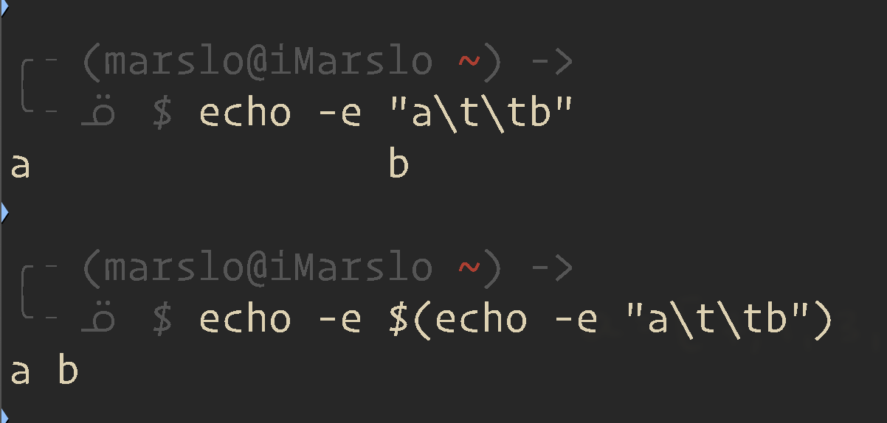
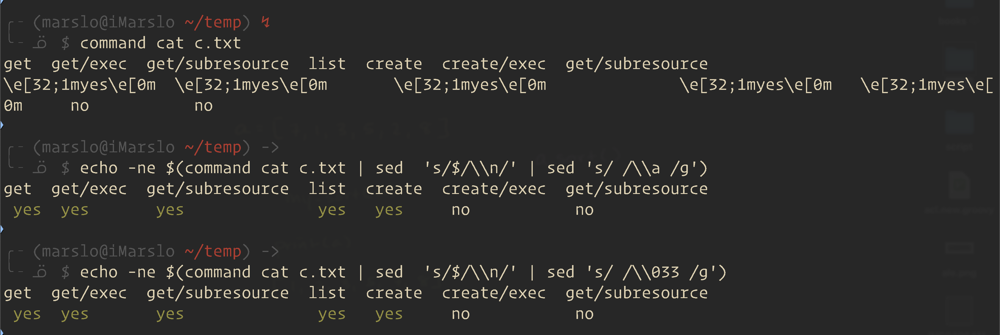

<!-- START doctoc generated TOC please keep comment here to allow auto update -->
<!-- DON'T EDIT THIS SECTION, INSTEAD RE-RUN doctoc TO UPDATE -->

- [charset](#charset)
  - [escape](#escape)
- [encryption](#encryption)
  - [`base64`](#base64)
- [show](#show)
  - [align](#align)
  - [numfmt](#numfmt)
  - [`q`](#q)
- [combinations](#combinations)
  - [single line to multiple lines](#single-line-to-multiple-lines)
    - [execute commands from file](#execute-commands-from-file)
  - [combine every 2 lines](#combine-every-2-lines)
  - [combine every 3 lines](#combine-every-3-lines)
- [format output](#format-output)
  - [echo](#echo)
  - [diff](#diff)
  - [comm](#comm)
  - [join](#join)
  - [alignment](#alignment)
  - [sort](#sort)
    - [sort the last column](#sort-the-last-column)
- [get lines](#get-lines)
  - [get second-to-last line](#get-second-to-last-line)
  - [get next line by the pattern](#get-next-line-by-the-pattern)
  - [get lines between 2 patterns](#get-lines-between-2-patterns)
    - [awk](#awk)
    - [sed](#sed)
    - [with empty line](#with-empty-line)
  - [get line from pattern to the end](#get-line-from-pattern-to-the-end)
    - [get from first empty line to the end](#get-from-first-empty-line-to-the-end)
    - [get from last empty line ( `^$` ) to end](#get-from-last-empty-line--%5E--to-end)
    - [reverse search empty line](#reverse-search-empty-line)
  - [return first matching pattern](#return-first-matching-pattern)
    - [sed](#sed-1)
    - [awk](#awk-1)
  - [return second matching pattern search range](#return-second-matching-pattern-search-range)
  - [return the last matching pattern search range](#return-the-last-matching-pattern-search-range)
    - [sed](#sed-2)
    - [awk](#awk-2)
    - [replace the last matching pattern](#replace-the-last-matching-pattern)
- [`xargs`](#xargs)
  - [complex commands with xargs](#complex-commands-with-xargs)
  - [multiple move](#multiple-move)
  - [subset of arguments](#subset-of-arguments)
  - [sort all shell script by line number](#sort-all-shell-script-by-line-number)
  - [diff every git commit against its parent](#diff-every-git-commit-against-its-parent)
  - [running multiple commands with xargs](#running-multiple-commands-with-xargs)
    - [compress sub-folders](#compress-sub-folders)
    - [ping multiple IPs](#ping-multiple-ips)
  - [read by char](#read-by-char)
- [`find`](#find)
  - [output file name only](#output-file-name-only)
  - [cat config file in all `.git` folder](#cat-config-file-in-all-git-folder)
  - [`exec` and `sed`](#exec-and-sed)
  - [find and rename](#find-and-rename)
  - [find and exclude](#find-and-exclude)
  - [`find` && `tar`](#find--tar)
  - [find by timestamp](#find-by-timestamp)
    - [via `mtime`](#via-mtime)
    - [via `newermt`](#via-newermt)
  - [inject commands inside find](#inject-commands-inside-find)
  - [printf](#printf)
    - [time formats](#time-formats)
- [trim](#trim)
  - [trim tailing chars](#trim-tailing-chars)
  - [remove leading & trailing whitespace](#remove-leading--trailing-whitespace)
  - [remove empty lines](#remove-empty-lines)
  - [search and replace](#search-and-replace)
  - [replace with position](#replace-with-position)
  - [check line ending](#check-line-ending)
  - [remove the ending '\n'](#remove-the-ending-%5Cn)
  - [add '\n' to line-ending](#add-%5Cn-to-line-ending)
- [fold](#fold)
  - [check the params valid](#check-the-params-valid)
- [insert new line](#insert-new-line)
- [write a file without indent space](#write-a-file-without-indent-space)
- [cat](#cat)
  - [`<< -` and `<<`](#---and-)

<!-- END doctoc generated TOC please keep comment here to allow auto update -->

> reference:
> - [10 Awk Tips, Tricks and Pitfalls](https://catonmat.net/ten-awk-tips-tricks-and-pitfalls)
> - [FIND -EXEC VS. FIND | XARGS](https://www.everythingcli.org/find-exec-vs-find-xargs/)

# charset

> [!NOTE|label:references:]
> - [ASCII Table, ISO 1252 Latin-1 Chart & Character Set](https://www.barcodefaq.com/ascii-chart-char-set/)
> - [ASCII Character Chart with Decimal, Binary and Hexadecimal Conversions](https://www.eso.org/~ndelmott/ascii.html)
> - [The difference between "binary" and "text" files](https://dev.to/sharkdp/what-is-a-binary-file-2cf5)
> - [control character](https://en.wikipedia.org/wiki/Control_character)
>
> |   HEX  | NAME            | ABBREVIATION | ESCAPE | CODE |
> |:------:|-----------------|:------------:|:------:|:----:|
> | `0x00` | null            |      NUL     |  `\0`  | `^@` |
> | `0x07` | bell            |      BEL     |  `\a`  | `^G` |
> | `0x08` | backspace       |      BS      |  `\b`  | `^H` |
> | `0x09` | horizontal tab  |      HT      |  `\t`  | `^I` |
> | `0x0a` | line feed       |      LF      |  `\n`  | `^J` |
> | `0x0b` | vertical tab    |      VT      |  `\v`  | `^K` |
> | `0x0c` | form feed       |      FF      |  `\f`  | `^L` |
> | `0x0d` | carriage return |      CR      |  `\r`  | `^M` |
> | `0x1a` | Control-Z       |      SUB     |    -   | `^Z` |
> | `0x1b` | escape          |      ESC     |  `\e`  | `^[` |

- list all charset
  ```bash
  $ iconv --list
  ```

- [convert text-file from utf-8 to iso-8859-1](https://www.linuxquestions.org/questions/linux-server-73/convert-text-file-from-utf-8-to-iso-8859-1-%5Bsolved%5D-560834/)
  ```bash
  $ iconv --from-code=UTF-8 --to-code=ISO-8859-1 inputfile.txt > outputfile.txt
  ```

## escape

> [!NOTE|label:references:]
> - [Difference between single and double quotes in Bash](https://stackoverflow.com/a/6697781/2940319)
> - [How to escape single quotes within single quoted strings](https://stackoverflow.com/q/1250079/2940319)
>
> | ESCAPING SEQUENCES | COMMENTS        |
> |:------------------:|-----------------|
> |        `\'`        | single quote    |
> |        `\"`        | double quote    |
> |        `\\`        | backslash       |
> |        `\n`        | new line        |
> |        `\t`        | horizontal tab  |
> |        `\r`        | carriage return |
> |        `\?`        | question mark   |
>
> - [ASCII Printable characters](https://en.wikipedia.org/wiki/ASCII#Printable_characters)
> - [String interpolation](https://en.wikipedia.org/wiki/String_interpolation)

- single quota & double quotas

  > [!TIP|label:references:]
  > - [3.1.2.4 ANSI-C Quoting](https://www.gnu.org/software/bash/manual/html_node/ANSI_002dC-Quoting.html)
  > - [3.1.2.5 Locale-Specific Translation](https://www.gnu.org/software/bash/manual/html_node/Locale-Translation.html#Locale-Translation)
  >   Prefixing a double-quoted string with a dollar sign (`$`), such as `$"hello, world"`, will cause the string to be translated according to the current locale

  ```bash
  $ echo $'aa\'bb'
  aa'bb

  # ascii code
  #            hex  octal  hex   octal
  $ echo -e  "\x27  \047  \\x22  \042"
  '  '  "  "
  $ echo -e "Let\x27s get coding!"
  Let's get coding!
  $ echo -e "Let\x22s get coding!"
  Let"s get coding!
  ```

# encryption
## `base64`
```bash
$ echo "marslo" | base64 -w0
bWFyc2xvCg==
```
- decryption
  ```bash
  $ echo "bWFyc2xvCg==" | base64 --decode
  marslo
  ```

# show
## align

> [!NOTE|label:see also]
> - [iMarslo: padRight](../../linux/util/chars.html#padright)
> - [iMarslo: column](#column)
> - [iMarslo: pretty auth can-i](../../virtualization/kubernetes/cheatsheet.html#auth-can-i)
> - [printTable](https://stackoverflow.com/a/49180405/2940319) | [gdbtek/linux-cookbooks/libraries/util.bash](https://github.com/gdbtek/linux-cookbooks/blob/main/libraries/util.bash)

```bash
# right-align
$ printf  _"%10s"_ "foobar"
_    foobar_

# left-align
$ printf  _"%-10s"_ "foobar"
_foobar    _
```

## numfmt

> [!NOTE|label:references:]
> - [* iMarslo : math](../math.html#decimal-to-binary)
> - [* numfmt - A number reformatting utility](https://www.pixelbeat.org/docs/numfmt.html)
> - [numfmt(1) — Linux manual page](https://man7.org/linux/man-pages/man1/numfmt.1.html)
> - [numfmt - Convert numbers from/to human-readable strings](https://manpages.ubuntu.com/manpages/focal/man1/numfmt.1.html)
> - [The Numfmt Command Tutorial With Examples For Beginners](https://ostechnix.com/the-numfmt-command-tutorial-with-examples-for-beginners/)

- setup
  ```bash
  # generic
  $ npm install numfmt

  # osx
  $ brew install coreutils
  ```

  <!--sec data-title="brew list coreutils" data-id="section0" data-show=true data-collapse=true ces-->
  ```bash
  $ brew list coreutils | grep bin
  /usr/local/Cellar/coreutils/9.4/bin/md5sum
  /usr/local/Cellar/coreutils/9.4/bin/gsha512sum
  /usr/local/Cellar/coreutils/9.4/bin/gusers
  /usr/local/Cellar/coreutils/9.4/bin/gprintenv
  /usr/local/Cellar/coreutils/9.4/bin/gmknod
  /usr/local/Cellar/coreutils/9.4/bin/shuf
  /usr/local/Cellar/coreutils/9.4/bin/gdd
  /usr/local/Cellar/coreutils/9.4/bin/gtsort
  /usr/local/Cellar/coreutils/9.4/bin/grealpath
  /usr/local/Cellar/coreutils/9.4/bin/grmdir
  /usr/local/Cellar/coreutils/9.4/bin/gfold
  /usr/local/Cellar/coreutils/9.4/bin/gnl
  /usr/local/Cellar/coreutils/9.4/bin/greadlink
  /usr/local/Cellar/coreutils/9.4/bin/gshred
  /usr/local/Cellar/coreutils/9.4/bin/gmv
  /usr/local/Cellar/coreutils/9.4/bin/runcon
  /usr/local/Cellar/coreutils/9.4/bin/gmkdir
  /usr/local/Cellar/coreutils/9.4/bin/gkill
  /usr/local/Cellar/coreutils/9.4/bin/guniq
  /usr/local/Cellar/coreutils/9.4/bin/gpr
  /usr/local/Cellar/coreutils/9.4/bin/ptx
  /usr/local/Cellar/coreutils/9.4/bin/ghead
  /usr/local/Cellar/coreutils/9.4/bin/glink
  /usr/local/Cellar/coreutils/9.4/bin/gstat
  /usr/local/Cellar/coreutils/9.4/bin/gmktemp
  /usr/local/Cellar/coreutils/9.4/bin/gyes
  /usr/local/Cellar/coreutils/9.4/bin/gsha1sum
  /usr/local/Cellar/coreutils/9.4/bin/b2sum
  /usr/local/Cellar/coreutils/9.4/bin/grm
  /usr/local/Cellar/coreutils/9.4/bin/gsha256sum
  /usr/local/Cellar/coreutils/9.4/bin/gfalse
  /usr/local/Cellar/coreutils/9.4/bin/gwho
  /usr/local/Cellar/coreutils/9.4/bin/gcut
  /usr/local/Cellar/coreutils/9.4/bin/gvdir
  /usr/local/Cellar/coreutils/9.4/bin/gdir
  /usr/local/Cellar/coreutils/9.4/bin/gchmod
  /usr/local/Cellar/coreutils/9.4/bin/gbase32
  /usr/local/Cellar/coreutils/9.4/bin/sha224sum
  /usr/local/Cellar/coreutils/9.4/bin/ghostid
  /usr/local/Cellar/coreutils/9.4/bin/gnohup
  /usr/local/Cellar/coreutils/9.4/bin/gtr
  /usr/local/Cellar/coreutils/9.4/bin/gdirname
  /usr/local/Cellar/coreutils/9.4/bin/gsha384sum
  /usr/local/Cellar/coreutils/9.4/bin/gchroot
  /usr/local/Cellar/coreutils/9.4/bin/gpaste
  /usr/local/Cellar/coreutils/9.4/bin/timeout
  /usr/local/Cellar/coreutils/9.4/bin/tac
  /usr/local/Cellar/coreutils/9.4/bin/numfmt
  /usr/local/Cellar/coreutils/9.4/bin/gid
  /usr/local/Cellar/coreutils/9.4/bin/gpinky
  /usr/local/Cellar/coreutils/9.4/bin/genv
  /usr/local/Cellar/coreutils/9.4/bin/basenc
  /usr/local/Cellar/coreutils/9.4/bin/nproc
  /usr/local/Cellar/coreutils/9.4/bin/gln
  /usr/local/Cellar/coreutils/9.4/bin/gbasename
  /usr/local/Cellar/coreutils/9.4/bin/gtruncate
  /usr/local/Cellar/coreutils/9.4/bin/stdbuf
  /usr/local/Cellar/coreutils/9.4/bin/chcon
  /usr/local/Cellar/coreutils/9.4/bin/gcp
  /usr/local/Cellar/coreutils/9.4/bin/gls
  /usr/local/Cellar/coreutils/9.4/bin/factor
  /usr/local/Cellar/coreutils/9.4/bin/gtrue
  /usr/local/Cellar/coreutils/9.4/bin/gchown
  /usr/local/Cellar/coreutils/9.4/bin/gsync
  /usr/local/Cellar/coreutils/9.4/bin/guptime
  /usr/local/Cellar/coreutils/9.4/bin/gsum
  /usr/local/Cellar/coreutils/9.4/bin/gtac
  /usr/local/Cellar/coreutils/9.4/bin/gexpand
  /usr/local/Cellar/coreutils/9.4/bin/gruncon
  /usr/local/Cellar/coreutils/9.4/bin/gpathchk
  /usr/local/Cellar/coreutils/9.4/bin/gnice
  /usr/local/Cellar/coreutils/9.4/bin/gecho
  /usr/local/Cellar/coreutils/9.4/bin/gdu
  /usr/local/Cellar/coreutils/9.4/bin/gb2sum
  /usr/local/Cellar/coreutils/9.4/bin/gtouch
  /usr/local/Cellar/coreutils/9.4/bin/gmkfifo
  /usr/local/Cellar/coreutils/9.4/bin/gdf
  /usr/local/Cellar/coreutils/9.4/bin/gjoin
  /usr/local/Cellar/coreutils/9.4/bin/gtest
  /usr/local/Cellar/coreutils/9.4/bin/gmd5sum
  /usr/local/Cellar/coreutils/9.4/bin/gunexpand
  /usr/local/Cellar/coreutils/9.4/bin/gsort
  /usr/local/Cellar/coreutils/9.4/bin/gshuf
  /usr/local/Cellar/coreutils/9.4/bin/gfmt
  /usr/local/Cellar/coreutils/9.4/bin/gunlink
  /usr/local/Cellar/coreutils/9.4/bin/gcsplit
  /usr/local/Cellar/coreutils/9.4/bin/g[
  /usr/local/Cellar/coreutils/9.4/bin/gwhoami
  /usr/local/Cellar/coreutils/9.4/bin/gsplit
  /usr/local/Cellar/coreutils/9.4/bin/gseq
  /usr/local/Cellar/coreutils/9.4/bin/sha1sum
  /usr/local/Cellar/coreutils/9.4/bin/sha256sum
  /usr/local/Cellar/coreutils/9.4/bin/gdircolors
  /usr/local/Cellar/coreutils/9.4/bin/ginstall
  /usr/local/Cellar/coreutils/9.4/bin/gsha224sum
  /usr/local/Cellar/coreutils/9.4/bin/shred
  /usr/local/Cellar/coreutils/9.4/bin/sha384sum
  /usr/local/Cellar/coreutils/9.4/bin/gcomm
  /usr/local/Cellar/coreutils/9.4/bin/gtty
  /usr/local/Cellar/coreutils/9.4/bin/gcksum
  /usr/local/Cellar/coreutils/9.4/bin/gexpr
  /usr/local/Cellar/coreutils/9.4/bin/gbase64
  /usr/local/Cellar/coreutils/9.4/bin/gwc
  /usr/local/Cellar/coreutils/9.4/bin/gnproc
  /usr/local/Cellar/coreutils/9.4/bin/base32
  /usr/local/Cellar/coreutils/9.4/bin/gptx
  /usr/local/Cellar/coreutils/9.4/bin/gtimeout
  /usr/local/Cellar/coreutils/9.4/bin/pinky
  /usr/local/Cellar/coreutils/9.4/bin/hostid
  /usr/local/Cellar/coreutils/9.4/bin/gpwd
  /usr/local/Cellar/coreutils/9.4/bin/gtail
  /usr/local/Cellar/coreutils/9.4/bin/gchcon
  /usr/local/Cellar/coreutils/9.4/bin/glogname
  /usr/local/Cellar/coreutils/9.4/bin/guname
  /usr/local/Cellar/coreutils/9.4/bin/gtee
  /usr/local/Cellar/coreutils/9.4/bin/gstty
  /usr/local/Cellar/coreutils/9.4/bin/gchgrp
  /usr/local/Cellar/coreutils/9.4/bin/gcat
  /usr/local/Cellar/coreutils/9.4/bin/ggroups
  /usr/local/Cellar/coreutils/9.4/bin/gsleep
  /usr/local/Cellar/coreutils/9.4/bin/sha512sum
  /usr/local/Cellar/coreutils/9.4/bin/gfactor
  /usr/local/Cellar/coreutils/9.4/bin/god
  /usr/local/Cellar/coreutils/9.4/bin/gprintf
  /usr/local/Cellar/coreutils/9.4/bin/gstdbuf
  /usr/local/Cellar/coreutils/9.4/bin/gnumfmt
  /usr/local/Cellar/coreutils/9.4/bin/gbasenc
  /usr/local/Cellar/coreutils/9.4/bin/gdate
  /usr/local/Cellar/coreutils/9.4/libexec/gnubin/tee
  /usr/local/Cellar/coreutils/9.4/libexec/gnubin/md5sum
  /usr/local/Cellar/coreutils/9.4/libexec/gnubin/split
  /usr/local/Cellar/coreutils/9.4/libexec/gnubin/cat
  /usr/local/Cellar/coreutils/9.4/libexec/gnubin/shuf
  /usr/local/Cellar/coreutils/9.4/libexec/gnubin/mkfifo
  /usr/local/Cellar/coreutils/9.4/libexec/gnubin/pathchk
  /usr/local/Cellar/coreutils/9.4/libexec/gnubin/runcon
  /usr/local/Cellar/coreutils/9.4/libexec/gnubin/expand
  /usr/local/Cellar/coreutils/9.4/libexec/gnubin/tty
  /usr/local/Cellar/coreutils/9.4/libexec/gnubin/basename
  /usr/local/Cellar/coreutils/9.4/libexec/gnubin/install
  /usr/local/Cellar/coreutils/9.4/libexec/gnubin/nice
  /usr/local/Cellar/coreutils/9.4/libexec/gnubin/truncate
  /usr/local/Cellar/coreutils/9.4/libexec/gnubin/echo
  /usr/local/Cellar/coreutils/9.4/libexec/gnubin/du
  /usr/local/Cellar/coreutils/9.4/libexec/gnubin/ptx
  /usr/local/Cellar/coreutils/9.4/libexec/gnubin/join
  /usr/local/Cellar/coreutils/9.4/libexec/gnubin/df
  /usr/local/Cellar/coreutils/9.4/libexec/gnubin/pwd
  /usr/local/Cellar/coreutils/9.4/libexec/gnubin/test
  /usr/local/Cellar/coreutils/9.4/libexec/gnubin/csplit
  /usr/local/Cellar/coreutils/9.4/libexec/gnubin/sort
  /usr/local/Cellar/coreutils/9.4/libexec/gnubin/whoami
  /usr/local/Cellar/coreutils/9.4/libexec/gnubin/touch
  /usr/local/Cellar/coreutils/9.4/libexec/gnubin/unlink
  /usr/local/Cellar/coreutils/9.4/libexec/gnubin/b2sum
  /usr/local/Cellar/coreutils/9.4/libexec/gnubin/sleep
  /usr/local/Cellar/coreutils/9.4/libexec/gnubin/fmt
  /usr/local/Cellar/coreutils/9.4/libexec/gnubin/stty
  /usr/local/Cellar/coreutils/9.4/libexec/gnubin/logname
  /usr/local/Cellar/coreutils/9.4/libexec/gnubin/chgrp
  /usr/local/Cellar/coreutils/9.4/libexec/gnubin/printenv
  /usr/local/Cellar/coreutils/9.4/libexec/gnubin/seq
  /usr/local/Cellar/coreutils/9.4/libexec/gnubin/uname
  /usr/local/Cellar/coreutils/9.4/libexec/gnubin/sha224sum
  /usr/local/Cellar/coreutils/9.4/libexec/gnubin/od
  /usr/local/Cellar/coreutils/9.4/libexec/gnubin/date
  /usr/local/Cellar/coreutils/9.4/libexec/gnubin/base64
  /usr/local/Cellar/coreutils/9.4/libexec/gnubin/realpath
  /usr/local/Cellar/coreutils/9.4/libexec/gnubin/readlink
  /usr/local/Cellar/coreutils/9.4/libexec/gnubin/dircolors
  /usr/local/Cellar/coreutils/9.4/libexec/gnubin/timeout
  /usr/local/Cellar/coreutils/9.4/libexec/gnubin/tac
  /usr/local/Cellar/coreutils/9.4/libexec/gnubin/numfmt
  /usr/local/Cellar/coreutils/9.4/libexec/gnubin/wc
  /usr/local/Cellar/coreutils/9.4/libexec/gnubin/basenc
  /usr/local/Cellar/coreutils/9.4/libexec/gnubin/comm
  /usr/local/Cellar/coreutils/9.4/libexec/gnubin/nproc
  /usr/local/Cellar/coreutils/9.4/libexec/gnubin/expr
  /usr/local/Cellar/coreutils/9.4/libexec/gnubin/stdbuf
  /usr/local/Cellar/coreutils/9.4/libexec/gnubin/cksum
  /usr/local/Cellar/coreutils/9.4/libexec/gnubin/printf
  /usr/local/Cellar/coreutils/9.4/libexec/gnubin/groups
  /usr/local/Cellar/coreutils/9.4/libexec/gnubin/chcon
  /usr/local/Cellar/coreutils/9.4/libexec/gnubin/factor
  /usr/local/Cellar/coreutils/9.4/libexec/gnubin/tail
  /usr/local/Cellar/coreutils/9.4/libexec/gnubin/env
  /usr/local/Cellar/coreutils/9.4/libexec/gnubin/pr
  /usr/local/Cellar/coreutils/9.4/libexec/gnubin/head
  /usr/local/Cellar/coreutils/9.4/libexec/gnubin/kill
  /usr/local/Cellar/coreutils/9.4/libexec/gnubin/uniq
  /usr/local/Cellar/coreutils/9.4/libexec/gnubin/stat
  /usr/local/Cellar/coreutils/9.4/libexec/gnubin/link
  /usr/local/Cellar/coreutils/9.4/libexec/gnubin/sum
  /usr/local/Cellar/coreutils/9.4/libexec/gnubin/tsort
  /usr/local/Cellar/coreutils/9.4/libexec/gnubin/mknod
  /usr/local/Cellar/coreutils/9.4/libexec/gnubin/users
  /usr/local/Cellar/coreutils/9.4/libexec/gnubin/dd
  /usr/local/Cellar/coreutils/9.4/libexec/gnubin/who
  /usr/local/Cellar/coreutils/9.4/libexec/gnubin/sha1sum
  /usr/local/Cellar/coreutils/9.4/libexec/gnubin/mktemp
  /usr/local/Cellar/coreutils/9.4/libexec/gnubin/cut
  /usr/local/Cellar/coreutils/9.4/libexec/gnubin/sha256sum
  /usr/local/Cellar/coreutils/9.4/libexec/gnubin/dir
  /usr/local/Cellar/coreutils/9.4/libexec/gnubin/mkdir
  /usr/local/Cellar/coreutils/9.4/libexec/gnubin/nl
  /usr/local/Cellar/coreutils/9.4/libexec/gnubin/shred
  /usr/local/Cellar/coreutils/9.4/libexec/gnubin/fold
  /usr/local/Cellar/coreutils/9.4/libexec/gnubin/rmdir
  /usr/local/Cellar/coreutils/9.4/libexec/gnubin/sha384sum
  /usr/local/Cellar/coreutils/9.4/libexec/gnubin/mv
  /usr/local/Cellar/coreutils/9.4/libexec/gnubin/dirname
  /usr/local/Cellar/coreutils/9.4/libexec/gnubin/id
  /usr/local/Cellar/coreutils/9.4/libexec/gnubin/base32
  /usr/local/Cellar/coreutils/9.4/libexec/gnubin/pinky
  /usr/local/Cellar/coreutils/9.4/libexec/gnubin/ln
  /usr/local/Cellar/coreutils/9.4/libexec/gnubin/hostid
  /usr/local/Cellar/coreutils/9.4/libexec/gnubin/chroot
  /usr/local/Cellar/coreutils/9.4/libexec/gnubin/ls
  /usr/local/Cellar/coreutils/9.4/libexec/gnubin/true
  /usr/local/Cellar/coreutils/9.4/libexec/gnubin/cp
  /usr/local/Cellar/coreutils/9.4/libexec/gnubin/sync
  /usr/local/Cellar/coreutils/9.4/libexec/gnubin/yes
  /usr/local/Cellar/coreutils/9.4/libexec/gnubin/unexpand
  /usr/local/Cellar/coreutils/9.4/libexec/gnubin/chown
  /usr/local/Cellar/coreutils/9.4/libexec/gnubin/chmod
  /usr/local/Cellar/coreutils/9.4/libexec/gnubin/uptime
  /usr/local/Cellar/coreutils/9.4/libexec/gnubin/rm
  /usr/local/Cellar/coreutils/9.4/libexec/gnubin/vdir
  /usr/local/Cellar/coreutils/9.4/libexec/gnubin/false
  /usr/local/Cellar/coreutils/9.4/libexec/gnubin/sha512sum
  /usr/local/Cellar/coreutils/9.4/libexec/gnubin/[
  /usr/local/Cellar/coreutils/9.4/libexec/gnubin/tr
  /usr/local/Cellar/coreutils/9.4/libexec/gnubin/paste
  /usr/local/Cellar/coreutils/9.4/libexec/gnubin/nohup
  ```
  <!--endsec-->

- usage
  ```bash
  $ bc -l <<< 'obase=2;0;0;15;255'
  0
  0
  1111
  11111111

  $ bc -l <<< 'obase=2;0;0;15;255' | numfmt --format=%08f
  00000000
  00000000
  00001111
  11111111

  $ bc -l <<< 'obase=2;0;0;15;255' | numfmt --format=%08f | xargs
  00000000 00000000 00001111 11111111

  $ numfmt --to=si --format "%f bottles of beer on the wall"  99999999
  100M bottles of beer on the wall
  ```

- convert format
  ```bash
  $ echo 1G | numfmt --from=si
  1000000000
  $ echo 1G | numfmt --from=iec
  1073741824

  $ echo 500G | numfmt --from=si --to=iec
  466G

  $ numfmt --field=2 --from-unit=1024 --to=iec-i --suffix B < /proc/meminfo  | sed 's/ kB//' | head -n4
  MemTotal:          1008GiB
  MemFree:           816GiB
  MemAvailable:      941GiB
  Buffers:          3.1MiB

  $ watch -n.1 \
  >  'numfmt --header --field=2 --to=iec-i --round=nearest < /proc/interrupts |
  >   LC_ALL=en_US numfmt --header --field=3 --group --invalid=ignore --padding=16 |
  >   pr -TW$COLUMNS'

  $ for method in up down nearest; do
  >   echo $method
  >   numfmt --to=iec --round=$method 4095 4096 4097
  > done | paste - - - -
  up      4.0K  4.0K  4.1K
  down    3.9K  4.0K  4.0K
  nearest 4.0K  4.0K  4.0K
  ```

- padding
  ```bash
  $ du -s * | numfmt --to=si --padding=10
          12 awk.md
          40 character.md
           4 html.md
          16 json.md
           8 markdown.md
           4 regex.md
          16 sed.md

  $ du -s * | numfmt --to=si --padding=-10
  12         awk.md
  40         character.md
  4          html.md
  16         json.md
  8          markdown.md
  4          regex.md
  16         sed.md
  ```

- field
  ```bash
  $ ls -l
  total 100
  -rw-r--r-- 1 marslo staff  9720 Sep  7 00:37 awk.md
  -rw-r--r-- 1 marslo staff 40500 Sep  7 00:51 character.md
  $ ls -l | numfmt --field 5 --to=si
  total 100
  -rw-r--r-- 1 marslo staff  9.8K Sep  7 00:37 awk.md
  -rw-r--r-- 1 marslo staff   41K Sep  7 00:51 character.md

  $ df -B1 | head -3
  Filesystem                                         1B-blocks          Used     Available Use% Mounted on
  devtmpfs                                        540881096704             0  540881096704   0% /dev
  tmpfs                                           540899667968        258048  540899409920   1% /dev/shm
  $ df -B1 | head -3 | numfmt --header --field 2-4 --to=si
  Filesystem                                         1B-blocks          Used     Available Use% Mounted on
  devtmpfs                                                541G             0          541G   0% /dev
  tmpfs                                                   541G          259K          541G   1% /dev/shm
  ```

## [`q`](https://github.com/harelba/q)

> [!NOTE|label:references:]
> - [harelba/q](https://github.com/harelba/q)
> - [q - Run SQL directly on CSV or TSV files](https://harelba.github.io/q/#installation)
> - [GET CONTRIBUTOR STATS FROM GIT](https://www.lostindetails.com/articles/get-contributor-stats-from-git)

```bash
$ git log --author="marslo" --format=tformat: --numstat | q -t "select sum(c1), sum(c2) from -"
60650.0   66363.0
```

# combinations
## single line to multiple lines

> [!TIP]
> ```bash
> $ echo 'a b c'
> a b c
> ```

- `xargs -n<x>`
  ```bash
  $ echo 'a b c' | xargs -n1
  a
  b
  c

  $ echo {a..c}.{1..2} | xargs -n1 | xargs -I{} echo -{}-
  -a.1-
  -a.2-
  -b.1-
  -b.2-
  -c.1-
  -c.2-
  ```

- [`fmt`](https://unix.stackexchange.com/a/170008/29178)
  ```bash
  $ echo 'a b c' | fmt -1
  a
  b
  c

  $ echo {a..c}.{1..2} | fmt -1 | xargs -I{} echo -{}-
  -a.1-
  -a.2-
  -b.1-
  -b.2-
  -c.1-
  -c.2-
  ```

- [`awk`](https://unix.stackexchange.com/a/169996/29178)
  ```bash
  $ echo 'a b c' | awk '{ OFS=RS; $1=$1 }1'
  a
  b
  c
  ```

- `tr`
  ```bash
  $ echo 'a b c' | tr -s ' ' '\n'
  a
  b
  c
  ```

- [`printf`](https://unix.stackexchange.com/a/428312/29178)
  ```bash
  $ printf '%s\n' a b c
  a
  b
  c
  ```

### execute commands from file
- [create files](https://linuxize.com/post/linux-xargs-command/)

  > [!TIP]
  > - precondition <br>
  >   ```bash
  >   $ cat a.txt
  >   a b c
  >   ```

  ```bash
  $ echo 'a b c' | xargs -n1 -t touch
  touch a
  touch b
  touch c

  $ echo 'a b c' | xargs -n1 -p touch
  touch a?...y
  touch b?...y
  touch c?...y
  ```

  > ```bash
  > -t, --verbose
  >           Print the command line on the standard error output before executing it.
  > -p, --interactive
  >           Prompt  the  user  about  whether to run each command line and read a line from the terminal.
  >           Only run the command line if the response starts with `y' or `Y'.  Implies -t.
  > -I replace-str
  >           Replace occurrences of replace-str in the initial-arguments with names read from standard in-
  >           put.  Also, unquoted blanks do not terminate input items; instead the separator is  the  new-
  >           line character.  Implies -x and -L 1.
  > ```

## combine every 2 lines

> [!NOTE|label:references:]
> - [How to merge every two lines into one from the command line?](https://stackoverflow.com/q/9605232/2940319)
> - [Automatic documentation of gitconfig aliases using sed or awk](https://stackoverflow.com/a/53841117/2940319)
>
> sample output
> ```bash
> $ echo -e "1\na\n2\nb\n3\nc
> 1
> a
> 2
> b
> 3
> c
> ```
>
> also using for sed output :
> ```bash
> $ git --no-pager log -3 --no-color | sed -nr 's!^commit\s*(.+)$!\1!p; s!^\s*Change-Id:\s*(.*$)!\1!p'
> d9a9adfb591bb129d6b1af9532fea0fcf069b176
> I5d99e9ccd4edbba608e7da70e575fd6bd091ce42
> 7aed870eeb203336e5e29b03714905f28ec3e60d
> Ie3b4d5fd09a43385a44282a2e6961e220ae6293a
> 09a652f7c78f416da7a561451ed274f930c27dec
> I244d2fec5d25e453fd30d08d1c75c16143b7f7a3
> ```

- xargs
  ```bash
  $ echo -e "1\na\n2\nb\n3\nc" | xargs -n2 -d'\n'
  1 a
  2 b
  3 c
  ```

- paste
  ```bash
  $ echo -e "1\na\n2\nb\n3\nc" | paste -s -d',\n'
  1,a
  2,b
  3,c

  $ echo -e "1\na\n2\nb\n3\nc" | paste -d " "  - -
  1 a
  2 b
  3 c
  ```

- sed
  ```bash
  $ echo -e "1\na\n2\nb\n3\nc" | sed 'N;s/\n/ : /'
  1 : a
  2 : b
  3 : c
  ```

- awk
  ```bash
  $ echo -e "1\na\n2\nb\n3\nc" | awk '{ key=$0; getline; print key " : " $0; }'
  1 : a
  2 : b
  3 : c

  # or
  $ echo -e "1\na\n2\nb\n3\nc" | awk 'ORS=NR%2?FS:RS'
  1 a
  2 b
  3 c

  # or
  $ echo -e "1\na\n2\nb\n3\nc" | awk 'NR%2{ printf "%s : ",$0;next; }1'
  1 : a
  2 : b
  3 : c

  # or
  $ echo -e "1\na\n2\nb\n3\nc" | awk '{
                                        if ( NR%2 != 0 ) line=$0; else { printf("%s : %s\n", line, $0); line=""; }
                                      } END {
                                        if ( length(line) ) print line;
                                      }'
  1 : a
  2 : b
  3 : c
  ```

- while
  ```bash
  $ echo -e "1\na\n2\nb\n3\nc" | while read line1; do read line2; echo "$line1 : $line2"; done
  1 : a
  2 : b
  3 : c
  ```

## combine every 3 lines
- paste
  ```bash
  # or every 3 lines
  $ echo -e "1\na\n2\nb\n3\nc" | paste -d ' '  - - -
  1 a 2
  b 3 c
  ```

- awk
  ```bash
  $ echo -e "1\na\n2\nb\n3\nc" | awk 'NR%3{ printf "%s : ",$0;next; }1'
  1 : a : 2
  b : 3 : c
  ```

- xargs
  ```bash
  $ echo {1..9} | fmt -1 | xargs -n3
  1 2 3
  4 5 6
  7 8 9
  ```

# format output

> [!TIP|label:sample data]
> ```bash
> $ paste <(sort a.txt) <(sort b.txt) | expand --tabs=10
> a         a
> b         b
> d         c
> f         d
>           e
> $ pr -w 30 -m -t a.txt b.txt
> a        a
> b        b
> d        c
> f        d
>          e
>```
> - [display two files side by side by pr](https://stackoverflow.com/a/13343943/2940319)
> - [display two files side by side by paste](https://stackoverflow.com/a/32196696/2940319)
> - [Displaying Files Side by Side in Linux](https://www.baeldung.com/linux/files-display-compare)
> - [Print two files in two columns side-by-side](https://unix.stackexchange.com/q/392655/29178)
> - [11.4. Side-by-Side diffs: sdiff](https://docstore.mik.ua/orelly/unix3/upt/ch11_04.htm)

## echo

> [!TIP]
> - `echo -e` [didn't print newlines and contiguous whitespaces](https://unix.stackexchange.com/a/388747/29178)

```bash
$ echo -e "a\t\tb"
a      b
$ echo -e $(echo -e "a\t\tb")
a b
```



- print file with ansicolor
  ```bash
  $ command cat c.txt
  get  get/exec  get/subresource  list  create  create/exec  get/subresource
  \e[32;1myes\e[0m  \e[32;1myes\e[0m       \e[32;1myes\e[0m              \e[32;1myes\e[0m   \e[32;1myes\e[0m     no           no

  $ echo -ne $(command cat c.txt | sed  's/$/\\n/' | sed 's/ /\\a /g')
  get  get/exec  get/subresource  list  create  create/exec  get/subresource
   yes  yes       yes              yes   yes     no           no

  $ echo -ne $(command cat c.txt | sed  's/$/\\n/' | sed 's/ /\\033 /g')
  get  get/exec  get/subresource  list  create  create/exec  get/subresource
   yes  yes       yes              yes   yes     no           no
  ```

  

## diff

> [!NOTE|label:references:]
> - [Linux diff command](https://www.computerhope.com/unix/udiff.htm)
> - [* GNU Diffutils](https://www.gnu.org/software/diffutils/)
>   - [* Comparing and Merging Files](https://www.gnu.org/software/diffutils/manual/diffutils.html#Line-Formats)
> - [13.1 Options to diff](https://www.gnu.org/software/diffutils/manual/html_node/diff-Options.html)
> - [Diff and "--GTYPE-group-format"](https://stackoverflow.com/q/8098045/2940319)
> - [diff - output line-numbers](https://unix.stackexchange.com/a/34890/29178)
> - [`diffstat`](https://stackoverflow.com/a/7024876/2940319)

- show all status
  ```bash
  $ diff --side-by-side <(sort a.txt) <(sort b.txt)
  a               a
  b               b
                  > c
  d               d
  f               | e
  ```

- show diff only
  ```bash
  $ diff --suppress-common-lines --side-by-side <(sort a.txt) <(sort b.txt)
                      > c
  f                   | e
  ```

  - show diff with `--<GTYPE>-group-format`

    <div style="margin-left: 1.5em;">
      <table>
      <thead>
        <tr>
          <th style="text-align:center;vertical-align:middle">VARIABLE</th>
          <th style="text-align:center;vertical-align:middle">APPLICABLE</th>
        </tr>
      </thead>
      <tbody>
        <tr>
          <td style="text-align:center;"><code>old</code></td>
          <td style="text-align:center;"><code>GTYPE</code>, <code>LTYPE</code></td>
        </tr>
        <tr>
          <td style="text-align:center;"><code>new</code></td>
          <td style="text-align:center;"><code>GTYPE</code>, <code>LTYPE</code></td>
        </tr>
        <tr>
          <td style="text-align:center;"><code>unchanged</code></td>
          <td style="text-align:center;"><code>GTYPE</code>, <code>LTYPE</code></td>
        </tr>
        <tr>
          <td style="text-align:center;"><code>changed</code></td>
          <td style="text-align:center;"><code>GTYPE</code></td>
        </tr>
      </tbody>
      </table>
    </div>

    > [!NOTE|label:tips:]
    > - [line format](https://www.gnu.org/software/diffutils/manual/html_node/Line-Formats.html):
    >   - `[G]TYPE` : `[g]roup` : `--<GTYPE>-group-format`
    > - [group format](https://www.gnu.org/software/diffutils/manual/diffutils.html#Line-Group-Formats)
    >   - `[L]TYPE` : `[l]ine` : `--<LTYPE>-line-format`

    ```bash
    $ diff --old-group-format="L %<" --new-group-format="R %>" --unchanged-group-format=""  a.txt b.txt
    R c
    L f
    R e

    # with line number
    $ diff --unchanged-line-format="" --old-line-format="< %dn: %L" --new-line-format="> %dn: %L" <(sort a.txt) <(sort b.txt)
    > 3: c
    < 4: f
    > 5: e

    # beging-end
    $ diff --old-group-format='\begin{em}
      -> %<\end{em}
      -> ' --new-group-format='\begin{bf}
      -> %>\end{bf}
      -> ' --changed-group-format='\begin{em}
      -> %<\end{em}
      -> \begin{bf}
      -> %>\end{bf}
      -> ' --unchanged-group-format='%=' \
      -> <(sort a.txt) <(sort b.txt)
    a
    b
    \begin{bf}
    c
    \end{bf}
    d
    \begin{em}
    f
    \end{em}
    \begin{bf}
    e
    \end{bf}

    $ diff \
      ->    --unchanged-group-format='' \
      ->    --old-group-format='-------- %dn line%(n=1?:s) deleted at %df: %<' \
      ->    --new-group-format='-------- %dN line%(N=1?:s) added after %de: %>' \
      ->    --changed-group-format='-------- %dn line%(n=1?:s) changed at %df: %<-------- to: %>' \
      -> <(sort a.txt) <(sort b.txt)
    -------- 1 line added after 2:
    c
    -------- 1 line changed at 4:
    f
    -------- to:
    e
    ```

- show common
  ```bash
  $ diff --unchanged-line-format="%L" --new-line-format="" --old-line-format="" <(sort a.txt) <(sort b.txt)
  a
  b
  d
  ```

- create patch

  > [!NOTE|label:references:]
  > - [Is this a good way to create a patch?](https://unix.stackexchange.com/a/162146/29178)
  >   ```bash
  >   $ diff -Naru file_original file_updated > file.patch
  >   ```

  ```bash
  $ diff -c <(sort a.txt) <(sort b.txt)
  *** /dev/fd/63  2023-09-12 21:51:50.828885643 -0700
  --- /dev/fd/62  2023-09-12 21:51:50.829641102 -0700
  ***************
  *** 1,4 ****
    a
    b
    d
  ! f
  --- 1,5 ----
    a
    b
  + c
    d
  ! e

  $ diff -u <(sort a.txt) <(sort b.txt)
  --- /dev/fd/63  2023-09-12 21:51:53.561211803 -0700
  +++ /dev/fd/62  2023-09-12 21:51:53.561824746 -0700
  @@ -1,4 +1,5 @@
   a
   b
  +c
   d
  -f
  +e

  $ diff -i <(sort a.txt) <(sort b.txt)
  2a3
  > c
  4c5
  < f
  ---
  > e
  ```

## comm
- diff
  ```bash
  $ comm -3 a.txt b.txt
    c
    e
  f

  $ comm -3 <(sort a.txt) <(sort b.txt) | column -t -s $'\t' --table-columns '==== a.txt ====,==== b.txt ===='
  ==== a.txt ====  ==== b.txt ====
                   c
                   e
  f
  ```

- common
  ```bash
  $ comm -12 <(sort a.txt) <(sort b.txt)
  a
  b
  d
  ```

## join

> [!NOTE|label:references:]
> - [How can I join elements of a Bash array into a delimited string?](https://stackoverflow.com/a/17841619/2940319)

```bash
function join_by {
  local d=${1-} f=${2-}
  if shift 2; then
    printf %s "$f" "${@/#/$d}"
  fi
}
```

- [via `printf`](https://stackoverflow.com/a/53839433/2940319)
  ```bash
  $ foo=( a "b c" d )
  $ printf -v joined '%s,' "${foo[@]}"
  $ echo "${joined%,}"
  a,b c,d

  $ printf -v joined '|,%s,|' "${foo[@]}"
  $ echo "${joined%,}"
  |,a,||,b c,||,d,|
  ```

- [another solution](https://stackoverflow.com/a/9429887/2940319)
  ```bash
  # join by single char
  $ foo=(a "b c" d)
  $ bar=$(IFS=, ; echo "${foo[*]}")
  $ echo "$bar"
  a,b c,d
  ```

## alignment

> [!TIP]
> - [Bash shell script output alignment](https://unix.stackexchange.com/a/396226/29178)

#### [expand (POSIX)](https://pubs.opengroup.org/onlinepubs/9699919799/utilities/expand.html)
#### [pr (POSIX)](https://pubs.opengroup.org/onlinepubs/9699919799/utilities/pr.html)
#### [rs (BSD)](https://man.freebsd.org/cgi/man.cgi?query=rs)

#### column (BSD)

> [!NOTE|label:references:]
> - [How do I center-align a column in UNIX?](https://unix.stackexchange.com/q/199940/29178)
> - [Set alignment of numeric columns when columnating data](https://unix.stackexchange.com/q/26610/29178)
> - [mycolumn](https://stackoverflow.com/a/52209504/2940319)
>   - [Using awk to align columns in text file?](https://stackoverflow.com/q/14095011/2940319)

```bash
$ ( printf "PERM LINKS OWNER GROUP SIZE MONTH DAY HH:MM/YEAR NAME\n"; ls -l | sed 1d ) | column -t
PERM        LINKS  OWNER   GROUP  SIZE  MONTH  DAY  HH:MM/YEAR  NAME
-rw-r--r--  1      marslo  staff  8     Sep    12   20:10       a.txt
-rw-r--r--  1      marslo  staff  10    Sep    12   19:34       b.txt

$ paste <(echo -e "foo\n\nbarbarbar") <(seq 3) | column -t
foo        1
2
barbarbar  3

$ paste <(echo -e "foo\n\nbarbarbar") <(seq 3) | column -t -s $'\t'
foo        1
           2
barbarbar  3
```

- with header
  ```bash
  $ paste <(echo -e "foo\n\nbarbarbar") <(seq 3) | column -t -s $'\t' --table-columns '====LEFT====,====RIGHT===='
  ====LEFT====  ====RIGHT====
  foo           1
                2
  barbarbar     3
  ```

- [column with `\t`](https://stackoverflow.com/a/12769104/2940319)
  ```bash
  $ echo -e 'a very long string..........\t112232432\tanotherfield\na smaller string\t123124343\tanotherfield\n' | column -t -s $'\t'
  a very long string..........  112232432  anotherfield
  a smaller string              123124343  anotherfield
  ```

## sort

> [!NOTE|label:references:]
> - [Unix sort using unknown delimiter (last column)](https://stackoverflow.com/q/16593463/2940319)

### sort the last column
- awk: `print( $NF" "$0 ) | sort | cut -f2- -d' '`
  ```bash
  $ echo -e '5 5 0 0 622 20\n6 3 2 0 439 8\n5 2 3 0 450 8'
  5 5 0 0 622 20
  6 3 2 0 439 8
  5 2 3 0 450 12

  $ echo -e '5 5 0 0 622 20\n6 3 2 0 439 8\n5 2 3 0 450 12' |
    awk '{print($NF" "$0)}' |
    sort -k1,1 -n -r -t' ' |
    cut -f2- -d' '
  5 5 0 0 622 20
  5 2 3 0 450 12
  6 3 2 0 439 8
  ```

- awk: similar with rev for words
  ```bash
  $ echo -e '5 5 0 0 622 20\n6 3 2 0 439 8\n5 2 3 0 450 12' |
    awk '{ for (i=NF; i>0; i--) printf("%s ",$i); printf("\n")}' |             # rev
    sort -k1,1 -nr -t' ' |
    awk '{ for (i=NF; i>0; i--) printf("%s ",$i); printf("\n")}'               # rev
  5 5 0 0 622 20
  5 2 3 0 450 12
  6 3 2 0 439 8
  ```

# get lines
## get second-to-last line

> [!NOTE|label:references:]
> - [How to read the second-to-last line in a file using Bash?](https://stackoverflow.com/q/7022390/2940319)

- sed
  ```bash
  $ sed -n 'x;$p' <<\INPUT
    a
    b
    c
    d
    INPUT
  c

  # or
  $ echo -e 'a\nb\nc\nd' | sed -n -e '${x;1!p;};h'
  c

  # tac + sed
  $ echo -e 'a\nb\nc\nd' | tac | sed -n '2p'
  c
  ```

- tail & head
  ```bash
  $ echo -e 'a\nb\nc\nd' | tail -2 | head -1
  c
  ```

## get next line by the pattern
```bash
$ cat a.txt
1a
2b
3c        * (2 lines after `^3c$`)
4d
5e
6f
7g
```
- awk
  ```bash
  $ cat a.txt | awk '$0=="3c"{getline; print; getline; print}'
  4d
  5e

  $ cat a.txt | awk '/3c/{getline; print; getline; print}'
  4d
  5e
  ```

  - or
    ```bash
    $ cat a.txt | awk '/^3c$/ {s=NR;next} s && NR<=s+2'
    4d
    5e
    ```

  - or
    ```bash
    $ cat a.txt | awk '{if(a-->0){print;next}} /3c/{a=2}'
    4d
    5e
    ```

  - or get second column of next line of pattern
    ```bash
    $ awk '/company.domain.com$/{getline; print}' ~/.marslo/.netrc
    login marslo

    $ awk '/company.domain.com$/{getline; print $2}' ~/.marslo/.netrc
    marslo
    ```

- sed
  ```bash
  $ cat a.txt | sed -n '/3c/{n;p;n;p}'
  4d
  5e

  $ cat a.txt | sed -n '/3c/{N;p;n;p}'
  3c
  4d
  5e
  ```

## get lines between 2 patterns

> [!NOTE|label:reference:]
> - [How to print lines between two patterns, inclusive or exclusive (in sed, AWK or Perl)?](https://stackoverflow.com/a/58568587/2940319)
> - [Print lines between PAT1 and PAT2](https://stackoverflow.com/a/55773449/2940319)
> - [How to select lines between two marker patterns which may occur multiple times with awk/sed](https://stackoverflow.com/a/17988834/2940319)
> - [Print lines between (and excluding) two patterns](https://unix.stackexchange.com/a/430154/29178)
>
> - see also
>   - [* imarslo : get first matching patten ( for CERTIFICATE )](./sed.html#get-first-matching-patten--for-certificate-)

> [!TIP]
> sample data:
> ```bash
> $ cat a.txt
> 1a
> 2b
> 3c        * (start)
> 4d
> 5e
> 6f
> 7g
> 8h        * (end)
> 9i
> 10j
> 11k
```

### awk
- include pattern
  ```bash
  $ cat a.txt | awk '/3c/,/8h/'
  3c
  4d
  5e
  6f
  7g
  8h
  ```

### sed

> [!NOTE|label:references:]
> - [Print lines in file from the match line until end of file](https://stackoverflow.com/a/14074209/2940319)

- include all patterns
  ```bash
  $ cat a.txt | sed -n '/3c/,/8h/p'
  3c
  4d
  5e
  6f
  7g
  8h
  ```

- exclude both patterns
  ```bash
  $ sed -n '/3c/,/8h/{//!p;}' a.txt
  4d
  5e
  6f
  7g

  $ sed -n '/3c/,/8h/{/3c/!{/8h/!p}}' a.txt
  4d
  5e
  6f
  7g

  #                     + delete from line 1 to /3c/
  #                     |      + delete /8h/ to end `$`
  #                  +-----+ +-----+
  $ cat a.txt | sed '1,/3c/d;/8h/,$d'
  4d
  5e
  6f
  7g

  #                        + not delete since `/3c/` to `/8h`
  #                        |      + delete all the others
  #                  +---------+ +-+
  $ cat a.txt | sed '/3c/,/8h/!d;//d'
  4d
  5e
  6f
  7g
  ```

- exclude single pattern
  ```bash
  $ sed -n '/3c/,/8h/{/8h/!p}' a.txt
  3c
  4d
  5e
  6f
  7g

  $ sed -n '/3c/,/8h/{/3c/!p}' a.txt
  4d
  5e
  6f
  7g
  8h
  ```

### with empty line

> [!NOTE]
> - use case :
>   - [* imarslo : show `top` summary](./sed.html#show-top-summary)

```bash
$ cat a.txt
1a
2b
3c      * (start)
4d
5e
6f
        * (ending)
7g
8h
9i
10j
11k

$ cat a.txt | sed -n '/3c/,/^$/p'
3c
4d
5e
6f
```

## get line from pattern to the end

> [!TIP|label:references:]
> - sample content:
>   ```bash
>   $ echo -e '1\n2\n\n3\n4'
>   1
>   2
>               * (start. pattern: `^\s*$`)
>   3
>   4
>   ```

### get from first empty line to the end

> [!NOTE|label:references:]
> - [Print lines in file from the match line until end of file](https://stackoverflow.com/a/3434563/2940319)

- including pattern

  > [TIP]
  > - solution: to print from pattern to end `,$` == `,$p`
  > - for both CRLF and LF

  ```bash
  $ echo -e '1\n2\n\n3\n4' | sed -n '/^\s*$/,$p'

  3
  4
  ```

  - sed

    > [TIP]
    > - solution: using line number to end: `n,$` -> `"n"',$p'`
    >   - `head -n1` : for first matches pattern line number
    >   - `tail -n1` : for the last matches pattern line number
    > - [* iMarslo: sed get line number of pattern](./sed.html#print-line-number-of-matched-pattern)

    ```bash
    $ command cat -A a | nl
         1  1^M$
         2  ^M$
         3  2^M$
         4  3^M$
         5  4^M$

    $ cat a | sed -n "$(sed -n '/^\s*$/ =' a | tail -n1)"' ,$p'

    2
    3
    4

    # or
    $ echo -e '1\n\n2\n\n3\n4' | sed -n '/^\s*$/h;/^\s*$/!H;$!b;x;p'

    3
    4
    ```

  - awk
    ```bash
    $ echo -e '1\n\n2\n\n3\n4' | awk '/^\s*$/,0'

    2

    3
    4
    ```

- not including pattern

  > [TIP]
  > - solution: to delete / not print from first line to pattern
  >   - delete: `/d`
  >   - not print: -n `/!p`
  > - for both CRLF and LF

  ```bash
  # not print
  #                              `-n`   + from 1st line to line of pattern `/^\s*$/`
  #                               ^  +------+ + not print
  $ echo -e '1\n2\n\n3\n4' | sed -n '1,/^\s*$/!p'
  3
  4

  # delete
  #                                  + from 1st line to line of pattern `/^\s*$/`
  #                                  |     + delete
  #                               +------+ |
  $ echo -e '1\n2\n\n3\n4' | sed '1,/^\s*$/d'
  3
  4

  #                                      + not delete since `/^\s*$/` to end
  #                                      |       + delete the others
  #                                 +---------+ +-+
  $ echo -e '1\n\n2\n\n3\n4' | sed '/^\s*$/,$!d;//d'
  2
  3
  4
  ```

  > [!TIP]
  > - solution: with matched line number + 1 : `"$(( n+1 ))"',$p'`
  >   - `head -n1` : for first matches pattern line number
  >   - `tail -n1` : for the last matches pattern line number

  ```bash
  $ command cat -A a | nl
       1  1^M$
       2  ^M$
       3  2^M$
       4  3^M$
       5  4^M$

  $ cat a | sed -n "$(( $(sed -n '/^\s*$/ =' a | head -n1 )+1 ))"' ,$p'
  2
  3
  4
  ```

### get from last empty line ( `^$` ) to end

> [!NOTE|label:references:]
> - [* iMarslo : get CRLF from linux](../../linux/util/chars.html#file-ending-crlf-or-lf)
> - [* iMarslo: check line ending](#check-line-ending)
> - [How to get all lines from a file after the last empty line?](https://stackoverflow.com/a/54367325/2940319)
> - [sed only the last match pattern](https://stackoverflow.com/a/17115550/2940319)
> - [sed: return last occurrence match until end of file](https://stackoverflow.com/a/7724969/2940319)

- awk
  ```bash
  # awk
  ## LF
  $ echo -e '1\n\n2\n3\n4' | awk -v RS='\n\n' 'END{printf "%s",$0}'
  2
  3
  4
  ## CRLF
  $ echo -e '1\r\n\r\n2\r\n3\r\n4\r' | awk -v RS='\r\n\r\n' 'END{printf "%s",$0}'
  2
  3
  4

  # or
  $ echo -e '1\n\n2\n\n3\n4' |
    awk '/^\s*$/ { buf = "" } { buf = buf "\n" $0 } END { print buf }' |
    sed 1d

  3
  4
  ```

- tac + awk
  ```bash
  # tac + awk
  ## LF
  $ echo -e '1\n\n2\n3\n4' | tac | awk '/^$/{exit}1' | tac
  2
  3
  4
  ## CRLF
  $ echo -e '1\r\n\r\n2\r\n3\r\n4\r' | tac | awk '/^\s*\r$/{exit}1'  | tac
  2
  3
  4
  ```

- sed

  > [!WARNING]
  > - for LF only, not support CRLF `\r\n`

  ```bash
  $ echo -e '1\n\n2\n\n3\n4'
  1

  2

  3
  4

  $ echo -e '1\n\n2\n\n3\n4' | sed -n '/^\s*$/{g;D;}; N; $p;'
  3
  4
  ```

  - [or](https://stackoverflow.com/a/7724969/2940319)
    ```bash
    $ echo -e '1\n\n2\n\n3\n4' | sed -n '/^\s*$/{h;b};H;${x;p}'

    3
    4

    # or
    $ echo -e '1\n\n2\n\n3\n4' | sed -n '/^\s*$/h;/^\s*$/!H;$!b;x;p'

    3
    4

    # or
    $ echo -e '1\n\n2\n\n3\n4' | sed -n 'H; /^\s*$/h; ${g;p;}'

    3
    4
    ```

### reverse search empty line

> [!NOTE|label:for show TODO]
> - [How do I get sed to print a range of lines until it sees two consecutive blank lines?](https://stackoverflow.com/q/1938281/2940319)
> - [#2916 possibility to suppress output if stdin is empty and set header manually](https://github.com/sharkdp/bat/issues/2916)

```bash
# without reverse search
$ fd -tf --color never |
  xargs -r -I{} bash -c "sed -ne '/TODO:/,/^\s*$/p' {} | bat -l groovy"

# to suppress output if stdin for `bat`
$ while read -r file; do
  _content=$(sed -ne '/TODO:/,/^\s*$/p' "${file}");
  [[ -n "${_content}" ]] && echo "${_content}" | bat -l groovy;
done < <(fd -tf --color never)
```

## return first matching pattern


> references:
> - [How to select first occurrence between two patterns including them](https://unix.stackexchange.com/q/180663/29178)


> [!TIP]
> ```bash
> $ cat sample.crt
> -----BEGIN CERTIFICATE-----
> first paragraph
> -----END CERTIFICATE-----
> -----BEGIN CERTIFICATE-----
> second paragraph
> -----END CERTIFICATE-----
> ```

### sed
```bash
$ cat sample.crt | sed '/-END CERTIFICATE-/q'
-----BEGIN CERTIFICATE-----
first paragraph
-----END CERTIFICATE-----

# or `-n /../p`
#                     `-n`                                         `p`
#                      |                                            |
#                      v                                            v
$ cat sample.crt | sed -n '/-BEGIN CERTIFICATE-/,/-END CERTIFICATE-/p; /-END CERTIFICATE-/q'
-----BEGIN CERTIFICATE-----
first paragraph
-----END CERTIFICATE-----

# or `/../!d`
#                   no `-n`                                     `!d`
#                     |                                           |
#                     v                                           v
$ cat sample.crt | sed '/-BEGIN CERTIFICATE-/,/-END CERTIFICATE-/!d; /-END CERTIFICATE-/q'
-----BEGIN CERTIFICATE-----
first paragraph
-----END CERTIFICATE-----
```

### awk
```bash
$ cat sample.crt | awk '/-BEGIN CERTIFICATE-/{a=1}; a; /-END CERTIFICATE-/{exit}'
-----BEGIN CERTIFICATE-----
first paragraph
-----END CERTIFICATE-----

# or
$ cat sample.crt | awk '/-BEGIN CERTIFICATE-/,/-END CERTIFICATE-/ {print} /-END CERTIFICATE-/ {exit}'
-----BEGIN CERTIFICATE-----
first paragraph
-----END CERTIFICATE-----

# or
$ cat sample.crt | awk '/-BEGIN CERTIFICATE-/,/-END CERTIFICATE-/ {print;f=1} f&&/-END CERTIFICATE-/ {exit}'
-----BEGIN CERTIFICATE-----
first paragraph
-----END CERTIFICATE-----

# or
$ cat sample.crt | awk '/-BEGIN CERTIFICATE-/ {f=1} /-END CERTIFICATE-/ {f=0;print;exit} f'
-----BEGIN CERTIFICATE-----
first paragraph
-----END CERTIFICATE-----
```

## return second matching pattern search range


> references:
> - [Copying second occurrence pattern to a new file in sed](https://unix.stackexchange.com/a/435278/29178)


> [!TIP]
> ```bash
> $ cat sample.crt
> -----BEGIN CERTIFICATE-----
> first paragraph
> -----END CERTIFICATE-----
> -----BEGIN CERTIFICATE-----
> second paragraph
> -----END CERTIFICATE-----
> ```

```bash
$ cat sample.crt | awk '/-BEGIN CERTIFICATE-/ && c++, /-END CERTIFICATE-/'
-----BEGIN CERTIFICATE-----
second paragraph
-----END CERTIFICATE-----
```

## return the last matching pattern search range

> [!NOTE|label:references:]
> - [sed script to print lines between the last occurence of a pattern and an empty line](https://unix.stackexchange.com/a/647520/29178)

```bash
$ cat a
pattern
1
2
3

pattern
4
5

pattern    * (start: the last pattern)
6
7
8
9
           * (end)
10
11
```

### sed
```bash
$ sed -ne '
  /pattern/{
    $d;n
    :loop
      s/\n$//;tdone
      $bdone;N
    bloop
    :done
    x
  }
  ${x;/./p;}
' a
6
7
8
9

# or
$ sed -e '
  /pattern/,/^$/!ba
  /./!ba
  H;/pattern/{z;x;}
  :a
  $!d;x;s/.//
' a
6
7
8
9

# or GNU sed
$ sed -Ez '
  s/.*pattern\n(([^\n]+\n)+)(\n.*)?/\1/
' a
6
7
8
9
```

### awk
```bash
$ awk '/pattern/,/^$/ { arr[NR]=$0; if (/pattern/) line1=NR; if (/^$/) line2=NR}END{ if (line1) for(i=++line1;i<line2;i++) print arr[i]}' a
6
7
8
9

# or
$ awk -v RS='' -F '\n' '$1 ~ /pattern/ { hold = $0 } END { if (hold != "") print hold }' a | sed 1d
6
7
8
9
```

### replace the last matching pattern
```bash
# the last `boy` -> `boys`
$ printf "%s\n" boy girl boy girl boy girl | sed -z 's/.*boy/&s/'
boy
girl
boy
girl
boys
girl
```

# `xargs`


> references:
> - [xargs](https://en.wikipedia.org/wiki/Xargs)
> - [Brainiarc7/xargs-primer-brief.md](https://gist.github.com/Brainiarc7/133fd582e124981c08cbafca98455ee9)
> - [running multiple commands with xargs](https://stackoverflow.com/questions/6958689/running-multiple-commands-with-xargs)
> - [Xargs Command in Linux](https://linuxize.com/post/linux-xargs-command/)
> - [How to Use the Linux xargs Command](https://phoenixnap.com/kb/xargs-command)
> - [xargs - Construct an argument list and run a command](https://www.ibm.com/docs/en/SSLTBW_2.3.0/com.ibm.zos.v2r3.bpxa500/xargs.htm)
> - [Why does the wc utility generate multiple lines with "total"?](https://stackoverflow.com/a/20098969/2940319)
>   ```bash
>   $ xargs --show-limits < /dev/null
>   # solution for multiple `total` in $ `git ls-files -z | xargs -0 wc -l`:
>   $ git ls-files -z | wc -l --files0-from=-
>   ```
> - [xargs split at newlines not spaces](https://stackoverflow.com/questions/23142776/xargs-split-at-newlines-not-spaces)
> <br>
> - tips:
>   - `--delimiter=delim`, `-d delim`
>   - `-I{}` == `-i`
>   - `-n max-args`, `--max-args=max-args`
>   - `-t`, `--verbose`


## complex commands with xargs

> [!NOTE|label:references:]
> - [using xargs with output piped to awk throws syntax error](https://stackoverflow.com/a/61665869/2940319)
> - [How to use xarg (or awk or sed) to run each line of screen output as a command exactly as displayed?](https://stackoverflow.com/a/73455367/2940319)

```bash
$ echo ip1 ip2 ip3 ... |
       fmt -1 |
       xargs -i printf 'echo -e "\\n..... {} ....."; /sbin/ping -t1 -c1 -W0 {} | sed "/^$/d"\n' |
       xargs -d\\n -n1 bash -c

# so xargs will execute : `echo -e "\n..... {} ....."; /sbin/ping -t1 -c1 -W0 {} | sed "/^$/d"` one by one
```

- or [using `$@`](https://stackoverflow.com/a/73455367/2940319)
  ```bash
  $ echo ip1 ip2 ip3 ... |
         fmt -1 |
         xargs -n1 bash -c 'echo -e "\n...... $@ ......"; /sbin/ping -t1 -c1 -W0 "$@" | sed '/^$/d'' _
  ```

## [multiple move](https://en.wikipedia.org/wiki/Xargs#Placement_of_arguments)
```bash
$ mkdir ~/backups
$ find /path -type f -name '*~' -print0 | xargs -0 -I % cp -a % ~/backups
```

```bash
# multiple cp
$ find /path -type f -name '*~' -print0 | xargs -0 sh -c 'if [ $# -gt 0 ]; then cp -a "$@" ~/backup; fi' sh
```

## [subset of arguments](https://en.wikipedia.org/wiki/Xargs#Operating_on_a_subset_of_arguments_at_a_time)
```bash
$ echo {0..9} | xargs -n 2
0 1
2 3
4 5
6 7
8 9
```

## sort all shell script by line number

> [!TIP]
> [Pipe `xargs` into `find`](http://xion.io/post/code/shell-xargs-into-find.html)

```bash
$ find . -name "*.sh" | xargs wc -l | sort -hr

# better solution
$ find . -name "*.sh" -print0 | wc -l --files0-from=- | sort -hr
```

## diff every git commit against its parent
```bash
$ git log --format="%H %P" | xargs -L 1 git diff
```

## [running multiple commands with xargs](https://stackoverflow.com/questions/6958689/running-multiple-commands-with-xargs)

> [!TIP]
> precondition:<br>
> ```bash
> $ cat a.txt
> a b c
> 123
> ###this is a comment
> ```

```bash
$ myCommandWithDifferentQuotes=$(cat <<'EOF'
  -> echo "command 1: $@"; echo 'will you do the fandango?'; echo "command 2: $@"; echo
  -> EOF
  -> )

$ < a.txt xargs -I @@ bash -c "$myCommandWithDifferentQuotes" -- @@
command 1: a b c
will you do the fandango?
command 2: a b c

command 1: 123
will you do the fandango?
command 2: 123

command 1: ###this is a comment
will you do the fandango?
command 2: ###this is a comment
```

- or
  ```bash
  $ cat a.txt | xargs -I @@ bash -c "$myCommandWithDifferentQuotes" -- @@
  ```

- [or](https://stackoverflow.com/a/6959074/2940319)
  ```bash
  $ while read stuff; do
      echo "command 1: $stuff";
      echo 'will you do the fandango?';
      echo "command 2: $stuff";
      echo
    done < a.txt
  ```

### compress sub-folders
```bash
$ find . -maxdepth 1 ! -path . -type d -print0 |
       xargs -0 -I @@ bash -c '{ \
         tar caf "@@.tar.lzop" "@@" \
         && echo Completed compressing directory "@@" ; \
       }'
```

### ping multiple IPs

> [!TIP]
> ```bash
>  -a file, --arg-file=file
>        Read items from file instead of standard input.  If you use this option, stdin remains unchanged  when
>        commands are run.  Otherwise, stdin is redirected from /dev/null.
> ```

```bash
$ cat a.txt
8.8.8.8
1.1.1.1

$ xargs -L1 -a a.txt /sbin/ping -c 1
PING 8.8.8.8 (8.8.8.8): 56 data bytes
64 bytes from 8.8.8.8: icmp_seq=0 ttl=44 time=82.868 ms
--- 8.8.8.8 ping statistics ---
1 packets transmitted, 1 packets received, 0.0% packet loss
round-trip min/avg/max/stddev = 82.868/82.868/82.868/0.000 ms

PING 1.1.1.1 (1.1.1.1): 56 data bytes
64 bytes from 1.1.1.1: icmp_seq=0 ttl=63 time=1.016 ms
--- 1.1.1.1 ping statistics ---
1 packets transmitted, 1 packets received, 0.0% packet loss
round-trip min/avg/max/stddev = 1.016/1.016/1.016/0.000 ms
```

- or
  ```bash
  $ echo domain-{1..4}.com | fmt -1 | xargs -L1 ping -c1 -t1 -W0
  ```

## [read by char](https://stackoverflow.com/a/28800844/2940319)
```bash
$ printf 'mark spitz' | while read -r -n1 c; do printf "[%c]" "$c"; done
[m][a][r][k][][s][p][i][t][z]
```

# `find`

> [!NOTE|label:reference:]
> - [Everything CLI: FIND -EXEC VS. FIND | XARGS](https://www.everythingcli.org/find-exec-vs-find-xargs/)
> - [How to get only names from find command without path](https://superuser.com/a/559827/112396)

## output file name only
```bash
# has `./` by default
$ find . -type f
./cfssl-scan
./cfssl-certinfo
./cfssl-bundle
./cfssl
./cfssl-newkey
./multirootca
./mkbundle
./cfssljson

# to show filename only by `-exec basename`
$ find . -type f -exec basename {} -print \;
cfssl-scan
cfssl-certinfo
cfssl-bundle
cfssl
cfssl-newkey
multirootca
mkbundle
cfssljson

# or
$ find . -type f -execdir basename {} ';'
cfssl-scan
cfssl-certinfo
cfssl-bundle
cfssl
cfssl-newkey
multirootca
mkbundle
cfssljson
```

## cat config file in all `.git` folder
- `xargs` && `cat`
  ```bash
  $ find . -type d -name '.git' -print0 | xargs -0 -I {} cat {}/config
  ```

- `find` && `-exec`
  ```bash
  $ find . -type d -name '.git' -exec cat {}/config \;
  ```

## `exec` and `sed`
- change IP address in batch processing
  ```bash
  $ find ${JENKINS_HOME}/jobs \
         -type f \
         -name "config.xml" \
         -maxdepth 2 \
         -exec sed -i 's/1.2.3./4.5.6./g' {} \; -print
  ```

## find and rename
```bash
$ find -iname "*.sh" -exec rename "s/.sh$/.shell/" {} \; -print
```

## [find and exclude](https://stackoverflow.com/a/60439808/2940319)
```bash
$ find . -regextype posix-egrep -regex ".*\.(js|vue|s?css|php|html|json)$" -and -not -regex ".*/(node_modules|vendor)/.*"
```
- [or](https://stackoverflow.com/a/25113492/2940319)
  ```bash
  $ find . -regex-type posix-extended -regex ".*def/incoming.*|.*456/incoming.*" -prune -o -print
  ```

## `find` && `tar`

> [!TIP]
> more can be found in [imarslo: find and tar](../../devops/ssh.html#ssh-and-tar)

- backup all `config.xml` in JENKINS_HOME
  ```bash
  $ find ${JENKINS_HOME}/jobs -maxdepth 2 -name config\.xml -type f -print | tar czf ~/config.xml.tar.gz --files-from -
  ```

- back build history
  ```bash
  $ find ${JENKINS_HOME}/jobs -name builds -prune -o -type f -print | tar czf ~/m.tar.gz --files-from -
  ```

## find by timestamp

> [!NOTE|label:references:]
> - [Find files newer than a day and copy](https://unix.stackexchange.com/a/331276/29178)
> - [How to find the difference in days between two dates?](https://stackoverflow.com/a/6948865/2940319)
>   ```bash
>   $ echo $(( ($(date +%s -d 20210131)-$(date +%s -d 20210101))/86400 )) days
>   30 days
>
>   # or in `%y%m%d` format
>   $ echo $(( ($(date --date="230301" +%s) - $(date --date="240301" +%s) )/(60*60*24) )) days
>   -366 days
>   ```

### via `mtime`

> [!TIP|label:tricky on `-mtime`:]
> - [Understanding find with atime, ctime, and mtime](https://unix.stackexchange.com/a/558128/29178)
>   - `+n`: for greater than n
>   - `-n`: for less than n
>   - `n`: for exactly n
>   - i.e.:
>     - `-mtime -14`: less than 14 days, not including 14 days == 13 days ago and less
>     - `-mtime +14`: more than 14 days, not including 14 days == 15 days ago and more
> - [* iMarslo : how many days from timestamps](../../linux/util/date.html#how-many-days-from-timestamps)

```bash
# get all files since 2023-10-16
$ diff=$(( ($(date --date "24-02-29" +%s) - $(date --date "231016" +%s) )/(60*60*24) ))
$ find . -type f -daystart -mtime -$((diff+1)) -printf "%T+ | %p\n" | sort | wc -l
33

# copy all files modified since 2023-10-16
$ find . -type f -daystart -mtime -$((diff+1)) -exec cp -a --parents -t /path/to/target "{}" \+

# with timezone
$ diff=$(( ($(date -d "2015-03-11 UTC" +%s) - $(date -d "2015-03-05 UTC" +%s)) / (60*60*24) ))
```

### via `newermt`

> [!TIP|label:tips for `-newerXY`]
> - [What does newermt mean in find command?](https://unix.stackexchange.com/a/169801/29178)
>   ```bash
>   -newerXY reference
>             Compares the timestamp of the current file with reference.   The
>             reference  argument  is  normally the name of a file (and one of
>             its timestamps is used for the comparison) but it may also be  a
>             string  describing  an  absolute time.  X and Y are placeholders
>             for other letters, and these letters select which time belonging
>             to how reference is used for the comparison.
>
>             a   The access time of the file reference
>             B   The birth time of the file reference
>             c   The inode status change time of reference
>             m   The modification time of the file reference
>             t   reference is interpreted directly as a time
>   ```
> - [List of files modified between perticular time period](https://askubuntu.com/a/196504/92979)
> - [How to find files between two dates using "find"?](https://askubuntu.com/a/533797/92979)
> - [find files in data range](https://unix.stackexchange.com/a/256051/29178)
>   ```bash
>   $ find ./ -newermt "2016-01-18" ! -newermt '2016-01-19'
>   $ find . -type f -newermt "2014-10-08 10:17:00" ! -newermt "2014-10-08 10:53:00"
>   ```

```bash
$ find . -type f -newermt '2023-10-16 00:00:00'  | wc -l
33
# or
$ find . -type f -newermt '16 Oct 2023 00:00:00' | wc -l
33
# or with difference timestamp format
$ find . -type f -newermt "@$(date +%s -d '10/16/2023 0:00:00 PDT')" -printf "%T+ | %p\n" | sort | wc -l
33

# copy all files modified since 2023-10-16
$ find . -type f -newermt '2023-10-16 00:00:00' -exec cp -a --parents -t /path/to/target "{}" \+
```

## inject commands inside find

> [!NOTE|label:references:]
> - [Find functions, commands, and builtins [duplicate]](https://unix.stackexchange.com/a/62230/29178)

```bash
$ find -exec bash -c '
         print_echo() { printf "This is print_echo Function: %s\n" "$@"; };
         print_echo "$@"
       ' find-bash {} +
```

## printf
> [!NOTE|label:references:]
> - [How to Use find -printf in Linux?](https://www.codedodle.com/find-printf.html)

### time formats

> [!NOTE|label:references:]
> - [`printf` time formats](https://www.codedodle.com/find-printf.html#time-formats)
>   ```bash
>   find . -printf "%T<format>\n"
>   ```

- `@`: unix epoch
- `a` | `A` : abbreviated | full weekday ( `Wed` | `Wednesday` )
- `b`/`h` | `B` : abbreviated | full month name ( `Aug` | `August` )
- `m` : month : `01..12`
- `d` : day of month : `01..31`
- `w` : day of week
  - `01`: `Monday`
  - `02`: `Tuesday`
- `j`: day of year : `001..366`
- `U` : week number of the year Sunday as first day of week: `00..53`
- `W` : week number of the year Monday as first day of week: `00..53`
- `y` | `Y` : last two digits of year | year : `00..99` | `1970..`
- `r` : time in 12-hour format : `hh:mm:ss [AP]M`
  ```bash
  $ find . -type f -printf "\n%Td-%Tm-%TY %Tr %p" | head -1
  4-10-2023 02:38:42 AM /Users/marslo/.marslo/.marslorc
  ```

- `T` : time in 24-hour format : `hh:mm:ss.xxxxxxxxxx`
  ```bash
  $ find . -type f -printf "\n%Td-%Tm-%TY %TT %p" | head -1
  14-10-2023 02:38:42.5626405780 /Users/marslo/.marslo/.marslorc
  ```

- `X` : locale time : `hh:mm:ss.xxxxxxxxxx`
- `c` : locale time in ctime format
  ```bash
  $ find . -type f -printf "\n%Tc %p" | head -1
  Sat Oct 14 02:38:42 2023 /Users/marslo/.marslo/.marslorc
  ```

- `D` : date : `mm/dd/yy`
- `F` : date : `yyyy-mm-dd`
- `x` : locale date : `mm/dd/yy`
- `R` : hour and minute in 24 hour format : `HH:MM`

- `+` : date and time
  ```bash
  $ find . -printf "%T+ | %p\n" | head -1
  2023-10-14+02:38:42.5626405780 | /Users/marslo/.marslo/.marslor
  ```

- [Formatting Tips](https://codedodle.com/find-printf.html#formatting-tips)
  - center-align
    ```bash
    $ find . -printf "%15TA | %p\n"
             Monday | /Users/marslo/.marslo/bin/iweather
           Saturday | /Users/marslo/.marslo/.marslorc
    ```
  - left-align
    ```bash
    $ find . -printf "%-15TA | %p\n"
    Monday          | /Users/marslo/.marslo/bin/iweather
    Saturday        | /Users/marslo/.marslo/.marslorc
    ```

  - mixed align
    ```bash
    $ find . -type f -printf "%10T+ %-10TA | %m | %p\n" | sort -r | head -2
    2023-10-16+20:25:53.5005192040 Monday     | 755 | /Users/marslo/.marslo/bin/iweather
    2023-10-14+02:38:42.5626405780 Saturday   | 755 | /Users/marslo/.marslo/.marslorc

    # more
    find . -type d -printf "%d    %-30p %-10u %-10g %-5m %T+\n" | sort
    ```

# trim
## trim tailing chars
> ```bash
> str='1234567890'
> ```

- `awk` + `rev`
  ```bash
  $ echo $str | rev | cut -c4- | rev
  1234567
  ```

- `${var:: -x})`
  ```bash
  $ echo ${str:: -3}
  1234567
  ```

## [remove leading & trailing whitespace](https://stackoverflow.com/a/11791508/2940319)
```bash
$ str="    aaaa    bbbb      "
$ echo "$str" | sed 's:^ *::; s: *$::'

# i.e.:
$ echo .$(echo "$str" | sed 's:^ *::; s: *$::').
.aaaa bbbb.
```

- remove all spaces
  ```bash
  $ echo .${str// }.
  .aaaabbbb.
  ```

- [remove leading space(s)](https://stackoverflow.com/a/7486606/2940319)
  ```bash
  $ echo .${str##+([[:space:]])}.
  .aaaa bbbb .
  ```

- [remove leading space(s)](https://stackoverflow.com/a/7486606/2940319)
  ```bash
  $ echo .${str%%+([[:space:]])}.
  . aaaa bbbb.
  ```

- function in pip
  ```bash
  function trim() { IFS='' read -r str; echo "${str}" | sed -e 's/^[[:blank:]]*//;s/[[:blank:]]*$//'; }
  $ echo ..$(echo "   aaa     bbb   " | trim)..
  ..aaa bbb..
  ```

## remove empty lines

> [!NOTE|label:references:]
> - [Delete empty lines using sed](https://stackoverflow.com/a/39139322/2940319)
>   - `sed`
>     - `'/^[[:space:]]*$/d'`
>     - `'/^\s*$/d'`
>     - `'/^$/d'`
>     - `-n '/^\s*$/!p'`
>   - `grep`
>     - `.`
>     - `-v '^$'`
>     - `-v '^\s*$'`
>     - `-v '^[[:space:]]*$'`
>   - `awk`
>     - `/./`
>     - `'NF'`
>     - `'length'`
>     - `'/^[ \t]*$/ {next;} {print}'`
>     - `'!/^[ \t]*$/'`

```bash
# original
$ cal | cat -pp -A
····January·2024····␊
Su·Mo·Tu·We·Th·Fr·Sa␊
····1··2··3··4··5··6␊
·7··8··9·10·11·12·13␊
14·15·16·17·18·19·20␊
21·22·23·24·25·26·27␊
28·29·30·31·········␊
····················␊

# awk 'NF'
$ cal | awk 'NF' | cat -pp -A
····January·2024····␊
Su·Mo·Tu·We·Th·Fr·Sa␊
····1··2··3··4··5··6␊
·7··8··9·10·11·12·13␊
14·15·16·17·18·19·20␊
21·22·23·24·25·26·27␊
28·29·30·31·········␊

# sed '/^\s*$/d'
$ cal | sed '/^\s*$/d' | cat -pp -A
····January·2024····␊
Su·Mo·Tu·We·Th·Fr·Sa␊
····1··2··3··4··5··6␊
·7··8··9·10·11·12·13␊
14·15·16·17·18·19·20␊
21·22·23·24·25·26·27␊
28·29·30·31·········␊
```

## [search and replace](https://www.gnu.org/software/bash/manual/html_node/Pattern-Matching.html)

> [!NOTE|label:reference]
> - [shellcheck SC2001](https://github.com/koalaman/shellcheck/wiki/SC2001)
>
> - sample code:
>   ```bash
>   str='aa  bb      cc'
>   ```

- `${variable//search/replace}`
  ```bash
  $ shopt -s extglob
  $ echo ${str//+( )/|}
  aa|bb|cc
  ```

- [or](https://stackoverflow.com/a/50259959/2940319)
  ```bash
  $ echo "${str//+([[:blank:]])/|}"
  aa|bb|cc
  ```

- sed
  ```bash
  # DO NOT USE "${str}"
  $ echo ${str} | sed 's: :|:g'
  aa|bb|cc
  ```

  [or](https://stackoverflow.com/a/50260434/2940319)
  ```bash
  $ echo "$str" | sed 's:[ ][ ]*:|:g'
  aa|bb|cc

  # or
  $ echo "$str" | sed 's:\s\s*:|:g'
  aa|bb|cc
echo "${string:0:$(( position - 1 ))}${replacement}${string:position}"
  # or
  $ sed 's:\s\s*:|:g' <<< "${str}"
  aa|bb|cc
  ```

- [tr](https://stackoverflow.com/a/50259880/2940319)
  ```bash
  $ echo "$str" | tr -s ' ' '|'
  aa|bb|cc
  ```

## [replace with position](https://stackoverflow.com/a/54680736/2940319)
```bash
$ string=aaaaa
$ replacement=b
$ position=3
$ echo "${string:0:$(( position - 1 ))}${replacement}${string:position}"
aabaa
```
- or
  ```bash
  $ echo "${string:0:position-1}${replacement}${string:position}"
  aabaa
  ```

## check line ending

> [!NOTE|label:references:]
> - [* iMarslo : get CRLF from linux](../../linux/util/chars.html#file-ending-crlf-or-lf)
> - check ascii via terminal
>   - `$ man ascii`
>   - `$ cat /usr/share/misc/ascii`
> - [How Hexdump works](https://opensource.com/article/19/8/dig-binary-files-hexdump)
> - [ASCII Table](https://bytetool.web.app/en/ascii/)
>   - [ASCII/Binary of 0x0a](https://bytetool.web.app/en/ascii/code/0x0a/)
> - [Newline](https://en.wikipedia.org/wiki/Newline)
>
> | OS                       | CHARACTER ENCODING | ABBREVIATION | HEX   | DEC   | ESCAPE SEQUENCE |
> |--------------------------|--------------------|--------------|-------|-------|-----------------|
> | UNIX  or Unix-like       | ASCII              | LF           | 0A    | 10    | \n              |
> | MS-DOS                   | ASCII              | CR LF        | 0D 0A | 13 10 | \r\n            |
> | Commodore 8-bit machines | ASCII              | CR           | 0D    | 13    | \r              |
> | QNX pre-POSIX            | ASCII              | RS           | 1E    | 30    | \036            |
> | Acorn BBC and RISC OS    | ASCII              | LF CR        | 0A 0D | 10 13 | \n\r            |
> | Atari 8-bit machines     | ATASCII            | -            | 9B    | 155   | -               |
> | IBM mainframe systems    | EBCDIC             | NL           | 15    | 21    | \025            |
> | ZX80 and ZX81            | non-ASCII          | NEWLINE      | 76    | 118   | -               |

- `od -c`
  ```bash
  $ echo 'abc' | od -c
  0000000   a   b   c  \n
  0000004

  $ echo -n 'abc' | od -c
  0000000   a   b   c
  0000003
  ```

- `hexdump -c`
  ```bash
  $ echo 'abc' | hexdump -c
  0000000   a   b   c  \n
  0000004
  $ echo -n 'abc' | hexdump -c
  0000000   a   b   c
  0000003
  ```

- `hexdump -C`
  ```bash
  $ echo 'abc' | hexdump -C
  00000000  61 62 63 0a                                       |abc.|
  00000004
  #                  ^
  #                  |
  #              0x0a: LF
  $ echo -n 'abc' | hexdump -C
  00000000  61 62 63                                          |abc|
  00000003

  $ cat a.txt | hexdump -C
  #                    0x0a
  #                     v
  00000000  61 61 61 61 0a                                    |aaaa.|
  00000005

  $ unix2dos a.txt
  unix2dos: converting file a.txt to DOS format...
  $ cat a.txt | hexdump -C
  #                   0x0d 0x0a
  #                     v   v
  00000000  61 61 61 61 0d 0a                                 |aaaa..|
  00000006

  $ cat a.txt | hexdump -c
  0000000   a   a   a   a  \r  \n
  0000006
  $ file a.txt
  a.txt: ASCII text, with CRLF line terminators
  ```

- vim
  ```bash
  $ vim a.txt
  :%!hexdump -C

  # or
  $ vim -c '%!xxd' a.txt
  ```

## remove the ending '\n'

> [!NOTE|label:references:]
> - [Why should text files end with a newline?](https://stackoverflow.com/q/729692/2940319)
> - original file
>   ```bash
>   $ cat foo.txt
>   abc
>   efg
>
>   $ cat -A foo.txt
>   abc$
>   efg$
>
>   $ cat foo.txt | od -c
>   0000000   a   b   c  \n   e   f   g  \n
>   0000010
>   ```

- [truncate](https://stackoverflow.com/a/27274234/2940319)
  ```bash
  $ truncate -s -1 foo.txt
  $ od -c foo.txt
  0000000   a   b   c  \n   e   f   g
  0000007
  ```

- [sed](https://stackoverflow.com/a/63777386/2940319)
  ```bash
  $ sed -z s/.$// foo.txt | od -c
  0000000   a   b   c  \n   e   f   g
  0000007

  $ sed -z s/\\n$// foo.txt | od -c
  0000000   a   b   c  \n   e   f   g
  0000007

  $ sed -z 's/\n$//' foo.txt | od -c
  0000000   a   b   c  \n   e   f   g
  0000007
  ```

- [printf](https://stackoverflow.com/a/12148703/2940319)
  ```bash
  $ printf %s "$(< foo.txt)" | od -c
  0000000   a   b   c  \n   e   f   g
  0000007
  ```

- [head](https://stackoverflow.com/a/12579554/2940319)
  ```bash
  $ head -c -1 foo.txt | od -c
  0000000   a   b   c  \n   e   f   g
  0000007
  ```

- [vim](https://stackoverflow.com/a/16114535/2940319)
  ```bash
  $ od -c foo.txt
  0000000   a   b   c  \n   e   f   g  \n
  0000010

  $ vim -c "set binary noeol" -c "wq" foo.txt
  $ od -c foo.txt
  0000000   a   b   c  \n   e   f   g
  0000007

  # or : https://stackoverflow.com/a/39627416/2940319
  $ vim -c "set noendofline nofixendofline" -c "wq" foo.txt
  $ od -c foo.txt
  0000000   a   b   c  \n   e   f   g
  0000007
  ```

## add '\n' to line-ending

> [!TIP]
> - for ssh private key issue:
>   ```bash
>   $ ssh -vT sample.host
>   ...
>   Load key "~/.ssh/id_ed25519": error in libcrypto
>   ```
> - references:
>   - [How to add a newline to the end of a file?](https://unix.stackexchange.com/a/263965/29178)

- check last char in the file
  ```bash
  # unqualified key
  $ tail -c1 ~/.ssh/id_ed25519
  -$ tail -c1 ~/.ssh/id_ed25519 | xxd -u -p
  2D

  # qualified key
  $ tail -c1 ~/.ssh/id_ed25519

  $ tail -c1 ~/.ssh/id_ed25519 | xxd -u -p
  0A
  $ tail -c1 ~/.ssh/id_ed25519 | hexdump -v -e '/1 "%02X"'
  0A
  ```

- add new line
  ```bash
  $ [ -n "$(tail -c1 file)" ] && echo >> ~/.ssh/id_ed25519
  # or
  $ [ -z "$(tail -c1 file)" ] || printf '\n' >>file

  # performance for various solutions
  $ [ -n "$(tail -c1 file)" ] && printf '\n' >>file  0.013 sec
  $ vi -ecwq file                                    2.544 sec
  $ paste file 1<> file                             31.943 sec
  $ ed -s file <<< w                             1m  4.422 sec
  $ sed -i -e '$a\' file                         3m 20.931 sec
  ```

# fold
## check the params valid


> available params should be contained by 'iwfabcem'


```bash
# case insensitive
param=$( tr '[:upper:]' '[:lower:]' <<< "$1" )

for _p in $(echo "${param}" | fold -w1); do
  [[ ! 'iwfabcem' =~ ${_p} ]] && exits='yes' && break
done
```

# insert new line
- insert right after the second match string


DCR
DCR
DCR

DCR
DCR
check
DCR


```bash
$ echo -e "DCR\nDCR\nDCR" | awk 'BEGIN {t=0}; { print }; /DCR/ { t++; if ( t==2) { print "check" } }'
```

# write a file without indent space
```bash
$ sed -e 's:^\s*::' > ~/file-without-indent-space.txt < <(echo "items.find ({
      \"repo\": \"repo-name\",
      \"type\" : \"folder\" ,
      \"depth\" : \"1\",
      \"created\" : { \"\$before\" : \"4mo\" }
    })
")

$ cat ~/file-without-indent-space.txt
items.find ({
"repo": "repo-name",
"type" : "folder" ,
"depth" : "1",
"created" : { "$before" : "4mo" }
})
```

- or
  ```bash
  $ sed -e 's:^\s*::' > find.aql <<-'EOF'
                      items.find ({
                        "repo": "${product}-${stg}-local",
                        "type" : "folder" ,
                        "depth" : "1",
                        "created" : { "${opt}": "4mo" }
                      })
  EOF
  ```


$ sed -e 's:^\s*::' <<-'EOF'
                      items.find ({
                        "repo": "${product}-${stg}-local",
                        "type" : "folder" ,
                        "depth" : "1",
                        "created" : { "${opt}": "4mo" }
                      })
EOF
items.find ({
"repo": "${product}-${stg}-local",
"type" : "folder" ,
"depth" : "1",
"created" : { "${opt}": "4mo" }
})



# cat
## `<< -` and `<<`

<!--sec data-title="doc for <<[-]word" data-id="section1" data-show=true data-collapse=true ces-->
 [Here Documents](https://en.wikipedia.org/wiki/Here_document#Unix_shells):
> This type of redirection instructs the shell to read input from the current source until a line containing only delimiter (with no trailing blanks) is seen. All of the lines read up to that point are then used as the standard input for a command.
>
> The format of here-documents is:
> ```bash
>       <<[-]word
>               here-document
>       delimiter
>```
> No parameter expansion, command substitution, arithmetic expansion, or pathname expansion is performed on word. If any characters in word are quoted, the delimiter is the result of quote removal on word, and the lines in the here-document are not expanded. If word is unquoted, all lines of the here-document are subjected to parameter expansion, command substitution, and arithmetic expansion. In the latter case, the character sequence \ is ignored, and \ must be used to quote the characters \, $, and `.
<!--endsec-->

- cat with specific character
  > ```bash
  > $ man tab
  > ...
  >       -T, --show-tabs
                display TAB characters as ^I
  > ```

- other references:
  > - [Multi-line string with extra space (preserved indentation)](https://stackoverflow.com/questions/23929235/multi-line-string-with-extra-space-preserved-indentation)
  > - [Bash - Removing white space from indented multiline strings](https://stackoverflow.com/questions/46537619/bash-removing-white-space-from-indented-multiline-strings)
  > - [How to avoid heredoc expanding variables? [duplicate]](https://stackoverflow.com/questions/27920806/how-to-avoid-heredoc-expanding-variables)


$ cat -A sample.sh
LANG=C tr a-z A-Z <<- END_TEXT$
Here doc with <<$
 A single space character (i.e. 0x20 )  is at the beginning of this line$
^IThis line begins with a single TAB character i.e 0x09 as does the next line$
^IEND_TEXT$
$
echo The intended end was before this line$

$ bash sample.sh
HERE DOC WITH <<-
 A SINGLE SPACE CHARACTER (I.E. 0X20 )  IS AT THE BEGINNING OF THIS LINE
THIS LINE BEGINS WITH A SINGLE TAB CHARACTER I.E 0X09  AS DOES THE NEXT LINE
The intended end was before this line


$ cat -A sample.sh
LANG=C tr a-z A-Z << END_TEXT$
Here doc with <<$
 A single space character (i.e. 0x20 )  is at the beginning of this line$
^IThis line begins with a single TAB character i.e 0x09 as does the next line$
^IEND_TEXT$
$
echo The intended end was before this line$

$ bash sample.sh
sample.sh: line 7: warning: here-document at line 1 delimited by end-of-file (wanted `END_TEXT')
HERE DOC WITH <<
 A SINGLE SPACE CHARACTER (I.E. 0X20 )  IS AT THE BEGINNING OF THIS LINE
  THIS LINE BEGINS WITH A SINGLE TAB CHARACTER I.E 0X09 AS DOES THE NEXT LINE
  END_TEXT

ECHO THE INTENDED END WAS BEFORE THIS LINE

