<!-- START doctoc generated TOC please keep comment here to allow auto update -->
<!-- DON'T EDIT THIS SECTION, INSTEAD RE-RUN doctoc TO UPDATE -->

- [dotfiles](#dotfiles)
- [highlight](#highlight)
  - [highlight output](#highlight-output)
    - [ack](#ack)
    - [less](#less)
    - [grep](#grep)
    - [highlight](#highlight-1)
    - [lolcat](#lolcat)
    - [ccat](#ccat)
    - [render visualization of hexadecimal colors](#render-visualization-of-hexadecimal-colors)
    - [others](#others)
  - [remove highlight](#remove-highlight)
- [password encoding](#password-encoding)
- [terminal ui](#terminal-ui)
  - [dialog](#dialog)
  - [gum](#gum)
  - [zenity](#zenity)
  - [bubbles](#bubbles)
- [alias](#alias)
  - [`bash -<parameter>`](#bash--parameter)
- [debugging](#debugging)
  - [local echo](#local-echo)
- [authentication](#authentication)
  - [special characters in usernames and passwords](#special-characters-in-usernames-and-passwords)
- [others](#others-1)
  - [get cookie from firefox](#get-cookie-from-firefox)
  - [downloads bookmark](#downloads-bookmark)
  - [extract fonts from pdf](#extract-fonts-from-pdf)

<!-- END doctoc generated TOC please keep comment here to allow auto update -->

# dotfiles

> [!TIP|label:references:]
> - [dotfiles](https://www.joshmedeski.com/categories/dotfiles/)
> - [webpro/awesome-dotfiles](https://github.com/webpro/awesome-dotfiles)
> - [dotfiles.github.io](https://dotfiles.github.io)

# highlight
## highlight output

>[!TIP]
> references:
> - [Colorized grep -- viewing the entire file with highlighted matches](https://stackoverflow.com/questions/981601/colorized-grep-viewing-the-entire-file-with-highlighted-matches)
> - [Highlight text similar to grep, but don't filter out text [duplicate]](https://stackoverflow.com/questions/7393906/highlight-text-similar-to-grep-but-dont-filter-out-text)
> - [kilobyte/colorized-logs](https://github.com/kilobyte/colorized-logs)

### [ack](https://metacpan.org/pod/ack)
```bash
$ curl -sg https://api.domain.com | ack --passthru 'keyword'
```

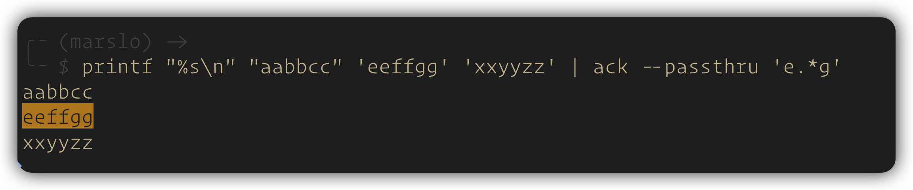

### less
```bash
$ curl -sg https://api.domain.com | less -i -p 'keyword'
```

### [grep](https://stackoverflow.com/a/981831/2940319)
```bash
$ command | grep  --color=always 'pattern\|$'
$ command | grep  --color=always -E 'pattern|$'
$ command | egrep --color=always 'pattern|$'
```

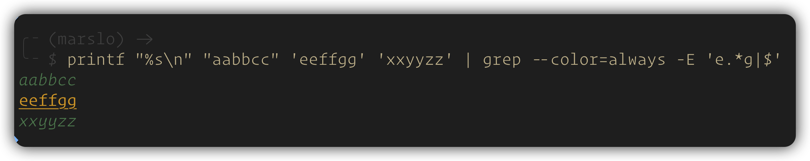

- example
  ```bash
  $ curl -sg 'https://api.domain.com | jq -r . | grep --color=always '.*keyword.*\|$'

  # or
  $ curl -sg 'https://api.domain.com | jq -r . | grep --color=always -E '| .*keyword.*'
  ```

### [highlight](http://www.andre-simon.de/doku/highlight/en/highlight.php)

> [!TIP]
> Highlight was designed to offer a flexible but easy to use syntax highlighter for several output formats. Instead of hardcoding syntax or colouring information, all relevant data is stored in configuration scripts. These scripts may be altered or enhanced with plug-in scripts.

```bash
# convert to html
$ highlight -i git.groovy -o git.groovy.html --style molokai --syntax groovy --inline-css --include-style --line-numbers

# convert to rtf
$ highlight -O rtf --font=Consolas --font-size=24 main.cpp

# highlight with color in terminal == bat
$ highlight -O ansi --syntax=groovy git.groovy

# convert to tex
$ highlight -O latex -l my_script.py > snippet.tex

# convert to svg
$ highlight -O svg --style=molokai git.groovy > output.svg
```

```bash
# list all themes/styles
$ highlight --list-scripts=themes

# list all syntax
$ highlight --list-scripts=langs

# list all plugins
$ highlight --list-scripts=plugins
```

```bash
# integrate with fzf
export FZF_DEFAULT_OPTS="--ansi --preview '(highlight -O truecolor -sgreenlcd -l {} 2>/dev/null || cat {}) 2>/dev/null | head -200'"

# integrate with less/cat
# pipe highlight to less
export LESSOPEN="| $(which highlight) %s --out-format xterm256 -l --force -s solarized-light --no-trailing-nl"
export LESS=" -R"
alias less='less -m -N -g -i -J --line-numbers --underline-special'
alias more='less'

# use "highlight" in place of "cat"
alias cat="highlight $1 --out-format xterm256 -l --force -s solarized-light --no-trailing-nl"
```

### lolcat
```bash
# rainbow cat
$ command | lolcat

# flashing rainbow cat
$ command | lolcat -a -d 100
$ fortune | lolcat -a -d 20 --freq=0.1 --spread=2.0

$ date +"%I:%M %P" | toilet -f future | lolcat -f --freq=0.1 --spread=1.0 --truecolor
```

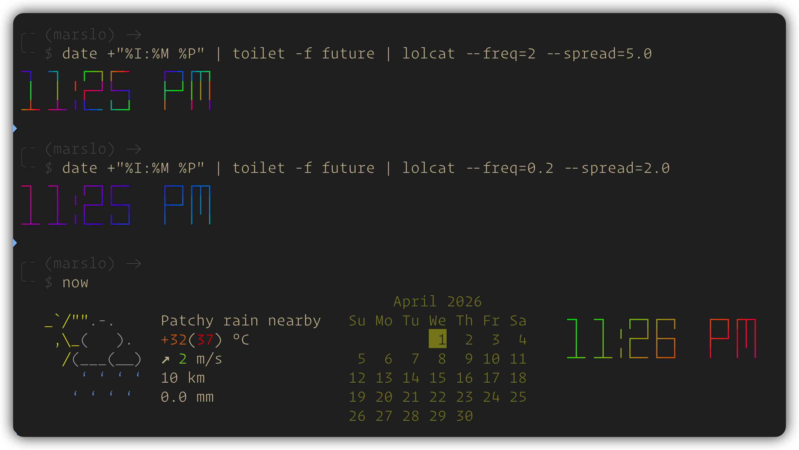

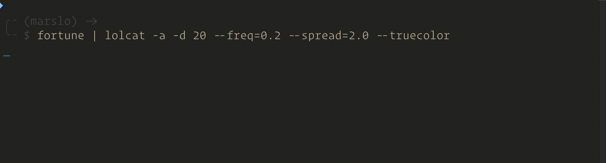


### [ccat](https://github.com/owenthereal/ccat)

> [!TIP]
> ccat is the colorizing cat. It works similar to cat but displays content with syntax highlighting.

```bash
$ ccat /path/to/file.groovy

# output html format
$ ccat file.py --bg=dark --html

# get colors
$ ccat --palette
```

### render visualization of hexadecimal colors

> [!NOTE|label:references:]
> - [#2705 Render visualization of hexadecimal colors (or other common formats) using true color ANSI escape sequences](https://github.com/sharkdp/bat/issues/2705)

```bash
# colorcat
# - cats a file, but if any line contains N hex colors, it appends the colors
#   (rendered as ansi escape sequences) to the end of the line.
# - input can be stdin, a file, or a hex color in plain text
function colorcat() {
  if [[ "$#" -eq 1 && ! -f "$1" ]]; then
    echo "$1"
  else
    cat "$@"
  fi | while read -r line; do
    local colors=""
    for word in $line; do
      if [[ "$word" =~ ^[^A-Fa-f0-9]*#?([A-Fa-f0-9]{6})[^A-Fa-f0-9]*$ ]]; then
        hex=${BASH_REMATCH[1]}
        local r=$((16#${hex:0:2}))
        local g=$((16#${hex:2:2}))
        local b=$((16#${hex:4:2}))
        local truecolor="\033[48;2;${r};${g};${b}m"
        local reset="\033[0m"
        colors="${colors}${truecolor}  ${reset} "
      fi
    done
      echo -e "${line} ${colors}"
  done
}
```

### others
- [dev-shell-essentials](https://github.com/kepkin/dev-shell-essentials)

## remove highlight

> [!TIP]
> references:
> - [Removing colors from output](https://stackoverflow.com/a/18000433/2940319)
> - [Remove ANSI color codes from a text file using bash](https://stackoverflow.com/a/30938702/2940319)

```bash
$ <cmd> | sed -r "s/\x1B\[([0-9]{1,3}(;[0-9]{1,2};?)?)?[mGK]//g"

# or
$ alias decolorize='sed -r "s/\x1B\[(([0-9]+)(;[0-9]+)*)?[mGKHfJ]//g"'
# deprecated
# $ alias decolorize='sed -r "s/\\x1B\\[([0-9]{1,3}(;[0-9]{1,2})?)?[mGK]//g"'
$ command | decolorize
```

- tips
  ```bash
  $ git br -a | cat -A
  * ^[[1;32mmarslo^[[m$
    ^[[31mremotes/origin/marslo^[[m$
    ^[[31mremotes/origin/gh-pages^[[m$
    ^[[31mremotes/origin/gitbook^[[m$
    ^[[31mremotes/origin/master^[[m$
    ^[[33mgh-pages^[[m$
    ^[[33mmaster^[[m$
    ^[[31mremotes/origin/sample^[[m$

  $ git br -a | decolorize | cat -A
  * marslo$
    remotes/origin/marslo$
    remotes/origin/gh-pages$
    remotes/origin/gitbook$
    remotes/origin/master$
    gh-pages$
    master$
    remotes/origin/sample$
  ```

# password encoding

> [!TIP|label:references:]
> - [A cheat-sheet for password crackers](https://www.unix-ninja.com/p/A_cheat-sheet_for_password_crackers)

| CHARACTERS | PERCENT-ENCODED |  | CHARACTERS | PERCENT-ENCODED |  | CHARACTERS | PERCENT-ENCODED |
|:----------:|:---------------:|--|:----------:|:---------------:|--|:----------:|:---------------:|
|      @     |      `%40`      |  |      :     |      `%3A`      |  |      !     |      `%21`      |
|    &#96;   |      `%60`      |  |      ?     |      `%3F`      |  |      ^     |      `%5E`      |
|      #     |      `%23`      |  |      %     |      `%25`      |  |      $     |      `%24`      |
|      &     |      `%26`      |  |      *     |      `%2A`      |  |      +     |      `%2B`      |
|      (     |      `%28`      |  |      )     |      `%29`      |  |      "     |      `%22`      |
|      {     |      `%7B`      |  |      }     |      `%7D`      |  |      '     |      `%27`      |
|      <     |      `%3C`      |  |      >     |      `%3E`      |  |      :     |      `%3A`      |
|      /     |      `%2F`      |  |      \     |      `%5C`      |  |     \|     |      `%7C`      |

- check via jq
  ```bash
  $ jq -rn --arg s '!.@.#.$.%.^.&.*.(.)._.+.-.{.}.<.>.:."' '$s|@uri'
  %21.%40.%23.%24.%25.%5E.%26.%2A.%28.%29._.%2B.-.%7B.%7D.%3C.%3E.%3A.%22

  $ jq -rn --arg s "'" '$s|@uri'
  %27
  ```

- check via python
  ```python
  import urllib.parse
  print( urllib.parse.quote( '!.@.#.$.%.^.&.*.(.)._.+.-.{.}.<.>.:.".\./.|.`', safe="") )

  # output:
  %21.%40.%23.%24.%25.%5E.%26.%2A.%28.%29._.%2B.-.%7B.%7D.%3C.%3E.%3A.%22.%5C.%2F.%7C.
  ```

# terminal ui
## dialog

> [!NOTE|label:references:]
> - [dialog](https://invisible-island.net/dialog/dialog.html)

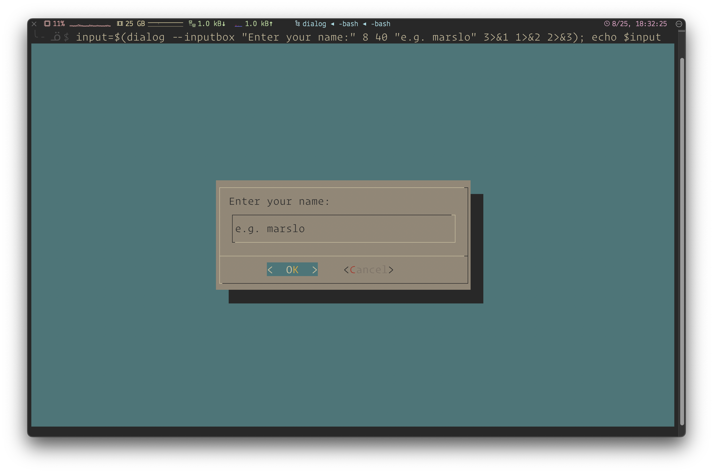

```bash
# macos
$ brew install dialog

# ubuntu/debian
$ sudo apt-get install dialog
```

- create a yes/no dialog box
  ```bash
  if dialog --title "Confirm" --yesno "Are you sure you want to continue?" 7 50; then
    echo "Confirmed"
  else
    echo "Cancelled"
  fi
  ```

- input box
  ```bash
  input=$(dialog --inputbox "Enter your name:" 8 40 "e.g. marslo" 3>&1 1>&2 2>&3)
  echo $input
  ```

- multiple choice
  ```bash
  choices=$(dialog --checklist "Select options:" 10 40 3 \
    1 "Option 1" off \
    2 "Option 2" on \
    3 "Option 3" off \
    3>&1 1>&2 2>&3)
  echo $choices
  ```

- multiple lines input box
  ```bash
  tempfile=$(mktemp)
  dialog --editbox "$tempfile" 20 60 2> "$tempfile"
  content=$(< "$tempfile")
  rm -f "$tempfile"
  echo "Edited content:"
  echo "$content"
  ```

## gum

> [!NOTE|label:references:]
> - [charmbracelet/gum](https://github.com/charmbracelet/gum)
> - [examples](https://github.com/charmbracelet/gum/tree/main/examples)
>   - [demo example](https://github.com/charmbracelet/gum/blob/main/examples/demo.sh)
>   - [git commit example](https://github.com/charmbracelet/gum/blob/main/examples/commit.sh)

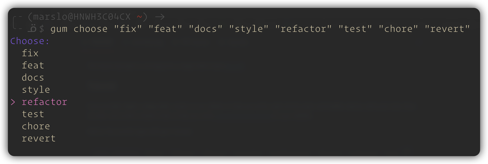

- spinner
  ```bash
  $ gum spin --spinner dot --title "Loading..." -- sleep 3
  ```

- filter
  ```bash
  $ find . -type f | gum filter --placeholder "Search file..."
  ```

- single select
  ```bash
  $ gum choose "fix" "feat" "docs" "style" "refactor" "test" "chore" "revert"
  ```

- multiple select
  ```bash
  $ echo -e "red\ngreen\nblue" | gum choose --no-limit
  ```

- input box
  ```bash
  $ gum input --placeholder "Enter your commit message"
  ```

- multiple line input box
  ```bash
  $ gum write --placeholder "Enter your commit message"
  ```

- yes or no
  ```bash
  $ gum confirm "Commit changes?" && git commit -m "$SUMMARY" -m "$DESCRIPTION"

  # or
  $ if gum confirm "Are you sure you want to continue?"; then
      echo "Confirmed"
    else
      echo "Cancelled"
    fi
  ```

## zenity

> [!NOTE|label:references:]
> - [zenity](https://help.gnome.org/users/zenity/stable/)
> - [GNOME/zenity](https://help.gnome.org/users/zenity/stable/calendar.html.en)

- calendar
  ```bash
  $ zenity --calendar --title="Select a Date" --text="Click on a date to select that date." --day=$(date +%d) --month=$(date +%-m) --year=$(date +%Y) 2>/dev/null
  ```

  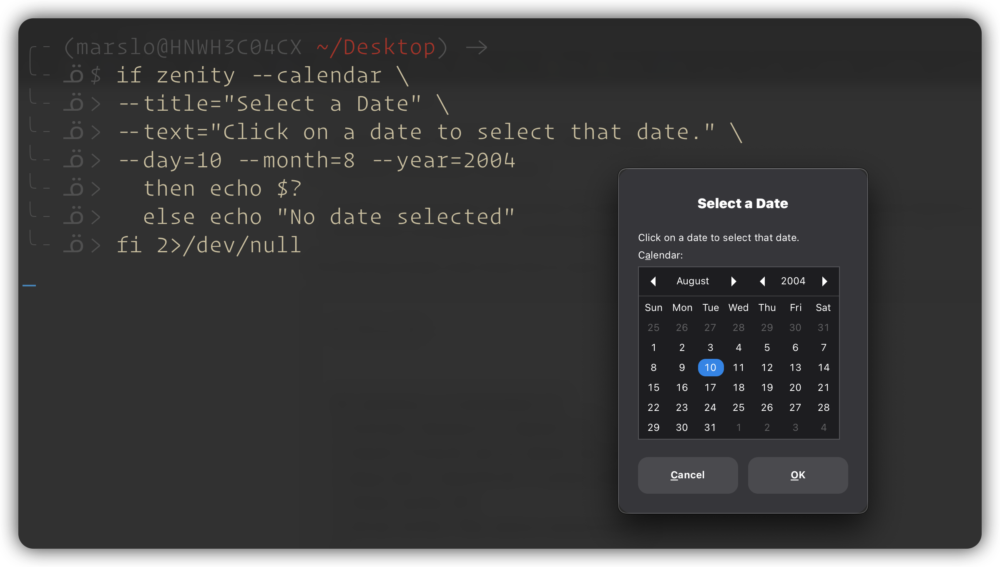


- color picker
  ```bash
  $ zenity --color-selection --show-palette 2>/dev/null
  ```

  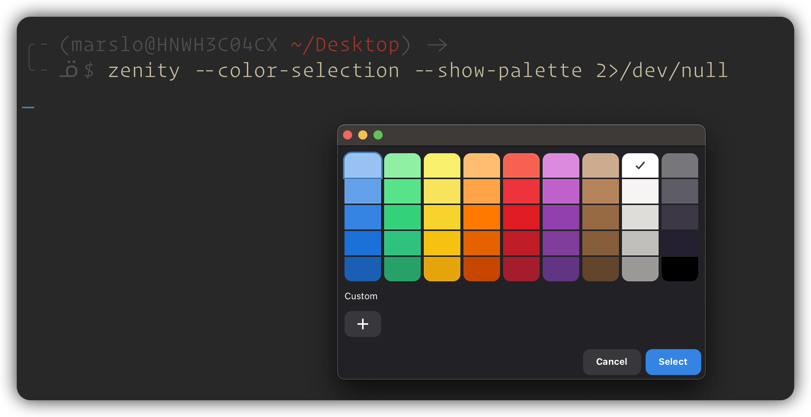

- password
  ```bash
  $ zenity --password --username 2>/dev/null

  # or
  $ zenity --password --title="Authentication Required" 2>/dev/null
  ```

  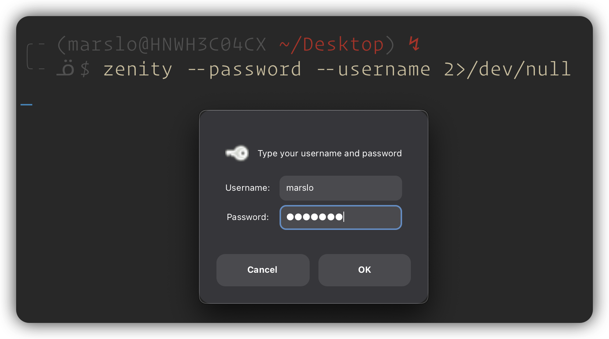

- progress bar
  ```bash
  (
  echo "10" ; sleep 1
  echo "# Updating mail logs" ; sleep 1
  echo "20" ; sleep 1
  echo "# Resetting cron jobs" ; sleep 1
  echo "50" ; sleep 1
  echo "This line will just be ignored" ; sleep 1
  echo "75" ; sleep 1
  echo "# Rebooting system" ; sleep 1
  echo "100" ; sleep 1
  ) |
  zenity --progress \
    --title="Update System Logs" \
    --text="Scanning mail logs..." \
    --percentage=0 2>/dev/null

  if [ "$?" = -1 ] ; then
    zenity --error --text="Update canceled."
  fi
  ```

  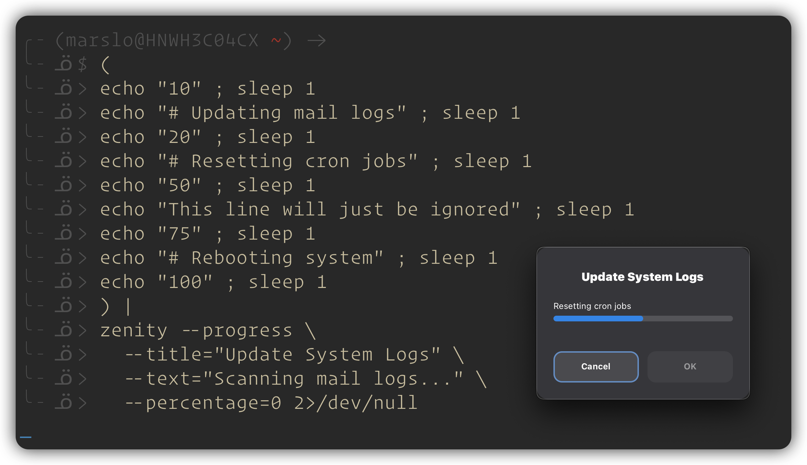

- list
  ```bash
  $ zenity --list \
           --title="Choose the Bugs You Wish to View" \
           --column="Bug Number" --column="Severity" --column="Description" \
             992383 Normal "GtkTreeView crashes on multiple selections" \
             293823 High "GNOME Dictionary does not handle proxy" \
             393823 Critical "Menu editing does not work in GNOME 2.0" \
           2>/dev/null

  # or
  $ zenity --list --title="Select an option" --column="Options" "Option 1" "Option 2" "Option 3" 2>/dev/null
  ```

  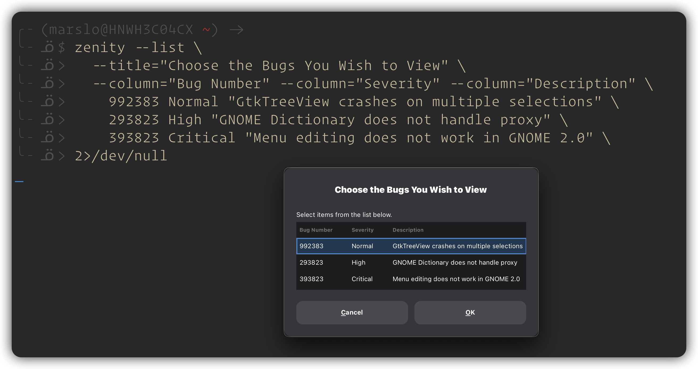

- entry
  ```bash
  $ zenity --entry --title="User Input" --text="Enter your name:" --entry-text="e.g. marslo" 2>/dev/null
  ```

  
> - [examples](https://github.com/charmbracelet/bubbletea/tree/main/examples)
> - [marslo/mtui](https://github.com/marslo/mtui)

# [alias](https://askubuntu.com/a/871435)

> [!NOTE|label:references:]
> - [_complete_alias](https://unix.stackexchange.com/a/332522/29178) | [cykerway/complete-alias](https://github.com/cykerway/complete-alias)
> - [How do I get bash completion for command aliases?](https://unix.stackexchange.com/a/332522/29178)
> - [make-completion-wrapper](https://unix.stackexchange.com/a/4220/29178)
> - [make-completion-wrapper](https://unix.stackexchange.com/a/310089/29178)
> - [bash-completion/README](https://github.com/scop/bash-completion/blob/2.1/README#L113)

```bash
$ echo ${BASH_ALIASES[ls]}
ls --color=always
```

## [`bash -<parameter>`](https://unix.stackexchange.com/a/38363/29178)
- get bash login log ( for rc script debug )
  ```bash
  $ bash -l -v
  ```

- run with only one startup file ( for sharing accounts )
  ```bash
  $ bash -i --rcfile="$HOME/.marslo/.imarslo"
  ```

# debugging

## local echo


> [!NOTE|label:references:]
> - **Direct**: The "Movie" (Final rendered visual).
> - **Redirection**: The "Script" (Just the dialogue/text).
> - **Script/PTY**: The "Behind-the-Scenes Footage" (Includes the dialogue, plus stage directions, camera cues, and background noise).

| SCENARIO                 | GH BEHAVIOR                     | TERMINAL BEHAVIOR                          | CAPTURED OUTPUT                         | PRIMARY USE CASE       |
|--------------------------|---------------------------------|--------------------------------------------|-----------------------------------------|------------------------|
| **Direct Execution**     | **Emits Effects**               | **Renders**                                | **Polished UI**                         | **User Experience**    |
| (Interactive TTY)        | (Sends ANSI colors & spinners)  | (Interprets codes, hides protocol details) | (Visual interface)                      | (For Humans)           |
| **Standard Redirection** | **Suppresses Effects**          | **Bypassed**                               | **Clean Text**                          | **Data Processing**    |
| `> file` (`cat`)         | (Detects non-TTY & disables UI) | (Not involved in the stream)               | (Sanitized data)                        | (For Machines/Scripts) |
| **PTY Emulation**        | **Emits Effects**               | **Local Echo**                             | **Raw Noise**                           | **Raw Debugging**      |
| `$(script ...)`          | (Tricked by pseudo-terminal)    | (Reflects raw input/output streams)        | (Text + ANSI codes + Internal Protocol) | (For Hackers/Analysis) |

> [!TIP|label:references:]
> The 'garbled text' captured by `script` consists of **ANSI escape codes** and **terminal control sequences** ( **PTY control characters** ).
> The artifacts ( like `^[]11;rgb...` ) are actually the terminal emulator responding to background color queries sent by the `gh` CLI.
> While an interactive terminal hides these responses, `script` records the raw data stream, making them visible.

```bash
# script -q /dev/null <command> to simulate terminal behavior
$ output=$(script -q /dev/null gh pr view 3 --web)
⣾⣽⣻⢿⡿⣟Opening https://github.com/Marvell-GHE-Sandbox/re-merge-workflow/pull/3 in your browser.
^[]11;rgb:2827/2827/2827^[\^[[24;1R^[]11;rgb:2827/2827/2827^[\^[[24;1R
11;rgb:2827/2827/2827;1R11;rgb:2827/2827/2827;1R

# in linux
$ output=$(script -q -c "command" /dev/null)

# using via unbuffer
$ unbuffer gh pr view --web | tee output.log
$ cat -A output.log
^[]11;?^[\^[[6n^[]11;?^[\^[[6n^[[?25l^M^[[K^M^[[36mM-bM-#M->^[[0m^M^[[K^M^[[36mM-bM-#M-=^[[0m^M^[[K^M^[[36mM-bM-#M-;^[[0m^M^[[K^M^[[36mM-bM-"M-?^[[0m^[[?25h^M^[[KOpening https://github.com/Marvell-Lab/structera-build-setup/pull/169142 in your browser.$
```

# authentication
## [special characters in usernames and passwords](https://zencoder.support.brightcove.com/general-information/special-characters-usernames-and-passwords.html)


> references:
> - [percent-encoding](https://en.wikipedia.org/wiki/Percent-encoding)
> - [* iMarslo - get unicode](./text-processing/json.md#get-urlencode)
>   ```bash
>   $ echo -n '] [ ? /' |
>     fmt -1 |
>     xargs -i bash -c 'echo "{} -- $(echo -n {} | jq -sRr @uri)"'
>   ] -- %5D
>   [ -- %5B
>   ? -- %3F
>   / -- %2F
>   ```



|   CHARACTERS   | PERCENT-ENCODED |
|:--------------:|:---------------:|
|       `]`      |      `%5D`      |
|       `[`      |      `%5B`      |
|       `?`      |      `%3F`      |
|       `/`      |      `%2F`      |
|       `<`      |      `%3C`      |
|       `~`      |      `%7E`      |
|       `#`      |      `%23`      |
|       ```      |      `%6D`      |
|       `!`      |      `%21`      |
|       `@`      |      `%40`      |
|       `$`      |      `%24`      |
|       `%`      |      `%25`      |
|       `^`      |      `%5E`      |
|       `&`      |      `%26`      |
|       `*`      |      `%2A`      |
|       `(`      |      `%28`      |
|       `)`      |      `%29`      |
|       `+`      |      `%2B`      |
|       `=`      |      `%3D`      |
|       `}`      |      `%7D`      |
| <code>`</code> |      `%7C`      |
|       `:`      |      `%3A`      |
|       `"`      |      `%22`      |
|       `;`      |      `%3B`      |
|       `'`      |      `%27`      |
|       `,`      |      `%2C`      |
|       `>`      |      `%3E`      |
|       `{`      |      `%7B`      |
|     `space`    |      `%20`      |


# others
## get cookie from firefox
```bash
$ grep -oP '"url":"\K[^"]+' $(ls -t ~/.mozilla/firefox/*/sessionstore.js | sed q)
```

## downloads bookmark

> [!TIP|label:references:]
> - [terrorgum.com](https://terrorgum.com/tfox/books/)
>   - [Bash Cookbook](https://terrorgum.com/tfox/books/bashcookbook.pdf)
>   - [Becoming the Hacker](https://terrorgum.com/tfox/books/becomingthehacker.pdf)
>   - [Deep Learning Revolution](https://terrorgum.com/tfox/books/deeplearningrevolution.pdf)
>   - [linux basics for hackers.pdf](https://terrorgum.com/tfox/books/linuxbasicsforhackers.pdf)
>   - [Linux In Nutshell.pdf](https://terrorgum.com/tfox/books/linuxinanutshell.pdf)
> - [pdfprof.com](https://www.pdfprof.com/)
>   - [Advanced Bash-Scripting Guide](https://tldp.org/LDP/abs/abs-guide.pdf)
>   - [Linux Bash Shell Cheat Sheet](https://oit.ua.edu/wp-content/uploads/2020/12/Linux_bash_cheat_sheet-1.pdf)
> - [dye784/collection](https://github.com/dye784/collection)

## extract fonts from pdf

```bash
$ python3 -m pip install pdfminer
$ python3 -m pip install pdfminer.six
$ python3 pdf_font_report.py input.pdf --format csv --output result.csv
```

```python
#!/usr/bin/env python3
# -*- coding: utf-8 -*-
import argparse
import csv
from pdfminer.high_level import extract_pages
from pdfminer.layout import LTTextContainer, LTChar, LTTextLine, LTTextBox

def analyze_pdf_fonts(pdf_path, output_format=None, output_file=None):
    rows = []

    for page_number, page_layout in enumerate(extract_pages(pdf_path), start=1):
        for element in page_layout:
            if isinstance(element, LTTextContainer):
                for text_line in element:
                    if hasattr(text_line, "__iter__"):
                        for character in text_line:
                            if isinstance(character, LTChar):
                                char = character.get_text()
                                font = character.fontname
                                size = round(character.size, 2)
                                rows.append((page_number, char, font, size))
                    elif isinstance(text_line, LTChar):
                        # handle case where element is directly a character
                        char = text_line.get_text()
                        font = text_line.fontname
                        size = round(text_line.size, 2)
                        rows.append((page_number, char, font, size))

    if output_format == "markdown":
        print("| Page | Char | Font | Size |")
        print("|------|------|------|------|")
        for row in rows:
            print(f"| {row[0]} | `{row[1]}` | `{row[2]}` | {row[3]} |")

    elif output_format == "csv":
        if not output_file:
            output_file = "font_report.csv"
        with open(output_file, "w", newline="", encoding="utf-8") as csvfile:
            writer = csv.writer(csvfile)
            writer.writerow(["Page", "Char", "Font", "Size"])
            writer.writerows(rows)
        print(f"[✓] CSV report saved to: {output_file}")

    else:
        # Default: plain text output
        for row in rows:
            print(f"Page {row[0]}: '{row[1]}' → {row[2]} ({row[3]}pt)")

if __name__ == "__main__":
    parser = argparse.ArgumentParser(description="Extract character-font-size info from PDF")
    parser.add_argument("pdf", help="Path to input PDF file")
    parser.add_argument("-f", "--format", choices=["markdown", "csv"], help="Output format")
    parser.add_argument("-o", "--output", help="Output file (for CSV)")
    args = parser.parse_args()

    analyze_pdf_fonts(args.pdf, args.format, args.output)
```
