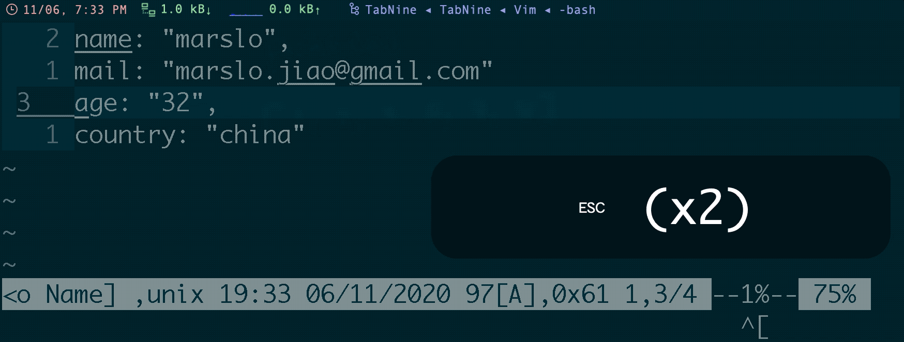

<!-- START doctoc generated TOC please keep comment here to allow auto update -->
<!-- DON'T EDIT THIS SECTION, INSTEAD RE-RUN doctoc TO UPDATE -->
**Table of Contents**  *generated with [DocToc](https://github.com/thlorenz/doctoc)*

- [`Tabularize`](#tabularize)

<!-- END doctoc generated TOC please keep comment here to allow auto update -->


## [`Tabularize`](https://github.com/godlygeek/tabular)
- align to left
  ```bash
  :Tabularize /<sep>
  ```

- align to center
  ```bash
  :Tabularize /<sep>/r1c1l0
  ```


