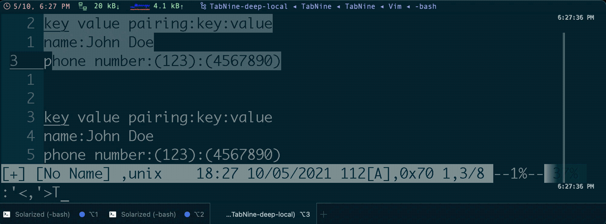
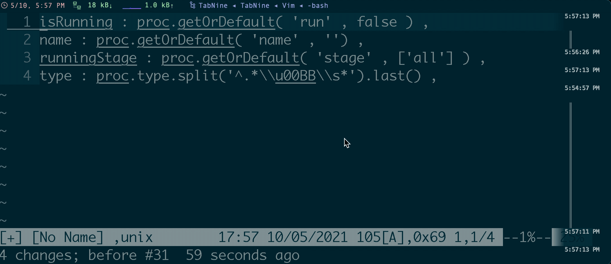

<!-- START doctoc generated TOC please keep comment here to allow auto update -->
<!-- DON'T EDIT THIS SECTION, INSTEAD RE-RUN doctoc TO UPDATE -->
**Table of Contents**  *generated with [DocToc](https://github.com/thlorenz/doctoc)*

- [`Tabularize`](#tabularize)
  - [`Tabularize` on first matches](#tabularize-on-first-matches)
  - [`Tabularize` on specific symbol](#tabularize-on-specific-symbol)

<!-- END doctoc generated TOC please keep comment here to allow auto update -->


## [`Tabularize`](https://github.com/godlygeek/tabular)
- align to left
  ```bash
  :Tabularize /<sep>
  ```

- align to center
  ```bash
  :Tabularize /<sep>/r1c1l0
  ```

  

### [`Tabularize` on first matches](https://stackoverflow.com/a/11497961/2940319)
- align the first `:`
  ```bash
  :Tabularize /^[^:]*\zs:
  ```
  [or](https://stackoverflow.com/a/23840400/2940319)
  ```bash
  :Tabularize /:.*
  ```

  

- [via vim cmd](https://stackoverflow.com/questions/20435920/dynamic-vim-tabular-patterns)
  > only for default left-alignemnt. Not support customized right/middle alignment.
  > i.e.: `/r1c1l0`

  ```vim
  command! -nargs=1 -range First exec <line1> . ',' . <line2> . 'Tabularize /^[^' . escape(<q-args>, '\^$.[?*~') . ']*\zs' . escape(<q-args>, '\^$.[?*~')
  ```

### [`Tabularize` on specific symbol](https://vi.stackexchange.com/a/12652/7389)
> pre condition:
> - align the first `:` and last matches `,` as below:
> ```groovy
> [
>   isRunning : proc.getOrDefault( 'run' , false ) ,
>   name : proc.getOrDefault( 'name' , '') ,
>   runningStage : proc.getOrDefault( 'stage' , ['all'] ) ,
>   type : proc.type.split('^.*\\u00BB\\s*').last() ,
> ]
> ```

#### first `:`
> reference: via
> - `/^[^;]*\zs:`
> - `/^[^;]*\zs:/r1c1l0`
> - `/^[^;]*/r1c1l0`

- `/^[^:]*\zs:`
  ```groovy
  isRunning    : proc.getOrDefault( 'run' , false ) ,
  name         : proc.getOrDefault( 'name' , '') ,
  runningStage : proc.getOrDefault( 'stage' , ['all'] ) ,
  type         : proc.type.split('^.*\\u00BB\\s*').last() ,
  ```
  
  

- `/^[^:]*\zs/r1c1l0`
  ```groovy
     isRunning  : proc.getOrDefault( 'run' , false ) ,
          name  : proc.getOrDefault( 'name' , '') ,
  runningStage  : proc.getOrDefault( 'stage' , ['all'] ) ,
          type  : proc.type.split('^.*\\u00BB\\s*').last() ,
  ```

- `/^[^:]*\zs:/r1c1l0`
  ```groovy
     isRunning : proc.getOrDefault( 'run' , false ) ,
          name : proc.getOrDefault( 'name' , '') ,
  runningStage : proc.getOrDefault( 'stage' , ['all'] ) ,
          type : proc.type.split('^.*\\u00BB\\s*').last() ,
  ```
  

- `/^[^:]*/r1c1l0`
  ```groovy
    isRunning   : proc.getOrDefault( 'run' , false ) ,
      name      : proc.getOrDefault( 'name' , '') ,
  runningStage  : proc.getOrDefault( 'stage' , ['all'] ) ,
      type      : proc.type.split('^.*\\u00BB\\s*').last() ,
  ```

- `/^[^:]*:/r1c1l0`:
  ```groovy
    isRunning :  proc.getOrDefault( 'run' , false ) ,
      name :     proc.getOrDefault( 'name' , '') ,
  runningStage : proc.getOrDefault( 'stage' , ['all'] ) ,
      type :     proc.type.split('^.*\\u00BB\\s*').last() ,
  ```

#### last `,`
> tips:
> - actually the pattern not matches with the final `,`, but matches with `)<.*> ,`
>
> **sample code**:
> ```groovy
>    isRunning : proc.getOrDefault( 'run' , false ) ,
>         name : proc.getOrDefault( 'name' , '') ,
> runningStage : proc.getOrDefault( 'stage' , ['all'] ) ,
>         type : proc.type.split('^.*\\u00BB\\s*').last() ,
> ```

- `/)[^,]*\zs,`
  ```groovy
     isRunning : proc.getOrDefault( 'run' , false )       ,
          name : proc.getOrDefault( 'name' , '')          ,
  runningStage : proc.getOrDefault( 'stage' , ['all'] )   ,
          type : proc.type.split('^.*\\u00BB\\s*').last() ,
  ```

  or even better align

  - `1,3Tabularize /,` or `'<,'>Tabularize /,`
    ```groovy
       isRunning : proc.getOrDefault( 'run'   , false )   ,
            name : proc.getOrDefault( 'name'  , '')       ,
    runningStage : proc.getOrDefault( 'stage' , ['all'] ) ,
            type : proc.type.split('^.*\\u00BB\\s*').last() ,
    ```
  - `Tabularize /)[^,]*\zs,`
    ```groovy
       isRunning : proc.getOrDefault( 'run'   , false )     ,
            name : proc.getOrDefault( 'name'  , '')         ,
    runningStage : proc.getOrDefault( 'stage' , ['all'] )   ,
            type : proc.type.split('^.*\\u00BB\\s*').last() ,
    ```

  
