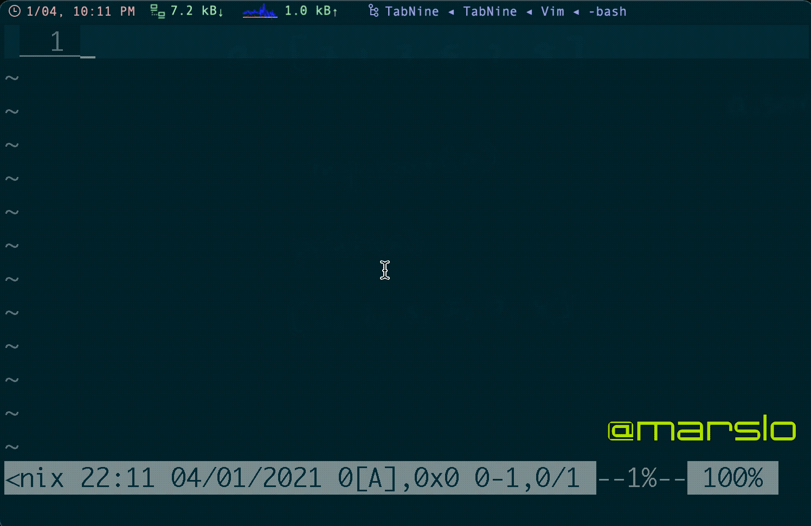
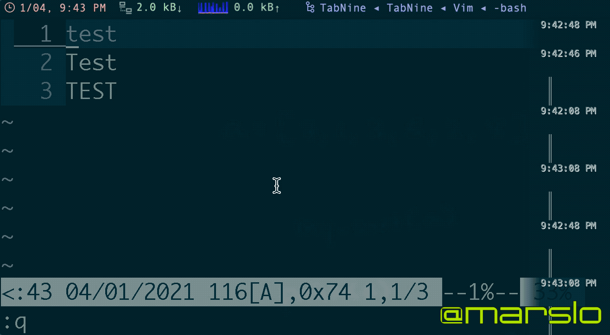

<!-- START doctoc generated TOC please keep comment here to allow auto update -->
<!-- DON'T EDIT THIS SECTION, INSTEAD RE-RUN doctoc TO UPDATE -->
**Table of Contents**  *generated with [DocToc](https://github.com/thlorenz/doctoc)*

- [move between windws](#move-between-windws)
- [resize](#resize)
  - [horizontal resize](#horizontal-resize)
  - [vertical resize](#vertical-resize)
- [quickfix](#quickfix)

<!-- END doctoc generated TOC please keep comment here to allow auto update -->


> reference:
> - [windows.txt](https://vimhelp.org/windows.txt.html)


## move between windws
| commands    | shortcut                                      |
| :---:       | :---:                                         |
| `:wincmd l` | <kbd>ctrl</kbd> + <kbd>w</kbd> ⇢ <kbd>l</kbd> |
| `:wincmd h` | <kbd>ctrl</kbd> + <kbd>w</kbd> ⇢ <kbd>h</kbd> |
| `:wincmd j` | <kbd>ctrl</kbd> + <kbd>w</kbd> ⇢ <kbd>j</kbd> |
| `:wincmd k` | <kbd>ctrl</kbd> + <kbd>w</kbd> ⇢ <kbd>k</kbd> |

## resize
> reference:
> - [Resize splits more quickly](https://vim.fandom.com/wiki/Resize_splits_more_quickly)
> maximium window: <kbd>ctrl</kbd> + <kbd>w</kbd> ⇢ <kbd>_</kbd>

### horizontal resize
  > `:res` is the shortcut of `:resize`

| commands or shortcut                          | comments                      |
| : ----- :                                     | : ----                        |
| `:res n`                                      | setup the width to <n> lines  |
| `:resize -n`                                  | reduce <n> lines of the width |
| `:resize +n`                                  | extend <n> lines of the width |
| <kbd>ctrl</kbd> + <kbd>w</kbd> ⇢ <kbd>+</kbd> | extend 1 line                 |
| `:wincmd +`                                   | extend 1 line                 |
| <kbd>ctrl</kbd> + <kbd>w</kbd> ⇢ <kbd>-</kbd> | reduce 1 line                 |
| `:wincmd -`                                   | reduce 1 line                 |
| <kbd>ctrl</kbd> + <kbd>w</kbd> ⇢ <kbd>=</kbd> | resize to default: `50%`      |
| `:wincmd =`                                   | resize to default: `50%`      |
| <kbd>ctrl</kbd> + <kbd>w</kbd> ⇢ <kbd>_</kbd> | maximum the window            |
| `:wincmd _`                                   | maximum the window            |


### vertical resize

| commands or shortcut                               | comments                        |
| : ----- :                                          | : ----                          |
| `:vertical res n`                                  | setup the width to <n> columns  |
| `:vertical resize -n`                              | reduce <n> columns of the width |
| `:vertical resize +n`                              | extend <n> columns of the width |
| <kbd>ctrl</kbd> + <kbd>w</kbd> ⇢ <kbd>&gt;</kbd>   | extend 1 column                 |
| `:wincmd >`                                        | extend 1 column                 |
| <kbd>ctrl</kbd> + <kbd>w</kbd> ⇢ <kbd>&lt;</kbd>   | reduce 1 column                 |
| `:wincmd <`                                        | reduce 1 column                 |
| <kbd>ctrl</kbd> + <kbd>w</kbd> ⇢ <kbd>=</kbd>      | resize to default: `50%`        |
| `:wincmd =`                                        | resize to default: `50%`        |
| <kbd>ctrl</kbd> + <kbd>w</kbd> ⇢ <kbd>&#124;</kbd> | maximum the window              |
| `:wincmd ⎮`                                        | maximum the window              |



## [quickfix](http://vimdoc.sourceforge.net/htmldoc/quickfix.html)



- [Automatically fitting a quickfix window height](https://vim.fandom.com/wiki/Automatically_fitting_a_quickfix_window_height)
  ```
  " .vimrc
  au FileType qf call AdjustWindowHeight(3, 10)
  function! AdjustWindowHeight(minheight, maxheight)
    exe max([min([line("$"), a:maxheight]), a:minheight]) . "wincmd _"
  endfunction
  ```
