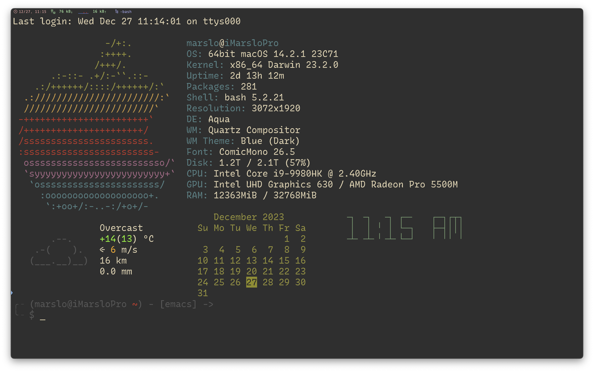
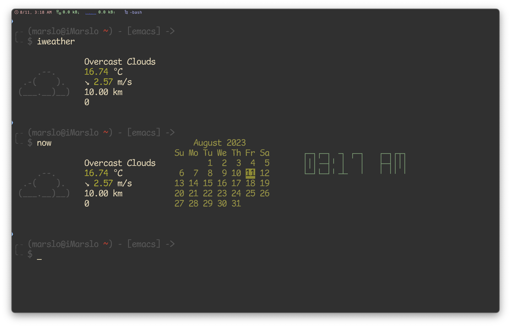

<!-- START doctoc generated TOC please keep comment here to allow auto update -->
<!-- DON'T EDIT THIS SECTION, INSTEAD RE-RUN doctoc TO UPDATE -->

- [prompt](#prompt)
  - [linux/osx](#linuxosx)
  - [windows](#windows)
- [weather](#weather)
  - [iweather](#iweather)
  - [uriel1998/weather.sh](#uriel1998weathersh)
  - [szantaii/bash-weather](#szantaiibash-weather)
- [widget](#widget)
  - [brndnmtthws/conky](#brndnmtthwsconky)
- [others](#others)
  - [figlet](#figlet)
  - [toilet](#toilet)

<!-- END doctoc generated TOC please keep comment here to allow auto update -->

## prompt

### linux/osx

- [now](https://askubuntu.com/a/1020693/92979) | [now](https://www.pippim.com/2018/03/30/Terminal-splash-screen-with-Weather_-Calendar_-Time-_-Sysinfo_.html)

  <!--sec data-title="now" data-id="section0" data-show=true data-collapse=true ces-->
  ```bash
  #!/usr/bin/env bash

  # NAME   : now
  # PATH   : $HOME/bin
  # DESC   : Display current weather, calendar and time
  # CALL   : Called from terminal or ~/.bashrc
  # DATE   : Apr 6, 2017. Modified: May 24, 2019.
  # CREDIT : https://askubuntu.com/a/1020693/92979

  # UPDT   : 2019-05-24 If Weather unavailable nicely formatted error message.
  # UPDT   : 2024-01-26 fix the "today" position offset issue due to extra space in `cal`

  # NOTE   : to display all available toilet fonts use this one-liner:
  #          for i in ${TOILET_FONT_PATH:=/usr/share/figlet}/*.{t,f}lf; do j=${i##*/}; toilet -d "${i%/*}" -f "$j" "${j%.*}"; done

  # setup for 92 character wide terminal
  dateColumn=34                                   # default is 27 for 80 character line, 34 for 92 character line
  timeColumn=61                                   # default is 49 for   "   "   "   "    61 "   "   "   "
  curlOpt='-skg -x http://proxy.sample.com:80'

  #------------------------------ WEATHER -------------------------------------

  # current weather, already in color so no need to override
  # replace edmonton with your city name, gps, etc. see: curl wttr.in/:help
  # shellcheck disable=SC2086
  if ! curl ${curlOpt} wttr.in/sanjose?QmM0 --fail --silent --max-time 3 > /tmp/now-weather; then
  #                          timeout #. increase for slow connection---^
    ~/.marslo/bin/iweather > /tmp/now-weather
  fi

  # was valid weather report found or an error message?
  if grep '°C' /tmp/now-weather >/dev/null 2>&1; then
    weatherDone=true
    cat /tmp/now-weather
  else
    weatherDone=false
    dateColumn=1                                    # show data as first column if got weather failed
    timeColumn=27                                   # move 34 column right if got weather failed
  fi
  [[ -f /tmp/now-weather ]] && rm -rf /tmp/now-weather

  #------------------------------- DATA ---------------------------------------

  # calendar current month with today highlighted.
  # colors 00=bright white, 31=red, 32=green, 33=yellow, 34=blue, 35=purple, 36=cyan, 37=white

  tput sc                                         # save cursor position.
  if [[ "$weatherDone" == true ]] ; then
      tput cuu 6                                  # move up 6 lines
      # depending on length of your city name and country name you will:
      #   1. comment out next three lines of code. uncomment fourth code line.
      #   2. change subtraction value and set number of print spaces to match
      #      subtraction value. then place comment on fourth code line.
      column=$((dateColumn - 10))
      tput cuf $column                            # move x column number
      printf '%10s' ''                            # blank out ", country" with 10 spaces
  else
      tput cuf $dateColumn                        # position to column 27 for date display
  fi

  # -h needed to turn off formatting: https://askubuntu.com/questions/1013954/bash-substring-stringoffsetlength-error/1013960#1013960
  # -h not supported in Ubuntu 18.04. Use second answer: https://askubuntu.com/a/1028566/307523
  # to fit for both macOS and Linux
  #   - linux: cal have 2 more extra whitespace in each line, 22 chars per line
  #   - osx: cal has no more extra whitespace in each line, 20 chars per line
  #                    cal -h                 remove trailing spaces     remove empty line
  #                       v                              v                       v
  cal | tr -cd '\11\12\15\40\60-\136\140-\176' | sed 's/[ \t]*$//' | sed '/^[[:space:]]*$/d' > /tmp/terminal
  calLineCnt=1
  today=$(date +"%e")
  printf "\033[32m"                               # color green -- see list above.

  while IFS= read -r cal; do
    printf "%s" "$cal"
    if [[ $calLineCnt -gt 2 ]] ; then
      tput cub "$(awk '{print length($0)}' <<< "${cal}")"
      for (( j=0 ; j <= 18 ; j += 3 )) ; do       # see if today is on current line & invert background
        day=${cal:$j:2}                           # current day on calendar line
        if [[ "$day" == "$today" ]] ; then
          printf "\033[7m"                        # reverse: [7m
          printf "%s" "$today"
          printf "\033[0m"                        # normal: [0m
          printf "\033[32m"                       # color green -- see list above.
          tput cuf 1
        else
          tput cuf 3
        fi
      done
    fi

    tput cud1                                     # move one line down
    tput cuf $dateColumn                          # move 27 columns right
    calLineCnt=$((++calLineCnt))
  done < /tmp/terminal

  printf "\033[00m"                               # color -- bright white (default)
  tput rc                                         # restore saved cursor position.

  #------------------------------- TIME ---------------------------------------

  tput sc                                         # save cursor position.
  tput cuu 6                                      # move up 9 lines
  tput cuf $timeColumn                            # move 49 columns right

  if hash toilet 2>/dev/null; then                # if has toilet
     date +"%I:%M %P" | toilet -f future > /tmp/terminal
  elif hash figlet 2>/dev/null; then              # if has figlet
     date +"%I:%M %P" | figlet -f /usr/local/share/figlet/future.tlf > /tmp/terminal
  else
     date +"%I:%M %P" > /tmp/terminal
  fi

  while IFS= read -r time; do
    printf "\033[01;36m"                          # color cyan
    printf "%s" "$time"
    tput cud1                                     # up one line
    tput cuf $timeColumn                          # move 49 columns right
  done < /tmp/terminal

  [[ -f /tmp/terminal ]] && rm -rf /tmp/terminal
  tput rc                                         # restore saved cursor position.
  exit 0

  # vim:tabstop=2:softtabstop=2:shiftwidth=2:expandtab:filetype=sh
  ```
  <!--endsec-->

- [another now](https://unix.stackexchange.com/a/434701/29178)

  <!--sec data-title="now" data-id="section1" data-show=true data-collapse=true ces-->
  ```bash
  # NAME: now
  # PATH: $HOME/bin
  # DESC: Display current weather, calendar and time
  # CALL: Called from terminal or ~/.bashrc
  # DATE: Apr 6, 2017. Modified: Mar 30, 2018.

  # NOTE: To display all available toilet fonts use this one-liner:
  #       for i in ${TOILET_FONT_PATH:=/usr/share/figlet}/*.{t,f}lf; do j=${i##*/}; toilet -d "${i%/*}" -f "$j" "${j%.*}"; done

  # Setup for 92 character wide terminal
  DateColumn=34 # Default is 27 for 80 character line, 34 for 92 character line
  TimeColumn=61 # Default is 49 for   "   "   "   "    61 "   "   "   "

  #--------- WEATHER ----------------------------------------------------------

  # Current weather, already in color so no need to override
  echo " "
  # Replace Edmonton with your city name, GPS, etc. See: curl wttr.in/:help
  curl wttr.in/Edmonton?0 --silent --max-time 3
  # Timeout #. Increase for slow connection---^

  echo " "
  echo " "                # Pad with blank lines for calendar & time to fit

  #--------- DATE -------------------------------------------------------------

  # calendar current month with today highlighted.
  # colors 00=bright white, 31=red, 32=green, 33=yellow, 34=blue, 35=purple,
  #        36=cyan, 37=white

  tput sc                 # Save cursor position.
  # Move up 9 lines
  while [ $((++i)) -lt 10 ]; do tput cuu1; done

  # Depending on length of your city name and country name you will:
  #   1. Comment out next three lines of code. Uncomment fourth code line.
  #   2. Change subtraction value and set number of print spaces to match
  #      subtraction value. Then place comment on fourth code line.

  Column=$(($DateColumn - 10))
  tput cuf $Column        # Move x column number
  printf "          "     # Blank out ", country" with x spaces
  #tput cuf $DateColumn    # Position to column 27 for date display

  # -h needed to turn off formating: https://askubuntu.com/questions/1013954/bash-substring-stringoffsetlength-error/1013960#1013960
  cal -h > /tmp/terminal

  CalLineCnt=1
  Today=$(date +"%d")
  # Prefix with space when length < 2
  if [[ ${#Today} < 2 ]] ; then
      Today=" "$Today
  fi
  printf "\033[32m"   # color green -- see list above.

  while IFS= read -r Cal; do
      printf "$Cal"
      if [[ $CalLineCnt > 2 ]] ; then
          # See if today is on current line & invert background
          tput cub 22
          for (( j=0 ; j <= 18 ; j += 3 )) ; do
              Test=${Cal:$j:2}            # Current day on calendar line
              if [[ "$Test" == "$Today" ]] ; then
                  printf "\033[7m"        # Reverse: [ 7 m
                  printf "$Today"
                  printf "\033[0m"        # Normal: [ 0 m
                  printf "\033[32m"       # color green -- see list above.
                  tput cuf 1
              else
                  tput cuf 3
              fi
          done
      fi

      tput cud1               # Down one line
      tput cuf $DateColumn    # Move 27 columns right
      CalLineCnt=$((++CalLineCnt))
  done < /tmp/terminal

  printf "\033[00m"           # color -- bright white (default)
  echo ""

  tput rc                     # Restore saved cursor position.

  #-------- TIME --------------------------------------------------------------

  tput sc                 # Save cursor position.
  # Move up 9 lines
  i=0
  while [ $((++i)) -lt 10 ]; do tput cuu1; done
  tput cuf $TimeColumn    # Move 49 columns right

  # Do we have the toilet package?
  if hash toilet 2>/dev/null; then
      echo " "$(date +"%I:%M %P")" " | \
          toilet -f future --filter border > /tmp/terminal
  # Do we have the figlet package?
  elif hash figlet 2>/dev/null; then
      echo $(date +"%I:%M %P") | figlet > /tmp/terminal
  # else use standard font
  else
      echo $(date +"%I:%M %P") > /tmp/terminal
  fi

  while IFS= read -r Time; do
      printf "\033[01;36m"    # color cyan
      printf "$Time"
      tput cud1               # Up one line
      tput cuf $TimeColumn    # Move 49 columns right
  done < /tmp/terminal

  tput rc                     # Restore saved cursor position.

  exit 0
  ```
  <!--endsec-->

  

### windows
- [nijikokun/WinScreeny](https://github.com/nijikokun/WinScreeny)
- [modified WinScreeny](https://askubuntu.com/a/978978/92979)
  <!--sec data-title="winscreeny" data-id="section2" data-show=true data-collapse=true ces-->
  ```bash
  #!/usr/bin/env bash
  #
  # Windows Screenfetch (Without the Screenshot functionality)
  # Hacked together by Nijikokun <nijikokun@gmail.com>
  # License: AOL <aol.nexua.org>

  # Downloaded from: https://github.com/nijikokun/WinScreeny
  # Modified from Windows to Windows Subsystem for Linux (Ubuntu initially)

  version='0.4'

  # Displayment
  display=( Host Cpu OS Arch Shell Motherboard HDD Memory Uptime Resolution DE WM WMTheme Font )

  # Color Loop
  bld=$'\e[1m'
  rst=$'\e[0m'
  inv=$'\e[7m'
  und=$'\e[4m'
  f=3 b=4
  for j in f b; do
    for i in {0..7}; do
      printf -v $j$i %b "\e[${!j}${i}m"
    done
  done

  # Debugging
  debug=

  Debug () {
      echo -e "\e[1;31m:: \e[0m$1"
  }

  # Flag Check
  while getopts "vVh" flags; do
      case $flags in
          h)
              echo -e "${und}Usage${rst}:"
              echo -e "  screeny [Optional Flags]"
              echo ""
              echo "WinScreeny - A CLI Bash Script to show System Information for Windows!"
              echo ""
              echo -e "${und}Options${rst}:"
              echo -e "    ${bld}-v${rst}                 Verbose / Debug Output"
              echo -e "    ${bld}-V${rst}                 Display script version"
              echo -e "    ${bld}-h${rst}                 Display this file"
              exit;;
          V)
              echo -e "${und}WinScreeny${rst} - Version ${version}"
              echo -e "Copyright (C) Nijiko Yonskai (nijikokun@gmail.com)"
              echo ""
              echo -e "This is free software, under the AOL license: http://aol.nexua.org"
              echo -e "Source can be downloaded from: https://github.com/Nijikokun/WinScreeny"
              exit;;
          v) debug=1 continue;;
      esac
  done

  # Prevent Unix Output
  unameOutput=`uname`GARBAGE
  if [[ "$unameOutput" == 'Linux' ]] || [[ "$unameOutput" == 'Darwin' ]] ; then
      echo 'This script is for Windows, silly!'
      exit 0
  fi

  # Begin Detection
  detectHost () {
      user=$(echo "$USER")
      host=$(hostname)
      [[ "$debug" -eq "1" ]] && Debug "Finding hostname, and user.... Found as: '$user@$host'"
  }

  detectCpu () {
      cpu=$(awk -F':' '/model name/{ print $2 }' /proc/cpuinfo | head -n 1 | tr -s " " | sed 's/^ //')
      [[ "$debug" -eq "1" ]] && Debug "Finding cpu.... Found as: '$cpu'"
  }

  detectOS () {
      os=`uname -r`
  }

  detectArch () {
      arch=`lsb_release -a 2>&1 | awk '{ print $2 " " $3 " " $4}' | head -3 | tail -1`
      [[ "$debug" -eq "1" ]] && Debug "Finding Architecture.... Found as: '$arch'"
  }

  detectHDD () {
      size=`df -H |  awk '{ print $2}' | head -2 | tail -1 | tr -d '\r '`
      free=`df -H |  awk '{ print $4 }' | head -2 | tail -1 | tr -d '\r '`

  }

  detectResolution () {
      width=`/mnt/c/Windows/System32/wbem/WMIC.exe desktopmonitor get screenwidth | grep -vE '[a-z]+' | tr -d '\r\n '`
      height=`/mnt/c/Windows/System32/wbem/WMIC.exe desktopmonitor get screenheight | grep -vE '[a-z]+' | tr -d '\r\n '`
  }

  detectUptime () {
      uptime=`awk -F. '{print $1}' /proc/uptime`
      secs=$((${uptime}%60))
      mins=$((${uptime}/60%60))
      hours=$((${uptime}/3600%24))
      days=$((${uptime}/86400))
      uptime="${mins}m"

      if [ "${hours}" -ne "0" ]; then
        uptime="${hours}h ${uptime}"
      fi

      if [ "${days}" -ne "0" ]; then
        uptime="${days}d ${uptime}"
      fi

      [[ "$debug" -eq "1" ]] && Debug "Finding Uptime.... Found as: '$uptime${rst}'"
  }

  detectMemory () {
      total_mem=$(awk '/MemTotal/ { print $2 }' /proc/meminfo)
      totalmem=$((${total_mem}/1024))
      free_mem=$(awk '/MemFree/ { print $2 }' /proc/meminfo)
      used_mem=$((${total_mem} - ${free_mem}))
      usedmem=$((${used_mem}/1024))
      mem="${usedmem}MB / ${totalmem}MB"

      [[ "$debug" -eq "1" ]] && Debug "Finding Memory.... Found as: '$mem${rst}'"
  }

  detectShell () {
      myshell=`bash --version | head -1`
      [[ "$debug" -eq "1" ]] && Debug "Finding Shell.... Found as: '$myshell'"
  }

  detectMotherboard () {
      board=`/mnt/c/Windows/System32/wbem/WMIC.exe baseboard get product | tail -2 | tr -d '\r '`
  }

  detectDE () {
      winver=`/mnt/c/Windows/System32/wbem/WMIC.exe os get version | grep -o '^[0-9]'`
      if [ "$winver" == "7" ]; then
          de='Aero'
      elif [ "$winver" == "6" ]; then
          de='Aero'
      else
          de=$winver
      fi
      [[ "$debug" -eq "1" ]] && Debug "Finding Desktop Environment.... Found as: '$de'"
  }

  detectWM () {
      vcxsrv=`/mnt/c/Windows/System32/tasklist.exe | grep -o 'vcxsrv' | tr -d '\r \n'`
      wind=`/mnt/c/Windows/System32/tasklist.exe | grep -o 'Windawesome' | tr -d '\r \n'`
      if [ "$vcxsrv" = "vcxsrv" ]; then
          wm="VcXsrv"
      elif [ "$wind" = "Windawesome" ]; then
          wm="Windawesome"
      else
          wm="DWM"
      fi
      [[ "$debug" -eq "1" ]] && Debug "Finding Window Manager.... Found as: '$wm'"
  }

  detectWMTheme () {
      themeFile="$(/mnt/c/Windows/System32/reg.exe query 'HKCU\Software\Microsoft\Windows\CurrentVersion\Themes' /v 'CurrentTheme' | grep -o '[A-Z]:\\.*')"
  #   theme=$(echo $themeFile | awk -F"\\" '{print $NF}' | grep -o '[0-9A-z. ]*$' | grep -o '^[0-9A-z ]*')
      theme=$themeFile
      [[ "$debug" -eq "1" ]] && Debug "Finding Window Theme.... Found as: '$theme'"
  }

  detectFont () {
  #   font=$(cat $HOME/.minttyrc | grep '^Font=.*' | grep -o '[0-9A-Za-z ]*$')
      font="Consolas"
      [[ "$debug" -eq "1" ]] && Debug "Finding Font.... Found as: '$font'"
  #   if [ -z $font ]; then
  #       font="Lucida Console"
  #   fi
  }

  # Loops :>
  for i in "${display[@]}"; do
      [[ "${display[*]}" =~ "$i" ]] && detect${i}
  done

  # Output

  cat << EOF

  $f1         ,.=:^!^!t3Z3z.,
  $f1        :tt:::tt333EE3                  ${f6}${user}${f7}@${f6}${host}
  $f1        Et:::ztt33EEE  $f2@Ee.,      ..,
  $f1       ;tt:::tt333EE7 $f2;EEEEEEttttt33#   ${f6}OS: ${f7}${os} ${arch}
  $f1      :Et:::zt333EEQ.$f2 SEEEEEttttt33QL   ${f6}CPU: ${f7}${cpu}
  $f1      it::::tt333EEF $f2@EEEEEEttttt33F    ${f6}HDD free / size: ${f7}$free / $size
  $f1     ;3=*^\`\`\`'*4EEV $f2:EEEEEEttttt33@.    ${f6}Memory used / size: ${f7}${mem}
  $f4     ,.=::::it=., $f1\` $f2@EEEEEEtttz33QF     ${f6}Uptime: ${f7}$uptime
  $f4    ;::::::::zt33)   $f2'4EEEtttji3P*      ${f6}Resolution: ${f7}$width x $height
  $f4   :t::::::::tt33.$f3:Z3z..  $f2\`\` $f3,..g.      ${f6}Motherboard: ${f7}$board
  $f4   i::::::::zt33F$f3 AEEEtttt::::ztF       ${f6}Shell: ${f7}$myshell
  $f4  ;:::::::::t33V $f3;EEEttttt::::t3        ${f6}DE: ${f7}$de
  $f4  E::::::::zt33L $f3@EEEtttt::::z3F        ${f6}WM: ${f7}$wm
  $f4 {3=*^\`\`\`'*4E3) $f3;EEEtttt:::::tZ\`        ${f6}WM Theme: ${f7}$theme
  $f4             \` $f3:EEEEtttt::::z7          ${f6}Font: ${f7}$font
  $f3                 $f3'VEzjt:;;z>*\`        $rst

  EOF
  ```
  <!--endsec-->

## weather
- [wttr.in](https://wttr.in/:help)
  - [constants.py: WEATHER_SYMBOL_WEGO](https://github.com/chubin/wttr.in/blob/master/lib/constants.py#L190)
  - [icons](https://github.com/chubin/wttr.in/issues/192#issuecomment-466701667)
  - [Some frame options](https://github.com/chubin/wttr.in/issues/623)
- [openweathermap](https://openweathermap.org/)
  - [One Call API 3.0](https://openweathermap.org/api/one-call-3)
  - [How to get icon URL](https://openweathermap.org/weather-conditions)

  - lat & lon
    ```bash
    $ curl -g "https://api.openweathermap.org/geo/1.0/direct?q=San%20Jose&limit=5&appid=<api-key>"

    # i.e. Santa Clara City
    $ /usr/bin/curl -sg "https://api.openweathermap.org/geo/1.0/direct?q=Santa%20Clara&limit=5&appid=<api-key>" |
                   jq -r '.[] | select(.state == "California") | (.lat|tostring) + " : " + (.lon|tostring)'
    37.3541132 : -121.955174
    ```

  - weather
    ```bash
    $ /usr/bin/curl -sg "https://api.openweathermap.org/data/3.0/onecall?lat=37.3541132&lon=-121.955174&units=metric&appid=<api-key>" |
                    jq -r .current
    {
      "dt": 1691720508,                         # date -d @<secs>
      "sunrise": 1691673584,                    # date -d @<secs>
      "sunset": 1691723206,                     # date -d @<secs>
      "temp": 24.13,                            # °C : units=metric
      "feels_like": 24.17,                      # °C : units=metric
      "pressure": 1013,
      "humidity": 60,
      "dew_point": 15.88,                       # °C : units=metric
      "uvi": 0.26,
      "clouds": 40,                             # %
      "visibility": 10000,                      # m == 10.0km
      "wind_speed": 8.75,                       # m/s
      "wind_deg": 350,
      "weather": [
        {
          "id": 802,
          "main": "Clouds",
          "description": "scattered clouds",
          "icon": "03d"
        }
      ]
    }

    # unscramble
    # date:
    $ TZ=America/Los_Angeles date -d @1691720508
    Thu Aug 10 19:21:48 PDT 2023
    $ TZ=America/Los_Angeles date -d @1691673584
    Thu Aug 10 06:19:44 PDT 2023
    $ TZ=America/Los_Angeles date -d @1691723206
    Thu Aug 10 20:06:46 PDT 2023
    ```

### [iweather](https://github.com/marslo/mylinux/blob/master/confs/home/.marslo/bin/iweather)

```bash
#!/usr/bin/env bash
# shellcheck disable=SC2034,SC1111,SC1110
# ===========================================================================
#     FileName : iweather
#       Author : marslo
#      Created : 2023-08-11 03:05:27
#   LastChange : 2023-08-12 00:55:09
# ===========================================================================

shopt -s extglob

# https://github.com/ppo/bash-colors
# shellcheck disable=SC2154,SC1091
source "${iRCHOME}"/bin/bash-color.sh

function die() { echo -e "$(c R)~~> ERROR$(c) : $*" >&2; exit 2; }
function showHelp() { echo -e "${usage}"; exit 0; }
function capitalized() {
  result=''
  for _i in "$@"; do result+=${_i^}; result+=' '; done
  echo "${result}"
}

function windDirection() {
  direction=$1
  if ((   $(echo "0     < ${direction}" | bc -l) && $(echo "${direction} <= 22.5"  | bc -l) )); then
    echo '→'
  elif (( $(echo "22.5  < ${direction}" | bc -l) && $(echo "${direction} <= 67.5"  | bc -l) )); then
    echo '↗'
  elif (( $(echo "67.5  < ${direction}" | bc -l) && $(echo "${direction} <= 112.5" | bc -l) )); then
    echo '↑'
  elif (( $(echo "112.5 < ${direction}" | bc -l) && $(echo "${direction} <= 157.5" | bc -l) )); then
    echo '↖'
  elif (( $(echo "157.5 < ${direction}" | bc -l) && $(echo "${direction} <= 202.5" | bc -l) )); then
    echo '←'
  elif (( $(echo "202.5 < ${direction}" | bc -l) && $(echo "${direction} <= 247.5" | bc -l) )); then
    echo '↙'
  elif (( $(echo "247.5 < ${direction}" | bc -l) && $(echo "${direction} <= 292.5" | bc -l) )); then
    echo '↓'
  elif (( $(echo "292.5 < ${direction}" | bc -l) && $(echo "${direction} <= 337.5" | bc -l) )); then
    echo '↘'
  elif (( $(echo "337.5 < ${direction}" | bc -l) && $(echo "${direction} <= 360"   | bc -l) )); then
    echo '→'
  fi
}

function getLatLon() {
  ccity=$(echo "$*" | xargs | sed 's/ /%20/g')
  # ${CURL} -skg "${API_HOME}?q=${ccity,,}&appid=${OWM_API_TOKEN}&limit=5" | jq -r '.[] | select(.state == "California") | .lat ...'
  ${CURL} -skg "${API_HOME}/geo/1.0/direct?q=${ccity,,}&limit=1&appid=${appid}" | jq -r '.[] | "lat=" + (.lat|tostring) + "&lon=" + (.lon|tostring)' > "${locFile}"
  if [[ ! -s ${locFile} ]] || [[ ! -f "${locFile}" ]]; then
    echo '-1'
  else
    cat "${locFile}"
  fi
}

function getWeatherData() {
  param="$*"
  loc=$(getLatLon "$param")
  [[ '-1' = "${loc}" ]] && die "city '$(c Y)${param}$(c)' cannot be found ! manual check the valid name from https://openweathermap.org/ !"
  units='metric'
  exclude='hourly,daily,minutely,alerts'
  # shellcheck disable=SC1111,SC1110,SC2086
  ${CURL} -skg "${API_HOME}/data/3.0/onecall?${loc}&units=${units}&exclude=${exclude}&appid=${appid}" \
       | jq -r .current > ${tempfile}
}

# shellcheck disable=SC2086,SC1091
source "$(dirname $0)/iweather.icon"
API_HOME="https://api.openweathermap.org"
CURL='/usr/local/opt/curl/bin/curl'
tempfile='/tmp/open-weather-map.json'
locFile='/tmp/omw-lat-lon'
cname='San Jose'
verbose='false'
appid="${OWM_API_TOKEN}"
# shellcheck disable=SC1078,SC1079
usage="""
$(c M)iweather$(c) - show weather status of city
\nNOTICE:
\n\t1. requires https://openweathermap.org/api API key first! and setup environment variable:
\t   $(c Y)\$ export OWM_API_TOKEN=xxxxx$(c)
\t2. copy or move $(c G)iweather.icon$(c) into same directory with current script
\t   $(c Y)\$ cp mylinux/config/home/.marslo/bin/iweather.icon .$(c)
\t   $(c sW)# or$(c)
\t   $(c Y)\$ curl -o iweather.icon https://raw.githubusercontent.com/marslo/mylinux/master/confs/home/.marslo/bin/iweather.icon$(c)
\nSYNOPSIS:
\n\t$(c sY)\$ iweather [ -h | -v | -c <city> ]$(c)
\nEXAMPLE:
\n\tshow help
\t   $(c G)\$ iweather -h$(c)
\n\tto show current weather stats
\t   $(c G)\$ iweather <city name>$(c) | $(c G)iweather -c <city name>$(c)
USAGE:
\n\t $ iweather -v
\t  $(c G)Santa Clara$(c) : Few Clouds
\t
\t \033[38;5;226m   \\  /\033[0m        \033[38;5;214m17.36\033[0m °C
\t \033[38;5;226m _ /""\033[38;5;250m.-.    \033[0m    → \033[38;5;220m3.6\033[0m m/s
\t \033[38;5;226m   \\_\033[38;5;250m(   ).  \033[0m  10.00 km
\t \033[38;5;226m   /\033[38;5;250m(___(__) \033[0m  80 %
\t                0 mW/cm2
\n\t $ iweather -c beijing -v
\t  $(c G)Beijing$(c) : Clear Sky
\t
\t\033[38;5;226m    \\   /    \033[0m   \033[38;5;214m31.94\033[0m °C
\t\033[38;5;226m     .-.     \033[0m   ↑ \033[38;5;220m2.05\033[0m m/s
\t\033[38;5;226m  ― (   ) ―  \033[0m   10.00 km
\t\033[38;5;226m     \`-’     \033[0m   57 %
\t\033[38;5;226m    /   \\    \033[0m   4.6 mW/cm2
"""

if [[ 0 -eq $# ]]; then
  # shellcheck disable=SC2269
  cname="${cname}"
# simple usage: not starts with '-' && not contains '='
elif [[ 1 -eq $# ]] && [[ '-' != "${1::1}" ]] ; then
  cname="$1"
else
  # credit belongs to https://stackoverflow.com/a/28466267/519360
  # shellcheck disable=SC2295
  while getopts :hvc:-: OPT; do
    if [ "$OPT" = "-" ]; then
      OPT="${OPTARG%%=*}"
      OPTARG="${OPTARG#$OPT}"
      OPTARG="${OPTARG#=}"
    fi
    case "$OPT" in
      h   ) help='true'                 ;;
      v   ) verbose=true                ;;
      c   ) cname="$OPTARG"             ;;
      ??* ) die "Illegal option --$OPT" ;;
      ?   ) die "Illegal option --$OPT" ;;
    esac
  done
  [[ 1 -eq $OPTIND ]] && showHelp
fi


[[ 'true' = "${help}"    ]] && showHelp
[[ -z "${OWM_API_TOKEN}" ]] && die "setup environment variable '$(c M)OWM_API_TOKEN$(c)' first! check details via $(c Y)$ iweather -h$(c)."
[[ -z "${sunny}"         ]] && die "setup $(c G)weather.icon$(c) first!"

getWeatherData "${cname}"
weatherIcon="$(jq -r .weather[].icon < ${tempfile})"
description="$(jq -r .weather[].description < ${tempfile})"
temperature="$(jq -r .temp < ${tempfile})"
windSpeed="$(jq -r .wind_speed < ${tempfile})"
windDeg=$(jq -r .wind_deg < ${tempfile})
humidity=$(jq -r .humidity < ${tempfile})
visibility="""$(bc <<< "scale=2; $(jq -r .visibility < ${tempfile})/1000")"""
uvi="""$(bc <<< "scale=1; $(jq -r .uvi < ${tempfile})/1")"""

# workaround for : E: Numbers with leading 0 are considered octal
# Weather icons: https://openweathermap.org/weather-conditions
declare -A codeMap=(
                      ['x01']="sunny"
                      ['x02']="fewClouds"
                      ['x03']="scatteredClouds"
                      ['x04']="brokenClouds"
                      ['x09']="showerRain"
                      ['x10']="rain"
                      ['x11']="thunderStorm"
                      ['x13']="snow"
                      ['x50']="mist"
                    )

# shellcheck disable=SC2086
declare -A descMap=(
                      ['01_temperature']="\033[38;5;214m${temperature}\033[0m °C"
                      ['02_windSpeed']="$(windDirection "${windDeg}") \033[38;5;220m${windSpeed}\033[0m m/s"
                      ['03_visibility']="${visibility} km"
                      ['04_humidity']="${humidity} %"
                      ['05_uvi']="${uvi} mW/cm2"
                   )

# shellcheck disable=SC2086
[[ 'true' = "${verbose}" ]] && echo -e " $(c G)$(capitalized ${cname})$(c): $(capitalized ${description})"
echo -e "${!codeMap["x${weatherIcon:0:-1}"]}"

tput sc
tput cuu 6
for k in "${!descMap[@]}"; do echo "${k}"; done | sort -h | while read -r _d; do
  tput cuf 15
  echo -e "${descMap[${_d}]}"
done

tput rc

rm -rf "${tempfile}" "${locFile}"

# vim:tabstop=2:softtabstop=2:shiftwidth=2:expandtab:filetype=sh
```

<!--sec data-title="iweather.icon" data-id="section3" data-show=true data-collapse=true ces-->
```bash
## more for weather icons: https://erikflowers.github.io/weather-icons/
sunny='''
\033[38;5;226m    \\   /    \033[0m
\033[38;5;226m     .-.     \033[0m
\033[38;5;226m  ― (   ) ―  \033[0m
\033[38;5;226m     `-’     \033[0m
\033[38;5;226m    /   \\    \033[0m
'''

fewClouds='''
\033[38;5;226m   \\  /\033[0m
\033[38;5;226m _ /""\033[38;5;250m.-.    \033[0m
\033[38;5;226m   \\_\033[38;5;250m(   ).  \033[0m
\033[38;5;226m   /\033[38;5;250m(___(__) \033[0m

'''

scatteredClouds='''

\033[38;5;250m     .--.    \033[0m
\033[38;5;250m  .-(    ).  \033[0m
\033[38;5;250m (___.__)__) \033[0m

'''

brokenClouds='''

\033[38;5;240;1m     .--.    \033[0m
\033[38;5;240;1m  .-(    ).  \033[0m
\033[38;5;240;1m (___.__)__) \033[0m

'''

lightShowers='''
\033[38;5;226m _`/""\033[38;5;250m.-.    \033[0m
\033[38;5;226m  ,\\_\033[38;5;250m(   ).  \033[0m
\033[38;5;226m   /\033[38;5;250m(___(__) \033[0m
\033[38;5;111m     ‘ ‘ ‘ ‘ \033[0m
\033[38;5;111m    ‘ ‘ ‘ ‘  \033[0m
'''

heavyShowers='''
\033[38;5;226m _`/""\033[38;5;240;1m.-.    \033[0m
\033[38;5;226m  ,\\_\033[38;5;240;1m(   ).  \033[0m
\033[38;5;226m   /\033[38;5;240;1m(___(__) \033[0m
\033[38;5;21;1m   ‚‘‚‘‚‘‚‘  \033[0m
\033[38;5;21;1m   ‚’‚’‚’‚’  \033[0m
'''

lightSnowShowers='''
\033[38;5;226m _`/""\033[38;5;250m.-.    \033[0m
\033[38;5;226m  ,\\_\033[38;5;250m(   ).  \033[0m
\033[38;5;226m   /\033[38;5;250m(___(__) \033[0m
\033[38;5;255m     *  *  * \033[0m
\033[38;5;255m    *  *  *  \033[0m
'''

heavySnowShowers='''
\033[38;5;226m _`/""\033[38;5;240;1m.-.    \033[0m
\033[38;5;226m  ,\\_\033[38;5;240;1m(   ).  \033[0m
\033[38;5;226m   /\033[38;5;240;1m(___(__) \033[0m
\033[38;5;255;1m    * * * *  \033[0m
\033[38;5;255;1m   * * * *   \033[0m
'''

lightSleetShowers='''
\033[38;5;226m _`/""\033[38;5;250m.-.    \033[0m
\033[38;5;226m  ,\\_\033[38;5;250m(   ).  \033[0m
\033[38;5;226m   /\033[38;5;250m(___(__) \033[0m
\033[38;5;111m     ‘ \033[38;5;255m*\033[38;5;111m ‘ \033[38;5;255m* \033[0m
\033[38;5;255m    *\033[38;5;111m ‘ \033[38;5;255m*\033[38;5;111m ‘  \033[0m
'''

showerRain='''
\033[38;5;226m _`/""\033[38;5;250m.-.    \033[0m
\033[38;5;226m  ,\\_\033[38;5;250m(   ).  \033[0m
\033[38;5;226m   /\033[38;5;250m(___(__) \033[0m
\033[38;5;228;5m    ⚡\033[38;5;111;25m‘ ‘\033[38;5;228;5m⚡\033[38;5;111;25m‘ ‘ \033[0m
\033[38;5;111m    ‘ ‘ ‘ ‘  \033[0m
'''

thunderStorm='''
\033[38;5;240;1m     .-.     \033[0m
\033[38;5;240;1m    (   ).   \033[0m
\033[38;5;240;1m   (___(__)  \033[0m
\033[38;5;21;1m  ‚‘\033[38;5;228;5m⚡\033[38;5;21;25m‘‚\033[38;5;228;5m⚡\033[38;5;21;25m‚‘ \033[0m
\033[38;5;21;1m  ‚’‚’\033[38;5;228;5m⚡\033[38;5;21;25m’‚’  \033[0m
'''


thunderySnowShowers='''
\033[38;5;226m _`/""\033[38;5;250m.-.    \033[0m
\033[38;5;226m  ,\\_\033[38;5;250m(   ).  \033[0m
\033[38;5;226m   /\033[38;5;250m(___(__) \033[0m
\033[38;5;255m     *\033[38;5;228;5m⚡\033[38;5;255;25m*\033[38;5;228;5m⚡\033[38;5;255;25m* \033[0m
\033[38;5;255m    *  *  *  \033[0m
'''

rain='''
\033[38;5;250m     .-.     \033[0m
\033[38;5;250m    (   ).   \033[0m
\033[38;5;250m   (___(__)  \033[0m
\033[38;5;111m    ‘ ‘ ‘ ‘  \033[0m
\033[38;5;111m   ‘ ‘ ‘ ‘   \033[0m
'''

heavyRain='''
\033[38;5;240;1m     .-.     \033[0m
\033[38;5;240;1m    (   ).   \033[0m
\033[38;5;240;1m   (___(__)  \033[0m
\033[38;5;21;1m  ‚‘‚‘‚‘‚‘   \033[0m
\033[38;5;21;1m  ‚’‚’‚’‚’   \033[0m
'''

snow='''
\033[38;5;250m     .-.     \033[0m
\033[38;5;250m    (   ).   \033[0m
\033[38;5;250m   (___(__)  \033[0m
\033[38;5;255m    *  *  *  \033[0m
\033[38;5;255m   *  *  *   \033[0m
'''

heavySnow='''
\033[38;5;240;1m     .-.     \033[0m
\033[38;5;240;1m    (   ).   \033[0m
\033[38;5;240;1m   (___(__)  \033[0m
\033[38;5;255;1m   * * * *   \033[0m
\033[38;5;255;1m  * * * *    \033[0m
'''

lightSleet='''
\033[38;5;250m     .-.     \033[0m
\033[38;5;250m    (   ).   \033[0m
\033[38;5;250m   (___(__)  \033[0m
\033[38;5;111m    ‘ \033[38;5;255m*\033[38;5;111m ‘ \033[38;5;255m*  \033[0m
\033[38;5;255m   *\033[38;5;111m ‘ \033[38;5;255m*\033[38;5;111m ‘   \033[0m
'''

mist='''

\033[38;5;251m _ - _ - _ - \033[0m
\033[38;5;251m  _ - _ - _  \033[0m
\033[38;5;251m _ - _ - _ - \033[0m

'''
```
<!--endsec-->

- [associated `now` cmd](https://github.com/marslo/mylinux/blob/master/confs/home/.marslo/bin/now#L19)
  <!--sec data-title="now" data-id="section4" data-show=true data-collapse=true ces-->
  ```bash
  #------------------------------ WEATHER -------------------------------------
  if ! curl ${curlOpt} wttr.in/sanjose?QmM0 --fail --silent --max-time 3 > /tmp/now-weather; then
  #   timeout #. increase for slow connection---^
    ~/.marslo/bin/iweather > /tmp/now-weather
  fi

  # was valid weather report found or an error message?
  if grep '°C' /tmp/now-weather >/dev/null 2>&1; then
    WeatherSuccess=true
    cat /tmp/now-weather
  else
    WeatherSuccess=false
    echo "                              "
    echo "                              "
    echo "                              "
    echo "                              "
    echo "                              " # replace edmonton with your city
    echo "                              "
    echo "                              "
    echo " "
  fi
  echo " "                                # pad blank lines for calendar & time to fit
  rm -rf /tmp/now-weather
  ```
  <!--endsec-->



### [uriel1998/weather.sh](https://github.com/uriel1998/weather.sh)
  - [How to start using professional collections](https://openweathermap.org/appid)

### [szantaii/bash-weather](https://github.com/szantaii/bash-weather)

## widget
### [brndnmtthws/conky](https://github.com/brndnmtthws/conky?tab=readme-ov-file)

## others

> [!NOTE]
> - [ruanyf/simple-bash-scripts](https://github.com/ruanyf/simple-bash-scripts/tree/master/scripts)

### figlet

> [!NOTE|label:references:]
> - [font examples](http://www.figlet.org/examples.html)
> - [font database](http://www.figlet.org/fontdb.cgi)
> - [FIGlet Fonts Library](http://www.jave.de/figlet/fonts.html)
> - [cmatsuoka/figlet-fonts](https://github.com/cmatsuoka/figlet-fonts/tree/master)
> - [Figlet cheatsheet](https://devhints.io/figlet)

- list all fonts
  ```bash
  $ while read -r _font; do
      echo -e "\n\n>> ${_font}";
      date +"%I:%M %P"  | figlet -w 300 -f ${_font} -d /usr/local/share/figlet;
    done < <(fd . /usr/local/share/figlet --follow -e tlf -e flf --color never)
  ```

  - result
    ```bash
    >> /usr/local/share/figlet/smblock.tlf
    ▗▌ ▞▀▖  ▗▌ ▛▀▌
     ▌  ▗▘▐▌ ▌  ▐  ▛▀▖▛▚▀▖
     ▌ ▗▘ ▗▖ ▌  ▌  ▙▄▘▌▐ ▌
    ▝▀ ▀▀▘▝▘▝▀  ▘  ▌  ▘▝ ▘

    >> /usr/local/share/figlet/smbraille.tlf
     ⢺  ⠊⡱  ⢺  ⠉⡹   ⣀⡀ ⣀⣀
     ⠼⠄ ⠮⠤: ⠼⠄ ⠸    ⡧⠜ ⠇⠇⠇

    >> /usr/local/share/figlet/future.tlf
    ╺┓ ┏━┓ ╺┓ ┏━┓   ┏━┓┏┳┓
     ┃ ┏━┛╹ ┃   ┃   ┣━┛┃┃┃
    ╺┻╸┗━╸╹╺┻╸  ╹   ╹  ╹ ╹

    >> /usr/local/share/figlet/fonts/straight.flf
        __      ___
     /|  _). /|   /   _  _
      | /__.  |  /   |_)|||
                     |

    $ realpath /usr/local/share/figlet/fonts/straight.flf
    /usr/local/Cellar/figlet/2.2.5/share/figlet/fonts/straight.flf

    $ realpath /usr/local/share/figlet/future.tlf
    /usr/local/Cellar/toilet/0.3/share/figlet/future.tlf

    $ realpath /usr/local/share/figlet/smbraille.tlf
    /usr/local/Cellar/toilet/0.3/share/figlet/smbraille.tlf

    $ realpath /usr/local/share/figlet/smblock.tlf
    /usr/local/Cellar/toilet/0.3/share/figlet/smblock.tlf
    ```

  - others
    ```bash
    $ while read -r _font; do
        echo -e "\n>> ${_font}:";
        figlet -w 200 -f "${_font}" 'fzf  bat';
      done < <( echo 'rectangles ogre graffiti cricket chunky rounded slant smslant starwars stop doom big small' | fmt -1 )

    >> rectangles:
     ___     ___      _       _
    |  _|___|  _|    | |_ ___| |_
    |  _|- _|  _|    | . | .'|  _|
    |_| |___|_|      |___|__,|_|

    >> ogre:
      __     __    _           _
     / _|___/ _|  | |__   __ _| |_
    | ||_  / |_   | '_ \ / _` | __|
    |  _/ /|  _|  | |_) | (_| | |_
    |_|/___|_|    |_.__/ \__,_|\__|

    >> graffiti:
      _____          _____   ___.           __
    _/ ____\________/ ____\  \_ |__ _____ _/  |_
    \   __\\___   /\   __\    | __ \\__  \\   __\
     |  |   /    /  |  |      | \_\ \/ __ \|  |
     |__|  /_____ \ |__|      |___  (____  /__|
                 \/               \/     \/

    >> cricket:
      ___        ___   __          __
    .'  _.-----.'  _| |  |--.---.-|  |_
    |   _|-- __|   _| |  _  |  _  |   _|
    |__| |_____|__|   |_____|___._|____|

    >> chunky:
      ___         ___    __           __
    .'  _|.-----.'  _|  |  |--.---.-.|  |_
    |   _||-- __|   _|  |  _  |  _  ||   _|
    |__|  |_____|__|    |_____|___._||____|

    >> rounded:
        ___          ___      _
       / __)        / __)    | |            _
     _| |__ _____ _| |__     | |__  _____ _| |_
    (_   __|___  |_   __)    |  _ \(____ (_   _)
      | |   / __/  | |       | |_) ) ___ | | |_
      |_|  (_____) |_|       |____/\_____|  \__)

    >> slant:
        ____      ____     __          __
       / __/___  / __/    / /_  ____ _/ /_
      / /_/_  / / /_     / __ \/ __ `/ __/
     / __/ / /_/ __/    / /_/ / /_/ / /_
    /_/   /___/_/      /_.___/\__,_/\__/

    >> smslant:
       ___    ___   __        __
      / _/__ / _/  / /  ___ _/ /_
     / _/_ // _/  / _ \/ _ `/ __/
    /_/ /__/_/   /_.__/\_,_/\__/

    >> starwars:
     _______  ________   _______       .______        ___   .___________.
    |   ____||       /  |   ____|      |   _  \      /   \  |           |
    |  |__   `---/  /   |  |__         |  |_)  |    /  ^  \ `---|  |----`
    |   __|     /  /    |   __|        |   _  <    /  /_\  \    |  |
    |  |       /  /----.|  |           |  |_)  |  /  _____  \   |  |
    |__|      /________||__|           |______/  /__/     \__\  |__|

    >> stop:
      ___        ___      _
     / __)      / __)    | |          _
    | |__ _____| |__     | | _   ____| |_
    |  __|___  )  __)    | || \ / _  |  _)
    | |   / __/| |       | |_) | ( | | |__
    |_|  (_____)_|       |____/ \_||_|\___)

    >> doom:
      __      __    _           _
     / _|    / _|  | |         | |
    | |_ ___| |_   | |__   __ _| |_
    |  _|_  /  _|  | '_ \ / _` | __|
    | |  / /| |    | |_) | (_| | |_
    |_| /___|_|    |_.__/ \__,_|\__|

    >> big:
      __      __    _           _
     / _|    / _|  | |         | |
    | |_ ___| |_   | |__   __ _| |_
    |  _|_  /  _|  | '_ \ / _` | __|
    | |  / /| |    | |_) | (_| | |_
    |_| /___|_|    |_.__/ \__,_|\__|

    >> small:
      __     __    _          _
     / _|___/ _|  | |__  __ _| |_
    |  _|_ /  _|  | '_ \/ _` |  _|
    |_| /__|_|    |_.__/\__,_|\__|
    ```

### toilet

- fonts
  ```bash
  $ ls $(brew --prefix toilet)/share/figlet
  ascii12.tlf     bigascii9.tlf  circle.tlf   future.tlf  mono9.tlf      smascii9.tlf   smmono12.tlf
  ascii9.tlf      bigmono12.tlf  emboss.tlf   letter.tlf  pagga.tlf      smblock.tlf    smmono9.tlf
  bigascii12.tlf  bigmono9.tlf   emboss2.tlf  mono12.tlf  smascii12.tlf  smbraille.tlf  wideterm.tlf
  ```

- list all fonts
  ```bash
  $ while read -r _path; do
      _n=$(basename $_path);
      _fname=${_n//\.?lf/};
      echo -e "\n\n>> ${_fname}";
      date +"%I:%M %P" | toilet -f "${_fname}";
    done < <(fd . $(brew --prefix toilet)/share/figlet --color never)
  ```
