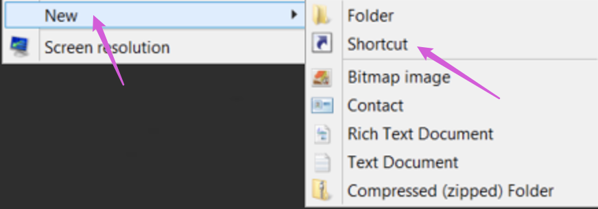

<!-- START doctoc generated TOC please keep comment here to allow auto update -->
<!-- DON'T EDIT THIS SECTION, INSTEAD RE-RUN doctoc TO UPDATE -->
**Table of Contents**  *generated with [DocToc](https://github.com/thlorenz/doctoc)*

- [cmd admin](#cmd-admin)
- [cmd admin without UAC check via Task Scheduler](#cmd-admin-without-uac-check-via-task-scheduler)
- [lansettings](#lansettings)
- [Desktop Icon Settings](#desktop-icon-settings)
- [Notification Area Icons](#notification-area-icons)
- [Personalization](#personalization)
- [Screen Saver](#screen-saver)
- [System](#system)
- [System Icon](#system-icon)

<!-- END doctoc generated TOC please keep comment here to allow auto update -->


### cmd admin

> references:
> - [Create Elevated Command Prompt Shortcut in Windows 10](https://www.tenforums.com/tutorials/72407-create-elevated-command-prompt-shortcut-windows-10-a.html)
> - [Open Elevated Command Prompt in Windows 10](https://www.tenforums.com/tutorials/2790-open-elevated-command-prompt-windows-10-a.html)


- create shortcut by `New` -> `Shortcut`
  

- insert commands
  

- setup shortcut name
  

- setup `Run as administrator` for the shortcut
  

- move shortcut to `Start Menu`
  

  


### cmd admin without UAC check via [Task Scheduler](https://docs.microsoft.com/en-us/windows/win32/taskschd/about-the-task-scheduler)

> references:
> - [Create Administrator Mode Shortcuts Without UAC Prompts in Windows 10](https://www.howtogeek.com/638652/create-administrator-mode-shortcuts-without-uac-prompts-in-windows-10/)
> - [How to Create Administrator Shortcut Without UAC Password Prompt](https://windowsloop.com/create-administrator-elevated-shortcut-without-uac-password-prompt/)


#### configuration in Task Scheduler
- <kbd>win</kbd> -> insert `Task Scheduler` -> <kbd>Enter</kbd>
- `Task Scheduler (Local)` -> `Create Task...`
  

- **General** Tab : -> Name: `RunAdminCMD` (or any you want) -> [x] `Run with highest privileges`
  

- **Conditions** Tab : -> [ ] `Start the task only if the computer is on AC power`
  

- **Actions** Tab : -> `New` -> **Browse Program/script:** -> select the path (i.e.: `C:\Windows\System32\cmd.exe`) -> `OK`
  

  

- **Triggers** Tab : -> `New` -> **Begin the task:** : `At Startup` (or `At log on`) -> `OK`
  

- **Settings** Tab : -> [ ] `Stop the task if runing longer than: 3 days` -> `OK`
  

- `Save` and `Run`
  

#### shortcut setup
- <kbd>right click</kbd> -> `New` -> `Shortcut`
  

- **Type the location of the item:** : `schtasks /run /tn "<taskName>"` (i.e.: `schtasks /run /tn "RunAdminCMD"`) -> `Next`
  

- **Type a name of this shortbut:** : any name you want (i.e.: `Command Prompt`) -> `Finish`
  

- <kbd>right click</kbd> the new shortcut -> `Properties` -> **Shortcut** Tab : `Change Icon`
  

- **Look for icons in this file** : `%SystemRoot%\System32\imageres.dll`
  

- put the shortcut to anywhere you want

  

### [lansettings](https://stackoverflow.com/a/3648396/2940319)
- Internet Settings
  ```batch
  > inetcpl.cpl
  ```

- Internet Settings with Connections Tab
  ```batch
  > rundll32.exe shell32.dll,Control_RunDLL inetcpl.cpl,,4
  ```

  [or](https://stackoverflow.com/a/45907190/2940319)

  ```batch
  > inetcpl.cpl ,4
  ```

  [or](https://stackoverflow.com/a/3648390/2940319)
  ```batch
  > control inetcpl.cpl,,4
  ```

- [proxy setup](https://stackoverflow.com/a/16453587/2940319)
  ```batch
  > REG ADD "HKCU\Software\Microsoft\Windows\CurrentVersion\Internet Settings" /v ProxyServer  /d "hhttp=proxy-url:port;https=proxy-url:port;ftp=proxy-url:port;socks=proxy-url:port;" /t REG_SZ /f
  ```

### Desktop Icon Settings
```batch
> rundll32.exe shell32.dll,Control_RunDLL desk.cpl,,0
```

### Notification Area Icons
```batch
> explorer shell:::{05d7b0f4-2121-4eff-bf6b-ed3f69b894d9}
```

### Personalization
```batch
> explorer shell:::{ED834ED6-4B5A-4bfe-8F11-A626DCB6A921}
```

### Screen Saver
```batch
> rundll32.exe shell32.dll,Control_RunDLL desk.cpl,,1
```

### System
```batch
> control /name Microsoft.System
```

or

  ```batch
  > control sysdm.cpl
  ```

### System Icon
```batch
> explorer shell:::{05d7b0f4-2121-4eff-bf6b-ed3f69b894d9} \SystemIcons,,0
```

