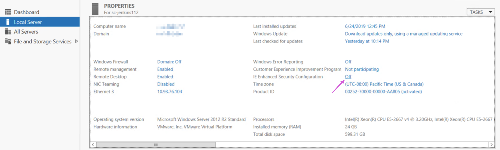
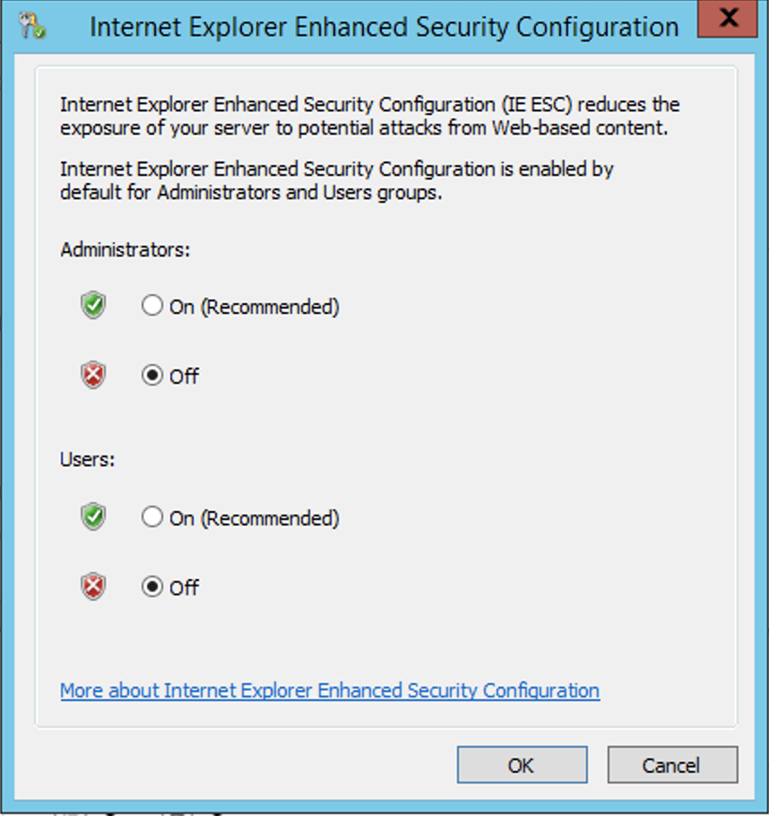

<!-- START doctoc generated TOC please keep comment here to allow auto update -->
<!-- DON'T EDIT THIS SECTION, INSTEAD RE-RUN doctoc TO UPDATE -->
**Table of Contents**  *generated with [DocToc](https://github.com/thlorenz/doctoc)*

- [process](#process)
  - [get the list of programs (`wmic`)](#get-the-list-of-programs-wmic)
  - [`ps auxf`](#ps-auxf)
  - [stop service & process via powershell](#stop-service--process-via-powershell)
- [CLSID](#clsid)
  - [usage](#usage)
  - [details](#details)
- [`regedit`](#regedit)
  - [Set `%USERPROFILE%` as `${HOME}` for **cygwin**](#set-%25userprofile%25-as-home-for-cygwin)
  - [PuTTy](#putty)
  - [disable screensaver](#disable-screensaver)
  - [Remove Graphics card context menu](#remove-graphics-card-context-menu)
  - [Set Environment Variables](#set-environment-variables)
  - [setx problem](#setx-problem)
  - [whoami check SID](#whoami-check-sid)
  - [Fingerprint Pro](#fingerprint-pro)
  - [Enable Gadgets](#enable-gadgets)
  - [issue about `"profile.d\Active"' is not recognized as an internal or external command`](#issue-about-profiled%5Cactive-is-not-recognized-as-an-internal-or-external-command)
  - [stop windows beep](#stop-windows-beep)
- [`shell`](#shell)
  - [<kbd>win</kbd> + <kbd>r</kbd>](#kbdwinkbd--kbdrkbd)
  - [debug in powershell](#debug-in-powershell)
  - [show all environment variables](#show-all-environment-variables)
  - [setup environment via config file by powershell](#setup-environment-via-config-file-by-powershell)
- [tricky](#tricky)

<!-- END doctoc generated TOC please keep comment here to allow auto update -->

> reference:
> - [windows commandline](https://www.windows-commandline.com/)
> - [TenForums](https://www.tenforums.com/)

## process
### get the list of programs (`wmic`)
```batch
[12:26:33.40 C:\Windows\SysWOW64]
$ wmic product get name,version
Name                                                                     Version
ALM-Platform Loader 11.5x                                                11.52.444.0
Microsoft Lync Web App Plug-in                                           15.8.8308.577
Google App Engine                                                        1.8.6.0
Microsoft Office Professional Plus 2010                                  14.0.6029.1000
Microsoft Office OneNote MUI (English) 2010                              14.0.6029.1000
...
```

### `ps auxf`
- `tasklist`
  ```batch
  > tasklist

  Image Name                     PID Session Name        Session#    Mem Usage
  ========================= ======== ================ =========== ============
  System Idle Process              0 Services                   0          4 K
  System                           4 Services                   0      8,236 K
  smss.exe                       520 Services                   0      1,164 K
  csrss.exe                      864 Services                   0      4,340 K
  wininit.exe                    960 Services                   0      4,744 K
  csrss.exe                      968 Console                    1     11,396 K
  services.exe                   108 Services                   0      7,776 K
  lsass.exe                       96 Services                   0     22,176 K
  ```

### stop service & process via powershell
> reference:
> - [Restart docker Windows 10 command line](https://stackoverflow.com/a/57560043/2940319)

- get service:
  ```powershell
  PS > Get-Service | Where-Object {$_.name -ilike "*docker*" -and $_.Status -ieq "Running"}

  Status   Name               DisplayName
  ------   ----               -----------
  Running  docker             Docker Engine

  # or

  PS > Get-Service | Where-Object {$_.name -ilike "*docker*" -and $_.Status -ieq "Running"}

  Status   Name               DisplayName
  ------   ----               -----------
  Running  docker             Docker Engine
  ```

- stop service:
  ```powershell
  PS > foreach($svc in (Get-Service | Where-Object {$_.name -ilike "*docker*" -and $_.Status -ieq "Running"}))
       {
         $svc | Stop-Service -ErrorAction Continue -Confirm:$false -Force
       }

  # or
  PS > Stop-Service docker -ErrorAction Continue -Confirm:$false -Force
  ```

- get process
  ```powershell
  PS > Get-Process | Where-Object {$_.Name -ilike "*docker*"}

  Handles  NPM(K)    PM(K)      WS(K)     CPU(s)     Id  SI ProcessName
  -------  ------    -----      -----     ------     --  -- -----------
      644      43   175288      56388     475.31   5080   0 dockerd
  ```

- stop process
  ```powershell
  PS > Get-Process | Where-Object {$_.Name -ilike "*docker*"} | Stop-Process -ErrorAction Continue -Confirm:$false -Force
  ```

#### restart docker service & process
  ```powershell
  PS > Stop-Service docker -ErrorAction Continue -Confirm:$false -Force
  PS > Get-Process | Where-Object {$_.Name -ilike "*docker*"} | Stop-Process -ErrorAction Continue -Confirm:$false -Force
  PS > Start-Service docker
  PS > Get-Process | Where-Object {$_.Name -ilike "*docker*"}

  Handles  NPM(K)    PM(K)      WS(K)     CPU(s)     Id  SI ProcessName
  -------  ------    -----      -----     ------     --  -- -----------
      371      26   142736      46460       1.06   5828   0 dockerd
  ```

#### restart via batch
> reference:
> - [Restart docker Windows 10 command line](https://stackoverflow.com/a/55212066/2940319)

```batch
> net stop docker
> net stop com.docker.service
> taskkill /IM "dockerd.exe" /F
> taskkill /IM "Docker for Windows.exe" /F
> net start docker
> net start com.docker.service
> "c:\program files\docker\docker\Docker for Windows.exe"
```

## [CLSID](https://www.tenforums.com/tutorials/3123-clsid-key-guid-shortcuts-list-windows-10-a.html)
> reference [CLSID Key (GUID) Shortcuts List for Windows 10](https://www.tenforums.com/tutorials/3123-clsid-key-guid-shortcuts-list-windows-10-a.html)
> http://www.klapac.funsite.cz/mediawiki/index.php?title=List_of_Windows_10_CLSID_Key_(GUID)_Shortcuts

### usage
```batch
> explorer.exe shell:::{05d7b0f4-2121-4eff-bf6b-ed3f69b894d9}
```

or

  ```batch
  > explorer.exe /e,::{CLSID key number}
  ```

### details
[clsid](./clsid.md)

## `regedit`
### [Set `%USERPROFILE%` as `${HOME}` for **cygwin**](http://stackoverflow.com/questions/225764/safely-change-home-directory-in-cygwin)
```batch
[15:55:36.30 C:\]
$ reg add HKCU\Environment /v HOME /t REG_EXPAND_SZ /d ^%USERPROFILE^%
```

### PuTTy
- Backup PuTTy sessions
  ```batch
  > regedit /e "%userprofile%\desktop\putty-registry.reg" HKEY_CURRENT_USER\Software\Simontatham
  ```

- Launchy PuTTy session as shortcut
  ```batch
  > [PuTTy.exe] -load [SessionName]
  ```

- Backup PuTTy session
  ```batch
  > regedit /e "%userprofile%\desktop\putty-sessions.reg" HKEY_CURRENT_USER\Software\SimonTatham\PuTTY\Sessions
  ```

### [disable screensaver](https://gist.github.com/Otiel/8d15d21593b481c1e525500762db52ba)
> reference [Configure screensaver command line](https://www.windows-commandline.com/configure-screensaver-command-line/)

```batch
REM  Disable the screensaver
REG ADD "HKCU\SOFTWARE\Policies\Microsoft\Windows\Control Panel\Desktop" /v ScreenSaverIsSecure /t REG_SZ /d 0 /f
REG ADD "HKCU\SOFTWARE\Policies\Microsoft\Windows\Control Panel\Desktop" /v ScreenSaveActive /t REG_SZ /d 0 /f
```
- or by using autohotkey
  ```autohotkey
  CoordMode, Mouse, Screen
  Loop
  {
    ; Move mouse
    MouseMove, 1, 1, 0, R
    ; Replace mouse to its original location
    MouseMove, -1, -1, 0, R
    ; Wait before moving the mouse again
    Sleep, 600000
  }
  return
  ```

  [or](https://autohotkey.com/board/topic/13510-move-mouse-when-not-in-use-to-disable-screensaver/)
  ```autohotkey
  #Persistent
  SetTimer, WatchCursor, 100
  return

  Loop
  {
    WatchCursor:
    MouseGetPos,X1 ,Y1
    Sleep 10000
    MouseGetPos,X2,Y2
    if X1=X2 And Y1=Y2
    {
      MouseMove,100,100
      Sleep, 10000
      MouseMove,200,200
      Sleep, 10000
    }
  }
  ```

### Remove Graphics card context menu
- Unregister igfxpph.dll
  ```batch
  [11:39:50.61 C:\]
  $ regsvr32 /u igfxpph.dll
  ```

- Remove register
    - Setting from regedit
    ```batch
    [11:47:10.20 C:\]
    $ REG DELETE "HKEY_CLASSES_ROOT\Directory\Background\shellex\ContextMenuHandlers\igfxcui" /f
    ```

    - Setting from setx
    ```batch
    [11:47:10.20 C:\]
    $ REG DELETE "HKEY_CLASSES_ROOT\Directory\Background\shellex\ContextMenuHandlers\igfxcui" /f
    ```

### Set Environment Variables
- Set User Varialbe
  ```batch
  [13:48:11.20 C:\]
  $ setx VIM_HOME C:\Marslo\MyProgramFiles\Vim\vim74\gvim.exe
  ```

- Set System Variable
  ```batch
  [13:48:11.20 C:\]
  $ setx /M VIM_HOME C:\Marslo\MyProgramFiles\Vim\vim74\gvim.exe
  ```

#### details
[windows default environment variable](./env.md)

### setx problem

```batch
[14:31:18.67 C:\]
$ setx /M PATH %PATH%;%M2_HOME%\bin
ERROR: Invalid syntax. Default option is not allowed more than '2' time(s).
Type "SETX /?" for usage.
```

- Fix:
  ```batch
  [14:31:18.67 C:\]
  $ REG ADD "HKEY_LOCAL_MACHINE\SYSTEM\CurrentControlSet\Control\Session Manager\Environment" /v Path /t REG_SZ /d "%path%;%M2_HOME%\bin" /f
  ```

### whoami check SID

```batch
[15:59:24.12 C:\Windows\SysWOW64]
$ whoami /user
USER INFORMATION
----------------
User Name        SID
================ ===============================================
mj\marslo_jiao S-1-5-21-354581543-3608027983-2995495404-970613
```

### Fingerprint Pro

```batch
URL: www.lenovo.com
Help link: support.lenovo.com
Installation folder: C:\Program Files\Lenovo\Fingerprint Manager Pro\
Uninstaller: "C:\Program Files\InstallShield Installation Information\{314FAD12-F785-4471-BCE8-AB506642B9A1}\setup.exe" -runfromtemp -l0x0409 -removeonly
Estimated size: 70.21 MB
```

### Enable Gadgets

```batch
Windows Registry Editor Version 5.00
[HKEY_CURRENT_USER\Software\Microsoft\Windows\CurrentVersion\Policies\Windows\Sidebar]
"TurnOffSidebar"=-
[HKEY_LOCAL_MACHINE\SOFTWARE\Microsoft\Windows\CurrentVersion\Policies\Windows\Sidebar]
"TurnOffSidebar"=-
```

### [issue about `"profile.d\Active"' is not recognized as an internal or external command`](https://github.com/cmderdev/cmder/issues/1102#issuecomment-251550950)

- regedit
  ```batch
  [HKEY_LOCAL_MACHINE\SOFTWARE\Microsoft\Command Processor]
  "Autorun"="@CHCP 65001>nul"
  ```

- cmd
  ```batch
  $ REG ADD "HKEY_LOCAL_MACHINE\SOFTWARE\Microsoft\Command Processor" /v AutoRun /t REG_SZ /d "@CHCP 65001>nul" /f
  ```

### stop windows beep
> references:
> - [How to disable PC Speaker beep sound in Windows 10]()https://winaero.com/how-to-disable-pc-speaker-beep-sound-in-windows-10/
> - [How to disable System Beep in Windows 10](https://www.thewindowsclub.com/disable-system-beep-windows-7-8)

```batch
> net stop beep
> sc config beep start= disabled
```

## `shell`
### <kbd>win</kbd> + <kbd>r</kbd>
> references:
> - [shell:folder](./shell-folder.html)

- appfolder
  ```batch
  > shell:appfolder
  ```

- startup folder
  ```batch
  > shell:startup
  > shell:Common Startup
  ```

### debug in powershell
> references:
> - [Set-PSDebug](https://docs.microsoft.com/en-us/powershell/module/microsoft.powershell.core/set-psdebug?view=powershell-7.1)
> - [Troubleshoot by Using Set-PSDebug](https://devblogs.microsoft.com/scripting/troubleshoot-by-using-set-psdebug/)

```powershell
> Set-PSDebug -Trace 2
```

### show all environment variables
```powershell
Write-Host "System Environment: "
Get-ChildItem -Path Env:
```

### setup environment via config file by powershell
> references:
> - [Set-Content](https://docs.microsoft.com/en-us/powershell/module/microsoft.powershell.management/set-content?view=powershell-7.1)

```powershell
PS C:\> cat .\test.txt
TEST_A=aa
TEST_B=bb

PS C:\> cat .\test.txt | ForEach-Object {
>>     $name, $value = $_ -split '=', 2
>>     Set-Content env:\"$name" $value
>> }
```

- example
  ```
  PS C:\> Get-Content -Path .\test.txt | Foreach-Object {
  >>   $name, $value = $_ -split '=', 2
  >>   echo "`n>>> $name ~> $value"
  >>   Set-Content env:\"$name" $value
  >>   Get-ChildItem Env:\"$name"
  >> }

  >>> TEST_A ~> aa

  Name                           Value
  ----                           -----
  TEST_A                         aa

  >>> TEST_B ~> bb
  TEST_B                         bb
  ```

## tricky
#### [Internet Explorer Enhanced Security Configuration is enabled](https://blog.blksthl.com/2012/11/28/how-to-disable-ie-enhanced-security-in-windows-server-2012/#:~:text=%20The%20steps%3A%20%201%20On%20the%20Windows,that%20can%20be%20disabled%2C%20one%20only...%20More%20)



