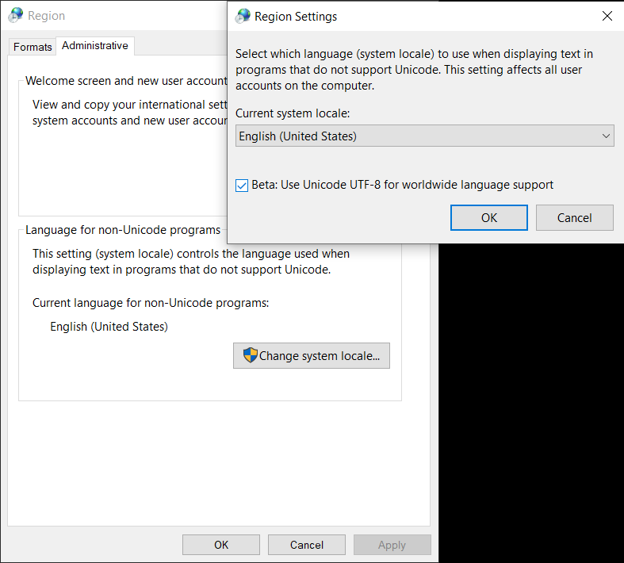
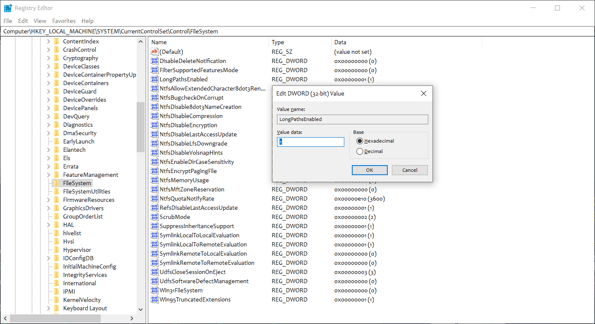
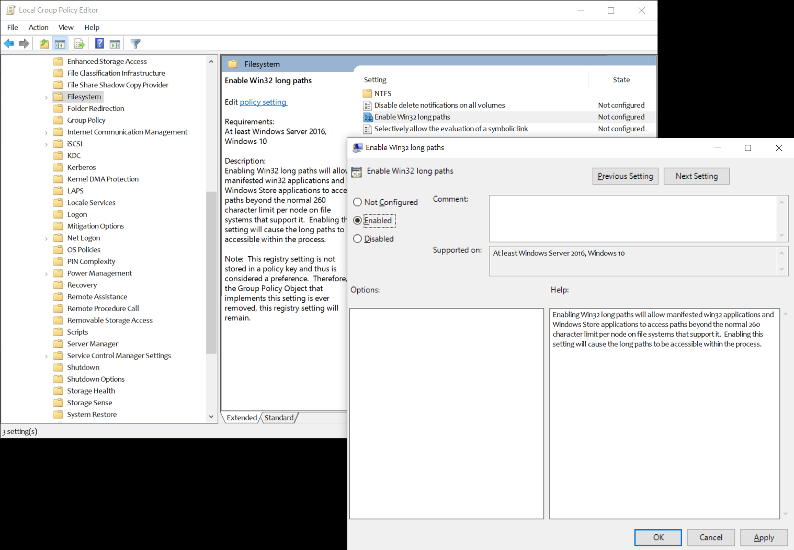
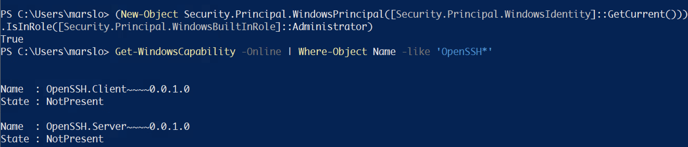
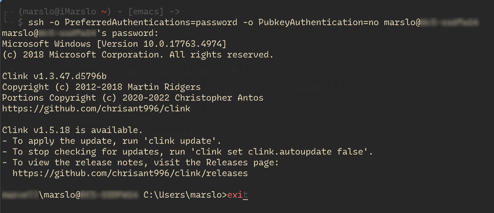
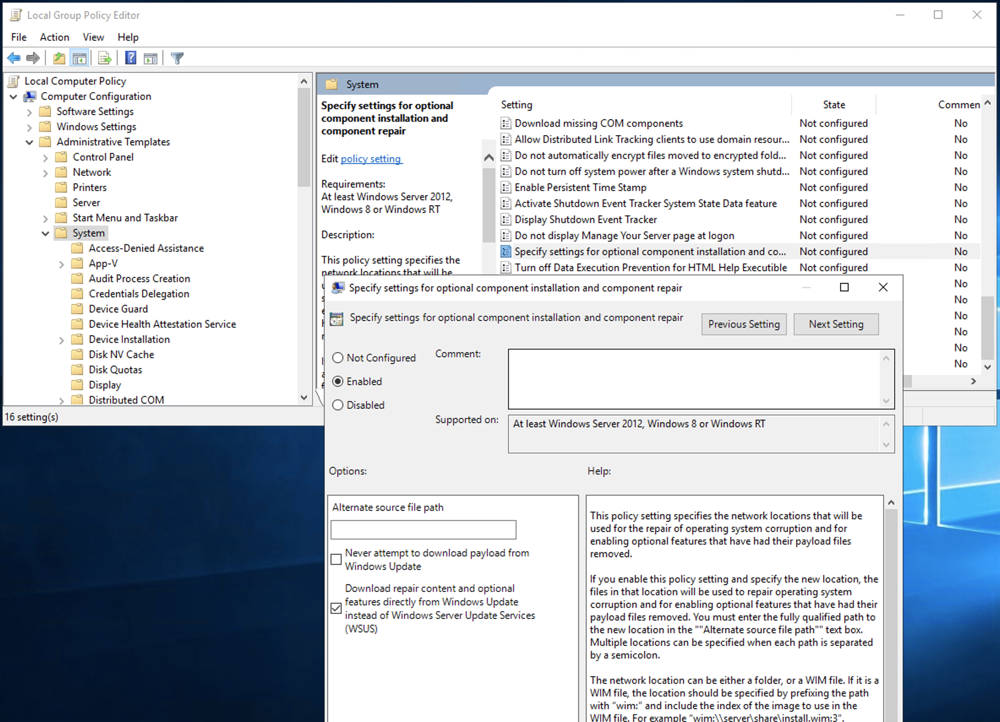
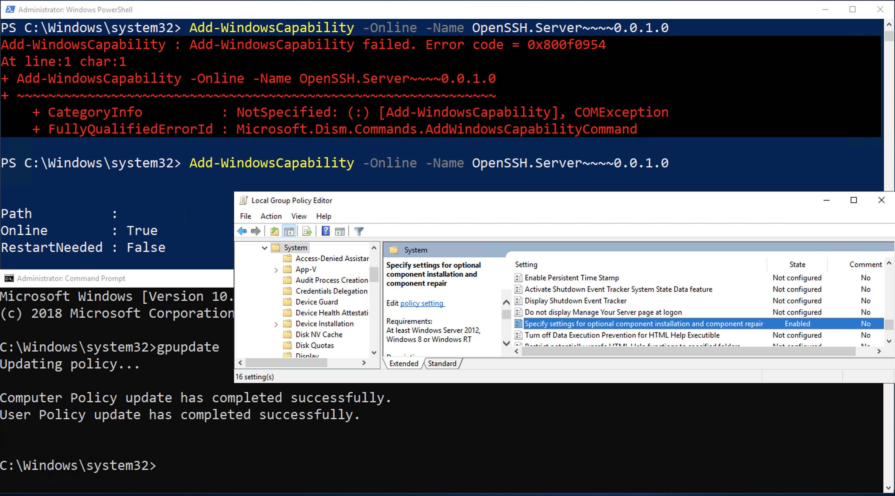
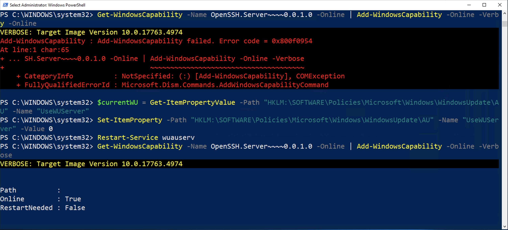

<!-- START doctoc generated TOC please keep comment here to allow auto update -->
<!-- DON'T EDIT THIS SECTION, INSTEAD RE-RUN doctoc TO UPDATE -->
**Table of Contents**  *generated with [DocToc](https://github.com/thlorenz/doctoc)*

- [system information](#system-information)
  - [manufacturer](#manufacturer)
  - [serial number](#serial-number)
  - [product name](#product-name)
  - [uuid](#uuid)
  - [system slot](#system-slot)
  - [cpu](#cpu)
  - [os](#os)
  - [system sensor status](#system-sensor-status)
  - [memory](#memory)
  - [disk](#disk)
  - [mac address](#mac-address)
- [process](#process)
  - [get the list of programs (`wmic`)](#get-the-list-of-programs-wmic)
  - [`ps auxf`](#ps-auxf)
  - [stop service & process via powershell](#stop-service--process-via-powershell)
- [CLSID](#clsid)
  - [usage](#usage)
  - [details](#details)
- [`regedit`](#regedit)
  - [Set `%USERPROFILE%` as `${HOME}` for **cygwin**](#set-%25userprofile%25-as-home-for-cygwin)
  - [PuTTy](#putty)
  - [disable screensaver](#disable-screensaver)
  - [Remove Graphics card context menu](#remove-graphics-card-context-menu)
  - [Set Environment Variables](#set-environment-variables)
  - [setx problem](#setx-problem)
  - [whoami check SID](#whoami-check-sid)
  - [fingerprint pro](#fingerprint-pro)
  - [enable gadgets](#enable-gadgets)
  - [issue about `"profile.d\Active"' is not recognized as an internal or external command`](#issue-about-profiled%5Cactive-is-not-recognized-as-an-internal-or-external-command)
  - [stop windows beep](#stop-windows-beep)
  - [outlook move hubbar to bottom](#outlook-move-hubbar-to-bottom)
- [`shell`](#shell)
  - [utf-8 in windows terminal](#utf-8-in-windows-terminal)
  - [<kbd>win</kbd> + <kbd>r</kbd>](#kbdwinkbd--kbdrkbd)
  - [debug in powershell](#debug-in-powershell)
  - [show all environment variables](#show-all-environment-variables)
  - [setup environment via config file by powershell](#setup-environment-via-config-file-by-powershell)
- [tricky](#tricky)
  - [enable LongPaths in windows](#enable-longpaths-in-windows)
  - [Internet Explorer Enhanced Security Configuration is enabled](#internet-explorer-enhanced-security-configuration-is-enabled)
  - [powershell plugins](#powershell-plugins)
  - [openssh for windows](#openssh-for-windows)
- [troubleshooting](#troubleshooting)
  - [`Error code = 0x800f0954`](#error-code--0x800f0954)

<!-- END doctoc generated TOC please keep comment here to allow auto update -->


> reference:
> - [windows commandline](https://www.windows-commandline.com/)
> - [TenForums](https://www.tenforums.com/)


## system information


> - [20 Useful wmic command examples in Windows | Cheat Sheet](https://www.cyberithub.com/20-useful-wmic-command-examples-in-windows-cheat-sheet/)
> - [MS-DOS and Windows command line wmic command](https://www.computerhope.com/wmic.htm)
> - [Find The Manufacturer, Model, Name And System Type Using The Command Prompt](https://support.4it.com.au/article/find-manufacturer-model-name-system-type-using-command-prompt/)
> - [How to Find Your Windows 10 PC Hardware and System Specs](https://www.groovypost.com/howto/find-your-windows-10-computers-hardware-and-system-specs/)
> - [How to get full PC memory specs (speed, size, type, part number, form factor) on Windows 10](https://www.windowscentral.com/how-get-full-memory-specs-speed-size-type-part-number-form-factor-windows-10)
> - [4 Ways to Find Number of Cores in your CPU on Windows 10](https://www.top-password.com/blog/find-number-of-cores-in-your-cpu-on-windows-10/)
> - [View Disk Properties and LUN Information in Windows](https://support.purestorage.com/Solutions/Microsoft_Platform_Guide/Multipath-IO_and_Storage_Settings/View_Disk_Properties_and_LUN_Information_in_Windows)
> - [Get mac address from command line (CMD)](https://www.windows-commandline.com/get-mac-address-command-line/)
> - [How to check a PC's hard drive model, serial number, firmware version, and more using Command Prompt](https://www.windowscentral.com/how-check-hard-drive-model-serial-number-firmware-version-and-more-using-command-prompt)


> [!TIP|label:memorychip]
>
> - supported types:
>
> | ID |       TYPE       |
> |:--:|:----------------:|
> |  0 |      Unknown     |
> |  1 |       Other      |
> |  2 |       DRAM       |
> |  3 | Synchronous DRAM |
> |  4 |    Cache DRAM    |
> |  5 |        EDO       |
> |  6 |       EDRAM      |
> |  7 |       VRAM       |
> |  8 |       SRAM       |
> |  9 |        RAM       |
> | 10 |        ROM       |
> | 11 |       Flash      |
> | 12 |      EEPROM      |
> | 13 |      FEPROM      |
> | 14 |       EPROM      |
> | 15 |       CDRAM      |
> | 16 |       3DRAM      |
> | 17 |       SDRAM      |
> | 18 |       SGRAM      |
> | 19 |       RDRAM      |
> | 20 |        DDR       |
> | 21 |       DDR2       |
> | 22 |   DDR2 FB-DIMM   |
> | 24 |       DDR3       |
> | 25 |       FBD2       |
> | 26 |       DDR4       |
>
> - supported form factors:
>
> | ID |     FORM    |
> |:--:|:-----------:|
> |  0 |   Unknown   |
> |  1 |    Other    |
> |  2 |     SIP     |
> |  3 |     DIP     |
> |  4 |     ZIP     |
> |  5 |     SOJ
> |  6 | Proprietary |
> |  7 |     SIMM    |
> |  8 |     DIMM    |
> |  9 |     TSOP    |
> | 10 |     PGA     |
> | 11 |     RIMM    |
> | 12 |    SODIMM   |
> | 13 |    SRIMM    |
> | 14 |     SMD     |
> | 15 |     SSMP    |
> | 16 |     QFP     |
> | 17 |     TQFP    |
> | 18 |     SOIC    |
> | 19 |     LCC     |
> | 20 |     PLCC    |
> | 21 |     BGA     |
> | 22 |    FPBGA    |
> | 23 |     LGA     |
> | 24 |   FB-DIMM   |

```batch
> wmic computersystem
AdminPasswordStatus  AutomaticManagedPagefile  AutomaticResetBootOption  AutomaticResetCapability  BootOptionOnLimit  BootOptionOnWatchDog  BootROMSupported  BootStatus                      BootupState  Caption    ChassisBootupState  ChassisSKUNumber  CreationClassName     CurrentTimeZone  DaylightInEffect  Description       DNSHostName  Domain       DomainRole  EnableDaylightSavingsTime  FrontPanelResetStatus  HypervisorPresent  InfraredSupported  InitialLoadInfo  InstallDate  KeyboardPasswordStatus  LastLoadInfo  Manufacturer  Model              Name       NameFormat  NetworkServerModeEnabled  NumberOfLogicalProcessors  NumberOfProcessors  OEMLogoBitmap  OEMStringArray                                                             PartOfDomain  PauseAfterReset  PCSystemType  PCSystemTypeEx  PowerManagementCapabilities  PowerManagementSupported  PowerOnPasswordStatus  PowerState  PowerSupplyState  PrimaryOwnerContact  PrimaryOwnerName  ResetCapability  ResetCount  ResetLimit  Roles                                               Status  SupportContactDescription  SystemFamily    SystemSKUNumber  SystemStartupDelay  SystemStartupOptions  SystemStartupSetting  SystemType    ThermalState  TotalPhysicalMemory  UserName  WakeUpType  Workgroup
3                    TRUE                      TRUE                      TRUE                                                               TRUE              {0, 0, 0, 0, 0, 0, 0, 0, 0, 0}  Normal boot  MY-WINDOWS 3                   Default string    Win32_ComputerSystem  480                                AT/AT COMPATIBLE  MY-WINDOWS   computer.com 3           TRUE                       3                      FALSE              FALSE                                            3                                     Supermicro    SYS-1028U-E1CRTP+  MY-COMUTER             TRUE                      32                         2                                  {"Intel Haswell/Wellsburg/Grantley", "Supermicro motherboard-X10 Series"}  TRUE          -1               4             4                                                                      3                      0           3                                      Windows User      1                -1          -1          {"LM_Workstation", "LM_Server", "NT", "Server_NT"}  OK                                 Default string  Default string                                                                   x64-based PC  3             120139976704                   6

REM computer system product
> wmic csproduct
Caption                  Description              IdentifyingNumber  Name               SKUNumber  UUID                                  Vendor      Version
Computer System Product  Computer System Product  S2xxxxxxxxxxxxx    SYS-xxxxU-Exxxxx+             00000000-0000-0000-0000-0xxxxxxxxxxx  Supermicro  0123456789

> wmic bios
BiosCharacteristics                                                          BIOSVersion                                                  BuildNumber  Caption                                     CodeSet  CurrentLanguage  Description                                 EmbeddedControllerMajorVersion  EmbeddedControllerMinorVersion  IdentificationCode  InstallableLanguages  InstallDate  LanguageEdition  ListOfLanguages  Manufacturer              Name                                        OtherTargetOS  PrimaryBIOS  ReleaseDate                SerialNumber     SMBIOSBIOSVersion  SMBIOSMajorVersion  SMBIOSMinorVersion  SMBIOSPresent  SoftwareElementID                           SoftwareElementState  Status  SystemBiosMajorVersion  SystemBiosMinorVersion  TargetOperatingSystem  Version
{7, 11, 12, 15, 16, 17, 19, 23, 24, 25, 26, 27, 28, 29, 32, 33, 40, 42, 43}  {"- 1072009", "BIOS Date: 06/08/18 21:36:11 Ver: 05.0000B"}               BIOS Date: 06/08/18 21:36:11 Ver: 05.0000B                            BIOS Date: 06/08/18 21:36:11 Ver: 05.0000B  255                             255                                                                                                                      American Megatrends Inc.  BIOS Date: 06/08/18 21:36:11 Ver: 05.0000B                 TRUE         20180608000000.000000+000  Sxxxxxxxxxxxxx2  3.1                3                   0                   TRUE           BIOS Date: 06/08/18 21:36:11 Ver: 05.0000B  3                     OK      5                       6                       0                      - 1072009


> wmic cpu
AddressWidth  Architecture  AssetTag  Availability  Caption                               Characteristics  ConfigManagerErrorCode  ConfigManagerUserConfig  CpuStatus  CreationClassName  CurrentClockSpeed  CurrentVoltage  DataWidth  Description                           DeviceID  ErrorCleared  ErrorDescription  ExtClock  Family  InstallDate  L2CacheSize  L2CacheSpeed  L3CacheSize  L3CacheSpeed  LastErrorCode  Level  LoadPercentage  Manufacturer  MaxClockSpeed  Name                                       NumberOfCores  NumberOfEnabledCore  NumberOfLogicalProcessors  OtherFamilyDescription  PartNumber  PNPDeviceID  PowerManagementCapabilities  PowerManagementSupported  ProcessorId       ProcessorType  Revision  Role  SecondLevelAddressTranslationExtensions  SerialNumber  SocketDesignation  Status  StatusInfo  Stepping  SystemCreationClassName  SystemName  ThreadCount  UniqueId  UpgradeMethod  Version  VirtualizationFirmwareEnabled  VMMonitorModeExtensions  VoltageCaps
64            9                       3             Intel64 Family 6 Model 79 Stepping 1  252                                                               1          Win32_Processor    1200               18              64         Intel64 Family 6 Model 79 Stepping 1  CPU0                                      100       179                  2048                       25600        0                            6      2               GenuineIntel  3201           Intel(R) Xeon(R) CPU E5-2667 v4 @ 3.20GHz  8              8                    16                                                                                                       FALSE                     BFEBFBFF000406F1  3              20225     CPU   TRUE                                                   CPU1               OK      3                     Win32_ComputerSystem     MY-COMUTER  16                     43                      TRUE                           TRUE
64            9                       3             Intel64 Family 6 Model 79 Stepping 1  252                                                               1          Win32_Processor    1200               18              64         Intel64 Family 6 Model 79 Stepping 1  CPU1                                      100       179                  2048                       25600        0                            6      1               GenuineIntel  3201           Intel(R) Xeon(R) CPU E5-2667 v4 @ 3.20GHz  8              8                    16                                                                                                       FALSE                     BFEBFBFF000406F1  3              20225     CPU   TRUE                                                   CPU2               OK      3                     Win32_ComputerSystem     MY-COMUTER  16                     43                      TRUE                           TRUE

> wmic os
BootDevice               BuildNumber  BuildType            Caption                                 CodeSet  CountryCode  CreationClassName      CSCreationClassName   CSDVersion  CSName     CurrentTimeZone  DataExecutionPrevention_32BitApplications  DataExecutionPrevention_Available  DataExecutionPrevention_Drivers  DataExecutionPrevention_SupportPolicy  Debug  Description  Distributed  EncryptionLevel  ForegroundApplicationBoost  FreePhysicalMemory  FreeSpaceInPagingFiles  FreeVirtualMemory  InstallDate                LargeSystemCache  LastBootUpTime             LocalDateTime              Locale  Manufacturer           MaxNumberOfProcesses  MaxProcessMemorySize  MUILanguages  Name                                                                            NumberOfLicensedUsers  NumberOfProcesses  NumberOfUsers  OperatingSystemSKU  Organization  OSArchitecture  OSLanguage  OSProductSuite  OSType  OtherTypeDescription  PAEEnabled  PlusProductID  PlusVersionNumber  PortableOperatingSystem  Primary  ProductType  RegisteredUser  SerialNumber             ServicePackMajorVersion  ServicePackMinorVersion  SizeStoredInPagingFiles  Status  SuiteMask  SystemDevice             SystemDirectory      SystemDrive  TotalSwapSpaceSize  TotalVirtualMemorySize  TotalVisibleMemorySize  Version     WindowsDirectory
\Device\HarddiskVolume2  14393        Multiprocessor Free  Microsoft Windows Server 2016 Standard  1252     1            Win32_OperatingSystem  Win32_ComputerSystem              MY-COMUTER 480              TRUE                                       TRUE                               TRUE                             3                                      FALSE               FALSE        256              2                           104318100           16628652                123960128          20190906144511.000000+480                    20220910175932.131994+480  20221108192010.474000+480  0409    Microsoft Corporation  4294967295            137438953344          {"en-US"}     Microsoft Windows Server 2016 Standard|C:\Windows|\Device\Harddisk0\Partition3  0                      90                 11             7                                 64-bit          1033        272             18                                                                          FALSE                    TRUE     3            Windows User    003xx-6xxxx-00000-AAxxx  0                        0                        16777216                 OK      272        \Device\HarddiskVolume3  C:\Windows\system32  C:                               134101412               117324196               10.0.14393  C:\Windows

> wmic memorychip list
BankLabel                Capacity     DataWidth  Description      DeviceLocator  FormFactor  HotSwappable  InstallDate  InterleaveDataDepth  InterleavePosition  Manufacturer  MemoryType  Model  Name             OtherIdentifyingInfo  PartNumber          PositionInRow  PoweredOn  Removable  Replaceable  SerialNumber  SKU  Speed  Status  Tag                 TotalWidth  TypeDetail  Version
P0_Node0_Channel0_Dimm0  17179869184  64         Physical Memory  P1-DIMMA1      8                                      0                    0                   Micron        0                  Physical Memory                        18ASF2G72PDZ-2G6E1  1                                                 1D698284           2667           Physical Memory 0   72          128
P0_Node0_Channel1_Dimm0  17179869184  64         Physical Memory  P1-DIMMB1      8                                      0                    0                   Micron        0                  Physical Memory                        18ASF2G72PDZ-2G6E1  1                                                 1D69C62D           2667           Physical Memory 3   72          128
P0_Node0_Channel2_Dimm0  17179869184  64         Physical Memory  P1-DIMMC1      8                                      0                    0                   Micron        0                  Physical Memory                        18ASF2G72PDZ-2G6E1  1                                                 1D6975D6           2667           Physical Memory 6   72          128
P0_Node0_Channel3_Dimm0  17179869184  64         Physical Memory  P1-DIMMD1      8                                      0                    0                   Micron        0                  Physical Memory                        18ASF2G72PDZ-2G6E1  1                                                 1D697650           2667           Physical Memory 9   72          128
P1_Node1_Channel1_Dimm0  17179869184  64         Physical Memory  P2-DIMMF1      8                                      0                    0                   Micron        0                  Physical Memory                        18ASF2G72PDZ-2G6E1  1                                                 1D696E47           2667           Physical Memory 15  72          128
P1_Node1_Channel2_Dimm0  17179869184  64         Physical Memory  P2-DIMMG1      8                                      0                    0                   Micron        0                  Physical Memory                        18ASF2G72PDZ-2G6E1  1                                                 1D69C141           2667           Physical Memory 18  72          128
P1_Node1_Channel3_Dimm0  17179869184  64         Physical Memory  P2-DIMMH1      8                                      0                    0                   Micron        0                  Physical Memory                        18ASF2G72PDZ-2G6E1  1                                                 1D69BD45           2667           Physical Memory 21  72          128

> wmic diskdrive list
Availability  BytesPerSector  Capabilities  CapabilityDescriptions                 CompressionMethod  ConfigManagerErrorCode  ConfigManagerUserConfig  DefaultBlockSize  Description  DeviceID            ErrorCleared  ErrorDescription  ErrorMethodology  Index  InstallDate  InterfaceType  LastErrorCode  Manufacturer            MaxBlockSize  MaxMediaSize  MediaLoaded  MediaType              MinBlockSize  Model                           Name                NeedsCleaning  NumberOfMediaSupported  Partitions  PNPDeviceID                                           PowerManagementCapabilities  PowerManagementSupported  SCSIBus  SCSILogicalUnit  SCSIPort  SCSITargetId  SectorsPerTrack  Signature  Size           Status  StatusInfo  SystemName  TotalCylinders  TotalHeads  TotalSectors  TotalTracks  TracksPerCylinder
              512             {3, 4}        {"Random Access", "Supports Writing"}                     0                       FALSE                                      Disk drive   \\.\PHYSICALDRIVE1                                                    1                   SCSI                          (Standard disk drives)                              TRUE         Fixed hard disk media                AVAGO SMC3108 SCSI Disk Device  \\.\PHYSICALDRIVE1                                         2           SCSI\DISK&VEN_AVAGO&PROD_SMC3108\5&1xxxxxxxxxxxxxxx0                                                         1        0                0         1             63                          7679261237760  OK                  MY-COMPUTER 933617          255         14998557105   238072335    255
              512             {3, 4}        {"Random Access", "Supports Writing"}                     0                       FALSE                                      Disk drive   \\.\PHYSICALDRIVE0                                                    0                   SCSI                          (Standard disk drives)                              TRUE         Fixed hard disk media                AVAGO SMC3108 SCSI Disk Device  \\.\PHYSICALDRIVE0                                         3           SCSI\DISK&VEN_AVAGO&PROD_SMC3108\5&1xxxxxxxxxxxxxxx0                                                         1        0                0         0             38               745584     239511336960   OK                  MY-COMPUTER 117242          105         467795580     12310410     105

```

- or <kbd>ctrl</kbd> + <kbd>r</kbd> -> `msinfo32`

  [msinfo32](../../screenshot/win/msinfo32.png)

### manufacturer
```batch
> wmic computersystem get manufacturer
anufacturer
Supermicro
```

### serial number
```batch
> wmic bios get serialnumber
SerialNumber
Sxxxxxxxxxxxxx2
```

### product name
```batch
> wmic computersystem get model,name,manufacturer,systemtype
```

### uuid
```batch
> wmic csproduct get uuid
UUID
00000000-0000-0000-0000-0xxxxxxxxxxx
```

### system slot
```batch
> wmic systemslot get slotdesignation,currentusage,description,status
CurrentUsage  Description  SlotDesignation                    Status
4             System Slot  RSC-R1UW-2E16  SLOT1 PCI-E X16     OK
3             System Slot  RSC-R1UW-2E16  SLOT2 PCI-E X16     OK
3             System Slot  RSC-R1UW-E8R   SLOT1 PCI-E X8      OK
4             System Slot  AOC-URN2-i4GXS SLOT1 PCI-E 3.0 X8  OK
```

### cpu
```batch
> wmic cpu get DeviceID,NumberOfCores,NumberOfLogicalProcessors,Manufacturer,Name,ProcessorId
DeviceID  Manufacturer  Name                                       NumberOfCores  NumberOfLogicalProcessors  ProcessorId
CPU0      GenuineIntel  Intel(R) Xeon(R) CPU E5-2667 v4 @ 3.20GHz  8              16                         BFEBFBFF000406F1
CPU1      GenuineIntel  Intel(R) Xeon(R) CPU E5-2667 v4 @ 3.20GHz  8              16                         BFEBFBFF000406F1

REM or
> wmic cpu get SocketDesignation, NumberOfCores, NumberOfLogicalProcessors /Format:List
NumberOfCores=8
NumberOfLogicalProcessors=16
SocketDesignation=CPU1

NumberOfCores=8
NumberOfLogicalProcessors=16
SocketDesignation=CPU2

REM or
> echo %NUMBER_OF_PROCESSORS%
32
```

- or
  ```powershell
  > Get-WmiObject –class Win32_processor | ft NumberOfCores,NumberOfLogicalProcessors

  NumberOfCores NumberOfLogicalProcessors
  ------------- -------------------------
              8                        16
  ```

### os
```batch
> wmic os get Caption,CodeSet,Manufacturer,OSArchitecture,SerialNumber
Caption                                 CodeSet  Manufacturer           OSArchitecture  SerialNumber
icrosoft Windows Server 2016 Standard  1252     Microsoft Corporation  64-bit          003xx-6xxxx-00000-AAxxx
```

### system sensor status
```batch
> wmic temperature get deviceid,name,status
```

### memory
```batch
> wmic memphysical
Caption                CreationClassName          Depth  Description            Height  HotSwappable  InstallDate  Location  Manufacturer  MaxCapacity  MaxCapacityEx  MemoryDevices  MemoryErrorCorrection  Model  Name                   OtherIdentifyingInfo  PartNumber  PoweredOn  Removable  Replaceable  SerialNumber  SKU  Status  Tag                      Use  Version  Weight  Width
Physical Memory Array  Win32_PhysicalMemoryArray         Physical Memory Array                                     3                       805306368    805306368      12             6                             Physical Memory Array                                                                                                  Physical Memory Array 0  3
Physical Memory Array  Win32_PhysicalMemoryArray         Physical Memory Array                                     3                       805306368    805306368      12             6                             Physical Memory Array                                                                                                  Physical Memory Array 1  3

> systeminfo | findstr /C:"Total Physical Memory"
Total Physical Memory:     114,574 MB

> wmic computersystem get TotalPhysicalMemory
TotalPhysicalMemory
120139976704

> wmic os get TotalVirtualMemorySize, TotalVisibleMemorySize, FreePhysicalMemory, FreeVirtualMemory, MaxProcessMemorySize
FreePhysicalMemory  FreeVirtualMemory  MaxProcessMemorySize  TotalVirtualMemorySize  TotalVisibleMemorySize
104338016           123980828          137438953344          134101412               117324196
```

### disk
```batch
> wmic diskdrive get model,index,firmwareRevision,status,interfaceType,totalHeads,totalTracks,totalCylinders,totalSectors,partitions
FirmwareRevision  Index  InterfaceType  Model                           Partitions  Status  TotalCylinders  TotalHeads  TotalSectors  TotalTracks
4.68              1      SCSI           AVAGO SMC3108 SCSI Disk Device  2           OK      933617          255         14998557105   238072335
4.68              0      SCSI           AVAGO SMC3108 SCSI Disk Device  3           OK      117242          105         467795580     12310410
```

- via diskpart
  ```batch
  > diskpart

  DISKPART> list volume

    Volume ###  Ltr  Label        Fs     Type        Size     Status     Info
    ----------  ---  -----------  -----  ----------  -------  ---------  --------
    Volume 0     E   New Volume   NTFS   Simple      7151 GB  Healthy
    Volume 1         System Rese  NTFS   Partition    500 MB  Healthy    System
    Volume 2     C                NTFS   Partition    221 GB  Healthy    Boot

  DISKPART> list disk

  Disk ###  Status         Size     Free     Dyn  Gpt
  --------  -------------  -------  -------  ---  ---
  Disk 0    Online          223 GB      0 B
  Disk 1    Online         7151 GB      0 B   *    *

  DISKPART> select disk 0
  Disk 0 is now the selected disk.

  DISKPART> detail disk
  AVAGO SMC3108 SCSI Disk Device
  Disk ID: 000B6070
  Type   : RAID
  Status : Online
  Path   : 1
  Target : 0
  LUN ID : 0
  Location Path : PCIROOT(0)#PCI(0200)#PCI(0000)#RAID(P01T00L00)
  Current Read-only State : No
  Read-only  : No
  Boot Disk  : Yes
  Pagefile Disk  : Yes
  Hibernation File Disk  : No
  Crashdump Disk  : Yes
  Clustered Disk  : No

    Volume ###  Ltr  Label        Fs     Type        Size     Status     Info
    ----------  ---  -----------  -----  ----------  -------  ---------  --------
    Volume 1         System Rese  NTFS   Partition    500 MB  Healthy    System
    Volume 2     C                NTFS   Partition    221 GB  Healthy    Boot

  DISKPART> select disk 1
  Disk 1 is now the selected disk.

  DISKPART> detail disk
  AVAGO SMC3108 SCSI Disk Device
  Disk ID: {057A21CC-17C6-45E2-893C-D68B128CAD35}
  Type   : RAID
  Status : Online
  Path   : 1
  Target : 1
  LUN ID : 0
  Location Path : PCIROOT(0)#PCI(0200)#PCI(0000)#RAID(P01T01L00)
  Current Read-only State : No
  Read-only  : No
  Boot Disk  : No
  Pagefile Disk  : No
  Hibernation File Disk  : No
  Crashdump Disk  : No
  Clustered Disk  : No

    Volume ###  Ltr  Label        Fs     Type        Size     Status     Info
    ----------  ---  -----------  -----  ----------  -------  ---------  --------
    Volume 0     E   New Volume   NTFS   Simple      7151 GB  Healthy
  ```

### mac address
```batch
> getmac

Physical Address    Transport Name
=================== ==========================================================
AC-xx-xx-xx-xx-xx   Media disconnected
N/A                 Hardware not present
0C-xx-xx-xx-xx-xx   \Device\Tcpip_{BxxxxxxA-3xx1-4xxF-8xx5-3xxxxxxxxxxA}
```

## process
### get the list of programs (`wmic`)
```batch
[12:26:33.40 C:\Windows\SysWOW64]
$ wmic product get name,version
Name                                                                     Version
ALM-Platform Loader 11.5x                                                11.52.444.0
icrosoft Lync Web App Plug-in                                           15.8.8308.577
Google App Engine                                                        1.8.6.0
icrosoft Office Professional Plus 2010                                  14.0.6029.1000
icrosoft Office OneNote MUI (English) 2010                              14.0.6029.1000
...
```

### `ps auxf`
- `tasklist`
  ```batch
  > tasklist

  Image Name                     PID Session Name        Session#    Mem Usage
  ========================= ======== ================ =========== ============
  System Idle Process              0 Services                   0          4 K
  System                           4 Services                   0      8,236 K
  smss.exe                       520 Services                   0      1,164 K
  csrss.exe                      864 Services                   0      4,340 K
  wininit.exe                    960 Services                   0      4,744 K
  csrss.exe                      968 Console                    1     11,396 K
  services.exe                   108 Services                   0      7,776 K
  lsass.exe                       96 Services                   0     22,176 K
  ```

### stop service & process via powershell
> reference:
> - [Restart docker Windows 10 command line](https://stackoverflow.com/a/57560043/2940319)

- get service:
  ```powershell
  PS > Get-Service | Where-Object {$_.name -ilike "*docker*" -and $_.Status -ieq "Running"}

  Status   Name               DisplayName
  ------   ----               -----------
  Running  docker             Docker Engine

  # or

  PS > Get-Service | Where-Object {$_.name -ilike "*docker*" -and $_.Status -ieq "Running"}

  Status   Name               DisplayName
  ------   ----               -----------
  Running  docker             Docker Engine
  ```

- stop service:
  ```powershell
  PS > foreach($svc in (Get-Service | Where-Object {$_.name -ilike "*docker*" -and $_.Status -ieq "Running"}))
       {
         $svc | Stop-Service -ErrorAction Continue -Confirm:$false -Force
       }

  # or
  PS > Stop-Service docker -ErrorAction Continue -Confirm:$false -Force
  ```

- get process
  ```powershell
  PS > Get-Process | Where-Object {$_.Name -ilike "*docker*"}

  Handles  NPM(K)    PM(K)      WS(K)     CPU(s)     Id  SI ProcessName
  -------  ------    -----      -----     ------     --  -- -----------
      644      43   175288      56388     475.31   5080   0 dockerd
  ```

- stop process
  ```powershell
  PS > Get-Process | Where-Object {$_.Name -ilike "*docker*"} | Stop-Process -ErrorAction Continue -Confirm:$false -Force
  ```

#### restart docker service & process
  ```powershell
  PS > Stop-Service docker -ErrorAction Continue -Confirm:$false -Force
  PS > Get-Process | Where-Object {$_.Name -ilike "*docker*"} | Stop-Process -ErrorAction Continue -Confirm:$false -Force
  PS > Start-Service docker
  PS > Get-Process | Where-Object {$_.Name -ilike "*docker*"}

  Handles  NPM(K)    PM(K)      WS(K)     CPU(s)     Id  SI ProcessName
  -------  ------    -----      -----     ------     --  -- -----------
      371      26   142736      46460       1.06   5828   0 dockerd
  ```

#### restart via batch
> reference:
> - [Restart docker Windows 10 command line](https://stackoverflow.com/a/55212066/2940319)

```batch
> net stop docker
> net stop com.docker.service
> taskkill /IM "dockerd.exe" /F
> taskkill /IM "Docker for Windows.exe" /F
> net start docker
> net start com.docker.service
> "c:\program files\docker\docker\Docker for Windows.exe"
```

## [CLSID](https://www.tenforums.com/tutorials/3123-clsid-key-guid-shortcuts-list-windows-10-a.html)
> reference [CLSID Key (GUID) Shortcuts List for Windows 10](https://www.tenforums.com/tutorials/3123-clsid-key-guid-shortcuts-list-windows-10-a.html)
> http://www.klapac.funsite.cz/mediawiki/index.php?title=List_of_Windows_10_CLSID_Key_(GUID)_Shortcuts

### usage
```batch
> explorer.exe shell:::{05d7b0f4-2121-4eff-bf6b-ed3f69b894d9}
```

or

  ```batch
  > explorer.exe /e,::{CLSID key number}
  ```

### details
[clsid](./clsid.md)

## `regedit`

### [Set `%USERPROFILE%` as `${HOME}` for **cygwin**](http://stackoverflow.com/questions/225764/safely-change-home-directory-in-cygwin)
```batch
[15:55:36.30 C:\]
> REG ADD HKCU\Environment /v HOME /t REG_EXPAND_SZ /d ^%USERPROFILE^%
```

### PuTTy
- Backup PuTTy sessions
  ```batch
  > REGEDIT /e "%userprofile%\desktop\putty-registry.reg" HKEY_CURRENT_USER\Software\Simontatham
  ```

- Launchy PuTTy session as shortcut
  ```batch
  > [PuTTy.exe] -load [SessionName]
  ```

- Backup PuTTy session
  ```batch
  > REGEDIT /e "%userprofile%\desktop\putty-sessions.reg" HKEY_CURRENT_USER\Software\SimonTatham\PuTTY\Sessions
  ```

### [disable screensaver](https://gist.github.com/Otiel/8d15d21593b481c1e525500762db52ba)
> reference [Configure screensaver command line](https://www.windows-commandline.com/configure-screensaver-command-line/)

```batch
> REM  Disable the screensaver
> REG ADD "HKCU\SOFTWARE\Policies\Microsoft\Windows\Control Panel\Desktop" /v ScreenSaverIsSecure /t REG_SZ /d 0 /f
> REG ADD "HKCU\SOFTWARE\Policies\Microsoft\Windows\Control Panel\Desktop" /v ScreenSaveActive /t REG_SZ /d 0 /f
```
- or by using autohotkey
  ```autohotkey
  CoordMode, Mouse, Screen
  Loop
  {
    ; Move mouse
    MouseMove, 1, 1, 0, R
    ; Replace mouse to its original location
    MouseMove, -1, -1, 0, R
    ; Wait before moving the mouse again
    Sleep, 600000
  }
  return
  ```

  - [or](https://autohotkey.com/board/topic/13510-move-mouse-when-not-in-use-to-disable-screensaver/)
    ```autohotkey
    #Persistent
    SetTimer, WatchCursor, 100
    return

    Loop
    {
      WatchCursor:
      MouseGetPos,X1 ,Y1
      Sleep 10000
      MouseGetPos,X2,Y2
      if X1=X2 And Y1=Y2
      {
        MouseMove,100,100
        Sleep, 10000
        MouseMove,200,200
        Sleep, 10000
      }
    }
    ```

### Remove Graphics card context menu
- Unregister igfxpph.dll
  ```batch
  > regsvr32 /u igfxpph.dll
  ```

- Remove register
    - Setting from regedit
    ```batch
    > REG DELETE "HKEY_CLASSES_ROOT\Directory\Background\shellex\ContextMenuHandlers\igfxcui" /f
    ```

    - Setting from setx
    ```batch
    > REG DELETE "HKEY_CLASSES_ROOT\Directory\Background\shellex\ContextMenuHandlers\igfxcui" /f
    ```

### Set Environment Variables
- Set User Varialbe
  ```batch
  > setx VIM_HOME C:\Marslo\MyProgramFiles\Vim\vim74\gvim.exe
  ```

- Set System Variable
  ```batch
  > setx /M VIM_HOME C:\Marslo\MyProgramFiles\Vim\vim74\gvim.exe
  ```

#### details
[windows default environment variable](./env.md)

### setx problem

```batch
> setx /M PATH %PATH%;%M2_HOME%\bin
ERROR: Invalid syntax. Default option is not allowed more than '2' time(s).
Type "SETX /?" for usage.
```

- fix:
  ```batch
  > REG ADD "HKEY_LOCAL_MACHINE\SYSTEM\CurrentControlSet\Control\Session Manager\Environment" /v Path /t REG_SZ /d "%path%;%M2_HOME%\bin" /f
  ```

### whoami check SID

```batch
> whoami /user
USER INFORMATION
----------------
User Name        SID
================ ===============================================
mj\marslo_jiao S-1-5-21-354581543-3608027983-2995495404-970613
```

### fingerprint pro

```batch
URL: www.lenovo.com
Help link: support.lenovo.com
Installation folder: C:\Program Files\Lenovo\Fingerprint Manager Pro\
Uninstaller: "C:\Program Files\InstallShield Installation Information\{314FAD12-F785-4471-BCE8-AB506642B9A1}\setup.exe" -runfromtemp -l0x0409 -removeonly
Estimated size: 70.21 MB
```

### enable gadgets

```batch
Windows Registry Editor Version 5.00
[HKEY_CURRENT_USER\Software\Microsoft\Windows\CurrentVersion\Policies\Windows\Sidebar]
"TurnOffSidebar"=-
[HKEY_LOCAL_MACHINE\SOFTWARE\Microsoft\Windows\CurrentVersion\Policies\Windows\Sidebar]
"TurnOffSidebar"=-
```

### [issue about `"profile.d\Active"' is not recognized as an internal or external command`](https://github.com/cmderdev/cmder/issues/1102#issuecomment-251550950)

- regedit
  ```batch
  [HKEY_LOCAL_MACHINE\SOFTWARE\Microsoft\Command Processor]
  "Autorun"="@CHCP 65001>nul"
  ```

- cmd
  ```batch
  > REG ADD "HKEY_LOCAL_MACHINE\SOFTWARE\Microsoft\Command Processor" /v AutoRun /t REG_SZ /d "@CHCP 65001>nul" /f
  ```

### stop windows beep
> [!NOTE|label:references:]
> - [How to disable PC Speaker beep sound in Windows 10](https://winaero.com/how-to-disable-pc-speaker-beep-sound-in-windows-10/)
> - [How to disable System Beep in Windows 10](https://www.thewindowsclub.com/disable-system-beep-windows-7-8)

```batch
> net stop beep
> sc config beep start= disabled
```

### [outlook move hubbar to bottom](https://answers.microsoft.com/en-us/outlook_com/forum/all/outlook-office-365-desktop-move-navigation-bar-to/e1429b26-25cf-423f-86ed-45760a37d8d9)
```batch
> REG ADD "HKCU\SOFTWARE\Microsoft\Office\16.0\Common\ExperimentConfigs\ExternalFeatureOverrides\outlook" /v "Microsoft.Office.Outlook.Hub.HubBar" /t REG_SZ /d "false" /f
```

- regedit
  ```batch
  Windows Registry Editor Version 5.00

  [HKEY_CURRENT_USER\SOFTWARE\Microsoft\Office\16.0\Common\ExperimentConfigs\ExternalFeatureOverrides\outlook]
  "Microsoft.Office.Outlook.Hub.HubBar"="false"
  ```

## `shell`


> references:
> - [What is Windows Terminal?](https://learn.microsoft.com/en-us/windows/terminal/?source=recommendations)
> - [Appearance profile settings in Windows Terminal](https://learn.microsoft.com/en-us/windows/terminal/customize-settings/profile-appearance?source=recommendations)
> - [Windows Terminal tips and tricks](https://learn.microsoft.com/en-us/windows/terminal/tips-and-tricks?source=recommendations)
> - [Theme settings in Windows Terminal ([Preview](https://apps.microsoft.com/store/detail/windows-terminal-preview/9N8G5RFZ9XK3))](https://learn.microsoft.com/en-us/windows/terminal/customize-settings/themes?source=recommendations)


### utf-8 in windows terminal

> [!TIP]
> - references:
> - [Use UTF-8 code pages in Windows apps](https://learn.microsoft.com/en-us/windows/apps/design/globalizing/use-utf8-code-page)
> - [Using UTF-8 in the Windows Terminal](https://akr.am/blog/posts/using-utf-8-in-the-windows-terminal)
> - [Using UTF-8 Encoding (CHCP 65001) in Command Prompt / Windows Powershell (Windows 10)](https://stackoverflow.com/a/57134096/2940319)
> - [Terminal should force pseudoconsole host into UTF-8 codepage by default #1802](https://github.com/microsoft/terminal/issues/1802#issuecomment-508960470)
> - [How to use unicode characters in Windows command line?](https://stackoverflow.com/a/33475373/2940319)
> - [Change default code page of Windows console to UTF-8](https://superuser.com/a/269857/112396)



### <kbd>win</kbd> + <kbd>r</kbd>
> references:
> - [shell:folder](./shell-folder.html)

- appfolder
  ```batch
  > shell:appfolder
  ```

- startup folder
  ```batch
  > shell:startup
  > shell:Common Startup
  ```

### debug in powershell
> references:
> - [Set-PSDebug](https://docs.microsoft.com/en-us/powershell/module/microsoft.powershell.core/set-psdebug?view=powershell-7.1)
> - [Troubleshoot by Using Set-PSDebug](https://devblogs.microsoft.com/scripting/troubleshoot-by-using-set-psdebug/)

```powershell
> Set-PSDebug -Trace 2
```

### show all environment variables
```powershell
Write-Host "System Environment: "
Get-ChildItem -Path Env:
```

### setup environment via config file by powershell
> references:
> - [Set-Content](https://docs.microsoft.com/en-us/powershell/module/microsoft.powershell.management/set-content?view=powershell-7.1)

```powershell
PS C:\> cat .\test.txt
TEST_A=aa
TEST_B=bb

PS C:\> cat .\test.txt | ForEach-Object {
>>     $name, $value = $_ -split '=', 2
>>     Set-Content env:\"$name" $value
>> }
```

- example
  ```
  PS C:\> Get-Content -Path .\test.txt | Foreach-Object {
  >>   $name, $value = $_ -split '=', 2
  >>   echo "`n>>> $name ~> $value"
  >>   Set-Content env:\"$name" $value
  >>   Get-ChildItem Env:\"$name"
  >> }

  >>> TEST_A ~> aa

  Name                           Value
  ----                           -----
  TEST_A                         aa

  >>> TEST_B ~> bb
  TEST_B                         bb
  ```

## tricky
### enable LongPaths in windows

> [!NOTE|label:references:]
> - [Maximum Path Length Limitation](https://learn.microsoft.com/en-us/windows/win32/fileio/maximum-file-path-limitation?tabs=registry)
>   - The maximum path of 32,767 characters is approximate
>   - [GetVolumeInformationA function](https://learn.microsoft.com/en-us/windows/win32/api/fileapi/nf-fileapi-getvolumeinformationa)
> - [How to Make Windows 10 Accept File Paths Over 260 Characters](https://www.howtogeek.com/266621/how-to-make-windows-10-accept-file-paths-over-260-characters/)
> - [Enabling Windows Long Path (Windows 10 - 1803 build)](https://www.microfocus.com/documentation/filr/filr-4/filr-desktop/t47bx2ogpfz7.html)

- regedit
  ```batch
  > REG ADD "HKLM\SYSTEM\CurrentControlSet\Control\FileSystem" /v LongPathsEnabled /t REG_DWORD /d 0x00000001 /f
  ```

  

- powershell
  ```powershell
  > New-ItemProperty -Path "HKLM:\SYSTEM\CurrentControlSet\Control\FileSystem" -Name "LongPathsEnabled" -Value 1 -PropertyType DWORD -Force
  ```

- gpedit.msc

  - **Local Group Policy Editor** -> **Computer Configuration** -> **Administrative Templates** -> **System** > **Filesystem**
  - **Enable win32 long paths** -> **Enabled**

  

### [Internet Explorer Enhanced Security Configuration is enabled](https://blog.blksthl.com/2012/11/28/how-to-disable-ie-enhanced-security-in-windows-server-2012/#:~:text=%20The%20steps%3A%20%201%20On%20the%20Windows,that%20can%20be%20disabled%2C%20one%20only...%20More%20)


### [powershell plugins](https://zhuanlan.zhihu.com/p/439437013)
```powershell
# 1. 安装 PSReadline 包，该插件可以让命令行很好用，类似 zsh
> Install-Module -Name PSReadLine  -Scope CurrentUser -Force

# 2. 安装 posh-git 包，让你的 git 更好用
> Install-Module posh-git  -Scope CurrentUser

# 3. 安装 oh-my-posh 包，让你的命令行更酷炫、优雅
> Install-Module oh-my-posh -Scope CurrentUser
```

### [openssh for windows](https://learn.microsoft.com/en-us/windows-server/administration/openssh/openssh_install_firstuse?tabs=powershell)

> [!TIP|label:references:]
> - [* Get started with OpenSSH for Windows](https://learn.microsoft.com/en-us/windows-server/administration/openssh/openssh_install_firstuse?tabs=powershell)
> - [OpenSSH for Windows overview](https://learn.microsoft.com/en-us/windows-server/administration/openssh/openssh_overview?source=recommendations)
> - [OpenSSH Server configuration for Windows Server and Windows](https://learn.microsoft.com/en-us/windows-server/administration/openssh/openssh_server_configuration?source=recommendations)
> - [Tutorial: SSH in Windows Terminal](https://learn.microsoft.com/en-us/windows/terminal/tutorials/ssh?source=recommendations)
> - [[Solved] Add-WindowsCapability failed. Error code = 0x800f0954 – RSAT Fix](https://thesysadminchannel.com/solved-add-windowscapability-failed-error-code-0x800f0954-rsat-fix/)

- pre-check
  ```powershell
  # verify whehter if running as Administrator
  > (New-Object Security.Principal.WindowsPrincipal([Security.Principal.WindowsIdentity]::GetCurrent())).IsInRole([Security.Principal.WindowsBuiltInRole]::Administrator)
  True

  > Get-Command -Noun WindowsCapability
  CommandType     Name                                               Version    Source
  -----------     ----                                               -------    ------
  Cmdlet          Add-WindowsCapability                              3.0        Dism
  Cmdlet          Get-WindowsCapability                              3.0        Dism
  Cmdlet          Remove-WindowsCapability                           3.0        Dism
  ```

- check openssh versions
  ```powershell
  > Get-WindowsCapability -Online | Where-Object Name -like 'OpenSSH*'

  Name  : OpenSSH.Client~~~~0.0.1.0
  State : NotPresent

  Name  : OpenSSH.Server~~~~0.0.1.0
  State : NotPresent

  # or
  > Get-WindowsCapability -Name OpenSSH* -Online
  Name         : OpenSSH.Client~~~~0.0.1.0
  State        : NotPresent
  DisplayName  : OpenSSH Client
  Description  : OpenSSH-based secure shell (SSH) client, for secure key management and access to remote
                 machines.
  DownloadSize : 1323493
  InstallSize  : 5301402

  Name         : OpenSSH.Server~~~~0.0.1.0
  State        : NotPresent
  DisplayName  : OpenSSH Server
  Description  : OpenSSH-based secure shell (SSH) server, for secure key management and access from remote
                 machines.
  DownloadSize : 1297677
  InstallSize  : 4946932
  ```

  

- install client and server
  ```powershell
  > Add-WindowsCapability -Online -Name OpenSSH.Client~~~~0.0.1.0
  > Add-WindowsCapability -Online -Name OpenSSH.Server~~~~0.0.1.0

  # or via dism ( Deployment Image Servicing and Management tool )
  > dism /online /Add-Capability /CapabilityName:OpenSSH.Client~~~~0.0.1.0
  Deployment Image Servicing and Management tool
  Version: 10.0.19041.3570

  Image Version: 10.0.19044.3570

  [==========================100.0%==========================]
  The operation completed successfully.

  > dism /online /Add-Capability /CapabilityName:OpenSSH.Server~~~~0.0.1.0
  ```

  - for error `0x800f0954`:

    > [!NOTE|label:references:]
    > - `UseWUServer`
    >   ```powershell
    >   > Get-ItemProperty -Path HKLM:SOFTWARE\Policies\Microsoft\Windows\WindowsUpdate\AU -Name UseWUServer
    >   UseWUServer  : 1
    >   PSPath       : Microsoft.PowerShell.Core\Registry::HKEY_LOCAL_MACHINE\SOFTWARE\Policies\Microsoft\Windows\WindowsUpdate\AU
    >   PSParentPath : Microsoft.PowerShell.Core\Registry::HKEY_LOCAL_MACHINE\SOFTWARE\Policies\Microsoft\Windows\WindowsUpdate
    >   PSChildName  : AU
    >   PSDrive      : HKLM
    >   PSProvider   : Microsoft.PowerShell.Core\Registry

    >   > Get-ItemPropertyValue -Path HKLM:SOFTWARE\Policies\Microsoft\Windows\WindowsUpdate\AU -Name UseWUServer
    >   1
    >
    >   # or
    >   > REG query HKLM\SOFTWARE\Policies\Microsoft\Windows\WindowsUpdate\AU
    >   HKEY_LOCAL_MACHINE\SOFTWARE\Policies\Microsoft\Windows\WindowsUpdate\AU
    >       NoAutoUpdate                     REG_DWORD    0x0
    >       AUOptions                        REG_DWORD    0x3
    >       ScheduledInstallDay              REG_DWORD    0x0
    >       ScheduledInstallTime             REG_DWORD    0x3
    >       NoAutoRebootWithLoggedOnUsers    REG_DWORD    0x1
    >       DetectionFrequencyEnabled        REG_DWORD    0x1
    >       DetectionFrequency               REG_DWORD    0x16
    >       UseWUServer                      REG_DWORD    0x1
    >
    >   > REG query HKLM\SOFTWARE\Policies\Microsoft\Windows\WindowsUpdate\AU /v UseWUServer
    >   HKEY_LOCAL_MACHINE\SOFTWARE\Policies\Microsoft\Windows\WindowsUpdate\AU
    >       UseWUServer                      REG_DWORD    0x1
    >   ```
    > - `DisableWindowsUpdateAccess`:
    >   ```powershell
    >   > Get-ItemProperty -Path HKLM:SOFTWARE\Policies\Microsoft\Windows\WindowsUpdate\ -Name DisableWindowsUpdateAccess
    >   DisableWindowsUpdateAccess : 1
    >   PSPath                     : Microsoft.PowerShell.Core\Registry::HKEY_LOCAL_MACHINE\SOFTWARE\Policies\Microsoft\Windows\WindowsUp
    >                                date\
    >   PSParentPath               : Microsoft.PowerShell.Core\Registry::HKEY_LOCAL_MACHINE\SOFTWARE\Policies\Microsoft\Windows
    >   PSChildName                : WindowsUpdate
    >   PSDrive                    : HKLM
    >   PSProvider                 : Microsoft.PowerShell.Core\Registry
    >
    >   > Get-ItemPropertyValue -Path HKLM:SOFTWARE\Policies\Microsoft\Windows\WindowsUpdate\ -Name DisableWindowsUpdateAccess
    >   1
    >
    >   # or
    >   > REG query HKLM\SOFTWARE\Policies\Microsoft\Windows\WindowsUpdate\
    >   HKEY_LOCAL_MACHINE\SOFTWARE\Policies\Microsoft\Windows\WindowsUpdate
    >       DisableWindowsUpdateAccess    REG_DWORD    0x1
    >       TargetGroupEnabled            REG_DWORD    0x1
    >       TargetGroup                   REG_SZ       SC_Servers
    >       WUServer                      REG_SZ       http://msi-wsus03.marvell.com
    >       WUStatusServer                REG_SZ       http://msi-wsus03.marvell.com
    >   HKEY_LOCAL_MACHINE\SOFTWARE\Policies\Microsoft\Windows\WindowsUpdate\AU
    >
    >   > REG query HKLM\SOFTWARE\Policies\Microsoft\Windows\WindowsUpdate\ /v DisableWindowsUpdateAccess
    >   HKEY_LOCAL_MACHINE\SOFTWARE\Policies\Microsoft\Windows\WindowsUpdate
    >       DisableWindowsUpdateAccess    REG_DWORD    0x1
    >   ```

    ```powershell
    # set Windows Update Server Key to 0
    > Set-ItemProperty -Path HKLM:SOFTWARE\Policies\Microsoft\Windows\WindowsUpdate\AU -Name UseWUServer -Value 0
    # Set Disable Windows Update Access to 0
    > Set-ItemProperty -Path HKLM:SOFTWARE\Policies\Microsoft\Windows\WindowsUpdate\ -Name DisableWindowsUpdateAccess -Value 0

    # restart Windows Update Service
    > Restart-Service -Name wuauserv -Force
    ```

  - or full process
    ```powershell
    # get defautl values
    > $currentWU = Get-ItemPropertyValue -Path "HKLM:\SOFTWARE\Policies\Microsoft\Windows\WindowsUpdate\AU" -Name "UseWUServer"
    > $currentWUAccess = Get-ItemPropertyValue -Path "HKLM:SOFTWARE\Policies\Microsoft\Windows\WindowsUpdate" -Name "DisableWindowsUpdateAccess"

    # set Windows Update Server Key to 0
    > Set-ItemProperty -Path "HKLM:\SOFTWARE\Policies\Microsoft\Windows\WindowsUpdate\AU" -Name "UseWUServer" -Value 0
    # set Disable Windows Update Access to 0
    > Set-ItemProperty -Path HKLM:SOFTWARE\Policies\Microsoft\Windows\WindowsUpdate -Name DisableWindowsUpdateAccess -Value 0
    # restart Windows Update Service ( wuauserv )
    > Restart-Service wuauserv
    # or
    > Restart-Service -Name wuauserv -Force

    # install
    > Get-WindowsCapability -Name OpenSSH* -Online | Add-WindowsCapability –Online
    # or
    > dism /online /Add-Capability /CapabilityName:OpenSSH.Client~~~~0.0.1.0
    > dism /online /Add-Capability /CapabilityName:OpenSSH.Server~~~~0.0.1.0
    # or
    > Add-WindowsCapability -Online -Name OpenSSH.Client~~~~0.0.1.0
    > Add-WindowsCapability -Online -Name OpenSSH.Server~~~~0.0.1.0

    # revert
    > Set-ItemProperty -Path "HKLM:\SOFTWARE\Policies\Microsoft\Windows\WindowsUpdate\AU" -Name "UseWUServer" -Value $currentWU
    > Set-ItemProperty -Path HKLM:SOFTWARE\Policies\Microsoft\Windows\WindowsUpdate -Name DisableWindowsUpdateAccess -Value $currentWUAccess
    > Restart-Service wuauserv
    # or
    > Restart-Service -Name wuauserv -Force
    ```

  - update help
    ```powershell
    > Update-Help
    ```

- start services
  ```powershell
  # Start the sshd service
  > Start-Service sshd

  # OPTIONAL but recommended:
  > Set-Service -Name sshd -StartupType 'Automatic'

  # confirm the firewall rule is configured. it should be created automatically by setup. run the following to verify
  > if (!(Get-NetFirewallRule -Name "OpenSSH-Server-In-TCP" -ErrorAction SilentlyContinue | Select-Object Name, Enabled)) {
      Write-Output "Firewall Rule 'OpenSSH-Server-In-TCP' does not exist, creating it..."
      New-NetFirewallRule -Name 'OpenSSH-Server-In-TCP' -DisplayName 'OpenSSH Server (sshd)' -Enabled True -Direction Inbound -Protocol TCP -Action Allow -LocalPort 22
    } else {
      Write-Output "Firewall rule 'OpenSSH-Server-In-TCP' has been created and exists."
    }
  ```

  - verify
    ```powershell
    > Get-Service *ssh* | Where-Object {$_.Status -eq "Running"}
    Status   Name               DisplayName
    ------   ----               -----------
    Running  sshd               OpenSSH SSH Server
    ```

- connect via ssh
  ```powershell
  > ssh domain\username@servername

  # in wsl
  $ ssh -o PreferredAuthentications=password -o PubkeyAuthentication=no marslo@server.sample.com
  marslo@dc5-ssdfw14's password:

  (c) 2018 Microsoft Corporation. All rights reserved.

  Clink v1.3.47.d5796b
  Copyright (c) 2012-2018 Martin Ridgers
  Portions Copyright (c) 2020-2022 Christopher Antos
  https://github.com/chrisant996/clink

  Clink v1.5.18 is available.
  - To apply the update, run 'clink update'.
  - To stop checking for updates, run 'clink set clink.autoupdate false'.
  - To view the release notes, visit the Releases page:
    https://github.com/chrisant996/clink/releases

  DOMAIN\marslo@SERVER.SAMPLE.COM C:\Users\marslo>
  ```

  

- uninstall
  ```powershell
  # uninstall the OpenSSH Client
  > Remove-WindowsCapability -Online -Name OpenSSH.Client~~~~0.0.1.0

  # uninstall the OpenSSH Server
  > Remove-WindowsCapability -Online -Name OpenSSH.Server~~~~0.0.1.0
  ```

## troubleshooting
### `Error code = 0x800f0954`

> [!NOTE]
> - [[Solved] Add-WindowsCapability failed. Error code = 0x800f0954 – RSAT Fix](https://thesysadminchannel.com/solved-add-windowscapability-failed-error-code-0x800f0954-rsat-fix/)
> - [Fix: RSAT Tools Installation Error 0x800f0954 on Windows](https://www.prajwaldesai.com/rsat-tools-installation-error-0x800f0954/)
> - [How can I utilize the Add-WindowsCapability function through a proxy in PowerShell?](https://stackoverflow.com/a/74947737/2940319)
> - [RSAT and WSUS Locations](https://community.spiceworks.com/topic/2166885-rsat-and-wsus-locations#entry-8149857)

- via `gpedit.msc`
  - <kbd>win</kbd> + <kbd>r</kbd> -> `gpedit.msc`
  - `Computer Configuration` -> `Administrative Templates` -> `System`
  - `Specify settings for optional component installation and component repair`
    - Enable
    - Enable: Download repair content and optional features directly from Windows update instead of Windows Server Update Services ( WSUS )
  - cmd run
    ```powershell
    > gpupdate /force
    ```

    

    

  - verify
    ```powershell
    > Get-WindowsCapability -Name OpenSSH.Server~~~~0.0.1.0 -Online | Add-WindowsCapability -Online

    # for rast
    > Get-WindowsCapability -Name Rsat.ActiveDirectory.DS-LDS.Tools~~~0.0.1.0 -Online | Add-WindowsCapability -Online
    ```

- via `wuauserv`

  > [!NOTE|label:references]
  > - [Error Code 0x800F0954 on Windows 10](https://learn.microsoft.com/en-us/answers/questions/112308/error-code-0x800f0954-on-windows-10)
  > - [Windows 10 - 1809 - RSAT Toolset - error code of 0x800f0954](https://social.technet.microsoft.com/Forums/en-US/42bfdd6e-f191-4813-9142-5c86a2797c53/windows-10-1809-rsat-toolset-error-code-of-0x800f0954?forum=win10itprogeneral)

  ```powershell
  $currentWU = Get-ItemPropertyValue -Path "HKLM:\SOFTWARE\Policies\Microsoft\Windows\WindowsUpdate\AU" -Name "UseWUServer"
  Set-ItemProperty -Path "HKLM:\SOFTWARE\Policies\Microsoft\Windows\WindowsUpdate\AU" -Name "UseWUServer" -Value 0
  Restart-Service wuauserv
  # install
  Get-WindowsCapability -Name OpenSSH* -Online | Add-WindowsCapability –Online
  Set-ItemProperty -Path "HKLM:\SOFTWARE\Policies\Microsoft\Windows\WindowsUpdate\AU" -Name "UseWUServer" -Value $currentWU
  Restart-Service wuauserv
  ```

  

  - or
    ```powershell
    $currentWU = Get-ItemPropertyValue -Path "HKLM:\SOFTWARE\Policies\Microsoft\Windows\WindowsUpdate\AU" -Name "UseWUServer"
    $currentWUAccess = Get-ItemPropertyValue -Path "HKLM:SOFTWARE\Policies\Microsoft\Windows\WindowsUpdate" -Name "DisableWindowsUpdateAccess"
    Set-ItemProperty -Path "HKLM:\SOFTWARE\Policies\Microsoft\Windows\WindowsUpdate\AU" -Name "UseWUServer" -Value 0
    Restart-Service wuauserv
    # install
    Get-WindowsCapability -Name OpenSSH* -Online | Add-WindowsCapability –Online
    Set-ItemProperty -Path "HKLM:\SOFTWARE\Policies\Microsoft\Windows\WindowsUpdate\AU" -Name "UseWUServer" -Value $currentWU
    Set-ItemProperty -Path HKLM:SOFTWARE\Policies\Microsoft\Windows\WindowsUpdate -Name DisableWindowsUpdateAccess -Value $currentWUAccess
    Restart-Service wuauserv
    ```
