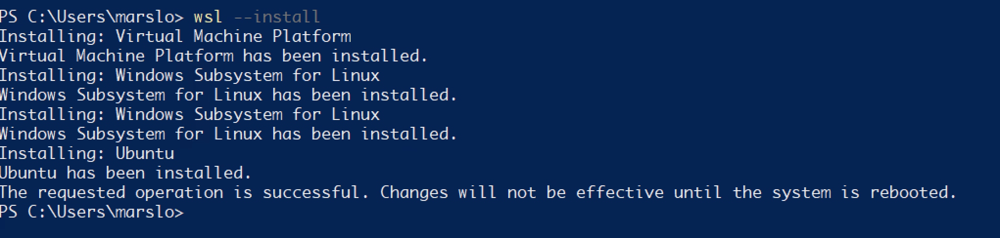
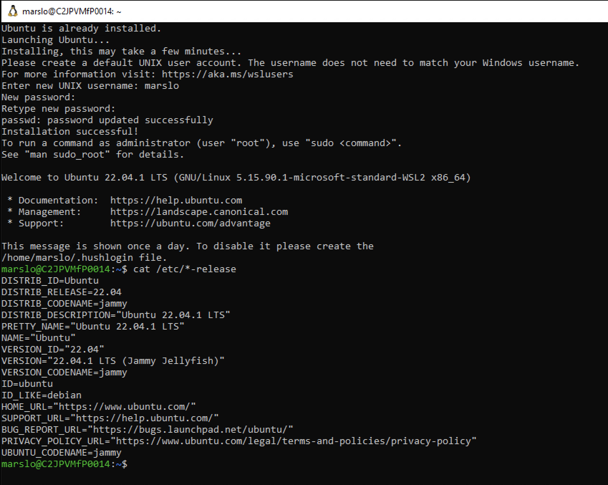
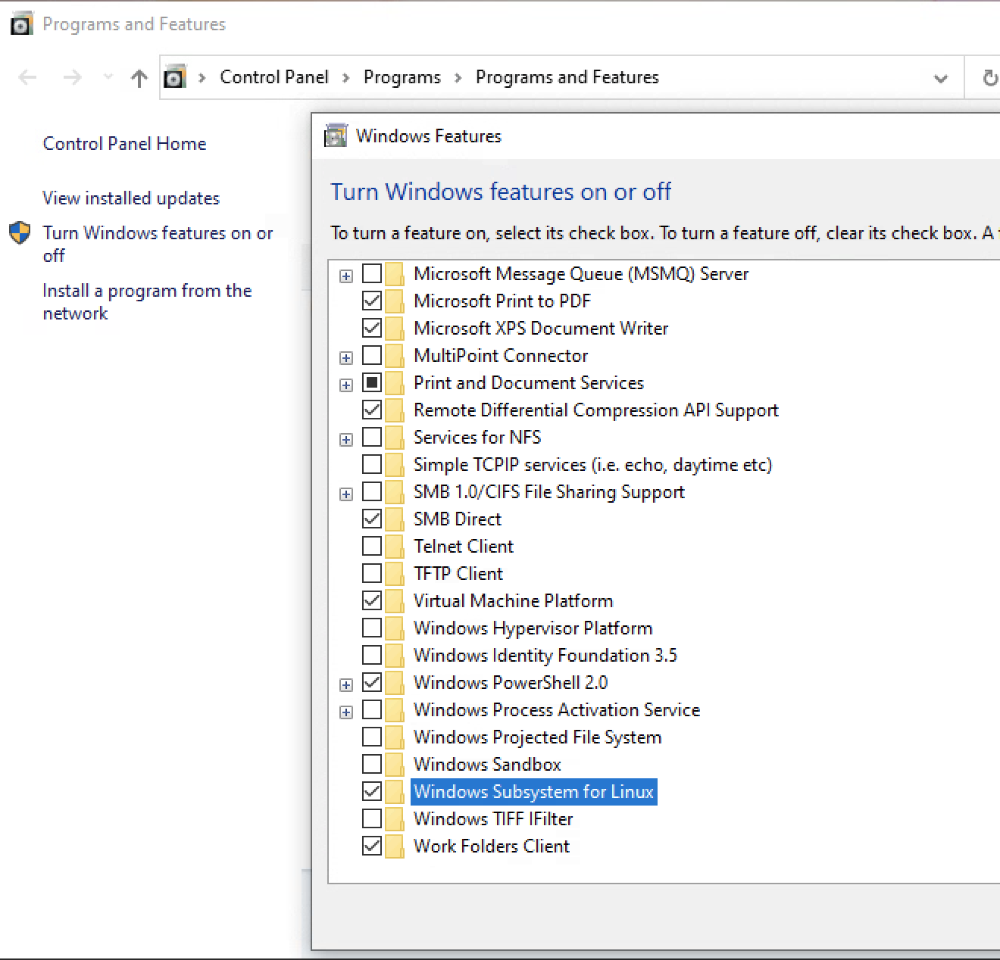
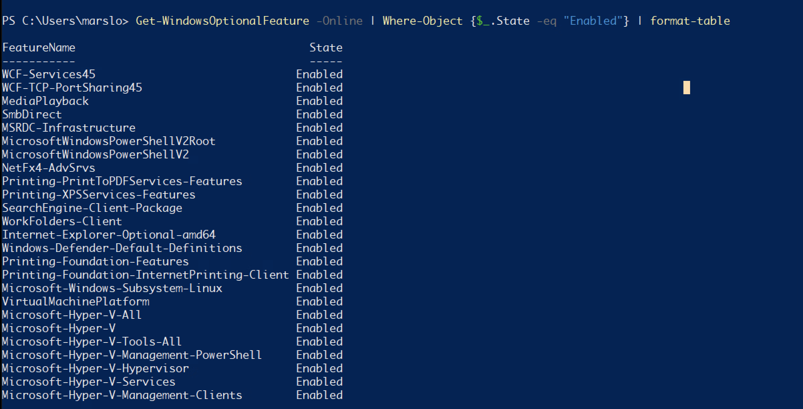
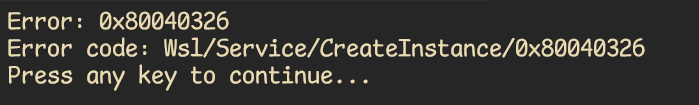
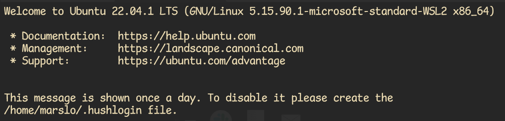

<!-- START doctoc generated TOC please keep comment here to allow auto update -->
<!-- DON'T EDIT THIS SECTION, INSTEAD RE-RUN doctoc TO UPDATE -->

- [install](#install)
  - [upgrade](#upgrade)
  - [start up WSL](#start-up-wsl)
- [check](#check)
- [reinstall](#reinstall)
  - [uninstall](#uninstall)
  - [reinstall](#reinstall-1)
- [cmds](#cmds)
  - [status](#status)
  - [users](#users)
  - [shutdown](#shutdown)
  - [disk](#disk)
- [debug](#debug)
  - [features](#features)
  - [services](#services)
- [others](#others)
- [q&a](#qa)
  - [`Error: 0x80040326`](#error-0x80040326)
  - [Error `4294967295`](#error-4294967295)
  - [run-detectors: unable to find an interpreter](#run-detectors-unable-to-find-an-interpreter)
- [tip](#tip)
  - [isWsl or isUbuntu](#iswsl-or-isubuntu)
  - [enable nvim clipboard](#enable-nvim-clipboard)
  - [enable vim clipboard](#enable-vim-clipboard)
  - [`wsl.conf`](#wslconf)
  - [Get list of all WSL distributions, their locations, and sizes](#get-list-of-all-wsl-distributions-their-locations-and-sizes)
  - [recover data](#recover-data)
  - [release disk space](#release-disk-space)

<!-- END doctoc generated TOC please keep comment here to allow auto update -->


> references:
>
> wsl:
> - [* How to install Linux on Windows with WSL](https://learn.microsoft.com/en-us/windows/wsl/install)
> - [* Manual installation steps for older versions of WSL](https://learn.microsoft.com/en-us/windows/wsl/install-manual)
> - [Windows Server Installation Guide](https://learn.microsoft.com/en-us/windows/wsl/install-on-server)
> - [Windows10/11 三步安装wsl2 Ubuntu20.04（任意盘）](https://zhuanlan.zhihu.com/p/466001838)
> - [WSL Linux 子系统，真香！完整实操](https://zhuanlan.zhihu.com/p/146545159)
> - [Install Hyper-V on Windows 10](https://learn.microsoft.com/en-us/virtualization/hyper-v-on-windows/quick-start/enable-hyper-v)
> - [在 Windows 10 上安装 Hyper-V](https://learn.microsoft.com/zh-cn/virtualization/hyper-v-on-windows/quick-start/enable-hyper-v)
> - [Set up a WSL development environment](https://learn.microsoft.com/en-us/windows/wsl/setup/environment?source=recommendations)
> - [Install Linux on Windows with WSL](https://learn.microsoft.com/en-us/windows/wsl/install)
> - [WSL Error code: Wsl/Service/0x80040326](https://www.techtutsonline.com/how-to-fix-wsl-error-code-0x80040326/#:~:text=Error%20code%3A%20Wsl%2FService%2F0x80040326%20How%20to%20fix%20this%20error,in%20the%20same%20order%3A%20wsl%20--update%20wsl%20--shutdown)
> - [Enable 256 colour support over SSH](https://github.com/cmderdev/cmder/issues/379)
> - [* Windows Subsystem for Linux (WSL) explained](https://solidstudio.io/blog/windows-subsystem-for-linux-explained)
> - [general profile settings in windows terminal](https://learn.microsoft.com/en-us/windows/terminal/customize-settings/profile-general)
>   - by default: `"startingDirectory": "%USERPROFILE%"`
>   - in wsl: `"startingDirectory": "\\\\wsl$\\DISTRO NAME\\home\\USERNAME"` or `"startingDirectory": "\\\\wsl.localhost\\DISTRO NAME\\home\\USERNAME"`
>     - i.e.: `\\wsl.localhsot\Ubuntu\home\marslo`
>
> windows terminal:
> - [Windows Terminal 下载，美化，完整配置](https://zhuanlan.zhihu.com/p/439437013)
> - [Startup settings in Windows Terminal](https://learn.microsoft.com/en-us/windows/terminal/customize-settings/startup)
> - [Window Terminal 安装以及使用(2021最新)](https://zhuanlan.zhihu.com/p/351281543)
> - [How to Change Default Terminal Application in Windows 10](https://www.tenforums.com/tutorials/180053-how-change-default-terminal-application-windows-10-a.html)


## install

- hyper-v
  ```powershell
  > Enable-WindowsOptionalFeature -Online -FeatureName Microsoft-Hyper-V -All
  ```

- wsl
  ```powershell
  > wsl --install
  Installing: Virtual Machine Platform
  Virtual Machine Platform has been installed.
  Installing: Windows Subsystem for Linux
  Windows Subsystem for Linux has been installed.
  Installing: Windows Subsystem for Linux
  Windows Subsystem for Linux has been installed.
  Installing: Ubuntu
  Ubuntu has been installed.
  The requested operation is successful. Changes will not be effective until the system is rebooted.
  ```

  

  - more
    ```powershell
    > wsl --list --online

    # or
    > wsl --install -d <DistroName>
    ```

- reset

  > [!NOTE|label:references:]
  > - [How can I reset the Windows Subsystem for Linux (WSL) back to defaults? [duplicate]](https://superuser.com/a/1446410/112396)
  > - [How Do I Reset A Manual Installation Of Windows Subsystem For Linux?](https://superuser.com/a/1440062/112396)

  ```powershell
  > wsl --unregister <DistributionName>

  # or
  > wslconfig /unregister <DistributionName>
  ```

- Microsoft-Windows-Subsystem-Linux
  ```powershell
  > dism.exe /online /enable-feature /featurename:Microsoft-Windows-Subsystem-Linux /all /norestart

  Deployment Image Servicing and Management tool
  Version: 10.0.19041.844

  Image Version: 10.0.19044.2604

  Enabling feature(s)
  [==========================100.0%==========================]
  The operation completed successfully.
  ```

  - or
    ```powershell
    > Enable-WindowsOptionalFeature -Online -FeatureName Microsoft-Windows-Subsystem-Linux
    ```

- VirtualMachinePlatform
  ```powershell
  > dism.exe /online /enable-feature /featurename:VirtualMachinePlatform /all /norestart

  Deployment Image Servicing and Management tool
  Version: 10.0.19041.844

  Image Version: 10.0.19044.2604

  Enabling feature(s)
  [==========================100.0%==========================]
  The operation completed successfully.
  ```

- set version to 2
  ```powershell
  > wsl --set-default-version 2
  This application requires the Windows Subsystem for Linux Optional Component.
  The system may need to be restarted so the changes can take effect.
  ```

### upgrade

> [!NOTE|label:references:]
> - [How to Update from WSL to WSL 2 in Windows 10](https://www.tenforums.com/tutorials/164301-how-update-wsl-wsl-2-windows-10-a.html)

```powershell
> Get-AppxPackage |? { $_.Name -like "*WindowsSubsystemforLinux*" }
Name              : MicrosoftCorporationII.WindowsSubsystemForLinux
Publisher         : CN=Microsoft Corporation, O=Microsoft Corporation, L=Redmond, S=Washington, C=US
Architecture      : X64
ResourceId        :
Version           : 2.0.9.0
PackageFullName   : MicrosoftCorporationII.WindowsSubsystemForLinux_2.0.9.0_x64__8wekyb3d8bbwe
InstallLocation   : C:\Program Files\WindowsApps\MicrosoftCorporationII.WindowsSubsystemForLinux_2.0.9.0_x64__8wekyb3d8bbwe
IsFramework       : False
PackageFamilyName : MicrosoftCorporationII.WindowsSubsystemForLinux_8wekyb3d8bbwe
PublisherId       : 8wekyb3d8bbwe
IsResourcePackage : False
IsBundle          : False
IsDevelopmentMode : False
NonRemovable      : False
IsPartiallyStaged : False
SignatureKind     : Store
Status            : Ok

> wsl --update
Checking for updates.
Updating Windows Subsystem for Linux to version: 2.0.14.

> Get-AppxPackage |? { $_.Name -like "*WindowsSubsystemforLinux*" }
Name              : MicrosoftCorporationII.WindowsSubsystemForLinux
Publisher         : CN=Microsoft Corporation, O=Microsoft Corporation, L=Redmond, S=Washington, C=US
Architecture      : X64
ResourceId        :
Version           : 2.0.14.0
PackageFullName   : MicrosoftCorporationII.WindowsSubsystemForLinux_2.0.14.0_x64__8wekyb3d8bbwe
InstallLocation   : C:\Program
                    Files\WindowsApps\MicrosoftCorporationII.WindowsSubsystemForLinux_2.0.14.0_x64__8wekyb3d8bbwe
IsFramework       : False
PackageFamilyName : MicrosoftCorporationII.WindowsSubsystemForLinux_8wekyb3d8bbwe
PublisherId       : 8wekyb3d8bbwe
IsResourcePackage : False
IsBundle          : False
IsDevelopmentMode : False
NonRemovable      : False
IsPartiallyStaged : False
SignatureKind     : Developer
Status            : Ok
```

- update to pre-release version
  ```powershell
  > wsl --update --pre-release
  Checking for updates.
  Updating Windows Subsystem for Linux to version: 2.1.3.

  > Get-AppxPackage |? { $_.Name -like "*WindowsSubsystemforLinux*" }
  Name              : MicrosoftCorporationII.WindowsSubsystemForLinux
  Publisher         : CN=Microsoft Corporation, O=Microsoft Corporation, L=Redmond, S=Washington, C=US
  Architecture      : X64
  ResourceId        :
  Version           : 2.0.14.0
  PackageFullName   : MicrosoftCorporationII.WindowsSubsystemForLinux_2.0.14.0_x64__8wekyb3d8bbwe
  InstallLocation   : C:\Program
                      Files\WindowsApps\MicrosoftCorporationII.WindowsSubsystemForLinux_2.0.14.0_x64__8wekyb3d8bbwe
  IsFramework       : False
  PackageFamilyName : MicrosoftCorporationII.WindowsSubsystemForLinux_8wekyb3d8bbwe
  PublisherId       : 8wekyb3d8bbwe
  IsResourcePackage : False
  IsBundle          : False
  IsDevelopmentMode : False
  NonRemovable      : False
  IsPartiallyStaged : False
  SignatureKind     : Developer
  Status            : Ok
  ```

### start up WSL
- download
  ```powershell
  > cd d:\Linux
  > Invoke-WebRequest -Uri https://wsldownload.azureedge.net/Ubuntu_2004.2020.424.0_x64.appx -OutFile Ubuntu20.04.appx -UseBasicParsing
  ```

- rename
  ```powershell
  > Rename-Item .\Ubuntu20.04.appx Ubuntu.zip
  > Expand-Archive .\Ubuntu.zip -Verbose
  > cd .\Ubuntu\
  > .\ubuntu2004.exe
  ```

#### init

```powershell
> Restart-Computer
```



## check
- windows feature
  - appwiz.cpl

    

  - windows features
    ```powershell
    > Get-WindowsOptionalFeature -Online | Where-Object {$_.State -eq "Enabled"} | format-table

    FeatureName                                   State
    -----------                                   -----
    WCF-Services45                              Enabled
    WCF-TCP-PortSharing45                       Enabled
    MediaPlayback                               Enabled
    SmbDirect                                   Enabled
    MSRDC-Infrastructure                        Enabled
    MicrosoftWindowsPowerShellV2Root            Enabled
    MicrosoftWindowsPowerShellV2                Enabled
    NetFx4-AdvSrvs                              Enabled
    Printing-PrintToPDFServices-Features        Enabled
    Printing-XPSServices-Features               Enabled
    SearchEngine-Client-Package                 Enabled
    WorkFolders-Client                          Enabled
    Internet-Explorer-Optional-amd64            Enabled
    Windows-Defender-Default-Definitions        Enabled
    Printing-Foundation-Features                Enabled
    Printing-Foundation-InternetPrinting-Client Enabled
    Microsoft-Windows-Subsystem-Linux           Enabled
    VirtualMachinePlatform                      Enabled
    Microsoft-Hyper-V-All                       Enabled
    Microsoft-Hyper-V                           Enabled
    Microsoft-Hyper-V-Tools-All                 Enabled
    Microsoft-Hyper-V-Management-PowerShell     Enabled
    Microsoft-Hyper-V-Hypervisor                Enabled
    Microsoft-Hyper-V-Services                  Enabled
    Microsoft-Hyper-V-Management-Clients        Enabled
    ```

    

## reinstall
### uninstall

> [!NOTE|label:references:]
> - [4wk-/README.md](https://gist.github.com/4wk-/889b26043f519259ab60386ca13ba91b)
> - [How to Uninstall WSL on Windows 11 & Windows 10? See a Guide!](https://www.minitool.com/news/uninstall-wsl.html)
> - [Can't install WSL - error: 0x80070424](https://www.elevenforum.com/t/cant-install-wsl-error-0x80070424.20307/#post-379885)

- destroy distros
  ```powershell
  > wsl --unregister all

  # or
  > wsl --unregister Ubuntu-22.04
  > wsl --unregister Ubuntu
  ...

  # if wsl hung, execute following cmd first
  > taskkill /f /im wslservice.exe
  ```

- uninstall in `Settings` > `Apps` > `Installed apps`
  - Ubuntu
  - Ubuntu-22.04.3 LTS

- disable in `Start Menu` > `Turn Windows Features on or off`
  - Virtual Machine Platform
  - Windows Subsystem for Linux
  - or via
    ```powershell
    > Disable-WindowsOptionalFeature -Online -FeatureName VirtualMachinePlatform
    > Disable-WindowsOptionalFeature -Online -FeatureName Microsoft-Windows-Subsystem-Linux
    # or
    > DISM /online /disable-feature /featurename:VirtualMachinePlatform /norestart
    > DISM /online /disable-feature /featurename:Microsoft-Windows-Subsystem-Linux /norestart

    # check status
    > Get-Service vmcompute
    Status   Name               DisplayName
    ------   ----               -----------
    Running  vmcompute          Hyper-V Host Compute Service
    ```

- reboot
  ```powershell
  > Restart-Computer
  ```

- others:
  ```powershell
  > Dism /online /cleanup-image /restorehealth
  > sfc /scannow
  ```

### reinstall
```powershell
> Enable-WindowsOptionalFeature -Online -FeatureName VirtualMachinePlatform
> Enable-WindowsOptionalFeature -Online -FeatureName Microsoft-Windows-Subsystem-Linux
> Restart-Computer
> wsl --install --distribution Ubuntu
```

## cmds

> [!NOTE|label:references:]
> - [Basic commands for WSL](https://learn.microsoft.com/en-us/windows/wsl/basic-commands)
> - commands:
>   - `wsl --update`
>   - `wsl --version`
>   - `wsl --list --running`
>   - `wsl --shutdown`
>   - `wsl hostname -i`
>   - `wsl -d ubuntu`
>     - `wsl -d Debian -u root`

### status
- check status
  ```powershell
  > wsl --status
  > wsl --list --verbose

  > wsl --list --verbose
    NAME            STATE           VERSION
  * Ubuntu-22.04    Stopped         1
    Ubuntu          Running         2
  ```

- set wsl version
  - set default version
    ```powershell
    > wsl --set-default-version <Version>

    # i.e.:
    > wsl --set-default-version 2
    ```

  - set distros
    ```powershell
    > wsl --set-version <distribution name> <versionNumber>

    # i.e.:
    > wsl --set-version Ubuntu 2
    ```

### users
- run as root
  ```powershell
  > wsl --distribution <Distribution Name> --user <User Name>

  # i.e.:
  > wsl --distribution Ubuntu-22.04 --user root
  ```

- config default user
  ```powershell
  > <DistributionName> config --default-user <Username>

  # i.e.:
  > Ubuntu-22.04 config --default-user root
  ```

### shutdown
- shutdown and terminate
  ```powershell
  > wsl --shutdown
  > wsl --terminate <Distribution Name>
  ```

- unregister
  ```powershell
  > wsl --unregister <DistributionName>
  ```

### disk
- export and import
  ```powershell
  # export
  > wsl --export <Distribution Name> <FileName>
  # for wsl2 to .vhdx
  > wsl --export <Distribution Name> --vhd <FileName>

  # import
  > wsl --import <Distribution Name> <InstallLocation> <FileName> [ --version 1/2 ]
  # for wsl2
  > wsl --import <Distribution Name> <InstallLocation> --vhd <FileName> [ --version 1/2 ]

  # import a distribution
  > wsl --import-in-place <Distribution Name> <FileName>
  ```

- mount
  ```powershell
  > wsl --mount <DiskPath>

  # for wsl2
  > wsl --mount <DiskPath> --vhd
  > wsl --unmount <DiskPath>
  ```

## debug

> [!NOTE|label:references:]
> - [collect-wsl-logs.ps1](https://github.com/Microsoft/WSL/blob/master/diagnostics/collect-wsl-logs.ps1)
> - [#10999 WSL 2 freezes](https://github.com/microsoft/WSL/issues/10999)
> - [How to Add or Remove Optional Features in Windows 11?](https://www.partitionwizard.com/partitionmanager/add-or-remove-optional-features-win-11.html)
> - [How to Enable or Disable Windows Subsystem for Linux WSL in Windows 10](https://www.tenforums.com/tutorials/46769-enable-disable-windows-subsystem-linux-wsl-windows-10-a.html)

- dump log
  ```powershell
  > Invoke-WebRequest -UseBasicParsing "https://raw.githubusercontent.com/microsoft/WSL/master/diagnostics/collect-wsl-logs.ps1" -OutFile collect-wsl-logs.ps1
  > Set-ExecutionPolicy Bypass -Scope Process -Force
  > .\collect-wsl-logs.ps1 -Dump
  ```

- host info
  - powershell
    ```powershell
    > echo $PSVersionTable
    Name                           Value
    ----                           -----
    PSVersion                      7.4.1
    PSEdition                      Core
    GitCommitId                    7.4.1
    OS                             Microsoft Windows 10.0.22621
    Platform                       Win32NT
    PSCompatibleVersions           {1.0, 2.0, 3.0, 4.0…}
    PSRemotingProtocolVersion      2.3
    SerializationVersion           1.1.0.1
    WSManStackVersion              3.0
    ```

  - host network
    ```powershell
    > Get-Service -Name 'Host Network Service'
    Status   Name               DisplayName
    ------   ----               -----------
    Running  hns                Host Network Service
    ```

- packages
  ```powershell
  > winget --info
  ```

### features

> [!NOTE|label:list windows features:]
> ```powershell
> > Get-WindowsOptionalFeature -Online | Where-Object {$_.State -eq "Enabled"} | format-table
> ```

- VirtualMachinePlatform
  ```powershell
  # enable
  > Enable-WindowsOptionalFeature -Online -FeatureName VirtualMachinePlatform
  # or
  > DISM /online /enable-feature /featurename:VirtualMachinePlatform /norestart

  # disable
  > Disable-WindowsOptionalFeature -Online -FeatureName VirtualMachinePlatform
  # or
  > DISM /online /disable-feature /featurename:VirtualMachinePlatform /norestart
  ```

- Microsoft-Windows-Subsystem-Linux
  ```powershell
  # enable
  > Enable-WindowsOptionalFeature -Online -FeatureName Microsoft-Windows-Subsystem-Linux
  # or
  > DISM /online /enable-feature /featurename:Microsoft-Windows-Subsystem-Linux /norestart

  # disable
  > Disable-WindowsOptionalFeature -Online -FeatureName Microsoft-Windows-Subsystem-Linux
  # or
  > DISM /online /disable-feature /featurename:Microsoft-Windows-Subsystem-Linux /norestart
  ```

- hyper-v

  > [!NOTE|label:references:]
  > - [Disable Hyper-V in PowerShell](https://learn.microsoft.com/en-us/troubleshoot/windows-client/application-management/virtualization-apps-not-work-with-hyper-v)

  ```powershell
  # enable
  > Enable-WindowsOptionalFeature -Online -FeatureName Microsoft-Hyper-V -All
  # or
  > DISM /Online /Enable-Feature /All /FeatureName:Microsoft-Hyper-V-All
  > DISM /Online /Enable-Feature /All /FeatureName:Microsoft-Hyper-V

  # disable
  > Disable-WindowsOptionalFeature -Online -FeatureName Microsoft-Hyper-V -All
  # or
  > DISM /Online /Enable-Feature /All /FeatureName:Microsoft-Hyper-V
  > DISM /Online /Enable-Feature /All /FeatureName:Microsoft-Hyper-V-All
  # win10
  > Disable-WindowsOptionalFeature -Online -FeatureName Microsoft-Hyper-V-Hypervisor
  ```

### services
- Host Network Service
  ```powershell
  > Get-Service -Name 'Host Network Service' | Restart-Service
  ```

- wslservices
  ```powershell
  # restart wslservice
  > net stop wslservice
  > net start wslservice

  # if wsl hung, execute following cmd first
  > taskkill /f /im wslservice.exe
  ```

- winsock

  > [!NOTE|label:references:]
  > - [Why “Resetting” Winsock is Necessary](https://adamtheautomator.com/netsh-winsock-reset/)

  ```powershell
  > netsh winsock reset

  # reset tcp/ip settings
  > netsh int ip reset
  ```

## others
- mount
  ```bash
  # /mnt/c
  $ cat /etc/wsl.conf
  [automount]
  root=/

  # mount usb ( i.e.: F: )
  $ sudo mkdir /mnt/f
  $ sudo mount -t drvfs H: /mnt/f

  # mount dvd ( i.e.: G )
  $ sudo mkdir /mnt/g
  $ sudo mount -t drvfs G: /mnt/g
  ```

- wsl files stored

  > [!NOTE|label:references:]
  > - [Accessing Linux files from Windows using \\wsl$](https://learn.microsoft.com/en-us/windows/wsl/file-permissions#accessing-linux-files-from-windows-using-wsl)

  ```batch
  > cd %USERPROFILE%\AppData\Local\Packages\[distro name]

  REM i.e.:
  > %LOCALAPPDATA%\Packages\CanonicalGroupLimited.Ubuntu18.04onWindows_79rhkp1fndgsc\LocalState\rootfs\home\pawelb.
  ```

## q&a
### `Error: 0x80040326`
- issue
  ```bash
  Error: 0x80040326
  Error code: Wsl/Service/CreateInstance/0x80040326
  ```

  

- solution
  ```powershell
  # start powershell with administrator

  > wsl --update
  Checking for updates.
  Updating Windows Subsystem for Linux...
  > wsl --shutdown
  > wsl -d ubuntu
  To run a command as administrator (user "root"), use "sudo <command>".
  See "man sudo_root" for details.
  ```

  

### Error `4294967295`

> [!NOTE|label:references:]
> - [Process Exited with Code 4294967295 in Windows? Fix It Now](https://www.partitionwizard.com/partitionmagic/4294967295.html)
> - [#5092 WSL2 distro failing to startup with code 4294967295](https://github.com/microsoft/WSL/issues/5092#issuecomment-645567980)

```powershell
> netsh winsock reset

# disable
> DISM /online /disable-feature /featurename:VirtualMachinePlatform /norestart
> DISM /online /disable-feature /featurename:Microsoft-Windows-Subsystem-Linux /norestart

# restart
> Restart-Computer

# enable
> DISM /online /enable-feature /featurename:VirtualMachinePlatform /norestart
> DISM /online /enable-feature /featurename:Microsoft-Windows-Subsystem-Linux /norestart
```

- check vmcompute
  ```powershell
  > Get-Service vmcompute
  ```

### run-detectors: unable to find an interpreter

> [!INFO|label:references:]
> - [Interop Issue: unable to find interpreter for launching Windows .exe files using Interop](https://github.com/microsoft/WSL/issues/5466#issuecomment-695155716)
> - [gabrielelana/vim-markdown](https://github.com/microsoft/WSL/issues/8531)

```bash
# execute in wsl2
sudo update-binfmts --disable cli
```

- more
  ```bash
  $ mount | grep binfmt_misc
  binfmt_misc on /proc/sys/fs/binfmt_misc type binfmt_misc (rw,relatime)
  ```

## tip
```powershell
> set "PATH=%ConEmuBaseDirShort%\wsl;%PATH%" & %ConEmuBaseDirShort%\conemu-cyg-64.exe --wsl -cur_console:pm:/mnt
```

- enable windows programe in wsl
  ```bash
  $ cat /etc/wsl.conf
  [interop]
  enabled=false
  ```

- append windows path
  - via regedit
    ```batch
    > REG ADD "HKEY_CURRENT_USER\SOFTWARE\Microsoft\Windows\CurrentVersion\Lxss" /v AppendNtPath /t REG_DWORD /d 0x00000000
    ```

  - via `wsl.conf`
    ```bash
    $ cat /etc/wsl.conf
    [interop]
    appendWindowsPath=false
    ```

### isWsl or isUbuntu

> [!TIP]
> - [In a bash script, how can I tell if the script is running under Ubuntu pure or in Linux subsystem for Windows?](https://superuser.com/a/1464436/112396)
> - [How can I check if the environment is WSL from a shell script?](https://superuser.com/a/1749811/112396)
> - [How to check if running in Cygwin, Mac or Linux?](https://stackoverflow.com/a/3466183/2940319)
> - [uname](https://en.wikipedia.org/wiki/Uname)

- `uname -r`
  ```bash
  $ uname -r | grep -q "Microsoft"
  ```

- `/proc/sys/kernel/osrelease` or `/proc/version`
  ```bash
  $ cat /proc/version
  Linux version 5.15.133.1-microsoft-standard-WSL2 (root@1c602f52c2e4) (gcc (GCC) 11.2.0, GNU ld (GNU Binutils) 2.37) #1 SMP Thu Oct 5 21:02:42 UTC 2023

  $ cat /proc/sys/kernel/osrelease
  5.15.133.1-microsoft-standard-WSL2
  ```

### enable nvim clipboard
```bash
$ sudo apt install xclip
$ nvim
:checkhealth
```

### enable vim clipboard

> [!NOTE|label:references:]
> - [Windows Subsystem Linux - Make VIM use the clipboard?](https://superuser.com/a/1784084/112396)
> - [How to copy/paste from Vim in WSL](https://stackoverflow.com/a/68317739/2940319)
> - [#10223 : Neovim pasting content with ^M at the end of lines](https://github.com/neovim/neovim/issues/10223)
> - [Pasting from clipboard in vim](https://stackoverflow.com/q/33567746/2940319)

```bash
$ sudo apt-get install vim-gtk
$ vim --version | grep clipboard
+clipboard         +keymap            +printer           +vertsplit
+eval              -mouse_jsbterm     -sun_workshop      +xterm_clipboard

# or
$ sudo add-apt-repository ppa:jonathonf/vim
$ sudo apt update
$ sudo apt install vim
```

- vimrc
  ```bash
  set clipboard=unnamed
  set clipboard=unnamedplus

  " or
  set clipboard^=unnamed
  set clipboard^=unnamedplus
  ```

### `wsl.conf`

> [!NOTE|label:references:]
> - [* Advanced settings configuration in WSL](https://learn.microsoft.com/en-us/windows/wsl/wsl-config#wsl-2-settings)
>   - [`/etc/wsl.conf`](https://learn.microsoft.com/en-us/windows/wsl/wsl-config#wslconf)
>   - [`%USERPROFILE%\.wslconfig`](https://learn.microsoft.com/en-us/windows/wsl/wsl-config#wslconfig)
> - [hsab/WSL-config](https://github.com/hsab/WSL-config)

- [`/etc/wsl.conf`](https://learn.microsoft.com/en-us/windows/wsl/wsl-config#example-wslconf-file)
  ```
  [boot]
  systemd=true

  [network]
  generateResolvConf = false

  [automount]
  enable = true
  mountFsTab = true
  options = "metadata,umask=22,fmask=11"

  [interop]
  enable = false
  appendWindowsPath = false
  ```

- [`%USERPROFILE%\.wslconfig`](https://learn.microsoft.com/en-us/windows/wsl/wsl-config#example-wslconfig-file)
  ```
  # Settings apply across all Linux distros running on WSL 2
  [wsl2]

  # Limits VM memory to use no more than 4 GB, this can be set as whole numbers using GB or MB
  memory=4GB

  # Sets the VM to use two virtual processors
  processors=4

  # Specify a custom Linux kernel to use with your installed distros. The default kernel used can be found at https://github.com/microsoft/WSL2-Linux-Kernel
  # kernel=C:\\temp\\myCustomKernel

  # Sets additional kernel parameters, in this case enabling older Linux base images such as Centos 6
  $ kernelCommandLine = vsyscall=emulate

  # Sets amount of swap storage space to 8GB, default is 25% of available RAM
  swap=4GB

  # Sets swapfile path location, default is %USERPROFILE%\AppData\Local\Temp\swap.vhdx
  swapfile=C:\\temp\\wsl-swap.vhdx

  # Disable page reporting so WSL retains all allocated memory claimed from Windows and releases none back when free
  pageReporting=false

  # Turn off default connection to bind WSL 2 localhost to Windows localhost
  localhostforwarding=true

  # Disables nested virtualization
  nestedVirtualization=false

  # Turns off output console showing contents of dmesg when opening a WSL 2 distro for debugging
  debugConsole=false

  # Enable experimental features
  [experimental]
  sparseVhd=true
  ```

- restart wsl
  ```powershell
  > wsl --list --running
  Windows Subsystem for Linux Distributions:
  Ubuntu (Default)
  Ubuntu-22.04

  > wsl --shutdown
  ```

- setup default bash

  > [!NOTE|label:references:]
  > - [How to change default shell for Linux susbsystem for Windows](https://superuser.com/a/1264333/112396)

  ```bash
  $ echo $SHELL
  /bin/bash
  # for current account
  $ chsh -s /usr/bin/bash
  # for root
  $ sudo chsh -s /usr/bin/bash
  $ exit

  # re-login
  $ echo $SHELL
  /usr/bin/bash
  # verify in /etc/passwd
  ```

### [Get list of all WSL distributions, their locations, and sizes](https://www.reddit.com/r/bashonubuntuonwindows/comments/t5d6l0/get_list_of_all_wsl_distributions_their_locations/?rdt=33973)

> [!NOTE|label:references:]
> - [How to get a WSL distribution size from the Windows command line?](https://superuser.com/a/1707747/112396)

```powershell
Get-ChildItem "HKCU:\Software\Microsoft\Windows\CurrentVersion\Lxss" -Recurse |
ForEach-Object {
    $distro_name = ($_ | Get-ItemProperty -Name DistributionName).DistributionName
    $distro_dir =  ($_ | Get-ItemProperty -Name BasePath).BasePath

    $distro_dir = Switch ($PSVersionTable.PSEdition) {
      "Core" {
        $distro_dir -replace '^\\\\\?\\',''
      }
      "Desktop" {
        if ($distro_dir.StartsWith('\\?\')) {
            $distro_dir
        } else {
            '\\?\' + $distro_dir
        }
      }
    }
    Write-Output "------------------------------"
    Write-Output "Distribution: $distro_name"
    Write-Output "Directory: $($distro_dir -replace '\\\\\?\\','')"
    $distro_size = "{0:N0} MB" -f ((Get-ChildItem -Recurse -LiteralPath "$distro_dir" | Measure-Object -Property Length -sum).sum / 1Mb)
    Write-Output "Size: $distro_size"
}
```

### recover data

> [!NOTE|label:references:]
> - [wsl2 frozen (unable to run any distro). Can I recover data? Windows 11](https://superuser.com/a/1777950/112396)

```powershell
Get-ChildItem HKCU:\Software\Microsoft\Windows\CurrentVersion\Lxss\ |
    ForEach-Object {
        (Get-ItemProperty $_.PSPATH) | Select-Object DistributionName,BasePath
    } | Format-List
```

- mount
  ```bash
  $ mount -o ro /dev/sdx /mnt/wsl-rescue
  ```

### release disk space

> [!NOTE|label:references:]
> - [#4699 WSL 2 should automatically release disk space back to the host OS](https://github.com/microsoft/WSL/issues/4699)
> - [Finding or Recovering your WSL Data](https://christopherkibble.com/posts/wsl-vhdx-recovery/)
> - [WSL2 How-to: Prepare and Attach Virtual Drives (VHD)](https://anthony-f-tannous.medium.com/wsl2-how-to-prepare-and-attach-virtual-drives-vhd-ac17b1fc7a61)

```powershell
> wsl --shutdown
> optimize-vhd -Path .\ext4.vhdx -Mode full
```

- [another](https://github.com/microsoft/WSL/issues/4699#issuecomment-627133168)
  ```powershell
  > wsl --shutdown
  # open window Diskpart
  > diskpart
  > select vdisk file="C:\WSL-Distros\…\ext4.vhdx"
  > attach vdisk readonly
  > compact vdisk
  > detach vdisk
  > exit
  ```

- [or via `.wslconf`](https://github.com/microsoft/WSL/issues/4699#issuecomment-1763550488)
  ```
  [wsl2]
  memory=6GB
  swap=6GB

  [experimental]
  autoMemoryReclaim=dropcache
  sparseVhd=true
  ```

- [or](https://github.com/microsoft/WSL/issues/4699#issuecomment-1845703674)
  ```powershell
  > wsl --manage Ubuntu --set-sparse false
  ```
