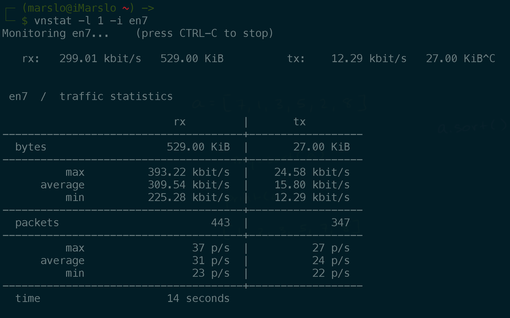
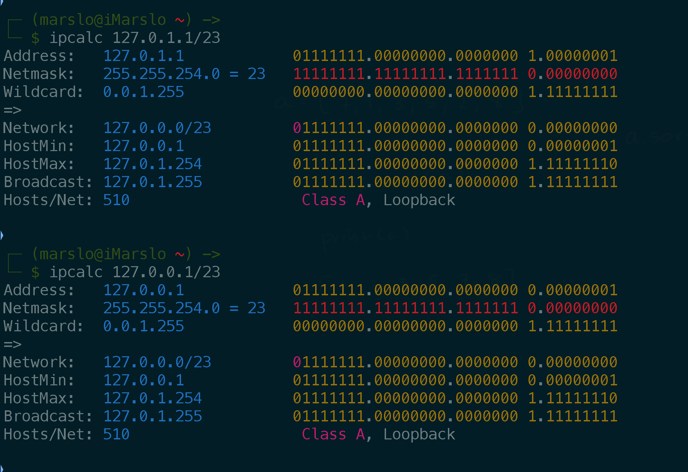
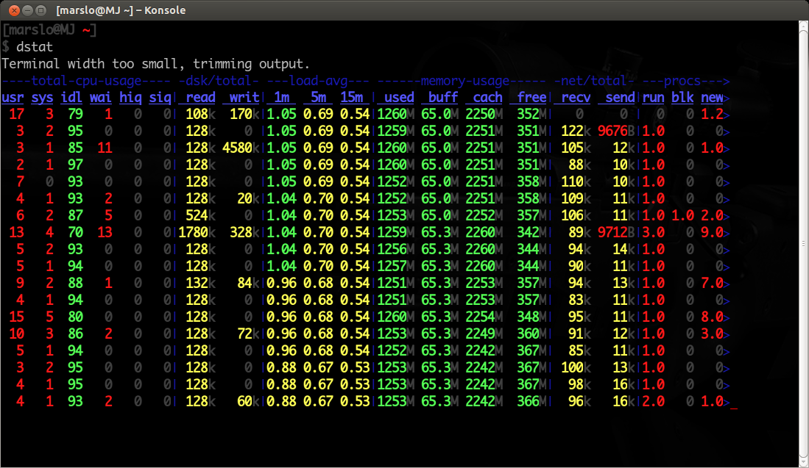
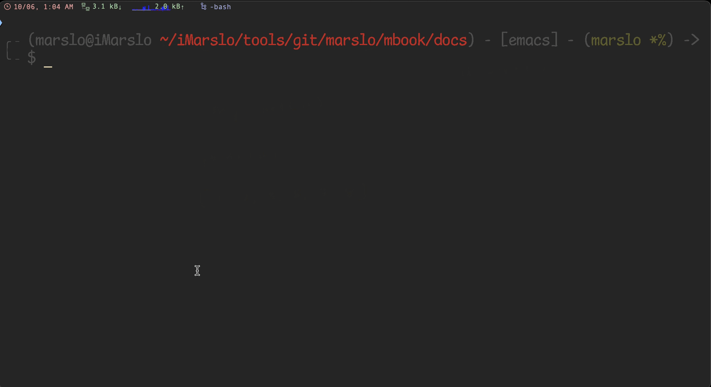
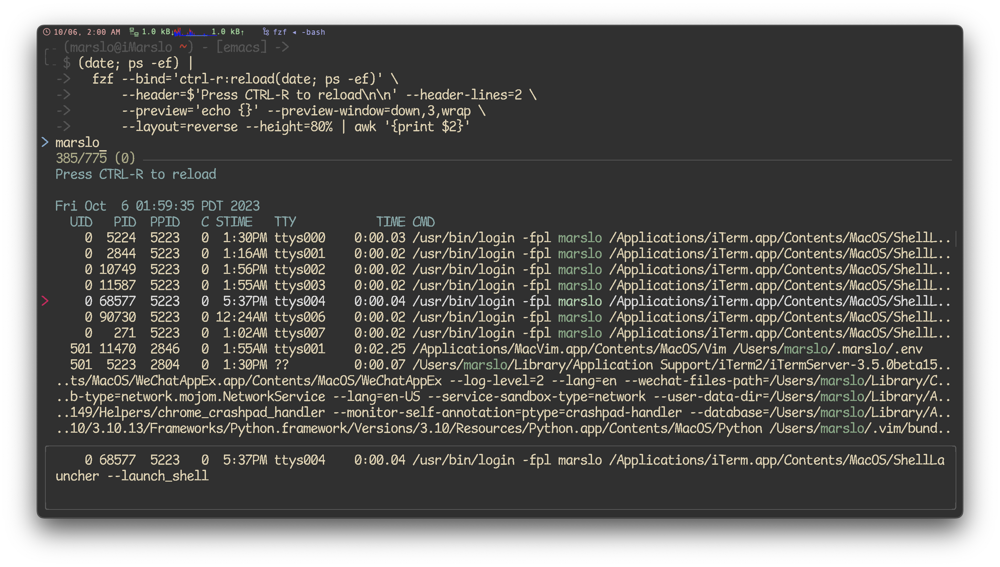

<!-- START doctoc generated TOC please keep comment here to allow auto update -->
<!-- DON'T EDIT THIS SECTION, INSTEAD RE-RUN doctoc TO UPDATE -->
**Table of Contents**  *generated with [DocToc](https://github.com/thlorenz/doctoc)*

- [network tools](#network-tools)
  - [`vnstat`](#vnstat)
  - [`ipcalc`](#ipcalc)
  - [`iostat`](#iostat)
  - [`tcpdump`](#tcpdump)
  - [`dstat`](#dstat)
  - [strace](#strace)
  - [sar](#sar)
  - [netcat](#netcat)
- [utility](#utility)
  - [`elinks`](#elinks)
  - [ncdu : NCurses Disk Usage](#ncdu--ncurses-disk-usage)
  - [duf](#duf)
  - [enhancd](#enhancd)
  - [fzf](#fzf)
  - [fd](#fd)
  - [fzy](#fzy)

<!-- END doctoc generated TOC please keep comment here to allow auto update -->


> references:
> - [20 Command Line Tools to Monitor Linux Performance](http://www.tecmint.com/command-line-tools-to-monitor-linux-performance/)
> - [20 Linux System Monitoring Tools Every SysAdmin Should Know](http://www.cyberciti.biz/tips/top-linux-monitoring-tools.html)
> - [Top 25 Best Linux Performance Monitoring and Debugging Tools](http://thegeekstuff.com/2011/12/linux-performance-monitoring-tools/)
> - [http://www.thegeekstuff.com/2010/12/50-unix-linux-sysadmin-tutorials](http://www.thegeekstuff.com/2010/12/50-unix-linux-sysadmin-tutorials/)
> - [16 commands to check hardware information on Linux](http://www.binarytides.com/linux-commands-hardware-info/)
> - [Best UNIX shell-based tools](https://gist.github.com/mbbx6spp/1429161)
> - [* alebcay/awesome-shell](https://github.com/alebcay/awesome-shell/tree/master)
>   - [* zh-cn](https://github.com/alebcay/awesome-shell/blob/master/README_ZH-CN.md)
>   - [nosarthur/awesome-shell](https://github.com/nosarthur/awesome-shell)
> - [jlevy/the-art-of-command-line](https://github.com/jlevy/the-art-of-command-line)
> - [Learn Enough Command Line to Be Dangerous](https://www.learnenough.com/command-line-tutorial/basics)
> - [Shell Style Guide](https://google.github.io/styleguide/shellguide.html)
> - [Use Bash Strict Mode (Unless You Love Debugging)](http://redsymbol.net/articles/unofficial-bash-strict-mode/)
> - others
>   - [bayandin/awesome-awesomeness](https://github.com/bayandin/awesome-awesomeness)
>   - [emijrp/awesome-awesome](https://github.com/emijrp/awesome-awesome)
>   - [kahun/awesome-sysadmin](https://github.com/kahun/awesome-sysadmin)
> - [My Minimalist Over-powered Linux Setup Guide](https://medium.com/@jonyeezs/my-minimal-over-powered-linux-setup-guide-710931efb75b)



## network tools

### `vnstat`



```bash
$ vnstat -l 1 -i en7
Monitoring en7...    (press CTRL-C to stop)

   rx:     4.10 kbit/s   21.00 KiB          tx:         0 bit/s   6.00 KiB^C

 en7  /  traffic statistics
                           rx         |       tx
--------------------------------------+------------------
  bytes                    21.00 KiB  |        6.00 KiB
--------------------------------------+------------------
          max           53.25 kbit/s  |    12.29 kbit/s
      average           17.20 kbit/s  |     4.92 kbit/s
          min                0 bit/s  |         0 bit/s
--------------------------------------+------------------
  packets                         60  |              52
--------------------------------------+------------------
          max                 15 p/s  |          16 p/s
      average                  6 p/s  |           5 p/s
          min                  2 p/s  |           0 p/s
--------------------------------------+------------------
  time                    10 seconds
```

### `ipcalc`



```bash
$ ipcalc 10.25.130.2/23
Address:   10.25.130.2          00001010.00011001.1000001 0.00000010
Netmask:   255.255.254.0 = 23   11111111.11111111.1111111 0.00000000
Wildcard:  0.0.1.255            00000000.00000000.0000000 1.11111111
=>
Network:   10.25.130.0/23       00001010.00011001.1000001 0.00000000
HostMin:   10.25.130.1          00001010.00011001.1000001 0.00000001
HostMax:   10.25.131.254        00001010.00011001.1000001 1.11111110
Broadcast: 10.25.131.255        00001010.00011001.1000001 1.11111111
Hosts/Net: 510                   Class A, Private Internet

$ ipcalc 10.25.131.1/23
Address:   10.25.131.1          00001010.00011001.1000001 1.00000001
Netmask:   255.255.254.0 = 23   11111111.11111111.1111111 0.00000000
Wildcard:  0.0.1.255            00000000.00000000.0000000 1.11111111
=>
Network:   10.25.130.0/23       00001010.00011001.1000001 0.00000000
HostMin:   10.25.130.1          00001010.00011001.1000001 0.00000001
HostMax:   10.25.131.254        00001010.00011001.1000001 1.11111110
Broadcast: 10.25.131.255        00001010.00011001.1000001 1.11111111
Hosts/Net: 510                   Class A, Private Internet
```

### `iostat`
```bash
$ iostat
              disk0       cpu    load average
    KB/t  tps  MB/s  us sy id   1m   5m   15m
   19.85   37  0.72   3  1 96  1.78 1.90 1.69
```

### `tcpdump`
```bash
$ sudo tcpdump -A -i en7
tcpdump: verbose output suppressed, use -v or -vv for full protocol decode
listening on en7, link-type EN10MB (Ethernet), capture size 262144 bytes
00:33:02.787671 IP 10.25.130.117.53629 > a23-43-240-92.deploy.static.akamaitechnologies.com.https: Flags [.], ack 697481089, win 2048, length 0
E..(....@...
..u.+.\.}..r...)...P...:...
00:33:02.790119 IP 10.25.130.117.51541 > sh-vdc01.mycompany.com.domain: 53089+ PTR? 92.240.43.23.in-addr.arpa. (43)
E..GP....._.
..u
&t..U.5.3...a...........92.240.43.23.in-addr.arpa.....
00:33:02.812866 ARP, Request who-has gw-voice-idf.cdu-cn.mycompany.com tell gw-vg224-idf.cdu-cn.mycompany.com, length 46
....
....
13 packets captured
25 packets received by filter
0 packets dropped by kernel
```

- [or](https://superuser.com/a/1567926/112396)
  ```bash
  $ sudo tcpdump -n -i any src or dst target.ip.address [ -v ]

  # i.e.
  $ sudo tcpdump -n -i any src or dst git.sample.com -v
  tcpdump: data link type PKTAP
  tcpdump: listening on any, link-type PKTAP (Apple DLT_PKTAP), snapshot length 524288 bytes
  00:02:55.698822 IP (tos 0x0, ttl 64, id 0, offset 0, flags [DF], proto TCP (6), length 52)
      10.25.130.104.63447 > 10.69.78.140.29418: Flags [F.], cksum 0x8fe0 (correct), seq 2566890566, ack 4019765769, win 2058, options [nop,nop,TS val 1955309758 ecr 154499413], length 0
  ```

### `dstat`



### strace

> [!NOTE|label:references:]
> - [I have a tab completion that hangs, is it possible to use strace to find out what is going on?](https://unix.stackexchange.com/a/525582/29178)

```bash
$ ... run cmd ...

# or
$ pid=$(echo ??)
$ sudo strace -fp ${pid} -o log

# or
$ sudo -v
$ sudo strace -fp $$ -o log &
```

- more
  ```bash
  $ set -o functrace xtrace
  $ PS4=' ${BASH_SOURCE}:$FUNCNAME:$LINENO: '
  ```

- [debug script](https://askubuntu.com/a/678919/92979)
  ```bash
  $ strace -e clone,execve,pipe,dup2 \
           -f bash -c 'cat <(/bin/true) <(/bin/false) <(/bin/echo)'
  execve("/usr/bin/bash", ["bash", "-c", "cat <(/bin/true) <(/bin/false) <"...], 0x7fff9b9c6f98 /* 75 vars */) = 0
  pipe([3, 4])                            = 0
  dup2(3, 63)                             = 63
  clone(child_stack=NULL, flags=CLONE_CHILD_CLEARTID|CLONE_CHILD_SETTID|SIGCHLD, child_tidptr=0x7f7cf6a8ca10) = 289963
  strace: Process 289963 attached
  [pid 289962] pipe([3, 4])               = 0
  [pid 289962] dup2(3, 62)                = 62
  [pid 289962] clone(child_stack=NULL, flags=CLONE_CHILD_CLEARTID|CLONE_CHILD_SETTID|SIGCHLD <unfinished ...>
  [pid 289963] dup2(4, 1)                 = 1
  [pid 289962] <... clone resumed>, child_tidptr=0x7f7cf6a8ca10) = 289964
  strace: Process 289964 attached
  [pid 289963] clone(child_stack=NULL, flags=CLONE_CHILD_CLEARTID|CLONE_CHILD_SETTID|SIGCHLD <unfinished ...>
  [pid 289962] pipe([3, 4])               = 0
  strace: Process 289965 attached
  [pid 289963] <... clone resumed>, child_tidptr=0x7f7cf6a8ca10) = 289965
  [pid 289962] dup2(3, 61)                = 61
  [pid 289962] clone(child_stack=NULL, flags=CLONE_CHILD_CLEARTID|CLONE_CHILD_SETTID|SIGCHLD <unfinished ...>
  [pid 289964] dup2(4, 1)                 = 1
  [pid 289965] execve("/bin/true", ["/bin/true"], 0x55ec7c007680 /* 73 vars */strace: Process 289966 attached
   <unfinished ...>
  [pid 289962] <... clone resumed>, child_tidptr=0x7f7cf6a8ca10) = 289966
  [pid 289964] clone(child_stack=NULL, flags=CLONE_CHILD_CLEARTID|CLONE_CHILD_SETTID|SIGCHLD <unfinished ...>
  [pid 289965] <... execve resumed>)      = 0
  strace: Process 289967 attached
  [pid 289964] <... clone resumed>, child_tidptr=0x7f7cf6a8ca10) = 289967
  [pid 289966] dup2(4, 1)                 = 1
  [pid 289967] execve("/bin/false", ["/bin/false"], 0x55ec7c007af0 /* 73 vars */ <unfinished ...>
  [pid 289966] clone(child_stack=NULL, flags=CLONE_CHILD_CLEARTID|CLONE_CHILD_SETTID|SIGCHLD, child_tidptr=0x7f7cf6a8ca10) = 289968
  [pid 289967] <... execve resumed>)      = 0
  strace: Process 289968 attached
  [pid 289962] execve("/usr/bin/cat", ["cat", "/dev/fd/63", "/dev/fd/62", "/dev/fd/61"], 0x55ec7c007bc0 /* 73 vars */ <unfinished ...>
  [pid 289968] execve("/bin/echo", ["/bin/echo"], 0x55ec7c007e20 /* 73 vars */ <unfinished ...>
  [pid 289962] <... execve resumed>)      = 0
  [pid 289968] <... execve resumed>)      = 0
  [pid 289965] +++ exited with 0 +++
  [pid 289963] --- SIGCHLD {si_signo=SIGCHLD, si_code=CLD_EXITED, si_pid=289965, si_uid=10564, si_status=0, si_utime=0, si_stime=0} ---
  [pid 289963] +++ exited with 0 +++
  [pid 289962] --- SIGCHLD {si_signo=SIGCHLD, si_code=CLD_EXITED, si_pid=289963, si_uid=10564, si_status=0, si_utime=0, si_stime=0} ---
  [pid 289967] +++ exited with 1 +++
  [pid 289964] --- SIGCHLD {si_signo=SIGCHLD, si_code=CLD_EXITED, si_pid=289967, si_uid=10564, si_status=1, si_utime=0, si_stime=0} ---
  [pid 289964] +++ exited with 1 +++
  [pid 289962] --- SIGCHLD {si_signo=SIGCHLD, si_code=CLD_EXITED, si_pid=289964, si_uid=10564, si_status=1, si_utime=0, si_stime=0} ---

  [pid 289968] +++ exited with 0 +++
  [pid 289966] --- SIGCHLD {si_signo=SIGCHLD, si_code=CLD_EXITED, si_pid=289968, si_uid=10564, si_status=0, si_utime=0, si_stime=0} ---
  [pid 289966] +++ exited with 0 +++
  --- SIGCHLD {si_signo=SIGCHLD, si_code=CLD_EXITED, si_pid=289966, si_uid=10564, si_status=0, si_utime=0, si_stime=0} ---
  +++ exited with 0 +++
  ```

### sar

### netcat

> [!NOTE]
> references:
> - [the netcat command in linux](https://www.baeldung.com/linux/netcat-command)

- check particular port
  ```bash
  $ nc -zv 127.0.0.1 22
  Connection to 127.0.0.1 port 22 [tcp/ssh] succeeded!
  ```

- check ports in range
  ```bash
  $ nc -znv -w 1 127.0.0.1 20-30
  nc: connectx to 127.0.0.1 port 20 (tcp) failed: Connection refused
  nc: connectx to 127.0.0.1 port 21 (tcp) failed: Connection refused
  Connection to 127.0.0.1 port 22 [tcp/*] succeeded!
  nc: connectx to 127.0.0.1 port 23 (tcp) failed: Connection refused
  nc: connectx to 127.0.0.1 port 24 (tcp) failed: Connection refused
  nc: connectx to 127.0.0.1 port 25 (tcp) failed: Connection refused
  nc: connectx to 127.0.0.1 port 26 (tcp) failed: Connection refused
  nc: connectx to 127.0.0.1 port 27 (tcp) failed: Connection refused
  nc: connectx to 127.0.0.1 port 28 (tcp) failed: Connection refused
  ```


- running simple web server
  ```bash
  $ cat > index.html <<<EOF
  <!DOCTYPE html>
  <html>
      <head>
          <title>Simple Netcat Server</title>
      </head>
      <body>
          <h1>Welcome to simple netcat server!<h1>
      </body>
      </body>
  <html>
  EOF

  $ echo -e "HTTP/1.1 200 OK\n\n$(cat index.html)" | nc -l 1234
  ```

- or getting more
  ```bash
  $ while true; do echo -e "HTTP/1.1 200 OK\n\n$(cat index.html)" | nc -l -w 1 1234; done
  GET / HTTP/1.1
  Host: localhost:1234
  Connection: keep-alive
  sec-ch-ua: "Chromium";v="110", "Not A(Brand";v="24", "Google Chrome";v="110"
  sec-ch-ua-mobile: ?0
  sec-ch-ua-platform: "macOS"
  Upgrade-Insecure-Requests: 1
  User-Agent: Mozilla/5.0 (Macintosh; Intel Mac OS X 10_15_7) AppleWebKit/537.36 (KHTML, like Gecko) Chrome/110.0.0.0 Safari/537.36
  Accept: text/html,application/xhtml+xml,application/xml;q=0.9,image/avif,image/webp,image/apng,*/*;q=0.8,application/signed-exchange;v=b3;q=0.7
  Sec-Fetch-Site: none
  Sec-Fetch-Mode: navigate
  Sec-Fetch-User: ?1
  Sec-Fetch-Dest: document
  Accept-Encoding: gzip, deflate, br
  Accept-Language: en,zh-CN;q=0.9,zh;q=0.8,en-US;q=0.7

  GET /favicon.ico HTTP/1.1
  Host: localhost:1234
  Connection: keep-alive
  sec-ch-ua: "Chromium";v="110", "Not A(Brand";v="24", "Google Chrome";v="110"
  sec-ch-ua-mobile: ?0
  User-Agent: Mozilla/5.0 (Macintosh; Intel Mac OS X 10_15_7) AppleWebKit/537.36 (KHTML, like Gecko) Chrome/110.0.0.0 Safari/537.36
  sec-ch-ua-platform: "macOS"
  Accept: image/avif,image/webp,image/apng,image/svg+xml,image/*,*/*;q=0.8
  Sec-Fetch-Site: same-origin
  Sec-Fetch-Mode: no-cors
  Sec-Fetch-Dest: image
  Referer: http://localhost:1234/
  Accept-Encoding: gzip, deflate, br
  Accept-Language: en,zh-CN;q=0.9,zh;q=0.8,en-US;q=0.7

  ...
  ```

  

- [reverse proxy with netcat](https://www.baeldung.com/linux/netcat-command#reverse-proxy-with-netcat)


## utility
### `elinks`

> [!NOTE|label:references:]
> - [ELinks](https://en.wikipedia.org/wiki/ELinks)
> - MacOS:
>   ```bash
>   $ brew install felinks
>   $ which -a elinks
>   /usr/local/bin/elinks
>   ```
> - [* iMarslo : open html in terminal](../vim/tricky.html#open-html-in-terminal)
> - [ELinks - Full-Featured Text WWW Browser](http://elinks.or.cz/)
>   - [elinks.conf](http://elinks.or.cz/documentation/manpages/elinks.conf.5.html)
>   - [elinkskeys](http://elinks.or.cz/documentation/manpages/elinkskeys.5.html)

```bash
$ elinks https://google.com
```


- configure

  > [!NOTE|label:references:]
  > - [Elinks: SSL Error](https://stackoverflow.com/a/40114376/2940319)

  ```bash
  $ cat ~/.elinks/elinks.conf
  set connection.ssl.cert_verify = 0
  ```

### [ncdu : NCurses Disk Usage](https://dev.yorhel.nl/ncdu)


### [duf](https://unix.stackexchange.com/a/612111/29178)


### [enhancd](https://github.com/babarot/enhancd)

> [!NOTE|label:references:]
> - [mattn/ltsv.vim](https://gist.github.com/mattn/4737234)
> - [* lfromanini/smartcd](https://github.com/lfromanini/smartcd)
> - [* iMarslo : autocmd BufWritePre except](../vim/tricky.html#autocmd-bufwritepre-except)
>   ```vim
>   " original
>   autocmd BufWritePre * :retab!                                   " automatic retab
>
>   " for ltsv
>   if has( "autocmd" )
>     autocmd BufRead,BufNewFile  *.ltsv                 set filetype=ltsv syntax=groovy noexpandtab
>     autocmd BufWritePre         *\(.ltsv\|.diffs\)\@<! :retab!    " automatic retab
>   endif
>   ```

- install
  ```bash
  $ git clone https://github.com/babarot/enhancd && source enhancd/init.sh

  # or
  $ curl -L git.io/enhancd | sh
  ```

- re-mapping cmd
  ```bash
  diff --git a/init.sh b/init.sh
  index 55a9c95..bc3ae89 100644
  --- a/init.sh
  +++ b/init.sh
  @@ -52,8 +52,8 @@ if [[ ! -f ${ENHANCD_DIR}/enhancd.log ]]; then
     touch "${ENHANCD_DIR}/enhancd.log"
   fi

  -# alias to cd
  -eval "alias ${ENHANCD_COMMAND:=cd}=__enhancd::cd"
  +# alias to ce
  +eval "alias ${ENHANCD_COMMAND:=ce}=__enhancd::cd"

   # Set the filter if empty
   if [[ -z ${ENHANCD_FILTER} ]]; then
  ```

- usage
  ```bash
  $ brew install fzy
  $ export ENHANCD_FILTER="fzf --height 35%:fzy"
  $ source /path/to/enhancd/init.sh
  $ ce .
  ```

  


### [fzf](https://github.com/junegunn/fzf)

> [!NOTE|label:references:]
> - [#fzf - FuZzy Finder Tutorial](https://www.youtube.com/watch?v=tB-AgxzBmH8)
> - [junegunn/fzf-git.sh](https://github.com/junegunn/fzf-git.sh)
> - [junegunn/fzf](https://github.com/junegunn/fzf)
>   - [fzf wiki](https://github.com/junegunn/fzf/wiki)
>   - [fzf screencasts by gotbletu](https://www.youtube.com/playlist?list=PLqv94xWU9zZ2fMsMMDF4PjtNHCeBFbggD)
>   - fzf basics:
>     - [layout](https://qmacro.org/blog/posts/2021/02/02/fzf-the-basics-part-1-layout/)
>     - [search results](https://qmacro.org/blog/posts/2021/02/07/fzf-the-basics-part-2-search-results/)
>   - [examples](https://github.com/junegunn/fzf/wiki/examples)
>   - [Advanced fzf examples](https://github.com/junegunn/fzf/blob/master/ADVANCED.md)
> - [Introduction to fzf command](https://www.baeldung.com/linux/fzf-command)
> - [Find anything you need with fzf, the Linux fuzzy finder tool](https://www.redhat.com/sysadmin/fzf-linux-fuzzy-finder)
> - [Why you should be using fzf, the command line fuzzy finder](https://www.freecodecamp.org/news/fzf-a-command-line-fuzzy-finder-missing-demo-a7de312403ff/)
> - [Linux下搜索神器fzf的配置和使用](https://blog.csdn.net/qq_39852676/article/details/126820806)
> - [garybernhardt/selecta](https://github.com/garybernhardt/selecta)
> - [serenevoid/fzf_config.md](https://gist.github.com/serenevoid/13239752cfa41a75a69446b7beb26d7a)

```bash
$ brew install fzf fd
$ export FZF_DEFAULT_OPTS='--height 35% --layout=reverse --multi --inline-info --color=bg+:#3c3836,bg:#32302f,spinner:#fb4934,hl:#928374,fg:#ebdbb2,header:#928374,info:#8ec07c,pointer:#fb4934,marker:#fb4934,fg+:#ebdbb2,prompt:#fb4934,hl+:#fb4934'
$ export FZF_DEFAULT_COMMAND='fd --type f --strip-cwd-prefix --hidden --follow --exclude .git --exclude node_modules'
$ function fs() { fzf --multi --bind 'enter:become(vim {+})' }
```



- [open files](https://github.com/junegunn/fzf/wiki/examples#opening-files)
  ```bash
  # fe [FUZZY PATTERN] - Open the selected file with the default editor
  #   - Bypass fuzzy finder if there's only one match (--select-1)
  #   - Exit if there's no match (--exit-0)
  fe() {
    IFS=$'\n' files=($(fzf-tmux --query="$1" --multi --select-1 --exit-0))
    [[ -n "$files" ]] && ${EDITOR:-vim} "${files[@]}"
  }

  # Modified version where you can press
  #   - CTRL-O to open with `open` command,
  #   - CTRL-E or Enter key to open with the $EDITOR
  fo() {
    IFS=$'\n' out=("$(fzf-tmux --query="$1" --exit-0 --expect=ctrl-o,ctrl-e)")
    key=$(head -1 <<< "$out")
    file=$(head -2 <<< "$out" | tail -1)
    if [ -n "$file" ]; then
      [ "$key" = ctrl-o ] && open "$file" || ${EDITOR:-vim} "$file"
    fi
  }
  ```

- [chaning directory](https://github.com/junegunn/fzf/wiki/examples#changing-directory)
  ```bash
  # fd - cd to selected directory
  fd() {
    local dir
    dir=$(find ${1:-.} -path '*/\.*' -prune \
                    -o -type d -print 2> /dev/null | fzf +m) &&
    cd "$dir"
  }

  # Another fd - cd into the selected directory
  # This one differs from the above, by only showing the sub directories and not
  #  showing the directories within those.
  fd() {
    DIR=`find * -maxdepth 0 -type d -print 2> /dev/null | fzf-tmux` \
      && cd "$DIR"
  }

  # fda - including hidden directories
  fda() {
    local dir
    dir=$(find ${1:-.} -type d 2> /dev/null | fzf +m) && cd "$dir"
  }

  # fdr - cd to selected parent directory
  fdr() {
    local declare dirs=()
    get_parent_dirs() {
      if [[ -d "${1}" ]]; then dirs+=("$1"); else return; fi
      if [[ "${1}" == '/' ]]; then
        for _dir in "${dirs[@]}"; do echo $_dir; done
      else
        get_parent_dirs $(dirname "$1")
      fi
    }
    local DIR=$(get_parent_dirs $(realpath "${1:-$PWD}") | fzf-tmux --tac)
    cd "$DIR"
  }

  # cdf - cd into the directory of the selected file
  cdf() {
     local file
     local dir
     file=$(fzf +m -q "$1") && dir=$(dirname "$file") && cd "$dir"
  }
  ```

- advanced usage
  - [ps](https://github.com/junegunn/fzf/blob/master/ADVANCED.md#updating-the-list-of-processes-by-pressing-ctrl-r)
    ```bash
    $ (date; ps -ef) |
        fzf --bind='ctrl-r:reload(date; ps -ef)' \
            --header=$'Press CTRL-R to reload\n\n' --header-lines=2 \
            --preview='echo {}' --preview-window=down,3,wrap \
            --layout=reverse --height=80% | awk '{print $2}'
    ```

    

  - [Log tailing : pods](https://github.com/junegunn/fzf/blob/master/ADVANCED.md#log-tailing)
    ```bash
    pods() {
      : | command='kubectl get pods --all-namespaces' fzf \
        --info=inline --layout=reverse --header-lines=1 \
        --prompt "$(kubectl config current-context | sed 's/-context$//')> " \
        --header $'╱ Enter (kubectl exec) ╱ CTRL-O (open log in editor) ╱ CTRL-R (reload) ╱\n\n' \
        --bind 'start:reload:$command' \
        --bind 'ctrl-r:reload:$command' \
        --bind 'ctrl-/:change-preview-window(80%,border-bottom|hidden|)' \
        --bind 'enter:execute:kubectl exec -it --namespace {1} {2} -- bash > /dev/tty' \
        --bind 'ctrl-o:execute:${EDITOR:-vim} <(kubectl logs --all-containers --namespace {1} {2}) > /dev/tty' \
        --preview-window up:follow \
        --preview 'kubectl logs --follow --all-containers --tail=10000 --namespace {1} {2}' "$@"
    }
    ```

- [color theme](https://github.com/junegunn/fzf/blob/master/ADVANCED.md#color-themes)
  ```bash
  # junegunn/seoul256.vim (dark)
  export FZF_DEFAULT_OPTS='--color=bg+:#3F3F3F,bg:#4B4B4B,border:#6B6B6B,spinner:#98BC99,hl:#719872,fg:#D9D9D9,header:#719872,info:#BDBB72,pointer:#E12672,marker:#E17899,fg+:#D9D9D9,preview-bg:#3F3F3F,prompt:#98BEDE,hl+:#98BC99'

  # junegunn/seoul256.vim (light)
  export FZF_DEFAULT_OPTS='--color=bg+:#D9D9D9,bg:#E1E1E1,border:#C8C8C8,spinner:#719899,hl:#719872,fg:#616161,header:#719872,info:#727100,pointer:#E12672,marker:#E17899,fg+:#616161,preview-bg:#D9D9D9,prompt:#0099BD,hl+:#719899'

  # morhetz/gruvbox
  export FZF_DEFAULT_OPTS='--color=bg+:#3c3836,bg:#32302f,spinner:#fb4934,hl:#928374,fg:#ebdbb2,header:#928374,info:#8ec07c,pointer:#fb4934,marker:#fb4934,fg+:#ebdbb2,prompt:#fb4934,hl+:#fb4934'

  # arcticicestudio/nord-vim
  export FZF_DEFAULT_OPTS='--color=bg+:#3B4252,bg:#2E3440,spinner:#81A1C1,hl:#616E88,fg:#D8DEE9,header:#616E88,info:#81A1C1,pointer:#81A1C1,marker:#81A1C1,fg+:#D8DEE9,prompt:#81A1C1,hl+:#81A1C1'

  # tomasr/molokai
  export FZF_DEFAULT_OPTS='--color=bg+:#293739,bg:#1B1D1E,border:#808080,spinner:#E6DB74,hl:#7E8E91,fg:#F8F8F2,header:#7E8E91,info:#A6E22E,pointer:#A6E22E,marker:#F92672,fg+:#F8F8F2,prompt:#F92672,hl+:#F92672'
  ```

  - [Generating fzf color theme from Vim color schemes](https://github.com/junegunn/fzf/blob/master/ADVANCED.md#generating-fzf-color-theme-from-vim-color-schemes)
    ```vim
    let g:fzf_colors =
    \ { 'fg':         ['fg', 'Normal'],
      \ 'bg':         ['bg', 'Normal'],
      \ 'preview-bg': ['bg', 'NormalFloat'],
      \ 'hl':         ['fg', 'Comment'],
      \ 'fg+':        ['fg', 'CursorLine', 'CursorColumn', 'Normal'],
      \ 'bg+':        ['bg', 'CursorLine', 'CursorColumn'],
      \ 'hl+':        ['fg', 'Statement'],
      \ 'info':       ['fg', 'PreProc'],
      \ 'border':     ['fg', 'Ignore'],
      \ 'prompt':     ['fg', 'Conditional'],
      \ 'pointer':    ['fg', 'Exception'],
      \ 'marker':     ['fg', 'Keyword'],
      \ 'spinner':    ['fg', 'Label'],
      \ 'header':     ['fg', 'Comment'] }

    :echo fzf#wrap()
    :call append('$', printf('export FZF_DEFAULT_OPTS="%s"', matchstr(fzf#wrap().options, "--color[^']*")))
    ```

  - [homebrew](https://github.com/junegunn/fzf/wiki/examples#homebrew)
    ```bash
    # Install (one or multiple) selected application(s)
    # using "brew search" as source input
    # mnemonic [B]rew [I]nstall [P]ackage
    bip() {
      local inst=$(brew search "$@" | fzf -m)

      if [[ $inst ]]; then
        for prog in $(echo $inst);
        do; brew install $prog; done;
      fi
    }

    # Update (one or multiple) selected application(s)
    # mnemonic [B]rew [U]pdate [P]ackage
    bup() {
      local upd=$(brew leaves | fzf -m)

      if [[ $upd ]]; then
        for prog in $(echo $upd);
        do; brew upgrade $prog; done;
      fi
    }
    ```

### [fd](https://github.com/sharkdp/fd)

```bash
$ fd --hidden ^.env$
.env

$ fd --type f --strip-cwd-prefix --hidden --follow --exclude .git --exclude node_modules ifunc
bin/ifunc.sh
```

### [fzy](https://github.com/jhawthorn/fzy)
