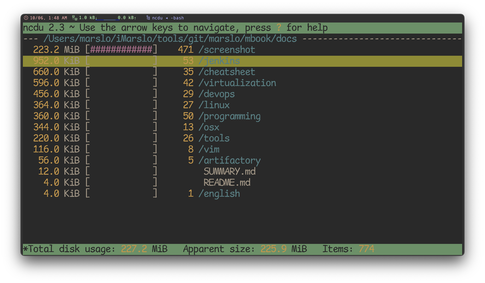
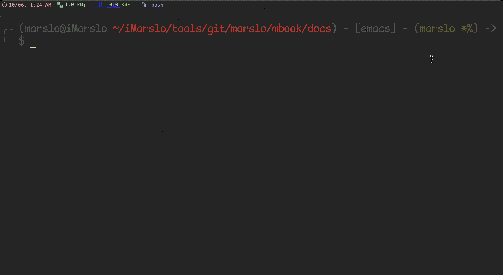
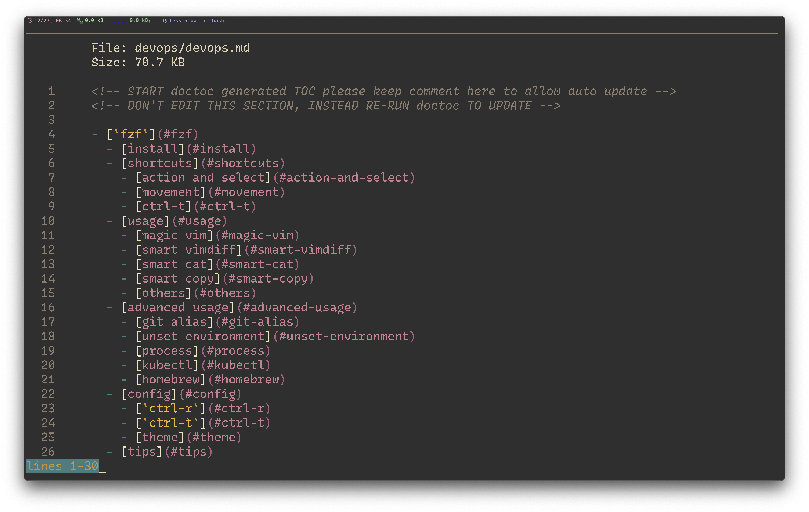
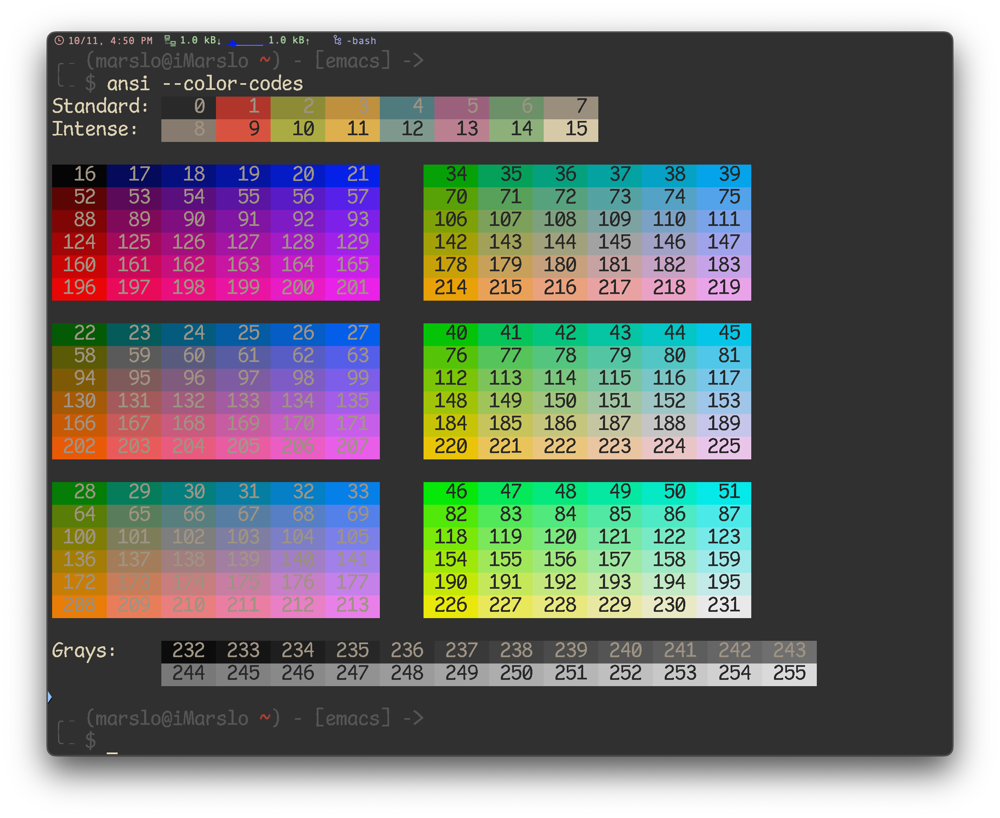

<!-- START doctoc generated TOC please keep comment here to allow auto update -->
<!-- DON'T EDIT THIS SECTION, INSTEAD RE-RUN doctoc TO UPDATE -->
**Table of Contents**  *generated with [DocToc](https://github.com/thlorenz/doctoc)*

- [network tools](#network-tools)
  - [`vnstat`](#vnstat)
  - [`ipcalc`](#ipcalc)
  - [`iostat`](#iostat)
  - [`tcpdump`](#tcpdump)
  - [`dstat`](#dstat)
  - [strace](#strace)
  - [sar](#sar)
  - [netcat](#netcat)
  - [`ip`](#ip)
- [utility](#utility)
  - [`elinks`](#elinks)
  - [`ncdu` : NCurses Disk Usage](#ncdu--ncurses-disk-usage)
  - [`duf`](#duf)
  - [`enhancd`](#enhancd)
  - [`fzf`](#fzf)
  - [`fd`](#fd)
  - [`ag` the faster `mg`](#ag-the-faster-mg)
  - [`rg` the faster `mg`](#rg-the-faster-mg)
  - [`fzy`](#fzy)
  - [`bat`](#bat)
  - [`ansi`](#ansi)
  - [`diff-so-fancy`](#diff-so-fancy)
- [oneline commands](#oneline-commands)
  - [cat and EOF](#cat-and-eof)
  - [ssh](#ssh)
  - [find and tar](#find-and-tar)
  - [find and rename](#find-and-rename)
  - [find and sort](#find-and-sort)
- [download and extract](#download-and-extract)

<!-- END doctoc generated TOC please keep comment here to allow auto update -->


> references:
> - [20 Command Line Tools to Monitor Linux Performance](http://www.tecmint.com/command-line-tools-to-monitor-linux-performance/)
> - [20 Linux System Monitoring Tools Every SysAdmin Should Know](http://www.cyberciti.biz/tips/top-linux-monitoring-tools.html)
> - [Top 25 Best Linux Performance Monitoring and Debugging Tools](http://thegeekstuff.com/2011/12/linux-performance-monitoring-tools/)
> - [http://www.thegeekstuff.com/2010/12/50-unix-linux-sysadmin-tutorials](http://www.thegeekstuff.com/2010/12/50-unix-linux-sysadmin-tutorials/)
> - [16 commands to check hardware information on Linux](http://www.binarytides.com/linux-commands-hardware-info/)
> - [Best UNIX shell-based tools](https://gist.github.com/mbbx6spp/1429161)
> - [* alebcay/awesome-shell](https://github.com/alebcay/awesome-shell/tree/master)
>   - [* zh-cn](https://github.com/alebcay/awesome-shell/blob/master/README_ZH-CN.md)
>   - [nosarthur/awesome-shell](https://github.com/nosarthur/awesome-shell)
> - [* rockerBOO/awesome-neovim](https://github.com/rockerBOO/awesome-neovim)
> - [jlevy/the-art-of-command-line](https://github.com/jlevy/the-art-of-command-line)
> - [Learn Enough Command Line to Be Dangerous](https://www.learnenough.com/command-line-tutorial/basics)
> - [Shell Style Guide](https://google.github.io/styleguide/shellguide.html)
> - [Use Bash Strict Mode (Unless You Love Debugging)](http://redsymbol.net/articles/unofficial-bash-strict-mode/)
> - others
>   - [bayandin/awesome-awesomeness](https://github.com/bayandin/awesome-awesomeness)
>   - [emijrp/awesome-awesome](https://github.com/emijrp/awesome-awesome)
>   - [kahun/awesome-sysadmin](https://github.com/kahun/awesome-sysadmin)
> - [My Minimalist Over-powered Linux Setup Guide](https://medium.com/@jonyeezs/my-minimal-over-powered-linux-setup-guide-710931efb75b)
> - [* devynspencer/cute_commands.sh](https://gist.github.com/devynspencer/cfdce35b3230e72214ef)


## network tools

### `vnstat`


```bash
$ vnstat -l 1 -i en7
Monitoring en7...    (press CTRL-C to stop)

   rx:     4.10 kbit/s   21.00 KiB          tx:         0 bit/s   6.00 KiB^C

 en7  /  traffic statistics
                           rx         |       tx
--------------------------------------+------------------
  bytes                    21.00 KiB  |        6.00 KiB
--------------------------------------+------------------
          max           53.25 kbit/s  |    12.29 kbit/s
      average           17.20 kbit/s  |     4.92 kbit/s
          min                0 bit/s  |         0 bit/s
--------------------------------------+------------------
  packets                         60  |              52
--------------------------------------+------------------
          max                 15 p/s  |          16 p/s
      average                  6 p/s  |           5 p/s
          min                  2 p/s  |           0 p/s
--------------------------------------+------------------
  time                    10 seconds
```

### `ipcalc`


```bash
$ ipcalc 10.25.130.2/23
Address:   10.25.130.2          00001010.00011001.1000001 0.00000010
Netmask:   255.255.254.0 = 23   11111111.11111111.1111111 0.00000000
Wildcard:  0.0.1.255            00000000.00000000.0000000 1.11111111
=>
Network:   10.25.130.0/23       00001010.00011001.1000001 0.00000000
HostMin:   10.25.130.1          00001010.00011001.1000001 0.00000001
HostMax:   10.25.131.254        00001010.00011001.1000001 1.11111110
Broadcast: 10.25.131.255        00001010.00011001.1000001 1.11111111
Hosts/Net: 510                   Class A, Private Internet

$ ipcalc 10.25.131.1/23
Address:   10.25.131.1          00001010.00011001.1000001 1.00000001
Netmask:   255.255.254.0 = 23   11111111.11111111.1111111 0.00000000
Wildcard:  0.0.1.255            00000000.00000000.0000000 1.11111111
=>
Network:   10.25.130.0/23       00001010.00011001.1000001 0.00000000
HostMin:   10.25.130.1          00001010.00011001.1000001 0.00000001
HostMax:   10.25.131.254        00001010.00011001.1000001 1.11111110
Broadcast: 10.25.131.255        00001010.00011001.1000001 1.11111111
Hosts/Net: 510                   Class A, Private Internet
```

### `iostat`
```bash
$ iostat
              disk0       cpu    load average
    KB/t  tps  MB/s  us sy id   1m   5m   15m
   19.85   37  0.72   3  1 96  1.78 1.90 1.69
```

### `tcpdump`
```bash
$ sudo tcpdump -A -i en7
tcpdump: verbose output suppressed, use -v or -vv for full protocol decode
listening on en7, link-type EN10MB (Ethernet), capture size 262144 bytes
00:33:02.787671 IP 10.25.130.117.53629 > a23-43-240-92.deploy.static.akamaitechnologies.com.https: Flags [.], ack 697481089, win 2048, length 0
E..(....@...
..u.+.\.}..r...)...P...:...
00:33:02.790119 IP 10.25.130.117.51541 > sh-vdc01.mycompany.com.domain: 53089+ PTR? 92.240.43.23.in-addr.arpa. (43)
E..GP....._.
..u
&t..U.5.3...a...........92.240.43.23.in-addr.arpa.....
00:33:02.812866 ARP, Request who-has gw-voice-idf.cdu-cn.mycompany.com tell gw-vg224-idf.cdu-cn.mycompany.com, length 46
....
....
13 packets captured
25 packets received by filter
0 packets dropped by kernel
```

- [or](https://superuser.com/a/1567926/112396)
  ```bash
  $ sudo tcpdump -n -i any src or dst target.ip.address [ -v ]

  # i.e.
  $ sudo tcpdump -n -i any src or dst git.domain.com -v
  tcpdump: data link type PKTAP
  tcpdump: listening on any, link-type PKTAP (Apple DLT_PKTAP), snapshot length 524288 bytes
  00:02:55.698822 IP (tos 0x0, ttl 64, id 0, offset 0, flags [DF], proto TCP (6), length 52)
      10.25.130.104.63447 > 10.69.78.140.29418: Flags [F.], cksum 0x8fe0 (correct), seq 2566890566, ack 4019765769, win 2058, options [nop,nop,TS val 1955309758 ecr 154499413], length 0
  ```

### `dstat`


### strace

> [!NOTE|label:references:]
> - [I have a tab completion that hangs, is it possible to use strace to find out what is going on?](https://unix.stackexchange.com/a/525582/29178)

```bash
$ ... run cmd ...

# or
$ pid=$(echo ??)
$ sudo strace -fp ${pid} -o log

# or
$ sudo -v
$ sudo strace -fp $$ -o log &
```

- more
  ```bash
  $ set -o functrace xtrace
  $ PS4=' ${BASH_SOURCE}:$FUNCNAME:$LINENO: '
  ```

- [debug script](https://askubuntu.com/a/678919/92979)
  ```bash
  $ strace -e clone,execve,pipe,dup2 \
           -f bash -c 'cat <(/bin/true) <(/bin/false) <(/bin/echo)'
  execve("/usr/bin/bash", ["bash", "-c", "cat <(/bin/true) <(/bin/false) <"...], 0x7fff9b9c6f98 /* 75 vars */) = 0
  pipe([3, 4])                            = 0
  dup2(3, 63)                             = 63
  clone(child_stack=NULL, flags=CLONE_CHILD_CLEARTID|CLONE_CHILD_SETTID|SIGCHLD, child_tidptr=0x7f7cf6a8ca10) = 289963
  strace: Process 289963 attached
  [pid 289962] pipe([3, 4])               = 0
  [pid 289962] dup2(3, 62)                = 62
  [pid 289962] clone(child_stack=NULL, flags=CLONE_CHILD_CLEARTID|CLONE_CHILD_SETTID|SIGCHLD <unfinished ...>
  [pid 289963] dup2(4, 1)                 = 1
  [pid 289962] <... clone resumed>, child_tidptr=0x7f7cf6a8ca10) = 289964
  strace: Process 289964 attached
  [pid 289963] clone(child_stack=NULL, flags=CLONE_CHILD_CLEARTID|CLONE_CHILD_SETTID|SIGCHLD <unfinished ...>
  [pid 289962] pipe([3, 4])               = 0
  strace: Process 289965 attached
  [pid 289963] <... clone resumed>, child_tidptr=0x7f7cf6a8ca10) = 289965
  [pid 289962] dup2(3, 61)                = 61
  [pid 289962] clone(child_stack=NULL, flags=CLONE_CHILD_CLEARTID|CLONE_CHILD_SETTID|SIGCHLD <unfinished ...>
  [pid 289964] dup2(4, 1)                 = 1
  [pid 289965] execve("/bin/true", ["/bin/true"], 0x55ec7c007680 /* 73 vars */strace: Process 289966 attached
   <unfinished ...>
  [pid 289962] <... clone resumed>, child_tidptr=0x7f7cf6a8ca10) = 289966
  [pid 289964] clone(child_stack=NULL, flags=CLONE_CHILD_CLEARTID|CLONE_CHILD_SETTID|SIGCHLD <unfinished ...>
  [pid 289965] <... execve resumed>)      = 0
  strace: Process 289967 attached
  [pid 289964] <... clone resumed>, child_tidptr=0x7f7cf6a8ca10) = 289967
  [pid 289966] dup2(4, 1)                 = 1
  [pid 289967] execve("/bin/false", ["/bin/false"], 0x55ec7c007af0 /* 73 vars */ <unfinished ...>
  [pid 289966] clone(child_stack=NULL, flags=CLONE_CHILD_CLEARTID|CLONE_CHILD_SETTID|SIGCHLD, child_tidptr=0x7f7cf6a8ca10) = 289968
  [pid 289967] <... execve resumed>)      = 0
  strace: Process 289968 attached
  [pid 289962] execve("/usr/bin/cat", ["cat", "/dev/fd/63", "/dev/fd/62", "/dev/fd/61"], 0x55ec7c007bc0 /* 73 vars */ <unfinished ...>
  [pid 289968] execve("/bin/echo", ["/bin/echo"], 0x55ec7c007e20 /* 73 vars */ <unfinished ...>
  [pid 289962] <... execve resumed>)      = 0
  [pid 289968] <... execve resumed>)      = 0
  [pid 289965] +++ exited with 0 +++
  [pid 289963] --- SIGCHLD {si_signo=SIGCHLD, si_code=CLD_EXITED, si_pid=289965, si_uid=10564, si_status=0, si_utime=0, si_stime=0} ---
  [pid 289963] +++ exited with 0 +++
  [pid 289962] --- SIGCHLD {si_signo=SIGCHLD, si_code=CLD_EXITED, si_pid=289963, si_uid=10564, si_status=0, si_utime=0, si_stime=0} ---
  [pid 289967] +++ exited with 1 +++
  [pid 289964] --- SIGCHLD {si_signo=SIGCHLD, si_code=CLD_EXITED, si_pid=289967, si_uid=10564, si_status=1, si_utime=0, si_stime=0} ---
  [pid 289964] +++ exited with 1 +++
  [pid 289962] --- SIGCHLD {si_signo=SIGCHLD, si_code=CLD_EXITED, si_pid=289964, si_uid=10564, si_status=1, si_utime=0, si_stime=0} ---

  [pid 289968] +++ exited with 0 +++
  [pid 289966] --- SIGCHLD {si_signo=SIGCHLD, si_code=CLD_EXITED, si_pid=289968, si_uid=10564, si_status=0, si_utime=0, si_stime=0} ---
  [pid 289966] +++ exited with 0 +++
  --- SIGCHLD {si_signo=SIGCHLD, si_code=CLD_EXITED, si_pid=289966, si_uid=10564, si_status=0, si_utime=0, si_stime=0} ---
  +++ exited with 0 +++
  ```

### sar

### netcat

> [!NOTE]
> references:
> - [the netcat command in linux](https://www.baeldung.com/linux/netcat-command)

- check particular port
  ```bash
  $ nc -zv 127.0.0.1 22
  Connection to 127.0.0.1 port 22 [tcp/ssh] succeeded!
  ```

- check ports in range
  ```bash
  $ nc -znv -w 1 127.0.0.1 20-30
  nc: connectx to 127.0.0.1 port 20 (tcp) failed: Connection refused
  nc: connectx to 127.0.0.1 port 21 (tcp) failed: Connection refused
  Connection to 127.0.0.1 port 22 [tcp/*] succeeded!
  nc: connectx to 127.0.0.1 port 23 (tcp) failed: Connection refused
  nc: connectx to 127.0.0.1 port 24 (tcp) failed: Connection refused
  nc: connectx to 127.0.0.1 port 25 (tcp) failed: Connection refused
  nc: connectx to 127.0.0.1 port 26 (tcp) failed: Connection refused
  nc: connectx to 127.0.0.1 port 27 (tcp) failed: Connection refused
  nc: connectx to 127.0.0.1 port 28 (tcp) failed: Connection refused
  ```

- running simple web server
  ```bash
  $ cat > index.html <<<EOF
  <!DOCTYPE html>
  <html>
      <head>
          <title>Simple Netcat Server</title>
      </head>
      <body>
          <h1>Welcome to simple netcat server!<h1>
      </body>
      </body>
  <html>
  EOF

  $ echo -e "HTTP/1.1 200 OK\n\n$(cat index.html)" | nc -l 1234
  ```

- or getting more
  ```bash
  $ while true; do echo -e "HTTP/1.1 200 OK\n\n$(cat index.html)" | nc -l -w 1 1234; done
  GET / HTTP/1.1
  Host: localhost:1234
  Connection: keep-alive
  sec-ch-ua: "Chromium";v="110", "Not A(Brand";v="24", "Google Chrome";v="110"
  sec-ch-ua-mobile: ?0
  sec-ch-ua-platform: "macOS"
  Upgrade-Insecure-Requests: 1
  User-Agent: Mozilla/5.0 (Macintosh; Intel Mac OS X 10_15_7) AppleWebKit/537.36 (KHTML, like Gecko) Chrome/110.0.0.0 Safari/537.36
  Accept: text/html,application/xhtml+xml,application/xml;q=0.9,image/avif,image/webp,image/apng,*/*;q=0.8,application/signed-exchange;v=b3;q=0.7
  Sec-Fetch-Site: none
  Sec-Fetch-Mode: navigate
  Sec-Fetch-User: ?1
  Sec-Fetch-Dest: document
  Accept-Encoding: gzip, deflate, br
  Accept-Language: en,zh-CN;q=0.9,zh;q=0.8,en-US;q=0.7

  GET /favicon.ico HTTP/1.1
  Host: localhost:1234
  Connection: keep-alive
  sec-ch-ua: "Chromium";v="110", "Not A(Brand";v="24", "Google Chrome";v="110"
  sec-ch-ua-mobile: ?0
  User-Agent: Mozilla/5.0 (Macintosh; Intel Mac OS X 10_15_7) AppleWebKit/537.36 (KHTML, like Gecko) Chrome/110.0.0.0 Safari/537.36
  sec-ch-ua-platform: "macOS"
  Accept: image/avif,image/webp,image/apng,image/svg+xml,image/*,*/*;q=0.8
  Sec-Fetch-Site: same-origin
  Sec-Fetch-Mode: no-cors
  Sec-Fetch-Dest: image
  Referer: http://localhost:1234/
  Accept-Encoding: gzip, deflate, br
  Accept-Language: en,zh-CN;q=0.9,zh;q=0.8,en-US;q=0.7

  ...
  ```

  

- [reverse proxy with netcat](https://www.baeldung.com/linux/netcat-command#reverse-proxy-with-netcat)


### `ip`
```bash
$ ip addr show | sed -nE "s/inet\s(.*)\/[0-9]+.*\s(\w+)/\2 \1/p"
  lo0 127.0.0.1
  en0 192.168.1.71

# for linux
$ ip addr show | sed -nE "s/inet\s(.*)\/[0-9]+.*\s(\w+)/\2 \1/p" | column -to ' => '
lo0 => 127.0.0.1
en0 => 192.168.1.71
```

## utility
### `elinks`

> [!NOTE|label:references:]
> - [ELinks](https://en.wikipedia.org/wiki/ELinks)
> - MacOS:
>   ```bash
>   $ brew install felinks
>   $ which -a elinks
>   /usr/local/bin/elinks
>   ```
> - [* iMarslo : open html in terminal](../vim/tricky.html#open-html-in-terminal)
> - [ELinks - Full-Featured Text WWW Browser](http://elinks.or.cz/)
>   - [elinks.conf](http://elinks.or.cz/documentation/manpages/elinks.conf.5.html)
>   - [elinkskeys](http://elinks.or.cz/documentation/manpages/elinkskeys.5.html)

```bash
$ elinks https://google.com
```


- configure

  > [!NOTE|label:references:]
  > - [Elinks: SSL Error](https://stackoverflow.com/a/40114376/2940319)

  ```bash
  $ cat ~/.elinks/elinks.conf
  set connection.ssl.cert_verify = 0
  ```

### [`ncdu` : NCurses Disk Usage](https://dev.yorhel.nl/ncdu)



### [`duf`](https://unix.stackexchange.com/a/612111/29178)


### [`enhancd`](https://github.com/babarot/enhancd)

> [!NOTE|label:references:]
> - [mattn/ltsv.vim](https://gist.github.com/mattn/4737234)
> - [* lfromanini/smartcd](https://github.com/lfromanini/smartcd)
> - [* iMarslo : autocmd BufWritePre except](../vim/tricky.html#autocmd-bufwritepre-except)
>   ```vim
>   " original
>   autocmd BufWritePre * :retab!                                   " automatic retab
>
>   " for ltsv
>   if has( "autocmd" )
>     autocmd BufRead,BufNewFile  *.ltsv                 set filetype=ltsv syntax=groovy noexpandtab
>     autocmd BufWritePre         *\(.ltsv\|.diffs\)\@<! :retab!    " automatic retab
>   endif
>   ```

- install
  ```bash
  $ git clone https://github.com/babarot/enhancd && source enhancd/init.sh

  # or
  $ curl -L git.io/enhancd | sh
  ```

- re-mapping cmd
  ```bash
  diff --git a/init.sh b/init.sh
  index 55a9c95..bc3ae89 100644
  --- a/init.sh
  +++ b/init.sh
  @@ -52,8 +52,8 @@ if [[ ! -f ${ENHANCD_DIR}/enhancd.log ]]; then
     touch "${ENHANCD_DIR}/enhancd.log"
   fi

  -# alias to cd
  -eval "alias ${ENHANCD_COMMAND:=cd}=__enhancd::cd"
  +# alias to ce
  +eval "alias ${ENHANCD_COMMAND:=ce}=__enhancd::cd"

   # Set the filter if empty
   if [[ -z ${ENHANCD_FILTER} ]]; then
  ```

- usage
  ```bash
  $ brew install fzy
  # debine
  $ sudo apt install fzy

  $ export ENHANCD_FILTER="fzf --height 35%:fzy"
  $ source /path/to/enhancd/init.sh
  $ ce .
  ```

  

### [`fzf`](https://github.com/junegunn/fzf)

> [!NOTE|label:references:]
> - [* fzf - FuZzy Finder Tutorial](https://www.youtube.com/watch?v=tB-AgxzBmH8)
>   - [Examples (completion)](https://github.com/junegunn/fzf/wiki/Examples-(completion))
>   - [Examples (vim)](https://github.com/junegunn/fzf/wiki/Examples-(vim))
>   - [On MacVim with iTerm2](https://github.com/junegunn/fzf/wiki/On-MacVim-with-iTerm2)
> - [* junegunn/fzf](https://github.com/junegunn/fzf)
>   - [fzf wiki](https://github.com/junegunn/fzf/wiki)
>   - [fzf screencasts by gotbletu](https://www.youtube.com/playlist?list=PLqv94xWU9zZ2fMsMMDF4PjtNHCeBFbggD)
>   - [junegunn/fzf-git.sh](https://github.com/junegunn/fzf-git.sh)
>   - fzf basics:
>     - [layout](https://qmacro.org/blog/posts/2021/02/02/fzf-the-basics-part-1-layout/)
>     - [search results](https://qmacro.org/blog/posts/2021/02/07/fzf-the-basics-part-2-search-results/)
>   - [examples](https://github.com/junegunn/fzf/wiki/examples)
>     - [Man pages](https://github.com/junegunn/fzf/wiki/Examples#man-pages)
>     - [Git](https://github.com/junegunn/fzf/wiki/Examples#git)
>   - [Advanced fzf examples](https://github.com/junegunn/fzf/blob/master/ADVANCED.md)
> - [Introduction to fzf command](https://www.baeldung.com/linux/fzf-command)
> - [Find anything you need with fzf, the Linux fuzzy finder tool](https://www.redhat.com/sysadmin/fzf-linux-fuzzy-finder)
> - [Why you should be using fzf, the command line fuzzy finder](https://www.freecodecamp.org/news/fzf-a-command-line-fuzzy-finder-missing-demo-a7de312403ff/)
> - [Linux下搜索神器fzf的配置和使用](https://blog.csdn.net/qq_39852676/article/details/126820806)
> - [garybernhardt/selecta](https://github.com/garybernhardt/selecta)
> - [serenevoid/fzf_config.md](https://gist.github.com/serenevoid/13239752cfa41a75a69446b7beb26d7a)
> - [* How to search faster in Vim with FZF.vim](https://dev.to/iggredible/how-to-search-faster-in-vim-with-fzf-vim-36ko)
> - [* How FZF and ripgrep improved my workflow](https://sidneyliebrand.medium.com/how-fzf-and-ripgrep-improved-my-workflow-61c7ca212861) | [SidOfc/vim-rg-outdated-command.vim](https://gist.github.com/SidOfc/ba43acade7f4a1bf9faf57d16b33616a#file-vim-rg-outdated-command-vim)
>   ```vim
>   " fzf.vim now supports this command out of the box
>   " so this code is no longer needed.
>   command! -bang -nargs=* Rg
>     \ call fzf#vim#grep(
>     \   'rg --column --line-number --hidden --ignore-case --no-heading --color=always '.shellescape(<q-args>), 1,
>     \   <bang>0 ? fzf#vim#with_preview({'options': '--delimiter : --nth 4..'}, 'up:60%')
>     \           : fzf#vim#with_preview({'options': '--delimiter : --nth 4..'}, 'right:50%:hidden', '?'),
>     \   <bang>0)
>   ```
> - Fuzzy Completion in Bash
>   - `$ cat **<tab>`
>   - `$ unset **<tab>`
>   - `$ unalias **<tab>`
>   - `$ export **<tab>`
>   - `$ ssh **<tab>`
>   - `$ kill -9 **<tab>`
> - customize
>   - [* fzf wiki: color themes](https://github.com/junegunn/fzf/wiki/Color-schemes)
>   - [* fzf-color-theme.css](./fzf-color-theme.css)
>   - [#692 Custom selected character](https://github.com/junegunn/fzf/issues/692)


#### installation

```bash
$ brew install fzf fd
# debine
$ sudo apt install fd

$ export FZF_DEFAULT_OPTS='--height 35%'
$ FZF_DEFAULT_OPTS+=' --layout=reverse'
$ FZF_DEFAULT_OPTS+=' --pointer="→" --marker="» " --prompt="$ "'
$ FZF_DEFAULT_OPTS+=' --multi'
$ FZF_DEFAULT_OPTS+=' --inline-info'
$ FZF_DEFAULT_OPTS+=' --color=spinner:#e6db74,hl:#928374,fg:#ebdbb2,header:#928374,info:#504945,pointer:#98971a,marker:#d79921,fg+:#ebdbb2,prompt:#404945,hl+:#fb4934'
# or
$ export FZF_DEFAULT_OPTS='--height 35% --layout=reverse --multi --inline-info --color=bg+:#3c3836,bg:#32302f,spinner:#fb4934,hl:#928374,fg:#ebdbb2,header:#928374,info:#8ec07c,pointer:#fb4934,marker:#fb4934,fg+:#ebdbb2,prompt:#fb4934,hl+:#fb4934'

$ export FZF_DEFAULT_COMMAND='fd --type f --strip-cwd-prefix --hidden --follow --exclude .git --exclude node_modules'
$ function fs() { fzf --multi --bind 'enter:become(vim {+})' }
```


- install from source code for wsl

  > [!NOTE|label:this solution for install latest fzf in wsl]
  > - in wsl Ubuntu, the fzf version is `0.29`
  >   ```bash
  >   $ sudo apt search fzf
  >   Sorting... Done
  >   Full Text Search... Done
  >   fzf/jammy 0.29.0-1 amd64
  >     general-purpose command-line fuzzy finder
  >   ```
  > - [* Fzf – A Quick Fuzzy File Search from Linux Terminal](https://www.tecmint.com/fzf-fuzzy-file-search-from-linux-terminal/)

  ```bash
  ################ for offline installation only ################
  # check current version for offline installation
  $ uname -sm
  Linux x86_64

  # download correct package according https://github.com/junegunn/fzf/blob/master/install#L170
  # i.e.: Linux x86_64 -> fzf-$version-linux_amd64.tar.gz
  $ cp fzf-0.42.0-linux_amd64.tar.gz /tmp/fzf.tar.gz

  # modify install script `try_curl` function to not download but use local tar.gz directly
  $ cat << 'EOF' | git apply --inaccurate-eof --ignore-whitespace
  diff --git a/install b/install
  index 5ac191b..342bc49 100755
  --- a/install
  +++ b/install
  @@ -115,10 +115,8 @@ link_fzf_in_path() {
  try_curl() {
   command -v curl > /dev/null &&
   if [[ $1 =~ tar.gz$ ]]; then
  -    curl -fL $1 | tar -xzf -
  -  else
  -    local temp=${TMPDIR:-/tmp}/fzf.zip
  -    curl -fLo "$temp" $1 && unzip -o "$temp" && rm -f "$temp"
  +    local temp=${TMPDIR:-/tmp}/fzf.tar.gz
  +    tar -xzf "$temp" && rm -rf "$temp"
   fi
  }
  EOF

  ### or modify manually :
  # try_curl() {
  #   command -v curl > /dev/null &&
  #   if [[ $1 =~ tar.gz$ ]]; then
  #     local temp=${TMPDIR:-/tmp}/fzf.tar.gz
  #     tar -xzf "$temp" && rm -rf "$temp"
  #   fi
  # }
  ################ for offline installation only ################

  $ git clone git@github.com:junegunn/fzf.git
  $ bash -x install --all
  $ sudo cp bin/fzf* /usr/local/bin/
  ```


#### movement

> [!NOTE|label:references:]
> - [Using the finder](https://github.com/junegunn/fzf#using-the-finder)

- [multiple select](https://github.com/junegunn/fzf.vim/issues/40#issuecomment-156037468)
  - <kbd>tab</kbd> : select and move down
  - <kbd>shift</kbd> + <kbd>tab</kbd> : select and move up
  - <kbd>alt</kbd> + <kbd>a</kbd> : select all
  - <kbd>alt</kbd> + <kbd>d</kbd> : de-select all
- actions
  - <kbd>enter</kbd> : open selected item(s)
  - <kbd>ctrl</kbd> + <kbd>x</kbd> : horizontal splits
  - <kbd>ctrl</kbd> + <kbd>v</kbd> : vertical splits
  - <kbd>ctrl</kbd> + <kbd>t</kbd> : tab
- move
  - up : <kbd>up</kbd> | <kbd>ctrl</kbd> + <kbd>k</kbd> | <kbd>ctrl</kbd> + <kbd>p</kbd>
  - down : <kbd>down</kbd> | <kbd>ctrl</kbd> + <kbd>j</kbd> | <kbd>ctrl</kbd> + <kbd>n</kbd>

#### cool functions

> [!NOTE|label:references:]
> - [Advanced fzf examples](https://github.com/junegunn/fzf/blob/master/ADVANCED.md)
> - [Examples](https://github.com/junegunn/fzf/wiki/examples)
- magic vim

  > [!TIP]
  > - if `vim` commands with paramters
  >   - if `1` paramters and parameters is directlry; cd and call fzf and using vim to open selected file
  >   - otherwise call regular vim to open file(s)
  > - if `vim` commands without paramters, call fzf and using vim to open selected file

  ```bash
  # magic vim - trigger vim by different parameters
  # @author      : marslo
  # @source      : https://github.com/marslo/mylinux/blob/master/confs/home/.marslo/bin/ifunc.sh#L206
  # @description :
  #   - if `vim` commands without paramters, then call fzf and using vim to open selected file
  #   - if `vim` commands with    paramters
  #       - if single paramters and parameters is directlry, then call fzf in target directory and using vim to open selected file
  #       - otherwise call regular vim to open file(s)
  function vim() {
    if [[ 0 -eq $# ]]; then
      fzf --multi --bind="enter:become($(which -a vim | head -1) {+})"
    elif [[ 1 -eq $# ]] && [[ -d $1 ]]; then
      local target=$1
      pushd . >/dev/null
      cd "${target}" || return
      fzf --multi --bind="enter:become($(which -a vim | head -1) {+})"
      popd >/dev/null || true
    else
      # shellcheck disable=SC2068
      $(which -a vim | head -1) -u $HOME/.vimrc $@
    fi
  }
  ```

  

- [open files](https://github.com/junegunn/fzf/wiki/examples#opening-files)
  ```bash
  # fe [FUZZY PATTERN] - Open the selected file with the default editor
  #   - Bypass fuzzy finder if there's only one match (--select-1)
  #   - Exit if there's no match (--exit-0)
  fe() {
    IFS=$'\n' files=($(fzf-tmux --query="$1" --multi --select-1 --exit-0))
    [[ -n "$files" ]] && ${EDITOR:-vim} "${files[@]}"
  }

  # Modified version where you can press
  #   - CTRL-O to open with `open` command,
  #   - CTRL-E or Enter key to open with the $EDITOR
  fo() {
    IFS=$'\n' out=("$(fzf-tmux --query="$1" --exit-0 --expect=ctrl-o,ctrl-e)")
    key=$(head -1 <<< "$out")
    file=$(head -2 <<< "$out" | tail -1)
    if [ -n "$file" ]; then
      [ "$key" = ctrl-o ] && open "$file" || ${EDITOR:-vim} "$file"
    fi
  }
  ```

- [search in files](https://github.com/junegunn/fzf/wiki/Examples#general)
  ```bash
  # using ripgrep combined with preview
  # find-in-file - usage: fif <searchTerm>
  fif() {
    if [ ! "$#" -gt 0 ]; then echo "Need a string to search for!"; return 1; fi
    rg --files-with-matches --no-messages "$1" | fzf --preview "highlight -O ansi -l {} 2> /dev/null | rg --colors 'match:bg:yellow' --ignore-case --pretty --context 10 '$1' || rg --ignore-case --pretty --context 10 '$1' {}"
  }
  ```

  

- [chaning directory](https://github.com/junegunn/fzf/wiki/examples#changing-directory)
  ```bash
  # fd - cd to selected directory
  fd() {
    local dir
    dir=$(find ${1:-.} -path '*/\.*' -prune \
                    -o -type d -print 2> /dev/null | fzf +m) &&
    cd "$dir"
  }

  # Another fd - cd into the selected directory
  # This one differs from the above, by only showing the sub directories and not
  #  showing the directories within those.
  fd() {
    DIR=`find * -maxdepth 0 -type d -print 2> /dev/null | fzf-tmux` \
      && cd "$DIR"
  }

  # fda - including hidden directories
  fda() {
    local dir
    dir=$(find ${1:-.} -type d 2> /dev/null | fzf +m) && cd "$dir"
  }

  # fdr - cd to selected parent directory
  fdr() {
    local declare dirs=()
    get_parent_dirs() {
      if [[ -d "${1}" ]]; then dirs+=("$1"); else return; fi
      if [[ "${1}" == '/' ]]; then
        for _dir in "${dirs[@]}"; do echo $_dir; done
      else
        get_parent_dirs $(dirname "$1")
      fi
    }
    local DIR=$(get_parent_dirs $(realpath "${1:-$PWD}") | fzf-tmux --tac)
    cd "$DIR"
  }

  # cdf - cd into the directory of the selected file
  cdf() {
     local file
     local dir
     file=$(fzf +m -q "$1") && dir=$(dirname "$file") && cd "$dir"
  }
  ```

- [`ctrl-r`](https://github.com/junegunn/fzf#key-bindings-for-command-line)
  ```bash
  # CTRL-/ to toggle small preview window to see the full command
  # CTRL-Y to copy the command into clipboard using pbcopy
  export FZF_CTRL_R_OPTS="
    --preview 'echo {}' --preview-window up:3:hidden:wrap
    --bind 'ctrl-/:toggle-preview'
    --bind 'ctrl-y:execute-silent(echo -n {2..} | pbcopy)+abort'
    --color header:italic
    --header 'Press CTRL-Y to copy command into clipboard'"
  ```

  - `__fzf_history__`
    ```bash
    $ type __fzf_history__
    __fzf_history__ is a function
    __fzf_history__ ()
    {
        local output opts script;
        opts="--height ${FZF_TMUX_HEIGHT:-40%} --bind=ctrl-z:ignore ${FZF_DEFAULT_OPTS-} -n2..,.. --scheme=history --bind=ctrl-r:toggle-sort ${FZF_CTRL_R_OPTS-} +m --read0";
        script='BEGIN { getc; $/ = "\n\t"; $HISTCOUNT = $ENV{last_hist} + 1 } s/^[ *]//; print $HISTCOUNT - $. . "\t$_" if !$seen{$_}++';
        output=$(set +o pipefail
    builtin fc -lnr -2147483648 | last_hist=$(HISTTIMEFORMAT='' builtin history 1) command perl -n -l0 -e "$script" | FZF_DEFAULT_OPTS="$opts" $(__fzfcmd) --query "$READLINE_LINE") || return;
        READLINE_LINE=${output#*' '};
        if [[ -z "$READLINE_POINT" ]]; then
            echo "$READLINE_LINE";
        else
            READLINE_POINT=0x7fffffff;
        fi
    }

    $ fcf __fzf_history__
    /usr/local/Cellar/fzf/0.42.0/shell/key-bindings.bash
    ```

  

- [`ctrl-t`](https://github.com/junegunn/fzf#key-bindings-for-command-line)

  > [!NOTE|label:references:]
  > ```bash
  > export FZF_CTRL_T_OPTS="
  >        --preview 'bat -n --color=always {}'
  >        --bind 'ctrl-/:change-preview-window(down|hidden|)'"
  > ```
  > - to disable/reset osx default <kbd>⌃</kbd>+<kbd>↑</kbd> and <kbd>⌃</kbd>+<kbd>↓</kbd>
  >   - **System Settings** ⇢ **Keyboard** ⇢ **Keyboard Shutcuts...** ⇢ **Mission Control**
  >     
  >
  >   - **System Settings** ⇢ **Desktop & Dock** ⇢ **Shortcuts...**
  >     

  ```bash
  # preview file content using bat (https://github.com/sharkdp/bat)
  export FZF_CTRL_T_OPTS="
    --preview 'bat -n --color=always {}'
    --bind 'ctrl-/:change-preview-window(down|hidden|)'"
  ```

  - `__fzf_select__`
    ```bash
    $ type __fzf_select__
    __fzf_select__ is a function
    __fzf_select__ ()
    {
        local cmd opts;
        cmd="${FZF_CTRL_T_COMMAND:-"command find -L . -mindepth 1 \\( -path '*/.*' -o -fstype 'sysfs' -o -fstype 'devfs' -o -fstype 'devtmpfs' -o -fstype 'proc' \\) -prune     -o -type f -print     -o -type d -print     -o -type l -print 2> /dev/null | command cut -b3-"}";
        opts="--height ${FZF_TMUX_HEIGHT:-40%} --bind=ctrl-z:ignore --reverse --scheme=path ${FZF_DEFAULT_OPTS-} ${FZF_CTRL_T_OPTS-} -m";
        eval "$cmd" | FZF_DEFAULT_OPTS="$opts" $(__fzfcmd) "$@" | while read -r item; do
            printf '%q ' "$item";
        done
    }

    $ fcf __fzf_select__
    __fzf_select__ 19 /Users/marslo/.marslo/utils/fzf/shell/key-bindings.bas

    $ mdfind key-bindings.bas
    /Users/marslo/iMarslo/tools/git/marslo/mbook/docs/devops/adminTools.md
    /usr/local/Cellar/fzf/0.42.0/shell/key-bindings.bash
    ```

  

  - [`__fzf_select_dir()`](https://github.com/junegunn/fzf/wiki/Examples#changing-directory)

    ```bash
    # another ctrl-t script to select a directory and paste it into line
    __fzf_select_dir () {
      builtin typeset READLINE_LINE_NEW="$(
        command find -L . \( -path '*/\.*' -o -fstype dev -o -fstype proc \) \
                -prune \
                -o -type f -print \
                -o -type d -print \
                -o -type l -print 2>/dev/null \
        | command sed 1d \
        | command cut -b3- \
        | env fzf -m
      )"

      if
        [[ -n $READLINE_LINE_NEW ]]
      then
        builtin bind '"\er": redraw-current-line'
        builtin bind '"\e^": magic-space'
        READLINE_LINE=${READLINE_LINE:+${READLINE_LINE:0:READLINE_POINT}}${READLINE_LINE_NEW}${READLINE_LINE:+${READLINE_LINE:READLINE_POINT}}
        READLINE_POINT=$(( READLINE_POINT + ${#READLINE_LINE_NEW} ))
      else
        builtin bind '"\er":'
        builtin bind '"\e^":'
      fi
    }

    builtin bind -x '"\C-x1": __fzf_select_dir'
    builtin bind '"\C-t": "\C-x1\e^\er"'
    ```

- [v](https://github.com/junegunn/fzf/wiki/Examples#v)
  ```bash
  # v - open files in ~/.vim_mru_files       # https://github.com/junegunn/fzf/wiki/Examples#v
  v() {
    local files
    files=$(grep --color=none -v '^#' ~/.vim_mru_files |
            while read -r line; do
              [ -f "${line/\~/$HOME}" ] && echo "$line"
            done | fzf-tmux -d -m -q "$*" -1) && vim ${files//\~/$HOME}
  }
  ```

- [Interactive cd](https://github.com/junegunn/fzf/wiki/Examples#interactive-cd)
  ```bash
  function cd() {
    if [[ "$#" != 0 ]]; then
      # shellcheck disable=SC2164
      builtin cd "$@";
      return
    fi
    while true; do
      # shellcheck disable=SC2155,SC2010
      local lsd=$(echo ".." && ls --color=none -p | grep --color=none '/$' | sed 's;/$;;')
      # shellcheck disable=SC2155,SC2016
      local dir="$(printf '%s\n' "${lsd[@]}" |
          fzf --reverse --preview '
              __cd_nxt="$(echo {})";
              __cd_path="$(echo $(pwd)/${__cd_nxt} | sed "s;//;/;")";
              echo $__cd_path;
              echo;
              ls -p --color=always "${__cd_path}";
      ')"
      [[ ${#dir} != 0 ]] || return 0
      # shellcheck disable=SC2164
      builtin cd "$dir" &> /dev/null
    done
  }
  ```

- advanced usage
  - [ps](https://github.com/junegunn/fzf/blob/master/ADVANCED.md#updating-the-list-of-processes-by-pressing-ctrl-r)
    ```bash
    $ (date; ps -ef) |
      fzf --bind='ctrl-r:reload(date; ps -ef)' \
          --header=$'Press CTRL-R to reload\n\n' --header-lines=2 \
          --preview='echo {}' --preview-window=down,3,wrap \
          --layout=reverse --height=80% |
      awk '{print $2}'

    # or kill
    $ (date; ps -ef) |
      fzf --bind='ctrl-r:reload(date; ps -ef)' \
          --header=$'Press CTRL-R to reload\n\n' --header-lines=2 \
          --preview='echo {}' --preview-window=down,3,wrap \
          --layout=reverse --height=80% |
      awk '{print $2}' |
      xargs kill -9
    ```

    

    

  - [Log tailing : pods](https://github.com/junegunn/fzf/blob/master/ADVANCED.md#log-tailing)
    ```bash
    pods() {
      : | command='kubectl get pods --all-namespaces' fzf \
        --info=inline --layout=reverse --header-lines=1 \
        --prompt "$(kubectl config current-context | sed 's/-context$//')> " \
        --header $'╱ Enter (kubectl exec) ╱ CTRL-O (open log in editor) ╱ CTRL-R (reload) ╱\n\n' \
        --bind 'start:reload:$command' \
        --bind 'ctrl-r:reload:$command' \
        --bind 'ctrl-/:change-preview-window(80%,border-bottom|hidden|)' \
        --bind 'enter:execute:kubectl exec -it --namespace {1} {2} -- bash > /dev/tty' \
        --bind 'ctrl-o:execute:${EDITOR:-vim} <(kubectl logs --all-containers --namespace {1} {2}) > /dev/tty' \
        --preview-window up:follow \
        --preview 'kubectl logs --follow --all-containers --tail=10000 --namespace {1} {2}' "$@"
    }
    ```

#### config
- [color theme](https://github.com/junegunn/fzf/blob/master/ADVANCED.md#color-themes)
  ```bash
  # junegunn/seoul256.vim (dark)
  export FZF_DEFAULT_OPTS='--color=bg+:#3F3F3F,bg:#4B4B4B,border:#6B6B6B,spinner:#98BC99,hl:#719872,fg:#D9D9D9,header:#719872,info:#BDBB72,pointer:#E12672,marker:#E17899,fg+:#D9D9D9,preview-bg:#3F3F3F,prompt:#98BEDE,hl+:#98BC99'

  # junegunn/seoul256.vim (light)
  export FZF_DEFAULT_OPTS='--color=bg+:#D9D9D9,bg:#E1E1E1,border:#C8C8C8,spinner:#719899,hl:#719872,fg:#616161,header:#719872,info:#727100,pointer:#E12672,marker:#E17899,fg+:#616161,preview-bg:#D9D9D9,prompt:#0099BD,hl+:#719899'

  # morhetz/gruvbox
  export FZF_DEFAULT_OPTS='--color=bg+:#3c3836,bg:#32302f,spinner:#fb4934,hl:#928374,fg:#ebdbb2,header:#928374,info:#8ec07c,pointer:#fb4934,marker:#fb4934,fg+:#ebdbb2,prompt:#fb4934,hl+:#fb4934'

  # arcticicestudio/nord-vim
  export FZF_DEFAULT_OPTS='--color=bg+:#3B4252,bg:#2E3440,spinner:#81A1C1,hl:#616E88,fg:#D8DEE9,header:#616E88,info:#81A1C1,pointer:#81A1C1,marker:#81A1C1,fg+:#D8DEE9,prompt:#81A1C1,hl+:#81A1C1'

  # tomasr/molokai
  export FZF_DEFAULT_OPTS='--color=bg+:#293739,bg:#1B1D1E,border:#808080,spinner:#E6DB74,hl:#7E8E91,fg:#F8F8F2,header:#7E8E91,info:#A6E22E,pointer:#A6E22E,marker:#F92672,fg+:#F8F8F2,prompt:#F92672,hl+:#F92672'
  ```

  - [generating fzf color theme from vim color schemes](https://github.com/junegunn/fzf/blob/master/ADVANCED.md#generating-fzf-color-theme-from-vim-color-schemes)
    ```vim
    let g:fzf_colors =
    \ { 'fg':         ['fg', 'Normal'],
      \ 'bg':         ['bg', 'Normal'],
      \ 'preview-bg': ['bg', 'NormalFloat'],
      \ 'hl':         ['fg', 'Comment'],
      \ 'fg+':        ['fg', 'CursorLine', 'CursorColumn', 'Normal'],
      \ 'bg+':        ['bg', 'CursorLine', 'CursorColumn'],
      \ 'hl+':        ['fg', 'Statement'],
      \ 'info':       ['fg', 'PreProc'],
      \ 'border':     ['fg', 'Ignore'],
      \ 'prompt':     ['fg', 'Conditional'],
      \ 'pointer':    ['fg', 'Exception'],
      \ 'marker':     ['fg', 'Keyword'],
      \ 'spinner':    ['fg', 'Label'],
      \ 'header':     ['fg', 'Comment'] }

    :echo fzf#wrap()
    :call append('$', printf('export FZF_DEFAULT_OPTS="%s"', matchstr(fzf#wrap().options, "--color[^']*")))
    ```

  - [homebrew](https://github.com/junegunn/fzf/wiki/examples#homebrew)
    ```bash
    # Install (one or multiple) selected application(s)
    # using "brew search" as source input
    # mnemonic [B]rew [I]nstall [P]ackage
    bip() {
      local inst=$(brew search "$@" | fzf -m)

      if [[ $inst ]]; then
        for prog in $(echo $inst);
        do; brew install $prog; done;
      fi
    }

    # Update (one or multiple) selected application(s)
    # mnemonic [B]rew [U]pdate [P]ackage
    bup() {
      local upd=$(brew leaves | fzf -m)

      if [[ $upd ]]; then
        for prog in $(echo $upd);
        do; brew upgrade $prog; done;
      fi
    }
    ```

### [`fd`](https://github.com/sharkdp/fd)

> [!NOTE|label:references:]
> - [Find Files With the fd Command](https://www.linode.com/docs/guides/finding-files-with-fd-command/)
> - [How to Use the fd Command on Linux](https://www.howtogeek.com/682244/how-to-use-the-fd-command-on-linux/)
> - [How to Find Files with fd Command in Linux](https://www.atlantic.net/vps-hosting/how-to-find-files-with-fd-command-in-linux/)
> - [Fd – The Best Alternative to ‘Find’ Command for Quick File Searching](https://www.tecmint.com/fd-alternative-to-find-command/)

- install
  ```bash
  # osx
  $ brew install fd

  # debine
  $ sudo apt install fd-find
  $ ln -s $(which fdfind) ~/.local/bin/fd
  $ export PATH=~/.local:$PATH

  # centos
  $ sudo dnf install fd-find

  # from source
  $ git clone https://github.com/sharkdp/fd && cd fd
  $ cargo build              # build
  $ cargo test               # run unit tests and integration tests
  $ cargo install --path .   # install
  ```

  - verify
    ```bash
    $ fd --version
    fd 8.7.0
    ```

- usage
  ```bash
  $ fd --hidden ^.env$
  .env

  $ fd --type f --strip-cwd-prefix --hidden --follow --exclude .git --exclude node_modules ifunc
  bin/ifunc.sh
  ```

- crontab for delete '*\.DS_*'
  ```bash
  /usr/local/bin/fd -IH --glob '*\.DS_*' $HOME | xargs -r rm
  # or
  /usr/local/bin/fd -Iu --glob '*\.DS_*' $HOME | xargs -r rm
  # or
  /usr/local/bin/fd --type f --hidden --follow --unrestricted --color=never --exclude .Trash --glob '*\.DS_*' $HOME  | xargs -r rm
  ```

### [`ag`](https://github.com/ggreer/the_silver_searcher) the faster [`mg`](https://github.com/marslo/mylinux/blob/master/confs/home/.marslo/bin/im.sh#L50)
- install
  ```bash
  # osx
  $ brew install the_silver_searcher

  # ubuntu >= 13.10
  $ apt-get install silversearcher-ag
  ```

### [`rg`](https://github.com/BurntSushi/ripgrep) the faster [`mg`](https://github.com/marslo/mylinux/blob/master/confs/home/.marslo/bin/im.sh#L50)

> [!NOTE]
> - [#193: [Question] how to search by filenames only?](https://github.com/BurntSushi/ripgrep/issues/193#issuecomment-775059326)
> - [How can I recursively find all files in current and subfolders based on wildcard matching?](https://stackoverflow.com/a/50840902/2940319)

- install
  ```bash
  # osx
  $ brew install ripgrep

  # rhel/centos
  $ sudo yum install -y yum-utils
  $ sudo yum-config-manager --add-repo=https://copr.fedorainfracloud.org/coprs/carlwgeorge/ripgrep/repo/epel-7/carlwgeorge-ripgrep-epel-7.repo
  $ sudo yum install ripgrep
  # or via epel: https://marslo.github.io/ibook/linux/basic.html#tools-installation
  $ sudo yum install -y yum-utils epel-release
  $ sudo yum install ripgrep

  # ubuntu
  $ curl -LO https://github.com/BurntSushi/ripgrep/releases/download/13.0.0/ripgrep_13.0.0_amd64.deb
  $ sudo dpkg -i ripgrep_13.0.0_amd64.deb
  # or
  $ sudo apt install -y ripgrep

  # from source
  $ git clone https://github.com/BurntSushi/ripgrep
  $ cd ripgrep
  $ cargo build --release
  $ ./target/release/rg --version
  0.1.3
  ```

  - info
    ```bash
    $ brew install ripgrep
    Running `brew update --auto-update`...
    ==> Downloading https://ghcr.io/v2/homebrew/core/ripgrep/manifests/13.0.0-1
    #################################################################################################################################### 100.0%
    ==> Fetching ripgrep
    ==> Downloading https://ghcr.io/v2/homebrew/core/ripgrep/blobs/sha256:f0727ff4b6aeddff356a3319fe8844dfc2f7435c8ca81ba9bbbeaffd04906926
    #################################################################################################################################### 100.0%
    ==> Pouring ripgrep--13.0.0.sonoma.bottle.1.tar.gz
    ==> Caveats
    Bash completion has been installed to:
      /usr/local/etc/bash_completion.d
    ==> Summary
    ☕️ 🐸  /usr/local/Cellar/ripgrep/13.0.0: 13 files, 5.8MB
    ==> Running `brew cleanup ripgrep`...
    Disable this behaviour by setting HOMEBREW_NO_INSTALL_CLEANUP.
    Hide these hints with HOMEBREW_NO_ENV_HINTS (see `man brew`).

    $ rg --version
    ripgrep 13.0.0
    -SIMD -AVX (compiled)
    +SIMD +AVX (runtime)
    ```

#### crontab for delete '*\.DS_*'
```bash
/usr/local/bin/rg --hidden --smart-case --files "$HOME" -g  '*\.DS_*' | xargs -r rm
```

#### [search in dotfiles with ripgrep](https://til.hashrocket.com/posts/ezeddwpiso-search-in-dotfiles-with-ripgrep)

> [!NOTE|label:references:]
> - [#771 : .gitignore files might be searched without using '--hidden'](https://github.com/BurntSushi/ripgrep/issues/771)
> - [#919 : RipGrep does not show hidden files even with the --hidden flag](https://github.com/BurntSushi/ripgrep/issues/919)

```bash
$ rg --hidden 'alias cat'

# or https://github.com/BurntSushi/ripgrep/issues/623#issuecomment-659909044
alias rg="rg --hidden --glob '!.git'"

# or `.ignore` or `.rgignore`
$ cat ~/.rgignore
.git/
.tox/
.github/
```

- info
  ```bash
  $ tree -a .
  .
  ├── .no-hidden
  └── no-hidden

  1 directory, 2 files

  $ rg --files --debug
  DEBUG|globset|crates/globset/src/lib.rs:416: glob converted to regex: Glob { glob: "**/.DS_Store?", re: "(?-u)^(?:/?|.*/)\\.DS_Store[^/]$", opts: GlobOptions { case_insensitive: false, literal_separator: true, backslash_escape: true }, tokens: Tokens([RecursivePrefix, Literal('.'), Literal('D'), Literal('S'), Literal('_'), Literal('S'), Literal('t'), Literal('o'), Literal('r'), Literal('e'), Any]) }
  DEBUG|globset|crates/globset/src/lib.rs:416: glob converted to regex: Glob { glob: "**/._*", re: "(?-u)^(?:/?|.*/)\\._[^/]*$", opts: GlobOptions { case_insensitive: false, literal_separator: true, backslash_escape: true }, tokens: Tokens([RecursivePrefix, Literal('.'), Literal('_'), ZeroOrMore]) }
  DEBUG|globset|crates/globset/src/lib.rs:421: built glob set; 0 literals, 7 basenames, 0 extensions, 0 prefixes, 0 suffixes, 0 required extensions, 2 regexes
  DEBUG|ignore::walk|crates/ignore/src/walk.rs:1741: ignoring ./.no-hidden: Ignore(IgnoreMatch(Hidden))
  no-hidden

  $ rg --files --debug --hidden
  DEBUG|globset|crates/globset/src/lib.rs:416: glob converted to regex: Glob { glob: "**/.DS_Store?", re: "(?-u)^(?:/?|.*/)\\.DS_Store[^/]$", opts: GlobOptions { case_insensitive: false, literal_separator: true, backslash_escape: true }, tokens: Tokens([RecursivePrefix, Literal('.'), Literal('D'), Literal('S'), Literal('_'), Literal('S'), Literal('t'), Literal('o'), Literal('r'), Literal('e'), Any]) }
  DEBUG|globset|crates/globset/src/lib.rs:416: glob converted to regex: Glob { glob: "**/._*", re: "(?-u)^(?:/?|.*/)\\._[^/]*$", opts: GlobOptions { case_insensitive: false, literal_separator: true, backslash_escape: true }, tokens: Tokens([RecursivePrefix, Literal('.'), Literal('_'), ZeroOrMore]) }
  DEBUG|globset|crates/globset/src/lib.rs:421: built glob set; 0 literals, 7 basenames, 0 extensions, 0 prefixes, 0 suffixes, 0 required extensions, 2 regexes
  no-hidden
  .no-hidden
  ```


### [`fzy`](https://github.com/jhawthorn/fzy)

- install
  ```bash
  # osx
  $ brew install fzy

  # debine
  $ sudo apt install fzy

  # source code
  $ git clone git@github.com:jhawthorn/fzy.git && cd fzy
  $ make
  $ sudo make install
  ```

- verify
  ```bash
  $ fzy --version
  fzy 1.0 © 2014-2018 John Hawthorn
  ```

### [`bat`](https://github.com/sharkdp/bat)

> [!NOTE|label:references:]
> - [Install and Use the Linux bat Command](https://www.linode.com/docs/guides/how-to-install-and-use-the-bat-command-on-linux/)
> - [Using vim as a man-page viewer under Unix](https://vim.fandom.com/wiki/Using_vim_as_a_man-page_viewer_under_Unix)
>   - `unset PAGER`

- install
  ```bash
  # ubuntu
  $ sudo apt intall bat -y
  $ ln -s /usr/bin/batcat ~/.marslo/bin/bat

  # ubuntu latest version
  $ sudo apt instal -y https://github.com/sharkdp/bat/releases/download/v0.23.0/bat-musl_0.23.0_amd64.deb
  $ ln -s /usr/bin/batcat ~/.marslo/bin/bat

  # from source
  $ curl -fsSL https://github.com/sharkdp/bat/releases/download/v0.23.0/bat-v0.23.0-x86_64-unknown-linux-musl.tar.gz |
         tar xzf - -C ${iRCHOME}/utils/bat-v0.23.0
  $ ln -sf ${iRCHOME}/utils/bat-v0.23.0/bat ${iRCHOME}/bin/bat
  ```

- verify
  ```bash
  $ bat --version
  bat 0.23.0 (871abd2)
  ```

  

- functions
  - `help()`
    ```bash
    # in your .bashrc/.zshrc/*rc
    alias bathelp='bat --plain --language=help'
    help() {
      "$@" --help 2>&1 | bathelp
    }

    # calling in bash:
    # $ help bat
    ```
    - for zsh
      ```bash
      $ alias -g -- -h='-h 2>&1 | bat --language=help --style=plain'
      $ alias -g -- --help='--help 2>&1 | bat --language=help --style=plain'
      ```

- config
  - [config-file](https://github.com/sharkdp/bat#format)
    ```bash
    $ bat --config-file
    /Users/marslo/.config/bat/config

    # if need modify
    $ export BAT_CONFIG_PATH="$(bat --config-file)"

    # generate standard config-file
    $ bat --generate-config-file
    Success! Config file written to /Users/marslo/.config/bat/config
    ```

  - sample content
    ```bash
    $ bat $(bat --config-file) | sed -r '/^(#.*)$/d;/^\s*$/d'  | bat --language ini
           STDIN
       1   --theme="gruvbox-dark"
       2   --style="numbers,changes,header"
       3   --italic-text=always
       4   --pager="less --RAW-CONTROL-CHARS --quit-if-one-screen --mouse"
       5   --map-syntax "*.ino:C++"
       6   --map-syntax ".ignore:Git Ignore"
       7   --map-syntax='*.conf:INI'
       8   --map-syntax='/etc/apache2/**/*.conf:Apache Conf'
    ```

  - theme
    ```bash
    # list themes
    $ bat --list-themes

    # modify them
    $ export BAT_THEME='gruvbox-dark'
    # or
    $ echo '--theme="gruvbox-dark"' >> $(bat --config-file)
    ```

    - [new theme](https://github.com/sharkdp/bat/blob/master/README.md#adding-new-themes)
      ```bash
      mkdir -p "$(bat --config-dir)/themes"
      cd "$(bat --config-dir)/themes"

      # Download a theme in '.tmTheme' format, for example:
      git clone https://github.com/greggb/sublime-snazzy

      # Update the binary cache
      bat cache --build
      ```

### [`ansi`](https://github.com/fidian/ansi)

> [!NOTE|label:references:]
> - [example](https://github.com/fidian/ansi/tree/master/examples)

- install
  ```bash
  $ curl -sL git.io/ansi -o "${iRCHOME}"/utils/ansi && chmod +x $_
  $ ln -sf $(realpath "${iRCHOME}"/utils/ansi) $(realpath "${iRCHOME}"/bin)/ansi
  ```

  

### [`diff-so-fancy`](https://github.com/so-fancy/diff-so-fancy)

> [!NOTE|label:references:]
> - [Aos Dabbagh : diff-so-fancy](https://launchpad.net/~aos1/+archive/ubuntu/diff-so-fancy)

```bash
# ubuntu
$ sudo add-apt-repository ppa:aos1/diff-so-fancy
$ sudo apt update

$ sudo apt install diff-so-fancy

# verify
$ diff-so-fancy --version
Diff-so-fancy: https://github.com/so-fancy/diff-so-fancy
Version      : 1.4.2
```

## oneline commands

### cat and EOF

> [!NOTE|label:references:]
> - [Chapter 19. Here Documents](https://tldp.org/LDP/abs/html/here-docs.html)
> - [bash Heredoc](https://linuxize.com/post/bash-heredoc/)
>   - using heredoc with ssh
>     ```bash
>     ssh -T user@host.com << EOF
>     echo "The current local working directory is: $PWD"
>     echo "The current remote working directory is: \$PWD"
>     EOF
>     ```
> - [* POSIX.1 states](https://pubs.opengroup.org/onlinepubs/9699919799/utilities/V3_chap01.html#tag_17_04)
>   ```
>   ...an operand naming a file can be specified as '-', which means to use the standard input instead of a named file ....
>   ```

- kubectl apply from stdin

  > [!NOTE|label:references:]
  > - [Need some explaination of kubectl stdin and pipe](https://stackoverflow.com/a/72168173/2940319)

  ```bash
  $ cat << 'EOF' | kubectl apply -f -
  ...
  ...
  EOF

  # or
  $ kubectl apply -f - << EOF
  ...
  ...
  EOF
  ```

- git apply from stdin

  ```bash
  $ cat >> 'EOF' | git apply --inaccurate-eof --ignore-whitespace
  ...
  ...
  EOF

  # or
  $ git apply --inaccurate-eof --ignore-whitespace --stat << 'EOF'
  ...
  ...
  EOF
   install |    6 ++----
   1 file changed, 2 insertions(+), 4 deletions(-)
  ```

- git apply from clipboard

  > [!NOTE|label:references:]
  > - [Pipe (a patch in my clipboard) to `git apply`?](https://superuser.com/q/1493215/112396)

  ```bash
  $ pbpaste | git apply

  $ xsel --clipboard --input | git apply
  # or
  $ xclip -selection clipboard -o | git apply
  ```

- patch from stdin

  > [!NOTE|label:references:]
  > - [How can I run patch through a heredoc in bash?](https://unix.stackexchange.com/a/409327/29178)

  ```bash
  $ patch --dry-run --ignore-whitespace << 'EOF'
  ...
  ...
  EOF
  ```

### ssh
- compress and ssh and extract
  ```bash
  $ tar cf - . | ssh elsewhere tar xf - -C /other/dir
  ```

- tips

  > [!NOTE|label:references:]
  > - [How can I copy multiple files over scp in one command?](https://superuser.com/a/116001/112396)

  ```bash
  # tips
  $ tar cfz - . | ssh otherhost "cd /mydir; tar xvzf -"
  # the z-flag to tar does compression. Or you can use -C to ssh:
  $ tar cf - . | ssh -C otherhost "cd /mydir; tar xvf -"
  ```

### find and tar
```bash
$ find . -name builds -prune -o -type f -print | tar czf ~/m.tar.gz --files-from -

# or find with maxdepth
$ find . -type f -name "config.xml" -maxdepth 2 -prune -print | tar czf ~/config.xml.130.tar.gz --files-from -

# find with special name
$ find . -name config\.xml -type f -print | tar czf ~/m.tar.gz --files-from -

# and ssh and extract
$ tar cf - . | ssh -C otherhost "cd /mydir; tar xvf -"
```

### find and rename
```bash
$ find -iname "*.sh" -exec rename "s/.sh$/.shell/" {} \; -print
```

### find and sort

- via timestamp
  > [!NOTE]
  > - [How to Find and Sort Files Based on Modification Date and Time in Linux](https://www.tecmint.com/find-and-sort-files-modification-date-and-time-in-linux/)
  >   ```bash
  >   $ find . -type f -printf "\n%AD %AT %p" | head -n 11 | sort -k1.8n -k1.1nr -k1
  >   # or
  >   $ find . -type f -printf "\n%Tm/%Td/%TY %TT %p" | sort -k1.8n -k1.1nr -k1
  >   ```
  > - [* iMarslo : find printf](../cheatsheet/character/character.html#printf)
  > - [* `printf` time formats](https://www.codedodle.com/find-printf.html#time-formats)
  >   ```bash
  >   $ find . -printf "%T<format>\n"
  >   ```
  > - [sort by datetime format in bash](https://stackoverflow.com/a/67608960/2940319)
  > - [how to sort file by DD-MM-YYYY dates](https://unix.stackexchange.com/a/485708/29178)
  > - [Sort logs by date field in bash](https://stackoverflow.com/a/5243126/2940319)

  ```bash
  # via %T+
  $ find ~/.marslo -type f -printf "%10T+ | %p\n" | sort -r | head -10

  # via %Td-%Tm-%TY
  $ find ~/.marslo -type f -printf "\n%Td-%Tm-%TY %TT %p" |
    sort -b -k1.7,1.10 -k1.4,1.5 -k1.1,1.2 -r
  ```

  - via [awk+sort](https://stackoverflow.com/a/73881909/2940319)
    ```bash
    $ cat a.txt
    ABC,1/02/2022,05:50
    OPQ,18/10/2023,07:50
    HIJ,31/09/2023,08:50
    DEF,1/02/2021,06:00

    $ awk -F'[,/]' '{printf "%04d-%02d-%02d\t%s\n", $4,$3,$2, $0}' a | sort -r | cut -f2-
    OPQ,18/10/2023,07:50
    HIJ,31/09/2023,08:50
    ABC,1/02/2022,05:50
    DEF,1/02/2021,06:00
    ```

## download and extract
- tar.gz
  ```bash
  $ curl -fsSL https://dlcdn.apache.org/maven/maven-3/3.9.5/binaries/apache-maven-3.9.5-bin.tar.gz | tar xzf - -C /path/to/target
  ```

- zip
  ```bash
  $ curl -fsSL https://downloads.gradle.org/distributions/gradle-8.4-bin.zip | bsdtar xzf - -C /path/to/target
  ```
