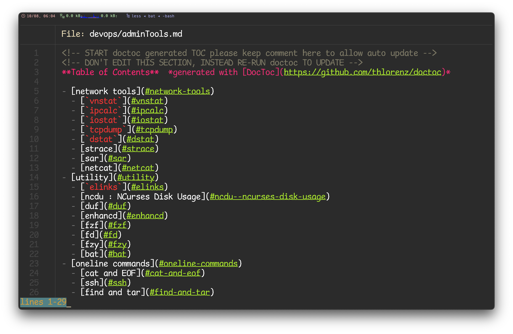
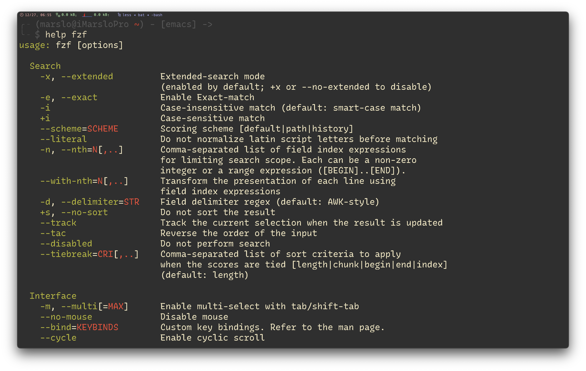
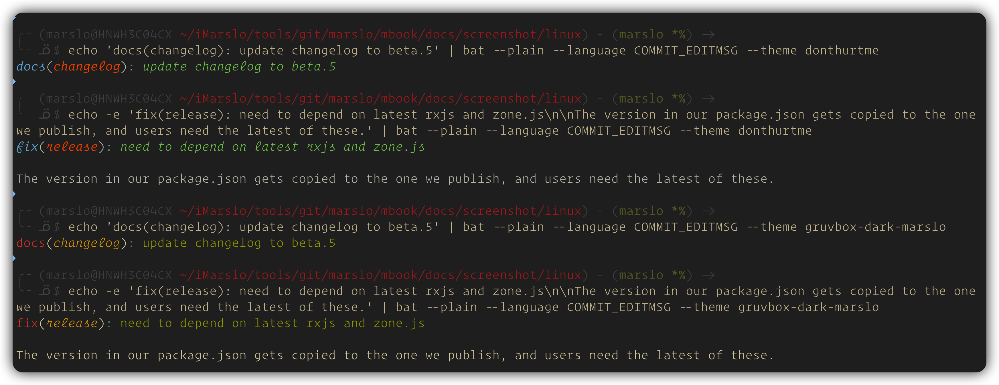

<!-- START doctoc generated TOC please keep comment here to allow auto update -->
<!-- DON'T EDIT THIS SECTION, INSTEAD RE-RUN doctoc TO UPDATE -->

- [bat](#bat)
  - [install](#install)
    - [completion](#completion)
  - [usage](#usage)
  - [tips](#tips)
  - [config](#config)
    - [tmTheme](#tmtheme)
    - [syntaxes](#syntaxes)

<!-- END doctoc generated TOC please keep comment here to allow auto update -->


# [bat](https://github.com/sharkdp/bat)

> [!NOTE|label:references:]
> - [bat-extra](https://github.com/eth-p/bat-extras/blob/master/README.md#installation)
> - [Install and Use the Linux bat Command](https://www.linode.com/docs/guides/how-to-install-and-use-the-bat-command-on-linux/)
> - [Using vim as a man-page viewer under Unix](https://vim.fandom.com/wiki/Using_vim_as_a_man-page_viewer_under_Unix)
>   - `unset PAGER`
> - [CentOS 7 - Installing the latest bat command release version from GitHub](https://github.com/sharkdp/bat/issues/325#issuecomment-697947031)



## install

```bash
# osx
$ brew install bat
## extra
$ brew install bat-extras

# ubuntu
$ sudo apt install bat -y
$ ln -s /usr/bin/batcat ~/.marslo/bin/bat

# centos
$ dnf install bat
## extra
$ sudo dnf install dnf-plugins-core
$ sudo dnf copr enable awood/bat-extras
$ sudo dnf install bat-extras

# ubuntu latest version
$ sudo apt instal -y https://github.com/sharkdp/bat/releases/download/v0.23.0/bat-musl_0.23.0_amd64.deb
$ ln -s /usr/bin/batcat ~/.marslo/bin/bat

# from release package
$ curl -fsSL https://github.com/sharkdp/bat/releases/download/v0.23.0/bat-v0.23.0-x86_64-unknown-linux-musl.tar.gz |
       tar xzf - -C ${iRCHOME}/utils/bat-v0.23.0
$ ln -sf ${iRCHOME}/utils/bat-v0.23.0/bat ${iRCHOME}/bin/bat
# or
$ V=$(curl --silent "https://api.github.com/repos/sharkdp/bat/releases/latest" | grep -Eo '"tag_name": "v(.*)"' | sed -E 's/.*"([^"]+)".*/\1/') &&
    curl -sOL "https://github.com/sharkdp/bat/releases/download/$V/bat-$V-x86_64-unknown-linux-musl.tar.gz" &&
    tar xzvf "bat-$V-x86_64-unknown-linux-musl.tar.gz" -C . &&
    sudo sh -c "cp ./bat-$V-x86_64-unknown-linux-musl/bat /usr/local/bin/bat" &&
    rm bat-$V-x86_64-unknown-linux-musl.tar.gz &&
    unset V

# from source
$ git clone git@github.com:sharkdp/bat.git && cd bat
$ git submodule update -f --init --recursive
# or
$ git clone --recurse-submodules git@github.com:sharkdp/bat.git && cd bat

$ cargo install --locked bat

# build a bat binary with modified syntaxes and themes
$ bash assets/create.sh
$ cargo install --path . --locked --force
```

### completion


```bash
# -- recommended --
$ type -P bat >/dev/null && eval "$(bat --completion bash)"

# -- others --
$ sed 's/{{PROJECT_EXECUTABLE}}/bat/'                                     "${iRCHOME}/utils/bat/assets/completions/bat.bash.in" | sudo tee /etc/bash_completion.d/bat
# or
$ sed 's/{{PROJECT_EXECUTABLE}}/-o nosort -o bashdefault -o default bat/' "${iRCHOME}/utils/bat/assets/completions/bat.bash.in" | sudo tee /etc/bash_completion.d/bat

# or
$ sed 's/{{PROJECT_EXECUTABLE}}/bat/'                                     -i "${iRCHOME}/utils/bat/assets/completions/bat.bash.in"
$ sed 's/{{PROJECT_EXECUTABLE}}/-o nosort -o bashdefault -o default bat/' -i "${iRCHOME}/utils/bat/assets/completions/bat.bash.in"
$ sudo ln -sf "${iRCHOME}/utils/bat/assets/completions/bat.bash.in" /usr/share/bash-completion/completions/bat

# or without modify `bat.bash.in` and add complete into bashrc
$ sudo ln -sf "${iRCHOME}/utils/bat/assets/completions/bat.bash.in" /usr/share/bash-completion/completions/bat
$ echo 'type -t _bat >/dev/null 2>&1 && complete -F _bat -o nosort -o bashdefault -o default bat' >> ~/.bashrc
```



## usage
- `help()`
  ```bash
  # in your .bashrc/.zshrc/*rc
  alias bathelp='bat --plain --language=help'
  help() { "$@" --help 2>&1 | bathelp }

  # calling in bash:
  $ help bat
  ```

  

  - for zsh
    ```bash
    $ alias -g -- -h='-h 2>&1 | bat --language=help --style=plain'
    $ alias -g -- --help='--help 2>&1 | bat --language=help --style=plain'
    ```

- [cygwin path issue](https://github.com/sharkdp/bat?tab=readme-ov-file#cygwin)
  ```bash
  bat() {
    local index
    local args=("$@")
    for index in $(seq 0 ${#args[@]}) ; do
      case "${args[index]}" in
        -* ) continue;;
         * ) [ -e "${args[index]}" ] && args[index]="$(cygpath --windows "${args[index]}") ";;
      esac
    done
    command bat "${args[@]}"
  }
  ```

## tips

- manpages themes
  ```bash
  $ bat --list-themes |
    fzf --preview="man git-checkout | sed -r 's/\x1B\[(([0-9]+)(;[0-9]+)*)?[mGKHfJ]//g' | bat --theme={} --color=always --plain --language=help" \
        --height 100% \
        --preview-window=up,85%,nofollow \
        --preview-label-pos='bottom'
  ```

- script themes
  ```bash
  $ bat --list-themes |
    fzf --preview="bat --theme={} --color=always /path/to/script" \
        --height 100% \
        --preview-window=up,85%,nofollow \
        --preview-label-pos='bottom'
  ```

## config
- [config-file](https://github.com/sharkdp/bat#format)
  ```bash
  $ bat --config-file
  /Users/marslo/.config/bat/config

  # if need modify
  $ export BAT_CONFIG_PATH="$(bat --config-file)"

  # generate standard config-file
  $ bat --generate-config-file
  Success! Config file written to /Users/marslo/.config/bat/config
  ```

- sample content
  ```bash
  $ bat $(bat --config-file) | sed -r '/^(#.*)$/d;/^\s*$/d'  | bat --language ini
         STDIN
     1   --theme="gruvbox-dark"
     2   --style="numbers,changes,header"
     3   --italic-text=always
     4   --pager="less --RAW-CONTROL-CHARS --quit-if-one-screen --mouse"
     5   --map-syntax "*.ino:C++"
     6   --map-syntax ".ignore:Git Ignore"
     7   --map-syntax='*.conf:INI'
     8   --map-syntax='/etc/apache2/**/*.conf:Apache Conf'
  ```

### tmTheme

```bash
# list themes
$ bat --list-themes

# modify them
$ export BAT_THEME='gruvbox-dark'
# or
$ echo '--theme="gruvbox-dark"' >> $(bat --config-file)
```

- [new theme](https://github.com/sharkdp/bat/blob/master/README.md#adding-new-themes)
  ```bash
  $ mkdir -p "$(bat --config-dir)/themes"
  $ cd "$(bat --config-dir)/themes"

  # download a theme in '.tmtheme' format, for example:
  $ git clone https://github.com/greggb/sublime-snazzy

  # update the binary cache
  $ bat cache --build
  ```

### syntaxes

```bash
# for commit message
$ curl -fsSL --create-dirs \
       -o $(bat --config-dir)/syntaxes/ConventionalCommits.sublime-syntax \
       https://github.com/marslo/dotfiles/raw/main/.config/bat/syntaxes/ConventionalCommits.sublime-syntax

# rebuild cache
$ bat cache --build

# verify
$ echo 'docs(changelog): update changelog to beta.5' |
  bat --plain --language COMMIT_EDITMSG --theme gruvbox-dark-marslo
```


