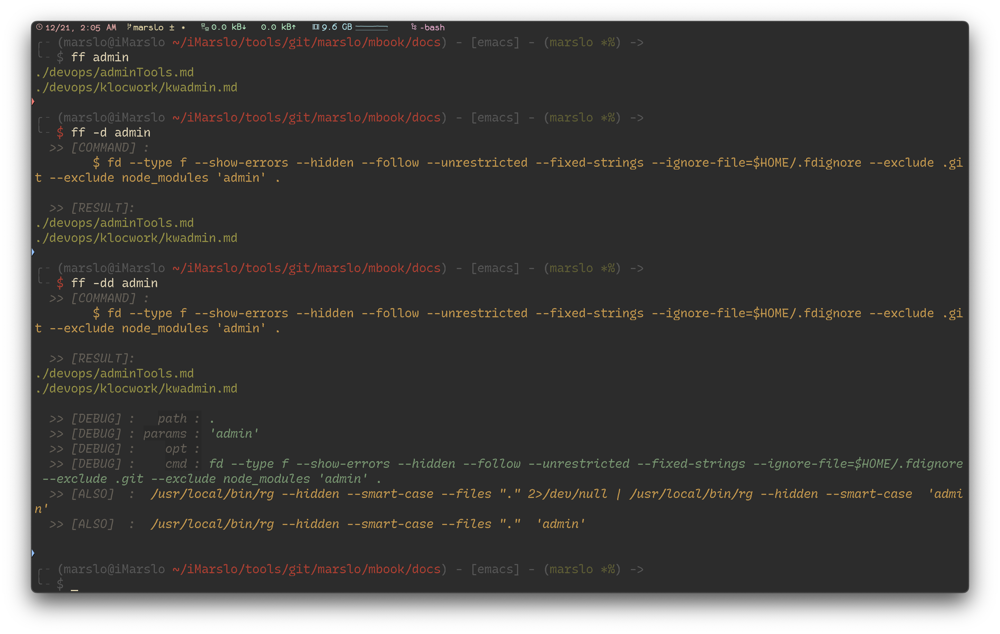
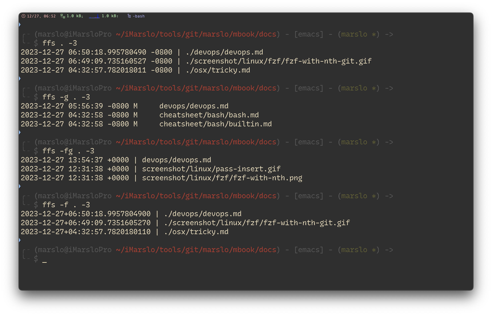

<!-- START doctoc generated TOC please keep comment here to allow auto update -->
<!-- DON'T EDIT THIS SECTION, INSTEAD RE-RUN doctoc TO UPDATE -->

- [install](#install)
  - [from source](#from-source)
- [advanced usage](#advanced-usage)
- [search for multiple pattern](#search-for-multiple-pattern)

<!-- END doctoc generated TOC please keep comment here to allow auto update -->

> [!NOTE|label:references:]
> - [fd](https://github.com/sharkdp/fd)
> - [Find Files With the fd Command](https://www.linode.com/docs/guides/finding-files-with-fd-command/)
> - [How to Use the fd Command on Linux](https://www.howtogeek.com/682244/how-to-use-the-fd-command-on-linux/)
> - [How to Find Files with fd Command in Linux](https://www.atlantic.net/vps-hosting/how-to-find-files-with-fd-command-in-linux/)
> - [Fd – The Best Alternative to ‘Find’ Command for Quick File Searching](https://www.tecmint.com/fd-alternative-to-find-command/)
> - [File list of package fd-find in noble of architecture amd64](https://packages.ubuntu.com/noble/amd64/fd-find/filelist)
> - [Download Page for fd-find_9.0.0-1_amd64.deb on AMD64 machines](https://packages.ubuntu.com/noble/amd64/fd-find/download)

##  install
```bash
# osx
$ brew install fd
$ type -P fd >/dev/null && eval "$(fd --gen-completions bash)"
# -- or --
$ fd --gen-completions bash | sudo tee $(brew --prefix)/etc/bash_completion.d/fd
# -- or --
$ ln -sf $(brew --prefix fd)/share/bash-completion/completions/fd $(brew --prefix)/etc/bash_completion.d/fd
# or - v9.0.0
$ ln -sf $(brew --prefix fd)/share/bash-completion/completions/fd "$(brew --prefix)"/etc/bash_completion.d/fd

# debine
$ sudo apt install fd-find                  # ubuntu 22.04 : fd 8.3.1
$ curl -fsSL -O http://ftp.osuosl.org/pub/ubuntu/pool/universe/r/rust-fd-find/fd-find_9.0.0-1_amd64.deb
$ sudo dpkg -i fd-find_9.0.0-1_amd64.deb    # ubuntu any: fd 9.0.0
$ ln -s $(which fdfind) ~/.local/bin/fd
$ export PATH=~/.local:$PATH

# centos
$ sudo dnf install fd-find
```

### from source

> [!NOTE|label:references:]
> - install rust via
>   ```bash
>   $ curl --proto '=https' --tlsv1.2 -sSf https://sh.rustup.rs | sh
>   $ source "$HOME/.cargo/env"
>   $ cargo --version
>   cargo 1.74.1 (ecb9851af 2023-10-18)
>   ```
>
> - [generate auto-completion](https://github.com/sharkdp/fd/blob/master/Makefile)
>
> |    SHELL   | COMMAND                           |
> |:----------:|-----------------------------------|
> |    bash    | `fd --gen-completions bash`       |
> |    fish    | `fd --gen-completions fish`       |
> |     zsh    | `fd --gen-completions zsh`        |
> |   elvsih   | `fd --gen-completions elvish`     |
> | powershell | `fd --gen-completions powershell` |

```bash
$ git clone https://github.com/sharkdp/fd && cd fd

# osx
$ brew install rust
$ cargo install amethyst_tools
# wsl/ubuntu
$ sudo apt install cargo

$ cargo build                     # build
$ cargo test                      # run unit tests and integration tests
$ cargo install --debug --path .  # install in osx
$ cargo install --path .          # install in ubuntu/wsl
$ ln -sf /home/marslo/.cargo/bin/fd /home/marslo/.local/bin/fd

# completion ( >= 9.0.0 )
# wsl/ubuntu/centos
$ fd --gen-completions bash | sudo tee /usr/share/bash-completion/completions/fd
# or centos
$ fd --gen-completions bash | sudo tee /etc/bash_completion.d/fd
# osx
$ fd --gen-completions bash | sudo tee $(brew --prefix)/etc/bash_completion.d/fd
```

- verify
  ```bash
  $ fd --version
  fd 9.0.0
  ```

- usage
  ```bash
  $ fd --hidden ^.env$
  .env

  $ fd --type f --strip-cwd-prefix --hidden --follow --exclude .git --exclude node_modules ifunc
  bin/ifunc.sh
  ```

## advanced usage
- crontab for delete '*\.DS_*'
  ```bash
  $ "$(type -P fd)" -IH --glob '*\.DS_*' $HOME | xargs -r -i rm '{}'
  # or
  $ "$(type -P fd)" -Iu --glob '*\.DS_*' $HOME | xargs -r -i rm '{}'
  # or
  $ "$(type -P fd)" --type f --hidden --follow --unrestricted --color=never --exclude .Trash --glob '*\.DS_*' $HOME  | xargs -r -i rm '{}'
  ```

- [`ff`](https://github.com/marslo/mylinux/raw/master/confs/home/.marslo/bin/ff)

  

- `ffs`
  ```bash
  # [f]ind [f]ile and [s]ort
  function ffs() {
    local opt=''
    while [[ $# -gt 0 ]]; do
      case "$1" in
            -g ) opt+="$1 "   ; shift   ;;
           -fg ) opt+="$1 "   ; shift   ;;
            -f ) opt+="$1 "   ; shift   ;;
           --* ) opt+="$1 $2 "; shift 2 ;;
            -* ) opt+="$1 "   ; shift   ;;
             * ) break                  ;;
      esac
    done

    local path=${1:-~/.marslo}
    local num=${2:-10}
    num=${num//-/}
    local depth=${3:-}
    depth=${depth//-/}
    local option='--type f'

    if [[ "${opt}" =~ '-g ' ]]; then
      # git show --name-only --pretty="format:" -"${num}" | awk 'NF' | sort -u
      # references: https://stackoverflow.com/a/54677384/2940319
      git log --date=iso-local --first-parent --pretty=%cd --name-status --relative |
          awk 'NF==1{date=$1}NF>1 && !seen[$2]++{print date,$0}' FS=$'\t' |
          head -"${num}"
    elif [[ "${opt}" =~ '-fg ' ]]; then
      # references: https://stackoverflow.com/a/63864280/2940319
      git ls-tree -r --name-only HEAD -z |
          TZ=PDT xargs -0 -I_ git --no-pager log -1 --date=iso-local --format="%ad | _" -- _ |
          sort -r |
          head -"${num}"
    elif [[ "${opt}" =~ '-f ' ]]; then
      option=${option: 1}
      [[ -n "${depth}" ]] && option="-maxdepth ${depth} ${option}"
      # shellcheck disable=SC2086
      find "${path}" ${option} \
                     -not -path '*/\.git/*' \
                     -not -path '*/node_modules/*' \
                     -not -path '*/go/pkg/*' \
                     -not -path '*/git/git*/*' \
                     -not -path '*/.marslo/utils/*' \
                     -not -path '*/.marslo/.completion/*' \
                     -printf "%10T+ | %p\n" |
      sort -r |
      head -"${num}"
    else
      if [[ "${opt}}" =~ .*-t.* ]] || [[ "${opt}" =~ .*--type.* ]]; then
        option="${option//--type\ f/}"
      fi
      option="${opt} ${option} --hidden --follow --unrestricted --ignore-file ~/.fdignore"
      [[ -n "${depth}"    ]] && option="--max-depth ${depth} ${option}"
      [[ '.' != "${path}" ]] && option="${path} ${option}"
      # shellcheck disable=SC2086,SC2027
      eval """ fd . "${option}" --exec stat --printf='%y | %n\n' | sort -r | head -"${num}" """
    fi
  }
  ```

  

## search for multiple pattern

> [!NOTE]
> - [#1139 add support for matching multiple patterns](https://github.com/sharkdp/fd/pull/1139#issuecomment-1297725086)
> - [#315 Finding multiple patterns](https://github.com/sharkdp/fd/issues/315#issuecomment-841869872)

```bash
$ fd --unrestricted '^*\.(png|gif|jpg)$'
$ fd --unrestricted --extension png --extension jpg --extension gif
```
