<!-- START doctoc generated TOC please keep comment here to allow auto update -->
<!-- DON'T EDIT THIS SECTION, INSTEAD RE-RUN doctoc TO UPDATE -->

- [install](#install)
- [shortcuts](#shortcuts)
  - [action and select](#action-and-select)
  - [movement](#movement)
  - [ctrl-t](#ctrl-t)
- [usage](#usage)
  - [magic vim](#magic-vim)
  - [smart vimdiff](#smart-vimdiff)
  - [smart cat](#smart-cat)
  - [smart copy](#smart-copy)
  - [smart open](#smart-open)
  - [others](#others)
- [advanced usage](#advanced-usage)
  - [command fill](#command-fill)
  - [venv selector](#venv-selector)
  - [chrome](#chrome)
  - [man page](#man-page)
  - [git alias](#git-alias)
  - [environment](#environment)
  - [process](#process)
  - [kubectl](#kubectl)
  - [homebrew](#homebrew)
- [fancy usage](#fancy-usage)
  - [resize](#resize)
  - [fzf environment](#fzf-environment)
  - [fzf-preview.sh](#fzf-previewsh)
  - [git](#git)
  - [lolcat](#lolcat)
- [config](#config)
  - [`ctrl-r`](#ctrl-r)
  - [`ctrl-t`](#ctrl-t)
  - [theme](#theme)
- [tips](#tips)
- [fzf with git](#fzf-with-git)

<!-- END doctoc generated TOC please keep comment here to allow auto update -->


> - fuzzy completion in bash
>   - `$ cat **<tab>`
>   - `$ unset **<tab>`
>   - `$ unalias **<tab>`
>   - `$ export **<tab>`
>   - `$ ssh **<tab>`
>   - `$ kill -9 **<tab>`
> - [fzf](https://github.com/junegunn/fzf)


> [!NOTE|label:references:]
> - [* fzf - FuZzy Finder Tutorial](https://www.youtube.com/watch?v=tB-AgxzBmH8)
>   - [Examples (completion)](https://github.com/junegunn/fzf/wiki/Examples-(completion))
>   - [Examples (vim)](https://github.com/junegunn/fzf/wiki/Examples-(vim))
>   - [On MacVim with iTerm2](https://github.com/junegunn/fzf/wiki/On-MacVim-with-iTerm2)
> - [* junegunn/fzf](https://github.com/junegunn/fzf)
>   - [fzf wiki](https://github.com/junegunn/fzf/wiki)
>   - [fzf screencasts by gotbletu](https://www.youtube.com/playlist?list=PLqv94xWU9zZ2fMsMMDF4PjtNHCeBFbggD)
>   - [junegunn/fzf-git.sh](https://github.com/junegunn/fzf-git.sh)
>   - fzf basics:
>     - [layout](https://qmacro.org/blog/posts/2021/02/02/fzf-the-basics-part-1-layout/)
>     - [search results](https://qmacro.org/blog/posts/2021/02/07/fzf-the-basics-part-2-search-results/)
>   - [examples](https://github.com/junegunn/fzf/wiki/examples)
>     - [Man pages](https://github.com/junegunn/fzf/wiki/Examples#man-pages)
>     - [Git](https://github.com/junegunn/fzf/wiki/Examples#git)
>   - [Advanced fzf examples](https://github.com/junegunn/fzf/blob/master/ADVANCED.md) | [Advanced fzf examples](https://fossies.org/linux/fzf/ADVANCED.md)
> - usage
>   - [** A Practical Guide to fzf: Building a File Explorer](https://thevaluable.dev/practical-guide-fzf-example/)
>   - [* Find anything you need with fzf, the Linux fuzzy finder tool](https://www.redhat.com/sysadmin/fzf-linux-fuzzy-finder)
>   - [* Improving shell workflows with fzf](https://seb.jambor.dev/posts/improving-shell-workflows-with-fzf/)
>   - [Introduction to fzf command](https://www.baeldung.com/linux/fzf-command)
>   - [Why you should be using fzf, the command line fuzzy finder](https://www.freecodecamp.org/news/fzf-a-command-line-fuzzy-finder-missing-demo-a7de312403ff/)
>   - [Linux下搜索神器fzf的配置和使用](https://blog.csdn.net/qq_39852676/article/details/126820806)
>   - [serenevoid/fzf_config.md](https://gist.github.com/serenevoid/13239752cfa41a75a69446b7beb26d7a)
>   - [4 Useful fzf Tricks for Your Terminal](https://pragmaticpineapple.com/four-useful-fzf-tricks-for-your-terminal/)
>   - [Day 18 - Awesome command-line fuzzy finding with fzf](https://sysadvent.blogspot.com/2017/12/day-18-awesome-command-line-fuzzy.html)
> - more tools
>   - [ggVGc/fzf_browser](https://github.com/ggVGc/fzf_browser/tree/master)
>   - [garybernhardt/selecta](https://github.com/garybernhardt/selecta)
>   - [scripts/rgfzf](https://github.com/naggie/dotfiles/blob/master/include/scripts/rgfzf)
> - vim
>   - [Improving Vim Workflow With fzf](https://pragmaticpineapple.com/improving-vim-workflow-with-fzf/)
>   - [* How to search faster in Vim with FZF.vim](https://dev.to/iggredible/how-to-search-faster-in-vim-with-fzf-vim-36ko)
>   - [* How FZF and ripgrep improved my workflow](https://sidneyliebrand.medium.com/how-fzf-and-ripgrep-improved-my-workflow-61c7ca212861) | [SidOfc/vim-rg-outdated-command.vim](https://gist.github.com/SidOfc/ba43acade7f4a1bf9faf57d16b33616a#file-vim-rg-outdated-command-vim)
>     ```vim
>     " fzf.vim now supports this command out of the box
>     " so this code is no longer needed.
>     command! -bang -nargs=* Rg
>       \ call fzf#vim#grep(
>       \   'rg --column --line-number --hidden --ignore-case --no-heading --color=always '.shellescape(<q-args>), 1,
>       \   <bang>0 ? fzf#vim#with_preview({'options': '--delimiter : --nth 4..'}, 'up:60%')
>       \           : fzf#vim#with_preview({'options': '--delimiter : --nth 4..'}, 'right:50%:hidden', '?'),
>       \   <bang>0)
>     ```
> - customize
>   - [* fzf wiki: color themes](https://github.com/junegunn/fzf/wiki/Color-schemes)
>   - [* fzf-color-theme.css](./fzf-color-theme.css)
>   - [#692 Custom selected character](https://github.com/junegunn/fzf/issues/692)

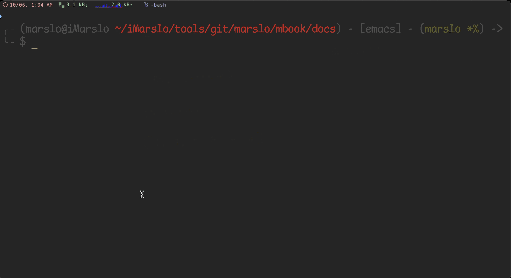

## install

> [!NOTE|label:references:]
> - [FZF_DEFAULT_OPTS](https://github.com/junegunn/fzf/issues/3053#issuecomment-1330285106)
> - [fzf-color-theme.css](./fzf-color-theme.css)

```bash
$ brew install fzf fd
$ type -P fzf >/dev/null && eval "$(command fzf --bash)"
# -- or --
$ ln -sf $(brew --prefix fd)/share/bash-completion/completions/fd "$(brew --prefix)"/etc/bash_completion.d/fd

# linux
$ DOWNLOAD_URL="$(curl -fsSL https://api.github.com/repos/junegunn/fzf/releases/latest | jq --arg pattern "linux_$(dpkg --print-architecture)" -r '.assets[] | select(.name | contains($pattern)) | .browser_download_url')"
$ curl -fsSL "${DOWNLOAD_URL}" | sudo tar xz -C /usr/local/bin/ fzf
$ sudo chmod +x /usr/local/bin/fzf
$ command fzf --bash > /usr/share/bash-completion/completions/fzf
$ sudo apt install fd
# -- cleanup --
$ rm -rf /tmp/fzf.tar.gz
```

```bash
# config
FZF_DEFAULT_OPTS="${FZF_DEFAULT_OPTS:+$FZF_DEFAULT_OPTS} "
FZF_DEFAULT_OPTS+="--height 35% --min-height 8+ "             # https://github.com/junegunn/fzf/issues/4226
FZF_DEFAULT_OPTS+="--layout=reverse --multi --cycle --ansi --gutter ' ' "
FZF_DEFAULT_OPTS+="--marker='󱍢 ' --pointer='▌' "
FZF_DEFAULT_OPTS+="--prompt='󰩀 ' --info='inline: 󰨿 ' "
FZF_DEFAULT_OPTS+="--info-command='printf \"\x1b[33;1m%s\x1b[m ~ %s\" \"\$FZF_POS\" \"\$FZF_INFO\"' "
FZF_DEFAULT_OPTS+="--bind 'ctrl-s:select-all,ctrl-d:deselect-all,ctrl-t:toggle-all' "
FZF_DEFAULT_OPTS+="--bind 'ctrl-y:execute-silent(/bin/echo -n {+} | ${COPY})' "
FZF_DEFAULT_OPTS+="--color=gutter:0,bg+:-1,query:italic,spinner:#e6db74,prompt:#404945,header:italic:#504945,info:#928374,pointer:#A66584,marker:#d79921,fg:#ebdbb2:dim,fg+:#A7A44E:regular,hl:#845069:italic,hl+:#A66584:bold:italic"

FZF_DEFAULT_COMMAND="fd --type f "
FZF_DEFAULT_COMMAND+="--strip-cwd-prefix "
FZF_DEFAULT_COMMAND+="--hidden "
FZF_DEFAULT_COMMAND+="--follow "
FZF_DEFAULT_COMMAND+="--exclude .git --exclude node_modules"

export FZF_DEFAULT_OPTS FZF_DEFAULT_COMMAND
```

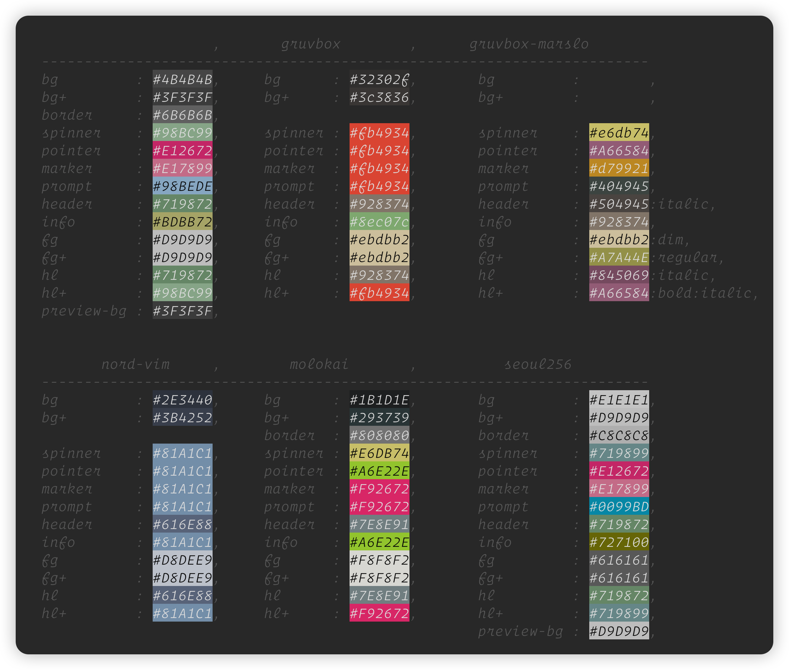

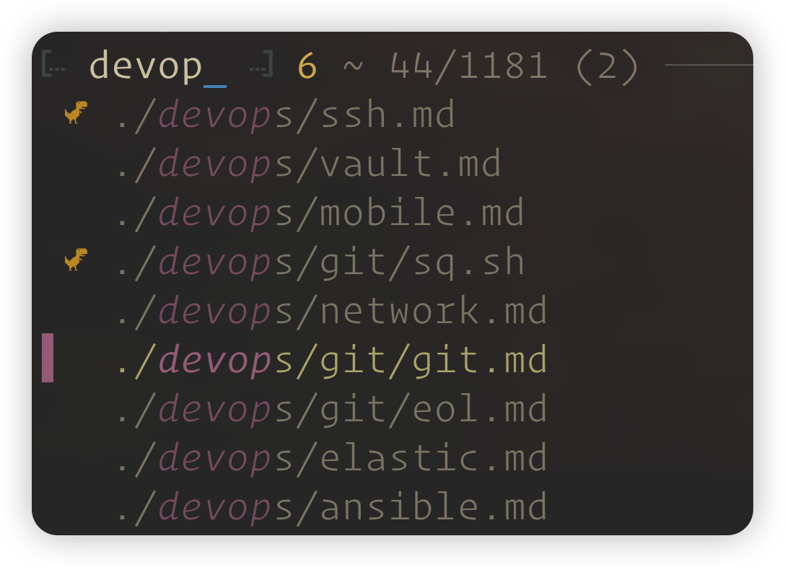

| NAME    | VALUE                                       |
|---------|---------------------------------------------|
| pointer | `▏`, `▕`, `┃`, `▎`, `▌`, `▊`, `▉`, `▒`, `ⵗ` |

```bash
# -- or --
FZF_DEFAULT_OPTS+="--prompt='󰝗 ' --info='inline: 󰉾 ' "

# -- or --
FZF_DEFAULT_OPTS+="--prompt='ᑹ ∷ ' "
# or
FZF_DEFAULT_OPTS+="--prompt='󰊠 ' "

# -- or --
FZF_DEFAULT_OPTS+='--style full --layout reverse '
FZF_DEFAULT_OPTS+='--header-lines-border bottom --no-list-border '

# -- or --
FZF_DEFAULT_OPTS+="--no-bold "

# -- or --
FZF_DEFAULT_OPTS+="--color=fg+:#ebdbb2,pointer:#e6db74,hl+:#fb4934,prompt:#334D35"
```

<!--sec data-title="older version of FZF environment variable" data-id="section0" data-show=true data-collapse=true ces-->
```bash
FZF_DEFAULT_OPTS="--height 35%"
FZF_DEFAULT_OPTS+=" --layout=reverse"
FZF_DEFAULT_OPTS+=" --pointer='→' --marker='» ' --prompt='$ '"
FZF_DEFAULT_OPTS+=" --multi"
FZF_DEFAULT_OPTS+=" --inline-info"
FZF_DEFAULT_OPTS+=" --color=spinner:#e6db74,hl:#928374,fg:#ebdbb2,header:#928374,info:#504945,pointer:#98971a,marker:#d79921,fg+:#ebdbb2,prompt:#404945,hl+:#fb4934"

FZF_DEFAULT_COMMAND="fd --type f"
FZF_DEFAULT_COMMAND+=" --strip-cwd-prefix"
FZF_DEFAULT_COMMAND+=" --hidden"
FZF_DEFAULT_COMMAND+=" --follow"
FZF_DEFAULT_COMMAND+=" --exclude .git --exclude node_modules"
```
<!--endsec-->

- install from source code for wsl

  > [!NOTE|label:this solution for install latest fzf in wsl]
  > - in wsl Ubuntu, the fzf version is `0.29`
  >   ```bash
  >   $ sudo apt search fzf
  >   Sorting... Done
  >   Full Text Search... Done
  >   fzf/jammy 0.29.0-1 amd64
  >     general-purpose command-line fuzzy finder
  >   ```
  > - [* Fzf – A Quick Fuzzy File Search from Linux Terminal](https://www.tecmint.com/fzf-fuzzy-file-search-from-linux-terminal/)

  ```bash
  $ git clone git@github.com:junegunn/fzf.git
  $ bash -x install --all
  $ sudo cp bin/fzf* /usr/local/bin/
  ```

- offline install

  > [!NOTE]
  > - `curl: (60) SSL certificate problem: self-signed certificate in certificate chain`:
  >   ```bash
  >   $ curl -fL https://github.com/junegunn/fzf/releases/download/0.44.1/fzf-0.44.1-linux_amd64.tar.gz
  >   curl: (60) SSL certificate problem: self-signed certificate in certificate chain
  >   More details here: https://curl.se/docs/sslcerts.html
  >
  >   curl failed to verify the legitimacy of the server and therefore could not
  >   establish a secure connection to it. To learn more about this situation and
  >   how to fix it, please visit the web page mentioned above.
  >   ```
  > - [How to fix curl: (60) SSL certificate: Invalid certificate chain](https://stackoverflow.com/a/46843526/2940319)

  - `~/.curlrc`
    ```bash
    $ echo '--insecure' >> ~/.curlrc
    ```

  - offline installation
    ```bash
    ################ for offline installation only ################
    # check current version for offline installation
    $ uname -sm
    Linux x86_64

    # download correct package according https://github.com/junegunn/fzf/blob/master/install#L170
    # i.e.: Linux x86_64 -> fzf-$version-linux_amd64.tar.gz
    $ cp fzf-0.42.0-linux_amd64.tar.gz /tmp/fzf.tar.gz

    # modify install script `try_curl` function to not download but use local tar.gz directly
    $ cat << 'EOF' | git apply --inaccurate-eof --ignore-whitespace
    diff --git a/install b/install
    index 5ac191b..342bc49 100755
    --- a/install
    +++ b/install
    @@ -115,10 +115,8 @@ link_fzf_in_path() {
    try_curl() {
     command -v curl > /dev/null &&
     if [[ $1 =~ tar.gz$ ]]; then
    -    curl -fL $1 | tar -xzf -
    -  else
    -    local temp=${TMPDIR:-/tmp}/fzf.zip
    -    curl -fLo "$temp" $1 && unzip -o "$temp" && rm -f "$temp"
    +    local temp=${TMPDIR:-/tmp}/fzf.tar.gz
    +    tar -xzf "$temp" && rm -rf "$temp"
     fi
    }
    EOF

    ### or modify manually ###
    # try_curl() {
    #   command -v curl > /dev/null &&
    #   if [[ $1 =~ tar.gz$ ]]; then
    #     local temp=${TMPDIR:-/tmp}/fzf.tar.gz
    #     tar -xzf "$temp" && rm -rf "$temp"
    #   fi
    # }
    ################ for offline installation only ################
    ```

## shortcuts

> [!NOTE|label:references:]
> - [Using the finder](https://github.com/junegunn/fzf#using-the-finder)
> - [multiple select](https://github.com/junegunn/fzf.vim/issues/40#issuecomment-156037468)
>   - enable via : `--multi` or `-m`
>   - disable via : `--no-multi` or `+m`
> - [Customizing fzf Keybindings](https://thevaluable.dev/fzf-shell-integration/)
>
> | KEYSTROKE                    |   BASH FUNCTION   |     ZSH FUNCTION     | ENVIRONMENT VARIABLE |
> |------------------------------|:-----------------:|:--------------------:|----------------------|
> | <kbd>CTRL</kbd>-<kbd>t</kbd> |  `__fzf_select__` |       `__fsel`       | `FZF_CTRL_T_COMMAND` |
> | <kbd>CTRL</kbd>-<kbd>r</kbd> | `__fzf_history__` | `fzf-history-widget` | `FZF_CTRL_R_OPTS`    |
> | <kbd>ALT</kbd>-<kbd>c</kbd>  |    `__fzf_cd__`   |    `fzf-cd-widget`   | `FZF_ALT_C_COMMAND`  |

### action and select
<div style="margin-left: 1.5em;">
  <table>
  <thead>
    <tr>
      <th style="text-align:center;vertical-align:middle">OPEN</th>
      <th style="text-align:center;vertical-align:middle">SELECT ALL</th>
      <th style="text-align:center;vertical-align:middle">DESELECT ALL</th>
      <th style="text-align:center;vertical-align:middle">TOGGLE ALL</th>
      <th style="text-align:center;vertical-align:middle">MULTIPLE SELECT</th>
    </tr>
  </thead>
  <tbody>
    <tr>
      <td style="text-align:center; vertical-align:middle" rowspan="2"><kbd>⏎</kbd></td>
      <td style="text-align:center; vertical-align:middle" rowspan="2"><kbd>ctrl</kbd> + <kbd>s</kbd></td>
      <td style="text-align:center; vertical-align:middle" rowspan="2"><kbd>ctrl</kbd> + <kbd>d</kbd></td>
      <td style="text-align:center; vertical-align:middle" rowspan="2"><kbd>ctrl</kbd> + <kbd>t</kbd></td>
      <td style="text-align:center"><kbd>⇥</kbd></td>
    </tr>
    <tr>
      <td style="text-align:center"><kbd>shift</kbd> + <kbd>⇥</kbd></td>
    </tr>
  </tbody>
  </table>
</div>

### movement
<div style="margin-left: 1.5em;">
  <table>
  <thead>
    <tr>
      <th style="text-align:center;vertical-align:middle">PREVIOUS</th>
      <th style="text-align:center;vertical-align:middle">NEXT</th>
      <th style="text-align:center;vertical-align:middle">MULTIPLE SELECT</th>
    </tr>
  </thead>
  <tbody>
    <tr>
      <td style="text-align:center;"><kbd>↑</kbd></td>
      <td style="text-align:center;"><kbd>↓</kbd></td>
      <td style="text-align:center; vertical-align:middle" rowspan="2"><kbd>⇥</kbd></td>
    </tr>
    <tr>
      <td style="text-align:center;"><kbd>ctrl</kbd> + <kbd>k</kbd></td>
      <td style="text-align:center;"><kbd>ctrl</kbd> + <kbd>j</kbd></td>
    </tr>
    <tr>
      <td style="text-align:center;"><kbd>ctrl</kbd> + <kbd>p</kbd></td>
      <td style="text-align:center;"><kbd>ctrl</kbd> + <kbd>n</kbd></td>
      <td style="text-align:center; vertical-align:middle" rowspan="2"><kbd>shift</kbd> + <kbd>⇥</kbd></td>
    </tr>
    <tr>
      <td style="text-align:center;"><kbd>ctrl</kbd> + <kbd>k</kbd></td>
      <td style="text-align:center;"><kbd>ctrl</kbd> + <kbd>j</kbd></td>
    </tr>
  </tbody>
  </table>
</div>

### ctrl-t

> [!TIP]
> - customized shortcut key via:
>   ```bash
>   export FZF_CTRL_T_OPTS="${FZF_CTRL_T_OPTS} --bind 'ctrl-p:preview-up,ctrl-n:preview-down'"
>   export FZF_CTRL_T_OPTS="${FZF_CTRL_T_OPTS} --bind 'ctrl-/:change-preview-window(down|hidden|)'"
>   ```
> - [#358: Keyboard bindings for scrolling preview window?](https://github.com/junegunn/fzf.vim/issues/358#issuecomment-769589975)
> - [#211: Scroll inside preview?](https://github.com/junegunn/fzf.vim/issues/211)

- file list:
  <div style="margin-left: 1.5em;">
    <table>
    <thead>
      <tr>
        <th style="text-align:center;vertical-align:middle">PREVIOUS</th>
        <th style="text-align:center;vertical-align:middle">NEXT</th>
        <th style="text-align:center;vertical-align:middle">CHANGE PREVIEW WINDOWS</th>
      </tr>
    </thead>
    <tbody>
      <tr>
        <td style="text-align:center;"><kbd>↑</kbd></td>
        <td style="text-align:center;"><kbd>↓</kbd></td>
        <td style="text-align:center; vertical-align:middle" rowspan="3"><kbd>ctrl</kbd> + <kbd>/</kbd></td>
      </tr>
      <tr>
        <td style="text-align:center;"><kbd>ctrl</kbd> + <kbd>k</kbd></td>
        <td style="text-align:center;"><kbd>ctrl</kbd> + <kbd>j</kbd></td>
      </tr>
      <tr>
        <td style="text-align:center;"><kbd>ctrl</kbd> + <kbd>p</kbd></td>
        <td style="text-align:center;"><kbd>ctrl</kbd> + <kbd>n</kbd></td>
      </tr>
    </tbody>
    </table>
  </div>

- preview content:
  <div style="margin-left: 2.5em;">
    <table>
    <thead>
      <tr>
        <th style="text-align:center;vertical-align:middle">PREVIOUS</th>
        <th style="text-align:center;vertical-align:middle">NEXT</th>
      </tr>
    </thead>
    <tbody>
      <tr>
        <td style="text-align:center;"><kbd>shift</kbd> + <kbd>↑</kbd></td>
        <td style="text-align:center;"><kbd>shift</kbd> + <kbd>↓</kbd></td>
      </tr>
      <tr>
        <td style="text-align:center;"><kbd>ctrl</kbd> + <kbd>↑</kbd></td>
        <td style="text-align:center;"><kbd>ctrl</kbd> + <kbd>↓</kbd></td>
      </tr>
      <tr>
        <td style="text-align:center;"><kbd>ctrl</kbd> + <kbd>p</kbd></td>
        <td style="text-align:center;"><kbd>ctrl</kbd> + <kbd>n</kbd></td>
      </tr>
    </tbody>
    </table>
  </div>


## usage

> [!NOTE|label:references:]
> - [Advanced fzf examples](https://github.com/junegunn/fzf/blob/master/ADVANCED.md)
> - [Examples](https://github.com/junegunn/fzf/wiki/examples)

### magic vim

> [!TIP]
> - [v](https://github.com/junegunn/fzf/wiki/Examples#v)
> - [Opening files](https://github.com/junegunn/fzf/wiki/Examples#opening-files)

- [`vim()`](https://github.com/marslo/dotfiles/blob/main/.marslo/bin/ffunc.sh#L536-L583)

  <!--sec data-title="vim()" data-id="section2" data-show=true data-collapse=true ces-->
  ```bash
  # usage: eval "$( _load_fzf_context )"
  #        ... | fzf "${fzfopt[@]}"
  function _load_fzf_context() {
    local -a CAT=( "$(type -P cat)" )
    type -P bat >/dev/null && CAT=( "$(type -P bat)" --theme='Nord' --color=always --line-range :500 )
    local previewCmd="if file -bL --mime-encoding {} | grep -iq 'binary' && ! iconv -f utf-8 -t utf-8 {} >/dev/null 2>&1; then file -bL {}; else ${CAT[*]} {}; fi"
    local -a fzfopt=( --exit-0
                      --height 50%
                      --multi --cycle
                      --preview "${previewCmd}"
                      --preview-window 'right,60%,nowrap,rounded,+15'
                      --bind 'ctrl-/:toggle-preview'
                      --bind='ctrl-o:execute(bat {} > /dev/tty)'
                    )
    typeset -p fzfopt
  }

  # magic vim    : fzf list in recent modified order
  # @author      : marslo
  # @source      : https://github.com/marslo/dotfiles/blob/main/.marslo/bin/ffunc.sh
  # @description :
  #   - if `nvim` installed using `nvim` instead of `vim`
  #     - using `-v` to force using `vim` instead of `nvim` even if nvim installed
  #   - if `vim` commands without parameters, then call fzf and using vim to open selected file
  #   - if `vim` commands with parameters
  #       - if single parameters and parameters is directory, then call fzf in target directory and using vim to open selected file
  #       - otherwise call regular vim to open file(s)
  #   - to respect fzf options by: `type -t _fzf_opts_completion >/dev/null 2>&1 && complete -F _fzf_opts_completion -o bashdefault -o default vim`
  # shellcheck disable=SC2155
  function vim() {                           # magic vim - fzf list in most recent modified order
    local -a voption=()
    local orgv=false                         # force using vim instead of nvim

    local -a fdopt=( --type f --hidden --follow --unrestricted --ignore-file "$HOME/.fdignore" )
    test -d "${1:-}" && [[ "$1" == "." || "$1" == ./* ]] && fdopt+=( --strip-cwd-prefix )

    local -a ignores=(
      '*.pem' '*.p12'
      '*.png' '*.jpg' '*.jpeg' '*.gif' '*.svg' '*.ico' '*.pdf' '*.mp4' '*.mp3'
      '*.zip' '*.tar' '*.gz' '*.bz2' '*.xz' '*.7z' '*.rar'
      '*.o' '*.a' '*.so' '*.ko' '*.bin' '*.exe' '*.dll' '*.dylib'
      '*.pyc' '*.pyd' '*.pyo' '*.node' '*.class' '*.jar' '*.db' '*.sqlite' '*.sqlite3'
      'Music' '.target_book' '_book' 'OneDrive*'
    )
    for pattern in "${ignores[@]}"; do fdopt+=( --exclude "${pattern}" ); done

    { test "$HOME" = "$(pwd)" || [[ "$HOME" = $(realpath ${1:-}) ]]; } && fdopt+=( --max-depth 3 )
    isWSL || fdopt+=( --exec-batch ls -t )

    eval "$( _load_fzf_context )"

    while [[ $# -gt 0 ]]; do
      case "$1" in
                   -v ) orgv=true              ; shift   ;;
          -h | --help ) voption+=( "$1" )      ; shift   ;;
            --version ) voption+=( "$1" )      ; shift   ;;
                   -c ) voption+=( "$1" "$2" ) ; shift   ;;
        --startuptime ) voption+=( "$1" "$2" ) ; shift 2 ;;
                  -Nu ) voption+=( "$1" "$2" ) ; shift 2 ;;
                --cmd ) voption+=( "$1" "$2" ) ; shift 2 ;;
                   -* ) fzfopt+=(  "$1" "$2" ) ; shift 2 ;;
                    * ) break                            ;;
      esac
    done

    local VIM="$(type -P vim)"
    ! "${orgv}" && command -v nvim >/dev/null && VIM="$(type -P nvim)"

    if [[ 0 -eq "$#" ]] && [[ 0 -eq "${#voption}" ]]; then
      fd . "${fdopt[@]}" | fzf "${fzfopt[@]}" --bind="enter:become(${VIM} {+})"
    elif [[ 1 -eq "$#" ]] && [[ -d "${1}" ]]; then
      [[ '.' = "${1}" ]] && finalTarget=("${1}") || finalTarget=('.' "${1}")
      fd "${finalTarget[@]}" "${fdopt[@]}" | fzf "${fzfopt[@]}" --bind="enter:become(${VIM} {+})"
    else
      "${VIM}" "${voption[@]}" "$@"
    fi
  }
  ```
  <!--endsec-->

- [`v()`](https://github.com/marslo/dotfiles/blob/main/.marslo/bin/ffunc.sh#L589-L595)

  <!--sec data-title="v()" data-id="section3" data-show=true data-collapse=true ces-->
  ```bash
  # v            : open files in ~/.vim_mru_files       # https://github.com/junegunn/fzf/wiki/Examples#v
  # @author      : marslo
  # @source      : https://github.com/marslo/dotfiles/blob/main/.marslo/bin/ffunc.sh
  # @description : list 10 most recently used files via fzf, and open by regular vim
  function v() {                             # v - open files in ~/.vim_mru_files
    local files
    files=$( grep --color=none -v '^#' ~/.vim_mru_files |
             while read -r line; do [ -f "${line/\~/$HOME}" ] && echo "${line}"; done |
             fzf-tmux -d -m -q "$*" -1
           ) &&
    vim ${files//\~/$HOME}
  }
  ```
  <!--endsec-->

- [`vimr()`](https://github.com/marslo/dotfiles/blob/main/.marslo/bin/ffunc.sh#L605-LL638)

  <!--sec data-title="vimr()" data-id="section4" data-show=true data-collapse=true ces-->
  ```bash
  # vimr         : open files by [vim] in whole [r]epository
  #                same series: [`cdr`](https://github.com/marslo/dotfiles/blob/main/.marslo/bin/ffunc.sh#L411-L419)
  #                similar with [`:Gfiles`](https://github.com/junegunn/fzf.vim?tab=readme-ov-file#commands)
  # @author      : marslo
  # @source      : https://github.com/marslo/dotfiles/blob/main/.marslo/bin/ffunc.sh
  # @description :
  #   - if pwd inside the repo, then filter all files within current git repository via data modified and open by vim
  #   - if pwd not inside the repo, then call `vim`
  function vimr() {                          # vimr - open file(s) via [vim] in whole [r]epository
    local repodir
    # shellcheck disable=SC2155
    local VIM="$(type -P vim)"
    type -P nvim >/dev/null && VIM="$(type -P nvim)"

    local -a fdopt=( --type f --hidden --ignore-file "$HOME/.fdignore" )
    local -a ignores=(
      '*.pem' '*.p12'
      '*.png' '*.jpg' '*.jpeg' '*.gif' '*.svg'
      '*.zip' '*.tar' '*.gz' '*.bz2' '*.xz' '*.7z' '*.rar'
      'Music' '.target_book' '_book' 'OneDrive*'
    )
    while read -r pattern; do fdopt+=( --exclude "${pattern}" ); done <<< "$(printf '%s\n' "${ignores[@]}" | sort -u)"
    fdopt+=( --exec-batch ls -t )

    if git rev-parse --is-inside-work-tree >/dev/null 2>&1; then
      repodir="$( git rev-parse --show-toplevel )"
      local -a files=()
      mapfile -t files < <(
        fd . "${repodir}" "${fdopt[@]}" |
          sed "s|^${repodir}/||" |
          fzf --multi \
               --bind "ctrl-r:reload(fd . ${repodir} ${fdopt[*]@Q} | sed 's|^${repodir}/||')" \
               --preview "cd \"${repodir}\" && bat --color=always --line-range :500 {}" \
               --preview-window '60%:nowrap,+15' \
               --height 50% |
          awk -v prefix="${repodir}/" '{print prefix $0}'
      )
      [[ ${#files[@]} -gt 0 ]] && "${VIM}" "${files[@]}"
    else
      ${VIM}
    fi
  }
  ```
  <!--endsec-->

- [`vimrc()`](https://github.com/marslo/dotfiles/blob/main/.marslo/bin/ffunc.sh#L649-L671)

  <!--sec data-title="vimrc()" data-id="section5" data-show=true data-collapse=true ces-->
  ```bash
  # vimrc        : open rc files list from "${rcPaths}" to quick update/modify rc files
  #                same series: runrc
  # @author      : marslo
  # @source      : https://github.com/marslo/dotfiles/blob/main/.marslo/bin/ffunc.sh
  # @description :
  #   - default rcPaths: ~/.marslo ~/.config/nvim ~/.*rc ~/.*profile ~/.*ignore
  #   - using nvim if `command -v nvim` is true
  #   - using `-v` force using `command vim` instead of `command nvim`
  # shellcheck disable=SC2155
  function vimrc() {                         # vimrc - fzf list all rc files in data modified order
    local orgv=false                         # force using vim instead of nvim
    local VIM="$(type -P vim)"
    local -a foption=( --multi --cycle )

    while [[ $# -gt 0 ]]; do
      case "$1" in
        -v ) orgv=true               ; shift   ;;
        -q ) foption+=(--query "$2") ; shift 2 ;;
         * ) break                             ;;
      esac
    done

    eval "$( _load_fzf_context  )"

    "${orgv}" || command -v nvim >/dev/null && VIM="$(type -P nvim)"
    fdInRC -x | sed -rn 's/^[^|]* \| (.+)$/\1/p' \
              | fzf "${foption[@]}" "${fzfopt[@]}" \
                    --bind="enter:become(${VIM} {+})" \
                    --preview-window 'right,55%,nowrap,rounded,+15' \
                    --bind "ctrl-y:execute-silent(printf '%s' {+} | ${COPY})" \
                    --header 'Press CTRL-Y to copy name into clipboard'
  }
  ```
  <!--endsec-->

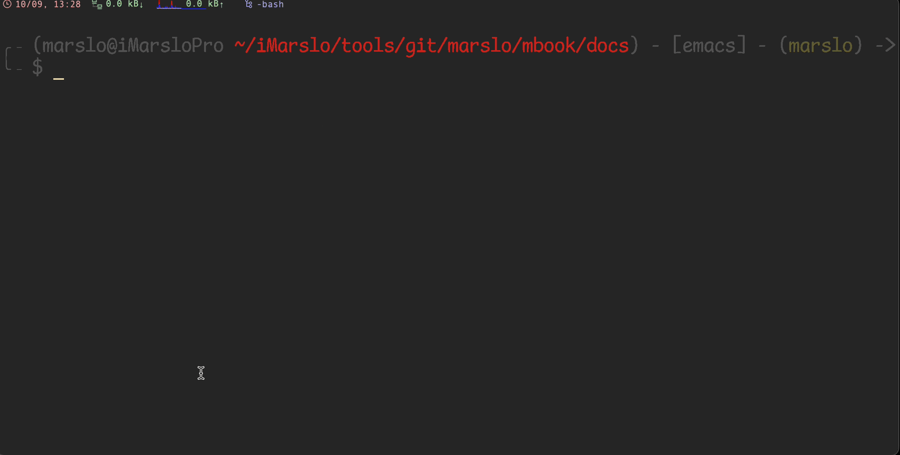

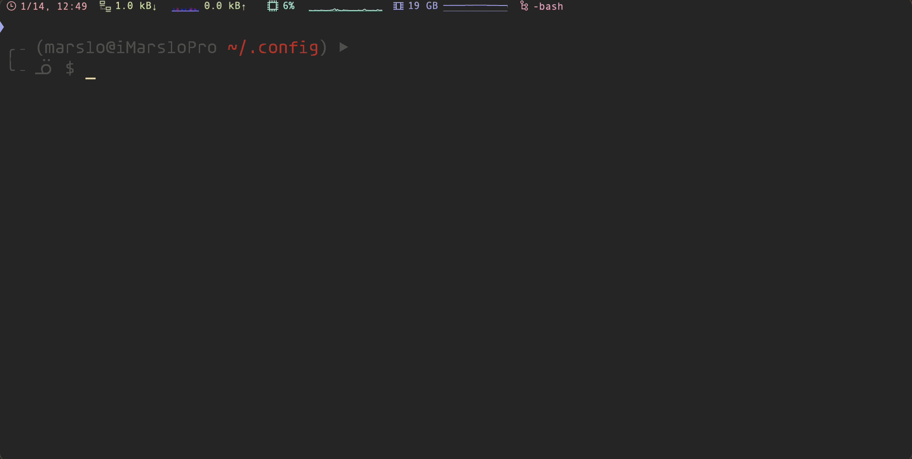

### smart vimdiff

- [`vimdiff()`](https://github.com/marslo/dotfiles/blob/main/.marslo/bin/ffunc.sh#L683-L719)

  <!--sec data-title="vimdiff()" data-id="section6" data-show=true data-collapse=true ces-->
  ```bash
  # vimdiff      : magic vimdiff, using fzf list in recent modified order
  # @author      : marslo
  # @source      : https://github.com/marslo/dotfiles/blob/main/.marslo/bin/ffunc.sh
  # @description :
  #   - if any of parameters is directory, then get file path via fzf in target path first
  #   - if `vimdiff` commands without parameter , then compare files in `.` and `~/.marslo`
  #   - if `vimdiff` commands with 1  parameter , then compare files in current path and `$1`
  #   - if `vimdiff` commands with 2  parameters, then compare files in `$1` and `$2`
  #   - otherwise ( if more than 2 parameters )  , then compare files in `${*: -2:1}` and `${*: -1}` with parameters of `${*: 1:$#-2}`
  #   - to respect fzf options by: `type -t _fzf_opts_completion >/dev/null 2>&1 && complete -F _fzf_opts_completion -o bashdefault -o default vimdiff`
  function vimdiff() {                       # smart vimdiff
    local lFile
    local rFile
    local -a var=()
    local -a options=()
    local -a fzfopt=( --cycle --multi --header 'filter in rc paths:' )

    while [[ $# -gt 0 ]]; do
      case "$1" in
        --help ) options+=( "$1" )      ; shift   ;;
            -* ) options+=( "$1" "$2" ) ; shift 2 ;;
             * ) break                            ;;
      esac
    done
    fzfopt+=( "${options[@]}" )

    if [[ 0 -eq $# ]]; then
      lFile=$(fzfInPath '.' "${options[@]}" true)
      [[ -z "${lFile}" ]] && return 1
      rFile=$(fdInRC -x | sed -rn 's/^[^|]* \| (.+)$/\1/p' | fzf "${fzfopt[@]}" )
    elif [[ 1 -eq $# ]]; then
      lFile=$(fzfInPath '.' "${options[@]}" true)
      [[ -z "${lFile}" ]] && return 1
      [[ -d "$1"       ]] && rFile=$(fzfInPath "$1" "${options[@]}") || rFile="$1"
    elif [[ 2 -eq $# ]]; then
      [[ -d "$1"       ]] && lFile=$(fzfInPath "$1" "${options[@]}") || lFile="$1"
      [[ -z "${lFile}" ]] && return 1
      [[ -d "$2"       ]] && rFile=$(fzfInPath "$2" "${options[@]}") || rFile="$2"
    else
      var=( "${@:1:$#-2}" )
      [[ -d "${*: -2:1}" ]] && lFile=$(fzfInPath "${*: -2:1}") || lFile="${*: -2:1}"
      [[ -z "${lFile}"   ]] && return 1
      [[ -d "${*: -1}"   ]] && rFile=$(fzfInPath "${*: -1}")   || rFile="${*: -1}"
    fi

    [[ -f "${lFile}" ]] && [[ -f "${rFile}" ]] && $(type -P vim) -d "${var[@]}" "${lFile}" "${rFile}"
  }
  ```
  <!--endsec-->

- [`vd()`](https://github.com/marslo/dotfiles/blob/main/.marslo/bin/ffunc.sh#L727-L737)

  <!--sec data-title="vd()" data-id="section7" data-show=true data-collapse=true ces-->
  ```bash
  # vd           : open vimdiff loaded files from ~/.vim_mru_files
  # @author      : marslo
  # @source      : https://github.com/marslo/dotfiles/blob/main/.marslo/bin/ffunc.sh
  # @description : list 10 most recently used files via fzf, and open by vimdiff
  #   - if `vd` commands without parameter, list 10 most recently used files via fzf, and open selected files by vimdiff
  #   - if `vd` commands with `-a` ( [q]uiet ) parameter, list 10 most recently used files via fzf and automatic select top 2, and open selected files by vimdiff
  function vd() {                            # vd - open [v]im[d]iff loaded files from ~/.vim_mru_files
    [[ 1 -eq $# ]] && [[ '-q' = "$1" ]] && opt='--bind start:select+down+select+accept' || opt=''

    local -a files=()
    mapfile -t files < <(
      grep --color=none -v '^#' ~/.vim_mru_files |
       xargs -r -d'\n' -I_ bash -c "sed 's:\~:$HOME:' <<< _" |
       fzf --multi 3 --sync --cycle --reverse ${opt}
    )
    [[ ${#files[@]} -lt 2 ]] || vimdiff "${files[@]}"
  }
  ```
  <!--endsec-->

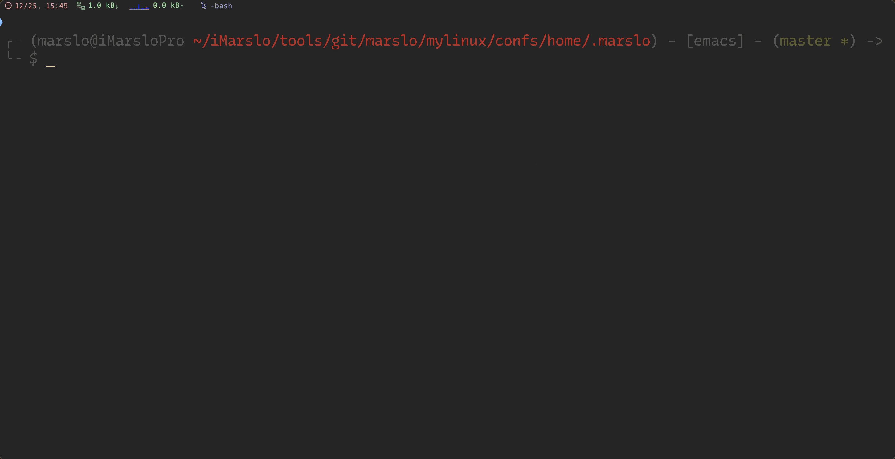

### smart cat

> [!NOTE|label:references:]
> - [`cat()`](https://github.com/marslo/dotfiles/blob/main/.marslo/bin/ffunc.sh#L147-L170)

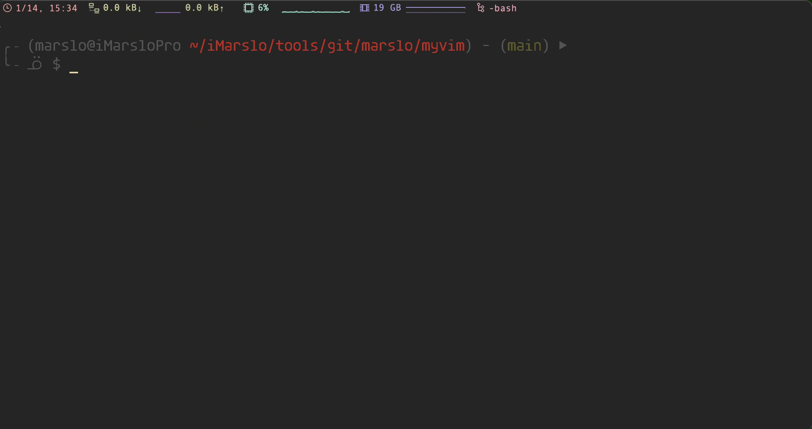

<!--sec data-title="cat()" data-id="section8" data-show=true data-collapse=true ces-->
```bash
# smart cat    : using bat by default for cat content, respect bat options
# @author      : marslo
# @source      : https://github.com/marslo/dotfiles/blob/main/.marslo/bin/ffunc.sh
# @description :
#   - using `bat` by default if `command -v bat`
#     - using `-c` ( `c`at ) as 1st parameter, to force using `type -P cat` instead of `type -P bat`
#   - if `bat` without  parameter, then search file via `fzf` and shows via `bat`
#   - if `bat` with 1   parameter, and `$1` is directory, then search file via `fzf` from `$1` and shows via `bat`
#   - otherwise respect `bat` options, and shows via `bat`
# shellcheck disable=SC2046,SC2155
function cat() {                           # smart cat
  local -a CAT=( "$(type -P cat)" )
  command -v bat >/dev/null && CAT=( "$(type -P bat)" --theme='gruvbox-dark' --color=always )

  # reading from pipe == [[ -p /dev/stdin ]]
  [[ ! -t 0      ]] && { "${CAT[@]}" "$@"; return; }
  # force use cat
  [[ '-c' = "$1" ]] && { $(type -P cat) "${@:2}"; return; }

  eval "$( _load_fd_context  )"
  eval "$( _load_fzf_context )"

  # reading from fd + fzf
  if [[ 0 -eq $# ]]; then
    local selected=$( fd . "${fdopt[@]}" | fzf --exit-0 "${fzfopt[@]}" )
    # using IFS to handle file name with space
    [[ -n "${selected}" ]] && echo "${selected}" | xargs -d '\n' "${CAT[@]}"
  elif [[ 1 -eq $# ]] && [[ -d $1 ]]; then
    local target=$1;
    fd . "${target}" "${fdopt[@]}" | fzf --bind="enter:become(${CAT[*]} {+})" "${fzfopt[@]}";
  else
    "${CAT[@]}" "${@:1:$#-1}" "${@: -1}"
  fi
}
```
<!--endsec-->

### smart copy

> [!NOTE|label:references:]
> - [`copy()`](https://github.com/marslo/dotfiles/blob/main/.marslo/bin/ffunc.sh#L95-L114)

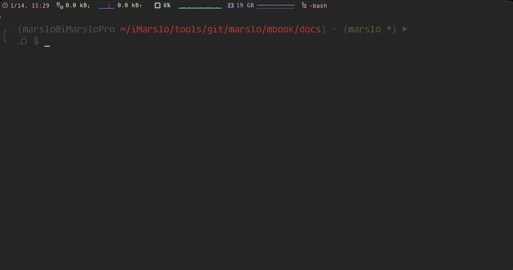

<!--sec data-title="copy()" data-id="section9" data-show=true data-collapse=true ces-->
```bash
# smart copy   : using `fzf` to list files and copy the selected file
# @author      : marslo
# @source      : https://github.com/marslo/dotfiles/blob/main/.marslo/bin/ffunc.sh
# @description :
#   - if `copy` without parameter, then list file via `fzf` and copy the content
#     - "${COPY}"
#       - `pbcopy` in osx
#       - `/mnt/c/Windows/System32/clip.exe` in wsl
#   - otherwise copy the content of parameter `$1` via `pbcopy` or `clip.exe`
# shellcheck disable=SC2317
function copy() {                          # smart copy
  [[ -z "${COPY}" ]] && echo -e "$(c Rs)ERROR: 'copy' function NOT support :$(c) $(c Ri)$(uanme -v)$(c)$(c Rs). EXIT..$(c)" && return;

  eval "$( _load_fd_context  )"
  eval "$( _load_fzf_context )"

  if [[ 0 -eq $# ]]; then
    file=$( fd . "${fdopt[@]}" | fzf "${fzfopt[@]}" ) &&
         "${COPY}" < "${file}" &&
         printf "$(c Wd)>>$(c) $(c Gis)%s$(c) $(c Wdi)has been copied ..$(c)" "${file}"
  elif [[ 1 -eq $# ]] && [[ -d "$1" ]]; then
    local target=$1;
    file=$( fd . "${target}" "${fdopt[@]}" | fzf "${fzfopt[@]}" ) &&
         "${COPY}" < "${file}" &&
         printf "$(c Wd)>>$(c) $(c Gis)%s$(c) $(c Wdi)has been copied ..$(c)" "${file}"
  else
    "${COPY}" < "$1" &&
       printf "$(c Wd)>>$(c) $(c Gis)%s$(c) $(c Wdi)has been copied ..$(c)" "${1}"
  fi
}
```
<!--endsec-->

### smart open

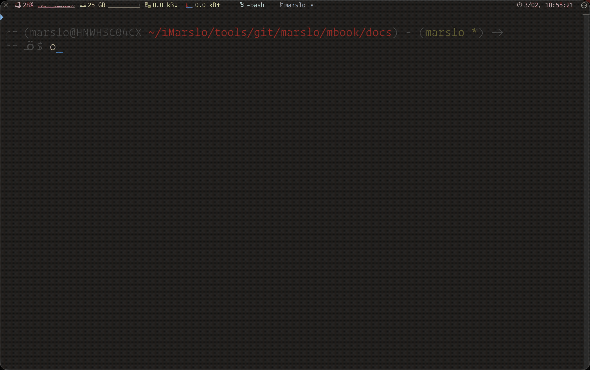

<!--sec data-title="open()" data-id="section10" data-show=true data-collapse=true ces-->
```bash
# smart open   : using `fzf` to list files and open the selected file with default application
# @author      : marslo
# @source      : https://github.com/marslo/dotfiles/blob/main/.marslo/bin/ffunc.sh
# shellcheck disable=SC2317
function open() {                          # smart open
  [[ "Darwin" != "$(uname -s)" ]] && echo -e "$(c Rs)ERROR: 'open' function currently only support macOS :$(c) $(c Ri)$(uanme -v)$(c)$(c Rs). EXIT..$(c)" && return;

  local ORG_OPEN=false
  local USAGE='USAGE'
  USAGE+="\n  $(c Cs)\$ open $(c 0G)[options] $(c 0Mi)[file|dir ...]$(c)"
  USAGE+="\n\nOPTIONS"
  USAGE+="\n  $(c G)-d$(c), $(c G)--no-fzf$(c)    open directory directly without fzf selection"
  USAGE+="\n  $(c C)-- $(c 0G)-h$(c), $(c 0G)--help$(c)   show this help message"
  USAGE+="\n\nEXAMPLES"
  USAGE+="\n  $(c Y)\$ open$(c)                       $(c 0Wdi)# list files via fzf and open the selected file$(c)"
  USAGE+="\n  $(c Y)\$ open $(c 0Mi)/path/to/dir$(c)          $(c 0Wdi)# list files in directory via fzf and open the selected file$(c)"
  USAGE+="\n  $(c Y)\$ open $(c 0Gi)--no-fzf $(c 0Mi)/path/to/dir$(c) $(c 0Wdi)# open the directory directly without fzf selection$(c)"

  eval "$( _load_fd_context  )"
  eval "$( _load_fzf_context )"

  while [[ $# -gt 0 ]]; do
    case "$1" in
      -d | --no-fzf ) ORG_OPEN=true     ; shift  ;;
      --            ) shift;
                      for arg in "$@"; do
                        case "${arg}" in
                          -h | --help ) echo -e "${USAGE}"; return ;;
                        esac
                      done; break   ;;
      -*            ) command open "$1" ; return ;;
      *             ) break                      ;;
    esac
  done

  if [[ 0 -eq $# ]]; then
    local selected=$( fd . "${fdopt[@]}" | fzf --exit-0 "${fzfopt[@]}" )
    [[ -n "${selected}" ]] && echo "${selected}" | tr '\n' '\0' | xargs -0 command open
  elif [[ -d "${1:-}" ]]; then
    local target=$1;
    "${ORG_OPEN}" && command open "${target}" && return;
    fd . "${target}" "${fdopt[@]}" | fzf --bind="enter:become(command open {+})" "${fzfopt[@]}";
  else
    command open "${@}"
  fi
}
```
<!--endsec-->

### others

- image view

  > [!NOTE]
  > - [eddieantonio/imgcat](https://github.com/eddieantonio/imgcat)

- [`imgview()`](https://github.com/marslo/dotfiles/blob/main/.marslo/bin/ffunc.sh#L356-L366)

  <!--sec data-title="imgview()" data-id="section11" data-show=true data-collapse=true ces-->
  ```bash
  # imgview      : fzf list and preview images
  # @author      : marslo
  # @source      : https://github.com/marslo/dotfiles/blob/main/.marslo/bin/ffunc.sh
  # @description :
  #   - to respect fzf options by: `type -t _fzf_opts_completion >/dev/null 2>&1 && complete -F _fzf_opts_completion -o bashdefault -o default imgview`
  #   - disable `gif` due to imgcat performance issue
  # shellcheck disable=SC2215
  function imgview() {                       # [view] [im]a[g]e via [imgcat](https://github.com/eddieantonio/imgcat)
    fd --unrestricted --type f --exclude .git --exclude node_modules '^*\.(png|jpeg|jpg|xpm|bmp)$' |
    fzf "$@" --height 100% \
             --preview "imgcat -W \$FZF_PREVIEW_COLUMNS -H \$FZF_PREVIEW_LINES {}" \
             --bind "ctrl-y:execute-silent(printf '%s' {+} | pbcopy)+abort" \
             --bind 'ctrl-/:toggle-preview' \
             --header 'Press CTRL-Y to copy name into clipboard' \
             --preview-window 'up:80%:nowrap' \
             --exit-0 \
    >/dev/null || true
  }
  ```
  <!--endsec-->

- [open files](https://github.com/junegunn/fzf/wiki/examples#opening-files)

  - `fs`
    ```bash
    $ function fs() { fzf --multi --bind 'enter:become(vim {+})' }
    ```

  - `fe`
    ```bash
    # fe [FUZZY PATTERN] - Open the selected file with the default editor
    #   - Bypass fuzzy finder if there's only one match (--select-1)
    #   - Exit if there's no match (--exit-0)
    fe() {
      IFS=$'\n' files=($(fzf-tmux --query="$1" --multi --select-1 --exit-0))
      [[ -n "$files" ]] && ${EDITOR:-vim} "${files[@]}"
    }
    ```

  - `fo`
    ```bash
    # Modified version where you can press
    #   - CTRL-O to open with `open` command,
    #   - CTRL-E or Enter key to open with the $EDITOR
    fo() {
      IFS=$'\n' out=("$(fzf-tmux --query="$1" --exit-0 --expect=ctrl-o,ctrl-e)")
      key=$(head -1 <<< "$out")
      file=$(head -2 <<< "$out" | tail -1)
      if [ -n "$file" ]; then
        [ "$key" = ctrl-o ] && open "$file" || ${EDITOR:-vim} "$file"
      fi
    }
    ```

- [search in files](https://github.com/junegunn/fzf/wiki/Examples#general)

  > [!NOTE]
  > - [#1057 Feature request: new option preview-window-scroll](https://github.com/junegunn/fzf/issues/1057#issuecomment-339347148)
  > - [gnanderson/fif.sh](https://gist.github.com/gnanderson/d74079d16714bb8b2822a7a07cc883d4)
  > - [Switching to fzf-only search mode](https://github.com/junegunn/fzf/blob/master/ADVANCED.md#switching-to-fzf-only-search-mode)
  > - [Switching between Ripgrep mode and fzf mode](https://github.com/junegunn/fzf/blob/master/ADVANCED.md#switching-to-fzf-only-search-mode)

  <!--sec data-title="fif()" data-id="section12" data-show=true data-collapse=true ces-->
  ```bash
  # references:
  # - https://github.com/junegunn/fzf/blob/master/ADVANCED.md#using-fzf-as-the-secondary-filter
  # - https://github.com/junegunn/fzf/issues/3572#issuecomment-1887735150
  # shellcheck disable=SC2154
  function fif() {                           # [f]ind-[i]n-[f]ile
    if [ ! "$#" -gt 0 ]; then
      bash "${iRCHOME}"/bin/rfv
    else
      $(type -P rg) --files-with-matches --no-messages --hidden --follow --smart-case "$1" |
      fzf --height 80% \
          --bind 'ctrl-p:preview-up,ctrl-n:preview-down' \
          --bind "enter:become($(type -P vim) {+})" \
          --header 'CTRL-N/CTRL-P or CTRL-↑/CTRL-↓ to view contents' \
          --preview "bat --color=always --style=plain {} |
                     rg --no-line-number --colors 'match:bg:yellow' --ignore-case --pretty --context 10 \"$1\" ||
                     rg --no-line-number --ignore-case --pretty --context 10 \"$1\" {} \
                    "
    fi
  }

  # or highlight as preview tool
  function fif() {                           # [f]ind-[i]n-[f]ile
    if [ ! "$#" -gt 0 ]; then echo "Need a string to search for!"; return 1; fi
    rg --color never --files-with-matches --no-messages "$1" |
    fzf --bind 'ctrl-p:preview-up,ctrl-n:preview-down' \
        --preview "highlight -O ansi {} 2> /dev/null |
                   rg --colors 'match:bg:yellow' --ignore-case --pretty --context 10 '$1' ||
                   rg --no-line-number --ignore-case --pretty --context 10 '$1' {} \
                  "
  }
  ```
  <!--endsec-->

  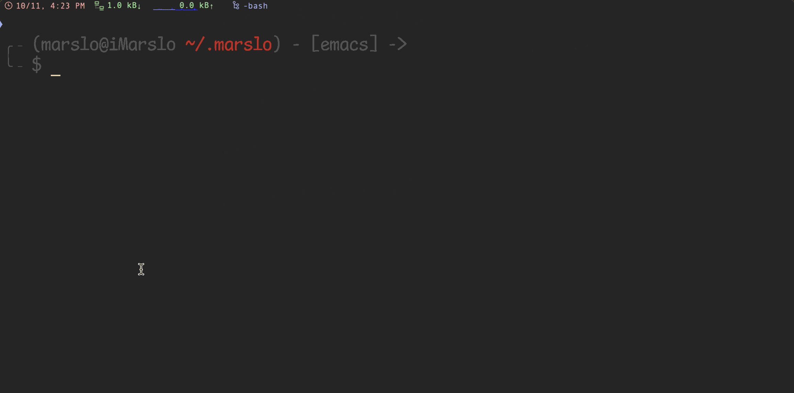

- changing directory

  > [!NOTE|label:references:]
  > - [changing directory](https://github.com/junegunn/fzf/wiki/examples#changing-directory)
  > - fuzzy-cd : [rumpelsepp/fcd.fish](https://gist.github.com/rumpelsepp/b1b416f52d6790de1aee) | [chrisnorris/fcd.fish](https://gist.github.com/chrisnorris/fe57c7855fd87a2636999edf1d4d735b)
  > - [l4u/autojump_fzf.fish](https://gist.github.com/l4u/06502cf680b9a3817efddfb0a9a6ede8)

  - [`cdp()`](https://github.com/marslo/dotfiles/blob/main/.marslo/bin/ffunc.sh#L723-L737)
  - [`cdf()`](https://github.com/marslo/dotfiles/blob/main/.marslo/bin/ffunc.sh#L772-L782)
  - [`cdd()`](https://github.com/marslo/dotfiles/blob/main/.marslo/bin/ffunc.sh#L739-L743)
  - [`cdr()`](https://github.com/marslo/dotfiles/blob/main/.marslo/bin/ffunc.sh#L745-L770)

- [Interactive cd](https://github.com/junegunn/fzf/wiki/Examples#interactive-cd)
  ```bash
  function cd() {
    if [[ "$#" != 0 ]]; then
      # shellcheck disable=SC2164
      builtin cd "$@";
      return
    fi
    while true; do
      # shellcheck disable=SC2155,SC2010
      local lsd=$(echo ".." && ls -A --color=none -p | grep --color=none '/$' | sed 's;/$;;')
      # shellcheck disable=SC2155,SC2016
      local dir="$(printf '%s\n' "${lsd[@]}" |
          fzf --reverse --preview '
              __cd_nxt="$(echo {})";
              __cd_path="$(echo $(pwd)/${__cd_nxt} | sed "s;//;/;")";
              echo $__cd_path;
              echo;
              ls -p --color=always "${__cd_path}";
      ')"
      [[ ${#dir} != 0 ]] || return 0
      # shellcheck disable=SC2164
      builtin cd "$dir" &> /dev/null
    done
  }
  ```

  <!--sec data-title="deprecated `fd`" data-id="section1" data-show=true data-collapse=true ces-->
  - `fd`
    > [!DANGER]
    > **conflict with fd-find**

    ```bash
    # fd - cd to selected directory
    fd() {
      local dir
      dir=$(find ${1:-.} -path '*/\.*' -prune \
                         -o -type d -print 2> /dev/null | fzf +m) &&
      cd "$dir"
    }

    # Another fd - cd into the selected directory
    # This one differs from the above, by only showing the sub directories and not
    #  showing the directories within those.
    fd() {
      DIR=$(find * -maxdepth 0 -type d -print 2> /dev/null | fzf-tmux) && cd "$DIR"
    }
    ```

  - `fda`
    ```bash
    # fda - including hidden directories
    fda() {
      local dir
      dir=$(find ${1:-.} -type d 2> /dev/null | fzf +m) && cd "$dir"
    }
    ```
  <!--endsec-->

## advanced usage

### command fill

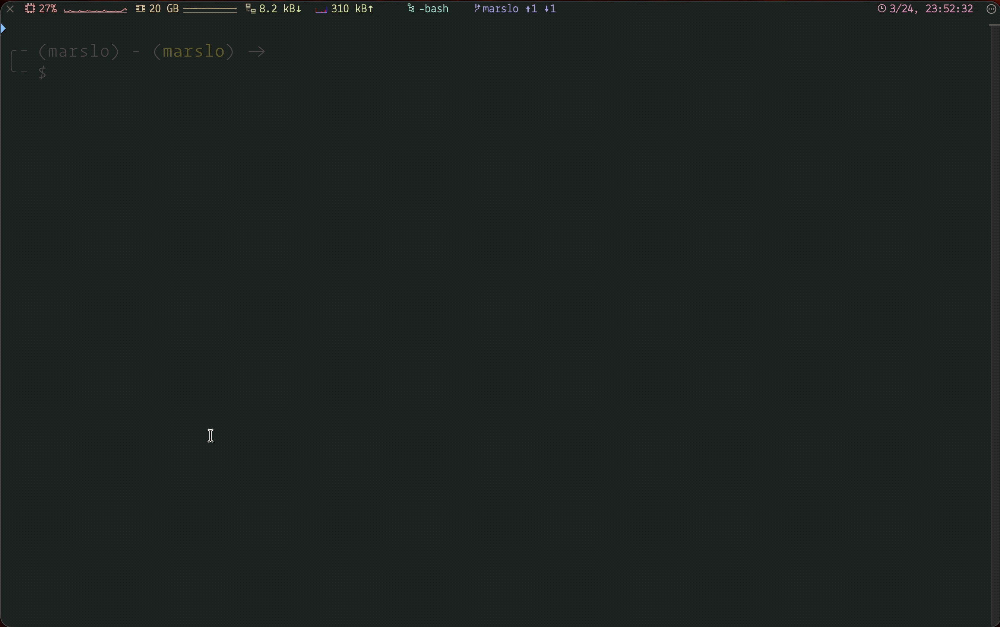

```bash
# usage: _fzf_fill "${cmd}" - similar to `Ctrl+R` in bash
# i.e.:  _fzf_fill seq 10
_fzf_fill() {
  local cmd

  if [[ $# -gt 1 ]] || type "$1" &>/dev/null; then
    cmd=$("$@" | fzf --height 40% --reverse)
  else
    cmd="$*"
  fi

  [ -z "${cmd}" ] && return

  # check count of '\n' in PS1
  # _rows = number of '\n' + 1 (current input line)
  local n_count
  n_count=$(echo -n "$PS1" | grep -o "\\\\n" | wc -l)
  local _rows=$(( n_count + 1 ))

  # cleanup cursor: move up `_rows` lines, clear to the end of line, and return cursor to the beginning of line
  tput cuu "${_rows}"
  tput ed
  tput cr

  # render PS1 with prompt expansion and handle escape sequences properly
  local _prompt=$(echo -ne "${PS1@P}")
  read -re -p "${_prompt}" -i "${cmd}" hisCmd

  # to remove the original command from history - 毁尸灭迹
  # history -d $((HISTCMD)) 2>/dev/null
  if [[ -n "${hisCmd}" ]]; then
    history -a
    eval "${hisCmd}"
    # adding timestamp if HISTTIMEFORMAT is set, to keep consistent with the format in HISTFILE
    {
      [[ -n "$HISTTIMEFORMAT" ]] && echo "#$(date +%s)"
      echo "${hisCmd}"
    } >> "${HISTFILE:-$HOME/.bash_history}"
    # read all history
    history -n
  fi
}
```


### venv selector
```bash
# activate venv - using `fzf` to list and activate python venv
# @author      : marslo
# @inspired    : https://seb.jambor.dev/posts/improving-shell-workflows-with-fzf/#virtual-env
# @source      : https://github.com/marslo/dotfiles/blob/main/.marslo/bin/ffunc.sh
function avenv() {
  # shellcheck disable=SC2155
  local _venv=$(command ls --color=never "$HOME/.venv" | fzf)
  [[ -n "${_venv}" ]] &&
    source "$HOME/.venv/${_venv}/bin/activate" &&
    echo -e "$(c Wd)>>$(c) $(c Gis)${_venv}$(c) $(c Wdi)has been activated ..$(c)"
}
```

### chrome
- [Bookmarks](https://github.com/junegunn/fzf/wiki/Examples#bookmarks)
  ```bash
  # https://github.com/junegunn/fzf/wiki/Examples#bookmarks
  # shellcheck disable=SC2016
  function b() {                             # chrome [b]ookmarks browser with jq
    if [ "$(uname)" = "Darwin" ]; then
      if [[ -e "$HOME/Library/Application Support/Google/Chrome Canary/Default/Bookmarks" ]]; then
        bookmarks_path="$HOME/Library/Application Support/Google/Chrome Canary/Default/Bookmarks"
      else
        bookmarks_path="$HOME/Library/Application Support/Google/Chrome/Default/Bookmarks"
      fi
      open=open
    else
      bookmarks_path="$HOME/.config/google-chrome/Default/Bookmarks"
      open=xdg-open
    fi

    jq_script='
       def ancestors: while(. | length >= 2; del(.[-1,-2]));
       . as $in | paths(.url?) as $key | $in | getpath($key) | {name,url, path: [$key[0:-2] | ancestors as $a | $in | getpath($a) | .name?] | reverse | join("/") } | .path + "/" + .name + "\t" + .url'

    urls=$( jq -r "${jq_script}" < "${bookmarks_path}" \
               | sed -E $'s/(.*)\t(.*)/\\1\t\x1b[36m\\2\x1b[m/g' \
               | fzf --ansi \
               | cut -d$'\t' -f2
          )
    # shellcheck disable=SC2046
    [[ -z "${urls}" ]] || "${open}" $(echo "${urls}" | xargs)
  }
  ```

### man page

> [!NOTE]
> - [fzf example: man page](https://github.com/junegunn/fzf/wiki/examples#man-pages)
> - [`fzf-man-widget()`](https://github.com/junegunn/fzf/wiki/examples#fzf-man-pages-widget-for-zsh)
> - [apropos(1) — Linux manual page](https://man7.org/linux/man-pages/man1/apropos.1.html)
> - [`fzf_apropos()`](https://gist.github.com/igemnace/9b6fb8c2885c3e35299b3a122e1009e5)

```bash
# fman - fzf list and preview for manpage:
# @source      : https://github.com/junegunn/fzf/wiki/examples#fzf-man-pages-widget-for-zsh
# @description :
#   - CTRL-N/CTRL-P or SHIFT-↑/↓ for view preview content
#   - ENTER/Q for toggle maximize/normal preview window
#   - CTRL+O  for toggle tldr in preview window
#   - CTRL+I  for toggle man in preview window
#   - to respect fzf options by: `type -t _fzf_opts_completion >/dev/null 2>&1 && complete -F _fzf_opts_completion -o bashdefault -o default fman`
# shellcheck disable=SC2046
function fman() {
  unset MANPATH
  local option
  local batman="man {1} | col -bx | bat --language=man --plain --color always --theme='gruvbox-dark'"

  while [[ $# -gt 0 ]]; do
    case "$1" in
          -* ) option+="$1 $2 "; shift 2 ;;
           * ) break                     ;;
    esac
  done

  man -k . |
  sort -u |
  sed -r 's/(\(.+\))//g' |
  grep -v -E '::' |
  awk -v cyan=$(tput setaf 6) -v blue=$(tput setaf 4) -v res=$(tput sgr0) -v bld=$(tput bold) '{ $1=cyan bld $1; $2=res blue $2;} 1' |
  fzf ${option:-} \
      -d ' ' \
      --nth 1 \
      --height 100% \
      --ansi \
      --no-multi \
      --tiebreak=begin \
      --prompt='ᓆ > ' \
      --color='prompt:#0099BD' \
      --preview-window 'up,70%,wrap,rounded,<50(up,85%,border-bottom)' \
      --preview "${batman}" \
      --bind 'ctrl-p:preview-up,ctrl-n:preview-down' \
      --bind "ctrl-o:+change-preview(tldr --color {1})+change-prompt(ﳁ tldr > )" \
      --bind "ctrl-i:+change-preview(${batman})+change-prompt(ᓆ  man > )" \
      --bind "enter:execute(${batman})+change-preview(${batman})+change-prompt(ᓆ > )" \
      --header 'CTRL-N/P or SHIFT-↑/↓ to view preview contents; ENTER/Q to maximize/normal preview window' \
      --exit-0
}
```

- simple version
  ```bash
  $ apropos . |
    fzf -d ') ' --nth 1 \
                --height 100% \
                --bind 'ctrl-p:preview-up,ctrl-n:preview-down' \
                --header 'CTRL-N/CTRL-P or CTRL-↑/CTRL-↓ to view contents' \
                --preview-window=up:88%:wrap \
                --preview 'echo {} | sed -r "s/([^\(]+).*$/\1/" | xargs man' \
                --exit-0 |
    sed -r "s/([^\(]+).*$/\1/" |
    xargs man
  ```

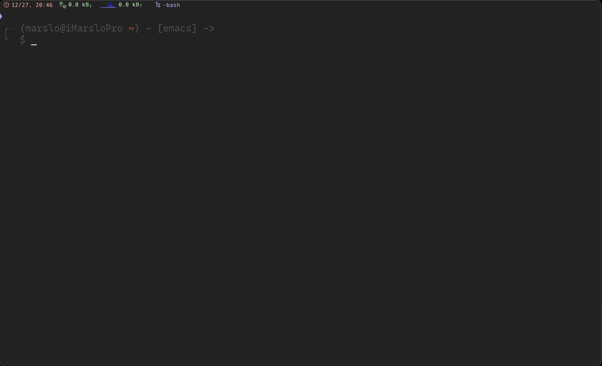

### git alias

> [!TIP]
> - [* iMarslo : git-del](https://github.com/marslo/mylinux/raw/master/confs/home/.marslo/bin/git-del) to delete both local and remote branches automatically
> - [junegunn/fzf-git.sh](https://github.com/junegunn/fzf-git.sh)

```
[alias]
  ### checkout sorted [b]ranch
  bb    = "! bash -c 'branch=$(git for-each-ref refs/remotes refs/heads --sort=-committerdate --format=\"%(refname:short)\" | \n\
                      grep --color=never -v \"origin$\" | \n\
                      fzf +m --prompt=\"branch> \" | \n\
                      sed -rn \"s:\\s*(origin/)?(.*)$:\\2:p\") && \n\
                      [[ -n \"${branch}\" ]] && \n\
                      echo -e \"\\033[1;33m~~> ${branch}\\033[0m\" && \n\
                      git checkout \"${branch}\"; \n\
                     '"

  ### [b]ranch [copy]
  bcopy = "! bash -c 'branch=$(git for-each-ref refs/remotes refs/heads --sort=-committerdate --format=\"%(refname:short)\" | \n\
                      grep --color=never -v \"origin$\" | \n\
                      fzf +m --prompt=\"branch> \" | \n\
                      sed -rn \"s:\\s*(origin/)?(.*)$:\\2:p\") && \n\
                      [[ -n \"${branch}\" ]] && \n\
                      echo -e \"\\033[0;33;1m~~> branch \\033[0m\\033[0;32;3m${branch}\\033[0m \\033[0;33;1mcopied\\033[0m\" && \n\
                      pbcopy <<< \"${branch}\" \n\
                     '"
```

### environment
- export
  ```bash
  # mkexp - compilation environment variable export, support multiple select
  # @author      : marslo
  # @source      : https://github.com/marslo/mylinux/blob/master/confs/home/.marslo/bin/ffunc.sh
  # @description : list compilation environment variable via `fzf`, and export selected items
  #   - if parameter is [ -f | --full ], then load full tool paths
  # shellcheck disable=SC1090
  function mkexp() {                         # [m]a[k]e environment variable [e][x][p]ort
    if [[ 1 -eq $# ]] && [[ '-f' = "$1" || '--full' = "$1" ]]; then
      source ~/.marslo/.imac
    fi

    LDFLAGS="${LDFLAGS:-}"
    test -d "${HOMEBREW_PREFIX}"      && LDFLAGS+=" -L${HOMEBREW_PREFIX}/lib"
    test -d '/usr/local/opt/readline' && LDFLAGS+=' -L/usr/local/opt/readline/lib'
    test -d "${OPENLDAP_HOME}"        && LDFLAGS+=" -L${OPENLDAP_HOME}/lib"
    test -d "${CURL_OPENSSL_HOME}"    && LDFLAGS+=" -L${CURL_OPENSSL_HOME}/lib"
    test -d "${BINUTILS}"             && LDFLAGS+=" -L${BINUTILS}/lib"
    test -d "${PYTHON_HOME}"          && LDFLAGS+=" -L${PYTHON_HOME}/lib"
    test -d "${RUBY_HOME}"            && LDFLAGS+=" -L${RUBY_HOME}/lib"
    test -d "${TCLTK_HOME}"           && LDFLAGS+=" -L${TCLTK_HOME}/lib"
    test -d "${SQLITE_HOME}"          && LDFLAGS+=" -L${SQLITE_HOME}/lib"
    test -d "${OPENSSL_HOME}"         && LDFLAGS+=" -L${OPENSSL_HOME}/lib"
    test -d "${NODE_HOME}"            && LDFLAGS+=" -L${NODE_HOME}/lib"                       # ${NODE_HOME}/libexec/lib for node@12
    test -d "${LIBRESSL_HOME}"        && LDFLAGS+=" -L${LIBRESSL_HOME}/lib"
    test -d "${ICU4C_711}"            && LDFLAGS+=" -L${ICU4C_711}/lib"
    test -d "${EXPAT_HOME}"           && LDFLAGS+=" -L${EXPAT_HOME}/lib"
    test -d "${NCURSES_HOME}"         && LDFLAGS+=" -L${NCURSES_HOME}/lib"
    test -d "${LIBICONV_HOME}"        && LDFLAGS+=" -L${LIBICONV_HOME}/lib"
    test -d "${ZLIB_HOME}"            && LDFLAGS+=" -L${ZLIB_HOME}/lib"
    test -d "${LLVM_HOME}"            && LDFLAGS+=" -L${LLVM_HOME}/lib"
    test -d "${LLVM_HOME}"            && LDFLAGS+=" -L${LLVM_HOME}/lib/c++ -Wl,-rpath,${LLVM_HOME}/lib/c++"  # for c++
    LDFLAGS=$( echo "$LDFLAGS" | tr ' ' '\n' | uniq | sed '/^$/d' | paste -s -d' ' )

    CFLAGS="${CFLAGS:-}"
    CFLAGS+=" -I/usr/local/include"
    test -d "${TCLTK_HOME}" && CFLAGS+=" -I${TCLTK_HOME}/include"
    CFLAGS=$( echo "$CFLAGS" | tr ' ' '\n' | uniq | sed '/^$/d' | paste -s -d' ' )

    CPPFLAGS="${CPPFLAGS:-}"
    test -d "${HOMEBREW_PREFIX}"      && CPPFLAGS+=" -I${HOMEBREW_PREFIX}/include"
    test -d "${JAVA_HOME}"            && CPPFLAGS+=" -I${JAVA_HOME}/include"
    test -d "${OPENLDAP_HOME}"        && CPPFLAGS+=" -I${OPENLDAP_HOME}/include"
    test -d "${CURL_OPENSSL_HOME}"    && CPPFLAGS+=" -I${CURL_OPENSSL_HOME}/include"
    test -d "${BINUTILS}"             && CPPFLAGS+=" -I${BINUTILS}/include"
    test -d "${SQLITE_HOME}"          && CPPFLAGS+=" -I${SQLITE_HOME}/include"
    test -d '/usr/local/opt/readline' && CPPFLAGS+=' -I/usr/local/opt/readline/include'
    test -d "${OPENSSL_HOME}"         && CPPFLAGS+=" -I${OPENSSL_HOME}/include"
    test -d "${NODE_HOME}"            && CPPFLAGS+=" -I${NODE_HOME}/include"
    test -d "${LIBRESSL_HOME}"        && CPPFLAGS+=" -I${LIBRESSL_HOME}/include"
    test -d "${TCLTK_HOME}"           && CPPFLAGS+=" -I${TCLTK_HOME}/include"
    test -d "${RUBY_HOME}"            && CPPFLAGS+=" -I${RUBY_HOME}/include"
    test -d "${ICU4C_711}"            && CPPFLAGS+=" -I${ICU4C_711}/include"
    test -d "${LLVM_HOME}"            && CPPFLAGS+=" -I${LLVM_HOME}/include"
    test -d "${LIBICONV_HOME}"        && CPPFLAGS+=" -I${LIBICONV_HOME}/include"
    test -d "${EXPAT_HOME}"           && CPPFLAGS+=" -I${EXPAT_HOME}/include"
    test -d "${NCURSES_HOME}"         && CPPFLAGS+=" -I${NCURSES_HOME}/include"
    test -d "${ZLIB_HOME}"            && CPPFLAGS+=" -I${ZLIB_HOME}/include"
    CPPFLAGS=$( echo "$CPPFLAGS" | tr ' ' '\n' | uniq | sed '/^$/d' | paste -s -d' ' )

    PKG_CONFIG_PATH=${PKG_CONFIG_PATH:-}
    PKG_CONFIG_PATH+=":${HOMEBREW_PREFIX}/lib/pkgconfig"
    test -d "${CURL_OPENSSL_HOME}"  && PKG_CONFIG_PATH+=":${CURL_OPENSSL_HOME}/lib/pkgconfig"
    test -d "${TCLTK_HOME}"         && PKG_CONFIG_PATH+=":${TCLTK_HOME}/lib/pkgconfig"
    command -v brew >/dev/null 2>&1 && PKG_CONFIG_PATH+=':/usr/local/Homebrew/Library/Homebrew/os/mac/pkgconfig/14'
    test -d "${SQLITE_HOME}"        && PKG_CONFIG_PATH+=":${SQLITE_HOME}/lib/pkgconfig"
    test -d "${OPENSSL_HOME}"       && PKG_CONFIG_PATH+=":${OPENSSL_HOME}/lib/pkgconfig"
    test -d "${PYTHON_HOME}"        && PKG_CONFIG_PATH+=":${PYTHON_HOME}/lib/pkgconfig"
    test -d "${RUBY_HOME}"          && PKG_CONFIG_PATH+=":${RUBY_HOME}/lib/pkgconfig"
    test -d "${LIBRESSL_HOME}"      && PKG_CONFIG_PATH+=":${LIBRESSL_HOME}/lib/pkgconfig"
    test -d "${ICU4C_711}"          && PKG_CONFIG_PATH+=":${ICU4C_711}/lib/pkgconfig"
    test -d "${EXPAT_HOME}"         && PKG_CONFIG_PATH+=":${EXPAT_HOME}/lib/pkgconfig"
    test -d "${NCURSES_HOME}"       && PKG_CONFIG_PATH+=":${NCURSES_HOME}/lib/pkgconfig"
    test -d "${ZLIB_HOME}"          && PKG_CONFIG_PATH+=":${ZLIB_HOME}/lib/pkgconfig"
    PKG_CONFIG_PATH=$( echo "$PKG_CONFIG_PATH" | tr ':' '\n' | uniq | sed '/^$/d' | paste -s -d: )

    LIBRARY_PATH="${HOMEBREW_PREFIX}/lib"
    test -d "${LIBICONV_HOME}" && LIBRARY_PATH+=":${LIBICONV_HOME}/lib"
    LIBRARY_PATH=$( echo "$LIBRARY_PATH" | tr ':' '\n' | uniq | sed '/^$/d' | paste -s -d: )

    LD_LIBRARY_PATH=/usr/local/lib
    LD_LIBRARY_PATH=$( echo "$LD_LIBRARY_PATH" | tr ':' '\n' | uniq | sed '/^$/d' | paste -s -d: )

    while read -r _env; do
      export "${_env?}"
      echo -e "$(c Ys)>> ${_env}$(c)\n$(c Wi).. $(eval echo \$${_env})$(c)"
    done < <( echo 'LDFLAGS CFLAGS CPPFLAGS PKG_CONFIG_PATH LIBRARY_PATH LD_LIBRARY_PATH' |
                    fmt -1 |
                    fzf -1 --exit-0 \
                           --no-sort \
                           --multi \
                           --cycle \
                           --prompt 'env> ' \
                           --header 'TAB/SHIFT-TAB to select multiple items, CTRL-D to deselect-all, CTRL-S to select-all'
            )
  }
  ```

- unset

  > - * alternative:
  >   ```bash
  >   $ unset ,,<TAB>
  >   # by default
  >   $ unset **<TAB>
  >   ```

  ```bash
  # eclr - environment variable clear, support multiple select
  # @author      : marslo
  # @source      : https://github.com/marslo/mylinux/blob/master/confs/home/.marslo/bin/ffunc.sh
  # @description : list all environment variable via `fzf`, and unset for selected items
  function eclr() {                          # [e]nvironment variable [c][l]ea[r]
    while read -r _env; do
      echo -e "$(c Ys)>> unset ${_env}$(c)\n$(c Wdi).. $(eval echo \$${_env})$(c)"
      unset "${_env}"
    done < <( env |
              sed -rn 's/^([a-zA-Z0-9]+)=.*$/\1/p' |
              fzf -1 --exit-0 --no-sort --multi --prompt='env> ' --header 'TAB to select multiple items'
            )
  }
  ```

- or unset limited to environment list
  ```bash
  # mkclr - compilation environment variable clear, support multiple select
  # @author      : marslo
  # @source      : https://github.com/marslo/mylinux/blob/master/confs/home/.marslo/bin/ffunc.sh
  # @description : list compilation environment variable via `fzf`, and unset for selected items
  function mkclr() {                         # [m]a[k]e environment variable [c][l]ea[r]
    while read -r _env; do
      echo -e "$(c Ys)>> unset ${_env}$(c)\n$(c Wdi).. $(eval echo \$${_env})$(c)"
      unset "${_env}"
    done < <( echo 'LDFLAGS CFLAGS CPPFLAGS PKG_CONFIG_PATH LIBRARY_PATH LD_LIBRARY_PATH' |
                    fmt -1 |
                    fzf -1 --exit-0 \
                           --no-sort \
                           --multi \
                           --cycle \
                           --prompt 'env> ' \
                           --header 'TAB/SHIFT-TAB to select multiple items, CTRL-D to deselect-all, CTRL-S to select-all'
            )
    # echo -e "\n$(c Wdi)[TIP]>> to list all env via $(c)$(c Wdiu)\$ env | sed -rn 's/^([a-zA-Z0-9]+)=.*$/\1/p'$(c)"
  }
  ```

  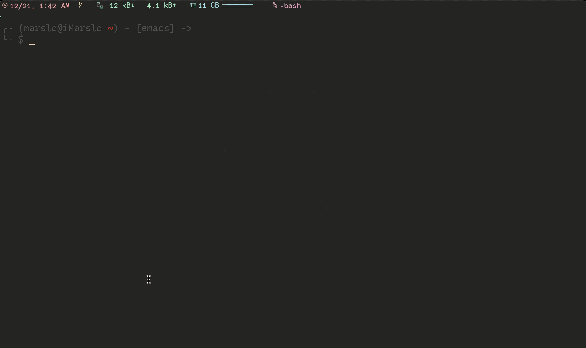

- print and copy

  > [!NOTE|label:references:]
  > - `environ – user environment` : ( `man environ` )
  > - [`printenv`](https://www.gnu.org/software/coreutils/manual/html_node/printenv-invocation.html)

  ```bash
  # penv - print environment variable, support multiple select
  # @author      : marslo
  # @source      : https://github.com/marslo/mylinux/blob/master/confs/home/.marslo/bin/ffunc.sh
  # @description : list all environment variable via `fzf`, and print values for selected items
  #   - to copy via `-c`
  #     - "${COPY}"
  #       - `pbcopy` in osx
  #       - `/mnt/c/Windows/System32/clip.exe` in wsl
  #   - to respect fzf options via `type -t _fzf_opts_completion >/dev/null 2>&1 && complete -F _fzf_opts_completion -o bashdefault -o default penv`
  #   - more options: https://github.com/junegunn/fzf/issues/3599#issuecomment-1907233847
  # shellcheck disable=SC2215,SC2016
  function penv() {                          # [p]rint [env]ironment variable
    local option
    local -a array

    while [[ $# -gt 0 ]]; do
      case "$1" in
        -c ) option+="$1 "   ; shift   ;;
        -* ) option+="$1 $2 "; shift 2 ;;
         * ) break                     ;;
      esac
    done

    option+='-1 --exit-0 --sort --multi --cycle'
    _echo_values() { echo -e "$(c Ys)>> $1$(c)\n$(c Wi).. $(eval echo \$$1)$(c)"; }

    while read -r _env; do
      _echo_values $_env
      array+=( "${_env}=$(eval echo \$${_env})" )
    done < <( env |
              sed -r 's/^([a-zA-Z0-9_-]+)=.*$/\1/' |
              fzf ${option//-c\ /} \
                  --prompt 'env> ' \
                  --height '50%' \
                  --preview-window 'top,30%,wrap,rounded' \
                  --preview='source ~/.marslo/bin/bash-color.sh; _env={}; echo -e "$(c Gs)${_env}=${!_env}$(c)"' \
                  --header 'TAB/SHIFT-TAB to select multiple items, CTRL-D to deselect-all, CTRL-S to select-all'
            )
    [[ "${option}" == *-c\ * ]] && [[ -n "${COPY}" ]] && "${COPY}" < <( printf '%s\n' "${array[@]}" | head -c-1 )
  }
  ```

  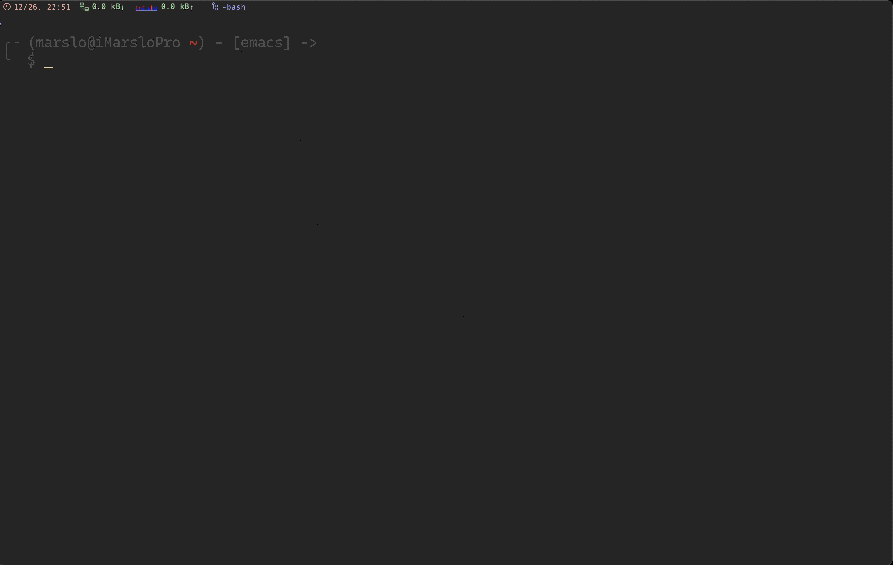

### process

> [!NOTE]
> - [Processes](https://github.com/junegunn/fzf/wiki/examples#processes)
> - [ctrl-r](https://github.com/junegunn/fzf/blob/master/ADVANCED.md#updating-the-list-of-processes-by-pressing-ctrl-r)

```bash
$ (date; ps -ef) |
  fzf --bind='ctrl-r:reload(date; ps -ef)' \
      --header=$'Press CTRL-R to reload\n\n' --header-lines=2 \
      --preview='echo {}' --preview-window=down,3,wrap \
      --layout=reverse --height=80% |
  awk '{print $2}'

# or kill
$ (date; ps -ef) |
  fzf --bind='ctrl-r:reload(date; ps -ef)' \
      --header=$'Press CTRL-R to reload\n\n' --header-lines=2 \
      --preview='echo {}' --preview-window=down,3,wrap \
      --layout=reverse --height=80% |
  awk '{print $2}' |
  xargs kill -9
```

- functions
  ```bash
  function lsps() {                          # [l]i[s]t [p]roces[s]
    (date; ps -ef) |
    fzf --bind='ctrl-r:reload(date; ps -ef)' \
        --header=$'Press CTRL-R to reload\n\n' --header-lines=2 \
        --preview='echo {}' --preview-window=down,3,wrap \
        --layout=reverse --height=80% |
    awk '{print $2}'
  }

  function killps() {                        # [kill] [p]roces[s]
    (date; ps -ef) |
    fzf --bind='ctrl-r:reload(date; ps -ef)' \
        --header=$'Press CTRL-R to reload\n\n' --header-lines=2 \
        --preview='echo {}' --preview-window=down,3,wrap \
        --layout=reverse --height=80% |
    awk '{print $2}' |
    xargs kill -9
  }
  ```

  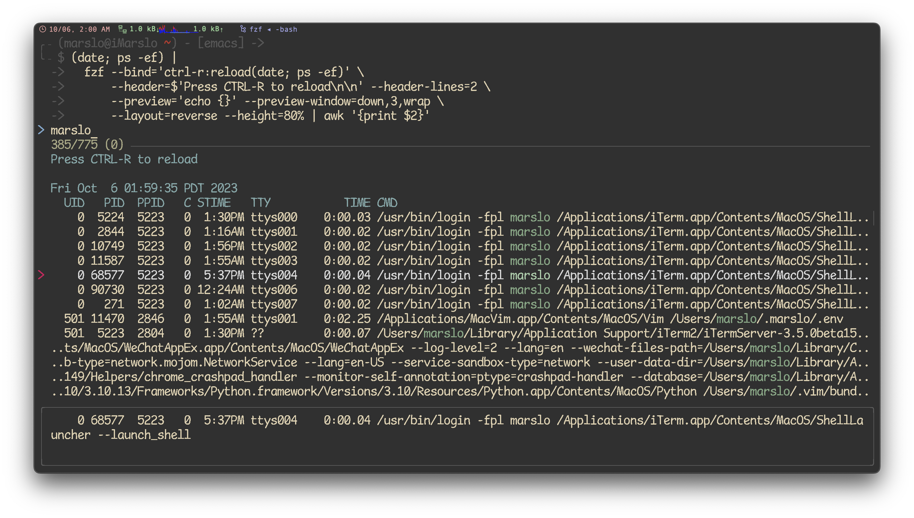

  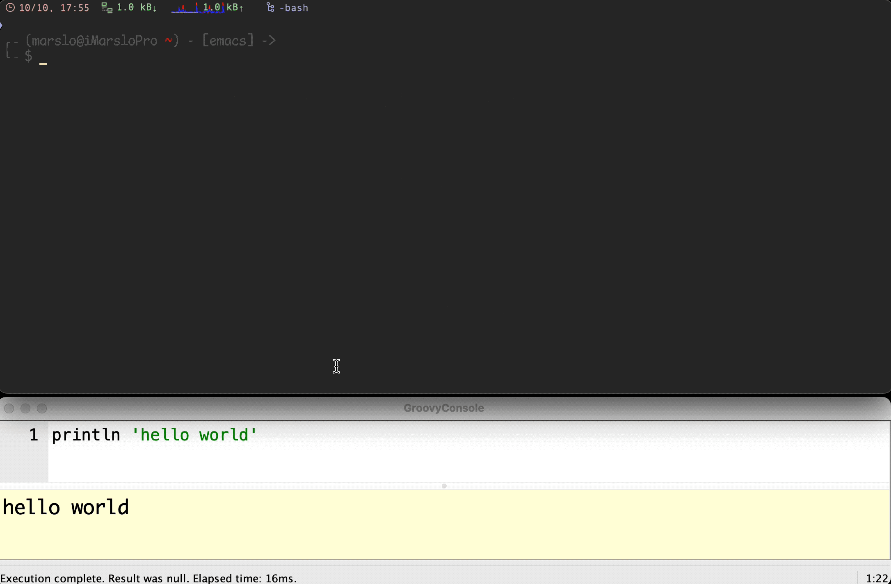

### kubectl
- `kns`
  ```bash
  # kns - kubectl set default namespace
  # @author      : marslo
  # @source      : https://github.com/marslo/mylinux/blob/master/confs/home/.marslo/bin/ffunc.sh
  # @description : using `fzf` to list all available namespaces and use the selected namespace as default
  # [k]ubectl [n]ame[s]pace
  function kns() {                           # [k]ubectl [n]ame[s]pace
    local krn=$(kubecolor config get-contexts --no-headers $(kubectl config current-context) | awk "{print \$5}" | sed "s/^$/default/")
    kubectl get -o name namespace |
            sed "s|^.*/|  |;\|^  $(krn)$|s/ /*/" |
            fzf -e |
            sed "s/^..//" |
            xargs -i bash -c "echo -e \"\033[1;33m~~> {}\\033[0m\";
                              kubecolor config set-context --current --namespace {};
                              kubecolor config get-contexts;
                             "
  }

  # or limited with `kubectl get namespace`
  function kns() {
    echo 'namespace-1 namespace-2 namespace-3 ...' |
          fmt -1 |
          fzf -1 -0 --no-sort +m --prompt='namespace> ' |
          xargs -i bash -c "echo -e \"\033[1;33m~~> {}\\033[0m\";
                            kubectl config set-context --current --namespace {};
                            kubecolor config get-contexts;
                           "
  }
  ```

- `kcani`
  ```bash
  # kcani - kubectl check permission (auth can-i)
  # @author      : marslo
  # @source      : https://github.com/marslo/mylinux/blob/master/confs/home/.marslo/bin/ffunc.sh
  # @description : check whether an action is allowed in given namespaces. support multiple selection
  # [k]ubectl [can]-[i]
  function kcani() {                         # [k]ubectl [can]-[i]
    local namespaces=''
    local actions='list get watch create update delete'
    local components='sts deploy secrets configmap ingressroute ingressroutetcp'

    namespaces=$( echo 'namespace-1 namespace-2 namespace-3 ...' |
                      fmt -1 |
                      fzf -1 -0 --no-sort --prompt='namespace> ' \
                          --bind 'ctrl-y:execute-silent(echo -n {+} | pbcopy)+abort' \
                          --header 'Press CTRL-Y to copy name into clipboard'
               )
    [[ -z "${namespaces}" ]] && echo "$(c Rs)ERROR: select at least one namespace !$(c)" && return

    while read -r namespace; do
      echo -e "\n>> $(c Ys)${namespace}$(c)"
      k-p-cani ${namespace}                  # for pods component

      for _c in ${components}; do
        local res=''
        echo -e ".. $(c Ms)${_c}$(c) :"
        for _a in ${actions}; do
          r=$(_can_i -n "${namespace}" "${_a}" "${_c}")
          res+="${r} ";
        done;                                # in actions
        echo -e "${actions}\n${res}" | "${COLUMN}" -t | sed 's/^/\t/g'
      done;                                  # in components

    done< <(echo "${namespaces}" | fmt -1)
  }

  # _can_i - kubectl check permission (auth can-i) for pods component
  # @author      : marslo
  # @source      : https://github.com/marslo/mylinux/blob/master/confs/home/.marslo/bin/ifunc.sh
  # @description : check whether given action is allowed in given namespaces; if namespace not provide, using default namespace
  function _can_i() {
    local namespace
    namespace=$(command kubectl config view --minify -o jsonpath='{..namespace}')

    while [[ $# -gt 0 ]]; do
      case "$1" in
        -n | --namespace ) namespace="$2" ; shift 2 ;;
                       * ) break                    ;;
      esac
    done

    [[ 0 = "$#" ]] && echo -e "$(c Rs)>> ERROR: must provide action to check with$(c)\n\nUSAGE$(c Gis)\n\t\$ $0 list pod\n\t\$ $0 -n <namespace> create deploy$(c)" && return
    checker=$*
    r="$(kubectl auth can-i ${checker} -n ${namespace})";
    [[ 'yes' = "${r}" ]] && r="$(c Gs)${r}$(c)" || r="$(c Rs)${r}$(c)";
    echo -e "${r}";
  }

  # k-p-cani - kubectl check permission (auth can-i) for pods component
  # @author      : marslo
  # @source      : https://github.com/marslo/mylinux/blob/master/confs/home/.marslo/bin/ifunc.sh
  # @description : check whether certain action is allowed in given namespaces
  # [k]ubectl [can]-[i]
  function k-p-cani() {
    local components='pods'
    declare -A pactions
    pactions=(
               ['0_get']="get ${components}"
               ['1_get/exec']="get ${components}/exec"
               ['2_get/sub/exec']="get ${components} --subresource=exec"
               ['2_get/sub/log']="get ${components} --subresource=log"
               ['3_list']="list ${components}"
               ['4_create']="create ${components}"
               ['5_create/exec']="create ${components}/exec"
               ['6_get/sub/exec']="get ${components} --subresource=exec"
             )

    while read -r pnamespace; do
      local headers=''
      local pres=''
      while read -r _a; do
        headers+="$(sed -rn 's/^[0-9]+_(.+)$/\1/p' <<< ${_a}) "
        r=$(_can_i -n "${pnamespace}" "${pactions[${_a}]}")
        pres+="${r} "
      done < <( for _act in "${!pactions[@]}"; do echo "${_act}"; done | sort -h )
      echo -e ".. $(c Ms)pods$(c) :"
      echo -e "${headers}\n${pres}" | "${COLUMN}" -t | sed 's/^/\t/g'
    done< <(echo "$*" | fmt -1)
  }
  ```

  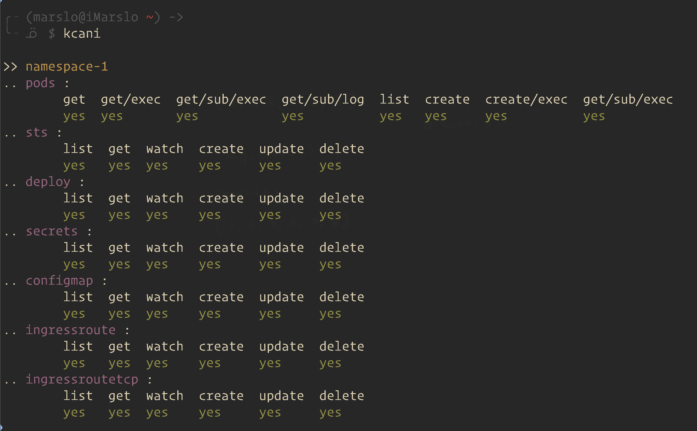

- [Log tailing : pods](https://github.com/junegunn/fzf/blob/master/ADVANCED.md#log-tailing)
  ```bash
  pods() {
    : | command='kubectl get pods --all-namespaces' fzf \
      --info=inline --layout=reverse --header-lines=1 \
      --prompt "$(kubectl config current-context | sed 's/-context$//')> " \
      --header $'╱ Enter (kubectl exec) ╱ CTRL-O (open log in editor) ╱ CTRL-R (reload) ╱\n\n' \
      --bind 'start:reload:$command' \
      --bind 'ctrl-r:reload:$command' \
      --bind 'ctrl-/:change-preview-window(80%,border-bottom|hidden|)' \
      --bind 'enter:execute:kubectl exec -it --namespace {1} {2} -- bash > /dev/tty' \
      --bind 'ctrl-o:execute:${EDITOR:-vim} <(kubectl logs --all-containers --namespace {1} {2}) > /dev/tty' \
      --preview-window up:follow \
      --preview 'kubectl logs --follow --all-containers --tail=10000 --namespace {1} {2}' "$@"
  }
  ```

### [homebrew](https://github.com/junegunn/fzf/wiki/examples#homebrew)
- `bip`
  ```bash
  # Install (one or multiple) selected application(s)
  # using "brew search" as source input
  # mnemonic [B]rew [I]nstall [P]ackage
  bip() {
    local inst=$(brew search "$@" | fzf -m)

    if [[ $inst ]]; then
      for prog in $(echo $inst);
      do; brew install $prog; done;
    fi
  }
  ```

- `bup`
  ```bash
  # Update (one or multiple) selected application(s)
  # mnemonic [B]rew [U]pdate [P]ackage
  bup() {
    local upd=$(brew leaves | fzf -m)

    if [[ $upd ]]; then
      for prog in $(echo $upd);
      do; brew upgrade $prog; done;
    fi
  }
  ```

## fancy usage

- show functions
  ```bash
  # https://github.com/junegunn/fzf/releases/tag/v0.58.0
  $ declare -f |
      perl -0 -pe 's/^}\n/}\0/gm' |
      bat --plain --language bash --color always |
      fzf --read0 --ansi --layout reverse --multi --highlight-line --gap
  ```

- `--gap`
  ```bash
  # https://github.com/junegunn/fzf/releases/tag/v0.56.0
  $ fzf --info inline-right --gap --color gutter:-1
  ```

- hyperlinks
  ```bash
  # https://github.com/junegunn/fzf/releases/tag/v0.55.0
  $ printf '<< \e]8;;http://github.com/junegunn/fzf\e\\Link to \e[32mfz\e[0mf\e]8;;\e\\ >>' | fzf --ansi
  $ fzf --preview "printf '<< \e]8;;http://github.com/junegunn/fzf\e\\Link to \e[32mfz\e[0mf\e]8;;\e\\ >>'"
  ```

- toggle-wrap
  ```bash
  # https://github.com/junegunn/fzf/releases/tag/v0.54.0
  $ history | fzf --tac --wrap --bind 'ctrl-/:toggle-wrap' --wrap-sign $'\t↳ '
  ```

- loading
  ```bash
  # https://github.com/junegunn/fzf/releases/tag/v0.54.0
  $ fzf --header 'Loading ...' --header-lines 1 \
    --bind 'start:reload:sleep 1; ps -ef' \
    --bind 'load:change-header:Loaded!'
  ```

- gem list
  ```bash
  # https://github.com/junegunn/fzf/releases/tag/0.51.0
  $ gem list | fzf --with-shell 'ruby -e' \
    --preview 'pp Gem::Specification.find_by_name({1})' \
    --bind 'ctrl-o:execute-silent:
        spec = Gem::Specification.find_by_name({1})
        [spec.homepage, *spec.metadata.filter { _1.end_with?("uri") }.values].uniq.each do
          system "open", _1
        end
    '
  ```

- jump
  ```bash
  # https://github.com/junegunn/fzf/releases/tag/0.50.0
  $ fzf --bind space:jump
  $ fzf --bind space:jump,jump:accept
  $ fzf --bind 'space:change-header(Type jump label)+jump,jump-cancel:change-header:Jump cancelled'
  ```

- footer
  ```bash
  # https://github.com/junegunn/fzf/releases/tag/v0.65.0
  $ fzf --footer $'[Edit] [View]\n[Copy to clipboard]' \
        --with-shell 'bash -c' \
        --bind 'click-footer:transform:
          [[ $FZF_CLICK_FOOTER_WORD =~ Edit ]] && echo "execute:vim \{}"
          [[ $FZF_CLICK_FOOTER_WORD =~ View ]] && echo "execute:view \{}"
          (( FZF_CLICK_FOOTER_LINE == 2 )) && (( FZF_CLICK_FOOTER_COLUMN < 20 )) &&
              echo "execute-silent(echo -n \{} | pbcopy)+bell"
        '
  # You can click on each key name to trigger the actions bound to that key
  $ fzf --footer 'Ctrl-E: Edit / Ctrl-V: View / Ctrl-Y: Copy to clipboard' \
        --with-shell 'bash -c' \
        --bind 'ctrl-e:execute:vim {}' \
        --bind 'ctrl-v:execute:view {}' \
        --bind 'ctrl-y:execute-silent(echo -n {} | pbcopy)+bell' \
        --bind 'click-footer:transform:
          [[ $FZF_CLICK_FOOTER_WORD =~ Ctrl ]] && echo "trigger(${FZF_CLICK_FOOTER_WORD%:})"
        '
  ```

- ansi
  ```bash
  # https://github.com/junegunn/fzf/releases/tag/v0.63.0
  $ for i in $(seq 16 255); do
      echo -e "\x1b[48;5;${i}m\x1b[0Khello"
    done | fzf --ansi
  ```

### resize
```bash
# https://github.com/junegunn/fzf/releases/tag/0.46.0
# Script to dynamically resize the preview window
$ transformer='
  # 1 line for info, another for prompt, and 2 more lines for preview window border
  lines=$(( FZF_LINES - FZF_MATCH_COUNT - 4 ))
  if [[ $FZF_MATCH_COUNT -eq 0 ]]; then
    echo "change-preview-window:hidden"
  elif [[ $lines -gt 3 ]]; then
    echo "change-preview-window:$lines"
  elif [[ $FZF_PREVIEW_LINES -ne 3 ]]; then
    echo "change-preview-window:3"
  fi
'
$ seq 10000 | fzf --preview 'seq {} 10000' --preview-window up \
                  --bind "result:transform:$transformer" \
                  --bind "resize:transform:$transformer"
```

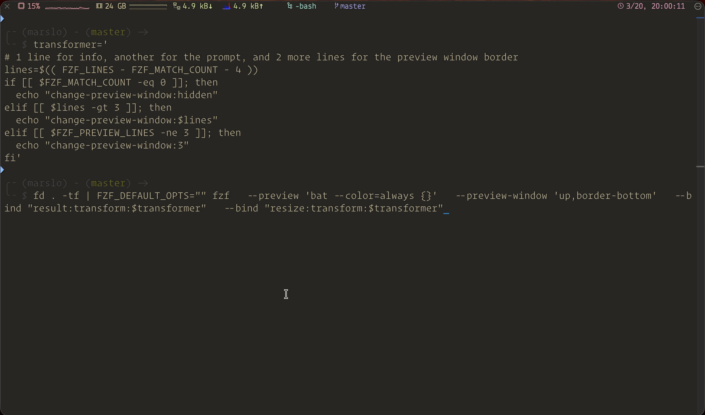

### fzf environment

#### FZF_PORT
```bash
# https://github.com/junegunn/fzf/releases/tag/v0.54.0
$ fzf --listen --sync --bind 'focus:transform-header:curl -s localhost:$FZF_PORT?limit=0 | jq .'
```

#### FZF_POS
```bash
# https://github.com/junegunn/fzf/releases/tag/0.51.0
# Toggle selection to the top or to the bottom
$ seq 30 | fzf --multi --bind 'load:pos(10)' \
  --bind 'shift-up:transform:for _ in $(seq $FZF_POS $FZF_MATCH_COUNT); do echo -n +toggle+up; done' \
  --bind 'shift-down:transform:for _ in $(seq 1 $FZF_POS); do echo -n +toggle+down; done'
```

#### FZF_API_KEY
```bash
# https://github.com/junegunn/fzf/releases/tag/0.44.0
$ export FZF_API_KEY="$(head -c 32 /dev/urandom | base64)"

# server
$ fzf --listen 0.0.0.0:6266
$ fzf --listen-unsafe 0.0.0.0:6266
# client
$ curl localhost:6266 -H "x-api-key: $FZF_API_KEY" -d 'change-query(yo)'

# -- or https://github.com/junegunn/fzf/releases/tag/0.39.0 --
# server
$ fzf --listen --bind 'start:execute-silent:echo $FZF_PORT > /tmp/fzf-port'
# client
$ curl "localhost:$(cat /tmp/fzf-port)" -d 'preview:echo Hello, fzf is listening on $FZF_PORT.'
```

### fzf-preview.sh

> [!NOTE|label:references:]
> - [fzf-preview.sh](https://github.com/junegunn/fzf/blob/0.44.0/bin/fzf-preview.sh)

```bash
$ fzf --preview='fzf-preview.sh {}'
```

### git
```bash
# https://github.com/junegunn/fzf/releases/tag/0.49.0
$ git ls-files |
  fzf --header 'Press CTRL-P to change preview mode' \
      --bind='ctrl-p:transform:[[ $FZF_PREVIEW_LABEL =~ cat ]] \
      && echo "change-preview(git log --color=always \{})+change-preview-label([[ log ]])" \
      || echo "change-preview(bat --color=always \{})+change-preview-label([[ cat ]])"'
```

### lolcat

> [!NOTE|label:references:]
> ```bash
> $ brew install lolcat
> ```

```bash
# https://github.com/junegunn/fzf/releases/tag/0.35.0

# With http://metaphorpsum.com/ and https://github.com/busyloop/lolcat
label1=$(curl -s http://metaphorpsum.com/sentences/1 | lolcat -f)
label2=$(curl -s http://metaphorpsum.com/sentences/1 | lolcat -f)

# Using colors from 'cosmic_latte'
# (See https://github.com/junegunn/fzf/blob/master/ADVANCED.md#generating-fzf-color-theme-from-vim-color-schemes)
$ fzf --border=double \
    --border-label="╣ ${label1} ╠" --border-label-pos=-3,bottom \
    --color=bg+:#2b3740,bg:#202a31,spinner:#7d9761,hl:#898f9e,fg:#abb0c0,header:#898f9e,info:#459d90 \
    --color=pointer:#7d9761,marker:#7d9761,fg+:#abb0c0,prompt:#7d9761,hl+:#7d9761,border:#2b3740,label:#2b3740 \
    --preview='lolcat -f {}' --preview-label="┓ ${label2} ┏" \
    --preview-window=top,border-bold \
    --separator=$(lolcat -f -F 1.4 <<< ╸╸╸╸╸╸╸╸╸╸╸╸╸╸)
```

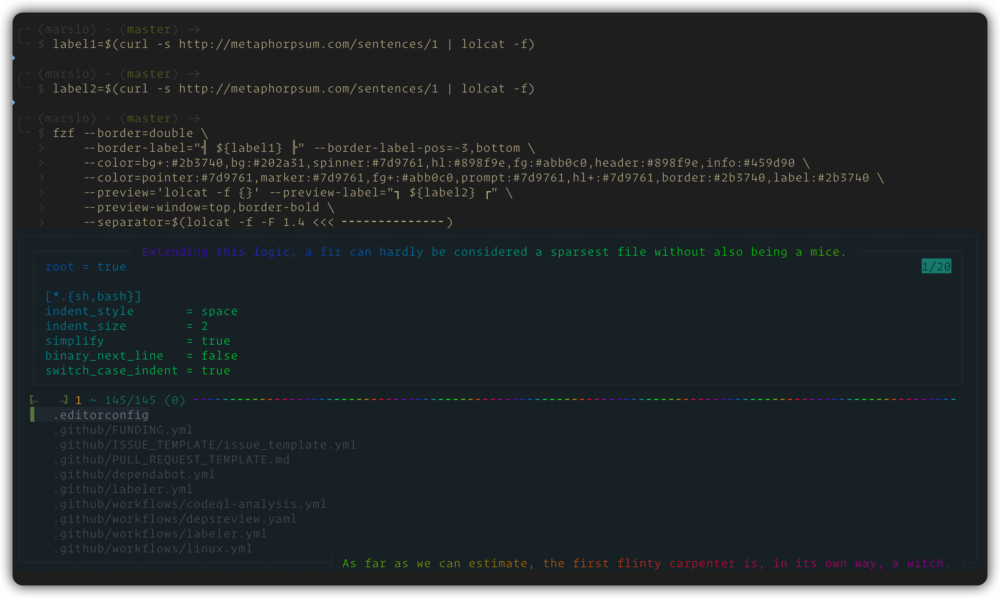

```bash
# others - https://github.com/junegunn/fzf/releases/tag/v0.63.0
$ GETTER='curl -s http://metaphorpsum.com/sentences/1'
$ fzf --style full --border --preview : \
      --bind "focus:bg-transform-header:$GETTER" \
      --bind "focus:+bg-transform-footer:$GETTER" \
      --bind "focus:+bg-transform-border-label:$GETTER" \
      --bind "focus:+bg-transform-preview-label:$GETTER" \
      --bind "focus:+bg-transform-input-label:$GETTER" \
      --bind "focus:+bg-transform-list-label:$GETTER" \
      --bind "focus:+bg-transform-header-label:$GETTER" \
      --bind "focus:+bg-transform-footer-label:$GETTER" \
      --bind "focus:+bg-transform-ghost:$GETTER" \
      --bind "focus:+bg-transform-prompt:$GETTER"
```

## config
### [`ctrl-r`](https://github.com/junegunn/fzf#key-bindings-for-command-line)
```bash
FZF_CTRL_R_OPTS="--preview 'echo {}'"
FZF_CTRL_R_OPTS+=" --preview-window up:3:hidden:wrap"
FZF_CTRL_R_OPTS+=" --bind 'ctrl-/:toggle-preview'"
FZF_CTRL_R_OPTS+=" --bind 'ctrl-y:execute-silent(echo -n {2..} | pbcopy)+abort'"
FZF_CTRL_R_OPTS+=" --color header:italic"
FZF_CTRL_R_OPTS+=" --header 'Press CTRL-Y to copy command into clipboard'"
export FZF_CTRL_R_OPTS

# or
export FZF_CTRL_R_OPTS="
  --preview 'echo {}' --preview-window up:3:hidden:wrap
  --bind 'ctrl-/:toggle-preview'
  --bind 'ctrl-y:execute-silent(echo -n {2..} | pbcopy)+abort'
  --color header:italic
  --header 'Press CTRL-Y to copy command into clipboard'"
```

-  `__fzf_history__`
  ```bash
  $ type __fzf_history__
  __fzf_history__ is a function
  __fzf_history__ ()
  {
      local output opts script;
      opts="--height ${FZF_TMUX_HEIGHT:-40%} --bind=ctrl-z:ignore ${FZF_DEFAULT_OPTS-} -n2..,.. --scheme=history --bind=ctrl-r:toggle-sort ${FZF_CTRL_R_OPTS-} +m --read0";
      script='BEGIN { getc; $/ = "\n\t"; $HISTCOUNT = $ENV{last_hist} + 1 } s/^[ *]//; print $HISTCOUNT - $. . "\t$_" if !$seen{$_}++';
      output=$(set +o pipefail
  builtin fc -lnr -2147483648 | last_hist=$(HISTTIMEFORMAT='' builtin history 1) command perl -n -l0 -e "$script" | FZF_DEFAULT_OPTS="$opts" $(__fzfcmd) --query "$READLINE_LINE") || return;
      READLINE_LINE=${output#*' '};
      if [[ -z "$READLINE_POINT" ]]; then
          echo "$READLINE_LINE";
      else
          READLINE_POINT=0x7fffffff;
      fi
  }

  $ fcf __fzf_history__
  /usr/local/Cellar/fzf/0.42.0/shell/key-bindings.bash
  ```

  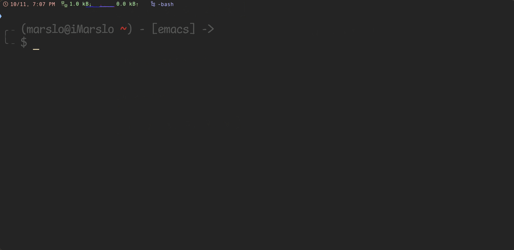

### [`ctrl-t`](https://github.com/junegunn/fzf#key-bindings-for-command-line)

> [!NOTE|label:references:]
> - to disable/reset osx default <kbd>⌃</kbd>+<kbd>↑</kbd> and <kbd>⌃</kbd>+<kbd>↓</kbd>
>   - **System Settings** ⇢ **Keyboard** ⇢ **Keyboard Shutcuts...** ⇢ **Mission Control**
>     
>
>   - **System Settings** ⇢ **Desktop & Dock** ⇢ **Shortcuts...**
>     

```bash
# preview file content using bat (https://github.com/sharkdp/bat)
FZF_CTRL_T_OPTS="--preview 'bat -n --color=always {}'"
FZF_CTRL_T_OPTS+=" --bind 'ctrl-/:change-preview-window(down|hidden|)'"
FZF_CTRL_T_OPTS+=" --bind 'ctrl-p:preview-up,ctrl-n:preview-down'"
FZF_CTRL_T_OPTS+=" --header 'CTRL-N/CTRL-P or CTRL-↑/CTRL-↓ to view contents'"
export FZF_CTRL_T_OPTS

# or
export FZF_CTRL_T_OPTS="
  --preview 'bat -n --color=always {}'
  --bind 'ctrl-p:preview-up,ctrl-n:preview-down'
  --bind 'ctrl-/:change-preview-window(down|hidden|)'"
```

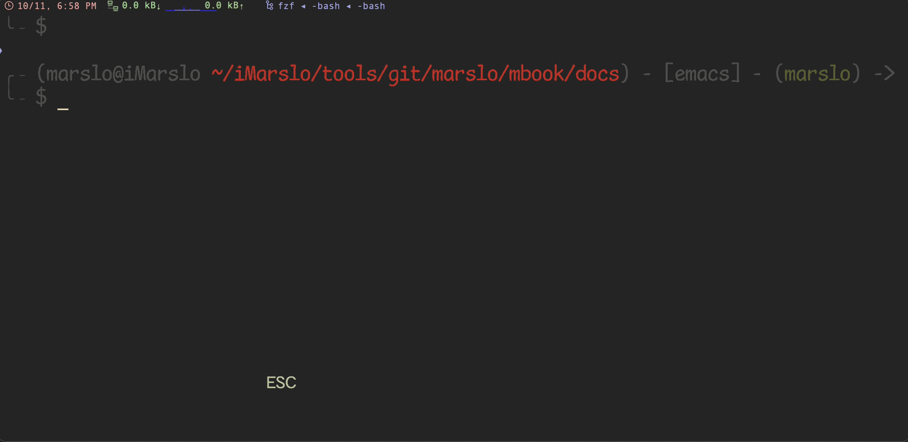

- `__fzf_select__`
  ```bash
  $ type __fzf_select__
  __fzf_select__ is a function
  __fzf_select__ ()
  {
      local cmd opts;
      cmd="${FZF_CTRL_T_COMMAND:-"command find -L . -mindepth 1 \\( -path '*/.*' -o -fstype 'sysfs' -o -fstype 'devfs' -o -fstype 'devtmpfs' -o -fstype 'proc' \\) -prune     -o -type f -print     -o -type d -print     -o -type l -print 2> /dev/null | command cut -b3-"}";
      opts="--height ${FZF_TMUX_HEIGHT:-40%} --bind=ctrl-z:ignore --reverse --scheme=path ${FZF_DEFAULT_OPTS-} ${FZF_CTRL_T_OPTS-} -m";
      eval "$cmd" | FZF_DEFAULT_OPTS="$opts" $(__fzfcmd) "$@" | while read -r item; do
          printf '%q ' "$item";
      done
  }

  $ fcf __fzf_select__
  __fzf_select__ 19 /Users/marslo/.marslo/utils/fzf/shell/key-bindings.bas

  $ mdfind key-bindings.bas
  /Users/marslo/iMarslo/tools/git/marslo/mbook/docs/devops/adminTools.md
  /usr/local/Cellar/fzf/0.42.0/shell/key-bindings.bash
  ```

- [`__fzf_select_dir()`](https://github.com/junegunn/fzf/wiki/Examples#changing-directory)

  ```bash
  # another ctrl-t script to select a directory and paste it into line
  __fzf_select_dir () {
    builtin typeset READLINE_LINE_NEW="$(
      command find -L . \( -path '*/\.*' -o -fstype dev -o -fstype proc \) \
              -prune \
              -o -type f -print \
              -o -type d -print \
              -o -type l -print 2>/dev/null \
      | command sed 1d \
      | command cut -b3- \
      | env fzf -m
    )"

    if [[ -n $READLINE_LINE_NEW ]]; then
      builtin bind '"\er": redraw-current-line'
      builtin bind '"\e^": magic-space'
      READLINE_LINE=${READLINE_LINE:+${READLINE_LINE:0:READLINE_POINT}}${READLINE_LINE_NEW}${READLINE_LINE:+${READLINE_LINE:READLINE_POINT}}
      READLINE_POINT=$(( READLINE_POINT + ${#READLINE_LINE_NEW} ))
    else
      builtin bind '"\er":'
      builtin bind '"\e^":'
    fi
  }

  builtin bind -x '"\C-x1": __fzf_select_dir'
  builtin bind '"\C-t": "\C-x1\e^\er"'
  ```

### [theme](https://github.com/junegunn/fzf/blob/master/ADVANCED.md#color-themes)
```bash
# junegunn/seoul256.vim (dark)
export FZF_DEFAULT_OPTS='--color=bg+:#3F3F3F,bg:#4B4B4B,border:#6B6B6B,spinner:#98BC99,hl:#719872,fg:#D9D9D9,header:#719872,info:#BDBB72,pointer:#E12672,marker:#E17899,fg+:#D9D9D9,preview-bg:#3F3F3F,prompt:#98BEDE,hl+:#98BC99'

# junegunn/seoul256.vim (light)
export FZF_DEFAULT_OPTS='--color=bg+:#D9D9D9,bg:#E1E1E1,border:#C8C8C8,spinner:#719899,hl:#719872,fg:#616161,header:#719872,info:#727100,pointer:#E12672,marker:#E17899,fg+:#616161,preview-bg:#D9D9D9,prompt:#0099BD,hl+:#719899'

# morhetz/gruvbox
export FZF_DEFAULT_OPTS='--color=bg+:#3c3836,bg:#32302f,spinner:#fb4934,hl:#928374,fg:#ebdbb2,header:#928374,info:#8ec07c,pointer:#fb4934,marker:#fb4934,fg+:#ebdbb2,prompt:#fb4934,hl+:#fb4934'

# arcticicestudio/nord-vim
export FZF_DEFAULT_OPTS='--color=bg+:#3B4252,bg:#2E3440,spinner:#81A1C1,hl:#616E88,fg:#D8DEE9,header:#616E88,info:#81A1C1,pointer:#81A1C1,marker:#81A1C1,fg+:#D8DEE9,prompt:#81A1C1,hl+:#81A1C1'

# tomasr/molokai
export FZF_DEFAULT_OPTS='--color=bg+:#293739,bg:#1B1D1E,border:#808080,spinner:#E6DB74,hl:#7E8E91,fg:#F8F8F2,header:#7E8E91,info:#A6E22E,pointer:#A6E22E,marker:#F92672,fg+:#F8F8F2,prompt:#F92672,hl+:#F92672'
```

- [generating fzf color theme from vim color schemes](https://github.com/junegunn/fzf/blob/master/ADVANCED.md#generating-fzf-color-theme-from-vim-color-schemes)
  ```vim
  let g:fzf_colors =
  \ { 'fg':         ['fg', 'Normal'],
    \ 'bg':         ['bg', 'Normal'],
    \ 'preview-bg': ['bg', 'NormalFloat'],
    \ 'hl':         ['fg', 'Comment'],
    \ 'fg+':        ['fg', 'CursorLine', 'CursorColumn', 'Normal'],
    \ 'bg+':        ['bg', 'CursorLine', 'CursorColumn'],
    \ 'hl+':        ['fg', 'Statement'],
    \ 'info':       ['fg', 'PreProc'],
    \ 'border':     ['fg', 'Ignore'],
    \ 'prompt':     ['fg', 'Conditional'],
    \ 'pointer':    ['fg', 'Exception'],
    \ 'marker':     ['fg', 'Keyword'],
    \ 'spinner':    ['fg', 'Label'],
    \ 'header':     ['fg', 'Comment'] }

  :echo fzf#wrap()
  :call append('$', printf('export FZF_DEFAULT_OPTS="%s"', matchstr(fzf#wrap().options, "--color[^']*")))
  ```

## tips

- move cursor to position

  > [!TIP]
  > - [12af069 Add pos(...) action to move the cursor to the numeric position](https://github.com/junegunn/fzf/commit/12af069dcad672b1563388c61ec33ba8a86c013e)
  > - [#395 Feature: Set selected entries](https://github.com/junegunn/fzf/issues/395)

  ```bash
  $ seq 100 | fzf --sync --bind 'start:pos(N)'
  ```

  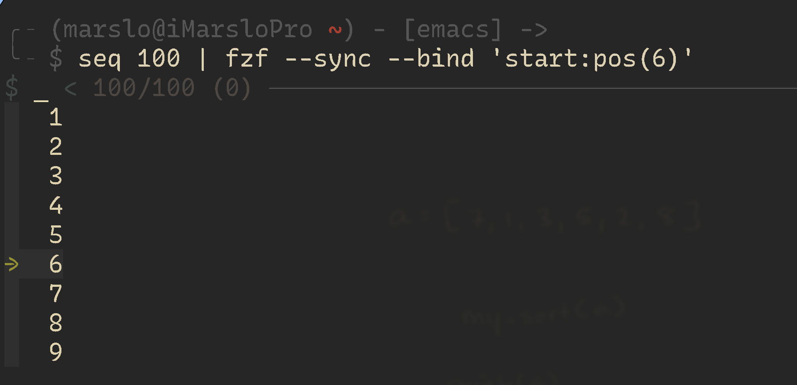

  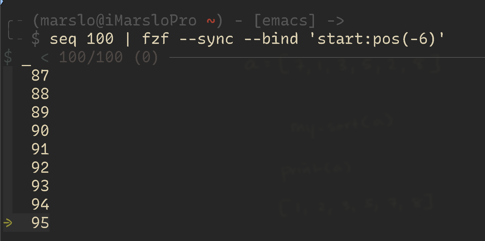


- select by column

  > [!NOTE]
  > - [#3514 : Manual output on enter, no linebreak.](https://github.com/junegunn/fzf/discussions/3514#discussioncomment-7667338)

  ```bash
  $ seq 20 | pr -ts' ' --column 4
  1 6 11 16
  2 7 12 17
  3 8 13 18
  4 9 14 19
  5 10 15 20

  $ seq 20 | pr -ts' ' --column 4 | fzf --sync --bind 'start:select-all+become:cat {+f2}'
  6
  7
  8
  9
  10

  $ seq 20 | pr -ts' ' --column 4 | fzf --sync --bind 'start:select-all+become:echo {+2}'
  6 7 8 9 10
  ```

- `--with-nth`

  > [!NOTE]
  > - [#102: Feature Request: Option to hide some fields](https://github.com/junegunn/fzf/issues/102)

  ```bash
  $ echo {a..z} | fzf --with-nth='1..3'
  ```

  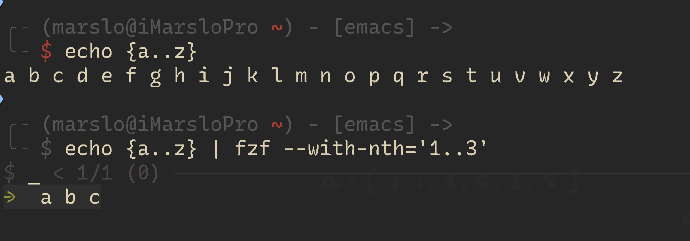

  ```bash
  # https://github.com/junegunn/fzf/issues/1323#issuecomment-499615418
  # for git comment show
  $ git log --pretty=oneline |
    fzf --ansi --delimiter=' ' --no-multi --preview='git show --color=always {1}' --with-nth=2.. |
    cut --delimiter=' ' --field=1
  ```

  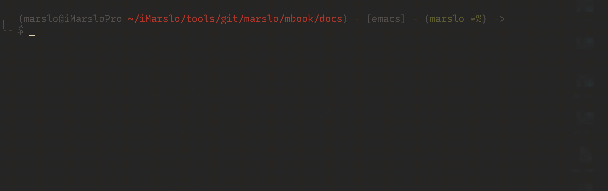

  ```bash
  $ echo -e 'first line\tfirst preview\nsecond line\tsecond preview' |
    fzf --delimiter='\t' --with-nth=1 --preview='echo {2}'
  ```

  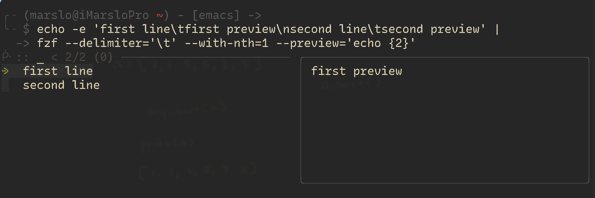

- `--track`
  ```bash
  $ git log --oneline --graph --color=always |
    nl |
    fzf --ansi --track --no-sort --layout=reverse-list
  ```

  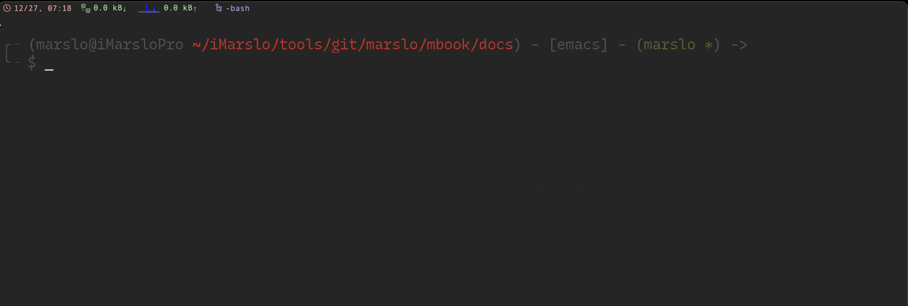

- select-all
  ```bash
  $ seq 3 | fzf --multi --sync --bind start:last+select-all
  ```

  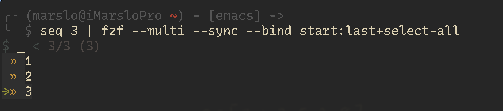


- select-n

  > [!TIP]
  > - [#3548 - [new feature] ask for select-n feature](https://github.com/junegunn/fzf/issues/3548#issuecomment-1868433219)

  ```bash
  # select top 2 and move down
  $ seq 10 | fzf --multi --sync --reverse --bind start:select+down+select+down

  # select top 2
  $ seq 10 | fzf --multi --sync --reverse --bind start:select+down+select
  ```

  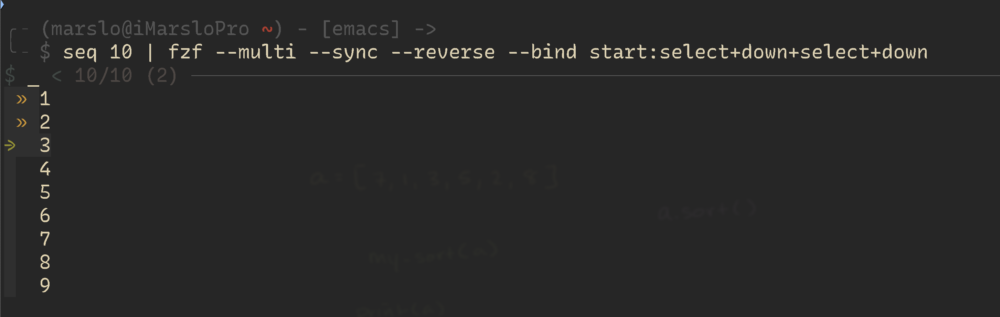

  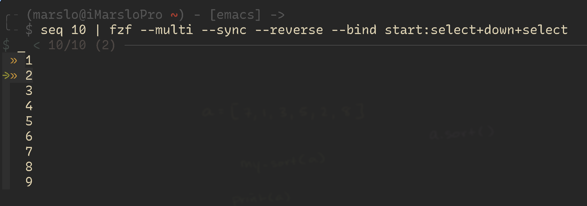

- for git

  > [!NOTE]
  > - [fshow](https://github.com/junegunn/fzf/issues/1323#issuecomment-780326885)

  ```bash
  # cannot be used to grab a sha as an argument.
  fshow() {
    git log --color=always \
        --format="%C(auto)%h%d %s %C(black)%C(bold)%cr" "$@" |
    fzf --ansi --no-sort --reverse --tiebreak=index --bind=ctrl-s:toggle-sort \
        --bind "ctrl-o:execute(git show --color=always {1})"
  }
  ```

  - [view history by fzf, show revision number finally](https://github.com/junegunn/fzf/issues/1323#issuecomment-781244399)
    ```bash
    $ git log --pretty=oneline \
          | fzf --ansi --delimiter=' ' --no-multi --preview='git show --color=always {1}' --with-nth=2.. \
          | cut --delimiter=' ' --field=1
    # or
    $ git log --pretty=oneline --all \
          | fzf --ansi --no-multi --preview='git show --color=always {1}' --with-nth=2.. \
          | awk '{print $1}'
    ```

  - [pr checkout](https://seb.jambor.dev/posts/improving-shell-workflows-with-fzf/)

    > [!NOTE]
    > - [github cli: `gh`](https://cli.github.com/)

    ```bash
    function pr-checkout() {
      local jq_template pr_number

      jq_template='"'\
        '#\(.number) - \(.title)'\
        '\t'\
        'Author: \(.user.login)\n'\
        'Created: \(.created_at)\n'\
        'Updated: \(.updated_at)\n\n'\
        '\(.body)'\
        '"'

      pr_number=$(
        gh api 'repos/:owner/:repo/pulls' |
        jq ".[] | $jq_template" |
        sed -e 's/"\(.*\)"/\1/' -e 's/\\t/\t/' |
        fzf \
          --with-nth=1 \
          --delimiter='\t' \
          --preview='echo -e {2}' \
          --preview-window=top:wrap |
        sed 's/^#\([0-9]\+\).*/\1/'
      )

      if [ -n "$pr_number" ]; then
        gh pr checkout "$pr_number"
      fi
    }
    ```

- [creating feature branches from JIRA issues](https://seb.jambor.dev/posts/improving-shell-workflows-with-fzf/)
  ```bash
  function create-branch() {
    # The function expects that username and password are stored using secret-tool.
    # To store these, use
    # secret-tool store --label="JIRA username" jira username
    # secret-tool store --label="JIRA password" jira password

    local jq_template query username password branch_name

    jq_template='"'\
      '\(.key). \(.fields.summary)'\
      '\t'\
      'Reporter: \(.fields.reporter.displayName)\n'\
      'Created: \(.fields.created)\n'\
      'Updated: \(.fields.updated)\n\n'\
      '\(.fields.description)'\
      '"'
    query='project=BLOG AND status="In Progress" AND assignee=currentUser()'
    username=$(secret-tool lookup jira username)
    password=$(secret-tool lookup jira password)

    branch_name=$(
      curl \
        --data-urlencode "jql=$query" \
        --get \
        --user "$username:$password" \
        --silent \
        --compressed \
        'https://jira.example.com/rest/api/2/search' |
      jq ".issues[] | $jq_template" |
      sed -e 's/"\(.*\)"/\1/' -e 's/\\t/\t/' |
      fzf \
        --with-nth=1 \
        --delimiter='\t' \
        --preview='echo -e {2}' \
        --preview-window=top:wrap |
      cut -f1 |
      sed -e 's/\. /\t/' -e 's/[^a-zA-Z0-9\t]/-/g' |
      awk '{printf "%s/%s", $1, tolower($2)}'
    )

    if [ -n "$branch_name" ]; then
      git checkout -b "$branch_name"
    fi
  }
  ```

- [`localhost:$FZF_PORT`](https://github.com/junegunn/fzf/releases/tag/v0.54.0)

  ```bash
  $ fzf --listen --sync --bind 'focus:transform-header:curl -s localhost:$FZF_PORT?limit=0 | jq .' --height 100%
  ```

- `--style`

  > [!NOTE|label:references:]
  > - [#4160 Add style presets](https://github.com/junegunn/fzf/issues/4160)

  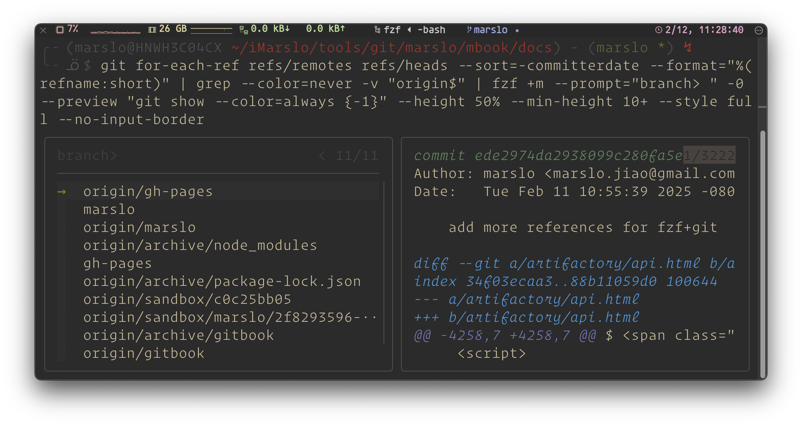

## fzf with git

> [!NOTE|label:references:]
> - [Make Git better with FZF](https://fortes.com/2022/make-git-better-with-fzf/)
> - [A Practical Guide to fzf: Building a Git Explorer](https://thevaluable.dev/fzf-git-integration/)
> - [jesseduffield/lazygit](https://github.com/jesseduffield/lazygit)
> - [Examples - Git](https://github.com/junegunn/fzf/wiki/examples#git)
