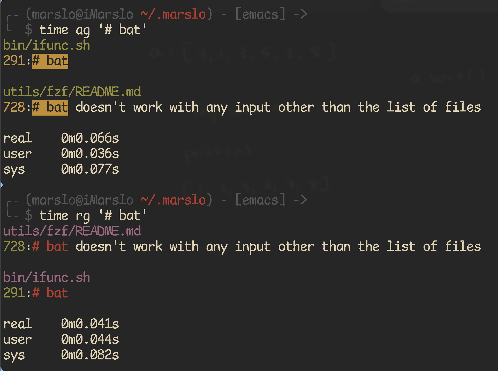

<!-- START doctoc generated TOC please keep comment here to allow auto update -->
<!-- DON'T EDIT THIS SECTION, INSTEAD RE-RUN doctoc TO UPDATE -->

- [rg](#rg)
  - [install](#install)
  - [usage](#usage)
  - [tips](#tips)
  - [using inside in vim](#using-inside-in-vim)
- [ag](#ag)
- [fzy](#fzy)

<!-- END doctoc generated TOC please keep comment here to allow auto update -->

# [rg](https://github.com/BurntSushi/ripgrep)

> [!NOTE]
> - [#193: [Question] how to search by filenames only?](https://github.com/BurntSushi/ripgrep/issues/193#issuecomment-775059326)
> - [How can I recursively find all files in current and subfolders based on wildcard matching?](https://stackoverflow.com/a/50840902/2940319)
> - [chinanf-boy/ripgrep-zh](https://github.com/chinanf-boy/ripgrep-zh/tree/master)
>   - [ripgrep-zh/GUIDE.zh.md](https://github.com/chinanf-boy/ripgrep-zh/blob/master/GUIDE.zh.md)
> - [How to get a git's branch with fuzzy finder?](https://stackoverflow.com/a/37007733/2940319)
> - [Integralist/RipGrep inline file replacements.sh](https://gist.github.com/Integralist/89ad7fe05f72941b87c6e3512c30d940)
> - another tool [mg](https://github.com/marslo/mylinux/blob/master/confs/home/.marslo/bin/im.sh#L50)

## install
```bash
# with cargo
$ cargo install ripgrep

# osx
$ brew install ripgrep

# rhel/centos
$ sudo yum install -y yum-utils
$ sudo yum-config-manager --add-repo=https://copr.fedorainfracloud.org/coprs/carlwgeorge/ripgrep/repo/epel-7/carlwgeorge-ripgrep-epel-7.repo
$ sudo yum install ripgrep
# or via epel: https://marslo.github.io/ibook/linux/basic.html#tools-installation
$ sudo yum install -y yum-utils epel-release
$ sudo yum install ripgrep

# ubuntu
$ curl -LO https://github.com/BurntSushi/ripgrep/releases/download/14.0.3/ripgrep_14.0.3-1_amd64.deb
$ sudo dpkg -i ripgrep_14.0.3-1_amd64.deb
# or
$ sudo apt install -y ripgrep

# from source
$ git clone https://github.com/BurntSushi/ripgrep && cd ripgrep
$ cargo build --release
$ ./target/release/rg --version
0.1.3

# completion
# wsl/ubuntu/centos
$ rg --generate complete-bash | sudo tee /usr/share/bash-completion/completions/rg
# or centos
$ rg --generate complete-bash | sudo tee /etc/bash_completion.d/rg
# osx
$ rg --generate complete-bash | sudo tee /usr/local/etc/bash_completion.d/rg
```

## usage
- crontab for delete '*\.DS_*'
  ```bash
  /usr/local/bin/rg --hidden --smart-case --files "$HOME" -g  '*\.DS_*' | xargs -r -i rm '{}'
  ```

- [search in dotfiles with ripgrep](https://til.hashrocket.com/posts/ezeddwpiso-search-in-dotfiles-with-ripgrep)

  > [!NOTE|label:references:]
  > - [#771 : .gitignore files might be searched without using '--hidden'](https://github.com/BurntSushi/ripgrep/issues/771)
  > - [#919 : RipGrep does not show hidden files even with the --hidden flag](https://github.com/BurntSushi/ripgrep/issues/919)

  ```bash
  $ rg --hidden 'alias cat'

  # or https://github.com/BurntSushi/ripgrep/issues/623#issuecomment-659909044
  alias rg="rg --hidden --glob '!.git'"

  # or `.ignore` or `.rgignore`
  $ cat ~/.rgignore
  .git/
  .tox/
  .github/
  ```

- info
  ```bash
  $ tree -a .
  .
  ├── .no-hidden
  └── no-hidden

  1 directory, 2 files

  $ rg --files --debug
  DEBUG|globset|crates/globset/src/lib.rs:416: glob converted to regex: Glob { glob: "**/.DS_Store?", re: "(?-u)^(?:/?|.*/)\\.DS_Store[^/]$", opts: GlobOptions { case_insensitive: false, literal_separator: true, backslash_escape: true }, tokens: Tokens([RecursivePrefix, Literal('.'), Literal('D'), Literal('S'), Literal('_'), Literal('S'), Literal('t'), Literal('o'), Literal('r'), Literal('e'), Any]) }
  DEBUG|globset|crates/globset/src/lib.rs:416: glob converted to regex: Glob { glob: "**/._*", re: "(?-u)^(?:/?|.*/)\\._[^/]*$", opts: GlobOptions { case_insensitive: false, literal_separator: true, backslash_escape: true }, tokens: Tokens([RecursivePrefix, Literal('.'), Literal('_'), ZeroOrMore]) }
  DEBUG|globset|crates/globset/src/lib.rs:421: built glob set; 0 literals, 7 basenames, 0 extensions, 0 prefixes, 0 suffixes, 0 required extensions, 2 regexes
  DEBUG|ignore::walk|crates/ignore/src/walk.rs:1741: ignoring ./.no-hidden: Ignore(IgnoreMatch(Hidden))
  no-hidden

  $ rg --files --debug --hidden
  DEBUG|globset|crates/globset/src/lib.rs:416: glob converted to regex: Glob { glob: "**/.DS_Store?", re: "(?-u)^(?:/?|.*/)\\.DS_Store[^/]$", opts: GlobOptions { case_insensitive: false, literal_separator: true, backslash_escape: true }, tokens: Tokens([RecursivePrefix, Literal('.'), Literal('D'), Literal('S'), Literal('_'), Literal('S'), Literal('t'), Literal('o'), Literal('r'), Literal('e'), Any]) }
  DEBUG|globset|crates/globset/src/lib.rs:416: glob converted to regex: Glob { glob: "**/._*", re: "(?-u)^(?:/?|.*/)\\._[^/]*$", opts: GlobOptions { case_insensitive: false, literal_separator: true, backslash_escape: true }, tokens: Tokens([RecursivePrefix, Literal('.'), Literal('_'), ZeroOrMore]) }
  DEBUG|globset|crates/globset/src/lib.rs:421: built glob set; 0 literals, 7 basenames, 0 extensions, 0 prefixes, 0 suffixes, 0 required extensions, 2 regexes
  no-hidden
  .no-hidden
  ```

  

## tips
- show file name only
  ```bash
  $ rg --hidden 'alias ping' --no-heading --files-with-matches
  alias.d/utils
  ```

- in vimgrep format
  ```bash
  $ rg --hidden 'alias ping' --no-heading
  alias.d/utils:13:  alias ping='/sbin/ping --apple-time -v'
  # or
  $ rg 'alias ping' --no-heading --line-number --with-filename
  alias.d/utils:13:  alias ping='/sbin/ping --apple-time -v'

  $ rg --hidden 'alias ping' --vimgrep
  alias.d/utils:13:3:  alias ping='/sbin/ping --apple-time -v'
  ```

## using inside in vim

> [!NOTE|label:references:]
> - [Extending Vim with ripgrep](https://phelipetls.github.io/posts/extending-vim-with-ripgrep/)
> - [#425 - How to use inside vim?](https://github.com/BurntSushi/ripgrep/issues/425#issuecomment-381446152)
> - [jremmen/vim-ripgrep](https://github.com/jremmen/vim-ripgrep)

```vim
if executable("rg")
  set grepprg=rg\ --vimgrep\ --smart-case\ --hidden
  set grepformat=%f:%l:%c:%m
endif

" -- more --
" handling search and replace boilerplate using ripgrep
if executable('rg') | set grepformat+=%f:%l:%c:%m grepprg=rg\ --vimgrep\ --no-heading\ --smart-case | endif
" use feedkeys because we don't want to press enter at the end of this command
command! -nargs=1 FindReplaceAll :silent grep <args> | copen | call feedkeys(":cdo %s/" . <q-args> . "/") | redraw!
" use feedkeys because otherwise the screen isn't redrawn
nnoremap <silent> <C-r> :call feedkeys(':FindReplaceAll ')<CR>
```

# [ag](https://github.com/ggreer/the_silver_searcher)

```bash
# osx
$ brew install the_silver_searcher

# ubuntu >= 13.10
$ apt-get install silversearcher-ag
```

# [fzy](https://github.com/jhawthorn/fzy)

```bash
# osx
$ brew install fzy

# debine
$ sudo apt install fzy

# source code
$ git clone git@github.com:jhawthorn/fzy.git && cd fzy
$ make
$ sudo make install

# verify
$ fzy --version
fzy 1.0 © 2014-2018 John Hawthorn
```
