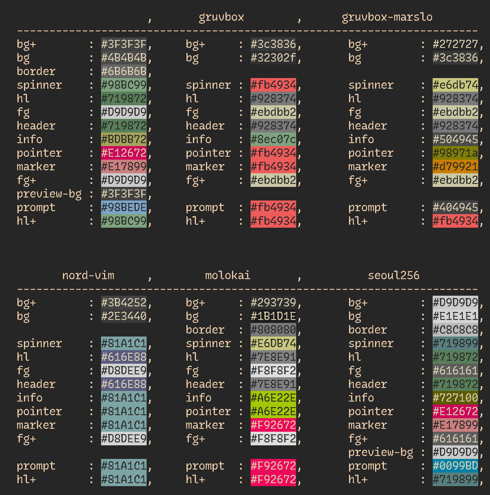
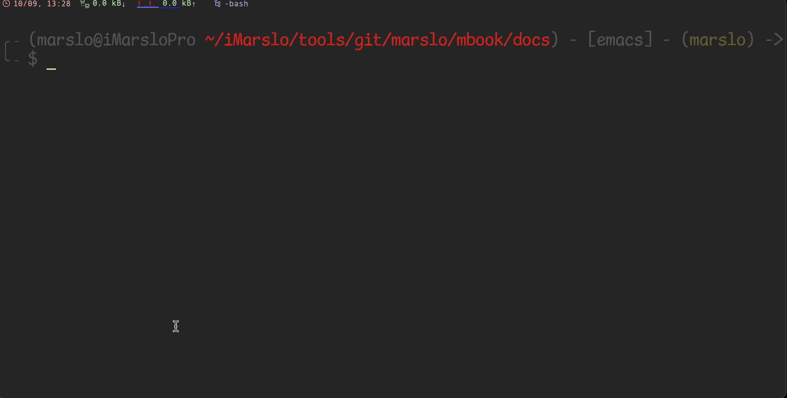

<!-- START doctoc generated TOC please keep comment here to allow auto update -->
<!-- DON'T EDIT THIS SECTION, INSTEAD RE-RUN doctoc TO UPDATE -->

- [`fzf`](#fzf)
  - [install](#install)
  - [shortcuts](#shortcuts)
    - [action and select](#action-and-select)
    - [movement](#movement)
    - [ctrl-t](#ctrl-t)
  - [usage](#usage)
    - [magic vim](#magic-vim)
    - [smart vimdiff](#smart-vimdiff)
    - [smart cat](#smart-cat)
    - [smart copy](#smart-copy)
    - [others](#others)
  - [advanced usage](#advanced-usage)
    - [man page](#man-page)
    - [git alias](#git-alias)
    - [environment](#environment)
    - [process](#process)
    - [kubectl](#kubectl)
    - [homebrew](#homebrew)
  - [config](#config)
    - [`ctrl-r`](#ctrl-r)
    - [`ctrl-t`](#ctrl-t)
    - [theme](#theme)
  - [tips](#tips)
- [`fd`](#fd)
  - [advanced usage](#advanced-usage-1)
- [`rg` the faster `mg`](#rg-the-faster-mg)
  - [usage](#usage-1)
- [`ag` the faster `mg`](#ag-the-faster-mg)
- [`fzy`](#fzy)
- [`bat`](#bat)
  - [usage](#usage-2)
  - [config](#config-1)
  - [theme](#theme-1)
- [`cheat.sh`](#cheatsh)
- [`ncdu` : NCurses Disk Usage](#ncdu--ncurses-disk-usage)
- [theme and colors](#theme-and-colors)
  - [`c`: bash-color](#c-bash-color)
  - [`ansi`](#ansi)
  - [`diff-so-fancy`](#diff-so-fancy)
- [utility](#utility)
  - [`elinks`](#elinks)
  - [`duf`](#duf)
  - [`enhancd`](#enhancd)
  - [watchman](#watchman)
  - [tmux](#tmux)

<!-- END doctoc generated TOC please keep comment here to allow auto update -->


> references:
> - [Best UNIX shell-based tools](https://gist.github.com/mbbx6spp/1429161)
> - [* alebcay/awesome-shell](https://github.com/alebcay/awesome-shell/tree/master) | [* zh-cn](https://github.com/alebcay/awesome-shell/blob/master/README_ZH-CN.md)
>   - [nosarthur/awesome-shell](https://github.com/nosarthur/awesome-shell)
> - [* rockerBOO/awesome-neovim](https://github.com/rockerBOO/awesome-neovim)
> - [sindresorhus/awesome](https://github.com/sindresorhus/awesome)
> - [Sainnhe's Dashboard: os in web browser](https://dashboard.sainnhe.dev/)
>   - [osx](https://macos.sainnhe.dev/) | [windows](https://windows.sainnhe.dev/)
> - others
>   - [bayandin/awesome-awesomeness](https://github.com/bayandin/awesome-awesomeness)
>   - [emijrp/awesome-awesome](https://github.com/emijrp/awesome-awesome)
>   - [kahun/awesome-sysadmin](https://github.com/kahun/awesome-sysadmin)
>   - [stup - Daily notes in the terminal](https://iridakos.com/programming/2020/04/20/stup-cli-notes)
>   - [Awesome Command-Line Tools](https://www.vimfromscratch.com/articles/awesome-command-line-tools)
> - [My Minimalist Over-powered Linux Setup Guide](https://medium.com/@jonyeezs/my-minimal-over-powered-linux-setup-guide-710931efb75b)
> - [* devynspencer/cute_commands.sh](https://gist.github.com/devynspencer/cfdce35b3230e72214ef)
> - [Use Bash Strict Mode (Unless You Love Debugging)](http://redsymbol.net/articles/unofficial-bash-strict-mode/)
> - [Learn Enough Command Line to Be Dangerous](https://www.learnenough.com/command-line-tutorial/basics)
> - [jlevy/the-art-of-command-line](https://github.com/jlevy/the-art-of-command-line)
> - [pv - Pipe Viewer](https://www.ivarch.com/programs/pv.shtml)


# [`fzf`](https://github.com/junegunn/fzf)


> - fuzzy completion in bash
>   - `$ cat **<tab>`
>   - `$ unset **<tab>`
>   - `$ unalias **<tab>`
>   - `$ export **<tab>`
>   - `$ ssh **<tab>`
>   - `$ kill -9 **<tab>`


> [!NOTE|label:references:]
> - [* fzf - FuZzy Finder Tutorial](https://www.youtube.com/watch?v=tB-AgxzBmH8)
>   - [Examples (completion)](https://github.com/junegunn/fzf/wiki/Examples-(completion))
>   - [Examples (vim)](https://github.com/junegunn/fzf/wiki/Examples-(vim))
>   - [On MacVim with iTerm2](https://github.com/junegunn/fzf/wiki/On-MacVim-with-iTerm2)
> - [* junegunn/fzf](https://github.com/junegunn/fzf)
>   - [fzf wiki](https://github.com/junegunn/fzf/wiki)
>   - [fzf screencasts by gotbletu](https://www.youtube.com/playlist?list=PLqv94xWU9zZ2fMsMMDF4PjtNHCeBFbggD)
>   - [junegunn/fzf-git.sh](https://github.com/junegunn/fzf-git.sh)
>   - fzf basics:
>     - [layout](https://qmacro.org/blog/posts/2021/02/02/fzf-the-basics-part-1-layout/)
>     - [search results](https://qmacro.org/blog/posts/2021/02/07/fzf-the-basics-part-2-search-results/)
>   - [examples](https://github.com/junegunn/fzf/wiki/examples)
>     - [Man pages](https://github.com/junegunn/fzf/wiki/Examples#man-pages)
>     - [Git](https://github.com/junegunn/fzf/wiki/Examples#git)
>   - [Advanced fzf examples](https://github.com/junegunn/fzf/blob/master/ADVANCED.md) | [Advanced fzf examples](https://fossies.org/linux/fzf/ADVANCED.md)
> - usage
>   - [Introduction to fzf command](https://www.baeldung.com/linux/fzf-command)
>   - [* Find anything you need with fzf, the Linux fuzzy finder tool](https://www.redhat.com/sysadmin/fzf-linux-fuzzy-finder)
>   - [Why you should be using fzf, the command line fuzzy finder](https://www.freecodecamp.org/news/fzf-a-command-line-fuzzy-finder-missing-demo-a7de312403ff/)
>   - [Linux下搜索神器fzf的配置和使用](https://blog.csdn.net/qq_39852676/article/details/126820806)
>   - [serenevoid/fzf_config.md](https://gist.github.com/serenevoid/13239752cfa41a75a69446b7beb26d7a)
>   - [4 Useful fzf Tricks for Your Terminal](https://pragmaticpineapple.com/four-useful-fzf-tricks-for-your-terminal/)
>   - [Improving shell workflows with fzf](https://seb.jambor.dev/posts/improving-shell-workflows-with-fzf/)
>   - [Day 18 - Awesome command-line fuzzy finding with fzf](https://sysadvent.blogspot.com/2017/12/day-18-awesome-command-line-fuzzy.html)
> - more tools
>   - [ggVGc/fzf_browser](https://github.com/ggVGc/fzf_browser/tree/master)
>   - [garybernhardt/selecta](https://github.com/garybernhardt/selecta)
>   - [scripts/rgfzf](https://github.com/naggie/dotfiles/blob/master/include/scripts/rgfzf)
> - vim
>   - [Improving Vim Workflow With fzf](https://pragmaticpineapple.com/improving-vim-workflow-with-fzf/)
>   - [* How to search faster in Vim with FZF.vim](https://dev.to/iggredible/how-to-search-faster-in-vim-with-fzf-vim-36ko)
>   - [* How FZF and ripgrep improved my workflow](https://sidneyliebrand.medium.com/how-fzf-and-ripgrep-improved-my-workflow-61c7ca212861) | [SidOfc/vim-rg-outdated-command.vim](https://gist.github.com/SidOfc/ba43acade7f4a1bf9faf57d16b33616a#file-vim-rg-outdated-command-vim)
>     ```vim
>     " fzf.vim now supports this command out of the box
>     " so this code is no longer needed.
>     command! -bang -nargs=* Rg
>       \ call fzf#vim#grep(
>       \   'rg --column --line-number --hidden --ignore-case --no-heading --color=always '.shellescape(<q-args>), 1,
>       \   <bang>0 ? fzf#vim#with_preview({'options': '--delimiter : --nth 4..'}, 'up:60%')
>       \           : fzf#vim#with_preview({'options': '--delimiter : --nth 4..'}, 'right:50%:hidden', '?'),
>       \   <bang>0)
>     ```
> - customize
>   - [* fzf wiki: color themes](https://github.com/junegunn/fzf/wiki/Color-schemes)
>   - [* fzf-color-theme.css](./fzf-color-theme.css)
>   - [#692 Custom selected character](https://github.com/junegunn/fzf/issues/692)


## install

```bash
$ brew install fzf fd
$ ln -sf $(brew --prefix fd)/share/bash-completion/completions/fd /usr/local/etc/bash_completion.d/fd
# debine
$ sudo apt install fd

$ FZF_DEFAULT_OPTS="--height 35%"
$ FZF_DEFAULT_OPTS+=" --layout=reverse"
$ FZF_DEFAULT_OPTS+=" --pointer='→' --marker='» ' --prompt='$ '"
$ FZF_DEFAULT_OPTS+=" --multi"
$ FZF_DEFAULT_OPTS+=" --inline-info"
$ FZF_DEFAULT_OPTS+=" --color=spinner:#e6db74,hl:#928374,fg:#ebdbb2,header:#928374,info:#504945,pointer:#98971a,marker:#d79921,fg+:#ebdbb2,prompt:#404945,hl+:#fb4934"
$ FZF_DEFAULT_COMMAND="fd --type f"
$ FZF_DEFAULT_COMMAND+=" --strip-cwd-prefix"
$ FZF_DEFAULT_COMMAND+=" --hidden"
$ FZF_DEFAULT_COMMAND+=" --follow"
$ FZF_DEFAULT_COMMAND+=" --exclude .git --exclude node_modules"
$ export FZF_DEFAULT_OPTS FZF_DEFAULT_COMMAND
```




- install from source code for wsl

  > [!NOTE|label:this solution for install latest fzf in wsl]
  > - in wsl Ubuntu, the fzf version is `0.29`
  >   ```bash
  >   $ sudo apt search fzf
  >   Sorting... Done
  >   Full Text Search... Done
  >   fzf/jammy 0.29.0-1 amd64
  >     general-purpose command-line fuzzy finder
  >   ```
  > - [* Fzf – A Quick Fuzzy File Search from Linux Terminal](https://www.tecmint.com/fzf-fuzzy-file-search-from-linux-terminal/)

  ```bash
  $ git clone git@github.com:junegunn/fzf.git
  $ bash -x install --all
  $ sudo cp bin/fzf* /usr/local/bin/
  ```

- offline install

  > [!NOTE]
  > - `curl: (60) SSL certificate problem: self-signed certificate in certificate chain`:
  >   ```bash
  >   $ curl -fL https://github.com/junegunn/fzf/releases/download/0.44.1/fzf-0.44.1-linux_amd64.tar.gz
  >   curl: (60) SSL certificate problem: self-signed certificate in certificate chain
  >   More details here: https://curl.se/docs/sslcerts.html
  >
  >   curl failed to verify the legitimacy of the server and therefore could not
  >   establish a secure connection to it. To learn more about this situation and
  >   how to fix it, please visit the web page mentioned above.
  >   ```
  > - [How to fix curl: (60) SSL certificate: Invalid certificate chain](https://stackoverflow.com/a/46843526/2940319)

  - `~/.curlrc`
    ```bash
    $ echo '--insecure' >> ~/.curlrc
    ```

  - offline installation
    ```bash
    ################ for offline installation only ################
    # check current version for offline installation
    $ uname -sm
    Linux x86_64

    # download correct package according https://github.com/junegunn/fzf/blob/master/install#L170
    # i.e.: Linux x86_64 -> fzf-$version-linux_amd64.tar.gz
    $ cp fzf-0.42.0-linux_amd64.tar.gz /tmp/fzf.tar.gz

    # modify install script `try_curl` function to not download but use local tar.gz directly
    $ cat << 'EOF' | git apply --inaccurate-eof --ignore-whitespace
    diff --git a/install b/install
    index 5ac191b..342bc49 100755
    --- a/install
    +++ b/install
    @@ -115,10 +115,8 @@ link_fzf_in_path() {
    try_curl() {
     command -v curl > /dev/null &&
     if [[ $1 =~ tar.gz$ ]]; then
    -    curl -fL $1 | tar -xzf -
    -  else
    -    local temp=${TMPDIR:-/tmp}/fzf.zip
    -    curl -fLo "$temp" $1 && unzip -o "$temp" && rm -f "$temp"
    +    local temp=${TMPDIR:-/tmp}/fzf.tar.gz
    +    tar -xzf "$temp" && rm -rf "$temp"
     fi
    }
    EOF

    ### or modify manually ###
    # try_curl() {
    #   command -v curl > /dev/null &&
    #   if [[ $1 =~ tar.gz$ ]]; then
    #     local temp=${TMPDIR:-/tmp}/fzf.tar.gz
    #     tar -xzf "$temp" && rm -rf "$temp"
    #   fi
    # }
    ################ for offline installation only ################
    ```

## shortcuts

> [!NOTE|label:references:]
> - [Using the finder](https://github.com/junegunn/fzf#using-the-finder)
> - [multiple select](https://github.com/junegunn/fzf.vim/issues/40#issuecomment-156037468)
>   - enable via : `--multi` or `-m`
>   - disable via : `--no-multi` or `+m`
> - [Customizing fzf Keybindings](https://thevaluable.dev/fzf-shell-integration/)
>
> | KEYSTROKE                    |   BASH FUNCTION   |     ZSH FUNCTION     | ENVIRONMENT VARIABLE |
> |------------------------------|:-----------------:|:--------------------:|----------------------|
> | <kbd>CTRL</kbd>-<kbd>t</kbd> |  `__fzf_select__` |       `__fsel`       | `FZF_CTRL_T_COMMAND` |
> | <kbd>CTRL</kbd>-<kbd>r</kbd> | `__fzf_history__` | `fzf-history-widget` | `FZF_CTRL_R_OPTS`    |
> | <kbd>ALT</kbd>-<kbd>c</kbd>  |    `__fzf_cd__`   |    `fzf-cd-widget`   | `FZF_ALT_C_COMMAND`  |

### action and select
<div style="margin-left: 1.5em;">
  <table>
  <thead>
    <tr>
      <th style="text-align:center;vertical-align:middle">OPEN</th>
      <th style="text-align:center;vertical-align:middle">SELECT ALL</th>
      <th style="text-align:center;vertical-align:middle">DESELECT ALL</th>
      <th style="text-align:center;vertical-align:middle">TOGGLE ALL</th>
      <th style="text-align:center;vertical-align:middle">MULTIPLE SELECT</th>
    </tr>
  </thead>
  <tbody>
    <tr>
      <td style="text-align:center; vertical-align:middle" rowspan="2"><kbd>⏎</kbd></td>
      <td style="text-align:center; vertical-align:middle" rowspan="2"><kbd>ctrl</kbd> + <kbd>s</kbd></td>
      <td style="text-align:center; vertical-align:middle" rowspan="2"><kbd>ctrl</kbd> + <kbd>d</kbd></td>
      <td style="text-align:center; vertical-align:middle" rowspan="2"><kbd>ctrl</kbd> + <kbd>t</kbd></td>
      <td style="text-align:center"><kbd>⇥</kbd></td>
    </tr>
    <tr>
      <td style="text-align:center"><kbd>shift</kbd> + <kbd>⇥</kbd></td>
    </tr>
  </tbody>
  </table>
</div>

### movement
<div style="margin-left: 1.5em;">
  <table>
  <thead>
    <tr>
      <th style="text-align:center;vertical-align:middle">PREVIOUS</th>
      <th style="text-align:center;vertical-align:middle">NEXT</th>
      <th style="text-align:center;vertical-align:middle">MULTIPLE SELECT</th>
    </tr>
  </thead>
  <tbody>
    <tr>
      <td style="text-align:center;"><kbd>↑</kbd></td>
      <td style="text-align:center;"><kbd>↓</kbd></td>
      <td style="text-align:center; vertical-align:middle" rowspan="2"><kbd>⇥</kbd></td>
    </tr>
    <tr>
      <td style="text-align:center;"><kbd>ctrl</kbd> + <kbd>k</kbd></td>
      <td style="text-align:center;"><kbd>ctrl</kbd> + <kbd>j</kbd></td>
    </tr>
    <tr>
      <td style="text-align:center;"><kbd>ctrl</kbd> + <kbd>p</kbd></td>
      <td style="text-align:center;"><kbd>ctrl</kbd> + <kbd>n</kbd></td>
      <td style="text-align:center; vertical-align:middle" rowspan="2"><kbd>shift</kbd> + <kbd>⇥</kbd></td>
    </tr>
    <tr>
      <td style="text-align:center;"><kbd>ctrl</kbd> + <kbd>k</kbd></td>
      <td style="text-align:center;"><kbd>ctrl</kbd> + <kbd>j</kbd></td>
    </tr>
  </tbody>
  </table>
</div>

### ctrl-t

> [!TIP]
> - customized shortcut key via:
>   ```bash
>   export FZF_CTRL_T_OPTS="${FZF_CTRL_T_OPTS} --bind 'ctrl-p:preview-up,ctrl-n:preview-down'"
>   export FZF_CTRL_T_OPTS="${FZF_CTRL_T_OPTS} --bind 'ctrl-/:change-preview-window(down|hidden|)'"
>   ```
> - [#358: Keyboard bindings for scrolling preview window?](https://github.com/junegunn/fzf.vim/issues/358#issuecomment-769589975)
> - [#211: Scroll inside preview?](https://github.com/junegunn/fzf.vim/issues/211)

- file list:
  <div style="margin-left: 1.5em;">
    <table>
    <thead>
      <tr>
        <th style="text-align:center;vertical-align:middle">PREVIOUS</th>
        <th style="text-align:center;vertical-align:middle">NEXT</th>
        <th style="text-align:center;vertical-align:middle">CHANGE PREVIEW WINDOWS</th>
      </tr>
    </thead>
    <tbody>
      <tr>
        <td style="text-align:center;"><kbd>↑</kbd></td>
        <td style="text-align:center;"><kbd>↓</kbd></td>
        <td style="text-align:center; vertical-align:middle" rowspan="3"><kbd>ctrl</kbd> + <kbd>/</kbd></td>
      </tr>
      <tr>
        <td style="text-align:center;"><kbd>ctrl</kbd> + <kbd>k</kbd></td>
        <td style="text-align:center;"><kbd>ctrl</kbd> + <kbd>j</kbd></td>
      </tr>
      <tr>
        <td style="text-align:center;"><kbd>ctrl</kbd> + <kbd>p</kbd></td>
        <td style="text-align:center;"><kbd>ctrl</kbd> + <kbd>n</kbd></td>
      </tr>
    </tbody>
    </table>
  </div>

- preview content:
  <div style="margin-left: 2.5em;">
    <table>
    <thead>
      <tr>
        <th style="text-align:center;vertical-align:middle">PREVIOUS</th>
        <th style="text-align:center;vertical-align:middle">NEXT</th>
      </tr>
    </thead>
    <tbody>
      <tr>
        <td style="text-align:center;"><kbd>shift</kbd> + <kbd>↑</kbd></td>
        <td style="text-align:center;"><kbd>shift</kbd> + <kbd>↓</kbd></td>
      </tr>
      <tr>
        <td style="text-align:center;"><kbd>ctrl</kbd> + <kbd>↑</kbd></td>
        <td style="text-align:center;"><kbd>ctrl</kbd> + <kbd>↓</kbd></td>
      </tr>
      <tr>
        <td style="text-align:center;"><kbd>ctrl</kbd> + <kbd>p</kbd></td>
        <td style="text-align:center;"><kbd>ctrl</kbd> + <kbd>n</kbd></td>
      </tr>
    </tbody>
    </table>
  </div>


## usage

> [!NOTE|label:references:]
> - [Advanced fzf examples](https://github.com/junegunn/fzf/blob/master/ADVANCED.md)
> - [Examples](https://github.com/junegunn/fzf/wiki/examples)

### magic vim

> [!TIP]
> - [v](https://github.com/junegunn/fzf/wiki/Examples#v)
> - [Opening files](https://github.com/junegunn/fzf/wiki/Examples#opening-files)

```bash
# magic vim - fzf list in recent modified order
# @author      : marslo
# @source      : https://github.com/marslo/mylinux/blob/master/confs/home/.marslo/bin/ffunc.sh
# @description :
#   - if `nvim` installed using `nvim` instead of `vim`
#     - using `-v` to force using `vim` instead of `nvim` even if nvim installed
#   - if `vim` commands without paramters, then call fzf and using vim to open selected file
#   - if `vim` commands with paramters
#       - if single paramters and parameters is directlry, then call fzf in target directory and using vim to open selected file
#       - otherwise call regular vim to open file(s)
#   - to respect fzf options by: `type -t _fzf_opts_completion >/dev/null 2>&1 && complete -F _fzf_opts_completion -o bashdefault -o default vim`
# shellcheck disable=SC2155
function vim() {                           # magic vim - fzf list in most recent modified order
  local voption
  local target
  local orgv                               # force using vim instead of nvim
  local VIM="$(type -P vim)"
  local foption='--multi --cycle '
  local fdOpt="--type f --hidden --follow --unrestricted --ignore-file $HOME/.fdignore --exclude Music"
  [[ "$(pwd)" = "$HOME" ]] && fdOpt+=' --max-depth 3'
  if ! uname -r | grep -q "Microsoft"; then fdOpt+=' --exec-batch ls -t'; fi

  while [[ $# -gt 0 ]]; do
    case "$1" in
                 -v ) orgv=1            ; shift   ;;
        -h | --help ) voption+="$1 "    ; shift   ;;
          --version ) voption+="$1 "    ; shift   ;;
                 -c ) voption+="$1 $2"  ; shift   ;;
      --startuptime ) voption+="$1 $2 " ; shift 2 ;;
                -Nu ) voption+="$1 $2 " ; shift 2 ;;
              --cmd ) voption+="$1 $2 " ; shift 2 ;;
                 -* ) foption+="$1 $2 " ; shift 2 ;;
                  * ) break                       ;;
    esac
  done

  [[ 1 -ne "${orgv}" ]] && command -v nvim >/dev/null && VIM="$(type -P nvim)"

  if [[ 0 -eq $# ]] && [[ -z "${voption}" ]]; then
    fd . ${fdOpt} | fzf ${foption} --bind="enter:become(${VIM} {+})"
  elif [[ 1 -eq $# ]] && [[ -d $1 ]]; then
    [[ '.' = "${1}" ]] && target="${1}" || target=". ${1}"
    fd ${target} ${fdOpt} | fzf ${foption} --bind="enter:become(${VIM} {+})"
  else
    # shellcheck disable=SC2068
    "${VIM}" ${voption} $@
  fi
}

# v - open files in ~/.vim_mru_files       # https://github.com/junegunn/fzf/wiki/Examples#v
# @author      : marslo
# @source      : https://github.com/marslo/mylinux/blob/master/confs/home/.marslo/bin/ffunc.sh
# @description : list 10 most recently used files via fzf, and open by regular vim
function v() {                             # v - open files in ~/.vim_mru_files
  local files
  files=$( grep --color=none -v '^#' ~/.vim_mru_files |
           while read -r line; do [ -f "${line/\~/$HOME}" ] && echo "$line"; done |
           fzf-tmux -d -m -q "$*" -1
         ) &&
  vim ${files//\~/$HOME}
}

# vimrc - open rc files list from "${rcPaths}"
# @author      : marslo
# @source      : https://github.com/marslo/mylinux/blob/master/confs/home/.marslo/bin/ffunc.sh
# @description :
#   - default rcPaths: ~/.marslo ~/.config/nvim ~/.*rc ~/.*profile ~/.*ignore
#   - using nvim if `command -v nvim` is true
#   - using `-v` force using `command vim` instead of `command nvim`
# shellcheck disable=SC2155
function vimrc() {                         # magic vim - fzf list in most recent modified order
  local orgv                               # force using vim instead of nvim
  local rcPaths="$HOME/.config/nvim $HOME/.marslo"
  local VIM="$(type -P vim)"
  local foption='--multi --cycle '
  local fdOpt="--type f --hidden --follow --unrestricted --ignore-file $HOME/.fdignore"
  if ! uname -r | grep -q "Microsoft"; then fdOpt+=' --exec-batch ls -t'; fi

  while [[ $# -gt 0 ]]; do
    case "$1" in
      -v ) orgv=1 ; shift ;;
       * ) break          ;;
    esac
  done

  [[ 1 -ne "${orgv}" ]] && command -v nvim >/dev/null && VIM="/usr/local/bin/nvim"
  (
    fd '.*rc|.*profile|.*ignore' $HOME --max-depth 1 ${fdOpt};
    echo "${rcPaths}" | fmt -1 | xargs -I{} bash -c "fd . {} --exclude ss/ --exclude log/ --exclude .completion/ ${fdOpt}" ;
  ) | fzf ${foption} --bind="enter:become(${VIM} {+})" \
                     --bind "ctrl-y:execute-silent(echo -n {+} | ${COPY})+abort" \
                     --header 'Press CTRL-Y to copy name into clipboard'
}
```




### smart vimdiff
```bash
function fzfInPath() {                   # return file name via fzf in particular folder
  local fdOpt="--type f --hidden --follow --unrestricted --ignore-file $HOME/.fdignore"
  if ! uname -r | grep -q 'Microsoft'; then fdOpt+=' --exec-batch ls -t'; fi
  [[ '.' = "${1}" ]] && path="${1}" || path=". ${1}"
  eval "fd ${path} ${fdOpt} | fzf --multi --cycle ${*:2} --header 'filter in ${1} :'"
}

# magic vimdiff - using fzf list in recent modified order
# @author      : marslo
# @source      : https://github.com/marslo/mylinux/blob/master/confs/home/.marslo/bin/ffunc.sh
# @description :
#   - if any of paramters is directory, then get file path via fzf in target path first
#   - if `vimdiff` commands without parameter , then compare files in `.` and `~/.marslo`
#   - if `vimdiff` commands with 1  parameter , then compare files in current path and `$1`
#   - if `vimdiff` commands with 2  parameters, then compare files in `$1` and `$2`
#   - otherwise ( if more than 2 parameters )  , then compare files in `${*: -2:1}` and `${*: -1}` with paramters of `${*: 1:$#-2}`
#   - to respect fzf options by: `type -t _fzf_opts_completion >/dev/null 2>&1 && complete -F _fzf_opts_completion -o bashdefault -o default vimdiff`
function vimdiff() {                       # smart vimdiff
  local lFile
  local rFile
  local option
  local var

  while [[ $# -gt 0 ]]; do
    case "$1" in
      --help ) option+="$1 "   ; shift   ;;
          -* ) option+="$1 $2 "; shift 2 ;;
           * ) break                     ;;
    esac
  done

  if [[ 0 -eq $# ]]; then
    lFile=$(fzfInPath '.' "${option}")
    # shellcheck disable=SC2154
    rFile=$(fzfInPath "${iRCHOME}" "${option}")
  elif [[ 1 -eq $# ]]; then
    lFile=$(fzfInPath '.' "${option}")
    [[ -d "$1" ]] && rFile=$(fzfInPath "$1" "${option}") || rFile="$1"
  elif [[ 2 -eq $# ]]; then
    [[ -d "$1" ]] && lFile=$(fzfInPath "$1" "${option}") || lFile="$1"
    [[ -d "$2" ]] && rFile=$(fzfInPath "$2" "${option}") || rFile="$2"
  else
    var="${*: 1:$#-2}"
    [[ -d "${*: -2:1}" ]] && lFile=$(fzfInPath "${*: -2:1}") || lFile="${*: -2:1}"
    [[ -d "${*: -1}"   ]] && rFile=$(fzfInPath "${*: -1}")   || rFile="${*: -1}"
  fi

  [[ -f "${lFile}" ]] && [[ -f "${rFile}" ]] && $(type -P vim) -d ${var} "${lFile}" "${rFile}"
}

# vd - open vimdiff loaded files from ~/.vim_mru_files
# @author      : marslo
# @source      : https://github.com/marslo/mylinux/blob/master/confs/home/.marslo/bin/ffunc.sh
# @description : list 10 most recently used files via fzf, and open by vimdiff
#   - if `vd` commands without parameter, list 10 most recently used files via fzf, and open selected files by vimdiff
#   - if `vd` commands with `-q` ( [q]uiet ) parameter, list 10 most recently used files via fzf and automatic select top 2, and open selected files by vimdiff
function vd() {                            # vd - open vimdiff loaded files from ~/.vim_mru_files
  [[ 1 -eq $# ]] && [[ '-q' = "$1" ]] && opt='--bind start:select+down+select+accept' || opt=''
  # shellcheck disable=SC2046
  files=$( grep --color=none -v '^#' ~/.vim_mru_files |
           xargs -d'\n' -I_ bash -c "sed 's:\~:$HOME:' <<< _" |
           fzf --multi 3 --sync --cycle --reverse ${opt}
         ) &&
  vimdiff $(xargs <<< "${files}")
}
```


### smart cat
```bash
# smart cat - using bat by default for cat content, respect bat options
# @author      : marslo
# @source      : https://github.com/marslo/mylinux/blob/master/confs/home/.marslo/bin/ffunc.sh
# @description :
#   - using `bat` by default if `command -v bat`
#     - using `-c` ( `c`at ) as 1st parameter, to force using `type -P cat` instead of `type -P bat`
#   - if `bat` without  paramter, then search file via `fzf` and shows via `bat`
#   - if `bat` with 1   paramter, and `$1` is directory, then search file via `fzf` from `$1` and shows via `bat`
#   - otherwise respect `bat` options, and shows via `bat`
# shellcheck disable=SC2046,SC2155
function cat() {                           # smart cat
  local fdOpt='--type f --hidden --follow --exclude .git --exclude node_modules'
  local CAT="$(type -P cat)"
  if ! uname -r | grep -q "Microsoft"; then fdOpt+=' --exec-batch ls -t'; fi
  command -v nvim >/dev/null && CAT="$(type -P bat)"

  if [[ 0 -eq $# ]]; then
    "${CAT}" --theme='gruvbox-dark' $(fd . ${fdOpt} | fzf --multi --cycle --exit-1)
  elif [[ '-c' = "$1" ]]; then
    $(type -P cat) "${@:2}"
  elif [[ 1 -eq $# ]] && [[ -d $1 ]]; then
    local target=$1;
    fd . "${target}" ${fdOpt} |
      fzf --multi --cycle --exit-1 --bind="enter:become(${CAT} --theme='gruvbox-dark' {+})" ;
  else
    "${CAT}" --theme='gruvbox-dark' "${@:1:$#-1}" "${@: -1}"
  fi
}
```


### smart copy
```bash
# smart copy - using `fzf` to list files and copy the selected file
# @author      : marslo
# @source      : https://github.com/marslo/mylinux/blob/master/confs/home/.marslo/bin/ffunc.sh
# @description :
#   - if `copy` without parameter, then list file via `fzf` and copy the content
#     - "${COPY}"
#       - `pbcopy` in osx
#       - `/mnt/c/Windows/System32/clip.exe` in wsl
#   - otherwise copy the content of parameter `$1` via `pbcopy` or `clip.exe`
# shellcheck disable=SC2317
function copy() {                          # smart copy
  local fdOpt='--type f --hidden --follow --exclude .git --exclude node_modules'
  [[ -z "${COPY}" ]] && echo -e "$(c Rs)ERROR: 'copy' function NOT support :$(c) $(c Ri)$(uanme -v)$(c)$(c Rs). EXIT..$(c)" && return;

  if [[ 0 -eq $# ]]; then
    file=$(fzf --cycle --exit-0) &&
      "${COPY}" < "${file}" &&
      echo -e "$(c Wd)>>$(c) $(c Gis)${file}$(c) $(c Wdi)has been copied ..$(c)"
  elif [[ 1 -eq $# ]] && [[ -d $1 ]]; then
    local target=$1;
    file=$( fd . "${target}" ${fdOpt} | fzf --cycle --exit-0 ) &&
      "${COPY}" < "${file}" &&
      echo -e "$(c Wd)>>$(c) $(c Gis)${file}$(c) $(c Wdi)has been copied ..$(c)"
  else
    "${COPY}" < "$1"
  fi
}
```


### others

- image view

  > [!NOTE]
  > - [eddieantonio/imgcat](https://github.com/eddieantonio/imgcat)

  ```bash
  # imgview - fzf list and preview images
  # @author      : marslo
  # @source      : https://github.com/marslo/mylinux/blob/master/confs/home/.marslo/bin/ffunc.sh
  # @description :
  #   - to respect fzf options by: `type -t _fzf_opts_completion >/dev/null 2>&1 && complete -F _fzf_opts_completion -o bashdefault -o default imgview`
  #   - disable `gif` due to imgcat performance issue
  # shellcheck disable=SC2215
  function imgview() {                       # view image via [imgcat](https://github.com/eddieantonio/imgcat)
    fd --unrestricted --type f --exclude .git --exclude node_modules '^*\.(png|jpeg|jpg|xpm|bmp)$' |
    fzf "$@" --height 100% \
             --preview "imgcat -W \$FZF_PREVIEW_COLUMNS -H \$FZF_PREVIEW_LINES {}" \
             --bind 'ctrl-y:execute-silent(echo -n {+} | pbcopy)+abort' \
             --header 'Press CTRL-Y to copy name into clipboard' \
             --preview-window 'down,80%,wrap' \
             --exit-0 \
    >/dev/null || true
  }
  ```

- [open files](https://github.com/junegunn/fzf/wiki/examples#opening-files)

  - `fs`
    ```bash
    $ function fs() { fzf --multi --bind 'enter:become(vim {+})' }
    ```

  - `fe`
    ```bash
    # fe [FUZZY PATTERN] - Open the selected file with the default editor
    #   - Bypass fuzzy finder if there's only one match (--select-1)
    #   - Exit if there's no match (--exit-0)
    fe() {
      IFS=$'\n' files=($(fzf-tmux --query="$1" --multi --select-1 --exit-0))
      [[ -n "$files" ]] && ${EDITOR:-vim} "${files[@]}"
    }
    ```

  - `fo`
    ```bash
    # Modified version where you can press
    #   - CTRL-O to open with `open` command,
    #   - CTRL-E or Enter key to open with the $EDITOR
    fo() {
      IFS=$'\n' out=("$(fzf-tmux --query="$1" --exit-0 --expect=ctrl-o,ctrl-e)")
      key=$(head -1 <<< "$out")
      file=$(head -2 <<< "$out" | tail -1)
      if [ -n "$file" ]; then
        [ "$key" = ctrl-o ] && open "$file" || ${EDITOR:-vim} "$file"
      fi
    }
    ```

- [search in files](https://github.com/junegunn/fzf/wiki/Examples#general)

  > [!NOTE]
  > - [#1057 Feature request: new option preview-window-scroll](https://github.com/junegunn/fzf/issues/1057#issuecomment-339347148)
  > - [gnanderson/fif.sh](https://gist.github.com/gnanderson/d74079d16714bb8b2822a7a07cc883d4)
  > - [Switching to fzf-only search mode](https://github.com/junegunn/fzf/blob/master/ADVANCED.md#switching-to-fzf-only-search-mode)
  > - [Switching between Ripgrep mode and fzf mode](https://github.com/junegunn/fzf/blob/master/ADVANCED.md#switching-to-fzf-only-search-mode)

  ```bash
  function fif() {                           # [f]ind-[i]n-[f]ile
    if [ ! "$#" -gt 0 ]; then echo "Need a string to search for!"; return 1; fi
    $(type -P rg) --files-with-matches --no-messages --hidden --follow --smart-case "$1" |
    fzf --bind 'ctrl-p:preview-up,ctrl-n:preview-down' \
        --bind "enter:become($(type -P vim) {+})" \
        --header 'CTRL-N/CTRL-P or CTRL-↑/CTRL-↓ to view contents' \
        --preview "bat --color=always --style=plain {} |
                   rg --no-line-number --colors 'match:bg:yellow' --ignore-case --pretty --context 10 \"$1\" ||
                   rg --no-line-number --ignore-case --pretty --context 10 \"$1\" {} \
                  "
  }

  # or highlight as preview tool
  function fif() {                           # [f]ind-[i]n-[f]ile
    if [ ! "$#" -gt 0 ]; then echo "Need a string to search for!"; return 1; fi
    rg --color never --files-with-matches --no-messages "$1" |
    fzf --bind 'ctrl-p:preview-up,ctrl-n:preview-down' \
        --preview "highlight -O ansi {} 2> /dev/null |
                   rg --colors 'match:bg:yellow' --ignore-case --pretty --context 10 '$1' ||
                   rg --no-line-number --ignore-case --pretty --context 10 '$1' {} \
                  "
  }
  ```

  

- changing directory

  > [!NOTE]
  > - [changing directory](https://github.com/junegunn/fzf/wiki/examples#changing-directory)
  > - fuzzy-cd : [rumpelsepp/fcd.fish](https://gist.github.com/rumpelsepp/b1b416f52d6790de1aee) | [chrisnorris/fcd.fish](https://gist.github.com/chrisnorris/fe57c7855fd87a2636999edf1d4d735b)
  > - [l4u/autojump_fzf.fish](https://gist.github.com/l4u/06502cf680b9a3817efddfb0a9a6ede8)

  - `fd`

    > [!DANGER]
    > **conflict with fd-find**

    ```bash
    # fd - cd to selected directory
    fd() {
      local dir
      dir=$(find ${1:-.} -path '*/\.*' -prune \
                         -o -type d -print 2> /dev/null | fzf +m) &&
      cd "$dir"
    }

    # Another fd - cd into the selected directory
    # This one differs from the above, by only showing the sub directories and not
    #  showing the directories within those.
    fd() {
      DIR=$(find * -maxdepth 0 -type d -print 2> /dev/null | fzf-tmux) && cd "$DIR"
    }
    ```

  - `fda`
    ```bash
    # fda - including hidden directories
    fda() {
      local dir
      dir=$(find ${1:-.} -type d 2> /dev/null | fzf +m) && cd "$dir"
    }
    ```

  - `cdp`
    ```bash
    # cdp - cd to selected parent directory
    cdp() {
      # shellcheck disable=SC2034,SC2316
      local declare dirs=()
      get_parent_dirs() {
        if [[ -d "${1}" ]]; then dirs+=("$1"); else return; fi
        if [[ "${1}" == '/' ]]; then
          for _dir in "${dirs[@]}"; do echo $_dir; done
        else
          # shellcheck disable=SC2046
          get_parent_dirs $(dirname "$1")
        fi
      }
      # shellcheck disable=SC2155,SC2046
      local DIR=$(get_parent_dirs $(realpath "${1:-$PWD}") | fzf-tmux --tac)
      cd "$DIR" || return
    }
    ```

  - `cdf`
    ```bash
    # cdf - cd into the directory of the selected file
    cdf() {
      local file
      local dir
      # shellcheck disable=SC2164
      file=$(fzf +m -q "$1") && dir=$(dirname "$file") && cd "$dir"
    }
    ```

- [Interactive cd](https://github.com/junegunn/fzf/wiki/Examples#interactive-cd)
  ```bash
  function cd() {
    if [[ "$#" != 0 ]]; then
      # shellcheck disable=SC2164
      builtin cd "$@";
      return
    fi
    while true; do
      # shellcheck disable=SC2155,SC2010
      local lsd=$(echo ".." && ls --color=none -p | grep --color=none '/$' | sed 's;/$;;')
      # shellcheck disable=SC2155,SC2016
      local dir="$(printf '%s\n' "${lsd[@]}" |
          fzf --reverse --preview '
              __cd_nxt="$(echo {})";
              __cd_path="$(echo $(pwd)/${__cd_nxt} | sed "s;//;/;")";
              echo $__cd_path;
              echo;
              ls -p --color=always "${__cd_path}";
      ')"
      [[ ${#dir} != 0 ]] || return 0
      # shellcheck disable=SC2164
      builtin cd "$dir" &> /dev/null
    done
  }
  ```

## advanced usage
### man page

> [!NOTE]
> - [fzf example: man page](https://github.com/junegunn/fzf/wiki/examples#man-pages)
> - [`fzf-man-widget()`](https://github.com/junegunn/fzf/wiki/examples#fzf-man-pages-widget-for-zsh)
> - [apropos(1) — Linux manual page](https://man7.org/linux/man-pages/man1/apropos.1.html)
> - [`fzf_apropos()`](https://gist.github.com/igemnace/9b6fb8c2885c3e35299b3a122e1009e5)

```bash
# fman - fzf list and preview for manpage:
# @source      : https://github.com/junegunn/fzf/wiki/examples#fzf-man-pages-widget-for-zsh
# @description :
#   - CTRL-N/CTRL-P or SHIFT-↑/↓ for view preview content
#   - ENTER/Q for toggle maximize/normal preview window
#   - CTRL+O  for toggle tldr in preview window
#   - CTRL+I  for toggle man in preview window
#   - to respect fzf options by: `type -t _fzf_opts_completion >/dev/null 2>&1 && complete -F _fzf_opts_completion -o bashdefault -o default fman`
# shellcheck disable=SC2046
function fman() {
  unset MANPATH
  local option
  local batman="man {1} | col -bx | bat --language=man --plain --color always --theme='gruvbox-dark'"

  while [[ $# -gt 0 ]]; do
    case "$1" in
          -* ) option+="$1 $2 "; shift 2 ;;
           * ) break                     ;;
    esac
  done

  man -k . |
  sort -u |
  sed -r 's/(\(.+\))//g' |
  grep -v -E '::' |
  awk -v cyan=$(tput setaf 6) -v blue=$(tput setaf 4) -v res=$(tput sgr0) -v bld=$(tput bold) '{ $1=cyan bld $1; $2=res blue $2;} 1' |
  fzf ${option:-} \
      -d ' ' \
      --nth 1 \
      --height 100% \
      --ansi \
      --no-multi \
      --tiebreak=begin \
      --prompt='ᓆ > ' \
      --color='prompt:#0099BD' \
      --preview-window 'up,70%,wrap,rounded,<50(up,85%,border-bottom)' \
      --preview "${batman}" \
      --bind 'ctrl-p:preview-up,ctrl-n:preview-down' \
      --bind "ctrl-o:+change-preview(tldr --color {1})+change-prompt(ﳁ tldr > )" \
      --bind "ctrl-i:+change-preview(${batman})+change-prompt(ᓆ  man > )" \
      --bind "enter:execute(${batman})+change-preview(${batman})+change-prompt(ᓆ > )" \
      --header 'CTRL-N/P or SHIFT-↑/↓ to view preview contents; ENTER/Q to maximize/normal preview window' \
      --exit-0
}
```

- simple version
  ```bash
  $ apropos . |
    fzf -d ') ' --nth 1 \
                --height 100% \
                --bind 'ctrl-p:preview-up,ctrl-n:preview-down' \
                --header 'CTRL-N/CTRL-P or CTRL-↑/CTRL-↓ to view contents' \
                --preview-window=up:88%:wrap \
                --preview 'echo {} | sed -r "s/([^\(]+).*$/\1/" | xargs man' \
                --exit-0 |
    sed -r "s/([^\(]+).*$/\1/" |
    xargs man
  ```


### git alias

> [!TIP]
> - [* iMarslo : git-del](https://github.com/marslo/mylinux/raw/master/confs/home/.marslo/bin/git-del) to delete both local and remote branches automatically
> - [junegunn/fzf-git.sh](https://github.com/junegunn/fzf-git.sh)

```
[alias]
  ### checkout sorted [b]ranch
  bb    = "! bash -c 'branch=$(git for-each-ref refs/remotes refs/heads --sort=-committerdate --format=\"%(refname:short)\" | \n\
                      grep --color=never -v \"origin$\" | \n\
                      fzf +m --prompt=\"branch> \" | \n\
                      sed -rn \"s:\\s*(origin/)?(.*)$:\\2:p\") && \n\
                      [[ -n \"${branch}\" ]] && \n\
                      echo -e \"\\033[1;33m~~> ${branch}\\033[0m\" && \n\
                      git checkout \"${branch}\"; \n\
                     '"

  ### [b]ranch [copy]
  bcopy = "! bash -c 'branch=$(git for-each-ref refs/remotes refs/heads --sort=-committerdate --format=\"%(refname:short)\" | \n\
                      grep --color=never -v \"origin$\" | \n\
                      fzf +m --prompt=\"branch> \" | \n\
                      sed -rn \"s:\\s*(origin/)?(.*)$:\\2:p\") && \n\
                      [[ -n \"${branch}\" ]] && \n\
                      echo -e \"\\033[0;33;1m~~> branch \\033[0m\\033[0;32;3m${branch}\\033[0m \\033[0;33;1mcopied\\033[0m\" && \n\
                      pbcopy <<< \"${branch}\" \n\
                     '"
```

### environment
- export
  ```bash
  # mkexp - compilation environment variable export, support multiple select
  # @author      : marslo
  # @source      : https://github.com/marslo/mylinux/blob/master/confs/home/.marslo/bin/ffunc.sh
  # @description : list compilation environment variable via `fzf`, and export selected items
  #   - if paramter is [ -f | --full ], then load full tool paths
  # shellcheck disable=SC1090
  function mkexp() {                         # [m]a[k]e environment variable [e][x][p]ort
    if [[ 1 -eq $# ]] && [[ '-f' = "$1" || '--full' = "$1" ]]; then
      source ~/.marslo/.imac
    fi

    LDFLAGS="${LDFLAGS:-}"
    test -d "${HOMEBREW_PREFIX}"      && LDFLAGS+=" -L${HOMEBREW_PREFIX}/lib"
    test -d '/usr/local/opt/readline' && LDFLAGS+=' -L/usr/local/opt/readline/lib'
    test -d "${OPENLDAP_HOME}"        && LDFLAGS+=" -L${OPENLDAP_HOME}/lib"
    test -d "${CURL_OPENSSL_HOME}"    && LDFLAGS+=" -L${CURL_OPENSSL_HOME}/lib"
    test -d "${BINUTILS}"             && LDFLAGS+=" -L${BINUTILS}/lib"
    test -d "${PYTHON_HOME}"          && LDFLAGS+=" -L${PYTHON_HOME}/lib"
    test -d "${RUBY_HOME}"            && LDFLAGS+=" -L${RUBY_HOME}/lib"
    test -d "${TCLTK_HOME}"           && LDFLAGS+=" -L${TCLTK_HOME}/lib"
    test -d "${SQLITE_HOME}"          && LDFLAGS+=" -L${SQLITE_HOME}/lib"
    test -d "${OPENSSL_HOME}"         && LDFLAGS+=" -L${OPENSSL_HOME}/lib"
    test -d "${NODE_HOME}"            && LDFLAGS+=" -L${NODE_HOME}/lib"                       # ${NODE_HOME}/libexec/lib for node@12
    test -d "${LIBRESSL_HOME}"        && LDFLAGS+=" -L${LIBRESSL_HOME}/lib"
    test -d "${ICU4C_711}"            && LDFLAGS+=" -L${ICU4C_711}/lib"
    test -d "${EXPAT_HOME}"           && LDFLAGS+=" -L${EXPAT_HOME}/lib"
    test -d "${NCURSES_HOME}"         && LDFLAGS+=" -L${NCURSES_HOME}/lib"
    test -d "${LIBICONV_HOME}"        && LDFLAGS+=" -L${LIBICONV_HOME}/lib"
    test -d "${ZLIB_HOME}"            && LDFLAGS+=" -L${ZLIB_HOME}/lib"
    test -d "${LLVM_HOME}"            && LDFLAGS+=" -L${LLVM_HOME}/lib"
    test -d "${LLVM_HOME}"            && LDFLAGS+=" -L${LLVM_HOME}/lib/c++ -Wl,-rpath,${LLVM_HOME}/lib/c++"  # for c++
    LDFLAGS=$( echo "$LDFLAGS" | tr ' ' '\n' | uniq | sed '/^$/d' | paste -s -d' ' )

    CFLAGS="${CFLAGS:-}"
    CFLAGS+=" -I/usr/local/include"
    test -d "${TCLTK_HOME}" && CFLAGS+=" -I${TCLTK_HOME}/include"
    CFLAGS=$( echo "$CFLAGS" | tr ' ' '\n' | uniq | sed '/^$/d' | paste -s -d' ' )

    CPPFLAGS="${CPPFLAGS:-}"
    test -d "${HOMEBREW_PREFIX}"      && CPPFLAGS+=" -I${HOMEBREW_PREFIX}/include"
    test -d "${JAVA_HOME}"            && CPPFLAGS+=" -I${JAVA_HOME}/include"
    test -d "${OPENLDAP_HOME}"        && CPPFLAGS+=" -I${OPENLDAP_HOME}/include"
    test -d "${CURL_OPENSSL_HOME}"    && CPPFLAGS+=" -I${CURL_OPENSSL_HOME}/include"
    test -d "${BINUTILS}"             && CPPFLAGS+=" -I${BINUTILS}/include"
    test -d "${SQLITE_HOME}"          && CPPFLAGS+=" -I${SQLITE_HOME}/include"
    test -d '/usr/local/opt/readline' && CPPFLAGS+=' -I/usr/local/opt/readline/include'
    test -d "${OPENSSL_HOME}"         && CPPFLAGS+=" -I${OPENSSL_HOME}/include"
    test -d "${NODE_HOME}"            && CPPFLAGS+=" -I${NODE_HOME}/include"
    test -d "${LIBRESSL_HOME}"        && CPPFLAGS+=" -I${LIBRESSL_HOME}/include"
    test -d "${TCLTK_HOME}"           && CPPFLAGS+=" -I${TCLTK_HOME}/include"
    test -d "${RUBY_HOME}"            && CPPFLAGS+=" -I${RUBY_HOME}/include"
    test -d "${ICU4C_711}"            && CPPFLAGS+=" -I${ICU4C_711}/include"
    test -d "${LLVM_HOME}"            && CPPFLAGS+=" -I${LLVM_HOME}/include"
    test -d "${LIBICONV_HOME}"        && CPPFLAGS+=" -I${LIBICONV_HOME}/include"
    test -d "${EXPAT_HOME}"           && CPPFLAGS+=" -I${EXPAT_HOME}/include"
    test -d "${NCURSES_HOME}"         && CPPFLAGS+=" -I${NCURSES_HOME}/include"
    test -d "${ZLIB_HOME}"            && CPPFLAGS+=" -I${ZLIB_HOME}/include"
    CPPFLAGS=$( echo "$CPPFLAGS" | tr ' ' '\n' | uniq | sed '/^$/d' | paste -s -d' ' )

    PKG_CONFIG_PATH=${PKG_CONFIG_PATH:-}
    PKG_CONFIG_PATH+=":${HOMEBREW_PREFIX}/lib/pkgconfig"
    test -d "${CURL_OPENSSL_HOME}"  && PKG_CONFIG_PATH+=":${CURL_OPENSSL_HOME}/lib/pkgconfig"
    test -d "${TCLTK_HOME}"         && PKG_CONFIG_PATH+=":${TCLTK_HOME}/lib/pkgconfig"
    command -v brew >/dev/null 2>&1 && PKG_CONFIG_PATH+=':/usr/local/Homebrew/Library/Homebrew/os/mac/pkgconfig/14'
    test -d "${SQLITE_HOME}"        && PKG_CONFIG_PATH+=":${SQLITE_HOME}/lib/pkgconfig"
    test -d "${OPENSSL_HOME}"       && PKG_CONFIG_PATH+=":${OPENSSL_HOME}/lib/pkgconfig"
    test -d "${PYTHON_HOME}"        && PKG_CONFIG_PATH+=":${PYTHON_HOME}/lib/pkgconfig"
    test -d "${RUBY_HOME}"          && PKG_CONFIG_PATH+=":${RUBY_HOME}/lib/pkgconfig"
    test -d "${LIBRESSL_HOME}"      && PKG_CONFIG_PATH+=":${LIBRESSL_HOME}/lib/pkgconfig"
    test -d "${ICU4C_711}"          && PKG_CONFIG_PATH+=":${ICU4C_711}/lib/pkgconfig"
    test -d "${EXPAT_HOME}"         && PKG_CONFIG_PATH+=":${EXPAT_HOME}/lib/pkgconfig"
    test -d "${NCURSES_HOME}"       && PKG_CONFIG_PATH+=":${NCURSES_HOME}/lib/pkgconfig"
    test -d "${ZLIB_HOME}"          && PKG_CONFIG_PATH+=":${ZLIB_HOME}/lib/pkgconfig"
    PKG_CONFIG_PATH=$( echo "$PKG_CONFIG_PATH" | tr ':' '\n' | uniq | sed '/^$/d' | paste -s -d: )

    LIBRARY_PATH="${HOMEBREW_PREFIX}/lib"
    test -d "${LIBICONV_HOME}" && LIBRARY_PATH+=":${LIBICONV_HOME}/lib"
    LIBRARY_PATH=$( echo "$LIBRARY_PATH" | tr ':' '\n' | uniq | sed '/^$/d' | paste -s -d: )

    LD_LIBRARY_PATH=/usr/local/lib
    LD_LIBRARY_PATH=$( echo "$LD_LIBRARY_PATH" | tr ':' '\n' | uniq | sed '/^$/d' | paste -s -d: )

    while read -r _env; do
      export "${_env?}"
      echo -e "$(c Ys)>> ${_env}$(c)\n$(c Wi).. $(eval echo \$${_env})$(c)"
    done < <( echo 'LDFLAGS CFLAGS CPPFLAGS PKG_CONFIG_PATH LIBRARY_PATH LD_LIBRARY_PATH' |
                    fmt -1 |
                    fzf -1 --exit-0 \
                           --no-sort \
                           --multi \
                           --cycle \
                           --prompt 'env> ' \
                           --header 'TAB/SHIFT-TAB to select multiple items, CTRL-D to deselect-all, CTRL-S to select-all'
            )
  }
  ```

- unset

  > - * alternative:
  >   ```bash
  >   $ unset ,,<TAB>
  >   # by deafult
  >   $ unset **<TAB>
  >   ```

  ```bash
  # eclr - environment variable clear, support multiple select
  # @author      : marslo
  # @source      : https://github.com/marslo/mylinux/blob/master/confs/home/.marslo/bin/ffunc.sh
  # @description : list all environment varialbe via `fzf`, and unset for selected items
  function eclr() {                          # [e]nvironment variable [c][l]ea[r]
    while read -r _env; do
      echo -e "$(c Ys)>> unset ${_env}$(c)\n$(c Wdi).. $(eval echo \$${_env})$(c)"
      unset "${_env}"
    done < <( env |
              sed -rn 's/^([a-zA-Z0-9]+)=.*$/\1/p' |
              fzf -1 --exit-0 --no-sort --multi --prompt='env> ' --header 'TAB to select multiple items'
            )
  }
  ```

- or unset limited to environment list
  ```bash
  # mkclr - compilation environment variable clear, support multiple select
  # @author      : marslo
  # @source      : https://github.com/marslo/mylinux/blob/master/confs/home/.marslo/bin/ffunc.sh
  # @description : list compilation environment variable via `fzf`, and unset for selected items
  function mkclr() {                         # [m]a[k]e environment variable [c][l]ea[r]
    while read -r _env; do
      echo -e "$(c Ys)>> unset ${_env}$(c)\n$(c Wdi).. $(eval echo \$${_env})$(c)"
      unset "${_env}"
    done < <( echo 'LDFLAGS CFLAGS CPPFLAGS PKG_CONFIG_PATH LIBRARY_PATH LD_LIBRARY_PATH' |
                    fmt -1 |
                    fzf -1 --exit-0 \
                           --no-sort \
                           --multi \
                           --cycle \
                           --prompt 'env> ' \
                           --header 'TAB/SHIFT-TAB to select multiple items, CTRL-D to deselect-all, CTRL-S to select-all'
            )
    # echo -e "\n$(c Wdi)[TIP]>> to list all env via $(c)$(c Wdiu)\$ env | sed -rn 's/^([a-zA-Z0-9]+)=.*$/\1/p'$(c)"
  }
  ```

  

- print and copy

  > [!NOTE|label:references:]
  > - `environ – user environment` : ( `man environ` )
  > - [`printenv`](https://www.gnu.org/software/coreutils/manual/html_node/printenv-invocation.html)

  ```bash
  # penv - print environment variable, support multiple select
  # @author      : marslo
  # @source      : https://github.com/marslo/mylinux/blob/master/confs/home/.marslo/bin/ffunc.sh
  # @description : list all environment variable via `fzf`, and print values for selected items
  #   - to copy via `-c`
  #     - "${COPY}"
  #       - `pbcopy` in osx
  #       - `/mnt/c/Windows/System32/clip.exe` in wsl
  #   - to respect fzf options via `type -t _fzf_opts_completion >/dev/null 2>&1 && complete -F _fzf_opts_completion -o bashdefault -o default penv`
  function penv() {                          # [p]rint [e]nvironment variable
    local option
    local -a array
    while [[ $# -gt 0 ]]; do
      case "$1" in
        -c ) option+="$1 "   ; shift   ;;
        -* ) option+="$1 $2 "; shift 2 ;;
         * ) break                     ;;
      esac
    done

    option+='-1 --exit-0 --sort --multi --cycle'
    while read -r _env; do
      echo -e "$(c Ys)>> ${_env}$(c)\n$(c Wi).. $(eval echo \$${_env})$(c)"
      array+=( "${_env}=$(eval echo \$${_env})" )
    done < <( env |
              sed -r 's/^([a-zA-Z0-9_-]+)=.*$/\1/' |
              fzf ${option//-c\ /} \
                  --prompt 'env> ' \
                  --header 'TAB/SHIFT-TAB to select multiple items, CTRL-D to deselect-all, CTRL-S to select-all'
            )
    [[ "${option}" == *-c\ * ]] && [[ -n "${COPY}" ]] && "${COPY}" < <( printf '%s\n' "${array[@]}" | head -c-1 )
  }
  ```

  

### process

> [!NOTE]
> - [Processes](https://github.com/junegunn/fzf/wiki/examples#processes)
> - [ctrl-r](https://github.com/junegunn/fzf/blob/master/ADVANCED.md#updating-the-list-of-processes-by-pressing-ctrl-r)

```bash
$ (date; ps -ef) |
  fzf --bind='ctrl-r:reload(date; ps -ef)' \
      --header=$'Press CTRL-R to reload\n\n' --header-lines=2 \
      --preview='echo {}' --preview-window=down,3,wrap \
      --layout=reverse --height=80% |
  awk '{print $2}'

# or kill
$ (date; ps -ef) |
  fzf --bind='ctrl-r:reload(date; ps -ef)' \
      --header=$'Press CTRL-R to reload\n\n' --header-lines=2 \
      --preview='echo {}' --preview-window=down,3,wrap \
      --layout=reverse --height=80% |
  awk '{print $2}' |
  xargs kill -9
```

- functions
  ```bash
  function lsps() {                          # [l]i[s]t [p]roces[s]
    (date; ps -ef) |
    fzf --bind='ctrl-r:reload(date; ps -ef)' \
        --header=$'Press CTRL-R to reload\n\n' --header-lines=2 \
        --preview='echo {}' --preview-window=down,3,wrap \
        --layout=reverse --height=80% |
    awk '{print $2}'
  }

  function killps() {                        # [kill] [p]roces[s]
    (date; ps -ef) |
    fzf --bind='ctrl-r:reload(date; ps -ef)' \
        --header=$'Press CTRL-R to reload\n\n' --header-lines=2 \
        --preview='echo {}' --preview-window=down,3,wrap \
        --layout=reverse --height=80% |
    awk '{print $2}' |
    xargs kill -9
  }
  ```

  

  

### kubectl
- `kns`
  ```bash
  # kns - kubectl set default namesapce
  # @author      : marslo
  # @source      : https://github.com/marslo/mylinux/blob/master/confs/home/.marslo/bin/ffunc.sh
  # @description : using `fzf` to list all available namespaces and use the selected namespace as default
  # [k]ubectl [n]ame[s]pace
  function kns() {                           # [k]ubectl [n]ame[s]pace
    local krn=$(kubecolor config get-contexts --no-headers $(kubectl config current-context) | awk "{print \$5}" | sed "s/^$/default/")
    kubectl get -o name namespace |
            sed "s|^.*/|  |;\|^  $(krn)$|s/ /*/" |
            fzf -e |
            sed "s/^..//" |
            xargs -i bash -c "echo -e \"\033[1;33m~~> {}\\033[0m\";
                              kubecolor config set-context --current --namespace {};
                              kubecolor config get-contexts;
                             "
  }

  # or limited with `kubectl get namespace`
  function kns() {
    echo 'namepsace-1 namespace-2 namespace-3 ...' |
          fmt -1 |
          fzf -1 -0 --no-sort +m --prompt='namespace> ' |
          xargs -i bash -c "echo -e \"\033[1;33m~~> {}\\033[0m\";
                            kubectl config set-context --current --namespace {};
                            kubecolor config get-contexts;
                           "
  }
  ```

- [Log tailing : pods](https://github.com/junegunn/fzf/blob/master/ADVANCED.md#log-tailing)
  ```bash
  pods() {
    : | command='kubectl get pods --all-namespaces' fzf \
      --info=inline --layout=reverse --header-lines=1 \
      --prompt "$(kubectl config current-context | sed 's/-context$//')> " \
      --header $'╱ Enter (kubectl exec) ╱ CTRL-O (open log in editor) ╱ CTRL-R (reload) ╱\n\n' \
      --bind 'start:reload:$command' \
      --bind 'ctrl-r:reload:$command' \
      --bind 'ctrl-/:change-preview-window(80%,border-bottom|hidden|)' \
      --bind 'enter:execute:kubectl exec -it --namespace {1} {2} -- bash > /dev/tty' \
      --bind 'ctrl-o:execute:${EDITOR:-vim} <(kubectl logs --all-containers --namespace {1} {2}) > /dev/tty' \
      --preview-window up:follow \
      --preview 'kubectl logs --follow --all-containers --tail=10000 --namespace {1} {2}' "$@"
  }
  ```

### [homebrew](https://github.com/junegunn/fzf/wiki/examples#homebrew)
- `bip`
  ```bash
  # Install (one or multiple) selected application(s)
  # using "brew search" as source input
  # mnemonic [B]rew [I]nstall [P]ackage
  bip() {
    local inst=$(brew search "$@" | fzf -m)

    if [[ $inst ]]; then
      for prog in $(echo $inst);
      do; brew install $prog; done;
    fi
  }
  ```

- `bup`
  ```bash
  # Update (one or multiple) selected application(s)
  # mnemonic [B]rew [U]pdate [P]ackage
  bup() {
    local upd=$(brew leaves | fzf -m)

    if [[ $upd ]]; then
      for prog in $(echo $upd);
      do; brew upgrade $prog; done;
    fi
  }
  ```

## config
### [`ctrl-r`](https://github.com/junegunn/fzf#key-bindings-for-command-line)
```bash
FZF_CTRL_R_OPTS="--preview 'echo {}'"
FZF_CTRL_R_OPTS+=" --preview-window up:3:hidden:wrap"
FZF_CTRL_R_OPTS+=" --bind 'ctrl-/:toggle-preview'"
FZF_CTRL_R_OPTS+=" --bind 'ctrl-y:execute-silent(echo -n {2..} | pbcopy)+abort'"
FZF_CTRL_R_OPTS+=" --color header:italic"
FZF_CTRL_R_OPTS+=" --header 'Press CTRL-Y to copy command into clipboard'"
export FZF_CTRL_R_OPTS

# or
export FZF_CTRL_R_OPTS="
  --preview 'echo {}' --preview-window up:3:hidden:wrap
  --bind 'ctrl-/:toggle-preview'
  --bind 'ctrl-y:execute-silent(echo -n {2..} | pbcopy)+abort'
  --color header:italic
  --header 'Press CTRL-Y to copy command into clipboard'"
```

-  `__fzf_history__`
  ```bash
  $ type __fzf_history__
  __fzf_history__ is a function
  __fzf_history__ ()
  {
      local output opts script;
      opts="--height ${FZF_TMUX_HEIGHT:-40%} --bind=ctrl-z:ignore ${FZF_DEFAULT_OPTS-} -n2..,.. --scheme=history --bind=ctrl-r:toggle-sort ${FZF_CTRL_R_OPTS-} +m --read0";
      script='BEGIN { getc; $/ = "\n\t"; $HISTCOUNT = $ENV{last_hist} + 1 } s/^[ *]//; print $HISTCOUNT - $. . "\t$_" if !$seen{$_}++';
      output=$(set +o pipefail
  builtin fc -lnr -2147483648 | last_hist=$(HISTTIMEFORMAT='' builtin history 1) command perl -n -l0 -e "$script" | FZF_DEFAULT_OPTS="$opts" $(__fzfcmd) --query "$READLINE_LINE") || return;
      READLINE_LINE=${output#*' '};
      if [[ -z "$READLINE_POINT" ]]; then
          echo "$READLINE_LINE";
      else
          READLINE_POINT=0x7fffffff;
      fi
  }

  $ fcf __fzf_history__
  /usr/local/Cellar/fzf/0.42.0/shell/key-bindings.bash
  ```

  

### [`ctrl-t`](https://github.com/junegunn/fzf#key-bindings-for-command-line)

> [!NOTE|label:references:]
> - to disable/reset osx default <kbd>⌃</kbd>+<kbd>↑</kbd> and <kbd>⌃</kbd>+<kbd>↓</kbd>
>   - **System Settings** ⇢ **Keyboard** ⇢ **Keyboard Shutcuts...** ⇢ **Mission Control**
>     
>
>   - **System Settings** ⇢ **Desktop & Dock** ⇢ **Shortcuts...**
>     

```bash
# preview file content using bat (https://github.com/sharkdp/bat)
FZF_CTRL_T_OPTS="--preview 'bat -n --color=always {}'"
FZF_CTRL_T_OPTS+=" --bind 'ctrl-/:change-preview-window(down|hidden|)'"
FZF_CTRL_T_OPTS+=" --bind 'ctrl-p:preview-up,ctrl-n:preview-down'"
FZF_CTRL_T_OPTS+=" --header 'CTRL-N/CTRL-P or CTRL-↑/CTRL-↓ to view contents'"
export FZF_CTRL_T_OPTS

# or
export FZF_CTRL_T_OPTS="
  --preview 'bat -n --color=always {}'
  --bind 'ctrl-p:preview-up,ctrl-n:preview-down'
  --bind 'ctrl-/:change-preview-window(down|hidden|)'"
```


- `__fzf_select__`
  ```bash
  $ type __fzf_select__
  __fzf_select__ is a function
  __fzf_select__ ()
  {
      local cmd opts;
      cmd="${FZF_CTRL_T_COMMAND:-"command find -L . -mindepth 1 \\( -path '*/.*' -o -fstype 'sysfs' -o -fstype 'devfs' -o -fstype 'devtmpfs' -o -fstype 'proc' \\) -prune     -o -type f -print     -o -type d -print     -o -type l -print 2> /dev/null | command cut -b3-"}";
      opts="--height ${FZF_TMUX_HEIGHT:-40%} --bind=ctrl-z:ignore --reverse --scheme=path ${FZF_DEFAULT_OPTS-} ${FZF_CTRL_T_OPTS-} -m";
      eval "$cmd" | FZF_DEFAULT_OPTS="$opts" $(__fzfcmd) "$@" | while read -r item; do
          printf '%q ' "$item";
      done
  }

  $ fcf __fzf_select__
  __fzf_select__ 19 /Users/marslo/.marslo/utils/fzf/shell/key-bindings.bas

  $ mdfind key-bindings.bas
  /Users/marslo/iMarslo/tools/git/marslo/mbook/docs/devops/adminTools.md
  /usr/local/Cellar/fzf/0.42.0/shell/key-bindings.bash
  ```

- [`__fzf_select_dir()`](https://github.com/junegunn/fzf/wiki/Examples#changing-directory)

  ```bash
  # another ctrl-t script to select a directory and paste it into line
  __fzf_select_dir () {
    builtin typeset READLINE_LINE_NEW="$(
      command find -L . \( -path '*/\.*' -o -fstype dev -o -fstype proc \) \
              -prune \
              -o -type f -print \
              -o -type d -print \
              -o -type l -print 2>/dev/null \
      | command sed 1d \
      | command cut -b3- \
      | env fzf -m
    )"

    if [[ -n $READLINE_LINE_NEW ]]; then
      builtin bind '"\er": redraw-current-line'
      builtin bind '"\e^": magic-space'
      READLINE_LINE=${READLINE_LINE:+${READLINE_LINE:0:READLINE_POINT}}${READLINE_LINE_NEW}${READLINE_LINE:+${READLINE_LINE:READLINE_POINT}}
      READLINE_POINT=$(( READLINE_POINT + ${#READLINE_LINE_NEW} ))
    else
      builtin bind '"\er":'
      builtin bind '"\e^":'
    fi
  }

  builtin bind -x '"\C-x1": __fzf_select_dir'
  builtin bind '"\C-t": "\C-x1\e^\er"'
  ```

### [theme](https://github.com/junegunn/fzf/blob/master/ADVANCED.md#color-themes)
```bash
# junegunn/seoul256.vim (dark)
export FZF_DEFAULT_OPTS='--color=bg+:#3F3F3F,bg:#4B4B4B,border:#6B6B6B,spinner:#98BC99,hl:#719872,fg:#D9D9D9,header:#719872,info:#BDBB72,pointer:#E12672,marker:#E17899,fg+:#D9D9D9,preview-bg:#3F3F3F,prompt:#98BEDE,hl+:#98BC99'

# junegunn/seoul256.vim (light)
export FZF_DEFAULT_OPTS='--color=bg+:#D9D9D9,bg:#E1E1E1,border:#C8C8C8,spinner:#719899,hl:#719872,fg:#616161,header:#719872,info:#727100,pointer:#E12672,marker:#E17899,fg+:#616161,preview-bg:#D9D9D9,prompt:#0099BD,hl+:#719899'

# morhetz/gruvbox
export FZF_DEFAULT_OPTS='--color=bg+:#3c3836,bg:#32302f,spinner:#fb4934,hl:#928374,fg:#ebdbb2,header:#928374,info:#8ec07c,pointer:#fb4934,marker:#fb4934,fg+:#ebdbb2,prompt:#fb4934,hl+:#fb4934'

# arcticicestudio/nord-vim
export FZF_DEFAULT_OPTS='--color=bg+:#3B4252,bg:#2E3440,spinner:#81A1C1,hl:#616E88,fg:#D8DEE9,header:#616E88,info:#81A1C1,pointer:#81A1C1,marker:#81A1C1,fg+:#D8DEE9,prompt:#81A1C1,hl+:#81A1C1'

# tomasr/molokai
export FZF_DEFAULT_OPTS='--color=bg+:#293739,bg:#1B1D1E,border:#808080,spinner:#E6DB74,hl:#7E8E91,fg:#F8F8F2,header:#7E8E91,info:#A6E22E,pointer:#A6E22E,marker:#F92672,fg+:#F8F8F2,prompt:#F92672,hl+:#F92672'
```

- [generating fzf color theme from vim color schemes](https://github.com/junegunn/fzf/blob/master/ADVANCED.md#generating-fzf-color-theme-from-vim-color-schemes)
  ```vim
  let g:fzf_colors =
  \ { 'fg':         ['fg', 'Normal'],
    \ 'bg':         ['bg', 'Normal'],
    \ 'preview-bg': ['bg', 'NormalFloat'],
    \ 'hl':         ['fg', 'Comment'],
    \ 'fg+':        ['fg', 'CursorLine', 'CursorColumn', 'Normal'],
    \ 'bg+':        ['bg', 'CursorLine', 'CursorColumn'],
    \ 'hl+':        ['fg', 'Statement'],
    \ 'info':       ['fg', 'PreProc'],
    \ 'border':     ['fg', 'Ignore'],
    \ 'prompt':     ['fg', 'Conditional'],
    \ 'pointer':    ['fg', 'Exception'],
    \ 'marker':     ['fg', 'Keyword'],
    \ 'spinner':    ['fg', 'Label'],
    \ 'header':     ['fg', 'Comment'] }

  :echo fzf#wrap()
  :call append('$', printf('export FZF_DEFAULT_OPTS="%s"', matchstr(fzf#wrap().options, "--color[^']*")))
  ```

## tips

- move cursor to position

  > [!TIP]
  > - [12af069 Add pos(...) action to move the cursor to the numeric position](https://github.com/junegunn/fzf/commit/12af069dcad672b1563388c61ec33ba8a86c013e)
  > - [#395 Feature: Set selected entries](https://github.com/junegunn/fzf/issues/395)

  ```bash
  $ seq 100 | fzf --sync --bind 'start:pos(N)'
  ```

  

  


- select by column

  > [!NOTE]
  > - [#3514 : Manual output on enter, no linebreak.](https://github.com/junegunn/fzf/discussions/3514#discussioncomment-7667338)

  ```bash
  $ seq 20 | pr -ts' ' --column 4
  1 6 11 16
  2 7 12 17
  3 8 13 18
  4 9 14 19
  5 10 15 20

  $ seq 20 | pr -ts' ' --column 4 | fzf --sync --bind 'start:select-all+become:cat {+f2}'
  6
  7
  8
  9
  10

  $ seq 20 | pr -ts' ' --column 4 | fzf --sync --bind 'start:select-all+become:echo {+2}'
  6 7 8 9 10
  ```

- `--with-nth`

  > [!NOTE]
  > - [#102: Feature Request: Option to hide some fields]

  ```bash
  $ echo {a..z} | fzf --with-nth='1..3'
  ```

  

  ```bash
  # https://github.com/junegunn/fzf/issues/1323#issuecomment-499615418
  # for git comment show
  $ git log --pretty=oneline |
    fzf --ansi --delimiter=' ' --no-multi --preview='git show --color=always {1}' --with-nth=2.. |
    cut --delimiter=' ' --field=1
  ```

  

  ```bash
  $ echo -e 'first line\tfirst preview\nsecond line\tsecond preview' |
    fzf --delimiter='\t' --with-nth=1 --preview='echo {2}'
  ```

  

- `--track`
  ```bash
  $ git log --oneline --graph --color=always |
    nl |
    fzf --ansi --track --no-sort --layout=reverse-list
  ```

  

- select-all
  ```bash
  $ seq 3 | fzf --multi --sync --bind start:last+select-all
  ```

  


- select-n

  > [!TIP]
  > - [#3548 - [new feature] ask for select-n feature](https://github.com/junegunn/fzf/issues/3548#issuecomment-1868433219)

  ```bash
  # select top 2 and move down
  $ seq 10 | fzf --multi --sync --reverse --bind start:select+down+select+down

  # select top 2
  $ seq 10 | fzf --multi --sync --reverse --bind start:select+down+select
  ```

  

  

- for git

  > [!NOTE]
  > - [fshow](https://github.com/junegunn/fzf/issues/1323#issuecomment-780326885)

  ```bash
  # cannot be used to grab a sha as an argument.
  fshow() {
    git log --color=always \
        --format="%C(auto)%h%d %s %C(black)%C(bold)%cr" "$@" |
    fzf --ansi --no-sort --reverse --tiebreak=index --bind=ctrl-s:toggle-sort \
        --bind "ctrl-o:execute(git show --color=always {1})"
  }
  ```

  - [view history by fzf, show revision number finally](https://github.com/junegunn/fzf/issues/1323#issuecomment-781244399)
    ```bash
    $ git log --pretty=oneline \
          | fzf --ansi --delimiter=' ' --no-multi --preview='git show --color=always {1}' --with-nth=2.. \
          | cut --delimiter=' ' --field=1
    # or
    $ git log --pretty=oneline --all \
          | fzf --ansi --no-multi --preview='git show --color=always {1}' --with-nth=2.. \
          | awk '{print $1}'
    ```

  - [pr checkout](https://seb.jambor.dev/posts/improving-shell-workflows-with-fzf/)

    > [!NOTE]
    > - [github cli: `gh`](https://cli.github.com/)

    ```bash
    function pr-checkout() {
      local jq_template pr_number

      jq_template='"'\
        '#\(.number) - \(.title)'\
        '\t'\
        'Author: \(.user.login)\n'\
        'Created: \(.created_at)\n'\
        'Updated: \(.updated_at)\n\n'\
        '\(.body)'\
        '"'

      pr_number=$(
        gh api 'repos/:owner/:repo/pulls' |
        jq ".[] | $jq_template" |
        sed -e 's/"\(.*\)"/\1/' -e 's/\\t/\t/' |
        fzf \
          --with-nth=1 \
          --delimiter='\t' \
          --preview='echo -e {2}' \
          --preview-window=top:wrap |
        sed 's/^#\([0-9]\+\).*/\1/'
      )

      if [ -n "$pr_number" ]; then
        gh pr checkout "$pr_number"
      fi
    }
    ```

- [creating feature branches from JIRA issues](https://seb.jambor.dev/posts/improving-shell-workflows-with-fzf/)
  ```bash
  function create-branch() {
    # The function expectes that username and password are stored using secret-tool.
    # To store these, use
    # secret-tool store --label="JIRA username" jira username
    # secret-tool store --label="JIRA password" jira password

    local jq_template query username password branch_name

    jq_template='"'\
      '\(.key). \(.fields.summary)'\
      '\t'\
      'Reporter: \(.fields.reporter.displayName)\n'\
      'Created: \(.fields.created)\n'\
      'Updated: \(.fields.updated)\n\n'\
      '\(.fields.description)'\
      '"'
    query='project=BLOG AND status="In Progress" AND assignee=currentUser()'
    username=$(secret-tool lookup jira username)
    password=$(secret-tool lookup jira password)

    branch_name=$(
      curl \
        --data-urlencode "jql=$query" \
        --get \
        --user "$username:$password" \
        --silent \
        --compressed \
        'https://jira.example.com/rest/api/2/search' |
      jq ".issues[] | $jq_template" |
      sed -e 's/"\(.*\)"/\1/' -e 's/\\t/\t/' |
      fzf \
        --with-nth=1 \
        --delimiter='\t' \
        --preview='echo -e {2}' \
        --preview-window=top:wrap |
      cut -f1 |
      sed -e 's/\. /\t/' -e 's/[^a-zA-Z0-9\t]/-/g' |
      awk '{printf "%s/%s", $1, tolower($2)}'
    )

    if [ -n "$branch_name" ]; then
      git checkout -b "$branch_name"
    fi
  }
  ```

# [`fd`](https://github.com/sharkdp/fd)

> [!NOTE|label:references:]
> - [Find Files With the fd Command](https://www.linode.com/docs/guides/finding-files-with-fd-command/)
> - [How to Use the fd Command on Linux](https://www.howtogeek.com/682244/how-to-use-the-fd-command-on-linux/)
> - [How to Find Files with fd Command in Linux](https://www.atlantic.net/vps-hosting/how-to-find-files-with-fd-command-in-linux/)
> - [Fd – The Best Alternative to ‘Find’ Command for Quick File Searching](https://www.tecmint.com/fd-alternative-to-find-command/)
> - [File list of package fd-find in noble of architecture amd64](https://packages.ubuntu.com/noble/amd64/fd-find/filelist)
> - [Download Page for fd-find_9.0.0-1_amd64.deb on AMD64 machines](https://packages.ubuntu.com/noble/amd64/fd-find/download)

-  install
  ```bash
  # osx
  $ brew install fd
  # v9.0.0
  $ ln -sf $(brew --prefix fd)/share/bash-completion/completions/fd /usr/local/etc/bash_completion.d/fd

  # debine
  $ sudo apt install fd-find                  # ubuntu 22.04 : fd 8.3.1
  $ curl -fsSL -O http://ftp.osuosl.org/pub/ubuntu/pool/universe/r/rust-fd-find/fd-find_9.0.0-1_amd64.deb
  $ sudo dpkg -i fd-find_9.0.0-1_amd64.deb    # ubuntu any: fd 9.0.0
  $ ln -s $(which fdfind) ~/.local/bin/fd
  $ export PATH=~/.local:$PATH

  # centos
  $ sudo dnf install fd-find
  ```

  - from source

    > [!NOTE]
    > - install rust via
    >   ```bash
    >   $ curl --proto '=https' --tlsv1.2 -sSf https://sh.rustup.rs | sh
    >   $ source "$HOME/.cargo/env"
    >   $ cargo --version
    >   cargo 1.74.1 (ecb9851af 2023-10-18)
    >   ```

    ```bash
    $ git clone https://github.com/sharkdp/fd && cd fd

    # osx
    $ brew install rust
    $ cargo install amethyst_tools
    # wsl/ubuntu
    $ sudo apt install cargo

    $ cargo build                     # build
    $ cargo test                      # run unit tests and integration tests
    $ cargo install --debug --path .  # install in osx
    $ cargo install --path .          # install in ubuntu/wsl
    $ ln -sf /home/marslo/.cargo/bin/fd /home/marslo/.local/bin/fd

    # completion ( >= 9.0.0 )
    # wsl/ubuntu/centos
    $ fd --gen-completions | sudo tee /usr/share/bash-completion/completions/fd
    # or centos
    $ fd --gen-completions | sudo tee /etc/bash_completion.d/fd
    # osx
    $ fd --gen-completions | sudo tee /usr/local/etc/bash_completion.d/fd
    ```

- verify
  ```bash
  $ fd --version
  fd 9.0.0
  ```

- usage
  ```bash
  $ fd --hidden ^.env$
  .env

  $ fd --type f --strip-cwd-prefix --hidden --follow --exclude .git --exclude node_modules ifunc
  bin/ifunc.sh
  ```

## advanced usage
- crontab for delete '*\.DS_*'
  ```bash
  /usr/local/bin/fd -IH --glob '*\.DS_*' $HOME | xargs -r -i rm '{}'
  # or
  /usr/local/bin/fd -Iu --glob '*\.DS_*' $HOME | xargs -r -i rm '{}'
  # or
  /usr/local/bin/fd --type f --hidden --follow --unrestricted --color=never --exclude .Trash --glob '*\.DS_*' $HOME  | xargs -r -i rm '{}'
  ```

- [`ff`](https://github.com/marslo/mylinux/raw/master/confs/home/.marslo/bin/ff)

  

- `ffs`
  ```bash
  # [f]ind [f]ile and [s]ort
  function ffs() {
    local opt=''
    while [[ $# -gt 0 ]]; do
      case "$1" in
            -g ) opt+="$1 "   ; shift   ;;
           -fg ) opt+="$1 "   ; shift   ;;
            -f ) opt+="$1 "   ; shift   ;;
           --* ) opt+="$1 $2 "; shift 2 ;;
            -* ) opt+="$1 "   ; shift   ;;
             * ) break                  ;;
      esac
    done

    local path=${1:-~/.marslo}
    local num=${2:-10}
    num=${num//-/}
    local depth=${3:-}
    depth=${depth//-/}
    local option='--type f'

    if [[ "${opt}" =~ '-g ' ]]; then
      # git show --name-only --pretty="format:" -"${num}" | awk 'NF' | sort -u
      # references: https://stackoverflow.com/a/54677384/2940319
      git log --date=iso-local --first-parent --pretty=%cd --name-status --relative |
          awk 'NF==1{date=$1}NF>1 && !seen[$2]++{print date,$0}' FS=$'\t' |
          head -"${num}"
    elif [[ "${opt}" =~ '-fg ' ]]; then
      # references: https://stackoverflow.com/a/63864280/2940319
      git ls-tree -r --name-only HEAD -z |
          TZ=PDT xargs -0 -I_ git --no-pager log -1 --date=iso-local --format="%ad | _" -- _ |
          sort -r |
          head -"${num}"
    elif [[ "${opt}" =~ '-f ' ]]; then
      option=${option: 1}
      [[ -n "${depth}" ]] && option="-maxdepth ${depth} ${option}"
      # shellcheck disable=SC2086
      find "${path}" ${option} \
                     -not -path '*/\.git/*' \
                     -not -path '*/node_modules/*' \
                     -not -path '*/go/pkg/*' \
                     -not -path '*/git/git*/*' \
                     -not -path '*/.marslo/utils/*' \
                     -not -path '*/.marslo/.completion/*' \
                     -printf "%10T+ | %p\n" |
      sort -r |
      head -"${num}"
    else
      if [[ "${opt}}" =~ .*-t.* ]] || [[ "${opt}" =~ .*--type.* ]]; then
        option="${option//--type\ f/}"
      fi
      option="${opt} ${option} --hidden --follow --unrestricted --ignore-file ~/.fdignore"
      [[ -n "${depth}"    ]] && option="--max-depth ${depth} ${option}"
      [[ '.' != "${path}" ]] && option="${path} ${option}"
      # shellcheck disable=SC2086,SC2027
      eval """ fd . "${option}" --exec stat --printf='%y | %n\n' | sort -r | head -"${num}" """
    fi
  }
  ```

  

- search for multiple pattern

  > [!NOTE]
  > - [#1139 add support for matching multiple patterns](https://github.com/sharkdp/fd/pull/1139#issuecomment-1297725086)
  > - [#315 Finding multiple patterns](https://github.com/sharkdp/fd/issues/315#issuecomment-841869872)

  ```bash
  $ fd --unrestricted '^*\.(png|gif|jpg)$'
  $ fd --unrestricted --extension png --extension jpg --extension gif
  ```

# [`rg`](https://github.com/BurntSushi/ripgrep) the faster [`mg`](https://github.com/marslo/mylinux/blob/master/confs/home/.marslo/bin/im.sh#L50)

> [!NOTE]
> - [#193: [Question] how to search by filenames only?](https://github.com/BurntSushi/ripgrep/issues/193#issuecomment-775059326)
> - [How can I recursively find all files in current and subfolders based on wildcard matching?](https://stackoverflow.com/a/50840902/2940319)
> - [chinanf-boy/ripgrep-zh](https://github.com/chinanf-boy/ripgrep-zh/tree/master)
>   - [ripgrep-zh/GUIDE.zh.md](https://github.com/chinanf-boy/ripgrep-zh/blob/master/GUIDE.zh.md)
> - [How to get a git's branch with fuzzy finder?](https://stackoverflow.com/a/37007733/2940319)
> - [Integralist/RipGrep inline file replacements.sh](https://gist.github.com/Integralist/89ad7fe05f72941b87c6e3512c30d940)
> )

- install
  ```bash
  # with cargo
  $ cargo install ripgrep

  # osx
  $ brew install ripgrep

  # rhel/centos
  $ sudo yum install -y yum-utils
  $ sudo yum-config-manager --add-repo=https://copr.fedorainfracloud.org/coprs/carlwgeorge/ripgrep/repo/epel-7/carlwgeorge-ripgrep-epel-7.repo
  $ sudo yum install ripgrep
  # or via epel: https://marslo.github.io/ibook/linux/basic.html#tools-installation
  $ sudo yum install -y yum-utils epel-release
  $ sudo yum install ripgrep

  # ubuntu
  $ curl -LO https://github.com/BurntSushi/ripgrep/releases/download/14.0.3/ripgrep_14.0.3-1_amd64.deb
  $ sudo dpkg -i ripgrep_14.0.3-1_amd64.deb
  # or
  $ sudo apt install -y ripgrep

  # from source
  $ git clone https://github.com/BurntSushi/ripgrep && cd ripgrep
  $ cargo build --release
  $ ./target/release/rg --version
  0.1.3

  # completion
  # wsl/ubuntu/centos
  $ rg --generate complete-bash | sudo tee /usr/share/bash-completion/completions/rg
  # or centos
  $ rg --generate complete-bash | sudo tee /etc/bash_completion.d/rg
  # osx
  $ rg --generate complete-bash | sudo tee /usr/local/etc/bash_completion.d/rg
  ```

## usage
- crontab for delete '*\.DS_*'
  ```bash
  /usr/local/bin/rg --hidden --smart-case --files "$HOME" -g  '*\.DS_*' | xargs -r -i rm '{}'
  ```

- [search in dotfiles with ripgrep](https://til.hashrocket.com/posts/ezeddwpiso-search-in-dotfiles-with-ripgrep)

  > [!NOTE|label:references:]
  > - [#771 : .gitignore files might be searched without using '--hidden'](https://github.com/BurntSushi/ripgrep/issues/771)
  > - [#919 : RipGrep does not show hidden files even with the --hidden flag](https://github.com/BurntSushi/ripgrep/issues/919)

  ```bash
  $ rg --hidden 'alias cat'

  # or https://github.com/BurntSushi/ripgrep/issues/623#issuecomment-659909044
  alias rg="rg --hidden --glob '!.git'"

  # or `.ignore` or `.rgignore`
  $ cat ~/.rgignore
  .git/
  .tox/
  .github/
  ```

- info
  ```bash
  $ tree -a .
  .
  ├── .no-hidden
  └── no-hidden

  1 directory, 2 files

  $ rg --files --debug
  DEBUG|globset|crates/globset/src/lib.rs:416: glob converted to regex: Glob { glob: "**/.DS_Store?", re: "(?-u)^(?:/?|.*/)\\.DS_Store[^/]$", opts: GlobOptions { case_insensitive: false, literal_separator: true, backslash_escape: true }, tokens: Tokens([RecursivePrefix, Literal('.'), Literal('D'), Literal('S'), Literal('_'), Literal('S'), Literal('t'), Literal('o'), Literal('r'), Literal('e'), Any]) }
  DEBUG|globset|crates/globset/src/lib.rs:416: glob converted to regex: Glob { glob: "**/._*", re: "(?-u)^(?:/?|.*/)\\._[^/]*$", opts: GlobOptions { case_insensitive: false, literal_separator: true, backslash_escape: true }, tokens: Tokens([RecursivePrefix, Literal('.'), Literal('_'), ZeroOrMore]) }
  DEBUG|globset|crates/globset/src/lib.rs:421: built glob set; 0 literals, 7 basenames, 0 extensions, 0 prefixes, 0 suffixes, 0 required extensions, 2 regexes
  DEBUG|ignore::walk|crates/ignore/src/walk.rs:1741: ignoring ./.no-hidden: Ignore(IgnoreMatch(Hidden))
  no-hidden

  $ rg --files --debug --hidden
  DEBUG|globset|crates/globset/src/lib.rs:416: glob converted to regex: Glob { glob: "**/.DS_Store?", re: "(?-u)^(?:/?|.*/)\\.DS_Store[^/]$", opts: GlobOptions { case_insensitive: false, literal_separator: true, backslash_escape: true }, tokens: Tokens([RecursivePrefix, Literal('.'), Literal('D'), Literal('S'), Literal('_'), Literal('S'), Literal('t'), Literal('o'), Literal('r'), Literal('e'), Any]) }
  DEBUG|globset|crates/globset/src/lib.rs:416: glob converted to regex: Glob { glob: "**/._*", re: "(?-u)^(?:/?|.*/)\\._[^/]*$", opts: GlobOptions { case_insensitive: false, literal_separator: true, backslash_escape: true }, tokens: Tokens([RecursivePrefix, Literal('.'), Literal('_'), ZeroOrMore]) }
  DEBUG|globset|crates/globset/src/lib.rs:421: built glob set; 0 literals, 7 basenames, 0 extensions, 0 prefixes, 0 suffixes, 0 required extensions, 2 regexes
  no-hidden
  .no-hidden
  ```

  

# [`ag`](https://github.com/ggreer/the_silver_searcher) the faster [`mg`](https://github.com/marslo/mylinux/blob/master/confs/home/.marslo/bin/im.sh#L50)
- install
  ```bash
  # osx
  $ brew install the_silver_searcher

  # ubuntu >= 13.10
  $ apt-get install silversearcher-ag
  ```

# [`fzy`](https://github.com/jhawthorn/fzy)
- install
  ```bash
  # osx
  $ brew install fzy

  # debine
  $ sudo apt install fzy

  # source code
  $ git clone git@github.com:jhawthorn/fzy.git && cd fzy
  $ make
  $ sudo make install
  ```

- verify
  ```bash
  $ fzy --version
  fzy 1.0 © 2014-2018 John Hawthorn
  ```

# [`bat`](https://github.com/sharkdp/bat)

> [!NOTE|label:references:]
> - [Install and Use the Linux bat Command](https://www.linode.com/docs/guides/how-to-install-and-use-the-bat-command-on-linux/)
> - [Using vim as a man-page viewer under Unix](https://vim.fandom.com/wiki/Using_vim_as_a_man-page_viewer_under_Unix)
>   - `unset PAGER`
> - [CentOS 7 - Installing the latest bat command release version from GitHub](https://github.com/sharkdp/bat/issues/325#issuecomment-697947031)

- install
  ```bash
  # ubuntu
  $ sudo apt intall bat -y
  $ ln -s /usr/bin/batcat ~/.marslo/bin/bat

  # ubuntu latest version
  $ sudo apt instal -y https://github.com/sharkdp/bat/releases/download/v0.23.0/bat-musl_0.23.0_amd64.deb
  $ ln -s /usr/bin/batcat ~/.marslo/bin/bat

  # from release package
  $ curl -fsSL https://github.com/sharkdp/bat/releases/download/v0.23.0/bat-v0.23.0-x86_64-unknown-linux-musl.tar.gz |
         tar xzf - -C ${iRCHOME}/utils/bat-v0.23.0
  $ ln -sf ${iRCHOME}/utils/bat-v0.23.0/bat ${iRCHOME}/bin/bat
  # or
  $ V=$(curl --silent "https://api.github.com/repos/sharkdp/bat/releases/latest" | grep -Eo '"tag_name": "v(.*)"' | sed -E 's/.*"([^"]+)".*/\1/') &&
      curl -sOL "https://github.com/sharkdp/bat/releases/download/$V/bat-$V-x86_64-unknown-linux-musl.tar.gz" &&
      tar xzvf "bat-$V-x86_64-unknown-linux-musl.tar.gz" -C . &&
      sudo sh -c "cp ./bat-$V-x86_64-unknown-linux-musl/bat /usr/local/bin/bat" &&
      rm bat-$V-x86_64-unknown-linux-musl.tar.gz &&
      unset V

  # from source
  $ git clone git@github.com:sharkdp/bat.git && cd bat
  $ git submodule update -f --init --recursive
  # or
  $ git clone --recurse-submodules git@github.com:sharkdp/bat.git && cd bat

  $ cargo install --locked bat

  # build a bat binary with modified syntaxes and themes
  $ bash assets/create.sh
  $ cargo install --path . --locked --force
  ```

- completion
  
  ```bash
  $ sed 's/{{PROJECT_EXECUTABLE}}/bat/'                                     "${iRCHOME}/utils/bat/assets/completions/bat.bash.in" | sudo tee /etc/bash_completion.d/bat
  # or
  $ sed 's/{{PROJECT_EXECUTABLE}}/-o nosort -o bashdefault -o default bat/' "${iRCHOME}/utils/bat/assets/completions/bat.bash.in" | sudo tee /etc/bash_completion.d/bat

  # or
  $ sed 's/{{PROJECT_EXECUTABLE}}/bat/'                                     -i "${iRCHOME}/utils/bat/assets/completions/bat.bash.in"
  $ sed 's/{{PROJECT_EXECUTABLE}}/-o nosort -o bashdefault -o default bat/' -i "${iRCHOME}/utils/bat/assets/completions/bat.bash.in"
  $ sudo ln -sf "${iRCHOME}/utils/bat/assets/completions/bat.bash.in" /usr/share/bash-completion/completions/bat

  # or without modify `bat.bash.in` and add complete into bashrc
  $ sudo ln -sf "${iRCHOME}/utils/bat/assets/completions/bat.bash.in" /usr/share/bash-completion/completions/bat
  $ echo 'type -t _bat >/dev/null 2>&1 && complete -F _bat -o nosort -o bashdefault -o default bat' >> ~/.bashrc
  ```
  

- verify
  ```bash
  $ bat --version
  bat 0.24.0 (28990bc-modified)
  ```


## usage
- `help()`
  ```bash
  # in your .bashrc/.zshrc/*rc
  alias bathelp='bat --plain --language=help'
  help() { "$@" --help 2>&1 | bathelp }

  # calling in bash:
  # $ help bat
  ```

  

  - for zsh
    ```bash
    $ alias -g -- -h='-h 2>&1 | bat --language=help --style=plain'
    $ alias -g -- --help='--help 2>&1 | bat --language=help --style=plain'
    ```

- [cygwin path issue](https://github.com/sharkdp/bat?tab=readme-ov-file#cygwin)
  ```bash
  bat() {
    local index
    local args=("$@")
    for index in $(seq 0 ${#args[@]}) ; do
      case "${args[index]}" in
        -* ) continue;;
         * ) [ -e "${args[index]}" ] && args[index]="$(cygpath --windows "${args[index]}") ";;
      esac
    done
    command bat "${args[@]}"
  }
  ```

## config
- [config-file](https://github.com/sharkdp/bat#format)
  ```bash
  $ bat --config-file
  /Users/marslo/.config/bat/config

  # if need modify
  $ export BAT_CONFIG_PATH="$(bat --config-file)"

  # generate standard config-file
  $ bat --generate-config-file
  Success! Config file written to /Users/marslo/.config/bat/config
  ```

- sample content
  ```bash
  $ bat $(bat --config-file) | sed -r '/^(#.*)$/d;/^\s*$/d'  | bat --language ini
         STDIN
     1   --theme="gruvbox-dark"
     2   --style="numbers,changes,header"
     3   --italic-text=always
     4   --pager="less --RAW-CONTROL-CHARS --quit-if-one-screen --mouse"
     5   --map-syntax "*.ino:C++"
     6   --map-syntax ".ignore:Git Ignore"
     7   --map-syntax='*.conf:INI'
     8   --map-syntax='/etc/apache2/**/*.conf:Apache Conf'
  ```

## theme
```bash
# list themes
$ bat --list-themes

# modify them
$ export BAT_THEME='gruvbox-dark'
# or
$ echo '--theme="gruvbox-dark"' >> $(bat --config-file)
```

- [new theme](https://github.com/sharkdp/bat/blob/master/README.md#adding-new-themes)
  ```bash
  $ mkdir -p "$(bat --config-dir)/themes"
  $ cd "$(bat --config-dir)/themes"

  # download a theme in '.tmtheme' format, for example:
  $ git clone https://github.com/greggb/sublime-snazzy

  # Update the binary cache
  $ bat cache --build
  ```

# `cheat.sh`

> [!NOTE]
> - [chubin/cheat.sh](https://github.com/chubin/cheat.sh)
> - [cheat.sh](https://cheat.sh/)
>   - [cheat.sh/fzf](https://cheat.sh/fzf)
> - [gotbletu/fzf-cheat.sh](https://gist.github.com/gotbletu/538ffd9565bc38b5426dd9071ff1eecd)
> - [youtube: I made the greatest tool ever! | tmux & cht.sh & fzf](https://www.youtube.com/watch?v=hJzqEAf2U4I)
>   - [ThePrimeagen/.dotfiles/tmux-cht.sh](https://github.com/ThePrimeagen/.dotfiles/blob/master/bin/.local/scripts/tmux-cht.sh)
>   - [ThePrimeagen/.dotfiles/.tmux.conf](https://github.com/ThePrimeagen/.dotfiles/blob/master/tmux/.tmux.conf)
>   - [dansomething/dotfiles/.tmux.conf](https://github.com/dansomething/dotfiles/blob/main/home/.tmux.conf)
> - [kenos1/tmux-cht-sh/bin/tmux-cht-sh.sh](https://github.com/kenos1/tmux-cht-sh/blob/main/bin/tmux-cht-sh.sh)
> - [Integralist/dotfiles/.tmux.conf](https://github.com/Integralist/dotfiles/blob/main/.tmux.conf)
> - [gohoyer/Alfred-Cheat.sh](https://github.com/gohoyer/Alfred-Cheat.sh)

```bash
# install
$ curl -fsSL https://cht.sh/:cht.sh --create-dirs -o ~/.local/bin/cht.sh
$ chmod +x ~/.local/bin/cht.sh

# completion
$ curl -fsSL https://cheat.sh/:bash_completion --create-dirs -o ~/.marslo/.completion/cht.sh
$ source ~/.marslo/.completion/cht.sh

# added in .bashrc
$ [[ -f "${iRCHOME}"/.completion/cht.sh ]] && source "${iRCHOME}"/.completion/cht.sh
```

# [`ncdu` : NCurses Disk Usage](https://dev.yorhel.nl/ncdu)

> [!TIP]
> - [code.blicky.net/yorhel/ncdu](https://code.blicky.net/yorhel/ncdu/)
> - [Ncdu 2: Less hungry and more Ziggy](https://dev.yorhel.nl/doc/ncdu2)

```bash
# deps install
$ sudo snap install zig --class --beta
$ sudo apt install libncurses-dev

$ make
$ sudo make install PREFIX=/usr/local

# verify
$ ncdu --version
ncdu 2.3
```


> [!NOTE|label:Alternatives:]
> - CLI
>   - [`dust`: bootandy/dust](https://github.com/bootandy/dust)
>   - [`dutree`: nachoparker/dutree](https://github.com/nachoparker/dutree)
>   - [`dua`: Byron/dua-cli](https://github.com/Byron/dua-cli)
>   - [`pdu`: KSXGitHub/parallel-disk-usage](https://github.com/KSXGitHub/parallel-disk-usage)
> - TUI:
>   - [`ncdu`](https://dev.yorhel.nl/ncdu)
>   - [`ds`: scullionw/dirstat-rs](https://github.com/scullionw/dirstat-rs)
>   - [`gdu`: dundee/gdu](https://github.com/dundee/gdu)
>   - [`godu`: viktomas/godu](https://github.com/viktomas/godu)
>   - [`Vifm`](https://vifm.info/manual.shtml)


# theme and colors
## [`c`: bash-color](https://github.com/ppo/bash-colors)

> [!TIP]
> - flags
>   ```css
>   ┌───────┬────────────────┬─────────────────┐   ┌───────┬─────────────────┬───────┐
>   │ Fg/Bg │ Color          │ Octal           │   │ Code  │ Style           │ Octal │
>   ├───────┼────────────────┼─────────────────┤   ├───────┼─────────────────┼───────┤
>   │  K/k  │ Black          │ \e[ + 3/4  + 0m │   │  s/S  │ Bold (strong)   │ \e[1m │
>   │  R/r  │ Red            │ \e[ + 3/4  + 1m │   │  d/D  │ Dim             │ \e[2m │
>   │  G/g  │ Green          │ \e[ + 3/4  + 2m │   │  i/I  │ Italic          │ \e[3m │
>   │  Y/y  │ Yellow         │ \e[ + 3/4  + 3m │   │  u/U  │ Underline       │ \e[4m │
>   │  B/b  │ Blue           │ \e[ + 3/4  + 4m │   │  f/F  │ Blink (flash)   │ \e[5m │
>   │  M/m  │ Magenta        │ \e[ + 3/4  + 5m │   │  n/N  │ Negative        │ \e[7m │
>   │  C/c  │ Cyan           │ \e[ + 3/4  + 6m │   │  h/H  │ Hidden          │ \e[8m │
>   │  W/w  │ White          │ \e[ + 3/4  + 7m │   │  t/T  │ Strikethrough   │ \e[9m │
>   ├───────┴────────────────┴─────────────────┤   ├───────┼─────────────────┼───────┤
>   │  High intensity        │ \e[ + 9/10 + *m │   │   0   │ Reset           │ \e[0m │
>   └────────────────────────┴─────────────────┘   └───────┴─────────────────┴───────┘
>                                                   Uppercase = Reset a style: \e[2*m
>   ```


## [`ansi`](https://github.com/fidian/ansi)

> [!NOTE|label:references:]
> - [example](https://github.com/fidian/ansi/tree/master/examples)

- install
  ```bash
  $ curl -sL git.io/ansi -o "${iRCHOME}"/utils/ansi && chmod +x $_
  $ ln -sf $(realpath "${iRCHOME}"/utils/ansi) $(realpath "${iRCHOME}"/bin)/ansi
  ```

  

## [`diff-so-fancy`](https://github.com/so-fancy/diff-so-fancy)

> [!NOTE|label:references:]
> - [Aos Dabbagh : diff-so-fancy](https://launchpad.net/~aos1/+archive/ubuntu/diff-so-fancy)

```bash
# ubuntu
$ sudo add-apt-repository ppa:aos1/diff-so-fancy
$ sudo apt update

$ sudo apt install diff-so-fancy

# verify
$ diff-so-fancy --version
Diff-so-fancy: https://github.com/so-fancy/diff-so-fancy
Version      : 1.4.2
```

# utility

## `elinks`

> [!NOTE|label:references:]
> - [ELinks](https://en.wikipedia.org/wiki/ELinks)
> - MacOS:
>   ```bash
>   $ brew install felinks
>   $ which -a elinks
>   /usr/local/bin/elinks
>   ```
> - [* iMarslo : open html in terminal](../vim/tricky.html#open-html-in-terminal)
> - [ELinks - Full-Featured Text WWW Browser](http://elinks.or.cz/)
>   - [elinks.conf](http://elinks.or.cz/documentation/manpages/elinks.conf.5.html)
>   - [elinkskeys](http://elinks.or.cz/documentation/manpages/elinkskeys.5.html)

```bash
$ elinks https://google.com
```


- configure

  > [!NOTE|label:references:]
  > - [Elinks: SSL Error](https://stackoverflow.com/a/40114376/2940319)

  ```bash
  $ cat ~/.elinks/elinks.conf
  set connection.ssl.cert_verify = 0
  ```

## [`duf`](https://unix.stackexchange.com/a/612111/29178)


## [`enhancd`](https://github.com/babarot/enhancd)

> [!NOTE|label:references:]
> - [mattn/ltsv.vim](https://gist.github.com/mattn/4737234)
> - [* lfromanini/smartcd](https://github.com/lfromanini/smartcd)
> - [* iMarslo : autocmd BufWritePre except](../vim/tricky.html#autocmd-bufwritepre-except)
>   ```vim
>   " original
>   autocmd BufWritePre * :retab!                                   " automatic retab
>
>   " for ltsv
>   if has( "autocmd" )
>     autocmd BufRead,BufNewFile  *.ltsv                 set filetype=ltsv syntax=groovy noexpandtab
>     autocmd BufWritePre         *\(.ltsv\|.diffs\)\@<! :retab!    " automatic retab
>   endif
>   ```

- install
  ```bash
  $ git clone https://github.com/babarot/enhancd && source enhancd/init.sh

  # or
  $ curl -L git.io/enhancd | sh
  ```

- re-mapping cmd
  ```bash
  diff --git a/init.sh b/init.sh
  index 55a9c95..bc3ae89 100644
  --- a/init.sh
  +++ b/init.sh
  @@ -52,8 +52,8 @@ if [[ ! -f ${ENHANCD_DIR}/enhancd.log ]]; then
     touch "${ENHANCD_DIR}/enhancd.log"
   fi

  -# alias to cd
  -eval "alias ${ENHANCD_COMMAND:=cd}=__enhancd::cd"
  +# alias to ce
  +eval "alias ${ENHANCD_COMMAND:=ce}=__enhancd::cd"

   # Set the filter if empty
   if [[ -z ${ENHANCD_FILTER} ]]; then
  ```

- usage
  ```bash
  $ brew install fzy
  # debine
  $ sudo apt install fzy

  $ export ENHANCD_FILTER="fzf --height 35%:fzy"
  $ source /path/to/enhancd/init.sh
  $ ce .
  ```

  

## [watchman](https://facebook.github.io/watchman/)

## tmux

> [!NOTE|label:references]
> - [ThePrimeagen/.dotfiles/.tmux.conf](https://github.com/ThePrimeagen/.dotfiles/blob/master/tmux/.tmux.conf)
> - [Michał Mieszczak/.dotfiles/.tmux.conf](https://gitlab.com/LongerHV/.dotfiles/-/blob/master/.tmux.conf?ref_type=heads)
