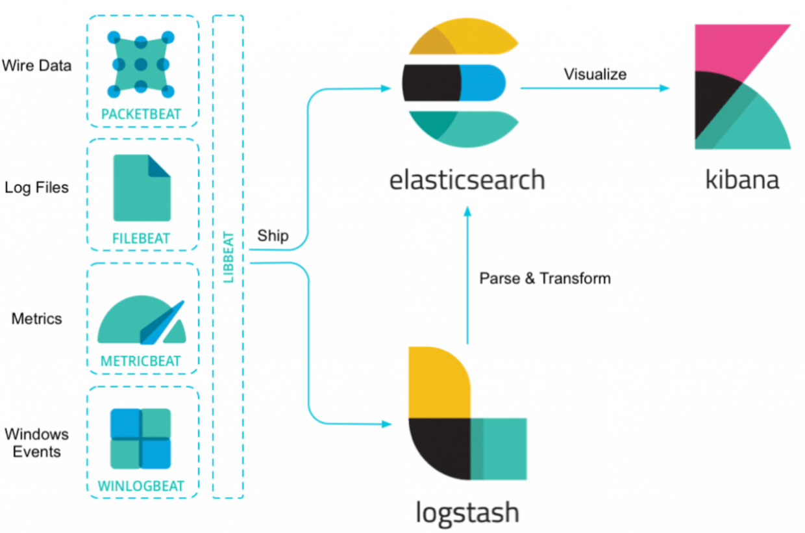
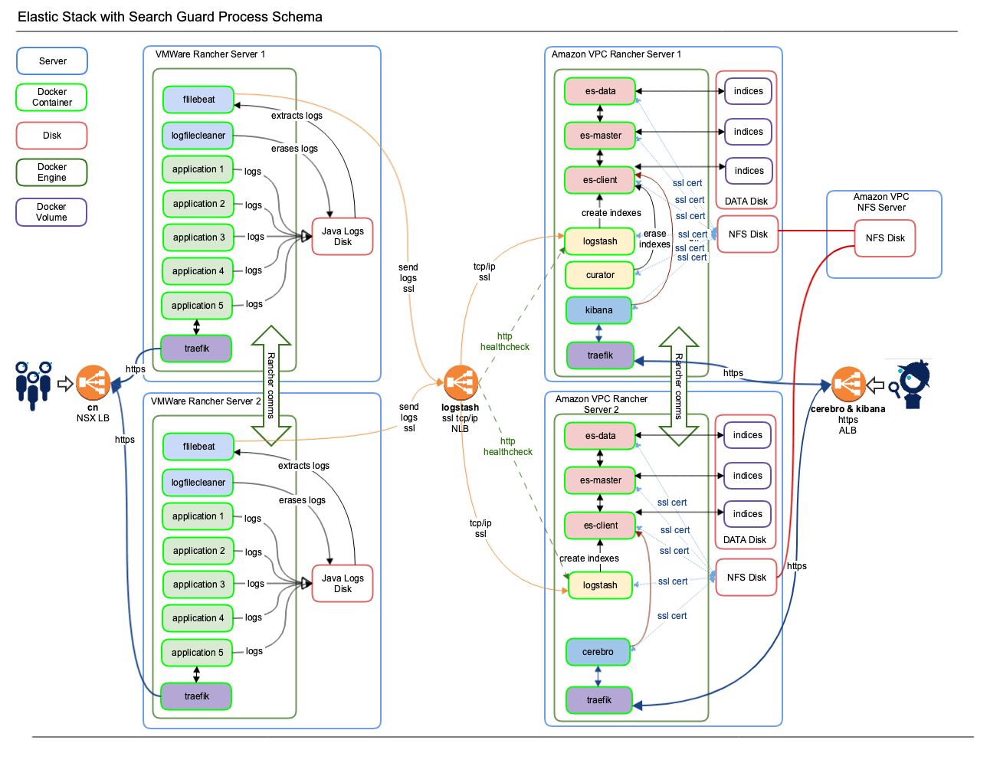

<!-- START doctoc generated TOC please keep comment here to allow auto update -->
<!-- DON'T EDIT THIS SECTION, INSTEAD RE-RUN doctoc TO UPDATE -->

- [key components](#key-components)
  - [elastic stack](#elastic-stack)
  - [elk process schema](#elk-process-schema)
- [references](#references)

<!-- END doctoc generated TOC please keep comment here to allow auto update -->


> [!NOTE|label:note:]
> - [* How to set up a secure logging platform with Elastic Stack and Search Guard](https://acagroup.be/en/blog/secure-logging-platform-elastic-stack-search-guard/)
> - [Kubernetes Logging with Filebeat and Elasticsearch Part 1](https://medium.com/@MetricFire/kubernetes-logging-with-filebeat-and-elasticsearch-part-1-b742f6bfaf13)
> - [Installing Elastic Stack](https://help.hcl-software.com/connections/v65/de/admin/install/cp_prereqs_dashboards_elasticstack_install.html) | [Setting up the index patterns in Kibana](https://help.hcl-software.com/connections/v65/de/admin/install/cp_prereqs_dashboards_elasticstack_index.html) | [Filtering out logs](https://help.hcl-software.com/connections/v65/de/admin/install/cp_prereqs_dashboards_elasticstack_filters.html) | [Using the Elasticsearch Curator](https://help.hcl-software.com/connections/v65/de/admin/install/cp_prereqs_dashboards_elasticstack_curator.html)
> - [Elasticsearch Sizing and Configuration](https://docs.jiffy.ai/admin_guide/tenant-admin-activities/audit-log/elasticsearch-sizing-and-configuration/)

## key components

- es-data
- es-master
- es-client
- kibana
- logstash
- filebeat

```bash
$ kubectl -n logging get deploy,sts
NAME                              DESIRED   CURRENT   UP-TO-DATE   AVAILABLE   AGE
deployment.extensions/es-client   1         1         1            1           2y130d
deployment.extensions/kibana      1         1         1            1           2y130d

NAME                         DESIRED   CURRENT   AGE
statefulset.apps/es-data     1         1         2y131d
statefulset.apps/es-master   2         2         2y132d
statefulset.apps/logstash    1         1         2y130d
```

### elastic stack



### elk process schema



## references

> [!NOTE|label:references:]
> - [Elastic 技术栈](https://www.yaolong.net/article/elastic/)
> - [Elastic 技术栈之快速入门](https://www.yaolong.net/article/elastic-quickstart/)
> - [Elastic 技术栈之 Logstash 基础](https://www.yaolong.net/article/elastic-logstash/)
> - [Elastic 技术栈之 Kibana](https://www.yaolong.net/article/elastic-kibana/)
> - [Elastic 技术栈之 Filebeat](https://www.yaolong.net/article/elastic-filebeat/)
> - [Elasticsearch的内存调优与解析](https://www.yaolong.net/article/es-heap-sizing/)
> - [理解Elasticsearch和面试总结](https://www.yaolong.net/article/elasticsearch-interview/)
