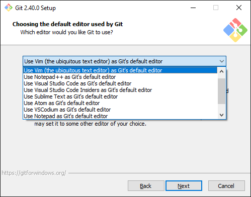
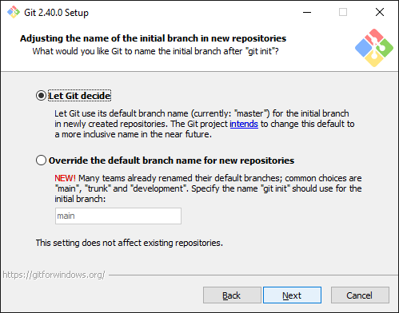
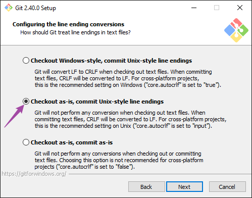
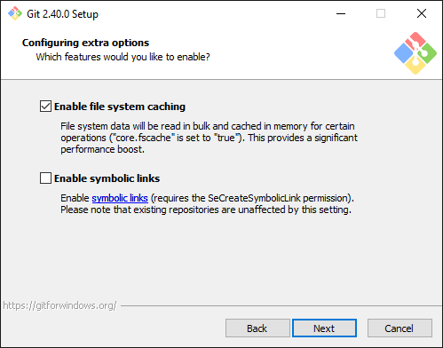
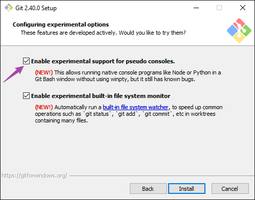

<!-- START doctoc generated TOC please keep comment here to allow auto update -->
<!-- DON'T EDIT THIS SECTION, INSTEAD RE-RUN doctoc TO UPDATE -->
**Table of Contents**  *generated with [DocToc](https://github.com/thlorenz/doctoc)*

- [location](#location)
  - [get locations](#get-locations)
- [list](#list)
  - [get from all configure](#get-from-all-configure)
- [default configuration](#default-configuration)

<!-- END doctoc generated TOC please keep comment here to allow auto update -->


> references:
> - [8.1 Customizing Git - Git Configuration](https://git-scm.com/book/en/v2/Customizing-Git-Git-Configuration)
> - [Improving cross-subsystem git workflow: The different git configuration files](https://www.onwebsecurity.com/tag/git.html)
> - [git config](https://www.atlassian.com/git/tutorials/setting-up-a-repository/git-config)
> - [git-config - Get and set repository or global options](https://git-scm.com/docs/git-config)
> - [Git config](https://www.w3docs.com/learn-git/git-config.html)


## location

> [!NOTE|label:locations]
> - [Where system, global and local Git config files on Windows and Ubuntu Linux are](https://www.theserverside.com/blog/Coffee-Talk-Java-News-Stories-and-Opinions/Where-system-global-and-local-Windows-Git-config-files-are-saved)
> - [Where do the settings in my Git configuration come from?](https://stackoverflow.com/q/17756753/2940319)
> - [git on Windows - location of configuration files](https://www.onwebsecurity.com/configuration/git-on-windows-location-of-global-configuration-file.html)


|      SCOPE     | WINDOWS                                     | UNIX-LIKE                  |
|:--------------:|---------------------------------------------|----------------------------|
|     system     | `<GIT_DIR>\etc\gitconfig`                   | `<GIT_DIR>/etc/gitconfig`  |
| system example | `%LOCALAPPDATA%\Programs\Git\etc\gitconfig` | `/usr/local/etc/gitconfig` |
|     global     | `%USERPROFILE%\.gitconfig`                  | `$HOME/.gitconfig`         |
|      local     | `<git-repo>\.git\config`                    | `<git-repo>/.git/config`   |
|    portable    | `%PROGRAMDATA%\Git\config`                  | -                          |

### get locations
- windows
  ```batch
    > git config --list --show-origin --name-only | sed -r 's/^file:(.+)\s+.*$/\1/g' | sort.exe /unique
    REM or
    > git config --list --show-origin --name-only | sed -r 's/^file:(.+)\s+.*$/\1/g' | powershell -nop "$input | sort -unique"
    REM or
    > git config --list --show-origin --name-only | sed -r 's/^file:(.+)\s+.*$/\1/g' | powershell -nop "$input | Sort-Object -unique"
    .git/config
    C:/Users/marslo/.gitconfig
    C:/Users/marslo/AppData/Local/Programs/Git/etc/gitconfig
  ```
- osx
  ```bash
  $ git config --list --show-origin --name-only | awk -F'[:[:blank:]]' '{print $2}' | sort -u
  .git/config
  /Users/marslo/.gitconfig
  /Users/marslo/.marslo/.gitalias
  /usr/local/etc/gitconfig
  ```

- edit config file
  ```bash
  $ git config --edit --system
  $ git config --edit --global

  # or
  $ sudo git -c core.editor=ls\ -al config --system --edit
  ```

## list

- list all with scope
  ```bash
  $ git config --list --show-scope
  system  credential.helper=osxkeychain
  system  core.ignorecase=false
  system  filter.lfs.clean=git-lfs clean -- %f
  ```

- list origin
  ```bash
  $ git config --list --show-origin --show-scope
  system  file:/usr/local/etc/gitconfig credential.helper=osxkeychain
  system  file:/usr/local/etc/gitconfig core.ignorecase=false
  system  file:/usr/local/etc/gitconfig filter.lfs.clean=git-lfs clean -- %f
  ```

- list single scope only
  - list local only
    ```bash
    $ git config --list --local
    core.repositoryformatversion=0
    core.filemode=true
    core.bare=false
    ```

  - list global
    ```bash
    $ git config --list --global
    user.name=marslo
    user.email=marslo@gmail.com
    push.default=matching
    ```

  - list system
    ```bash
    $ git config --list --system
    credential.helper=osxkeychain
    core.ignorecase=false
    filter.lfs.clean=git-lfs clean -- %f
    filter.lfs.smudge=git-lfs smudge -- %f
    filter.lfs.process=git-lfs filter-process
    filter.lfs.required=true
    ```

### get from all configure
```bash
$ git config --show-origin --show-scope --get-all user.name
global   file:/Users/marslo/.gitconfig   marslo
local    file:.git/config    marslo
```

## default configuration
- `core.editor`

  - use vim ( the ubiqutos text editor ) as Git's default editor
    ```bash
    $ git config --get core.editor
    vim
    ```

  

- `init.defaultBranch`

  - override the default branch name for new repositories
    ```bash
    $ git config --get init.defaultBranch
    development
    ```

  


- `core.autocrlf`
  - checkout windows-style, commit unix-style line endings
    ```bash
    $ git config --get core.autocrlf
    true
    ```
  - checkout as-is, commit unix-style line endings
    ```bash
    $ git config --get core.autocrlf
    input
    ```
  - checkout as-is, commit as-is
    ```bash
    $ git config --get core.autocrlf
    false
    ```

  

- `pull.rebase`
  ```bash
  $ git config --get pull.rebase
  true
  ```

  

- `core.fscache` & `core.symlinks`

  - enable file system caching
    ```bash
    $ git config --get core.fscache
    true
    ```

  - enable symbolic links
    ```bash
    $ git config --get core.symlinks
    true
    ```

  

- `core.fsmonitor`

  - enable experimental built-in file system monitor
    ```bash
    $ git config --get core.fsmonitor
    true
    ```

  

