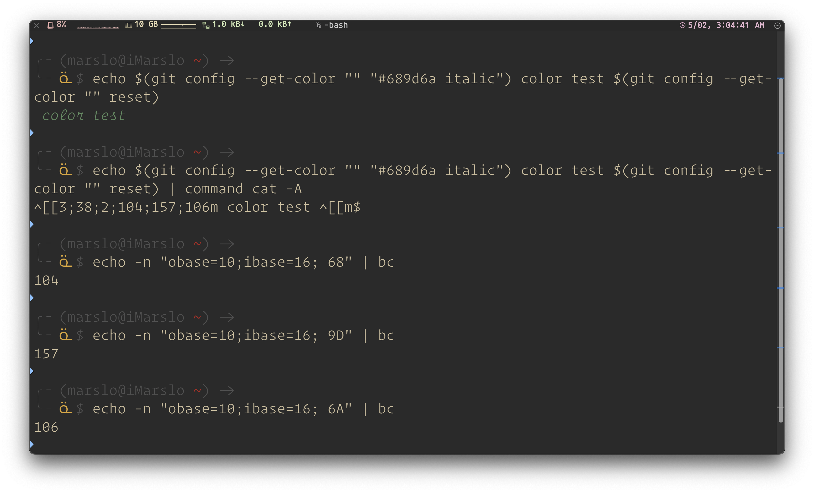
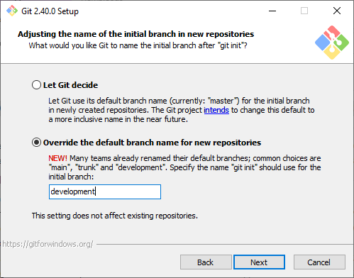

<!-- START doctoc generated TOC please keep comment here to allow auto update -->
<!-- DON'T EDIT THIS SECTION, INSTEAD RE-RUN doctoc TO UPDATE -->

- [installation](#installation)
  - [from source](#from-source)
- [location](#location)
  - [get locations](#get-locations)
- [list](#list)
  - [get from all configure](#get-from-all-configure)
  - [colors](#colors)
- [gitconfig](#gitconfig)
  - [help](#help)
  - [credential](#credential)
    - [environment failed to `$ ssh -vT git@github.com -p 22`](#environment-failed-to--ssh--vt-gitgithubcom--p-22)
    - [with `GIT_USERNAME` and `GIT_ASKPASS`](#with-git_username-and-git_askpass)
- [default configuration](#default-configuration)
- [tig](#tig)
  - [install from source](#install-from-source)
- [troubleshooting](#troubleshooting)
  - [`ld: archive member '/' not a mach-o file`](#ld-archive-member--not-a-mach-o-file)

<!-- END doctoc generated TOC please keep comment here to allow auto update -->


> references:
> - [8.1 Customizing Git - Git Configuration](https://git-scm.com/book/en/v2/Customizing-Git-Git-Configuration)
> - [Improving cross-subsystem git workflow: The different git configuration files](https://www.onwebsecurity.com/tag/git.html)
> - [git config](https://www.atlassian.com/git/tutorials/setting-up-a-repository/git-config)
> - [git-config - Get and set repository or global options](https://git-scm.com/docs/git-config)
> - [Git config](https://www.w3docs.com/learn-git/git-config.html)
> - [10.8 Git Internals - Environment Variables](https://git-scm.com/book/en/v2/Git-Internals-Environment-Variables)


# installation

> [!NOTE|label:references:]
> - [Download for Linux and Unix](https://git-scm.com/download/linux)
> - [1.5 Getting Started - Installing Git](https://git-scm.com/book/en/v2/Getting-Started-Installing-Git)

- ubuntu
  ```bash
  $ sudo add-apt-repository ppa:git-core/ppa
  $ sudo apt update
  $ sudo apt install git
  ```

## from source

> [!NOTE|label:references:]
> - [1.5 Getting Started - Installing Git](https://git-scm.com/book/en/v2/Getting-Started-Installing-Git)
> - [index : git.git](https://git.kernel.org/pub/scm/git/git.git)
> - [Compile and install Git from source](https://subscription.packtpub.com/book/iot-and-hardware/9781783982929/4/ch04lvl1sec40/compile-and-install-git-from-source)
> - [How do I correctly install the tools in git's contrib directory?](https://stackoverflow.com/a/11613541/2940319)
> - [* CheckInstall](https://help.ubuntu.com/community/CheckInstall)
>   ```bash
>   $ sudo apt-get update -y && sudo apt-get install checkinstall -y
>   ```
> - [MHMDhub/Install Git from source](https://gist.github.com/MHMDhub/d2d1a857fc5af5b18d6fff70fb4489b5)
> - [How To Install Git from Source on Ubuntu 20.04 [Quickstart]](https://www.digitalocean.com/community/tutorials/how-to-install-git-from-source-on-ubuntu-20-04-quickstart)
> - [#1053: Adjusting the documentation - 1.5 installing git - getopt package](https://github.com/progit/progit2/issues/1053)

- dependencies

  > [!NOTE|label:references:]
  > - [* iMarslo : linux troubleshooting](../../linux/troubleshooting.html)
  > - [1.5 Per Iniziare - Installing Git](https://git-scm.com/book/it/v2/Per-Iniziare-Installing-Git)
  > - [Extra Packages for Enterprise Linux (EPEL)](https://docs.fedoraproject.org/en-US/epel/)
  > - osx
  >   - [* tools-scripts/build-darwin](https://github.com/gnustep/tools-scripts/blob/master/build-darwin)
  >   - [Install Git on Mac OS X](https://www.atlassian.com/git/tutorials/install-git)
  >   - [git-install.sh](https://gist.github.com/ma11hew28/419201/382d769b9e3be737dd06c74f4c5f592ffe17396c)
  >   - [git-install.bash](https://gist.github.com/ma11hew28/419201)
  >   - [Install git from source on OS X](https://joequery.me/guides/install-git-source-osx/)
  >   - [compile-git-debian10](https://blog.ziki.cn/post/complie-git-debian-10/)
  >   - [NO_GETTEXT=true](https://stackoverflow.com/a/59288943/2940319)
  >   - [How should I resolve a "ld: library not found for -liconv" error when running "cargo build"?](https://stackoverflow.com/questions/71788323/how-should-i-resolve-a-ld-library-not-found-for-liconv-error-when-running-c)

  - git-core
    ```bash
    # debian
    $ sudo apt install -y dh-autoreconf libexpat1-dev gettext libz-dev libssl-dev
    $ sudo apt install -y libcurl4-openssl-dev
    $ sudo apt install -y libcurl4-gnutls-dev

    # centos/rhel
    $ sudo dnf config-manager --set-enabled powertools
    $ sudo dnf install epel-release epel-next-release
    $ sudo dnf install -y dh-autoreconf libcurl-devel curl-devel expat-devel gettext-devel openssl-devel perl-devel zlib-devel

    # osx
    $ brew install gcc autoconf automake openssl@3 expat gettext zlib libtool libiconv ncurses
    $ brew install perl
    $ sudo PERL_MM_OPT="INSTALL_BASE=$HOME/perl5" cpan local::lib
    $ eval "$(sudo perl -I$HOME/perl5/lib/perl5 -Mlocal::lib=$HOME/perl5)"
    ```

  - git-doc
    ```bash
    # debian
    $ sudo apt install -y asciidoc xmlto docbook2x hunspell libhunspell-dev

    # centos/rhel
    $ sudo dnf install -y asciidoc xmlto docbook2X docbook-style-xsl
    # or
    $ sudo dnf install -y --enablerepo=*epel* docbook2X
    $ sudo ln -s /usr/bin/db2x_docbook2texi /usr/bin/docbook2x-texi

    # osx
    $ brew install asciidoc xmlto docbook2x docbook-xsl hunspell
    $ ln -sf /usr/local/bin/docbook2texi /usr/local/bin/docbook2x-texi
    ```

  - git-info
    ```bash
    # debian
    $ sudo apt install -y install-info

    # centos/rhel
    $ sudo dnf install -y util-linux
    # deprecated
    $ sudo dnf install -y getopt

    # osx
    $ brew install gnu-getopt
    ```

  - others
    ```bash
    # audio output
    $ apt install libao-dev

    # centos
    $ sudo dnf install -y libao libao-devel

    # osx
    $ brew install libao
    ```

- install

  > [!NOTE|label:release package:]
  > - [git-for-windows](https://github.com/git-for-windows/git/releases)
  > - [git](https://github.com/git/git/tags)
  > - [/pub/software/scm/git/](https://mirrors.edge.kernel.org/pub/software/scm/git/)
  > - [* iMarslo : linux troubleshooting](../linux/troubleshooting.html)
  > - [A1.4 Appendix A: Git in Other Environments - Git in Bash](https://git-scm.com/book/uz/v2/Appendix-A%3A-Git-in-Other-Environments-Git-in-Bash)
  > - [A1.6 Appendix A: Git in Other Environments - Git in Powershell](https://git-scm.com/book/uz/v2/Appendix-A%3A-Git-in-Other-Environments-Git-in-Powershell)
  > - [How to make bash as default shell in git alias?](https://stackoverflow.com/a/73163369/2940319)

  ```bash
  $ curl -fsSL https://mirrors.edge.kernel.org/pub/software/scm/git/git-2.42.0.tar.gz |
         tar -zxf -C ${iRCHOME}/utils/git &&
    cd ${iRCHOME}/utils/git

  $ make configure
  $ ./configure --prefix=/usr/local --with-shell=/usr/local/bin/bash
  $ make -j all doc info
  $ sudo make install install-doc install-html install-info

  # additional
  $ chmod +x ${iRCHOME}/utils/git/contrib/completion/*
  $ sudo ln -sf ${iRCHOME}/utils/git/contrib/completion/git-prompt.sh       /usr/local/libexec/git-core/git-prompt.sh
  $ sudo ln -sf ${iRCHOME}/utils/git/contrib/completion/git-completion.bash /usr/share/bash-completion/completions/git
  # or
  $ sudo ln -sf ${iRCHOME}/utils/git/contrib/completion/*                   /usr/share/doc/git/contrib/completion/
  $ sudo ln -sf ${iRCHOME}/utils/git/contrib/completion/git-completion.bash /usr/share/bash-completion/completions/git
  ```

  - result
    ```bash
    # git-for-windows
    $ git --version
    git version 2.42.0.windows.2.5.g49aad3ca52

    # git
    $ git --version
    git version 2.42.0.325.g3a06386e31
    ```

  - pacakges:

    > [!TIP|label:check apt package bin path without install:]
    > ```bash
    > $ sudo apt-file list git
    > ```

    - bins : `/usr/local/bin`
    - git-core : `/usr/local/libexec/git-core` or `$ git --exec-path`
    - diff-highlight : `/usr/share/doc/git/contrib/diff-highlight/diff-highlight`
    - git-prompt.sh : `/usr/local/libexec/git-core/git-prompt.sh`
    - git-completion : `/usr/share/bash-completion/completions/git`
    - git-info : `/usr/local/share/info`

  <!--sec data-title="bins details" data-id="section0" data-show=true data-collapse=true ces-->
  ```bash
  bindir=$(cd '/usr/local/bin' && pwd) && \
  execdir=$(cd '/usr/local/libexec/git-core' && pwd) && \
  destdir_from_execdir_SQ=$(echo 'libexec/git-core' | sed -e 's|[^/][^/]*|..|g') && \
  { test "$bindir/" = "$execdir/" || \
    for p in git scalar git-shell git-cvsserver; do \
          rm -f "$execdir/$p" && \
          test -n "" && \
          ln -s "$destdir_from_execdir_SQ/bin/$p" "$execdir/$p" || \
          { test -z "" && \
            ln "$bindir/$p" "$execdir/$p" 2>/dev/null || \
            cp "$bindir/$p" "$execdir/$p" || exit; } \
    done; \
  } && \
  for p in git-receive-pack git-upload-archive git-upload-pack; do \
          rm -f "$bindir/$p" && \
          test -n "" && \
          ln -s "git" "$bindir/$p" || \
          { test -z "" && \
            ln "$bindir/git" "$bindir/$p" 2>/dev/null || \
            ln -s "git" "$bindir/$p" 2>/dev/null || \
            cp "$bindir/git" "$bindir/$p" || exit; }; \
  done && \
  for p in git-add git-am git-annotate git-apply git-archive git-bisect git-blame git-branch git-bugreport git-bundle git-cat-file git-check-attr git-check-ignore git-check-mailmap git-check-ref-format git-checkout--worker git-checkout-index git-checkout git-clean git-clone git-column git-commit-graph git-commit-tree git-commit git-config git-count-objects git-credential-cache--daemon git-credential-cache git-credential-store git-credential git-describe git-diagnose git-diff-files git-diff-index git-diff-tree git-diff git-difftool git-fast-export git-fast-import git-fetch-pack git-fetch git-fmt-merge-msg git-for-each-ref git-for-each-repo git-fsck git-fsmonitor--daemon git-gc git-get-tar-commit-id git-grep git-hash-object git-help git-hook git-index-pack git-init-db git-interpret-trailers git-log git-ls-files git-ls-remote git-ls-tree git-mailinfo git-mailsplit git-merge-base git-merge-file git-merge-index git-merge-ours git-merge-recursive git-merge-tree git-merge git-mktag git-mktree git-multi-pack-index git-mv git-name-rev git-notes git-pack-objects git-pack-redundant git-pack-refs git-patch-id git-prune-packed git-prune git-pull git-push git-range-diff git-read-tree git-rebase git-receive-pack git-reflog git-remote-ext git-remote-fd git-remote git-repack git-replace git-rerere git-reset git-rev-list git-rev-parse git-revert git-rm git-send-pack git-shortlog git-show-branch git-show-index git-show-ref git-sparse-checkout git-stash git-stripspace git-submodule--helper git-symbolic-ref git-tag git-unpack-file git-unpack-objects git-update-index git-update-ref git-update-server-info git-upload-archive git-upload-pack git-var git-verify-commit git-verify-pack git-verify-tag git-worktree git-write-tree git-cherry git-cherry-pick git-format-patch git-fsck-objects git-init git-maintenance git-merge-subtree git-restore git-show git-stage git-status git-switch git-version git-whatchanged; do \
          rm -f "$execdir/$p" && \
          if test -z ""; \
          then \
                  test -n "" && \
                  ln -s "$destdir_from_execdir_SQ/bin/git" "$execdir/$p" || \
                  { test -z "" && \
                    ln "$execdir/git" "$execdir/$p" 2>/dev/null || \
                    ln -s "git" "$execdir/$p" 2>/dev/null || \
                    cp "$execdir/git" "$execdir/$p" || exit; }; \
          fi \
  done && \
  remote_curl_aliases="git-remote-https git-remote-ftp git-remote-ftps" && \
  for p in $remote_curl_aliases; do \
          rm -f "$execdir/$p" && \
          test -n "" && \
          ln -s "git-remote-http" "$execdir/$p" || \
          { test -z "" && \
            ln "$execdir/git-remote-http" "$execdir/$p" 2>/dev/null || \
            ln -s "git-remote-http" "$execdir/$p" 2>/dev/null || \
            cp "$execdir/git-remote-http" "$execdir/$p" || exit; } \
  done
  install -d -m 755 '/usr/local/share/man/man3'
  (cd perl/build/man/man3 && tar cf - .) | \
  (cd '/usr/local/share/man/man3' && umask 022 && tar xof -)
  ```
  <!--endsec-->

# location

> [!NOTE|label:locations]
> - [Where system, global and local Git config files on Windows and Ubuntu Linux are](https://www.theserverside.com/blog/Coffee-Talk-Java-News-Stories-and-Opinions/Where-system-global-and-local-Windows-Git-config-files-are-saved)
> - [Where do the settings in my Git configuration come from?](https://stackoverflow.com/q/17756753/2940319)
> - [git on Windows - location of configuration files](https://www.onwebsecurity.com/configuration/git-on-windows-location-of-global-configuration-file.html)


|      SCOPE     | WINDOWS                                     | UNIX-LIKE                  |
|:--------------:|---------------------------------------------|----------------------------|
|     system     | `<GIT_DIR>\etc\gitconfig`                   | `<GIT_DIR>/etc/gitconfig`  |
| system example | `%LOCALAPPDATA%\Programs\Git\etc\gitconfig` | `/usr/local/etc/gitconfig` |
|     global     | `%USERPROFILE%\.gitconfig`                  | `$HOME/.gitconfig`         |
|      local     | `<git-repo>\.git\config`                    | `<git-repo>/.git/config`   |
|    portable    | `%PROGRAMDATA%\Git\config`                  | -                          |

## get locations
- windows
  ```batch
    > git config --list --show-origin --name-only | sed -r 's/^file:(.+)\s+.*$/\1/g' | sort.exe /unique
    REM or
    > git config --list --show-origin --name-only | sed -r 's/^file:(.+)\s+.*$/\1/g' | powershell -nop "$input | sort -unique"
    REM or
    > git config --list --show-origin --name-only | sed -r 's/^file:(.+)\s+.*$/\1/g' | powershell -nop "$input | Sort-Object -unique"
    .git/config
    C:/Users/marslo/.gitconfig
    C:/Users/marslo/AppData/Local/Programs/Git/etc/gitconfig
  ```
- osx
  ```bash
  $ git config --list --show-origin --name-only | awk -F'[:[:blank:]]' '{print $2}' | sort -u
  .git/config
  /Users/marslo/.gitconfig
  /Users/marslo/.marslo/.gitalias
  /usr/local/etc/gitconfig
  ```

- edit config file
  ```bash
  $ git config --edit --system
  $ git config --edit --global

  # or
  $ sudo git -c core.editor=ls\ -al config --system --edit
  ```

# list

- list all with scope
  ```bash
  $ git config --list --show-scope
  system  credential.helper=osxkeychain
  system  core.ignorecase=false
  system  filter.lfs.clean=git-lfs clean -- %f
  ```

- list origin
  ```bash
  $ git config --list --show-origin --show-scope
  system  file:/usr/local/etc/gitconfig credential.helper=osxkeychain
  system  file:/usr/local/etc/gitconfig core.ignorecase=false
  system  file:/usr/local/etc/gitconfig filter.lfs.clean=git-lfs clean -- %f
  ```

- list single scope only
  - list local only
    ```bash
    $ git config --list --local
    core.repositoryformatversion=0
    core.filemode=true
    core.bare=false
    ```

  - list global
    ```bash
    $ git config --list --global
    user.name=marslo
    user.email=marslo@gmail.com
    push.default=matching
    ```

  - list system
    ```bash
    $ git config --list --system
    credential.helper=osxkeychain
    core.ignorecase=false
    filter.lfs.clean=git-lfs clean -- %f
    filter.lfs.smudge=git-lfs smudge -- %f
    filter.lfs.process=git-lfs filter-process
    filter.lfs.required=true
    ```

## get from all configure
```bash
$ git config --show-origin --show-scope --get-all user.name
global   file:/Users/marslo/.gitconfig   marslo
local    file:.git/config    marslo
```

## colors

> [!NOTE|label:references:]
> - [git config: Colored outputs](https://www.atlassian.com/git/tutorials/setting-up-a-repository/git-config)
> - [Color in git-log](https://stackoverflow.com/a/16844346/2940319)
> - [Git-Config Colors And Include](https://tylercipriani.com/blog/2016/09/21/git-config-include-and-colors/)
> - [* git config: colors](https://git-scm.com/docs/git-config#Documentation/git-config.txt-color)
>   - attributes: `bold`, `dim`, `ul`, `blink`, `reverse`, `italic`, `strike`, `no-ul`, `no-reverse`, `no-dim`, ..
>   - colors: ANSI 256-colors ( 0~255 ). specify 24-bit RGB values as hex, like #ff0ab3. color names, like red, green, ...

- configure:

  > [!NOTE|label:references:]
  > - [git-diff console default colors meanings](https://stackoverflow.com/a/69170401/2940319)
  > - [Configuring git colors](https://shallowsky.com/blog/programming/gitcolors.html)
  > - [git/Documentation/config/color.txt](https://github.com/git/git/blob/master/Documentation/config/color.txt)
  > - [rab/.gitconfig](https://gist.github.com/rab/4067067)

  - `color.branch.<slot>`:
    - `current`, `local`, `remote`, `upstream`, `plain`
  - `color.diff.<slot>`:
    - `context`, `meta`, `frag`, `old`, `new`, `plain`, `commit`, `whitespace`,
    - `oldMoved`, `newMoved`, `oldMovedDimmed`, `newMovedDimmed`, `oldMovedAlternative`, `newMovedAlternative`, `oldMovedAlternativeDimmed`, `newMovedAlternativeDimmed`
    - `contextDimmed`, `oldDimmed`, `newDimmed`, `contextBold`, `oldBold`, `newBold`
  - `color.decorate.<slot>`:
    - `branch`, `remoteBranch`, `tag`, `stash`, `HEAD`
  - `color.grep.<slot>`
    - `context`, `filename`, `function`, `lineNumber`, `match`, `matchContext`, `matchSelected`, `selected`, `separator`
  - `color.interactive.<slot>`:
    - `prompt`, `header`, `help`, `error`
  - `color.status.<slot>`:
    - `added`, `updated`, `changed`, `untracked`, `branch`, `nobranch`, `localBranch`, `remoteBranch`, `unmerged`
  - `color.remote.<slot>`:
    - `hint`, `warning`, `success`, `error`

- list `color.*` config
  ```bash
  $ git config --get-regexp color.*
  ```

- [test colors](https://stackoverflow.com/a/22674150/2940319)

  > [!TIP|label:see also:]
  > - [* iMarslo: number conversion](../../cheatsheet/math.md#number-conversion)
  > - [colortrans.py: Convert values between RGB hex codes and xterm-256 color codes.](https://gist.github.com/MicahElliott/719710)
  > - [git/t/t4026-color.sh](https://github.com/git/git/blob/master/t/t4026-color.sh)
  >   - [`t4207-log-decoration-colors.sh`: Test for "git log --decorate" colors](https://github.com/git/git/blob/b3622a4ee94e4916cd05e6d96e41eeb36b941182/t/t4207-log-decoration-colors.sh#L11)
  >   - [`t8012-blame-colors.sh`](https://github.com/git/git/blob/master/t/t8012-blame-colors.sh)
  >   - [`t3205-branch-color.sh`](https://github.com/git/git/blob/master/t/t3205-branch-color.sh)
  >   - [`p4002-diff-color-moved.sh`](https://github.com/git/git/blob/master/t/perf/p4002-diff-color-moved.sh)
  >   - [`t5409-colorize-remote-messages.sh`](https://github.com/git/git/blob/master/t/t5409-colorize-remote-messages.sh)
  > - [* dotfiles/j/config/auto.sh/git_aliases](https://github.com/joeytwiddle/dotfiles/blob/3081c5d034c6c11907b9b290d97f815848fceb68/j/config/auto.sh/git_aliases#L1430-L1432)

  ```bash
  $ echo $(git config --get-color "" "120 bold reverse") color test $(git config --get-color "" reset)

  # i.e.:
  #                                    ╭─ 256 color code
  #                                   ---
  $ echo $(git config --get-color "" "120 bold italic") color test $(git config --get-color "" reset)| command cat -A
  ^[[1;3;38;5;120m color test ^[[m$
  #           ---
  #            ╰─ 256 color code

  # with 24bit hex
  #                                    ╭─ R(decimal): 104 : `$ echo -n "obase=10;ibase=16; 68" | bc`
  #                                    --╭─ G(decimal): 157: `$ echo -n "obase=10;ibase=16; 9D" | bc`
  #                                      --╭─ B(decimal): 106: `$ echo -n "obase=10;ibase=16; 6A" | bc`
  #                                        --
  $ echo $(git config --get-color "" "#689d6a italic") color test $(git config --get-color "" reset) | command cat -A
  ^[[3;38;2;104;157;106m color test ^[[m$
  #  -      --- --- ---
  #  ╵       R   G   B
  #  ╰─ SGR (Select Graphic Rendition) parameters ( https://en.wikipedia.org/wiki/ANSI_escape_code ):
  #         0 reset/normal; 1 bold; 2 dim/faint; 3 italic; 4 underline; 5 blink; 7 reverse; 8 hidden

  # [or](https://stackoverflow.com/a/18304605/2940319)
  $ remote_branch_color="$(git config --get-color color.branch.remote white)"
  $ echo "pushing to ${remote_branch_color} <branch name here> $(tput sgr0)"
  $ echo "pushing to ${remote_branch_color} <branch name here> $(tput sgr0)" | command cat -A
  pushing to ^[[2;3;38;5;213m <branch name here> ^[(B^[[m$
  ```

  [](../../screenshot/git/git-config-color-test.png)

- [`trueHexPrint()`](https://stackoverflow.com/a/55073732/2940319)
  ```bash
  trueHexPrint () {
    # Generates Truecolor Escape Sequences from Hex Strings. (remove '\\' to use)
    # -fg     Prints as a foreground color. (default)
    # -bg     Prints as a background color.
    # usage) `trueHexPrint -fg "11001A" ==> '\e[38;2;17;0;26m'
    # usage) `trueHexPrint -bg "11001A" ==> '\e[48;2;17;0;26m'
    if [[ ${1} =~ "-fg" || ${1} =~ "-f" ]]; then
      fgbg=38; hexinput=${2};
    elif [[ ${1} =~ "-bg" || ${1} =~ "-b" ]]; then
      fgbg=48; hexinput=${2};
    else
      fgbg=38; hexinput=${1}
    fi
    hexinput=`echo ${hexinput} | tr '[:lower:]' '[:upper:]'`  # uppercase-ing
    hexinput=`echo ${hexinput} | tr -d '#'`               # remove Hash if needed
    a=`echo ${hexinput} | cut -c-2`
    b=`echo ${hexinput} | cut -c3-4`
    c=`echo ${hexinput} | cut -c5-6`
    r=`echo "ibase=16; ${a}" | bc`
    g=`echo "ibase=16; ${b}" | bc`
    b=`echo "ibase=16; ${c}" | bc`
    printf "\\\\e[${fgbg};2;${r};${g};${b}m" # Remove one set of '\\' to utilize
  }

  $ trueHexPrint "#689d6a"
  \e[38;2;104;157;106m
  $ echo -e "$(trueHexPrint "#689d6a") aa \e[0m"
   aa
  ```

# gitconfig
## help

- `autocorrect`

  > [!NOTE|label:references:]
  > - [Git: How to enable autocorrect](https://adamj.eu/tech/2022/10/26/git-how-to-enable-autocorrect/)

  ```
  $ git config --global help.autocorrect immediate

  # [y/N] ?
  $ git config --global help.autocorrect prompt

  # 2.0 seconds
  $ git config --global help.autocorrect 20
  ```

## credential

> [!NOTE]
> - [7.14 Git Tools - Credential Storage](https://git-scm.com/book/en/v2/Git-Tools-Credential-Storage)
> - [`git config credential.helper store`](https://stackoverflow.com/a/65786142)
> - [`git remote set-url`](https://stackoverflow.com/a/68783135)
> - [credential.helper](https://stackoverflow.com/a/62184716)
> - [Credential stores](https://github.com/git-ecosystem/git-credential-manager/blob/release/docs/credstores.md)
>   - [GPG/pass compatible files](https://github.com/git-ecosystem/git-credential-manager/blob/release/docs/credstores.md#gpgpass-compatible-files)

```bash
$ git config credential.helper store

# or
git remote set-url origin https://[TOKEN]@github.com/path/to/repo.git
```

### environment failed to `$ ssh -vT git@github.com -p 22`

1. using https instead of ssh first
   ```bash
   $ cat ~/.gitconfig
   [url "https://github.com/"]
     insteadOf     = git@ssh.github.com:
   [url "https://github.com/"]
     insteadOf     = git@github.com:
   ```

2. setup credential
   ```bash
   $ git config --global credential.helper store

   # or set the credential file in corss-platform
   $ git config --global credential.helper 'store --file /path/to/.git-credentials'
   $ git config --global credential.helper 'cache --timeout 30000'
   ```

3. create the credential file
   ```bash
   $ git credential-store --file /path/to/.git-credentials store
   protocol=https ⏎
   host=github.com ⏎
   username=marslo ⏎
   password=ghp_***********************************N ⏎
   ⏎

   # or
   $ USERNAME='marslo'
   $ PASSWORD='ghp_***********************************N'
   $ echo -e "protocol=https\nhost=github.com\nusername=${USERNAME}\npassword=${PASSWORD}\n" |
          git credential-store --file /path/to/.git-credentials store
   ```

   - to read the credentials file
     ```bash
     $ git credential-store --file /path/to/.git-credentials get
     protocol=https ⏎
     host=github.com ⏎
     ⏎
     # wil shows:
     username=marslo
     password=ghp_***********************************N

     # or
     $ echo -e 'protocol=https\nhost=github.com' |
            git credential-store --file /path/to/.git-credentials get
     username=marslo
     password=ghp_***********************************N
     ```

### with `GIT_USERNAME` and `GIT_ASKPASS`

> [!NOTE|label:references:]
> - [REQUESTING CREDENTIALS](https://git-scm.com/docs/gitcredentials)
>   * `env.GIT_ASKPASS`
>   * `core.askPass`
>   * `SSH_ASKPASS`
> - [Class GitUsernamePasswordBinding.DescriptorImpl](https://javadoc.jenkins-ci.org/plugin/git/jenkins/plugins/git/GitUsernamePasswordBinding.DescriptorImpl.html) | [GitUsernamePasswordBinding.java](https://github.com/jenkinsci/git-plugin/blob/master/src/main/java/jenkins/plugins/git/GitUsernamePasswordBinding.java)
>   - [JENKINS-47733 - Add a withGit pipeline step that provides git credentials](https://issues.jenkins.io/browse/JENKINS-47733)
> - [JENKINS-56897 - Support general purpose authenticated git operations in Pipeline](https://issues.jenkins.io/browse/JENKINS-56897#comment-364399)

- via config
  ```
  [url "https://github.com/username"]
    insteadOf         = git@github.com:username
  [credential "https://github.com/marslo"]
    username          = marslo
  [credential "https://github.com/username"]
    username          = marslojiao-mvl
    helper            = "!f() { test \"$1\" = get && echo \"password=gh************************************vr\"; }; f"
  ```

- via environment

  > [!TIP]
  > - `GIT_ASKPASS` must be a executable script

  ```bash
  $ export GIT_ASKPASS="$HOME/.git.askpass.sh"
  # or
  $ git config --global core.askPass "$HOME/.git.askpass.sh"
  # or using in runtime
  $ git -c core.askPass="$HOME/.git.askpass.sh" clone ...

  $ cat ~/.git.askpass.sh
  declare repoUrl="$(git remote get-url origin)"
  declare pattern='.+github.com[:/]marslo/.+'

  if [[ "${repoUrl}" =~ 'path/to/specific' ]]; then
    echo 'gh************************************vr'
  elif [[ "${repoUrl}" =~ ${pattern} ]]; then
    echo 'gh************************************mx'
  fi
  $ chmod +x ~/.git.askpass.sh
  ```

  - [GitUsernamePasswordBinding solution](https://stackoverflow.com/a/68358639/2940319) | [JENKINS-56897](https://issues.jenkins.io/browse/JENKINS-56897#comment-364399)
    ```bash
    GIT_ASKPASS=$(mktemp) && chmod a+rx $GIT_ASKPASS && export GIT_ASKPASS
    cat > $GIT_ASKPASS <<< '#!/bin/bash
    case "$1" in
        Username*) exec echo "$JENKINS_CREDENTIALS_USR" ;;
        Password*) exec echo "$JENKINS_CREDENTIALS_PSW" ;;
    esac
    '
    ```

# default configuration
- `core.editor`

  - use vim ( the ubiqutos text editor ) as Git's default editor
    ```bash
    $ git config --get core.editor
    vim
    ```

  

- `init.defaultBranch`

  - override the default branch name for new repositories
    ```bash
    $ git config --get init.defaultBranch
    development
    ```

  


- `core.autocrlf`

  > [!TIP|label:see also:]
  > - [* iMarslo : core.autocrlf](./eol.html#coreautocrlf)

  - checkout windows-style, commit unix-style line endings
    ```bash
    $ git config --get core.autocrlf
    true
    ```
  - checkout as-is, commit unix-style line endings
    ```bash
    $ git config --get core.autocrlf
    input
    ```
  - checkout as-is, commit as-is
    ```bash
    $ git config --get core.autocrlf
    false
    ```

  

- `pull.rebase`
  ```bash
  $ git config --get pull.rebase
  true
  ```

  

- `core.fscache` & `core.symlinks`

  - enable file system caching
    ```bash
    $ git config --get core.fscache
    true
    ```

  - enable symbolic links
    ```bash
    $ git config --get core.symlinks
    true
    ```

  

- `core.fsmonitor`

  - enable experimental built-in file system monitor
    ```bash
    $ git config --get core.fsmonitor
    true
    ```

  


# tig

> [!NOTE|label:references:]
> - [How to fix "fatal error: ncursesw/ncurses.h: No such file or directory"](https://www.xmodulo.com/fatal-error-ncursesw-ncurses-no-file-directory.html)
> - [tig : Installation instructions](https://jonas.github.io/tig/INSTALL.html)
> - [Tig - cheat sheet](https://www.mendelowski.com/docs/git/tig-cheat-sheet/)

```bash
# ubuntu
$ sudo apt-get install libncursesw5-dev
# centos/rhel
$ sudo yum install ncurses-devel

$ git clone git@github.com:jonas/tig.git ${iRCHOME}/utils/ && cd !$/tig
$ make -j prefix=/usr/local
$ sudo make install prefix=/usr/local

$ /usr/local/bin/tig --version
tig version 2.5.8-5-g1894954
ncursesw version 6.3.20211021
```

## [install from source](https://jonas.github.io/tig/INSTALL.html)

```bash
$ git clone git@github.com:jonas/tig.git && cd tig

$ make
# or
$ make prefix=/usr/local

$ make install
# or
$ sudo make install prefix=/usr/local

$ sudo make install-doc
   INSTALL  doc/tig.1 -> /root/share/man/man1
   INSTALL  doc/tigrc.5 -> /root/share/man/man5
   INSTALL  doc/tigmanual.7 -> /root/share/man/man7
   INSTALL  doc/tig.1.html -> /root/share/doc/tig
   INSTALL  doc/tigrc.5.html -> /root/share/doc/tig
   INSTALL  doc/manual.html -> /root/share/doc/tig
   INSTALL  README.html -> /root/share/doc/tig
   INSTALL  INSTALL.html -> /root/share/doc/tig
   INSTALL  NEWS.html -> /root/share/doc/tig

# or
$ [sudo] make install-release-doc
GIT_INDEX_FILE=.tmp-doc-index git read-tree origin/release
GIT_INDEX_FILE=.tmp-doc-index git checkout-index -f --prefix=./ doc/tig.1 doc/tigrc.5 doc/tigmanual.7
rm -f .tmp-doc-index
make install-doc-man
make[1]: Entering directory '/home/marslo/iMarslo/tools/git/tools/tig'
   INSTALL  doc/tig.1 -> /home/marslo/share/man/man1
   INSTALL  doc/tigrc.5 -> /home/marslo/share/man/man5
   INSTALL  doc/tigmanual.7 -> /home/marslo/share/man/man7
make[1]: Leaving directory '/home/marslo/iMarslo/tools/git/tools/tig'
GIT_INDEX_FILE=.tmp-doc-index git read-tree origin/release
GIT_INDEX_FILE=.tmp-doc-index git checkout-index -f --prefix=./ doc/tig.1.html doc/tigrc.5.html doc/manual.html README.html INSTALL.html NEWS.html
rm -f .tmp-doc-index
make install-doc-html
make[1]: Entering directory '/home/marslo/iMarslo/tools/git/tools/tig'
       GEN  doc/manual.toc
  ASCIIDOC  doc/manual.html
   INSTALL  doc/tig.1.html -> /home/marslo/share/doc/tig
   INSTALL  doc/tigrc.5.html -> /home/marslo/share/doc/tig
   INSTALL  doc/manual.html -> /home/marslo/share/doc/tig
   INSTALL  README.html -> /home/marslo/share/doc/tig
   INSTALL  INSTALL.html -> /home/marslo/share/doc/tig
   INSTALL  NEWS.html -> /home/marslo/share/doc/tig
make[1]: Leaving directory '/home/marslo/iMarslo/tools/git/tools/tig'
```

- result
  ```bash
  $ which -a tig
  /usr/local/bin/tig

  $ tig --version
  tig version 2.5.8-17-ge543cfe
  ncursesw version 6.1.20180224
  ```

# troubleshooting

> [!TIP]
> - [* iMarslo : devenv troubleshooting](../../linux/troubleshooting.html)

## `ld: archive member '/' not a mach-o file`

> [!NOTE]
> - [Clang archive or linking issue. Xcode 15.0.1](https://developer.apple.com/forums/thread/741149)
> - [build and install git from source on macOS: "ld: multiple errors: archive member '/' not a mach-o file"](https://stackoverflow.com/q/77626259/2940319)

- xCode
  ```bash
  $ xcodebuild -version
  Xcode 15.0
  Build version 15A240d
  $ pkgutil --pkg-info=com.apple.pkg.CLTools_Executables | grep version
  version: 15.1.0.0.1.1700200546

  # after upgraded
  $ xcodebuild -version
  Xcode 15.2
  Build version 15C500b
  $ pkgutil --pkg-info=com.apple.pkg.CLTools_Executables | grep version
  version: 15.1.0.0.1.1700200546
  ```
