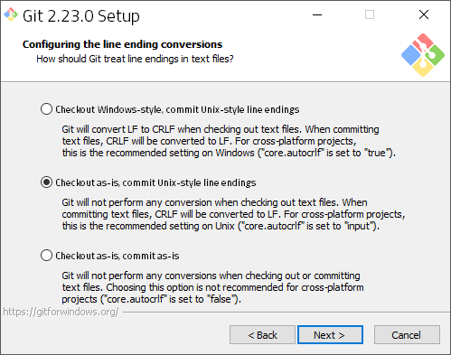

<!-- START doctoc generated TOC please keep comment here to allow auto update -->
<!-- DON'T EDIT THIS SECTION, INSTEAD RE-RUN doctoc TO UPDATE -->
**Table of Contents**  *generated with [DocToc](https://github.com/thlorenz/doctoc)*

- [list](#list)
  - [list eol in repo](#list-eol-in-repo)
  - [list config](#list-config)
  - [check one by one](#check-one-by-one)
- [theory](#theory)
  - [core.autocrlf](#coreautocrlf)
  - [set in GUI](#set-in-gui)
  - [please notice](#please-notice)
- [practice](#practice)
  - [force using `lf` in both remote and local](#force-using-lf-in-both-remote-and-local)
  - [ignore `warning: LF will be replaced by CRLF`](#ignore-warning-lf-will-be-replaced-by-crlf)

<!-- END doctoc generated TOC please keep comment here to allow auto update -->

> [!NOTE|label:references:]
> - [git-config - Get and set repository or global options](https://git-scm.com/docs/git-config)
> - [git config](https://www.atlassian.com/git/tutorials/setting-up-a-repository/git-config)
> - [Git config](https://www.w3docs.com/learn-git/git-config.html)
> - [Force LF eol in git repo and working copy](https://stackoverflow.com/a/9977954/2940319)

## list
### [list eol in repo](https://stackoverflow.com/a/21822812/2940319)
```bash
$ git ls-files --eol

# list all crlf
$ git ls-files --eol | grep '/crlf'

# list all lf which not been controlled by gitattributes file
$ git ls-files --eol | grep -E '[iw]/lf' | grep -v -E 'attr/.+eol='
```

- or
  ```bash
  $ find . -type f -exec sh -c "file {} | grep 'with CRLF'" \;
  # or
  $ find . -type f -follow -print0 | xargs -0 file | grep 'with CRLF'

  # or get file list
  $ find . -type f -exec sh -c "file {} | grep 'with CRLF'" \; | awk -F':' '{print $1}'
  ```

### list config
- get all config : `--get-all`
  ```bash
  $ git config --show-origin --show-scope --get-all core.autocrlf
  global   file:/home/marslo/.gitconfig    false
  local    file:.git/config    input
  ```
- get active config : `--get`
  ```bash
  $ git config --show-origin --show-scope --get core.autocrlf
  local file:.git/config  input
  ```

- `core.eol`
  ```bash
  $ git config --show-origin --show-scope --get core.eol
  global  file:/home/marslo/.gitconfig    lf
  $ git config --show-origin --show-scope --get-all core.eol
  global  file:/home/marslo/.gitconfig    lf
  ```

- `core.safecrlf`
  ```bash
  $ git config --show-origin --show-scope --get-all core.safecrlf
  global   file:/home/marslo/.gitconfig    warn
  ```

### check one by one
- worktree
  ```bash
  $ git config --worktree --show-scope --show-origin --get-all core.autocrlf
  local    file:.git/config    input
  ```

- local
  ```bash
  $ git config --local --show-scope --show-origin --get-all core.autocrlf
  local    file:.git/config    input
  ```

- system
  ```bash
  $ git config --system --show-scope --show-origin --get-all core.autocrlf
  ```

- global
  ```bash
  $ git config --global --show-scope --show-origin --get-all core.autocrlf
  global   file:/home/marslo/.gitconfig    false
  ```

## theory
### core.autocrlf
#### [parameters](https://stackoverflow.com/a/41282375/2940319)
| core.autocrlf |                    false                   |                    input                    |                     true                    |
|:-------------:|:------------------------------------------:|:-------------------------------------------:|:-------------------------------------------:|
|   git commit  | `lf > lf` <br>`cr > cr` <br> `crlf > crlf` |  `lf > lf` <br> `cr > cr` <br> `crlf > lf`  |  `lf > lf` <br> `cr > cr` <br> `crlf > lf`  |
|  git checkout | `lf > lf` <br>`cr > cr` <br> `crlf > crlf` | `lf > lf` <br> `cr > cr` <br> `crlf > crlf` | `lf > lf` <br> `cr > cr` <br> `crlf > crlf` |

[normally, it will looks like](https://stackoverflow.com/a/20653073/2940319)
```bash
core.autocrlf=true:      core.autocrlf=input:     core.autocrlf=false:

        repo                     repo                     repo
      ^      V                 ^      V                 ^      V
     /        \               /        \               /        \
crlf->lf    lf->crlf     crlf->lf       \             /          \
   /            \           /            \           /            \
```

### set in GUI

- checkout Windows-style, commit Unix-style line endings:
```bash
$ git config --global core.autocrlf true
```
    - Text files checked-out from the repository that have only `LF` characters are normalized to CRLF in your working tree; files that contain `CRLF` in the repository will not be touched
    - Text files that have only `LF` characters in the repository, are normalized from CRLF to LF when committed back to the repository. Files that contain CRLF in the repository will be committed untouched.

- Checkout as-is, commit Unix-Style line endings:
```bash
$ git config --global core.autocrlf input
```
    - Text files checked-out from the repository will keep original `EOL` characters in your working tree.
    - Text files in your working tree with `CRLF `characters are normalized to `LF` when committed back to the repository.

- Checkout as-is, commit as-is:
```bash
$ git config --global core.autocrlf false
```
    - `core.eol` dictates `EOL` characters in the text files of your working tree.
    - `core.eol = native` by default, which means Windows `EOLs` are `CRLF` and *nix `EOLs` are `LF` in working trees.
    - Repository gitattributes settings determines `EOL` character normalization for commits to the repository (default is normalization to `LF` characters).

### [please notice](https://git-scm.com/docs/gitattributes#gitattributes-Settostringvalueauto)
> `eol`
>
> This attribute sets a specific line-ending style to be used in the working directory. It enables end-of-line conversion without any content checks, effectively setting the text attribute. Note that setting this attribute on paths which are in the index with CRLF line endings may make the paths to be considered dirty. Adding the path to the index again will normalize the line endings in the index.

## practice
### force using `lf` in both remote and local
```bash
$ git config core.eol lf
$ git config core.autocrlf input
```
- or
  ```bash
  $ git config --global core.eol lf
  $ git config --global core.autocrlf input
  ```

### [ignore `warning: LF will be replaced by CRLF`](https://stackoverflow.com/a/17628353/2940319)
```bash
$ git config --global core.safecrlf false
```
