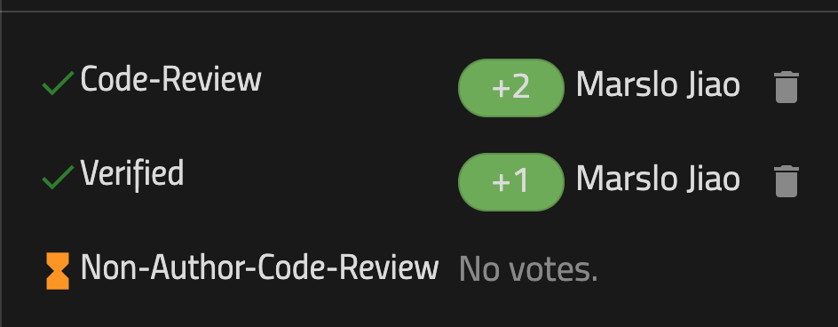
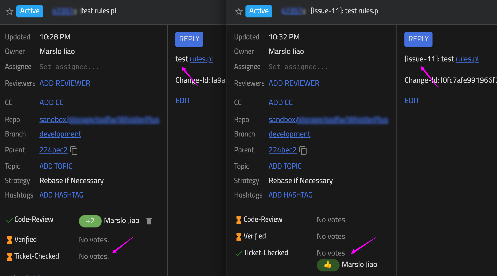
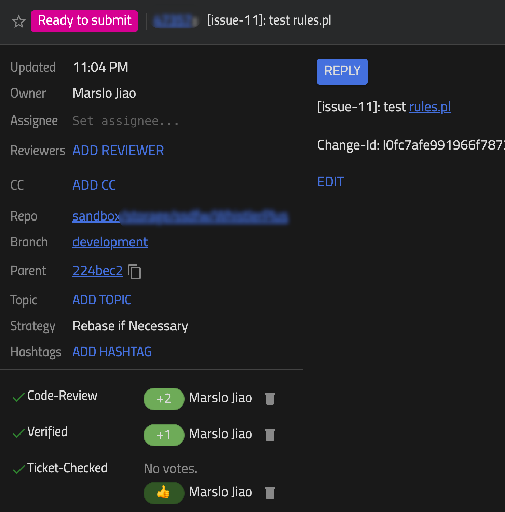
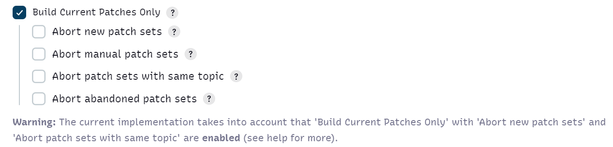
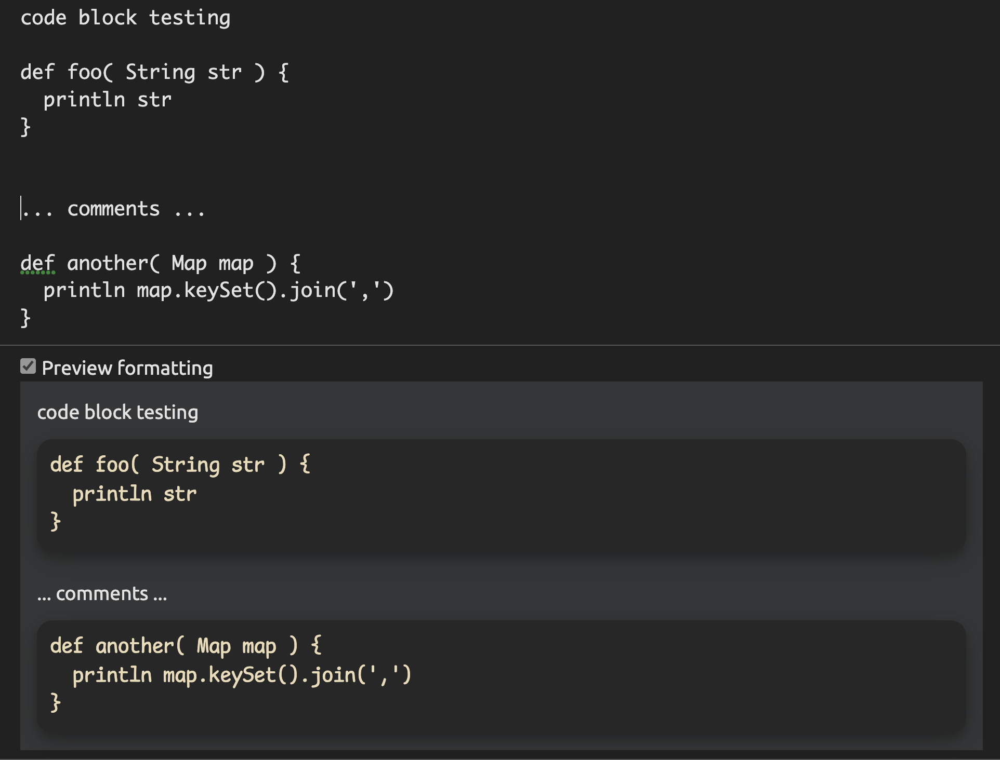
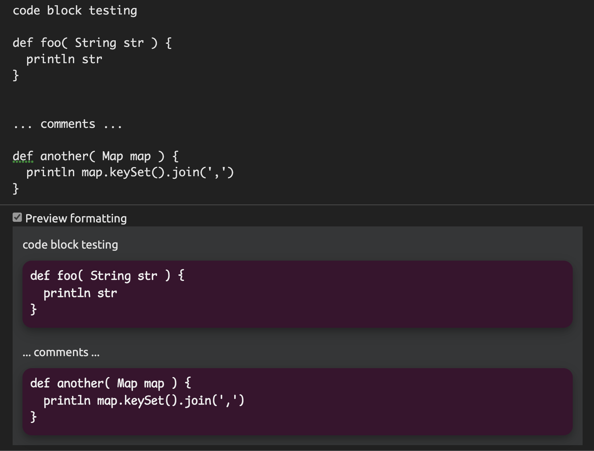
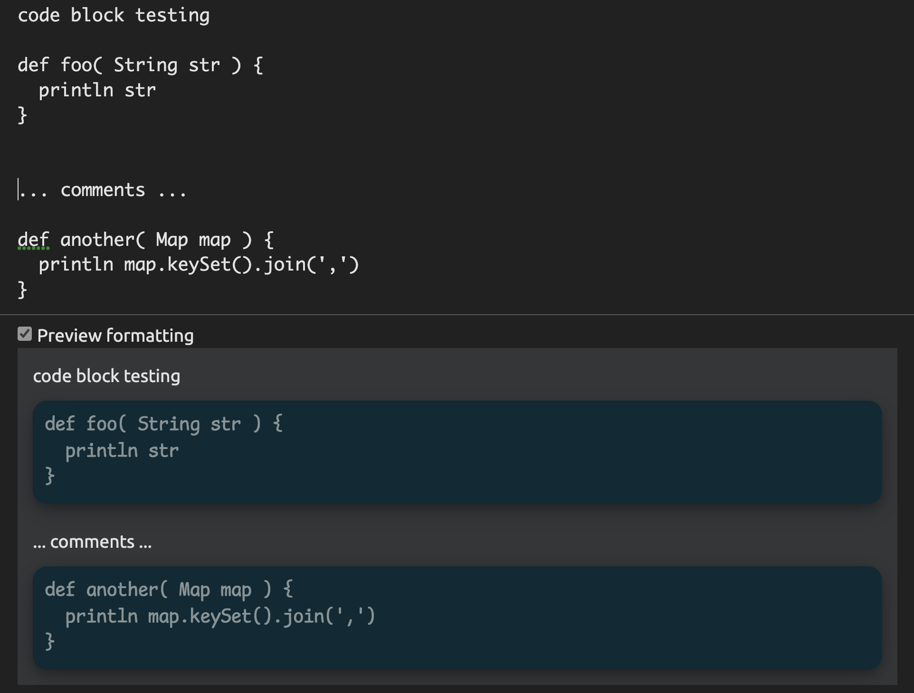

<!-- START doctoc generated TOC please keep comment here to allow auto update -->
<!-- DON'T EDIT THIS SECTION, INSTEAD RE-RUN doctoc TO UPDATE -->

- [.gitconfig](#gitconfig)
  - [default groups](#default-groups)
- [refs/meta/config](#refsmetaconfig)
  - [get project.config](#get-projectconfig)
  - [publish to remote](#publish-to-remote)
  - [update meta/config if remotes update](#update-metaconfig-if-remotes-update)
  - [reset to remotes](#reset-to-remotes)
  - [useful refs](#useful-refs)
  - [restriction for branches (`feature1`, `feature2` and `master`) for only allow code review merge, forbidden code push](#restriction-for-branches-feature1-feature2-and-master-for-only-allow-code-review-merge-forbidden-code-push)
- [rules.pl](#rulespl)
  - [submit by a non author](#submit-by-a-non-author)
  - [ticket check](#ticket-check)
- [api](#api)
  - [basic usage](#basic-usage)
  - [change](#change)
  - [who approval the CR+2](#who-approval-the-cr2)
  - [get all vote CR-2](#get-all-vote-cr-2)
  - [who approval the V+1](#who-approval-the-v1)
  - [reference](#reference)
- [integrate in Jenkins](#integrate-in-jenkins)
- [css for code block](#css-for-code-block)

<!-- END doctoc generated TOC please keep comment here to allow auto update -->

> [!NOTE|label:references:]
> - [Gerrit Code Review - Access Controls](https://gerrit.cloudera.org/Documentation/access-control.html)
>   - [Special and magic references](https://gerrit.cloudera.org/Documentation/access-control.html#references)
>     - [Magic references](https://gerrit.cloudera.org/Documentation/access-control.html#references_magic)
>   - [Access Categories](https://gerrit.cloudera.org/Documentation/access-control.html#access_categories)


## .gitconfig
```bash
$ git config --global gitreview.username <UserName>
$ git config --global gitreview.remote origin
```

### [default groups](https://github.com/bpollack/gerrit/blob/master/Documentation/access-control.txt)

> [!TIP]
> - [Gerrit Code Review - Access Controls](https://git.eclipse.org/r/Documentation/access-control.html#non-interactive_users)

- System Groups
  - [Anonymous Users](https://gerrit.cloudera.org/Documentation/access-control.html#anonymous_users)
  - [Change Owner](https://gerrit.cloudera.org/Documentation/access-control.html#change_owner)
  - [Project Owners](https://gerrit.cloudera.org/Documentation/access-control.html#project_owners)
  - [Registered Users](https://gerrit.cloudera.org/Documentation/access-control.html#registered_users)

- [Predefined Groups](https://gerrit.cloudera.org/Documentation/access-control.html#_predefined_groups)
  - [Administrators](https://gerrit.cloudera.org/Documentation/access-control.html#administrators)
  - [Non-Interactive Users](https://gerrit.cloudera.org/Documentation/access-control.html#non-interactive_users)
  - ~Service Users~

#### Special references

* `refs/changes/*`
* `refs/meta/config`
* `refs/meta/dashboards/*`
* `refs/notes/review`

#### Magic references

* `refs/for/<branch ref>`

## [refs/meta/config](https://gerrit-review.googlesource.com/Documentation/config-project-config.html#_the_refs_meta_config_namespace)
### get project.config
- clone the repo
  ```bash
  $ git clone <repo url>
  # or update the local repo to HEAD
  $ git pull [--rebase]
  ```

- checkout `meta/config`
  ```bash
  $ git fetch origin refs/meta/config:refs/remotes/origin/meta/config
  $ git checkout meta/config
  ```
  or

  ```bash
  $ git fetch ssh://localhost:29418/project refs/meta/config
  $ git checkout FETCH_HEAD
  ```

### publish to remote
```bash
$ git add --all .
$ git commit -m "<add your comments here>"
```
- submit directly
  ```bash
  $ git push origin meta/config:meta/config
  ```
  or
  ```bash
  $ git push origin HEAD:refs/meta/config
  ```

- submit review

  > [!NOTE|label:references:]
  > - [smirn0v/gist:b8e6c4bedebed23a0328](https://gist.github.com/smirn0v/b8e6c4bedebed23a0328)

  ```bash
  $ git push origin HEAD:refs/for/refs/meta/config
  ```
  - or
    ```bash
    $ git push origin meta/config:refs/for/refs/meta/config
    ```

### update meta/config if remotes update
```bash
$ git fetch origin --force refs/meta/config:refs/remotes/origin/meta/config

$ git pull origin refs/meta/config
# or
$ git merge meta/config
```

### reset to remotes
```bash
$ git fetch origin --force refs/meta/config:refs/remotes/origin/meta/config
$ git reset --hard remotes/origin/meta/config
```

### useful refs

#### sandbox:
```bash
refs/heads/sandbox/${username}/*
```

#### its-jira:
- for project specific
  ```bash
  [commentlink "its-jira"]
    match = ^[ \\t]*PROJECT-([0-9]{1,5}):
    link = https://<jira-domain>:<jira-port>/browse/PROJECT-$1
  ```

- for common setup
  ```bash
  [plugin "its-jira"]
    association = OPTIONAL
    branch = ^refs/heads/.*
    branch = ^refs/heads/stable-.*
    commentOnChangeAbandoned = false
    commentOnChangeCreated = true
    commentOnChangeMerged = true
    commentOnChangeRestored = false
    commentOnCommentAdded = false
    commentOnFirstLinkedPatchSetCreated = true
    commentOnPatchSetCreated = false
    commentOnRefUpdatedGitWeb = true
    enabled = enforced
  [commentlink "its-jira"]
    match = ^[ \\t]*([A-Za-z]*-[0-9]{1,5}):
    link = https://<jira-domain>:<jira-port>/browse/$1
  [commentlink "changeid"]
    match = (I[0-9a-f]{8,40})
    link = "#/q/$1"
  ```

#### verified label
```bash
[label "Verified"]
    function = MaxWithBlock
    defaultValue = 0
    copyAllScoresIfNoCodeChange = true
    value = -1 Fails
    value =  0 No score
    value = +1 Verified
```

#### change-id
```bash
[receive]
  requireChangeId = true
  createNewChangeForAllNotInTarget = false
  maxObjectSizeLimit = 6m
  maxBatchChanges = 1
[commentlink "changeid"]
  match = (I[0-9a-f]{8,40})
  link = "#/q/$1"
```

#### freeze `master` branch

> [!TIP]
> One quirk is that the shortest possible pattern expansion must be a valid ref name<br>
> thus `^refs/heads/.*/name` will fail because `refs/heads//name` is not a valid reference<br>
> but `^refs/heads/.+/name` will work.


About the `refs/for` namespace
> [!TIP]
> references:<br>
> - [what is the use refs/for/refs/* in gerrit?](https://stackoverflow.com/a/54551260/2940319)
> <br>
> `refs/for/*` syntax is just a short name for `refs/for/refs/*`:

- `project.config`
  ```bash
  [access "refs/for/refs/heads/master"]
    push = block group user/Marslo Jiao (marslo)
    push = block group Registered Users
    submit = block group Registered Users
    submit = block group group user/Marslo Jiao (marslo)
    addPatchSet = block group user/Marslo Jiao (marslo)
    addPatchSet = block group Registered Users
    pushMerge = block group user/Marslo Jiao (marslo)
    pushMerge = block group Registered Users
  ```

- `groups`
  ```bash
  ...
  global:Project-Owners      Project Owners
  global:Registered-Users    Registered Users
  ...
  user:marslo                user/Marslo Jiao(marslo)
  ...
  ```

#### freeze multiple branches (`stable` & `release`) for the specific account
- `project.config`
  ```bash
  [access "^refs/for/refs/heads/(stable|release)$"]
    push = block group Registered Users
    submit = block group Registered Users
    addPatchSet = block group Registered Users
    pushMerge = block group Registered Users
  [access "^refs/heads/(stable|release)$"]
    read = group user/Marslo Jiao (marslo)
    push = +force group user/Marslo Jiao (marslo)
    pushMerge = group user/Marslo Jiao (marslo)
  ```

  - or using `exclusiveGroupPermissions`
    ```editorconfig
    [access "^refs/heads/backup/(master|dev|staging|stable)/.+$"]
           exclusiveGroupPermissions = create delete push pushMerge
           create = group Project Owners
           create = block group Registered Users
           delete = block group Registered Users
           push = block group Registered Users
           pushMerge = block group Registered Users
    [access "^refs/for/refs/heads/backup/(master|dev|staging|stable)/.+$"]
           exclusiveGroupPermissions = addPatchSet create push pushMerge submit
           addPatchSet = block group Registered Users
           create = block group Registered Users
           push = block group Registered Users
           pushMerge = block group Registered Users
           submit = block group Registered Users
    ```

- `groups`
  ```bash
  ...
  global:Project-Owners      Project Owners
  global:Registered-Users    Registered Users
  ...
  user:marslo                user/Marslo Jiao(marslo)
  ...
  ```

### restriction for branches (`feature1`, `feature2` and `master`) for only allow code review merge, forbidden code push
- `project.config`
  ```bash
  [access "refs/*"]
    read = group Project Owners
    read = group user/Marslo Jiao (marslo)
  [access "refs/for/*"]
    addPatchSet = group Project Owners
    addPatchSet = group user/Marslo Jiao (marslo)
    push = group Project Owners
    push = group user/Marslo Jiao (marslo)
    pushMerge = group Project Owners
    pushMerge = group user/Marslo Jiao (marslo)
  [access "^refs/heads/(feature1|feature2|master)$"]
    push = block group Registered Users
    pushMerge = block group Registered Users
    submit = group Change Owner
  ```

- `groups`
  ```bash
  ...
  global:Project-Owners      Project Owners
  global:Registered-Users    Registered Users
  ...
  user:marslo                user/Marslo Jiao(marslo)
  ...
  ```

#### example of `project.config`
- [project.config](https://gerrit.googlesource.com/gerrit/+/refs/meta/config/project.config)
  ```bash
  [project]
    description = Gerrit Code Review
  [access "refs/*"]
    owner = group google/gerritcodereview-maintainers@googlegroups.com
  [access "refs/heads/*"]
    label-Code-Review = -2..+2 group google/gerritcodereview-maintainers@googlegroups.com
    label-Code-Review = -2..+2 group polygerrit-maintainers
    label-Verified = -1..+1 group Change Owner
    label-Verified = -1..+1 group gerrit-verifiers
    label-Code-Style = -1..+1 group gerrit-verifiers
    label-Verified-Notedb = -1..+1 group gerrit-verifiers
    label-Library-Compliance = -1..+1 group gerrit-lib
    label-Library-Compliance = -1..+0 group google/gerritcodereview-maintainers@googlegroups.com
    submit = group Change Owner
    submit = group google/gerritcodereview-maintainers@googlegroups.com
    create = group google/gerritcodereview-maintainers@googlegroups.com
    abandon = group gerrit-verifiers
    editTopicName = +force group google/gerritcodereview-maintainers@googlegroups.com
    removeReviewer = group google/gerritcodereview-maintainers@googlegroups.com
    publishDrafts = group google/gerritcodereview-maintainers@googlegroups.com
  [access "refs/tags/*"]
    create = group gerrit-release-creators
    create = group google/gerritcodereview-maintainers@googlegroups.com
    createTag = group gerrit-release-creators
    createTag = group google/gerritcodereview-maintainers@googlegroups.com
    createSignedTag = group gerrit-release-creators
    createSignedTag = group google/gerritcodereview-maintainers@googlegroups.com
  [access]
    inheritFrom = Public-Projects
  [receive]
    rejectImplicitMerges = true
  [reviewer]
    enableByEmail = true
  [label "Verified"]
    function = MaxNoBlock
    copyAllScoresIfNoCodeChange = true
    value = -1 Fails
    value = 0 No score
    value = +1 Verified
    defaultValue = 0
  [label "Code-Style"]
    function = MaxWithBlock
    copyAllScoresIfNoCodeChange = true
    value = -1 Wrong Style or Formatting
    value = 0 No score
    value = +1 Style Verified
    defaultValue = 0
  [label "Library-Compliance"]
    function = MaxWithBlock
    copyAllScoresIfNoCodeChange = true
    copyAllScoresOnTrivialRebase = true
    value = -1 Do not submit
    value = 0 No score
    value = +1 Approved
    defaultValue = 0
  [access "refs/for/refs/meta/dashboards/*"]
    push = group google/gerritcodereview-maintainers@googlegroups.com
  [access "refs/meta/dashboards/*"]
    label-Code-Review = -2..+2 group google/gerritcodereview-maintainers@googlegroups.com
    label-Code-Review = -1..+1 group Registered Users
    label-Verified = -1..+1 group gerrit-verifiers
    label-Verified = -1..+1 group google/gerritcodereview-maintainers@googlegroups.com
    submit = group google/gerritcodereview-maintainers@googlegroups.com
    forgeAuthor = group google/gerritcodereview-maintainers@googlegroups.com
    label-Code-Style = -1..+1 group google/gerritcodereview-maintainers@googlegroups.com
  [access "refs/for/refs/meta/config"]
    push = group gerrit-verifiers
  [notify "polygerrit-reviews"]
    email = polygerrit-reviews@google.com
    type = all_comments
    type = submitted_changes
    header = cc
    filter = file:polygerrit-ui
  [access "refs/heads/infra/config"]
    push = group gerrit-tricium-admins
  ```

## [rules.pl](https://gerrit-review.googlesource.com/Documentation/prolog-cookbook.html)

### [submit by a non author](https://gerrit-review.googlesource.com/Documentation/prolog-cookbook.html#NonAuthorCodeReview)

> [!TIP]
> check also:
> - [Exclude author from gerrit review](https://stackoverflow.com/a/47887713/2940319)

```
submit_rule(S) :-
    gerrit:default_submit(X),
    X =.. [submit | Ls],
    add_non_author_approval(Ls, R),
    S =.. [submit | R].

add_non_author_approval(S1, S2) :-
    gerrit:commit_author(A),
    gerrit:commit_label(label('Code-Review', 2), R),
    R \= A, !,
    S2 = [label('Non-Author-Code-Review', ok(R)) | S1].
add_non_author_approval(S1, [label('Non-Author-Code-Review', need(_)) | S1]).
```


- by `project.config`
  ```editorconfig
  [access "refs/*"]
    label-Code-Review = block -2..+2 group Change Owner
    exclusiveGroupPermissions = label-Code-Review
  ```

### [ticket check](https://gerrit-review.googlesource.com/Documentation/prolog-cookbook.html#_example_7_make_change_submittable_if_commit_message_starts_with_fix)

> [!TIP]
> check also:
> - [Prolog Gerrit - validate label if commit message contains a specific string](https://stackoverflow.com/q/27295382/2940319)

- optional validation
  ```
  submit_rule(S) :-
      gerrit:default_submit(X),
      X =.. [submit | Ls],
      require_ticket_check_for_ticket(Ls, Nls),
      S =.. [submit | Nls].

  require_ticket_check_for_ticket(S1, S2) :-
      gerrit:commit_message_matches('^issue-[\\d]+\\s?:\\s?[\\w\\W]+'),
      !,
      S2 = [label('Ticket-Checked', need(_)) | S1].

  require_ticket_check_for_ticket(S1, S2) :-
      !, S2 = S1.
  ```


- optional validation with auto vote
  ```
  submit_rule(S) :-
      gerrit:default_submit(X),
      X =.. [submit | Ls],
      require_ticket_check_for_ticket(Ls, Nls),
      S =.. [submit | Nls].

  require_ticket_check_for_ticket(S1, S2) :-
      gerrit:commit_message_matches('\\[issue-[\\d]{2}\\]\\s?:\\s?[\\w\\W]+'),
      !,
      S2 = [label('Ticket-Checked', ok(user(824))) | S1].

  require_ticket_check_for_ticket(S1, S2) :-
      !, S2 = S1.
  ```





- mandatory validation
  ```
  submit_rule(S) :-
    gerrit:default_submit(X), % get the current submit structure
    X=.. [submit | Ls],
    require_ticket_check_for_ticket(Ls, Nls),
    S=.. [submit | Nls].

  require_ticket_check_for_ticket(S1, S2) :-
     gerrit:commit_message_matches('\\[issue-[\\d]{2}\\][\\s\\S]+'),
     !,
     S2 = [label('Ticket-Checked', ok(user(790))) | S1]. % Add the label and automatically approval by user-id: 790

  require_ticket_check_for_ticket(S1, [label('Ticket-Checked', need(_)) | S1]).
  ```


## api

> reference:
> - [Gerrit Code Review - REST API Developers' Notes](https://gerrit-review.googlesource.com/Documentation/dev-rest-api.html)
> - [Gerrit Code Review - REST API](https://gerrit-review.googlesource.com/Documentation/rest-api.html)


### [basic usage](https://gerrit-review.googlesource.com/Documentation/dev-rest-api.html#_basic_testing)
#### regular options
```bash
                                  a might means [a]pi
                                    ⇡
$ curl -X PUT    http://domain.name/a/path/to/api/
$ curl -X POST   http://domain.name/a/path/to/api/
$ curl -X DELETE http://domain.name/a/path/to/api/
```

#### sending data
- json with file
  ```bash
  $ curl -X PUT \
         -d@testdata.json \
         --header "Content-Type: application/json" \
         http://domain.name/a/path/to/api/
  ```

- json with string
  ```bash
  $ curl -X POST \
         -H "Content-Type: application/json" https://domain.name/a/changes/<number>/move \
         -d '{ "destination_branch" : "target/branch/name" }'
  )]}'
  {
    "id": "marslo-project~target%2Fbranch%2Fname~Id90057ab632eb93be2fa9128a9d624664008cb4a",
    "project": "marslo-project",
    "branch": "target/branch/name",
    "hashtags": [],
    "change_id": "Id90057ab632eb93be2fa9128a9d624664008cb4a",
    "subject": "marslo: testing api move",
    "status": "NEW",
    "created": "2022-01-21 05:21:25.000000000",
    "updated": "2022-05-17 06:56:37.000000000",
    "submit_type": "FAST_FORWARD_ONLY",
    "mergeable": false,
    "insertions": 8,
    "deletions": 8,
    "unresolved_comment_count": 0,
    "has_review_started": true,
    "_number": 94490,
    "owner": {
      "_account_id": 790
    },
    "requirements": []
  }

  # or
  $ curl -X POST \
         -H "Content-Type: application/json" https://domain.name/a/changes/<number>/move \
         -d '{
              "destination_branch" : "target/branch/name"
         }' |
    tail -n +2 |
    jq -r .branch
  ```

- txt
  ```bash
  $ curl -X PUT \
         --data-binary @testdata.txt \
         --header "Content-Type: text/plain" \
         http://domain.name/a/path/to/api/
  ```


#### verifying header content
  ```bash
  $ curl -v -n -X DELETE http://domain.name/a/path/to/api/
  ```

### [change](https://gerrit-review.googlesource.com/Documentation/rest-api-changes.html)
- get change via change-id
  ```bash
  $ curl -X GET 'https://domina.name/a/changes/<change-id>'
  ```

- get change via commit-id
  ```groovy
  $ changeid=$(git show <commit-id> --no-patch --format="%s%n%n%b" | sed -nre 's!Change-Id: (.*$)!\1!p')
  $ curl -X GET "https://domina.name/a/changes/${changeid}"
  ```
  or
  ```bash
  $ project=$(echo 'path/to/project' | sed 's:/:%2F:g')
  $ branch='dev'
  $ changeid=$(git show <commit-id> --no-patch --format="%s%n%n%b" | sed -nre 's!Change-Id: (.*$)!\1!p')
  $ curl -X GET "https://domina.name/a/changes/${project}~${branch}~${changeid}"
  ```

### who approval the CR+2
```bash
$ curl -s -X GET https://domain.name/a/changes/${changeid}/detail |
       tail -n +2 |
       jq -r '.labels."Code-Review".approved.name'
```

### get all vote CR-2

- example output for `.labels.<tag>.all[]`
```json
{
  "value": -2,
  "date": "2021-05-31 07:57:14.000000000",
  "permitted_voting_range": {
    "min": -2,
    "max": 2
  },
  "_account_id": 790,
  "name": "Marslo Jiao",
  "email": "marslo.jiao@gmail.com",
  "username": "marslo"
}
{
  "value": 0,
  "permitted_voting_range": {
    "min": -2,
    "max": 2
  },
  "_account_id": 124,
  "name": "John Doe",
  "email": "john@gmail.com",
  "username": "john"
}
```


> reference:
> - [Select objects based on value of variable in object using jq](https://stackoverflow.com/a/64212172/2940319)
> - [jq select or statement](https://stackoverflow.com/a/53451410/2940319)
> - [How to select items in JQ based on value in array](https://stackoverflow.com/a/44867184/2940319)

```bash
$ curl -s -X GET https://domain.name/a/changes/${changeid}/detail |
       tail -n +2 |
       jq -r '.labels."Code-Review".all[] | select ( .value == -2 ) | .username'
                                          : |⠂⠂⠂⠂⠂⠂⠂⠂⠂⠂⠂⠂⠂⠂⠂⠂⠂⠂⠂⠂⠂| :
                                          :           ⇣             :
                                          :  select ".value"== -2   :
                                          :                         :
                                          ⇣                         ⇣
                                         pipe                     pipe


# or
$ curl -s -X GET https://domain.name/a/changes/${changeid}/detail |
       tail -n +2 |
      jq -r '( .labels."Code-Review".all[] | select ( .value == -2 ) ).username'
             :                                                       :
             ⇣                                                       ⇣
         expression                                              expression

# or
$ curl -s -X GET https://domain.name/a/changes/${changeid}/detail |
       tail -n +2 |
      jq -r '[ .labels."Code-Review".all[] | select ( .value == -2 ) ][].username'
             :                                                       :
             ⇣                                                       ⇣
         expression                                              expression

# or
$ curl -s -X GET https://domain.name/a/changes/${changeid}/detail |
       tail -n +2 |
      jq -r '.labels."Code-Review".all[] | select ( .value == -2 )' |
      jq -r .username                                               :
                                                                    ⇣
                                                                   pipe
```


### who approval the V+1
```bash
$ curl -s -X GET https://domain.name/a/changes/${changeid}/detail |
       tail -n +2 |
       jq -r .labels.Verified.approved.username
```

### reference
- [project owner guide](https://www.gerritcodereview.com/intro-project-owner.html)
- [Gerrit Code Review - Access Controls](https://gerrit-review.googlesource.com/Documentation/access-control.html#_project_access_control_lists)
- [Gerrit Code Review - Uploading Changes](https://www.gerritcodereview.com/user-upload.html)
- [The refs/for namespace](https://gerrit-review.googlesource.com/Documentation/concept-refs-for-namespace.html)
- [gerrit/gerrit/refs/meta/config](https://gerrit.googlesource.com/gerrit/+/refs/meta/config)
- [gerrit 权限控制](https://blog.csdn.net/chenjh213/article/details/50571190)
- [its-jira plugin md](https://gerrit.googlesource.com/plugins/its-jira/+/refs/heads/stable-3.0/src/main/resources/Documentation/config.md)
- [Rule base configuration](https://review.opendev.org/plugins/its-storyboard/Documentation/config-rulebase-common.html)
- [Gerrit push not working. Remote rejected, prohibited by gerrit](https://stackoverflow.com/a/31297860/2940319)
- [Gerrit Code Review - Project Configuration File Format](https://gerrit-review.googlesource.com/Documentation/config-project-config.html)
- [Review UI](https://gerrit-review.googlesource.com/Documentation/user-review-ui.html)


## integrate in Jenkins

> [!NOTE|label:references:]
> - [Gerrit Trigger](https://plugins.jenkins.io/gerrit-trigger/)
> - [How does the Gerrit- trigger plugin in Jenkins works?](https://stackoverflow.com/a/16206203/2940319)

- `stream-events`

  ```bash
  # permission requies
  $ ssh -i id_rsa jenkins@gerrit.domain.com -p 29418 gerrit stream-events
  stream events not permitted

  # verify
  $ ssh -i id_rsa jenkins@gerrit.domain.com -p 29418 gerrit stream-events | jq -r .type
  ref-updated
  comment-added
  ```

- build current patches only

  > [!NOTE]
  > Warning: The current implementation takes into account that 'Build Current Patches Only' with 'Abort new patch sets' and 'Abort patch sets with same topic' are enabled (see help for more).

  

- generate ssh-key

  ```bash
  $ keyname='devops@jenkins'
  $ ssh-keygen -m PEM -t rsa -f ~/.ssh/${keyname} -C "${keyname}" -P '' -q
  ```

## css for code block
```css
.gr-formatted-text-0 gr-linked-text.pre.gr-formatted-text,
gr-linked-text[class*="pre"], gr-linked-text[class*="pre"] #output {
  font-family: "Comic Mono", "Monaco", "Menlo", "Andale Mono", "Ubuntu Mono", "monofur" !important;
  font-size: 16px !important;
}
.gr-formatted-text-0 gr-linked-text.pre.gr-formatted-text,
gr-linked-text[class*="pre"] {
  color: #c8c8c8 !important;
  background: #272727 !important;
  border-radius: .75em !important;
  box-shadow: 0 4px 8px 0 rgb(0 0 0 / 20%), 0 6px 20px 0 rgb(0 0 0 / 19%);
  overflow: auto;
  display: block;
  padding: 12px 12px 1px 12px;
  margin: 0px;
}
```

- gruvbox
  - background : `#272727`
  - front-color: `#e8dbb6`

  

- ubunut
  - background : `#3a122e`
  - front-color: `#eee`

  

- solarized
  - background : `#0d2a34`
  - front-color: `#869395`

  
