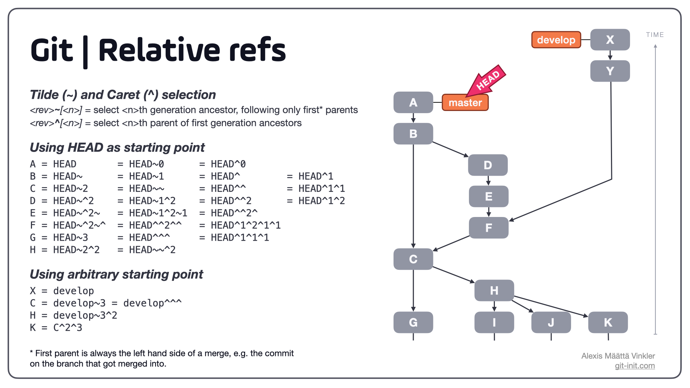
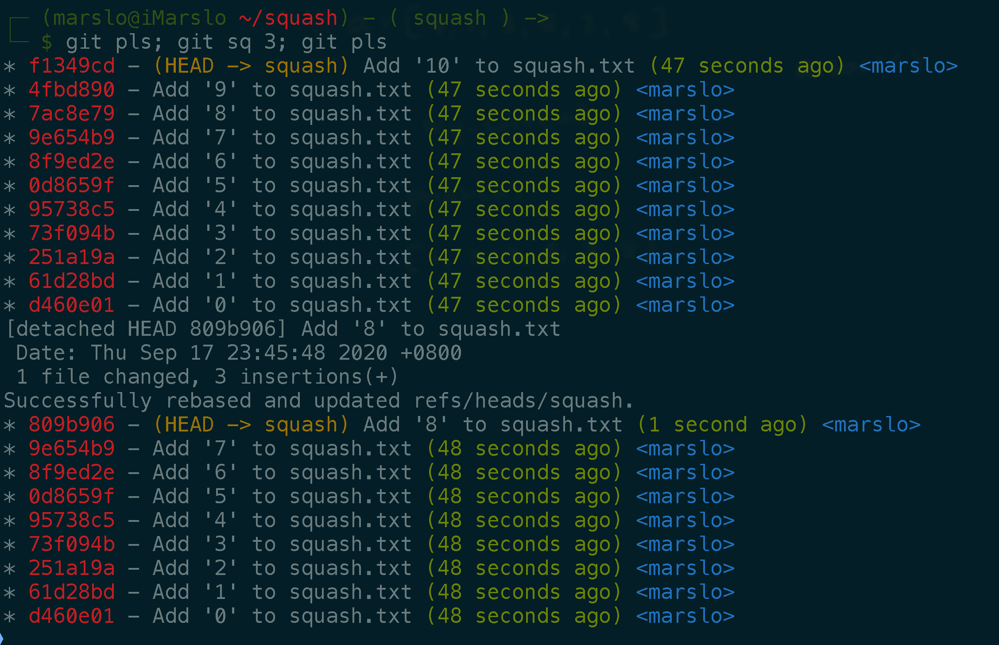
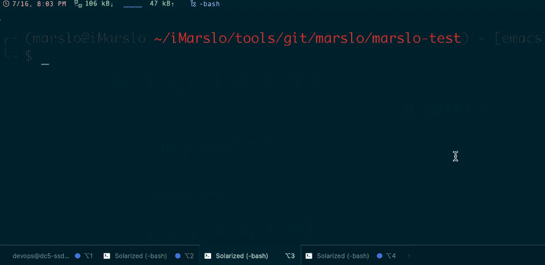
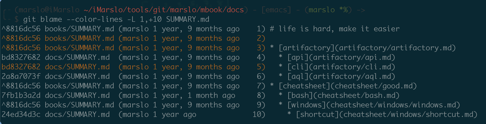
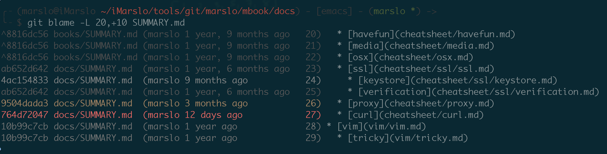

git command study and practice
=======

<!-- START doctoc generated TOC please keep comment here to allow auto update -->
<!-- DON'T EDIT THIS SECTION, INSTEAD RE-RUN doctoc TO UPDATE -->
**Table of Contents**  *generated with [DocToc](https://github.com/thlorenz/doctoc)*

- [appoint](#appoint)
  - [git alias](#git-alias)
  - [specifying ranges](#specifying-ranges)
- [commit](#commit)
  - [get commit id](#get-commit-id)
  - [get abbrev commit ids](#get-abbrev-commit-ids)
  - [get previous commit id](#get-previous-commit-id)
  - [get next commit id](#get-next-commit-id)
- [branch](#branch)
  - [get current branch](#get-current-branch)
  - [create empty branch](#create-empty-branch)
  - [get branch name from reversion](#get-branch-name-from-reversion)
  - [get upstream branch](#get-upstream-branch)
  - [get local/remote branches](#get-localremote-branches)
  - [sort local branch via `committerdate`](#sort-local-branch-via-committerdate)
  - [change head](#change-head)
- [status](#status)
  - [list ignored](#list-ignored)
- [log](#log)
  - [short stat](#short-stat)
  - [show renamed status](#show-renamed-status)
  - [show files and status without comments](#show-files-and-status-without-comments)
  - [show submodule changes](#show-submodule-changes)
  - [get change from `.git/objects`](#get-change-from-gitobjects)
  - [get change history for deleted files](#get-change-history-for-deleted-files)
  - [by contents](#by-contents)
  - [by message](#by-message)
- [rebase](#rebase)
  - [automatic edit by `git rebase -i`](#automatic-edit-by-git-rebase--i)
  - [auto rebaes](#auto-rebaes)
  - [fix typo in commits](#fix-typo-in-commits)
- [undo](#undo)
  - [delete after push](#delete-after-push)
  - [change latest comments in local](#change-latest-comments-in-local)
  - [change remote comments](#change-remote-comments)
  - [change root comments](#change-root-comments)
  - [change author and committer](#change-author-and-committer)
- [mv](#mv)
  - [case sensitive](#case-sensitive)
- [clean](#clean)
  - [clean untracked directory and item in `.gitignore`](#clean-untracked-directory-and-item-in-gitignore)
- [diff](#diff)
  - [`diff-highlight`](#diff-highlight)
  - [get difference between two branches](#get-difference-between-two-branches)
- [tag](#tag)
  - [discribe](#discribe)
  - [get distance between tags](#get-distance-between-tags)
  - [get revision in particular branch](#get-revision-in-particular-branch)
  - [show all tags for particular revision](#show-all-tags-for-particular-revision)
  - [get tag and distance (depth)](#get-tag-and-distance-depth)
- [checkout](#checkout)
  - [checkout specific commit](#checkout-specific-commit)
  - [checkout particular commit and submodules](#checkout-particular-commit-and-submodules)
  - [checkout single branch](#checkout-single-branch)
- [blame](#blame)
  - [blame in line range](#blame-in-line-range)
  - [format](#format)
  - [tricky](#tricky)
- [for-each-ref](#for-each-ref)
  - [get refs days ago](#get-refs-days-ago)
  - [format](#format-1)
  - [date format](#date-format)
- [how to debug](#how-to-debug)

<!-- END doctoc generated TOC please keep comment here to allow auto update -->


> reference:
> - [git reference](https://git-scm.com/docs)
> - [* 🌳🚀 CS Visualized: Useful Git Commands](https://dev.to/lydiahallie/cs-visualized-useful-git-commands-37p1)
> - [git cheatsheet](https://ndpsoftware.com/git-cheatsheet.html#loc=stash;)
> - [git commands](https://git-scm.com/docs/git#_git_commands)
> - [schacon/plumbing.md](https://gist.github.com/schacon/1153310)
> - [git-tips/tips](https://github.com/git-tips/tips)
> - [521xueweihan/git-tips](https://github.com/521xueweihan/git-tips)
> - [CS Visualized: Useful Git Commands](https://dev.to/lydiahallie/cs-visualized-useful-git-commands-37p1)
> - [10.8 Git Internals - Environment Variables](https://git-scm.com/book/en/v2/Git-Internals-Environment-Variables)
> - [GitHub Flow Like a Pro with these 13 Git Aliases](http://haacked.com/archive/2014/07/28/github-flow-aliases/)
> - [gitglossary(7) Manual Page](https://mirrors.edge.kernel.org/pub/software/scm/git/docs/gitglossary.html)


## appoint
### [git alias](https://raw.githubusercontent.com/marslo/mylinux/master/confs/home/.marslo/.gitalias)
```bash
br      = branch
co      = checkout
coa     = commit --amend --no-edit
pl      = !git --no-pager log --color --graph --pretty=tformat:'%C(red)%h%C(reset) -%C(yellow)%d%C(reset) %s %C(green)(%cr) %C(blue)<%an>%C(reset)' --abbrev-commit --date=relative --max-count=3
pls     = log --color --graph --pretty=tformat:'%C(red)%h%C(reset) -%C(yellow)%d%C(reset) %s %C(green)(%cr)%C(reset) %C(blue)<%an>%C(reset)' --abbrev-commit --date=relative
fpl     = log --color --graph --pretty=tformat:'%C(red)%H%C(reset) -%C(yellow)%d%C(reset) %s %C(green)(%cr)%C(reset) %C(blue)<%an>%C(reset)' --abbrev-commit --date=relative
fl      = log -p --graph --color --graph
rlog    = "!bash -c 'while read branch; do \n\
             git fetch --all --force; \n\
             git pl remotes/origin/$branch; \n\
           done < <(git rev-parse --abbrev-ref HEAD) '"
```

### [specifying ranges](https://git-scm.com/docs/gitrevisions#_specifying_ranges)


> references:
> - [gitrevisions](https://git-scm.com/docs/gitrevisions)
> - [First master absolute commit referencing...](https://blog.git-init.com/relative-vs-absolute-references-in-git/)



<figcaption><code>git reflog</code></figcaption>


<figcaption><code>git reflog reset</code></figcaption>


<figcaption>using tilde (~) and caret (^) combined</figcaption>

- commit exclusions
  - `^<rev>` (caret) notation : <br>
    To exclude commits reachable from a commit, a prefix `^` notation is used.<br>
    E.g. `^r1 r2` means commits reachable from r2 but exclude the ones reachable from r1 (i.e. r1 and its ancestors)

- dotted range notations
  - `..` (two-dot) range notation
    - `r1..r2` : commits that are reachable from r2 excluding those that are reachable from r1 by `^r1 r2`
  - `...` (three-dot) symmetric difference notation
    - `r1...r2` : called symmetric difference of r1 and r2<br>It is the set of commits that are reachable from either one of r1 (left side) or r2 (right side) but not from both


## commit
### get commit id

> the `<value>` can be:
> - commit id
> - branch name
> - `HEAD`, `HEAD~n`, `HEAD^^`

```bash
$ git rev-parse <value>^{commit}
```

### get abbrev commit ids

> [!NOTE]
> references:
> - [`--abbrev-commit`](https://git-scm.com/docs/git-rev-list#Documentation/git-rev-list.txt---abbrev-commit)
>
> format:
> - `%H` : commit hash
> - `%h` : abbreviated commit hash

```bash
$ git rev-list HEAD -n 3 --abbrev=11 --abbrev-commit
446c656814d
e747154df34
22d0ee9b131

# or via `git log`
$ git log -n 3 --format='%h' --abbrev=11
# or
$ git log -3 --format='%h' --abbrev=11
446c656814
e747154df3
22d0ee9b13
```

### get previous commit id
```bash
$ git rev-list --no-walk <commit-id>^
```

### get next commit id

> [!NOTE]
> references:
> - [xueliu/version-up.sh](https://gist.github.com/xueliu/e8dfacf22a4be0f7be58a27f094cadbe)

```bash
$ git rev-list --no-walk <commmit-id>..HEAD | tail -1
```

## branch
### [get current branch](https://stackoverflow.com/a/19585361/2940319)
```bash
$ git branch --show-current
```
or
```bash
$ git rev-parse --abbrev-ref HEAD
```
or
```bash
$ git symbolic-ref --short HEAD
```
- or
  ```bash
  $ git symbolic-ref HEAD | sed -e "s/^refs\/heads\///"
  ```
- or
  ```bash
  $ git symbolic-ref --quiet --short HEAD || git rev-parse --short
  ```
[or](https://stackoverflow.com/a/33485172/2940319)
```bash
$ git name-rev --name-only HEAD
```

#### [for detached branch](https://stackoverflow.com/a/19457164/2940319)
```bash
$ git st
HEAD detached at d4beb6ac
...

$ git branch --no-color \
             --remote \
             --verbose \
             --no-abbrev \
             --contains |
      sed -rne 's:^[^/]*/([^\ ]+).*$:\1:p'
marslo/sandbox

# or
$ git branch --no-color \
             --remote \
             --verbose \
             --no-abbrev \
             --contains |
      sed -rne 's:^[ \s]*origin/([^\ ]+).*$:\1:p'
```
- or
  ```bash
  $ git name-rev --name-only HEAD |
        sed -rne 's:^[ \s]*([^\]+/){2}([^~]+).*$:\2:p'

 # or
  $ git name-rev --name-only HEAD |
        sed -rne 's:^[ \s]*remotes/origin/([^~]+).*$:\1:p'
  ```

### create empty branch
  - create an empty branch
    ```bash
    $ mkdir <MY_FOLDER> && cd $_
    $ git init
    $ git remote add origin <REMOTE_URL>
    $ git fetch --all --progress --force
    $ git checkout -b <BRANCH_NAME>
    ```

  - push to remote
    ```bash
    $ git add --all .
    $ git commit -m 'inital an empty branch'
    $ git push --force -u origin HEAD:<BRANCH_NAME>
    ```

  - git alias [`.gitalias`](https://github.com/marslo/mylinux/blob/master/confs/home/.marslo/.gitalias#L120) :
    ```bash
    [alias]
    init-repo   = "!f() { \
                          declare help=\"\"\"\
                            USAGE: git init-repo <REMOTE_URL> [DEFAULT_BRANCH] [LOCAL_DIR] \n\
                            OPT: \n\
                                REMOTE_URL: mandatory \n\
                                DEFAULT_BRANCH: optinal. default is 'master' \n\
                                LOCAL_DIR: optional. default is current directory: '\"$(pwd)\"' \n\
                          \"\"\"; \
                          declare remoteURL=\"$1\"; \
                          declare defaultBr='master'; \
                          declare localDir='.'; \
                          [ 2 -le $# ] && defaultBr=\"$2\"; \
                          [ 3 -eq $# ] && localDir=\"$3\"; \
                          if [ 0 -eq $# ] || [ 3 -lt $# ]; then \
                            echo \"${help}\"; \
                          else \
                            [ -d ${localDir} ] || mkdir -p ${localDir}; \
                            cd ${localDir} ; \
                            git init && \
                            git remote add origin ${remoteURL} && \
                            git fetch --all --force --quiet && \
                            git checkout -b ${defaultBr}; \
                          fi \
                        }; f \
                  "
    ```

### get branch name from reversion
- `branch -a --contians`
  ```bash
  $ git branch -a --contains a3879d3
  * master
    remotes/origin/master
  ```
  or
  ```bash
  $ git branch -r --contains a3879d3
  origin/master
  ```

- `name-rev`
  ```bash
  $ git name-rev a3879d3
  a3879d3 master~12
  ```

### get upstream branch
- get current
  ```bash
  $ git rev-parse --abbrev-ref --symbolic-full-name @{u}
  origin/marslo
  ```
  - or
    ```bash
    $ git for-each-ref --format='%(upstream)' $(git symbolic-ref -q HEAD)
    refs/remotes/origin/marslo
    ```
  - or for `meta/config`
    ```bash
    $ git symbolic-ref -q HEAD
    refs/heads/meta/config
    $ git for-each-ref --format='%(upstream)' $(git symbolic-ref -q HEAD)
    refs/remotes/origin/meta/config
    $ git for-each-ref --format='%(upstream:short)' $(git symbolic-ref -q HEAD)
    origin/meta/config
    ```
  [or](https://stackoverflow.com/a/49418399/2940319)
  ```bash
  $ git status -bsuno
  ## master...origin/master
  ```

- get specific
  ```bash
  $ git rev-parse --abbrev-ref gh-pages@{upstream}
  origin/gh-pages
  ```
  - or
    ```bash
    $ git for-each-ref --format='%(upstream:short)' $(git rev-parse --symbolic-full-name meta/config)
    origin/meta/config
    ```

### [get local/remote branches](https://stackoverflow.com/a/40122019/2940319)
- local
  ```bash
  $ git for-each-ref --format='%(refname:short)' refs/heads/
  ```
- remote
  ```bash
  $ git for-each-ref --format='%(refname:short)' refs/remotes/origin/
  ```

### [sort local branch via `committerdate`](https://stackoverflow.com/a/5188364/2940319)



> references:
> - [How can I get a list of Git branches, ordered by most recent commit?](https://stackoverflow.com/q/5188320/2940319)
> - [sort `git branch` by default](https://stackoverflow.com/a/33163401/2940319)
> ```bash
> $ git config --global branch.sort -committerdate
> ```


```bash
$ git for-each-ref --sort=-committerdate refs/heads/

# Or using git branch (since version 2.7.0)
$ git branch --sort=-committerdate  # DESC
$ git branch --sort=committerdate   # ASC
```

- advanced usage
  ```bash
  $ git for-each-ref \
        --sort=-committerdate \
        refs/heads/ \
        --format='%(HEAD) %(color:yellow)%(refname:short)%(color:reset) - %(color:red)%(objectname:short)%(color:reset) - %(contents:subject) - %(authorname) (%(color:green)%(committerdate:relative)%(color:reset))'
  ```

- for remote
  ```bash
  $ git for-each-ref --sort=-committerdate refs/remotes
  ```

- [more on git tips](https://chromium.googlesource.com/chromium/src.git/+/HEAD/docs/git_tips.md)
  ```bash
  git-list-branches-by-date() {
    local current_branch=$(git rev-parse --symbolic-full-name --abbrev-ref HEAD)
    local normal_text=$(echo -ne '\E[0m')
    local yellow_text=$(echo -ne '\E[0;33m')
    local yellow_bg=$(echo -ne '\E[7;33m')
    git for-each-ref --sort=-committerdate \
        --format=$'  %(refname:short)  \
            \t%(committerdate:short)\t%(authorname)\t%(objectname:short)' \
            refs/heads \
        | column -t -s $'\t' -n \
        | sed -E "s:^  (${current_branch}) :* ${yellow_bg}\1${normal_text} :" \
        | sed -E "s:^  ([^ ]+):  ${yellow_text}\1${normal_text}:"
  }
  ```

#### git alias()
```bash
[alias]
  sb          = "! git branch --sort=-committerdate --format='%(HEAD) %(color:red)%(objectname:short)%(color:reset) - %(color:yellow)%(refname:short)%(color:reset) - %(subject) %(color:bold green)(%(committerdate:relative))%(color:reset) %(color:blue)<%(authorname)>%(color:reset)' --color=always"
  recent      = "! f() { \
                        declare help=\"USAGE: git recent [remotes|tags] [count]\"; \
                        declare refs; \
                        declare count; \
                        if [ 2 -lt $# ]; then \
                          echo \"${help}\"; \
                          exit 1; \
                        else \
                          if [ 'remotes' = \"$1\" ]; then \
                            refs='refs/remotes/origin'; \
                          elif [ 'tags' = \"$1\" ]; then \
                            refs='refs/tags'; \
                          elif [ 1 -eq $# ]; then \
                            count=$1; \
                          fi; \
                          if [ 2 -eq $# ]; then \
                            count=$2; \
                          fi; \
                        fi; \
                        git for-each-ref \
                            --sort=-committerdate \
                            ${refs:='refs/heads'} \
                            --format='%(HEAD) %(color:yellow)%(refname:short)%(color:reset) - %(color:red)%(objectname:short)%(color:reset) - %(contents:subject) - %(authorname) %(color:green)(%(committerdate:relative))%(color:reset)' \
                            --color=always \
                            --count=${count:=5}; \
                    }; f \
                "
```

### [change head](https://stackoverflow.com/a/60102988/2940319)
> reference:
> - [warning: ignoring broken ref refs/remotes/origin/HEAD](https://stackoverflow.com/a/45867333/2940319)

- check refs
  ```bash
  $ git status
  warning: ignoring broken ref refs/remotes/origin/HEAD

  $ git symbolic-ref refs/remotes/origin/HEAD
  refs/remotes/origin/new_master
  ```
- fix warning
  ```bash
  $ git symbolic-ref refs/remotes/origin/HEAD refs/remotes/origin/new_master
  ```
or
  ```bash
  $ git remote set-head origin --delete
  $ git remote set-head origin --auto
  ```
or
  ```bash
  $ git fetch --all --force
  $ git remote set-head origin refs/remotes/origin/new_master
  ```

## status
### list ignored

> [!NOTE|label:references:]
> - [Git command to show which specific files are ignored by .gitignore](https://stackoverflow.com/q/466764/2940319)
> - [Is there a way to tell git-status to ignore the effects of .gitignore files?](https://stackoverflow.com/q/2994612/2940319)
>   - [git update-index](https://stackoverflow.com/a/1818975/2940319)
>   - [ignoring files](https://gitready.com/beginner/2009/01/19/ignoring-files.html)
> - [How can I stop .gitignore from appearing in the list of untracked files?](https://stackoverflow.com/a/39841950/2940319)

- `status`
  ```bash
  $ git status --ignored
  On branch master
  Your branch is up to date with 'origin/master'.

  Ignored files:
    (use "git add -f <file>..." to include in what will be committed)
    bin/

  nothing to commit, working tree clean

  # short status
  $ git status --ignored --short
  !! bin/

  $ git status --porcelain --ignored
  !! bin/

  $ git st --ignored --untracked-files=all
  ## master...origin/master
  !! bin/cfssl
  !! bin/cfssl-bundle
  !! bin/cfssl-certinfo
  !! bin/cfssl-newkey
  !! bin/cfssl-scan
  !! bin/cfssljson
  !! bin/mkbundle
  !! bin/multirootca
  ```

- `check-ignore`
  ```bash
  $ git check-ignore *
  bin

  $ git check-ignore -v *
  .gitignore:4:bin  bin

  $ git check-ignore -v $(find . -type f -print)
  .gitignore:4:bin  ./bin/cfssl-scan
  .gitignore:4:bin  ./bin/cfssl-certinfo
  .gitignore:4:bin  ./bin/cfssl-bundle
  .gitignore:4:bin  ./bin/cfssl
  .gitignore:4:bin  ./bin/cfssl-newkey
  .gitignore:4:bin  ./bin/multirootca
  .gitignore:4:bin  ./bin/mkbundle
  .gitignore:4:bin  ./bin/cfssljso

  $ find . -not -path './.git/*' | git check-ignore --stdin
  ./bin
  ./bin/cfssl-scan
  ./bin/cfssl-certinfo
  ./bin/cfssl-bundle
  ./bin/cfssl
  ./bin/cfssl-newkey
  ./bin/multirootca
  ./bin/mkbundle
  ./bin/cfssljson

  $ find . -path ./.git -prune -o -print | git check-ignore --no-index --stdin --verbose
  .gitignore:4:bin  ./bin
  .gitignore:4:bin  ./bin/cfssl-scan
  .gitignore:4:bin  ./bin/cfssl-certinfo
  .gitignore:4:bin  ./bin/cfssl-bundle
  .gitignore:4:bin  ./bin/cfssl
  .gitignore:4:bin  ./bin/cfssl-newkey
  .gitignore:4:bin  ./bin/multirootca
  .gitignore:4:bin  ./bin/mkbundle
  .gitignore:4:bin  ./bin/cfssljson
  ```

- `ls-files`
  ```bash
  $ git ls-files --others --ignored --exclude-standard
  # or
  $ git ls-files -o -i --exclude-standard
  bin/cfssl
  bin/cfssl-bundle
  bin/cfssl-certinfo
  bin/cfssl-newkey
  bin/cfssl-scan
  bin/cfssljson
  bin/mkbundle
  bin/multirootca

  # or list only directories
  $ git ls-files --others --ignored --exclude-standard --directory
  bin/

  # or from `.gitignore` file
  $ git ls-files --ignored --others --exclude-from=.gitignore
  bin/cfssl
  bin/cfssl-bundle
  bin/cfssl-certinfo
  bin/cfssl-newkey
  bin/cfssl-scan
  bin/cfssljson
  bin/mkbundle
  bin/multirootca
  ```

- `clean`
  ```bash
  $ git clean -ndX
  Would remove bin/
  ```


## log
### short stat
```bash
$ git log --show-signature
# or
$ git log --shortstat
```

### show renamed status
```bash
$ git log -M --summary | grep rename

# or
$ git log -M --summary | grep -E '^\s*rename.*{.*=>.*}'
```

### show files and status without comments
```bash
$ git log --color --stat --abbrev-commit --date=relative --graph --submodule --format="%H"
```

- more
  ```bash
  # or
  $ git log --color --stat --abbrev-commit --date=relative --graph --submodule --format="%h %ad- %s [%an]"

  # or
  $ git log --color --stat --abbrev-commit --date=relative --graph --submodule --format='%C(red)%h%Creset %C(yellow)(%ad)%Creset %s %C(blue)<%an>%Creset'
  ```

- e.g.:
  ```bash
  $ git log -3 --color --stat --abbrev-commit --date=relative --graph --submodule --format="%H"
  * 50ede51fcc3cf0311fd85b3e9c4a36d4beb89e69
  |
  |  devops/git/gerrit.md | 6 ++++--
  |  devops/git/git.md    | 5 +++++
  |  2 files changed, 9 insertions(+), 2 deletions(-)
  * 41d58dabcd0aaee33edd1de7793ffd82c7cffa89
  |
  |  SUMMARY.md | 2 +-
  |  1 file changed, 1 insertion(+), 1 deletion(-)
  * 4460a32d8fddbe7c5c434947aea153273ce215d4
  |
  |  devops/git/{gitStudy.md => git.md} | 117 ++++++++++++++++++++++++++++++++++++++++++++++++++++++++++++++++++++++++++-
  |  1 file changed, 116 insertions(+), 1 deletion(-)
  ```

### show submodule changes
```bash
$ git submodule status
$ git log -- <submodule name>
```

### get change from `.git/objects`
```bash
$ find .git/objects -type f -printf "%P\n" | sed s,/,,
```

### get change history for deleted files

- [`full-history`](https://stackoverflow.com/a/7203551/2940319)
  ```bash
  $ git log --all --full-history -- <path/to/file>
  ```

  - [or](https://stackoverflow.com/a/60993503/2940319)
    ```bash
    $ git log --all --full-history --online -- <path/to/file>
    ```

  - [or](https://stackoverflow.com/a/42582877/2940319)
    ```bash
    $ git log --oneline --follow -- <path/to/file>
    ```

  - or
    ```bash
    $ git log --diff-filter=D --summary | find "delete" | grep <filename>
    ```

- [`--follow`](https://stackoverflow.com/a/36561814/2940319)
  ```bash
  $ git log --follow <path/to/file>
  ```

### [by contents](https://www.atlassian.com/git/tutorials/git-log#filtering-the-commit-history)
```bash
$ git log -S'add' --oneline  -3
6f7877c2 update git for fetch more refs after cloned via --single-branch, and add tricky for vim
30ce195e add jenkins plugin jira-steps
913a7f29 update jenkins recommended plugins
```

### [by message](https://www.atlassian.com/git/tutorials/git-log#filtering-the-commit-history)
```bash
$ git log --grep='jira' --oneline
30ce195e add jenkins plugin jira-steps
d17dd3aa add jira api
```

## rebase

> [!TIP]
> - about [`GIT_SEQUENCE_EDITOR`](https://stackoverflow.com/a/54970726/2940319)
> - [git rebase in depth](https://git-rebase.io/)


### automatic edit by `git rebase -i`
> inspired from [.gitconfig](https://github.com/brauliobo/gitconfig/blob/master/configs/.gitconfig#L220) & [Is there a way to squash a number of commits non-interactively?](https://stackoverflow.com/a/28789332/2940319)

```bash
$ COUNT=$1
$ GIT_EDITOR="sed -i -e '2,$COUNT s/^pick /s /;/# This is the 2nd commit message:/d'" git rebase -i HEAD~$COUNT
```

  [git alias](https://github.com/marslo/mylinux/blob/master/confs/home/git/.gitconfig.alias#L32)
  ```
  [alias]
    sq = ! "f() { TARGET=$1 && GIT_EDITOR=\"sed -i -e '2,$TARGET s/^pick /s /;/# This is the 2nd commit message:/,$ {d}'\" git rebase -i HEAD~$TARGET; }; f"
  ```

example



- [or](https://stackoverflow.com/a/25941070/2940319)
  ```bash
  $ GIT_SEQUENCE_EDITOR="sed -i 's/^pick ce5efdb /edit ce5efdb /;/^pick ce6efdb /d'" git rebase -i ${SHA}
  ```

- or edit
  ```bash
  $ GIT_SEQUENCE_EDITOR="sed -i -re 's/^pick 134567/e 1234567/'" git rebase -i 1234567^
  ```

- or [`sequence.editor`](https://stackoverflow.com/a/38234236/2940319)
  ```bash
  $ git -c sequence.editor='sed -i s/pick/reword/' rebase -i ${SHA}
  ```

### [auto rebaes](https://stackoverflow.com/a/19267103/2940319)
- `.gitconfig`
  ```
  [alias]
    arebase = ! ~/.marslo/bin/arebase.sh
  ```

- `~/.marslo/bin/arebase.sh`
  ```bash
  #!/bin/bash

  ACTION=$1
  COMMIT=$(git rev-parse --short $2)
  [[ "$COMMIT" ]] || exit 1
  CORRECT=
  for A in p pick r reword e edit s squash f fixup d drop t split; do
     [[ $ACTION == $A ]] && CORRECT=1
  done
  [[ "$CORRECT" ]] || exit 1
  git merge-base --is-ancestor $COMMIT HEAD || exit 1
  if [[ $ACTION == "drop" || $ACTION == "d" ]]; then
    GIT_SEQUENCE_EDITOR="sed -i -e '/^pick $COMMIT/d'" git rebase -i $COMMIT^^
  elif [[ $ACTION == "split" || $ACTION == "t" ]]; then
    GIT_SEQUENCE_EDITOR="sed -i -e 's/^pick $COMMIT/edit $COMMIT/'" git rebase -i $COMMIT^^ || exit 1
    git reset --soft HEAD^
    echo "Hints:"
    echo "  Select files to be commited using 'git reset', 'git add' or 'git add -p'"
    echo "  Commit using 'git commit -c $COMMIT'"
    echo "  Finish with 'git rebase --continue'"
  else
    GIT_SEQUENCE_EDITOR="sed -i -e 's/^pick $COMMIT/$1 $COMMIT/'" git rebase -i $COMMIT^^
  fi
  ```

### [fix typo in commits](https://stackoverflow.com/a/12395024/2940319)
```bash
$ EDITOR="sed -i -e 's/borken/broken/g'" GIT_SEQUENCE_EDITOR="sed -i -e 's/pick/reword/g'" git rebase -i --root
```

or:

```bash
$ VISUAL="sed -i -e '/^[[:blank:]]*Change-Id/ d'" GIT_SEQUENCE_EDITOR="sed -i -e 's/pick/reword/g'" git rebase -i --root
```

or:

```bash
$ GIT_EDITOR="sed -i -e 's/kyewrod/keyword/g'" GIT_SEQUENCE_EDITOR="sed -i -e 's/pick/reword/g'" git rebase -i --root
```

## undo
### [delete after push](https://ncona.com/2011/07/how-to-delete-a-commit-in-git-local-and-remote/)
#### delete only the latest commit
```bash
$ git push origin +<hash_for_delete>^:<branch>

# e.g.:
$ git pl --pretty=format:"%h" --no-patch
* cb46bdc
* 936543c
* a83ac6b

# delete cb46bdc
$ git push origin +cb46bdc^:master
```

#### delete multiple commits
- revert local
  ```bash
  $ git reset --hard HEAD~

  # or
  $ git reset --hard HEAD^^^

  # or
  $ git reset --hard <commit_hash>

  # or
  $ git rebase -i HEAD~<n>
  ```

- push to remote
  ```bash
  $ git push [--force] origin +<branch>
  # e.g.:
  $ git push [--force] origin +master
  ```

#### revert deleted branches

> [!TIP]
> references:
> - [Can I recover a branch after its deletion in Git?](https://stackoverflow.com/a/72428070/2940319)
> - [How to Restore a Deleted Branch or Commit with Git Reflog](https://rewind.com/blog/how-to-restore-deleted-branch-commit-git-reflog/)
> - [How to restore a deleted branch](https://confluence.atlassian.com/bbkb/how-to-restore-a-deleted-branch-765757540.html)

```bash
# find the HEAD of deleted branch
$ git log --graph --decorate $(git rev-list -g --all)

$ git checkout <sha>
$ git checkout -b /branch/name
```

- or find out recent actions
  ```bash
  $ git reflog --no-abbrev
  ```

- or find all losts
  ```bash
  $ git fsck --full \
             --no-reflogs \
             --unreachable \
             --lost-found |
        grep commit |
        cut -d\  -f3 |
        xargs -n 1 git log -n 1 --pretty=oneline
  ```

- show diff
  ```bash
  $ git log -p <sha>
  ```

#### revert single file to remotes
```bash
$ git checkout origin/<branch> -- <path/to/file>
```

#### revert changes in submodule
```bash
$ git submodule update -f --init
```

- [or](https://stackoverflow.com/questions/10906554/how-do-i-revert-my-changes-to-a-git-submodule)
  ```bash
  $ git submodule foreach --recursive git reset --hard
  ```
- or
  ```bash
  $ git submodule update -f --recursive
  ```
- or
  ```bash
  $ git submodule foreach --recursive git reset --hard
  $ git submodule update --recursive --init
  ```

#### [Git Reset vs Revert vs Checkout reference](https://www.atlassian.com/git/tutorials/resetting-checking-out-and-reverting)

|     Command    | Scope        | Common use cases                                                     |
|:--------------:|--------------|----------------------------------------------------------------------|
|   `git reset`  | Commit-level | Discard commits in a private branch or throw away uncommited changes |
|   `git reset`  | File-level   | Unstage a file                                                       |
| `git checkout` | Commit-level | Switch between branches or inspect old snapshots                     |
| `git checkout` | File-level   | Discard changes in the working directory                             |
|  `git revert`  | Commit-level | Undo commits in a public branch                                      |
|  `git revert`  | File-level   | (N/A)                                                                |

- `git reset` via `git reflog`

  

- `git reset --hard`

  

- `git reset --soft`

  

- `git revert`

  

### change latest comments in local
```bash
$ git commit --amend
```

- change comments in remote
  ```bash
  $ git pl
  * a79d384 - (HEAD -> master, origin/master, origin/HEAD) update (11 seconds ago) <marslo>
  * 7cef7c7 - update (7 hours ago) <marslo>
  * e1d7a64 - update (7 hours ago) <marslo>

  # change comments on a79d384
  $ git commit --amend
  $ git push --force-with-lease origin master

  # result
  $ git fetch --all --force
  $ git pl remotes/origin/master
  Fetching origin
  * ba49259 - (HEAD -> master, origin/master, origin/HEAD) update a79d384 for change comments (24 seconds ago) <marslo>
  * 7cef7c7 - update (7 hours ago) <marslo>
  * e1d7a64 - update (7 hours ago) <marslo>
  ```

### change remote comments
```bash
$ git rebase -i HEAD~<n>
```

And then change `pick` to `reword`

- example
  ```bash
  $ git pls
  * 1e7d979 - (HEAD -> master, origin/master, origin/HEAD) f (24 seconds ago) <marslo>
  * 9b89ed7 - c (40 seconds ago) <marslo>
  * beb575f - d (51 seconds ago) <marslo>
  * 25d010d - e (57 seconds ago) <marslo>
  * c502e34 - b (64 seconds ago) <marslo>
  * 8890288 - init commit (4 minutes ago) <Marslo Jiao>

  $ git rebase -i HEAD~5
  reword c502e34 b
  pick 25d010d e
  pick beb575f d
  reword 9b89ed7 c
  pick 1e7d979 f

  $ git push --force origin master
  # or
  $ git push origin +master
  ```

### change root comments
```bash
$ git rebase -i --root
$ git push origin +<branch>
```


### change author and committer
- [rebase and amend](https://stackoverflow.com/a/3042512/2940319)
  - go to interactive mode
    ```bash
    $ git config --local user.name "name"
    $ git config --local user.email "name@email.com"
    $ git rebase -i <sha>
    ```
  - modify `pick` to `edit`
  - amend one by one
    ```
    $ git commit --amend --no-edit --only --author="name<name@email.com>"
    # or
    $ git commit --amend --no-edit --date="$(git log -n 1 --format=%aD)" --reset-author

    $ git rebase --continue
    ```

- [git replace](https://stackoverflow.com/a/28845565/2940319)

- [rebase --onto](https://stackoverflow.com/a/72430533/2940319)

  > [!TIP]
  > see also
  > - [rebase onto <sha>](https://stackoverflow.com/a/51114838/2940319)
  > ```bash
  > [alias]
  >     reauthor = !bash -c 'git rebase --onto $1 --exec \"git commit --amend --author=$2\" $1' --
  > ```

  ```bash
  $ git config --local user.name "name"
  $ git config --local user.email "<name@email.com>"
  $ git rebase --no-edit \
               --onto HEAD~9 \
               --exec 'GIT_COMMITTER_DATE="$(git log -n 1 --format=%aD)" \
                       git commit --amend \
                                  --date="$(git log -n 1 --format=%aD)"' \
                                  --author="name<name@email.com>" \           # or --reset-author
                       HEAD~9
  ```

#### check commits with author
```bash
# get commits by name
$ git log --oneline --author="name"

# get commits by email
$ git log --oneline --author="<name@email.com>"
```

## mv
### case sensitive
- error with regular `git mv`
  ```bash
  $ git config --global core.ignorecase true
  $ git mv Tig tig
  fatal: renaming 'confs/home/Tig' failed: Invalid argument
  ```

- renmae
  ```bash
  $ git mv Tig temp
  $ git aa
  $ git mv temp tig
  $ git aa
  $ git st
  On branch master
  Your branch is up to date with 'origin/master'.

  Changes to be committed:
    (use "git restore --staged <file>..." to unstage)
      renamed:    Tig/.tig/marslo.tigrc -> tig/.tig/marslo.tigrc
      renamed:    Tig/.tigrc -> tig/.tigrc
      renamed:    Tig/.tigrc_latest -> tig/.tigrc_latest
      renamed:    Tig/tigrc_2.4.1_1_example -> tig/tigrc_2.4.1_1_example
      renamed:    Tig/tigrc_Marslo -> tig/tigrc_Marslo
  ```

## clean
### clean untracked directory and item in `.gitignore`


> [gitignore.io](https://gitignore.io)


```bash
$ git clean -dfx
```

- quick generate .gitignore
  ```bash
  # show result
  $ curl -skL https://www.gitignore.io/api/groovy

  # download
  $ curl -skL https://www.toptal.com/developers/gitignore/api/groovy,java,python,go -o .gitignore
  ```

#### using `-f` twice if you really want to remove such a directory
```bash
$ git st
On branch meta/config
Your branch is based on 'origin/meta/config', but the upstream is gone.
  (use "git branch --unset-upstream" to fixup)

Untracked files:
  (use "git add <file>..." to include in what will be committed)
    my-sbumodule/

nothing added to commit but untracked files present (use "git add" to track)

$ git clean -dfx
Skipping repository my-submodule/

$ git clean -dffx
Removing my-submodule/
```

## diff
### `diff-highlight`

> [!NOTE]
> references:
> - [How to improve git's diff highlighting?](https://stackoverflow.com/a/55891251/2940319)
> - [git and diff-highlight](https://michaelheap.com/git-and-diff-highlight/)

```bash
# centos8
$ rpm -ql git | grep diff-highlight
/usr/share/git-core/contrib/diff-highlight
# or ubuntu
$ dpkg -L git | grep diff-highlight

$ sudo ln -sf /usr/share/git-core/contrib/diff-highlight /usr/local/bin/diff-highlight
```

### [get difference between two branches](https://til.hashrocket.com/posts/18139f4f20-list-different-commits-between-two-branches)
```bash
$ git log --left-right --graph --cherry-pick --oneline origin/<release>..origin/<dev>
```

- [or](https://stackoverflow.com/a/20419458/2940319)
  ```bash
  $ git rev-list --reverse \
                 --pretty="TO_TEST %h (<%ae>) %s" \
                 --cherry-pick \
                 --right-only origin/<release>...origin/<dev> \
                 | grep "^TO_TEST "
  ```

## tag

> reference :
> - [git like a pro: sort git tags by date](https://www.everythingcli.org/git-like-a-pro-sort-git-tags-by-date/)
> - [How do you achieve a numeric versioning scheme with Git?](https://softwareengineering.stackexchange.com/a/141986/56124)

### discribe
```bash
$ git describe --tags --long <revision>

# v2.5-0-gdeadbee
# ^    ^ ^^
# |    | ||
# |    | |'-- SHA of HEAD (first seven chars)
# |    | '--- "g" is for git
# |    '----- distance : number of commits since last tag
# |
# '---------- last tag name
```

### [get distance between tags](https://stackoverflow.com/a/9752885/2940319)
```bash
$ git describe HEAD --tags
```
- or
  ```bash
  $ git describe HEAD --all --long
  ```

### get revision in particular branch
```
$ git tag -l --sort='creatordate' --merged <branch>
```

#### get latest tag
> references:
> - [Get the most recent tag in git](https://jacobmckinney.com/posts/get-the-most-recent-tag-in-git/)
> - [GIT LIKE A PRO: SORT GIT TAGS BY DATE](https://www.everythingcli.org/git-like-a-pro-sort-git-tags-by-date/)

```bash
$ git tag -l --sort='creatordate' --merged <branch> | tail -1
```

or

```bash
# the command can be executed in .git folder (! -is-inside-work-tree)
$ git describe --tags --abbrev=0 --always
```

or

```bash
$ git for-each-ref --sort=taggerdate \
                   --format '%(tag)' \
                   refs/tags |
      tail -1
```
- to get verbose output
  ```bash
  $ git for-each-ref --sort=taggerdate \
                     --format '%(tag) %(taggerdate:raw) %(taggername) %(subject)' \
                     refs/tags
  ```
  - or
    ```bash
    $ git for-each-ref --sort=taggerdate \
                       --format '%(tag)_,,,_%(taggerdate:raw)_,,,_%(taggername)_,,,_%(subject)' \
                       refs/tags |
          awk 'BEGIN { FS = "_,,,_"  } ; { printf "%-20s %-18s %-25s %s\n", $2, $1, $4, $3  }'
    ```
  - or
    ```bash
    $ git log --tags \
              --simplify-by-decoration \
              --pretty="format:%ai %d" |
          sort
    ```
  - or formatted date
    ```bash
    $ git for-each-ref --sort=taggerdate \
                       --format '%(tag)_,,,_%(taggerdate:raw)_,,,_%(taggername)_,,,_%(subject)' \
                       refs/tags |
          awk 'BEGIN { FS = "_,,,_"  } ; { t=strftime("%Y-%m-%d  %H:%M",$2); printf "%-20s %-18s %-25s %s\n", t, $1, $4, $3  }'
    ```
  - or git alias
    ```bash
    tags = !"git for-each-ref \
                 --sort=taggerdate \
                 --format '%(tag)_,,,_%(taggerdate:raw)_,,,_%(taggername)_,,,_%(subject)' refs/tags \
                 | awk 'BEGIN { FS = \"_,,,_\"  } ; { t=strftime(\"%Y-%m-%d  %H:%M\",$2); printf \"%-20s %-18s %-25s %s\\n\", t, $1, $4, $3  }'"
    ```

#### get revision from latest tag in particular branch
```bash
$ git rev-list -1 --no-patch $(git tag -l --sort='creatordate' --merged <branch> | tail -1)
```

### [show all tags for particular revision](https://stackoverflow.com/a/37497511/2940319)
```bash
$ git tag --points-at <revision>
```
- get tags for `HEAD`:
  ```bash
  $ git tag --points-at HEAD
  ```
[or](https://stackoverflow.com/a/23394114/2940319)
```bash
$ git name-rev --tags --name-only $(git rev-parse <revision>)
```
- example
  ```bash
  $ git name-rev --tags --name-only $(git rev-parse HEAD)
  ```

### get tag and distance (depth)
> reference:
> - [Why does git-describe prefix the commit ID with the letter 'g'?](https://stackoverflow.com/questions/23939214/why-does-git-describe-prefix-the-commit-id-with-the-letter-g)


man of `git-describe`:
<p>
The hash suffix is "-g" + an unambigous abbreviation for the tip commit of parent.
<p>
The length of the abbreviation scales as the repository grows, using the approximate number of objects in the repository and a bit of math around the birthday paradox, and defaults to a minimum of 7.


```bash
$ git describe --long --tags
v1.0.0-epsilon-2-g46b7ebb
  |            |     + -g<has>
  |            + distance (commits on top)
  + tag name

# or
$ git describe --dirty --tags --long
v1.0.0-epsilon-2-g46b7ebb
|            | |  |
 \___    ___/  |  + commit hash of the current commit
      most     + commits on top
     recent
      tag
```

or `--all`
```bash
$ git describe --all --long
```

#### [to filter the tags](https://www.reddit.com/r/git/comments/hj6s0j/find_tags_with_git_describe_on_other_branches/?utm_source=share&utm_medium=web2x&context=3)
```bash
$ git describe --dirty --tags --long --match *nightly*
nightly#82-2001310818-1765-gc18894b193
```

#### [sort git tags by ascending and descending semver](https://andy-carter.com/blog/sort-git-tags-by-ascending-and-descending-semver)

> [!TIP]
> prepend "-" to reverse sort order.
> - ascending  : `--sort=<type>`
> - descending : `--sort=-<type>`
>
> references:
> - [How to sort git tags by version string order of form rc-X.Y.Z.W?](https://stackoverflow.com/a/22634649/2940319)
> - [How can I list all tags in my Git repository by the date they were created?](https://stackoverflow.com/a/test70112/2940319)
> - [GIT LIKE A PRO: SORT GIT TAGS BY DATE](https://www.everythingcli.org/git-like-a-pro-sort-git-tags-by-date/)

- via `v:refname` or `version:refname`
- by created data
  ```bash
  $ git for-each-ref --sort=creatordate --format='%(refname) %(creatordate)' refs/tags

  # or
  $ git tag --format='%(creatordate:short)%09%(refname:strip=2)' --sort=creatordate

  # or
  $ git for-each-ref --sort=taggerdate --format='%(tag) %(taggerdate) %(taggername) %(subject)' refs/tags

  # much better
  $ git for-each-ref --sort=taggerdate \
                     --format '%(tag)_,,,_%(taggerdate:raw)_,,,_%(taggername)_,,,_%(subject)' refs/tags |
        awk 'BEGIN { FS = "_,,,_"  } ; { t=strftime("%Y-%m-%d  %H:%M",$2); printf "%-20s %-18s %-25s %s\n", t, $1, $4, $3  }'
  ```

## checkout
### [checkout specific commit](https://stackoverflow.com/a/3489576/2940319)
```bash
# make a new blank repository in the current directory
git init

# add a remote
git remote add origin url://to/source/repository

# fetch a commit (or branch or tag) of interest
# Note: the full history up to this commit will be retrieved unless
#       you limit it with '--depth=...' or '--shallow-since=...'
git fetch origin <sha1-of-commit-of-interest>

# reset this repository's master branch to the commit of interest
git reset --hard FETCH_HEAD
```

### checkout particular commit and submodules

> [!TIP]
> references:
> - [How to checkout old git commit including all submodules recursively?](https://stackoverflow.com/a/151244test/2940319)
> - [nicktoumpelis/repo-rinse.sh](https://gist.github.com/nicktoumpelis/112143test)

```bash
$ git checkout --recurse-submodules
```

- or
  ```bash
  # [optional] create new branch
  $ git branch <branch-name> <commit-id>
  $ git checkout <branch-name>

  $ git checkout <commit-id>

  $ git submodule init                 # optional
  $ git submodule update --recursive
  ```

- [or](https://gist.github.com/nicktoumpelis/112143test)
  ```bash
  $ git clean -xfd
  $ git submodule foreach --recursive git clean -xfd
  $ git reset --hard
  $ git submodule foreach --recursive git reset --hard
  $ git submodule update --init --recursive
  ```

### checkout single branch
```bash
$ git clone --single-branch --branch <branch name> url://to/source/repository [target dir]
```
- [add more branches](https://stackoverflow.com/a/17714718/2940319)
  ```bash
  $ git config remote.origin.fetch "+refs/heads/*:refs/remotes/origin/*"
  $ git fetch origin
  ```
  [or](https://stackoverflow.com/a/35887986/2940319)
  ```bash
  $ cat ~/.marslo/.gitalias
  [alias]
    # [a]dd [f]etch [r]efs
    afr = !bash -c 'git config --add remote.origin.fetch "+refs/heads/$1:refs/remotes/origin/$1"'

  $ git afr 'sandbox/marslo/*'
  ```

## blame
### blame in line range
- `-L <start>,<end>`
  ```bash
  $ git blame -L 1,3 README.md
  a03bebd23 (marslo Nov 2 2020       1) ---
  a03bebd23 (marslo Nov 2 2020       2) disqus: false
  a03bebd23 (marslo Nov 2 2020       3) ---

  $ git blame -L 1,+3 README.md
  a03bebd23 (marslo Nov 2 2020       1) ---
  a03bebd23 (marslo Nov 2 2020       2) disqus: false
  a03bebd23 (marslo Nov 2 2020       3) ---
  ```

- `-L :<funcname>`
  ```bash
  $ git blame -L :pkgInstallation belloHAKubeCluster.sh
  38327eac (marslo 2019-09-17 22:10:53 +0800 test1) function pkgInstallation() {
  38327eac (marslo 2019-09-17 22:10:53 +0800 test2)   dockerInstallation
  38327eac (marslo 2019-09-17 22:10:53 +0800 test3)   k8sInstallation
  38327eac (marslo 2019-09-17 22:10:53 +0800 test4)   cfsslInstallation
  38327eac (marslo 2019-09-17 22:10:53 +0800 test5)   etcdInstallation
  bdfe4340 (marslo 2019-09-23 16:35:08 +0800 test6)   helmInstallation
  38327eac (marslo 2019-09-17 22:10:53 +0800 test7) }
  38327eac (marslo 2019-09-17 22:10:53 +0800 test8)

  # or
  $ git blame -L '/pkgInstallation/,+3' belloHAKubeCluster.sh
  38327eac (marslo 2019-09-17 22:10:53 +0800 test1) function pkgInstallation() {
  38327eac (marslo 2019-09-17 22:10:53 +0800 test2)   dockerInstallation
  38327eac (marslo 2019-09-17 22:10:53 +0800 test3)   k8sInstallation
  ```

- by keywords ( `git log -S` )
  ```bash
  $ git pls -S pkgInstallation belloHAKubeCluster.sh
  ...
  * 38327ea - update (2 years, 10 months ago) <marslo>
  ```

### format
- `-s`
  ```bash
  $ git blame -s README.md | head -2
  a03bebd23  1) ---
  a03bebd23  2) disqus: false
  ```

- `-n`, `--show-number`
  ```bash
  $ git blame -n -L '/pkgInstallation/,+1' belloHAKubeCluster.sh
  38327eac 553 (marslo 2019-09-17 22:10:53 +0800 test1) function pkgInstallation() {
  ```

- `-f`, `--show-name`
  ```bash
  $ git blame -f -L '/pkgInstallation/,+1' belloHAKubeCluster.sh
  38327eac kubernetes/belloHAKubeCluster.sh (marslo 2019-09-17 22:10:53 +0800 test1) function pkgInstallation() {
  ```

- `-e`, `--show-email`

  > [!TIP]
  > This can also be controlled via the blame.showEmail config option.

  ```bash
  $ git blame -e -L '/pkgInstallation/,+1' belloHAKubeCluster.sh
  38327eac (<marslo@gmail.com> 2019-09-17 22:10:53 +0800 test1) function pkgInstallation() {
  ```

- `-l`
  ```bash
  $ git blame -l -L '/pkgInstallation/,+1' belloHAKubeCluster.sh
  38327eac9b01d57c13d1865d58d822a81717d60f (marslo 2019-09-17 22:10:53 +0800 test1) function pkgInstallation() {
  ```

- `--date`

  > [!TIP]
  > check : [imarslo: date format](#date-format)
  > setup global in `~/.gitconfig` :
  > ```
  > [blame]
  >   date="format:%Y-%m-%d %H:%M:%S %p"
  > ```

  ```bash
  $ for i in iso iso-strict relative local rfc short raw human unix 'format:%c' '"format:%Y-%m-%d %H:%M:%S"'; do
      cmd="git blame --date=${i} -L '/pkgInstallation/,+1' belloHAKubeCluster.sh";
      echo ${cmd}; eval ${cmd}; echo "";
    done

    git blame --date=iso -L '/pkgInstallation/,+1' belloHAKubeCluster.sh
    38327eac (marslo 2019-09-17 22:10:53 +0800 test1) function pkgInstallation() {

    git blame --date=iso-strict -L '/pkgInstallation/,+1' belloHAKubeCluster.sh
    38327eac (marslo 2019-09-17T22:10:53+08:00 test1) function pkgInstallation() {

    git blame --date=relative -L '/pkgInstallation/,+1' belloHAKubeCluster.sh
    38327eac (marslo 2 years, 10 months ago test1) function pkgInstallation() {

    git blame --date=local -L '/pkgInstallation/,+1' belloHAKubeCluster.sh
    38327eac (marslo Tue Sep 17 22:10:53 2019       test1) function pkgInstallation() {

    git blame --date=rfc -L '/pkgInstallation/,+1' belloHAKubeCluster.sh
    38327eac (marslo Tue, 17 Sep 2019 22:10:53 +0800 test1) function pkgInstallation() {

    git blame --date=short -L '/pkgInstallation/,+1' belloHAKubeCluster.sh
    38327eac (marslo 2019-09-17 test1) function pkgInstallation() {

    git blame --date=raw -L '/pkgInstallation/,+1' belloHAKubeCluster.sh
    38327eac (marslo 1568729453 +0800 test1) function pkgInstallation() {

    git blame --date=human -L '/pkgInstallation/,+1' belloHAKubeCluster.sh
    38327eac (marslo Sep 17 2019      test1) function pkgInstallation() {

    git blame --date=unix -L '/pkgInstallation/,+1' belloHAKubeCluster.sh
    38327eac (marslo 1568729453 test1) function pkgInstallation() {

    git blame --date=format:%c -L '/pkgInstallation/,+1' belloHAKubeCluster.sh
    38327eac (marslo Tue Sep 17 22:10:53 2019 test1) function pkgInstallation() {

    git blame --date="format:%Y-%m-%d %H:%M:%S" -L '/pkgInstallation/,+1' belloHAKubeCluster.sh
    38327eac (marslo 2019-09-17 22:10:53 test1) function pkgInstallation() {
  ```

- `--color-lines`

  > [!TIP]
  > references:
  > - [color.blame.repeatedLines](https://git-scm.com/docs/git-config#Documentation/git-config.txt-colorblamerepeatedLines)
  >
  > example:
  > ```git
  > [color "blame"]
  >   repeatedLines = 130
  > ```

  

- `--color-by-age`

  > [!TIP]
  > references:
  > - [color.blame.highlightRecent](https://git-scm.com/docs/git-config#Documentation/git-config.txt-colorblamehighlightRecent)
  > - [BuonOmo/.gitconfig](https://gist.github.com/BuonOmo/ce45b51d0cefe949fd0c536a4a60f000)
  >
  > example:
  > ```git
  > [color "blame"]
  >   highlightRecent = 239, 20 month ago, 240, 18 month ago, 241, 16 month ago, 242, 14 month ago, 243, 12 month ago, 244, 10 month ago, 245, 8 month ago, 246, 6 month ago, 247, 4 month ago, 131, 3 month ago, 137, 2 month ago, 172, 1 month ago, 167, 3 weeks ago, 166, 2 weeks ago, 203, 1 week ago, 202
  > // others
  > [color "blame"]
  >   highlightRecent = 237, 20 month ago, 238, 19 month ago, 239, 18 month ago, 240, 17 month ago, 241, 16 month ago, 242, 15 month ago, 243, 14 month ago, 244, 13 month ago, 245, 12 month ago, 246, 11 month ago, 247, 10 month ago, 248, 9 month ago, 249, 8 month ago, 250, 7 month ago, 251, 6 month ago, 252, 5 month ago, 253, 4 month ago, 254, 3 month ago, 231, 2 month ago, 230, 1 month ago, 229, 3 weeks ago, 228, 2 weeks ago, 227, 1 week ago, 226
  > ```

  

### tricky
- `--since`
  ```bash
  $ git blame --since=3.weeks -- foo

  # or
  $ git blame v2.6.18.. -- foo
  ```

## for-each-ref

### get refs days ago
```bash
while read revision branch commitDate; do
  benchmark=$(date +%s --date="1 year ago")
  # echo "benchmark: $benchmark"
  if [[ commitDate -le benchmark ]]; then
    git for-each-ref ${branch} --format='%(refname:short) - %(align:right,20)%(committerdate:format:%Y-%m-%d %H:%M:%S)%(end)'
  fi
done < <(git for-each-ref refs/remotes/origin/sandbox --sort=committerdate --format='%(objectname) %(refname) %(committerdate:unix)')
```
- to archive
  ```bash
  $ git push origin refs/remotes/origin/sandbox/marslo/test:refs/remotes/archive/sandbox/marslo/test
  Total 0 (delta 0), reused 0 (delta 0), pack-reused 0
  remote: Processing changes: refs: 1, done
  remote: GitMS - update replicated.
  To ssh://gerrit.domain.com:29418/storage/ssdfw/devops/jenkins
   * [new reference]     origin/sandbox/marslo/test -> archive/sandbox/marslo/test
  ```

- [to delete](https://superuser.com/a/601486/112396)
  ```
  # delete local refs
  $ git update-ref -d refs/remotes/origin/sandbox/marslo/test -m 'already archived in refs/remotes/archive/sandbox/marslo/test'
  # delete remote refs
  $ git push . :refs/remotes/origin/sandbox/marslo/test

  # or delete without `refs/remotes/`
  $ git push origin --delete archive/sandbox/marslo/test
  $ git push origin --delete origin/sandbox/marslo/test
  ```

  - delete via `origin` will get issue `internal server error`
    ```bash
    $ git push origin --force :refs/remotes/origin/sandbox/marslo/test
    remote: Processing changes: refs: 1, done
    remote: error: ref update is a no-op: DELETE: 0000000000000000000000000000000000000000 0000000000000000000000000000000000000000 refs/remotes/origin/sandbox/marslo/test
    To ssh://gerrit.domain.com:29418/storage/ssdfw/devops/jenkins
     ! [remote rejected]   origin/sandbox/marslo/test (internal server error)
    error: failed to push some refs to 'ssh://gerrit.domain.com:29418/storage/ssdfw/devops/jenkins'
    ```

- to retrive
  ```bash
  # fetch single ref
  $ git fetch origin refs/remotes/archive/sandbox/marslo/test
  From ssh://gerrit.domain.com:29418/storage/ssdfw/devops/jenkins
   * remote-tracking branch archive/sandbox/marslo/test -> FETCH_HEAD
  $ git checkout FETCH_HEAD
  HEAD is now at 749bd27d test

  # fetch all ref
  $ git fetch origin refs/remotes/archive/*:refs/archive/*
  remote: Counting objects: 4507, done
  remote: Finding sources: 100% (57/57)
  remote: Total 57 (delta 20), reused 49 (delta 20)
  Unpacking objects: 100% (57/57), 14.52 KiB | 424.00 KiB/s, done.
  From ssh://gerrit.domain.com:29418/storage/ssdfw/devops/jenkins
   * [new ref]           archive/sandbox/marslo/test       -> refs/archive/sandbox/marslo/test
   * [new ref]           archive/sandbox/marslo/sandbox    -> refs/archive/sandbox/marslo/sandbox
   * [new ref]           archive/sandbox/marslo/sample     -> refs/archive/sandbox/marslo/sample
  ```


### format


> - `(subject)`           : `"the subject line"`
> - `%(subject:sanitize)` : `"the-subject-line"`



> [!TIP]
> - [field names](https://git-scm.com/docs/git-for-each-ref#_field_names)
> - [foramtting]()https://git-scm.com/docs/git-for-each-ref/2.21.0#Documentation/git-for-each-ref.txt---formatltformatgt
> - [git/t/t6300-for-each-ref.sh](https://github.com/git/git/blob/c25fba986bfc737d775430d290b93136d390e067/t/t6300-for-each-ref.sh#L79-L216)
> <br>
> - format:
>   - `%00`                        -> `\0` (NUL)
>   - `%09`                        -> `\t` (tab)
>   - `%0a`                        -> `\n` (LF)
> <br>
> - field names:
>   - head :
>     - `refname:`                 -> `refs/heads/master`
>     - `refname:short`            -> `master`
>     - `refname:lstrip=1`         -> `heads/master`
>     - `refname:lstrip=2`         -> `master`
>     - `refname:lstrip=-1`        -> `master`
>     - `refname:lstrip=-2`        -> `heads/master`
>     - `refname:rstrip=1`         -> `refs/heads`
>     - `refname:rstrip=2`         -> `refs`
>     - `refname:rstrip=-1`        -> `refs`
>     - `refname:rstrip=-2`        -> `refs/heads`
>     - `refname:strip=1`          -> `heads/master`
>     - `refname:strip=2`          -> `master`
>     - `refname:strip=-1`         -> `master`
>     - `refname:strip=-2`         -> `heads/master`
>     - `upstream`                 -> `refs/remotes/origin/master`
>     - `upstream:short`           -> `origin/master`
>     - `upstream:lstrip=2`        -> `origin/master`
>     - `upstream:lstrip=-2`       -> `origin/master`
>     - `upstream:rstrip=2`        -> `refs/remotes`
>     - `upstream:rstrip=-2`       -> `refs/remotes`
>     - `upstream:strip=2`         -> `origin/master`
>     - `upstream:strip=-2`        -> `origin/master`
>     - `push`                     -> `refs/remotes/myfork/master`
>     - `push:short`               -> `myfork/master`
>     - `push:lstrip=1`            -> `remotes/myfork/master`
>     - `push:lstrip=-1`           -> `master`
>     - `push:rstrip=1`            -> `refs/remotes/myfork`
>     - `push:rstrip=-1`           -> `refs`
>     - `push:strip=1`             -> `remotes/myfork/master`
>     - `push:strip=-1`            -> `master`
>     - `objecttype`               -> `commit`
>     - `objectsize`               -> `$((131 + hexlen))`
>     - `objectsize:disk`          -> `$disklen`
>     - `deltabase`                -> `$ZERO_OID`
>     - `parent`                   -> `''`
>     - `parent:short`             -> `''`
>     - `parent:short=1`           -> `''`
>     - `parent:short=10`          -> `''`
>     - `numparent`                -> `0`
>     - `object`                   -> `''`
>     - `type`                     -> `''`
>     - `'*objectname'`            -> `''`
>     - `'*objecttype'`            -> `''`
>     - `author`                   -> `'A U Thor <author@example.com> 1151968724 +0200'`
>     - `authorname`               -> `'A U Thor'`
>     - `authoremail`              -> `'<author@example.com>'`
>     - `authoremail:trim`         -> `'author@example.com'`
>     - `authoremail:localpart`    -> `'author'`
>     - `tag`                      -> `''`
>     - `tagger`                   -> `''`
>     - `taggername`               -> `''`
>     - `taggeremail`              -> `''`
>     - `taggeremail:trim`         -> `''`
>     - `taggeremail:localpart`    -> `''`
>     - `taggerdate`               -> `''`
>     - `subject`                  -> `'Initial'`
>     - `subject:sanitize`         -> `'Initial'`
>     - `contents:subject`         -> `'Initial'`
>     - `body`                     -> `''`
>     - `contents:body`            -> `''`
>     - `contents:signature`       -> `''`
>     - `contents`                 -> `'Initial'`
>     - `HEAD`                     -> `'*'`
>     - `objectname`               -> `$(git rev-parse refs/heads/master)`
>     - `objectname:short`         -> `$(git rev-parse --short refs/heads/master)`
>     - `objectname:short=1`       -> `$(git rev-parse --short=1 refs/heads/master)`
>     - `objectname:short=10`      -> `$(git rev-parse --short=10 refs/heads/master)`
>     - `tree`                     -> `$(git rev-parse refs/heads/master^{tree})`
>     - `tree:short`               -> `$(git rev-parse --short refs/heads/master^{tree})`
>     - `tree:short=1`             -> `$(git rev-parse --short=1 refs/heads/master^{tree})`
>     - `tree:short=10`            -> `$(git rev-parse --short=10 refs/heads/master^{tree})`
>     - `authordate`               -> `'Tue Jul 4 01:18:44 2006 +0200'`
>     - `committer`                -> `'C O Mitter <committer@example.com> 1151968723 +0200'`
>     - `committername`            -> `'C O Mitter'`
>     - `committeremail`           -> `'<committer@example.com>'`
>     - `committeremail:trim`      -> `'committer@example.com'`
>     - `committeremail:localpart` -> `'committer'`
>     - `committerdate`            -> `'Tue Jul 4 01:18:43 2006 +0200'`
>     - `objectname:short=1`       -> `$(git rev-parse --short=1 refs/heads/master)`
>     - `objectname:short=10`      -> `$(git rev-parse --short=10 refs/heads/master)`
>     - `creator`                  -> `'C O Mitter <committer@example.com> 1151968723 +0200'`
>     - `creatordate`              -> `'Tue Jul 4 01:18:43 2006 +0200'`
> <br>
>   - tags:
>     - `refname`                  -> `refs/tags/testtag`
>     - `refname:short`            -> `testtag`
>     - `upstream`                 -> `''`
>     - `push`                     -> `''`
>     - `objecttype`               -> `tag`
>     - `objectsize`               -> `$((114 + hexlen))`
>     - `objectsize:disk`          -> `$disklen`
>     - `'*objectsize:disk'`       -> `$disklen`
>     - `deltabase`                -> `$ZERO_OID`
>     - `'*deltabase'`             -> `$ZERO_OID`
>     - `tree`                     -> `''`
>     - `tree:short`               -> `''`
>     - `tree:short=1`             -> `''`
>     - `tree:short=10`            -> `''`
>     - `parent`                   -> `''`
>     - `parent:short`             -> `''`
>     - `parent:short=1`           -> `''`
>     - `parent:short=10`          -> `''`
>     - `numparent`                -> `''`
>     - `type`                     -> `'commit'`
>     - `'*objecttype'`            -> `'commit'`
>     - `author`                   -> `''`
>     - `authorname`               -> `''`
>     - `authoremail`              -> `''`
>     - `authoremail:trim`         -> `''`
>     - `authoremail:localpart`    -> `''`
>     - `authordate`               -> `''`
>     - `committer`                -> `''`
>     - `committername`            -> `''`
>     - `committeremail`           -> `''`
>     - `committeremail:trim`      -> `''`
>     - `committeremail:localpart` -> `''`
>     - `committerdate`            -> `''`
>     - `tag`                      -> `'testtag'`
>     - `body`                     -> `''`
>     - `contents:body`            -> `''`
>     - `contents:signature`       -> `''`
>     - `contents`                 -> `'Tagging at 1151968727``
>     - `object`                   -> `$(git rev-parse refs/tags/testtag^0)`
>     - `objectname`               -> `$(git rev-parse refs/tags/testtag)`
>     - `objectname:short`         -> `$(git rev-parse --short refs/tags/testtag)`
>     - `'*objectname'`            -> `$(git rev-parse refs/tags/testtag^{})`
>     - `tagger`                   -> `'C O Mitter <committer@example.com> 1151968725 +0200'`
>     - `taggername`               -> `'C O Mitter'`
>     - `taggeremail`              -> `'<committer@example.com>'`
>     - `taggeremail:trim`         -> `'committer@example.com'`
>     - `taggeremail:localpart`    -> `'committer'`
>     - `taggerdate`               -> `'Tue Jul 4 01:18:45 2006 +0200'`
>     - `creator`                  -> `'C O Mitter <committer@example.com> 1151968725 +0200'`
>     - `creatordate`              -> `'Tue Jul 4 01:18:45 2006 +0200'`
>     - `subject`                  -> `'Tagging at 1151968727'`
>     - `subject:sanitize`         -> `'Tagging-at-1151968727'`
>     - `contents:subject`         -> `'Tagging at 1151968727'`

### date format

> [!TIP]
> references:
> - [Specification for syntax of git dates](https://stackoverflow.com/a/14025405/2940319)
> - [strftime](https://docs.microsoft.com/en-us/cpp/c-runtime-library/reference/strftime-wcsftime-strftime-l-wcsftime-l?redirectedfrom=MSDN&view=msvc-170)
> - [strftime](http://www.cplusplus.com/reference/ctime/strftime/)
>
> format:
> - `relative`
> - `local`
> - `default`
> - `iso` ( or `iso8601` )
> - `rfc` ( or `rfc2822` )
> - `short`
> - `raw`
> - `format:%Y-%m-%d %I:%M %p`
>
> strftime :
> - `%a` :     Abbreviated weekday name
> - `%A` :     Full weekday name
> - `%b` :     Abbreviated month name
> - `%B` :     Full month name
> - `%c` :     Date and time representation appropriate for locale
> - `%d` :     Day of month as decimal number (01 – 31)
> - `%H` :     Hour in 24-hour format (00 – 23)
> - `%I` :     Hour in 12-hour format (01 – 12)
> - `%j` :     Day of year as decimal number (001 – 366)
> - `%m` :     Month as decimal number (01 – 12)
> - `%M` :     Minute as decimal number (00 – 59)
> - `%p` :     Current locale's A.M./P.M. indicator for 12-hour clock
> - `%S` :     Second as decimal number (00 – 59)
> - `%U` :     Week of year as decimal number, with Sunday as first day of week (00 – 53)
> - `%w` :     Weekday as decimal number (0 – 6; Sunday is 0)
> - `%W` :     Week of year as decimal number, with Monday as first day of week (00 – 53)
> - `%x` :     Date representation for current locale
> - `%X` :     Time representation for current locale
> - `%y` :     Year without century, as decimal number (00 – 99)
> - `%Y` :     Year with century, as decimal number
> - `%%` :     Percent sign
> - `%z`, `%Z` : Either the time-zone name or time zone abbreviation, depending on registry settings

- how to use
  ```bash
  $ git for-each-ref --sort=-taggerdate refs/tags \
                     --format='%(committerdate)'
  Mon Aug 30 21:50:57 2021 +0800

  $ git for-each-ref --sort=-taggerdate refs/tags \
                     --format='%(committerdate:relative)'
  9 months ago

  $ git for-each-ref --sort=-taggerdate refs/tags \
                     --format='%(committerdate:raw)'
  1630331457 +0800

  $ git for-each-ref --sort=-taggerdate refs/tags \
                     --format='%(committerdate:iso)'
  2021-08-30 21:50:57 +0800

  $ git for-each-ref --sort=-taggerdate refs/tags \
                     --format='%(committerdate:rfc)'
  Mon, 30 Aug 2021 21:50:57 +0800

  $ git for-each-ref --sort=-taggerdate refs/tags \
                     --format='%(committerdate:local)'
  Mon Aug 30 21:50:57 2021

  $ git for-each-ref --sort=-taggerdate refs/tags \
                     --format='%(committerdate:format:%Y-%m-%d %I:%M %p)'
  2021-08-30 09:50 PM

  $ git for-each-ref --sort=-taggerdate refs/tags \
                     --format='%(committerdate:format:%Y-%m-%d %H:%M:%S)'
  2021-08-30 21:50:57
  ```

#### color

> [!TIP]
> usage:
> - `%(color:<color_name>)`
> - `%(color:reset)`

- example
  ```bash
  $ git for-each-ref --sort=-taggerdate refs/tags \
                     --format='%(color:yellow)%(committerdate:iso)%(color:reset)' \
                     --color
  =always
  2021-08-30 21:50:57 +0800

  $ git for-each-ref --sort=-taggerdate refs/tags \
                     --format='%(color:blue)%(committerdate:iso)%(color:reset)' \
                     --color=always
  2021-08-30 21:50:57 +0800
  ```

#### condition

> [!TIP]
> - `%(if)...%(then)...%(else)...%(end)`
> - `%(align:<number>,left) ... %(end)`

- example
  ```bash
  $ git for-each-ref --sort=-taggerdate refs/tags \
                     --format='%(if)%(committerdate)%(then)%(committerdate:format:%Y-%m-%d %I:%M %p)%(else)%(taggerdate:format:%Y-%m-%d %I:%M %p)%(end)'
  2021-08-30 09:50 PM

  $ git for-each-ref --sort=-taggerdate refs/tags \
                     --format='%(align:left,50)[%(objecttype) : %(refname:short)]%(end) (%(committerdate:format:%Y-%m-%d %H:%M)) <%(committername)>' \
                     --color \
                     --count=10
  [commit : sandbox/marslo/tag-1]              (2021-08-30 21:50) <marslo>
  ```


#### alias
```bash
[alias]
  ### [p]retty [t]ag
  pt          = "!git for-each-ref --sort=-taggerdate refs/tags --format='%(color:red)%(objectname:short)%(color:reset) - %(align:left,38)%(color:bold yellow)[%(objecttype) : %(refname:short)]%(color:reset)%(end) %(subject) %(color:green)(%(if)%(taggerdate)%(then)%(taggerdate:format:%Y-%m-%d %H:%M)%(else)%(committerdate:format:%Y-%m-%d %H:%M)%(end))%(color:reset) %(color:blue)%(if)%(taggername)%(then)<%(taggername)>%(else)<%(committername)>%(end)%(color:reset)' --color --count=10"
  pts         = "!git for-each-ref --sort=-taggerdate refs/tags --format='%(color:red)%(objectname:short)%(color:reset) - %(color:bold yellow)[%(objecttype) : %(refname:short)]%(color:reset) - %(subject) %(color:green)(%(if)%(taggerdate)%(then)%(taggerdate:format:%Y-%m-%d %H:%M)%(else)%(committerdate:format:%Y-%m-%d %H:%M)%(end))%(color:reset) %(color:blue)%(if)%(taggername)%(then)<%(taggername)>%(else)<%(committername)>%(end)%(color:reset)' --color"

  ### [p]retty [b]ranch
  pb          = "! git for-each-ref refs/heads refs/remotes --sort=-committerdate --format='%(color:red)%(objectname:short)%(color:reset) - %(color:bold yellow)%(committerdate:format:%Y-%m-%d %H:%M:%S)%(color:reset) - %(align:left,20)%(color:cyan)<%(authorname)>%(color:reset)%(end) %(color:bold red)%(if)%(HEAD)%(then)* %(else)  %(end)%(color:reset)%(refname:short)' --color --count=10"
  pbs         = "! git for-each-ref refs/heads refs/remotes --sort=-committerdate --format='%(color:red)%(objectname:short)%(color:reset) - %(color:bold yellow)%(committerdate:format:%Y-%m-%d %H:%M:%S)%(color:reset) - %(align:left,20)%(color:cyan)<%(authorname)>%(color:reset)%(end) %(color:bold red)%(if)%(HEAD)%(then)* %(else)  %(end)%(color:reset)%(refname:short)' --color"
```


## how to debug

> [!NOTE|label:references:]
> - [`GIT_TRACE_CURL=1` or `GIT_CURL_VERBOSE=1`](https://stackoverflow.com/a/38285866/2940319)
> - [`GIT_TRACE2_PERF_BRIEF=1` and `GIT_TRACE2_PERF=~/log.perf`](https://stackoverflow.com/a/74332242/2940319)
> - [`GIT_TRACE` or `GIT_TR2`](https://stackoverflow.com/a/56094711/2940319)
> - [How can I debug git/git-shell related problems?](https://stackoverflow.com/a/38706495/2940319)
>   - `GIT_TRACE` for general traces,
>   - `GIT_TRACE_PACK_ACCESS` for tracing of packfile access,
>   - `GIT_TRACE_PACKET` for packet-level tracing for network operations,
>   - `GIT_TRACE_PERFORMANCE` for logging the performance data,
>   - `GIT_TRACE_SETUP` for information about discovering the repository and environment it’s interacting with,
>   - `GIT_MERGE_VERBOSITY` for debugging recursive merge strategy (values: 0-5),
>   - `GIT_CURL_VERBOSE` for logging all curl messages (equivalent to `curl -v`),
>   - `GIT_TRACE_SHALLOW` for debugging fetching/cloning of shallow repositories.

- i.e.
  ```bash
  $ set -x;
  $ GIT_TRACE=2 GIT_CURL_VERBOSE=2 GIT_TRACE_PERFORMANCE=2 GIT_TRACE_PACK_ACCESS=2 GIT_TRACE_PACKET=2 GIT_TRACE_PACKFILE=2 GIT_TRACE_SETUP=2 GIT_TRACE_SHALLOW=2 git pull origin master -v -v;
  $ set +x
  ```
