git command study and practice
=======

<!-- START doctoc generated TOC please keep comment here to allow auto update -->
<!-- DON'T EDIT THIS SECTION, INSTEAD RE-RUN doctoc TO UPDATE -->

- [appoint](#appoint)
  - [environment](#environment)
  - [specifying ranges](#specifying-ranges)
- [commit](#commit)
  - [get revision number](#get-revision-number)
  - [get abbrev commit ids](#get-abbrev-commit-ids)
  - [get previous commit id](#get-previous-commit-id)
  - [get next commit id](#get-next-commit-id)
- [branch](#branch)
  - [get current branch](#get-current-branch)
  - [create empty branch](#create-empty-branch)
  - [get branch name from reversion](#get-branch-name-from-reversion)
  - [get upstream branch](#get-upstream-branch)
  - [get local/remote branches](#get-localremote-branches)
  - [sort local branch via `committerdate`](#sort-local-branch-via-committerdate)
  - [change head](#change-head)
  - [get first parent branch](#get-first-parent-branch)
- [tag](#tag)
  - [show tags](#show-tags)
  - [sort git tags](#sort-git-tags)
  - [filter tags](#filter-tags)
  - [lightweight VS. annotated](#lightweight-vs-annotated)
- [status](#status)
  - [list ignored](#list-ignored)
- [filter in history](#filter-in-history)
  - [all renamed files](#all-renamed-files)
  - [all deleted files](#all-deleted-files)
  - [files changed by specific users](#files-changed-by-specific-users)
  - [files changes by pattern](#files-changes-by-pattern)
- [log](#log)
  - [short stat](#short-stat)
  - [show files and status without comments](#show-files-and-status-without-comments)
  - [show submodule changes](#show-submodule-changes)
  - [get change from `.git/objects`](#get-change-from-gitobjects)
  - [get change history for deleted files](#get-change-history-for-deleted-files)
  - [search by contents](#search-by-contents)
  - [search by message](#search-by-message)
- [show](#show)
  - [show file change details](#show-file-change-details)
  - [show file status only](#show-file-status-only)
- [rebase](#rebase)
  - [automatic edit by `git rebase -i`](#automatic-edit-by-git-rebase--i)
  - [auto rebaes](#auto-rebaes)
  - [fix typo in commits](#fix-typo-in-commits)
- [undo](#undo)
  - [delete after push](#delete-after-push)
  - [change latest comments in local](#change-latest-comments-in-local)
  - [change remote comments](#change-remote-comments)
  - [change root comments](#change-root-comments)
  - [change author and committer](#change-author-and-committer)
- [diff](#diff)
  - [`diff-highlight`](#diff-highlight)
  - [get diff from particular author](#get-diff-from-particular-author)
  - [get difference between two branches](#get-difference-between-two-branches)
  - [diff ignore whitespace](#diff-ignore-whitespace)
- [tag](#tag-1)
  - [describe](#describe)
  - [get revision in particular branch](#get-revision-in-particular-branch)
- [checkout](#checkout)
  - [sparse-checkout](#sparse-checkout)
  - [checkout specific commit](#checkout-specific-commit)
  - [checkout particular commit and submodules](#checkout-particular-commit-and-submodules)
  - [checkout single branch](#checkout-single-branch)
- [remote](#remote)
  - [fetch single branch](#fetch-single-branch)
  - [clone with different refsepc](#clone-with-different-refsepc)
  - [add more remotes](#add-more-remotes)
  - [remove remote repo](#remove-remote-repo)
- [blame](#blame)
  - [blame in line range](#blame-in-line-range)
  - [format](#format)
  - [tricky](#tricky)
- [for-each-ref](#for-each-ref)
  - [get refs days ago](#get-refs-days-ago)
- [others](#others)
  - [mv](#mv)
  - [clean](#clean)

<!-- END doctoc generated TOC please keep comment here to allow auto update -->


> reference:
> - [git reference](https://git-scm.com/docs)
> - [* 🌳🚀 CS Visualized: Useful Git Commands](https://dev.to/lydiahallie/cs-visualized-useful-git-commands-37p1)
> - [git cheatsheet](https://ndpsoftware.com/git-cheatsheet.html#loc=stash;)
> - [git commands](https://git-scm.com/docs/git#_git_commands)
> - [schacon/plumbing.md](https://gist.github.com/schacon/1153310)
> - [git-tips/tips](https://github.com/git-tips/tips)
> - [521xueweihan/git-tips](https://github.com/521xueweihan/git-tips)
> - [10.8 Git Internals - Environment Variables](https://git-scm.com/book/en/v2/Git-Internals-Environment-Variables)
> - [GitHub Flow Like a Pro with these 13 Git Aliases](http://haacked.com/archive/2014/07/28/github-flow-aliases/)
> - [gitglossary(7) Manual Page](https://mirrors.edge.kernel.org/pub/software/scm/git/docs/gitglossary.html)


> [!NOTE|label:references:]
> - [Git Cheat Sheet](https://git-scm.com/cheat-sheet)

## appoint
### environment
```bash
# debug
# export GIT_TRACE=1
# export GIT_TRACE_PERFORMANCE=1
export GIT_SSL_NO_VERIFY=true
# unstaged (*) and staged (+)
export GIT_PS1_SHOWDIRTYSTATE=true
# %
export GIT_PS1_SHOWUNTRACKEDFILES=true
# $
export GIT_PS1_SHOWSTASHSTATE=true
# for plumbing commands completion
export GIT_COMPLETION_SHOW_ALL_COMMANDS=1
export GIT_COMPLETION_SHOW_ALL=1
```

### [specifying ranges](https://git-scm.com/docs/gitrevisions#_specifying_ranges)


> references:
> - [gitrevisions](https://git-scm.com/docs/gitrevisions)
> - [First master absolute commit referencing...](https://blog.git-init.com/relative-vs-absolute-references-in-git/)


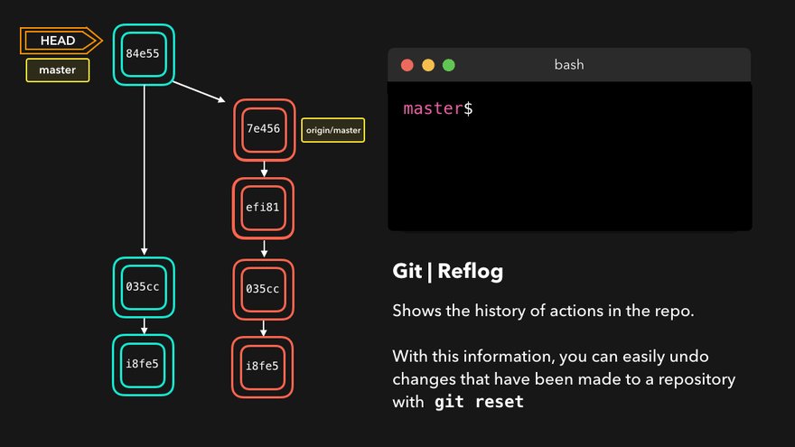
<figcaption><code>git reflog</code></figcaption>

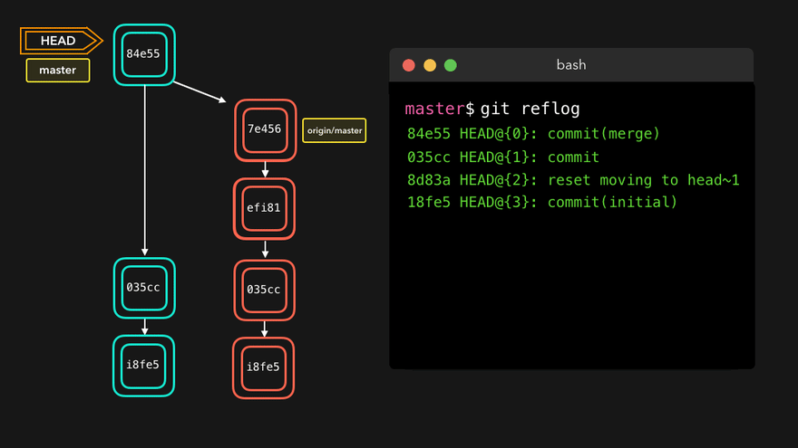
<figcaption><code>git reflog reset</code></figcaption>

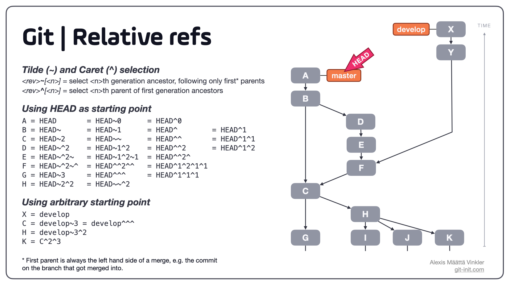
<figcaption>using tilde (~) and caret (^) combined</figcaption>

- commit exclusions
  - `^<rev>` (caret) notation : <br>
    To exclude commits reachable from a commit, a prefix `^` notation is used.<br>
    E.g. `^r1 r2` means commits reachable from r2 but exclude the ones reachable from r1 (i.e. r1 and its ancestors)

- dotted range notations
  - `..` (two-dot) range notation
    - `r1..r2` : commits that are reachable from r2 excluding those that are reachable from r1 by `^r1 r2`
  - `...` (three-dot) symmetric difference notation
    - `r1...r2` : called symmetric difference of r1 and r2<br>It is the set of commits that are reachable from either one of r1 (left side) or r2 (right side) but not from both


## commit
### get revision number

> [!TIP|label:the `<value>` can be:]
> - commit id
> - branch name
> - `HEAD`, `HEAD~n`, `HEAD^^`

```bash
$ git rev-parse <value>^{commit}

# i.e.:
$ git rev-parse HEAD
e06b245740ac0c73f9454b6d96758e3a4a804901
```

### get abbrev commit ids

> [!NOTE|label:references:]
> - [`--abbrev-commit`](https://git-scm.com/docs/git-rev-list#Documentation/git-rev-list.txt---abbrev-commit)
> - format:
>   - `%H` : commit hash
>   - `%h` : abbreviated commit hash

- `rev-list`
  ```bash
  $ git rev-list HEAD -n 3 --abbrev=11 --abbrev-commit
  446c656814d
  e747154df34
  22d0ee9b131

  # or via `git log`
  $ git log -n 3 --format='%h' --abbrev=11
  # or
  $ git log -3 --format='%h' --abbrev=11
  446c656814
  e747154df3
  22d0ee9b13
  ```

- `rev-parse`
  ```bash
  $ git rev-parse --short HEAD
  e06b24574

  $ git rev-parse --short=7 HEAD
  e06b245
  ```

### get previous commit id
```bash
$ git rev-list --no-walk <commit-id>^
```

### get next commit id

> [!NOTE]
> references:
> - [xueliu/version-up.sh](https://gist.github.com/xueliu/e8dfacf22a4be0f7be58a27f094cadbe)

```bash
$ git rev-list --no-walk <commit-id>..HEAD | tail -1
```

## branch
### [get current branch](https://stackoverflow.com/a/19585361/2940319)
- full branch name
  ```bash
  $ git symbolic-ref HEAD
  refs/heads/main

  # or: https://stackoverflow.com/a/62340432/2940319
  $ git rev-parse --symbolic-full-name HEAD
  refs/heads/main
  ```

- branch name
  ```bash
  $ git branch --show-current
  main

  # or
  $ git rev-parse --abbrev-ref HEAD
  main

  # or
  $ git symbolic-ref --short HEAD
  main

  # or
  $ git symbolic-ref --quiet --short HEAD || git rev-parse --short
  main

  # or
  $ git symbolic-ref HEAD | sed -e "s/^refs\/heads\///"
  main

  # or: https://stackoverflow.com/a/33485172/2940319
  $ git name-rev --name-only HEAD
  main
  ```

#### [for detached branch](https://stackoverflow.com/a/19457164/2940319)
```bash
$ git st
HEAD detached at d4beb6ac
...

$ git branch --no-color \
             --remote \
             --verbose \
             --no-abbrev \
             --contains |
      sed -rne 's:^[^/]*/([^\ ]+).*$:\1:p'
marslo/sandbox

# or
$ git branch --no-color \
             --remote \
             --verbose \
             --no-abbrev \
             --contains |
      sed -rne 's:^[ \s]*origin/([^\ ]+).*$:\1:p'

# or
$ git name-rev --name-only HEAD |
      sed -rne 's:^[ \s]*([^\]+/){2}([^~]+).*$:\2:p'

# or
$ git name-rev --name-only HEAD |
      sed -rne 's:^[ \s]*remotes/origin/([^~]+).*$:\1:p'
```

### create empty branch
  - create an empty branch
    ```bash
    $ mkdir <MY_FOLDER> && cd $_
    $ git init
    $ git remote add origin <REMOTE_URL>
    $ git fetch --all --progress --force
    $ git checkout -b <BRANCH_NAME>
    ```

  - push to remote
    ```bash
    $ git add --all .
    $ git commit -m 'initial an empty branch'
    $ git push --force -u origin HEAD:<BRANCH_NAME>
    ```

  - git alias [`.gitalias`](https://github.com/marslo/mylinux/blob/master/confs/home/.marslo/.gitalias#L120) :
    ```bash
    [alias]
    init-repo   = "!f() { \
                          declare help=\"\"\"\
                            USAGE: git init-repo <REMOTE_URL> [DEFAULT_BRANCH] [LOCAL_DIR] \n\
                            OPT: \n\
                                REMOTE_URL: mandatory \n\
                                DEFAULT_BRANCH: optional. default is 'master' \n\
                                LOCAL_DIR: optional. default is current directory: '\"$(pwd)\"' \n\
                          \"\"\"; \
                          declare remoteURL=\"$1\"; \
                          declare defaultBr='master'; \
                          declare localDir='.'; \
                          [ 2 -le $# ] && defaultBr=\"$2\"; \
                          [ 3 -eq $# ] && localDir=\"$3\"; \
                          if [ 0 -eq $# ] || [ 3 -lt $# ]; then \
                            echo \"${help}\"; \
                          else \
                            [ -d ${localDir} ] || mkdir -p ${localDir}; \
                            cd ${localDir} ; \
                            git init && \
                            git remote add origin ${remoteURL} && \
                            git fetch --all --force --quiet && \
                            git checkout -b ${defaultBr}; \
                          fi \
                        }; f \
                  "
    ```

### get branch name from reversion
- `branch -a --contains`
  ```bash
  $ git branch -a --contains a3879d3
  * master
    remotes/origin/master

  # or
  $ git branch -r --contains a3879d3
  origin/master

  ```

- `name-rev`
  ```bash
  $ git name-rev a3879d3
  a3879d3 master~12
  ```

### get upstream branch
- get current
  ```bash
  $ git rev-parse --abbrev-ref --symbolic-full-name @{u}
  origin/marslo

  # or
  $ git for-each-ref --format='%(upstream)' $(git symbolic-ref -q HEAD)
  refs/remotes/origin/marslo

  # or for `meta/config`
  $ git symbolic-ref -q HEAD
  refs/heads/meta/config
  $ git for-each-ref --format='%(upstream)' $(git symbolic-ref -q HEAD)
  refs/remotes/origin/meta/config
  $ git for-each-ref --format='%(upstream:short)' $(git symbolic-ref -q HEAD)
  origin/meta/config

  # or: https://stackoverflow.com/a/49418399/2940319
  $ git status -bsuno
  ## master...origin/master
  ```

- get specific
  ```bash
  $ git rev-parse --abbrev-ref gh-pages@{upstream}
  origin/gh-pages

  # or
  $ git for-each-ref --format='%(upstream:short)' $(git rev-parse --symbolic-full-name meta/config)
  origin/meta/config
  ```

### [get local/remote branches](https://stackoverflow.com/a/40122019/2940319)
- local
  ```bash
  $ git for-each-ref --format='%(refname:short)' refs/heads/
  ```
- remote
  ```bash
  $ git for-each-ref --format='%(refname:short)' refs/remotes/origin/
  ```

### [sort local branch via `committerdate`](https://stackoverflow.com/a/5188364/2940319)


> references:
> - [How can I get a list of Git branches, ordered by most recent commit?](https://stackoverflow.com/q/5188320/2940319)
> - [sort `git branch` by default](https://stackoverflow.com/a/33163401/2940319)
> ```bash
> $ git config --global branch.sort -committerdate
> ```


```bash
$ git for-each-ref --sort=-committerdate refs/heads/

# or using git branch (since version 2.7.0)
$ git branch --sort=-committerdate  # DESC
$ git branch --sort=committerdate   # ASC
```

- advanced usage
  ```bash
  $ git for-each-ref \
        --sort=-committerdate \
        refs/heads/ \
        --format='%(HEAD) %(color:yellow)%(refname:short)%(color:reset) - %(color:red)%(objectname:short)%(color:reset) - %(contents:subject) - %(authorname) (%(color:green)%(committerdate:relative)%(color:reset))'
  ```

- for remote
  ```bash
  $ git for-each-ref --sort=-committerdate refs/remotes
  ```

- [more on git tips](https://chromium.googlesource.com/chromium/src.git/+/HEAD/docs/git_tips.md)
  ```bash
  git-list-branches-by-date() {
    local current_branch=$(git rev-parse --symbolic-full-name --abbrev-ref HEAD)
    local normal_text=$(echo -ne '\E[0m')
    local yellow_text=$(echo -ne '\E[0;33m')
    local yellow_bg=$(echo -ne '\E[7;33m')
    git for-each-ref --sort=-committerdate \
        --format=$'  %(refname:short)  \
            \t%(committerdate:short)\t%(authorname)\t%(objectname:short)' \
            refs/heads \
        | column -t -s $'\t' -n \
        | sed -E "s:^  (${current_branch}) :* ${yellow_bg}\1${normal_text} :" \
        | sed -E "s:^  ([^ ]+):  ${yellow_text}\1${normal_text}:"
  }
  ```

#### gitalias
```bash
[alias]
  sb          = "! git branch --sort=-committerdate --format='%(HEAD) %(color:red)%(objectname:short)%(color:reset) - %(color:yellow)%(refname:short)%(color:reset) - %(subject) %(color:bold green)(%(committerdate:relative))%(color:reset) %(color:blue)<%(authorname)>%(color:reset)' --color=always"
  recent      = "! f() { \
                        declare help=\"USAGE: git recent [remotes|tags] [count]\"; \
                        declare refs; \
                        declare count; \
                        if [ 2 -lt $# ]; then \
                          echo \"${help}\"; \
                          exit 1; \
                        else \
                          if [ 'remotes' = \"$1\" ]; then \
                            refs='refs/remotes/origin'; \
                          elif [ 'tags' = \"$1\" ]; then \
                            refs='refs/tags'; \
                          elif [ 1 -eq $# ]; then \
                            count=$1; \
                          fi; \
                          if [ 2 -eq $# ]; then \
                            count=$2; \
                          fi; \
                        fi; \
                        git for-each-ref \
                            --sort=-committerdate \
                            ${refs:='refs/heads'} \
                            --format='%(HEAD) %(color:yellow)%(refname:short)%(color:reset) - %(color:red)%(objectname:short)%(color:reset) - %(contents:subject) - %(authorname) %(color:green)(%(committerdate:relative))%(color:reset)' \
                            --color=always \
                            --count=${count:=5}; \
                    }; f \
                "
```

### [change head](https://stackoverflow.com/a/60102988/2940319)

> [!NOTE|label:reference:]
> - [warning: ignoring broken ref refs/remotes/origin/HEAD](https://stackoverflow.com/a/45867333/2940319)

- check refs
  ```bash
  $ git status
  warning: ignoring broken ref refs/remotes/origin/HEAD

  $ git symbolic-ref refs/remotes/origin/HEAD
  refs/remotes/origin/new_master
  ```

- fix warning
  ```bash
  $ git symbolic-ref refs/remotes/origin/HEAD refs/remotes/origin/new_master

  # or
  $ git remote set-head origin --delete
  $ git remote set-head origin --auto

  # or
  $ git fetch --all --force
  $ git remote set-head origin refs/remotes/origin/new_master
  ```

### get first parent branch

> [!NOTE|label:references:]
> - [How to find the nearest parent of a Git branch](https://stackoverflow.com/q/3161204/2940319)
> - [joechrysler/who_is_my_mummy.sh](https://gist.github.com/joechrysler/6073741)
> - [* explainshell.com](https://explainshell.com)

## tag

### [show tags](https://stackoverflow.com/a/37497511/2940319)
```bash
$ git tag --points-at <revision>
```

```bash
# get tags for `HEAD`:
$ git tag --points-at HEAD

# or: https://stackoverflow.com/a/23394114/2940319
$ git name-rev --tags --name-only $(git rev-parse <revision>)

# example
$ git name-rev --tags --name-only $(git rev-parse HEAD)
```

### [sort git tags](https://andy-carter.com/blog/sort-git-tags-by-ascending-and-descending-semver)

> [!TIP]
> prepend "-" to reverse sort order.
> - ascending  : `--sort=<type>`
> - descending : `--sort=-<type>`
>
> references:
> - [How to sort git tags by version string order of form rc-X.Y.Z.W?](https://stackoverflow.com/a/22634649/2940319)
> - [How can I list all tags in my Git repository by the date they were created?](https://stackoverflow.com/a/test70112/2940319)
> - [GIT LIKE A PRO: SORT GIT TAGS BY DATE](https://www.everythingcli.org/git-like-a-pro-sort-git-tags-by-date/)

- via `v:refname` or `version:refname`
- by created data
  ```bash
  $ git for-each-ref --sort=creatordate --format='%(refname) %(creatordate)' refs/tags

  # or
  $ git tag --format='%(creatordate:short)%09%(refname:strip=2)' --sort=creatordate

  # or
  $ git for-each-ref --sort=taggerdate --format='%(tag) %(taggerdate) %(taggername) %(subject)' refs/tags

  # much better
  $ git for-each-ref --sort=taggerdate \
                     --format '%(tag)_,,,_%(taggerdate:raw)_,,,_%(taggername)_,,,_%(subject)' refs/tags |
        awk 'BEGIN { FS = "_,,,_"  } ; { t=strftime("%Y-%m-%d  %H:%M",$2); printf "%-20s %-18s %-25s %s\n", t, $1, $4, $3  }'
  ```

### [filter tags](https://www.reddit.com/r/git/comments/hj6s0j/find_tags_with_git_describe_on_other_branches/?utm_source=share&utm_medium=web2x&context=3)
```bash
$ git describe --dirty --tags --long --match *nightly*
nightly#82-2001310818-1765-gc18894b193
```

### lightweight VS. annotated

- show tags details
  ```bash
  #                                          + - commit: lightweight tag
  #                                          + - tag: annotated tag
  #                                          |
  #                                       +-----+
  $ git for-each-ref refs/tags
  902fa933e4a9d018574cbb7b5783a130338b47b8 commit refs/tags/v1.0-light
  1f486472ccac3250c19235d843d196a3a7fbd78b tag    refs/tags/v1.1-annot
  fd3cf147ac6b0bb9da13ae2fb2b73122b919a036 commit refs/tags/v1.2-light
  ```

- show tag type via `git cat-file -t`
  ```bash
  # lightweight
  $ git cat-file -t v1.0-light
  commit

  # annotated
  $ git cat-file -t v1.1-annot
  tag

  # or: https://stackoverflow.com/a/40480534/2940319
  $ git show-ref -d --tags       |
    cut -b 42-                   | # to remove the commit-id
    sort                         |
    sed 's/\^{}//'               | # remove ^{} markings
    uniq -c                      | # count identical lines
    sed 's/2\ refs\/tags\// a /' | # 2 identical = annotated
    sed 's/1\ refs\/tags\//lw /'
  ```

## status
### list ignored

> [!NOTE|label:references:]
> - [Git command to show which specific files are ignored by .gitignore](https://stackoverflow.com/q/466764/2940319)
> - [Is there a way to tell git-status to ignore the effects of .gitignore files?](https://stackoverflow.com/q/2994612/2940319)
>   - [git update-index](https://stackoverflow.com/a/1818975/2940319)
>   - [ignoring files](https://gitready.com/beginner/2009/01/19/ignoring-files.html)
> - [How can I stop .gitignore from appearing in the list of untracked files?](https://stackoverflow.com/a/39841950/2940319)

- `status`
  ```bash
  $ git status --ignored
  On branch master
  Your branch is up to date with 'origin/master'.

  Ignored files:
    (use "git add -f <file>..." to include in what will be committed)
    bin/

  nothing to commit, working tree clean

  # short status
  $ git status --ignored --short
  !! bin/

  $ git status --porcelain --ignored
  !! bin/

  $ git st --ignored --untracked-files=all
  ## master...origin/master
  !! bin/cfssl
  !! bin/cfssl-bundle
  !! bin/cfssl-certinfo
  !! bin/cfssl-newkey
  !! bin/cfssl-scan
  !! bin/cfssljson
  !! bin/mkbundle
  !! bin/multirootca
  ```

- `check-ignore`
  ```bash
  $ git check-ignore *
  bin

  $ git check-ignore -v *
  .gitignore:4:bin  bin

  $ git check-ignore -v $(find . -type f -print)
  .gitignore:4:bin  ./bin/cfssl-scan
  .gitignore:4:bin  ./bin/cfssl-certinfo
  .gitignore:4:bin  ./bin/cfssl-bundle
  .gitignore:4:bin  ./bin/cfssl
  .gitignore:4:bin  ./bin/cfssl-newkey
  .gitignore:4:bin  ./bin/multirootca
  .gitignore:4:bin  ./bin/mkbundle
  .gitignore:4:bin  ./bin/cfssljso

  $ find . -not -path './.git/*' | git check-ignore --stdin
  ./bin
  ./bin/cfssl-scan
  ./bin/cfssl-certinfo
  ./bin/cfssl-bundle
  ./bin/cfssl
  ./bin/cfssl-newkey
  ./bin/multirootca
  ./bin/mkbundle
  ./bin/cfssljson

  $ find . -path ./.git -prune -o -print | git check-ignore --no-index --stdin --verbose
  .gitignore:4:bin  ./bin
  .gitignore:4:bin  ./bin/cfssl-scan
  .gitignore:4:bin  ./bin/cfssl-certinfo
  .gitignore:4:bin  ./bin/cfssl-bundle
  .gitignore:4:bin  ./bin/cfssl
  .gitignore:4:bin  ./bin/cfssl-newkey
  .gitignore:4:bin  ./bin/multirootca
  .gitignore:4:bin  ./bin/mkbundle
  .gitignore:4:bin  ./bin/cfssljson
  ```

- `ls-files`
  ```bash
  $ git ls-files --others --ignored --exclude-standard

  # or
  $ git ls-files -o -i --exclude-standard
  bin/cfssl
  bin/cfssl-bundle
  bin/cfssl-certinfo
  bin/cfssl-newkey
  bin/cfssl-scan
  bin/cfssljson
  bin/mkbundle
  bin/multirootca

  # or list only directories
  $ git ls-files --others --ignored --exclude-standard --directory
  bin/

  # or from `.gitignore` file
  $ git ls-files --ignored --others --exclude-from=.gitignore
  bin/cfssl
  bin/cfssl-bundle
  bin/cfssl-certinfo
  bin/cfssl-newkey
  bin/cfssl-scan
  bin/cfssljson
  bin/mkbundle
  bin/multirootca
  ```

- `clean`

  > [!NOTE|label:references:]
  > - `-X`: remove only files ignored by git
  > - `-x`: remove all untracked files, including ignored ones (use with caution)
  > - `-n`: dry-run, show what would be removed without actually removing them
  > - `-d`: remove untracked directories in addition to untracked files
  > - `-f`: force, required to actually remove the files (without this option, `git clean` will not delete anything)
  > - `-ff`: force with more force, allows removing files even if they are ignored by git (use with caution)

  ```bash
  $ git clean -ndX
  Would remove bin/
  ```

## filter in history

> [!NOTE|label:--diff-filter:]
> - [`--diff-filter`](https://git-scm.com/docs/git-diff#Documentation/git-diff.txt-code--diff-filterACDMRTUXBcode)
>   - `UPPERCASE` : **include** the changes in the diff output
>   - `lowercase` : **exclude** the changes in the diff output
>
>>   | CHAR | MEANING        | DESCRIPTION                                                                                              |
>>   |:----:|----------------|----------------------------------------------------------------------------------------------------------|
>>   |  `A` | Added          | a newly added file (staged into the Git index)                                                           |
>>   |  `C` | Copied         | a file that was recognized as copied from another file                                                   |
>>   |  `D` | Deleted        | a file that was deleted                                                                                  |
>>   |  `M` | Modified       | a file that was modified                                                                                 |
>>   |  `R` | Renamed        | a file that was renamed (Git detected a renaming operation)                                              |
>>   |  `T` | Type changed   | a file whose type changed (e.g., from regular file to symlink)                                           |
>>   |  `U` | Unmerged       | a file with unresolved merge conflicts (typically during a merge)                                        |
>>   |  `X` | Unknown        | other unknown types of changes (rare cases)                                                              |
>>   |  `B` | Broken pairing | a previously recognized rename/copy relationship that is now broken<br>(e.g., rename no longer detected) |


> [!NOTE|label:Git Change Detection Strategy:]
>
>> |              OPTION             | MEANING                        | DESCRIPTION                                                                             |
>> |:------------------------------- |--------------------------------|-----------------------------------------------------------------------------------------|
>> | `-M[N]`, `--find-renames[=<N>]` | detect Renames                 | Detects renamed files (rename detection)<br>e.g., from a.txt → b.txt.                   |
>> | `-C[N]`, `--find-copies[=<N>]`  | detect Copies                  | Detects file copies (copy detection)<br>e.g., a.txt → b.txt with similar content.       |
>> | `--find-copies-harder`          | more aggressive copy detection | Attempts copy detection even for newly added files, not just tracked ones.              |
>> | `-D`, `--irreversible-delete`   | irreversible delete            | Treats deleted files as untracked<br>i.e., no longer in the index.                      |
>> | `--no-renames`                  | disable rename detection       | Explicitly disables rename detection (equivalent to default behavior when not enabled). |

### all renamed files

> [!NOTE|label:references:]
>> `-M[<n>]`, `--find-renames[=<n>]`
>>     If generating diffs, detect and report renames for each commit. For following files across
>>     renames while traversing history, see `--follow`. If <n> is specified, it is a threshold on the
>>     similarity index (i.e. amount of addition/deletions compared to the file’s size). For
>>     example, `-M90%` means Git should consider a delete/add pair to be a rename if more than 90% of
>>     the file hasn’t changed. Without a `%` sign, the number is to be read as a fraction, with a
>>     decimal point before it. I.e., `-M5` becomes 0.5, and is thus the same as `-M50%`. Similarly,
>>     `-M05` is the same as `-M5%`. To limit detection to exact renames, use `-M100%`. The default
>>     similarity index is 50%.

```bash
$ git log -M --summary | grep -iE '^ rename'

# or
$ git log -M --summary | grep -E '^\s*rename.*{.*=>.*}'
```

### all deleted files

```bash
$ git log --diff-filter=D --summary --pretty=format:'--COMMIT-- %h • %s'
--COMMIT-- d90e478baf • add deploy script to deploy _book to gh-pages branch
 delete mode 100644 _book/artifactory/artifactory.html
 delete mode 100644 _book/cheatsheet/good.html
 delete mode 100644 _book/cheatsheet/havefun.html
 delete mode 100644 _book/cheatsheet/markdown.html
 delete mode 100644 _book/cheatsheet/media.html
 ...

# or
$ git log --diff-filter=D --summary | find "delete" | grep <filename>
```

### files changed by specific users

> [!TIP]
> - see also [get diff from particular author](#get-diff-from-particular-author)

```bash
$ git log --author='user1\|user2' \
          --pretty=format:'--COMMIT-- %h %an <%ae>' \
          --name-status

# -- or another format --
$ git log --author='user1\|user2' --pretty=format:'%H' |
      while read -r commit; do
        echo "=== ${commit} ==="
        git show --pretty=medium --name-status "${commit}" | grep --color=never -E '^(A|M)[[:space:]]' | while read -r status file; do
          echo -e "--- [\033[33m${status}\033[0m] \033[34m${file}\033[0m"
        done
        echo
      done

# -- or with diff : file by file --
$ git log --author='user1\|user2' --pretty=format:'%H' |
      while read -r commit; do
        echo "=== ${commit} ==="
        git show --pretty=medium --name-status "${commit}" | grep --color=never -E '^(A|M)[[:space:]]' | while read -r status file; do
          echo -e "--- [\033[33m${status}\033[0m] \033[34m${file}\033[0m"
          git diff "${commit}^:${file}..${commit}:${file}" --unified=0 2>/dev/null || echo "[Deleted or Binary]"
        done
        echo
      done


# -- or with diff : commit by commit --
$ git log --author='user1\|user2' --pretty=format:'%H' |
      while read -r commit; do
        echo "=== ${commit} ==="
        git show --pretty=medium --name-status "${commit}" | grep --color=never -E '^(A|M)[[:space:]]' | while read -r status file; do
          echo -e "--- [\033[33m${status}\033[0m] \033[34m${file}\033[0m"
        done
        git diff "${commit}^..${commit}" --unified=0 2>/dev/null || echo "[Deleted or Binary]"
        echo
      done
```

### files changes by pattern
```bash
$ git log --name-status --all --full-history -- *.txt*

# -- nice output --
$ git log --name-status --all --full-history \
      --pretty=format:$'\033[3;38;5;241m--COMMIT--\033[0m \033[0;35m%h\033[0m • \033[0;36m%s\033[0m \033[3;34m<%aN>\033[0m \033[3;38;5;241m(%ad)\033[0m' \
      --date=format:'%Y-%m-%d %H:%M' \
      -- '*.current*' |
  fileStatus
```

<!--sec data-title="function fileStatus" data-id="section0" data-show=true data-collapse=true ces-->
```bash
function fileStatus() {
  awk '
    BEGIN {
      COLOR_RESET = "\033[0m"
      COLOR_ADD   = "\033[1;32m"
      COLOR_MOD   = "\033[1;33m"
      COLOR_DEL   = "\033[1;31m"
      COLOR_REN   = "\033[1;35m"
    }

    function trimAnsi(str) {
      gsub(/\033\[[0-9;]*m/, "", str)
      return str
    }
    { plain = trimAnsi($0) }

    plain ~ /^--COMMIT--/ { print $0; next; }
    plain ~ /^[A-Z]/ {
      split(plain, fields, /\t+/)
      status = fields[1]
      file = substr($0, index(plain, fields[2]))

      if (status == "A") color = COLOR_ADD
      else if (status == "M") color = COLOR_MOD
      else if (status == "D") color = COLOR_DEL
      else if (status ~ /^R/) color = COLOR_REN
      else color = COLOR_RESET

      printf "  %s%-4s%s %s\n", color, status, COLOR_RESET, file
      next
    }

    # fallback
    { print }
  '
}
```
<!--endsec-->

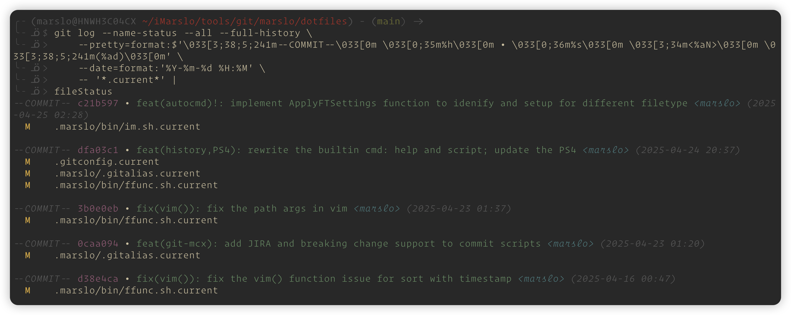

## log
### short stat
```bash
$ git log --show-signature

# or
$ git log --shortstat
```

### show files and status without comments
```bash
$ git log --color --stat --abbrev-commit --date=relative --graph --submodule --format="%H"

# or
$ git log --color --stat --abbrev-commit --date=relative --graph --submodule --format="%h %ad- %s [%an]"

# or
$ git log --color --stat --abbrev-commit --date=relative --graph --submodule --format='%C(red)%h%Creset %C(yellow)(%ad)%Creset %s %C(blue)<%an>%Creset'

# e.g.:
$ git log -3 --color --stat --abbrev-commit --date=relative --graph --submodule --format="%H"
* 50ede51fcc3cf0311fd85b3e9c4a36d4beb89e69
|
|  devops/git/gerrit.md | 6 ++++--
|  devops/git/git.md    | 5 +++++
|  2 files changed, 9 insertions(+), 2 deletions(-)
* 41d58dabcd0aaee33edd1de7793ffd82c7cffa89
|
|  SUMMARY.md | 2 +-
|  1 file changed, 1 insertion(+), 1 deletion(-)
* 4460a32d8fddbe7c5c434947aea153273ce215d4
|
|  devops/git/{gitStudy.md => git.md} | 117 ++++++++++++++++++++++++++++++++++++++++++++++++++++++++++++++++++++++++++-
|  1 file changed, 116 insertions(+), 1 deletion(-)
```

### show submodule changes
```bash
$ git submodule status
$ git log -- <submodule name>
```

### get change from `.git/objects`
```bash
$ find .git/objects -type f -printf "%P\n" | sed s,/,,
```

### get change history for deleted files

- [`full-history`](https://stackoverflow.com/a/7203551/2940319) | [or](https://stackoverflow.com/a/60993503/2940319)
  ```bash
  $ git log --all --full-history -- <path/to/file>

  # or
  $ git log --all --full-history --oneline -- <path/to/file>
  ```

- [`--follow`](https://stackoverflow.com/a/36561814/2940319)
  ```bash
  $ git log --follow <path/to/file>

  # or
  $ git log --oneline --follow -- <path/to/file>
  ```

### [search by contents](https://www.atlassian.com/git/tutorials/git-log#filtering-the-commit-history)
```bash
$ git log -S'add' --oneline  -3
6f7877c2 update git for fetch more refs after cloned via --single-branch, and add tricky for vim
30ce195e add jenkins plugin jira-steps
913a7f29 update jenkins recommended plugins

# -- or --
# -p, --paginate
#     Pipe all output into less (or if set, $PAGER) if standard output is a terminal. This overrides the
#     pager.<cmd> configuration options (see the "Configuration Mechanism" section below)
$ git pls -S'add' -p
```

### [search by message](https://www.atlassian.com/git/tutorials/git-log#filtering-the-commit-history)
```bash
$ git log --grep='jira' --oneline
30ce195e add jenkins plugin jira-steps
d17dd3aa add jira api

# or
$ git pls --grep='jira'
```

## show
```bash
#       --no-patch
#           v
$ git show -s <commit-id>

$ git show --shortstat <commit-id>

# show with specific file in particular commit
$ git show <commit-id>:<path/to/file>
```

### show file change details
```bash
# for committed changes
$ git show --pretty= --stat
 docs/SUMMARY.md              |   1 +
 docs/cheatsheet/tricky.md    |  68 ++++++++++++++++++
 docs/devops/pre-commit.md    | 171 ++++++++++++++++++++++++++++++++++++++++++++
 docs/osx/init.md             |  66 ++++++++++-------
 docs/tools/app/iterm2.md     |   2 +-
 docs/tools/app/vscode.md     |   2 +-
 7 files changed, 550 insertions(+), 28 deletions(-)

# for uncommitted changes
# -- stat --
$ git --no-pager diff --stat --relative
 devops/awesomeShell.md |  22 +++++++----
 devops/git/git.md      | 152 +++++++++++++++++++++++++++++++++++++++++++++++++++++++++++++++------------
 vim/tricky.md          |  29 +++++++++++++++
 3 files changed, 172 insertions(+), 31 deletions(-)

# -- numstat --
$ git --no-pager diff --relative --numstat
15    7   devops/awesomeShell.md
135   24  devops/git/git.md
29    0   vim/tricky.md
```

### show file status only
```bash
$ git show --pretty= --stat
 docs/SUMMARY.md              |   1 +
 docs/cheatsheet/tricky.md    |  68 ++++++++++++++++++
 docs/devops/pre-commit.md    | 171 ++++++++++++++++++++++++++++++++++++++++++++
 docs/osx/brew.backup.all.txt | 268 +++++++++++++++++++++++++++++++++++++++++++++++++++++++++++++++++++++
 docs/osx/init.md             |  66 ++++++++++-------
 docs/tools/app/iterm2.md     |   2 +-
 docs/tools/app/vscode.md     |   2 +-
 7 files changed, 550 insertions(+), 28 deletions(-)
```

## rebase

> [!TIP]
> - about [`GIT_SEQUENCE_EDITOR`](https://stackoverflow.com/a/54970726/2940319)
> - [git rebase in depth](https://git-rebase.io/)


### automatic edit by `git rebase -i`

> inspired from [.gitconfig](https://github.com/brauliobo/gitconfig/blob/master/configs/.gitconfig#L220) & [Is there a way to squash a number of commits non-interactively?](https://stackoverflow.com/a/28789332/2940319)

```bash
$ COUNT=$1
$ GIT_EDITOR="sed -i -e '2,$COUNT s/^pick /s /;/# This is the 2nd commit message:/d'" git rebase -i HEAD~$COUNT
```

- [git alias](https://github.com/marslo/mylinux/blob/master/confs/home/git/.gitconfig.alias#L32)
  ```
  [alias]
    sq = ! "f() { TARGET=$1 && GIT_EDITOR=\"sed -i -e '2,$TARGET s/^pick /s /;/# This is the 2nd commit message:/,$ {d}'\" git rebase -i HEAD~$TARGET; }; f"
  ```

  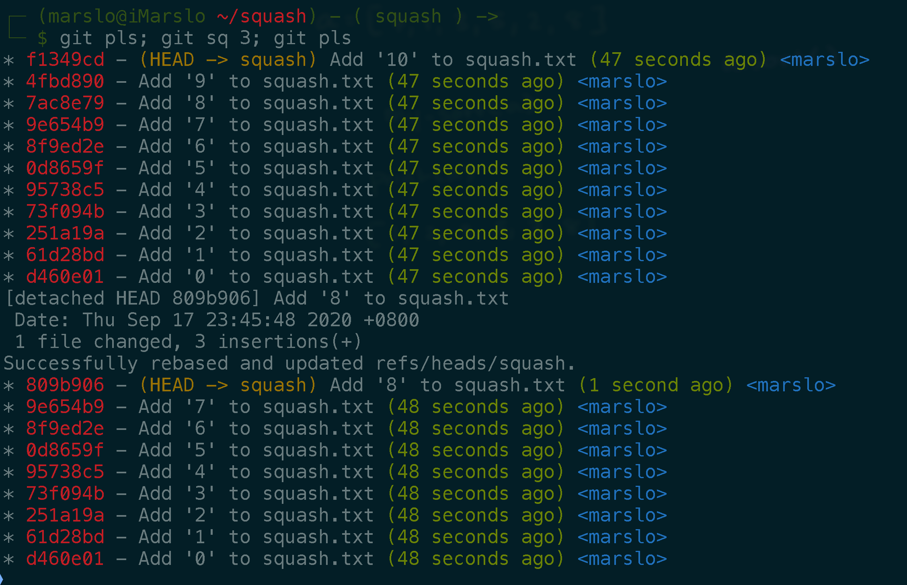

- [or](https://stackoverflow.com/a/25941070/2940319)
  ```bash
  $ GIT_SEQUENCE_EDITOR="sed -i 's/^pick ce5efdb /edit ce5efdb /;/^pick ce6efdb /d'" git rebase -i ${SHA}
  ```

- or edit
  ```bash
  $ GIT_SEQUENCE_EDITOR="sed -i -re 's/^pick 134567/e 1234567/'" git rebase -i 1234567^
  ```

- or [`sequence.editor`](https://stackoverflow.com/a/38234236/2940319)
  ```bash
  $ git -c sequence.editor='sed -i s/pick/reword/' rebase -i ${SHA}
  ```

### [auto rebaes](https://stackoverflow.com/a/19267103/2940319)
- `.gitconfig`
  ```
  [alias]
    arebase = ! ~/.marslo/bin/arebase.sh
  ```

- `~/.marslo/bin/arebase.sh`
  ```bash
  #!/bin/bash

  ACTION=$1
  COMMIT=$(git rev-parse --short $2)
  [[ "$COMMIT" ]] || exit 1
  CORRECT=
  for A in p pick r reword e edit s squash f fixup d drop t split; do
     [[ $ACTION == $A ]] && CORRECT=1
  done
  [[ "$CORRECT" ]] || exit 1
  git merge-base --is-ancestor $COMMIT HEAD || exit 1
  if [[ $ACTION == "drop" || $ACTION == "d" ]]; then
    GIT_SEQUENCE_EDITOR="sed -i -e '/^pick $COMMIT/d'" git rebase -i $COMMIT^^
  elif [[ $ACTION == "split" || $ACTION == "t" ]]; then
    GIT_SEQUENCE_EDITOR="sed -i -e 's/^pick $COMMIT/edit $COMMIT/'" git rebase -i $COMMIT^^ || exit 1
    git reset --soft HEAD^
    echo "Hints:"
    echo "  Select files to be committed using 'git reset', 'git add' or 'git add -p'"
    echo "  Commit using 'git commit -c $COMMIT'"
    echo "  Finish with 'git rebase --continue'"
  else
    GIT_SEQUENCE_EDITOR="sed -i -e 's/^pick $COMMIT/$1 $COMMIT/'" git rebase -i $COMMIT^^
  fi
  ```

### [fix typo in commits](https://stackoverflow.com/a/12395024/2940319)
```bash
$ EDITOR="sed -i -e 's/borken/broken/g'" GIT_SEQUENCE_EDITOR="sed -i -e 's/pick/reword/g'" git rebase -i --root

# or
$ VISUAL="sed -i -e '/^[[:blank:]]*Change-Id/ d'" GIT_SEQUENCE_EDITOR="sed -i -e 's/pick/reword/g'" git rebase -i --root

# or

$ GIT_EDITOR="sed -i -e 's/kyewrod/keyword/g'" GIT_SEQUENCE_EDITOR="sed -i -e 's/pick/reword/g'" git rebase -i --root
```

## undo
### [delete after push](https://ncona.com/2011/07/how-to-delete-a-commit-in-git-local-and-remote/)
#### delete only the latest commit

```bash
$ git push origin +<hash_for_delete>^:<branch>
# or
$ git push origin <hash_for_delete>^:<branch> --force

# e.g.:
$ git pl --pretty=format:"%h" --no-patch
* cb46bdc
* 936543c
* a83ac6b

# delete cb46bdc
$ git push origin +cb46bdc^:master
```

#### delete multiple commits
- revert local
  ```bash
  $ git reset --hard HEAD~

  # or
  $ git reset --hard HEAD^^^

  # or
  $ git reset --hard <commit_hash>

  # or
  $ git rebase -i HEAD~<n>
  ```

- push to remote
  ```bash
  $ git push [--force] origin +<branch>
  # e.g.:
  $ git push [--force] origin +master
  ```

#### revert deleted branches

> [!TIP]
> references:
> - [Can I recover a branch after its deletion in Git?](https://stackoverflow.com/a/72428070/2940319)
> - [How to Restore a Deleted Branch or Commit with Git Reflog](https://rewind.com/blog/how-to-restore-deleted-branch-commit-git-reflog/)
> - [How to restore a deleted branch](https://confluence.atlassian.com/bbkb/how-to-restore-a-deleted-branch-765757540.html)

```bash
# find the HEAD of deleted branch
$ git log --graph --decorate $(git rev-list -g --all)

$ git checkout <sha>
$ git checkout -b /branch/name
```

- or find out recent actions
  ```bash
  $ git reflog --no-abbrev
  ```

- or find all losts
  ```bash
  $ git fsck --full \
             --no-reflogs \
             --unreachable \
             --lost-found |
        grep commit |
        cut -d\  -f3 |
        xargs -n 1 git log -n 1 --pretty=oneline
  ```

- show diff
  ```bash
  $ git log -p <sha>
  ```

#### revert single file to remotes
```bash
$ git checkout origin/<branch> -- <path/to/file>
```

#### revert changes in submodule
```bash
$ git submodule update -f --init

# or: https://stackoverflow.com/questions/10906554/how-do-i-revert-my-changes-to-a-git-submodule
$ git submodule foreach --recursive git reset --hard

# or
$ git submodule update -f --recursive

# or
$ git submodule foreach --recursive git reset --hard
$ git submodule update --recursive --init
```

#### [Git Reset vs Revert vs Checkout reference](https://www.atlassian.com/git/tutorials/resetting-checking-out-and-reverting)

|     Command    | Scope        | Common use cases                                                      |
|:--------------:|--------------|-----------------------------------------------------------------------|
|   `git reset`  | Commit-level | Discard commits in a private branch or throw away uncommitted changes |
|   `git reset`  | File-level   | Unstage a file                                                        |
| `git checkout` | Commit-level | Switch between branches or inspect old snapshots                      |
| `git checkout` | File-level   | Discard changes in the working directory                              |
|  `git revert`  | Commit-level | Undo commits in a public branch                                       |
|  `git revert`  | File-level   | (N/A)                                                                 |

- `git reset` via `git reflog`

  

- `git reset --hard`

  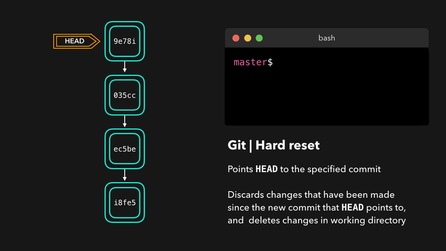

- `git reset --soft`

  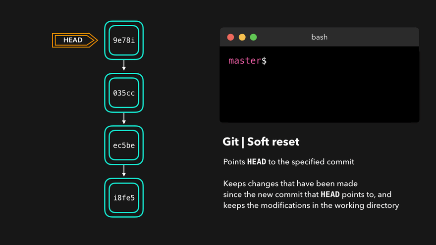

- `git revert`

  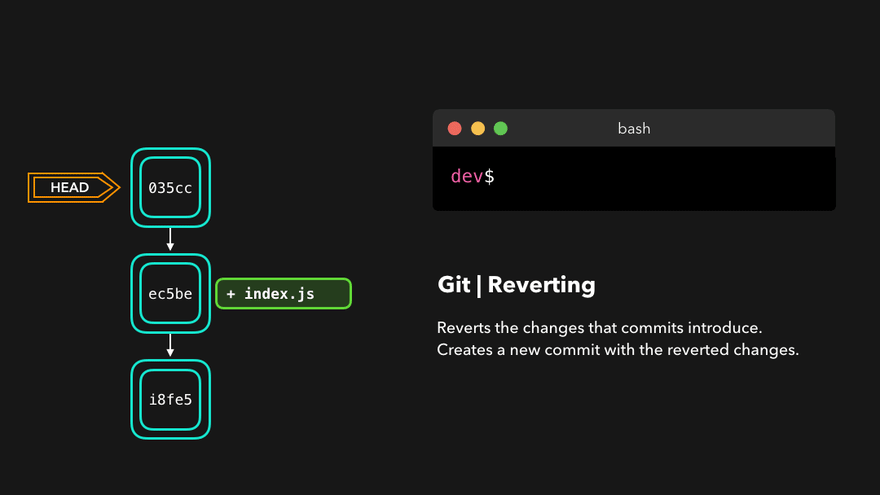

### change latest comments in local
```bash
$ git commit --amend
```

- change comments in remote
  ```bash
  $ git pl
  * a79d384 - (HEAD -> master, origin/master, origin/HEAD) update (11 seconds ago) <marslo>
  * 7cef7c7 - update (7 hours ago) <marslo>
  * e1d7a64 - update (7 hours ago) <marslo>

  # change comments on a79d384
  $ git commit --amend
  $ git push --force-with-lease origin master

  # result
  $ git fetch --all --force
  $ git pl remotes/origin/master
  Fetching origin
  * ba49259 - (HEAD -> master, origin/master, origin/HEAD) update a79d384 for change comments (24 seconds ago) <marslo>
  * 7cef7c7 - update (7 hours ago) <marslo>
  * e1d7a64 - update (7 hours ago) <marslo>
  ```

### change remote comments
```bash
$ git rebase -i HEAD~<n>
```

And then change `pick` to `reword`

- example
  ```bash
  $ git pls
  * 1e7d979 - (HEAD -> master, origin/master, origin/HEAD) f (24 seconds ago) <marslo>
  * 9b89ed7 - c (40 seconds ago) <marslo>
  * beb575f - d (51 seconds ago) <marslo>
  * 25d010d - e (57 seconds ago) <marslo>
  * c502e34 - b (64 seconds ago) <marslo>
  * 8890288 - init commit (4 minutes ago) <Marslo Jiao>

  $ git rebase -i HEAD~5
  reword c502e34 b
  pick 25d010d e
  pick beb575f d
  reword 9b89ed7 c
  pick 1e7d979 f

  $ git push --force origin master
  # or
  $ git push origin +master
  ```

### change root comments
```bash
$ git rebase -i --root
$ git push origin +<branch>
```
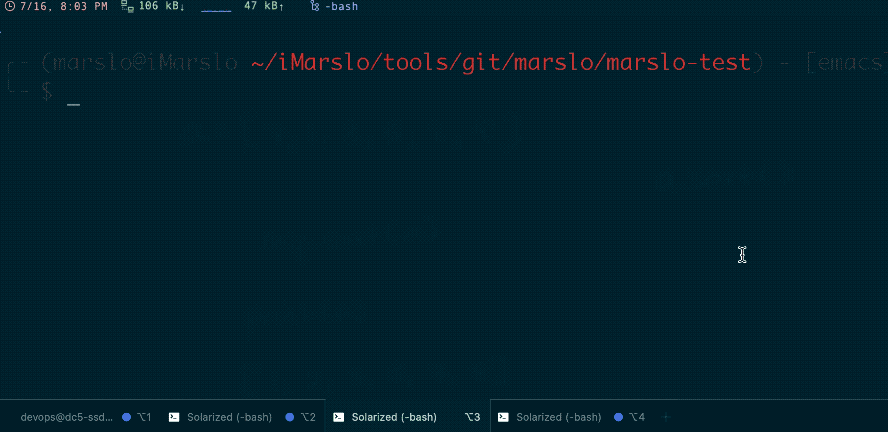

### change author and committer
- [rebase and amend](https://stackoverflow.com/a/3042512/2940319)
  - go to interactive mode
    ```bash
    $ git config --local user.name "name"
    $ git config --local user.email "name@email.com"
    $ git rebase -i <sha>
    ```
  - modify `pick` to `edit`
  - amend one by one
    ```
    $ git commit --amend --no-edit --only --author="name<name@email.com>"
    # or
    $ git commit --amend --no-edit --date="$(git log -n 1 --format=%aD)" --reset-author

    $ git rebase --continue
    ```

- [git replace](https://stackoverflow.com/a/28845565/2940319)

- [rebase --onto](https://stackoverflow.com/a/72430533/2940319)

  > [!TIP]
  > see also
  > - [rebase onto <sha>](https://stackoverflow.com/a/51114838/2940319)
  > ```bash
  > [alias]
  >     reauthor = !bash -c 'git rebase --onto $1 --exec \"git commit --amend --author=$2\" $1' --
  > ```

  ```bash
  $ git config --local user.name "name"
  $ git config --local user.email "<name@email.com>"
  $ git rebase --no-edit \
               --onto HEAD~9 \
               --exec 'GIT_COMMITTER_DATE="$(git log -n 1 --format=%aD)" \
                       git commit --amend \
                                  --date="$(git log -n 1 --format=%aD)"' \
                                  --author="name<name@email.com>" \           # or --reset-author
                       HEAD~9'
  ```

- `-x '-CHEAD'`

  > [!TIP]
  > - [How to amend several commits in Git to change author](https://stackoverflow.com/a/25815116/2940319)
  >   - `-CHEAD`: change the author but maintain the original timestamps

  ```bash
  $ git rebase -i BASE_SHA^ -x \
        "git commit --amend --author 'John Doe <johndoe@example.com>' -CHEAD"
  ```

- [amend all commits with original commitDate and authorDate](https://stackoverflow.com/a/73314321/2940319)

  > [!TIP|label:references:]
  > - [How to update git commit author, but keep original date when amending?](https://stackoverflow.com/a/73314321/2940319)
  > - [the Reddit thread](https://old.reddit.com/r/git/comments/jp59k5/deleted_by_user/)
  > - [Rebase without changing commit timestamps](https://web.archive.org/web/20220930151232/https://reddit.com/r/git/comments/jp59k5/rebase_without_changing_commit_timestamps/)

  ```bash
  $ git -c rebase.instructionFormat='%s%nexec GIT_COMMITTER_DATE="%cD" GIT_AUTHOR_DATE="%aD" git commit --amend --no-edit --author 'marslo <marslo.jiao@gmail.com>' rebase
  ```

#### check commits with author
```bash
# get commits by name
$ git log --oneline --author="name"

# get commits by email
$ git log --oneline --author="<name@email.com>"
```

## diff
### `diff-highlight`

> [!NOTE]
> references:
> - [How to improve git's diff highlighting?](https://stackoverflow.com/a/55891251/2940319)
> - [git and diff-highlight](https://michaelheap.com/git-and-diff-highlight/)

```bash
# centos8
$ rpm -ql git | grep diff-highlight
/usr/share/git-core/contrib/diff-highlight
# or ubuntu
$ dpkg -L git | grep diff-highlight

$ sudo ln -sf /usr/share/git-core/contrib/diff-highlight /usr/local/bin/diff-highlight
```

### get diff from particular author

> [!TIP]
> - see also [list files changed by specific users](#list-files-changed-by-specific-users)

```bash
#                                                        exclude the deleted files
#                                                                    v
$ git log --author='user1\|user2' --pretty=format:'%H' --diff-filter=d |
      while read -r commit; do
        echo -e "\n\033[1;33m=> ${commit}: $(git log -1 --pretty=%s ${commit})\033[0m"
        git diff --color "${commit}^" "${commit}"
      done
```

### [get difference between two branches](https://til.hashrocket.com/posts/18139f4f20-list-different-commits-between-two-branches)
```bash
$ git log --left-right --graph --cherry-pick --oneline origin/<release>..origin/<dev>

# or: https://stackoverflow.com/a/20419458/2940319
$ git rev-list --reverse \
               --pretty="TO_TEST %h (<%ae>) %s" \
               --cherry-pick \
               --right-only origin/<release>...origin/<dev> \
               | grep "^TO_TEST "
```

### diff ignore whitespace

> [!NOTE|label:references:]
> - [Ignore *all* whitespace changes with git-diff between commits](https://stackoverflow.com/a/33159593/2940319)
> - [Error in console fatal: cannot enforce both tab-in-indent and indent-with-non-tab](https://stackoverflow.com/a/57160479/2940319)
> - [indentation configuration only for some files](https://stackoverflow.com/a/13823013/2940319)
> - [How to show space and tabs with git-diff](https://stackoverflow.com/a/30803980/2940319)

- ignore tab

  > [!TIP|label:tab-in-indent]
  > - [Git v1.7.2 Release Notes](https://mirrors.edge.kernel.org/pub/software/scm/git/docs/RelNotes/1.7.2.txt)

  ```bash
  $ git config core.whitespace '-tab-in-indent'
  $ git diff HEAD^..
  ```

  - ignore tab-in-indent for `*.config` and `*.ltsv` only
    ```bash
    $ cat ~/.gitattributes
           File: /Users/marslo/.gitattributes
       1   *.config    text diff=config whitespace=-tab-in-indent
       2   *.ltsv      text diff=ltsv whitespace=-tab-in-indent
    ```

- ignore all
  ```bash
  $ git config core.whitespace '-trailing-space,-indent-with-non-tab,-tab-in-indent'
  ```

## tag

> reference :
> - [git like a pro: sort git tags by date](https://www.everythingcli.org/git-like-a-pro-sort-git-tags-by-date/)
> - [How do you achieve a numeric versioning scheme with Git?](https://softwareengineering.stackexchange.com/a/141986/56124)

### describe

> reference:
> - [Why does git-describe prefix the commit ID with the letter 'g'?](https://stackoverflow.com/questions/23939214/why-does-git-describe-prefix-the-commit-id-with-the-letter-g)


man of `git-describe`: <p>
The hash suffix is "-g" + an unambiguous abbreviation for the tip commit of parent. <p>
The length of the abbreviation scales as the repository grows, using the approximate number of objects in the repository and a bit of math around the birthday paradox, and defaults to a minimum of 7.


```bash
$ git describe --tags --long <revision>
# v2.5-0-gdeadbee
# ^    ^ ^^
# |    | ||
# |    | |'-- SHA of HEAD (first seven chars)
# |    | '--- "g" is for git
# |    '----- distance : number of commits since last tag
# |
# '---------- last tag name

$ git describe --long --tags
# v1.0.0-epsilon-2-g46b7ebb
#   |            |     + -g<has>
#   |            + distance (commits on top)
#   + tag name

# or
$ git describe --dirty --tags --long
# v1.0.0-epsilon-2-g46b7ebb
# |            | |  |
#  \___    ___/  |  + commit hash of the current commit
#       most     + commits on top
#      recent
#       tag

# or `--all`
$ git describe --all --long
```

#### [get distance between tags](https://stackoverflow.com/a/9752885/2940319)
```bash
$ git describe HEAD --tags

# or
$ git describe HEAD --all --long
```

### get revision in particular branch
```
$ git tag -l --sort='creatordate' --merged <branch>
```

#### get latest tag
> references:
> - [Get the most recent tag in git](https://jacobmckinney.com/posts/get-the-most-recent-tag-in-git/)
> - [GIT LIKE A PRO: SORT GIT TAGS BY DATE](https://www.everythingcli.org/git-like-a-pro-sort-git-tags-by-date/)

```bash
$ git tag -l --sort='creatordate' --merged <branch> | tail -1

# or the command can be executed in .git folder (! -is-inside-work-tree)
$ git describe --tags --abbrev=0 --always

# ro
$ git for-each-ref --sort=taggerdate \
                   --format '%(tag)' \
                   refs/tags |
      tail -1

# to get verbose output
$ git for-each-ref --sort=taggerdate \
                   --format '%(tag) %(taggerdate:raw) %(taggername) %(subject)' \
                   refs/tags

# or
$ git for-each-ref --sort=taggerdate \
                   --format '%(tag)_,,,_%(taggerdate:raw)_,,,_%(taggername)_,,,_%(subject)' \
                   refs/tags |
      awk 'BEGIN { FS = "_,,,_"  } ; { printf "%-20s %-18s %-25s %s\n", $2, $1, $4, $3  }'

# or
$ git log --tags \
          --simplify-by-decoration \
          --pretty="format:%ai %d" |
      sort

# or or formatted date
$ git for-each-ref --sort=taggerdate \
                   --format '%(tag)_,,,_%(taggerdate:raw)_,,,_%(taggername)_,,,_%(subject)' \
                   refs/tags |
      awk 'BEGIN { FS = "_,,,_"  } ; { t=strftime("%Y-%m-%d  %H:%M",$2); printf "%-20s %-18s %-25s %s\n", t, $1, $4, $3  }'

# or using git alias
tags = !"git for-each-ref \
             --sort=taggerdate \
             --format '%(tag)_,,,_%(taggerdate:raw)_,,,_%(taggername)_,,,_%(subject)' refs/tags \
             | awk 'BEGIN { FS = \"_,,,_\"  } ; { t=strftime(\"%Y-%m-%d  %H:%M\",$2); printf \"%-20s %-18s %-25s %s\\n\", t, $1, $4, $3  }'"
```

#### get revision from latest tag in particular branch
```bash
$ git rev-list -1 --no-patch $(git tag -l --sort='creatordate' --merged <branch> | tail -1)
```

## checkout

### [sparse-checkout](https://github.blog/2020-01-17-bring-your-monorepo-down-to-size-with-sparse-checkout/)

> [!NOTE|label:references:]
> - [Git submodule prepare for sparse checkout](https://stackoverflow.com/a/53233492/2940319)
>   ```bash
>   $ git submodule absorbgitdirs
>   $ git -C <submodule> config core.sparseCheckout true
>   $ echo 'path/to/*' >>.git/modules/<submodule>/info/sparse-checkout
>   ```
> - [How to do submodule sparse-checkout with Git?](https://stackoverflow.com/a/45689692/2940319)
> - [git sparse-checkout of a submodule from a root repo](https://stackoverflow.com/questions/59520196/git-sparse-checkout-of-a-submodule-from-a-root-repo)


### [checkout specific commit](https://stackoverflow.com/a/3489576/2940319)
```bash
# make a new blank repository in the current directory
git init

# add a remote
git remote add origin url://to/source/repository

# fetch a commit (or branch or tag) of interest
# Note: the full history up to this commit will be retrieved unless
#       you limit it with '--depth=...' or '--shallow-since=...'
git fetch origin <sha1-of-commit-of-interest>

# reset this repository's master branch to the commit of interest
git reset --hard FETCH_HEAD
```

### checkout particular commit and submodules

> [!TIP|label:references:]
> - [How to checkout old git commit including all submodules recursively?](https://stackoverflow.com/a/151244test/2940319)
> - [nicktoumpelis/repo-rinse.sh](https://gist.github.com/nicktoumpelis/112143test)

```bash
$ git checkout --recurse-submodules

# -- or --
# [optional] create new branch
$ git branch <branch-name> <commit-id>
$ git checkout <branch-name>

$ git checkout <commit-id>

$ git submodule init                 # optional
$ git submodule update --recursive

# -- or: https://gist.github.com/nicktoumpelis/112143test --
$ git clean -xfd
$ git submodule foreach --recursive git clean -xfd
$ git reset --hard
$ git submodule foreach --recursive git reset --hard
$ git submodule update --init --recursive
```

### checkout single branch
```bash
$ git clone --single-branch --branch <branch name> url://to/source/repository [target dir]

# or
# https://stackoverflow.com/a/13928822/2940319
$ mkdir -p <repo> && cd <repo>
$ git init
$ git fetch origin refs/heads/<branch>:refs/remotes/origin/<branch>
$ git checkout $(git rev-parse origin/<branch>^{commit})
```

- [add more branches](https://stackoverflow.com/a/17714718/2940319)
  ```bash
  $ git config remote.origin.fetch "+refs/heads/*:refs/remotes/origin/*"
  $ git fetch origin
  ```

  - [or](https://stackoverflow.com/a/35887986/2940319)
    ```bash
    $ cat ~/.marslo/.gitalias
    [alias]
      # [a]dd [f]etch [r]efs
      afr = !bash -c 'git config --add remote.origin.fetch "+refs/heads/$1:refs/remotes/origin/$1"'

    $ git afr 'sandbox/marslo/*'
    ```

## remote
### fetch single branch

> [!NOTE|label:references:]
> - [* 10.5 Git Internals - The Refspec](https://git-scm.com/book/en/v2/Git-Internals-The-Refspec)
> - [Why does "git clone" not take a refspec?](https://stackoverflow.com/a/43759576/2940319)
> - [How do I "undo" a --single-branch clone?](https://stackoverflow.com/a/17714718/2940319)

- with git remote
  ```bash
  $ mkdir -p <repo> && cd <repo>
  $ git init

  # set remote url
  $ git remote add -f origin <repoUrl>

  # set refsepc
  $ git remote set-branches origin <branch>

  # update local repo
  $ git config core.sparseCheckout true
  $ git fetch --all --progress
  $ git checkout <branch>
  ```

- with git config
  ```bash
  $ mkdir -p <repo> && cd <repo>
  $ git init

  # set remote url
  $ git config remote.origin.url <repoUrl>

  # set refsepc
  $ git config [--add] remote.origin.fetch "+refs/heads/<branch>:refs/remotes/origin/<branch>"

  # update local repo
  $ git config core.sparseCheckout true
  $ git fetch --all --progress
  $ git checkout <branch>
  ```

### [clone with different refsepc](https://stackoverflow.com/a/43759576/2940319)
- `clone --config`
  ```bash
  $ git clone -c remote.origin.fetch=+refs/changes/*:refs/remotes/origin/changes/* <repoUrl>

  # verify
  $ git config --local --get-regexp origin.*
  remote.origin.fetch +refs/changes/*:refs/remotes/origin/changes/*
  remote.origin.url <repoUrl>
  remote.origin.fetch +refs/heads/*:refs/remotes/origin/*
  ```

- `config --add`
  ```bash
  $ git config --local --get-regexp origin.*
  remote.origin.url <repoUrl>
  remote.origin.fetch +refs/heads/*:refs/remotes/origin/*

  $ git config --add remote.origin.fetch "+refs/changes/*:refs/remotes/origin/changes/*"

  $ git config --local --get-regexp origin.*
  remote.origin.url <repoUrl>
  remote.origin.fetch +refs/heads/*:refs/remotes/origin/*
  remote.origin.fetch +refs/changes/*:refs/remotes/origin/changes/*
  ```

### add more remotes
- push to multiple remotes
  ```bash
  #                       remote name
  #                            v
  $ git remote set-url --add origin <remoteUrl>

  # before
  $ git remote -v
  origin  ssh://path/to/repoUrl (fetch)
  origin  ssh://path/to/repoUrl (push)

  # after
  origin  ssh://path/to/repoUrl (fetch)
  origin  ssh://path/to/repoUrl (push)
  origin  ssh://path/to/remoteUrl (push)
  ```

- fetch and push to different repos
  ```bash
  $ git remote set-url --push origin ssh://path/to/remoteUrl

  # before
  $ git remote -v
  origin  ssh://path/to/repoUrl (fetch)
  origin  ssh://path/to/repoUrl (push)

  # after
  origin  ssh://path/to/repoUrl (fetch)
  origin  ssh://path/to/remoteUrl (push)
  ```

### [remove remote repo](https://stackoverflow.com/a/57943899/2940319)
```bash
$ git remote set-url --delete --push origin ssh://path/to/remoteUrl
```

## blame
### blame in line range
- `-L <start>,<end>`
  ```bash
  $ git blame -L 1,3 README.md
  a03bebd23 (marslo Nov 2 2020       1) ---
  a03bebd23 (marslo Nov 2 2020       2) disqus: false
  a03bebd23 (marslo Nov 2 2020       3) ---

  $ git blame -L 1,+3 README.md
  a03bebd23 (marslo Nov 2 2020       1) ---
  a03bebd23 (marslo Nov 2 2020       2) disqus: false
  a03bebd23 (marslo Nov 2 2020       3) ---
  ```

- `-L :<funcname>`
  ```bash
  $ git blame -L :pkgInstallation belloHAKubeCluster.sh
  38327eac (marslo 2019-09-17 22:10:53 +0800 test1) function pkgInstallation() {
  38327eac (marslo 2019-09-17 22:10:53 +0800 test2)   dockerInstallation
  38327eac (marslo 2019-09-17 22:10:53 +0800 test3)   k8sInstallation
  38327eac (marslo 2019-09-17 22:10:53 +0800 test4)   cfsslInstallation
  38327eac (marslo 2019-09-17 22:10:53 +0800 test5)   etcdInstallation
  bdfe4340 (marslo 2019-09-23 16:35:08 +0800 test6)   helmInstallation
  38327eac (marslo 2019-09-17 22:10:53 +0800 test7) }
  38327eac (marslo 2019-09-17 22:10:53 +0800 test8)

  # or
  $ git blame -L '/pkgInstallation/,+3' belloHAKubeCluster.sh
  38327eac (marslo 2019-09-17 22:10:53 +0800 test1) function pkgInstallation() {
  38327eac (marslo 2019-09-17 22:10:53 +0800 test2)   dockerInstallation
  38327eac (marslo 2019-09-17 22:10:53 +0800 test3)   k8sInstallation
  ```

- by keywords ( `git log -S` ) | [search by contents](#search-by-contents)
  ```bash
  $ git pls -S pkgInstallation belloHAKubeCluster.sh
  ...
  * 38327ea - update (2 years, 10 months ago) <marslo>
  ```

### format
- `-s`
  ```bash
  $ git blame -s README.md | head -2
  a03bebd23  1) ---
  a03bebd23  2) disqus: false
  ```

- `-n`, `--show-number`
  ```bash
  $ git blame -n -L '/pkgInstallation/,+1' belloHAKubeCluster.sh
  38327eac 553 (marslo 2019-09-17 22:10:53 +0800 test1) function pkgInstallation() {
  ```

- `-f`, `--show-name`
  ```bash
  $ git blame -f -L '/pkgInstallation/,+1' belloHAKubeCluster.sh
  38327eac kubernetes/belloHAKubeCluster.sh (marslo 2019-09-17 22:10:53 +0800 test1) function pkgInstallation() {
  ```

- `-e`, `--show-email`

  > [!TIP]
  > This can also be controlled via the blame.showEmail config option.

  ```bash
  $ git blame -e -L '/pkgInstallation/,+1' belloHAKubeCluster.sh
  38327eac (<marslo@gmail.com> 2019-09-17 22:10:53 +0800 test1) function pkgInstallation() {
  ```

- `-l`
  ```bash
  $ git blame -l -L '/pkgInstallation/,+1' belloHAKubeCluster.sh
  38327eac9b01d57c13d1865d58d822a81717d60f (marslo 2019-09-17 22:10:53 +0800 test1) function pkgInstallation() {
  ```

- `--date`

  > [!TIP]
  > check : [imarslo: date format](#date-format)
  > setup global in `~/.gitconfig` :
  > ```
  > [blame]
  >   date="format:%Y-%m-%d %H:%M:%S %p"
  > ```

  ```bash
  $ for i in iso iso-strict relative local rfc short raw human unix 'format:%c' '"format:%Y-%m-%d %H:%M:%S"'; do
      cmd="git blame --date=${i} -L '/pkgInstallation/,+1' belloHAKubeCluster.sh";
      echo ${cmd}; eval ${cmd}; echo "";
    done

    git blame --date=iso -L '/pkgInstallation/,+1' belloHAKubeCluster.sh
    38327eac (marslo 2019-09-17 22:10:53 +0800 test1) function pkgInstallation() {

    git blame --date=iso-strict -L '/pkgInstallation/,+1' belloHAKubeCluster.sh
    38327eac (marslo 2019-09-17T22:10:53+08:00 test1) function pkgInstallation() {

    git blame --date=relative -L '/pkgInstallation/,+1' belloHAKubeCluster.sh
    38327eac (marslo 2 years, 10 months ago test1) function pkgInstallation() {

    git blame --date=local -L '/pkgInstallation/,+1' belloHAKubeCluster.sh
    38327eac (marslo Tue Sep 17 22:10:53 2019       test1) function pkgInstallation() {

    git blame --date=rfc -L '/pkgInstallation/,+1' belloHAKubeCluster.sh
    38327eac (marslo Tue, 17 Sep 2019 22:10:53 +0800 test1) function pkgInstallation() {

    git blame --date=short -L '/pkgInstallation/,+1' belloHAKubeCluster.sh
    38327eac (marslo 2019-09-17 test1) function pkgInstallation() {

    git blame --date=raw -L '/pkgInstallation/,+1' belloHAKubeCluster.sh
    38327eac (marslo 1568729453 +0800 test1) function pkgInstallation() {

    git blame --date=human -L '/pkgInstallation/,+1' belloHAKubeCluster.sh
    38327eac (marslo Sep 17 2019      test1) function pkgInstallation() {

    git blame --date=unix -L '/pkgInstallation/,+1' belloHAKubeCluster.sh
    38327eac (marslo 1568729453 test1) function pkgInstallation() {

    git blame --date=format:%c -L '/pkgInstallation/,+1' belloHAKubeCluster.sh
    38327eac (marslo Tue Sep 17 22:10:53 2019 test1) function pkgInstallation() {

    git blame --date="format:%Y-%m-%d %H:%M:%S" -L '/pkgInstallation/,+1' belloHAKubeCluster.sh
    38327eac (marslo 2019-09-17 22:10:53 test1) function pkgInstallation() {
  ```

- `--color-lines`

  > [!TIP]
  > references:
  > - [color.blame.repeatedLines](https://git-scm.com/docs/git-config#Documentation/git-config.txt-colorblamerepeatedLines)
  >
  > example:
  > ```git
  > [color "blame"]
  >   repeatedLines = 130
  > ```

  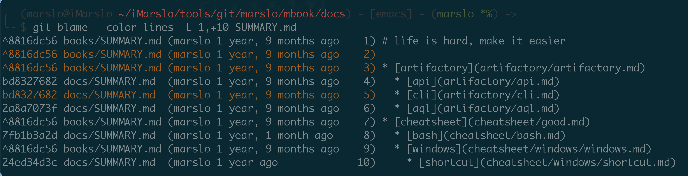

- `--color-by-age`

  > [!TIP]
  > references:
  > - [color.blame.highlightRecent](https://git-scm.com/docs/git-config#Documentation/git-config.txt-colorblamehighlightRecent)
  > - [BuonOmo/.gitconfig](https://gist.github.com/BuonOmo/ce45b51d0cefe949fd0c536a4a60f000)
  >
  > example:
  > ```git
  > [color "blame"]
  >   highlightRecent = 239, 20 month ago, 240, 18 month ago, 241, 16 month ago, 242, 14 month ago, 243, 12 month ago, 244, 10 month ago, 245, 8 month ago, 246, 6 month ago, 247, 4 month ago, 131, 3 month ago, 137, 2 month ago, 172, 1 month ago, 167, 3 weeks ago, 166, 2 weeks ago, 203, 1 week ago, 202
  > // others
  > [color "blame"]
  >   highlightRecent = 237, 20 month ago, 238, 19 month ago, 239, 18 month ago, 240, 17 month ago, 241, 16 month ago, 242, 15 month ago, 243, 14 month ago, 244, 13 month ago, 245, 12 month ago, 246, 11 month ago, 247, 10 month ago, 248, 9 month ago, 249, 8 month ago, 250, 7 month ago, 251, 6 month ago, 252, 5 month ago, 253, 4 month ago, 254, 3 month ago, 231, 2 month ago, 230, 1 month ago, 229, 3 weeks ago, 228, 2 weeks ago, 227, 1 week ago, 226
  > ```

  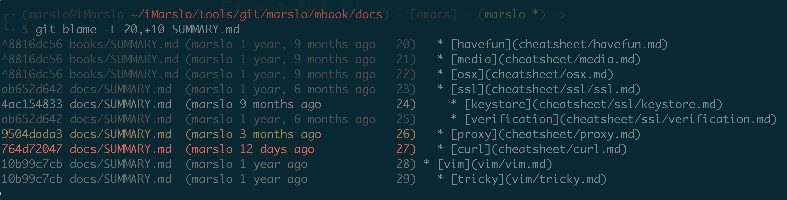

### tricky
- `--since`
  ```bash
  $ git blame --since=3.weeks -- foo

  # or
  $ git blame v2.6.18.. -- foo
  ```

## for-each-ref

> [!NOTE|label:references:]
> - references:
>   - [git-for-each-ref - Output information on each ref](https://git-scm.com/docs/git-for-each-ref) | [* examples](https://git-scm.com/docs/git-for-each-ref#_examples)
> - `--sort`:
>   - `authordate`
>   - `committerdate`
>   - `creatordate`
>   - `taggerdate`

### get refs days ago
```bash
$ while read revision branch commitDate; do
    benchmark=$(date +%s --date="1 year ago")
    # echo "benchmark: $benchmark"
    if [[ commitDate -le benchmark ]]; then
      git for-each-ref ${branch} --format='%(refname:short) - %(align:right,20)%(committerdate:format:%Y-%m-%d %H:%M:%S)%(end)'
    fi
  done < <(git for-each-ref refs/remotes/origin/sandbox --sort=committerdate --format='%(objectname) %(refname) %(committerdate:unix)')

# -- to archive --
$ git push origin refs/remotes/origin/sandbox/marslo/test:refs/remotes/archive/sandbox/marslo/test
Total 0 (delta 0), reused 0 (delta 0), pack-reused 0
remote: Processing changes: refs: 1, done
remote: GitMS - update replicated.
To ssh://gerrit.domain.com:29418/storage/ssdfw/devops/jenkins
 * [new reference]     origin/sandbox/marslo/test -> archive/sandbox/marslo/test

# -- to delete: https://superuser.com/a/601486/112396 --
# delete local refs
$ git update-ref -d refs/remotes/origin/sandbox/marslo/test -m 'already archived in refs/remotes/archive/sandbox/marslo/test'
# delete remote refs
$ git push . :refs/remotes/origin/sandbox/marslo/test

# or delete without `refs/remotes/`
$ git push origin --delete archive/sandbox/marslo/test
$ git push origin --delete origin/sandbox/marslo/test
```

- delete via `origin` will get issue `internal server error`
  ```bash
  $ git push origin --force :refs/remotes/origin/sandbox/marslo/test
  remote: Processing changes: refs: 1, done
  remote: error: ref update is a no-op: DELETE: 0000000000000000000000000000000000000000 0000000000000000000000000000000000000000 refs/remotes/origin/sandbox/marslo/test
  To ssh://gerrit.domain.com:29418/storage/ssdfw/devops/jenkins
   ! [remote rejected]   origin/sandbox/marslo/test (internal server error)
  error: failed to push some refs to 'ssh://gerrit.domain.com:29418/storage/ssdfw/devops/jenkins'
  ```

- to retrieve
  ```bash
  # fetch single ref
  $ git fetch origin refs/remotes/archive/sandbox/marslo/test
  From ssh://gerrit.domain.com:29418/storage/ssdfw/devops/jenkins
   * remote-tracking branch archive/sandbox/marslo/test -> FETCH_HEAD
  $ git checkout FETCH_HEAD
  HEAD is now at 749bd27d test

  # fetch all ref
  $ git fetch origin refs/remotes/archive/*:refs/archive/*
  remote: Counting objects: 4507, done
  remote: Finding sources: 100% (57/57)
  remote: Total 57 (delta 20), reused 49 (delta 20)
  Unpacking objects: 100% (57/57), 14.52 KiB | 424.00 KiB/s, done.
  From ssh://gerrit.domain.com:29418/storage/ssdfw/devops/jenkins
   * [new ref]           archive/sandbox/marslo/test       -> refs/archive/sandbox/marslo/test
   * [new ref]           archive/sandbox/marslo/sandbox    -> refs/archive/sandbox/marslo/sandbox
   * [new ref]           archive/sandbox/marslo/sample     -> refs/archive/sandbox/marslo/sample
  ```

## others

### mv
#### case sensitive
- error with regular `git mv`
  ```bash
  $ git config --global core.ignorecase true
  $ git mv Tig tig
  fatal: renaming 'confs/home/Tig' failed: Invalid argument
  ```

- renmae
  ```bash
  $ git mv Tig temp && git aa
  $ git mv temp tig && git aa
  $ git st
  On branch master
  Your branch is up to date with 'origin/master'.

  Changes to be committed:
    (use "git restore --staged <file>..." to unstage)
      renamed:    Tig/.tig/marslo.tigrc -> tig/.tig/marslo.tigrc
      renamed:    Tig/.tigrc -> tig/.tigrc
      renamed:    Tig/.tigrc_latest -> tig/.tigrc_latest
      renamed:    Tig/tigrc_2.4.1_1_example -> tig/tigrc_2.4.1_1_example
      renamed:    Tig/tigrc_Marslo -> tig/tigrc_Marslo
  ```

### clean
#### clean untracked directory and item in `.gitignore`


> [gitignore.io](https://gitignore.io)


```bash
$ git clean -dfx
# or
$ git clean -dffx
```

- quick generate .gitignore
  ```bash
  # show result
  $ curl -skL https://www.gitignore.io/api/groovy

  # download
  $ curl -skL https://www.toptal.com/developers/gitignore/api/groovy,java,python,go -o .gitignore
  ```

#### using `-f` twice if you really want to remove such a directory
```bash
$ git st
On branch meta/config
Your branch is based on 'origin/meta/config', but the upstream is gone.
  (use "git branch --unset-upstream" to fixup)

Untracked files:
  (use "git add <file>..." to include in what will be committed)
    my-sbumodule/

nothing added to commit but untracked files present (use "git add" to track)

$ git clean -dfx
Skipping repository my-submodule/

$ git clean -dffx
Removing my-submodule/
```
