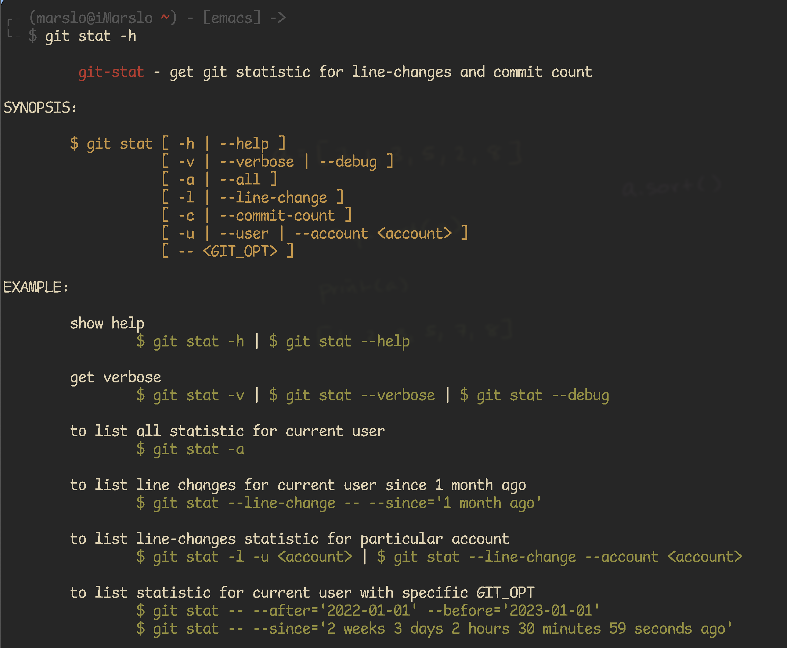
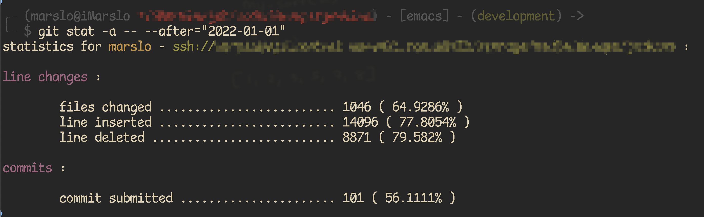

<!-- START doctoc generated TOC please keep comment here to allow auto update -->
<!-- DON'T EDIT THIS SECTION, INSTEAD RE-RUN doctoc TO UPDATE -->

- [list all user commits history with line changes](#list-all-user-commits-history-with-line-changes)
- [commits](#commits)
  - [total commits](#total-commits)
  - [user commits](#user-commits)
- [line changes](#line-changes)
  - [full history](#full-history)
  - [total changes](#total-changes)
  - [user changes](#user-changes)
- [tools](#tools)
  - [git-stat](#git-stat)
  - [git-stats](#git-stats)

<!-- END doctoc generated TOC please keep comment here to allow auto update -->



> references:
> - [* git-quick stats](https://github.com/arzzen/git-quick-stats.git)
> - [* IonicaBizau/git-stats](https://github.com/IonicaBizau/git-stats)
> - [* shitchell/git-user-stats](https://gist.github.com/shitchell/783cc8a892ed1591eca2afeb65e8720a)
> - [* Git statistics for repo per author](https://coderwall.com/p/pek-yg/git-statistics-for-repo-per-author)
> - [eyecatchup/git-commit-log-stats.md](https://gist.github.com/eyecatchup/3fb7ef0c0cbdb72412fc)
> - [Counting your contribution to a git repository](https://shinglyu.com/web/2018/12/25/counting-your-contribution-to-a-git-repository.html)
> - [pstadler/.git-stats.sh](https://gist.github.com/pstadler/4722416)
> - [Which Git commit stats are easy to pull](https://stackoverflow.com/questions/1486819/which-git-commit-stats-are-easy-to-pull)
> - [GET CONTRIBUTOR STATS FROM GIT](https://www.lostindetails.com/articles/get-contributor-stats-from-git)
> - [How to count total lines changed by a specific author in a Git repository?](https://stackoverflow.com/a/7010890/2940319)


## list all user commits history with line changes
```bash
$ git log ${GIT_OPT} --author="marslo" --oneline --shortstat [--no-merges]
```

## commits

> [!TIP]
> within time slots : `--after="2021-01-01" --before="2022-01-01"`
> ```bash
> GIT_OPT='--after="2021-01-01" --before="2022-01-01"'
> ```

### total commits
```bash
$ git shortlog -s -n ${GIT_OPT} | awk '{ sum += $1; } END { print sum; }'
304
```

### user commits
```bash
$ git shortlog -sn ${GIT_OPT}
   101   marslo
   ...

# or with email
$ git shortlog -sne ${GIT_OPT}
   101   marslo <marslo@xxx.com>
   ...

# or specific account only
$ git shortlog -sne ${GIT_OPT} --author='marslo'
   101   marslo <marslo@xxx.com>

# or via `rev-list --count`
$ git rev-list HEAD ${GIT_OPT} --author='marslo' --count
101
```

## line changes

> [!NOTE]
> references:
> - [git contribution per author (lines)](https://stackoverflow.com/a/25480975/2940319)
> - [escaping alias commands in a gitconfig files](https://stackoverflow.com/q/7804170/2940319)

### full history
```bash
$ git ls-files -z |
      xargs -0n1 git blame -w |
      perl -n -e '/^.*?\((.*?)\s+[\d]{4}/; print $1,"\n"' |
      sort -f |
      uniq -c |
      sort -nr

# or using sed instead of perl
$ git ls-files -z |
      xargs -0n1 git blame -w -C |
      sed -r 's/^[^(]+\((.*) [0-9]{4}-.*/\1/' |
      sed -r 's/ +$//' |
      sort -f |
      uniq -c |
      sort -nr
```

### total changes
```bash
$ git log ${GIT_OPT} --numstat  --pretty=tformat: |
  grep -v '^-' |
  awk '{ add+=$1; remove+=$2; loc += $1 - $2 } END \
       { printf ".. added: %s, removed: %s, total: %s .", add, remove, loc }'
.. added: 18111, removed: 11153, total: 6958 .

# or : https://stackoverflow.com/a/48575013/2940319
$ git log ${GIT_OPT} --pretty=format:'' --numstat --author |
  awk 'NF' |
  awk '{insertions+=$1; deletions+=$2} END \
       {print NR, "files changed,", insertions, "insertions(+),", deletions, "deletions(+)"}';

# or : https://stackoverflow.com/a/4593065/2940319
#      https://gist.github.com/pstadler/4722416
$ git log --shortstat  ${GIT_OPT} --author 'marslo' |
      grep "files\? changed" |
      awk '{files+=$1; inserted+=$4; deleted+=$6} END \
           {print ".. files changed :", files, "; lines inserted :", inserted, "; lines deleted :", deleted , ";"}'
.. files changed : 1046 ; lines inserted : 14096 ; lines deleted : 8871 ;

# or
$ git log --shortstat ${GIT_OPT} --author='marslo' --oneline  --format=tformat: |
      awk '{ files+=$1; inserted+=$4; deleted+=$6 } END \
           { print ".. files changed :", files, "\n.. lines inserted :", inserted, "\n.. lines deleted :", deleted }'
.. files changed : 1046
.. lines inserted : 14096
.. lines deleted : 887

# or : https://gist.github.com/eyecatchup/3fb7ef0c0cbdb72412fc
$ git log --author="marslo" --after="2022-01-01" --pretty=tformat: --numstat |
      awk '{ inserted+=$1; deleted+=$2; delta+=$1-$2; ratio=deleted/inserted } END \
           { printf "Commit stats:\n- Lines added (total)....  %s\n- Lines deleted (total)..  %s\n- Total lines (delta)....  %s\n- Add./Del. ratio (1:n)..  1 : %s\n", inserted, deleted, delta, ratio  }' -
Commit stats:
- Lines added (total)....  14090
- Lines deleted (total)..  8877
- Total lines (delta)....  5213
- Add./Del. ratio (1:n)..  1 : 0.630021
```

### user changes
```bash
$ git log "${GIT_OPT}" --author='marslo' --numstat  --pretty=tformat: |
  grep -v '^-' |
  awk '{ add+=$1; remove+=$2; loc += $1 - $2 } END { printf ".. added: %s, removed: %s, total: %s .", add, remove, loc }'
.. added: 14090, removed: 8877, total: 5213 .
```


## tools
### git-stat

> [!NOTE]
> - download from [github.com/marslo/mytools](https://github.com/marslo/mytools/blob/master/itool/git-stat)
> - usage:
>   
> - example:
>   

### git-stats
```bash
$ export NODE_TLS_REJECT_UNAUTHORIZED=0
$ npm config set strict-ssl false

$ npm i -g git-stats
(node:2823) Warning: Setting the NODE_TLS_REJECT_UNAUTHORIZED environment variable to '0' makes TLS connections and HTTPS requests insecure by disabling certificate verification.
/usr/local/bin/git-stats -> /usr/local/lib/node_modules/git-stats/bin/git-stats
> git-stats@3.1.1 postinstall /usr/local/lib/node_modules/git-stats
> node scripts/migration/2.0.0.js
+ git-stats@3.1.1
added 100 packages from 57 contributors in 15.748s

# optional
$ npm i -g git-stats-importer
$ npm i -g git-stats-html         # usage $ git-stats --raw | git-stats-html -o out.html
$ npm i -g pageres-cli            # usage $ pageres out.html 775x250


$ curl -sk https://raw.githubusercontent.com/IonicaBizau/git-stats/master/scripts/init-git-post-commit | bash
Setting up git-stats hooks.
Set new global git template dir at /Users/marslo/.git-templates
Successfully set up git-stats hook at /Users/marslo/.git-templates/hooks/post-commit.
```
