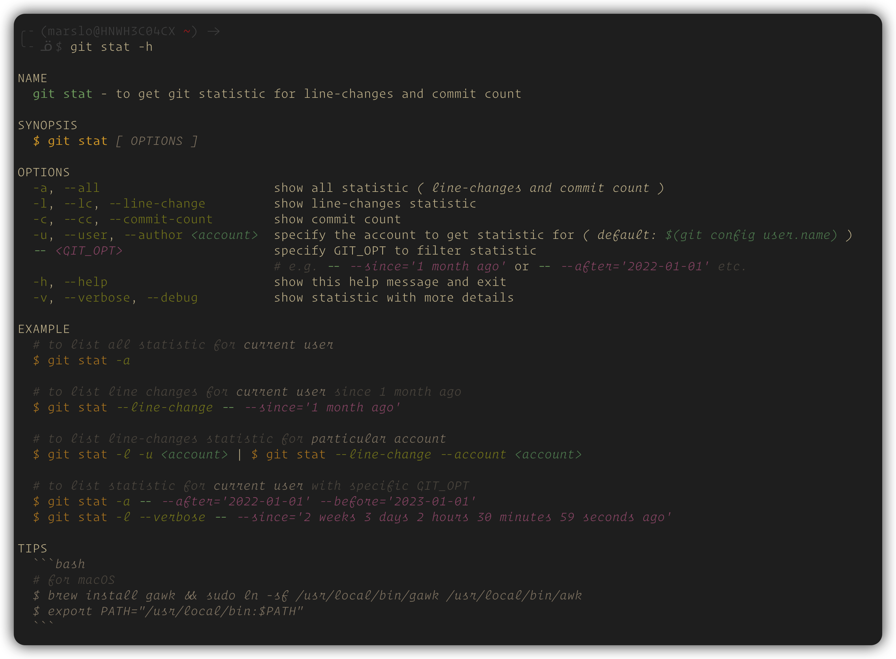
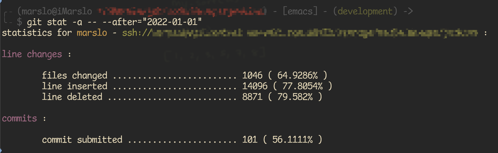
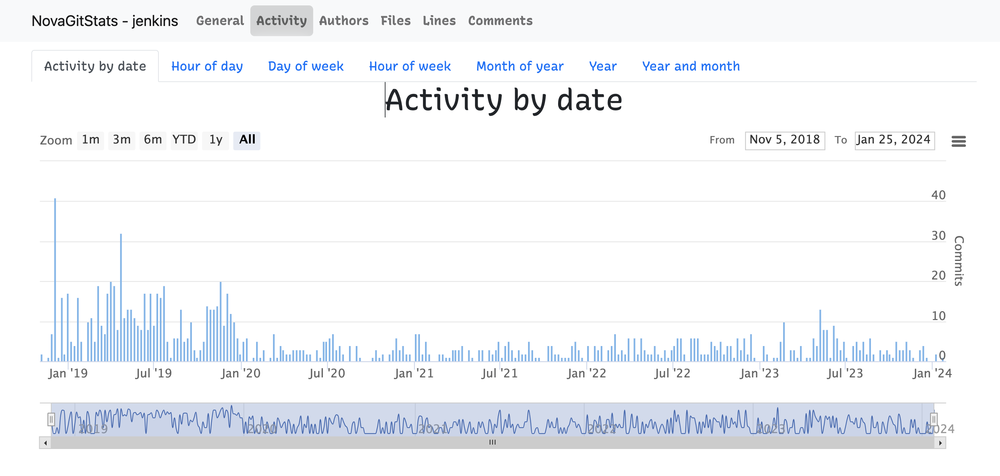
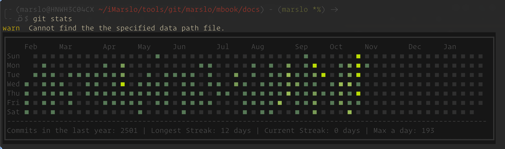
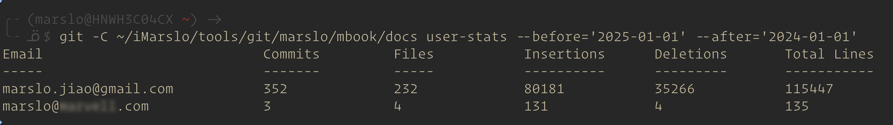

<!-- START doctoc generated TOC please keep comment here to allow auto update -->
<!-- DON'T EDIT THIS SECTION, INSTEAD RE-RUN doctoc TO UPDATE -->

- [commits](#commits)
  - [total commits](#total-commits)
  - [user commits](#user-commits)
- [line changes](#line-changes)
  - [full history](#full-history)
  - [total changes](#total-changes)
  - [user changes](#user-changes)
  - [file changes](#file-changes)
- [commands](#commands)
  - [`--stat`](#--stat)
  - [`--numstat`](#--numstat)
  - [`--shortstat`](#--shortstat)
  - [get repo active days](#get-repo-active-days)
  - [get commit count](#get-commit-count)
  - [get contributors](#get-contributors)
  - [format the author](#format-the-author)
  - [get all files count in the repo](#get-all-files-count-in-the-repo)
  - [show diff file only](#show-diff-file-only)
  - [repo age](#repo-age)
- [tools](#tools)
  - [git-stat](#git-stat)
  - [nova git stats](#nova-git-stats)
  - [git-stats](#git-stats)
  - [git fame](#git-fame)
  - [git-user-stats](#git-user-stats)
  - [git-quick-stats](#git-quick-stats)
  - [gitstats.exe](#gitstatsexe)
- [extra](#extra)
  - [git effort](#git-effort)
  - [git summary](#git-summary)
  - [git count](#git-count)
  - [git guilt](#git-guilt)
  - [git victim](#git-victim)
  - [git stat](#git-stat)
  - [others](#others)

<!-- END doctoc generated TOC please keep comment here to allow auto update -->


> references:
> - [* git-quick stats](https://github.com/arzzen/git-quick-stats.git)
> - [* shitchell/git-user-stats](https://gist.github.com/shitchell/783cc8a892ed1591eca2afeb65e8720a)
> - [* Git statistics for repo per author](https://coderwall.com/p/pek-yg/git-statistics-for-repo-per-author)
> - [eyecatchup/git-commit-log-stats.md](https://gist.github.com/eyecatchup/3fb7ef0c0cbdb72412fc)
> - [Counting your contribution to a git repository](https://shinglyu.com/web/2018/12/25/counting-your-contribution-to-a-git-repository.html)
> - [Which Git commit stats are easy to pull](https://stackoverflow.com/questions/1486819/which-git-commit-stats-are-easy-to-pull)
> - [GET CONTRIBUTOR STATS FROM GIT](https://www.lostindetails.com/articles/get-contributor-stats-from-git)
> - [How to count total lines changed by a specific author in a Git repository?](https://stackoverflow.com/a/7010890/2940319)
> - [arzzen/git-quick-stats](https://github.com/arzzen/git-quick-stats)


## commits

> [!TIP]
> within time slots : `--after="2021-01-01" --before="2022-01-01"`
> ```bash
> GIT_OPT='--after="2021-01-01" --before="2022-01-01"'
> ```

### total commits
```bash
$ git shortlog -s -n ${GIT_OPT} | awk '{ sum += $1; } END { print sum; }'
304
```

### user commits
```bash
$ git shortlog -sn ${GIT_OPT}
   101   marslo
   ...

# or with email
$ git shortlog -sne ${GIT_OPT}
   101   marslo <marslo@xxx.com>
   ...

# or specific account only
$ git shortlog -sne ${GIT_OPT} --author='marslo'
   101   marslo <marslo@xxx.com>

# or via `rev-list --count`
$ git rev-list HEAD ${GIT_OPT} --author='marslo' --count
101
```

## line changes

> [!NOTE|label:references:]
> - [git contribution per author (lines)](https://stackoverflow.com/a/25480975/2940319)
> - [escaping alias commands in a gitconfig files](https://stackoverflow.com/q/7804170/2940319)
>
> - list all user commits history with line changes
>  ```bash
>  $ git log ${GIT_OPT} --author="marslo" --oneline --shortstat [--no-merges]
>  ```

### full history
```bash
$ git ls-files -z |
      xargs -0n1 git blame -w |
      perl -n -e '/^.*?\((.*?)\s+[\d]{4}/; print $1,"\n"' |
      sort -f | uniq -c | sort -nr

# or using sed instead of perl
$ git ls-files -z |
      xargs -0n1 git blame -w -C |
      sed -r 's/^[^(]+\((.*) [0-9]{4}-.*/\1/' |
      sed -r 's/ +$//' |
      sort -f | uniq -c | sort -nr
```

### total changes
```bash
$ git log ${GIT_OPT} --numstat  --pretty=tformat: |
  grep -v '^-' |
  awk '{ add+=$1; remove+=$2; loc += $1 - $2 } END \
       { printf ".. added: %s, removed: %s, total: %s .", add, remove, loc }'
.. added: 18111, removed: 11153, total: 6958 .

# or : https://stackoverflow.com/a/48575013/2940319
$ git log ${GIT_OPT} --pretty=format:'' --numstat --author |
  awk 'NF' |
  awk '{insertions+=$1; deletions+=$2} END \
       {print NR, "files changed,", insertions, "insertions(+),", deletions, "deletions(+)"}';

# or : https://stackoverflow.com/a/4593065/2940319
#      https://gist.github.com/pstadler/4722416
$ git log --shortstat  ${GIT_OPT} --author 'marslo' |
      grep "files\? changed" |
      awk '{files+=$1; inserted+=$4; deleted+=$6} END \
           {print ".. files changed :", files, "; lines inserted :", inserted, "; lines deleted :", deleted , ";"}'
.. files changed : 1046 ; lines inserted : 14096 ; lines deleted : 8871 ;

# or
$ git log --shortstat ${GIT_OPT} --author='marslo' --oneline  --format=tformat: |
      awk '{ files+=$1; inserted+=$4; deleted+=$6 } END \
           { print ".. files changed :", files, "\n.. lines inserted :", inserted, "\n.. lines deleted :", deleted }'
.. files changed : 1046
.. lines inserted : 14096
.. lines deleted : 887

# or : https://gist.github.com/eyecatchup/3fb7ef0c0cbdb72412fc
$ git log --author="marslo" --after="2022-01-01" --pretty=tformat: --numstat |
      awk '{ inserted+=$1; deleted+=$2; delta+=$1-$2; ratio=deleted/inserted } END \
           { printf "Commit stats:\n- Lines added (total)....  %s\n- Lines deleted (total)..  %s\n- Total lines (delta)....  %s\n- Add./Del. ratio (1:n)..  1 : %s\n", inserted, deleted, delta, ratio  }' -
Commit stats:
- Lines added (total)....  14090
- Lines deleted (total)..  8877
- Total lines (delta)....  5213
- Add./Del. ratio (1:n)..  1 : 0.630021
```

### user changes
```bash
$ git log "${GIT_OPT}" --author='marslo' --numstat  --pretty=tformat: |
  grep -v '^-' |
  awk '{ add+=$1; remove+=$2; loc += $1 - $2 } END { printf ".. added: %s, removed: %s, total: %s .", add, remove, loc }'
.. added: 14090, removed: 8877, total: 5213 .
```

### file changes

> [!NOTE|label:references:]
> - [Finding most changed files in Git](https://stackoverflow.com/a/7686616/2940319)
> - [Use git commit history to find project hot-spots? [duplicate]](https://stackoverflow.com/a/18594249/2940319)
> - [marslo/git-hotspot](https://gist.github.com/marslo/d89ab035abcd5fb00bbdf158d685e088)
> - [dotfiles/.marslo/bin/git-effort](https://github.com/marslo/dotfiles/blob/main/.marslo/bin/git-effort)

```bash
# linux
$ git log --pretty=format: --name-only | sed '/^\s*$/d' | sort | uniq -c | sort -rg | head -100
# windows
$ git log --pretty=format: --name-only | sort | uniq -c | sort /R | head -100
```

## commands

### `--stat`
```bash
$ git diff --stat HEAD^ HEAD
 docs/programming/groovy/groovy.md |  1 +
 docs/vim/tricky.md                | 81 ++++++++++++++++++++++++++++++++++++++++++++++++++++++++++--------------------
 2 files changed, 61 insertions(+), 21 deletions(-)

# for particular account: https://stackoverflow.com/a/2528129/2940319
$ git --no-pager diff --author='marslo' --stat HEAD^ HEAD
 docs/programming/groovy/groovy.md |  1 +
 docs/vim/tricky.md                | 81 ++++++++++++++++++++++++++++++++++++++++++++++++++++++++++--------------------
 2 files changed, 61 insertions(+), 21 deletions(-)
```

### `--numstat`
```bash
$ git --no-pager log --numstat --author="marslo" HEAD^..HEAD
commit c361ddf2687319f978bb4ec0069b4b996607615f (HEAD -> marslo, origin/marslo)
Author: marslo <marslo.jiao@gmail.com>
Date:   Wed Jul 28 22:21:03 2021 +0800

    add bufdo for vim

1   0   docs/programming/groovy/groovy.md
60  21  docs/vim/tricky.md
```

```bash
# for total count of changes
$ git log --numstat --pretty="%H" --author="marslo" HEAD^..HEAD |
      awk 'NF==3 {plus+=$1; minus+=$2} END {printf("+%d, -%d\n", plus, minus)}'
+61, -21
```

```bash
# for pretty format: https://stackoverflow.com/a/63501669/2940319
$ git log HEAD^..HEAD --numstat --pretty="%H" |
      awk 'NF==3 {added+=$1; deleted+=$2} NF==1 {commit++} END {printf("total lines added: +%d\ntotal lines deleted: -%d\ntotal commits: %d\n", added, deleted, commit)}'
total lines added: +61
total lines deleted: -21
total commits: 1
```

```bash
# or: https://stackoverflow.com/a/61945239/2940319
$ git log --numstat --format="" HEAD^..HEAD |
      awk '{files += 1}{ins += $1}{del += $2} END{print "total: "files" files, "ins" insertions(+) "del" deletions(-)"}'
total: 2 files, 61 insertions(+) 21 deletions(-)
```

```bash
# alias: https://stackoverflow.com/a/61945239/2940319
[alias]
  summary = "!git log --numstat --format=\"\" \"$@\" | awk '{files += 1}{ins += $1}{del += $2} END{print \"total: \"files\" files, \"ins\" insertions(+) \"del\" deletions(-)\"}' #"
```

### [`--shortstat`](https://stackoverflow.com/a/41307958/2940319)
```bash
$ git diff --shortstat HEAD^..HEAD
 2 files changed, 61 insertions(+), 21 deletions(-)
```

```bash
# check for multiple commits: https://stackoverflow.com/a/53338858/2940319
$ git diff  $(git log -5 --pretty=format:"%h" | tail -1) --shortstat
 7 files changed, 253 insertions(+), 24 deletions(-)
```

### get repo active days
```bash
$ git log --pretty='format: %ai' $1 |
      cut -d ' ' -f 2 |
      sort -r |
      uniq |
      awk '{ sum += 1 } END {print sum}'
```

### get commit count
```bash
# since particular commit
$ git log --oneline <hash-id> | wc -l | tr -d ' '
635

# since the initial commit
$ git log --oneline | wc -l | tr -d ' '
780
```

### get contributors
```bash
$ git shortlog -n -s -e
   110   marslo <marslo.jiao@gmail.com>
    31   marslo <marslo@xxx.com>
```

<!--sec data-title="collection" data-id="section0" data-show=true data-collapse=true ces-->

```bash
# https://github.com/tj/git-extras/blob/master/bin/git-summary#L81
$ git shortlog -n -s -e |
      awk ' {
        sum += $1
        if ($NF in emails) {
            emails[$NF] += $1
        } else {
            email = $NF
            emails[email] = $1
            # set commits/email to empty
            $1=$NF=""
            sub(/^[[:space:]]+/, "", $0)
            sub(/[[:space:]]+$/, "", $0)
            name = $0
            if (name in names) {
                # when the same name is associated with existed email,
                # merge the previous email into the later one.
                emails[email] += emails[names[name]]
                emails[names[name]] = 0
            }
            names[name] = email
        }
      } END {
        for (name in names) { email = names[name]; printf "%6d\t%s\n", emails[email], name; }
    }'
   141  marslo
```

<!--endsec-->

### format the author
```bash
$ git shortlog -n -s -e | awk '
    {
      args[NR] = $0; sum += $0
    } END {
      for (i = 1; i <= NR; ++i) {
        printf "%s♪%2.1f%%\n", args[i], 100 * args[i] / sum
      }
    }
  ' | column -t -s♪ | sed "s/\\\x09/\t/g"
   110  marslo <marslo.jiao@gmail.com>  78.0%
    31  marslo <marslo@xxx.com>         22.0%
```

### get all files count in the repo
```bash
$ git ls-files | wc -l | tr -d ' '
```

### show diff file only
```bash
$ git log --numstat --pretty="%H" --author=marslo HEAD~3..HEAD
9fdb297ba0d2d51975e91d2b7e40fb5e96be4f5f

8       1       docs/artifactory/artifactory.md
095ec79c89d98831c0a485f55011bf81c6f712ad

49      11      docs/linux/disk.md
5       1       docs/osx/util.md
f15a40c8dea2927db54570268aca4203cd50a416

1       0       docs/SUMMARY.md
-       -       docs/screenshot/tools/ms/outlook-keychain-1.png
81      0       docs/tools/ms.md
```

### repo age
```bash
$ git log --reverse --pretty=oneline --format="%ar" | head -n 1 | LC_ALL=C sed 's/ago//'
4 months
```

## tools
### git-stat

> [!NOTE]
> - download from [github/marslo/dotfiles](https://github.com/marslo/dotfiles/blob/main/.marslo/bin/git-stat)
> - usage:
>   
> - example:
>   


### [nova git stats](https://github.com/mishina2228/nova_git_stats?tab=readme-ov-file)
```bash
$ gem install nova_git_stats
$ /usr/local/lib/ruby/gems/3.3.0/gems/nova_git_stats-2.4.1/bin/git_stats generate -o stats
```



### git-stats


> references:
> - [* IonicaBizau/git-stats](https://github.com/IonicaBizau/git-stats)
> - [pstadler/.git-stats.sh](https://gist.github.com/pstadler/4722416)


```bash
$ export NODE_TLS_REJECT_UNAUTHORIZED=0
$ npm config set strict-ssl false

$ npm i -g git-stats
(node:2823) Warning: Setting the NODE_TLS_REJECT_UNAUTHORIZED environment variable to '0' makes TLS connections and HTTPS requests insecure by disabling certificate verification.
/usr/local/bin/git-stats -> /usr/local/lib/node_modules/git-stats/bin/git-stats
> git-stats@3.1.1 postinstall /usr/local/lib/node_modules/git-stats
> node scripts/migration/2.0.0.js
+ git-stats@3.1.1
added 100 packages from 57 contributors in 15.748s
# or
$ sudo ln -sf "$(npm root -g)"/git-stats/bin/git-stats /usr/local/bin/git-stats

# -- setup post-commit hook --
$ curl -sk https://raw.githubusercontent.com/IonicaBizau/git-stats/master/scripts/init-git-post-commit | bash
Setting up git-stats hooks.
Set new global git template dir at /Users/marslo/.git-templates
Successfully set up git-stats hook at /Users/marslo/.git-templates/hooks/post-commit.

# optional
$ npm i -g git-stats-importer     # usage: $ cd /path/to/git-repo; git-stats-importer [ -e <email;wa> ]
$ npm i -g git-stats-html         # usage: $ git-stats --raw | git-stats-html -o out.html
$ npm i -g pageres-cli            # usage: $ pageres out.html 775x250
```



### [git fame](https://github.com/casperdcl/git-fame#readme)
```bash
# install
$ pip install git-fame

# completion
# osx
$ curl -fsSL https://raw.githubusercontent.com/casperdcl/git-fame/main/git-fame_completion.bash \
       -o /usr/local/etc/bash_completion.d/git-fame_completion.bash
# linux
$ sudo curl -fsSL https://raw.githubusercontent.com/casperdcl/git-fame/main/git-fame_completion.bash \
            -o /usr/share/bash-completion/completions/git-fame_completion.bash
# centos only
$ sudo curl -fsSL https://raw.githubusercontent.com/casperdcl/git-fame/main/git-fame_completion.bash \
            -o /etc/bash_completion.d/git-fame_completion.bash

# usage
vim $ git fame --cost hour,month --since='5 days ago'
    Processing: 100%|███████████████████████████████████████████████████████| 1/1 [00:00<00:00, 10.02repo/s]
    Total commits: 23
    Total ctimes: 133
    Total files: 133
    Total hours: 28.3
    Total loc: 1838
    Total months: 5.5
    | AUTHOR             | HRS | MTHS | LOC | COMS | FILES | DISTRIBUTION   |
    |:-------------------|----:|-----:|----:|-----:|------:|:---------------|
    | dkearns            |   2 |    2 | 658 |    3 |    20 | 35.8/13.0/15.0 |
    | lilydjwg           |   3 |    1 | 325 |    2 |    15 | 17.7/ 8.7/11.3 |
    | Christian Brabandt |   4 |    1 | 300 |    6 |    46 | 16.3/26.1/34.6 |
    | zeertzjq           |   2 |    1 | 176 |    3 |    19 | 9.6/13.0/14.3  |
    | Sergey Vlasov      |   2 |    0 | 126 |    1 |     9 | 6.9/ 4.3/ 6.8  |
    | Casey Tucker       |   2 |    0 |  83 |    1 |    11 | 4.5/ 4.3/ 8.3  |
    | thinca             |   2 |    0 |  61 |    1 |     4 | 3.3/ 4.3/ 3.0  |
    | kawaii-Code        |   2 |    0 |  32 |    1 |     2 | 1.7/ 4.3/ 1.5  |
    | user202729         |   2 |    0 |  28 |    1 |     1 | 1.5/ 4.3/ 0.8  |
    | VanaIgr            |   2 |    0 |  18 |    1 |     3 | 1.0/ 4.3/ 2.3  |
    | h_east             |   2 |    0 |  16 |    1 |     1 | 0.9/ 4.3/ 0.8  |
    | Melker Ulander     |   2 |    0 |  11 |    1 |     1 | 0.6/ 4.3/ 0.8  |
    | gi1242             |   2 |    0 |   4 |    1 |     1 | 0.2/ 4.3/ 0.8  |
```

### [git-user-stats](https://gist.github.com/shitchell/783cc8a892ed1591eca2afeb65e8720a)

> [!NOTE|label:references:]
> - [How do I show statistics for author's contributions in git?](https://stackoverflow.com/a/73781404/2940319)

```bash
vim $ git user-stats --since="4 days ago"
    Email                           Commits     Files       Insertions  Deletions   Total Lines
    -----                           -------     -----       ----------  ---------   -----------
    dougkearns@gmail.com            2           72          439         409         848
    anton.sharonov@gmail.com        1           6           483         83          566
    seandewar@users.noreply.github.com  3           19          200         31          231
    dapeng.mao@qq.com               1           5           87          6           93
    cb@256bit.org                   2           5           93          0           93
    gi1242@gmail.com                1           1           12          7           19
    github.e41mv@aleeas.com         1           2           13          1           14
    azc100@gmail.com                1           1           4           7           11
    zeertzjq@outlook.com            1           1           2           2           4
    zoltan.arpadffy@gmail.com       1           1           1           1           2
```

- install
  ```bash
  $ curl -o /path/to/bin/git-user-stats -fsSL https://gist.githubusercontent.com/shitchell/783cc8a892ed1591eca2afeb65e8720a/raw/git-user-stats

  # i.e.:
  $ curl -o ~/.marslo/bin/git-user-stats \
         -fsSL https://gist.githubusercontent.com/shitchell/783cc8a892ed1591eca2afeb65e8720a/raw/git-user-stats
  ```




### [git-quick-stats](https://github.com/git-quick-stats/git-quick-stats)

### [gitstats.exe](https://gitcontributors.com/)

> [!NOTE|label:references:]
> - [See all contributors of your git repos](https://gitcontributors.com/)

## extra

> [!TIP]
> - [git extra](https://github.com/tj/git-extras)

### [git effort](https://github.com/tj/git-extras/blob/main/bin/git-effort)

> [!NOTE|label:references:]
> - [git effort usage](https://github.com/tj/git-extras/blob/main/Commands.md#git-effort)
>   Displays "effort" statistics, currently just the number of commits per file, showing highlighting where the most activity is. The "active days" column is the total number of days which contributed modifications to this file.
> - [How can I calculate the number of lines changed between two commits in Git?](https://stackoverflow.com/questions/2528111/how-can-i-calculate-the-number-of-lines-changed-between-two-commits-in-git)


```bash
$ git effort --above 15 devops/*
  path                            commits    active days
  devops/git..................... 111         88
  devops/adminTools.md........... 42          27
  devops/awesomeShell.md......... 34          16
  devops/ssh.md.................. 16          15

$ git effort -- --since='3 months ago'
  path                                                                                                    commits    active days
  devops/awesomeShell.md.......................................................... 34          16
  vim/plugins.md.................................................................. 26          17
  vim/deprecated.md............................................................... 21          14
  linux/basic.md.................................................................. 17          15
  SUMMARY.md...................................................................... 16          9
  linux/apt-yum.md................................................................ 15          14
  linux/devenv.md................................................................. 14          9
  devops/adminTools.md............................................................ 14          10
  cheatsheet/bash/sugar.md........................................................ 14          13
  cheatsheet/character/character.md............................................... 13          9
  osx/apps.md..................................................................... 12          9
  devops/git/config.md............................................................ 11          10
  linux/system.md................................................................. 9           7
  virtualization/kubernetes/cheatsheet.md......................................... 8           7
  vim/troubleshooting.md.......................................................... 8           8
```

### [git summary](https://github.com/tj/git-extras/blob/main/bin/git-summary)

> [!NOTE|label:references:]
> - [git summary](https://github.com/tj/git-extras/blob/main/Commands.md#git-summary)
>   Outputs a repo or path summary

```bash
$ git summary --line
 project     : mbook
 lines       : 114620
 authors     :
 114563 marslo             100.0%
     40 Not Committed Yet  0.0%
     17 marslojiao         0.0%

$ git log --pretty=format:"%H" --since='3 months ago' | tail -1
435c4f75edb840a5f2c10991fc1d072eb4f51e50

$ git summary 435c4f75edb840a5f2c10991fc1d072eb4f51e50..

 project     : mbook
 repo age    : 3 years, 4 months
 branch:     : marslo
 last active : 11 minutes ago
 active on   : 56 days
 commits     : 130
 uncommitted : 1
 authors     :
   130  marslo  100.0%
```

### [git count](https://github.com/tj/git-extras/blob/main/bin/git-count)

> [!NOTE|label:references:]
> - [git count](https://github.com/tj/git-extras/blob/main/Commands.md#git-count)

```bash
$ git count

# or
$ git count --all
marslo (871)
marslojiao (1)

total 872
```

### [git guilt](https://github.com/tj/git-extras/blob/main/bin/git-guilt)

> [!NOTE]
> - [https://github.com/tj/git-extras/blob/main/Commands.md#git-guilt](https://github.com/tj/git-extras/blob/main/Commands.md#git-guilt)
>   Calculate the change in blame between two revisions

```bash
$ git guilt $(git log --since="3 weeks ago" --format="%H" | tail -1) HEAD
marslo                        ++++++++++++++++++++++++++++++++++++++++++(122886)
```

### [git victim](https://gist.github.com/ccw/6a43efb2468ac20ec4c19240c210e0e4)

> [!NOTE]
> modified from git-guilt to show the line changes per file

```bash
$ git victim $(git log --since="3 weeks ago" --format="%H" | tail -1) HEAD
docs/linux/tools.md                                                                   +++++++++++++++++++++++++++++++++++++++++++++(643)
docs/linux/basic.md                                                                   +++++++++++++++++++++++++++++++++++++++++++++(381)
docs/linux/util/files    218 docs/linux/util/files&chars.mdchars.md                   +++++++++++++++++++++++++++++++++++++++++++++(218)
docs/linux/util/files    172 books/linux/files&chars.mdchars.md                       +++++++++++++++++++++++++++++++++++++++++++++(172)
docs/linux/ubuntu/repo.md                                                             +++++++++++++++++++++++++++++++++++++++++(89)
docs/cheatsheet/bash/bash.md                                                          +++++++++++++++++++++++++(56)
docs/linux/ubuntu/apps.md                                                             ++(8)
...
```

### [git stat](https://github.com/marslo/dotfiles/blob/main/.marslo/bin/git-stat)

> [!NOTE|label:references:]
> - [* mishina2228/nova_git_stats](https://github.com/mishina2228/nova_git_stats)
> - [How do I show statistics for author's contributions in git?](https://stackoverflow.com/q/42715785/2940319) | [another answer](https://stackoverflow.com/a/42715893/2940319)
> - [IonicaBizau/git-stats](https://github.com/IonicaBizau/git-stats)
> - [GitStats - git history statistics generator](https://gitstats.sourceforge.net/)
>   - [hoxu/gitstats](https://github.com/hoxu/gitstats)
> - [shitchell/git-user-stats](https://gist.github.com/shitchell/783cc8a892ed1591eca2afeb65e8720a)
> - [Git statistics for repo per author](https://coderwall.com/p/pek-yg/git-statistics-for-repo-per-author)
> - [eyecatchup/git-commit-log-stats.md](https://gist.github.com/eyecatchup/3fb7ef0c0cbdb72412fc)
> - [ejwa/gitinspector](https://github.com/ejwa/gitinspector?tab=readme-ov-file)
>   - [sacdallago/git-inspector](https://github.com/sacdallago/git-inspector)

- `git shortlog`
  ```bash
  vim $ git shortlog -sne | head -5
       16563  Bram Moolenaar <Bram@vim.org>
         332  Yegappan Lakshmanan <yegappan@yahoo.com>
         330  zeertzjq <zeertzjq@outlook.com>
         273  Christian Brabandt <cb@256bit.org>
         106  K.Takata <kentkt@csc.jp>

  vim $ git shortlog -s -n
       16566   Bram Moolenaar
         343   Yegappan Lakshmanan
         330   zeertzjq
         273   Christian Brabandt
         106   K.Takata
          73   Dominique Pelle
          ...

  vim $ git shortlog -s -n --since='1 week ago'
           4   Christian Brabandt
           3   Restorer
           3   Sean Dewar
           2   dkearns
           1   Andrea C from The App
           1   Anton Sharonov
           1   Antonio Giovanni Colombo
           ...
  vim $ git log --pretty=format:%ae |
        gawk -- '{ ++c[$0]; } END { for(cc in c) printf "%5d %s\n",c[cc],cc; }' |
        sort -k1 -nr |
        head -5
      16563 Bram@vim.org
        332 yegappan@yahoo.com
        330 zeertzjq@outlook.com
        273 cb@256bit.org
        129 kentkt@csc.jp
  ```

  ```bash
  $ git ls-files |
        while read f; do git blame -w -M -C -C --line-porcelain "$f" | grep -I '^author '; done |
        sort -f | uniq -ic | sort -n --reverse
  ```

  ```bash
  # https://stackoverflow.com/a/1487421/2940319
  $ git log --pretty=format:%an \
    | awk '{ ++c[$0]; } END { for(cc in c) printf "%5d %s\n",c[cc],cc; }' | sort -r
  ```

### others
- [gitstats-simple.rb](https://stackoverflow.com/a/18797915/2940319)
  ```bash
  vim $ git log --numstat --pretty='%an' | ruby ~/Desktop/st/gitstats-simple.rb | head -6
      "Bram", 209045, 666898, 16424
      "Yegappan", 6218, 46864, 343
      "zeertzjq", 3708, 4435, 330
      "Christian", 2935, 4162, 272
      "K.Takata", 1000, 5522, 106
      "Restorer", 129, 3678, 15
  ```
- [knadh/git-bars](https://github.com/knadh/git-bars)
- [xiongchiamiov/git-merge-stats](https://github.com/xiongchiamiov/git-merge-stats)
- [git buggy](https://gist.github.com/ccw/accaff3982da4181c3ff0e181623ad45)
- [dexcodeinc/gitlogged](https://github.com/dexcodeinc/gitlogged)
