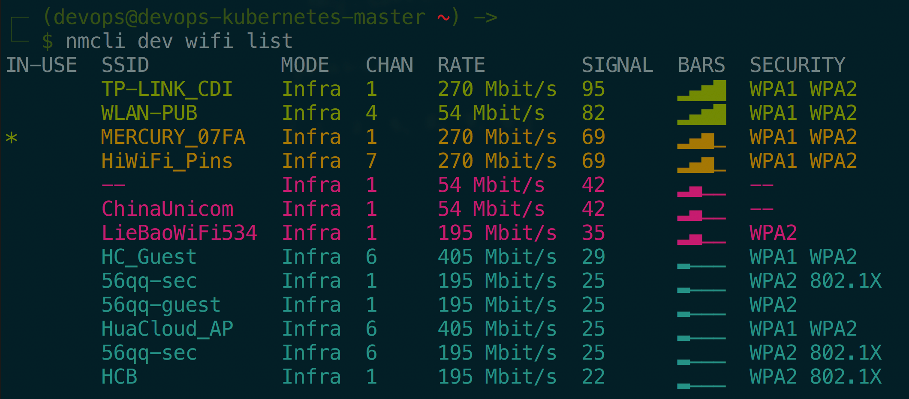
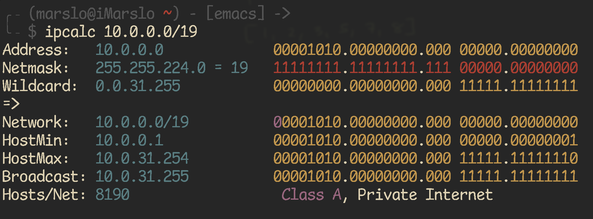
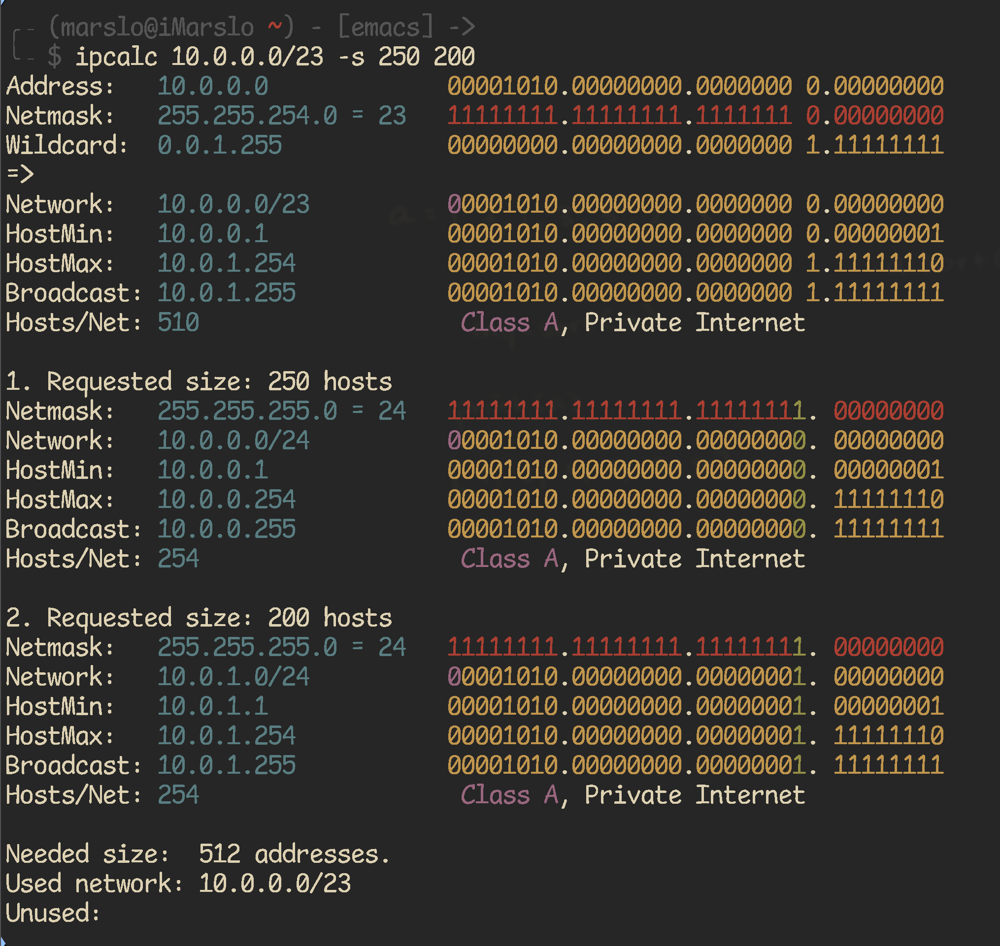
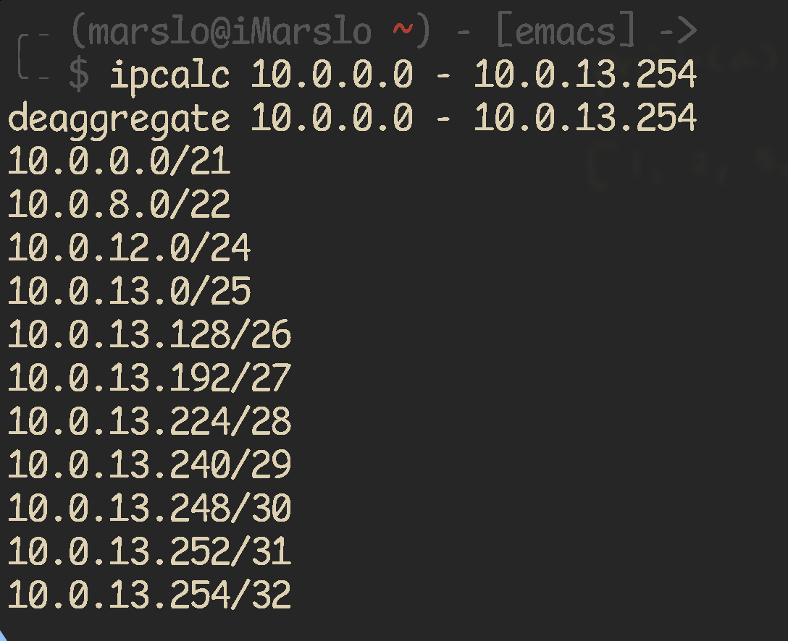

<!-- START doctoc generated TOC please keep comment here to allow auto update -->
<!-- DON'T EDIT THIS SECTION, INSTEAD RE-RUN doctoc TO UPDATE -->

- [interface](#interface)
  - [change interface name](#change-interface-name)
  - [show](#show)
- [route](#route)
- [DNS](#dns)
  - [add new DNS permanently](#add-new-dns-permanently)
- [port redirection](#port-redirection)
- [proxy setup](#proxy-setup)
- [network speed](#network-speed)
- [wifi](#wifi)
  - [`iwconfig`](#iwconfig)
  - [nmcli](#nmcli)
  - [nmtui](#nmtui)
- [netmask](#netmask)
  - [conversion](#conversion)
  - [basic concept](#basic-concept)
  - [example](#example)
  - [netmask quick reference](#netmask-quick-reference)
  - [ipcalc](#ipcalc)

<!-- END doctoc generated TOC please keep comment here to allow auto update -->


> reference:
> - [ARCH NetWork Configuration](https://wiki.archlinux.org/index.php/Network_configuration#Change_device_name)
> - [How do I add a DNS server via resolv.conf?](https://askubuntu.com/a/51332/92979)
> - [How to Configure and Manage Network Connections Using ‘nmcli’ Tool](https://www.tecmint.com/configure-network-connections-using-nmcli-tool-in-linux/)
> - [9 张动图让明白网络性能的四大指标：带宽、时延、抖动、丢包](https://zhuanlan.zhihu.com/p/404778160)


## interface
### change interface name
#### [Permanent Solution](https://wiki.archlinux.org/index.php/Network_configuration#Change_interface_name)
``` bash
$ sudo touch /etc/udev/rules.d/10-network.rules
$ sudo bash -c "cat > /etc/udev/rules.d/10-network.rules" << EOF
SUBSYSTEM=="net", ACTION=="add", DRIVERS=="?*", ATTR{address}=="<INTERFACE_MAC_ADDRESS>", KERNEL=="<ORIGINAL_INTERFACE_NAME>", NAME="<NEW_INTERFACE_NAME>"
EOF
```

- e.g.:
  ```bash
  $ nmcli connection
  NAME                UUID                                  TYPE      DEVICE
  WLAN-PUB            2cde1f25-8c28-4318-9781-b9fcdabd985d  wifi      wlp2s0
  Wired connection 1  f72d569d-065b-3bc8-98ae-e07f8bf46945  ethernet  enp0s31f6
  cni0                dcfc10c6-5421-4405-9d56-b3bb595780f5  bridge    cni0
  docker0             29822e8f-772f-4e67-8052-55b9e6c9e298  bridge    docker0

  $ sudo bash -c "cat > /etc/udev/rules.d/10-network.rules" << EOF
  SUBSYSTEM=="net", ACTION=="add", DRIVERS=="?*", ATTR{address}=="30:e1:71:95:19:bc", NAME="eth0"
  SUBSYSTEM=="net", ACTION=="add", DRIVERS=="?*", ATTR{address}=="34:f3:9a:52:75:65", NAME="wlan0"
  EOF

  $ sudo reboot

  $ nmcli connection
  NAME                UUID                                  TYPE      DEVICE
  WLAN-PUB            2cde1f25-8c28-4318-9781-b9fcdabd985d  wifi      wlan0
  Wired connection 1  f72d569d-065b-3bc8-98ae-e07f8bf46945  ethernet  eth0
  cni0                9a2d48d7-e1c7-4fe4-a164-ffde9716dbf3  bridge    cni0
  docker0             5db99dac-d17d-4765-9f38-057ff2c853ff  bridge    docker0
  ```

#### [temporary Solution](http://kernelpanik.net/rename-a-linux-network-interface-without-udev/)
```bash
$ sudo ifconfig <ORIGINAL_INTERFACE_NAME> down
$ sudo ip link set <ORIGINAL_INTERFACE_NAME> name <NEW_INTERFACE_NAME>
$ sudo ifconfig <NEW_INTERFACE_NAME>
```

- e.g.:
  ```bash
  $ nmcli dev
  DEVICE        TYPE      STATE         CONNECTION
  wlp2s0        wifi      connected     WLAN-PUB
  cni0          bridge    connected     cni0
  enp0s31f6     ethernet  connected     Wired connection 1
  docker0       bridge    connected     docker0
  flannel.1     vxlan     disconnected  --
  veth1890b284  ethernet  unmanaged     --
  veth5145289b  ethernet  unmanaged     --
  vetha9ee773c  ethernet  unmanaged     --
  vethf5a48bb2  ethernet  unmanaged     --
  lo            loopback  unmanaged     --

  $ nmcli connection
  NAME                UUID                                  TYPE      DEVICE
  WLAN-PUB            2cde1f25-8c28-4318-9781-b9fcdabd985d  wifi      wlp2s0
  Wired connection 1  f72d569d-065b-3bc8-98ae-e07f8bf46945  ethernet  enp0s31f6
  cni0                dcfc10c6-5421-4405-9d56-b3bb595780f5  bridge    cni0
  docker0             29822e8f-772f-4e67-8052-55b9e6c9e298  bridge    docker0

  $ sudo ifconfig enp0s31f6 down; sudo ip link set enp0s31f6 name eth0; sudo ifconfig eth0 up

  $ nmcli dev
  DEVICE        TYPE      STATE         CONNECTION
  wlp2s0        wifi      connected     WLAN-PUB
  cni0          bridge    connected     cni0
  docker0       bridge    connected     docker0
  eth0          ethernet  connected     Wired connection 1
  flannel.1     vxlan     disconnected  --
  veth1890b284  ethernet  unmanaged     --
  veth5145289b  ethernet  unmanaged     --
  vetha9ee773c  ethernet  unmanaged     --
  vethf5a48bb2  ethernet  unmanaged     --
  lo            loopback  unmanaged     --

  $ nmcli connection
  NAME                UUID                                  TYPE      DEVICE
  WLAN-PUB            2cde1f25-8c28-4318-9781-b9fcdabd985d  wifi      wlp2s0
  Wired connection 1  f72d569d-065b-3bc8-98ae-e07f8bf46945  ethernet  eth0
  cni0                e557e9bc-754e-4dc9-b9db-4519a7b15c33  bridge    cni0
  docker0             47c195b8-4867-40d3-acec-c28223e2b013  bridge    docker0
  ```

### show
#### ethtool
```bash
$ sudo ethtool eth0
Settings for eth0:
    Supported ports: [ TP ]
    Supported link modes:   10baseT/Half 10baseT/Full
                            100baseT/Half 100baseT/Full
                            1000baseT/Full
    Supported pause frame use: No
    Supports auto-negotiation: Yes
    Supported FEC modes: Not reported
    Advertised link modes:  10baseT/Half 10baseT/Full
                            100baseT/Half 100baseT/Full
                            1000baseT/Full
    Advertised pause frame use: No
    Advertised auto-negotiation: Yes
    Advertised FEC modes: Not reported
    Speed: 100Mb/s
    Duplex: Full
    Port: Twisted Pair
    PHYAD: 1
    Transceiver: internal
    Auto-negotiation: on
    MDI-X: on (auto)
    Supports Wake-on: pumbg
    Wake-on: g
    Current message level: 0x00000007 (7)
                   drv probe link
    Link detected: yes
```

#### list hardware

<!--sec data-title="sudo lshw -class network" data-id="section0" data-show=true data-collapse=true ces-->
```bash
$ sudo lshw -class network
  *-network
       description: Wireless interface
       product: Wireless 8260
       vendor: Intel Corporation
       physical id: 0
       bus info: pci@0000:02:00.0
       logical name: wlan0
       version: 3a
       serial: 34:f3:9a:52:75:65
       width: 64 bits
       clock: 33MHz
       capabilities: pm msi pciexpress bus_master cap_list ethernet physical wireless
       configuration: broadcast=yes driver=iwlwifi driverversion=4.15.0-23-generic firmware=34.0.1 ip=192.168.10.235 latency=0 link=yes multicast=yes wireless=IEEE 802.11
       resources: irq:129 memory:e4100000-e4101fff
  *-network
       description: Ethernet interface
       product: Ethernet Connection (2) I219-LM
       vendor: Intel Corporation
       physical id: 1f.6
       bus info: pci@0000:00:1f.6
       logical name: eth0
       version: 31
       serial: 30:e1:71:95:19:bc
       size: 100Mbit/s
       capacity: 1Gbit/s
       width: 32 bits
       clock: 33MHz
       capabilities: pm msi bus_master cap_list ethernet physical tp 10bt 10bt-fd 100bt 100bt-fd 1000bt-fd autonegotiation
       configuration: autonegotiation=on broadcast=yes driver=e1000e driverversion=3.2.6-k duplex=full firmware=0.8-4 ip=130.147.182.57 latency=0 link=yes multicast=yes port=twisted pair speed=100Mbit/s
       resources: irq:127 memory:e4300000-e431ffff
  *-network:0
       description: Ethernet interface
       physical id: 2
       logical name: veth680e7b1b
       serial: 86:86:ae:b1:3f:c3
       size: 10Gbit/s
       capabilities: ethernet physical
       configuration: autonegotiation=off broadcast=yes driver=veth driverversion=1.0 duplex=full link=yes multicast=yes port=twisted pair speed=10Gbit/s
  *-network:1
       description: Ethernet interface
       physical id: 3
       logical name: vethdd057c06
       serial: ae:b1:42:e3:30:d0
       size: 10Gbit/s
       capabilities: ethernet physical
       configuration: autonegotiation=off broadcast=yes driver=veth driverversion=1.0 duplex=full link=yes multicast=yes port=twisted pair speed=10Gbit/s
  *-network:2
       description: Ethernet interface
       physical id: 4
       logical name: vethfe693595
       serial: 16:ec:cd:4e:c3:d8
       size: 10Gbit/s
       capabilities: ethernet physical
       configuration: autonegotiation=off broadcast=yes driver=veth driverversion=1.0 duplex=full link=yes multicast=yes port=twisted pair speed=10Gbit/s
  *-network:3
       description: Ethernet interface
       physical id: 5
       logical name: flannel.1
       serial: 2a:2b:77:a7:35:8f
       capabilities: ethernet physical
       configuration: broadcast=yes driver=vxlan driverversion=0.1 ip=10.244.0.0 link=yes multicast=yes
  *-network:4
       description: Ethernet interface
       physical id: 6
       logical name: cni0
       serial: 0a:58:0a:f4:00:01
       capabilities: ethernet physical
       configuration: broadcast=yes driver=bridge driverversion=2.3 firmware=N/A ip=10.244.0.1 link=yes multicast=yes
  *-network:5
       description: Ethernet interface
       physical id: 7
       logical name: docker0
       serial: 02:42:99:41:e5:02
       capabilities: ethernet physical
       configuration: broadcast=yes driver=bridge driverversion=2.3 firmware=N/A ip=172.17.0.1 link=no multicast=yes
  *-network:6
       description: Ethernet interface
       physical id: 8
       logical name: vethc1b38134
       serial: 76:6a:6c:0f:e8:a1
       size: 10Gbit/s
       capabilities: ethernet physical
       configuration: autonegotiation=off broadcast=yes driver=veth driverversion=1.0 duplex=full link=yes multicast=yes port=twisted pair speed=10Gbit/s
```
<!--endsec-->

## route
```bash
$ nslookup my.gitlab.company.com
Server:     130.147.236.5
Address:    130.147.236.5#53

Non-authoritative answer:
Name:   pww.gitlab.cdi.mycompany.com
Address: 130.147.219.15

$ ip route get 130.147.219.15
130.147.219.15 dev eno1 src 130.147.182.240 uid 1000
    cache

$ nslookup github.com
Server:     130.147.236.5
Address:    130.147.236.5#53

Non-authoritative answer:
Name:   github.com
Address: 192.30.253.112
Name:   github.com
Address: 192.30.253.113

$ ip route get 192.30.253.113
192.30.253.113 via 192.168.10.1 dev wlan0 src 192.168.11.166 uid 1000
    cache
```

- or
  ```bash
  $ ip route show
  default via 192.168.10.1 dev wlan0 proto dhcp metric 600
  10.244.0.0/24 dev cni0 proto kernel scope link src 10.244.0.1
  130.140.0.0/16 dev eth0 scope link
  130.145.0.0/16 dev eth0 scope link
  130.146.0.0/16 dev eth0 scope link
  130.147.0.0/16 dev eth0 scope link
  130.147.182.0/23 dev eth0 proto kernel scope link src 130.147.182.57 metric 100
  137.55.0.0/16 dev eth0 scope link
  161.83.0.0/16 dev eth0 scope link
  161.84.0.0/16 dev eth0 scope link
  161.85.0.0/16 dev eth0 scope link
  161.88.0.0/16 dev eth0 scope link
  161.91.0.0/16 dev eth0 scope link
  161.92.0.0/16 dev eth0 scope link
  169.254.0.0/16 dev eth0 scope link metric 1000
  172.17.0.0/16 dev docker0 proto kernel scope link src 172.17.0.1 linkdown
  185.166.0.0/16 dev eth0 scope link
  192.168.10.0/23 dev wlan0 proto kernel scope link src 192.168.10.235 metric 600
  ```

- or
  ```bash
  $ route -n
  Kernel IP routing table
  Destination     Gateway         Genmask         Flags Metric Ref    Use Iface
  0.0.0.0         192.168.10.1    0.0.0.0         UG    600    0        0 wlan0
  10.244.0.0      0.0.0.0         255.255.255.0   U     0      0        0 cni0
  130.140.0.0     0.0.0.0         255.255.0.0     U     0      0        0 eth0
  130.145.0.0     0.0.0.0         255.255.0.0     U     0      0        0 eth0
  130.146.0.0     0.0.0.0         255.255.0.0     U     0      0        0 eth0
  130.147.0.0     0.0.0.0         255.255.0.0     U     0      0        0 eth0
  130.147.182.0   0.0.0.0         255.255.254.0   U     100    0        0 eth0
  137.55.0.0      0.0.0.0         255.255.0.0     U     0      0        0 eth0
  161.83.0.0      0.0.0.0         255.255.0.0     U     0      0        0 eth0
  161.84.0.0      0.0.0.0         255.255.0.0     U     0      0        0 eth0
  161.85.0.0      0.0.0.0         255.255.0.0     U     0      0        0 eth0
  161.88.0.0      0.0.0.0         255.255.0.0     U     0      0        0 eth0
  161.91.0.0      0.0.0.0         255.255.0.0     U     0      0        0 eth0
  161.92.0.0      0.0.0.0         255.255.0.0     U     0      0        0 eth0
  169.254.0.0     0.0.0.0         255.255.0.0     U     1000   0        0 eth0
  172.17.0.0      0.0.0.0         255.255.0.0     U     0      0        0 docker0
  185.166.0.0     0.0.0.0         255.255.0.0     U     0      0        0 eth0
  192.168.10.0    0.0.0.0         255.255.254.0   U     600    0        0 wlan0
  ```

## DNS
### add new DNS permanently
```bash
$ sudo apt install resolvconf
$ sudo cp /etc/resolvconf/resolv.conf.d/head{,.org}
$ sudo bash -c "cat > /etc/resolvconf/resolv.conf.d/head" << EOF
nameserver 130.147.236.5
nameserver 161.92.35.78
search cn-132.lan.mycompany.com
EOF

$ sudo resolvconf -u

$ cat /etc/resolv.conf
nameserver 127.0.0.53

$ sudo resolvconf -u

$ cat /etc/resolv.conf
nameserver 130.147.236.5
nameserver 161.92.35.78
nameserver 127.0.0.53
search cn-132.lan.mycompany.com
```

## port redirection
```bash
$ sudo iptables -L -n
Chain INPUT (policy ACCEPT)
target     prot opt source               destination
Chain FORWARD (policy ACCEPT)
target     prot opt source               destination
Chain OUTPUT (policy ACCEPT)
target     prot opt source               destination

$ sudo iptables -I INPUT 1 -p tcp --dport 8080 -j ACCEPT
$ sudo iptables -I INPUT 1 -p tcp --dport 80 -j ACCEPT
$ sudo iptables -A PREROUTING -t nat -i ens32 -p tcp --dport 80 -j REDIRECT --to-port 8080
$ sudo iptables -t nat -I OUTPUT -p tcp -d 127.0.0.1 --dport 80 -j REDIRECT --to-ports 8080
$ sudo iptables -t nat -I OUTPUT -p tcp -o lo --dport 80 -j REDIRECT --to-ports 8080

$ sudo iptables -L -n
Chain INPUT (policy ACCEPT)
target     prot opt source               destination
ACCEPT     tcp  --  0.0.0.0/0            0.0.0.0/0            tcp dpt:80
ACCEPT     tcp  --  0.0.0.0/0            0.0.0.0/0            tcp dpt:8080
Chain FORWARD (policy ACCEPT)
target     prot opt source               destination
Chain OUTPUT (policy ACCEPT)
target     prot opt source               destination

$ sudo netfilter-persistent save
run-parts: executing /usr/share/netfilter-persistent/plugins.d/15-ip4tables save
run-parts: executing /usr/share/netfilter-persistent/plugins.d/25-ip6tables save
$ sudo iptables-save > /etc/iptables/rules.v4
```

## proxy setup
* name: `x.x.x.x`
* port: `80`
* settings
  ```bash
  $ grep proxy /etc/profile
  export http_proxy=x.x.x.x:80
  export https_proxy=x.x.x.x:80
  export no_proxy=localhost,127.0.0.1,*.google.com
  ```

## network speed
```bash
$ ifstat -n -i en7
       en7
 KB/s in  KB/s out
    7.35      1.15
    4.91      1.02
    6.05      0.80
    8.36      1.78
```

## wifi
### `iwconfig`
- installation
    ```bash
    $ sudo apt install wireless-tools
    ```

- get wireless card
    ```bash
    $ WIRELESSCARD="$(iwconfig 2>/dev/null | /bin/grep ESSID | awk -F' ' '{print $1}')"

    $ iwconfig 2>/dev/null | \grep ESSID
    wlx24050f15c19b  IEEE 802.11  ESSID:"MERCURY_07FA"
    ```

- wireless network details
  ```bash
  $ sudo iwlist scan
  docker0   Interface doesn't support scanning.
  eno1      Interface doesn't support scanning.
  lo        Interface doesn't support scanning.
  cni0      Interface doesn't support scanning.
  flannel.1  Interface doesnt support scanning.
  wlx24050f15c19b  Scan completed :
            Cell 01 - Address: 50:3A:A0:CB:07:FA
                      Channel:1
                      Frequency:2.412 GHz (Channel 1)
                      Quality=55/70  Signal level=-55 dBm
                      Encryption key:on
                      ESSID:"MERCURY_07FA"
                      Bit Rates:1 Mb/s; 2 Mb/s; 5.5 Mb/s; 11 Mb/s; 9 Mb/s
                                18 Mb/s; 36 Mb/s; 54 Mb/s
                      Bit Rates:6 Mb/s; 12 Mb/s; 24 Mb/s; 48 Mb/s
                      Mode:Master
  ...
  ```

- or
  ```bash
  $ nmcli --show-secrets connection show 'MERCURY_07FA'
  connection.id:                          MERCURY_07FA
  connection.uuid:                        8e362f4a-d3a3-4147-b31e-4519954b55ef
  connection.stable-id:                   --
  connection.type:                        802-11-wireless
  connection.interface-name:              --
  connection.autoconnect:                 yes
  connection.autoconnect-priority:        0
  connection.autoconnect-retries:         -1 (default)
  connection.auth-retries:                -1
  connection.timestamp:                   1530689982
  connection.read-only:                   no
  ...
  ```

### [nmcli](https://askubuntu.com/a/461831/92979)


- show available wifi
  ```bash
  $ sudo nmcli device wifi rescan
  $ nmcli dev wifi list
  IN-USE  SSID              MODE   CHAN  RATE        SIGNAL  BARS  SECURITY
          CDI_TP-LINK       Infra  11    405 Mbit/s  100     ▂▄▆█  WPA1 WPA2
          TP-LINK_CDI       Infra  1     270 Mbit/s  82      ▂▄▆█  WPA1 WPA2
          WLAN-PUB          Infra  4     54 Mbit/s   82      ▂▄▆█  WPA1 WPA2
          HiWiFi_Pins       Infra  7     270 Mbit/s  82      ▂▄▆█  WPA1 WPA2
          --                Infra  1     54 Mbit/s   59      ▂▄▆_  --
  *       MERCURY_07FA      Infra  1     270 Mbit/s  55      ▂▄__  WPA1 WPA2
          Automation-Local  Infra  9     195 Mbit/s  55      ▂▄__  WPA2
          ChinaUnicom       Infra  1     54 Mbit/s   42      ▂▄__  --
          61-PUB            Infra  1     270 Mbit/s  29      ▂___  WPA2
          HC_Guest          Infra  6     405 Mbit/s  29      ▂___  WPA1 WPA2
          HuaCloud_AP       Infra  6     405 Mbit/s  29      ▂___  WPA1 WPA2
          56qq-guest        Infra  6     195 Mbit/s  25      ▂___  WPA2
          56qq-sec          Infra  1     195 Mbit/s  22      ▂___  WPA2 802.1X
          56qq-guest        Infra  1     195 Mbit/s  22      ▂___  WPA2
          HCB               Infra  1     195 Mbit/s  19      ▂___  WPA2 802.1X
  ```



- show saved wifi list
  ```bash
  $ nmcli c ( = $ nmcli connection)
  NAME                UUID                                  TYPE      DEVICE
  WLAN-PUB            545d5d95-723f-4e1b-b764-8e9bd2fe6a9f  wifi      wlp2s0
  Wired connection 1  a2a10a61-4519-3380-9301-c6e2a592eaa7  ethernet  enp0s31f6
  CDI_TP-LINK_5G      cb00cf00-58ca-4668-9b4c-e1fb3b18c932  wifi      --
  ```

### nmtui


## netmask

> [!NOTE|label:references:]
> - [ipcalc online](https://jodies.de/ipcalc?host=10.0.0.0&mask1=29&mask2=)
> - [ipcalc brew install](https://formulae.brew.sh/formula/ipcalc)

### conversion

> [!NOTE|label:references:]
> - [* iMarslo : math : binary <> decimal <> hexadecimal](../cheatsheet/math.html#binary--decimal--hexadecimal)
>   - `obase` : `[o]utput base`
>   - `ibase` : `[i]utput base`

```bash
# bin -> dec
$ bc <<< 'ibase=2;11111111;11111111;11000000;00000000' | paste -sd. -
255.255.192.0

# bin -> hex
$ bc <<< 'obase=16;ibase=2;11111111;11111111;11000000;00000000' | awk '{ printf "%04s\n", $1 }' | paste -sd. -
00FF.00FF.00C0.0000

# dec -> bin
$ bc <<< 'ibase=10;obase=2;255;255;240;0' | numfmt --format %08f | paste -sd' ' -
11111111 11111111 11110000 00000000

# dec -> hex
$ bc <<< 'ibase=10;obase=16;255;255;240;0' | awk '{ printf "%04s\n", $1 }' | paste -sd. -
00FF.00FF.00F0.0000

# hex -> bin
$ bc <<< 'ibase=16;obase=2;FF;FF;EE;0A' | numfmt --format %08f | paste -sd' ' -
11111111 11111111 11101110 00001010

# hex -> dec
$ bc <<< 'ibase=16;FF;FF;EE;0A' | paste -sd. -
255.255.238.10
```

### basic concept

> [!TIP|label:what is netmask]
> A netmask is a `32-bit` binary mask used to divide an IP address into subnets and specify the network's available hosts.
> - full 32-bit :
>   ```bash
>     11111111 11111111 11111111 11111111
>   # |------| |------| |------| |------|
>   #    8    +    8   +    8   +    8       == total 32-bit
>   ```
> - sample data:
>   - ip address: `10.0.0.0`

- `24-bit` <br>
  = `1x8x3` + `0x8` bit <br>
  = <font color="red"><code>11111111</code> <code>11111111</code> <code>11111111</code></font> <font color="black"><code>00000000</code></font>
- wildcard <br>
  = <font color="black"><code>00000000</code> <code>00000000</code> <code>00000000</code></font> <font color="red"><code>11111111</code></font>
  = `0x8x3` + `1x8` bit <br>
  = `2^8 - 1` <br>
  = `255` <br>
  = support 255 IPs maximum including boardcast <br>
  = support `255-1` regular IPs <br>

==>

- network   : `10.0.0.0/24`
- hostMin   : `10.0.0.1`
- hostMax   : `10.0.0.254`
- boardcast : `10.0.0.254`
- host/net  : `254`

### example
#### if netmask using `n-bit`, then supported hosts/nets = `2^(32-<n>) - 1 - 1`. i.e.:
- netmask : `27`
- supported IPs : `2^(32-27) - 1 - 1` = `2^5 - 1 - 1` = `32 - 2` = `30`
- IP ranges : `10.0.0.1 ~ 10.0.0.30`
- boardcast : `10.0.0.31`

#### if netmask using `255.255.x.x`
1. convert netmask decimal to binary, and get bit and then get wildcard. i.e.:
  - netmask : `255.255.255.192`
  - decimal to binary :

    > [!TIP]
    > ```bash
    > $ bc -l <<< 'obase=2;255;255;192;0' | awk '{ printf "%08d\n", $0 }' | xargs
    > 11111111 11111111 11000000 00000000
    > $ bc -l <<< 'obase=2;255;255;192;0' | numfmt --format=%08f | xargs
    > 11111111 11111111 11000000 00000000
    > ```

    `192` <br>
    = `128` + `64` <br>
    = `2^7` + `2^6` <br>
    = <br>
    <pre><font color="black"><font color="red">1</font>0000000 + 0<font color="red">1</font>000000</font></pre>
  - netmask :
    <pre><font color="red">  255   <font color="black">.</font>  255   <font color="black">.</font>  255   <font color="black">.</font>  192   </font> <br><font color="red">11111111 11111111 11111111 11</font><font color="black">000000</font><br>|---------------------------|<br>             26-bit</pre>
    = `1x3x8` + `1x2` + `0x6` = `26`
  - wildcard :
    <pre><font color="black">   0    .   0    .   0    .<font color="red">   63   </font><br>00000000 00000000 00000000 00<font color="red">111111</font></font><br>                             |----|<br>                              6-bit</pre>
    = `0x3x8` + `0x2` + `1x6` = `6` === `32 - 26` = `6`
  - IPs : `2^6 - 1 - 1` = `64 - 2` = `62`
    = `10.0.0.1 ~ 10.0.0.62`
  - boardcast : `10.0.0.63`
1. `255.255.255.255 - <netmask>`, and then convert decimal to binary
  - netmask : `255.255.240.0`
  - wildcard :

    > [!TIP]
    > ```bash
    > $ bc -l <<< 'obase=2;0;0;15;255' | awk '{ printf "%08d\n", $0 }' | xargs
    > 00000000 00000000 00001111 11111111
    > $ bc <<< 'obase=2; 0;0;15;255' | numfmt --format=%08f | xargs
    > 00000000 00000000 00001111 11111111
    > ```

    `255.255.255.255 - 255.255.240.0` = `0.0.15.255` =
    <pre><font color="black">    0    .    0   .</font><font color="red">    15  <font color="black">.</font>  255</font> <br> <font color="black">00000000 00000000 0000</font><font color="red">1111 11111111</font><br>                       |-----------|<br>                           12-bit</pre>
  - IPs : `2^12 - 1 - 1` = `4094` =
    <pre><font color="black">10.0.0.1 ~ 10.0.0.</font><font color="red">15</font><font color="black">.254</font> <br>                  <font color="red">--</font> <br>              <font color="gray">0.0.</font><font color="red">15</font><font color="gray">.255    # 255.255.255.255 - 255.255.240.0 = 0.0.</font><font color="red">15</font><font color="gray">.255</font> </pre>
  - boardcast : `10.0.15.255`


### [netmask quick reference](http://www.unixwiz.net/techtips/netmask-ref.html)

| # BITS   | # HOSTS       | NETMASK           | CLASS |
| :------: | ------------- | ----------------- | :---: |
| `/4`     | `268435456`   | `240.0.0.0`       | A     |
| `/5`     | `134217728`   | `248.0.0.0`       | A     |
| `/6`     | `67108864`    | `252.0.0.0`       | A     |
| `/7`     | `33554432`    | `254.0.0.0`       | A     |
| `/8`     | `16777216`    | `255.0.0.0`       | A     |
| `/9`     | `8388608`     | `255.128.0.0`     | B     |
| `/10`    | `4194304`     | `255.192.0.0`     | B     |
| `/11`    | `2097152`     | `255.224.0.0`     | B     |
| `/12`    | `1048576`     | `255.240.0.0`     | B     |
| `/13`    | `524288`      | `255.248.0.0`     | B     |
| `/14`    | `262144`      | `255.252.0.0`     | B     |
| `/15`    | `131072`      | `255.254.0.0`     | B     |
| `/16`    | `65536`       | `255.255.0.0`     | B     |
| `/17`    | `32768`       | `255.255.128.0`   | C     |
| `/18`    | `16384`       | `255.255.192.0`   | C     |
| `/19`    | `8192`        | `255.255.224.0`   | C     |
| `/20`    | `4096`        | `255.255.240.0`   | C     |
| `/21`    | `2048`        | `255.255.248.0`   | C     |
| `/22`    | `1024`        | `255.255.252.0`   | C     |
| `/23`    | `512`         | `255.255.254.0`   | C     |
| `/24`    | `256`         | `255.255.255.0`   | C     |
| `/25`    | `128`         | `255.255.255.128` | -     |
| `/26`    | `64`          | `255.255.255.192` | -     |
| `/27`    | `32`          | `255.255.255.224` | -     |
| `/28`    | `16`          | `255.255.255.240` | -     |
| `/29`    | `8`           | `255.255.255.248` | -     |
| `/30`    | `4`           | `255.255.255.252` | -     |
| `/31`    | -             | -                 | -     |
| `/32`    | `1`           | `255.255.255.255` | -     |


### [ipcalc](https://www.linux.com/topic/networking/how-calculate-network-addresses-ipcalc/)

> [!NOTE|label:references:]
> - [How to Calculate Network Addresses with ipcalc](https://www.linux.com/topic/networking/how-calculate-network-addresses-ipcalc/)

- basic usage

  

- split network to subnets

  

- deaggregate address range

  
