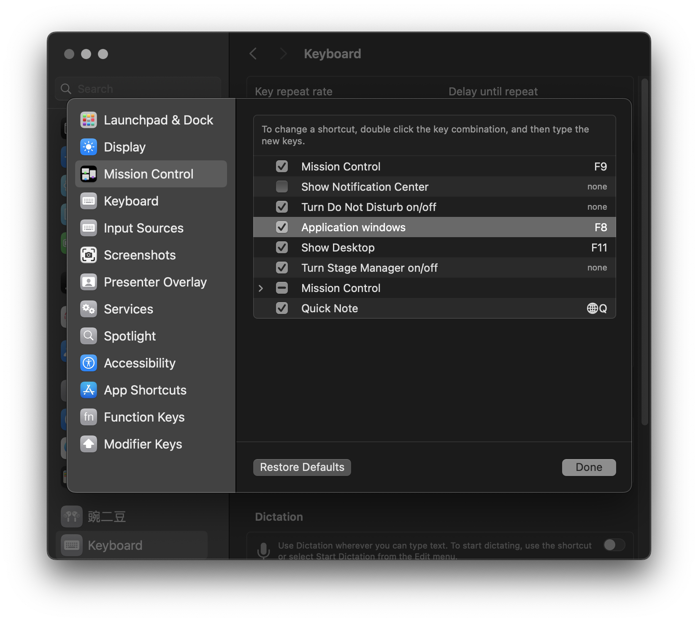
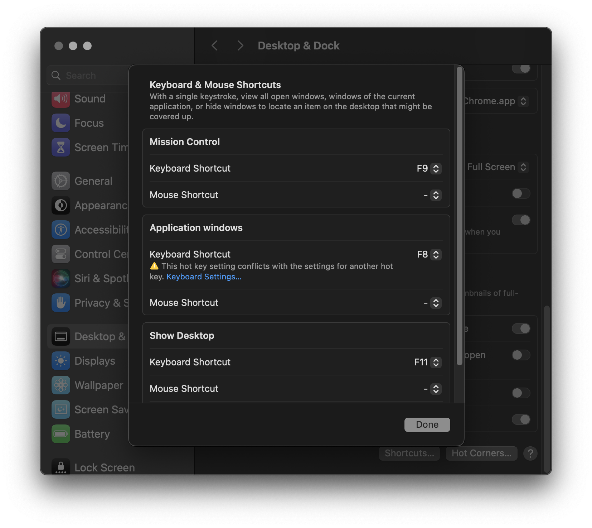
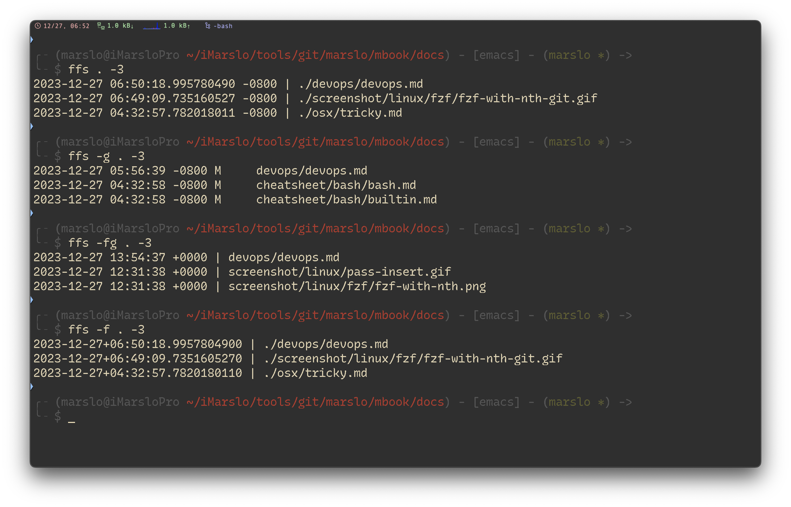
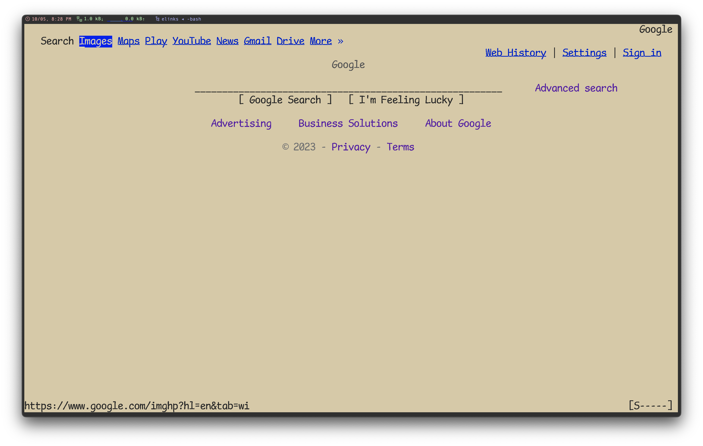

<!-- START doctoc generated TOC please keep comment here to allow auto update -->
<!-- DON'T EDIT THIS SECTION, INSTEAD RE-RUN doctoc TO UPDATE -->
**Table of Contents**  *generated with [DocToc](https://github.com/thlorenz/doctoc)*

- [`fzf`](#fzf)
  - [install](#install)
    - [install from source code for wsl](#install-from-source-code-for-wsl)
  - [shortcuts](#shortcuts)
    - [action and select](#action-and-select)
    - [movement](#movement)
    - [ctrl-t](#ctrl-t)
  - [cool functions](#cool-functions)
  - [advanced usage](#advanced-usage)
    - [git alias](#git-alias)
    - [unset environment](#unset-environment)
    - [ps](#ps)
    - [kubectl](#kubectl)
    - [homebrew](#homebrew)
  - [config](#config)
    - [color theme](#color-theme)
    - [`ctrl-r`](#ctrl-r)
    - [`ctrl-t`](#ctrl-t)
- [`fd`](#fd)
  - [install](#install-1)
  - [usage](#usage)
  - [advanced usage](#advanced-usage-1)
    - [`ff`](#ff)
    - [`ffs`](#ffs)
- [`ag` the faster `mg`](#ag-the-faster-mg)
  - [install](#install-2)
- [`rg` the faster `mg`](#rg-the-faster-mg)
  - [install](#install-3)
  - [usage](#usage-1)
  - [search in dotfiles with ripgrep](#search-in-dotfiles-with-ripgrep)
- [`fzy`](#fzy)
  - [install](#install-4)
- [`bat`](#bat)
  - [install](#install-5)
  - [usage](#usage-2)
    - [`help()`](#help)
    - [cygwin path issue](#cygwin-path-issue)
  - [config](#config-1)
  - [theme](#theme)
- [`ncdu` : NCurses Disk Usage](#ncdu--ncurses-disk-usage)
- [theme and colors](#theme-and-colors)
  - [`c`: bash-color](#c-bash-color)
  - [`ansi`](#ansi)
  - [`diff-so-fancy`](#diff-so-fancy)
- [utility](#utility)
  - [`elinks`](#elinks)
  - [`duf`](#duf)
  - [`enhancd`](#enhancd)

<!-- END doctoc generated TOC please keep comment here to allow auto update -->


> references:
> - [Best UNIX shell-based tools](https://gist.github.com/mbbx6spp/1429161)
> - [* alebcay/awesome-shell](https://github.com/alebcay/awesome-shell/tree/master)
>   - [* zh-cn](https://github.com/alebcay/awesome-shell/blob/master/README_ZH-CN.md)
>   - [nosarthur/awesome-shell](https://github.com/nosarthur/awesome-shell)
> - [* rockerBOO/awesome-neovim](https://github.com/rockerBOO/awesome-neovim)
> - [Learn Enough Command Line to Be Dangerous](https://www.learnenough.com/command-line-tutorial/basics)
> - [Use Bash Strict Mode (Unless You Love Debugging)](http://redsymbol.net/articles/unofficial-bash-strict-mode/)
> - others
>   - [bayandin/awesome-awesomeness](https://github.com/bayandin/awesome-awesomeness)
>   - [emijrp/awesome-awesome](https://github.com/emijrp/awesome-awesome)
>   - [kahun/awesome-sysadmin](https://github.com/kahun/awesome-sysadmin)
> - [My Minimalist Over-powered Linux Setup Guide](https://medium.com/@jonyeezs/my-minimal-over-powered-linux-setup-guide-710931efb75b)
> - [* devynspencer/cute_commands.sh](https://gist.github.com/devynspencer/cfdce35b3230e72214ef)


# [`fzf`](https://github.com/junegunn/fzf)

> [!NOTE|label:references:]
> - [* fzf - FuZzy Finder Tutorial](https://www.youtube.com/watch?v=tB-AgxzBmH8)
>   - [Examples (completion)](https://github.com/junegunn/fzf/wiki/Examples-(completion))
>   - [Examples (vim)](https://github.com/junegunn/fzf/wiki/Examples-(vim))
>   - [On MacVim with iTerm2](https://github.com/junegunn/fzf/wiki/On-MacVim-with-iTerm2)
> - [* junegunn/fzf](https://github.com/junegunn/fzf)
>   - [fzf wiki](https://github.com/junegunn/fzf/wiki)
>   - [fzf screencasts by gotbletu](https://www.youtube.com/playlist?list=PLqv94xWU9zZ2fMsMMDF4PjtNHCeBFbggD)
>   - [junegunn/fzf-git.sh](https://github.com/junegunn/fzf-git.sh)
>   - fzf basics:
>     - [layout](https://qmacro.org/blog/posts/2021/02/02/fzf-the-basics-part-1-layout/)
>     - [search results](https://qmacro.org/blog/posts/2021/02/07/fzf-the-basics-part-2-search-results/)
>   - [examples](https://github.com/junegunn/fzf/wiki/examples)
>     - [Man pages](https://github.com/junegunn/fzf/wiki/Examples#man-pages)
>     - [Git](https://github.com/junegunn/fzf/wiki/Examples#git)
>   - [Advanced fzf examples](https://github.com/junegunn/fzf/blob/master/ADVANCED.md)
> - [Introduction to fzf command](https://www.baeldung.com/linux/fzf-command)
> - [Find anything you need with fzf, the Linux fuzzy finder tool](https://www.redhat.com/sysadmin/fzf-linux-fuzzy-finder)
> - [Why you should be using fzf, the command line fuzzy finder](https://www.freecodecamp.org/news/fzf-a-command-line-fuzzy-finder-missing-demo-a7de312403ff/)
> - [Linux下搜索神器fzf的配置和使用](https://blog.csdn.net/qq_39852676/article/details/126820806)
> - [garybernhardt/selecta](https://github.com/garybernhardt/selecta)
> - [serenevoid/fzf_config.md](https://gist.github.com/serenevoid/13239752cfa41a75a69446b7beb26d7a)
> - [scripts/rgfzf](https://github.com/naggie/dotfiles/blob/master/include/scripts/rgfzf)
> - [* How to search faster in Vim with FZF.vim](https://dev.to/iggredible/how-to-search-faster-in-vim-with-fzf-vim-36ko)
> - [* How FZF and ripgrep improved my workflow](https://sidneyliebrand.medium.com/how-fzf-and-ripgrep-improved-my-workflow-61c7ca212861) | [SidOfc/vim-rg-outdated-command.vim](https://gist.github.com/SidOfc/ba43acade7f4a1bf9faf57d16b33616a#file-vim-rg-outdated-command-vim)
>   ```vim
>   " fzf.vim now supports this command out of the box
>   " so this code is no longer needed.
>   command! -bang -nargs=* Rg
>     \ call fzf#vim#grep(
>     \   'rg --column --line-number --hidden --ignore-case --no-heading --color=always '.shellescape(<q-args>), 1,
>     \   <bang>0 ? fzf#vim#with_preview({'options': '--delimiter : --nth 4..'}, 'up:60%')
>     \           : fzf#vim#with_preview({'options': '--delimiter : --nth 4..'}, 'right:50%:hidden', '?'),
>     \   <bang>0)
>   ```
> - Fuzzy Completion in Bash
>   - `$ cat **<tab>`
>   - `$ unset **<tab>`
>   - `$ unalias **<tab>`
>   - `$ export **<tab>`
>   - `$ ssh **<tab>`
>   - `$ kill -9 **<tab>`
> - customize
>   - [* fzf wiki: color themes](https://github.com/junegunn/fzf/wiki/Color-schemes)
>   - [* fzf-color-theme.css](./fzf-color-theme.css)
>   - [#692 Custom selected character](https://github.com/junegunn/fzf/issues/692)


## install

```bash
$ brew install fzf fd
$ ln -sf $(brew --prefix fd)/share/bash-completion/completions/fd /usr/local/etc/bash_completion.d/fd
# debine
$ sudo apt install fd

$ FZF_DEFAULT_OPTS="--height 35%"
$ FZF_DEFAULT_OPTS+=" --layout=reverse"
$ FZF_DEFAULT_OPTS+=" --pointer='→' --marker='» ' --prompt='$ '"
$ FZF_DEFAULT_OPTS+=" --multi"
$ FZF_DEFAULT_OPTS+=" --inline-info"
$ FZF_DEFAULT_OPTS+=" --color=spinner:#e6db74,hl:#928374,fg:#ebdbb2,header:#928374,info:#504945,pointer:#98971a,marker:#d79921,fg+:#ebdbb2,prompt:#404945,hl+:#fb4934"
$ FZF_DEFAULT_COMMAND="fd --type f"
$ FZF_DEFAULT_COMMAND+=" --strip-cwd-prefix"
$ FZF_DEFAULT_COMMAND+=" --hidden"
$ FZF_DEFAULT_COMMAND+=" --follow"
$ FZF_DEFAULT_COMMAND+=" --exclude .git --exclude node_modules"
$ export FZF_DEFAULT_OPTS FZF_DEFAULT_COMMAND
```


### install from source code for wsl

> [!NOTE|label:this solution for install latest fzf in wsl]
> - in wsl Ubuntu, the fzf version is `0.29`
>   ```bash
>   $ sudo apt search fzf
>   Sorting... Done
>   Full Text Search... Done
>   fzf/jammy 0.29.0-1 amd64
>     general-purpose command-line fuzzy finder
>   ```
> - [* Fzf – A Quick Fuzzy File Search from Linux Terminal](https://www.tecmint.com/fzf-fuzzy-file-search-from-linux-terminal/)

```bash
$ git clone git@github.com:junegunn/fzf.git
$ bash -x install --all
$ sudo cp bin/fzf* /usr/local/bin/
```

- offline install
  ```bash
  ################ for offline installation only ################
  # check current version for offline installation
  $ uname -sm
  Linux x86_64

  # download correct package according https://github.com/junegunn/fzf/blob/master/install#L170
  # i.e.: Linux x86_64 -> fzf-$version-linux_amd64.tar.gz
  $ cp fzf-0.42.0-linux_amd64.tar.gz /tmp/fzf.tar.gz

  # modify install script `try_curl` function to not download but use local tar.gz directly
  $ cat << 'EOF' | git apply --inaccurate-eof --ignore-whitespace
  diff --git a/install b/install
  index 5ac191b..342bc49 100755
  --- a/install
  +++ b/install
  @@ -115,10 +115,8 @@ link_fzf_in_path() {
  try_curl() {
   command -v curl > /dev/null &&
   if [[ $1 =~ tar.gz$ ]]; then
  -    curl -fL $1 | tar -xzf -
  -  else
  -    local temp=${TMPDIR:-/tmp}/fzf.zip
  -    curl -fLo "$temp" $1 && unzip -o "$temp" && rm -f "$temp"
  +    local temp=${TMPDIR:-/tmp}/fzf.tar.gz
  +    tar -xzf "$temp" && rm -rf "$temp"
   fi
  }
  EOF

  ### or modify manually ###
  # try_curl() {
  #   command -v curl > /dev/null &&
  #   if [[ $1 =~ tar.gz$ ]]; then
  #     local temp=${TMPDIR:-/tmp}/fzf.tar.gz
  #     tar -xzf "$temp" && rm -rf "$temp"
  #   fi
  # }
  ################ for offline installation only ################
  ```

## shortcuts

> [!NOTE|label:references:]
> - [Using the finder](https://github.com/junegunn/fzf#using-the-finder)
> - [multiple select](https://github.com/junegunn/fzf.vim/issues/40#issuecomment-156037468)
>   - enable via : `--multi` or `-m`
>   - disable via : `--no-multi` or `+m`

### action and select
<div style="margin-left: 1.5em;">
  <table>
  <thead>
    <tr>
      <th style="text-align:center;vertical-align:middle">OPEN</th>
      <th style="text-align:center;vertical-align:middle">SELECT ALL</th>
      <th style="text-align:center;vertical-align:middle">DESELECT ALL</th>
      <th style="text-align:center;vertical-align:middle">TOGGLE ALL</th>
      <th style="text-align:center;vertical-align:middle">MULTIPLE SELECT</th>
    </tr>
  </thead>
  <tbody>
    <tr>
      <td style="text-align:center; vertical-align:middle" rowspan="2"><kbd>⏎</kbd></td>
      <td style="text-align:center; vertical-align:middle" rowspan="2"><kbd>ctrl</kbd> + <kbd>s</kbd></td>
      <td style="text-align:center; vertical-align:middle" rowspan="2"><kbd>ctrl</kbd> + <kbd>d</kbd></td>
      <td style="text-align:center; vertical-align:middle" rowspan="2"><kbd>ctrl</kbd> + <kbd>t</kbd></td>
      <td style="text-align:center"><kbd>⇥</kbd></td>
    </tr>
    <tr>
      <td style="text-align:center"><kbd>shift</kbd> + <kbd>⇥</kbd></td>
    </tr>
  </tbody>
  </table>
</div>

### movement
<div style="margin-left: 1.5em;">
  <table>
  <thead>
    <tr>
      <th style="text-align:center;vertical-align:middle">PREVIOUS</th>
      <th style="text-align:center;vertical-align:middle">NEXT</th>
      <th style="text-align:center;vertical-align:middle">MULTIPLE SELECT</th>
    </tr>
  </thead>
  <tbody>
    <tr>
      <td style="text-align:center;"><kbd>↑</kbd></td>
      <td style="text-align:center;"><kbd>↓</kbd></td>
      <td style="text-align:center; vertical-align:middle" rowspan="4"><kbd>⇥</kbd></td>
    </tr>
    <tr>
      <td style="text-align:center;"><kbd>ctrl</kbd> + <kbd>k</kbd></td>
      <td style="text-align:center;"><kbd>ctrl</kbd> + <kbd>j</kbd></td>
    </tr>
    <tr>
      <td style="text-align:center;"><kbd>ctrl</kbd> + <kbd>p</kbd></td>
      <td style="text-align:center;"><kbd>ctrl</kbd> + <kbd>n</kbd></td>
    </tr>
    <tr>
      <td style="text-align:center;"><kbd>ctrl</kbd> + <kbd>k</kbd></td>
      <td style="text-align:center;"><kbd>ctrl</kbd> + <kbd>j</kbd></td>
    </tr>
  </tbody>
  </table>
</div>

### ctrl-t

> [!TIP]
> - customized shortcut key via:
>   ```bash
>   export FZF_CTRL_T_OPTS="${FZF_CTRL_T_OPTS} --bind 'ctrl-p:preview-up,ctrl-n:preview-down'"
>   export FZF_CTRL_T_OPTS="${FZF_CTRL_T_OPTS} --bind 'ctrl-/:change-preview-window(down|hidden|)'"
>   ```
> - [#358: Keyboard bindings for scrolling preview window?](https://github.com/junegunn/fzf.vim/issues/358#issuecomment-769589975)
> - [#211: Scroll inside preview?](https://github.com/junegunn/fzf.vim/issues/211)

- file list:
  <div style="margin-left: 1.5em;">
    <table>
    <thead>
      <tr>
        <th style="text-align:center;vertical-align:middle">PREVIOUS</th>
        <th style="text-align:center;vertical-align:middle">NEXT</th>
        <th style="text-align:center;vertical-align:middle">CHANGE PREVIEW WINDOWS</th>
      </tr>
    </thead>
    <tbody>
      <tr>
        <td style="text-align:center;"><kbd>↑</kbd></td>
        <td style="text-align:center;"><kbd>↓</kbd></td>
        <td style="text-align:center; vertical-align:middle" rowspan="3"><kbd>ctrl</kbd> + <kbd>/</kbd></td>
      </tr>
      <tr>
        <td style="text-align:center;"><kbd>ctrl</kbd> + <kbd>k</kbd></td>
        <td style="text-align:center;"><kbd>ctrl</kbd> + <kbd>j</kbd></td>
      </tr>
      <tr>
        <td style="text-align:center;"><kbd>ctrl</kbd> + <kbd>p</kbd></td>
        <td style="text-align:center;"><kbd>ctrl</kbd> + <kbd>n</kbd></td>
      </tr>
    </tbody>
    </table>
  </div>

- preview content:
  <div style="margin-left: 2.5em;">
    <table>
    <thead>
      <tr>
        <th style="text-align:center;vertical-align:middle">PREVIOUS</th>
        <th style="text-align:center;vertical-align:middle">NEXT</th>
      </tr>
    </thead>
    <tbody>
      <tr>
        <td style="text-align:center;"><kbd>shift</kbd> + <kbd>↑</kbd></td>
        <td style="text-align:center;"><kbd>shift</kbd> + <kbd>↓</kbd></td>
      </tr>
      <tr>
        <td style="text-align:center;"><kbd>ctrl</kbd> + <kbd>↑</kbd></td>
        <td style="text-align:center;"><kbd>ctrl</kbd> + <kbd>↓</kbd></td>
      </tr>
      <tr>
        <td style="text-align:center;"><kbd>ctrl</kbd> + <kbd>p</kbd></td>
        <td style="text-align:center;"><kbd>ctrl</kbd> + <kbd>n</kbd></td>
      </tr>
    </tbody>
    </table>
  </div>


## cool functions

> [!NOTE|label:references:]
> - [Advanced fzf examples](https://github.com/junegunn/fzf/blob/master/ADVANCED.md)
> - [Examples](https://github.com/junegunn/fzf/wiki/examples)

- magic vim

  > [!TIP]
  > - if `vim` commands with paramters
  >   - if `1` paramters and parameters is directlry; cd and call fzf and using vim to open selected file
  >   - otherwise call regular vim to open file(s)
  > - if `vim` commands without paramters, call fzf and using vim to open selected file

  ```bash
  # magic vim: fzf list in recent modified order
  # @author      : marslo
  # @source      : https://github.com/marslo/mylinux/blob/master/confs/home/.marslo/bin/ifunc.sh#L206
  # @description :
  #   - if `vim` commands without paramters, then call fzf and using vim to open selected file
  #   - if `vim` commands with    paramters
  #       - if single paramters and parameters is directlry, then call fzf in target directory and using vim to open selected file
  #       - otherwise call regular vim to open file(s)
  function vim() {
    local target
    local fdOpt="--type f --hidden --follow --ignore-file $HOME/.fdignore --exec-batch ls -t"
    if [[ 0 -eq $# ]]; then
      fd . ${fdOpt} | fzf --multi --bind="enter:become($(type -P vim) {+})"
    elif [[ 1 -eq $# ]] && [[ -d $1 ]]; then
      [[ '.' = "${1}" ]] && target="${1}" || target=". ${1}"
      fd ${target} ${fdOpt} | fzf --multi --bind="enter:become($(type -P vim) {+})"
    else
      # shellcheck disable=SC2068
      $(type -P vim) -u $HOME/.vimrc $@
    fi
  }

  # v - open files in ~/.vim_mru_files       # https://github.com/junegunn/fzf/wiki/Examples#v
  function v() {
    local files
    files=$(grep --color=none -v '^#' ~/.vim_mru_files |
            while read -r line; do
              [ -f "${line/\~/$HOME}" ] && echo "$line"
            done | fzf-tmux -d -m -q "$*" -1) && vim ${files//\~/$HOME}
  }
  ```

  

- [v](https://github.com/junegunn/fzf/wiki/Examples#v)
  ```bash
  # v - open files in ~/.vim_mru_files       # https://github.com/junegunn/fzf/wiki/Examples#v
  function v() {
    local files
    files=$( grep --color=none -v '^#' ~/.vim_mru_files |
             while read -r line; do
               [ -f "${line/\~/$HOME}" ] && echo "$line"
             done | fzf-tmux -d -m -q "$*" -1
           ) && vim ${files//\~/$HOME}
  }
  ```

- smart vimdiff
  ```bash
  # smart vimdiff
  function vimdiff() {
    local rPath
    local lPath

    if [[ 0 -eq $# ]]; then
      rPath='.'
      # shellcheck disable=SC2154
      lPath=". ${iRCHOME}"
    elif [[ 1 -eq $# ]] && [[ -d "$1" ]]; then
      [[ '.' = "${1}" ]] && lPath="${1}" || lPath=". ${1}"
    elif [[ 2 -eq $# ]] && [[ -d "$1" ]] && [[ -d "$2" ]]; then
      [[ '.' = "${1}" ]] && rPath="${1}" || rPath=". ${1}"
      [[ '.' = "${2}" ]] && lPath="${2}" || lPath=". ${2}"
    fi

    if [[ -z "${rPath}" ]] && [[ -z "${lPath}" ]]; then
      $(type -P vim) -d "$*"
    else
      fdOpt="--type f --hidden --follow --ignore-file $HOME/.fdignore --exec-batch ls -t"
      lfile="$(fd ${rPath} ${fdOpt} | fzf +m)" &&
      rfile="$(fd ${lPath} ${fdOpt} | fzf +m)" &&
      $(type -P vim) -d "${lfile}" "${rfile}"
    fi
  }
  ```

- smart cat
  ```bash
  # smart cat
  function cat() {
    if [[ 0 -eq $# ]]; then
      # shellcheck disable=SC2046
      bat --theme='gruvbox-dark' $(fzf --exit-0)
    elif [[ '-c' = "$1" ]]; then
      $(type -P cat) "${@:2}"
    elif [[ 1 -eq $# ]] && [[ -d $1 ]]; then
      local target=$1;
      fd . "${target}" --type f --hidden --follow --exclude .git --exclude node_modules |
        fzf --multi --bind="enter:become(bat --theme='gruvbox-dark' {+})" ;
    else
      bat --theme='gruvbox-dark' "${@:1:$#-1}" "${@: -1}"
    fi
  }
  ```

- smart copy
  ```bash
  # smart copy
  function copy() {
    if [[ 0 -eq $# ]]; then
      # shellcheck disable=SC2046
      /usr/bin/pbcopy < $(fzf --exit-0)
    else
      /usr/bin/pbcopy < "$1"
    fi
  }
  ```

- [open files](https://github.com/junegunn/fzf/wiki/examples#opening-files)

  - `fs`
    ```bash
    $ function fs() { fzf --multi --bind 'enter:become(vim {+})' }
    ```

  - `fe`
    ```bash
    # fe [FUZZY PATTERN] - Open the selected file with the default editor
    #   - Bypass fuzzy finder if there's only one match (--select-1)
    #   - Exit if there's no match (--exit-0)
    fe() {
      IFS=$'\n' files=($(fzf-tmux --query="$1" --multi --select-1 --exit-0))
      [[ -n "$files" ]] && ${EDITOR:-vim} "${files[@]}"
    }
    ```

  - `fo`
    ```bash
    # Modified version where you can press
    #   - CTRL-O to open with `open` command,
    #   - CTRL-E or Enter key to open with the $EDITOR
    fo() {
      IFS=$'\n' out=("$(fzf-tmux --query="$1" --exit-0 --expect=ctrl-o,ctrl-e)")
      key=$(head -1 <<< "$out")
      file=$(head -2 <<< "$out" | tail -1)
      if [ -n "$file" ]; then
        [ "$key" = ctrl-o ] && open "$file" || ${EDITOR:-vim} "$file"
      fi
    }
    ```

- [search in files](https://github.com/junegunn/fzf/wiki/Examples#general)

  > [!NOTE]
  > - [#1057 Feature request: new option preview-window-scroll](https://github.com/junegunn/fzf/issues/1057#issuecomment-339347148)
  > - [gnanderson/fif.sh](https://gist.github.com/gnanderson/d74079d16714bb8b2822a7a07cc883d4)

  ```bash
  # [f]ind-[i]n-[f]ile - usage: fif <searchTerm>
  function fif() {
    if [ ! "$#" -gt 0 ]; then echo "Need a string to search for!"; return 1; fi
    $(type -P rg) --files-with-matches --no-messages --hidden --follow --smart-case "$1" |
    fzf --bind 'ctrl-p:preview-up,ctrl-n:preview-down' \
        --bind "enter:become($(type -P vim) {+})" \
        --header 'CTRL-N/CTRL-P or CTRL-↑/CTRL-↓ to view contents' \
        --preview "bat --color=always --style=plain {} |
                   rg --no-line-number --colors 'match:bg:yellow' --ignore-case --pretty --context 10 \"$1\" ||
                   rg --no-line-number --ignore-case --pretty --context 10 \"$1\" {} \
                  "
  }

  # or highlight as preview tool
  fif() {
    if [ ! "$#" -gt 0 ]; then echo "Need a string to search for!"; return 1; fi
    rg --color never --files-with-matches --no-messages "$1" |
    fzf --bind 'ctrl-p:preview-up,ctrl-n:preview-down' \
        --preview "highlight -O ansi {} 2> /dev/null |
                   rg --colors 'match:bg:yellow' --ignore-case --pretty --context 10 '$1' ||
                   rg --no-line-number --ignore-case --pretty --context 10 '$1' {} \
                  "
  }
  ```

  

- [chaning directory](https://github.com/junegunn/fzf/wiki/examples#changing-directory)
  - `fd`
    ```bash
    # fd - cd to selected directory
    ### conflict with fd-find ###
    fd() {
      local dir
      dir=$(find ${1:-.} -path '*/\.*' -prune \
                         -o -type d -print 2> /dev/null | fzf +m) &&
      cd "$dir"
    }

    # Another fd - cd into the selected directory
    # This one differs from the above, by only showing the sub directories and not
    #  showing the directories within those.
    fd() {
      DIR=`find * -maxdepth 0 -type d -print 2> /dev/null | fzf-tmux` \
        && cd "$DIR"
    }
    ```

  - `fda`
    ```bash
    # fda - including hidden directories
    fda() {
      local dir
      dir=$(find ${1:-.} -type d 2> /dev/null | fzf +m) && cd "$dir"
    }
    ```

  - `cdp`
    ```bash
    # cdp - cd to selected parent directory
    cdp() {
      # shellcheck disable=SC2034,SC2316
      local declare dirs=()
      get_parent_dirs() {
        if [[ -d "${1}" ]]; then dirs+=("$1"); else return; fi
        if [[ "${1}" == '/' ]]; then
          for _dir in "${dirs[@]}"; do echo $_dir; done
        else
          # shellcheck disable=SC2046
          get_parent_dirs $(dirname "$1")
        fi
      }
      # shellcheck disable=SC2155,SC2046
      local DIR=$(get_parent_dirs $(realpath "${1:-$PWD}") | fzf-tmux --tac)
      cd "$DIR" || return
    }
    ```

  - `cdf`
    ```bash
    # cdf - cd into the directory of the selected file
    cdf() {
      local file
      local dir
      # shellcheck disable=SC2164
      file=$(fzf +m -q "$1") && dir=$(dirname "$file") && cd "$dir"
    }
    ```

- [Interactive cd](https://github.com/junegunn/fzf/wiki/Examples#interactive-cd)
  ```bash
  function cd() {
    if [[ "$#" != 0 ]]; then
      # shellcheck disable=SC2164
      builtin cd "$@";
      return
    fi
    while true; do
      # shellcheck disable=SC2155,SC2010
      local lsd=$(echo ".." && ls --color=none -p | grep --color=none '/$' | sed 's;/$;;')
      # shellcheck disable=SC2155,SC2016
      local dir="$(printf '%s\n' "${lsd[@]}" |
          fzf --reverse --preview '
              __cd_nxt="$(echo {})";
              __cd_path="$(echo $(pwd)/${__cd_nxt} | sed "s;//;/;")";
              echo $__cd_path;
              echo;
              ls -p --color=always "${__cd_path}";
      ')"
      [[ ${#dir} != 0 ]] || return 0
      # shellcheck disable=SC2164
      builtin cd "$dir" &> /dev/null
    done
  }
  ```

## advanced usage

### git alias

> [!TIP]
> - [* iMarslo : git-del](https://github.com/marslo/mylinux/raw/master/confs/home/.marslo/bin/git-del) to delete both local and remote branches automatically

```bash
### checkout sorted [b]ranch
bb    = "! bash -c 'branch=$(git for-each-ref refs/remotes refs/heads --sort=-committerdate --format=\"%(refname:short)\" | \n\
                    grep --color=never -v \"origin$\" | \n\
                    fzf +m --prompt=\"branch> \" | \n\
                    sed -rn \"s:\\s*(origin/)?(.*)$:\\2:p\") && \n\
                    [[ -n \"${branch}\" ]] && \n\
                    echo -e \"\\033[1;33m~~> ${branch}\\033[0m\" && \n\
                    git checkout \"${branch}\"; \n\
                   '"

### [b]ranch [copy]
bcopy = "! bash -c 'branch=$(git for-each-ref refs/remotes refs/heads --sort=-committerdate --format=\"%(refname:short)\" | \n\
                    grep --color=never -v \"origin$\" | \n\
                    fzf +m --prompt=\"branch> \" | \n\
                    sed -rn \"s:\\s*(origin/)?(.*)$:\\2:p\") && \n\
                    [[ -n \"${branch}\" ]] && \n\
                    echo -e \"\\033[0;33;1m~~> branch \\033[0m\\033[0;32;3m${branch}\\033[0m \\033[0;33;1mcopied\\033[0m\" && \n\
                    pbcopy <<< \"${branch}\" \n\
                   '"
```

### unset environment
```bash
# [e]nvironment [c][l]ea[r]
function eclr(){
  while read -r _env; do
    echo -e "$(c Ys)>> unset ${_env}$(c)\n$(c Wdi).. $(eval echo \$${_env})$(c)"
    unset "${_env}"
  done < <( env |
            sed -rn 's/^([a-zA-Z0-9]+)=.*$/\1/p' |
            fzf -1 -0 --no-sort -m --prompt='env> '
          )
}

# or limited to environment list
function eclr(){
  while read -r _env; do
    echo -e "$(c Ys)>> unset ${_env}$(c)\n$(c Wdi).. $(eval echo \$${_env})$(c)"
    unset "${_env}"
  done < <( echo 'LDFLAGS CFLAGS CPPFLAGS PKG_CONFIG_PATH LIBRARY_PATH' |
                  fmt -1 |
                  fzf -1 -0 --no-sort -m --prompt='env> '
          )
}
```


### [ps](https://github.com/junegunn/fzf/blob/master/ADVANCED.md#updating-the-list-of-processes-by-pressing-ctrl-r)
```bash
$ (date; ps -ef) |
  fzf --bind='ctrl-r:reload(date; ps -ef)' \
      --header=$'Press CTRL-R to reload\n\n' --header-lines=2 \
      --preview='echo {}' --preview-window=down,3,wrap \
      --layout=reverse --height=80% |
  awk '{print $2}'

# or kill
$ (date; ps -ef) |
  fzf --bind='ctrl-r:reload(date; ps -ef)' \
      --header=$'Press CTRL-R to reload\n\n' --header-lines=2 \
      --preview='echo {}' --preview-window=down,3,wrap \
      --layout=reverse --height=80% |
  awk '{print $2}' |
  xargs kill -9
```
- functions:
  ```bash
  # [l]i[s]t [p]roces[s]
  function lsps() {
    (date; ps -ef) |
    fzf --bind='ctrl-r:reload(date; ps -ef)' \
        --header=$'Press CTRL-R to reload\n\n' --header-lines=2 \
        --preview='echo {}' --preview-window=down,3,wrap \
        --layout=reverse --height=80% |
    awk '{print $2}'
  }

  # [k]ill [p]roces[s]
  function kps() {
    (date; ps -ef) |
    fzf --bind='ctrl-r:reload(date; ps -ef)' \
        --header=$'Press CTRL-R to reload\n\n' --header-lines=2 \
        --preview='echo {}' --preview-window=down,3,wrap \
        --layout=reverse --height=80% |
    awk '{print $2}' |
    xargs kill -9
  }
  ```


### kubectl
- `kns`
  ```bash
  # [k]ubectl [n]ame[s]pace
  function kns() {
    local krn=$(kubecolor config get-contexts --no-headers $(kubectl config current-context) | awk "{print \$5}" | sed "s/^$/default/")
    kubectl get -o name namespace |
            sed "s|^.*/|  |;\|^  $(krn)$|s/ /*/" |
            fzf -e |
            sed "s/^..//" |
            xargs -i bash -c "echo -e \"\033[1;33m~~> {}\\033[0m\";
                              kubecolor config set-context --current --namespace {};
                              kubecolor config get-contexts;
  }

  # or limited with `kubectl get namespace`
  function kns() {
    echo 'namepsace-1 namespace-2 namespace-3 ...' |
          fmt -1 |
          fzf -1 -0 --no-sort +m --prompt='namespace> ' |
          xargs -i bash -c "echo -e \"\033[1;33m~~> {}\\033[0m\";
                            kubectl config set-context --current --namespace {};
                            kubecolor config get-contexts;
                           "
  }
  ```

- [Log tailing : pods](https://github.com/junegunn/fzf/blob/master/ADVANCED.md#log-tailing)
  ```bash
  pods() {
    : | command='kubectl get pods --all-namespaces' fzf \
      --info=inline --layout=reverse --header-lines=1 \
      --prompt "$(kubectl config current-context | sed 's/-context$//')> " \
      --header $'╱ Enter (kubectl exec) ╱ CTRL-O (open log in editor) ╱ CTRL-R (reload) ╱\n\n' \
      --bind 'start:reload:$command' \
      --bind 'ctrl-r:reload:$command' \
      --bind 'ctrl-/:change-preview-window(80%,border-bottom|hidden|)' \
      --bind 'enter:execute:kubectl exec -it --namespace {1} {2} -- bash > /dev/tty' \
      --bind 'ctrl-o:execute:${EDITOR:-vim} <(kubectl logs --all-containers --namespace {1} {2}) > /dev/tty' \
      --preview-window up:follow \
      --preview 'kubectl logs --follow --all-containers --tail=10000 --namespace {1} {2}' "$@"
  }
  ```

### [homebrew](https://github.com/junegunn/fzf/wiki/examples#homebrew)
- `bip`
  ```bash
  # Install (one or multiple) selected application(s)
  # using "brew search" as source input
  # mnemonic [B]rew [I]nstall [P]ackage
  bip() {
    local inst=$(brew search "$@" | fzf -m)

    if [[ $inst ]]; then
      for prog in $(echo $inst);
      do; brew install $prog; done;
    fi
  }
  ```

- `bup`
  ```bash
  # Update (one or multiple) selected application(s)
  # mnemonic [B]rew [U]pdate [P]ackage
  bup() {
    local upd=$(brew leaves | fzf -m)

    if [[ $upd ]]; then
      for prog in $(echo $upd);
      do; brew upgrade $prog; done;
    fi
  }
  ```

## config
### [color theme](https://github.com/junegunn/fzf/blob/master/ADVANCED.md#color-themes)
```bash
# junegunn/seoul256.vim (dark)
export FZF_DEFAULT_OPTS='--color=bg+:#3F3F3F,bg:#4B4B4B,border:#6B6B6B,spinner:#98BC99,hl:#719872,fg:#D9D9D9,header:#719872,info:#BDBB72,pointer:#E12672,marker:#E17899,fg+:#D9D9D9,preview-bg:#3F3F3F,prompt:#98BEDE,hl+:#98BC99'

# junegunn/seoul256.vim (light)
export FZF_DEFAULT_OPTS='--color=bg+:#D9D9D9,bg:#E1E1E1,border:#C8C8C8,spinner:#719899,hl:#719872,fg:#616161,header:#719872,info:#727100,pointer:#E12672,marker:#E17899,fg+:#616161,preview-bg:#D9D9D9,prompt:#0099BD,hl+:#719899'

# morhetz/gruvbox
export FZF_DEFAULT_OPTS='--color=bg+:#3c3836,bg:#32302f,spinner:#fb4934,hl:#928374,fg:#ebdbb2,header:#928374,info:#8ec07c,pointer:#fb4934,marker:#fb4934,fg+:#ebdbb2,prompt:#fb4934,hl+:#fb4934'

# arcticicestudio/nord-vim
export FZF_DEFAULT_OPTS='--color=bg+:#3B4252,bg:#2E3440,spinner:#81A1C1,hl:#616E88,fg:#D8DEE9,header:#616E88,info:#81A1C1,pointer:#81A1C1,marker:#81A1C1,fg+:#D8DEE9,prompt:#81A1C1,hl+:#81A1C1'

# tomasr/molokai
export FZF_DEFAULT_OPTS='--color=bg+:#293739,bg:#1B1D1E,border:#808080,spinner:#E6DB74,hl:#7E8E91,fg:#F8F8F2,header:#7E8E91,info:#A6E22E,pointer:#A6E22E,marker:#F92672,fg+:#F8F8F2,prompt:#F92672,hl+:#F92672'
```

- [generating fzf color theme from vim color schemes](https://github.com/junegunn/fzf/blob/master/ADVANCED.md#generating-fzf-color-theme-from-vim-color-schemes)
  ```vim
  let g:fzf_colors =
  \ { 'fg':         ['fg', 'Normal'],
    \ 'bg':         ['bg', 'Normal'],
    \ 'preview-bg': ['bg', 'NormalFloat'],
    \ 'hl':         ['fg', 'Comment'],
    \ 'fg+':        ['fg', 'CursorLine', 'CursorColumn', 'Normal'],
    \ 'bg+':        ['bg', 'CursorLine', 'CursorColumn'],
    \ 'hl+':        ['fg', 'Statement'],
    \ 'info':       ['fg', 'PreProc'],
    \ 'border':     ['fg', 'Ignore'],
    \ 'prompt':     ['fg', 'Conditional'],
    \ 'pointer':    ['fg', 'Exception'],
    \ 'marker':     ['fg', 'Keyword'],
    \ 'spinner':    ['fg', 'Label'],
    \ 'header':     ['fg', 'Comment'] }

  :echo fzf#wrap()
  :call append('$', printf('export FZF_DEFAULT_OPTS="%s"', matchstr(fzf#wrap().options, "--color[^']*")))
  ```

### [`ctrl-r`](https://github.com/junegunn/fzf#key-bindings-for-command-line)
```bash
# CTRL-/ to toggle small preview window to see the full command
# CTRL-Y to copy the command into clipboard using pbcopy
export FZF_CTRL_R_OPTS="
  --preview 'echo {}' --preview-window up:3:hidden:wrap
  --bind 'ctrl-/:toggle-preview'
  --bind 'ctrl-y:execute-silent(echo -n {2..} | pbcopy)+abort'
  --color header:italic
  --header 'Press CTRL-Y to copy command into clipboard'"

# or
FZF_CTRL_R_OPTS="--preview 'echo {}'"
FZF_CTRL_R_OPTS+=" --preview-window up:3:hidden:wrap"
FZF_CTRL_R_OPTS+=" --bind 'ctrl-/:toggle-preview'"
FZF_CTRL_R_OPTS+=" --bind 'ctrl-y:execute-silent(echo -n {2..} | pbcopy)+abort'"
FZF_CTRL_R_OPTS+=" --color header:italic"
FZF_CTRL_R_OPTS+=" --header 'Press CTRL-Y to copy command into clipboard'"
export FZF_CTRL_R_OPTS
```

-  `__fzf_history__`
  ```bash
  $ type __fzf_history__
  __fzf_history__ is a function
  __fzf_history__ ()
  {
      local output opts script;
      opts="--height ${FZF_TMUX_HEIGHT:-40%} --bind=ctrl-z:ignore ${FZF_DEFAULT_OPTS-} -n2..,.. --scheme=history --bind=ctrl-r:toggle-sort ${FZF_CTRL_R_OPTS-} +m --read0";
      script='BEGIN { getc; $/ = "\n\t"; $HISTCOUNT = $ENV{last_hist} + 1 } s/^[ *]//; print $HISTCOUNT - $. . "\t$_" if !$seen{$_}++';
      output=$(set +o pipefail
  builtin fc -lnr -2147483648 | last_hist=$(HISTTIMEFORMAT='' builtin history 1) command perl -n -l0 -e "$script" | FZF_DEFAULT_OPTS="$opts" $(__fzfcmd) --query "$READLINE_LINE") || return;
      READLINE_LINE=${output#*' '};
      if [[ -z "$READLINE_POINT" ]]; then
          echo "$READLINE_LINE";
      else
          READLINE_POINT=0x7fffffff;
      fi
  }

  $ fcf __fzf_history__
  /usr/local/Cellar/fzf/0.42.0/shell/key-bindings.bash
  ```


### [`ctrl-t`](https://github.com/junegunn/fzf#key-bindings-for-command-line)

> [!NOTE|label:references:]
> ```bash
> export FZF_CTRL_T_OPTS="
>        --preview 'bat -n --color=always {}'
>        --bind 'ctrl-p:preview-up,ctrl-n:preview-down'
>        --bind 'ctrl-/:change-preview-window(down|hidden|)'"
> ```
> - to disable/reset osx default <kbd>⌃</kbd>+<kbd>↑</kbd> and <kbd>⌃</kbd>+<kbd>↓</kbd>
>   - **System Settings** ⇢ **Keyboard** ⇢ **Keyboard Shutcuts...** ⇢ **Mission Control**
>     
>
>   - **System Settings** ⇢ **Desktop & Dock** ⇢ **Shortcuts...**
>     

```bash
# preview file content using bat (https://github.com/sharkdp/bat)
export FZF_CTRL_T_OPTS="
  --preview 'bat -n --color=always {}'
  --bind 'ctrl-p:preview-up,ctrl-n:preview-down'
  --bind 'ctrl-/:change-preview-window(down|hidden|)'"

# or
FZF_CTRL_T_OPTS="--preview 'bat -n --color=always {}'"
FZF_CTRL_T_OPTS+=" --bind 'ctrl-/:change-preview-window(down|hidden|)'"
FZF_CTRL_T_OPTS+=" --bind 'ctrl-p:preview-up,ctrl-n:preview-down'"
FZF_CTRL_T_OPTS+=" --header 'CTRL-N/CTRL-P or CTRL-↑/CTRL-↓ to view contents'"
export FZF_CTRL_T_OPTS
```


- `__fzf_select__`
  ```bash
  $ type __fzf_select__
  __fzf_select__ is a function
  __fzf_select__ ()
  {
      local cmd opts;
      cmd="${FZF_CTRL_T_COMMAND:-"command find -L . -mindepth 1 \\( -path '*/.*' -o -fstype 'sysfs' -o -fstype 'devfs' -o -fstype 'devtmpfs' -o -fstype 'proc' \\) -prune     -o -type f -print     -o -type d -print     -o -type l -print 2> /dev/null | command cut -b3-"}";
      opts="--height ${FZF_TMUX_HEIGHT:-40%} --bind=ctrl-z:ignore --reverse --scheme=path ${FZF_DEFAULT_OPTS-} ${FZF_CTRL_T_OPTS-} -m";
      eval "$cmd" | FZF_DEFAULT_OPTS="$opts" $(__fzfcmd) "$@" | while read -r item; do
          printf '%q ' "$item";
      done
  }

  $ fcf __fzf_select__
  __fzf_select__ 19 /Users/marslo/.marslo/utils/fzf/shell/key-bindings.bas

  $ mdfind key-bindings.bas
  /Users/marslo/iMarslo/tools/git/marslo/mbook/docs/devops/adminTools.md
  /usr/local/Cellar/fzf/0.42.0/shell/key-bindings.bash
  ```

- [`__fzf_select_dir()`](https://github.com/junegunn/fzf/wiki/Examples#changing-directory)

  ```bash
  # another ctrl-t script to select a directory and paste it into line
  __fzf_select_dir () {
    builtin typeset READLINE_LINE_NEW="$(
      command find -L . \( -path '*/\.*' -o -fstype dev -o -fstype proc \) \
              -prune \
              -o -type f -print \
              -o -type d -print \
              -o -type l -print 2>/dev/null \
      | command sed 1d \
      | command cut -b3- \
      | env fzf -m
    )"

    if
      [[ -n $READLINE_LINE_NEW ]]
    then
      builtin bind '"\er": redraw-current-line'
      builtin bind '"\e^": magic-space'
      READLINE_LINE=${READLINE_LINE:+${READLINE_LINE:0:READLINE_POINT}}${READLINE_LINE_NEW}${READLINE_LINE:+${READLINE_LINE:READLINE_POINT}}
      READLINE_POINT=$(( READLINE_POINT + ${#READLINE_LINE_NEW} ))
    else
      builtin bind '"\er":'
      builtin bind '"\e^":'
    fi
  }

  builtin bind -x '"\C-x1": __fzf_select_dir'
  builtin bind '"\C-t": "\C-x1\e^\er"'
  ```

# [`fd`](https://github.com/sharkdp/fd)

> [!NOTE|label:references:]
> - [Find Files With the fd Command](https://www.linode.com/docs/guides/finding-files-with-fd-command/)
> - [How to Use the fd Command on Linux](https://www.howtogeek.com/682244/how-to-use-the-fd-command-on-linux/)
> - [How to Find Files with fd Command in Linux](https://www.atlantic.net/vps-hosting/how-to-find-files-with-fd-command-in-linux/)
> - [Fd – The Best Alternative to ‘Find’ Command for Quick File Searching](https://www.tecmint.com/fd-alternative-to-find-command/)

## install
```bash
# osx
$ brew install fd
# v9.0.0
$ ln -sf $(brew --prefix fd)/share/bash-completion/completions/fd /usr/local/etc/bash_completion.d/fd

# debine
$ sudo apt install fd-find
$ ln -s $(which fdfind) ~/.local/bin/fd
$ export PATH=~/.local:$PATH

# centos
$ sudo dnf install fd-find

# from source
$ git clone https://github.com/sharkdp/fd && cd fd

# osx
$ brew install rust
$ cargo install amethyst_tools

$ cargo build                     # build
$ cargo test                      # run unit tests and integration tests
$ cargo install --debug --path .  # install
# or
$ cargo install --path .          # install
```

- verify
  ```bash
  $ fd --version
  fd 8.7.0
  ```

- usage
  ```bash
  $ fd --hidden ^.env$
  .env

  $ fd --type f --strip-cwd-prefix --hidden --follow --exclude .git --exclude node_modules ifunc
  bin/ifunc.sh
  ```

## usage
- crontab for delete '*\.DS_*'
  ```bash
  /usr/local/bin/fd -IH --glob '*\.DS_*' $HOME | xargs -r rm
  # or
  /usr/local/bin/fd -Iu --glob '*\.DS_*' $HOME | xargs -r rm
  # or
  /usr/local/bin/fd --type f --hidden --follow --unrestricted --color=never --exclude .Trash --glob '*\.DS_*' $HOME  | xargs -r rm
  ```

## advanced usage
### [`ff`](https://github.com/marslo/mylinux/raw/master/confs/home/.marslo/bin/ff)


### `ffs`
```bash
# [f]ind [f]ile and [s]ort
function ffs() {
  local opt=''
  while [[ $# -gt 0 ]]; do
    case "$1" in
          -g ) opt+="$1 "   ; shift   ;;
         -fg ) opt+="$1 "   ; shift   ;;
          -f ) opt+="$1 "   ; shift   ;;
         --* ) opt+="$1 $2 "; shift 2 ;;
          -* ) opt+="$1 "   ; shift   ;;
           * ) break                  ;;
    esac
  done

  local path=${1:-~/.marslo}
  local num=${2:-10}
  num=${num//-/}
  local depth=${3:-}
  depth=${depth//-/}
  local option='--type f'

  if [[ "${opt}" =~ '-g ' ]]; then
    # git show --name-only --pretty="format:" -"${num}" | awk 'NF' | sort -u
    # references: https://stackoverflow.com/a/54677384/2940319
    git log --date=iso-local --first-parent --pretty=%cd --name-status --relative |
        awk 'NF==1{date=$1}NF>1 && !seen[$2]++{print date,$0}' FS=$'\t' |
        head -"${num}"
  elif [[ "${opt}" =~ '-fg ' ]]; then
    # references: https://stackoverflow.com/a/63864280/2940319
    git ls-tree -r --name-only HEAD -z |
        TZ=PDT xargs -0 -I_ git --no-pager log -1 --date=iso-local --format="%ad | _" -- _ |
        sort -r |
        head -"${num}"
  elif [[ "${opt}" =~ '-f ' ]]; then
    option=${option: 1}
    [[ -n "${depth}" ]] && option="-maxdepth ${depth} ${option}"
    # shellcheck disable=SC2086
    find "${path}" ${option} \
                   -not -path '*/\.git/*' \
                   -not -path '*/node_modules/*' \
                   -not -path '*/go/pkg/*' \
                   -not -path '*/git/git*/*' \
                   -not -path '*/.marslo/utils/*' \
                   -not -path '*/.marslo/.completion/*' \
                   -printf "%10T+ | %p\n" |
    sort -r |
    head -"${num}"
  else
    if [[ "${opt}}" =~ .*-t.* ]] || [[ "${opt}" =~ .*--type.* ]]; then
      option="${option//--type\ f/}"
    fi
    option="${opt} ${option} --hidden --follow --unrestricted --ignore-file ~/.fdignore"
    [[ -n "${depth}"    ]] && option="--max-depth ${depth} ${option}"
    [[ '.' != "${path}" ]] && option="${path} ${option}"
    # shellcheck disable=SC2086,SC2027
    eval """ fd . "${option}" --exec stat --printf='%y | %n\n' | sort -r | head -"${num}" """
  fi
}
```



# [`ag`](https://github.com/ggreer/the_silver_searcher) the faster [`mg`](https://github.com/marslo/mylinux/blob/master/confs/home/.marslo/bin/im.sh#L50)
## install
```bash
# osx
$ brew install the_silver_searcher

# ubuntu >= 13.10
$ apt-get install silversearcher-ag
```

# [`rg`](https://github.com/BurntSushi/ripgrep) the faster [`mg`](https://github.com/marslo/mylinux/blob/master/confs/home/.marslo/bin/im.sh#L50)

> [!NOTE]
> - [#193: [Question] how to search by filenames only?](https://github.com/BurntSushi/ripgrep/issues/193#issuecomment-775059326)
> - [How can I recursively find all files in current and subfolders based on wildcard matching?](https://stackoverflow.com/a/50840902/2940319)
> - [chinanf-boy/ripgrep-zh](https://github.com/chinanf-boy/ripgrep-zh/tree/master)
>   - [ripgrep-zh/GUIDE.zh.md](https://github.com/chinanf-boy/ripgrep-zh/blob/master/GUIDE.zh.md)
> - [How to get a git's branch with fuzzy finder?](https://stackoverflow.com/a/37007733/2940319)

## install
```bash
# osx
$ brew install ripgrep

# rhel/centos
$ sudo yum install -y yum-utils
$ sudo yum-config-manager --add-repo=https://copr.fedorainfracloud.org/coprs/carlwgeorge/ripgrep/repo/epel-7/carlwgeorge-ripgrep-epel-7.repo
$ sudo yum install ripgrep
# or via epel: https://marslo.github.io/ibook/linux/basic.html#tools-installation
$ sudo yum install -y yum-utils epel-release
$ sudo yum install ripgrep

# ubuntu
$ curl -LO https://github.com/BurntSushi/ripgrep/releases/download/13.0.0/ripgrep_13.0.0_amd64.deb
$ sudo dpkg -i ripgrep_13.0.0_amd64.deb
# or
$ sudo apt install -y ripgrep

# from source
$ git clone https://github.com/BurntSushi/ripgrep
$ cd ripgrep
$ cargo build --release
$ ./target/release/rg --version
0.1.3
```

- info
  ```bash
  $ brew install ripgrep
  Running `brew update --auto-update`...
  ==> Downloading https://ghcr.io/v2/homebrew/core/ripgrep/manifests/13.0.0-1
  #################################################################################################################################### 100.0%
  ==> Fetching ripgrep
  ==> Downloading https://ghcr.io/v2/homebrew/core/ripgrep/blobs/sha256:f0727ff4b6aeddff356a3319fe8844dfc2f7435c8ca81ba9bbbeaffd04906926
  #################################################################################################################################### 100.0%
  ==> Pouring ripgrep--13.0.0.sonoma.bottle.1.tar.gz
  ==> Caveats
  Bash completion has been installed to:
    /usr/local/etc/bash_completion.d
  ==> Summary
  ☕️ 🐸  /usr/local/Cellar/ripgrep/13.0.0: 13 files, 5.8MB
  ==> Running `brew cleanup ripgrep`...
  Disable this behaviour by setting HOMEBREW_NO_INSTALL_CLEANUP.
  Hide these hints with HOMEBREW_NO_ENV_HINTS (see `man brew`).

  $ rg --version
  ripgrep 13.0.0
  -SIMD -AVX (compiled)
  +SIMD +AVX (runtime)
  ```

## usage
- crontab for delete '*\.DS_*'
  ```bash
  /usr/local/bin/rg --hidden --smart-case --files "$HOME" -g  '*\.DS_*' | xargs -r rm
  ```

## [search in dotfiles with ripgrep](https://til.hashrocket.com/posts/ezeddwpiso-search-in-dotfiles-with-ripgrep)

> [!NOTE|label:references:]
> - [#771 : .gitignore files might be searched without using '--hidden'](https://github.com/BurntSushi/ripgrep/issues/771)
> - [#919 : RipGrep does not show hidden files even with the --hidden flag](https://github.com/BurntSushi/ripgrep/issues/919)

```bash
$ rg --hidden 'alias cat'

# or https://github.com/BurntSushi/ripgrep/issues/623#issuecomment-659909044
alias rg="rg --hidden --glob '!.git'"

# or `.ignore` or `.rgignore`
$ cat ~/.rgignore
.git/
.tox/
.github/
```

- info
  ```bash
  $ tree -a .
  .
  ├── .no-hidden
  └── no-hidden

  1 directory, 2 files

  $ rg --files --debug
  DEBUG|globset|crates/globset/src/lib.rs:416: glob converted to regex: Glob { glob: "**/.DS_Store?", re: "(?-u)^(?:/?|.*/)\\.DS_Store[^/]$", opts: GlobOptions { case_insensitive: false, literal_separator: true, backslash_escape: true }, tokens: Tokens([RecursivePrefix, Literal('.'), Literal('D'), Literal('S'), Literal('_'), Literal('S'), Literal('t'), Literal('o'), Literal('r'), Literal('e'), Any]) }
  DEBUG|globset|crates/globset/src/lib.rs:416: glob converted to regex: Glob { glob: "**/._*", re: "(?-u)^(?:/?|.*/)\\._[^/]*$", opts: GlobOptions { case_insensitive: false, literal_separator: true, backslash_escape: true }, tokens: Tokens([RecursivePrefix, Literal('.'), Literal('_'), ZeroOrMore]) }
  DEBUG|globset|crates/globset/src/lib.rs:421: built glob set; 0 literals, 7 basenames, 0 extensions, 0 prefixes, 0 suffixes, 0 required extensions, 2 regexes
  DEBUG|ignore::walk|crates/ignore/src/walk.rs:1741: ignoring ./.no-hidden: Ignore(IgnoreMatch(Hidden))
  no-hidden

  $ rg --files --debug --hidden
  DEBUG|globset|crates/globset/src/lib.rs:416: glob converted to regex: Glob { glob: "**/.DS_Store?", re: "(?-u)^(?:/?|.*/)\\.DS_Store[^/]$", opts: GlobOptions { case_insensitive: false, literal_separator: true, backslash_escape: true }, tokens: Tokens([RecursivePrefix, Literal('.'), Literal('D'), Literal('S'), Literal('_'), Literal('S'), Literal('t'), Literal('o'), Literal('r'), Literal('e'), Any]) }
  DEBUG|globset|crates/globset/src/lib.rs:416: glob converted to regex: Glob { glob: "**/._*", re: "(?-u)^(?:/?|.*/)\\._[^/]*$", opts: GlobOptions { case_insensitive: false, literal_separator: true, backslash_escape: true }, tokens: Tokens([RecursivePrefix, Literal('.'), Literal('_'), ZeroOrMore]) }
  DEBUG|globset|crates/globset/src/lib.rs:421: built glob set; 0 literals, 7 basenames, 0 extensions, 0 prefixes, 0 suffixes, 0 required extensions, 2 regexes
  no-hidden
  .no-hidden
  ```


# [`fzy`](https://github.com/jhawthorn/fzy)
## install
```bash
# osx
$ brew install fzy

# debine
$ sudo apt install fzy

# source code
$ git clone git@github.com:jhawthorn/fzy.git && cd fzy
$ make
$ sudo make install
```

- verify
  ```bash
  $ fzy --version
  fzy 1.0 © 2014-2018 John Hawthorn
  ```

# [`bat`](https://github.com/sharkdp/bat)

> [!NOTE|label:references:]
> - [Install and Use the Linux bat Command](https://www.linode.com/docs/guides/how-to-install-and-use-the-bat-command-on-linux/)
> - [Using vim as a man-page viewer under Unix](https://vim.fandom.com/wiki/Using_vim_as_a_man-page_viewer_under_Unix)
>   - `unset PAGER`

## install
```bash
# ubuntu
$ sudo apt intall bat -y
$ ln -s /usr/bin/batcat ~/.marslo/bin/bat

# ubuntu latest version
$ sudo apt instal -y https://github.com/sharkdp/bat/releases/download/v0.23.0/bat-musl_0.23.0_amd64.deb
$ ln -s /usr/bin/batcat ~/.marslo/bin/bat

# from source
$ curl -fsSL https://github.com/sharkdp/bat/releases/download/v0.23.0/bat-v0.23.0-x86_64-unknown-linux-musl.tar.gz |
       tar xzf - -C ${iRCHOME}/utils/bat-v0.23.0
$ ln -sf ${iRCHOME}/utils/bat-v0.23.0/bat ${iRCHOME}/bin/bat
```

- verify
  ```bash
  $ bat --version
  bat 0.23.0 (871abd2)
  ```


## usage
### `help()`
```bash
# in your .bashrc/.zshrc/*rc
alias bathelp='bat --plain --language=help'
help() { "$@" --help 2>&1 | bathelp }

# calling in bash:
# $ help bat
```

- for zsh
  ```bash
  $ alias -g -- -h='-h 2>&1 | bat --language=help --style=plain'
  $ alias -g -- --help='--help 2>&1 | bat --language=help --style=plain'
  ```

### [cygwin path issue](https://github.com/sharkdp/bat?tab=readme-ov-file#cygwin)
```bash
bat() {
    local index
    local args=("$@")
    for index in $(seq 0 ${#args[@]}) ; do
        case "${args[index]}" in
        -*) continue;;
        *)  [ -e "${args[index]}" ] && args[index]="$(cygpath --windows "${args[index]}")";;
        esac
    done
    command bat "${args[@]}"
}
```

## config
- [config-file](https://github.com/sharkdp/bat#format)
  ```bash
  $ bat --config-file
  /Users/marslo/.config/bat/config

  # if need modify
  $ export BAT_CONFIG_PATH="$(bat --config-file)"

  # generate standard config-file
  $ bat --generate-config-file
  Success! Config file written to /Users/marslo/.config/bat/config
  ```

- sample content
  ```bash
  $ bat $(bat --config-file) | sed -r '/^(#.*)$/d;/^\s*$/d'  | bat --language ini
         STDIN
     1   --theme="gruvbox-dark"
     2   --style="numbers,changes,header"
     3   --italic-text=always
     4   --pager="less --RAW-CONTROL-CHARS --quit-if-one-screen --mouse"
     5   --map-syntax "*.ino:C++"
     6   --map-syntax ".ignore:Git Ignore"
     7   --map-syntax='*.conf:INI'
     8   --map-syntax='/etc/apache2/**/*.conf:Apache Conf'
  ```

## theme
```bash
# list themes
$ bat --list-themes

# modify them
$ export BAT_THEME='gruvbox-dark'
# or
$ echo '--theme="gruvbox-dark"' >> $(bat --config-file)
```

- [new theme](https://github.com/sharkdp/bat/blob/master/README.md#adding-new-themes)
  ```bash
  mkdir -p "$(bat --config-dir)/themes"
  cd "$(bat --config-dir)/themes"

  # Download a theme in '.tmTheme' format, for example:
  git clone https://github.com/greggb/sublime-snazzy

  # Update the binary cache
  bat cache --build
  ```

# [`ncdu` : NCurses Disk Usage](https://dev.yorhel.nl/ncdu)


> [!NOTE|label:Alternatives:]
> - CLI
>   - [`dust`: bootandy/dust](https://github.com/bootandy/dust)
>   - [`dutree`: nachoparker/dutree](https://github.com/nachoparker/dutree)
>   - [`dua`: Byron/dua-cli](https://github.com/Byron/dua-cli)
>   - [`pdu`: KSXGitHub/parallel-disk-usage](https://github.com/KSXGitHub/parallel-disk-usage)
> - TUI:
>   - [`ncdu`](https://dev.yorhel.nl/ncdu)
>   - [`ds`: scullionw/dirstat-rs](https://github.com/scullionw/dirstat-rs)
>   - [`gdu`: dundee/gdu](https://github.com/dundee/gdu)
>   - [`godu`: viktomas/godu](https://github.com/viktomas/godu)


# theme and colors
## [`c`: bash-color](https://github.com/ppo/bash-colors)

> [!TIP]
> - flags
>   ```css
>   ┌───────┬────────────────┬─────────────────┐   ┌───────┬─────────────────┬───────┐
>   │ Fg/Bg │ Color          │ Octal           │   │ Code  │ Style           │ Octal │
>   ├───────┼────────────────┼─────────────────┤   ├───────┼─────────────────┼───────┤
>   │  K/k  │ Black          │ \e[ + 3/4  + 0m │   │  s/S  │ Bold (strong)   │ \e[1m │
>   │  R/r  │ Red            │ \e[ + 3/4  + 1m │   │  d/D  │ Dim             │ \e[2m │
>   │  G/g  │ Green          │ \e[ + 3/4  + 2m │   │  i/I  │ Italic          │ \e[3m │
>   │  Y/y  │ Yellow         │ \e[ + 3/4  + 3m │   │  u/U  │ Underline       │ \e[4m │
>   │  B/b  │ Blue           │ \e[ + 3/4  + 4m │   │  f/F  │ Blink (flash)   │ \e[5m │
>   │  M/m  │ Magenta        │ \e[ + 3/4  + 5m │   │  n/N  │ Negative        │ \e[7m │
>   │  C/c  │ Cyan           │ \e[ + 3/4  + 6m │   │  h/H  │ Hidden          │ \e[8m │
>   │  W/w  │ White          │ \e[ + 3/4  + 7m │   │  t/T  │ Strikethrough   │ \e[9m │
>   ├───────┴────────────────┴─────────────────┤   ├───────┼─────────────────┼───────┤
>   │  High intensity        │ \e[ + 9/10 + *m │   │   0   │ Reset           │ \e[0m │
>   └────────────────────────┴─────────────────┘   └───────┴─────────────────┴───────┘
>                                                   Uppercase = Reset a style: \e[2*m
>   ```

## [`ansi`](https://github.com/fidian/ansi)

> [!NOTE|label:references:]
> - [example](https://github.com/fidian/ansi/tree/master/examples)

- install
  ```bash
  $ curl -sL git.io/ansi -o "${iRCHOME}"/utils/ansi && chmod +x $_
  $ ln -sf $(realpath "${iRCHOME}"/utils/ansi) $(realpath "${iRCHOME}"/bin)/ansi
  ```

  

## [`diff-so-fancy`](https://github.com/so-fancy/diff-so-fancy)

> [!NOTE|label:references:]
> - [Aos Dabbagh : diff-so-fancy](https://launchpad.net/~aos1/+archive/ubuntu/diff-so-fancy)

```bash
# ubuntu
$ sudo add-apt-repository ppa:aos1/diff-so-fancy
$ sudo apt update

$ sudo apt install diff-so-fancy

# verify
$ diff-so-fancy --version
Diff-so-fancy: https://github.com/so-fancy/diff-so-fancy
Version      : 1.4.2
```

# utility

## `elinks`

> [!NOTE|label:references:]
> - [ELinks](https://en.wikipedia.org/wiki/ELinks)
> - MacOS:
>   ```bash
>   $ brew install felinks
>   $ which -a elinks
>   /usr/local/bin/elinks
>   ```
> - [* iMarslo : open html in terminal](../vim/tricky.html#open-html-in-terminal)
> - [ELinks - Full-Featured Text WWW Browser](http://elinks.or.cz/)
>   - [elinks.conf](http://elinks.or.cz/documentation/manpages/elinks.conf.5.html)
>   - [elinkskeys](http://elinks.or.cz/documentation/manpages/elinkskeys.5.html)

```bash
$ elinks https://google.com
```



- configure

  > [!NOTE|label:references:]
  > - [Elinks: SSL Error](https://stackoverflow.com/a/40114376/2940319)

  ```bash
  $ cat ~/.elinks/elinks.conf
  set connection.ssl.cert_verify = 0
  ```

## [`duf`](https://unix.stackexchange.com/a/612111/29178)


## [`enhancd`](https://github.com/babarot/enhancd)

> [!NOTE|label:references:]
> - [mattn/ltsv.vim](https://gist.github.com/mattn/4737234)
> - [* lfromanini/smartcd](https://github.com/lfromanini/smartcd)
> - [* iMarslo : autocmd BufWritePre except](../vim/tricky.html#autocmd-bufwritepre-except)
>   ```vim
>   " original
>   autocmd BufWritePre * :retab!                                   " automatic retab
>
>   " for ltsv
>   if has( "autocmd" )
>     autocmd BufRead,BufNewFile  *.ltsv                 set filetype=ltsv syntax=groovy noexpandtab
>     autocmd BufWritePre         *\(.ltsv\|.diffs\)\@<! :retab!    " automatic retab
>   endif
>   ```

- install
  ```bash
  $ git clone https://github.com/babarot/enhancd && source enhancd/init.sh

  # or
  $ curl -L git.io/enhancd | sh
  ```

- re-mapping cmd
  ```bash
  diff --git a/init.sh b/init.sh
  index 55a9c95..bc3ae89 100644
  --- a/init.sh
  +++ b/init.sh
  @@ -52,8 +52,8 @@ if [[ ! -f ${ENHANCD_DIR}/enhancd.log ]]; then
     touch "${ENHANCD_DIR}/enhancd.log"
   fi

  -# alias to cd
  -eval "alias ${ENHANCD_COMMAND:=cd}=__enhancd::cd"
  +# alias to ce
  +eval "alias ${ENHANCD_COMMAND:=ce}=__enhancd::cd"

   # Set the filter if empty
   if [[ -z ${ENHANCD_FILTER} ]]; then
  ```

- usage
  ```bash
  $ brew install fzy
  # debine
  $ sudo apt install fzy

  $ export ENHANCD_FILTER="fzf --height 35%:fzy"
  $ source /path/to/enhancd/init.sh
  $ ce .
  ```

  
