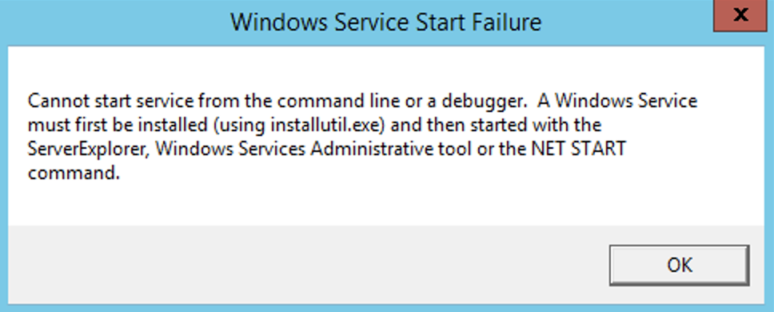

<!-- START doctoc generated TOC please keep comment here to allow auto update -->
<!-- DON'T EDIT THIS SECTION, INSTEAD RE-RUN doctoc TO UPDATE -->
**Table of Contents**  *generated with [DocToc](https://github.com/thlorenz/doctoc)*

- [create an agent in Jenkins](#create-an-agent-in-jenkins)
- [install](#install)
  - [install as a service](#install-as-a-service)
    - [start service](#start-service)
    - [remove service](#remove-service)
  - [winsw](#winsw)
    - [prepare](#prepare)
    - [install and start agent service](#install-and-start-agent-service)
    - [stop services](#stop-services)
  - [Q&A](#qa)
    - [`a windows service must first be installed ( using installutil.exe )`](#a-windows-service-must-first-be-installed--using-installutilexe-)

<!-- END doctoc generated TOC please keep comment here to allow auto update -->


> references:
> - [how to create an agent node in jenkins](https://www.youtube.com/watch?v=99DddJiH7lM)
> - [Jenkins : Installing Jenkins as a Windows service](https://wiki.jenkins.io/display/JENKINS/Installing+Jenkins+as+a+Windows+service)
> - [Launch inbound agent via Windows Scheduler](https://www.jenkins.io/doc/book/managing/nodes/#launch-inbound-agent-via-windows-scheduler)
> - [installing a jenkins agent on windows (via winsw)](https://www.jenkins.io/doc/book/managing/nodes/#installing-a-jenkins-agent-on-windows)
>   - [Jenkins Tutorials : how to install jenkins agent on windows](https://www.youtube.com/watch?v=N8AQTlHoBKc)
> - [How to install Windows agents as a service?](https://docs.cloudbees.com/docs/cloudbees-ci-kb/latest/client-and-managed-masters/how-to-install-windows-agents-as-a-service)
> - [Managing agents](https://docs.cloudbees.com/docs/cloudbees-ci/latest/cloud-admin-guide/agents)
> - [* enable open-ssh in windows : Configure Cygwin’s port of OpenSSH](https://docs.cloudbees.com/docs/cloudbees-ci/latest/cloud-admin-guide/agents#_microsoft_windows)
> others
> - [Upgrading Jenkins Java version from 8 to 11](https://www.jenkins.io/doc/administration/requirements/upgrade-java-guidelines/#java-web-start)
> - [Jenkins Remoting](https://www.jenkins.io/projects/remoting/)
> - [Upgrading Windows masters and agents for 2.60.1](https://www.jenkins.io/doc/upgrade-guide/2.60/windows/)



# create an agent in Jenkins


# install
## install as a service


> reference
> windows agent:
> - [How to create an agent in Linux from console](https://support.cloudbees.com/hc/en-us/articles/115003929412-How-to-create-an-agent-in-Linux-from-console)
> - [How to Install Several Windows Agents as a Service?](https://support.cloudbees.com/hc/en-us/articles/217423827-How-to-Install-Several-Windows-Slaves-as-a-Service-)
> - [Launch Java Web Start slave agent via Windows Scheduler](https://wiki.jenkins.io/display/JENKINS/Launch+Java+Web+Start+slave+agent+via+Windows+Scheduler)
> - [Step by step guide to set up master and agent machines on Windows](https://wiki.jenkins.io/display/JENKINS/Step+by+step+guide+to+set+up+master+and+agent+machines+on+Windows)
> - [Jenkins : Installing Jenkins as a Windows service](https://wiki.jenkins.io/display/JENKINS/Installing+Jenkins+as+a+Windows+service)
>
> windows services:
> - [sc.exe query](https://docs.microsoft.com/en-us/windows-server/administration/windows-commands/sc-query)


### start service

> **[!DANGER] for [v2.0](https://github.com/jenkinsci/windows-slave-installer-module/releases/tag/windows-slave-installer-2.0)**
>
> removed:
> - Stop supporting .NET Framework 2.0 for launching agents, 4.0 is the minimum required version ([#43](https://github.com/jenkinsci/windows-slave-installer-module/pull/43)) [@NextTurn](https://github.com/NextTurn)
>   - [Windows Support Policy in Jenkins](https://www.jenkins.io/doc/administration/requirements/windows/)
> New features and improvements
> - [JENKINS-60005](https://issues.jenkins-ci.org/browse/JENKINS-60005), [JENKINS-61862](https://issues.jenkins-ci.org/browse/JENKINS-61862) - Switch to the .NET Framework 4.0 for WinSW distribution ([#43](https://github.com/jenkinsci/windows-slave-installer-module/pull/43)) [@NextTurn](https://github.com/NextTurn)
> - Use built-in WinSW features for permission elevation ans strong cryptography ([#43](https://github.com/jenkinsci/windows-slave-installer-module/pull/43)) [@NextTurn](https://github.com/NextTurn)

#### open the node connection page -> `Launch` -> `File` -> `Install as a server`


#### setup `jenkins-slave.exe`


<!--sec data-title="jenkins-slave.xml" data-id="section0" data-show=true data-collapse=true ces-->
```batch
<!--
The MIT License

Copyright (c) 2004-2017, Sun Microsystems, Inc., Kohsuke Kawaguchi, Oleg Nenashev and other contributors

Permission is hereby granted, free of charge, to any person obtaining a copy
of this software and associated documentation files (the "Software"), to deal
in the Software without restriction, including without limitation the rights
to use, copy, modify, merge, publish, distribute, sublicense, and/or sell
copies of the Software, and to permit persons to whom the Software is
furnished to do so, subject to the following conditions:

The above copyright notice and this permission notice shall be included in
all copies or substantial portions of the Software.

THE SOFTWARE IS PROVIDED "AS IS", WITHOUT WARRANTY OF ANY KIND, EXPRESS OR
IMPLIED, INCLUDING BUT NOT LIMITED TO THE WARRANTIES OF MERCHANTABILITY,
FITNESS FOR A PARTICULAR PURPOSE AND NONINFRINGEMENT. IN NO EVENT SHALL THE
AUTHORS OR COPYRIGHT HOLDERS BE LIABLE FOR ANY CLAIM, DAMAGES OR OTHER
LIABILITY, WHETHER IN AN ACTION OF CONTRACT, TORT OR OTHERWISE, ARISING FROM,
OUT OF OR IN CONNECTION WITH THE SOFTWARE OR THE USE OR OTHER DEALINGS IN
THE SOFTWARE.
-->

<!--
  Windows service definition for Jenkins agent.
  This service is powered by the WinSW project: https://github.com/kohsuke/winsw/

  You can find more information about available options here: https://github.com/kohsuke/winsw/blob/master/doc/xmlConfigFile.md
  Configuration examples are available here: https://github.com/kohsuke/winsw/tree/master/examples

  To uninstall, run "jenkins-slave.exe stop" to stop the service, then "jenkins-slave.exe uninstall" to uninstall the service.
  Both commands don't produce any output if the execution is successful.
-->
<service>
  <id>jenkins</id>
  <name>jenkins</name>
  <description>the windows agent for jenkins https://my.jenkins.com</description>
  <!--
    if you'd like to run Jenkins with a specific version of Java, specify a full path to java.exe.
    The following value assumes that you have java in your PATH.
  -->
  <executable>C:\Program Files\Java\jdk-11.0.16.1\bin\java.exe</executable>
  <arguments>-Xrs  -jar "%BASE%\agent.jar" -jnlpUrl https://my.jenkins.com.com/computer/win-server-01/slave-agent.jnlp -secret c**************************************************************1</arguments>
  <!--
    interactive flag causes the empty black Java window to be displayed.
    I'm still debugging this.
  <interactive />
  -->
  <logmode>rotate</logmode>

  <onfailure action="restart" />

  <!--
    If uncommented, download the Remoting version provided by the Jenkins master.
    Enabling for HTTP implies security risks (e.g. replacement of JAR via DNS poisoning). Use on your own risk.
    NOTE: This option may fail to work correctly (e.g. if Jenkins is located behind HTTPS with untrusted certificate).
    In such case the old agent version will be used; you can replace slave.jar manually or to specify another download URL.
  -->
  <download from="https://my.jenkins.com.com/jnlpJars/agent.jar" to="%BASE%\agent.jar"/>
  <!--
    In the case WinSW gets terminated and leaks the process, we want to abort
    these runaway JAR processes on startup to prevent "Slave is already connected errors" (JENKINS-28492).
  -->
  <extensions>
    <!-- This is a sample configuration for the RunawayProcessKiller extension. -->
    <extension enabled="true"
               className="winsw.Plugins.RunawayProcessKiller.RunawayProcessKillerExtension"
               id="killOnStartup">
      <pidfile>%BASE%\jenkins_agent.pid</pidfile>
      <stopTimeout>5000</stopTimeout>
      <stopParentFirst>false</stopParentFirst>
    </extension>
  </extensions>

  <!-- See referenced examples for more options -->

</service>
```
<!--endsec-->

#### install and start service by `cmd` -> `sc.exe`

> [!NOTE]
> - references:
>   - [windows_slave_installer](https://github.com/jenkinsci/windows-slave-installer-module/tree/windows-slave-installer-1.9/src/main/resources/org/jenkinsci/modules/windows_slave_installer)
>   - [jenkins-slave.xml](https://github.com/jenkinsci/windows-slave-installer-module/blob/windows-slave-installer-1.9/src/main/resources/org/jenkinsci/modules/windows_slave_installer/jenkins-slave.xml)
>   - [jenkins-slave.exe.config](https://github.com/jenkinsci/windows-slave-installer-module/blob/windows-slave-installer-1.9/src/main/resources/org/jenkinsci/modules/windows_slave_installer/jenkins-slave.exe.config)
>   - [Messages.properties](https://github.com/jenkinsci/windows-slave-installer-module/blob/windows-slave-installer-1.9/src/main/resources/org/jenkinsci/modules/windows_slave_installer/Messages.properties)
> - [sc.exe reference](https://learn.microsoft.com/en-US/windows-server/administration/windows-commands/sc-create)
> - [Create a user-defined service](https://learn.microsoft.com/en-us/troubleshoot/windows-client/deployment/create-user-defined-service?source=recommendations)
> - use `instsrv` instead of `sc.exe`:
>   - Run `path\to\instsrv` "Jenkins Slave" `path\to\srvany.exe`
>   - Run `regedit`
>   - Create `HKEY_LOCAL_MACHINE\SYSTEM\CurrentControlSet\Services\Jenkins Slave\Parameters`
>   - Add the following registry keys:
>     - `HKEY_LOCAL_MACHINE\SYSTEM\CurrentControlSet\Services\Jenkins Slave\Description="Jenkins Continuous Integration Slave"`
>     - `HKEY_LOCAL_MACHINE\SYSTEM\CurrentControlSet\Services\Jenkins Slave\Parameters\AppParameters="-jar path\to\slave.jar -jnlpUrl http://jenkins-master:8080/computer/jenkins-slave/slave-agent.jnlp"`
>     - `HKEY_LOCAL_MACHINE\SYSTEM\CurrentControlSet\Services\Jenkins Slave\Parameters\Application="C:\WINDOWS\system32\java.exe"`


> [!TIP]
> - [Configure Slave Service to Run as Domain User (Windows Server 2008 R2 x64)](https://wiki.jenkins.io/display/JENKINS/Installing+Jenkins+as+a+Windows+service#InstallingJenkinsasaWindowsservice-ConfigureSlaveServicetoRunasDomainUser(WindowsServer2008R2x64))
>   - regex: `HKEY_LOCAL_MACHINE\SYSTEM\CurrentControlSet\Control\SecurePipeServers\winreg`
> - [Install Slave as a Windows service (cmd version)](https://wiki.jenkins.io/display/JENKINS/Installing+Jenkins+as+a+Windows+service#InstallingJenkinsasaWindowsservice-InstallSlaveasaWindowsservice(cmdversion))
>   ```batch
>   sc.exe create "<serviceKey>" start= auto binPath= "<path to jenkins-slave.exe>" DisplayName= "<service display name>"
>   ```
>   - `<serviceKey>` is the name of the registry key that will define the service (this will not be displayed)
>   - `<service>` display name is the label that will identify the service in the service manager interface
>   - also can be checked in `Computer\HKEY_LOCAL_MACHINE\SYSTEM\CurrentControlSet\services\<serviceKey>`
> - [Launch Java Web Start slave agent via Windows Scheduler](https://wiki.jenkins.io/display/JENKINS/Installing+Jenkins+as+a+Windows+service#InstallingJenkinsasaWindowsservice-LaunchJavaWebStartslaveagentviaWindowsScheduler)
> - [Uninstallation](https://wiki.jenkins.io/display/JENKINS/Installing+Jenkins+as+a+Windows+service#InstallingJenkinsasaWindowsservice-Uninstallation)


```batch
C:\WINDOWS\system32> sc.exe create "jenkins" start= auto binPath= "E:\devops\jenkins-slave.exe" DisplayName= "jenkins"
[SC] CreateService SUCCESS

C:\WINDOWS\system32> sc description jenkins "the windows agent for jenkins <https://<JENKINS_URL>>"
[SC] ChangeServiceConfig2 SUCCESS

C:\WINDOWS\system32> sc start jenkins
SERVICE_NAME: jenkins
        TYPE               : 10  WIN32_OWN_PROCESS
        STATE              : 2  START_PENDING
                                (STOPPABLE, NOT_PAUSABLE, ACCEPTS_SHUTDOWN)
        WIN32_EXIT_CODE    : 0  (0x0)
        SERVICE_EXIT_CODE  : 0  (0x0)
        CHECKPOINT         : 0x0
        WAIT_HINT          : 0x0
        PID                : 27784
        FLAGS              :
```

- service configuration
  ```batch
  C:\WINDOWS\system32> sc config jenkins start= disabled
  [SC] ChangeServiceConfig SUCCESS

  C:\WINDOWS\system32> sc query jenkins
  SERVICE_NAME: jenkins
          TYPE               : 10  WIN32_OWN_PROCESS
          STATE              : 4  RUNNING
                                  (STOPPABLE, NOT_PAUSABLE, ACCEPTS_SHUTDOWN)
          WIN32_EXIT_CODE    : 0  (0x0)
          SERVICE_EXIT_CODE  : 0  (0x0)
          CHECKPOINT         : 0x0
          WAIT_HINT          : 0x0
  ```

- list all services
  ```batch
  C:\WINDOWS\system32> sc queryex type=service state=all | find /i "SERVICE_NAME:"
  SERVICE_NAME: AJRouter
  SERVICE_NAME: ALG
  SERVICE_NAME: AppIDSvc
  SERVICE_NAME: Appinfo
  SERVICE_NAME: AppMgmt
  SERVICE_NAME: AppReadiness
  SERVICE_NAME: AppVClient
  SERVICE_NAME: AppXSvc
  SERVICE_NAME: AudioEndpointBuilder
  SERVICE_NAME: Audiosrv
  SERVICE_NAME: AxInstSV
  ...
  ```

- setup service
  

### remove service


> [!TIP]
> or remove `HKEY_LOCAL_MACHINE\SYSTEM\CurrentControlSet\Services\jenkins`

```batch
C:\WINDOWS\system32> sc stop jenkins
SERVICE_NAME: jenkins
        TYPE               : 10  WIN32_OWN_PROCESS
        STATE              : 3  STOP_PENDING
                                (STOPPABLE, NOT_PAUSABLE, ACCEPTS_SHUTDOWN)
        WIN32_EXIT_CODE    : 0  (0x0)
        SERVICE_EXIT_CODE  : 0  (0x0)
        CHECKPOINT         : 0x0
        WAIT_HINT          : 0x0

C:\WINDOWS\system32> sc delete jenkins
[SC] DeleteService SUCCESS

C:\WINDOWS\system32> taskkill /F /IM mmc.exe
SUCCESS: The process "mmc.exe" with PID 19572 has been terminated.
```

## [winsw](https://github.com/winsw/winsw)


> references:
> - [winsw/winsw](https://github.com/winsw/winsw)
> - [winsw release](https://github.com/winsw/winsw/releases)
> - [winsw installation guide](https://github.com/winsw/winsw/blob/master/doc/installation.md)


### prepare
#### download `agent.jar`
```batch
> curl -s -o j:\jenkins\agent.jar https://my.jenkins.com/jnlpJars/agent.jar
```

#### download `winws.exe` and rename


> references:
> - [WinSW v2.11.0](https://github.com/winsw/winsw/releases/tag/v2.11.0)


```batch
REM x64
> curl -s -o j:\jenkins\jenkins-agent.exe https://github.com/winsw/winsw/releases/download/v2.11.0/WinSW-x64.exe

REM x64
> curl -s -o j:\jenkins\jenkins-agent.exe https://github.com/winsw/winsw/releases/download/v2.11.0/WinSW-x86.exe
```

#### create xml


> references:
> - [Runaway Process Killer extension](https://github.com/winsw/winsw/blob/master/doc/extensions/runawayProcessKiller.md)
> - [jvm 11 download](https://www.oracle.com/java/technologies/javase/jdk11-archive-downloads.html)
> - [XML configuration file](https://github.com/winsw/winsw/blob/master/doc/xmlConfigFile.md)
> - [YAML configuration file](https://github.com/winsw/winsw/blob/master/doc/yamlConfigFile.md)
> - [sample xml](https://github.com/winsw/winsw/tree/v3/samples)
>   - [complete.xml](https://github.com/winsw/winsw/blob/v3/samples/complete.xml)
>   - [jenkins.xml](https://github.com/winsw/winsw/blob/v3/samples/jenkins.xml)
>   - [minimal](https://github.com/winsw/winsw/blob/v3/samples/minimal.xml)
>   - [shared-directory-mapper.xml](https://github.com/winsw/winsw/blob/v3/samples/shared-directory-mapper.xml)
> - [examples](https://github.com/winsw/winsw/tree/master/examples)
>   - [sample-allOption.yml](https://github.com/winsw/winsw/blob/master/examples/sample-allOption.yml)
>   - [sample-allOptions.xml](https://github.com/winsw/winsw/blob/master/examples/sample-allOptions.xml)
>   - [sample-minimal.xml)](https://github.com/winsw/winsw/blob/master/examples/sample-minimal.xml)


```batch
J:\jenkins> cat > j:\jenkins\jenkins-agent.xml << EOF
<service>
  <id>jenkins-agent</id>
  <name>jenkins-agent</name>
  <description>the jenkins agent process connect to https://my.jenkins.com.</description>
  <!-- to specific the java version -->
  <executable>C:\Program Files\Java\jdk-11.0.16.1\bin\java.exe</executable>
  <!-- get from jenkins agent page -->
  <arguments>-jar %BASE%\agent.jar -jnlpUrl https://my.jenkins.com/computer/windows-agent/jenkins-agent.jnlp -secret f**************************************************************8 -workDir "J:\jenkins"</arguments>
  <log mode="roll" />
  <onfailure action="restart" />
  <!-- download the Remoting version provided by the Jenkins master. -->
  <download from="https://my.jenkins.com.com/jnlpJars/agent.jar" to="%BASE%\agent.jar"/>
</service>
EOF
```

> **[!TIP] tips on xml label**
> - `<onfailure action="restart" />`:
>
>   
>
> - `<download from="https://my.jenkins.com.com/jnlpJars/agent.jar" to="%BASE%\agent.jar"/>`:
>
>   `2022-11-30 06:31:38,022 INFO  - Downloading: https://my.jenkins.com/jnlpJars/agent.jar to J:\jenkins\agent.jar. failOnError=False`


### install and start agent service


> references:
> - [CLI commands](https://github.com/winsw/winsw/blob/v3/docs/cli-commands.md)


> [!TIP]
> - check available cli commands
>   ```batch
>   J:\jenkins> jenkins-agent.exe --help
>   A wrapper binary that can be used to host executables as Windows services
>
>   Usage: winsw <command> [<args>]
>          Missing arguments triggers the service mode
>
>   Available commands:
>     install     install the service to Windows Service Controller
>     uninstall   uninstall the service
>     start       start the service (must be installed before)
>     stop        stop the service
>     stopwait    stop the service and wait until it's actually stopped
>     restart     restart the service
>     restart!    self-restart (can be called from child processes)
>     status      check the current status of the service
>     test        check if the service can be started and then stopped
>     testwait    starts the service and waits until a key is pressed then stops the service
>     version     print the version info
>     help        print the help info (aliases: -h,--help,-?,/?)
>
>   Extra options:
>     /redirect   redirect the wrapper's STDOUT and STDERR to the specified file
>
>   WinSW 2.11.0.0
>   More info: https://github.com/winsw/winsw
>   Bug tracker: https://github.com/winsw/winsw/issues
>   ```

```batch
J:\jenkins> jenkins-agent.exe install
2022-11-30 06:09:59,907 INFO  - Installing service 'jenkins (jenkins)'...
2022-11-30 06:10:00,033 INFO  - Service 'jenkins (jenkins)' was installed successfully.

J:\jenkins> sc query jenkins
SERVICE_NAME: jenkins
        TYPE               : 10  WIN32_OWN_PROCESS
        STATE              : 1  STOPPED
        WIN32_EXIT_CODE    : 1077  (0x435)
        SERVICE_EXIT_CODE  : 0  (0x0)
        CHECKPOINT         : 0x0
        WAIT_HINT          : 0x0


REM start service
J:\jenkins> jenkins-agent.exe start
2022-11-30 06:11:26,118 INFO  - Starting service 'jenkins (jenkins)'...
2022-11-30 06:11:27,510 INFO  - Service 'jenkins (jenkins)' started successfully.

J:\jenkins> sc query jenkins
SERVICE_NAME: jenkins
        TYPE               : 10  WIN32_OWN_PROCESS
        STATE              : 2  START_PENDING
                                (STOPPABLE, NOT_PAUSABLE, ACCEPTS_SHUTDOWN)
        WIN32_EXIT_CODE    : 0  (0x0)
        SERVICE_EXIT_CODE  : 0  (0x0)
        CHECKPOINT         : 0x0
        WAIT_HINT          : 0x0

J:\jenkins> sc query jenkins
SERVICE_NAME: jenkins
        TYPE               : 10  WIN32_OWN_PROCESS
        STATE              : 4  RUNNING
                                (STOPPABLE, NOT_PAUSABLE, ACCEPTS_SHUTDOWN)
        WIN32_EXIT_CODE    : 0  (0x0)
        SERVICE_EXIT_CODE  : 0  (0x0)
        CHECKPOINT         : 0x0
        WAIT_HINT          : 0x0
```


<!--sec data-title="jenkins-agent.wrapper.log" data-id="section1" data-show=true data-collapse=true ces-->
```bash
2022-11-30 06:31:37,126 DEBUG - Starting WinSW in console mode
2022-11-30 06:31:37,166 INFO  - Starting service 'jenkins (jenkins)'...
2022-11-30 06:31:37,903 DEBUG - Starting WinSW in service mode
2022-11-30 06:31:37,940 INFO  - Service 'jenkins (jenkins)' started successfully.
2022-11-30 06:31:38,022 INFO  - Downloading: https://my.jenkins.com/jnlpJars/agent.jar to J:\jenkins\agent.jar. failOnError=False
2022-11-30 06:31:38,945 INFO  - Skipped downloading unmodified resource 'https://my.jenkins.com/jnlpJars/agent.jar'
2022-11-30 06:31:39,029 INFO  - Starting C:\Program Files\Java\jdk-11.0.16.1\bin\java.exe -jar agent.jar -jnlpUrl https://my.jenkins.com/computer/windows-agent/jenkins-agent.jnlp -secret f**************************************************************8 -workDir "J:\jenkins"
2022-11-30 06:31:39,066 INFO  - Started process 4928
2022-11-30 06:31:39,079 DEBUG - Forwarding logs of the process System.Diagnostics.Process (java) to WinSW.RollingLogAppender
2022-11-30 06:31:44,302 DEBUG - Starting WinSW in console mode
```
<!--endsec-->

<!--sec data-title="jenkins-agent.err.log" data-id="section2" data-show=true data-collapse=true ces-->
```bash
Nov 30, 2022 6:31:39 AM org.jenkinsci.remoting.engine.WorkDirManager initializeWorkDir
INFO: Using J:\jenkins\remoting as a remoting work directory
Nov 30, 2022 6:31:39 AM org.jenkinsci.remoting.engine.WorkDirManager setupLogging
INFO: Both error and output logs will be printed to J:\jenkins\remoting
Nov 30, 2022 6:31:40 AM hudson.remoting.jnlp.Main createEngine
INFO: Setting up agent: sc-jenkins112
Nov 30, 2022 6:31:40 AM hudson.remoting.Engine startEngine
INFO: Using Remoting version: 3044.vb_940a_a_e4f72e
Nov 30, 2022 6:31:40 AM org.jenkinsci.remoting.engine.WorkDirManager initializeWorkDir
INFO: Using J:\jenkins\remoting as a remoting work directory
Nov 30, 2022 6:31:40 AM hudson.remoting.jnlp.Main$CuiListener status
INFO: WebSocket connection open
Nov 30, 2022 6:31:40 AM hudson.remoting.jnlp.Main$CuiListener status
INFO: Connected
WARNING: An illegal reflective access operation has occurred
WARNING: Illegal reflective access by org.jenkinsci.plugins.envinject.service.EnvInjectMasterEnvVarsSetter to method java.lang.Class.getDeclaredFields0(boolean)
WARNING: Please consider reporting this to the maintainers of org.jenkinsci.plugins.envinject.service.EnvInjectMasterEnvVarsSetter
WARNING: Use --illegal-access=warn to enable warnings of further illegal reflective access operations
WARNING: All illegal access operations will be denied in a future release
```
<!--endsec-->

### stop services
```batch
J:\jenkins> jenkins-agent.exe stop
2022-11-30 06:15:28,194 INFO  - Stopping service 'jenkins (jenkins)'...
2022-11-30 06:15:28,216 INFO  - Service 'jenkins (jenkins)' stopped successfully.

J:\jenkins> sc query jenkins
SERVICE_NAME: jenkins
        TYPE               : 10  WIN32_OWN_PROCESS
        STATE              : 1  STOPPED
        WIN32_EXIT_CODE    : 0  (0x0)
        SERVICE_EXIT_CODE  : 0  (0x0)
        CHECKPOINT         : 0x0
        WAIT_HINT          : 0x0
```

## Q&A
### `a windows service must first be installed ( using installutil.exe )`



> [!TIP]
> - references:
> - [Windows service start failure: Cannot start service from the command line or debugger [duplicate]](https://stackoverflow.com/a/11573773/2940319)
> - [Run a Windows Service as a console app]()
> - [How to: Install and uninstall Windows services](https://learn.microsoft.com/en-us/dotnet/framework/windows-services/how-to-install-and-uninstall-services)
>   - [Install using InstallUtil.exe utility](https://learn.microsoft.com/en-us/dotnet/framework/windows-services/how-to-install-and-uninstall-services#install-using-installutilexe-utility)

```batch
C:\WINDOWS\system32> cd C:\Windows\Microsoft.NET\Framework\v4.0.30319
C:\Windows\Microsoft.NET\Framework\v4.0.30319> InstallUtil.exe J:\jenkins\jenkins-slave.exe
Microsoft (R) .NET Framework Installation utility Version 4.8.3761.0
Copyright (C) Microsoft Corporation.  All rights reserved.


Running a transacted installation.

Beginning the Install phase of the installation.
See the contents of the log file for the J:\jenkins\jenkins-slave.exe assembly's progress.
The file is located at J:\jenkins\jenkins-slave.InstallLog.
Installing assembly 'J:\jenkins\jenkins-slave.exe'.
Affected parameters are:
   logtoconsole =
   logfile = J:\jenkins\jenkins-slave.InstallLog
   assemblypath = J:\jenkins\jenkins-slave.exe
No public installers with the RunInstallerAttribute.Yes attribute could be found in the J:\jenkins\jenkins-slav
e.exe assembly.

The Install phase completed successfully, and the Commit phase is beginning.
See the contents of the log file for the J:\jenkins\jenkins-slave.exe assembly's progress.
The file is located at J:\jenkins\jenkins-slave.InstallLog.
Committing assembly 'J:\jenkins\jenkins-slave.exe'.
Affected parameters are:
   logtoconsole =
   logfile = J:\jenkins\jenkins-slave.InstallLog
   assemblypath = J:\jenkins\jenkins-slave.exe
No public installers with the RunInstallerAttribute.Yes attribute could be found in the J:\jenkins\jenkins-slav
e.exe assembly.
Remove InstallState file because there are no installers.

The Commit phase completed successfully.

The transacted install has completed.
```
