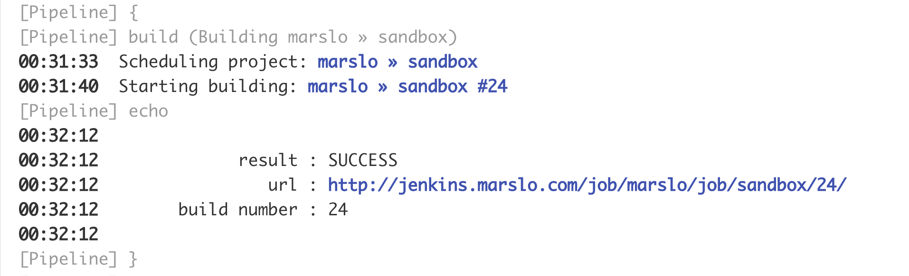
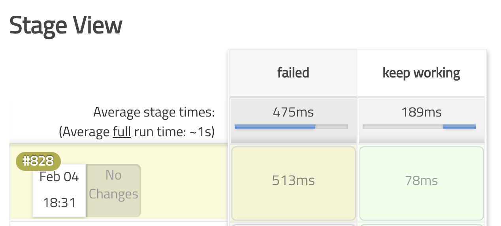
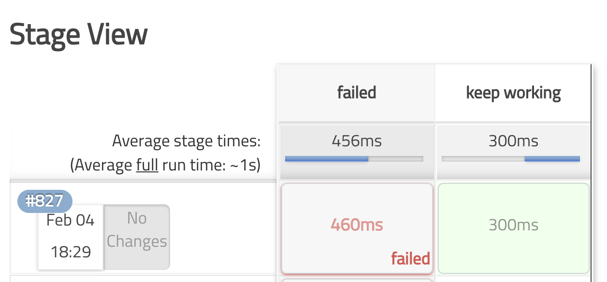
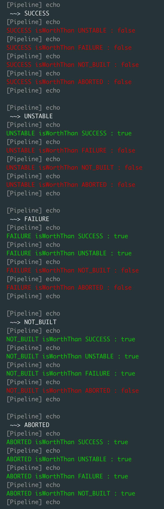

<!-- START doctoc generated TOC please keep comment here to allow auto update -->
<!-- DON'T EDIT THIS SECTION, INSTEAD RE-RUN doctoc TO UPDATE -->
**Table of Contents**  *generated with [DocToc](https://github.com/thlorenz/doctoc)*

- [build & current build](#build--current-build)
  - [get all current build parameters](#get-all-current-build-parameters)
  - [check previous build status](#check-previous-build-status)
  - [Stop the current build](#stop-the-current-build)
  - [get current build info](#get-current-build-info)
  - [trigger downstream builds](#trigger-downstream-builds)
  - [get changelogs](#get-changelogs)
  - [others](#others)
- [stage and build](#stage-and-build)
  - [`warnError`](#warnerror)
  - [`catchError`](#catcherror)
  - [`error`](#error)
  - [`unstable`](#unstable)
  - [get stage of a build](#get-stage-of-a-build)
- [Build Result](#build-result)
  - [isWorthThan](#isworththan)

<!-- END doctoc generated TOC please keep comment here to allow auto update -->

## build & current build
### [get all current build parameters](https://stackoverflow.com/a/38130496/2940319)
```groovy
import hudson.model.*

timestamps { ansiColor('xterm') {
  node('master') {
    def parameters = currentBuild.rawBuild?.actions.find{ it instanceof ParametersAction }?.parameters
    parameters.each {
      println "parameter ${it.name}:"
      println it.dump()
      println "-" * 80
    }
  }
}}
```

### [check previous build status](https://support.cloudbees.com/hc/en-us/articles/230922188-Pipeline-How-can-I-check-previous-build-status-in-a-Pipeline-Script-)


> useful info:
> ```groovy
> method hudson.model.Run getPreviousBuild
> method hudson.model.Run getResult
> method org.jenkinsci.plugins.workflow.support.steps.build.RunWrapper getRawBuild
> ```


```groovy
if( ! hudson.model.Result.SUCCESS.equals(currentBuild.rawBuild.getPreviousBuild()?.getResult()) ) {
  echo "last build failed"
}
```

### Stop the current build
#### [stop current](https://devops.stackexchange.com/a/9545/3503)
```groovy
// stop and show status to UNSTABLE
if ( 'UNSTABLE' == currentBuild.result ) {
  currentBuild.getRawBuild().getExecutor().interrupt(Result.UNSTABLE)
}
```
- or
  ```groovy
  // stop and show status to NOT_BUILT
  if ( 'ABORTED' == currentBuild.result ) {
    currentBuild.rawBuild.executor.interrupt( Result.NOT_BUILT )
  }
  ```

- [or](https://stackoverflow.com/a/59062652/2940319)
  ```groovy
  import hudson.model.Result
  import hudson.model.Run
  import jenkins.model.CauseOfInterruption

  Run previousBuild = currentBuild.getPreviousBuildInProgress()
  while ( previousBuild ) {
    if ( previousBuild.isInProgress() && previousBuild.getExecutor() ) {
      println ">> aborting previous build #${previousBuild.number}"
      def cause = { "interrupted by build #${currentBuild.getId()}" as String } as CauseOfInterruption
      previousBuild.getExecutor().interrupt( Result.ABORTED, cause )
    }
    previousBuilds = currentBuild.getPreviousBuildInProgress()
  }
  ```

- abort previous running build
  ```groovy
  import hudson.model.Result
  import hudson.model.Run
  import jenkins.model.CauseOfInterruption

  def abortPreviousBuilds() {
    Run previousBuild = currentBuild.getPreviousBuildInProgress()

    while (previousBuild != null) {
      if (previousBuild.isInProgress()) {
        def executor = previousBuild.getExecutor()
        if (executor != null) {
          println ">> Aborting older build #${previousBuild.number}"
          def cause = { "interrupted by build #${currentBuild.getId()}" as String } as CauseOfInterruption
          executor.interrupt(Result.ABORTED, cause)
        }
      }
      previousBuild = previousBuild.getPreviousBuildInProgress()
    }
  }
  ```

- [or Stopping Jenkins job in case newer one is started](https://stackoverflow.com/a/44326188/2940319)
  ```groovy
  import hudson.model.Result
  import jenkins.model.CauseOfInterruption

  //iterate through current project runs
  build.getProject()._getRuns().each { id, run ->
    def exec = run.getExecutor()
    //if the run is not a current build and it has executor (running) then stop it
    if( run!=build && exec!=null ) {
      //prepare the cause of interruption
      def cause = new CauseOfInterruption() {
        public String getShortDescription() {
          return "interrupted by build #${build.getId()}"
        }
      }
      exec.interrupt( Result.ABORTED, cause )
    }
  }

  //just for test do something long...
  Thread.sleep(10000)
  ```

#### [stop all](https://stackoverflow.com/a/26306081/2940319)
```groovy
Thread.getAllStackTraces().keySet().each() {
  t -> if (t.getName()=="YOUR THREAD NAME" ) { t.interrupt(); }          // or t.stop();
}

// and
Jenkins.instance.getItemByFullName("JobName")
                .getBuildByNumber(JobNumber)
                .finish(
                        hudson.model.Result.ABORTED,
                        new java.io.IOException("Aborting build")
                );
```

### get current build info

> [!TIP]
> reference:
> - [How to get Jenkins build job details?](https://medium.com/faun/how-to-get-jenkins-build-job-details-b8c918087030)

#### get `BUILD_NUMBER`
```groovy
Jenkins.instance.getItemByFullName(env.JOB_NAME).getLastBuild().getNumber().toInteger()
```
- get previous build number
  ```groovy
  currentBuild.previousBuild.number
  ```

#### get build id of lastSuccessfulBuild
- get via api
  ```groovy
  sh """
    curl -sSLg 'https://<jenkins.domain.com>/job/<job-name>/api/json' -o 'output.json'
  """
  def data = readJSON file: 'output.json'
  println data.lastSuccessfulBuild.number
  ```

- get via `Jenkins.instance.getItemByFullName(env.JOB_NAME)`
  ```groovy
  Jenkins.instance.getItemByFullName(env.JOB_NAME).lastSuccessfulBuild.number
  ```

- get last build id
  ```groovy
  Jenkins.instance.getItemByFullName(env.JOB_NAME).getLastBuild().getNumber().toInteger()
  ```

### trigger downstream builds
```groovy
timestamps { ansiColor('xterm') {
  node('master') {
    stage('trigger downstream') {
      buildRes = build job: '/marslo/downstream',
                       propagate: false,
                       parameters: [
                         string( name: 'stringParams', value: 'string'      ) ,
                         string( name: 'choiceParams', value: 'validChoice' ) ,
                         booleanParam( name: 'booleanParams', value: false  ) ,
                       ]
      String log = """
              result : ${buildRes.result}
                 url : ${buildRes.absoluteUrl}
        build number : ${buildRes.number.toString()}
      """
      println log

    } // stage : trigger downstream
  } // node : master
}} // ansiColor | timestamps
```

#### trigger downstream with active choice parameters
> [/marslo/sandbox](properties.html#mixed-parameters)

```groovy
timestamps { ansiColor('xterm') {
  podTemplate(cloud: 'DevOps Kubernetes') { node(POD_LABEL) {
    List<ParameterValue> newParams = [
      [$class: 'StringParameterValue' , name: 'lastName'  , value: 'Jiao'    ] ,
      [$class: 'StringParameterValue' , name: 'firstName' , value: 'Marslo'  ] ,
      [$class: 'StringParameterValue' , name: 'provinces' , value: 'Gansu'   ] ,
      [$class: 'StringParameterValue' , name: 'cities'    , value: 'Lanzhou,Dingxi' ] ,
      [$class: 'BooleanParameterValue', name: 'notify', value: false]
    ]
    def res = build ( job: '/marslo/sandbox' ,
                      propagate  : false ,
                      wait       : true  ,
                      parameters: newParams
                    )
    println """
            result : ${res.result}
               url : ${res.absoluteUrl}
      build number : ${res.number.toString()}
    """
  }} // node | podTemplate
}} // ansiColor | timestamp
```



### [get changelogs](https://support.cloudbees.com/hc/en-us/articles/217630098-How-to-access-Changelogs-in-a-Pipeline-Job-)
```groovy
def changeLogSets = currentBuild.changeSets
for (int i = 0; i < changeLogSets.size(); i++) {
  def entries = changeLogSets[i].items
  for (int j = 0; j < entries.length; j++) {
    def entry = entries[j]
    echo "${entry.commitId} by ${entry.author} on ${new Date(entry.timestamp)}: ${entry.msg}"
    def files = new ArrayList(entry.affectedFiles)
    for (int k = 0; k < files.size(); k++) {
      def file = files[k]
      echo "  ${file.editType.name} ${file.path}"
    }
  }
}
```
- [Pipeline Supporting APIs Plugin](https://wiki.jenkins-ci.org/display/JENKINS/Pipeline+Supporting+APIs+Plugin) older than `2.2`
  ```groovy
  def changeLogSets = currentBuild.rawBuild.changeSets
  for (int i = 0; i < changeLogSets.size(); i++) {
    def entries = changeLogSets[i].items
    for (int j = 0; j < entries.length; j++) {
      def entry = entries[j]
      echo "${entry.commitId} by ${entry.author} on ${new Date(entry.timestamp)}: ${entry.msg}"
      def files = new ArrayList(entry.affectedFiles)
      for (int k = 0; k < files.size(); k++) {
        def file = files[k]
        echo "  ${file.editType.name} ${file.path}"
      }
    }
  }
  ```

### others
- [`Thread.currentThread().executable`](https://stackoverflow.com/a/26730819/2940319)
  ```groovy
  import hudson.model.*

  def build = Thread.currentThread().executable
  def buildNumber = build.number
  def workspace   = build.getEnvVars()["WORKSPACE"]'
  def jobname     = build.getEnvVars()["JOB_NAME"]
  ...
  ```

## stage and build


> reference:
> - [Jenkins Pipeline Stage Result Visualization Improvements](https://www.jenkins.io/blog/2019/07/05/jenkins-pipeline-stage-result-visualization-improvements/)
> - [org.jenkinsci.plugins.workflow.steps.Step](https://javadoc.jenkins.io/plugin/workflow-step-api/org/jenkinsci/plugins/workflow/steps/Step.html)
> - [/plugin/workflow-basic-steps/org/jenkinsci/plugins/workflow/steps/](https://javadoc.jenkins.io/plugin/workflow-basic-steps/org/jenkinsci/plugins/workflow/steps/)
> - [pipeline-stage-step-plugin/blob/master/src/main/java/org/jenkinsci/plugins/workflow/support/steps/StageStep.java](https://github.com/jenkinsci/pipeline-stage-step-plugin/blob/master/src/main/java/org/jenkinsci/plugins/workflow/support/steps/StageStep.java)
> - [org.jenkinsci.plugins.workflow.steps.CatchErrorStep](https://javadoc.jenkins.io/plugin/workflow-basic-steps/org/jenkinsci/plugins/workflow/steps/CatchErrorStep.html)
> - [org.jenkinsci.plugins.workflow.steps.WarnErrorStep](https://javadoc.jenkins.io/plugin/workflow-basic-steps/org/jenkinsci/plugins/workflow/steps/WarnErrorStep.html)
> - [warnError: Catch error and set build and stage result to unstable](https://www.jenkins.io/doc/pipeline/steps/workflow-basic-steps/#warnerror-catch-error-and-set-build-and-stage-result-to-unstable)
> - [catchError: Catch error and set build result to failure](https://www.jenkins.io/doc/pipeline/steps/workflow-basic-steps/#catcherror-catch-error-and-set-build-result-to-failure)
> - [Set a stage status in Jenkins Pipelines](https://stackoverflow.com/a/64746938/2940319)
> - [How to time out Jenkins Pipeline stage and keep the pipeline running?](https://e.printstacktrace.blog/how-to-time-out-jenkins-pipeline-stage-and-keep-the-pipeline-running/)


### `warnError`
```groovy
node('master') {
  warnError('Script failed!') {
    sh('false')
  }
}
```


### [`catchError`](https://issues.jenkins.io/browse/JENKINS-57826)
```groovy
stage('false') {
  catchError(
    buildResult : 'SUCCESS',
        message : 'stage failed, but build succeed',
    stageResult : 'FAILURE'
  ){
    sh label: env.STAGE_NAME,
       script: 'exit 2'
  }
}
```

- or [just be simply](https://github.com/jenkinsci/github-autostatus-plugin/issues/47#issue-479506531):
  ```groovy
   catchError(buildResult: 'SUCCESS', stageResult: 'FAILURE') {
     sh('false')
   }
  ```


- set unstable
  ```groovy
  catchError(message: 'script failed', buildResult: 'UNSTABLE', stageResult: 'UNSTABLE') {
    sh('false')
  }
  ```
- [catchError unstable](../../screenshot/jenkins/catchError-unstable.png)

### [`error`](https://www.jenkins.io/doc/pipeline/steps/workflow-basic-steps/#error-error-signal)
> Signals an error. Useful if you want to conditionally abort some part of your program. You can also just `throw new Exception()`, but this step will avoid printing a stack trace

```groovy
error( 'failed the build' )
```

### [`unstable`](https://www.jenkins.io/doc/pipeline/steps/workflow-basic-steps/#unstable-set-stage-result-to-unstable)
> Prints a message to the log and sets the overall build result and the stage result to UNSTABLE. The message will also be associated with the stage result and may be shown in visualizations.

```groovy
unstable( 'unstable the build' )
```

### get stage of a build
- get stage name
  ```groovy
  stage('build') {
    println "${env.STAGE_NAME}"
  }
  ```
- [get all stages of a build](https://stackoverflow.com/a/59854515/2940319)
  ```groovy
  WorkflowRun run = Jenkins.instance.getItemByFullName("####YOUR_JOB_NAME####")._getRuns()[0]
  FlowExecution exec = run.getExecution()
  PipelineNodeGraphVisitor visitor = new PipelineNodeGraphVisitor(run)
  def flowNodes = visitor.getPipelineNodes()

  for (Iterator iterator = flowNodes.iterator(); iterator.hasNext();) {
    def node = iterator.next()
    if (node.getType() == FlowNodeWrapper.NodeType.STAGE) {
      String stageName = node.getDisplayName()
      def stageResult = node.getStatus().getResult()

      println "Result of stage ${stageName} is ${stageResult}"
    }
  }
  ```
  or
  ```groovy
  import org.jenkinsci.plugins.workflow.graph.FlowGraphWalker
  import org.jenkinsci.plugins.workflow.graph.FlowNode

  try {
    // just for demo, a success step and a failure step
    node {
      sh 'true'
      sh 'false'
    }
  } finally {
    FlowGraphWalker walker = new FlowGraphWalker(currentBuild.rawBuild.getExecution())
    for (FlowNode flowNode: walker) {
      // do whatever you want with flowNode
      echo flowNode.dump()
    }
  }
  ```

## Build Result
> reference
> - [How to manipulate the build result of a Jenkins pipeline job](https://stackoverflow.com/a/53731567/2940319)
> - [How to set current build result in Pipeline](https://support.cloudbees.com/hc/en-us/articles/218554077-how-to-set-current-build-result-in-pipeline)
> - [hudson.module.Result API](https://javadoc.jenkins.io/hudson/model/class-use/Result.html)

### isWorthThan
```groovy
import hudson.model.Result

ansiColor('xterm') {
  List r = [ 'SUCCESS', 'UNSTABLE', 'FAILURE', 'NOT_BUILT', 'ABORTED' ]

  r.each { b ->
    println " ~~> ${b}"
    Result base = Result.fromString(b)
    ( r - b ).each { o ->
      Result x = Result.fromString(o)
      res = base.isWorseThan(x)
      color.echo( "${res ? 'green' : 'red'}", "${base} isWorthThan ${x} : ${res}" )
    }
  }
} // ansiColor
```


