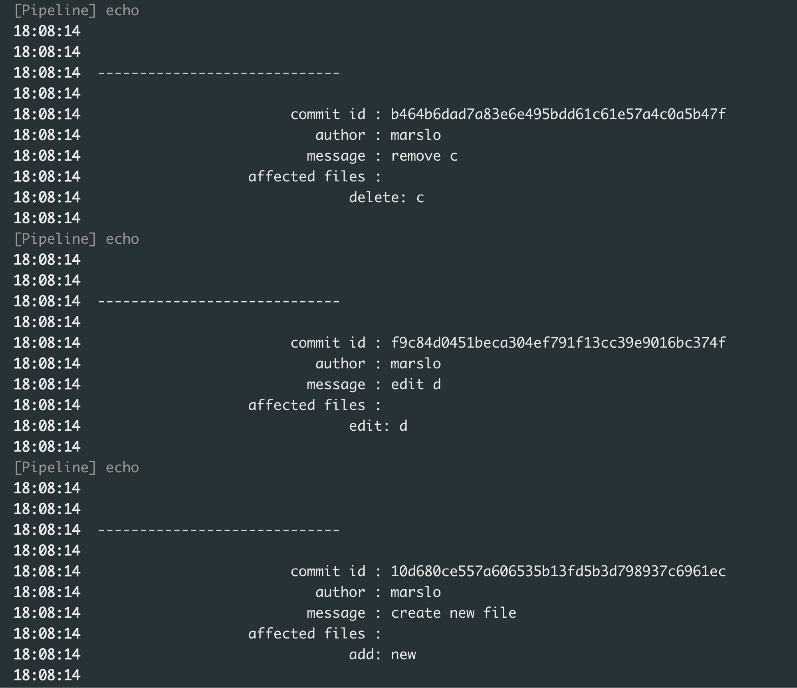

<!-- START doctoc generated TOC please keep comment here to allow auto update -->
<!-- DON'T EDIT THIS SECTION, INSTEAD RE-RUN doctoc TO UPDATE -->

- [jenkins API](#jenkins-api)
  - [update node name](#update-node-name)
  - [raw build](#raw-build)
  - [manager.build.result.isBetterThan](#managerbuildresultisbetterthan)
- [customized build](#customized-build)
  - [display name](#display-name)
  - [description](#description)
- [exception](#exception)
  - [using `hudson.AbortException`](#using-hudsonabortexception)
  - [show catch message](#show-catch-message)

<!-- END doctoc generated TOC please keep comment here to allow auto update -->


> reference:
> - [jenkins-infra/pipeline-library](https://github.com/jenkins-infra/pipeline-library)
> - [Pipeline Examples](https://www.jenkins.io/doc/pipeline/examples/)
> - [Jenkins Pipeline Syantx](https://kb.novaordis.com/index.php/Jenkins_Pipeline_Syntax)
> - [Jenkins Pipeline Cookbook](https://e.printstacktrace.blog/jenkins-pipeline-cookbook/)
> - [Pipeline Steps Reference](https://www.jenkins.io/doc/pipeline/steps/)
>   - [org.jenkinsci.plugins.workflow.steps](https://javadoc.jenkins.io/plugin/workflow-basic-steps/org/jenkinsci/plugins/workflow/steps/package-summary.html)
> - [Pipeline Utility Steps](https://www.jenkins.io/doc/pipeline/steps/pipeline-utility-steps/#pipeline-utility-steps)
> - [Jenkins Pipeline Cookbook](https://e.printstacktrace.blog/jenkins-pipeline-cookbook/)
> - [* declarative-pipeline-examples](https://github.com/devopscube/declarative-pipeline-examples)
> - [Class Exception](https://docs.oracle.com/javase/8/docs/api/java/lang/Exception.html)
>   - [Class TimeoutStepExecution](https://javadoc.jenkins.io/plugin/workflow-basic-steps/org/jenkinsci/plugins/workflow/steps/TimeoutStepExecution.html)
>   - [Class TimeoutStepExecution.ExceededTimeout](https://javadoc.jenkins.io/plugin/workflow-basic-steps/org/jenkinsci/plugins/workflow/steps/TimeoutStepExecution.ExceededTimeout.html)
>   - [TimeoutStepExecution.java](https://github.com/jenkinsci/workflow-basic-steps-plugin/blob/master/src/main/java/org/jenkinsci/plugins/workflow/steps/TimeoutStepExecution.java)
> - [Understanding the Differences Between Jenkins Scripted and Declarative Pipeline: A Comprehensive Guide with Real-World Examples](https://blog.devgenius.io/understanding-the-differences-between-jenkins-scripted-and-declarative-pipeline-a-comprehensive-960826e26c2)


> [!NOTE|label:good examples for pipeline flow:]
> - [Setup triggers inside the Jenkins Pipeline flow](https://jonathandionne.com/posts/setup-triggers-inside-the-jenkins-pipeline-flow/) | [Setup triggers inside the Jenkins Pipeline flow](https://faun.pub/setup-triggers-inside-the-jenkins-pipeline-flow-62af440af93b)
> - [Externalize the configuration of the Jenkins Pipeline flow](https://jonathandionne.com/posts/externalize-the-configuration-of-the-jenkins-pipeline-flow/) | [Externalize the configuration of the Jenkins Pipeline flow](https://medium.com/faun/externalize-the-configuration-of-the-jenkins-pipeline-flow-8f326c7cc9c4)

## jenkins API
### update node name
- get label
  ```groovy
  @NonCPS
  def getLabel(){
    for (node in jenkins.model.Jenkins.instance.nodes) {
      if (node.getNodeName().toString().equals("${env.NODE_NAME}".toString())) {
        currentLabel = node.getLabelString()
        return currentLabel
      }
    }
  }
  ```

- set label
  ```groovy
  @NonCPS
  def updateLabel(nodeName, newLabel) {
    def node = jenkins.model.Jenkins.instance.getNode(nodeName)
    if (node) {
      node.setLabelString(newLabel)
      node.save()
    }
  }
  ```

- Jenkinsfile Example
  ```groovy
  String curLabel       = null
  String newLabel       = null
  String testNodeName   = null
  String curProject     = env.JOB_NAME
  String curBuildNumber = env.BUILD_NUMBER

  node( 'controller' ) {
    try{
      stage("reserve node") {
        node("${params.tmNode}") {
          testNodeName = env.NODE_NAME
          curLabel  = getLabel()
          newLabel = "${curLabel}~running_${curProject}#${curBuildNumber}"
          echo "~~> lock ${testNodeName}. update lable: ${curLabel} ~> ${newLabel}"
          updateLabel(testNodeName, newLabel)
        } // node
      } // reserve stage
    } finally {
    if (newLabel) {
      stage("release node") {
        nodeLabels = "${newLabel}".split('~')
        orgLabel = nodeLabels[0]
        echo "~~> release ${testNodeName}. update lable ${newLabel} ~> ${orgLabel}"
        updateLabel(testNodeName, orgLabel)
      } // release stage
    } // if
  } // finally
  ```

### raw build
> reference:
> - [org.jenkinsci.plugins.workflow.support.steps.build.RunWrapper](https://javadoc.jenkins.io/plugin/workflow-support/org/jenkinsci/plugins/workflow/support/steps/build/RunWrapper.html)
> - [hudson.model.Build<P,B>](https://javadoc.jenkins-ci.org/hudson/model/Build.html)
> - [hudson.model.Run<JobT,RunT>](https://javadoc.jenkins-ci.org/hudson/model/Run.html)

```groovy
Map buildResult = [:]

node( 'controller' ) {
  buildResult = build job: '/marslo/artifactory-lib',
                      propagate: true,
                      wait: true
  buildResult.each { println it }

  println """
                                      "result" : ${buildResult.result}
                         "getBuildVariables()" : ${buildResult.getBuildVariables()}
                  "getBuildVariables().mytest" : ${buildResult.getBuildVariables().mytest}
                  "getRawBuild().getEnvVars()" : ${buildResult.getRawBuild().getEnvVars()}
              "getRawBuild().getEnvironment()" : ${buildResult.getRawBuild.getEnvironment()}
                            "getBuildCauses()" : ${buildResult.getBuildCauses()}
                             "getChangeSets()" : ${buildResult.getChangeSets()}
                    "buildVariables["mytest"]" : ${buildResult.buildVariables["mytest"]}
                        "buildResult.rawBuild" : ${buildResult.rawBuild}
                    "buildResult.rawBuild.log" : ${buildResult.rawBuild.log}
"rawBuild.environment.RUN_CHANGES_DISPLAY_URL" : ${buildResult.rawBuild.environment.RUN_CHANGES_DISPLAY_URL}
  """
} // node
```

#### get `changeSets`
> reference:
> - [hudson.plugins.git.GitChangeSet](https://javadoc.jenkins.io/plugin/git/hudson/plugins/git/GitChangeSet.html)
> - [hudson.scm.ChangeLogSet<T>](https://javadoc.jenkins.io/hudson/scm/ChangeLogSet.html)
>   - [Interface ChangeLogSet.AffectedFile](https://javadoc.jenkins.io/hudson/scm/ChangeLogSet.AffectedFile.html)
>   - [Class ChangeLogSet.Entry](https://javadoc.jenkins.io/hudson/scm/ChangeLogSet.Entry.html)
> - [hudson.model.AbstractBuild<P,R>](https://javadoc.jenkins.io/hudson/model/AbstractBuild.html#getChangeSets--)
> - [How to access Changelogs in a Pipeline Job?](https://support.cloudbees.com/hc/en-us/articles/217630098-How-to-access-Changelogs-in-a-Pipeline-Job-)
> - [lsjostro/changesets.groovy](https://gist.github.com/lsjostro/3f410333ac90ecccfdc139079f585b3a)

```groovy
def res = [:]
timestamps { ansiColor('xterm') {
  node( 'controller' ){
    cleanWs()
    buildResult = build '/marslo/down'
    if( currentBuild.rawBuild.changeSets.isEmpty() ) {
      println "no new code committed"
    } else {
      buildResult.rawBuild.changeSets.each { cs ->
        cs.items.each { item ->
          println """
            -----------------------------
                  revision : ${item.commitId}
                    author : ${item.author}
                   message : ${item.msg}
            affected files :
              \t\t${item.affectedFiles.collect{ f -> f.editType.name + ' - ' + f.path }.join('\n\t\t\t\t')}
          """
        }
      }
    }
  }
}}
```


- via api
  ```bash
  $ curl -sSg \
         https://jenkins.sample.com/job/<group>/job/<pipeline>/<buildId>/api/json |
         jq -r .changeSets[]

  # or
  $ curl -sSg \
         https://jenkins.sample.com/job/<group>/job/<pipeline>/<buildId>/api/json?depth=100&&tree=changeSets[*[*]]
  ```

### [manager.build.result.isBetterThan](https://stackoverflow.com/a/26410694/2940319)
```groovy
if( manager.build.result.isBetterThan(hudson.model.Result.UNSTABLE) ) {
  def cmd = 'ssh -p 29418 $host gerrit review --verified +1 --code --review +2 --submit $GERRIT_CHANGE_NUMBER,$GERRIT_PATCHSET_NUMBER'
  cmd = manager.build.environment.expand(cmd)
  manager.listener.logger.println("Merge review: '$cmd'")
  def p = "$cmd".execute()
  manager.listener.logger.println(p.in.text)
  manager.addShortText("M")
}
```

## customized build
### display name
```groovy
currentBuild.displayName = '#' + Integer.toString(currentBuild.number) + ' mytest'
```


### description
```groovy
currentBuild.description = 'this is whitebox'
```

## exception

> [!TIP|label:references:]
> - [Class Exception](https://docs.oracle.com/javase/8/docs/api/java/lang/Exception.html)
> - [How to time out Jenkins Pipeline stage and keep the pipeline running?](https://e.printstacktrace.blog/how-to-time-out-jenkins-pipeline-stage-and-keep-the-pipeline-running/)

### using [`hudson.AbortException`](https://javadoc.jenkins-ci.org/hudson/AbortException.html)
```groovy
import hudson.AbortException

throw new AbortException( "throw aborted exception" )
```

### show catch message
```groovy
try {
  throw new AbortException( "throw aborted exception" )
} catch(e) {
  def sw = new StringWriter()
  e.printStackTrace( new PrintWriter(sw) )
  println sw.toString()
  // throw e                // if not throw error, the catch process will only print the error message
}
```
