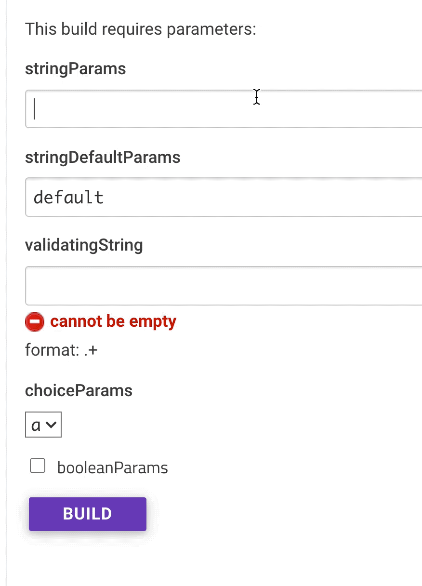
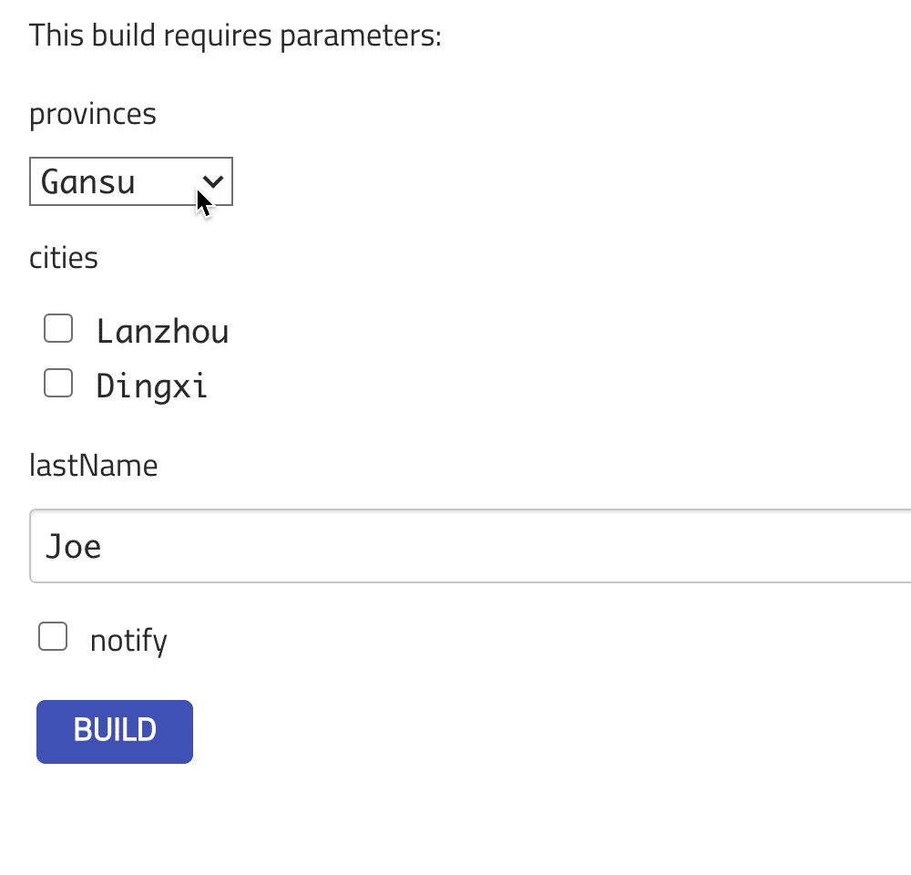
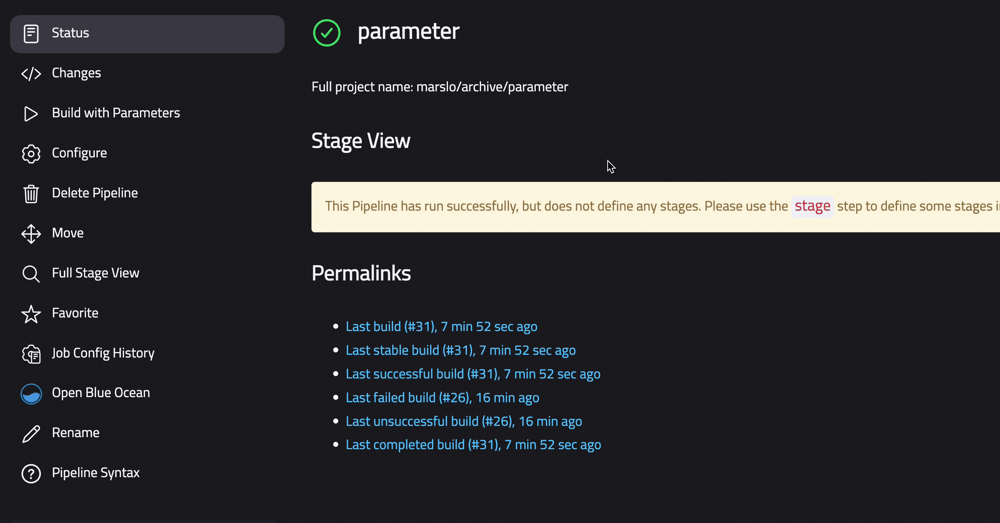

<!-- START doctoc generated TOC please keep comment here to allow auto update -->
<!-- DON'T EDIT THIS SECTION, INSTEAD RE-RUN doctoc TO UPDATE -->

- [parameters](#parameters)
  - [mixed parameters](#mixed-parameters)
- [active choices parameters](#active-choices-parameters)
  - [Active Choices Reactive Parameter](#active-choices-reactive-parameter)
  - [Active Choices Reactive Reference](#active-choices-reactive-reference)
  - [Jenkins 2.0 pipeline: Scripting active parameters for SCM](#jenkins-20-pipeline-scripting-active-parameters-for-scm)
- [file paramter](#file-paramter)
  - [create file parameter](#create-file-parameter)
  - [use file parameter](#use-file-parameter)
- [hidden parameter](#hidden-parameter)
- [Extended Choice Parameter](#extended-choice-parameter)

<!-- END doctoc generated TOC please keep comment here to allow auto update -->



> - reference:
>   - [Class ParametersAction](https://javadoc.jenkins-ci.org/hudson/model/ParametersAction.html)
>   - [Class ParameterValue](https://javadoc.jenkins-ci.org/hudson/model/ParameterValue.html)
>   - [parameters](https://www.jenkins.io/doc/pipeline/steps/pipeline-input-step/#input-wait-for-interactive-input)
>   - [Parameterized System Groovy script](https://wiki.jenkins.io/display/JENKINS/Parameterized+System+Groovy+script)
>   - [How to retrieve Jenkins build parameters using the Groovy API?](https://stackoverflow.com/a/19564602/2940319)
>   - [use groovy to add an additional parameter to a jenkins job](https://stackoverflow.com/a/48962198/2940319)
> - APIs:
>   - Core
>     - [Class BooleanParameterDefinition](https://javadoc.jenkins-ci.org/hudson/model/BooleanParameterDefinition.html)
>     - [Class StringParameterDefinition](https://javadoc.jenkins.io/hudson/model/StringParameterDefinition.html)
>     - [Class ChoiceParameterDefinition](https://javadoc.jenkins.io/hudson/model/ChoiceParameterDefinition.html)
>     - [Class PasswordParameterDefinition](https://javadoc.jenkins.io/hudson/model/PasswordParameterDefinition.html)
>   - [Extended Choice Parameter](https://plugins.jenkins.io/extended-choice-parameter/)
>     - [Class ExtendedChoiceParameterDefinition](https://javadoc.jenkins.io/plugin/extended-choice-parameter/com/cwctravel/hudson/plugins/extended_choice_parameter/ExtendedChoiceParameterDefinition.html)
>   - [Active Choices Plugin](https://plugins.jenkins.io/uno-choice/)
>     - [Class ChoiceParameter](https://javadoc.jenkins.io/plugin/uno-choice/org/biouno/unochoice/ChoiceParameter.html) | [Class ChoiceParameterDefinition](https://javadoc.jenkins.io/hudson/model/ChoiceParameterDefinition.html)
>     - [Class CascadeChoiceParameter](https://javadoc.jenkins.io/plugin/uno-choice/org/biouno/unochoice/CascadeChoiceParameter.html)
>     - [Class DynamicReferenceParameter](https://javadoc.jenkins.io/plugin/uno-choice/org/biouno/unochoice/DynamicReferenceParameter.html)
>   - [File Parameter Plugin](https://plugins.jenkins.io/file-parameters/)
>     - [Class StashedFileParameterDefinition](https://javadoc.jenkins.io/plugin/file-parameters/io/jenkins/plugins/file_parameters/StashedFileParameterDefinition.html)
>   - [Validating String Parameter](https://plugins.jenkins.io/validating-string-parameter/)
>     - [Class ValidatingStringParameterDefinition](https://javadoc.jenkins.io/plugin/validating-string-parameter/hudson/plugins/validating_string_parameter/ValidatingStringParameterDefinition.html)


## parameters
```groovy
properties([
  parameters([
    string( defaultValue: '', name: 'stringParams', description: '', trim: false ),
    string( defaultValue: 'default', name: 'stringDefaultParams', description: '', trim: false ),
    validatingString( defaultValue: '', name: 'validatingString', regex: '.+', description: 'format: <code>.+</code>', failedValidationMessage: 'cannot be empty' ),
    choice( choices: ['a', 'b', 'c', 'd'], name: 'choiceParams', description: '' ),
    booleanParam( defaultValue: false, name: 'booleanParams', description: '' )
  ])
])
```


### mixed parameters

> [!NOTE|label:references:]
> - [`$class: 'ValidatingStringParameterDefinition'`](https://stackoverflow.com/a/48303205/2940319)
> - [`$class: 'hudson.model.ChoiceParameterDefinition'`](https://www.appsloveworld.com/coding/jenkins/11/dynamic-parameter-on-jenkins-pipeline-depending-on-branch?expand_article=1)
> - [`$class: 'io.jenkins.plugins.file_parameters.StashedFileParameterDefinition'`](https://javadoc.jenkins.io/plugin/file-parameters/io/jenkins/plugins/file_parameters/StashedFileParameterDefinition.html)

```groovy
import groovy.transform.Field
import org.jenkinsci.plugins.scriptsecurity.sandbox.groovy.SecureGroovyScript

@Field def props = []
@Field def newParams = []
@Field def fb = new SecureGroovyScript("""return ['Script Error!']""", false)
@Field def ps = new SecureGroovyScript("""return[ 'Gansu', 'Sichuan', 'Disabled:disabled' ]""", false )
@Field def cs = new SecureGroovyScript("""#!groovy
  Map citySets = [
        Gansu : ['Lanzhou', 'Dingxi'] ,
      Sichuan : ['Leshan', 'Guangyuan', 'Chengdu:selected'] ,
     Disabled : ['notshow:selected']
  ]
  return citySets[provinces]
""", false)

newParams += [ $class: 'StashedFileParameterDefinition' , name: 'filename'  , description: 'to upload file'         ]
newParams += [ $class: 'StringParameterDefinition'      , name: 'lastName'  , defaultValue: 'Joe' , description: '' ]
newParams += [ $class: 'StringParameterDefinition'      , name: 'firstName' , defaultValue: 'Dan' , description: '' ]
newParams += [
                   $class : 'ValidatingStringParameterDefinition'             ,
             defaultValue : ''                                                ,
              description : 'timestamps format: <code>YYMMDDHHMMSS</code>'    ,
  failedValidationMessage : 'Cannot be empty or failed by Regex validation !' ,
                     name : 'timeStamps'                                      ,
                    regex : '\\d{2,4}(0[1-9]|1[0-2])(0[1-9]|[1-2][0-9]|3[0-1])(2[0-3]|[01][0-9])[0-5][0-9]\\d{0,2}'
]
newParams += [
                $class : 'ChoiceParameter'          ,
                  name : 'provinces'                ,
            choiceType : 'PT_SINGLE_SELECT'         ,
                script : [
                            $class : 'GroovyScript' ,
                            script : ps             ,
                    fallbackScript : fb
              ] ,
           description : ''
]
newParams += [
                $class : 'CascadeChoiceParameter'   ,
                  name : 'cities'                   ,
  referencedParameters : 'provinces'                ,
            choiceType : 'PT_CHECKBOX'              ,
                script : [
                            $class : 'GroovyScript' ,
                            script : cs             ,
                    fallbackScript : fb
                ] ,
           description : ''
]
newParams += [ $class: 'BooleanParameterDefinition'   , name: 'notify' , defaultValue: false , description: '' ]
props     += [ $class: 'ParametersDefinitionProperty' , parameterDefinitions: newParams                        ]
properties( properties: props )

podTemplate(cloud: 'DevOps Kubernetes') {
  node(POD_LABEL) {
    stage('run') {
      println """
          lastName : ${params.lastName}
         firstName : ${params.firstName}
         provinces : ${params.provinces}
            cities : ${params.cities}
            notify : ${params.notify}
        timeStamps : ${params.timeStamps}
          filename : ${getFilename('filename')}
      """
    } // stage
  } // node
} // podTemplate

String getFilename( String name ) {
  env.getEnvironment().find { "${name}_FILENAME" == it.key }?.value ?: ''
}
```

## [active choices parameters](https://plugins.jenkins.io/uno-choice/)

> [!TIP|label:references]
> - [Behavior and Rendering Summary](https://github.com/snafua/active-choices-plugin?tab=readme-ov-file#behavior-and-rendering-summary)
>
>   


```groovy
properties([
  parameters([
    [
      $class: 'ChoiceParameter',
      name: 'provinces',
      choiceType: 'PT_SINGLE_SELECT',
      description: '',
      script: [
        $class: 'GroovyScript',
        fallbackScript: [classpath: [], sandbox: false, script: '#!groovy return ["accept in ScriptApproval first"]'],
        script: [classpath: [],
                 sandbox: false,
                 script: '''return[
                  \'Gansu\',
                  \'Sichuan\',
                  \'Disabled:disabled\'
                ]'''
        ]
      ]
    ], // ChoiceParameter
    [
      $class: 'CascadeChoiceParameter',
      name: 'cities',
      referencedParameters: 'provinces',
      choiceType: 'PT_CHECKBOX',
      description: '',
      script: [
        $class: 'GroovyScript',
        fallbackScript: [classpath: [], sandbox: false, script: '#!groovy return ["accept in ScriptApproval first"]'],
        script: [classpath: [],
                 sandbox: false,
                 script: '''if (provinces.equals("Gansu")) {
                    return ["Lanzhou", "Dingxi"]
                  } else if (provinces.equals("Sichuan")) {
                    return ["Leshan", "Guangyuan:disabled", "Chengdu:selected"]
                  } else if (provinces.equals("Disabled")) {
                    return ["notshow:selected"]
                  } else {
                    return ["Unknown provinces"]
                  }'''
        ]
    ]], // CascadeChoiceParameter
    [
      $class: 'StringParameterDefinition' ,
      name: 'lastName'  ,
      defaultValue: 'Joe' ,
      description: ''
    ], // StringParameterDefinition
    [
      $class: 'BooleanParameterDefinition',
      name: 'notify',
      defaultValue: false,
      description: ''
    ] // BooleanParameterDefinition
  ])
])
```


- or
  ```groovy
  import groovy.transform.Field
  import org.jenkinsci.plugins.scriptsecurity.sandbox.groovy.SecureGroovyScript

  @Field def props = []
  @Field def newParams = []
  @Field def fb = new SecureGroovyScript("""return ['Script Error!']""", false)
  @Field def ps = new SecureGroovyScript("""return[ 'Gansu', 'Sichuan', 'Disabled:disabled' ]""", false )
  @Field def cs = new SecureGroovyScript("""#!groovy
    Map citySets = [
          Gansu : ['Lanzhou', 'Dingxi'] ,
        Sichuan : ['Leshan', 'Guangyuan', 'Chengdu:selected'] ,
       Disabled : ['notshow:selected']
    ]
    return citySets[provinces]
  """, false)

  newParams += [$class: 'ChoiceParameter',
                name: 'provinces',
                choiceType: 'PT_SINGLE_SELECT',
                script: [ $class: 'GroovyScript',
                          script: ps,
                          fallbackScript: fb
                ],
                description: ''
               ]
  newParams += [$class: 'CascadeChoiceParameter',
                name: 'cities',
                referencedParameters: 'provinces',
                choiceType: 'PT_CHECKBOX',
                script: [ $class: 'GroovyScript',
                          script: cs,
                          fallbackScript: fb
                ],
                description: ''
               ]
  props += [$class: 'ParametersDefinitionProperty', parameterDefinitions: newParams]
  properties(
    properties: props
  )
  ```


### [Active Choices Reactive Parameter](https://plugins.jenkins.io/uno-choice/#plugin-content-active-choices-reactive-parameter-configuration-options-example-02)

> [!TIP|label:references]
> - [Active Choices Reactive Reference Parameter in jenkins pipeline](https://stackoverflow.com/a/54104278/2940319)
> - [Jenkins实践指南-10-Jenkins 插件](https://www.cnblogs.com/surpassme/p/17029269.html)
> - [Class CascadeChoiceParameter](https://javadoc.jenkins.io/plugin/uno-choice/org/biouno/unochoice/CascadeChoiceParameter.html)



```groovy
#!/usr/bin/env groovy

import groovy.transform.Field
import static groovy.json.JsonOutput.*

def createCascadeChoiceDefinition( String name        ,
                                   String groovy      ,
                                   String fallback    ,
                                   String description ,
                                   String choiceType  ,
                                   String reference = ''
) {
  List<String> choiceTypes = [ 'PT_SINGLE_SELECT', 'PT_MULTI_SELECT', 'PT_RADIO', 'PT_CHECKBOX' ]
  if ( ! choiceTypes.contains(choiceType) ) util.showError( "choiceType MUST be one of ${choiceTypes}.join(', ') !" )
  fallback = fallback ?: "return ['script error !']"

  [
                  $class : 'CascadeChoiceParameter' ,
              choiceType : choiceType        ,
            filterLength : 1                 ,
              filterable : false             ,
                    name : name              ,
             description : description       ,
    referencedParameters : reference         ,
                  script : [
                             $class         : 'GroovyScript'   ,
                             fallbackScript : [ sandbox : true , script : fallback ] ,
                             script         : [ sandbox : true , script : groovy   ]
                           ]
  ]
}

def generateParameterDefinitions() {
  final List newParams = []
  final List props     = []
  String fallback      = "return ['script error !']"
  String states        = """
                          Map<String, List<String>> map = [
                            'CA:selected' : [ 'Los Angeles' , 'San Diego'   , 'San Francisco:selected' ] ,
                            'NY'          : [ 'New York'    , 'Hempstead'                              ] ,
                            'TX'          : [ 'Houston'     , 'San Antonio' , 'Dallas'                 ]
                          ]
                          return map.keySet().toList()
                         """.stripIndent()
  String cities        = """
                          Map<String, List<String>> map = [
                            'CA:selected' : [ 'Los Angeles' , 'San Diego'   , 'San Francisco:selected' ] ,
                            'NY'          : [ 'New York'    , 'Hempstead'                              ] ,
                            'TX'          : [ 'Houston'     , 'San Antonio' , 'Dallas'                 ]
                          ]
                           return states.split(',').collect { e ->
                             map.find{ it.key.startsWith(e) }.value.collect{ "\${e}:\${it}".toString() }
                           }.flatten()
                         """.stripIndent()

  newParams += createCascadeChoiceDefinition( 'states' , states , fallback , '' , 'PT_CHECKBOX'           )
  newParams += createCascadeChoiceDefinition( 'cities' , cities , fallback , '' , 'PT_CHECKBOX', 'states' )

  props += [ $class: 'ParametersDefinitionProperty' , parameterDefinitions: newParams ]
  properties( properties: props )
}

generateParameterDefinitions()

println prettyPrint(toJson( params.collect { "${it.key} ~~> ${it.value}" } ))

// vim:tabstop=2:softtabstop=2:shiftwidth=2:expandtab:filetype=Groovy
```

### [Active Choices Reactive Reference](https://github.com/jenkinsci/active-choices-plugin?tab=readme-ov-file#active-choices-reactive-reference)

> [!TIP|label:references]
> - [JENKINS-36806 - Extra comma character append at the end when passing Reactive Reference Values to the build](https://issues.jenkins.io/browse/JENKINS-36806)
> - supported `choiceType`:
>   - `ET_TEXT_BOX`
>   - `ET_ORDERED_LIST`
>   - `ET_UNORDERED_LIST`
>   - `ET_FORMATTED_HTML`
>   - `ET_FORMATTED_HIDDEN_HTML`
> - [Class DynamicReferenceParameter](https://javadoc.jenkins.io/plugin/uno-choice/org/biouno/unochoice/DynamicReferenceParameter.html)
> - read more:
>   - [* iMarslo: get time/date from groovy](../../programming/groovy/time.md)


```groovy
#!/usr/bin/env groovy

import groovy.transform.Field
import static groovy.json.JsonOutput.*

def generateParameterDefinitions() {
  final List newParams      = []
  final List props          = []
  String fallback           = "return ['script error !']"
  String releaseIdScript    = """
                                import java.time.LocalDateTime
                                import java.time.format.DateTimeFormatter

                                LocalDateTime ld = LocalDateTime.now()
                                String version = ld.format( DateTimeFormatter.ofPattern('yy.MM') )
                                String defaultValue = "v\${version}"

                                return "<input name='value' placeholder='MANDATORY: example format: `v&lt;yy.MM&gt;`' value='\${defaultValue}' class='jenkins-input' type='text'>"
                              """.stripIndent()
  String todayScript        = """
                                import java.time.LocalDateTime
                                import java.time.format.DateTimeFormatter

                                LocalDateTime ld = LocalDateTime.now()
                                String today = ld.format( DateTimeFormatter.ofPattern('YYYY-MM-dd') )
                                return "<input name='value' value='\${today}' class='setting-input' type='text'>"
                              """.stripIndent()
  String pathScript         = """
                                String defaultValue = "\${today}/\${releaseId}"
                                return "<input name='value' placeholder='MANDATORY: example format: `&lt;YYYY-MM-dd&gt;/v&lt;yy.MM&gt;`' value='\${defaultValue}' class='setting-input' type='text'>"
                              """.stripIndent()
  newParams += [
                  $class : 'DynamicReferenceParameter' ,
              choiceType : 'ET_FORMATTED_HTML'         ,
                    name : 'releaseId'                 ,
          omitValueField : true                        ,
    referencedParameters : ''                          ,
             description : 'the releaseId'             ,
                  script : [
                             $class         : 'GroovyScript'   ,
                             fallbackScript : [ sandbox : true , script : fallback        ] ,
                             script         : [ sandbox : true , script : releaseIdScript ]
                           ]
  ]

  newParams += [
                  $class : 'DynamicReferenceParameter' ,
              choiceType : 'ET_FORMATTED_HIDDEN_HTML'  ,
                    name : 'today'                     ,
          omitValueField : true                        ,
    referencedParameters : ''                          ,
             description : 'the hidden params of today\'s date in format of &lt;YYYY-MM-dd&gt;',
                  script : [
                             $class         : 'GroovyScript'   ,
                             fallbackScript : [ sandbox : true , script : fallback    ] ,
                             script         : [ sandbox : true , script : todayScript ]
                           ]
  ]

  newParams += [
                  $class : 'DynamicReferenceParameter' ,
              choiceType : 'ET_FORMATTED_HTML'         ,
                    name : 'path'                      ,
          omitValueField : true                        ,
    referencedParameters : 'releaseId,today'           ,
             description : 'the path'                  ,
                  script : [
                             $class         : 'GroovyScript'   ,
                             fallbackScript : [ sandbox : true , script : fallback   ] ,
                             script         : [ sandbox : true , script : pathScript ]
                           ]
  ]
  props += [ $class: 'ParametersDefinitionProperty' , parameterDefinitions: newParams ]
  properties( properties: props )
}

generateParameterDefinitions()

println prettyPrint(toJson( params.collect { "${it.key} ~~> ${it.value}" } ))

// vim:tabstop=2:softtabstop=2:shiftwidth=2:expandtab:filetype=Groovy
```

- `createDynamicReferenceDefinition` function
  ```groovy
  def createDynamicReferenceDefinition( String name        ,
                                        String reference   ,
                                        String groovy      ,
                                        String fallback    ,
                                        String description ,
                                        String choiceType  ,
                                        Boolean omit
  ) {
    List<String> choiceTypes = [ 'ET_TEXT_BOX', 'ET_ORDERED_LIST', 'ET_UNORDERED_LIST',  'ET_FORMATTED_HTML', 'ET_FORMATTED_HIDDEN_HTML' ]
    if ( ! choiceTypes.contains(choiceType) ) util.showError( "choiceType MUST be one of ${choiceTypes}.join(', ') !" )

    [
                    $class : 'DynamicReferenceParameter' ,
                choiceType : choiceType                  ,
                      name : name                        ,
            omitValueField : omit                        ,
      referencedParameters : reference                   ,
               description : description                 ,
                    script : [
                               $class         : 'GroovyScript'   ,
                               fallbackScript : [ sandbox : true , script : fallback ] ,
                               script         : [ sandbox : true , script : groovy   ]
                             ]
    ]
  }

  /**
   * omit is true by default
  **/
  def createDynamicReferenceDefinition( String name, String reference, String groovy, String fallback, String description, String choiceType ) {
    createDynamicReferenceDefinition( name, reference, groovy, fallback, description, choiceType, true )
  }
  ```

- jenkinsfile
  ```groovy
  #!/usr/bin/env groovy

  import groovy.transform.Field
  import static groovy.json.JsonOutput.*

  def createDynamicReferenceDefinition( String name        ,
                                        String reference   ,
                                        String groovy      ,
                                        String fallback    ,
                                        String description ,
                                        String choiceType  ,
                                        Boolean omit
  ) {
    List<String> choiceTypes = [ 'ET_TEXT_BOX', 'ET_ORDERED_LIST', 'ET_UNORDERED_LIST',  'ET_FORMATTED_HTML', 'ET_FORMATTED_HIDDEN_HTML' ]
    if ( ! choiceTypes.contains(choiceType) ) util.showError( "choiceType MUST be one of ${choiceTypes}.join(', ') !" )

    [
                    $class : 'DynamicReferenceParameter' ,
                choiceType : choiceType                  ,
                      name : name                        ,
            omitValueField : omit                        ,
      referencedParameters : reference                   ,
               description : description                 ,
                    script : [
                               $class         : 'GroovyScript'   ,
                               fallbackScript : [ sandbox : true , script : fallback ] ,
                               script         : [ sandbox : true , script : groovy   ]
                             ]
    ]
  }

  def createDynamicReferenceDefinition( String name, String reference, String groovy, String fallback, String description, String choiceType ) {
    createDynamicReferenceDefinition( name, reference, groovy, fallback, description, choiceType, true )
  }

  def generateParameterDefinitions() {
    final List newParams = []
    final List props     = []
    String fallback      = "return ['script error !']"
    String releaseId     = """
                             import java.time.LocalDateTime
                             import java.time.format.DateTimeFormatter

                             LocalDateTime ld = LocalDateTime.now()
                             String version = ld.format( DateTimeFormatter.ofPattern('yy.MM') )
                             String defaultValue = "v\${version}"

                             return "<input name='value' placeholder value='\${defaultValue}' class='jenkins-input' type='text'>"
                           """.stripIndent()
    String today         = """
                             import java.time.LocalDateTime
                             import java.time.format.DateTimeFormatter

                             LocalDateTime ld = LocalDateTime.now()
                             String today = ld.format( DateTimeFormatter.ofPattern('YYYY-MM-dd') )
                             return "<input name='value' value='\${today}' class='setting-input' type='text'>"
                           """.stripIndent()
    String path          = """
                             String defaultValue = "\${today}/\${releaseId}"
                             return "<input name='value' placeholder='MANDATORY: example format: `&lt;YYYY-MM-dd&gt;/&lt;yy.MM&gt;`' value='\${defaultValue}' class='setting-input' type='text'>"
                           """.stripIndent()

    newParams += createDynamicReferenceDefinition( 'releaseId' , ''                , releaseId , fallback , '' , 'ET_FORMATTED_HTML'        )
    newParams += createDynamicReferenceDefinition( 'today'     , ''                , today     , fallback , '' , 'ET_FORMATTED_HIDDEN_HTML' )
    newParams += createDynamicReferenceDefinition( 'path'      , 'releaseId,today' , path      , fallback , '' , 'ET_FORMATTED_HTML'        )

    props += [ $class: 'ParametersDefinitionProperty' , parameterDefinitions: newParams ]
    properties( properties: props )
  }

  generateParameterDefinitions()

  println prettyPrint(toJson( params.collect { "${it.key} ~~> ${it.value}" } ))

  // vim:tabstop=2:softtabstop=2:shiftwidth=2:expandtab:filetype=Groovy
  ```

### [Jenkins 2.0 pipeline: Scripting active parameters for SCM](https://technology.amis.nl/continuous-delivery/jenkins-2-0-pipeline-scripting-active-parameters-for-scm/)
```groovy
import groovy.transform.Field
import org.jenkinsci.plugins.scriptsecurity.sandbox.groovy.SecureGroovyScript

@Field def props = []
@Field def newParams = []

node('mster') {
  setNewProps()
} // node

void setNewProps() {
  //Parameters are unknown at first load
  try {
    regenerateJob = (params.RegenerateJob == null) ? true : params.RegenerateJob
  }
  catch (MissingPropertyException e) {
    regenerateJob = true
  }

  if (regenerateJob) {
    def fb = new SecureGroovyScript("""return ['Script Error!']""", false)
    def ps = new SecureGroovyScript("""return[ 'Gansu', 'Sichuan', 'Disabled:disabled' ]""", false )
    def cs = new SecureGroovyScript("""#!groovy
      Map citySets = [
            Gansu : ['Lanzhou', 'Dingxi'] ,
          Sichuan : ['Leshan', 'Guangyuan', 'Chengdu:selected'] ,
         Disabled : ['notshow:selected']
      ]
      return citySets[provinces]
    """, false)

    println "Jenkins job ${env.JOB_NAME} gets updated."
    currentBuild.displayName = "#" + Integer.toString(currentBuild.number) + ": Initialize job"

    newParams += [$class: 'StringParameterDefinition' , name: 'lastName'  , defaultValue: 'Joe' , description: '']
    newParams += [$class: 'StringParameterDefinition' , name: 'firstName' , defaultValue: 'Dan' , description: '']
    newParams += [
                       $class : 'ValidatingStringParameterDefinition',
                         name : 'timeStamps' ,
                  description : 'timestamps format: <code>YYMMDDHHMMSS</code>' ,
      failedValidationMessage : 'Cannot be empty or failed by Regex validation !' ,
                 defaultValue : '' ,
                        regex : '\\d{2,4}(0[1-9]|1[0-2])(0[1-9]|[1-2][0-9]|3[0-1])(2[0-3]|[01][0-9])[0-5][0-9]\\d{0,2}'
    ]
    newParams += [
                       $class : 'ChoiceParameter' ,
                         name : 'provinces' ,
                   choiceType : 'PT_SINGLE_SELECT' ,
                       script : [
                                   $class : 'GroovyScript' ,
                                   script : ps ,
                           fallbackScript : fb
                       ] ,
                  description : ''
    ]
    newParams += [
                       $class : 'CascadeChoiceParameter' ,
                         name : 'cities' ,
         referencedParameters : 'provinces' ,
                   choiceType : 'PT_CHECKBOX' ,
                       script : [
                                   $class : 'GroovyScript' ,
                                   script : cs ,
                           fallbackScript : fb
                       ] ,
                  description : ''
    ]
    newParams += [$class: 'BooleanParameterDefinition' , name: 'notify' , defaultValue: false , description: '']

    props += [
                $class : 'BuildDiscarderProperty',
              strategy : [$class: 'LogRotator', daysToKeepStr: '30', artifactDaysToKeepStr: '1', artifactNumToKeepStr: '']
    ]
    props += [$class: 'ParametersDefinitionProperty', parameterDefinitions: newParams]
    properties( properties: props )
  }
}
```

## file paramter

> [!NOTE|label:references]
> - [* jenkinsci/file-parameters-plugin](https://github.com/jenkinsci/file-parameters-plugin)
> - [Package io.jenkins.plugins.file_parameters](https://javadoc.jenkins.io/plugin/file-parameters/io/jenkins/plugins/file_parameters/package-summary.html)
> - [JENKINS-27413 : Handle file parameters](https://issues.jenkins.io/browse/JENKINS-27413)
> - [JENKINS-47333 : file parameter not working in pipeline job](https://issues.jenkins.io/browse/JENKINS-47333)
> - [JENKINS-51245 : file parameter issue in jenkins pipeline](https://issues.jenkins.io/browse/JENKINS-51245)
> - [JENKINS-29289 : InputStep doesn't support File Parameters](https://issues.jenkins.io/browse/JENKINS-29289)
> - [How to overcome Jenkins pipeline inability to use file parameters](https://gvasanka.medium.com/how-to-overcome-jenkins-pipeline-inability-to-use-file-parameters-c46ba8cc3aec)
> - [janvrany/jenkinsci-unstashParam-library](https://github.com/janvrany/jenkinsci-unstashParam-library)

### create file parameter
```groovy
final List props     = []
final List newParams = []
newParams += [ $class: 'StashedFileParameterDefinition' , name: 'jsonFile', description: 'to upload file' ]
props     += [ $class: 'ParametersDefinitionProperty'   , parameterDefinitions: newParams                 ]
properties( properties: props )

// or
properties([ parameters([ stashedFile('FILE') ]) ])
```

### use file parameter
```groovy
/**
 * get the original filename who was uploaded via File Parameter
 *
 * @param name      the parameter name
 * @see             <a href="https://plugins.jenkins.io/file-parameters/">File Parameter</a>
**/
String getFilename( String name ) {
  env.getEnvironment().find { "${name}_FILENAME" == it.key }?.value ?: ''
}

/**
 * unstash the file who was uploaded via File Parameter
 *
 * @param name      the parameter name
 * @see             <a href="https://plugins.jenkins.io/file-parameters/">File Parameter</a>
**/
Boolean unstashFile( String name ) {
  String filename = getFilename( name )
  if ( filename ) {
    unstash "${name}"
    sh """ set +x; mv "${name}" ${filename} """
    return util.fileFinder( filename, 0 ) && true
  } else {
    color.alert( '... no uploaded file found ...' )
    return false
  }
}
```

## hidden parameter

> [!NOTE|label:references:]
> - [Hidden Parameter](https://plugins.jenkins.io/hidden-parameter/)
> - [How Do I Use a Hidden Parameter in a Jenkins Declarative Pipeline](https://stackoverflow.com/a/74809759/2940319)
> - [Class WHideParameterDefinition](https://javadoc.jenkins.io/plugin/hidden-parameter/com/wangyin/parameter/WHideParameterDefinition.html)

- setup
  ```groovy
  final List props     = []
  final List newParams = []
  newParams += [ $class: 'WHideParameterDefinition'     , name: 'HIDDEN_PARAM', description: 'Hidden param' ]
  props     += [ $class: 'ParametersDefinitionProperty' , parameterDefinitions: newParams                   ]
  properties( properties: props )

  // or
  properties([
    parameters([
      hidden( name: 'hidden_param', defaultValue: 'hidden_value', description: 'Hidden parameter' )
    ])
  ])
  ```

## [Extended Choice Parameter](https://plugins.jenkins.io/extended-choice-parameter/)

> [!NOTE|label:references]
> ** END OF LIFE **
> - [How to do a multiselect input in a pipeline](https://docs.cloudbees.com/docs/cloudbees-ci-kb/latest/client-and-managed-controllers/how-to-do-a-multiselect-input-in-a-pipeline)
> - [Pipeline Snippet Generator return the name of the object instead of the object with the parameters](https://docs.cloudbees.com/docs/cloudbees-ci-kb/latest/client-and-managed-controllers/pipeline-snipper-return-the-name-of-the-object-instead-of-the-object-with-the-paremeter)

