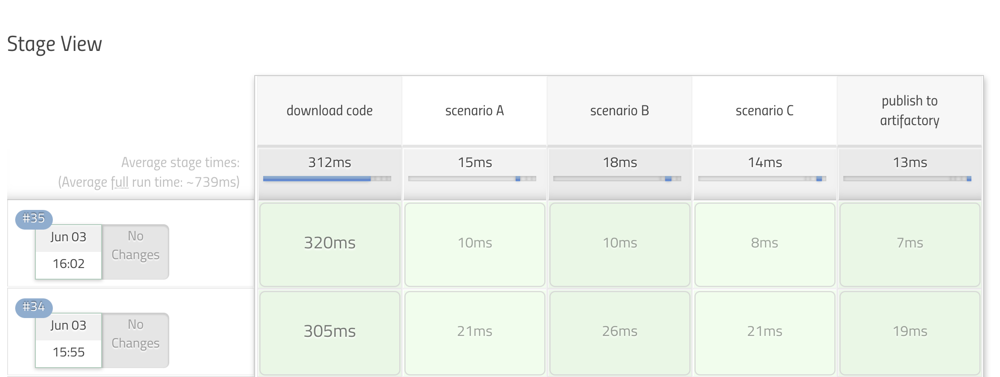

<!-- START doctoc generated TOC please keep comment here to allow auto update -->
<!-- DON'T EDIT THIS SECTION, INSTEAD RE-RUN doctoc TO UPDATE -->
**Table of Contents**  *generated with [DocToc](https://github.com/thlorenz/doctoc)*

- [pipeline utility steps](#pipeline-utility-steps)
  - [findFiles](#findfiles)
  - [send mail with catch error](#send-mail-with-catch-error)
  - [tips](#tips)
  - [Evaluate a Groovy source file into the Pipeline script](#evaluate-a-groovy-source-file-into-the-pipeline-script)
  - [load a constant](#load-a-constant)
  - [extend the pipeline](#extend-the-pipeline)
- [dsl with groovy](#dsl-with-groovy)
- [others](#others)
  - [handle api](#handle-api)
  - [running in temporaray folders](#running-in-temporaray-folders)
- [withCredentials](#withcredentials)
  - [push with ssh private credentials](#push-with-ssh-private-credentials)
  - [ssh-agent(https://plugins.jenkins.io/ssh-agent)](#ssh-agenthttpspluginsjenkinsiossh-agent)

<!-- END doctoc generated TOC please keep comment here to allow auto update -->

## [pipeline utility steps](https://www.jenkins.io/doc/pipeline/steps/pipeline-utility-steps/)
### findFiles
- jenkinsfile
  ```groovy
  sh "touch a.txt"
  def files = findFiles (glob: "**/*.txt")
  println """
            name : ${files[0].name}
            path : ${files[0].path}
       directory : ${files[0].directory}
          length : ${files[0].length}
    lastModified : ${files[0].lastModified}
  """
  ```
- result
  ```groovy
  [Pipeline] sh (hide)
  + touch a.txt
  [Pipeline] findFiles
  [Pipeline] echo

                name : a.txt
                path : a.txt
           directory : false
              length : 0
        lastModified : 1605525397000
  ```

### [send mail with catch error](https://github.com/jenkinsci/workflow-basic-steps-plugin/blob/master/CORE-STEPS.md#plain-catch-blocks)
```groovy
try {
  sh 'might fail'
  mail subject: 'all well', to: 'admin@somewhere', body: 'All well.'
} catch (e) {
  def w = new StringWriter()
  e.printStackTrace(new PrintWriter(w))
  mail subject: "failed with ${e.message}", to: 'admin@somewhere', body: "Failed: ${w}"
  throw e
}
```

### tips
#### java.io.NotSerializableException: groovy.lang.IntRange
> refenrece:
> - [Groovy Range Examples](http://grails.asia/groovy-range-examples)
> - [Groovy For Loop Examples](http://grails.asia/groovy-for-loop-examples)

- caused via
  ```groovy
  (1..5).each { println it }
  ```

- solution
  - [`IntRange.flatten()`](https://stackoverflow.com/a/34881180/2940319)
    ```groovy
    (1..5).flatten().each { println it }
    ```
  - [`IntRange.toList()`](https://stackoverflow.com/a/55210625/2940319)
    ```groovy
    (1..5).toList().each { println it }
    ```


### [Evaluate a Groovy source file into the Pipeline script](https://www.jenkins.io/doc/pipeline/steps/workflow-cps/#load-evaluate-a-groovy-source-file-into-the-pipeline-script)
> references:
> - [Load From File](https://www.jenkins.io/doc/pipeline/examples/#load-from-file)

### load a constant
> see also [imarslo : groovy metaClass](../../programming/groovy/tricky.html#load-groovy-file)

#### groovy file ( `constant.groovy` )
```groovy
@Field final Map<String, Map<String, String>> FOO = [
  'k1' : [ 'k11' : 'v11' ],
  'k2' : [ 'k21' : 'v21', 'k22' : 'v22' ]
]
```

#### Jenkinsfile
```groovy
Object matrix = load( '/path/to/constant.groovy' )
if ( matrix.metaClass.hasProperty(matrix, 'FOO') ) {
  println """
       matrix.FOO : ${matrix.FOO}
    matrix.FOO.k1 : ${matrix.FOO.k1}
      matrix.type : ${matrix.metaClass.hasProperty(matrix, 'FOO').type}
  """
}
```
- result
  ```groovy
       matrix.FOO : [k1:[k11:v11], k2:[k21:v21, k22:v22]]
    matrix.FOO.k1 : [k11:v11]
      matrix.type : interface java.util.Map
  ```

### extend the pipeline

#### groovy script ( `builtInStage.groovy` )
```groovy
String str = "this is string A"

def stageA( String path ) {
  stage('scenario A') { println path }
}

def stageB() {
  stage('scenario B') { println str }
}

def stageC() {
  stage('scenario C') {
    String strC = "this is string C"
    sh "echo ${strC}"
    println strC
  }
}

def runAllStages( String basePath ) {
  stageA( basePath )
  stageB()
  stageC()
}

return this
```

#### Jenkinsfile
```groovy
node('master') {
  stage( 'download code' ) {
    echo 'prepare'
    sh "cat ${WORKSPACE}/builtInStage.groovy"
  }

  test = load "builtInStage.groovy"
  test.runAllStages( "${WORKSPACE}/mypath" )

  stage( 'publish' ) {
    echo 'done!'
  }
}
```
- stage view
  

## dsl with groovy

**original DSL**:
```groovy
cleanWs(
  deleteDirs: true,
  disableDeferredWipeout: true,
  notFailBuild: true,
  patterns: [
    [ pattern: 'b.txt', type: 'INCLUDE' ] ,
    [ pattern: 'a.txt', type: 'INCLUDE' ]
  ]
)
```


- [Spread Operator](https://www.logicbig.com/tutorials/misc/groovy/spread-operator.html)
  > [Groovy Goodness: the Spread Operato](https://blog.mrhaki.com/2009/09/groovy-goodness-spread-operator.html)

  ```groovy
  List p = [ 'a.txt', 'b.txt' ]

  cleanWs(
    deleteDirs: true,
    disableDeferredWipeout: true,
    notFailBuild: true,
    patterns: [
      *p.collect {
        [pattern: "${it}", type: 'INCLUDE']
      }
    ]
  )
  ```

- `List.collect`
  ```groovy
  List p = [ 'a.txt', 'b.txt' ]

  cleanWs(
    deleteDirs: true,
    disableDeferredWipeout: true,
    notFailBuild: true,
    patterns: p.collect { [pattern: "${it}", type: 'INCLUDE'] }
  )
  ```

- with API
  ```groovy
  import hudson.plugins.ws_cleanup.Pattern
  import hudson.plugins.ws_cleanup.Pattern.PatternType

  List p = [ 'a.txt', 'b.txt' ]

  cleanWs(
    deleteDirs: true,
    disableDeferredWipeout: true,
    notFailBuild: true,
    patterns: p.collect { new Pattern(it, PatternType.INCLUDE) }
  )
  ```

- with pure API
  > Javadoc:
  > - [hudson.plugins.ws_cleanup.WsCleanup](https://javadoc.jenkins.io/plugin/ws-cleanup/hudson/plugins/ws_cleanup/WsCleanup.html)
  > - [hudson.plugins.ws_cleanup.Pattern](https://javadoc.jenkins.io/plugin/ws-cleanup/hudson/plugins/ws_cleanup/Pattern.html)
  > - [hudson.plugins.ws_cleanup.Pattern.PatternType](https://javadoc.jenkins.io/plugin/ws-cleanup/hudson/plugins/ws_cleanup/Pattern.PatternType.html)
  > - [FilePath](https://javadoc.jenkins.io/hudson/FilePath.html)
  > - [Launcher](https://javadoc.jenkins-ci.org/hudson/Launcher.html)
  > - [TaskListener](https://javadoc.jenkins-ci.org/hudson/model/TaskListener.html)
  >
  >
  > get `FilePath` :
  > - [Using FilePath to access workspace on slave in Jenkins pipeline](https://stackoverflow.com/a/42018578/2940319)

  ```groovy
  import hudson.plugins.ws_cleanup.WsCleanup
  import hudson.plugins.ws_cleanup.Pattern
  import hudson.plugins.ws_cleanup.Pattern.PatternType

  List p = [ 'a.txt', 'b.txt' ]

  WsCleanup wsc = new WsCleanup()
  wsc.setDeleteDirs(true)
  wsc.setDisableDeferredWipeout(true)
  wsc.setNotFailBuild(true)
  wsc.setPatterns(
    p.each {
      new Pattern( it, PatternType.INCLUDE )
    }
  )

  // unresolved
  wsc.perform( currentBuild.rawBuild, <FilePath>, <Launcher>, <TaskListener> )
  ```

## others
### handle api
> - [Demo: Processing Github JSON from Groovy](http://tdongsi.github.io/blog/2017/04/18/groovy-code-in-jenkins-pipeline/)

```groovy
import groovy.json.JsonSlurper

String username = System.getenv('GITHUB_USERNAME')
String password = System.getenv('GITHUB_PASSWORD')

String GITHUB_API = 'https://api.github.com/repos'
String repo = 'groovy'
String PR_ID = '2' // Pull request ID

String url = "${GITHUB_API}/${username}/${repo}/pulls/${PR_ID}"
println "Querying ${url}"
def text = url.toURL().getText(requestProperties: ['Authorization': "token ${password}"])
def json = new JsonSlurper().parseText(text)
def bodyText = json.body

// Check if Pull Request body has certain text
if ( bodyText.find('Safari') ) {
    println 'Found Safari user'
}
```

### running in temporaray folders
- using [`pwd(temp:true)`](https://www.jenkins.io/doc/pipeline/steps/workflow-basic-steps/#pwd-determine-current-directory)
  ```groovy
  node ( 'built-in' ) {
    dir( pwd('tmp':true) ) {
      sh """
        pwd
        ls -altrh
      """
    } //dir
  } // node
  ```
  - console output
    ```
    16:13:46  + pwd
    16:13:46  /home/devops/workspace/marslo/sandbox/func@tmp
    16:13:46  + ls -altrh
    16:13:46  total 0
    16:13:46  drwxr-xr-x 4 devops devops 42 Jul 13 08:13 ..
    16:13:46  drwxr-xr-x 3 devops devops 19 Jul 13 08:13 .
    ```

- using `System.currentTimeMillis()`
  ```groovy
  node ( 'built-in' ) {
    dir( System.currentTimeMillis().toString() ) {
      sh """
        pwd
        ls -altrh
      """
    } //dir
  } // node
  ```
  - console output
    ```
    16:26:14  + pwd
    16:26:14  /home/devops/workspace/marslo/sandbox/func/1657700773771
    16:26:14  + ls -altrh
    16:26:14  total 0
    16:26:14  drwxr-xr-x 2 devops devops  6 Jul 13 08:26 .
    16:26:14  drwxr-xr-x 4 devops devops 52 Jul 13 08:26 ..
    ```

## withCredentials

references:
> - [JENKINS-47514 : Special characters in password are not escaped properly in git plugin's withCredentials](https://issues.jenkins.io/browse/JENKINS-47514)
> <p></p>
> Both `gitUsernamePassword` and `gitSshPrivateKey` bindings depend on the Credential Plugin to retrieve user’s credential using the Credentials API.
> Git SSH Private Key Binding
> The gitSshPrivateKey implementation provides git authentication support over SSH protocol using private key and passphrase credentials of a user. The binding uses two git specific environment variables depending upon the minimum CLI-git version
> - `GIT_SSH_COMMAND` - If version is greater than or equal to 2.3, then the GIT_SSH_COMMAND environment variable provides the ssh command including necessary options which are: path to the private key and host key checking, to authenticate and connect to the git server without using an executable script.
> - `SSH_ASKPASS` - If version is less than 2.3, an executable script is attached to the variable which provides the ssh command including necessary options which are: path to the private key and host key checking, to authenticate and connect to the git server


### push with ssh private credentials


> references:
> - [Git Credentials Binding for sh, bat, powershell](https://www.jenkins.io/blog/2021/08/19/git-credentials-binding-work-report/)
> - [Git credentials binding for sh, bat, and powershell ](https://www.jenkins.io/projects/gsoc/2021/projects/git-credentials-binding/#git-ssh-private-key-binding)
> - [Is it possible to Git merge / push using Jenkins pipeline](https://stackoverflow.com/a/57731191/2940319)
> - [Pipeline - Equivalent to Git Publisher](https://support.cloudbees.com/hc/en-us/articles/360027646491-Pipeline-Equivalent-to-Git-Publisher)
> - [Git from Jenkins pipeline is using wrong SSH private key to push back into Git repository](https://stackoverflow.com/a/66800070/2940319)
> - [Credentials Binding Plugin](https://www.jenkins.io/doc/pipeline/steps/credentials-binding/)
>
> for username & password by `gitUsernamePassword` :
> ```groovy
> withCredentials([
>   gitUsernamePassword( credentialsId: 'my-credentials-id', gitToolName: 'git-tool' )
> ]) {
>   bat 'git submodule update --init --recursive'
> }
> ```



> [!NOTE]
> If for any particular reason, the push must be done using a different method the URL needs to be configured accordingly: <br>
> - `git config url.git@github.com/.insteadOf https://github.com/` : if the checkout was done through HTTPS but push must be done using SSH
> - `git config url.https://github.com/.insteadOf git@github.com/` : if the checkout was done through SSH but push must be done using HTTPS
> escaping characters in the ECHO commands of the askpass script:
> ```bash
> .replace("%", "%%")
> .replace("^", "^^")
> .replace("&", "^&")
> .replace("<", "^<")
> .replace(">", "^>")
> .replace("|", "^|")
> .replace("'", "^'")
> .replace("`", "^`")
> .replace(",", "^,")
> .replace(";", "^;")
> .replace("=", "^=")
> .replace("(", "^(")
> .replace(")", "^)")
> .replace("!", "^!")
> .replace("\"", "^\"")
> ```

```groovy
withCredentials([ sshUserPrivateKey(
                       credentialsId : 'GITSSHPRIVATEKEY',
                     keyFileVariable : 'SSHKEY',
                    usernameVariable : 'USERNAME'
                  )
]) {
  sh """
    GIT_SSH_COMMAND="ssh -i ${SSHKEY} -o User=${USERNAME} -o StrictHostKeyChecking=no" \
    git ls-remote <repoUrl> --heads
    git push origin <local-branch>:<remote-branch>
  """
}
```

### ssh-agent(https://plugins.jenkins.io/ssh-agent)


> references:
> - [How is your Jenkins 'master' configured for SSH push in the Jenkinsfile? #5](https://github.com/docker-archive/jenkins-pipeline-scripts/issues/5#issuecomment-508510149)
> - [Use ssh credentials in jenkins pipeline with ssh, scp or sftp](https://stackoverflow.com/a/44391234/2940319)


- sample code
  ```groovy
  steps {
    sshagent (credentials: ['jenkins-generated-ssh-key']) {
      sh("""
        git tag ${props['DATE_TAG']}
        git push --tags
      """)
    }
  }
  ```
