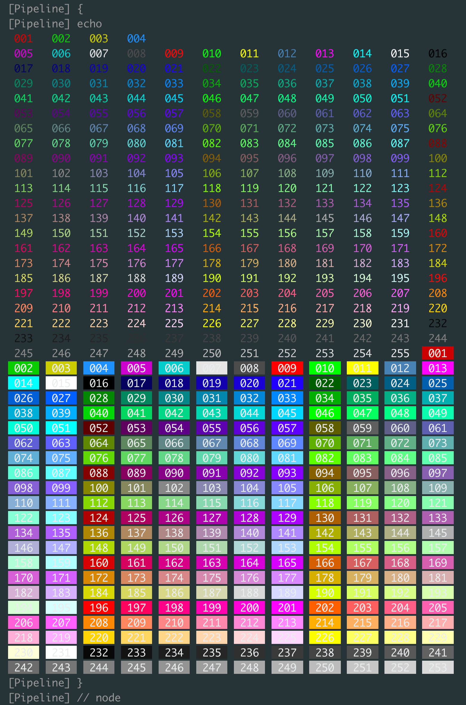

<!-- START doctoc generated TOC please keep comment here to allow auto update -->
<!-- DON'T EDIT THIS SECTION, INSTEAD RE-RUN doctoc TO UPDATE -->
**Table of Contents**  *generated with [DocToc](https://github.com/thlorenz/doctoc)*

- [println 256 colors](#println-256-colors)
- [color matrix libs](#color-matrix-libs)

<!-- END doctoc generated TOC please keep comment here to allow auto update -->


## println 256 colors
```groovy
ansiColor('xterm') { node('master') {
  List matrix = []
  List line = []
  [38, 48].collect { fgbg ->
    (1..255).collect { color ->
      """\033[${fgbg};5;${color}m ${String.format("%03d", color)} \033[0m"""
    }
  }.flatten().eachWithIndex{ c, idx ->
    line += [c]
    if ( 4 == (idx+1)%12 ) {
      matrix.add( line )
      line = []
    }
  }

  println matrix.collect{ it.join(' ') }.join('\n')
}}
```


- or
  ```groovy
  ansiColor('xterm') { node('master') {
      List matrix = []
      List line = []

      (0..7).collect{ attr ->
        [38, 48].collect { fgbg ->
          (0..255).collect { color ->
            "\033[${attr};${fgbg};5;${color}m" +
            """ \\033[${attr};${fgbg};${String.format("%03d", color)}m """ +
            "\033[0m"
          }
        }
      }.flatten().eachWithIndex{ c, idx ->
        line += [c]
        if ( 4 == (idx+1)%6 ) {
          matrix.add( line )
          line = []
        }
      }

      println matrix.collect{ it.join(' ') }.join('\n')
  }}
  ```
  

## color matrix libs
```groovy
import groovy.transform.Field

/**
 * <color>        regular color
 * bold<Color>    bold color
 * br<Color>      high intensity (bright color)
 * it<Color>      italic
 * on<Color>      <color> as background
**/
@Field final Map<String, String> COLOR_MATRIX = [
         black : '\033[0;38;5;0m'   ,
           red : '\033[0;38;5;1m'   ,
         green : '\033[0;38;5;2m'   ,
        yellow : '\033[0;38;5;3m'   ,
          blue : '\033[0;38;5;4m'   ,
       magenta : '\033[0;38;5;5m'   ,
          cyan : '\033[0;38;5;6m'   ,
         white : '\033[0;38;5;7m'   ,
          gray : '\033[0;38;5;8m'   ,
     lightGray : '\033[0;38;5;244m' ,
        orange : '\033[0;38;5;208m' ,
         brRed : '\033[0;38;5;9m'   ,
       brGreen : '\033[0;38;5;10m'  ,
      brYellow : '\033[0;38;5;11m'  ,
        brBlue : '\033[0;38;5;12m'  ,
     brMagenta : '\033[0;38;5;13m'  ,
        brCyan : '\033[0;38;5;14m'  ,
       brWhite : '\033[0;38;5;15m'  ,
       onBlack : '\033[0;48;5;0m'   ,
         onRed : '\033[0;48;5;1m'   ,
       onGreen : '\033[0;48;5;2m'   ,
      onYellow : '\033[0;48;5;3m'   ,
        onBlue : '\033[0;48;5;4m'   ,
     onMagenta : '\033[0;48;5;5m'   ,
        onCyan : '\033[0;48;5;6m'   ,
       onWhite : '\033[0;48;5;7m'   ,
        onGray : '\033[0;48;5;8m'   ,
   onLightGray : '\033[0;48;5;244m' ,
      onOrange : '\033[0;48;5;208m' ,
     boldBlack : '\033[1;38;5;0m'   ,
       boldRed : '\033[1;38;5;1m'   ,
     boldGreen : '\033[1;38;5;2m'   ,
    boldYellow : '\033[1;38;5;3m'   ,
      boldBlue : '\033[1;38;5;4m'   ,
   boldMagenta : '\033[1;38;5;5m'   ,
      boldCyan : '\033[1;38;5;6m'   ,
     boldWhite : '\033[1;38;5;7m'   ,
      boldGray : '\033[1;38;5;8m'   ,
       itBlack : '\033[3;38;5;0m'   ,
         itRed : '\033[3;38;5;1m'   ,
       itGreen : '\033[3;38;5;2m'   ,
      itYellow : '\033[3;38;5;3m'   ,
        itBlue : '\033[3;38;5;4m'   ,
     itMagenta : '\033[3;38;5;5m'   ,
        itCyan : '\033[3;38;5;6m'   ,
       itWhite : '\033[3;38;5;7m'   ,
        itGray : '\033[3;38;5;8m'   ,
           ESC : '\033[0m'
]

def show( String color, String str ) {
  if ( COLOR_MATRIX.containsKey(color) ) {
    println COLOR_MATRIX.get('red') + "WARN: the color name: ${color} cannot be found in matrix" + COLOR_MATRIX.get('ESC')
  }
  return COLOR_MATRIX.getOrDefault( color, 'black' ) + str + COLOR_MATRIX.get('ESC')
}
```

- others
  ```groovy
  import groovy.transform.Field
  @Field final Map<String, String> COLOR_MATRIX = [
          black : '\u001B[30m' ,
            red : '\u001B[31m' ,
          green : '\u001B[32m' ,
         yellow : '\u001B[33m' ,
           blue : '\u001B[34m' ,
        magenta : '\u001B[35m' ,
           cyan : '\u001B[36m' ,
          white : '\u001B[37m' ,
        brblack : '\u001B[90m' ,
          brred : '\u001B[91m' ,
        brgreen : '\u001B[92m' ,
       bryellow : '\u001B[93m' ,
         brblue : '\u001B[94m' ,
      brmagenta : '\u001B[95m' ,
         brcyan : '\u001B[96m' ,
        brwhite : '\u001B[97m' ,
           gray : '\u001B[90m' ,
            ESC : '\u001B[0m'
  ]
  ```
