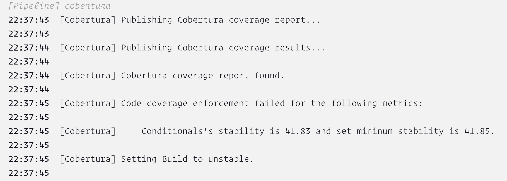

<!-- START doctoc generated TOC please keep comment here to allow auto update -->
<!-- DON'T EDIT THIS SECTION, INSTEAD RE-RUN doctoc TO UPDATE -->

- [coverage](#coverage)
  - [cobertura-plugin](#cobertura-plugin)
    - [libs](#libs)
    - [Jenkinsfile](#jenkinsfile)
    - [tips](#tips)
  - [coverage-plugin](#coverage-plugin)
    - [sample](#sample)
    - [libs](#libs-1)
    - [Jenkinsfile](#jenkinsfile-1)
- [deprecated](#deprecated)

<!-- END doctoc generated TOC please keep comment here to allow auto update -->

# coverage
## cobertura-plugin

> [!NOTE|label:references:]
> - [steps: Cobertura Plugin](https://www.jenkins.io/doc/pipeline/steps/cobertura/)
> - [#89 When coverage goes down threshold is updated and the build is not marked as unstable](https://github.com/jenkinsci/cobertura-plugin/issues/89#issuecomment-453506691)
> - [Jenkins Cobertura Plugin - reset Ratcheting / autoUpdateHealth values](https://stackoverflow.com/a/66161051/2940319) | [#124 Cannot reset ratcheted targets](https://github.com/jenkinsci/cobertura-plugin/issues/124)
> - [src/main/java/hudson/plugins/cobertura/CoberturaPublisher.java](https://github.com/jenkinsci/cobertura-plugin/blob/master/src/main/java/hudson/plugins/cobertura/CoberturaPublisher.java#L213)
>   - `PACKAGES`
>   - `FILES`
>   - `CLASSES`
>   - `CONDITIONAL`
>   - `LINE`
>   - `METHOD`
> - [Jenkins Pipeline With Python](https://skamalakannan.dev/posts/jenkins-pipeline-python/)

### libs
```groovy
def showCoverageReport( String xmlPath, Map targets = [:], Boolean failNoReports = true ) {
  Map<String, String> benchmarks = [
                                     conditional : '70, 0, 0' ,
                                            line : '80, 0, 0' ,
                                          method : '80, 0, 0' ,
                                          branch : '60, 0, 0'
                                   ]
  benchmarks = benchmarks << targets

  def file = findFiles( glob: xmlPath )
  if ( file.size() ) {
    String report = file.first().path
    println "coverage report file found in: ${report}"
    cobertura coberturaReportFile: report ,
              conditionalCoverageTargets: benchmarks.conditional ,
              lineCoverageTargets: benchmarks.line ,
              methodCoverageTargets: benchmarks.method ,
              failNoReports: failNoReports ,
              failUnhealthy: false,
              failUnstable: false,
              onlyStable: false,
              autoUpdateStability: true,
              autoUpdateHealth: false,
              enableNewApi: false

  } else {
    error "Could not find cobertura xml report in pattern: ${xmlPath}"
  }
}
```

### Jenkinsfile
recordCoverage qualityGates: [
                [criticality: 'NOTE' , integerThreshold: 30 , metric: 'MODULE'             , threshold: 30.0] ,
                [criticality: 'NOTE' , integerThreshold: 30 , metric: 'PACKAGE'            , threshold: 30.0] ,
                [criticality: 'NOTE' , integerThreshold: 30 , metric: 'FILE'               , threshold: 30.0] ,
                [criticality: 'NOTE' , integerThreshold: 30 , metric: 'CLASS'              , threshold: 30.0] ,
                [criticality: 'NOTE' , integerThreshold: 30 , metric: 'METHOD'             , threshold: 30.0] ,
                [criticality: 'NOTE' , integerThreshold: 30 , metric: 'LINE'               , threshold: 30.0] ,
                [criticality: 'NOTE' , integerThreshold: 30 , metric: 'BRANCH'             , threshold: 30.0] ,
                [criticality: 'NOTE' , integerThreshold: 30 , metric: 'INSTRUCTION'        , threshold: 30.0] ,
                [criticality: 'NOTE' , integerThreshold: 30 , metric: 'MUTATION'           , threshold: 30.0] ,
                [criticality: 'NOTE' , integerThreshold: 30 , metric: 'TEST_STRENGTH'      , threshold: 30.0] ,
                [criticality: 'NOTE' , integerThreshold: 30 , metric: 'COMPLEXITY'         , threshold: 30.0] ,
                [criticality: 'NOTE' , integerThreshold: 30 , metric: 'COMPLEXITY_MAXIMUM' , threshold: 30.0] ,
                [criticality: 'NOTE' , integerThreshold: 30 , metric: 'LOC'                , threshold: 30.0] ,
                [criticality: 'NOTE' , integerThreshold: 30 , metric: 'TESTS'              , threshold: 30.0]
              ],
              tools: [[parser: 'COBERTURA', pattern: 'a.xml']]

recordCoverage checksAnnotationScope: 'ALL_LINES',
               enabledForFailure: true,
               ignoreParsingErrors: true,
               qualityGates: [
                 [baseline: 'MODIFIED_LINES', criticality: 'NOTE', metric: 'LINE', threshold: 0.001]
               ],
               skipSymbolicLinks: true,
               sourceCodeRetention: 'EVERY_BUILD',
               sourceDirectories: [[path: '../Src']],
               tools: [[parser: 'COBERTURA', pattern: 'a.xml']]
- [Cobertura code coverage report for jenkins pipeline jobs](https://stackoverflow.com/a/44024599/2940319)
  ```groovy
  step([
        $class: 'CoberturaPublisher',
        autoUpdateHealth: false,
        autoUpdateStability: false,
        coberturaReportFile: '**/coverage.xml',
        failUnhealthy: false,
        failUnstable: false,
        maxNumberOfBuilds: 0,
        onlyStable: false,
        sourceEncoding: 'ASCII',
        zoomCoverageChart: false
     ])

  ```

- [When coverage goes down threshold is updated and the build is not marked as unstable](https://github.com/jenkinsci/cobertura-plugin/issues/89)
  ```groovy
  node('my-node') {
    [...]

    stage('Publish coverage report') {
      archive "coverage.xml"

      cobertura(
        coberturaReportFile: "coverage.xml",
        onlyStable: false,
        failNoReports: true,
        failUnhealthy: false,
        failUnstable: false,
        autoUpdateHealth: true,
        autoUpdateStability: true,
        zoomCoverageChart: true,
        maxNumberOfBuilds: 0,
        lineCoverageTargets: '80, 80, 80',
        conditionalCoverageTargets: '80, 80, 80',
        classCoverageTargets: '80, 80, 80',
        fileCoverageTargets: '80, 80, 80',
      )
    }
  }
  ```

### tips

- unstable build when thresholds decreased

  > [!NOTE|label:references:]
  > - [Jenkins Cobertura Plugin - reset Ratcheting / autoUpdateHealth values](https://stackoverflow.com/q/65133756/2940319)
  > - [#89 When coverage goes down threshold is updated and the build is not marked as unstable](https://github.com/jenkinsci/cobertura-plugin/issues/89#issuecomment-453506691)
  > - [#124 Cannot reset ratcheted targets](https://github.com/jenkinsci/cobertura-plugin/issues/124)

  ```groovy
  cobertura(
             ...
             autoUpdateStability: true,
             autoUpdateHealth: true,
           )
  ```

  - result
    ```
    [Pipeline] cobertura
    22:37:43  [Cobertura] Publishing Cobertura coverage report...
    22:37:43
    22:37:44  [Cobertura] Publishing Cobertura coverage results...
    22:37:44
    22:37:44  [Cobertura] Cobertura coverage report found.
    22:37:44
    22:37:45  [Cobertura] Code coverage enforcement failed for the following metrics:
    22:37:45
    22:37:45  [Cobertura]     Conditionals's stability is 41.83 and set mininum stability is 41.85.
    22:37:45
    22:37:45  [Cobertura] Setting Build to unstable.
    22:37:45
    [Pipeline] }
    ```

    [](../../screenshot/jenkins/jenkins-cobertura-decrease-unstable.png)

## [coverage-plugin](https://github.com/jenkinsci/coverage-plugin)

> [!NOTE|label:references:]
> - [Steps: Coverage Plugin](https://www.jenkins.io/doc/pipeline/steps/coverage/)
> - [jenkinsci/coverage-model](https://github.com/jenkinsci/coverage-model)
>   - [Index of incrementals/edu/hm/hafner](https://repo.jenkins-ci.org/incrementals/edu/hm/hafner/)
>   - [`public enum Metric`: src/main/java/edu/hm/hafner/coverage/Metric.java](https://github.com/jenkinsci/coverage-model/blob/main/src/main/java/edu/hm/hafner/coverage/Metric.java) | [qualityGates](https://www.jenkins.io/doc/pipeline/steps/coverage/)
>     - nodes that can have children
>       - `CONTAINER`
>       - `MODULE`
>       - `PACKAGE`
>       - `FILE`
>       - `CLASS`
>       - `METHOD`
>     - coverage values without children
>       - `LINE`
>       - `BRANCH`
>       - `INSTRUCTION`
>     - additional metrics without children
>       - `MUTATION`
>       - `TEST_STRENGTH`
>       - `COMPLEXITY`
>       - `COMPLEXITY_MAXIMUM`
>       - `COMPLEXITY_DENSITY`
>       - `LOC`
>       - `TESTS`
>   - [`src/main/java/edu/hm/hafner/coverage/registry/ParserRegistry.java`](https://github.com/jenkinsci/coverage-model/blob/main/src/main/java/edu/hm/hafner/coverage/registry/ParserRegistry.java)
>     - parser type:
>       - `COBERTURA`
>       - `JACOCO`
>       - `JUNIT`
>       - `PIT`
>       - `NUNIT`
>       - `OPENCOVER`
>       - `JUNIT`
>       - `XUNIT`
> - [sample workflow](https://github.com/jenkinsci/coverage-model/actions/runs/7781672728/workflow)

### sample

- [ci.jenkins.io: Core » jenkins » master #6073](https://ci.jenkins.io/job/Core/job/jenkins/job/master/6073/coverage/) | [#9194 Format 'admin' differently in the setup wizard for clarity](https://github.com/jenkinsci/jenkins/pull/9194) | [checkers](https://github.com/jenkinsci/jenkins/pull/9194/checks?check_run_id=24275010829)
- [app.codecov.io/gh/jenkinsci/coverage-plugin](https://app.codecov.io/gh/jenkinsci/coverage-plugin?search=&trend=12%20months)

### libs
```groovy

def showCoverageReport( String xmlPath, String sourcePath = '**/src', Map targets = [:] ) {
  Map<String, String> benchmarks = [
                                     conditional : '70, 0, 0' ,
                                            line : '80, 0, 0' ,
                                          method : '80, 0, 0' ,
                                          branch : '60, 0, 0'
                                   ]
  benchmarks = benchmarks << targets

  def file = findFiles( glob: xmlPath )
  if ( file.size() ) {
    String report = file.first().path
    println "coverage report file found: ${report}"

    discoverReferenceBuild()
    recordCoverage( name: 'Cobertura Coverage',
                    id: 'coverage',
                    tools: [[ parser: 'COBERTURA', pattern: xmlPath ]],
                    sourceDirectories: [[ path: sourcePath ]],
                    ignoreParsingErrors: true,
                    skipSymbolicLinks: false,
                    calculateDiffForChangeRequests: true,
                    failBuildIfCoverageDecreasedInChangeRequest: true,
                    sourceCodeRetention: 'EVERY_BUILD',
                    checksAnnotationScope: 'ALL_LINES',
                    qualityGates: [
                      [ threshold: benchmarks.line.split(',').first()   , metric: 'LINE'   , baseline: 'PROJECT'        , criticality: 'UNSTABLE' ] ,
                      [ threshold: 0.01                                 , metric: 'LINE'   , baseline: 'MODIFIED_LINES' , criticality: 'UNSTABLE' ] ,
                      [ threshold: benchmarks.branch.split(',').first() , metric: 'BRANCH' , baseline: 'PROJECT'        , criticality: 'UNSTABLE' ]
                    ]
                  )
  } else {
    error( "Could not find cobertura xml report in pattern: ${xmlPath}" )
  }
}
```

### Jenkinsfile

> [!NOTE|label:references:]
> - [EXPLAIN/Prototype feedback-component/Jenkinsfile](https://www.uni-hildesheim.de/gitlab/explain/prototyp-feedbackcomponent/-/blob/main/Jenkinsfile?ref_type=heads#L87)
> - [jenkins-jenkins-2.455/Jenkinsfile](https://fossies.org/linux/jenkins/Jenkinsfile)

- [jenkinsci/jenkins/Jenkinsfile](https://github.com/jenkinsci/jenkins/blob/master/Jenkinsfile)
  ```groovy
  recordCoverage(tools: [[parser: 'JACOCO', pattern: 'coverage/target/site/jacoco-aggregate/jacoco.xml']],
  sourceCodeRetention: 'MODIFIED', sourceDirectories: [[path: 'core/src/main/java']])
  ```

- [prototyp-feedbackcomponent/Jenkinsfile](https://www.uni-hildesheim.de/gitlab/explain/prototyp-feedbackcomponent/-/blob/main/Jenkinsfile?ref_type=heads#L87)
  ```groovy
  // New Coverage Tool: Cobertura + Coverage Plugin
  recordCoverage qualityGates: [[metric: 'LINE', threshold: 1.0], [metric: 'BRANCH', threshold: 1.0]], tools: [[parser: 'COBERTURA', pattern: 'src/output/test/coverage/cobertura-coverage.xml']]
  ```

# deprecated

> [!NOTE|label:references:]
> - [Steps: Code Coverage Plugin](https://www.jenkins.io/doc/pipeline/steps/code-coverage-api/#code-coverage-plugin)
> - [failBuildIfCoverageDecreasedInChangeRequest](https://github.com/jenkinsci/code-coverage-api-plugin/pull/372)

- [Code Coverage](https://plugins.jenkins.io/code-coverage-api/)
  ```groovy
  def publishCoverage( String xmlPath ) {
    def file = findFiles( glob: xmlPath )

    if ( file.size() ) {
      String report = file.first().path
      color.info( "coverage report file: ${report}" )
      archiveArtifacts artifacts: report

      publishCoverage adapters: [
                        cobertura( path: xmlPath, thresholds: [[ thresholdTarget: 'Conditional', unstableThreshold: 30.0 ]] )
                      ],
                      applyThresholdRecursively: true,
                      failBuildIfCoverageDecreasedInChangeRequest: false,
                      failNoReports: false,
                      failUnhealthy: false,
                      failUnstable: false,
                      skipPublishingChecks: false,
                      globalThresholds: [[ thresholdTarget: 'Conditional', unstableThreshold: 30.0 ]],
                      sourceDirectories: [[ path: '../Src' ]],
                      sourceFileResolver: sourceFiles('STORE_ALL_BUILD')
    } else {
      error( "Could not find cobertura xml report in pattern ${xmlPath}" )
    }
  }
  ```

  - [#657 Stored source code files should use a unique path](https://github.com/jenkinsci/code-coverage-api-plugin/issues/657)
    ```groovy
    publishCoverage(
        adapters: [coberturaReportAdapter(mergeToOneReport: true, path: '**/*cobertura*.xml')],
        calculateDiffForChangeRequests: true,
        failNoReports: true,
        globalThresholds: [[thresholdTarget: 'Line', unstableThreshold: 89.0]]
    )
    ```

  - [jenkins declerative pipeline - fail build when coverage drops](https://stackoverflow.com/a/76436571/2940319)
    ```groovy
    def coverage = [
      'applyThresholdRecursively':true,
      'failBuildIfCoverageDecreasedInChangeRequest':true,
      /* ... etc ... */
    ]
    coverage.globalThresholds = [[
      failUnhealthy: false,
      thresholdTarget: 'File',
      unhealthyThreshold: 1.0,
      unstableThreshold: 0.0
    ]] //use your own values here
    def coverageFilePath = 'path-to-your-coverage-file'

    publishCoverage(
      adapters: [ coberturaAdapter(mergeToOneReport: true, path: coverageFilePath) ],
      applyThresholdRecursively: coverage.applyThresholdRecursively,
      failBuildIfCoverageDecreasedInChangeRequest: coverage.failBuildIfCoverageDecreasedInChangeRequest,
      failNoReports: coverage.failNoReports,
      failUnhealthy: coverage.failUnhealthy,
      failUnstable: coverage.failUnstable,
      globalThresholds: coverage.globalThresholds
    )
    ```
