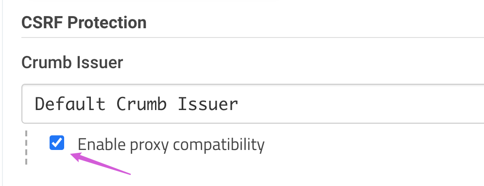

<!-- START doctoc generated TOC please keep comment here to allow auto update -->
<!-- DON'T EDIT THIS SECTION, INSTEAD RE-RUN doctoc TO UPDATE -->
**Table of Contents**  *generated with [DocToc](https://github.com/thlorenz/doctoc)*

- [enables proxy compatibility on startup](#enables-proxy-compatibility-on-startup)
- [Improved CSRF protection](#improved-csrf-protection)

<!-- END doctoc generated TOC please keep comment here to allow auto update -->


### [enables proxy compatibility on startup](https://issues.jenkins.io/browse/JENKINS-50767?focusedCommentId=336011&page=com.atlassian.jira.plugin.system.issuetabpanels%3Acomment-tabpanel#comment-336011)
```bash
-Djenkins.model.Jenkins.crumbIssuerProxyCompatibility=true
```

#### change in `Configure Global Security`


### [Improved CSRF protection](https://www.jenkins.io/doc/upgrade-guide/2.176/#SECURITY-626)
> Upgrading to Jenkins 2.176.2
> - [SECURITY-626](https://www.jenkins.io/security/advisory/2019-07-17/#SECURITY-626)
> - [CSRF](https://en.wikipedia.org/wiki/Cross-site_request_forgery) tokens (crumbs) are now only valid for the web session they were created in to limit the impact of attackers obtaining them. Scripts that obtain a crumb using the `/crumbIssuer/api` URL will now fail to perform actions protected from CSRF unless the scripts retain the web session ID in subsequent requests.


Scripts could instead use an API token, which has not required a CSRF token (crumb) since Jenkins [2.96](https://www.jenkins.io/changelog/#v2.96).


#### To disable this improvement you can set the system property
- via `JAVA_OPT`
  ```bash
  -Dhudson.security.csrf.DefaultCrumbIssuer.EXCLUDE_SESSION_ID=true
  ```
- via plugin [Strict Crumb Issuer](https://plugins.jenkins.io/strict-crumb-issuer)
