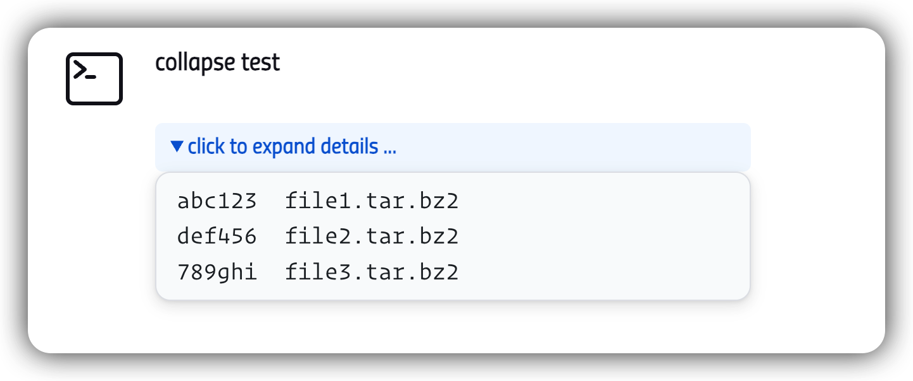
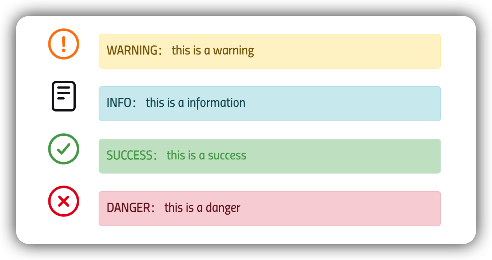

<!-- START doctoc generated TOC please keep comment here to allow auto update -->
<!-- DON'T EDIT THIS SECTION, INSTEAD RE-RUN doctoc TO UPDATE -->

- [setup](#setup)
- [usage](#usage)
  - [collapse](#collapse)
  - [table](#table)
- [banner](#banner)

<!-- END doctoc generated TOC please keep comment here to allow auto update -->

> [!NOTE|label:references:]
> - [Customizable HTML Formatter](https://plugins.jenkins.io/custom-markup-formatter/)

## setup

1. go to **Manage Jenkins** → **Security** → **Markup Formatter**, and select **Customizable HTML Formatter**
2. go to **Manage Jenkins** → **Configure System** → **Customizable HTML Formatter Plugin**, and add the following content into the **Policy**

   ```json
    [
      {
        "type": "inbuilt",
        "name": "blocks, formatting, styles, links, tables, images"
      },
      {
        "type": "new",
        "allow": {
          "dl, dt, dd, hr": "",
          "details, summary": "",
          "pre, code": "",
          "div, span": "style, class",
          "font": "size, color",
          "table": "class",
          "thead, tbody, tr": "",
          "th": "class",
          "td": "class",
          "a": "href, class, rel",
          "svg": "xmlns, viewBox, aria-hidden, style",
          "ellipse": "cx, cy, rx, ry, fill, stroke, stroke-linecap, stroke-miterlimit, stroke-width",
          "path": "d, fill, stroke, stroke-linecap, stroke-linejoin, stroke-width"
        }
      }
    ]
   ```

## usage

### collapse

```json
// policy
[
 {
   "type": "inbuilt",
   "name": "blocks, formatting, styles, links, tables, images"
 },
 {
   "type": "new",
   "allow": {
     "dl, dt, dd, hr": "",
     "details, summary": "",
     "pre, code": "",
     "div, span": "style",
     "font": "size, color"
   }
 }
]
```

```groovy
addSummary(
  icon: 'symbol-terminal-outline plugin-ionicons-api',
  text: '<h4>collapse test</h4>' +
        '<details>' +
          '<summary>click to expand details ...</summary>' +
          '<pre><code>' +
            'abc123  file1.tar.bz2<br>' +
            'def456  file2.tar.bz2<br>' +
            '789ghi  file3.tar.bz2<br>' +
          '</code></pre>' +
        '</details>'
)

// or fancy version
Map<String, String> styles = [
  pre      : 'display:block;background-color:#FAFBFC;color:#24292E;padding:8px 16px;border-radius:12px;border:1px solid #E1E4E8;font-size:13px;overflow-x:auto;box-shadow:0 4px 12px rgba(0,0,0,0.1),0 1px 3px rgba(0,0,0,0.06)',
  monofont : 'font-family: var(--font-family-mono, ui-monospace, SFMono-Regular, "Cascadia Code", Consolas, Menlo, Monaco, monospace)',
  summary  : 'cursor:pointer;color:#0366D6;font-weight:bold;padding:6px 12px;background-color:#F1F8FF;border-radius:6px'
]

String body = '''
              abc123  file1.tar.bz2
              def456  file2.tar.bz2
              789ghi  file3.tar.bz2
              '''.stripIndent().trim()
String html = "<pre style=\"${styles.pre};${styles.monofont}\"><code style=\"font-family:inherit;\">${body}</code></pre>"
html        = "<details style=\"margin-bottom:16px;\"><summary style=\"${styles.summary}\">click to expand details ...</summary>${html}</details>"
html        = "<h4>collapse test</h4>${html}"

addSummary icon: 'symbol-terminal-outline plugin-ionicons-api', text: html
```



### table

> [!NOTE|label:references:]
> - [customizable-header plugin/Design Library/Table](https://weekly.ci.jenkins.io/design-library/table/)
>   - `class="jenkins-table sortable"`: make the table sortable by clicking the header

```json
// policy
[
  {
    "type": "inbuilt",
    "name": "blocks, formatting, styles, links, tables, images"
  },
  {
    "type": "new",
    "allow": {
      "dl, dt, dd, hr": "",
      "details, summary": "",
      "pre, code": "",
      "div, span": "style, class",
      "font": "size, color",
      "table": "class",
      "thead, tbody, tr": "",
      "th": "class",
      "td": "class",
      "a": "href, class, rel",
      "svg": "xmlns, viewBox, aria-hidden, style",
      "ellipse": "cx, cy, rx, ry, fill, stroke, stroke-linecap, stroke-miterlimit, stroke-width",
      "path": "d, fill, stroke, stroke-linecap, stroke-linejoin, stroke-width"
    }
  }
]
```

```groovy
// jenkinsfile
Closure svgs = { String color ->
  [
    blue   : '''<svg xmlns="http://www.w3.org/2000/svg" aria-hidden="true" viewBox="0 0 512 512" style="width:20px; height:20px;"><ellipse cx="256" cy="256" fill="none" rx="210" ry="210" stroke="var(--success-color)" stroke-linecap="round" stroke-miterlimit="10" stroke-width="36"></ellipse><path d="M336 189L224 323L176 269.4" fill="transparent" stroke="var(--success-color)" stroke-linecap="round" stroke-linejoin="round" stroke-width="36"></path></svg>''',
    red    : '''<svg xmlns="http://www.w3.org/2000/svg" aria-hidden="true" viewBox="0 0 512 512" style="width:20px; height:20px;"><ellipse cx="256" cy="256" fill="none" rx="210" ry="210" stroke="var(--red)" stroke-linecap="round" stroke-miterlimit="10" stroke-width="36"></ellipse><path d="M320 320L192 192M192 320l128-128" fill="none" stroke="var(--red)" stroke-linecap="round" stroke-linejoin="round" stroke-width="36"></path></svg>''',
    yellow : '''<svg xmlns="http://www.w3.org/2000/svg" aria-hidden="true" viewBox="0 0 512 512" style="width:20px; height:20px;"><ellipse cx="256" cy="256" fill="none" rx="210" ry="210" stroke="var(--orange)" stroke-linecap="round" stroke-miterlimit="10" stroke-width="36"></ellipse><path d="M250.26 166.05L256 288l5.73-121.95a5.74 5.74 0 00-5.79-6h0a5.74 5.74 0 00-5.68 6z" fill="none" stroke="var(--orange)" stroke-linecap="round" stroke-linejoin="round" stroke-width="36"></path><ellipse cx="256" cy="350" fill="var(--orange)" rx="26" ry="26"></ellipse></svg>'''
  ].get( color, '' )
}

addSummary icon: 'symbol-terminal',
           text: """
                 <table class="jenkins-table sortable">
                   <thead>
                     <tr><th>Name</th><th>S</th><th>Status</th><th>Reason</th></tr>
                   </thead>
                   <tbody>
                     <tr>
                       <td><a href="#" class="jenkins-table__link">Link 1</a></td>
                       <td class="jenkins-table__cell">${svgs('blue')}</td>
                       <td>Success <a href="#">#7</a></td>
                       <td>No Errors</td>
                     </tr>
                     <tr>
                       <td><a href="#" class="jenkins-table__link">Link 2</a></td>
                       <td class="jenkins-table__cell">${svgs('red')}</td>
                       <td>Failure</td>
                       <td>Can't compile</td>
                     </tr>
                     <tr>
                       <td><a href="#" class="jenkins-table__link">Link 3</a></td>
                       <td class="jenkins-table__cell">${svgs('yellow')}</td>
                       <td>Unstable</td>
                       <td>Test Failed</td>
                     </tr>
                   </tbody>
                 </table>
                 """.stripIndent()
```

## banner

> [!NOTE|label:references:]
> - [customizable-header plugin/Design Library/Banner](https://weekly.ci.jenkins.io/design-library/banner/)


```groovy
Closure banner = { String message, String type = 'info' ->
  Map<String, Map<String, String>> colors = [
    warning: [ bg: '#fff3cd', color: '#856404', border: '#ffeeba' ],
    info:    [ bg: '#d1ecf1', color: '#0c5460', border: '#bee5eb' ],
    danger:  [ bg: '#f8d7da', color: '#721c24', border: '#f5c6cb' ],
    success: [ bg: '#CAE4CC', color: '#51a556', border: '#CFE6D1' ]
  ]
  Map<String, String> style = colors.getOrDefault( type.toLowerCase(), 'info' )

  """
  <div style="background-color: ${style.bg}; color: ${style.color}; border: 1px solid ${style.border}; padding: 10px; border-radius: 5px; margin: 10px 0; font-family: sans-serif;">
      <strong>${type.toUpperCase()}：</strong> ${message}
  </div>
  """.stripIndent().trim()
}

addSummary icon: 'symbol-status-yellow' , text: banner('this is a warning'     , 'warning' )
addSummary icon: 'symbol-details'       , text: banner('this is a information' , 'info'    )
addSummary icon: 'symbol-status-blue'   , text: banner('this is a success'     , 'success' )
addSummary icon: 'symbol-status-red'    , text: banner('this is a danger'      , 'danger'  )
```



<!--sec data-title="original banner style" data-id="section0" data-show=true data-collapse=true ces-->
- `:root` and color variables
  ```css
  :root {
      --alert-success-text-color: var(--success-color);
      --alert-success-bg-color: color-mix(in sRGB, var(--success-color) 4%, transparent);
      --alert-info-text-color: var(--accent-color);
      --alert-info-bg-color: color-mix(in sRGB, var(--accent-color) 4%, transparent);
      --alert-warning-text-color: color-mix(in sRGB, var(--warning-color) 80%, var(--text-color));
      --alert-warning-bg-color: color-mix(in sRGB, var(--warning-color) 4%, transparent);
      --alert-danger-text-color: var(--error-color);
      --alert-danger-bg-color: color-mix(in sRGB, var(--error-color) 4%, transparent);
      --error-color: var(--red);
      --warning-color: var(--orange);
      --success-color: var(--green);
      --skipped-color: var(--text-color-secondary);
      --destructive-color: var(--red);
      --build-color: var(--green);
      --danger-color: var(--red);
      --info-color: var(--blue);
      --green: oklch(65% 0.14 145);
  }

  [data-theme=dark-system] {
      --accent-color: oklch(65.13% 0.1987 265);
      --blue: oklch(64.23% 0.3 252.93deg);
      --light-blue: oklch(82.115% 0.3 252.93deg);
      --dark-blue: oklch(32.115% 0.3 252.93deg);
      --brown: oklch(63.14% 0.1 65.44deg);
      --light-brown: oklch(81.57% 0.1 65.44deg);
      --dark-brown: oklch(31.57% 0.1 65.44deg);
      --cyan: oklch(80.37% 0.1296 232.62deg);
      --light-cyan: oklch(90.185% 0.1296 232.62deg);
      --dark-cyan: oklch(40.185% 0.1296 232.62deg);
      --green: oklch(80.25% 0.2197 147.09deg);
      --light-green: oklch(90.125% 0.2197 147.09deg);
      --dark-green: oklch(40.125% 0.2197 147.09deg);
      --indigo: oklch(57.48% 0.26 281.95deg);
      --light-indigo: oklch(78.74% 0.26 281.95deg);
      --dark-indigo: oklch(28.74% 0.26 281.95deg);
      --orange: oklch(79.58% 0.1862 62.09deg);
      --light-orange: oklch(89.79% 0.1862 62.09deg);
      --dark-orange: oklch(39.79% 0.1862 62.09deg);
      --pink: oklch(70.1% 0.25 13.88deg);
      --light-pink: oklch(85.05% 0.25 13.88deg);
      --dark-pink: oklch(35.05% 0.25 13.88deg);
      --purple: oklch(62.75% 0.2634 311.52deg);
      --light-purple: oklch(81.375% 0.2634 311.52deg);
      --dark-purple: oklch(31.375% 0.2634 311.52deg);
      --red: oklch(66.82% 0.2393 29.84deg);
      --light-red: oklch(83.41% 0.2393 29.84deg);
      --dark-red: oklch(33.41% 0.2393 29.84deg);
      --yellow: oklch(90.35% 0.1872 95.31deg);
      --light-yellow: oklch(95.175% 0.1872 95.31deg);
      --dark-yellow: oklch(45.175% 0.1872 95.31deg);
      --teal: oklch(73.05% 0.1217 216.13deg);
      --light-teal: oklch(86.525% 0.1217 216.13deg);
      --dark-teal: oklch(36.525% 0.1217 216.13deg);
      --white: oklch(from var(--accent-color) 98% 0.015 h);
      --text-color-secondary: oklch(from var(--white) 0.7 0.038 h);
  }
  ```

- `.jenkins-alert`
  ```css
  .alert, .jenkins-alert {
      border: var(--jenkins-border-width) solid rgb(from currentcolor r g b / .1);
      border-radius: var(--form-input-border-radius);
      font-size: var(--font-size-sm);
      margin-bottom: var(--section-padding);
      padding: 1rem;
  }
  ```

- `.jenkins-alert-info`
  ```css
  .jenkins-alert-info {
      background-color: var(--alert-info-bg-color);
      color: var(--alert-info-text-color);
  }
  ```

- `.jenkins-alert-warning`
  ```css
  .jenkins-alert-warning {
      background-color: var(--alert-warning-bg-color);
      color: var(--alert-warning-text-color);
  }
  ```

- `.jenkins-alert-danger`
  ```css
  .jenkins-alert-danger, .jenkins-alert-danger p {
      color: var(--alert-danger-text-color);
  }
  ```
<!--endsec-->
