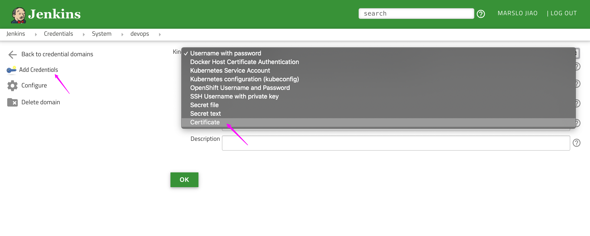
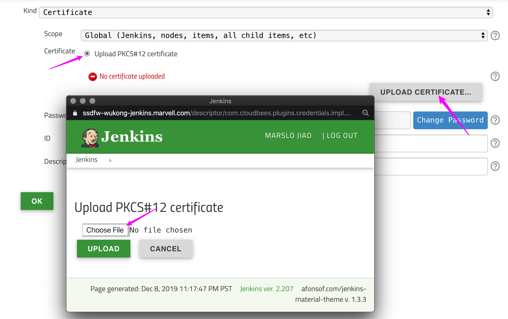
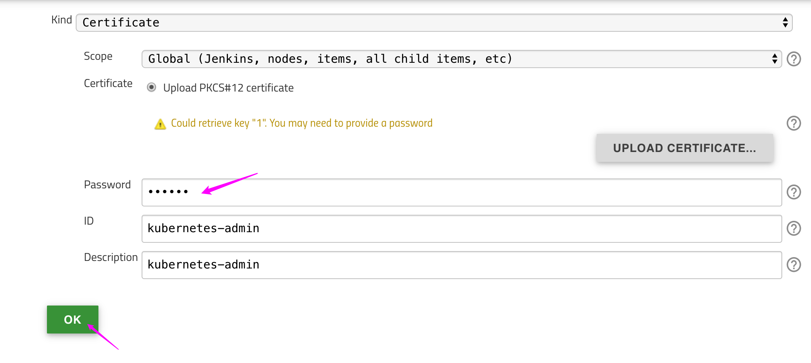
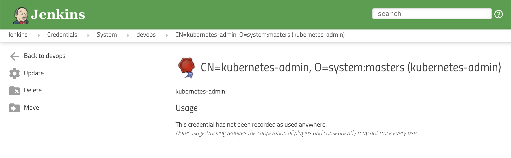
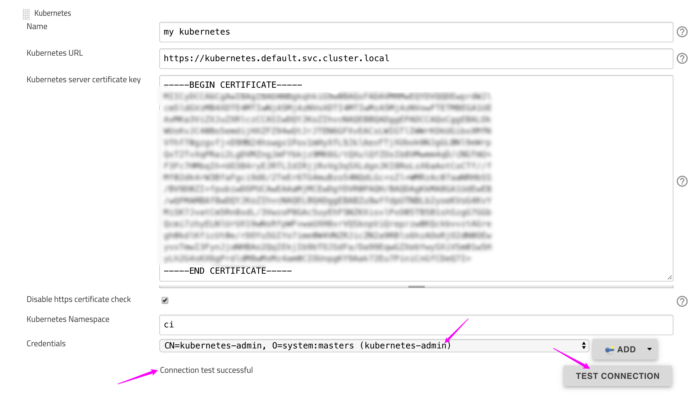
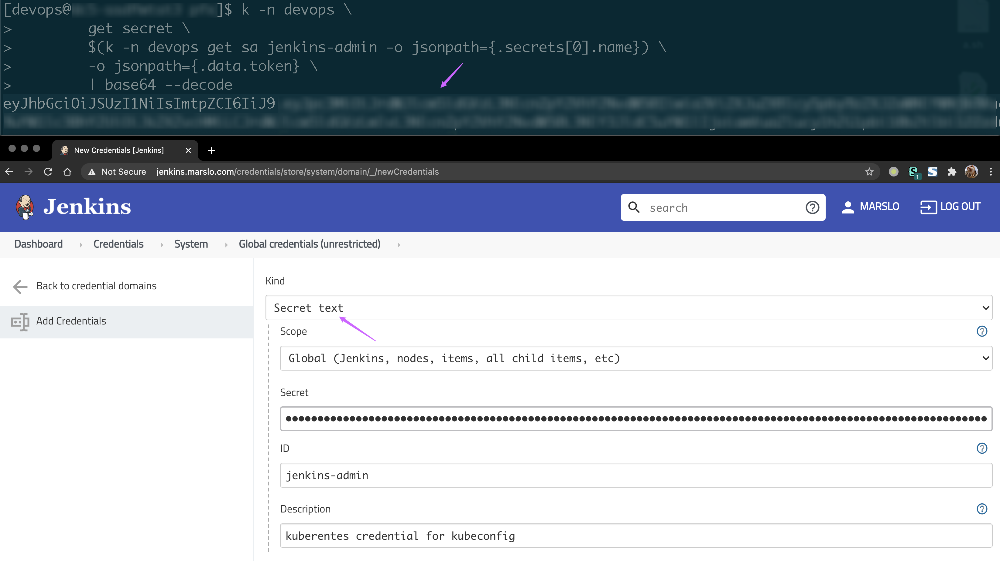
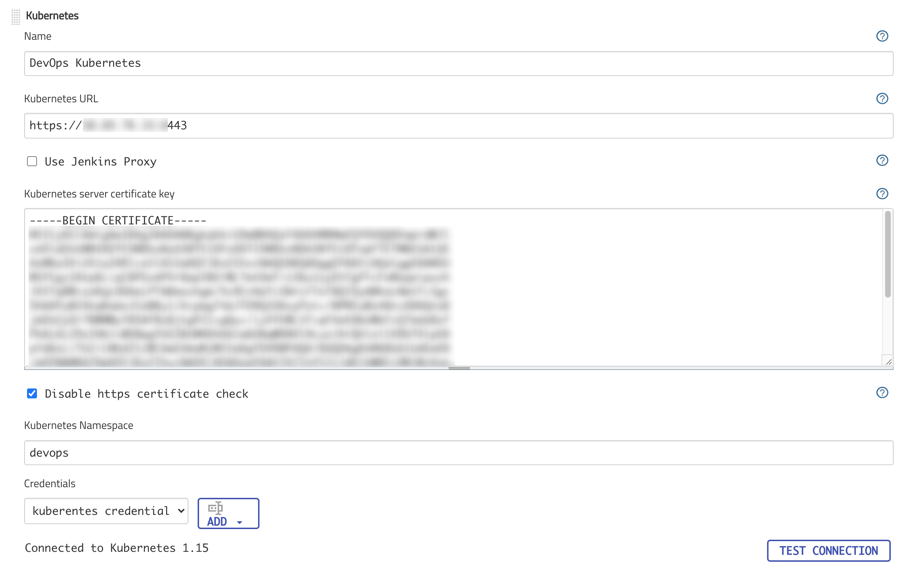

<!-- START doctoc generated TOC please keep comment here to allow auto update -->
<!-- DON'T EDIT THIS SECTION, INSTEAD RE-RUN doctoc TO UPDATE -->
**Table of Contents**  *generated with [DocToc](https://github.com/thlorenz/doctoc)*

- [namespace](#namespace)
- [generate credentials for pfx](#generate-credentials-for-pfx)
- [full steps](#full-steps)
- [configure in jenkins](#configure-in-jenkins)
- [using kubeconfig for remote cluster credential](#using-kubeconfig-for-remote-cluster-credential)
- [using ClusterRoleBinding](#using-clusterrolebinding)
- [pull with credentials](#pull-with-credentials)
- [Q&A](#qa)

<!-- END doctoc generated TOC please keep comment here to allow auto update -->



> references:
> - [podTempate](https://plugins.jenkins.io/kubernetes/#plugin-content-pod-template)
> - [Jenkins Kubernetes Plugin: Running Agents In Other Clusters](https://www.moogsoft.com/blog/jenkins-kubernetes-plugin-running-agents-in-other-clusters/)
> - [Jenkins Kubernetes Plugin: Using the plugin in your pipelines](https://www.moogsoft.com/blog/jenkins-kubernetes-plugin-using-the-plugin-in-your-pipelines/)
> - [Create Kubernetes Service Accounts and Kubeconfigs](https://docs.armory.io/armory-enterprise/armory-admin/manual-service-account/)
> - [Setup Jenkins Pipeline and Blue Ocean in Kubernetes](https://hustakin.github.io/bestpractice/setup-jenkins-pipeline-in-kubernetes/)
> - [* How to Setup Jenkins Build Agents on Kubernetes Pods](https://devopscube.com/jenkins-build-agents-kubernetes/)
> - [Pull an Image from a Private Registry](https://kubernetes.io/docs/tasks/configure-pod-container/pull-image-private-registry/)
> - [从私有仓库拉取镜像](https://kubernetes.io/zh-cn/docs/tasks/configure-pod-container/pull-image-private-registry/)
> - [How to access webSockets for Jenkins inbound agents?](https://docs.cloudbees.com/docs/cloudbees-ci-kb/latest/client-and-managed-controllers/how-to-access-websockets-for-jenkins-inbound-agents)


### namespace
#### namespace
```bash
$ cat << EOF | kubectl apply -f -
  ---
  apiVersion: v1
  kind: Namespace
  metadata:
    name: jenkins
EOF
namespace/jenkins created
```

#### quota
```bash
$ cat << EOF | kubectl apply -f -
  apiVersion: v1
  kind: ResourceQuota
  metadata:
    name: jenkins-quota
    namespace: jenkins
  spec:
    hard:
      requests.cpu: "16"
      requests.memory: 16Gi
      limits.cpu: "32"
      limits.memory: 32Gi
EOF
resourcequota/jenkins-quota edited
```

#### sa.yml

- [jenkins.io](https://www.jenkins.io/doc/book/installing/kubernetes/)
  ```yaml
    ---
    apiVersion: rbac.authorization.k8s.io/v1
    kind: ClusterRole
    metadata:
      name: jenkins-admin
    rules:
      - apiGroups: [""]
        resources: ["*"]
        verbs: ["*"]
    ---
    apiVersion: v1
    kind: ServiceAccount
    metadata:
      name: jenkins-admin
      namespace: devops-tools
    ---
    apiVersion: rbac.authorization.k8s.io/v1
    kind: ClusterRoleBinding
    metadata:
      name: jenkins-admin
    roleRef:
      apiGroup: rbac.authorization.k8s.io
      kind: ClusterRole
      name: jenkins-admin
    subjects:
    - kind: ServiceAccount
      name: jenkins-admin
      namespace: devops-tools
  ```
- [or](https://devopscube.com/jenkins-build-agents-kubernetes/)
  ```yaml
  apiVersion: v1
  kind: ServiceAccount
  metadata:
    name: jenkins-admin
    namespace: devops-tools
  ---
  apiVersion: rbac.authorization.k8s.io/v1
  kind: Role
  metadata:
    name: jenkins
    namespace: devops-tools
    labels:
      "app.kubernetes.io/name": 'jenkins'
  rules:
  - apiGroups: [""]
    resources: ["pods"]
    verbs: ["create","delete","get","list","patch","update","watch"]
  - apiGroups: [""]
    resources: ["pods/exec"]
    verbs: ["create","delete","get","list","patch","update","watch"]
  - apiGroups: [""]
    resources: ["pods/log"]
    verbs: ["get","list","watch"]
  - apiGroups: [""]
    resources: ["secrets"]
    verbs: ["get"]
  ---
  apiVersion: rbac.authorization.k8s.io/v1
  kind: RoleBinding
  metadata:
    name: jenkins-role-binding
    namespace: devops-tools
  roleRef:
    apiGroup: rbac.authorization.k8s.io
    kind: Role
    name: jenkins
  subjects:
  - kind: ServiceAccount
    name: jenkins-admin
    namespace: devops-tools
  ```

- [grant more permissions via RoleBinding](https://hustakin.github.io/bestpractice/setup-jenkins-pipeline-in-kubernetes/)
  ```yaml
  apiVersion: v1
  kind: ServiceAccount
  metadata:
    name: jenkins
    namespace: devops
  ---
  kind: ClusterRole
  apiVersion: rbac.authorization.k8s.io/v1beta1
  metadata:
    name: jenkins
  rules:
    - apiGroups: ["extensions", "apps"]
      resources: ["deployments"]
      verbs: ["create", "delete", "get", "list", "watch", "patch", "update"]
    - apiGroups: [""]
      resources: ["services"]
      verbs: ["create", "delete", "get", "list", "watch", "patch", "update"]
    - apiGroups: [""]
      resources: ["pods"]
      verbs: ["create","delete","get","list","patch","update","watch"]
    - apiGroups: [""]
      resources: ["pods/exec"]
      verbs: ["create","delete","get","list","patch","update","watch"]
    - apiGroups: [""]
      resources: ["pods/log"]
      verbs: ["get","list","watch"]
    - apiGroups: [""]
      resources: ["secrets"]
      verbs: ["get"]
  ---
  apiVersion: rbac.authorization.k8s.io/v1beta1
  kind: ClusterRoleBinding
  metadata:
    name: jenkins
    namespace: devops
  roleRef:
    apiGroup: rbac.authorization.k8s.io
    kind: ClusterRole
    name: jenkins
  subjects:
    - kind: ServiceAccount
      name: jenkins
      namespace: devops
  ```

### generate credentials for pfx
#### ca.crt
```bash
$ grep certificate-authority-data ~/.kube/config | awkubectl -F': ' '{print $NF}' |  base64 -d > ca.crt
# OR
$ sudo cat /etc/kubernetes/pki/ca.crt
```

#### client.crt & client.key
```bash
$ grep client-certificate-data ~/.kube/config | awkubectl -F': ' '{print $NF}' |  base64 -d > client.crt
$ grep client-key-data ~/.kube/config | awkubectl -F': ' '{print $NF}' |  base64 -d > client.key
```

#### cert.pfx
```bash
$ openssl pkcs12 -export -out cert.pfx -inkey client.key -in client.crt -certfile ca.crt
Enter Export Password:
Verifying - Enter Export Password:

$ ls
ca.crt  cert.pfx  client.crt  client.key

# or

# using password 'marslo'
$ openssl pkcs12 -export -out cert.pfx -inkey client.key -in client.crt -certfile ca.crt -password pass:marslo
```

### full steps
```bash
$ cat ~/.kube/config \
      | grep certificate-authority-data \
      | awkubectl '{print $2}' \
      | base64 -d > ca.crt
$ cat ~/.kube/config \
      | grep client-certificate-data \
      | awkubectl '{print $2}' \
      | base64 -d > client.crt
$ cat ~/.kube/config \
      | grep client-key-data \
      | awkubectl '{print $2}' \
      | base64 -d > client.key
$ openssl pkcs12 -export \
                 -out cert.pfx \
                 -in client.crt \
                 -inkey client.key \
                 -certfile ca.crt \
                 -password pass:devops
```

### configure in jenkins

> [!NOTE]
> - url
>   - by default: `http://<service-name>.<namespace>.svc.cluster.local:8080`

* `Manage Jenkins` -> `Configure System` or `Manage Jenkins` -> `Manage Nodes and Clouds` -> `Configure Clouds`
* `Add a new Cloud` -> `Kuberentes`
  * `Name`: <Anything you want>
  * `Kubernetes URL`:
    * get from `$ kubectl cluster-info`
    * using `https://kubernetes.default.svc.cluster.local`
  * `Kubernetes server certificate key`: content of `ca.crt`. (`$ cat ca.crt`)
  * `Credentials`:
    * `Add` -> `Jenkins`
    * **Kind**: `Certificate`

  

  

  

  

* setup in jenkins

  


### using kubeconfig for remote cluster credential


> reference:
> - [jenkinsci/kubernetes-cli-plugin](https://github.com/jenkinsci/kubernetes-cli-plugin/blob/master/README.md#using-the-plugin-from-the-web-interface)
> - [Kubernetes Plugin: Authenticate with a ServiceAccount to a remote cluster](https://support.cloudbees.com/hc/en-us/articles/360038636511-Kubernetes-Plugin-Authenticate-with-a-ServiceAccount-to-a-remote-cluster)
> - [Creating a kubeconfig file for a self-hosted Kubernetes cluster](http://docs.shippable.com/deploy/tutorial/create-kubeconfig-for-self-hosted-kubernetes-cluster/)
> - [How to find your Jenkins admin password on Kubernetes](https://opensource.com/article/19/6/jenkins-admin-password-helm-kubernetes)


#### get Kubernetes URL
```bash
$ kubectl config view --minify | sed -n -re 's/^.*server: (https.*)$/\1/p'
```

- [or](https://gist.github.com/miry/9fbb8947510294c25285bda2a6e11900#gistcomment-2952487)
  ```bash
  $ kubectl config view --minify --raw --output 'jsonpath={..cluster.server}'
  ```

#### generate CA


> the content can be also found in `kubernetes-master:/etc/kubernetes/pki/ca.crt`


```bash
$ kubectl -n jenkins get secret \
              $(kubectl -n jenkins get sa jenkins-admin -o jsonpath={.secrets[0].name}) \
              -o jsonpath={.data.'ca\.crt'} \
              | base64 --decode
```
- or
  ```bash
  $ cat ~/.kube/config \
        | grep certificate-authority-data \
        | awkubectl '{print $2}' \
        | base64 -d > ca.crt
  ```

#### Generate token in kubernetes


> ```bash
> $ namespace='devops'
> $ serviceAccount='jenkins-admin'
> $ alias k='kubectl'
> ```


- setup sa
  ```bash
  $ kubectl -n jenkins create sa jenkins-admin
  $ kubectl -n jenkins create rolebinding jenkins-admin-binding \
                       --clusterrole=cluster-admin \
                       --serviceaccount=devops:jenkins-admin
  ```
- get token
  
  ```bash
  $ kubectl -n jenkins \
         get sa jenkins-admin \
         -o go-template \
         --template='{{range .secrets}}{{.name}}{{"\n"}}{{end}}'
  jenkins-admin-token-kshsh

  $ kubectl -n jenkins \
         get secrets jenkins-admin-token-kshsh \
         -o go-template \
         --template '{{index .data "token"}}' \
         | base64 -d
  eyJhbGciOiJSUzI1NiIsImtpZCI6IiJ9.***
  ```
  

  - more info
    ```bash
    $ kubectl get secret -n jenkins
    NAME                        TYPE                                  DATA   AGE
    default-token-8k7vj         kubernetes.io/service-account-token   3      27m
    jenkins-admin-token-9r8pt   kubernetes.io/service-account-token   3      21m

    $ kubectl -n jenkins get rolebinding
    NAME                    AGE
    jenkins-admin-binding   15m
    $ kubectl -n jenkins describe rolebinding jenkins-admin-binding
    Name:         jenkins-admin-binding
    Labels:       <none>
    Annotations:  <none>
    Role:
      Kind:  ClusterRole
      Name:  cluster-admin
    Subjects:
      Kind            Name           Namespace
      ----            ----           ---------
      ServiceAccount  jenkins-admin  jenkins

    $ kubectl describe clusterrolebindings jenkins-admin-cluster-binding
    Name:         jenkins-admin-cluster-binding
    Labels:       <none>
    Annotations:  <none>
    Role:
      Kind:  ClusterRole
      Name:  cluster-admin
    Subjects:
      Kind            Name           Namespace
      ----            ----           ---------
      ServiceAccount  jenkins-admin  jenkins
    ```

  - [or](https://support.cloudbees.com/hc/en-us/articles/360038636511-Kubernetes-Plugin-Authenticate-with-a-ServiceAccount-to-a-remote-cluster)
    ```bash
    $ kubectl -n jenkins \
        get secret \
        $(kubectl -n jenkins get sa jenkins-admin -o jsonpath={.secrets[0].name}) \
        -o jsonpath={.data.token} \
        | base64 --decode
    ```
  - [or](https://stackoverflow.com/a/48853727/2940319)
    
    ```bash
    $ kubectl -n jenkins \
           get sa jenkins-admin \
           --template='{{range .secrets}}{{ .name }} {{end}}' \
           | xargs -n 1 kubectl -n jenkins get secret \
                          --template='{{ if .data.token }}{{ .data.token }}{{end}}' \
                          | head -n 1 \
                          | base64 -d -
    ```
    

  - [or](https://devopscube.com/jenkins-build-agents-kubernetes/)
    ```bash
    # sa='jenkins-admin'
    $ kubectl -n jenkins \
                 get secrets \
                 $(kubectl -n jenkins get sa ${sa} -o=jsonpath='{.secrets[0].name}') \
                 -o=jsonpath='{.data.token}' |
              base64 -d
    ```

#### setup in Jenkins
- credential setup


- cloud setup



### using ClusterRoleBinding


> references:
> - [Configure Service Accounts for Pods](https://kubernetes.io/docs/tasks/configure-pod-container/configure-service-account/)
> - [RoleBinding and ClusterRoleBinding](https://kubernetes.io/docs/reference/access-authn-authz/rbac/#rolebinding-and-clusterrolebinding)
> - [Role and ClusterRole](https://kubernetes.io/docs/reference/access-authn-authz/rbac/#role-and-clusterrole)
> - [Jenkins minimal installation on Kubernetes](https://bootvar.com/jenkins-installation-on-kubernetes/)



> [!TIP]
> simplely it can be executed via commands:
> ```bash
> $ kubectl -n kube-system create sa <service-account>
> $ kubectl create clusterrolebinding <role-binding-name> --clusterrole cluster-admin --serviceaccount=<namespace>:<service-account>
> ```
> [!NOTE]: `<role-binding-name>` can be the same as `<service-account>`

```yaml
---
apiVersion: v1
kind: ServiceAccount
metadata:
  labels:
    k8s-app: jenkins
  name: jenkins-admin
  namespace: jenkins
---
apiVersion: rbac.authorization.k8s.io/v1beta1
kind: ClusterRoleBinding
metadata:
  name: jenkins-admin
  labels:
    k8s-app: jenkins
roleRef:
  apiGroup: rbac.authorization.k8s.io
  kind: ClusterRole
  name: cluster-admin
subjects:
- kind: ServiceAccount
  name: jenkins-admin
  namespace: jenkins
```

- using [RoleBinding](https://www.moogsoft.com/blog/jenkins-kubernetes-plugin-running-agents-in-other-clusters/)
  ```yaml
  ---
  apiVersion: rbac.authorization.k8s.io/v1beta1
  kind: Role
  metadata:
   name: jenkins-admin
   namespace: jenkins
  rules:
  - apiGroups: [""]
   resources: ["pods"]
   verbs: ["create","delete","get","list","patch","update","watch"]
  - apiGroups: [""]
   resources: ["pods/exec"]
   verbs: ["create","delete","get","list","patch","update","watch"]
  - apiGroups: [""]
   resources: ["pods/log"]
    verbs: ["get","list","watch"]
  ---
  apiVersion: rbac.authorization.k8s.io/v1beta1
  kind: RoleBinding
  metadata:
   name: jenkins-admin
   namespace: jenkins
  roleRef:
   apiGroup: rbac.authorization.k8s.io
   kind: Role
   name: jenkins-admin
  subjects:
  - kind: ServiceAccount
   name: jenkins-admin
  ```

- or [grant more permissions via RoleBinding](https://hustakin.github.io/bestpractice/setup-jenkins-pipeline-in-kubernetes/)
  ```yaml
  apiVersion: v1
  kind: ServiceAccount
  metadata:
    name: jenkins
    namespace: devops
  ---
  kind: ClusterRole
  apiVersion: rbac.authorization.k8s.io/v1beta1
  metadata:
    name: jenkins
  rules:
    - apiGroups: ["extensions", "apps"]
      resources: ["deployments"]
      verbs: ["create", "delete", "get", "list", "watch", "patch", "update"]
    - apiGroups: [""]
      resources: ["services"]
      verbs: ["create", "delete", "get", "list", "watch", "patch", "update"]
    - apiGroups: [""]
      resources: ["pods"]
      verbs: ["create","delete","get","list","patch","update","watch"]
    - apiGroups: [""]
      resources: ["pods/exec"]
      verbs: ["create","delete","get","list","patch","update","watch"]
    - apiGroups: [""]
      resources: ["pods/log"]
      verbs: ["get","list","watch"]
    - apiGroups: [""]
      resources: ["secrets"]
      verbs: ["get"]
  ---
  apiVersion: rbac.authorization.k8s.io/v1beta1
  kind: ClusterRoleBinding
  metadata:
    name: jenkins
    namespace: devops
  roleRef:
    apiGroup: rbac.authorization.k8s.io
    kind: ClusterRole
    name: jenkins
  subjects:
    - kind: ServiceAccount
      name: jenkins
      namespace: devops
  ```

- or [get all permission via RoleBinding](https://docs.armory.io/armory-enterprise/armory-admin/manual-service-account/)
  ```yaml
  # spinnaker-role-and-rolebinding-target.yml
  ---
  apiVersion: rbac.authorization.k8s.io/v1
  kind: Role
  metadata:
    name: spinnaker-role
    namespace: target                       # Should be namespace you are granting access to
  rules:
  - apiGroups: ["*"]
    resources: ["*"]
    verbs: ["*"]
  ---
  apiVersion: rbac.authorization.k8s.io/v1
  kind: RoleBinding
  metadata:
    name: spinnaker-rolebinding
    namespace: target                       # Should be namespace you are granting access to
  roleRef:
    apiGroup: rbac.authorization.k8s.io
    kind: Role
    name: spinnaker-role                    # Should match name of Role
  subjects:
  - namespace: source                       # Should match namespace where SA lives
    kind: ServiceAccount
    name: spinnaker-service-account         # Should match service account name, above
  ```

- or [details rules in role binding](https://devopscube.com/jenkins-build-agents-kubernetes/)
  ```yaml
  apiVersion: v1
  kind: ServiceAccount
  metadata:
    name: jenkins-admin
    namespace: devops-tools
  ---
  apiVersion: rbac.authorization.k8s.io/v1
  kind: Role
  metadata:
    name: jenkins
    namespace: devops-tools
    labels:
      "app.kubernetes.io/name": 'jenkins'
  rules:
  - apiGroups: [""]
    resources: ["pods"]
    verbs: ["create","delete","get","list","patch","update","watch"]
  - apiGroups: [""]
    resources: ["pods/exec"]
    verbs: ["create","delete","get","list","patch","update","watch"]
  - apiGroups: [""]
    resources: ["pods/log"]
    verbs: ["get","list","watch"]
  - apiGroups: [""]
    resources: ["secrets"]
    verbs: ["get"]
  ---
  apiVersion: rbac.authorization.k8s.io/v1
  kind: RoleBinding
  metadata:
    name: jenkins-role-binding
    namespace: devops-tools
  roleRef:
    apiGroup: rbac.authorization.k8s.io
    kind: Role
    name: jenkins
  subjects:
  - kind: ServiceAccount
    name: jenkins-admin
    namespace: devops-tools
  ```

### pull with credentials

> [!NOTE|label:references:]
> - [Pull an Image from a Private Registry](https://kubernetes.io/docs/tasks/configure-pod-container/pull-image-private-registry/)
> - [从私有仓库拉取镜像](https://kubernetes.io/zh-cn/docs/tasks/configure-pod-container/pull-image-private-registry/)
> - [为特定名称空间创建 imagePullSecrets](https://www.ibm.com/docs/zh/cloud-private/3.1.2?topic=images-creating-imagepullsecrets-specific-namespace)

- in kubernetes
  ```bash
  # create secrets in namespace

  ## via ~/.docker/config.json
  $ kubectl -n devfops create secret generic image-pull-secrets \
            --from-file=.dockerconfigjson=.docker/config.json \
            --type=kubernetes.io/dockerconfigjson

  ## via cmd
  $ kubectl -n devops create secret docker-registry image-pull-secrets \
            --docker-server=artifactory.example.com \
            --docker-username=devops \
            --docker-password=password \
            --docker-email=devops@example.com

  # check result
  $ kubectl -n devop get secret image-pull-secrets \
            -o jsonpath="{.data.\.dockerconfigjson}" |
    base64 -d
  ```

- copy secrets to all namespaces
  ```bash
  # copy
  $ kubectl get ns -o custom-columns=":metadata.name" --no-headers |
            xargs -t -i bash -c "echo -e \"\\n-- {} --\"; kubectl -n devops get secrets image-pull-secrets -o yaml --export | kubectl apply -n {} -f -"

  # check
  $ kubectl get secrets --all-namespaces  | grep image-pull-secrets
  ```

- in podTemplate
  ```yaml
  podTemplate( cloud: 'Staging Kubernetes',
               label: env.BUILD_TAG ,
               name: env.BUILD_TAG,
               showRawYaml: true,
               namespace: 'devops',
               yaml: """
                 apiVersion: v1
                 kind: Pod
                 spec:
                   hostNetwork: true
                   nodeSelector:
                     kubernetes.io/hostname: "staging-node-1"
                   imagePullSecrets:
                   - name: "image-pull-secrets"             # secrets name here
                   containers:
                   - name: jnlp
                     image: 'artifactory.example.com/docker/sandbox:bionic'
                     workingDir: '/home/devops'
                     resources:
                       limits:
                         memory: "1024Mi"
                         cpu: "512m"
                       requests:
                         memory: "512Mi"
                         cpu: "256m"
               """
  ) { node( env.BUILD_TAG ) { container('jnlp') {
      stage('show info') {
        sh """
          id
          whoami
          echo ${WORKSPACE}
          realpath ${WORKSPACE}
        """
        println POD_CONTAINER
      }
    }}
  }
  ```

### Q&A

> [!NOTE]
> - [Kubernetes agents are failing with `SocketTimeoutException: connect timed out`](https://support.cloudbees.com/hc/en-us/articles/360038066231-Kubernetes-agents-are-failing-with-SocketTimeoutException-connect-timed-out-)
> - [Message: pods is forbidden: User "system:serviceaccount:jenkins:jenkins-admin" cannot list resource "pods" in API group](https://github.com/helm/charts/issues/1092#issuecomment-303292037)
>   solution:
>   - [lachie83/jenkins-service-account](https://gist.github.com/lachie83/17c1fff4eb58cf75c5fb11a4957a64d2)
>   - [see also](https://stackoverflow.com/a/59605326/2940319)
>   - [chukaofili/k8s-dashboard-admin-user.yaml](https://gist.github.com/chukaofili/9e94d966e73566eba5abdca7ccb067e6#file-k8s-dashboard-admin-user-yaml)

```bash
$ kubectl -n <namespace> create rolebinding <sa>-binding \
                                --clusterrole=cluster-admin \
                                --serviceaccount=<namespace>:<sa>
$ kubectl create clusterrolebinding jenkins-admin-cluster-binding \
                                    --clusterrole cluster-admin \
                                    --serviceaccount=<namespace>:jenkins-admin
```
  - thinking
    ```bash
    $ kubectl -n jenkins auth can-i list pods --as jenkins-admin
    no

    $ kubectl -n jenkins auth can-i list pods --as jenkins-admin-binding
    no

    $ kubectl -n jenkins auth can-i list pods --as jenkins-admin-cluster-binding
    no
    ```
