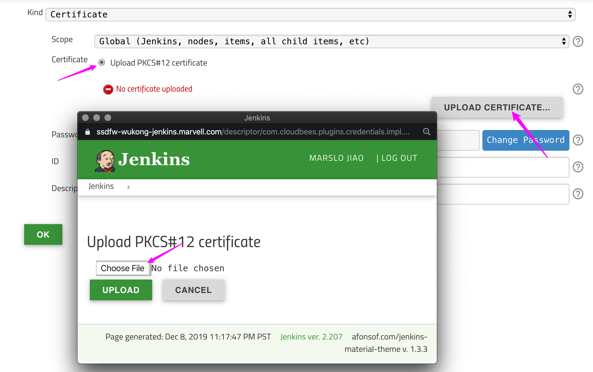
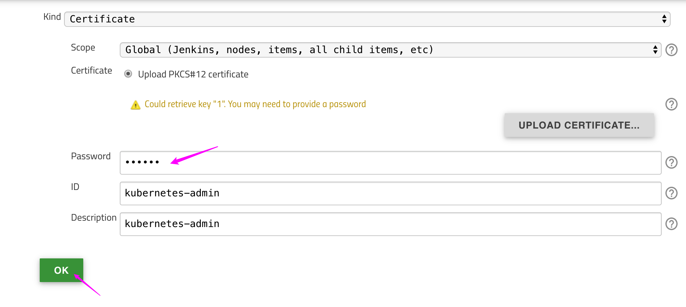

<!-- START doctoc generated TOC please keep comment here to allow auto update -->
<!-- DON'T EDIT THIS SECTION, INSTEAD RE-RUN doctoc TO UPDATE -->
**Table of Contents**  *generated with [DocToc](https://github.com/thlorenz/doctoc)*

- [generate credentials for pfx](#generate-credentials-for-pfx)
- [full steps](#full-steps)
- [configure in jenkins](#configure-in-jenkins)
- [using kubeconfig for remote cluster credential](#using-kubeconfig-for-remote-cluster-credential)
- [Q&A](#qa)

<!-- END doctoc generated TOC please keep comment here to allow auto update -->

### generate credentials for pfx
#### ca.crt
```bash
$ grep certificate-authority-data ~/.kube/config | awk -F': ' '{print $NF}' |  base64 -d > ca.crt
# OR
$ sudo cat /etc/kubernetes/pki/ca.crt
```

#### client.crt & client.key
```bash
$ grep client-certificate-data ~/.kube/config | awk -F': ' '{print $NF}' |  base64 -d > client.crt
$ grep client-key-data ~/.kube/config | awk -F': ' '{print $NF}' |  base64 -d > client.key
```

#### cert.pfx
```bash
$ openssl pkcs12 -export -out cert.pfx -inkey client.key -in client.crt -certfile ca.crt
Enter Export Password:
Verifying - Enter Export Password:

$ ls
ca.crt  cert.pfx  client.crt  client.key

# or

# using password 'marslo'
$ openssl pkcs12 -export -out cert.pfx -inkey client.key -in client.crt -certfile ca.crt -password pass:marslo
```

### full steps
```bash
$ cat ~/.kube/config \
      | grep certificate-authority-data \
      | awk '{print $2}' \
      | base64 -d > ca.crt
$ cat ~/.kube/config \
      | grep client-certificate-data \
      | awk '{print $2}' \
      | base64 -d > client.crt
$ cat ~/.kube/config \
      | grep client-key-data \
      | awk '{print $2}' \
      | base64 -d > client.key
$ openssl pkcs12 -export \
                 -out cert.pfx \
                 -in client.crt \
                 -inkey client.key \
                 -certfile ca.crt \
                 -password pass:devops
```

### configure in jenkins
* Go to `Manage Jenkins` -> `Configure System` or `Manage Jenkins` -> `Manage Nodes and Clouds` -> `Configure Clouds`
* `Add a new Cloud` -> `Kuberentes`
    * `Name`: <Anything you want>
    * `Kubernetes URL`:
        * get from `$ kubectl cluster-info`
        * using `https://kubernetes.default.svc.cluster.local`
    * `Kubernetes server certificate key`: content of `ca.crt`. (`$ cat ca.crt`)
    * `Credentials`:
        * `Add` -> `Jenkins`
        * **Kind**: `Certificate`







* Setup in Jenkins


### using kubeconfig for remote cluster credential
> reference:
> - [jenkinsci/kubernetes-cli-plugin](https://github.com/jenkinsci/kubernetes-cli-plugin/blob/master/README.md#using-the-plugin-from-the-web-interface)
> - [Kubernetes Plugin: Authenticate with a ServiceAccount to a remote cluster](https://support.cloudbees.com/hc/en-us/articles/360038636511-Kubernetes-Plugin-Authenticate-with-a-ServiceAccount-to-a-remote-cluster)
> - [Creating a kubeconfig file for a self-hosted Kubernetes cluster](http://docs.shippable.com/deploy/tutorial/create-kubeconfig-for-self-hosted-kubernetes-cluster/)
> - [How to find your Jenkins admin password on Kubernetes](https://opensource.com/article/19/6/jenkins-admin-password-helm-kubernetes)

#### get Kubernetes URL
```bash
$ k config view --minify | sed -n -re 's/^.*server: (https.*)$/\1/p'
```

- [or](https://gist.github.com/miry/9fbb8947510294c25285bda2a6e11900#gistcomment-2952487)
  ```bash
  $ k config view --minify --raw --output 'jsonpath={..cluster.server}'
  ```

#### generate CA
```bash
$ k -n devops get secret \
              $(k -n devops get sa jenkins-admin -o jsonpath={.secrets[0].name}) \
              -o jsonpath={.data.'ca\.crt'} \
              | base64 --decode
```
- or
  ```bash
  $ cat ~/.kube/config \
        | grep certificate-authority-data \
        | awk '{print $2}' \
        | base64 -d > ca.crt
  ```

#### Generate token in kubernetes

```bash
$ namespace='devops'
$ serviceAccount='jenkins-admin'
$ alias k='kubectl'
```


- setup sa
  ```bash
  $ k -n devops create sa jenkins-admin
  $ k -n devops create rolebinding jenkins-admin-binding \
                       --clusterrole=cluster-admin \
                       --serviceaccount=devops:jenkins-admin
  ```
- get token
  
  ```bash
  $ k -n devops \
         get sa jenkins-admin \
         -o go-template \
         --template='{{range .secrets}}{{.name}}{{"\n"}}{{end}}'
  jenkins-admin-token-kshsh

  $ k -n devops \
         get secrets jenkins-admin-token-kshsh \
         -o go-template \
         --template '{{index .data "token"}}' \
         | base64 -d
  eyJhbGciOiJSUzI1NiIsImtpZCI6IiJ9.***
  ```
  

  more info
  ```bash
  $ k get secret -n devops
  NAME                        TYPE                                  DATA   AGE
  jenkins-admin-token-kshsh   kubernetes.io/service-account-token   3      68m

  $ k -n devops get rolebinding
  NAME                            AGE
  jenkins-admin-binding   68m
  $ k -n devops describe rolebinding jenkins-admin-binding
  Name:         jenkins-admin-binding
  Labels:       <none>
  Annotations:  <none>
  Role:
    Kind:  ClusterRole
    Name:  cluster-admin
  Subjects:
    Kind            Name           Namespace
    ----            ----           ---------
    ServiceAccount  jenkins-admin  devops
  ```

  - [or](https://support.cloudbees.com/hc/en-us/articles/360038636511-Kubernetes-Plugin-Authenticate-with-a-ServiceAccount-to-a-remote-cluster)
    ```bash
    $ k -n devops \
        get secret \
        $(k -n devops get sa jenkins-admin -o jsonpath={.secrets[0].name}) \
        -o jsonpath={.data.token} \
        | base64 --decode
    ```
  - [or](https://stackoverflow.com/a/48853727/2940319)
  
  ```bash
  $ k get -n devops \
          sa jenkins-admin \
          --template='{{range .secrets}}{{ .name }} {{end}}' \
          | xargs -n 1 k -n devops get secret \
                         --template='{{ if .data.token }}{{ .data.token }}{{end}}' \
                         | head -n 1 \
                         | base64 -d -
  ```
  

#### setup in Jenkins
- credential setup


- cloud setup


### Q&A
- [Kubernetes agents are failing with `SocketTimeoutException: connect timed out`](https://support.cloudbees.com/hc/en-us/articles/360038066231-Kubernetes-agents-are-failing-with-SocketTimeoutException-connect-timed-out-)
