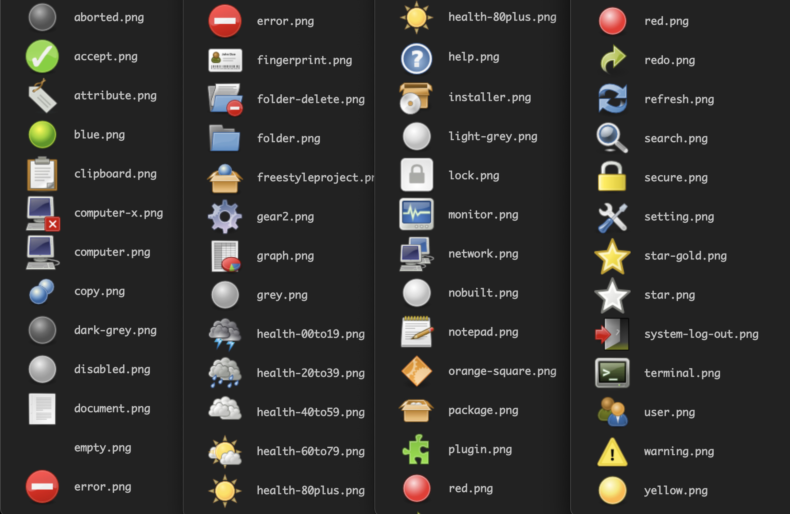
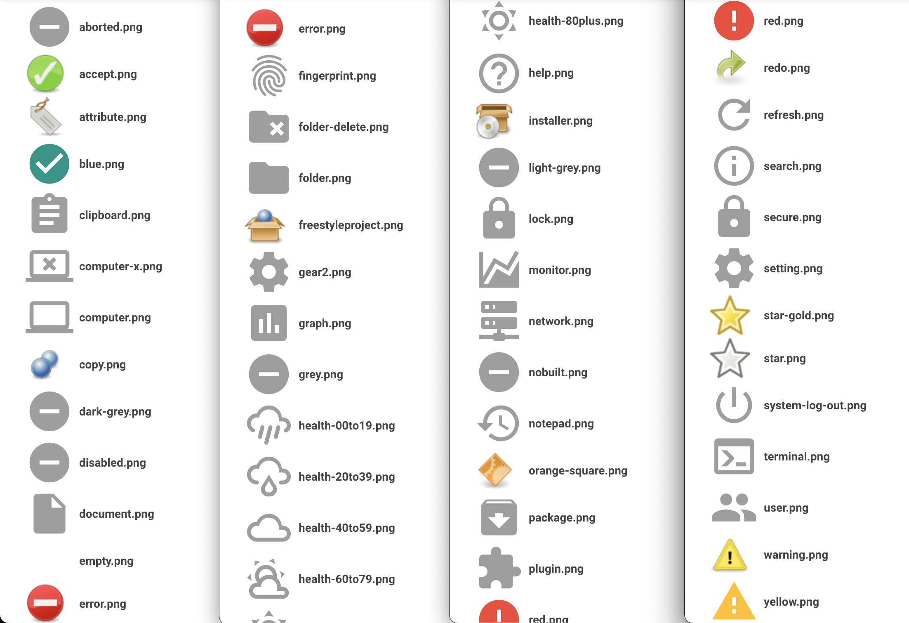

<!-- START doctoc generated TOC please keep comment here to allow auto update -->
<!-- DON'T EDIT THIS SECTION, INSTEAD RE-RUN doctoc TO UPDATE -->
**Table of Contents**  *generated with [DocToc](https://github.com/thlorenz/doctoc)*

- [Groovy Postbuild Plugin](#groovy-postbuild-plugin)
  - [setup badge](#setup-badge)

<!-- END doctoc generated TOC please keep comment here to allow auto update -->


## [Groovy Postbuild Plugin](https://github.com/jenkinsci/groovy-postbuild-plugin)
> [badge-plugin](https://github.com/jenkinsci/badge-plugin/blob/master/README.md)

### setup badge
#### setup badge from another plugins
```groovy
manager.addBadge("/plugin/artifactory/images/artifactory-promote.png", "promoted")
```
- how to find it


#### badge images
- to generate the images
  ```groovy
  String png = 'aborted accept attribute blue clipboard computer-x computer copy dark-grey disabled document empty error fingerprint folder-delete folder freestyleproject gear2 graph grey health-00to19 health-20to39 health-40to59 health-60to79 health-80plus help installer light-grey lock monitor network nobuilt notepad orange-square package plugin red redo refresh search secure setting star-gold star system-log-out terminal user warning yellow'
  png.split().each {
    manager.createSummary("${it}.png").appendText("<b><code>${it}.png</code></pre>")
  }
  ```

- dark theme


- [jenkins material theme](http://afonsof.com/jenkins-material-theme/)

