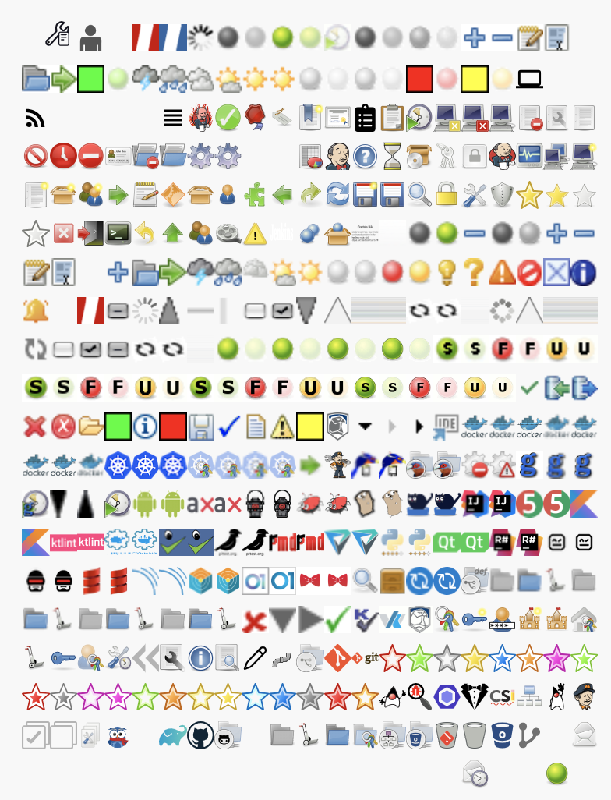

<!-- START doctoc generated TOC please keep comment here to allow auto update -->
<!-- DON'T EDIT THIS SECTION, INSTEAD RE-RUN doctoc TO UPDATE -->
**Table of Contents**  *generated with [DocToc](https://github.com/thlorenz/doctoc)*

- [setup badge](#setup-badge)
  - [setup badge from another plugins](#setup-badge-from-another-plugins)
  - [more on badges](#more-on-badges)
- [badge images](#badge-images)

<!-- END doctoc generated TOC please keep comment here to allow auto update -->

> [!NOTE|label:references:]
> - [Groovy Postbuild Plugin](https://github.com/jenkinsci/groovy-postbuild-plugin)
> - [badge-plugin](https://github.com/jenkinsci/badge-plugin/blob/master/README.md)

## setup badge
### setup badge from another plugins
```groovy
manager.addBadge( '/plugin/artifactory/images/artifactory-promote.png', 'promoted' )
```
- how to find it


### more on badges

> [!NOTE]
> ```groovy
> '/plugin/badge/images/completed.gif', '/plugin/badge/images/db_in.gif', '/plugin/badge/images/db_out.gif', '/plugin/badge/images/delete.gif', '/plugin/badge/images/error.gif', '/plugin/badge/images/folder.gif', '/plugin/badge/images/green.gif', '/plugin/badge/images/info.gif', '/plugin/badge/images/red.gif', '/plugin/badge/images/save.gif', '/plugin/badge/images/success.gif', '/plugin/badge/images/text.gif', '/plugin/badge/images/warning.gif', '/plugin/badge/images/yellow.gif'
> // same as
> 'completed.gif', 'db_in.gif', 'db_out.gif', 'delete.gif', 'error.gif', 'folder.gif', 'green.gif', 'info.gif', 'red.gif', 'save.gif', 'success.gif', 'text.gif', 'warning.gif', 'yellow.gif'
> ```

```groovy
showBadges( '/images/none.gif', '/images/progress-unknown-red.gif', '/images/progress-unknown.gif', '/images/spinner.gif', 'aborted.gif', 'aborted_anime.gif', 'blue.gif', 'blue_anime.gif', 'clock_anime.gif', 'dark-grey.gif', 'dark-grey_anime.gif', 'disabled.gif', 'disabled_anime.gif', 'document_add.gif', 'document_delete.gif', 'document_edit.gif', 'edit-select-all.gif', 'empty.gif', 'folder-open.gif', 'go-next.gif', 'green.gif', 'green_anime.gif', 'health-00to19.gif', 'health-20to39.gif', 'health-40to59.gif', 'health-60to79.gif', 'health-80plus.gif', 'health-80plus.gif', 'light-grey.gif', 'light-grey_anime.gif', 'nobuilt.gif', 'nobuilt_anime.gif', 'red.gif', 'red_anime.gif', 'yellow.gif', 'yellow_anime.gif' )
showBadges( '/images/material-icons/computer-24px.svg', '/images/material-icons/edit.svg', '/images/material-icons/feed.svg', '/images/material-icons/rss_feed-24px.svg', '/images/material-icons/svg-sprite-action-symbol.svg', '/images/material-icons/svg-sprite-content-symbol.svg', '/images/material-icons/svg-sprite-navigation-symbol.svg', '/images/material-icons/svg-sprite-social-symbol.svg', '/images/material-icons/view_headline-24px.svg', '/images/rage.svg', '/images/svgs/accept.svg', '/images/svgs/application-certificate.svg', '/images/svgs/attribute.svg', '/images/svgs/bookmark-new.svg', '/images/svgs/certificate.svg', '/images/svgs/clipboard-list-solid.svg', '/images/svgs/clipboard.svg', '/images/svgs/clock.svg', '/images/svgs/computer-user-offline.svg', '/images/svgs/computer-x.svg', '/images/svgs/computer.svg', '/images/svgs/delete-document.svg', '/images/svgs/document-properties.svg', '/images/svgs/document.svg', '/images/svgs/edit-delete.svg', '/images/svgs/emblem-urgent.svg', '/images/svgs/error.svg', '/images/svgs/fingerprint.svg', '/images/svgs/folder-delete.svg', '/images/svgs/folder.svg', '/images/svgs/gear.svg', '/images/svgs/gear2.svg', '/images/svgs/go-down.svg', '/images/svgs/go-up.svg', '/images/svgs/graph.svg', '/images/svgs/headshot.svg', '/images/svgs/help.svg', '/images/svgs/hourglass.svg', '/images/svgs/installer.svg', '/images/svgs/keys.svg', '/images/svgs/lock.svg', '/images/svgs/logo.svg', '/images/svgs/monitor.svg', '/images/svgs/network.svg', '/images/svgs/new-computer.svg', '/images/svgs/new-document.svg', '/images/svgs/new-package.svg', '/images/svgs/new-user.svg', '/images/svgs/next.svg', '/images/svgs/notepad.svg', '/images/svgs/orange-square.svg', '/images/svgs/package.svg', '/images/svgs/person.svg', '/images/svgs/plugin.svg', '/images/svgs/previous.svg', '/images/svgs/redo.svg', '/images/svgs/refresh.svg', '/images/svgs/save-new.svg', '/images/svgs/save.svg', '/images/svgs/search.svg', '/images/svgs/secure.svg', '/images/svgs/setting.svg', '/images/svgs/shield.svg', '/images/svgs/star-gold.svg', '/images/svgs/star-large-gold.svg', '/images/svgs/star-large.svg', '/images/svgs/star.svg', '/images/svgs/stop.svg', '/images/svgs/system-log-out.svg', '/images/svgs/terminal.svg', '/images/svgs/undo.svg', '/images/svgs/up.svg', '/images/svgs/user.svg', '/images/svgs/video.svg', '/images/svgs/warning.svg', '/images/title.svg' )
showBadges( '/images/48x48/copy.png', '/images/48x48/freestyleproject.png', '/images/headless.png', '/images/top-sticker-bottom-edge.png', 'aborted.png', 'blue.png', 'collapse.png', 'dark-grey.png', 'disabled.png', 'document_add.png', 'document_delete.png', 'document_edit.png', 'edit-select-all.png', 'empty.png', 'expand.png', 'folder-open.png', 'go-next.png', 'health-00to19.png', 'health-20to39.png', 'health-40to59.png', 'health-60to79.png', 'health-80plus.png', 'light-grey.png', 'nobuilt.png', 'red.png', 'yellow.png' )
showBadges( '/scripts/yui/container/assets/tip16_1.gif', '/scripts/yui/container/assets/hlp16_1.gif', '/scripts/yui/container/assets/warn16_1.gif', '/scripts/yui/container/assets/blck16_1.gif', '/scripts/yui/container/assets/close12_1.gif', '/scripts/yui/container/assets/info16_1.gif', '/scripts/yui/container/assets/alrt16_1.gif' )
showBadges( '/images/none.gif', '/images/progress-unknown-red.gif' )
showBadges( '/scripts/yui/assets/skins/sam/check2.gif', '/scripts/yui/assets/skins/sam/ajax-loader.gif', '/scripts/yui/assets/skins/sam/asc.gif', '/scripts/yui/assets/skins/sam/bg-h.gif', '/scripts/yui/assets/skins/sam/bg-v.gif', '/scripts/yui/assets/skins/sam/check0.gif', '/scripts/yui/assets/skins/sam/check1.gif', '/scripts/yui/assets/skins/sam/desc.gif', '/scripts/yui/assets/skins/sam/editor-knob.gif', '/scripts/yui/assets/skins/sam/editor-sprite-active.gif', '/scripts/yui/assets/skins/sam/editor-sprite.gif', '/scripts/yui/assets/skins/sam/loading.gif', '/scripts/yui/assets/skins/sam/treeview-loading.gif', '/scripts/yui/assets/skins/sam/treeview-sprite.gif', '/scripts/yui/assets/skins/sam/wait.gif', '/scripts/yui/editor/assets/skins/sam/editor-knob.gif', '/scripts/yui/editor/assets/skins/sam/editor-sprite-active.gif', '/scripts/yui/editor/assets/skins/sam/editor-sprite.gif', '/scripts/yui/tabview/assets/loading.gif', '/scripts/yui/treeview/assets/skins/sam/check0.gif', '/scripts/yui/treeview/assets/skins/sam/check1.gif', '/scripts/yui/treeview/assets/skins/sam/check2.gif', '/scripts/yui/treeview/assets/skins/sam/loading.gif', '/scripts/yui/treeview/assets/skins/sam/treeview-loading.gif', '/scripts/yui/treeview/assets/skins/sam/treeview-sprite.gif' )
showBadges( '/plugin/greenballs/16x16/green.gif', '/plugin/greenballs/16x16/green_anime.gif', '/plugin/greenballs/24x24/green.gif', '/plugin/greenballs/24x24/green_anime.gif', '/plugin/greenballs/32x32/green.gif', '/plugin/greenballs/32x32/green_anime.gif', '/plugin/greenballs/48x48/green.gif', '/plugin/greenballs/48x48/green_anime.gif', '/plugin/greenballs/colorblind/16x16/green.gif', '/plugin/greenballs/colorblind/16x16/green_anime.gif', '/plugin/greenballs/colorblind/16x16/red.gif', '/plugin/greenballs/colorblind/16x16/red_anime.gif', '/plugin/greenballs/colorblind/16x16/yellow.gif', '/plugin/greenballs/colorblind/16x16/yellow_anime.gif', '/plugin/greenballs/colorblind/24x24/green.gif', '/plugin/greenballs/colorblind/24x24/green_anime.gif', '/plugin/greenballs/colorblind/24x24/red.gif', '/plugin/greenballs/colorblind/24x24/red_anime.gif', '/plugin/greenballs/colorblind/24x24/yellow.gif', '/plugin/greenballs/colorblind/24x24/yellow_anime.gif', '/plugin/greenballs/colorblind/32x32/green.gif', '/plugin/greenballs/colorblind/32x32/green_anime.gif', '/plugin/greenballs/colorblind/32x32/red.gif', '/plugin/greenballs/colorblind/32x32/red_anime.gif', '/plugin/greenballs/colorblind/32x32/yellow.gif', '/plugin/greenballs/colorblind/32x32/yellow_anime.gif', '/plugin/greenballs/colorblind/48x48/green.gif', '/plugin/greenballs/colorblind/48x48/green_anime.gif', '/plugin/greenballs/colorblind/48x48/red.gif', '/plugin/greenballs/colorblind/48x48/red_anime.gif', '/plugin/greenballs/colorblind/48x48/yellow.gif', '/plugin/greenballs/colorblind/48x48/yellow_anime.gif' )
showBadges( '/plugin/badge/images/completed.gif', '/plugin/badge/images/db_in.gif', '/plugin/badge/images/db_out.gif', '/plugin/badge/images/delete.gif', '/plugin/badge/images/error.gif', '/plugin/badge/images/folder.gif', '/plugin/badge/images/green.gif', '/plugin/badge/images/info.gif', '/plugin/badge/images/red.gif', '/plugin/badge/images/save.gif', '/plugin/badge/images/success.gif', '/plugin/badge/images/text.gif', '/plugin/badge/images/warning.gif', '/plugin/badge/images/yellow.gif' )
showBadges( '/plugin/klocwork/images/logo.png', '/plugin/klocwork/images/menu_down_arrow.png', '/plugin/klocwork/images/menu_right_arrow.png', '/plugin/klocwork/images/menu_right_arrow_hover.png', '/plugin/klocwork/images/openInIde.png', '/plugin/docker-commons/images/32x32/docker.png', '/plugin/docker-commons/images/24x24/docker.png', '/plugin/docker-commons/images/48x48/docker.png', '/plugin/docker-commons/images/16x16/docker.png', '/plugin/docker-commons/images/24x24/docker.png', '/plugin/docker-commons/images/32x32/docker.png', '/plugin/docker-commons/images/48x48/docker.png', '/plugin/docker-commons/images/16x16/docker.png', '/plugin/kubernetes/images/32x32/kubernetes.png', '/plugin/kubernetes/images/48x48/kubernetes.png', '/plugin/kubernetes/images/24x24/kubernetes.png', '/plugin/kubernetes-credentials-provider/images/48x48/kubernetes-store.png', '/plugin/kubernetes-credentials-provider/images/24x24/kubernetes-store.png', '/plugin/kubernetes-credentials-provider/images/16x16/kubernetes-store.png', '/plugin/kubernetes-credentials-provider/images/32x32/kubernetes-store.png' )
showBadges( '/plugin/code-coverage-api/images/tab.png', '/plugin/configuration-as-code/img/logo.png' )
showBadges( '/plugin/gerrit-code-review/icons/gerrit-logo-16x16.png', '/plugin/gerrit-code-review/icons/gerrit-logo-24x24.png', '/plugin/gerrit-code-review/icons/gerrit-logo-32x32.png', '/plugin/gerrit-code-review/icons/gerrit-logo-48x48.png', '/plugin/gerrit-trigger/images/24x24/gear-error.png', '/plugin/gerrit-trigger/images/24x24/gear-warning.png', '/plugin/gerrit-trigger/images/icon.png', '/plugin/gerrit-trigger/images/icon16.png', '/plugin/gerrit-trigger/images/icon24.png', '/plugin/gerrit-trigger/images/icon_retrigger24.png', '/plugin/gerrit-trigger/js/yui/datatable/assets/skins/sam/dt-arrow-dn.png', '/plugin/gerrit-trigger/js/yui/datatable/assets/skins/sam/dt-arrow-up.png' )
showBadges( '/plugin/rebuild/images/clock-48x48.png' )
showBadges( '/plugin/warnings-ng/icons/android-lint-24x24.png', '/plugin/warnings-ng/icons/android-lint-48x48.png', '/plugin/warnings-ng/icons/axivion-24x24.png', '/plugin/warnings-ng/icons/axivion-48x48.png', '/plugin/warnings-ng/icons/brakeman-24x24.png', '/plugin/warnings-ng/icons/brakeman-48x48.png', '/plugin/warnings-ng/icons/findbugs-24x24.png', '/plugin/warnings-ng/icons/findbugs-48x48.png', '/plugin/warnings-ng/icons/golint-24x24.png', '/plugin/warnings-ng/icons/golint-48x48.png', '/plugin/warnings-ng/icons/hadolint-24x24.png', '/plugin/warnings-ng/icons/hadolint-48x48.png', '/plugin/warnings-ng/icons/idea-24x24.png', '/plugin/warnings-ng/icons/idea-48x48.png', '/plugin/warnings-ng/icons/junit-24x24.png', '/plugin/warnings-ng/icons/junit-48x48.png', '/plugin/warnings-ng/icons/kotlin-24x24.png', '/plugin/warnings-ng/icons/kotlin-48x48.png', '/plugin/warnings-ng/icons/ktlint-24x24.png', '/plugin/warnings-ng/icons/ktlint-48x48.png', '/plugin/warnings-ng/icons/ot-docker-linter-24x24.png', '/plugin/warnings-ng/icons/ot-docker-linter-48x48.png', '/plugin/warnings-ng/icons/phpstan-24x24.png', '/plugin/warnings-ng/icons/phpstan-48x48.png', '/plugin/warnings-ng/icons/pit-24x24.png', '/plugin/warnings-ng/icons/pit-48x48.png', '/plugin/warnings-ng/icons/pmd-24x24.png', '/plugin/warnings-ng/icons/pmd-48x48.png', '/plugin/warnings-ng/icons/pvs-24x24.png', '/plugin/warnings-ng/icons/pvs-48x48.png', '/plugin/warnings-ng/icons/pylint-24x24.png', '/plugin/warnings-ng/icons/pylint-48x48.png', '/plugin/warnings-ng/icons/qt-24x24.png', '/plugin/warnings-ng/icons/qt-48x48.png', '/plugin/warnings-ng/icons/resharper-24x24.png', '/plugin/warnings-ng/icons/resharper-48x48.png', '/plugin/warnings-ng/icons/robot-framework-24x24.png', '/plugin/warnings-ng/icons/robot-framework-48x48.png', '/plugin/warnings-ng/icons/rubocop-24x24.png', '/plugin/warnings-ng/icons/rubocop-48x48.png', '/plugin/warnings-ng/icons/scala-24x24.png', '/plugin/warnings-ng/icons/scala-48x48.png', '/plugin/warnings-ng/icons/sonar-24x24.png', '/plugin/warnings-ng/icons/sonar-48x48.png', '/plugin/warnings-ng/icons/trivy-24x24.png', '/plugin/warnings-ng/icons/trivy-48x48.png', '/plugin/warnings-ng/icons/veracode-24x24.png', '/plugin/warnings-ng/icons/veracode-48x48.png' )
showBadges( '/plugin/pipeline-timeline/favicon.png', '/plugin/pipeline-timeline/jenkins_assets/logo_sidepanel.png', '/plugin/scm-api/test-avatar.png', '/plugin/shelve-project-plugin/icons/shelve-project-icon.png' )
showBadges( '/plugin/pipeline-model-definition/images/24x24/restart-stage.png', '/plugin/pipeline-model-definition/images/48x48/restart-stage.png', '/plugin/pipeline-multibranch-defaults/images/48x48/pipelinemultibranchdefaultsproject.png' )
showBadges( '/plugin/cloudbees-folder/images/16x16/folder-disabled.png', '/plugin/cloudbees-folder/images/16x16/folder.png', '/plugin/cloudbees-folder/images/16x16/move.png', '/plugin/cloudbees-folder/images/24x24/folder-disabled.png', '/plugin/cloudbees-folder/images/24x24/folder.png', '/plugin/cloudbees-folder/images/24x24/move.png', '/plugin/cloudbees-folder/images/32x32/folder-disabled.png', '/plugin/cloudbees-folder/images/32x32/folder.png', '/plugin/cloudbees-folder/images/32x32/move.png', '/plugin/cloudbees-folder/images/48x48/folder-disabled.png', '/plugin/cloudbees-folder/images/48x48/folder.png', '/plugin/cloudbees-folder/images/48x48/move.png' )
showBadges( '/plugin/gerrit-trigger/images/x.gif', '/plugin/gerrit-trigger/images/expanded.gif', '/plugin/gerrit-trigger/images/collapsed.gif', '/plugin/gerrit-trigger/images/v.gif' )
showBadges( '/plugin/klocwork/icons/klocwork-16.gif', '/plugin/klocwork/icons/klocwork-24.gif', '/plugin/klocwork/icons/klocwork-48.gif' )
showBadges( '/plugin/credentials/images/credentials.svg', '/plugin/credentials/images/new-credential.svg', '/plugin/credentials/images/userpass.svg', '/plugin/credentials/images/new-domain.svg', '/plugin/credentials/images/domain.svg', '/plugin/credentials/images/system-store.svg', '/plugin/credentials/images/move.svg', '/plugin/credentials/images/credential.svg', '/plugin/credentials/images/user-store.svg' )
showBadges( '/plugin/jobConfigHistory/img/confighistory.svg', '/plugin/jobConfigHistory/img/restore.svg', '/plugin/jobConfigHistory/img/buildbadge.svg', '/plugin/jobConfigHistory/img/info.svg', '/plugin/jobConfigHistory/img/filter.svg' )
showBadges( '/plugin/role-strategy/images/pencil.svg', '/plugin/workflow-job/images/pipelinejob.svg', '/plugin/workflow-multibranch/images/pipelinemultibranchproject.svg', '/plugin/git/icons/git-icon.svg', '/plugin/git/icons/git-logo.svg' )
showBadges( '/plugin/promoted-builds/icons/star-red-e.svg', '/plugin/promoted-builds/icons/star-green.svg', '/plugin/promoted-builds/icons/star-silver-e.svg', '/plugin/promoted-builds/icons/star-gold.svg', '/plugin/promoted-builds/icons/star-blue-w.svg', '/plugin/promoted-builds/icons/star-orange-w.svg', '/plugin/promoted-builds/icons/star-purple.svg', '/plugin/promoted-builds/icons/star-green-w.svg', '/plugin/promoted-builds/icons/star-red-w.svg', '/plugin/promoted-builds/icons/star-silver-w.svg', '/plugin/promoted-builds/icons/star-purple-e.svg', '/plugin/promoted-builds/icons/star-purple-w.svg', '/plugin/promoted-builds/icons/star-green-e.svg', '/plugin/promoted-builds/icons/star-orange.svg', '/plugin/promoted-builds/icons/star-gold-e.svg', '/plugin/promoted-builds/icons/star-gold-w.svg', '/plugin/promoted-builds/icons/star-blue-e.svg', '/plugin/promoted-builds/icons/star-blue.svg', '/plugin/promoted-builds/icons/star-silver.svg', '/plugin/promoted-builds/icons/star-red.svg', '/plugin/promoted-builds/icons/star-orange-e.svg' )
showBadges( '/plugin/warnings-ng/icons/java.svg', '/plugin/warnings-ng/icons/spotbugs.svg', '/plugin/warnings-ng/icons/eslint.svg', '/plugin/warnings-ng/icons/stylelint.svg', '/plugin/warnings-ng/icons/checkstyle.svg' )
showBadges( '/plugin/job-dsl/images/directory.svg', '/plugin/javadoc/icons/javadoc.svg', '/plugin/configuration-as-code/img/logo-head.svg', '/plugin/matrix-auth/images/select-all.svg', '/plugin/matrix-auth/images/unselect-all.svg', '/plugin/matrix-project/images/matrixproject.svg', '/plugin/maven-plugin/images/mavenmoduleset.svg' )
showBadges( '/plugin/pipeline-stage-view/fonts/glyphicons-halflings-regular.svg', '/plugin/gradle/images/svgs/gradle-build-scan.svg', '/plugin/github-branch-source/images/svgs/github-logo.svg', '/plugin/github-branch-source/images/svgs/github-scmnavigator.svg', '/plugin/github-branch-source/images/svgs/sprite-github.svg' )
showBadges( '/plugin/cloudbees-folder/images/svgs/folder-disabled.svg', '/plugin/cloudbees-folder/images/svgs/move.svg', '/plugin/cloudbees-folder/images/svgs/folder.svg', '/plugin/cloudbees-folder/images/svgs/folder-store.svg' )
showBadges( '/plugin/branch-api/images/organization-folder.svg' )
showBadges( '/plugin/cloudbees-bitbucket-branch-source/images/bitbucket-scmnavigator.svg', '/plugin/cloudbees-bitbucket-branch-source/images/bitbucket-repository-git.svg', '/plugin/cloudbees-bitbucket-branch-source/images/bitbucket-repository.svg', '/plugin/cloudbees-bitbucket-branch-source/images/bitbucket-logo.svg', '/plugin/cloudbees-bitbucket-branch-source/images/bitbucket-branch.svg' )
showBadges( '/plugin/pipeline-stage-view/jsmodules/glyphicons-halflings-regular.e72c5eba.svg','/plugin/email-ext/images/template-debugger.svg', '/plugin/email-ext/images/add-watch.svg', '/plugin/extended-choice-parameter/fonts/glyphicons-halflings-regular.svg', '/plugin/extended-choice-parameter/fonts/foundation-icons.svg', '/plugin/greenballs/green.svg', '/plugin/job-dsl/api-viewer/glyphicons-halflings-regular.060b2710bdbbe3dfe48b.svg' )

def showBadges( String... badges ) {
  // (0..30).each { manager.addBadge( 'empty.png', 'empty.png' ) }
  badges.each { manager.addBadge( it, it ) }
}
```



## badge images
- to generate the images
  ```groovy
  String png = 'aborted accept attribute blue clipboard computer-x computer copy dark-grey disabled document empty error fingerprint folder-delete folder freestyleproject gear2 graph grey health-00to19 health-20to39 health-40to59 health-60to79 health-80plus help installer light-grey lock monitor network nobuilt notepad orange-square package plugin red redo refresh search secure setting star-gold star system-log-out terminal user warning yellow'
  png.split().each {
    manager.createSummary("${it}.png").appendText("<b><code>${it}.png</code></pre>")
  }
  ```

- dark theme


- [jenkins material theme](http://afonsof.com/jenkins-material-theme/)

